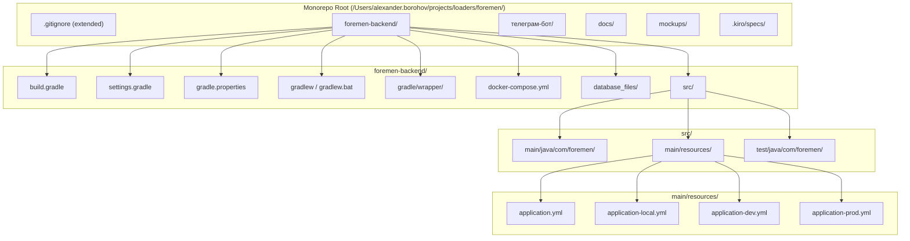
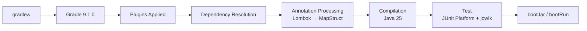

# Design Document: Gradle Project Initialization (FOR-01-01-gradle)

## Overview

This design covers the initialization of the Foremen backend as a Gradle project using Groovy DSL, configured for Spring Boot 4.0.x (released November 2025, built on Spring Framework 7.0). The project targets Java 25 and resides in the `foremen-backend/` subdirectory of the monorepo at `/Users/alexander.borohov/projects/loaders/foremen/`.

The design establishes:
- Build configuration with all required plugins and dependencies
- Application entry point with Spring Boot auto-configuration
- Profile-based YAML configuration for local/dev/prod environments
- Docker Compose for local PostgreSQL 16
- Gradle wrapper pinned to version 9.1.0 (first-class Java 25 support for daemon and toolchains)
- Liquibase integration for database migrations
- Monorepo-aware `.gitignore` updates

### Key Research Findings

| Topic | Finding | Source |
|-------|---------|--------|
| Spring Boot 4.0 | GA released Nov 20, 2025. Requires Jakarta EE 11 (Servlet 6.1). Supports Gradle 8.14+ and 9.x | [spring.io](https://spring.io/blog/2025/11/20/spring-boot-4-0-0-available-now) |
| Gradle version | Gradle 9.1.0 released 2025-09-18. First-class Java 25 support (daemon + toolchains). No `--add-opens` workaround needed. Spring Boot 4.0 fully compatible | [gradle.org](https://docs.gradle.org/9.1.0/release-notes.html) |
| io.freefair.lombok | Version 9.1.0 (released 2025-11-08) aligns with Gradle 9.1.0. Latest available: 9.5.0 (2026-04-28). Uses Lombok 1.18.46 internally | [GitHub releases](https://github.com/freefair/gradle-plugins/releases) |
| MapStruct | Latest stable: 1.6.3 (Nov 2024). Next: 1.7.0.Beta2 (June 2026, still beta). Use 1.6.3 for production stability | [mapstruct.org](https://mapstruct.org/) |
| SpringDoc OpenAPI | v2.x supports Spring Boot 3.x and 4.x with `springdoc-openapi-starter-webmvc-ui` | [springdoc.org](https://springdoc.org/) |
| Liquibase Gradle Plugin | Latest: 3.1.0 (Dec 2025). Uses CommandScope API (requires Liquibase 4.24+) | [plugins.gradle.org](https://plugins.gradle.org/plugin/org.liquibase.gradle/3.0.2) |
| jqwik | Version 1.9.x for property-based testing on JUnit Platform. Note: jqwik >= 1.10 is not recommended for use with coding agents | [GitHub releases](https://github.com/jlink/jqwik/releases) |

## Architecture

The backend project follows a standard Spring Boot single-module Gradle layout within the monorepo:



### Build Pipeline Flow



## Components and Interfaces

### 1. Build Configuration (`build.gradle`)

The central build file declares plugins, dependencies, and task configuration:

**Plugins:**
- `java` — Java compilation support
- `org.springframework.boot` (4.x) — Spring Boot packaging, bootRun, bootJar
- `io.spring.dependency-management` — BOM-based transitive dependency management
- `io.freefair.lombok` (9.1.0) — Lombok annotation processing without manual annotation processor config
- `org.liquibase.gradle` (3.1.0) — Liquibase CLI tasks (update, rollback, diff)

**Dependency Scopes:**
- `implementation` — runtime and compile dependencies (starters, MapStruct, SpringDoc, Caffeine, Liquibase core)
- `runtimeOnly` — PostgreSQL JDBC driver
- `annotationProcessor` — MapStruct processor (Lombok handled by plugin)
- `testImplementation` — Spring Boot Test, jqwik
- `liquibaseRuntime` — Liquibase CLI runtime classpath

### 2. Settings File (`settings.gradle`)

Configures plugin repositories and project name:
- `pluginManagement` block with `mavenCentral()` and Spring Milestones repo (`https://repo.spring.io/milestone`)
- `rootProject.name = 'foremen-backend'`

### 3. Properties File (`gradle.properties`)

Externalizes version variables:
- `mapstructVersion=1.6.3`
- Any other versions that need to be shared across build files

### 4. Application Entry Point (`ForemenApplication.java`)

Minimal Spring Boot main class:
- Package: `com.foremen`
- Annotation: `@SpringBootApplication`
- Method: `public static void main(String[] args)`

### 5. Profile Configuration (YAML files)

| File | Purpose | Key Settings |
|------|---------|--------------|
| `application.yml` | Base/shared config | server.port=8080, active profile=local, liquibase changelog, springdoc path |
| `application-local.yml` | Local development | datasource pointing to localhost:5432/foremen |
| `application-dev.yml` | Dev environment | Placeholder for dev database URL |
| `application-prod.yml` | Production | Placeholder for production settings |

### 6. Docker Compose (`docker-compose.yml`)

Single-service Compose file for local PostgreSQL:
- Image: `postgres:16`
- Port mapping: `5432:5432`
- Environment: `POSTGRES_DB=foremen`, `POSTGRES_USER=foremen`, `POSTGRES_PASSWORD=foremen`
- Named volume for data persistence
- Healthcheck via `pg_isready`

### 7. Gradle Wrapper

Standard Gradle wrapper distribution:
- `gradlew` (Unix executable)
- `gradlew.bat` (Windows batch)
- `gradle/wrapper/gradle-wrapper.jar`
- `gradle/wrapper/gradle-wrapper.properties` (pins version)
- Wrapper task in `build.gradle` specifying target version

### 8. Liquibase Integration

- Gradle plugin provides `liquibase` DSL block
- `liquibaseRuntime` configuration includes `liquibase-core`, `liquibase-groovy-dsl`, and PostgreSQL driver
- `main` activity configured with changelog path and local DB URL
- `processResources` extended to copy `database_files/` into classpath
- Empty `database_files/changelog.xml` as initial placeholder

### 9. `.gitignore` Updates

Additions to the existing root `.gitignore`:
- Gradle artifacts: `foremen-backend/build/`, `foremen-backend/.gradle/`
- Java artifacts: `*.class`, `*.jar` (with negation for `gradle-wrapper.jar`)
- IDE files: `.idea/`, `*.iml`
- Local secrets: `foremen-backend/src/main/resources/application-local.yml`

## Data Models

This spec does not introduce runtime data models. The relevant "data" is the set of configuration files themselves:

### Build Configuration Model

```
build.gradle
├── plugins { }           → Plugin declarations with versions
├── group / version       → Maven coordinates
├── java { }              → sourceCompatibility, targetCompatibility
├── dependencies { }      → All dependency declarations
├── compileJava.options   → MapStruct compiler arguments
├── test { }              → useJUnitPlatform()
├── liquibase { }         → Activity configuration
├── processResources { }  → Copy database_files
└── wrapper { }           → Gradle version pin
```

### Application Configuration Model (YAML)

```yaml
# application.yml structure
spring:
  profiles.active: local
  liquibase:
    change-log: classpath:database_files/changelog.xml
server:
  port: 8080
springdoc:
  api-docs:
    path: /api-docs
```

## Error Handling

Since this is a project initialization spec, error handling is limited to build-time failures:

| Scenario | Handling |
|----------|----------|
| Missing PostgreSQL on `bootRun` | Spring Boot fails to start with clear datasource connection error. Docker Compose provides the fix. |
| Incompatible Java version | Gradle reports `sourceCompatibility` mismatch at compile time |
| Missing Gradle wrapper JAR | Users see "Gradle wrapper not found" — fixed by running `gradle wrapper` |
| Annotation processor ordering conflict | Lombok must precede MapStruct in `annotationProcessor` config to ensure `@Builder`/`@Data` are processed before mapper generation |
| Liquibase changelog not found | Application startup fails with descriptive error pointing to missing `changelog.xml` |

## Testing Strategy

### Why Property-Based Testing Does NOT Apply

This feature is entirely **Infrastructure as Code and project configuration**:
- Gradle build files are declarative configuration, not functions with inputs/outputs
- Docker Compose is infrastructure definition
- YAML configuration files have no logic to test
- The Gradle wrapper is a binary distribution tool

There are no pure functions, data transformations, or business logic that would benefit from property-based testing. There is no meaningful "for all inputs X, property P(X) holds" statement possible for this feature.

### Recommended Testing Approach

**1. Smoke Tests (Build Verification)**
- `./gradlew build` compiles successfully
- `./gradlew bootRun` starts the application (with Docker Compose running)
- `./gradlew test` runs the test suite (initially empty, passes)

**2. Configuration Validation**
- Verify `build.gradle` declares all required dependencies (manual review / CI script)
- Verify `settings.gradle` configures plugin repositories correctly
- Verify `gradle-wrapper.properties` pins the expected Gradle version

**3. Integration Tests (Post-Setup)**
- Application context loads (`@SpringBootTest` contextLoads test)
- Actuator health endpoint responds on `/actuator/health`
- SpringDoc UI accessible at `/swagger-ui.html`

**4. Docker Compose Verification**
- `docker compose up` starts PostgreSQL successfully
- Application connects to the local database
- Liquibase runs the initial (empty) changelog without errors

### Initial Test File

A single `ForemenApplicationTests.java` will be created in `src/test/java/com/foremen/` with:
- `@SpringBootTest` context loads test
- Serves as the foundation for all subsequent test specs
