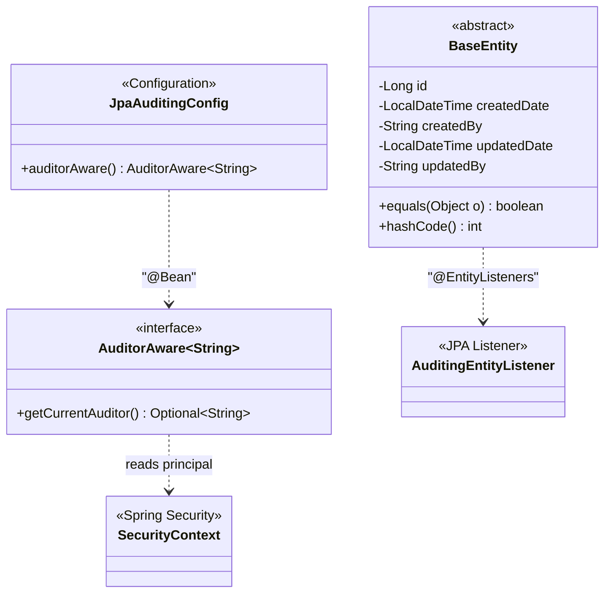
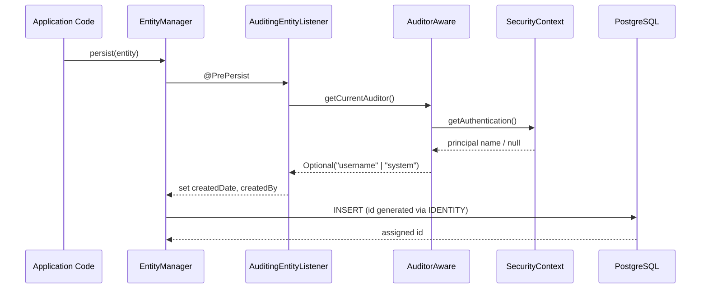
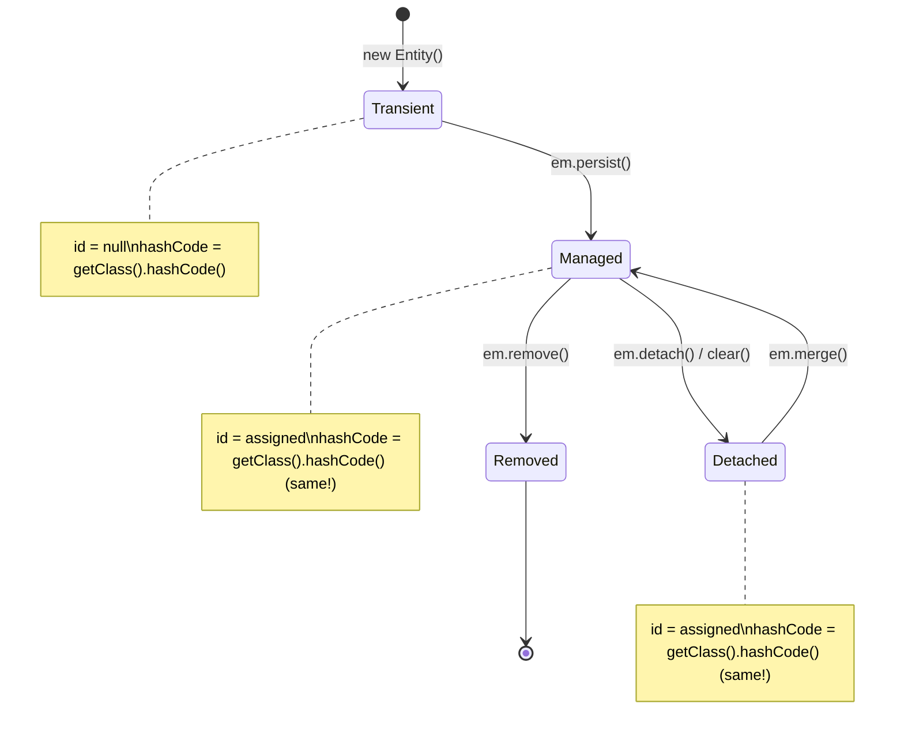

# Design Document: BaseEntity and JPA Auditing (FOR-01-02-base-entity)

## Overview

This design covers the foundational `BaseEntity` mapped superclass and the JPA auditing infrastructure required to support it. Every domain entity in the Foremen system will extend `BaseEntity`, inheriting:

- Auto-generated `Long` primary key (PostgreSQL IDENTITY / BIGSERIAL)
- Creation audit fields (`createdDate`, `createdBy`)
- Modification audit fields (`updatedDate`, `updatedBy`)
- Consistent equals/hashCode based on the Vlad Mihalcea JPA identity pattern

The design also covers `JpaAuditingConfig` — a Spring configuration class that enables `@EnableJpaAuditing` and provides an `AuditorAware<String>` bean reading the current principal from Spring Security context.

### Key Design Decisions

| Decision | Rationale |
|----------|-----------|
| `@MappedSuperclass` (not `@Entity` + `@Inheritance`) | No separate table for BaseEntity; fields are inlined into each child entity table. Avoids JOIN overhead and keeps the schema flat. |
| `GenerationType.IDENTITY` | Maps directly to PostgreSQL `BIGSERIAL`. Simple, no sequence management. Acceptable trade-off: batch inserts require individual round-trips (not a concern at current scale). |
| Constant `hashCode()` (Vlad Mihalcea pattern) | Ensures entities work correctly in `Set`/`Map` across JPA state transitions (transient → managed → detached). Trade-off: slight performance hit on large hash-based collections, mitigated by small collection sizes in practice. |
| `AuditorAware` reading SecurityContext | Decouples audit trail from controllers. Works automatically for any persistence operation within a security-authenticated request. Falls back to `"system"` for background jobs / migrations. |
| Spring Boot default naming strategy | `CamelCaseToUnderscoresNamingStrategy` converts Java field names to PostgreSQL snake_case columns automatically — no explicit `@Column(name=...)` needed on standard fields. |

### Research Findings

| Topic | Finding |
|-------|---------|
| Spring Boot 4 JPA Auditing | `@EnableJpaAuditing` is in `org.springframework.data.jpa.repository.config`. Works with `@EntityListeners(AuditingEntityListener.class)`. No breaking changes from Boot 3 → 4 for this feature. |
| Vlad Mihalcea equals/hashCode | Recommended pattern for JPA: equals uses `id` + `instanceof` check; hashCode returns constant (typically `getClass().hashCode()`). Avoids Hibernate proxy issues and lazy-loading pitfalls. |
| Jakarta Persistence (Boot 4) | All annotations in `jakarta.persistence.*`. `GenerationType.IDENTITY` maps to PostgreSQL `GENERATED BY DEFAULT AS IDENTITY` or `BIGSERIAL`. |
| jqwik 1.9.2 | Property-based testing library on JUnit Platform. Supports `@Property`, `@ForAll`, custom `Arbitrary` providers. Already in project dependencies. |

## Architecture



### Package Structure

```
com.foremen
├── dao/
│   └── model/
│       └── BaseEntity.java          ← @MappedSuperclass
├── config/
│   └── audit/
│       └── JpaAuditingConfig.java   ← @Configuration + @EnableJpaAuditing
└── ForemenApplication.java
```

### Lifecycle Flow



## Components and Interfaces

### 1. BaseEntity (`com.foremen.dao.model.BaseEntity`)

```java
@MappedSuperclass
@EntityListeners(AuditingEntityListener.class)
@Getter
@Setter
@NoArgsConstructor
public abstract class BaseEntity {

    @Id
    @GeneratedValue(strategy = GenerationType.IDENTITY)
    private Long id;

    @CreatedDate
    @Column(nullable = false, updatable = false)
    private LocalDateTime createdDate;

    @CreatedBy
    @Column(updatable = false)
    private String createdBy;

    @LastModifiedDate
    private LocalDateTime updatedDate;

    @LastModifiedBy
    private String updatedBy;

    @Override
    public boolean equals(Object o) {
        if (this == o) return true;
        if (o == null || getClass() != o.getClass()) return false;
        BaseEntity that = (BaseEntity) o;
        if (id == null) return false;
        return id.equals(that.id);
    }

    @Override
    public int hashCode() {
        return getClass().hashCode();
    }
}
```

**Key points:**
- `equals()`: Two entities are equal if and only if they are of the same class and both have the same non-null `id`. Transient entities (id = null) are never equal to anything except themselves (handled by `this == o` check).
- `hashCode()`: Returns `getClass().hashCode()` — constant per entity type. This ensures an entity's hash doesn't change when its `id` transitions from null to assigned, preserving `HashSet`/`HashMap` contracts across JPA state transitions.
- No `@EqualsAndHashCode` from Lombok — manual implementation avoids proxy issues.

### 2. JpaAuditingConfig (`com.foremen.config.audit.JpaAuditingConfig`)

```java
@Configuration
@EnableJpaAuditing
public class JpaAuditingConfig {

    @Bean
    public AuditorAware<String> auditorAware() {
        return () -> {
            Authentication authentication = SecurityContextHolder.getContext().getAuthentication();
            if (authentication == null || !authentication.isAuthenticated()
                    || authentication instanceof AnonymousAuthenticationToken) {
                return Optional.of("system");
            }
            return Optional.of(authentication.getName());
        };
    }
}
```

**Key points:**
- Checks for null authentication, unauthenticated state, and anonymous tokens — all map to `"system"`.
- Returns `Optional.of(...)` (never empty) because Spring Data JPA's `AuditingHandler` requires a non-empty Optional to populate `@CreatedBy`/`@LastModifiedBy`.
- `authentication.getName()` returns the username/principal string from the security context.

### 3. Imports Summary

BaseEntity requires:
- `jakarta.persistence.*` — Id, GeneratedValue, GenerationType, MappedSuperclass, EntityListeners, Column
- `org.springframework.data.annotation.*` — CreatedDate, CreatedBy, LastModifiedDate, LastModifiedBy
- `org.springframework.data.jpa.domain.support.AuditingEntityListener`
- `lombok.*` — Getter, Setter, NoArgsConstructor

JpaAuditingConfig requires:
- `org.springframework.context.annotation.Bean`
- `org.springframework.context.annotation.Configuration`
- `org.springframework.data.jpa.repository.config.EnableJpaAuditing`
- `org.springframework.data.domain.AuditorAware`
- `org.springframework.security.core.Authentication`
- `org.springframework.security.core.context.SecurityContextHolder`
- `org.springframework.security.authentication.AnonymousAuthenticationToken`

## Data Models

### BaseEntity Field-to-Column Mapping

| Java Field | Type | Column Name | Constraints | Source |
|-----------|------|-------------|-------------|--------|
| `id` | `Long` | `id` | PK, NOT NULL, GENERATED | PostgreSQL IDENTITY |
| `createdDate` | `LocalDateTime` | `created_date` | NOT NULL, immutable after insert | `@CreatedDate` |
| `createdBy` | `String` | `created_by` | Immutable after insert | `@CreatedBy` via AuditorAware |
| `updatedDate` | `LocalDateTime` | `updated_date` | Nullable (null until first update) | `@LastModifiedDate` |
| `updatedBy` | `String` | `updated_by` | Nullable (null until first update) | `@LastModifiedBy` via AuditorAware |

### Naming Strategy

Spring Boot auto-configures `CamelCaseToUnderscoresNamingStrategy` as the physical naming strategy. Mapping:
- `createdDate` → `created_date`
- `createdBy` → `created_by`
- `updatedDate` → `updated_date`
- `updatedBy` → `updated_by`

No explicit `@Column(name = "...")` is needed for standard fields — the strategy handles all camelCase → snake_case conversions.

### Entity State Machine



## Correctness Properties

*A property is a characteristic or behavior that should hold true across all valid executions of a system — essentially, a formal statement about what the system should do. Properties serve as the bridge between human-readable specifications and machine-verifiable correctness guarantees.*

### Property 1: Equals Contract (reflexivity, symmetry, transitivity)

*For any* two entities of the same concrete type with non-null IDs:
- Reflexivity: `entity.equals(entity)` is always `true`
- Symmetry: if `a.equals(b)` then `b.equals(a)`
- Transitivity: if `a.equals(b)` and `b.equals(c)` then `a.equals(c)`
- Consistency with ID: two entities are equal if and only if their IDs are equal

**Validates: Requirements 6.1, 6.3**

### Property 2: HashCode Consistency Across State Transitions

*For any* entity instance, `hashCode()` returns the same value regardless of whether the entity is in transient state (`id = null`) or managed/detached state (`id` assigned). Formally: for any entity `e`, `e.hashCode()` before `setId(x)` equals `e.hashCode()` after `setId(x)` for all valid `x`.

**Validates: Requirements 6.2**

### Property 3: Equals/HashCode Contract Compatibility

*For any* two entities where `a.equals(b)` is `true`, it must hold that `a.hashCode() == b.hashCode()`. This is the fundamental Java Object contract that must never be violated.

**Validates: Requirements 6.1, 6.2**

### Property 4: Auditor Provider Returns Authenticated Principal

*For any* non-null, non-anonymous `Authentication` object in the `SecurityContext` with a principal name, the `AuditorAware` bean SHALL return that principal name. For any null, unauthenticated, or anonymous authentication state, it SHALL return `"system"`.

**Validates: Requirements 5.4, 5.5**

### Property 5: Naming Strategy CamelCase-to-Snake_Case Conversion

*For any* valid Java field name in camelCase format, the `CamelCaseToUnderscoresNamingStrategy` SHALL produce the equivalent snake_case column name where each uppercase letter boundary is replaced by an underscore followed by the lowercase letter.

**Validates: Requirements 7.1, 7.2, 7.3, 7.4, 7.5**

## Error Handling

| Scenario | Handling |
|----------|----------|
| Entity persisted without `SecurityContext` | `AuditorAware` returns `"system"` — no exception, graceful fallback |
| Entity persisted without `@EnableJpaAuditing` | Audit fields remain `null` — `createdDate` column constraint violation (`NOT NULL`) surfaces the misconfiguration as a clear DB error |
| Duplicate ID assignment | Impossible with `IDENTITY` strategy — PostgreSQL guarantees uniqueness via sequence |
| `equals()` called on entity with null ID | Returns `false` for all comparisons except `this == other` — no NPE |
| Hibernate proxy in equals check | `getClass()` comparison handles proxies correctly because both sides resolve to the same concrete entity class through CGLIB/ByteBuddy inheritance |

## Testing Strategy

### Property-Based Tests (jqwik 1.9.2)

Property-based testing is applicable for this feature because `equals()`, `hashCode()`, and the auditor provider are pure functions with clear input/output behavior and universal properties that hold across a wide input space.

**Library:** `net.jqwik:jqwik:1.9.2` (already in `build.gradle`)

**Configuration:**
- Minimum 100 iterations per property (`@Property(tries = 100)`)
- Each test annotated with a comment referencing the design property
- Tag format: `Feature: FOR-01-02-base-entity, Property N: <title>`

**Properties to implement:**

| # | Property | Generator Strategy |
|---|----------|--------------------|
| 1 | Equals contract | Generate pairs/triples of entities with random Long IDs (including same ID, different IDs, null IDs) |
| 2 | HashCode consistency | Generate entity, record hashCode, set random ID, verify hashCode unchanged |
| 3 | Equals/hashCode compatibility | Generate pairs with same ID, verify hashCode equality |
| 4 | Auditor provider | Generate random username strings, configure mock SecurityContext, verify return value |
| 5 | Naming strategy | Generate random camelCase identifiers, verify conversion matches expected snake_case output |

### Unit Tests (Example-Based)

Focus on structural verification and edge cases:

1. **BaseEntity structure** — reflection-based test verifying annotations (`@MappedSuperclass`, `@EntityListeners`, `@Id`, `@GeneratedValue`, `@CreatedDate`, `@CreatedBy`, `@LastModifiedDate`, `@LastModifiedBy`, `@Column` constraints)
2. **Transient entity equality** — two `new` entities are not equal to each other
3. **Null handling in equals** — `entity.equals(null)` returns `false`
4. **Cross-type inequality** — entities of different concrete types with same ID are not equal
5. **Auditor provider with anonymous token** — returns `"system"`
6. **Auditor provider with null authentication** — returns `"system"`
7. **Config class annotations** — verify `@Configuration` + `@EnableJpaAuditing` present

### Integration Tests

1. **Audit field population on persist** — save entity via repository, verify `createdDate` and `createdBy` populated
2. **Audit field update on modify** — update entity, verify `updatedDate` and `updatedBy` populated
3. **ID generation** — persist entity, verify non-null unique ID assigned
4. **Column naming** — verify actual DB column names match expected snake_case via schema introspection or Hibernate SQL log

### Test Organization

```
src/test/java/com/foremen/
├── dao/
│   └── model/
│       ├── BaseEntityEqualsHashCodePropertyTest.java   ← jqwik property tests (Properties 1-3)
│       ├── BaseEntityHashCodeConsistencyPropertyTest.java ← jqwik property test (Property 2)
│       ├── BaseEntityStructureTest.java                ← reflection-based annotation checks
│       └── BaseEntityEqualsTest.java                   ← edge-case unit tests
├── config/
│   └── audit/
│       ├── AuditorAwarePropertyTest.java              ← jqwik property test (Property 4)
│       └── JpaAuditingConfigTest.java                 ← structure + integration tests
└── naming/
    └── NamingStrategyPropertyTest.java            ← jqwik property test (Property 5)
```
