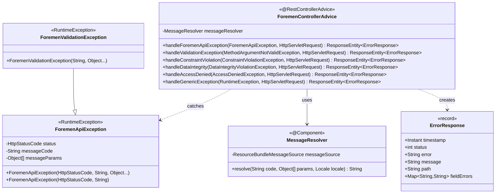
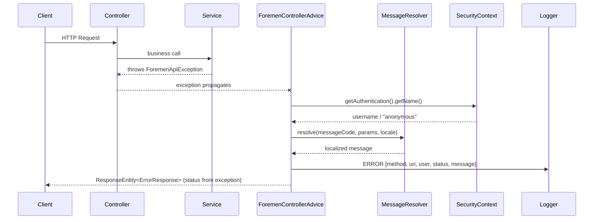
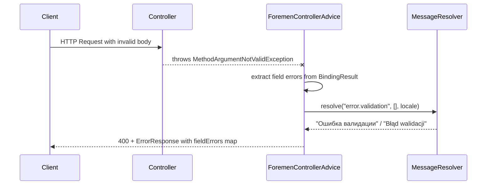

# Design Document: Exception Handling System (FOR-01-03-exception)

## Overview

This design defines the unified exception handling infrastructure for the Foremen backend. The system provides:

- **ForemenApiException** — a custom RuntimeException hierarchy with HTTP status code and i18n message code
- **ErrorResponse** — a Java record DTO producing uniform JSON error responses
- **ForemenControllerAdvice** — a centralized `@RestControllerAdvice` catching all exceptions and returning `ErrorResponse`
- **MessageResolver** — a `@Component` wrapping `ResourceBundleMessageSource` for localized error messages
- **Structured logging** — every error logged with request context (method, URI, username, status)

The pattern is adapted from the `tickets/api-events` project (`EventsApiException` + `ApiControllerAdvice`) for Spring Boot 4, Jakarta EE 11, Java 25, and aligned with RFC 7807 (`ProblemDetail`) response structure.

### Key Design Decisions

| Decision | Rationale |
|----------|-----------|
| Custom `ErrorResponse` record instead of Spring's `ProblemDetail` | Full control over the response shape. Frontend team needs a fixed contract (`timestamp`, `status`, `error`, `message`, `path`, `fieldErrors`). `ProblemDetail` adds extra fields (`type`, `title`, `instance`) not needed for MVP. Can migrate to ProblemDetail later. |
| `@RestControllerAdvice` over `ResponseEntityExceptionHandler` | Avoids inheriting 20+ handler methods for exceptions we don't need to customize. Cleaner, explicit handler methods for each supported exception type. |
| Separate `MessageResolver` component | Decouples message resolution from the advice class. Testable independently. Reusable for future notification/email services. |
| Default locale PL (Polish) | Primary user base is Polish-speaking. Russian as secondary locale for partner organizations. |
| `ResourceBundleMessageSource` over `ReloadableResourceBundleMessageSource` | No need for hot-reload in production. Simpler, uses standard Java `ResourceBundle` caching. |
| `Object[]` for messageParams | Standard `MessageFormat` pattern. Avoids varargs ambiguity with Lombok-generated constructors. |
| ForemenValidationException as example subclass | Demonstrates extensibility pattern without polluting the base class with domain-specific logic. |
| Log without stack trace for expected exceptions | Reduces log noise. ForemenApiException and validation errors are "expected" — developer already knows the cause from the message code. |

### Research Findings

| Topic | Finding | Source |
|-------|---------|--------|
| Spring Boot 4 `@RestControllerAdvice` | Unchanged from Boot 3. Combines `@ControllerAdvice` + `@ResponseBody`. Scans all `@RestController` beans. | [Spring Framework Docs](https://docs.spring.io/spring/reference/web/webmvc/mvc-ann-rest-exceptions.html) |
| RFC 7807/9457 in Spring | Spring 6+ has native `ProblemDetail` support, but it's opt-in. Custom ErrorResponse DTO is fully compatible approach — just return `ResponseEntity<ErrorResponse>`. | [Spring Docs](https://docs.spring.io/spring-framework/reference/web/webflux/ann-rest-exceptions.html) |
| `ResourceBundleMessageSource` UTF-8 | Must set `setDefaultEncoding("UTF-8")` explicitly — Java's `ResourceBundle` defaults to ISO-8859-1 for `.properties` files. Critical for Cyrillic (Russian) messages. | [StackOverflow](https://stackoverflow.com/questions/48880095) |
| `Accept-Language` locale resolution | Spring Boot auto-configures `AcceptHeaderLocaleResolver` by default. Setting `spring.mvc.locale` and `spring.mvc.locale-resolver=accept_header` is sufficient. | [Spring Boot Reference](https://docs.spring.io/spring-boot/reference/) |
| Jakarta Validation (EE 11) | `jakarta.validation.ConstraintViolationException` — thrown for `@Validated` on method parameters (path variables, query params). `MethodArgumentNotValidException` — thrown for `@Valid` on `@RequestBody`. Different exception types, same user-facing treatment. | Jakarta EE 11 Spec |
| jqwik 1.9.2 | Supports `@Property(tries = N)`, `@ForAll`, custom `Arbitrary` via `ArbitrarySupplier`. Works on JUnit Platform. Already in project `build.gradle`. | [jqwik docs](https://jqwik.net/docs/current/user-guide.html) |

## Architecture



### Package Structure

```
com.foremen
├── controller/
│   └── advice/
│       └── ForemenControllerAdvice.java      ← @RestControllerAdvice
├── exception/
│   ├── ForemenApiException.java              ← base exception
│   ├── ForemenValidationException.java       ← example subclass
│   └── dto/
│       └── ErrorResponse.java                ← response record
└── config/
    └── i18n/
        └── MessageResolver.java              ← @Component
```

### Request Error Flow



### Validation Error Flow



## Components and Interfaces

### 1. ForemenApiException (`com.foremen.exception.ForemenApiException`)

```java
package com.foremen.exception;

import lombok.Getter;
import org.springframework.http.HttpStatusCode;

@Getter
public class ForemenApiException extends RuntimeException {

    private final HttpStatusCode status;
    private final String messageCode;
    private final Object[] messageParams;

    public ForemenApiException(HttpStatusCode status, String messageCode, Object... messageParams) {
        super(messageCode);
        this.status = status;
        this.messageCode = messageCode;
        this.messageParams = messageParams != null ? messageParams : new Object[0];
    }

    public ForemenApiException(HttpStatusCode status, String messageCode) {
        this(status, messageCode, new Object[0]);
    }
}
```

**Key points:**
- `super(messageCode)` — the RuntimeException `message` is the code itself (useful in logs before resolution).
- Constructor normalizes null `messageParams` to empty array — satisfies Requirement 1.7.
- `HttpStatusCode` (not `HttpStatus` enum) — allows custom status codes and is the type used by `ResponseEntity`.

### 2. ForemenValidationException (`com.foremen.exception.ForemenValidationException`)

```java
package com.foremen.exception;

import org.springframework.http.HttpStatus;

public class ForemenValidationException extends ForemenApiException {

    public ForemenValidationException(String messageCode, Object... messageParams) {
        super(HttpStatus.BAD_REQUEST, messageCode, messageParams);
    }
}
```

**Key points:**
- Preset status `400 Bad Request` — domain modules don't need to specify HTTP status.
- Modules will create their own subclasses following this pattern (e.g., `ProjectNotFoundException extends ForemenApiException` with 404).

### 3. ErrorResponse (`com.foremen.exception.dto.ErrorResponse`)

```java
package com.foremen.exception.dto;

import com.fasterxml.jackson.annotation.JsonInclude;
import java.time.Instant;
import java.util.Map;

@JsonInclude(JsonInclude.Include.NON_NULL)
public record ErrorResponse(
    Instant timestamp,
    int status,
    String error,
    String message,
    String path,
    Map<String, String> fieldErrors
) {
    public ErrorResponse(Instant timestamp, int status, String error, String message, String path) {
        this(timestamp, status, error, message, path, null);
    }
}
```

**Key points:**
- `@JsonInclude(NON_NULL)` — `fieldErrors` is omitted from JSON when null (non-validation errors don't show an empty map).
- Compact constructor not needed — record auto-generates canonical constructor.
- Convenience constructor without `fieldErrors` for the common case.

### 4. MessageResolver (`com.foremen.config.i18n.MessageResolver`)

```java
package com.foremen.config.i18n;

import org.springframework.context.MessageSource;
import org.springframework.context.annotation.Bean;
import org.springframework.context.annotation.Configuration;
import org.springframework.context.support.ResourceBundleMessageSource;
import org.springframework.stereotype.Component;
import org.springframework.web.servlet.LocaleResolver;
import org.springframework.web.servlet.i18n.AcceptHeaderLocaleResolver;

import java.util.Locale;

@Component
public class MessageResolver {

    private final MessageSource messageSource;

    public MessageResolver(MessageSource messageSource) {
        this.messageSource = messageSource;
    }

    /**
     * Resolves message code to localized string.
     * Falls back to the code itself if not found in the bundle.
     */
    public String resolve(String code, Object[] params, Locale locale) {
        return messageSource.getMessage(code, params, code, locale);
    }

    @Configuration
    static class MessageSourceConfig {

        @Bean
        public ResourceBundleMessageSource messageSource() {
            ResourceBundleMessageSource source = new ResourceBundleMessageSource();
            source.setBasename("messages");
            source.setDefaultEncoding("UTF-8");
            source.setUseCodeAsDefaultMessage(true);
            return source;
        }

        @Bean
        public LocaleResolver localeResolver() {
            AcceptHeaderLocaleResolver resolver = new AcceptHeaderLocaleResolver();
            resolver.setDefaultLocale(new Locale("pl"));
            return resolver;
        }
    }
}
```

**Key points:**
- `setUseCodeAsDefaultMessage(true)` — when a code is not found, returns the code itself instead of throwing `NoSuchMessageException`. Satisfies Requirement 4.3.
- `setDefaultEncoding("UTF-8")` — required for Cyrillic characters in `messages_ru.properties`.
- `AcceptHeaderLocaleResolver` with default `Locale("pl")` — resolves from `Accept-Language` header, falls back to Polish.
- The `getMessage(code, params, defaultMessage, locale)` overload uses `code` as the default message — guarantees non-empty return.
- Nested `@Configuration` keeps the bean definitions co-located with the resolver component.

### 5. ForemenControllerAdvice (`com.foremen.controller.advice.ForemenControllerAdvice`)

```java
package com.foremen.controller.advice;

import com.foremen.config.i18n.MessageResolver;
import com.foremen.exception.ForemenApiException;
import com.foremen.exception.dto.ErrorResponse;
import jakarta.servlet.http.HttpServletRequest;
import jakarta.validation.ConstraintViolationException;
import lombok.RequiredArgsConstructor;
import lombok.extern.slf4j.Slf4j;
import org.springframework.dao.DataIntegrityViolationException;
import org.springframework.http.HttpStatus;
import org.springframework.http.HttpStatusCode;
import org.springframework.http.ResponseEntity;
import org.springframework.security.access.AccessDeniedException;
import org.springframework.security.authentication.AnonymousAuthenticationToken;
import org.springframework.security.core.Authentication;
import org.springframework.security.core.context.SecurityContextHolder;
import org.springframework.web.bind.MethodArgumentNotValidException;
import org.springframework.web.bind.annotation.ExceptionHandler;
import org.springframework.web.bind.annotation.RestControllerAdvice;
import org.springframework.web.context.request.RequestContextHolder;
import org.springframework.web.context.request.ServletRequestAttributes;

import java.time.Instant;
import java.util.LinkedHashMap;
import java.util.Locale;
import java.util.Map;
import java.util.stream.Collectors;

@Slf4j
@RestControllerAdvice
@RequiredArgsConstructor
public class ForemenControllerAdvice {

    private final MessageResolver messageResolver;

    @ExceptionHandler(ForemenApiException.class)
    public ResponseEntity<ErrorResponse> handleForemenApiException(
            ForemenApiException ex, HttpServletRequest request, Locale locale) {

        String message = messageResolver.resolve(ex.getMessageCode(), ex.getMessageParams(), locale);
        HttpStatusCode status = ex.getStatus();

        logError(request, status.value(), ex.getMessageCode(), false, ex);

        ErrorResponse response = new ErrorResponse(
                Instant.now(),
                status.value(),
                HttpStatus.valueOf(status.value()).getReasonPhrase(),
                message,
                request.getRequestURI()
        );

        return ResponseEntity.status(status).body(response);
    }

    @ExceptionHandler(MethodArgumentNotValidException.class)
    public ResponseEntity<ErrorResponse> handleValidationException(
            MethodArgumentNotValidException ex, HttpServletRequest request, Locale locale) {

        Map<String, String> fieldErrors = new LinkedHashMap<>();

        ex.getBindingResult().getFieldErrors().forEach(error ->
                fieldErrors.put(error.getField(), error.getDefaultMessage()));

        ex.getBindingResult().getGlobalErrors().forEach(error ->
                fieldErrors.put(error.getObjectName(), error.getDefaultMessage()));

        String message = messageResolver.resolve("error.validation", null, locale);

        logError(request, 400, "error.validation", false, ex);

        ErrorResponse response = new ErrorResponse(
                Instant.now(), 400, "Bad Request", message,
                request.getRequestURI(), fieldErrors
        );

        return ResponseEntity.badRequest().body(response);
    }

    @ExceptionHandler(ConstraintViolationException.class)
    public ResponseEntity<ErrorResponse> handleConstraintViolation(
            ConstraintViolationException ex, HttpServletRequest request, Locale locale) {

        Map<String, String> fieldErrors = ex.getConstraintViolations().stream()
                .collect(Collectors.toMap(
                        v -> v.getPropertyPath().toString(),
                        v -> v.getMessage(),
                        (v1, v2) -> v1,
                        LinkedHashMap::new
                ));

        String message = messageResolver.resolve("error.validation", null, locale);

        logError(request, 400, "error.validation", false, ex);

        ErrorResponse response = new ErrorResponse(
                Instant.now(), 400, "Bad Request", message,
                request.getRequestURI(), fieldErrors
        );

        return ResponseEntity.badRequest().body(response);
    }

    @ExceptionHandler(DataIntegrityViolationException.class)
    public ResponseEntity<ErrorResponse> handleDataIntegrity(
            DataIntegrityViolationException ex, HttpServletRequest request, Locale locale) {

        String message = messageResolver.resolve("error.data.integrity", null, locale);

        logError(request, 409, "error.data.integrity", false, ex);

        ErrorResponse response = new ErrorResponse(
                Instant.now(), 409, "Conflict", message, request.getRequestURI()
        );

        return ResponseEntity.status(HttpStatus.CONFLICT).body(response);
    }

    @ExceptionHandler(AccessDeniedException.class)
    public ResponseEntity<ErrorResponse> handleAccessDenied(
            AccessDeniedException ex, HttpServletRequest request, Locale locale) {

        String message = messageResolver.resolve("error.access.denied", null, locale);

        logError(request, 403, "error.access.denied", false, ex);

        ErrorResponse response = new ErrorResponse(
                Instant.now(), 403, "Forbidden", message, request.getRequestURI()
        );

        return ResponseEntity.status(HttpStatus.FORBIDDEN).body(response);
    }

    @ExceptionHandler(RuntimeException.class)
    public ResponseEntity<ErrorResponse> handleGenericException(
            RuntimeException ex, HttpServletRequest request, Locale locale) {

        String message = messageResolver.resolve("error.internal", null, locale);

        logError(request, 500, "error.internal", true, ex);

        ErrorResponse response = new ErrorResponse(
                Instant.now(), 500, "Internal Server Error", message,
                request.getRequestURI()
        );

        return ResponseEntity.status(HttpStatus.INTERNAL_SERVER_ERROR).body(response);
    }

    // --- Private helpers ---

    private void logError(HttpServletRequest request, int status, String messageCode,
                          boolean includeStackTrace, Exception ex) {
        String username = extractUsername();
        String method = request.getMethod();
        String uri = request.getRequestURI();

        if (includeStackTrace) {
            log.error("Exception handled: code={}, method={}, uri={}, user={}, status={}",
                    messageCode, method, uri, username, status, ex);
        } else {
            log.error("Exception handled: code={}, method={}, uri={}, user={}, status={}",
                    messageCode, method, uri, username, status);
        }
    }

    private String extractUsername() {
        Authentication authentication = SecurityContextHolder.getContext().getAuthentication();
        if (authentication == null || !authentication.isAuthenticated()
                || authentication instanceof AnonymousAuthenticationToken) {
            return "anonymous";
        }
        return authentication.getName();
    }
}
```

**Key points:**
- Handler method order matters: Spring resolves the most specific `@ExceptionHandler` first. `ForemenApiException` is caught before `RuntimeException` because it's more specific.
- `Locale locale` parameter — Spring MVC injects the resolved locale from `Accept-Language` header automatically.
- `logError()` helper — centralizes structured logging. Stack trace included only for unexpected RuntimeExceptions.
- `extractUsername()` — same pattern as `JpaAuditingConfig.auditorAware()`, returns `"anonymous"` for null/anonymous auth.
- Generic handler **never** exposes `ex.getMessage()` in the response — only the i18n message for `error.internal`.

### 6. Resource Bundles

**`src/main/resources/messages.properties`** (default = Polish):

```properties
error.data.integrity=Naruszenie integralności danych. Operacja nie może być wykonana.
error.access.denied=Dostęp zabroniony. Brak wymaganych uprawnień.
error.internal=Wystąpił błąd wewnętrzny. Spróbuj ponownie później.
error.validation=Błąd walidacji. Sprawdź wprowadzone dane.
```

**`src/main/resources/messages_ru.properties`** (Russian):

```properties
error.data.integrity=Нарушение целостности данных. Операция не может быть выполнена.
error.access.denied=Доступ запрещён. Недостаточно прав.
error.internal=Произошла внутренняя ошибка. Попробуйте позже.
error.validation=Ошибка валидации. Проверьте введённые данные.
```

## Data Models

### ErrorResponse JSON Output

```json
{
  "timestamp": "2025-01-15T10:30:00.123Z",
  "status": 400,
  "error": "Bad Request",
  "message": "Błąd walidacji. Sprawdź wprowadzone dane.",
  "path": "/api/projects/123",
  "fieldErrors": {
    "name": "must not be blank",
    "budget": "must be positive"
  }
}
```

For non-validation errors, `fieldErrors` is omitted from JSON output (due to `@JsonInclude(NON_NULL)`):

```json
{
  "timestamp": "2025-01-15T10:30:00.123Z",
  "status": 404,
  "error": "Not Found",
  "message": "Проект с ID 123 не найден.",
  "path": "/api/projects/123"
}
```

### Exception-to-Response Mapping

| Exception Type | HTTP Status | Message Code | fieldErrors | Stack Trace Logged |
|---------------|-------------|--------------|-------------|-------------------|
| `ForemenApiException` | from exception | from exception | `null` | No |
| `ForemenValidationException` | 400 | from exception | `null` | No |
| `MethodArgumentNotValidException` | 400 | `error.validation` | field → message | No |
| `ConstraintViolationException` | 400 | `error.validation` | property → message | No |
| `DataIntegrityViolationException` | 409 | `error.data.integrity` | `null` | No |
| `AccessDeniedException` | 403 | `error.access.denied` | `null` | No |
| `RuntimeException` (uncaught) | 500 | `error.internal` | `null` | Yes |

### Log Output Format

```
ERROR c.f.c.a.ForemenControllerAdvice - Exception handled: code=error.validation, method=POST, uri=/api/projects, user=admin, status=400
```

For unexpected RuntimeExceptions (with stack trace):
```
ERROR c.f.c.a.ForemenControllerAdvice - Exception handled: code=error.internal, method=GET, uri=/api/projects/999, user=admin, status=500
java.lang.NullPointerException: Cannot invoke method on null
    at com.foremen.service.ProjectService.findById(ProjectService.java:42)
    ...
```

## Correctness Properties

*A property is a characteristic or behavior that should hold true across all valid executions of a system — essentially, a formal statement about what the system should do. Properties serve as the bridge between human-readable specifications and machine-verifiable correctness guarantees.*

### Property 1: Status Preservation Invariant

*For any* `ForemenApiException` (or subclass) with any valid `HttpStatusCode`, when handled by `ForemenControllerAdvice`, the returned `ResponseEntity` status code SHALL equal the exception's `status` field value.

**Validates: Requirements 3.2, 7.1, 7.2, 8.1**

### Property 2: Field Errors Count Preservation

*For any* `MethodArgumentNotValidException` containing N field errors and M global errors, the `ErrorResponse.fieldErrors` map SHALL contain exactly N + M entries, with each field error's field name and each global error's object name as keys.

**Validates: Requirements 3.3, 6.1, 6.2, 8.5**

### Property 3: No Internal Details Exposure

*For any* `RuntimeException` with any message string (including stack traces, SQL queries, internal class names), the `ErrorResponse.message` field SHALL NOT contain the original exception message — it SHALL contain only the resolved i18n message for code `error.internal`.

**Validates: Requirements 3.7**

### Property 4: Path Populated From Request URI

*For any* HTTP request with any valid URI path, when any exception is handled by `ForemenControllerAdvice`, the `ErrorResponse.path` field SHALL equal the `HttpServletRequest.getRequestURI()` value.

**Validates: Requirements 3.8, 8.3**

### Property 5: Message Resolution Always Non-Empty

*For any* message code string (whether present in the bundle or not) and any locale, the `MessageResolver.resolve()` method SHALL return a non-null string with length > 0. When the code exists in the bundle, it returns the localized message; when it does not exist, it returns the code itself.

**Validates: Requirements 4.3, 8.2, 8.6**

### Property 6: Handler Never Throws

*For any* `Exception` subclass passed to any `@ExceptionHandler` method in `ForemenControllerAdvice`, the handler SHALL return a valid `ResponseEntity<ErrorResponse>` without throwing a new exception (idempotent error handling — the handler itself never fails).

**Validates: Requirements 8.7**

### Property 7: ErrorResponse JSON Serialization Round-Trip

*For any* valid `ErrorResponse` instance (with any combination of status codes, message strings, paths, and optional fieldErrors), serializing to JSON via Jackson and deserializing back SHALL produce an equivalent `ErrorResponse` record.

**Validates: Requirements 2.8**

### Property 8: ConstraintViolation Mapping Completeness

*For any* `ConstraintViolationException` containing N constraint violations, the `ErrorResponse.fieldErrors` map SHALL contain exactly N entries, with each violation's property path as key and violation message as value.

**Validates: Requirements 6.4**

### Property 9: Subclass Polymorphic Handling

*For any* subclass of `ForemenApiException` with any status code and message code, `ForemenControllerAdvice` SHALL catch it via the `handleForemenApiException` handler and produce an `ErrorResponse` with matching status and resolved message — without requiring additional handler methods or configuration.

**Validates: Requirements 7.1, 7.2**

## Error Handling

| Scenario | Handling |
|----------|----------|
| Message code not found in bundle | `MessageResolver` returns the code itself as fallback (never throws) |
| `SecurityContextHolder` returns null | `extractUsername()` returns `"anonymous"` — graceful fallback |
| `messageParams` is null | Constructor normalizes to empty `Object[]` — `MessageFormat` receives no params |
| Jackson serialization fails on ErrorResponse | Cannot happen — record uses only primitive types, String, Instant, and Map (all natively supported) |
| Handler method throws internally | Should never happen — all operations are null-safe. If it does, the servlet container's default error page kicks in (acceptable last-resort) |
| `DataIntegrityViolationException` wraps various DB errors | We intentionally return generic 409 message — specific constraint details are internal and not exposed |
| Multiple field errors on same field | `LinkedHashMap` preserves insertion order; last error wins for duplicate field names (standard Spring behavior) |
| `Accept-Language` header with unsupported locale | `AcceptHeaderLocaleResolver` falls back to default PL locale |

## Testing Strategy

### Property-Based Tests (jqwik 1.9.2)

Property-based testing is applicable for this feature because the controller advice and message resolver are pure functions (given an exception + request context → produce a response) with clear universal properties that hold across a wide input space (any status code, any message code, any number of field errors, any URI).

**Library:** `net.jqwik:jqwik:1.9.2` (already in `build.gradle`)

**Configuration:**
- Minimum 100 iterations per property (`@Property(tries = 100)`)
- Each test annotated with a comment referencing the design property
- Tag format: `Feature: FOR-01-03-exception, Property N: <title>`

**Properties to implement:**

| # | Property | Generator Strategy |
|---|----------|--------------------|
| 1 | Status preservation | Generate random `HttpStatus` values + random message codes → create `ForemenApiException` → invoke handler → assert response status == exception status |
| 2 | Field errors count preservation | Generate random list of (fieldName, errorMessage) pairs (1..20) → mock `MethodArgumentNotValidException` → invoke handler → assert `fieldErrors.size()` == input count |
| 3 | No internal details exposure | Generate random RuntimeException messages (including SQL, stack-trace-like strings) → invoke generic handler → assert response message does NOT contain original exception message |
| 4 | Path populated from request | Generate random valid URI paths → mock `HttpServletRequest` → invoke any handler → assert `response.path` == generated URI |
| 5 | Message resolution non-empty | Generate random code strings (existing codes + random non-existent codes) → call `resolve()` → assert result is non-null and non-empty |
| 6 | Handler never throws | Generate random `RuntimeException` subclasses with random messages (including null message) → invoke handler → assert no exception thrown + valid ResponseEntity returned |
| 7 | ErrorResponse serialization round-trip | Generate random `ErrorResponse` instances (random status, message, path, optional fieldErrors) → serialize to JSON → deserialize → assert equality |
| 8 | ConstraintViolation mapping | Generate random sets of (propertyPath, message) pairs → mock `ConstraintViolationException` → invoke handler → assert `fieldErrors` matches input |
| 9 | Subclass polymorphic handling | Generate random subclasses of `ForemenApiException` (using anonymous classes with random status/code) → invoke handler → assert response matches exception fields |

### Unit Tests (Example-Based)

Focus on structural verification, specific mappings, and edge cases:

1. **ForemenApiException structure** — verify extends RuntimeException, has correct fields, Lombok `@Getter` generates accessors
2. **ForemenApiException default params** — constructor without params → `messageParams` is empty array
3. **ForemenValidationException preset status** — always 400
4. **ErrorResponse record structure** — verify it's a record with expected components
5. **DataIntegrityViolationException → 409** — specific mapping test
6. **AccessDeniedException → 403** — specific mapping test
7. **Generic RuntimeException → 500** — specific mapping test
8. **Logging with stack trace** — verify unexpected RuntimeException logs stack trace
9. **Logging without stack trace** — verify ForemenApiException logs message only
10. **MessageResolver with existing code** — returns translated message
11. **MessageResolver with parameters** — substitution works (`{0}`, `{1}`)
12. **MessageResolver with missing code** — returns code itself
13. **LocaleResolver default locale** — PL when no `Accept-Language` header
14. **Resource bundle contains required keys** — verify `error.data.integrity`, `error.access.denied`, `error.internal`, `error.validation`

### Integration Tests

1. **Full request cycle** — `@SpringBootTest` + `MockMvc` → throw ForemenApiException from controller → verify JSON response structure
2. **Locale switching** — send `Accept-Language: ru` → verify Russian message in response
3. **Bean Validation** — POST invalid DTO → verify 400 + fieldErrors populated
4. **SecurityContext integration** — authenticated request → verify username in log

### Test Organization

```
src/test/java/com/foremen/
├── controller/
│   └── advice/
│       ├── ForemenControllerAdvicePropertyTest.java    ← jqwik properties 1-4, 6, 8, 9
│       ├── ForemenControllerAdviceTest.java            ← unit tests (mappings, logging)
│       └── ForemenControllerAdviceIntegrationTest.java ← MockMvc integration tests
├── exception/
│   ├── ForemenApiExceptionTest.java                   ← structure + edge case tests
│   ├── ForemenValidationExceptionTest.java            ← preset status test
│   └── dto/
│       └── ErrorResponsePropertyTest.java             ← jqwik property 7
└── config/
    └── i18n/
        ├── MessageResolverPropertyTest.java           ← jqwik property 5
        └── MessageResolverTest.java                   ← unit tests (params, locale)
```
