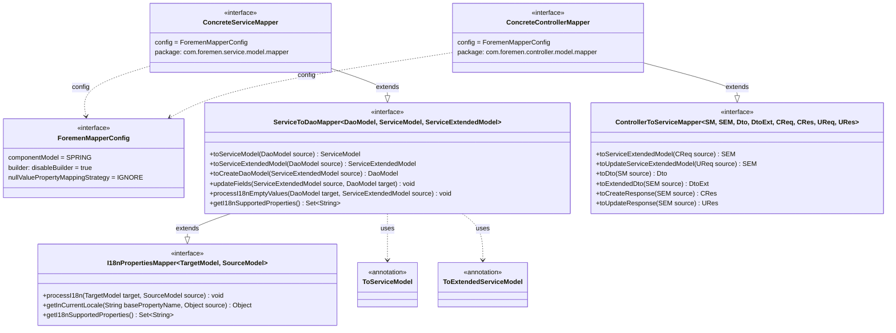
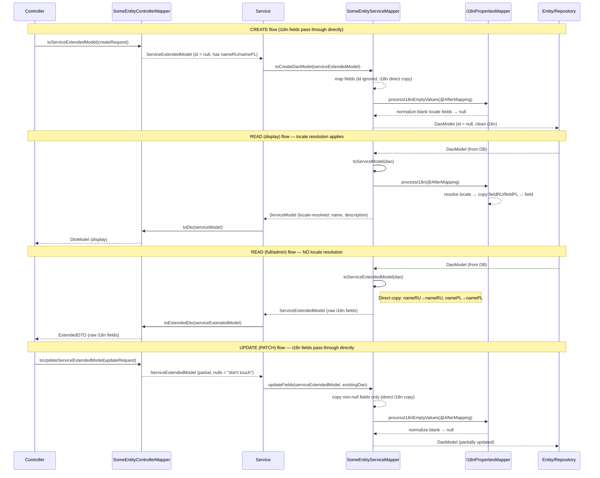
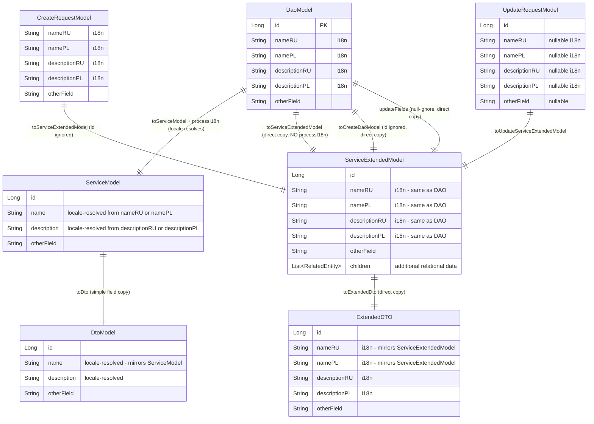

# Design Document: MapStruct Configuration and Base Mappers (FOR-01-04-mapstruct)

## Overview

This design defines the MapStruct mapping infrastructure for the Foremen backend. It establishes a layered generic mapper hierarchy that:

1. Provides a global `@MapperConfig` configuration class (`ForemenMapperConfig`) so all concrete mappers share consistent defaults (Spring component model, disabled builders, null-ignore strategy).
2. Defines `I18nPropertiesMapper<TargetModel, SourceModel>` — a base interface that provides reflection-based `@AfterMapping` methods to copy locale-specific fields (e.g., `nameRU`/`namePL` → `name`) based on the current `LocaleContextHolder` locale.
3. Defines `ServiceToDaoMapper<DaoModel, ServiceModel, ServiceExtendedModel>` — extends `I18nPropertiesMapper` and provides standard DAO↔Service mapping methods including `toServiceModel` (locale-resolved display model), `toServiceExtendedModel` (raw i18n fields), `toCreateDaoModel` (from ServiceExtendedModel, id ignored), and `updateFields` (partial update from ServiceExtendedModel with null-ignore semantics).
4. Defines `ControllerToServiceMapper<ServiceModel, ServiceExtendedModel, DtoModel, DtoExtendedModel, CreateRequestModel, CreateResponseModel, UpdateRequestModel, UpdateResponseModel>` — a plain generic interface for Controller↔Service conversions.
5. Provides qualifier annotations (`@ToServiceModel`, `@ToExtendedServiceModel`) for MapStruct method disambiguation.
6. Documents the convention for creating new concrete mappers: each entity gets two separate mapper interfaces — one in `com.foremen.controller.model.mapper` (extending `ControllerToServiceMapper`) and one in `com.foremen.service.model.mapper` (extending `ServiceToDaoMapper`).

### Model Layer Hierarchy

The system uses a five-layer model hierarchy with two distinct variants per entity:

1. **DaoModel** — Database entity. Contains all i18n fields (`nameRU`, `namePL`, `descriptionRU`, `descriptionPL`) plus non-i18n fields.
2. **ServiceExtendedModel** — Full service-layer model. Contains the SAME i18n fields as DaoModel (`nameRU`, `namePL`, etc.) plus all other fields. Essentially a 1:1 representation of the DAO model for the service layer, potentially with extra relational data.
3. **ServiceModel** (display model) — Locale-resolved display version. Contains resolved fields (`name`, `description`) instead of i18n pairs. Used for read operations that need locale-specific display text.
4. **ExtendedDTO** — Mirrors ServiceExtendedModel. Contains all i18n fields (`nameRU`, `namePL`, etc.) for admin/edit UIs.
5. **DtoModel** (display DTO) — Mirrors ServiceModel. Contains locale-resolved fields (`name`, `description`) for display to end users.
6. **CreateRequest** — Contains all i18n fields (same structure as ExtendedModel).
7. **UpdateRequest** — Contains all i18n fields (same structure as ExtendedModel), all nullable for partial updates.

### I18n Processing Scope

**`processI18n` (locale resolution) applies ONLY to:**
- `toServiceModel(DaoModel)` — resolves `nameRU`/`namePL` → `name` based on current locale

**`processI18n` does NOT apply to:**
- `toServiceExtendedModel(DaoModel)` — direct field copy (`nameRU`→`nameRU`, `namePL`→`namePL`)
- `toExtendedDto(ServiceExtendedModel)` — direct field copy
- `toServiceExtendedModel(CreateRequest)` — direct field copy
- `toServiceExtendedModel(UpdateRequest)` — direct field copy
- `toCreateDaoModel(ServiceExtendedModel)` — direct field copy (i18n fields map 1:1)
- `updateFields(ServiceExtendedModel, DaoModel)` — direct field copy with null-ignore

### Key Design Decisions

| Decision | Rationale |
|----------|-----------|
| `@MapperConfig` interface (not abstract class) | MapStruct requires config to be a class or interface with `@MapperConfig`. Interface is idiomatic since there's no shared state. |
| `builder = @Builder(disableBuilder = true)` | Lombok-generated setters are the mutation mechanism. Builder pattern conflicts with `@MappingTarget` (partial updates) and entity lifecycle management. |
| `NullValuePropertyMappingStrategy.IGNORE` as default | Partial update (PATCH) semantics: null fields in source don't overwrite non-null target fields. This is the safest default for a REST API with partial updates. |
| Reflection-based i18n field copying | Entities have varying sets of i18n fields. Reflection avoids writing per-entity mapping methods for each locale field pair. Performance is acceptable because mapping happens per-request, not in tight loops. |
| `LocaleContextHolder` for locale detection | Spring MVC sets this via `AcceptHeaderLocaleResolver` already configured in `MessageResolver`. Thread-safe for servlet-based processing. |
| Qualifier annotations with `CLASS` retention | MapStruct processes qualifiers at compile time via annotation processors. `CLASS` retention is sufficient (no runtime reflection needed for qualifiers). |
| Generic base interfaces without `@Mapper` | Only concrete mappers carry `@Mapper(config = ForemenMapperConfig.class)`. Base interfaces define the contract; MapStruct generates implementations only for concrete interfaces. |
| Separate concrete mapper per layer | Each entity gets two mapper interfaces: one in `controller.model.mapper` (extending `ControllerToServiceMapper`) and one in `service.model.mapper` (extending `ServiceToDaoMapper`). This keeps each layer responsible for its own mapping concerns and avoids a single monolithic mapper interface per entity. |
| `uses` attribute lists all nested mappers recursively | MapStruct only invokes `@AfterMapping` (i18n processing) from the mapper that owns the method. When a parent mapper maps a nested child field, it must reference the child's mapper via `uses` so MapStruct delegates to it — and the child's `processI18n` fires. Must include all levels of nesting depth. |
| Separate `processI18nEmptyValues` on ServiceToDaoMapper | When writing back to DAO, blank locale fields should be normalized to `null` for database consistency. This is a write-direction concern only, triggered during `toCreateDaoModel` and `updateFields`. |
| `processI18n` only on `toServiceModel` | The locale resolution (`nameRU`/`namePL` → `name`) is only needed when producing the display model. The extended model carries raw i18n fields directly from DAO without transformation. |
| `toCreateDaoModel` and `updateFields` accept ServiceExtendedModel | Create/update operations work with the full i18n field set. Since CreateRequest and UpdateRequest have i18n fields, they map to ServiceExtendedModel, which then maps directly to DaoModel. |

### Research Findings

| Topic | Finding |
|-------|---------|
| MapStruct 1.6.3 + Lombok | Requires `lombok-mapstruct-binding:0.2.0` between lombok and mapstruct-processor in annotation processor order. Already configured in `build.gradle`. |
| MapStruct `@MapperConfig` inheritance | Concrete mapper with `config = ForemenMapperConfig.class` inherits `componentModel`, `builder`, `nullValuePropertyMappingStrategy`. Methods in config class are NOT inherited — only settings. |
| `@AfterMapping` in base interfaces | MapStruct invokes `@AfterMapping` default methods from parent interfaces. The method must have matching parameter types (`@MappingTarget` + source). Works with generics via type erasure. |
| `@AfterMapping` method selection | MapStruct selects `@AfterMapping` methods based on parameter types. Since `toServiceModel` returns `ServiceModel` (which has `name`, `description` fields) and takes `DaoModel` as source, `processI18n(@MappingTarget ServiceModel, DaoModel)` will be invoked. For `toServiceExtendedModel` returning `ServiceExtendedModel`, `processI18n` will NOT be triggered because `ServiceExtendedModel` target type doesn't have the base `name`/`description` fields that the reflection would write to — it has `nameRU`/`namePL` instead. |
| MapStruct `@Qualifier` | Custom qualifier annotations disambiguate methods. Applied on method declaration + referenced via `qualifiedBy` in `@Mapping`. Retention must be at least `CLASS`. |
| `@BeanMapping` on `updateFields` | `NullValuePropertyMappingStrategy.IGNORE` at method level via `@BeanMapping` overrides class-level config. But since we set it as default in config, it's redundant — included for explicit documentation. |
| Spring Boot 4 + MapStruct | No breaking changes. `componentModel = "spring"` generates `@Component`-annotated implementations. Constructor injection works with Spring 7.x. |
| Java 25 reflection for i18n | `Class.getDeclaredField()` + `setAccessible(true)` works. No module-system restrictions for project's own classes. |

## Architecture



### Package Structure

```
com.foremen
├── config/
│   └── mapper/
│       └── ForemenMapperConfig.java              ← @MapperConfig interface
├── mapper/
│   ├── I18nPropertiesMapper.java                 ← generic base, @AfterMapping + reflection
│   ├── ServiceToDaoMapper.java                   ← generic base, extends I18nPropertiesMapper
│   ├── ControllerToServiceMapper.java            ← generic base, plain interface
│   └── qualifier/
│       ├── ToServiceModel.java                   ← @Qualifier annotation
│       └── ToExtendedServiceModel.java           ← @Qualifier annotation
├── controller/
│   └── model/
│       └── mapper/
│           └── SomeEntityControllerMapper.java   ← concrete @Mapper, extends ControllerToServiceMapper
└── service/
    └── model/
        └── mapper/
            └── SomeEntityServiceMapper.java      ← concrete @Mapper, extends ServiceToDaoMapper
```

**Convention:** Each entity has TWO concrete mapper interfaces, one per layer boundary:
- **ControllerToService mapper** → `com.foremen.controller.model.mapper` package
- **ServiceToDao mapper** → `com.foremen.service.model.mapper` package

The base interfaces and configuration remain in their shared packages (`com.foremen.mapper`, `com.foremen.config.mapper`).

### Mapping Flow



## Components and Interfaces

### 1. ForemenMapperConfig (`com.foremen.config.mapper.ForemenMapperConfig`)

```java
package com.foremen.config.mapper;

import org.mapstruct.Builder;
import org.mapstruct.MapperConfig;
import org.mapstruct.MappingConstants;
import org.mapstruct.NullValuePropertyMappingStrategy;

@MapperConfig(
        componentModel = MappingConstants.ComponentModel.SPRING,
        builder = @Builder(disableBuilder = true),
        nullValuePropertyMappingStrategy = NullValuePropertyMappingStrategy.IGNORE
)
public interface ForemenMapperConfig {
}
```

### 2. I18nPropertiesMapper (`com.foremen.mapper.I18nPropertiesMapper`)

```java
package com.foremen.mapper;

import org.mapstruct.AfterMapping;
import org.mapstruct.MappingTarget;
import org.springframework.context.i18n.LocaleContextHolder;

import java.lang.reflect.Field;
import java.util.Locale;
import java.util.Set;

public interface I18nPropertiesMapper<TargetModel, SourceModel> {

    Set<String> getI18nSupportedProperties();

    @AfterMapping
    default void processI18n(@MappingTarget TargetModel target, SourceModel source) {
        Set<String> properties = getI18nSupportedProperties();
        if (properties == null || properties.isEmpty()) {
            return;
        }

        for (String property : properties) {
            Object value = getInCurrentLocale(property, source);
            setFieldValue(target, property, value);
        }
    }

    default Object getInCurrentLocale(String basePropertyName, Object source) {
        Locale locale = LocaleContextHolder.getLocale();
        String suffix = resolveSuffix(locale);
        String localizedFieldName = basePropertyName + suffix;
        return getFieldValue(source, localizedFieldName);
    }

    private static String resolveSuffix(Locale locale) {
        if (locale != null && "ru".equalsIgnoreCase(locale.getLanguage())) {
            return "RU";
        }
        return "PL"; // default locale — Polish
    }

    private static Object getFieldValue(Object source, String fieldName) {
        try {
            Field field = findField(source.getClass(), fieldName);
            if (field == null) {
                throw new IllegalArgumentException(
                        "Field '%s' not found on class '%s'"
                                .formatted(fieldName, source.getClass().getName()));
            }
            field.setAccessible(true);
            return field.get(source);
        } catch (IllegalAccessException e) {
            throw new RuntimeException(
                    "Cannot access field '%s' on class '%s'"
                            .formatted(fieldName, source.getClass().getName()), e);
        }
    }

    private static void setFieldValue(Object target, String fieldName, Object value) {
        try {
            Field field = findField(target.getClass(), fieldName);
            if (field == null) {
                throw new IllegalArgumentException(
                        "Field '%s' not found on class '%s'"
                                .formatted(fieldName, target.getClass().getName()));
            }
            field.setAccessible(true);
            field.set(target, value);
        } catch (IllegalAccessException e) {
            throw new RuntimeException(
                    "Cannot access field '%s' on class '%s'"
                            .formatted(fieldName, target.getClass().getName()), e);
        }
    }

    private static Field findField(Class<?> clazz, String fieldName) {
        Class<?> current = clazz;
        while (current != null && current != Object.class) {
            try {
                return current.getDeclaredField(fieldName);
            } catch (NoSuchFieldException e) {
                current = current.getSuperclass();
            }
        }
        return null;
    }
}
```

### 3. ServiceToDaoMapper (`com.foremen.mapper.ServiceToDaoMapper`)

The `ServiceToDaoMapper` is parameterized by `<DaoModel, ServiceModel, ServiceExtendedModel>` where:
- `ServiceModel` = display model (locale-resolved fields: `name`, `description`)
- `ServiceExtendedModel` = full model (raw i18n fields: `nameRU`, `namePL`, `descriptionRU`, `descriptionPL`)

The `I18nPropertiesMapper<ServiceModel, DaoModel>` extension ensures that `processI18n` is triggered ONLY for `toServiceModel(DaoModel)` — the method whose return type is `ServiceModel` (the target that has the base `name`/`description` fields that `processI18n` writes to).

The `toServiceExtendedModel(DaoModel)` returns `ServiceExtendedModel` which has `nameRU`/`namePL` fields — MapStruct performs direct field-name mapping, no locale resolution needed.

The `toCreateDaoModel` and `updateFields` accept `ServiceExtendedModel` because create/update operations work with the full i18n field set (coming from CreateRequest/UpdateRequest through the controller layer).

```java
package com.foremen.mapper;

import com.foremen.mapper.qualifier.ToExtendedServiceModel;
import com.foremen.mapper.qualifier.ToServiceModel;
import org.mapstruct.BeanMapping;
import org.mapstruct.Mapping;
import org.mapstruct.MappingTarget;
import org.mapstruct.AfterMapping;
import org.mapstruct.NullValuePropertyMappingStrategy;

import java.lang.reflect.Field;
import java.util.Set;

public interface ServiceToDaoMapper<DaoModel, ServiceModel, ServiceExtendedModel>
        extends I18nPropertiesMapper<ServiceModel, DaoModel> {

    @ToServiceModel
    ServiceModel toServiceModel(DaoModel source);

    @ToExtendedServiceModel
    ServiceExtendedModel toServiceExtendedModel(DaoModel source);

    @Mapping(target = "id", ignore = true)
    DaoModel toCreateDaoModel(ServiceExtendedModel source);

    @BeanMapping(nullValuePropertyMappingStrategy = NullValuePropertyMappingStrategy.IGNORE)
    void updateFields(ServiceExtendedModel source, @MappingTarget DaoModel target);

    @AfterMapping
    default void processI18nEmptyValues(@MappingTarget DaoModel target, ServiceExtendedModel source) {
        Set<String> properties = getI18nSupportedProperties();
        if (properties == null || properties.isEmpty()) {
            return;
        }

        for (String property : properties) {
            normalizeLocaleField(target, property + "RU");
            normalizeLocaleField(target, property + "PL");
        }
    }

    private static void normalizeLocaleField(Object target, String fieldName) {
        try {
            Field field = findDeclaredField(target.getClass(), fieldName);
            if (field == null) {
                return;
            }
            field.setAccessible(true);
            Object value = field.get(target);
            if (value instanceof String str && str.isBlank()) {
                field.set(target, null);
            }
        } catch (IllegalAccessException e) {
            throw new RuntimeException(
                    "Cannot access field '%s' on class '%s'"
                            .formatted(fieldName, target.getClass().getName()), e);
        }
    }

    private static Field findDeclaredField(Class<?> clazz, String fieldName) {
        Class<?> current = clazz;
        while (current != null && current != Object.class) {
            try {
                return current.getDeclaredField(fieldName);
            } catch (NoSuchFieldException e) {
                current = current.getSuperclass();
            }
        }
        return null;
    }
}
```

### 4. ControllerToServiceMapper (`com.foremen.mapper.ControllerToServiceMapper`)

The `ControllerToServiceMapper` maps between controller DTOs and service-layer models. Key changes:
- `toServiceExtendedModel(CreateRequestModel)` — returns `ServiceExtendedModel` (not `ServiceModel`) because CreateRequest has i18n fields matching ExtendedModel.
- `toUpdateServiceExtendedModel(UpdateRequestModel)` — returns `ServiceExtendedModel` for updates.
- `toDto(ServiceModel)` — maps the display model to the display DTO.
- `toExtendedDto(ServiceExtendedModel)` — maps the extended model to the extended DTO.
- `toCreateResponse(ServiceExtendedModel)` — create response from the extended model.
- `toUpdateResponse(ServiceExtendedModel)` — update response from the extended model.

```java
package com.foremen.mapper;

import org.mapstruct.Mapping;

public interface ControllerToServiceMapper<
        ServiceModel,
        ServiceExtendedModel,
        DtoModel,
        DtoExtendedModel,
        CreateRequestModel,
        CreateResponseModel,
        UpdateRequestModel,
        UpdateResponseModel> {

    @Mapping(target = "id", ignore = true)
    ServiceExtendedModel toServiceExtendedModel(CreateRequestModel source);

    ServiceExtendedModel toUpdateServiceExtendedModel(UpdateRequestModel source);

    DtoModel toDto(ServiceModel source);

    DtoExtendedModel toExtendedDto(ServiceExtendedModel source);

    CreateResponseModel toCreateResponse(ServiceExtendedModel source);

    UpdateResponseModel toUpdateResponse(ServiceExtendedModel source);
}
```

### 5. Qualifier Annotations (`com.foremen.mapper.qualifier`)

#### @ToServiceModel

```java
package com.foremen.mapper.qualifier;

import org.mapstruct.Qualifier;

import java.lang.annotation.ElementType;
import java.lang.annotation.Retention;
import java.lang.annotation.RetentionPolicy;
import java.lang.annotation.Target;

@Qualifier
@Target(ElementType.METHOD)
@Retention(RetentionPolicy.CLASS)
public @interface ToServiceModel {
}
```

#### @ToExtendedServiceModel

```java
package com.foremen.mapper.qualifier;

import org.mapstruct.Qualifier;

import java.lang.annotation.ElementType;
import java.lang.annotation.Retention;
import java.lang.annotation.RetentionPolicy;
import java.lang.annotation.Target;

@Qualifier
@Target(ElementType.METHOD)
@Retention(RetentionPolicy.CLASS)
public @interface ToExtendedServiceModel {
}
```

### 6. Concrete Mapper Convention (Example)

Each entity has **two** concrete mapper interfaces — one per layer boundary. Each lives in the mapper sub-package of its respective layer.

#### ServiceToDao Mapper (`com.foremen.service.model.mapper`)

```java
package com.foremen.service.model.mapper;

import com.foremen.config.mapper.ForemenMapperConfig;
import com.foremen.mapper.ServiceToDaoMapper;
import com.foremen.someentity.dao.model.SomeEntity;
import com.foremen.someentity.service.model.SomeEntityServiceModel;
import com.foremen.someentity.service.model.SomeEntityServiceExtendedModel;
import org.mapstruct.Mapper;

import java.util.Set;

@Mapper(config = ForemenMapperConfig.class)
public interface SomeEntityServiceMapper
        extends ServiceToDaoMapper<SomeEntity, SomeEntityServiceModel, SomeEntityServiceExtendedModel> {

    @Override
    default Set<String> getI18nSupportedProperties() {
        return Set.of("name", "description"); // entity-specific i18n fields
    }
}
```

Where the entity models look like:

```java
// DaoModel — all i18n fields
@Entity
class SomeEntity {
    Long id;
    String nameRU;
    String namePL;
    String descriptionRU;
    String descriptionPL;
    String code;
    Integer quantity;
}

// ServiceExtendedModel — same i18n fields as DAO (1:1 copy)
class SomeEntityServiceExtendedModel {
    Long id;
    String nameRU;
    String namePL;
    String descriptionRU;
    String descriptionPL;
    String code;
    Integer quantity;
    // possible extra relational data
}

// ServiceModel (display) — locale-resolved fields
class SomeEntityServiceModel {
    Long id;
    String name;        // resolved from nameRU or namePL via processI18n
    String description; // resolved from descriptionRU or descriptionPL via processI18n
    String code;
    Integer quantity;
}
```

#### ControllerToService Mapper (`com.foremen.controller.model.mapper`)

```java
package com.foremen.controller.model.mapper;

import com.foremen.config.mapper.ForemenMapperConfig;
import com.foremen.mapper.ControllerToServiceMapper;
import com.foremen.someentity.service.model.SomeEntityServiceModel;
import com.foremen.someentity.service.model.SomeEntityServiceExtendedModel;
import com.foremen.someentity.controller.dto.*;
import org.mapstruct.Mapper;

@Mapper(config = ForemenMapperConfig.class)
public interface SomeEntityControllerMapper
        extends ControllerToServiceMapper<
                SomeEntityServiceModel,
                SomeEntityServiceExtendedModel,
                SomeEntityDto,
                SomeEntityExtendedDto,
                SomeEntityCreateRequest,
                SomeEntityCreateResponse,
                SomeEntityUpdateRequest,
                SomeEntityUpdateResponse> {
}
```

**Key points:**
- The `ServiceMapper` (in `service.model.mapper`) handles DAO↔Service conversion and carries the i18n logic.
- The `ControllerMapper` (in `controller.model.mapper`) handles Controller↔Service conversion, typically with no additional logic beyond mapping.
- Both reference `ForemenMapperConfig` and produce Spring-managed beans independently.
- If one mapper needs to reference the other (e.g., nested entity mapping), use the `uses` attribute: `@Mapper(config = ForemenMapperConfig.class, uses = SomeEntityServiceMapper.class)`.

#### Nested Model Mapping Convention

When a DAO/Service/DTO model contains nested objects (e.g., `List<ChildEntity>` fields or embedded objects), the parent mapper **MUST** reference the child mapper(s) in the `@Mapper(uses = {...})` annotation.

**Why this is required:**

MapStruct generates the mapping code inside the parent mapper's implementation class. Without `uses`, MapStruct doesn't know about the child mapper and will attempt to inline the mapping — which means:
1. The child mapper's `@AfterMapping` method (`processI18n`) is **never invoked**.
2. Nested objects will get raw field copies instead of locale-resolved values.
3. This is a **silent failure** — no compile error, just incorrect runtime behavior where i18n fields on nested objects remain `null` or unresolved.

**The `uses` list must be FLAT and include ALL mappers for the ENTIRE depth of nesting** — not just direct children, but children of children, etc. MapStruct does not transitively resolve `uses` declarations.

**Example with multi-level nesting:**

```java
// OrderEntity has nested List<OrderItemEntity> items
// OrderItemEntity has nested ProductEntity product
// ALL levels must be listed in the parent mapper's uses:

@Mapper(config = ForemenMapperConfig.class, uses = {OrderItemServiceMapper.class, ProductServiceMapper.class})
public interface OrderServiceMapper
        extends ServiceToDaoMapper<OrderEntity, OrderServiceModel, OrderServiceExtendedModel> {

    // OrderItemServiceMapper handles OrderItemEntity ↔ OrderItemServiceModel
    //   → its processI18n resolves OrderItem's i18n fields (e.g., itemNameRU/itemNamePL → itemName)
    // ProductServiceMapper handles ProductEntity ↔ ProductServiceModel
    //   → its processI18n resolves Product's i18n fields (e.g., productNameRU/productNamePL → productName)
    // ALL levels of nesting must be listed — not just direct children

    @Override
    default Set<String> getI18nSupportedProperties() {
        return Set.of("name", "description"); // Order's own i18n fields
    }
}
```

**The same convention applies to ControllerToService mappers** when DTOs contain nested models:

```java
@Mapper(config = ForemenMapperConfig.class, uses = {OrderItemControllerMapper.class, ProductControllerMapper.class})
public interface OrderControllerMapper
        extends ControllerToServiceMapper<
                OrderServiceModel,
                OrderServiceExtendedModel,
                OrderDto,
                OrderExtendedDto,
                OrderCreateRequest,
                OrderCreateResponse,
                OrderUpdateRequest,
                OrderUpdateResponse> {
}
```

**Rules of thumb:**
- If a model has a `List<ChildModel>` or an embedded `ChildModel` field → add that child's mapper to `uses`.
- If that child model itself has nested models → add those mappers to `uses` too (flat list, full depth).
- When in doubt, list more mappers rather than fewer — unused `uses` entries have zero runtime cost (compile-time only).

## Data Models

### Type Parameter Relationships



### Field Mapping Strategy by Method

| Method | Source → Target | ID handling | i18n handling | Null strategy |
|--------|----------------|-------------|---------------|---------------|
| `toServiceModel(DaoModel)` | DAO → ServiceModel | Mapped | `processI18n` resolves `nameRU`/`namePL` → `name` | N/A (full copy) |
| `toServiceExtendedModel(DaoModel)` | DAO → ServiceExtendedModel | Mapped | **NO processI18n** — direct copy (`nameRU`→`nameRU`) | N/A (full copy) |
| `toCreateDaoModel(ServiceExtendedModel)` | ServiceExtendedModel → DAO | **Ignored** | `processI18nEmptyValues` normalizes blanks → null | N/A (full copy) |
| `updateFields(ServiceExtendedModel, DaoModel)` | ServiceExtendedModel → DAO | NOT mapped (target preserved) | `processI18nEmptyValues` normalizes blanks → null | **IGNORE nulls** |
| `toServiceExtendedModel(CreateRequest)` | CreateRequest → ServiceExtendedModel | **Ignored** | Not applicable (direct i18n field copy) | N/A |
| `toUpdateServiceExtendedModel(UpdateRequest)` | UpdateRequest → ServiceExtendedModel | Mapped | Not applicable (direct i18n field copy) | N/A |
| `toDto(ServiceModel)` | ServiceModel → DtoModel | Mapped | Not applicable (already locale-resolved) | N/A |
| `toExtendedDto(ServiceExtendedModel)` | ServiceExtendedModel → ExtendedDTO | Mapped | Not applicable (raw i18n fields, direct copy) | N/A |
| `toCreateResponse(ServiceExtendedModel)` | ServiceExtendedModel → CreateResponse | Mapped | Not applicable | N/A |
| `toUpdateResponse(ServiceExtendedModel)` | ServiceExtendedModel → UpdateResponse | Mapped | Not applicable | N/A |

### Reflection Field Resolution

The `I18nPropertiesMapper` resolves fields by walking the class hierarchy. This is triggered ONLY during `toServiceModel(DaoModel)`:

```
getI18nSupportedProperties() → Set["name", "description"]

For locale = RU:
  "name" + "RU" → field "nameRU" on DaoModel source → value → set "name" on ServiceModel target
  "description" + "RU" → field "descriptionRU" on DaoModel source → value → set "description" on ServiceModel target

For locale = PL (or any non-RU locale):
  "name" + "PL" → field "namePL" on DaoModel source → value → set "name" on ServiceModel target
  "description" + "PL" → field "descriptionPL" on DaoModel source → value → set "description" on ServiceModel target
```

For `toServiceExtendedModel(DaoModel)`, `toCreateDaoModel(ServiceExtendedModel)`, and `updateFields(ServiceExtendedModel, DaoModel)`:
- No locale resolution occurs
- i18n fields map directly by name: `nameRU`→`nameRU`, `namePL`→`namePL`
- `processI18nEmptyValues` normalizes blank strings → null on the DAO target (write-direction only)


## Correctness Properties

*A property is a characteristic or behavior that should hold true across all valid executions of a system — essentially, a formal statement about what the system should do. Properties serve as the bridge between human-readable specifications and machine-verifiable correctness guarantees.*

### Property 1: Create Mapping Always Produces Null ID

*For any* ServiceExtendedModel or CreateRequestModel instance (regardless of whether it contains a non-null `id` field), calling `toCreateDaoModel` (on ServiceToDaoMapper) or `toServiceExtendedModel(CreateRequestModel)` (on ControllerToServiceMapper) SHALL produce a result where `getId()` returns `null`. This invariant ensures newly created entities never carry a pre-assigned identifier from an upper layer.

**Validates: Requirements 2.5, 2.10, 3.2, 8.6**

### Property 2: Field Value Preservation During Create Mapping

*For any* ServiceExtendedModel instance with non-null i18n fields, calling `toCreateDaoModel` SHALL produce a DaoModel where every i18n field and non-i18n field that exists in both ServiceExtendedModel and DaoModel (excluding `id`) satisfies `Objects.equals(source.getField(), result.getField())`. The mapping is lossless for all directly-mapped fields — `nameRU`→`nameRU`, `namePL`→`namePL`, `code`→`code`, etc.

**Validates: Requirements 8.1**

### Property 3: DAO → ServiceExtended → DAO Round-Trip Preserves Data

*For any* DaoModel instance, calling `toServiceExtendedModel(dao)` followed by `toCreateDaoModel(serviceExtendedModel)` SHALL produce a result DaoModel where all fields (excluding `id`) satisfy `Objects.equals(original.getField(), result.getField())`. Since both DaoModel and ServiceExtendedModel carry the same i18n fields directly, no locale context affects this round-trip.

**Validates: Requirements 8.2**

### Property 4: Partial Update Semantics (updateFields)

*For any* ServiceExtendedModel with a mix of null and non-null fields, and *for any* fully-populated DaoModel target:
- For each non-null field in the source that has a same-named field in the target (excluding `id`): the target field SHALL be overwritten to equal the source value.
- For each null field in the source: the corresponding target field SHALL retain its original value unchanged.
- The `id` field on the target SHALL never be modified, regardless of the source `id` value.

This applies to both i18n fields (`nameRU`, `namePL`, etc.) and non-i18n fields (`code`, `quantity`, etc.) since ServiceExtendedModel carries the raw i18n fields.

**Validates: Requirements 2.6, 6.1, 6.2, 6.5, 8.3**

### Property 5: I18n Locale Resolution (toServiceModel only)

*For any* DaoModel source and *for any* locale:
- If the locale language is `"ru"`, calling `toServiceModel(dao)` SHALL produce a ServiceModel where `name == dao.nameRU` and `description == dao.descriptionRU`.
- If the locale language is anything other than `"ru"` (including `"pl"`, `"en"`, `"fr"`, `"de"`, or any arbitrary locale), calling `toServiceModel(dao)` SHALL produce a ServiceModel where `name == dao.namePL` and `description == dao.descriptionPL`.
- If the locale-specific field value is `null`, the corresponding base field on the ServiceModel SHALL be `null`.

**Important:** This property applies ONLY to `toServiceModel`. The `toServiceExtendedModel` method does NOT trigger `processI18n` — it directly copies `nameRU`→`nameRU`, `namePL`→`namePL` without locale resolution.

**Validates: Requirements 4.2, 4.4, 4.5, 4.6, 4.10, 8.4, 8.5**

### Property 6: I18n Empty Value Normalization (processI18nEmptyValues)

*For any* DaoModel where locale-specific fields (`{property}RU` or `{property}PL`) contain blank strings (empty or whitespace-only), calling `processI18nEmptyValues` SHALL set those blank fields to `null`. Fields that contain non-blank strings or are already `null` SHALL remain unchanged. If `getI18nSupportedProperties()` returns an empty set, no fields on the target SHALL be modified.

This is triggered during `toCreateDaoModel(ServiceExtendedModel)` and `updateFields(ServiceExtendedModel, DaoModel)` as an `@AfterMapping` step on the DaoModel target.

**Validates: Requirements 2.8, 2.9**

## Error Handling

| Scenario | Handling |
|----------|----------|
| Reflection field not found in `processI18n` | `IllegalArgumentException` thrown with message indicating the field name and class. This is a developer error (misconfigured `getI18nSupportedProperties()`). Fails fast to surface configuration bugs during development. |
| Reflection field inaccessible | `RuntimeException` wrapping `IllegalAccessException`. Should not occur for project's own classes but handles edge cases with security managers. |
| `processI18nEmptyValues` with non-existent field | Method silently skips the field (uses `findDeclaredField` which returns null, then returns without action). This is lenient because write-direction normalization is best-effort. |
| `LocaleContextHolder.getLocale()` returns null | `resolveSuffix()` handles null locale → defaults to `"PL"`. No NPE. |
| MapStruct cannot resolve a mapping method | Compile-time error from the annotation processor. Fails the build with a clear message about unmapped properties or ambiguous methods. |
| Qualifier disambiguation failure | Compile-time error: "Ambiguous mapping methods found". Resolved by adding `qualifiedBy = ToServiceModel.class` in `@Mapping`. |
| Type mismatch in generic parameters | Compile-time error from MapStruct. Generic type parameters are enforced by the Java compiler before MapStruct processes them. |
| `getI18nSupportedProperties()` returns null | `processI18n` and `processI18nEmptyValues` both check for null/empty set and return early without processing. |
| Circular mapper dependencies | MapStruct detects circular `uses` references at compile time and reports a clear error. |
| Nested model mapped without `uses` | i18n fields on nested objects won't be locale-resolved. The nested object will have null values for locale-resolved fields (name, description) because `processI18n` was never invoked. This is a silent failure — no compile error, just incorrect runtime behavior. |
| `toServiceExtendedModel` field name mismatch | If DaoModel has `nameRU` and ServiceExtendedModel also has `nameRU`, MapStruct maps by name automatically. If field names don't match, compile-time unmapped target property warning/error. |

## Testing Strategy

### Property-Based Tests (jqwik 1.9.2)

Property-based testing is applicable for this feature because the mapper methods are essentially pure functions (input → output) with clear universal properties that hold across all valid inputs. The i18n logic, field preservation, partial update semantics, and id-ignoring behavior all benefit from randomized input testing.

**Library:** `net.jqwik:jqwik:1.9.2` (already in `build.gradle`)

**Configuration:**
- Minimum 100 iterations per property (`@Property(tries = 100)`)
- Each test annotated with a comment referencing the design property
- Tag format: `Feature: FOR-01-04-mapstruct, Property N: <title>`

**Properties to implement:**

| # | Property | Generator Strategy |
|---|----------|--------------------|
| 1 | Create mapping produces null id | Generate random `TestServiceExtendedModel` instances (some with id, some without). Call `toCreateDaoModel`, assert `result.getId() == null`. Also generate random `TestCreateRequest` instances and call `toServiceExtendedModel(createRequest)`, assert `result.getId() == null`. |
| 2 | Field value preservation (create) | Generate random `TestServiceExtendedModel` with non-null i18n fields (`nameRU`, `namePL`, etc.) and non-i18n fields (`code`, `quantity`). Call `toCreateDaoModel`, compare each matching field via `Objects.equals`. |
| 3 | Round-trip DAO → ExtendedModel → DAO | Generate random `TestDaoModel`, perform `toServiceExtendedModel` → `toCreateDaoModel`, compare ALL non-id fields (including i18n fields `nameRU`, `namePL`, etc.). No locale context dependency. |
| 4 | Partial update semantics | Generate random `TestServiceExtendedModel` with `@Nullable` i18n and non-i18n fields (mixed null/non-null) + fully-populated `TestDaoModel` target. Call `updateFields`. Verify null-source→preserved, non-null-source→overwritten, id→preserved. |
| 5 | I18n locale resolution (toServiceModel only) | Generate random `TestDaoModel` with `nameRU`, `namePL`, `descriptionRU`, `descriptionPL` values (including nulls). Set `LocaleContextHolder` to RU or PL (or other random locales). Call `toServiceModel(dao)` — this triggers `processI18n`. Assert: RU locale → `name == nameRU` and `description == descriptionRU`; non-RU locale → `name == namePL` and `description == descriptionPL`. |
| 6 | I18n empty value normalization | Generate random `TestDaoModel` with locale fields containing mix of blank strings, non-blank strings, and nulls. Generate random `TestServiceExtendedModel` as source (for @AfterMapping signature). Call `processI18nEmptyValues(target, source)`. Verify blank→null, others unchanged. |

**Test Fixtures for PBT:**

A test-only concrete mapper and matching POJO classes will be created to exercise the generic base interfaces:

```java
// Test fixture classes (in test sources)
@Getter @Setter
class TestDaoModel {
    private Long id;
    private String nameRU;
    private String namePL;
    private String descriptionRU;
    private String descriptionPL;
    private String code;
    private Integer quantity;
}

// ServiceExtendedModel — same i18n fields as DAO
@Getter @Setter
class TestServiceExtendedModel {
    private Long id;
    private String nameRU;
    private String namePL;
    private String descriptionRU;
    private String descriptionPL;
    private String code;
    private Integer quantity;
}

// ServiceModel (display) — locale-resolved fields
@Getter @Setter
class TestServiceModel {
    private Long id;
    private String name;        // resolved from nameRU or namePL
    private String description; // resolved from descriptionRU or descriptionPL
    private String code;
    private Integer quantity;
}

// Test mapper for ServiceToDao layer (in test sources: com.foremen.service.model.mapper)
@Mapper(config = ForemenMapperConfig.class)
public interface TestEntityServiceMapper
        extends ServiceToDaoMapper<TestDaoModel, TestServiceModel, TestServiceExtendedModel> {
    @Override
    default Set<String> getI18nSupportedProperties() {
        return Set.of("name", "description");
    }
}

// Test mapper for ControllerToService layer (in test sources: com.foremen.controller.model.mapper)
@Mapper(config = ForemenMapperConfig.class)
public interface TestEntityControllerMapper
        extends ControllerToServiceMapper<
                TestServiceModel,
                TestServiceExtendedModel,
                TestDtoModel,
                TestDtoExtendedModel,
                TestCreateRequest,
                TestCreateResponse,
                TestUpdateRequest,
                TestUpdateResponse> {
}
```

**Controller-layer test fixture models:**

```java
// DtoModel (display) — mirrors ServiceModel
@Getter @Setter
class TestDtoModel {
    private Long id;
    private String name;
    private String description;
    private String code;
    private Integer quantity;
}

// ExtendedDTO — mirrors ServiceExtendedModel (raw i18n fields)
@Getter @Setter
class TestDtoExtendedModel {
    private Long id;
    private String nameRU;
    private String namePL;
    private String descriptionRU;
    private String descriptionPL;
    private String code;
    private Integer quantity;
}

// CreateRequest — has i18n fields
@Getter @Setter
class TestCreateRequest {
    private String nameRU;
    private String namePL;
    private String descriptionRU;
    private String descriptionPL;
    private String code;
    private Integer quantity;
}

// CreateResponse — can mirror ExtendedModel (shows what was created)
@Getter @Setter
class TestCreateResponse {
    private Long id;
    private String nameRU;
    private String namePL;
    private String descriptionRU;
    private String descriptionPL;
    private String code;
    private Integer quantity;
}

// UpdateRequest — has i18n fields, all nullable for partial updates
@Getter @Setter
class TestUpdateRequest {
    private Long id;
    private String nameRU;
    private String namePL;
    private String descriptionRU;
    private String descriptionPL;
    private String code;
    private Integer quantity;
}

// UpdateResponse — mirrors ExtendedModel (shows full state after update)
@Getter @Setter
class TestUpdateResponse {
    private Long id;
    private String nameRU;
    private String namePL;
    private String descriptionRU;
    private String descriptionPL;
    private String code;
    private Integer quantity;
}
```

### Unit Tests (Example-Based)

Focus on structural verification, edge cases, and error conditions:

**Structure Tests:**
1. `ForemenMapperConfig` annotation verification — `@MapperConfig` present with correct attributes (componentModel, builder, nullValuePropertyMappingStrategy).
2. `ServiceToDaoMapper` interface structure — type parameters, method signatures, annotations.
3. `ControllerToServiceMapper` interface structure — type parameters, method signatures, no `@Mapper`/`@MapperConfig`.
4. `I18nPropertiesMapper` interface structure — type parameters, default methods present.
5. `@ToServiceModel` annotation structure — `@Qualifier`, `@Target(METHOD)`, `@Retention(CLASS)`.
6. `@ToExtendedServiceModel` annotation structure — same as above.

**Edge Cases:**
7. `processI18n` with non-existent field name → throws `IllegalArgumentException`.
8. `processI18nEmptyValues` with empty `getI18nSupportedProperties()` → no modifications.
9. `getInCurrentLocale` with null locale in `LocaleContextHolder` → defaults to PL.
10. `toServiceExtendedModel` does NOT resolve locale fields — verify `nameRU` remains `nameRU` on target (specific example).

### Integration Tests

1. **Generated mappers are Spring beans** — `@SpringBootTest` verifying `ApplicationContext.getBean(TestEntityServiceMapper.class)` and `ApplicationContext.getBean(TestEntityControllerMapper.class)` succeed.
2. **Config inheritance works** — concrete mappers generated with Spring component model (verify `@Component` on generated classes).
3. **Qualifier disambiguation** — mapper with multiple methods of same return type, selected via `qualifiedBy`, compiles and routes correctly.
4. **Full create flow** — CreateRequest → ServiceExtendedModel (via ControllerMapper, id ignored) → DaoModel (via ServiceMapper, id ignored), verify end-to-end field propagation with i18n fields passing through directly.
5. **Full update flow** — UpdateRequest → ServiceExtendedModel (via ControllerMapper) → `updateFields` on existing DaoModel (via ServiceMapper), verify partial update + i18n normalization with i18n fields mapped directly.
6. **Read display flow** — DaoModel → ServiceModel (via ServiceMapper, processI18n resolves locale) → DtoModel (via ControllerMapper), verify locale resolution end-to-end.
7. **Read full flow** — DaoModel → ServiceExtendedModel (via ServiceMapper, NO locale resolution) → ExtendedDTO (via ControllerMapper), verify all i18n fields pass through unchanged.

### Test Organization

```
src/test/java/com/foremen/
├── mapper/
│   ├── fixture/
│   │   ├── TestDaoModel.java
│   │   ├── TestServiceModel.java
│   │   ├── TestServiceExtendedModel.java
│   │   ├── TestDtoModel.java
│   │   ├── TestDtoExtendedModel.java
│   │   ├── TestCreateRequest.java
│   │   ├── TestCreateResponse.java
│   │   ├── TestUpdateRequest.java
│   │   └── TestUpdateResponse.java
│   ├── property/
│   │   ├── CreateMappingIdNullPropertyTest.java       ← Property 1
│   │   ├── FieldPreservationPropertyTest.java         ← Property 2
│   │   ├── RoundTripPropertyTest.java                 ← Property 3
│   │   ├── PartialUpdatePropertyTest.java             ← Property 4
│   │   ├── I18nLocaleResolutionPropertyTest.java      ← Property 5
│   │   └── I18nEmptyNormalizationPropertyTest.java    ← Property 6
│   ├── I18nPropertiesMapperTest.java                  ← edge cases + examples
│   ├── ServiceToDaoMapperStructureTest.java           ← reflection tests
│   └── ControllerToServiceMapperStructureTest.java    ← reflection tests
├── service/
│   └── model/
│       └── mapper/
│           └── TestEntityServiceMapper.java           ← test concrete ServiceToDao mapper
├── controller/
│   └── model/
│       └── mapper/
│           └── TestEntityControllerMapper.java        ← test concrete ControllerToService mapper
├── config/
│   └── mapper/
│       └── ForemenMapperConfigTest.java               ← annotation verification
└── integration/
    └── MapperSpringIntegrationTest.java               ← Spring context tests
```
