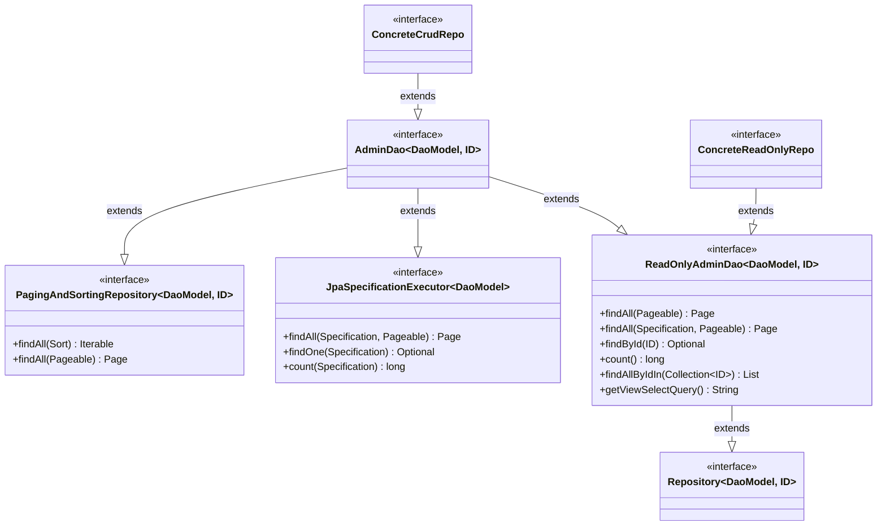
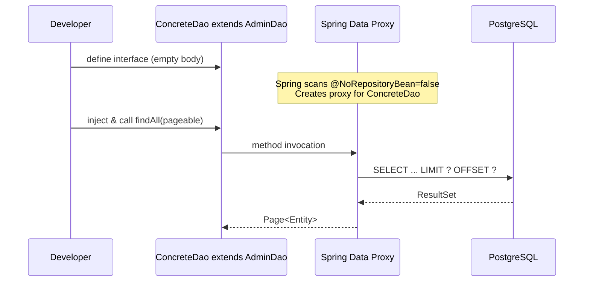

# Design Document: Generic DAO Interfaces (FOR-01-05-crud-dao)

## Overview

This design defines two generic base interfaces for the DAO layer: `ReadOnlyAdminDao` for read-only repository access (including SQL VIEW backing) and `AdminDao` for full CRUD operations. Both are marked `@NoRepositoryBean` and are intended exclusively as parent interfaces for concrete entity repositories.

The pattern provides a clean separation of concerns: read-only repositories for query-only use cases (dashboards, reports, SQL VIEWs) and full CRUD repositories for entities requiring write access. Concrete repositories extend one of these interfaces depending on their access profile.

### Key Design Decisions

| Decision | Rationale |
|----------|-----------|
| Two-tier interface hierarchy (ReadOnlyAdminDao → AdminDao) | Enforces read-only access at the type level. A service injecting `ReadOnlyAdminDao` physically cannot call write methods — the compiler prevents it. |
| `ReadOnlyAdminDao` extends `Repository` (not `CrudRepository`) | `Repository` is the marker interface with no methods. This gives us full control over which query methods are exposed without inheriting `save`/`delete`. |
| `AdminDao` extends `PagingAndSortingRepository` + `JpaSpecificationExecutor` | Since Spring Data 3.0+, `PagingAndSortingRepository` no longer extends `CrudRepository`. We explicitly compose the interfaces we need. `JpaSpecificationExecutor` provides dynamic query capabilities. |
| `@NoRepositoryBean` on both interfaces | Prevents Spring Data from creating proxy beans for the base interfaces themselves. Only concrete sub-interfaces get instantiated. |
| `default String getViewSelectQuery()` returning `null` | Convention for VIEW-backed repositories: a concrete read-only repository overrides this method to provide the SQL SELECT query. The `null` default indicates a standard table-backed repository. |
| `findAllByIdIn` with empty-collection guard | Matches Spring Data's default behavior but makes the contract explicit. Avoids unnecessary DB round-trips for empty input. |
| Interface-level method declarations (not `@Query`) | Methods like `findAll(Pageable)` and `findById(ID)` rely on Spring Data query derivation. This keeps the base interfaces clean and portable. |
| Entity suffix naming convention (`*Entity`) | All JPA entity classes used as the `DaoModel` type parameter MUST end with the suffix `Entity` (e.g., `ProjectEntity`, `ReportSummaryViewEntity`). This clearly distinguishes persistence-layer classes from service-layer DTOs/models and avoids ambiguity when the same concept exists at multiple architectural layers. |

### Research Findings

| Topic | Finding |
|-------|---------|
| Spring Data 4 Repository hierarchy | `PagingAndSortingRepository` no longer extends `CrudRepository` (changed in Spring Data 3.0). Repositories must explicitly compose the interfaces they need. ([Spring Data docs](https://docs.spring.io/spring-data/jpa/reference/4.1/repositories/core-concepts.html)) |
| `@NoRepositoryBean` semantics | Prevents Spring Data infrastructure from creating a repository proxy for the annotated interface. Used on intermediate base interfaces. ([Spring Data docs](https://docs.spring.io/spring-data/jpa/reference/repositories/custom-implementations.html)) |
| `JpaSpecificationExecutor` | Provides `findAll(Specification, Pageable)` and other dynamic query methods based on JPA Criteria API predicates. Does not extend `Repository` — it's a standalone fragment. ([Spring Data JPA Specifications](https://docs.spring.io/spring-data/jpa/reference/jpa/specifications.html)) |
| `Repository<T, ID>` marker interface | Base marker with zero methods. Used as a starting point when you want to manually declare only specific query methods. |
| Spring Data query derivation | Methods like `findAllByIdIn(Collection)` are auto-implemented by Spring Data from method name parsing. No `@Query` annotation needed. |

## Architecture



### Package Structure

```
com.foremen
└── dao/
    ├── ReadOnlyAdminDao.java    ← @NoRepositoryBean, read-only base interface
    ├── AdminDao.java            ← @NoRepositoryBean, full CRUD base interface
    └── model/
        └── BaseEntity.java      ← (existing) @MappedSuperclass
```

### Usage Flow



## Components and Interfaces

### 1. ReadOnlyAdminDao (`com.foremen.dao.ReadOnlyAdminDao`)

```java
package com.foremen.dao;

import org.springframework.data.domain.Page;
import org.springframework.data.domain.Pageable;
import org.springframework.data.jpa.domain.Specification;
import org.springframework.data.repository.NoRepositoryBean;
import org.springframework.data.repository.Repository;

import java.util.Collection;
import java.util.List;
import java.util.Optional;

@NoRepositoryBean
public interface ReadOnlyAdminDao<DaoModel, ID> extends Repository<DaoModel, ID> {

    Page<DaoModel> findAll(Pageable pageable);

    Page<DaoModel> findAll(Specification<DaoModel> specification, Pageable pageable);

    Optional<DaoModel> findById(ID id);

    long count();

    List<DaoModel> findAllByIdIn(Collection<ID> entityIds);

    default String getViewSelectQuery() {
        return null;
    }
}
```

**Key points:**
- Extends `Repository<DaoModel, ID>` (marker interface) — NOT `CrudRepository`, so no `save`/`delete` methods leak in.
- `findAll(Specification, Pageable)` enables dynamic filtering without requiring `JpaSpecificationExecutor` in the read-only hierarchy (the method is implemented by Spring Data JPA when the concrete repo extends the right base).
- `findAllByIdIn(Collection<ID>)` uses Spring Data query derivation from the method name: `findAll` + `ByIdIn`.
- `getViewSelectQuery()` is a `default` method returning `null`. Concrete VIEW-backed repositories override it to return their SQL SELECT statement.

### 2. AdminDao (`com.foremen.dao.AdminDao`)

```java
package com.foremen.dao;

import org.springframework.data.jpa.repository.JpaSpecificationExecutor;
import org.springframework.data.repository.NoRepositoryBean;
import org.springframework.data.repository.PagingAndSortingRepository;

@NoRepositoryBean
public interface AdminDao<DaoModel, ID> extends
        ReadOnlyAdminDao<DaoModel, ID>,
        PagingAndSortingRepository<DaoModel, ID>,
        JpaSpecificationExecutor<DaoModel> {
}
```

**Key points:**
- Empty body — all methods are inherited from parent interfaces.
- Extends order matches the requirement: `ReadOnlyAdminDao`, `PagingAndSortingRepository`, `JpaSpecificationExecutor`.
- `PagingAndSortingRepository` provides `findAll(Sort)` and `findAll(Pageable)` plus inherits `save`/`delete` from `CrudRepository` in the Spring Data hierarchy.
- `JpaSpecificationExecutor` provides full Criteria-based dynamic queries including `findAll(Specification, Pageable)`, `findOne(Specification)`, `count(Specification)`, `exists(Specification)`, `delete(Specification)`.

### 3. Imports Summary

ReadOnlyAdminDao requires:
- `org.springframework.data.domain.Page`
- `org.springframework.data.domain.Pageable`
- `org.springframework.data.jpa.domain.Specification`
- `org.springframework.data.repository.NoRepositoryBean`
- `org.springframework.data.repository.Repository`
- `java.util.Collection`
- `java.util.List`
- `java.util.Optional`

AdminDao requires:
- `org.springframework.data.jpa.repository.JpaSpecificationExecutor`
- `org.springframework.data.repository.NoRepositoryBean`
- `org.springframework.data.repository.PagingAndSortingRepository`

## Data Models

### Interface Hierarchy Method Resolution

| Method | Source Interface | Available on ReadOnlyAdminDao | Available on AdminDao |
|--------|-----------------|-------------------------------|------------------------|
| `findAll(Pageable)` | ReadOnlyAdminDao | Yes | Yes |
| `findAll(Specification, Pageable)` | ReadOnlyAdminDao / JpaSpecificationExecutor | Yes | Yes |
| `findById(ID)` | ReadOnlyAdminDao | Yes | Yes |
| `count()` | ReadOnlyAdminDao | Yes | Yes |
| `findAllByIdIn(Collection)` | ReadOnlyAdminDao | Yes | Yes |
| `getViewSelectQuery()` | ReadOnlyAdminDao (default) | Yes | Yes |
| `findAll(Sort)` | PagingAndSortingRepository | No | Yes |
| `save(S)` | CrudRepository (via PagingAndSortingRepository chain) | **No** | Yes |
| `saveAll(Iterable)` | CrudRepository | **No** | Yes |
| `deleteById(ID)` | CrudRepository | **No** | Yes |
| `delete(T)` | CrudRepository | **No** | Yes |
| `deleteAll()` | CrudRepository | **No** | Yes |
| `findOne(Specification)` | JpaSpecificationExecutor | No | Yes |
| `count(Specification)` | JpaSpecificationExecutor | No | Yes |
| `exists(Specification)` | JpaSpecificationExecutor | No | Yes |

### Type Parameter Constraints

| Parameter | Role | Typical Bound |
|-----------|------|---------------|
| `DaoModel` | The JPA entity type | Must be a `@Entity`-annotated class following the `*Entity` naming convention (e.g., `ProjectEntity`); usually extends `BaseEntity` |
| `ID` | The primary key type | Must be `Serializable`; in this project always `Long` |

### Concrete Repository Example

```java
// Read-only repository for a SQL VIEW
@Repository
public interface ReportSummaryViewDao extends ReadOnlyAdminDao<ReportSummaryViewEntity, Long> {

    @Override
    default String getViewSelectQuery() {
        return "SELECT id, project_name, total_cost FROM v_report_summary";
    }
}

// Full CRUD repository for a regular entity
@Repository
public interface ProjectDao extends AdminDao<ProjectEntity, Long> {
    // Additional custom query methods as needed
}
```

## Correctness Properties

*A property is a characteristic or behavior that should hold true across all valid executions of a system — essentially, a formal statement about what the system should do. Properties serve as the bridge between human-readable specifications and machine-verifiable correctness guarantees.*

### Property 1: AdminDao is a Superset of ReadOnlyAdminDao

*For any* method declared in `ReadOnlyAdminDao`, that method SHALL be resolvable (accessible via reflection) on any concrete interface extending `AdminDao`. In other words, `AdminDao` inherits all read operations from `ReadOnlyAdminDao` — the set of methods on AdminDao is a strict superset.

**Validates: Requirements 3.1**

### Property 2: Read-Only Contract Enforcement

*For any* method resolvable on a concrete interface that extends `ReadOnlyAdminDao` (without also extending `AdminDao`, `CrudRepository`, or `PagingAndSortingRepository`), the method name SHALL NOT match any write operation pattern (`save`, `saveAll`, `delete`, `deleteById`, `deleteAll`, `deleteAllById`, `flush`, `saveAndFlush`). The read-only interface hierarchy guarantees zero write method leakage.

**Validates: Requirements 1.11, 3.2**

### Property 3: Batch Retrieval Preserves Count for Existing Entities

*For any* collection of N distinct IDs where all N entities exist in the database, calling `findAllByIdIn` SHALL return a list containing exactly N entities (no duplicates, no omissions).

**Validates: Requirements 3.3**

### Property 4: Partial Match Returns Partial Results

*For any* collection of IDs where some correspond to existing entities and some do not, calling `findAllByIdIn` SHALL return only the entities that exist, without raising an exception. The result size equals the number of existing entities in the input collection.

**Validates: Requirements 3.5**

### Property Reflection

After initial prework, I identified the following redundancies and consolidations:

1. **Properties 3.3 and 3.5 from requirements** — Property 3 (batch count) is a special case of Property 4 (partial results) when all IDs exist. However, they test different guarantees: one tests completeness (all found), the other tests graceful degradation (partial found, no error). Both provide unique validation value and are kept separate.

2. **Properties 1.11 and 3.2 from requirements** — Both talk about read-only enforcement. Consolidated into a single Property 2 that covers the universal assertion "no write methods on read-only repos."

3. **Property 3.4 (empty collection → empty list)** — This is a boundary case of Property 3 (N=0). It will be handled as an edge case within the Property 3 test generator (generate collections of size 0..N).

4. **Property 3.6 (getViewSelectQuery returns null)** — This is a constant default method, not something that varies with input. Moved to example-based unit tests.

5. **Property 3.7 (@NoRepositoryBean prevents proxy creation)** — Spring container integration check. Moved to integration/smoke tests.

## Error Handling

| Scenario | Handling |
|----------|----------|
| `findById` with non-existent ID | Returns `Optional.empty()` — no exception. Standard Spring Data behavior. |
| `findAllByIdIn` with empty collection | Returns empty `List` — no DB query executed. Spring Data query derivation handles `IN ()` gracefully. |
| `findAllByIdIn` with partially non-existent IDs | Returns only found entities — no exception for missing IDs. |
| `findAll` with null `Pageable` | Throws `IllegalArgumentException` from Spring Data infrastructure. Callers must provide a valid `Pageable`. |
| `findAll` with null `Specification` | Treated as "no filter" — returns all entities paginated. Spring Data JPA behavior for null Specification. |
| Concrete repo without `@NoRepositoryBean` but extending base | Spring Data creates a proxy for the concrete repo normally. The `@NoRepositoryBean` on the parent prevents only the parent from being proxied. |
| Calling `getViewSelectQuery()` on non-VIEW repo | Returns `null` (default). Consumer code checks for null and treats it as a regular table-backed repository. |
| Spring Data cannot derive query from method name | Application fails to start with `QueryCreationException`. Detected immediately at startup, not at runtime. |

## Testing Strategy

### Property-Based Tests (jqwik 1.9.2)

Property-based testing is applicable for this feature for the interface-contract properties (Properties 1 and 2) which test universal assertions about method resolution via reflection across generated method names and interface structures. Properties 3 and 4 are integration-level properties requiring a database and are better tested with parameterized/example tests.

**Library:** `net.jqwik:jqwik:1.9.2` (already in `build.gradle`)

**Configuration:**
- Minimum 100 iterations per property (`@Property(tries = 100)`)
- Each test annotated with a comment referencing the design property
- Tag format: `Feature: FOR-01-05-crud-dao, Property N: <title>`

**Properties to implement:**

| # | Property | Generator Strategy |
|---|----------|--------------------|
| 1 | AdminDao is a superset of ReadOnlyAdminDao | Iterate all declared methods of ReadOnlyAdminDao, verify each is resolvable on AdminDao. (Exhaustive — all methods tested, no randomization needed, but structured as property for contract assertion.) |
| 2 | Read-only contract enforcement | Generate random strings matching write-method patterns (`save*`, `delete*`, `flush*`, `saveAndFlush*`). Verify that none of these method names exist on ReadOnlyAdminDao's declared or inherited methods. Also: reflect all actual methods on ReadOnlyAdminDao and assert none match write patterns. |

### Unit Tests (Example-Based)

Focus on structural verification and interface contract:

1. **ReadOnlyAdminDao structure** — reflection-based tests verifying:
   - Interface has `@NoRepositoryBean` annotation
   - Interface extends `Repository`
   - Has exactly 2 type parameters
   - Resides in `com.foremen.dao` package
   - Declares exactly: `findAll(Pageable)`, `findAll(Specification, Pageable)`, `findById(ID)`, `count()`, `findAllByIdIn(Collection)`, `getViewSelectQuery()`
   - `getViewSelectQuery()` is a default method returning `null`

2. **AdminDao structure** — reflection-based tests verifying:
   - Interface has `@NoRepositoryBean` annotation
   - Extends `ReadOnlyAdminDao`, `PagingAndSortingRepository`, `JpaSpecificationExecutor` (in that order)
   - Has exactly 2 type parameters
   - Resides in `com.foremen.dao` package
   - Declares zero additional methods (empty body)

3. **getViewSelectQuery default** — call default method, verify returns `null`

4. **Interface extends order** — verify `getGenericInterfaces()` order matches requirement (ReadOnlyAdminDao first, PagingAndSortingRepository second, JpaSpecificationExecutor third)

### Integration Tests (with Embedded DB or Testcontainers)

1. **findAllByIdIn with all existing IDs** — persist N entities, call `findAllByIdIn` with their IDs, verify N results (Property 3)
2. **findAllByIdIn with empty collection** — verify empty list returned, no query logged
3. **findAllByIdIn with partial matches** — persist 3 entities, call with 5 IDs (3 real + 2 fake), verify 3 results (Property 4)
4. **findAll with Pageable** — persist entities, call with `PageRequest.of(0, 5)`, verify page structure
5. **findById existing** — persist entity, call findById, verify present
6. **findById non-existing** — call findById with non-existent ID, verify empty Optional
7. **count** — persist N entities, verify count() == N
8. **AdminDao CRUD operations** — save, findById, update, delete — full lifecycle
9. **@NoRepositoryBean prevents direct proxy** — verify application context does NOT contain a bean of type `ReadOnlyAdminDao` or `AdminDao` directly

### Test Organization

```
src/test/java/com/foremen/
└── dao/
    ├── ReadOnlyAdminDaoStructureTest.java           ← reflection-based annotation/method checks
    ├── AdminDaoStructureTest.java                   ← reflection-based annotation/method checks
    ├── ReadOnlyAdminDaoContractPropertyTest.java    ← jqwik property tests (Properties 1-2)
    └── integration/
        ├── AdminDaoIntegrationTest.java             ← CRUD lifecycle with Testcontainers
        └── ReadOnlyAdminDaoIntegrationTest.java     ← read operations + batch retrieval (Properties 3-4)
```
