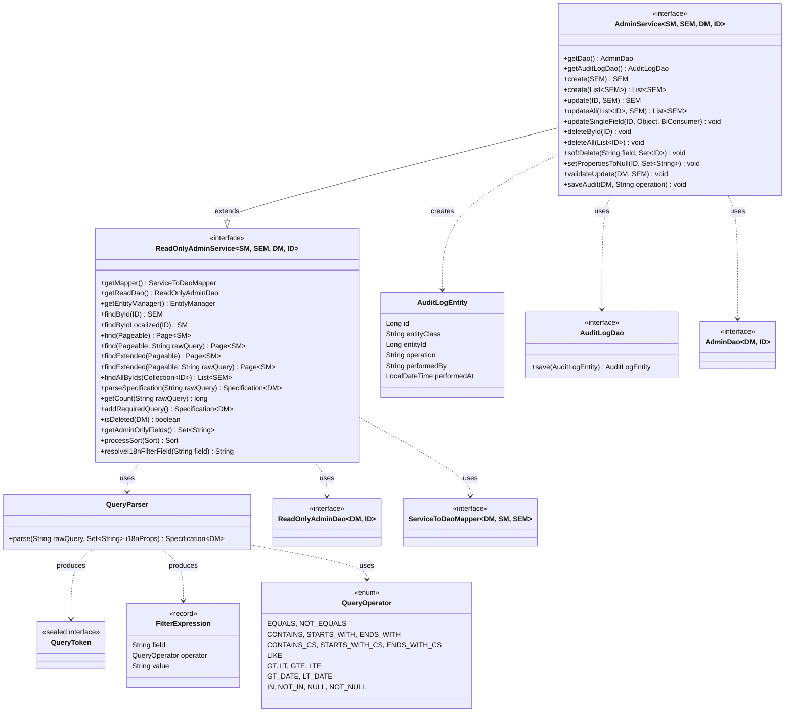
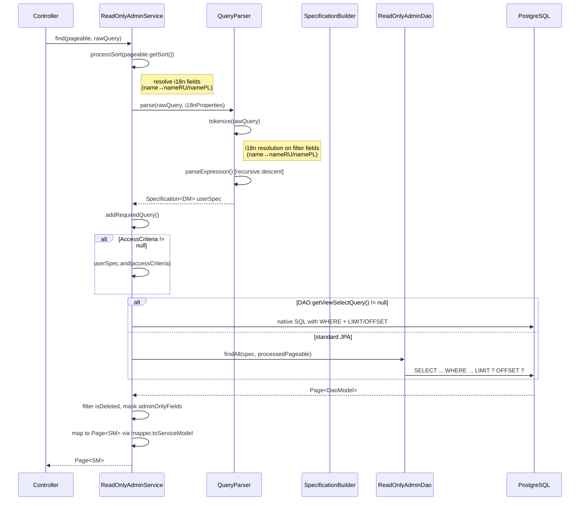
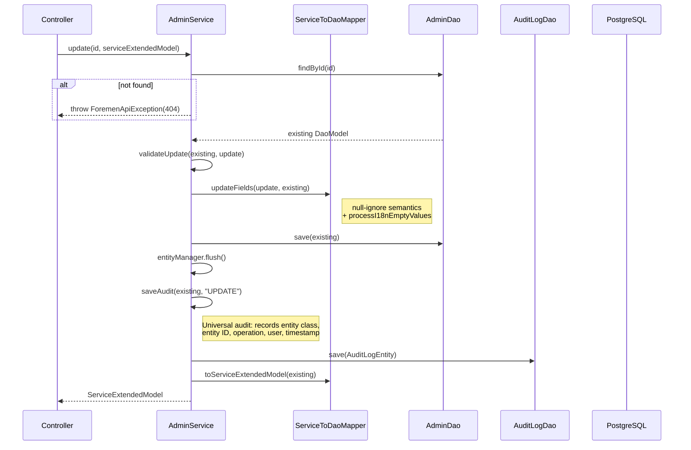
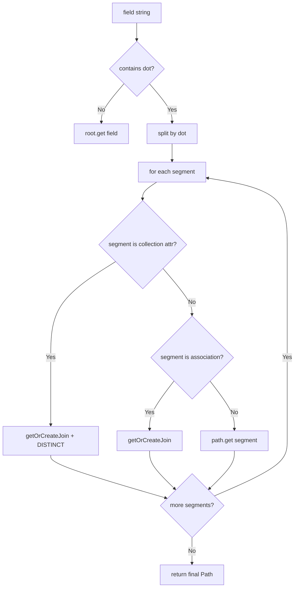
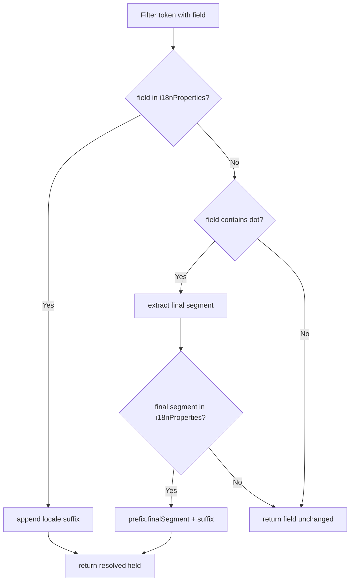
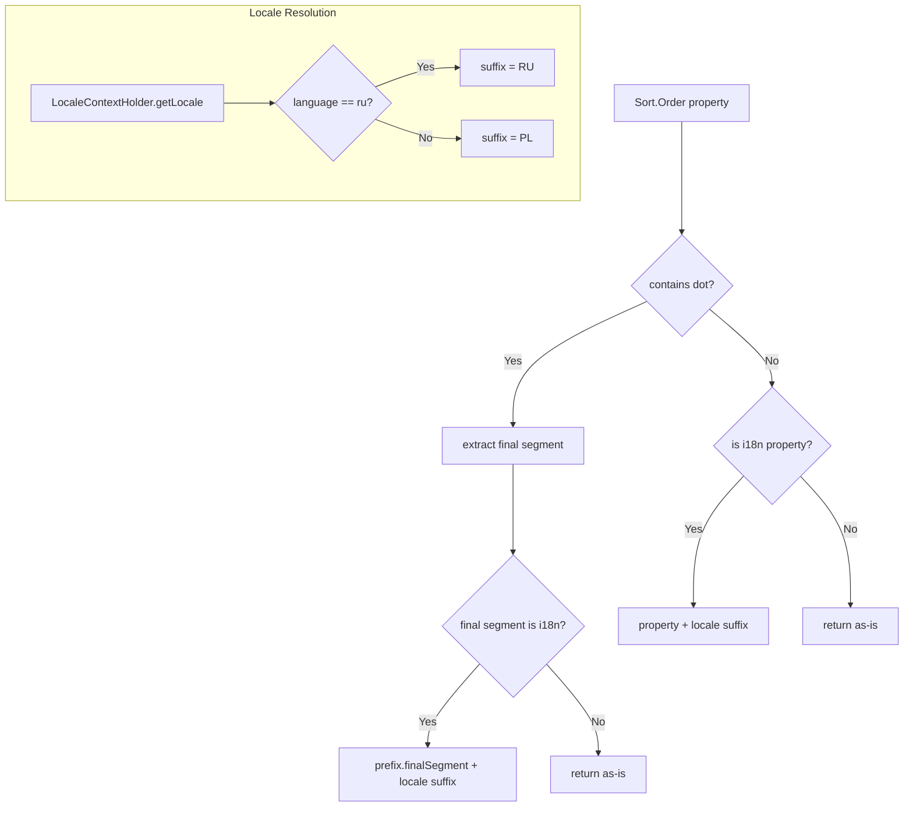

# Design Document: Generic CRUD Service Layer (FOR-01-06-crud-service)

## Overview

This design defines two generic service-layer interfaces (`ReadOnlyAdminService` and `AdminService`) that sit between the DAO layer (FOR-01-05-crud-dao) and the Controller layer. These interfaces encapsulate all reusable business logic for entity management: query parsing, pagination, specification building, i18n sort resolution, i18n filter resolution, soft-delete filtering, permission filtering, view support, and full CRUD with universal audit logging.

The most significant component is the **QueryDSL parser** — a recursive-descent parser that transforms raw URL query strings into JPA `Specification` trees supporting full boolean logic (AND/OR, parenthesized groups, nesting) combined with access-control predicates.

### Key Design Decisions

| Decision | Rationale |
|----------|-----------|
| Default methods on interfaces (not abstract classes) | Spring can proxy interfaces. Default methods provide reusable implementations without forcing an abstract class hierarchy. Concrete services implement the interface and provide the necessary DAO/mapper/EntityManager via getter methods. |
| Recursive-descent parser for QueryDSL | Full boolean DSL with parentheses and nesting requires recursive parsing. Recursive descent is clean, testable, and the grammar is small enough that no parser-generator is needed. |
| `Specification<DaoModel>` as the query IR | JPA Criteria API Specifications compose naturally (`.and()`, `.or()`), integrate with Spring Data's `findAll(Specification, Pageable)`, and decouple parsing from execution. |
| AccessCriteria wraps user query entirely | `(user_query) AND (access_criteria)` ensures OR-groups in the user query never bypass access restrictions. If distributed, `a OR b AND access` would mean `a OR (b AND access)` — a security hole. |
| Nested field navigation via dot-notation | Provides flexible filtering across entity relationships without per-entity custom specifications. JPA Criteria API natively supports `root.get("a").get("b")` navigation and `root.join("collection")`. |
| Collection join detection INSIDE `SpecificationBuilder.resolvePath` | The `resolvePath` method internally inspects each path segment's metamodel attribute. If it's a collection (`PluralAttribute`), it automatically uses JOIN. No user-facing distinction — the user simply writes `tasks.status==completed` and the builder handles it. |
| Sort reuse of same Join instance | JPA requires that `JOIN` instances be reused within the same `CriteriaQuery`. Creating duplicate joins produces Cartesian products. The service tracks joins in a `Map<String, Join>` during spec/sort construction. |
| I18n sort resolution at service layer | The service layer has access to both the mapper's `getI18nSupportedProperties()` and the current `LocaleContextHolder`. Resolving sort fields here keeps the DAO layer locale-agnostic. |
| I18n filter resolution BEFORE predicate building | When the user queries `name==John` and `name` is in `getI18nSupportedProperties()`, the query parser resolves it to `nameRU==John` or `namePL==John` depending on the current locale from `LocaleContextHolder`. This happens in the `parseSpecification` flow before `SpecificationBuilder` constructs predicates, so the correct DB column is queried. Mirrors the sort resolution approach. |
| `validateUpdate` hook as default no-op | Allows subclasses to inject pre-update validation (e.g., status transition checks) without polluting the generic update flow. No-op default means no overhead for entities that don't need validation. |
| Universal `saveAudit` default implementation | Records operation type, entity class, entity ID, timestamp, and the user who performed the operation into a generic `AuditLog` table. Works identically for ALL entities without override. Subclasses CAN override for entity-specific extended auditing (e.g., field-level diffs), but the default is a real, working audit mechanism — NOT a no-op. |
| `setPropertiesToNull` via CriteriaUpdate | Direct JPA update avoids loading the full entity into memory, fetching it from the DB, nulling fields, and saving. More efficient for targeted field nullification. |
| `softDelete` via CriteriaUpdate | Same rationale — targeted field update without full entity hydration. |
| View support via native SQL | Some read-only use cases require aggregations or joins that are awkward in JPQL. Native SQL with the DAO's `getViewSelectQuery()` provides full SQL flexibility while maintaining pagination/filtering through programmatic query construction. |
| No semicolon in DSL | Only `AND` and `OR` are valid expression combinators. Semicolons are not supported. This eliminates ambiguity and simplifies the grammar. |
| Full operator set with case-sensitive/insensitive text search | Provides comprehensive filtering without requiring custom specification code per entity. Includes numeric comparisons (`>`, `<`, `>=`, `<=`), case-insensitive text search (`~ct~`, `~sw~`, `~ew~`), case-sensitive text search (`~CT~`, `~SW~`, `~EW~`), and the legacy `~~` as an alias for `~ct~`. |

### Research Findings

| Topic | Finding |
|-------|---------|
| Spring Data JPA 4.x Specification | `Specification<T>` is a functional interface with `toPredicate(Root, CriteriaQuery, CriteriaBuilder)`. `.and()` and `.or()` static methods compose specifications. No breaking changes from Spring Data 3 → 4. |
| JPA Criteria API Join reuse | `Root.join()` creates a new JOIN each call. To reuse, store the `Join` instance in a map keyed by association name. `root.getJoins()` returns existing joins but is unordered. |
| `EntityManager.createNativeQuery` with pagination | Native queries support `setFirstResult(offset)` and `setMaxResults(limit)`. Count query must be constructed separately for `Page` responses. |
| `CriteriaUpdate` for partial field updates | `CriteriaBuilder.createCriteriaUpdate(entityClass)` + `.set(fieldName, value)` + `.where(predicate)`. Executed via `entityManager.createQuery(cu).executeUpdate()`. Requires explicit flush if subsequent reads need consistency. |
| Recursive descent parsing in Java | Standard technique: tokenize input into a token stream, then use methods per grammar rule. Each method consumes tokens and returns an AST node (or in our case, a `Specification`). |
| Spring Boot 4 + Java 25 | Records and sealed interfaces work well for AST/token representations. Pattern matching in switch statements simplifies parser dispatch. |
| JPA Metamodel `PluralAttribute` detection | `root.getModel().getAttribute(name)` returns an `Attribute`. Checking `attr.isCollection()` identifies collection associations (OneToMany, ManyToMany). This allows automatic JOIN detection inside `resolvePath`. |
| Spring Security `SecurityContextHolder` | `SecurityContextHolder.getContext().getAuthentication().getName()` gives the current user principal. Available in service-layer default methods for universal audit logging. |

## Architecture



### Package Structure

```
com.foremen
└── service/
    ├── ReadOnlyAdminService.java           ← generic read-only service interface
    ├── AdminService.java                   ← generic read-write service interface
    ├── audit/
    │   ├── AuditLogEntity.java             ← generic audit log JPA entity
    │   └── AuditLogDao.java                ← Spring Data repository for audit logs
    └── query/
        ├── QueryParser.java                ← recursive-descent parser
        ├── QueryOperator.java              ← operator enum (full set)
        ├── QueryToken.java                 ← sealed token interface (no Semicolon)
        ├── QueryTokenizer.java             ← tokenizes raw query string
        ├── FilterExpression.java           ← parsed filter record
        └── SpecificationBuilder.java       ← builds JPA Spec from parsed tokens
```

### Request Processing Flow (Read with Query)



### Write Operation Flow (Update with Audit)



## Components and Interfaces

### 1. ReadOnlyAdminService (`com.foremen.service.ReadOnlyAdminService`)

```java
package com.foremen.service;

import com.foremen.dao.ReadOnlyAdminDao;
import com.foremen.exception.ForemenApiException;
import com.foremen.mapper.ServiceToDaoMapper;
import com.foremen.service.query.QueryParser;
import jakarta.persistence.EntityManager;
import org.springframework.data.domain.Page;
import org.springframework.data.domain.PageRequest;
import org.springframework.data.domain.Pageable;
import org.springframework.data.domain.Sort;
import org.springframework.data.jpa.domain.Specification;
import org.springframework.context.i18n.LocaleContextHolder;
import org.springframework.http.HttpStatus;

import java.util.Collection;
import java.util.List;
import java.util.Locale;
import java.util.Set;

public interface ReadOnlyAdminService<ServiceModel, ServiceExtendedModel, DaoModel, ID> {

    // --- Abstract methods (must be implemented by concrete service) ---

    ServiceToDaoMapper<DaoModel, ServiceModel, ServiceExtendedModel> getMapper();

    ReadOnlyAdminDao<DaoModel, ID> getReadDao();

    EntityManager getEntityManager();

    // --- Find by ID ---

    default ServiceExtendedModel findById(ID id) {
        DaoModel entity = getReadDao().findById(id)
                .orElseThrow(() -> new ForemenApiException(HttpStatus.NOT_FOUND, "error.entity.not.found", id));
        return getMapper().toServiceExtendedModel(entity);
    }

    default ServiceModel findByIdLocalized(ID id) {
        DaoModel entity = getReadDao().findById(id)
                .orElseThrow(() -> new ForemenApiException(HttpStatus.NOT_FOUND, "error.entity.not.found", id));
        return getMapper().toServiceModel(entity);
    }

    // --- Paginated Find ---

    default Page<ServiceModel> find(Pageable pageable) {
        return find(pageable, null);
    }

    default Page<ServiceModel> find(Pageable pageable, String rawQuery) {
        Pageable processedPageable = PageRequest.of(
                pageable.getPageNumber(),
                pageable.getPageSize(),
                processSort(pageable.getSort())
        );

        Specification<DaoModel> spec = buildFinalSpecification(rawQuery);

        Page<DaoModel> page;
        if (getReadDao().getViewSelectQuery() != null) {
            page = executeViewQuery(processedPageable, spec);
        } else {
            page = getReadDao().findAll(spec, processedPageable);
        }

        return page.map(entity -> {
            if (isDeleted(entity)) return null;
            ServiceModel model = getMapper().toServiceModel(entity);
            maskAdminOnlyFields(model);
            return model;
        });
    }

    default Page<ServiceExtendedModel> findExtended(Pageable pageable) {
        return findExtended(pageable, null);
    }

    default Page<ServiceExtendedModel> findExtended(Pageable pageable, String rawQuery) {
        Pageable processedPageable = PageRequest.of(
                pageable.getPageNumber(),
                pageable.getPageSize(),
                processSort(pageable.getSort())
        );

        Specification<DaoModel> spec = buildFinalSpecification(rawQuery);

        Page<DaoModel> page;
        if (getReadDao().getViewSelectQuery() != null) {
            page = executeViewQuery(processedPageable, spec);
        } else {
            page = getReadDao().findAll(spec, processedPageable);
        }

        return page.map(entity -> {
            if (isDeleted(entity)) return null;
            return getMapper().toServiceExtendedModel(entity);
        });
    }

    // --- Batch Find ---

    default List<ServiceExtendedModel> findAllByIds(Collection<ID> ids) {
        return getReadDao().findAllByIdIn(ids).stream()
                .filter(entity -> !isDeleted(entity))
                .map(getMapper()::toServiceExtendedModel)
                .toList();
    }

    // --- Count ---

    default long getCount(String rawQuery) {
        Specification<DaoModel> spec = buildFinalSpecification(rawQuery);
        return getReadDao().findAll(spec, Pageable.unpaged()).getTotalElements();
    }

    // --- Query Parsing (with i18n filter field resolution) ---

    default Specification<DaoModel> parseSpecification(String rawQuery) {
        if (rawQuery == null || rawQuery.isBlank()) {
            return Specification.where(null);
        }
        Set<String> i18nProperties = getMapper().getI18nSupportedProperties();
        String localeSuffix = resolveLocaleSuffix();
        return QueryParser.parse(rawQuery, getDaoModelClass(), i18nProperties, localeSuffix);
    }

    default Specification<DaoModel> buildFinalSpecification(String rawQuery) {
        Specification<DaoModel> userSpec = parseSpecification(rawQuery);
        Specification<DaoModel> accessSpec = addRequiredQuery();
        if (accessSpec != null) {
            return Specification.where(userSpec).and(accessSpec);
        }
        return userSpec;
    }

    // --- Extension Points ---

    default Specification<DaoModel> addRequiredQuery() {
        return null;
    }

    default boolean isDeleted(DaoModel entity) {
        return false;
    }

    default Set<String> getAdminOnlyFields() {
        return Set.of();
    }

    default Class<DaoModel> getDaoModelClass() {
        throw new UnsupportedOperationException("Subclass must provide DaoModel class");
    }

    // --- I18n Sort Processing ---

    default Sort processSort(Sort sort) {
        if (sort.isUnsorted()) {
            return sort;
        }

        Set<String> i18nProperties = getMapper().getI18nSupportedProperties();
        if (i18nProperties == null || i18nProperties.isEmpty()) {
            return sort;
        }

        String suffix = resolveLocaleSuffix();

        List<Sort.Order> processedOrders = sort.stream()
                .map(order -> {
                    String property = order.getProperty();
                    String resolvedProperty = resolveI18nSortProperty(property, i18nProperties, suffix);
                    return new Sort.Order(order.getDirection(), resolvedProperty);
                })
                .toList();

        return Sort.by(processedOrders);
    }

    private default String resolveI18nSortProperty(String property, Set<String> i18nProperties, String suffix) {
        // Handle nested field sorting: resolve i18n on the final segment
        if (property.contains(".")) {
            int lastDot = property.lastIndexOf('.');
            String prefix = property.substring(0, lastDot);
            String finalSegment = property.substring(lastDot + 1);
            if (i18nProperties.contains(finalSegment)) {
                return prefix + "." + finalSegment + suffix;
            }
            return property;
        }

        if (i18nProperties.contains(property)) {
            return property + suffix;
        }
        return property;
    }

    // --- I18n Filter Field Resolution ---

    default String resolveI18nFilterField(String field, Set<String> i18nProperties, String localeSuffix) {
        if (i18nProperties == null || i18nProperties.isEmpty()) {
            return field;
        }

        // Handle nested field paths: resolve i18n on the final segment
        if (field.contains(".")) {
            int lastDot = field.lastIndexOf('.');
            String prefix = field.substring(0, lastDot);
            String finalSegment = field.substring(lastDot + 1);
            if (i18nProperties.contains(finalSegment)) {
                return prefix + "." + finalSegment + localeSuffix;
            }
            return field;
        }

        if (i18nProperties.contains(field)) {
            return field + localeSuffix;
        }
        return field;
    }

    private default String resolveLocaleSuffix() {
        Locale locale = LocaleContextHolder.getLocale();
        if (locale != null && "ru".equalsIgnoreCase(locale.getLanguage())) {
            return "RU";
        }
        return "PL";
    }

    // --- View Support ---

    default Page<DaoModel> executeViewQuery(Pageable pageable, Specification<DaoModel> spec) {
        // Native SQL view query execution with pagination
        // Implementation uses EntityManager.createNativeQuery with the DAO's view SQL
        throw new UnsupportedOperationException("View query execution - to be implemented");
    }

    // --- Permission Filtering ---

    default void maskAdminOnlyFields(Object model) {
        Set<String> adminFields = getAdminOnlyFields();
        if (adminFields.isEmpty()) return;
        // Null out admin-only fields for non-admin callers
        // Check SecurityContext for admin role
    }
}
```

### 2. AdminService (`com.foremen.service.AdminService`)

```java
package com.foremen.service;

import com.foremen.dao.AdminDao;
import com.foremen.dao.ReadOnlyAdminDao;
import com.foremen.exception.ForemenApiException;
import com.foremen.mapper.ServiceToDaoMapper;
import com.foremen.service.audit.AuditLogDao;
import com.foremen.service.audit.AuditLogEntity;
import jakarta.persistence.EntityManager;
import jakarta.persistence.criteria.CriteriaBuilder;
import jakarta.persistence.criteria.CriteriaUpdate;
import jakarta.persistence.criteria.Root;
import org.springframework.http.HttpStatus;
import org.springframework.security.core.Authentication;
import org.springframework.security.core.context.SecurityContextHolder;

import java.lang.reflect.Field;
import java.time.LocalDateTime;
import java.util.List;
import java.util.Set;
import java.util.function.BiConsumer;

public interface AdminService<ServiceModel, ServiceExtendedModel, DaoModel, ID>
        extends ReadOnlyAdminService<ServiceModel, ServiceExtendedModel, DaoModel, ID> {

    AdminDao<DaoModel, ID> getDao();

    /**
     * Returns the AuditLogDao for persisting universal audit records.
     * Must be provided by the concrete service implementation.
     */
    AuditLogDao getAuditLogDao();

    default AdminDao<DaoModel, ID> getWriteDao() {
        return getDao();
    }

    @Override
    default ReadOnlyAdminDao<DaoModel, ID> getReadDao() {
        return getDao();
    }

    // --- Create ---

    default ServiceExtendedModel create(ServiceExtendedModel model) {
        DaoModel entity = getMapper().toCreateDaoModel(model);
        entity = getWriteDao().save(entity);
        getEntityManager().flush();
        saveAudit(entity, "CREATE");
        return getMapper().toServiceExtendedModel(entity);
    }

    default List<ServiceExtendedModel> create(List<ServiceExtendedModel> models) {
        List<DaoModel> entities = models.stream()
                .map(getMapper()::toCreateDaoModel)
                .toList();
        List<DaoModel> saved = getWriteDao().saveAll(entities);
        getEntityManager().flush();
        saved.forEach(entity -> saveAudit(entity, "CREATE"));
        return saved.stream()
                .map(getMapper()::toServiceExtendedModel)
                .toList();
    }

    // --- Update ---

    default ServiceExtendedModel update(ID id, ServiceExtendedModel model) {
        DaoModel existing = getReadDao().findById(id)
                .orElseThrow(() -> new ForemenApiException(HttpStatus.NOT_FOUND, "error.entity.not.found", id));
        validateUpdate(existing, model);
        getMapper().updateFields(model, existing);
        DaoModel saved = getWriteDao().save(existing);
        getEntityManager().flush();
        saveAudit(saved, "UPDATE");
        return getMapper().toServiceExtendedModel(saved);
    }

    default List<ServiceExtendedModel> updateAll(List<ID> ids, ServiceExtendedModel model) {
        return ids.stream()
                .map(id -> update(id, model))
                .toList();
    }

    default <V> void updateSingleField(ID id, V value, BiConsumer<DaoModel, V> setter) {
        DaoModel existing = getReadDao().findById(id)
                .orElseThrow(() -> new ForemenApiException(HttpStatus.NOT_FOUND, "error.entity.not.found", id));
        setter.accept(existing, value);
        getWriteDao().save(existing);
        getEntityManager().flush();
    }

    default void validateUpdate(DaoModel existing, ServiceExtendedModel update) {
        // No-op default — subclasses override for custom validation
    }

    // --- Delete ---

    default void deleteById(ID id) {
        DaoModel entity = getReadDao().findById(id)
                .orElseThrow(() -> new ForemenApiException(HttpStatus.NOT_FOUND, "error.entity.not.found", id));
        saveAudit(entity, "DELETE");
        getWriteDao().deleteById(id);
        getEntityManager().flush();
    }

    default void deleteAll(List<ID> ids) {
        // Audit each deletion
        getReadDao().findAllByIdIn(ids).forEach(entity -> saveAudit(entity, "DELETE"));
        getWriteDao().deleteAllById(ids);
        getEntityManager().flush();
    }

    default void softDelete(String fieldName, Set<ID> ids) {
        // Audit before soft delete
        getReadDao().findAllByIdIn(ids).forEach(entity -> saveAudit(entity, "SOFT_DELETE"));

        CriteriaBuilder cb = getEntityManager().getCriteriaBuilder();
        CriteriaUpdate<DaoModel> cu = (CriteriaUpdate<DaoModel>) cb.createCriteriaUpdate(getDaoModelClass());
        Root<DaoModel> root = cu.from(getDaoModelClass());
        cu.set(fieldName, true);
        cu.where(root.get("id").in(ids));
        getEntityManager().createQuery(cu).executeUpdate();
        getEntityManager().flush();
    }

    default void setPropertiesToNull(ID id, Set<String> propertyNames) {
        // Validate property names exist on the entity
        Class<DaoModel> entityClass = getDaoModelClass();
        for (String propertyName : propertyNames) {
            if (!fieldExistsOnEntity(entityClass, propertyName)) {
                throw new ForemenApiException(HttpStatus.BAD_REQUEST,
                        "error.invalid.field.name", propertyName);
            }
        }

        CriteriaBuilder cb = getEntityManager().getCriteriaBuilder();
        CriteriaUpdate<DaoModel> cu = (CriteriaUpdate<DaoModel>) cb.createCriteriaUpdate(entityClass);
        Root<DaoModel> root = cu.from(entityClass);

        for (String propertyName : propertyNames) {
            cu.set(root.get(propertyName), (Object) null);
        }

        cu.where(cb.equal(root.get("id"), id));
        getEntityManager().createQuery(cu).executeUpdate();
        getEntityManager().flush();
    }

    // --- Universal Audit ---

    /**
     * Universal audit implementation. Records operation type, entity class, entity ID,
     * timestamp, and the user who performed the operation into the AuditLog table.
     * Works identically for ALL entities. Subclasses MAY override for extended
     * entity-specific audit (e.g., field-level diffs), but the default is a REAL
     * working audit mechanism.
     */
    default void saveAudit(DaoModel entity, String operation) {
        Long entityId = extractEntityId(entity);
        String entityClassName = entity.getClass().getSimpleName();
        String performedBy = resolveCurrentUser();

        AuditLogEntity auditLog = new AuditLogEntity();
        auditLog.setEntityClass(entityClassName);
        auditLog.setEntityId(entityId);
        auditLog.setOperation(operation);
        auditLog.setPerformedBy(performedBy);
        auditLog.setPerformedAt(LocalDateTime.now());

        getAuditLogDao().save(auditLog);
    }

    // --- Utility ---

    private default boolean fieldExistsOnEntity(Class<?> entityClass, String fieldName) {
        Class<?> current = entityClass;
        while (current != null && current != Object.class) {
            try {
                current.getDeclaredField(fieldName);
                return true;
            } catch (NoSuchFieldException e) {
                current = current.getSuperclass();
            }
        }
        return false;
    }

    private default Long extractEntityId(DaoModel entity) {
        try {
            Field idField = findField(entity.getClass(), "id");
            if (idField == null) {
                return null;
            }
            idField.setAccessible(true);
            Object id = idField.get(entity);
            return id instanceof Long longId ? longId : null;
        } catch (IllegalAccessException e) {
            return null;
        }
    }

    private default Field findField(Class<?> clazz, String fieldName) {
        Class<?> current = clazz;
        while (current != null && current != Object.class) {
            try {
                return current.getDeclaredField(fieldName);
            } catch (NoSuchFieldException e) {
                current = current.getSuperclass();
            }
        }
        return null;
    }

    private default String resolveCurrentUser() {
        Authentication auth = SecurityContextHolder.getContext().getAuthentication();
        if (auth != null && auth.isAuthenticated()) {
            return auth.getName();
        }
        return "SYSTEM";
    }
}
```

### 3. AuditLogEntity (`com.foremen.service.audit.AuditLogEntity`)

```java
package com.foremen.service.audit;

import com.foremen.dao.model.BaseEntity;
import jakarta.persistence.Column;
import jakarta.persistence.Entity;
import jakarta.persistence.Table;
import lombok.Getter;
import lombok.Setter;

import java.time.LocalDateTime;

@Entity
@Table(name = "audit_log")
@Getter
@Setter
public class AuditLogEntity extends BaseEntity {

    @Column(name = "entity_class", nullable = false, length = 255)
    private String entityClass;

    @Column(name = "entity_id")
    private Long entityId;

    @Column(name = "operation", nullable = false, length = 50)
    private String operation;

    @Column(name = "performed_by", nullable = false, length = 255)
    private String performedBy;

    @Column(name = "performed_at", nullable = false)
    private LocalDateTime performedAt;
}
```

### 4. AuditLogDao (`com.foremen.service.audit.AuditLogDao`)

```java
package com.foremen.service.audit;

import org.springframework.data.jpa.repository.JpaRepository;
import org.springframework.stereotype.Repository;

@Repository
public interface AuditLogDao extends JpaRepository<AuditLogEntity, Long> {
}
```

### 5. QueryOperator (`com.foremen.service.query.QueryOperator`)

```java
package com.foremen.service.query;

public enum QueryOperator {
    // Equality
    EQUALS("=="),
    NOT_EQUALS("!="),

    // Text search (case-insensitive)
    CONTAINS("~ct~"),
    STARTS_WITH("~sw~"),
    ENDS_WITH("~ew~"),

    // Text search (case-sensitive)
    CONTAINS_CS("~CT~"),
    STARTS_WITH_CS("~SW~"),
    ENDS_WITH_CS("~EW~"),

    // Legacy LIKE — alias for CONTAINS (case-insensitive). Backward compatible.
    LIKE("~~"),

    // Numeric comparison
    GREATER_THAN(">"),
    LESS_THAN("<"),
    GREATER_THAN_OR_EQUAL(">="),
    LESS_THAN_OR_EQUAL("<="),

    // Date comparison
    GT_DATE(">date"),
    LT_DATE("<date"),

    // Set membership
    IN("~in~"),
    NOT_IN("~notin~"),

    // Null checks
    NULL("~null~"),
    NOT_NULL("~notnull~");

    private final String symbol;

    QueryOperator(String symbol) {
        this.symbol = symbol;
    }

    public String getSymbol() {
        return symbol;
    }

    /**
     * Ordered list of operator symbols for tokenizer matching.
     * Longest symbols first to avoid partial matches (e.g., ">=" before ">").
     */
    public static final java.util.List<QueryOperator> ORDERED_FOR_MATCHING = java.util.List.of(
            NOT_NULL, NOT_IN, NULL, IN,                             // tilde-wrapped (longest first)
            CONTAINS, STARTS_WITH, ENDS_WITH,                      // case-insensitive text
            CONTAINS_CS, STARTS_WITH_CS, ENDS_WITH_CS,             // case-sensitive text
            GT_DATE, LT_DATE,                                      // date (before > and <)
            GREATER_THAN_OR_EQUAL, LESS_THAN_OR_EQUAL,             // >= and <= before > and <
            GREATER_THAN, LESS_THAN,                               // numeric
            EQUALS, NOT_EQUALS,                                    // == and != before single =
            LIKE                                                   // ~~ last (legacy alias)
    );
}
```

### 6. QueryToken (`com.foremen.service.query.QueryToken`)

```java
package com.foremen.service.query;

public sealed interface QueryToken {

    record Filter(String field, QueryOperator operator, String value) implements QueryToken {}

    record And() implements QueryToken {}

    record Or() implements QueryToken {}

    record OpenParen() implements QueryToken {}

    record CloseParen() implements QueryToken {}
}
```

### 7. QueryParser (`com.foremen.service.query.QueryParser`)

The parser implements a recursive-descent algorithm for the following grammar:

```
query       := expression (('AND' | 'OR') expression)*
expression  := '(' query ')' | filter
filter      := field OPERATOR value
OPERATOR    := '==' | '!=' | '~~' | '~ct~' | '~sw~' | '~ew~' | '~CT~' | '~SW~' | '~EW~'
             | '>=' | '<=' | '>' | '<' | '>date' | '<date'
             | '~in~' | '~notin~' | '~null~' | '~notnull~'
```

```java
package com.foremen.service.query;

import com.foremen.exception.ForemenApiException;
import org.springframework.data.jpa.domain.Specification;
import org.springframework.http.HttpStatus;

import java.util.List;
import java.util.Set;

public class QueryParser {

    /**
     * Parses a raw query string into a JPA Specification, resolving i18n field names.
     *
     * @param rawQuery      the query DSL string (e.g., "name==John AND age>25")
     * @param entityClass   the target JPA entity class
     * @param i18nProperties set of i18n-supported property base names (e.g., {"name", "description"})
     * @param localeSuffix  the locale suffix to append (e.g., "RU" or "PL")
     * @return a JPA Specification representing the parsed query
     */
    public static <T> Specification<T> parse(String rawQuery, Class<T> entityClass,
                                              Set<String> i18nProperties, String localeSuffix) {
        if (rawQuery == null || rawQuery.isBlank()) {
            return Specification.where(null);
        }

        List<QueryToken> tokens = QueryTokenizer.tokenize(rawQuery);

        // Resolve i18n fields in filter tokens BEFORE building specifications
        List<QueryToken> resolvedTokens = resolveI18nFilterFields(tokens, i18nProperties, localeSuffix);

        TokenStream stream = new TokenStream(resolvedTokens);
        Specification<T> result = parseQuery(stream, entityClass);

        if (stream.hasMore()) {
            throw new ForemenApiException(HttpStatus.BAD_REQUEST,
                    "error.query.parse.unexpected.token", stream.peek().toString());
        }

        return result;
    }

    /**
     * Resolves i18n field names in all Filter tokens.
     * If a filter's field (or its final dot-notation segment) is in i18nProperties,
     * appends the localeSuffix.
     */
    private static List<QueryToken> resolveI18nFilterFields(List<QueryToken> tokens,
                                                             Set<String> i18nProperties,
                                                             String localeSuffix) {
        if (i18nProperties == null || i18nProperties.isEmpty()) {
            return tokens;
        }

        return tokens.stream().map(token -> {
            if (token instanceof QueryToken.Filter filter) {
                String resolvedField = resolveFieldName(filter.field(), i18nProperties, localeSuffix);
                return new QueryToken.Filter(resolvedField, filter.operator(), filter.value());
            }
            return token;
        }).toList();
    }

    private static String resolveFieldName(String field, Set<String> i18nProperties, String localeSuffix) {
        if (field.contains(".")) {
            int lastDot = field.lastIndexOf('.');
            String prefix = field.substring(0, lastDot);
            String finalSegment = field.substring(lastDot + 1);
            if (i18nProperties.contains(finalSegment)) {
                return prefix + "." + finalSegment + localeSuffix;
            }
            return field;
        }

        if (i18nProperties.contains(field)) {
            return field + localeSuffix;
        }
        return field;
    }

    private static <T> Specification<T> parseQuery(TokenStream stream, Class<T> entityClass) {
        Specification<T> left = parseExpression(stream, entityClass);

        while (stream.hasMore()) {
            QueryToken token = stream.peek();
            switch (token) {
                case QueryToken.And ignored -> {
                    stream.consume();
                    Specification<T> right = parseExpression(stream, entityClass);
                    left = Specification.where(left).and(right);
                }
                case QueryToken.Or ignored -> {
                    stream.consume();
                    Specification<T> right = parseExpression(stream, entityClass);
                    left = Specification.where(left).or(right);
                }
                case QueryToken.CloseParen ignored -> {
                    // End of parenthesized group — return to caller
                    break;
                }
                default -> throw new ForemenApiException(HttpStatus.BAD_REQUEST,
                        "error.query.parse.unexpected.token", token.toString());
            }
            if (token instanceof QueryToken.CloseParen) break;
        }

        return left;
    }

    private static <T> Specification<T> parseExpression(TokenStream stream, Class<T> entityClass) {
        QueryToken token = stream.peek();
        if (token instanceof QueryToken.OpenParen) {
            stream.consume(); // consume '('
            Specification<T> inner = parseQuery(stream, entityClass);
            expectToken(stream, QueryToken.CloseParen.class);
            return inner;
        } else if (token instanceof QueryToken.Filter filter) {
            stream.consume();
            return SpecificationBuilder.buildPredicate(filter, entityClass);
        } else {
            throw new ForemenApiException(HttpStatus.BAD_REQUEST,
                    "error.query.parse.expected.expression", token.toString());
        }
    }

    private static void expectToken(TokenStream stream, Class<? extends QueryToken> expected) {
        if (!stream.hasMore()) {
            throw new ForemenApiException(HttpStatus.BAD_REQUEST,
                    "error.query.parse.unexpected.end");
        }
        QueryToken token = stream.consume();
        if (!expected.isInstance(token)) {
            throw new ForemenApiException(HttpStatus.BAD_REQUEST,
                    "error.query.parse.expected.token", expected.getSimpleName(), token.toString());
        }
    }
}
```

### 8. QueryTokenizer (`com.foremen.service.query.QueryTokenizer`)

```java
package com.foremen.service.query;

import com.foremen.exception.ForemenApiException;
import org.springframework.http.HttpStatus;

import java.util.ArrayList;
import java.util.List;
import java.util.regex.Matcher;
import java.util.regex.Pattern;

public class QueryTokenizer {

    private static final Pattern AND_PATTERN = Pattern.compile("\\bAND\\b", Pattern.CASE_INSENSITIVE);
    private static final Pattern OR_PATTERN = Pattern.compile("\\bOR\\b", Pattern.CASE_INSENSITIVE);

    public static List<QueryToken> tokenize(String rawQuery) {
        List<QueryToken> tokens = new ArrayList<>();
        int i = 0;
        String input = rawQuery.trim();

        while (i < input.length()) {
            char c = input.charAt(i);

            // Skip whitespace
            if (Character.isWhitespace(c)) {
                i++;
                continue;
            }

            // Parentheses
            if (c == '(') {
                tokens.add(new QueryToken.OpenParen());
                i++;
                continue;
            }
            if (c == ')') {
                tokens.add(new QueryToken.CloseParen());
                i++;
                continue;
            }

            // AND/OR keywords
            String remaining = input.substring(i);
            Matcher andMatcher = AND_PATTERN.matcher(remaining);
            if (andMatcher.lookingAt()) {
                tokens.add(new QueryToken.And());
                i += 3;
                continue;
            }
            Matcher orMatcher = OR_PATTERN.matcher(remaining);
            if (orMatcher.lookingAt()) {
                tokens.add(new QueryToken.Or());
                i += 2;
                continue;
            }

            // Filter expression: field OPERATOR value
            QueryToken.Filter filter = tryParseFilter(input, i);
            if (filter != null) {
                tokens.add(filter);
                i += filterLength(input, i, filter);
                continue;
            }

            throw new ForemenApiException(HttpStatus.BAD_REQUEST,
                    "error.query.tokenize.unexpected.char", String.valueOf(c), i);
        }

        return tokens;
    }

    private static QueryToken.Filter tryParseFilter(String input, int start) {
        // Find the next operator starting from position, ordered by length (longest first)
        for (QueryOperator op : QueryOperator.ORDERED_FOR_MATCHING) {
            String opSymbol = op.getSymbol();
            int opIndex = input.indexOf(opSymbol, start);
            if (opIndex > start && opIndex < nextDelimiterPosition(input, start)) {
                String field = input.substring(start, opIndex).trim();

                int valueStart = opIndex + opSymbol.length();
                int valueEnd = findValueEnd(input, valueStart);
                String value = input.substring(valueStart, valueEnd).trim();

                return new QueryToken.Filter(field, op, value);
            }
        }
        return null;
    }

    private static int nextDelimiterPosition(String input, int start) {
        // Find next parenthesis or AND/OR keyword
        int min = input.length();
        int paren = input.indexOf(')', start);
        if (paren > 0) min = Math.min(min, paren);
        return min;
    }

    private static int findValueEnd(String input, int start) {
        // Value ends at closing paren, whitespace+AND/OR, or end of input
        for (int i = start; i < input.length(); i++) {
            char c = input.charAt(i);
            if (c == ')' || c == '(') return i;
            if (c == ' ') {
                String remaining = input.substring(i).trim();
                if (remaining.toUpperCase().startsWith("AND") || remaining.toUpperCase().startsWith("OR")) {
                    // Verify it's a keyword (not part of a value like "ANDROID")
                    Matcher andMatcher = AND_PATTERN.matcher(remaining);
                    Matcher orMatcher = OR_PATTERN.matcher(remaining);
                    if (andMatcher.lookingAt() || orMatcher.lookingAt()) {
                        return i;
                    }
                }
            }
        }
        return input.length();
    }

    private static int filterLength(String input, int start, QueryToken.Filter filter) {
        // Calculate how many chars the filter consumed
        String filterStr = filter.field() + filter.operator().getSymbol() + filter.value();
        return filterStr.length();
    }
}
```

### 9. SpecificationBuilder (`com.foremen.service.query.SpecificationBuilder`)

```java
package com.foremen.service.query;

import com.foremen.exception.ForemenApiException;
import jakarta.persistence.criteria.*;
import jakarta.persistence.metamodel.Attribute;
import org.springframework.data.jpa.domain.Specification;
import org.springframework.http.HttpStatus;

import java.time.LocalDate;
import java.time.LocalDateTime;
import java.time.format.DateTimeParseException;
import java.util.Arrays;
import java.util.List;

public class SpecificationBuilder {

    public static <T> Specification<T> buildPredicate(QueryToken.Filter filter, Class<T> entityClass) {
        return (root, query, cb) -> {
            Path<?> path = resolvePath(root, filter.field(), query);
            return buildCriteriaPredicate(path, filter.operator(), filter.value(), cb);
        };
    }

    /**
     * Resolves a dot-notation field path to a JPA Path.
     * Internally detects collection attributes and automatically uses JOIN.
     * No external distinction needed — the caller simply passes "tasks.status"
     * and this method handles JOIN creation transparently.
     */
    @SuppressWarnings("unchecked")
    private static <T> Path<?> resolvePath(Root<T> root, String field, CriteriaQuery<?> query) {
        if (!field.contains(".")) {
            try {
                return root.get(field);
            } catch (IllegalArgumentException e) {
                throw new ForemenApiException(HttpStatus.BAD_REQUEST,
                        "error.query.invalid.field", field);
            }
        }

        // Dot-notation: navigate nested fields with automatic collection join detection
        String[] parts = field.split("\\.");
        From<?, ?> currentFrom = root;
        Path<?> currentPath = root;

        for (int i = 0; i < parts.length; i++) {
            String part = parts[i];
            try {
                if (currentFrom != null && i < parts.length - 1) {
                    // Non-terminal segment: check if it's a collection needing JOIN
                    Attribute<?, ?> attr = getAttribute(currentFrom, part);
                    if (attr != null && attr.isCollection()) {
                        // Collection attribute — use JOIN, reuse existing if present
                        currentFrom = getOrCreateJoin(currentFrom, part);
                        currentPath = currentFrom;
                        if (query != null) {
                            query.distinct(true);
                        }
                    } else {
                        // Singular association or embedded — navigate with get()
                        currentPath = currentFrom.get(part);
                        // Check if the next segment needs From context (for further joins)
                        if (attr != null && attr.isAssociation()) {
                            currentFrom = getOrCreateJoin(currentFrom, part);
                            currentPath = currentFrom;
                        } else {
                            currentFrom = null; // no longer navigable as From
                        }
                    }
                } else {
                    // Terminal segment or no From context — just get()
                    currentPath = (currentFrom != null) ? currentFrom.get(part) : currentPath.get(part);
                }
            } catch (IllegalArgumentException e) {
                throw new ForemenApiException(HttpStatus.BAD_REQUEST,
                        "error.query.invalid.field.path", field);
            }
        }

        return currentPath;
    }

    private static Attribute<?, ?> getAttribute(From<?, ?> from, String attributeName) {
        try {
            return from.getModel().getAttribute(attributeName);
        } catch (IllegalArgumentException e) {
            return null;
        }
    }

    @SuppressWarnings("unchecked")
    private static <T> Join<T, ?> getOrCreateJoin(From<?, ?> from, String attributeName) {
        // Reuse existing JOIN if already created for this attribute
        for (Join<?, ?> existingJoin : from.getJoins()) {
            if (existingJoin.getAttribute().getName().equals(attributeName)) {
                return (Join<T, ?>) existingJoin;
            }
        }
        return (Join<T, ?>) from.join(attributeName);
    }

    @SuppressWarnings("unchecked")
    private static Predicate buildCriteriaPredicate(Path<?> path, QueryOperator operator, String value, CriteriaBuilder cb) {
        return switch (operator) {
            // Equality
            case EQUALS -> cb.equal(path, convertValue(path, value));
            case NOT_EQUALS -> cb.notEqual(path, convertValue(path, value));

            // Text search (case-insensitive)
            case CONTAINS, LIKE -> cb.like(cb.lower((Path<String>) path), "%" + value.toLowerCase() + "%");
            case STARTS_WITH -> cb.like(cb.lower((Path<String>) path), value.toLowerCase() + "%");
            case ENDS_WITH -> cb.like(cb.lower((Path<String>) path), "%" + value.toLowerCase());

            // Text search (case-sensitive)
            case CONTAINS_CS -> cb.like((Path<String>) path, "%" + value + "%");
            case STARTS_WITH_CS -> cb.like((Path<String>) path, value + "%");
            case ENDS_WITH_CS -> cb.like((Path<String>) path, "%" + value);

            // Numeric comparison
            case GREATER_THAN -> cb.greaterThan((Path<Comparable>) path, (Comparable) convertValue(path, value));
            case LESS_THAN -> cb.lessThan((Path<Comparable>) path, (Comparable) convertValue(path, value));
            case GREATER_THAN_OR_EQUAL -> cb.greaterThanOrEqualTo((Path<Comparable>) path, (Comparable) convertValue(path, value));
            case LESS_THAN_OR_EQUAL -> cb.lessThanOrEqualTo((Path<Comparable>) path, (Comparable) convertValue(path, value));

            // Date comparison
            case GT_DATE -> cb.greaterThan((Path<LocalDateTime>) path, parseDateTime(value));
            case LT_DATE -> cb.lessThan((Path<LocalDateTime>) path, parseDateTime(value));

            // Set membership
            case IN -> ((Path<Object>) path).in(parseInValues(value));
            case NOT_IN -> cb.not(((Path<Object>) path).in(parseInValues(value)));

            // Null checks
            case NULL -> cb.isNull(path);
            case NOT_NULL -> cb.isNotNull(path);
        };
    }

    private static Object convertValue(Path<?> path, String value) {
        Class<?> javaType = path.getJavaType();
        if (javaType == Long.class || javaType == long.class) {
            return Long.parseLong(value);
        }
        if (javaType == Integer.class || javaType == int.class) {
            return Integer.parseInt(value);
        }
        if (javaType == Double.class || javaType == double.class) {
            return Double.parseDouble(value);
        }
        if (javaType == Float.class || javaType == float.class) {
            return Float.parseFloat(value);
        }
        if (javaType == Boolean.class || javaType == boolean.class) {
            return Boolean.parseBoolean(value);
        }
        if (javaType == LocalDateTime.class) {
            return parseDateTime(value);
        }
        if (javaType == LocalDate.class) {
            return LocalDate.parse(value);
        }
        return value; // String default
    }

    private static LocalDateTime parseDateTime(String value) {
        try {
            return LocalDateTime.parse(value);
        } catch (DateTimeParseException e) {
            try {
                return LocalDate.parse(value).atStartOfDay();
            } catch (DateTimeParseException e2) {
                throw new ForemenApiException(HttpStatus.BAD_REQUEST,
                        "error.query.invalid.date", value);
            }
        }
    }

    private static List<Object> parseInValues(String value) {
        return Arrays.stream(value.split(","))
                .map(String::trim)
                .map(v -> (Object) v)
                .toList();
    }
}
```

### 10. TokenStream (utility for parser)

```java
package com.foremen.service.query;

import java.util.List;

public class TokenStream {
    private final List<QueryToken> tokens;
    private int position = 0;

    public TokenStream(List<QueryToken> tokens) {
        this.tokens = tokens;
    }

    public boolean hasMore() {
        return position < tokens.size();
    }

    public QueryToken peek() {
        return tokens.get(position);
    }

    public QueryToken consume() {
        return tokens.get(position++);
    }

    public int position() {
        return position;
    }
}
```

## Data Models

### Interface Type Parameters

| Parameter | Role | Constraint |
|-----------|------|------------|
| `ServiceModel` | Locale-resolved display model | Has base `name`/`description` fields (resolved from i18n variants) |
| `ServiceExtendedModel` | Full i18n model | Has `nameRU`/`namePL`/`descriptionRU`/`descriptionPL` fields |
| `DaoModel` | JPA entity (extends `BaseEntity`) | Must be `@Entity`-annotated, naming convention `*Entity` |
| `ID` | Primary key type | Always `Long` in this project |

### AuditLogEntity (Database Schema)

```sql
CREATE TABLE audit_log (
    id              BIGSERIAL PRIMARY KEY,
    entity_class    VARCHAR(255) NOT NULL,
    entity_id       BIGINT,
    operation       VARCHAR(50)  NOT NULL,
    performed_by    VARCHAR(255) NOT NULL,
    performed_at    TIMESTAMP    NOT NULL DEFAULT NOW(),
    created_date    TIMESTAMP    NOT NULL DEFAULT NOW(),
    modified_date   TIMESTAMP    NOT NULL DEFAULT NOW()
);

CREATE INDEX idx_audit_log_entity ON audit_log (entity_class, entity_id);
CREATE INDEX idx_audit_log_performed_at ON audit_log (performed_at);
```

### QueryDSL Grammar (EBNF)

```
query       ::= expression ( ('AND' | 'OR') expression )*
expression  ::= '(' query ')' | filter
filter      ::= field operator value
field       ::= IDENTIFIER ( '.' IDENTIFIER )*
operator    ::= '==' | '!=' | '~~'
             |  '~ct~' | '~sw~' | '~ew~'
             |  '~CT~' | '~SW~' | '~EW~'
             |  '>=' | '<=' | '>' | '<'
             |  '>date' | '<date'
             |  '~in~' | '~notin~' | '~null~' | '~notnull~'
value       ::= [^()AND OR]*
IDENTIFIER  ::= [a-zA-Z][a-zA-Z0-9_]*
```

**No semicolons.** The only valid expression combinators are `AND` and `OR`.

### Operator Reference Table

| Operator | Symbol | Type | Case | Example |
|----------|--------|------|------|---------|
| Equals | `==` | Equality | exact | `status==active` |
| Not Equals | `!=` | Equality | exact | `status!=deleted` |
| Contains | `~ct~` | Text search | insensitive | `name~ct~john` |
| Starts With | `~sw~` | Text search | insensitive | `name~sw~jo` |
| Ends With | `~ew~` | Text search | insensitive | `name~ew~hn` |
| Contains (CS) | `~CT~` | Text search | sensitive | `code~CT~ABC` |
| Starts With (CS) | `~SW~` | Text search | sensitive | `code~SW~PR` |
| Ends With (CS) | `~EW~` | Text search | sensitive | `code~EW~01` |
| LIKE (legacy) | `~~` | Text search | insensitive | `name~~john` (alias for `~ct~`) |
| Greater Than | `>` | Numeric | — | `age>25` |
| Less Than | `<` | Numeric | — | `quantity<100` |
| Greater or Equal | `>=` | Numeric | — | `priority>=3` |
| Less or Equal | `<=` | Numeric | — | `price<=50` |
| After Date | `>date` | Date | — | `createdDate>date2024-01-01` |
| Before Date | `<date` | Date | — | `createdDate<date2024-12-31` |
| In Set | `~in~` | Set | — | `status~in~active,pending` |
| Not In Set | `~notin~` | Set | — | `type~notin~draft,archived` |
| Is Null | `~null~` | Null | — | `deletedAt~null~` |
| Is Not Null | `~notnull~` | Null | — | `assignee~notnull~` |

### Query Examples

| Raw Query | Parsed Structure |
|-----------|-----------------|
| `name==John` | `Filter(nameRU, EQUALS, John)` (with RU locale) |
| `name==John AND age>30` | `Filter(nameRU, EQUALS, John) AND Filter(age, GT, 30)` |
| `name~ct~john OR name~ct~jane` | `Filter(nameRU, CONTAINS, john) OR Filter(nameRU, CONTAINS, jane)` |
| `(name~sw~jo OR name~sw~ja) AND status==active` | `(nameRU SW jo OR nameRU SW ja) AND status==active` |
| `(a==1 AND (b==2 OR c==3))` | Nested: `a==1 AND (b==2 OR c==3)` |
| `address.city==Warsaw` | Nested field: `root.get("address").get("city")` |
| `tasks.status==completed` | Collection join: `root.join("tasks").get("status")` (auto-detected) |
| `createdDate>date2024-01-01` | Date filter: `createdDate > 2024-01-01T00:00:00` |
| `quantity>=10 AND quantity<=100` | Range: `quantity >= 10 AND quantity <= 100` |
| `status~in~active,pending` | IN filter: `status IN ('active', 'pending')` |
| `deletedAt~null~` | NULL check: `deletedAt IS NULL` |
| `description~ct~важн` | i18n: `descriptionRU ILIKE '%важн%'` (with RU locale) |

### Service Interface Method Summary

| Method | Interface | Return Type | Key Behavior |
|--------|-----------|-------------|--------------|
| `findById(ID)` | ReadOnlyAdminService | `ServiceExtendedModel` | 404 if not found |
| `findByIdLocalized(ID)` | ReadOnlyAdminService | `ServiceModel` | Locale-resolved, 404 if not found |
| `find(Pageable)` | ReadOnlyAdminService | `Page<ServiceModel>` | Paginated, i18n sort |
| `find(Pageable, String)` | ReadOnlyAdminService | `Page<ServiceModel>` | + query filtering with i18n field resolution |
| `findExtended(Pageable)` | ReadOnlyAdminService | `Page<ServiceExtendedModel>` | Paginated, raw i18n |
| `findExtended(Pageable, String)` | ReadOnlyAdminService | `Page<ServiceExtendedModel>` | + query filtering with i18n field resolution |
| `findAllByIds(Collection<ID>)` | ReadOnlyAdminService | `List<ServiceExtendedModel>` | Batch, partial OK |
| `parseSpecification(String)` | ReadOnlyAdminService | `Specification<DaoModel>` | QueryDSL parsing + i18n resolution |
| `getCount(String)` | ReadOnlyAdminService | `long` | Count with filter |
| `addRequiredQuery()` | ReadOnlyAdminService | `Specification<DaoModel>` | Access control hook |
| `isDeleted(DaoModel)` | ReadOnlyAdminService | `boolean` | Soft-delete check |
| `getAdminOnlyFields()` | ReadOnlyAdminService | `Set<String>` | Permission mask |
| `processSort(Sort)` | ReadOnlyAdminService | `Sort` | I18n + nested sort |
| `resolveI18nFilterField(String, Set, String)` | ReadOnlyAdminService | `String` | I18n field name resolution for filters |
| `create(SEM)` | AdminService | `ServiceExtendedModel` | Map + persist + flush + audit |
| `create(List<SEM>)` | AdminService | `List<ServiceExtendedModel>` | Batch create + audit each |
| `update(ID, SEM)` | AdminService | `ServiceExtendedModel` | Find + validate + update + audit |
| `updateAll(List<ID>, SEM)` | AdminService | `List<ServiceExtendedModel>` | Batch update |
| `updateSingleField(ID, V, BiConsumer)` | AdminService | `void` | Targeted field update |
| `deleteById(ID)` | AdminService | `void` | Audit + hard delete, 404 if not found |
| `deleteAll(List<ID>)` | AdminService | `void` | Audit each + batch hard delete |
| `softDelete(String, Set<ID>)` | AdminService | `void` | Audit + CriteriaUpdate flag field |
| `setPropertiesToNull(ID, Set<String>)` | AdminService | `void` | CriteriaUpdate null fields, validate |
| `validateUpdate(DM, SEM)` | AdminService | `void` | Hook (no-op default) |
| `saveAudit(DM, String)` | AdminService | `void` | Universal audit — records entity class, ID, operation, user, timestamp |
| `getAuditLogDao()` | AdminService | `AuditLogDao` | Provides audit log repository |

### Nested Field Path Resolution



### I18n Filter Resolution Flow



### Sort Resolution Flow



## Correctness Properties

*A property is a characteristic or behavior that should hold true across all valid executions of a system — essentially, a formal statement about what the system should do. Properties serve as the bridge between human-readable specifications and machine-verifiable correctness guarantees.*

### Property 1: Query Parser Structural Correctness (Round-Trip)

*For any* valid query AST (generated from the grammar: arbitrary combinations of filter expressions with AND/OR operators and nested parenthesized groups up to depth N), serializing the AST to a raw query string and then parsing it back via `QueryParser.parse()` SHALL produce a `Specification` that, when evaluated against the same dataset, yields the same result set as the original AST's specification.

Concretely: generate a random query tree → serialize to string → parse → apply both specs to the same in-memory dataset → result sets must be identical.

**Validates: Requirements 5.1, 5.2, 5.3, 5.4, 5.5, 5.6, 5.7, 5.8, 5.9, 5.10, 5.12, 5.13, 5.14, 5.15**

### Property 2: AccessCriteria Always Conjunctive with User Query

*For any* user query specification (including those containing OR groups) and *for any* non-null access criteria specification, calling `buildFinalSpecification` SHALL produce a specification structurally equivalent to `Specification.where(userSpec).and(accessCriteria)`. Specifically: no entity in the result set should fail the access criteria predicate, regardless of whether the user query contains OR operators.

**Validates: Requirements 5.16, 5.17**

### Property 3: I18n Sort Resolution

*For any* sort property string, *for any* set of i18n-supported properties, and *for any* locale:
- If the property (or the final segment of a dot-notation property) is in the i18n set AND locale is Russian → the output property is `property + "RU"` (or `prefix.finalSegment + "RU"` for nested)
- If the property (or the final segment of a dot-notation property) is in the i18n set AND locale is NOT Russian → the output property is `property + "PL"` (or `prefix.finalSegment + "PL"` for nested)
- If the property (or the final segment) is NOT in the i18n set → the output property equals the input property unchanged
- Sort direction (ASC/DESC) is always preserved regardless of i18n resolution

**Validates: Requirements 3.6, 10.1, 10.2, 10.3, 10.4, 18.1, 18.2, 18.4**

### Property 4: I18n Filter Field Resolution

*For any* filter field string, *for any* set of i18n-supported properties, and *for any* locale:
- If the field (or the final segment of a dot-notation field) is in the i18n set AND locale is Russian → the resolved field is `field + "RU"` (or `prefix.finalSegment + "RU"` for nested)
- If the field (or the final segment of a dot-notation field) is in the i18n set AND locale is NOT Russian → the resolved field is `field + "PL"` (or `prefix.finalSegment + "PL"` for nested)
- If the field (or the final segment) is NOT in the i18n set → the resolved field equals the input field unchanged
- The operator and value are never modified by i18n resolution

This mirrors Property 3 (sort resolution) but applies to filter fields during query parsing.

**Validates: Requirements 5.1 (i18n context)**

### Property 5: Permission Field Masking

*For any* model object and *for any* non-empty set of admin-only field names that exist on the model:
- When the caller does NOT have admin role: after `maskAdminOnlyFields`, each field in the admin-only set SHALL be `null` on the model
- When the caller HAS admin role: after `maskAdminOnlyFields`, all fields on the model SHALL retain their original values unchanged

**Validates: Requirements 8.2, 8.3**

### Property 6: Nested Field Path Parsing with Automatic Join Detection

*For any* valid dot-notation field path string (1 to N dot-separated segments where each segment is a valid Java identifier), the `SpecificationBuilder.resolvePath` method SHALL:
- For collection-typed segments: use `join()` and set `query.distinct(true)`
- For association-typed segments: use `join()` for navigation
- For simple attribute segments: use `get()`
- The same JOIN instance SHALL be reused for repeated references to the same collection

**Validates: Requirements 17.1, 17.2, 17.3, 17.4, 17.5**

### Property 7: Universal Audit Records All Write Operations

*For any* entity and *for any* write operation (CREATE, UPDATE, DELETE, SOFT_DELETE), the `saveAudit` method SHALL persist an `AuditLogEntity` with:
- `entityClass` equal to the entity's simple class name
- `entityId` equal to the entity's ID (extracted via reflection)
- `operation` equal to the operation string parameter
- `performedBy` equal to the current authenticated user (or "SYSTEM" if unauthenticated)
- `performedAt` equal to a timestamp within 1 second of the operation time

This works identically for ALL entities without requiring override.

**Validates: Requirements 15.1, 15.2, 15.3**

## Error Handling

| Scenario | Response | HTTP Status | Message Code |
|----------|----------|-------------|--------------|
| `findById` / `findByIdLocalized` with non-existent ID | `ForemenApiException` | 404 | `error.entity.not.found` |
| `update` with non-existent ID | `ForemenApiException` | 404 | `error.entity.not.found` |
| `deleteById` with non-existent ID | `ForemenApiException` | 404 | `error.entity.not.found` |
| `updateSingleField` with non-existent ID | `ForemenApiException` | 404 | `error.entity.not.found` |
| `setPropertiesToNull` with invalid field name | `ForemenApiException` | 400 | `error.invalid.field.name` |
| Query parser: unexpected token during parsing | `ForemenApiException` | 400 | `error.query.parse.unexpected.token` |
| Query parser: unexpected end of input | `ForemenApiException` | 400 | `error.query.parse.unexpected.end` |
| Query parser: expected expression but got something else | `ForemenApiException` | 400 | `error.query.parse.expected.expression` |
| Query tokenizer: unrecognized character (including `;`) | `ForemenApiException` | 400 | `error.query.tokenize.unexpected.char` |
| Query tokenizer: unrecognized operator | `ForemenApiException` | 400 | `error.query.tokenize.unexpected.char` |
| Dot-notation path references non-existent field | `ForemenApiException` | 400 | `error.query.invalid.field.path` |
| Simple field reference non-existent on entity | `ForemenApiException` | 400 | `error.query.invalid.field` |
| Date parsing failure in query value | `ForemenApiException` | 400 | `error.query.invalid.date` |
| Numeric parsing failure (e.g., `age>abc`) | `NumberFormatException` wrapped by Spring | 400 | — |
| Sort property traverses collection-typed association | `ForemenApiException` | 400 | `error.sort.collection.not.supported` |
| `parseSpecification` with null/blank rawQuery | Returns `Specification.where(null)` (no-op) | N/A | — |
| `getCount` with null/empty rawQuery | Returns total count of non-deleted entities | N/A | — |
| `addRequiredQuery()` returns null | No access filter applied, user query used alone | N/A | — |
| `isDeleted()` default | Returns `false` — entity not filtered | N/A | — |
| `getAdminOnlyFields()` default | Returns empty set — no masking | N/A | — |
| `validateUpdate()` default | No-op — update proceeds | N/A | — |
| `saveAudit()` default | **Real implementation** — records audit log entry for every write operation | N/A | — |
| Audit: entity ID extraction fails | `entityId` stored as `null` in audit log — audit still saved | N/A | — |
| Audit: no authenticated user | `performedBy` stored as `"SYSTEM"` | N/A | — |

## Testing Strategy

### Property-Based Tests (jqwik 1.9.2)

Property-based testing is highly applicable for this feature because:
- The **QueryDSL parser** is a pure function (String → Specification) with a well-defined grammar that can generate arbitrary valid inputs
- The **i18n sort resolution** is a pure function (Sort × Set<String> × Locale → Sort) with clear universal properties
- The **i18n filter resolution** is a pure function (String × Set<String> × String → String) with the same structure as sort resolution
- The **permission masking** is a pure function (Object × Set<String> × boolean → Object) with clear invariants
- The input spaces are large (arbitrary query strings, arbitrary field names, multiple locales)

**Library:** `net.jqwik:jqwik:1.9.2` (already in `build.gradle`)

**Configuration:**
- Minimum 100 iterations per property (`@Property(tries = 100)`)
- Each test annotated with a comment referencing the design property
- Tag format: `Feature: FOR-01-06-crud-service, Property N: <title>`

**Properties to implement:**

| # | Property | Generator Strategy |
|---|----------|--------------------|
| 1 | Query parser round-trip | Generate random query ASTs (tree of Filter nodes with random AND/OR operators, random nesting depth 0-3, random operators from the full enum, random alphanumeric field names and values). Serialize to string (using only AND/OR as combinators, no semicolons), parse, evaluate both against an in-memory list of random entities, compare result sets. |
| 2 | AccessCriteria conjunction | Generate random user query specs (with OR groups) and random access criteria specs. Call `buildFinalSpecification`. Evaluate the final spec against a dataset and verify no result violates the access criteria predicate (filter the result with access criteria alone — same set). |
| 3 | I18n sort resolution | Generate random sort properties (plain identifiers and dot-notation paths), random i18n property sets, random locales (RU and various non-RU). Call `processSort`. Verify: i18n properties get suffix, non-i18n unchanged, direction preserved, nested paths resolve on final segment. |
| 4 | I18n filter field resolution | Generate random field names (plain and dot-notation), random i18n property sets, random locale suffixes. Call `resolveI18nFilterField`. Verify: i18n fields get suffix, non-i18n unchanged, nested paths resolve on final segment only. |
| 5 | Permission field masking | Generate random POJOs (using test fixture with known fields), random subsets of field names as admin-only, random security context (admin/non-admin). Call `maskAdminOnlyFields`. Verify null/preserved invariant. |
| 6 | Nested field path parsing | Generate random dot-notation paths (1-4 segments, valid Java identifiers). Mock a Root/From that tracks `get()` and `join()` calls. Call `resolvePath`. Verify collection attributes trigger join + distinct, associations trigger join, simple attributes trigger get. |
| 7 | Universal audit completeness | Generate random entities (various classes, various IDs) and random operations. Call `saveAudit`. Verify the AuditLogEntity contains: correct entityClass (simple name), correct entityId, correct operation, non-null performedBy, performedAt within tolerance. |

### Custom Arbitrary Generators

```java
// Query AST generator for Properties 1-2
@Provide
Arbitrary<QueryAst> queryAsts() {
    // Leaf: random filter with full operator set
    Arbitrary<QueryAst.Filter> filters = Combinators.combine(
            Arbitraries.strings().alpha().ofMinLength(1).ofMaxLength(10), // field
            Arbitraries.of(QueryOperator.values()),                       // operator (full set)
            Arbitraries.strings().alpha().numeric().ofMinLength(1).ofMaxLength(20) // value
    ).as(QueryAst.Filter::new);

    // Recursive: AND/OR groups with nesting (no semicolons)
    return filters.map(f -> (QueryAst) f)
            .flatMap(leaf -> Arbitraries.lazyOf(
                    () -> Arbitraries.just(leaf),
                    () -> Combinators.combine(queryAsts(), queryAsts())
                            .as((l, r) -> new QueryAst.And(l, r)),
                    () -> Combinators.combine(queryAsts(), queryAsts())
                            .as((l, r) -> new QueryAst.Or(l, r))
            ));
}

// Sort/Filter property generator for Properties 3-4
@Provide
Arbitrary<String> fieldNames() {
    Arbitrary<String> simple = Arbitraries.strings().alpha().ofMinLength(2).ofMaxLength(12);
    Arbitrary<String> nested = Combinators.combine(simple, simple)
            .as((a, b) -> a + "." + b);
    Arbitrary<String> deepNested = Combinators.combine(simple, simple, simple)
            .as((a, b, c) -> a + "." + b + "." + c);
    return Arbitraries.oneOf(simple, nested, deepNested);
}

// Locale generator
@Provide
Arbitrary<Locale> locales() {
    return Arbitraries.of(
            Locale.of("ru"), Locale.of("pl"), Locale.of("en"),
            Locale.of("de"), Locale.of("fr"), Locale.ENGLISH
    );
}

// Operation generator for Property 7
@Provide
Arbitrary<String> operations() {
    return Arbitraries.of("CREATE", "UPDATE", "DELETE", "SOFT_DELETE");
}
```

### Unit Tests (Example-Based)

**Structure Tests:**
1. `ReadOnlyAdminService` interface structure — type parameters, method signatures, default methods present
2. `AdminService` interface structure — extends ReadOnlyAdminService, method signatures, `getAuditLogDao()` declared
3. `QueryOperator` enum — all 20 operators defined with correct symbols
4. `QueryToken` sealed interface — all permitted subtypes (Filter, And, Or, OpenParen, CloseParen) — NO Semicolon
5. `AuditLogEntity` structure — fields: entityClass, entityId, operation, performedBy, performedAt

**Parser Specific Examples:**
6. Simple equality: `name==John` → Filter(name, EQUALS, John)
7. Explicit AND: `a==1 AND b==2` → AND(Filter(a), Filter(b))
8. OR expression: `a==1 OR b==2` → OR(Filter(a), Filter(b))
9. Parenthesized group: `(a==1 OR b==2) AND c==3` → AND(OR(a,b), c)
10. Nested parentheses: `(a==1 AND (b==2 OR c==3))` → AND(a, OR(b,c))
11. All operators: one example per operator (==, !=, ~ct~, ~sw~, ~ew~, ~CT~, ~SW~, ~EW~, ~~, >, <, >=, <=, >date, <date, ~in~, ~notin~, ~null~, ~notnull~)
12. Nested field: `address.city==Warsaw` → Filter with dot-notation field
13. Date parsing: `createdDate>date2024-01-01` → LocalDateTime predicate
14. IN values: `status~in~active,pending` → IN predicate with list
15. Numeric comparison: `age>25 AND age<=65` → GT and LTE predicates
16. Case-insensitive contains: `name~ct~john` → ILIKE '%john%'
17. Case-sensitive starts with: `code~SW~PRJ` → LIKE 'PRJ%'
18. Legacy LIKE alias: `name~~john` produces same result as `name~ct~john`
19. Semicolons rejected: `;` in query → ForemenApiException 400

**I18n Filter Resolution Examples:**
20. Simple i18n field + RU locale: `name==John` → `nameRU==John`
21. Simple i18n field + PL locale: `name==John` → `namePL==John`
22. Non-i18n field unchanged: `status==active` → `status==active`
23. Nested i18n field: `project.name==Test` → `project.nameRU==Test` (RU locale)
24. Non-i18n nested field: `address.city==Warsaw` → `address.city==Warsaw`

**Error Condition Tests:**
25. Empty/null query → no-op specification
26. Unclosed parenthesis → ForemenApiException 400
27. Unknown operator → ForemenApiException 400
28. Invalid date format → ForemenApiException 400
29. `setPropertiesToNull` with non-existent field → 400
30. `deleteById` with non-existent ID → 404
31. `update` with non-existent ID → 404
32. Sort on collection association → 400
33. Semicolons in query → 400 (tokenizer rejects)

**Audit Default Method Tests:**
34. `saveAudit` creates AuditLogEntity with correct entityClass
35. `saveAudit` creates AuditLogEntity with correct entityId
36. `saveAudit` creates AuditLogEntity with correct operation
37. `saveAudit` uses SecurityContext for performedBy
38. `saveAudit` falls back to "SYSTEM" when no auth context

**Service Default Method Tests:**
39. `isDeleted` default returns `false`
40. `addRequiredQuery` default returns `null`
41. `getAdminOnlyFields` default returns empty set
42. `validateUpdate` default is no-op
43. `getWriteDao` delegates to `getDao`
44. `getReadDao` (on AdminService) delegates to `getDao`

### Integration Tests (Testcontainers + PostgreSQL)

1. **find with query filter** — persist entities, call `find(pageable, "field==value")`, verify filtered results
2. **find with i18n filter** — persist entities with i18n fields, query `name==Тест` with RU locale, verify `nameRU` is queried
3. **find with paginated sort** — persist entities with i18n fields, sort by "name" with RU locale, verify ordered by `nameRU`
4. **find with view query** — configure DAO with `getViewSelectQuery`, verify native SQL execution
5. **findById + findByIdLocalized** — persist entity, verify extended vs localized responses
6. **create + flush + audit** — create entity, verify ID generated, audit log entry created with correct fields
7. **update with validateUpdate hook** — subclass with validation, verify hook called before persistence, audit logged
8. **deleteById + hard delete + audit** — persist and delete, verify entity gone + audit entry with DELETE operation
9. **softDelete via CriteriaUpdate + audit** — persist entities, soft-delete, verify flag set + audit entries
10. **setPropertiesToNull** — persist entity, null specific fields, verify via findById
11. **nested field filtering** — persist entities with nested associations, query with dot-notation, verify filtered
12. **collection join filtering** — persist entities with collection associations, query with `items.status==done`, verify auto-join + distinct
13. **AccessCriteria combination** — implement `addRequiredQuery`, verify it's always applied with AND
14. **batch find** — persist N entities, findAllByIds with subset, verify partial results
15. **isDeleted filtering** — subclass with soft-delete logic, verify deleted entities excluded from find
16. **numeric comparison operators** — persist entities, query with `>`, `<`, `>=`, `<=`, verify correct filtering
17. **text search operators** — persist entities, query with `~ct~`, `~sw~`, `~ew~`, `~CT~`, `~SW~`, `~EW~`, verify case behavior
18. **audit log table populated** — perform multiple CRUD operations, query audit_log table directly, verify all operations recorded

### Test Organization

```
src/test/java/com/foremen/
└── service/
    ├── ReadOnlyAdminServiceStructureTest.java        ← reflection checks
    ├── AdminServiceStructureTest.java                ← reflection checks
    ├── audit/
    │   ├── AuditLogEntityTest.java                   ← entity structure tests
    │   └── UniversalAuditTest.java                   ← saveAudit default method tests
    ├── query/
    │   ├── QueryParserTest.java                      ← example-based parser tests
    │   ├── QueryTokenizerTest.java                   ← tokenizer unit tests
    │   ├── SpecificationBuilderTest.java             ← predicate building tests
    │   ├── QueryOperatorTest.java                    ← enum tests (full set)
    │   ├── I18nFilterResolutionTest.java             ← i18n filter field tests
    │   └── property/
    │       ├── QueryParserRoundTripPropertyTest.java  ← Property 1
    │       ├── AccessCriteriaPropertyTest.java        ← Property 2
    │       ├── I18nFilterResolutionPropertyTest.java  ← Property 4
    │       └── NestedFieldPathPropertyTest.java       ← Property 6
    ├── sort/
    │   └── property/
    │       └── I18nSortResolutionPropertyTest.java    ← Property 3
    ├── permission/
    │   └── property/
    │       └── PermissionMaskingPropertyTest.java     ← Property 5
    ├── audit/
    │   └── property/
    │       └── UniversalAuditPropertyTest.java        ← Property 7
    ├── AdminServiceDefaultMethodsTest.java            ← default method unit tests
    └── integration/
        ├── ReadOnlyAdminServiceIntegrationTest.java   ← read operations with Testcontainers
        ├── AdminServiceIntegrationTest.java           ← CRUD lifecycle with Testcontainers
        ├── QueryFilterIntegrationTest.java            ← query parsing + JPA execution
        ├── I18nFilterIntegrationTest.java             ← i18n filter resolution + JPA
        └── AuditLogIntegrationTest.java               ← audit log persistence verification
```
