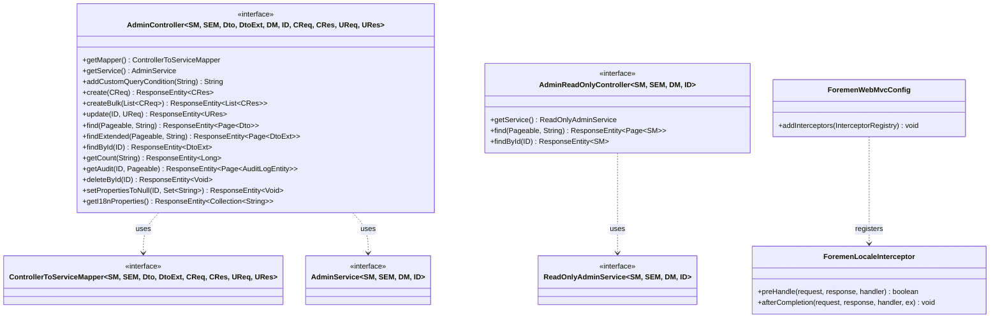
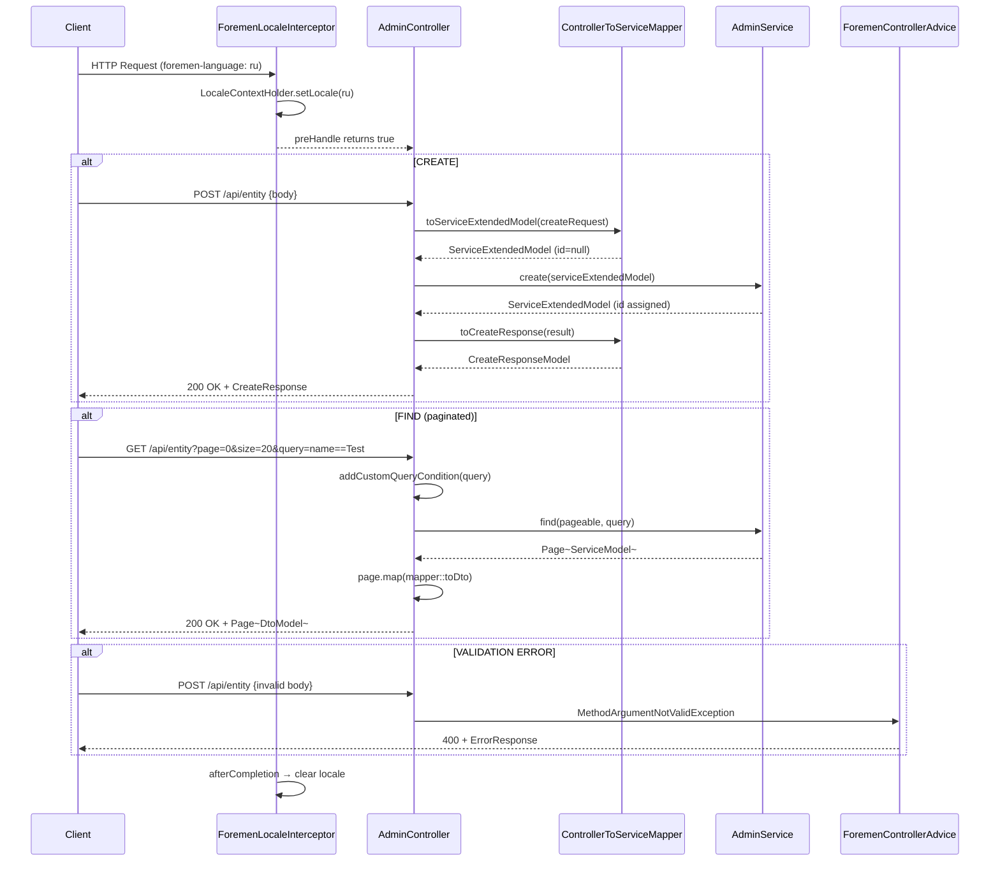

# Design Document: Generic CRUD Controller Layer (FOR-01-07-crud-controller)

## Overview

This design defines two generic controller interfaces that sit on top of the service layer (FOR-01-06-crud-service) to provide reusable REST API endpoints for entity management. It also defines a locale interceptor.

The controller layer follows the same "default methods on interfaces" pattern established in the service layer — concrete controllers implement the interface, provide `getMapper()` and `getService()`, and inherit all REST endpoints for free.

Access control for end-user operations is delegated to a dynamic ACL layer: `addRequiredQuery()` in the service layer filters visible entities, a future ACL interceptor handles operation-level permission checks, and `maskAdminOnlyFields()` provides field-level access control. This eliminates the need for a separate user-facing controller.

### Components

1. **AdminController** — full CRUD REST interface (create, read, update, delete, bulk, audit, i18n discovery)
2. **AdminReadOnlyController** — simplified read-only REST interface for reference-data entities
3. **ControllerToServiceMapper** — generic mapper interface (already defined in FOR-01-04, referenced here)
4. **ForemenLocaleInterceptor** — reads `foremen-language` header, sets `LocaleContextHolder`
5. **ForemenWebMvcConfig** — registers the interceptor via `WebMvcConfigurer`

### Key Design Decisions

| Decision | Rationale |
|----------|-----------|
| Default methods on interfaces (not abstract classes) | Same pattern as service layer. Spring proxies interfaces. Concrete controllers just implement + provide deps. Zero boilerplate for standard CRUD. |
| AdminController extends no Spring base class | Pure interface with default methods. `@RestController` and `@RequestMapping` are placed on the concrete class. This keeps the generic interface framework-annotation-free. |
| `addCustomQueryCondition(String query)` hook | Allows concrete controllers to prepend/append query conditions (e.g., tenant isolation) without overriding the full find method. Default is passthrough. |
| `@Valid` on request body parameters | Jakarta Bean Validation constraints on DTOs are enforced by Spring MVC. `ForemenControllerAdvice` handles `MethodArgumentNotValidException` → 400. |
| Access control delegated to service layer + future ACL interceptor | User-facing access is handled by `addRequiredQuery()` filtering visible entities, a future ACL interceptor for operation-level checks, and `maskAdminOnlyFields()` for field-level control. This eliminates the need for a separate user-facing controller interface. |
| ForemenLocaleInterceptor vs AcceptHeaderLocaleResolver | The project uses a custom `foremen-language` header (not standard `Accept-Language`). An interceptor gives full control over header name and cleanup. |
| `afterCompletion` clears locale | Prevents locale leaking between requests in thread-pool scenarios (Tomcat reuses threads). |
| Audit endpoint delegates to AuditLogDao directly | The service layer's `saveAudit` writes audit logs. Reading them back is a simple query on entity class + entity ID. The controller method calls the AuditLogDao through the service interface. |
| Page content mapped via mapper | The service returns `Page<ServiceModel>` or `Page<ServiceExtendedModel>`. The controller maps page content via `.map(mapper::toDto)` or `.map(mapper::toExtendedDto)`. Page metadata (totalElements, size, number) is preserved by Spring's `Page.map()`. |

### Research Findings

| Topic | Finding |
|-------|---------|
| Spring Boot 4 + `@RestController` on interfaces | Spring 7.x supports `@RequestMapping` and HTTP method annotations on default interface methods. However, best practice is to put `@RestController`/`@RequestMapping` on the concrete class and let the interface provide the method logic. This avoids proxy issues with annotation scanning. |
| Spring MVC `HandlerInterceptor` lifecycle | `preHandle` → controller method → `postHandle` → view render → `afterCompletion`. `afterCompletion` is guaranteed to run even if the handler throws. Ideal for locale cleanup. |
| `LocaleContextHolder.setLocale` thread safety | Uses `InheritableThreadLocal`. Setting in `preHandle` and clearing in `afterCompletion` is the standard pattern for request-scoped locale. |
| `@Valid` on `List<@Valid T>` | Spring MVC validates list elements when the list parameter itself has `@Valid` AND the individual items are annotated. For bulk create, using `@Valid @RequestBody List<CreateRequest>` validates each element. |
| `WebMvcConfigurer.addInterceptors` | Does not override other configurers. Multiple `WebMvcConfigurer` beans compose. Adding our interceptor doesn't affect Spring Security or other registered interceptors. |
| Spring Data `Page.map()` | `Page.map(Function)` returns a new `Page` with transformed content, preserving all pagination metadata (totalElements, totalPages, size, number, sort). |

## Architecture



### Package Structure

```
com.foremen
├── controller/
│   ├── AdminController.java                    ← generic full-CRUD interface
│   ├── AdminReadOnlyController.java            ← generic read-only admin interface
│   ├── advice/
│   │   └── ForemenControllerAdvice.java        ← (existing) exception handling
│   └── model/
│       └── mapper/
│           └── SomeEntityControllerMapper.java ← (convention) concrete mappers
├── mapper/
│   └── ControllerToServiceMapper.java          ← (existing from FOR-01-04)
└── config/
    ├── i18n/
    │   ├── MessageResolver.java                ← (existing)
    │   └── ForemenLocaleInterceptor.java       ← NEW locale interceptor
    └── web/
        └── ForemenWebMvcConfig.java            ← NEW WebMvcConfigurer
```

### Request Processing Flow



## Components and Interfaces

### 1. AdminController (`com.foremen.controller.AdminController`)

```java
package com.foremen.controller;

import com.foremen.mapper.ControllerToServiceMapper;
import com.foremen.service.AdminService;
import com.foremen.service.audit.AuditLogEntity;
import jakarta.validation.Valid;
import org.springframework.data.domain.Page;
import org.springframework.data.domain.Pageable;
import org.springframework.http.ResponseEntity;
import org.springframework.web.bind.annotation.*;

import java.util.Collection;
import java.util.List;
import java.util.Set;

public interface AdminController<
        ServiceModel,
        ServiceExtendedModel,
        DtoModel,
        DtoExtendedModel,
        DaoModel,
        ID,
        CreateRequestModel,
        CreateResponseModel,
        UpdateRequestModel,
        UpdateResponseModel> {

    ControllerToServiceMapper<ServiceModel, ServiceExtendedModel, DtoModel, DtoExtendedModel,
            CreateRequestModel, CreateResponseModel, UpdateRequestModel, UpdateResponseModel> getMapper();

    AdminService<ServiceModel, ServiceExtendedModel, DaoModel, ID> getService();

    // --- Extension Point ---

    /**
     * Hook for subclasses to append/prepend additional query conditions.
     * Default is passthrough (returns query unchanged).
     * Concrete controllers can override to add tenant isolation, status filters, etc.
     */
    default String addCustomQueryCondition(String query) {
        return query;
    }

    // --- CREATE ---

    @PostMapping
    default ResponseEntity<CreateResponseModel> create(@Valid @RequestBody CreateRequestModel request) {
        ServiceExtendedModel serviceModel = getMapper().toServiceExtendedModel(request);
        ServiceExtendedModel created = getService().create(serviceModel);
        CreateResponseModel response = getMapper().toCreateResponse(created);
        return ResponseEntity.ok(response);
    }

    @PostMapping("/bulk")
    default ResponseEntity<List<CreateResponseModel>> createBulk(
            @Valid @RequestBody List<CreateRequestModel> requests) {
        List<ServiceExtendedModel> serviceModels = requests.stream()
                .map(getMapper()::toServiceExtendedModel)
                .toList();
        List<ServiceExtendedModel> created = getService().create(serviceModels);
        List<CreateResponseModel> response = created.stream()
                .map(getMapper()::toCreateResponse)
                .toList();
        return ResponseEntity.ok(response);
    }

    // --- UPDATE ---

    @PutMapping("/{id}")
    default ResponseEntity<UpdateResponseModel> update(
            @PathVariable ID id,
            @Valid @RequestBody UpdateRequestModel request) {
        ServiceExtendedModel serviceModel = getMapper().toUpdateServiceExtendedModel(request);
        ServiceExtendedModel updated = getService().update(id, serviceModel);
        UpdateResponseModel response = getMapper().toUpdateResponse(updated);
        return ResponseEntity.ok(response);
    }

    // --- READ (paginated) ---

    @GetMapping
    default ResponseEntity<Page<DtoModel>> find(
            Pageable pageable,
            @RequestParam(name = "query", required = false) String query) {
        String processedQuery = addCustomQueryCondition(query);
        Page<ServiceModel> page = getService().find(pageable, processedQuery);
        Page<DtoModel> dtoPage = page.map(getMapper()::toDto);
        return ResponseEntity.ok(dtoPage);
    }

    @GetMapping("/extended")
    default ResponseEntity<Page<DtoExtendedModel>> findExtended(
            Pageable pageable,
            @RequestParam(name = "query", required = false) String query) {
        String processedQuery = addCustomQueryCondition(query);
        Page<ServiceExtendedModel> page = getService().findExtended(pageable, processedQuery);
        Page<DtoExtendedModel> dtoPage = page.map(getMapper()::toExtendedDto);
        return ResponseEntity.ok(dtoPage);
    }

    // --- READ (single) ---

    @GetMapping("/{id}")
    default ResponseEntity<DtoExtendedModel> findById(@PathVariable ID id) {
        ServiceExtendedModel model = getService().findById(id);
        DtoExtendedModel dto = getMapper().toExtendedDto(model);
        return ResponseEntity.ok(dto);
    }

    // --- COUNT ---

    @GetMapping("/count")
    default ResponseEntity<Long> getCount(
            @RequestParam(name = "query", required = false) String query) {
        String processedQuery = addCustomQueryCondition(query);
        long count = getService().getCount(processedQuery);
        return ResponseEntity.ok(count);
    }

    // --- AUDIT ---

    @GetMapping("/audit/{id}")
    default ResponseEntity<List<AuditLogEntity>> getAudit(@PathVariable ID id) {
        List<AuditLogEntity> auditRecords = getService().getAuditLogDao()
                .findByEntityClassAndEntityIdOrderByPerformedAtAsc(
                        getService().getDaoModelClass().getSimpleName(), id instanceof Long l ? l : null);
        return ResponseEntity.ok(auditRecords);
    }

    // --- DELETE ---

    @DeleteMapping("/{id}")
    default ResponseEntity<Void> deleteById(@PathVariable ID id) {
        getService().deleteById(id);
        return ResponseEntity.ok().build();
    }

    // --- SET PROPERTIES TO NULL ---

    @DeleteMapping("/{id}/property")
    default ResponseEntity<Void> setPropertiesToNull(
            @PathVariable ID id,
            @RequestParam(name = "properties") Set<String> properties) {
        getService().setPropertiesToNull(id, properties);
        return ResponseEntity.ok().build();
    }

    // --- I18N DISCOVERY ---

    @GetMapping("/i18n")
    default ResponseEntity<Collection<String>> getI18nProperties() {
        Collection<String> properties = getService().getMapper().getI18nSupportedProperties();
        return ResponseEntity.ok(properties);
    }
}
```

### 2. AdminReadOnlyController (`com.foremen.controller.AdminReadOnlyController`)

```java
package com.foremen.controller;

import com.foremen.service.ReadOnlyAdminService;
import org.springframework.data.domain.Page;
import org.springframework.data.domain.Pageable;
import org.springframework.http.ResponseEntity;
import org.springframework.web.bind.annotation.*;

public interface AdminReadOnlyController<ServiceModel, ServiceExtendedModel, DaoModel, ID> {

    ReadOnlyAdminService<ServiceModel, ServiceExtendedModel, DaoModel, ID> getService();

    @GetMapping
    default ResponseEntity<Page<ServiceModel>> find(
            Pageable pageable,
            @RequestParam(name = "query", required = false) String query) {
        Page<ServiceModel> page = getService().find(pageable, query);
        return ResponseEntity.ok(page);
    }

    @GetMapping("/{id}")
    default ResponseEntity<ServiceModel> findById(@PathVariable ID id) {
        ServiceModel model = getService().findByIdLocalized(id);
        return ResponseEntity.ok(model);
    }
}
```

### 3. ForemenLocaleInterceptor (`com.foremen.config.i18n.ForemenLocaleInterceptor`)

```java
package com.foremen.config.i18n;

import jakarta.servlet.http.HttpServletRequest;
import jakarta.servlet.http.HttpServletResponse;
import org.springframework.context.i18n.LocaleContextHolder;
import org.springframework.stereotype.Component;
import org.springframework.web.servlet.HandlerInterceptor;

import java.util.Locale;

@Component
public class ForemenLocaleInterceptor implements HandlerInterceptor {

    public static final String LOCALE_HEADER = "foremen-language";

    @Override
    public boolean preHandle(HttpServletRequest request, HttpServletResponse response,
                             Object handler) {
        String language = request.getHeader(LOCALE_HEADER);
        if (language != null && !language.isBlank()) {
            Locale locale = Locale.forLanguageTag(language.trim());
            LocaleContextHolder.setLocale(locale);
        }
        return true;
    }

    @Override
    public void afterCompletion(HttpServletRequest request, HttpServletResponse response,
                                Object handler, Exception ex) {
        LocaleContextHolder.resetLocaleContext();
    }
}
```

### 4. ForemenWebMvcConfig (`com.foremen.config.web.ForemenWebMvcConfig`)

```java
package com.foremen.config.web;

import com.foremen.config.i18n.ForemenLocaleInterceptor;
import org.springframework.context.annotation.Configuration;
import org.springframework.web.servlet.config.annotation.InterceptorRegistry;
import org.springframework.web.servlet.config.annotation.WebMvcConfigurer;

@Configuration
public class ForemenWebMvcConfig implements WebMvcConfigurer {

    private final ForemenLocaleInterceptor localeInterceptor;

    public ForemenWebMvcConfig(ForemenLocaleInterceptor localeInterceptor) {
        this.localeInterceptor = localeInterceptor;
    }

    @Override
    public void addInterceptors(InterceptorRegistry registry) {
        registry.addInterceptor(localeInterceptor)
                .addPathPatterns("/**");
    }
}
```

## Data Models

### Controller Type Parameter Mapping

| Interface | Type Parameters | Purpose |
|-----------|----------------|---------|
| AdminController | SM, SEM, Dto, DtoExt, DM, ID, CReq, CRes, UReq, URes | Full CRUD with all DTO types |
| AdminReadOnlyController | SM, SEM, DM, ID | Read-only, returns service models directly |

### Endpoint Summary

| HTTP Method | Path | Interface | Return Type | Description |
|-------------|------|-----------|-------------|-------------|
| POST | `/` | AdminController | `CreateResponseModel` | Create single entity |
| POST | `/bulk` | AdminController | `List<CreateResponseModel>` | Create multiple entities |
| PUT | `/{id}` | AdminController | `UpdateResponseModel` | Update entity |
| GET | `/` | AdminController | `Page<DtoModel>` | Paginated list (localized) |
| GET | `/extended` | AdminController | `Page<DtoExtendedModel>` | Paginated list (all locales) |
| GET | `/{id}` | AdminController | `DtoExtendedModel` | Get by ID (full detail) |
| GET | `/count` | AdminController | `Long` | Count with optional query |
| GET | `/audit/{id}` | AdminController | `List<AuditLogEntity>` | Audit history |
| DELETE | `/{id}` | AdminController | `void` | Hard delete |
| DELETE | `/{id}/property` | AdminController | `void` | Null specific fields |
| GET | `/i18n` | AdminController | `Collection<String>` | I18n property names |
| GET | `/` | AdminReadOnlyController | `Page<ServiceModel>` | Paginated list |
| GET | `/{id}` | AdminReadOnlyController | `ServiceModel` | Get by ID (localized) |

### Concrete Controller Convention

Each entity that needs REST endpoints implements one of the controller interfaces:

```java
// Full admin CRUD example
@RestController
@RequestMapping("/api/admin/some-entity")
public class SomeEntityAdminController implements AdminController<
        SomeEntityServiceModel,
        SomeEntityServiceExtendedModel,
        SomeEntityDto,
        SomeEntityExtendedDto,
        SomeEntity,
        Long,
        SomeEntityCreateRequest,
        SomeEntityCreateResponse,
        SomeEntityUpdateRequest,
        SomeEntityUpdateResponse> {

    private final SomeEntityControllerMapper mapper;
    private final SomeEntityService service;

    // constructor injection...

    @Override
    public SomeEntityControllerMapper getMapper() { return mapper; }

    @Override
    public SomeEntityService getService() { return service; }
}
```

### Interaction with ForemenControllerAdvice

The existing `ForemenControllerAdvice` handles all error scenarios without controller-level changes:

| Exception | Source | HTTP Status | Handler |
|-----------|--------|-------------|---------|
| `MethodArgumentNotValidException` | `@Valid` on `@RequestBody` | 400 | `handleValidationException` |
| `ConstraintViolationException` | Path/query param validation | 400 | `handleConstraintViolation` |
| `ForemenApiException(404)` | Service: entity not found | 404 | `handleForemenApiException` |
| `ForemenApiException(400)` | Service: invalid field name | 400 | `handleForemenApiException` |
| `DataIntegrityViolationException` | JPA: unique constraint | 409 | `handleDataIntegrity` |
| `AccessDeniedException` | Spring Security | 403 | `handleAccessDenied` |
| `RuntimeException` | Unexpected errors | 500 | `handleGenericException` |

## Correctness Properties

*A property is a characteristic or behavior that should hold true across all valid executions of a system — essentially, a formal statement about what the system should do. Properties serve as the bridge between human-readable specifications and machine-verifiable correctness guarantees.*

### Property 1: Create Flow Data Integrity

*For any* valid CreateRequestModel, calling the AdminController's `create` default method SHALL produce a CreateResponseModel where all non-id fields that exist in both the request and response satisfy value preservation through the mapping chain: `toServiceExtendedModel(request)` → `service.create()` → `toCreateResponse(result)`. The response SHALL contain the same field values as the request (for directly-mapped fields), plus a non-null ID assigned by the persistence layer.

**Validates: Requirements 2.1, 3.1**

### Property 2: Pagination Structure Preservation

*For any* Pageable (with arbitrary page number, size, and sort) and *for any* service result `Page<ServiceModel>`, calling `page.map(mapper::toDto)` in the controller's `find` method SHALL produce a `Page<DtoModel>` where:
- `totalElements` equals the original page's totalElements
- `number` (page index) equals the original page's number
- `size` equals the original page's size
- `content.size()` equals the original page's content size
- Each element in content is the result of `mapper.toDto(originalElement)` at the same index

This applies to AdminController.find, AdminController.findExtended, and AdminReadOnlyController.find.

**Validates: Requirements 5.1, 5.2, 7.1, 7.2, 13.3**

### Property 3: Query Passthrough to Service

*For any* query string (including null and blank), the AdminController's `find`, `findExtended`, and `getCount` default methods SHALL pass the query through `addCustomQueryCondition` and then to the service method unchanged. When `addCustomQueryCondition` is not overridden, the service receives the exact same query string the controller received.

**Validates: Requirements 5.2, 5.4, 6.1, 7.2**

### Property 4: Locale Interceptor Round-Trip

*For any* valid locale language tag string set in the `foremen-language` header, after `ForemenLocaleInterceptor.preHandle` executes, `LocaleContextHolder.getLocale()` SHALL return a Locale matching the header value. After `afterCompletion` executes, `LocaleContextHolder.getLocale()` SHALL return to the default locale (the locale context is reset), preventing locale leaking between requests.

**Validates: Requirements 17.1, 17.3**

### Property 5: Update Flow Preserves Path ID

*For any* ID and *for any* valid UpdateRequestModel, the AdminController's `update` default method SHALL invoke `getService().update(id, model)` with the exact path variable ID — never an ID from the request body. The service enforces that the entity with that ID exists and applies the update to it.

**Validates: Requirements 4.1**

## Error Handling

All error handling is delegated to the existing `ForemenControllerAdvice`. The controller interfaces themselves do NOT catch exceptions — they propagate naturally to the advice.

| Scenario | Source Layer | Exception | HTTP Status |
|----------|-------------|-----------|-------------|
| Invalid request body (missing required field, constraint violation) | Spring MVC validation | `MethodArgumentNotValidException` | 400 |
| Entity not found (findById, update, delete) | Service layer | `ForemenApiException(404, "error.entity.not.found")` | 404 |
| Invalid field name in setPropertiesToNull | Service layer | `ForemenApiException(400, "error.invalid.field.name")` | 400 |
| Invalid query syntax | Service layer (QueryParser) | `ForemenApiException(400, "error.query.parse.*")` | 400 |
| Unique constraint violation on create/update | JPA/Hibernate | `DataIntegrityViolationException` | 409 |
| Unauthorized access | Spring Security | `AccessDeniedException` | 403 |
| Unexpected runtime error | Any | `RuntimeException` | 500 |

The controller layer adds no new exception types or error codes. It is a pure delegation layer.

## Testing Strategy

### Property-Based Tests (jqwik 1.9.2)

Property-based testing is applicable for this feature because:
- The controller default methods are **pure delegation functions** with clear input→output behavior when tested with mocked dependencies
- The **locale interceptor** is a pure function (header string → locale set/clear) with a clear round-trip property
- The **pagination mapping** is a function (Page + mapper → Page) with universal structural properties

**Library:** `net.jqwik:jqwik:1.9.2` (already in `build.gradle`)

**Configuration:**
- Minimum 100 iterations per property (`@Property(tries = 100)`)
- Each test annotated with a comment referencing the design property
- Tag format: `Feature: FOR-01-07-crud-controller, Property N: <title>`

**Properties to implement:**

| # | Property | Generator Strategy |
|---|----------|--------------------|
| 1 | Create flow data integrity | Generate random test model instances (random string fields, random integer fields). Mock service to echo input with generated ID. Call `create` default method. Verify response contains all request fields plus ID. |
| 2 | Pagination structure preservation | Generate random Page objects (random totalElements 0-1000, random page number, random size 1-100, random content list). Apply `page.map(mapper::toDto)` where mapper is an identity-like mock. Verify all page metadata matches and content size matches. |
| 3 | Query passthrough | Generate random query strings (including null, empty, whitespace, alphanumeric, query DSL patterns). Call controller find/findExtended/getCount. Verify service receives exact same string. |
| 4 | Locale interceptor round-trip | Generate random locale tags ("ru", "pl", "en", "de", "fr", "uk", "ja", etc.). Set header on mock request, call preHandle, verify LocaleContextHolder matches. Then call afterCompletion, verify locale is reset. |
| 5 | Update preserves path ID | Generate random IDs (positive longs). Generate random update request models. Mock service.update to capture arguments. Call controller update. Verify captured ID matches path variable. |

### Unit Tests (Example-Based)

**Interface Structure Tests:**
1. `AdminController` interface — verifies type parameter count (10), declares `getMapper()`, `getService()`, `addCustomQueryCondition()`
2. `AdminReadOnlyController` interface — verifies type parameter count (4), declares `getService()`

**Endpoint Annotation Tests:**
3. `create` has `@PostMapping` and `@Valid @RequestBody`
4. `createBulk` has `@PostMapping("/bulk")` and `@Valid @RequestBody`
5. `update` has `@PutMapping("/{id}")` and `@Valid @RequestBody` and `@PathVariable`
6. `find` has `@GetMapping` with `@RequestParam("query")`
7. `findExtended` has `@GetMapping("/extended")`
8. `findById` has `@GetMapping("/{id}")`
9. `getCount` has `@GetMapping("/count")`
10. `getAudit` has `@GetMapping("/audit/{id}")`
11. `deleteById` has `@DeleteMapping("/{id}")`
12. `setPropertiesToNull` has `@DeleteMapping("/{id}/property")` with `@RequestParam("properties")`
13. `getI18nProperties` has `@GetMapping("/i18n")`

**Default Method Behavior Tests:**
14. `addCustomQueryCondition` returns query unchanged by default
15. `create` maps request → calls service → maps response
16. `createBulk` maps each request → calls service bulk → maps each response
17. `find` with null query → service.find(pageable, null)
18. `find` with query → service.find(pageable, query)
19. `findExtended` calls service.findExtended and maps with toExtendedDto
20. `findById` calls service.findById and maps with toExtendedDto
21. `getCount` with null query → service.getCount(null)
22. `getAudit` calls auditLogDao.findByEntityClassAndEntityId...
23. `deleteById` calls service.deleteById
24. `setPropertiesToNull` calls service.setPropertiesToNull with ID and property set
25. `getI18nProperties` calls service.getMapper().getI18nSupportedProperties()

**Locale Interceptor Tests:**
26. `preHandle` with "foremen-language: ru" → locale set to Russian
27. `preHandle` with "foremen-language: pl" → locale set to Polish
28. `preHandle` without header → locale unchanged
29. `preHandle` with blank header → locale unchanged
30. `afterCompletion` resets locale context

**Error Propagation Tests:**
31. `update` with non-existent ID → ForemenApiException(404) propagates
32. `deleteById` with non-existent ID → ForemenApiException(404) propagates
33. `setPropertiesToNull` with invalid field → ForemenApiException(400) propagates

### Integration Tests (MockMvc + Spring Context)

1. **Full create flow** — POST with valid JSON body → 200 + CreateResponse
2. **Create validation failure** — POST with empty required field → 400 + field errors
3. **Bulk create** — POST /bulk with list → 200 + list of responses
4. **Update flow** — PUT /{id} → 200 + UpdateResponse
5. **Update 404** — PUT /{nonExistentId} → 404 + ErrorResponse
6. **Find paginated** — GET /?page=0&size=10 → 200 + Page
7. **Find with query** — GET /?query=name==Test → 200 + filtered Page
8. **Find extended** — GET /extended?page=0&size=10 → 200 + Page with i18n fields
9. **Get by ID** — GET /{id} → 200 + DtoExtendedModel
10. **Get by ID 404** — GET /{nonExistentId} → 404
11. **Count** — GET /count → 200 + number
12. **Count with query** — GET /count?query=status==active → 200 + filtered count
13. **Audit** — GET /audit/{id} → 200 + list of AuditLogEntity
14. **Delete** — DELETE /{id} → 200
15. **Delete 404** — DELETE /{nonExistentId} → 404
16. **Set properties to null** — DELETE /{id}/property?properties=field1,field2 → 200
17. **I18n properties** — GET /i18n → 200 + ["name", "description"]
18. **Locale header** — GET / with foremen-language: ru → locale-resolved response
19. **No locale header** — GET / without header → default locale (PL)
20. **AdminReadOnlyController find** — GET / → 200 + Page of ServiceModel
21. **AdminReadOnlyController findById** — GET /{id} → 200 + localized ServiceModel

### Test Organization

```
src/test/java/com/foremen/
└── controller/
    ├── AdminControllerStructureTest.java               ← interface structure + annotation tests
    ├── AdminReadOnlyControllerStructureTest.java       ← interface structure tests
    ├── property/
    │   ├── CreateFlowDataIntegrityPropertyTest.java    ← Property 1
    │   ├── PaginationPreservationPropertyTest.java     ← Property 2
    │   ├── QueryPassthroughPropertyTest.java           ← Property 3
    │   ├── LocaleInterceptorPropertyTest.java          ← Property 4
    │   └── UpdatePathIdPropertyTest.java               ← Property 5
    ├── AdminControllerDefaultMethodsTest.java          ← unit tests with mocks
    └── integration/
        ├── AdminControllerIntegrationTest.java         ← MockMvc + Spring context
        ├── AdminReadOnlyControllerIntegrationTest.java ← MockMvc tests
        └── LocaleInterceptorIntegrationTest.java       ← header → locale verification
├── config/
│   ├── i18n/
│   │   └── ForemenLocaleInterceptorTest.java           ← unit tests
│   └── web/
│       └── ForemenWebMvcConfigTest.java                ← registration verification
```
