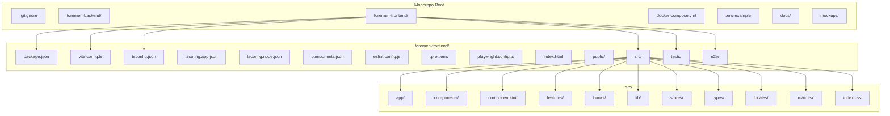
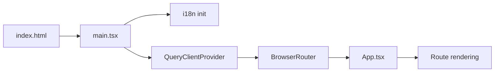
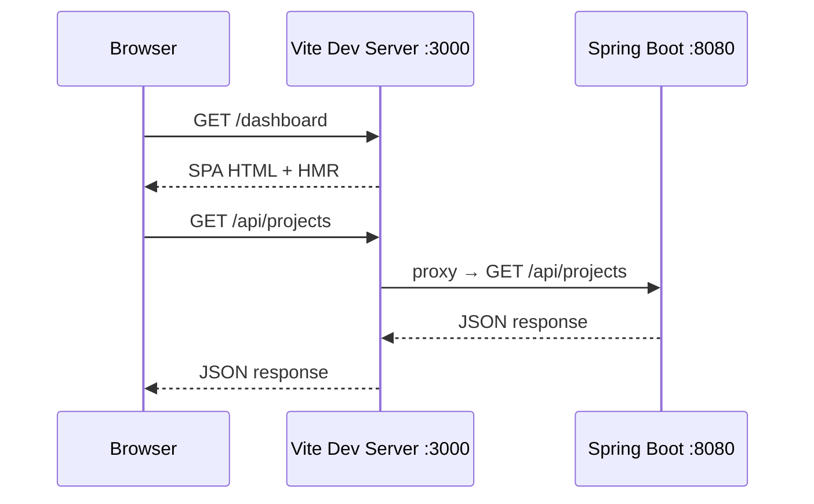

# Design Document: Frontend Project Setup (FOR-02-01-frontend-setup)

## Overview

This design covers the initialization of the Foremen admin panel frontend as a Vite 6 + React 19 + TypeScript 5 single-page application. The project resides in `foremen-frontend/` at the workspace root, as a sibling to `foremen-backend/`.

The setup establishes:
- Build tooling with Vite 6 and the `@vitejs/plugin-react` plugin
- Tailwind CSS 4 via the native `@tailwindcss/vite` plugin (no PostCSS config needed)
- shadcn/ui component library (New York style) with Radix primitives
- TanStack Query v5 for server state, Zustand for client state
- React Router v7 for client-side navigation
- React Hook Form + Zod for forms and validation
- i18next with PL/RU translation files
- Vitest + Testing Library for unit/component testing; Playwright config for E2E
- Design tokens derived from the existing dashboard mockup (dark theme)
- ESLint + Prettier for code quality
- Full-stack Docker Compose at workspace root

### Key Research Findings

| Topic | Finding | Source |
|-------|---------|--------|
| Vite | v6.x stable (released Nov 2024). Uses `@vitejs/plugin-react` v4.x for React 19 support | [vite.dev](https://vite.dev/blog/announcing-vite6) |
| Tailwind CSS 4 | CSS-first configuration via `@tailwindcss/vite` plugin. No `tailwind.config.js` or `postcss.config.js` needed. Theme defined with `@theme` in CSS | [tailwindcss.com](https://tailwindcss.com/docs/installation/using-vite) |
| shadcn/ui | Full support for Tailwind v4 + React 19. CLI: `npx shadcn@latest init`. Components installed into `src/components/ui/` | [ui.shadcn.com](https://ui.shadcn.com/docs/react-19) |
| TanStack Query | v5.x stable (latest ~5.100.x). React package: `@tanstack/react-query` | [tanstack.com](https://tanstack.com/query/v5) |
| Zustand | v5.x stable. Minimal API, hook-based state management | [npmtrends.com](https://npmtrends.com/zustand) |
| React Router | v7.x stable. Supports `createBrowserRouter` and data APIs | [reactrouter.com](https://reactrouter.com/changelog) |
| Vitest | v3.x stable (Vitest 4 exists but v3 is battle-tested with Vite 6). jsdom environment for component tests | [vitest.dev](https://vitest.dev/blog/vitest-3) |
| Playwright | v1.55.x for E2E testing | [playwright.dev](https://playwright.dev/docs/release-notes) |
| i18next | react-i18next v15.x with hooks API | [react.i18next.com](https://react.i18next.com) |

## Architecture

The frontend project follows a feature-based folder structure within the monorepo:



### Application Bootstrap Flow



### Dev Server Request Flow



## Components and Interfaces

### 1. Build Configuration (`vite.config.ts`)

```typescript
import { defineConfig } from 'vite'
import react from '@vitejs/plugin-react'
import tailwindcss from '@tailwindcss/vite'
import path from 'path'

export default defineConfig({
  plugins: [react(), tailwindcss()],
  resolve: {
    alias: {
      '@': path.resolve(__dirname, './src'),
    },
  },
  server: {
    port: 3000,
    proxy: {
      '/api': {
        target: 'http://localhost:8080',
        changeOrigin: true,
      },
    },
  },
})
```

**Key decisions:**
- `@tailwindcss/vite` plugin replaces the traditional PostCSS + `tailwind.config.js` setup (Tailwind v4 approach)
- `@/` alias configured in both Vite and TypeScript for consistent resolution
- API proxy avoids CORS issues during development

### 2. TypeScript Configuration

Three `tsconfig` files following Vite's recommended structure:

| File | Purpose |
|------|---------|
| `tsconfig.json` | Project references (points to app + node configs) |
| `tsconfig.app.json` | Source code compilation with strict mode, path aliases, JSX |
| `tsconfig.node.json` | Node-side files (vite.config.ts, playwright.config.ts) |

**Strict mode** enabled via:
- `strict: true`
- `noUncheckedIndexedAccess: true`
- `noImplicitOverride: true`

### 3. Tailwind CSS 4 + Design Tokens (`src/index.css`)

Tailwind CSS 4 uses CSS-native configuration. Design tokens are defined inside `@theme` blocks:

```css
@import "tailwindcss";

@theme {
  --color-background: #09090b;
  --color-foreground: #fafafa;
  --color-card: #09090b;
  --color-card-foreground: #fafafa;
  --color-border: #27272a;
  --color-secondary: #27272a;
  --color-secondary-foreground: #fafafa;
  --color-muted: #27272a;
  --color-muted-foreground: #a1a1aa;
  --color-accent: #27272a;
  --color-accent-foreground: #fafafa;
  --color-destructive: #7f1d1d;
  --color-success: #22c55e;
  --color-warning: #eab308;
  --color-info: #3b82f6;
  --color-primary: #fafafa;
  --color-primary-foreground: #18181b;
  --color-input: #27272a;
  --color-ring: #d4d4d8;
  --radius: 8px;
}
```

Additionally, CSS custom properties (non-Tailwind) are declared in `:root` for shadcn/ui compatibility:

```css
:root {
  --background: #09090b;
  --foreground: #fafafa;
  --card: #09090b;
  --card-foreground: #fafafa;
  --border: #27272a;
  --secondary: #27272a;
  --secondary-foreground: #fafafa;
  --muted: #27272a;
  --muted-foreground: #a1a1aa;
  --accent: #27272a;
  --accent-foreground: #fafafa;
  --destructive: #7f1d1d;
  --success: #22c55e;
  --warning: #eab308;
  --info: #3b82f6;
  --primary: #fafafa;
  --primary-foreground: #18181b;
  --input: #27272a;
  --ring: #d4d4d8;
  --radius: 8px;
}
```

**Decision rationale:** shadcn/ui components reference CSS custom properties (`var(--border)`, etc.), while Tailwind v4 uses its own `@theme` namespace for utility generation. Both are needed for full compatibility.

### 4. Typography (Global Styles in `src/index.css`)

```css
@import url('https://fonts.googleapis.com/css2?family=Inter:wght@300;400;500;600;700&display=swap');

body {
  font-family: 'Inter', -apple-system, BlinkMacSystemFont, sans-serif;
  font-size: 14px;
  line-height: 1.5;
  -webkit-font-smoothing: antialiased;
  -moz-osx-font-smoothing: grayscale;
  background: var(--background);
  color: var(--foreground);
}
```

### 5. shadcn/ui Configuration (`components.json`)

```json
{
  "$schema": "https://ui.shadcn.com/schema.json",
  "style": "new-york",
  "tailwind": {
    "config": "",
    "css": "src/index.css",
    "baseColor": "zinc",
    "cssVariables": true
  },
  "aliases": {
    "components": "@/components",
    "utils": "@/lib/utils",
    "ui": "@/components/ui",
    "hooks": "@/hooks",
    "lib": "@/lib"
  }
}
```

### 6. State Management Setup

**TanStack Query (`src/lib/query-client.ts`):**

```typescript
import { QueryClient } from '@tanstack/react-query'

export const queryClient = new QueryClient({
  defaultOptions: {
    queries: {
      staleTime: 5 * 60 * 1000,    // 5 minutes
      retry: 1,
      refetchOnWindowFocus: false,
    },
  },
})
```

**Zustand store pattern (`src/stores/`):**

Each store is a standalone file exporting a typed hook:

```typescript
import { create } from 'zustand'

interface UIState {
  sidebarOpen: boolean
  locale: 'pl' | 'ru'
  toggleSidebar: () => void
  setLocale: (locale: 'pl' | 'ru') => void
}

export const useUIStore = create<UIState>((set) => ({
  sidebarOpen: true,
  locale: 'pl',
  toggleSidebar: () => set((s) => ({ sidebarOpen: !s.sidebarOpen })),
  setLocale: (locale) => set({ locale }),
}))
```

### 7. Routing (`src/app/router.tsx`)

```typescript
import { createBrowserRouter } from 'react-router-dom'

export const router = createBrowserRouter([
  {
    path: '/',
    // Layout and routes will be added in subsequent specs
  },
])
```

### 8. Forms Infrastructure

Integration pattern (used by feature modules):

```typescript
import { useForm } from 'react-hook-form'
import { zodResolver } from '@hookform/resolvers/zod'
import { z } from 'zod'

const schema = z.object({ /* ... */ })
type FormData = z.infer<typeof schema>

const form = useForm<FormData>({
  resolver: zodResolver(schema),
})
```

No global setup required — dependencies are installed and available.

### 9. Internationalization (`src/lib/i18n.ts`)

```typescript
import i18n from 'i18next'
import { initReactI18next } from 'react-i18next'
import pl from '@/locales/pl.json'
import ru from '@/locales/ru.json'

i18n.use(initReactI18next).init({
  resources: {
    pl: { translation: pl },
    ru: { translation: ru },
  },
  lng: 'pl',
  fallbackLng: 'pl',
  interpolation: {
    escapeValue: false,
  },
  parseMissingKeyHandler: (key) => key,
})

export default i18n
```

**Translation file structure (`src/locales/pl.json`):**

```json
{
  "common": {
    "save": "Zapisz",
    "cancel": "Anuluj",
    "delete": "Usuń",
    "edit": "Edytuj",
    "loading": "Ładowanie..."
  },
  "nav": {
    "dashboard": "Panel",
    "projects": "Projekty"
  }
}
```

### 10. Application Entry Point (`src/main.tsx`)

```typescript
import React from 'react'
import ReactDOM from 'react-dom/client'
import { QueryClientProvider } from '@tanstack/react-query'
import { RouterProvider } from 'react-router-dom'
import { queryClient } from '@/lib/query-client'
import { router } from '@/app/router'
import '@/lib/i18n'
import './index.css'

ReactDOM.createRoot(document.getElementById('root')!).render(
  <React.StrictMode>
    <QueryClientProvider client={queryClient}>
      <RouterProvider router={router} />
    </QueryClientProvider>
  </React.StrictMode>,
)
```

### 11. HTML Entry (`index.html`)

```html
<!DOCTYPE html>
<html lang="pl">
<head>
  <meta charset="UTF-8" />
  <meta name="viewport" content="width=device-width, initial-scale=1.0" />
  <title>Foremen</title>
</head>
<body>
  <div id="root"></div>
  <script type="module" src="/src/main.tsx"></script>
</body>
</html>
```

### 12. Code Quality

**ESLint (`eslint.config.js`)** — flat config format with:
- `@eslint/js` recommended rules
- `typescript-eslint` for TypeScript checking
- `eslint-plugin-react-hooks` for hooks rules
- `eslint-plugin-react-refresh` for HMR correctness

**Prettier (`.prettierrc`):**

```json
{
  "semi": false,
  "singleQuote": true,
  "trailingComma": "all",
  "printWidth": 100,
  "tabWidth": 2
}
```

**npm scripts:**
- `dev` — `vite`
- `build` — `tsc -b && vite build`
- `preview` — `vite preview`
- `lint` — `eslint .`
- `format` — `prettier --write .`
- `test` — `vitest --run`
- `test:watch` — `vitest`

### 13. Docker Compose (workspace root `docker-compose.yml`)

```yaml
services:
  postgres:
    image: postgres:16
    environment:
      POSTGRES_DB: ${POSTGRES_DB}
      POSTGRES_USER: ${POSTGRES_USER}
      POSTGRES_PASSWORD: ${POSTGRES_PASSWORD}
    ports:
      - "${POSTGRES_PORT:-5432}:5432"
    volumes:
      - pgdata:/var/lib/postgresql/data
    healthcheck:
      test: ["CMD-SHELL", "pg_isready -U ${POSTGRES_USER}"]
      interval: 5s
      timeout: 3s
      retries: 5

  backend:
    build:
      context: ./foremen-backend
      dockerfile: Dockerfile
    ports:
      - "8080:8080"
    environment:
      SPRING_DATASOURCE_URL: jdbc:postgresql://postgres:5432/${POSTGRES_DB}
      SPRING_DATASOURCE_USERNAME: ${POSTGRES_USER}
      SPRING_DATASOURCE_PASSWORD: ${POSTGRES_PASSWORD}
    depends_on:
      postgres:
        condition: service_healthy

  frontend:
    build:
      context: ./foremen-frontend
      dockerfile: Dockerfile
    ports:
      - "3000:3000"
    depends_on:
      - backend

volumes:
  pgdata:
```

**`.env.example` (workspace root):**

```env
POSTGRES_DB=foremen
POSTGRES_USER=foremen
POSTGRES_PASSWORD=changeme
POSTGRES_PORT=5432
```

### 14. Vitest Configuration (`vitest.config.ts` or inline in `vite.config.ts`)

Vitest configuration will be defined via `vitest.config.ts`:

```typescript
import { defineConfig } from 'vitest/config'
import react from '@vitejs/plugin-react'
import path from 'path'

export default defineConfig({
  plugins: [react()],
  resolve: {
    alias: {
      '@': path.resolve(__dirname, './src'),
    },
  },
  test: {
    environment: 'jsdom',
    globals: true,
    setupFiles: ['./tests/setup.ts'],
  },
})
```

**Test setup (`tests/setup.ts`):**

```typescript
import '@testing-library/jest-dom'
```

### 15. Playwright Configuration (`playwright.config.ts`)

Minimal config for future E2E support:

```typescript
import { defineConfig } from '@playwright/test'

export default defineConfig({
  testDir: './e2e',
  webServer: {
    command: 'npm run dev',
    port: 3000,
    reuseExistingServer: true,
  },
  use: {
    baseURL: 'http://localhost:3000',
  },
})
```

## Data Models

This spec does not introduce runtime data models. The relevant structures are configuration schemas:

### Package Dependencies Map

| Category | Package | Version (pinned) |
|----------|---------|-----------------|
| Build | vite | 6.x |
| Build | @vitejs/plugin-react | 4.x |
| Build | typescript | 5.x |
| Styling | tailwindcss | 4.x |
| Styling | @tailwindcss/vite | 4.x |
| UI | react | 19.x |
| UI | react-dom | 19.x |
| Components | @radix-ui/* | (per shadcn/ui component) |
| Components | lucide-react | latest |
| State | @tanstack/react-query | 5.x |
| State | zustand | 5.x |
| Routing | react-router-dom | 7.x |
| Forms | react-hook-form | 7.x |
| Forms | zod | 3.x |
| Forms | @hookform/resolvers | 3.x |
| i18n | i18next | 24.x |
| i18n | react-i18next | 15.x |
| Testing | vitest | 3.x |
| Testing | @testing-library/react | 16.x |
| Testing | @testing-library/jest-dom | 6.x |
| Testing | jsdom | latest |
| E2E | @playwright/test | 1.x |
| Lint | eslint | 9.x |
| Lint | prettier | 3.x |
| Lint | typescript-eslint | 8.x |
| Lint | eslint-plugin-react-hooks | 5.x |
| Lint | eslint-plugin-react-refresh | 0.x |

### Folder Structure Contract

```
foremen-frontend/
├── index.html
├── package.json
├── vite.config.ts
├── vitest.config.ts
├── tsconfig.json
├── tsconfig.app.json
├── tsconfig.node.json
├── components.json
├── eslint.config.js
├── .prettierrc
├── playwright.config.ts
├── Dockerfile
├── public/
│   └── (static assets)
├── src/
│   ├── main.tsx
│   ├── index.css
│   ├── app/
│   │   └── router.tsx
│   ├── components/
│   │   └── ui/
│   │       └── (shadcn/ui generated files)
│   ├── features/
│   ├── hooks/
│   ├── lib/
│   │   ├── utils.ts
│   │   ├── query-client.ts
│   │   └── i18n.ts
│   ├── stores/
│   ├── types/
│   └── locales/
│       ├── pl.json
│       └── ru.json
├── tests/
│   └── setup.ts
└── e2e/
    └── (Playwright test files)
```

## Error Handling

Since this is a project initialization spec, error handling is limited to build-time and development-time failures:

| Scenario | Handling |
|----------|----------|
| Missing Node.js or npm | `package.json` engines field specifies minimum Node version (20+). Clear error on `npm install` |
| Port 3000 already in use | Vite prints clear error with suggestion to use `--port` flag |
| Backend not running (proxy fails) | Vite proxies return 502. TanStack Query retry logic handles transient backend unavailability |
| Missing translation key | `parseMissingKeyHandler` returns the key string itself (graceful degradation) |
| TypeScript compilation errors | `tsc -b` in build script fails-fast before Vite bundling |
| ESLint/Prettier conflicts | Prettier is configured as the formatter; ESLint enforces logic rules only |
| shadcn/ui component generation failure | `components.json` ensures CLI knows correct paths and style |
| Docker Compose `.env` missing | Docker fails with clear variable substitution error. `.env.example` documents all required vars |

## Testing Strategy

### Why Property-Based Testing Does NOT Apply

This feature is entirely **project scaffolding and configuration**:
- Vite and TypeScript configs are declarative — no functions with inputs/outputs
- CSS design tokens are static constants
- Docker Compose is infrastructure definition
- Folder structure creation is a one-time operation
- Library installations have no behavioral logic to test

There is no meaningful "for all inputs X, property P(X) holds" statement for this feature. No pure functions, data transformations, or algorithms are introduced.

### Recommended Testing Approach

**1. Smoke Tests (Build Verification)**
- `npm install` completes without errors
- `npm run build` produces a `dist/` folder with bundled assets
- `npm run lint` passes with no errors
- `npm run test` runs and passes (initial empty/placeholder test)

**2. Configuration Validation**
- TypeScript compilation succeeds with strict mode (`tsc --noEmit`)
- Vite dev server starts and serves `index.html`
- `@/` path alias resolves correctly in both runtime and tests
- Tailwind utility classes render correctly (verified via dev server)

**3. Integration Verification**
- i18n initialization loads both PL and RU translations
- TanStack Query client is accessible via provider
- React Router renders the root route
- API proxy forwards `/api` requests to backend (when running)

**4. Docker Compose Verification**
- `docker compose up` starts all three services (postgres, backend, frontend)
- Frontend accessible at `http://localhost:3000`
- Backend accessible at `http://localhost:8080`

**5. Initial Test File**
A single `tests/app.test.tsx` placeholder:

```typescript
import { describe, it, expect } from 'vitest'

describe('App', () => {
  it('should be configured correctly', () => {
    expect(true).toBe(true)
  })
})
```

This confirms Vitest, path aliases, and test infrastructure are wired correctly.
