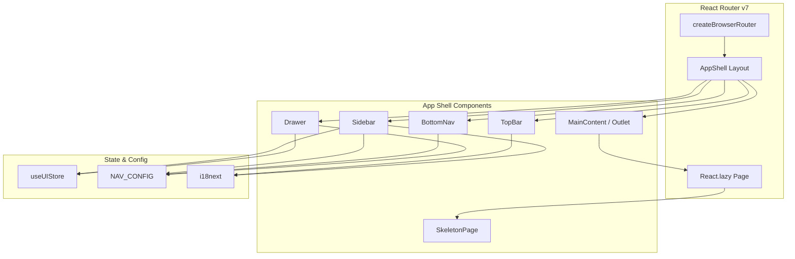
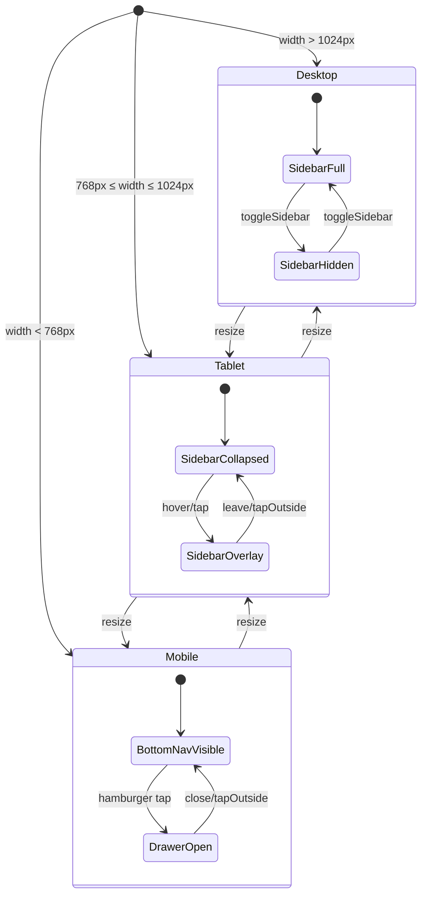

# Design Document — FOR-02-02 App Shell

## Overview

The App Shell is the root layout component of the Foremen admin panel. It provides a persistent navigation frame (Sidebar, Top Bar, Bottom Nav) around a content area where route-specific pages render. The shell adapts across three breakpoints: desktop (>1024px), tablet (768–1024px), and mobile (<768px), each with distinct navigation affordances.

Key design goals:
- Single layout component wrapping all routes via React Router v7 `Outlet`
- Centralized navigation configuration drives Sidebar, Bottom Nav, and Drawer
- Lazy-loaded pages with skeleton fallback for perceived performance
- Integration with existing `useUIStore` (Zustand) for sidebar state
- i18next-driven labels for PL/RU support
- Dark theme using existing CSS custom properties

## Architecture



### Responsive Behavior State Machine



## Components and Interfaces

### File Structure

```
src/
├── app/
│   ├── router.tsx                  # Route definitions with lazy loading
│   ├── layout/
│   │   ├── AppShell.tsx            # Root layout component
│   │   ├── Sidebar.tsx             # Desktop/Tablet sidebar
│   │   ├── TopBar.tsx              # Top bar with title + actions
│   │   ├── BottomNav.tsx           # Mobile bottom navigation
│   │   ├── Drawer.tsx              # Mobile drawer navigation
│   │   ├── NavItem.tsx             # Single navigation item (icon + label)
│   │   └── UserFooter.tsx          # Sidebar footer with user info
│   └── pages/
│       ├── DashboardPage.tsx       # Placeholder page
│       ├── ProjectsPage.tsx        # Placeholder page
│       ├── RoomsPage.tsx           # Placeholder page
│       ├── EstimatePage.tsx        # Placeholder page
│       ├── MaterialsPage.tsx       # Placeholder page
│       ├── FinancesPage.tsx        # Placeholder page
│       ├── DeliveriesPage.tsx      # Placeholder page
│       ├── UsersPage.tsx           # Placeholder page
│       └── NotFoundPage.tsx        # 404 page
├── components/
│   └── ui/
│       └── SkeletonPage.tsx        # Reusable skeleton loading component
├── config/
│   └── navigation.ts              # Centralized nav config
├── hooks/
│   ├── useBreakpoint.ts           # Responsive breakpoint hook
│   └── usePageMeta.ts             # Page title and action hook
└── stores/
    └── ui-store.ts                 # (existing) sidebarOpen + locale
```

### Component: AppShell

The root layout that composes all shell components. Rendered as the `element` of the root route in React Router.

```typescript
// src/app/layout/AppShell.tsx
interface AppShellProps {
  // No props — uses Outlet for child routes
}

// Responsibilities:
// - Reads useUIStore for sidebarOpen and locale
// - Reads useBreakpoint() for current breakpoint ('desktop' | 'tablet' | 'mobile')
// - Conditionally renders Sidebar, BottomNav, or Drawer based on breakpoint
// - Renders TopBar and Outlet (main content area)
// - Manages CSS classes for layout shifts based on sidebar state
```

### Component: Sidebar

Handles desktop (full 240px) and tablet (collapsed 64px with hover expand) modes.

```typescript
// src/app/layout/Sidebar.tsx
interface SidebarProps {
  collapsed: boolean      // true when tablet mode (64px)
  visible: boolean        // controlled by useUIStore.sidebarOpen on desktop
}

// Internal state:
// - hovered: boolean (tablet overlay expansion)
//
// Renders:
// - Header: brand icon «F» + «Foremen» text (hidden when collapsed)
// - Nav sections from NAV_CONFIG with NavItem components
// - Footer: UserFooter with avatar and user details
// - Overlay backdrop when expanded on tablet
```

### Component: TopBar

Displays the current page title, language switcher, and optional action button.

```typescript
// src/app/layout/TopBar.tsx
interface TopBarProps {
  // No props — uses hooks for page meta and locale
}

// Reads:
// - usePageMeta() for current page title (i18n key) and primary action
// - useUIStore for locale and setLocale
// - useTranslation() for rendering labels
//
// On mobile: includes hamburger button triggering toggleSidebar
```

### Component: BottomNav

Mobile-only bottom navigation bar with 5 icons.

```typescript
// src/app/layout/BottomNav.tsx
interface BottomNavProps {
  // No props — reads NAV_CONFIG for items with bottomNav: true
}

// Renders:
// - Fixed bottom bar with nav items filtered by bottomNav flag
// - Each item: icon + route, min touch target 44×44px
// - Active item highlighted with var(--foreground) color
// - Uses useLocation() from React Router for active detection
```

### Component: Drawer

Mobile slide-out panel with full navigation.

```typescript
// src/app/layout/Drawer.tsx
interface DrawerProps {
  open: boolean
  onClose: () => void
}

// Renders:
// - Slide-in panel from left with full nav config (all sections)
// - Dimmed backdrop (onClick closes drawer)
// - Close button
// - Uses same NavItem and section structure as Sidebar
```

### Component: NavItem

Reusable navigation item used in Sidebar, Drawer, and BottomNav.

```typescript
// src/app/layout/NavItem.tsx
interface NavItemProps {
  icon: string           // Lucide icon name
  labelKey: string       // i18n key
  path: string           // Route path
  active: boolean        // Whether current route matches
  collapsed?: boolean    // Icon-only mode (tablet)
  variant?: 'sidebar' | 'bottom-nav' | 'drawer'
}
```

### Component: SkeletonPage

Shared suspense fallback for lazy-loaded routes.

```typescript
// src/components/ui/SkeletonPage.tsx
interface SkeletonPageProps {
  // No props — self-contained skeleton layout
}

// Renders:
// - Title placeholder (40–60% width, shimmer animation)
// - Subtitle placeholder (60–80% width)
// - 3–6 cards with rectangular shimmer blocks
// - Responsive: 1 column on mobile, 2–3 columns on desktop
// - CSS pulse animation, 1.5–2s cycle
```

### Hook: useBreakpoint

Reactive hook that tracks the current viewport breakpoint.

```typescript
// src/hooks/useBreakpoint.ts
type Breakpoint = 'mobile' | 'tablet' | 'desktop'

function useBreakpoint(): Breakpoint
// Uses window.matchMedia for efficient viewport tracking
// Breakpoints: <768px = mobile, 768–1024px = tablet, >1024px = desktop
```

### Hook: usePageMeta

Hook that derives page title and optional action from the current route.

```typescript
// src/hooks/usePageMeta.ts
interface PageMeta {
  titleKey: string         // i18n key for page title
  action?: {
    labelKey: string       // i18n key for button text
    onClick: () => void    // Handler
  }
}

function usePageMeta(): PageMeta
// Derives from current route path by looking up NAV_CONFIG
// Falls back to a generic title if route not in config
```

## Data Models

### Navigation Configuration

```typescript
// src/config/navigation.ts
import { type LucideIcon } from 'lucide-react'

export interface NavItemConfig {
  path: string           // Route path, e.g. '/projects'
  labelKey: string       // i18n key, e.g. 'nav.projects'
  icon: string           // Lucide icon name, e.g. 'folder-kanban'
  bottomNav: boolean     // Show in mobile bottom nav
}

export interface NavSectionConfig {
  titleKey: string | null   // i18n key for section header, null for ungrouped
  items: NavItemConfig[]
}

export const NAV_CONFIG: NavSectionConfig[] = [
  {
    titleKey: null,  // No section header
    items: [
      { path: '/', labelKey: 'nav.dashboard', icon: 'layout-dashboard', bottomNav: true },
      { path: '/projects', labelKey: 'nav.projects', icon: 'folder-kanban', bottomNav: true },
      { path: '/rooms', labelKey: 'nav.rooms', icon: 'door-open', bottomNav: false },
      { path: '/estimate', labelKey: 'nav.estimate', icon: 'calculator', bottomNav: false },
    ],
  },
  {
    titleKey: 'nav.sections.warehouse',  // «Magazyn»
    items: [
      { path: '/materials', labelKey: 'nav.materials', icon: 'package', bottomNav: true },
      { path: '/finances', labelKey: 'nav.finances', icon: 'wallet', bottomNav: true },
      { path: '/deliveries', labelKey: 'nav.deliveries', icon: 'truck', bottomNav: false },
    ],
  },
  {
    titleKey: 'nav.sections.system',  // «System»
    items: [
      { path: '/users', labelKey: 'nav.users', icon: 'users', bottomNav: true },
    ],
  },
]
```

### UI Store State (existing, extended)

The existing `useUIStore` already provides the needed state:

```typescript
interface UIState {
  sidebarOpen: boolean      // Controls sidebar visibility (desktop) / drawer (mobile)
  locale: 'pl' | 'ru'      // Current locale
  toggleSidebar: () => void
  setLocale: (locale: 'pl' | 'ru') => void
}
```

No extensions needed. The store remains unchanged — the App Shell components consume it directly.

### Route Configuration

```typescript
// Derived from NAV_CONFIG + additional routes
// Used in src/app/router.tsx
const routes = [
  { path: '/', element: <DashboardPage /> },
  { path: '/projects', element: <ProjectsPage /> },
  { path: '/rooms', element: <RoomsPage /> },
  { path: '/estimate', element: <EstimatePage /> },
  { path: '/materials', element: <MaterialsPage /> },
  { path: '/finances', element: <FinancesPage /> },
  { path: '/deliveries', element: <DeliveriesPage /> },
  { path: '/users', element: <UsersPage /> },
  { path: '*', element: <NotFoundPage /> },
]
```

### i18n Keys Structure

```json
{
  "nav": {
    "dashboard": "Panel",
    "projects": "Projekty",
    "rooms": "Pomieszczenia",
    "estimate": "Kosztorys",
    "materials": "Materiały",
    "finances": "Finanse",
    "deliveries": "Dostawy",
    "users": "Użytkownicy",
    "sections": {
      "warehouse": "Magazyn",
      "system": "System"
    }
  },
  "pages": {
    "dashboard": { "title": "Panel", "description": "Przegląd projektu" },
    "projects": { "title": "Projekty", "description": "Zarządzanie projektami" },
    "rooms": { "title": "Pomieszczenia", "description": "Zarządzanie pomieszczeniami" },
    "estimate": { "title": "Kosztorys", "description": "Kosztorysowanie" },
    "materials": { "title": "Materiały", "description": "Zarządzanie materiałami" },
    "finances": { "title": "Finanse", "description": "Zarządzanie finansami" },
    "deliveries": { "title": "Dostawy", "description": "Zarządzanie dostawami" },
    "users": { "title": "Użytkownicy", "description": "Zarządzanie użytkownikami" },
    "notFound": { "title": "404 — Strona nie znaleziona", "backToDashboard": "Wróć do panelu" }
  },
  "topBar": {
    "language": { "pl": "PL", "ru": "RU" }
  },
  "skeleton": {
    "loading": "Ładowanie..."
  }
}
```

## Error Handling

| Scenario | Handling Strategy |
|----------|-------------------|
| Lazy chunk load failure | `React.lazy` wrapped with an error boundary that catches chunk errors. Displays a "Loading failed" message with a "Retry" button that calls `window.location.reload()` for the route. |
| Unknown Lucide icon | The `NavItem` component uses a dynamic icon resolver with a fallback to a default icon (`circle` from Lucide) when the specified icon name doesn't resolve. |
| Missing i18n key | i18next is configured with `fallbackLng: 'pl'` and `parseMissingKeyHandler` that returns the key string. This ensures content always renders even if a translation is missing. |
| Route not found (404) | Catch-all `*` route renders `NotFoundPage` within the App Shell layout, preserving navigation. |
| Locale persistence failure | `setLocale` writes to localStorage wrapped in try/catch. On read failure, defaults to `'pl'`. |

### Error Boundary for Lazy Routes

```typescript
// src/app/layout/RouteErrorBoundary.tsx
interface RouteErrorBoundaryState {
  hasError: boolean
  error: Error | null
}

// Catches chunk load failures (dynamic import errors)
// Renders retry UI without full page reload capability
// Resets error state on navigation (location change)
```

## Testing Strategy

### Why Property-Based Testing Does Not Apply

This feature is a **UI layout and rendering** feature. The acceptance criteria describe:
- Visual layouts, widths, and positioning (CSS)
- Responsive breakpoint behavior (media queries)
- CSS transitions and animations
- Component composition and conditional rendering
- Client-side routing

These are not pure functions with clear input/output behavior that would benefit from 100+ randomized iterations. PBT is not appropriate here.

### Testing Approach

**1. Unit Tests (Vitest + React Testing Library)**

- `NavItem` renders correct icon, label, and active state
- `useBreakpoint` returns correct breakpoint for given viewport width
- `usePageMeta` returns correct title key for given route
- `NAV_CONFIG` structure validation (all items have required fields, paths start with `/`)
- `BottomNav` renders only items with `bottomNav: true`
- `TopBar` language switcher calls `setLocale` with opposite locale
- `NotFoundPage` renders 404 message and link to dashboard
- `SkeletonPage` renders correct number of placeholder cards

**2. Component Integration Tests (Vitest + React Testing Library)**

- `AppShell` renders Sidebar on desktop, BottomNav on mobile
- `Sidebar` collapsed mode on tablet renders icons only
- `Drawer` opens/closes in response to store state changes
- Navigation items trigger route changes
- Language switch updates all rendered labels

**3. Visual / Snapshot Tests**

- Skeleton page renders consistently (snapshot)
- Sidebar expanded vs collapsed layout (snapshot)
- BottomNav layout with active state (snapshot)

**4. E2E Tests (Playwright)**

- Navigate between pages via sidebar items
- Responsive layout transitions at breakpoints
- Drawer open/close on mobile viewport
- Language switch persists across navigation
- 404 page displays for unknown routes
- Lazy loading shows skeleton, then content

### Test File Structure

```
src/
├── app/
│   └── layout/
│       └── __tests__/
│           ├── AppShell.test.tsx
│           ├── Sidebar.test.tsx
│           ├── TopBar.test.tsx
│           ├── BottomNav.test.tsx
│           ├── Drawer.test.tsx
│           └── NavItem.test.tsx
├── components/
│   └── ui/
│       └── __tests__/
│           └── SkeletonPage.test.tsx
├── config/
│   └── __tests__/
│       └── navigation.test.ts
├── hooks/
│   └── __tests__/
│       ├── useBreakpoint.test.ts
│       └── usePageMeta.test.ts
└── e2e/
    └── app-shell.spec.ts
```
