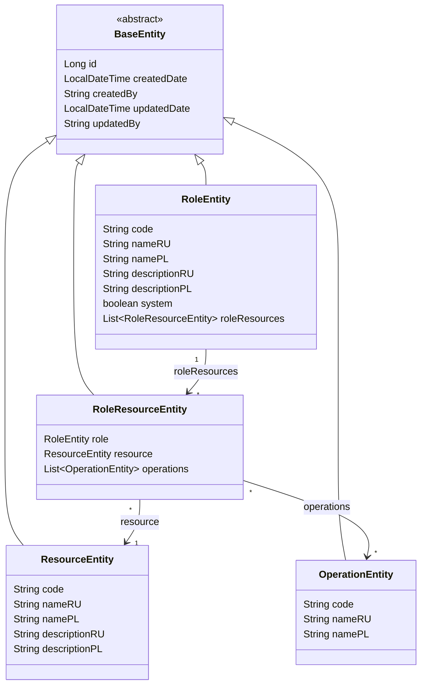
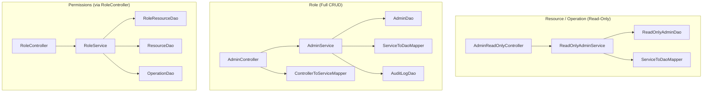
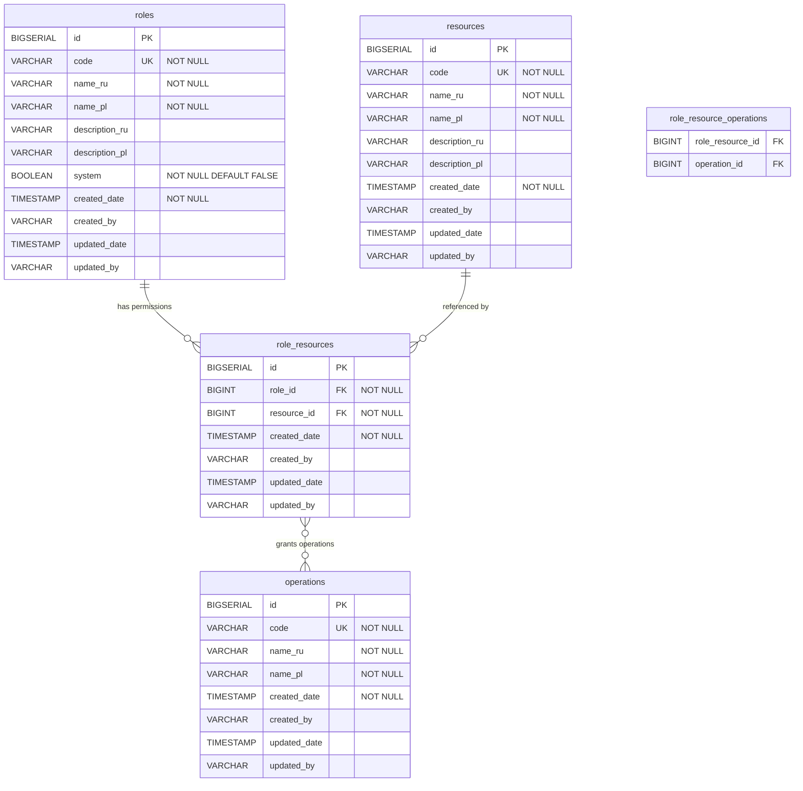

# Design Document: ABAC Entities (FOR-02-03-abac-entities)

## Overview

This design defines four JPA entities and their full stack (DAO, Service, Controller, Mapper, DTO) for the Foremen ABAC (Attribute-Based Access Control) model. The permission model answers the question: "Which role has which operations on which resource?"

**Entities:**
- **ResourceEntity** — reference catalog of system modules (read-only)
- **OperationEntity** — reference catalog of actions (CREATE, READ, UPDATE, DELETE) (read-only)
- **RoleEntity** — named user roles (full CRUD with audit)
- **RoleResourceEntity** — join entity modeling "role X has operations [A, B, C] on resource Y"

The design leverages the CRUD framework from FOR-01: read-only entities use `ReadOnlyAdminDao` + `ReadOnlyAdminService` + `AdminReadOnlyController`, while RoleEntity uses `AdminDao` + `AdminService` + `AdminController`. RoleResourceEntity is managed implicitly through dedicated permission endpoints on the RoleController.

### Key Design Decisions

| Decision | Rationale |
|----------|-----------|
| ResourceEntity and OperationEntity are read-only | These are reference catalogs populated via Liquibase. They never change at runtime — no service/controller write logic needed. |
| RoleResourceEntity managed through RoleController | Permissions are an aspect of a role. Having a separate controller for the join table would leak the persistence model. The PUT /permissions endpoint replaces all permissions atomically. |
| Replace-all semantics for PUT /permissions | Simpler than patch-style partial updates. Frontend sends the full desired state, backend reconciles. No ambiguity about what was added/removed. |
| `system` flag on RoleEntity for deletion protection | System roles (Admin, Manager, etc.) are seeded via Liquibase and must not be deleted. The `system` boolean + service-layer guard is simpler than separate entity types. |
| Unique constraint on (role_id, resource_id) in RoleResource | Prevents duplicate permission entries. A role can have only one set of operations per resource. |
| M:N between RoleResource and Operation via join table | Flexible operation assignment per role-resource pair. Allows any subset of operations without schema changes. |
| description IS i18n (descriptionRU / descriptionPL) | Both Resource and Role have localized descriptions. The resolved `description` field appears in ServiceModel; extended models and DTOs expose both variants. |
| Lombok @Getter on service classes | Eliminates boilerplate `@Override` methods for interface getters. Field naming convention matches interface method names (readDao→getReadDao(), mapper→getMapper(), etc.). |
| Records for service/DTO models | Java records are immutable and compact. MapStruct 1.6.3 supports mapping to records via constructors. |
| CascadeType.ALL + orphanRemoval on Role→RoleResource | When a role is deleted, all its permission entries are removed automatically. |
| Eager fetch for RoleResource.operations (ManyToMany) | The operations list is small (4 max) and always needed when reading permissions. Avoids N+1 in the permissions endpoint. |

### Research Findings

| Topic | Finding |
|-------|---------|
| MapStruct 1.6.3 + Java records | MapStruct supports mapping TO records via their canonical constructor. No setters needed. The constructor parameter names must match the mapped fields. |
| JPA @ManyToMany with join table | `@JoinTable(name = ..., joinColumns = @JoinColumn(...), inverseJoinColumns = @JoinColumn(...))` defines the intermediary table. Works with `List<>` or `Set<>`. |
| JPA @UniqueConstraint on @Table | `@Table(uniqueConstraints = @UniqueConstraint(columnNames = {"role_id", "resource_id"}))` enforces composite uniqueness at DDL level. |
| CascadeType.ALL + orphanRemoval | Cascade all lifecycle events to children. `orphanRemoval = true` deletes children that are no longer referenced from the parent's collection. |
| Liquibase data seeding | Use `<insert>` elements in changesets to seed reference data. Idempotent with `<preConditions onFail="MARK_RAN">`. |
| Spring Data JPA deleteAll + cascade | Calling `deleteById` on a parent with `CascadeType.ALL` automatically removes children. No explicit child deletion needed. |

## Architecture



### Stack Architecture (per entity)



### Package Structure

```
com.foremen
├── dao/
│   ├── model/
│   │   ├── ResourceEntity.java
│   │   ├── OperationEntity.java
│   │   ├── RoleEntity.java
│   │   └── RoleResourceEntity.java
│   ├── ResourceDao.java
│   ├── OperationDao.java
│   ├── RoleDao.java
│   └── RoleResourceDao.java
├── service/
│   ├── model/
│   │   ├── ResourceServiceModel.java
│   │   ├── ResourceServiceExtendedModel.java
│   │   ├── OperationServiceModel.java
│   │   ├── OperationServiceExtendedModel.java
│   │   ├── RoleServiceModel.java
│   │   └── RoleServiceExtendedModel.java
│   ├── model/mapper/
│   │   ├── ResourceServiceMapper.java
│   │   ├── OperationServiceMapper.java
│   │   └── RoleServiceMapper.java
│   ├── ResourceService.java
│   ├── OperationService.java
│   └── RoleService.java
├── controller/
│   ├── model/
│   │   ├── RoleDtoModel.java
│   │   ├── RoleDtoExtendedModel.java
│   │   ├── RoleCreateRequest.java
│   │   ├── RoleCreateResponse.java
│   │   ├── RoleUpdateRequest.java
│   │   ├── RoleUpdateResponse.java
│   │   ├── RolePermissionRequest.java
│   │   ├── RolePermissionResponse.java
│   │   └── PermissionEntry.java
│   ├── model/mapper/
│   │   └── RoleControllerMapper.java
│   ├── ResourceController.java
│   ├── OperationController.java
│   └── RoleController.java
└── database_files/
    └── changesets/
        ├── 002-create-resources.xml
        ├── 003-create-operations.xml
        ├── 004-create-roles.xml
        └── 005-create-role-resources.xml
```

## Components and Interfaces

### 1. JPA Entities

#### ResourceEntity (`com.foremen.dao.model.ResourceEntity`)

```java
package com.foremen.dao.model;

import jakarta.persistence.*;
import lombok.Getter;
import lombok.NoArgsConstructor;
import lombok.Setter;

@Entity
@Table(name = "resources")
@Getter
@Setter
@NoArgsConstructor
public class ResourceEntity extends BaseEntity {

    @Column(nullable = false, unique = true)
    private String code;

    @Column(name = "name_ru", nullable = false)
    private String nameRU;

    @Column(name = "name_pl", nullable = false)
    private String namePL;

    @Column(name = "description_ru")
    private String descriptionRU;

    @Column(name = "description_pl")
    private String descriptionPL;
}
```

#### OperationEntity (`com.foremen.dao.model.OperationEntity`)

```java
package com.foremen.dao.model;

import jakarta.persistence.*;
import lombok.Getter;
import lombok.NoArgsConstructor;
import lombok.Setter;

@Entity
@Table(name = "operations")
@Getter
@Setter
@NoArgsConstructor
public class OperationEntity extends BaseEntity {

    @Column(nullable = false, unique = true)
    private String code;

    @Column(name = "name_ru", nullable = false)
    private String nameRU;

    @Column(name = "name_pl", nullable = false)
    private String namePL;
}
```

#### RoleEntity (`com.foremen.dao.model.RoleEntity`)

```java
package com.foremen.dao.model;

import jakarta.persistence.*;
import lombok.Getter;
import lombok.NoArgsConstructor;
import lombok.Setter;

import java.util.ArrayList;
import java.util.List;

@Entity
@Table(name = "roles")
@Getter
@Setter
@NoArgsConstructor
public class RoleEntity extends BaseEntity {

    @Column(nullable = false, unique = true)
    private String code;

    @Column(name = "name_ru", nullable = false)
    private String nameRU;

    @Column(name = "name_pl", nullable = false)
    private String namePL;

    @Column(name = "description_ru")
    private String descriptionRU;

    @Column(name = "description_pl")
    private String descriptionPL;

    @Column(nullable = false)
    private boolean system = false;

    @OneToMany(mappedBy = "role", cascade = CascadeType.ALL, orphanRemoval = true)
    private List<RoleResourceEntity> roleResources = new ArrayList<>();
}
```

#### RoleResourceEntity (`com.foremen.dao.model.RoleResourceEntity`)

```java
package com.foremen.dao.model;

import jakarta.persistence.*;
import lombok.Getter;
import lombok.NoArgsConstructor;
import lombok.Setter;

import java.util.ArrayList;
import java.util.List;

@Entity
@Table(name = "role_resources", uniqueConstraints = {
    @UniqueConstraint(columnNames = {"role_id", "resource_id"})
})
@Getter
@Setter
@NoArgsConstructor
public class RoleResourceEntity extends BaseEntity {

    @ManyToOne(fetch = FetchType.LAZY)
    @JoinColumn(name = "role_id", nullable = false)
    private RoleEntity role;

    @ManyToOne(fetch = FetchType.LAZY)
    @JoinColumn(name = "resource_id", nullable = false)
    private ResourceEntity resource;

    @ManyToMany(fetch = FetchType.EAGER)
    @JoinTable(
        name = "role_resource_operations",
        joinColumns = @JoinColumn(name = "role_resource_id"),
        inverseJoinColumns = @JoinColumn(name = "operation_id")
    )
    private List<OperationEntity> operations = new ArrayList<>();
}
```

### 2. DAO Interfaces

#### ResourceDao

```java
package com.foremen.dao;

import com.foremen.dao.model.ResourceEntity;
import org.springframework.stereotype.Repository;

@Repository
public interface ResourceDao extends ReadOnlyAdminDao<ResourceEntity, Long> {
}
```

#### OperationDao

```java
package com.foremen.dao;

import com.foremen.dao.model.OperationEntity;
import org.springframework.stereotype.Repository;

@Repository
public interface OperationDao extends ReadOnlyAdminDao<OperationEntity, Long> {
}
```

#### RoleDao

```java
package com.foremen.dao;

import com.foremen.dao.model.RoleEntity;
import org.springframework.stereotype.Repository;

@Repository
public interface RoleDao extends AdminDao<RoleEntity, Long> {
}
```

#### RoleResourceDao

```java
package com.foremen.dao;

import com.foremen.dao.model.RoleResourceEntity;
import org.springframework.stereotype.Repository;

import java.util.List;

@Repository
public interface RoleResourceDao extends AdminDao<RoleResourceEntity, Long> {

    List<RoleResourceEntity> findAllByRoleId(Long roleId);

    void deleteAllByRoleId(Long roleId);
}
```

### 3. Service Models

#### ResourceServiceModel / ResourceServiceExtendedModel

```java
package com.foremen.service.model;

public record ResourceServiceModel(Long id, String code, String name, String description) {}

public record ResourceServiceExtendedModel(Long id, String code, String nameRU, String namePL,
                                            String descriptionRU, String descriptionPL) {}
```

#### OperationServiceModel / OperationServiceExtendedModel

```java
package com.foremen.service.model;

public record OperationServiceModel(Long id, String code, String name) {}

public record OperationServiceExtendedModel(Long id, String code, String nameRU, String namePL) {}
```

#### RoleServiceModel / RoleServiceExtendedModel

```java
package com.foremen.service.model;

public record RoleServiceModel(Long id, String code, String name, String description, boolean system) {}

public record RoleServiceExtendedModel(Long id, String code, String nameRU, String namePL,
                                        String descriptionRU, String descriptionPL, boolean system) {}
```

### 4. ServiceToDaoMapper Implementations

#### ResourceServiceMapper

```java
package com.foremen.service.model.mapper;

import com.foremen.config.mapper.ForemenMapperConfig;
import com.foremen.dao.model.ResourceEntity;
import com.foremen.mapper.ServiceToDaoMapper;
import com.foremen.service.model.ResourceServiceExtendedModel;
import com.foremen.service.model.ResourceServiceModel;
import org.mapstruct.Mapper;

import java.util.Set;

@Mapper(config = ForemenMapperConfig.class)
public interface ResourceServiceMapper
        extends ServiceToDaoMapper<ResourceEntity, ResourceServiceModel, ResourceServiceExtendedModel> {

    @Override
    default Set<String> getI18nSupportedProperties() {
        return Set.of("name", "description");
    }
}
```

#### OperationServiceMapper

```java
package com.foremen.service.model.mapper;

import com.foremen.config.mapper.ForemenMapperConfig;
import com.foremen.dao.model.OperationEntity;
import com.foremen.mapper.ServiceToDaoMapper;
import com.foremen.service.model.OperationServiceExtendedModel;
import com.foremen.service.model.OperationServiceModel;
import org.mapstruct.Mapper;

import java.util.Set;

@Mapper(config = ForemenMapperConfig.class)
public interface OperationServiceMapper
        extends ServiceToDaoMapper<OperationEntity, OperationServiceModel, OperationServiceExtendedModel> {

    @Override
    default Set<String> getI18nSupportedProperties() {
        return Set.of("name");
    }
}
```

#### RoleServiceMapper

```java
package com.foremen.service.model.mapper;

import com.foremen.config.mapper.ForemenMapperConfig;
import com.foremen.dao.model.RoleEntity;
import com.foremen.mapper.ServiceToDaoMapper;
import com.foremen.service.model.RoleServiceExtendedModel;
import com.foremen.service.model.RoleServiceModel;
import org.mapstruct.Mapper;
import org.mapstruct.Mapping;

import java.util.Set;

@Mapper(config = ForemenMapperConfig.class)
public interface RoleServiceMapper
        extends ServiceToDaoMapper<RoleEntity, RoleServiceModel, RoleServiceExtendedModel> {

    @Override
    default Set<String> getI18nSupportedProperties() {
        return Set.of("name", "description");
    }

    @Override
    @Mapping(target = "roleResources", ignore = true)
    @Mapping(target = "id", ignore = true)
    RoleEntity toCreateDaoModel(RoleServiceExtendedModel source);

    @Override
    @Mapping(target = "roleResources", ignore = true)
    @Mapping(target = "id", ignore = true)
    void updateFields(RoleServiceExtendedModel source, @org.mapstruct.MappingTarget RoleEntity target);
}
```

### 5. ControllerToServiceMapper for Role

#### RoleControllerMapper

```java
package com.foremen.controller.model.mapper;

import com.foremen.config.mapper.ForemenMapperConfig;
import com.foremen.controller.model.*;
import com.foremen.mapper.ControllerToServiceMapper;
import com.foremen.service.model.RoleServiceExtendedModel;
import com.foremen.service.model.RoleServiceModel;
import org.mapstruct.Mapper;
import org.mapstruct.Mapping;

@Mapper(config = ForemenMapperConfig.class)
public interface RoleControllerMapper extends ControllerToServiceMapper<
        RoleServiceModel,
        RoleServiceExtendedModel,
        RoleDtoModel,
        RoleDtoExtendedModel,
        RoleCreateRequest,
        RoleCreateResponse,
        RoleUpdateRequest,
        RoleUpdateResponse> {

    @Override
    @Mapping(target = "id", ignore = true)
    RoleServiceExtendedModel toServiceExtendedModel(RoleCreateRequest source);

    @Override
    RoleServiceExtendedModel toUpdateServiceExtendedModel(RoleUpdateRequest source);
}
```

### 6. DTO Models for Role Controller

```java
package com.foremen.controller.model;

import jakarta.validation.constraints.NotBlank;

// --- Role DTOs ---

public record RoleDtoModel(Long id, String code, String name) {}

public record RoleDtoExtendedModel(Long id, String code, String nameRU, String namePL,
                                    String descriptionRU, String descriptionPL, boolean system) {}

public record RoleCreateRequest(
    @NotBlank String code,
    @NotBlank String nameRU,
    @NotBlank String namePL,
    String descriptionRU,
    String descriptionPL,
    Boolean system
) {}

public record RoleCreateResponse(Long id, String code, String nameRU, String namePL,
                                  String descriptionRU, String descriptionPL, boolean system) {}

public record RoleUpdateRequest(
    @NotBlank String nameRU,
    @NotBlank String namePL,
    String descriptionRU,
    String descriptionPL,
    Boolean system
) {}

public record RoleUpdateResponse(Long id, String code, String nameRU, String namePL,
                                  String descriptionRU, String descriptionPL, boolean system) {}
```

### 7. DTO Models for Permissions API

```java
package com.foremen.controller.model;

import java.util.List;

// --- Permission Request ---

public record RolePermissionRequest(List<PermissionEntryRequest> permissions) {}

public record PermissionEntryRequest(Long resourceId, List<Long> operationIds) {}

// --- Permission Response ---

public record RolePermissionResponse(Long roleId, List<PermissionEntryResponse> permissions) {}

public record PermissionEntryResponse(
    Long resourceId,
    String resourceCode,
    String resourceName,
    List<OperationInfo> operations
) {}

public record OperationInfo(Long operationId, String operationCode, String operationName) {}
```

### 8. Service Implementations

#### ResourceService

```java
package com.foremen.service;

import com.foremen.dao.ResourceDao;
import com.foremen.dao.model.ResourceEntity;
import com.foremen.service.model.ResourceServiceExtendedModel;
import com.foremen.service.model.ResourceServiceModel;
import com.foremen.service.model.mapper.ResourceServiceMapper;
import jakarta.persistence.EntityManager;
import lombok.Getter;
import lombok.RequiredArgsConstructor;
import org.springframework.stereotype.Service;

@Service
@RequiredArgsConstructor
@Getter
public class ResourceService implements ReadOnlyAdminService<
        ResourceServiceModel, ResourceServiceExtendedModel, ResourceEntity, Long> {

    private final ResourceDao readDao;
    private final ResourceServiceMapper mapper;
    private final EntityManager entityManager;
    private final Class<ResourceEntity> daoModelClass = ResourceEntity.class;
}
```

#### OperationService

```java
package com.foremen.service;

import com.foremen.dao.OperationDao;
import com.foremen.dao.model.OperationEntity;
import com.foremen.service.model.OperationServiceExtendedModel;
import com.foremen.service.model.OperationServiceModel;
import com.foremen.service.model.mapper.OperationServiceMapper;
import jakarta.persistence.EntityManager;
import lombok.Getter;
import lombok.RequiredArgsConstructor;
import org.springframework.stereotype.Service;

@Service
@RequiredArgsConstructor
@Getter
public class OperationService implements ReadOnlyAdminService<
        OperationServiceModel, OperationServiceExtendedModel, OperationEntity, Long> {

    private final OperationDao readDao;
    private final OperationServiceMapper mapper;
    private final EntityManager entityManager;
    private final Class<OperationEntity> daoModelClass = OperationEntity.class;
}
```

#### RoleService

```java
package com.foremen.service;

import com.foremen.dao.*;
import com.foremen.dao.model.*;
import com.foremen.exception.ForemenApiException;
import com.foremen.service.audit.AuditLogDao;
import com.foremen.service.model.RoleServiceExtendedModel;
import com.foremen.service.model.RoleServiceModel;
import com.foremen.service.model.mapper.RoleServiceMapper;
import com.foremen.controller.model.*;
import jakarta.persistence.EntityManager;
import lombok.Getter;
import lombok.RequiredArgsConstructor;
import org.springframework.http.HttpStatus;
import org.springframework.stereotype.Service;
import org.springframework.transaction.annotation.Transactional;

import java.util.ArrayList;
import java.util.List;

@Service
@RequiredArgsConstructor
@Getter
@Transactional
public class RoleService implements AdminService<
        RoleServiceModel, RoleServiceExtendedModel, RoleEntity, Long> {

    private final RoleDao dao;
    private final RoleResourceDao roleResourceDao;
    private final ResourceDao resourceDao;
    private final OperationDao operationDao;
    private final RoleServiceMapper mapper;
    private final AuditLogDao auditLogDao;
    private final EntityManager entityManager;
    private final Class<RoleEntity> daoModelClass = RoleEntity.class;

    // --- System role deletion protection ---

    @Override
    public void deleteById(Long id) {
        RoleEntity role = dao.findById(id)
                .orElseThrow(() -> new ForemenApiException(HttpStatus.NOT_FOUND, "error.entity.not.found", id));
        if (role.isSystem()) {
            throw new ForemenApiException(HttpStatus.FORBIDDEN, "error.role.system.cannot.delete", id);
        }
        saveAudit(role, "DELETE");
        dao.deleteById(id);
        entityManager.flush();
    }

    // --- Permission Management ---

    @Transactional(readOnly = true)
    public RolePermissionResponse getPermissions(Long roleId) {
        RoleEntity role = dao.findById(roleId)
                .orElseThrow(() -> new ForemenApiException(HttpStatus.NOT_FOUND, "error.entity.not.found", roleId));

        List<RoleResourceEntity> roleResources = roleResourceDao.findAllByRoleId(roleId);

        List<PermissionEntryResponse> entries = roleResources.stream()
                .map(rr -> new PermissionEntryResponse(
                        rr.getResource().getId(),
                        rr.getResource().getCode(),
                        resolveResourceName(rr.getResource()),
                        rr.getOperations().stream()
                                .map(op -> new OperationInfo(op.getId(), op.getCode(), resolveOperationName(op)))
                                .toList()
                ))
                .toList();

        return new RolePermissionResponse(roleId, entries);
    }

    public RolePermissionResponse replacePermissions(Long roleId, RolePermissionRequest request) {
        RoleEntity role = dao.findById(roleId)
                .orElseThrow(() -> new ForemenApiException(HttpStatus.NOT_FOUND, "error.entity.not.found", roleId));

        // Delete all existing permissions for this role
        roleResourceDao.deleteAllByRoleId(roleId);
        entityManager.flush();

        // Create new RoleResource entries
        List<RoleResourceEntity> newEntries = new ArrayList<>();
        for (PermissionEntryRequest entry : request.permissions()) {
            // Validate resource exists
            ResourceEntity resource = resourceDao.findById(entry.resourceId())
                    .orElseThrow(() -> new ForemenApiException(HttpStatus.BAD_REQUEST,
                            "error.permission.resource.not.found", entry.resourceId()));

            RoleResourceEntity roleResource = new RoleResourceEntity();
            roleResource.setRole(role);
            roleResource.setResource(resource);

            // Validate and set operations (empty list = revoke all operations for this resource)
            if (entry.operationIds() != null && !entry.operationIds().isEmpty()) {
                List<OperationEntity> operations = new ArrayList<>();
                for (Long opId : entry.operationIds()) {
                    OperationEntity op = operationDao.findById(opId)
                            .orElseThrow(() -> new ForemenApiException(HttpStatus.BAD_REQUEST,
                                    "error.permission.operation.not.found", opId));
                    operations.add(op);
                }
                roleResource.setOperations(operations);
            }

            newEntries.add(roleResource);
        }

        roleResourceDao.saveAll(newEntries);
        entityManager.flush();

        saveAudit(role, "UPDATE_PERMISSIONS");

        return getPermissions(roleId);
    }

    // --- I18n helpers for permission response ---

    private String resolveResourceName(ResourceEntity resource) {
        Object name = mapper.getInCurrentLocale("name", resource);
        return name != null ? name.toString() : resource.getCode();
    }

    private String resolveOperationName(OperationEntity operation) {
        // Operations also have nameRU/namePL
        Object name = mapper.getInCurrentLocale("name", operation);
        return name != null ? name.toString() : operation.getCode();
    }
}
```

### 9. Controller Implementations

#### ResourceController

```java
package com.foremen.controller;

import com.foremen.service.ReadOnlyAdminService;
import com.foremen.service.ResourceService;
import com.foremen.service.model.ResourceServiceExtendedModel;
import com.foremen.service.model.ResourceServiceModel;
import com.foremen.dao.model.ResourceEntity;
import lombok.RequiredArgsConstructor;
import org.springframework.web.bind.annotation.*;

@RestController
@RequestMapping("/api/resources")
@RequiredArgsConstructor
public class ResourceController implements AdminReadOnlyController<
        ResourceServiceModel, ResourceServiceExtendedModel, ResourceEntity, Long> {

    private final ResourceService resourceService;

    @Override
    public ReadOnlyAdminService<ResourceServiceModel, ResourceServiceExtendedModel, ResourceEntity, Long> getService() {
        return resourceService;
    }
}
```

#### OperationController

```java
package com.foremen.controller;

import com.foremen.service.ReadOnlyAdminService;
import com.foremen.service.OperationService;
import com.foremen.service.model.OperationServiceExtendedModel;
import com.foremen.service.model.OperationServiceModel;
import com.foremen.dao.model.OperationEntity;
import lombok.RequiredArgsConstructor;
import org.springframework.web.bind.annotation.*;

@RestController
@RequestMapping("/api/operations")
@RequiredArgsConstructor
public class OperationController implements AdminReadOnlyController<
        OperationServiceModel, OperationServiceExtendedModel, OperationEntity, Long> {

    private final OperationService operationService;

    @Override
    public ReadOnlyAdminService<OperationServiceModel, OperationServiceExtendedModel, OperationEntity, Long> getService() {
        return operationService;
    }
}
```

#### RoleController

```java
package com.foremen.controller;

import com.foremen.controller.model.*;
import com.foremen.controller.model.mapper.RoleControllerMapper;
import com.foremen.dao.model.RoleEntity;
import com.foremen.mapper.ControllerToServiceMapper;
import com.foremen.service.AdminService;
import com.foremen.service.RoleService;
import com.foremen.service.model.RoleServiceExtendedModel;
import com.foremen.service.model.RoleServiceModel;
import jakarta.validation.Valid;
import lombok.RequiredArgsConstructor;
import org.springframework.http.ResponseEntity;
import org.springframework.web.bind.annotation.*;

@RestController
@RequestMapping("/api/roles")
@RequiredArgsConstructor
public class RoleController implements AdminController<
        RoleServiceModel,
        RoleServiceExtendedModel,
        RoleDtoModel,
        RoleDtoExtendedModel,
        RoleEntity,
        Long,
        RoleCreateRequest,
        RoleCreateResponse,
        RoleUpdateRequest,
        RoleUpdateResponse> {

    private final RoleService roleService;
    private final RoleControllerMapper controllerMapper;

    @Override
    public ControllerToServiceMapper<RoleServiceModel, RoleServiceExtendedModel,
            RoleDtoModel, RoleDtoExtendedModel,
            RoleCreateRequest, RoleCreateResponse,
            RoleUpdateRequest, RoleUpdateResponse> getMapper() {
        return controllerMapper;
    }

    @Override
    public AdminService<RoleServiceModel, RoleServiceExtendedModel, RoleEntity, Long> getService() {
        return roleService;
    }

    // --- Permission Endpoints ---

    @GetMapping("/{id}/permissions")
    public ResponseEntity<RolePermissionResponse> getPermissions(@PathVariable Long id) {
        RolePermissionResponse response = roleService.getPermissions(id);
        return ResponseEntity.ok(response);
    }

    @PutMapping("/{id}/permissions")
    public ResponseEntity<RolePermissionResponse> replacePermissions(
            @PathVariable Long id,
            @Valid @RequestBody RolePermissionRequest request) {
        RolePermissionResponse response = roleService.replacePermissions(id, request);
        return ResponseEntity.ok(response);
    }
}
```

## Data Models

### Entity Relationship Diagram



### Liquibase Changesets

#### 002-create-resources.xml

```xml
<?xml version="1.0" encoding="UTF-8"?>
<databaseChangeLog xmlns="http://www.liquibase.org/xml/ns/dbchangelog"
    xmlns:xsi="http://www.w3.org/2001/XMLSchema-instance"
    xsi:schemaLocation="http://www.liquibase.org/xml/ns/dbchangelog
        http://www.liquibase.org/xml/ns/dbchangelog/dbchangelog-latest.xsd">

    <changeSet id="002-create-resources" author="foremen">
        <preConditions onFail="MARK_RAN">
            <not><tableExists tableName="resources"/></not>
        </preConditions>

        <createTable tableName="resources">
            <column name="id" type="BIGSERIAL" autoIncrement="true">
                <constraints primaryKey="true" nullable="false"/>
            </column>
            <column name="code" type="VARCHAR(100)">
                <constraints nullable="false" unique="true" uniqueConstraintName="uk_resources_code"/>
            </column>
            <column name="name_ru" type="VARCHAR(255)">
                <constraints nullable="false"/>
            </column>
            <column name="name_pl" type="VARCHAR(255)">
                <constraints nullable="false"/>
            </column>
            <column name="description_ru" type="VARCHAR(500)"/>
            <column name="description_pl" type="VARCHAR(500)"/>
            <column name="created_date" type="TIMESTAMP" defaultValueComputed="NOW()">
                <constraints nullable="false"/>
            </column>
            <column name="created_by" type="VARCHAR(255)"/>
            <column name="updated_date" type="TIMESTAMP"/>
            <column name="updated_by" type="VARCHAR(255)"/>
        </createTable>
    </changeSet>

    <changeSet id="002-seed-resources" author="foremen">
        <preConditions onFail="MARK_RAN">
            <sqlCheck expectedResult="0">SELECT COUNT(*) FROM resources</sqlCheck>
        </preConditions>

        <insert tableName="resources">
            <column name="code" value="PROJECTS"/>
            <column name="name_ru" value="Проекты"/>
            <column name="name_pl" value="Projekty"/>
            <column name="description_ru" value="Модуль управления проектами"/>
            <column name="description_pl" value="Moduł zarządzania projektami"/>
        </insert>
        <insert tableName="resources">
            <column name="code" value="ROOMS"/>
            <column name="name_ru" value="Помещения"/>
            <column name="name_pl" value="Pomieszczenia"/>
            <column name="description_ru" value="Модуль управления помещениями"/>
            <column name="description_pl" value="Moduł zarządzania pomieszczeniami"/>
        </insert>
        <insert tableName="resources">
            <column name="code" value="ESTIMATE"/>
            <column name="name_ru" value="Смета"/>
            <column name="name_pl" value="Kosztorys"/>
            <column name="description_ru" value="Модуль сметы"/>
            <column name="description_pl" value="Moduł kosztorysowania"/>
        </insert>
        <insert tableName="resources">
            <column name="code" value="WAREHOUSE"/>
            <column name="name_ru" value="Склад"/>
            <column name="name_pl" value="Magazyn"/>
            <column name="description_ru" value="Модуль склада"/>
            <column name="description_pl" value="Moduł magazynowy"/>
        </insert>
    </changeSet>
</databaseChangeLog>
```

#### 003-create-operations.xml

```xml
<?xml version="1.0" encoding="UTF-8"?>
<databaseChangeLog xmlns="http://www.liquibase.org/xml/ns/dbchangelog"
    xmlns:xsi="http://www.w3.org/2001/XMLSchema-instance"
    xsi:schemaLocation="http://www.liquibase.org/xml/ns/dbchangelog
        http://www.liquibase.org/xml/ns/dbchangelog/dbchangelog-latest.xsd">

    <changeSet id="003-create-operations" author="foremen">
        <preConditions onFail="MARK_RAN">
            <not><tableExists tableName="operations"/></not>
        </preConditions>

        <createTable tableName="operations">
            <column name="id" type="BIGSERIAL" autoIncrement="true">
                <constraints primaryKey="true" nullable="false"/>
            </column>
            <column name="code" type="VARCHAR(50)">
                <constraints nullable="false" unique="true" uniqueConstraintName="uk_operations_code"/>
            </column>
            <column name="name_ru" type="VARCHAR(255)">
                <constraints nullable="false"/>
            </column>
            <column name="name_pl" type="VARCHAR(255)">
                <constraints nullable="false"/>
            </column>
            <column name="created_date" type="TIMESTAMP" defaultValueComputed="NOW()">
                <constraints nullable="false"/>
            </column>
            <column name="created_by" type="VARCHAR(255)"/>
            <column name="updated_date" type="TIMESTAMP"/>
            <column name="updated_by" type="VARCHAR(255)"/>
        </createTable>
    </changeSet>

    <changeSet id="003-seed-operations" author="foremen">
        <preConditions onFail="MARK_RAN">
            <sqlCheck expectedResult="0">SELECT COUNT(*) FROM operations</sqlCheck>
        </preConditions>

        <insert tableName="operations">
            <column name="code" value="CREATE"/>
            <column name="name_ru" value="Создание"/>
            <column name="name_pl" value="Tworzenie"/>
        </insert>
        <insert tableName="operations">
            <column name="code" value="READ"/>
            <column name="name_ru" value="Чтение"/>
            <column name="name_pl" value="Odczyt"/>
        </insert>
        <insert tableName="operations">
            <column name="code" value="UPDATE"/>
            <column name="name_ru" value="Редактирование"/>
            <column name="name_pl" value="Edycja"/>
        </insert>
        <insert tableName="operations">
            <column name="code" value="DELETE"/>
            <column name="name_ru" value="Удаление"/>
            <column name="name_pl" value="Usuwanie"/>
        </insert>
    </changeSet>
</databaseChangeLog>
```

#### 004-create-roles.xml

```xml
<?xml version="1.0" encoding="UTF-8"?>
<databaseChangeLog xmlns="http://www.liquibase.org/xml/ns/dbchangelog"
    xmlns:xsi="http://www.w3.org/2001/XMLSchema-instance"
    xsi:schemaLocation="http://www.liquibase.org/xml/ns/dbchangelog
        http://www.liquibase.org/xml/ns/dbchangelog/dbchangelog-latest.xsd">

    <changeSet id="004-create-roles" author="foremen">
        <preConditions onFail="MARK_RAN">
            <not><tableExists tableName="roles"/></not>
        </preConditions>

        <createTable tableName="roles">
            <column name="id" type="BIGSERIAL" autoIncrement="true">
                <constraints primaryKey="true" nullable="false"/>
            </column>
            <column name="code" type="VARCHAR(100)">
                <constraints nullable="false" unique="true" uniqueConstraintName="uk_roles_code"/>
            </column>
            <column name="name_ru" type="VARCHAR(255)">
                <constraints nullable="false"/>
            </column>
            <column name="name_pl" type="VARCHAR(255)">
                <constraints nullable="false"/>
            </column>
            <column name="description_ru" type="VARCHAR(500)"/>
            <column name="description_pl" type="VARCHAR(500)"/>
            <column name="system" type="BOOLEAN" defaultValueBoolean="false">
                <constraints nullable="false"/>
            </column>
            <column name="created_date" type="TIMESTAMP" defaultValueComputed="NOW()">
                <constraints nullable="false"/>
            </column>
            <column name="created_by" type="VARCHAR(255)"/>
            <column name="updated_date" type="TIMESTAMP"/>
            <column name="updated_by" type="VARCHAR(255)"/>
        </createTable>
    </changeSet>

    <changeSet id="004-seed-roles" author="foremen">
        <preConditions onFail="MARK_RAN">
            <sqlCheck expectedResult="0">SELECT COUNT(*) FROM roles</sqlCheck>
        </preConditions>

        <insert tableName="roles">
            <column name="code" value="ADMIN"/>
            <column name="name_ru" value="Администратор"/>
            <column name="name_pl" value="Administrator"/>
            <column name="description_ru" value="Полный доступ ко всем ресурсам и операциям"/>
            <column name="description_pl" value="Pełny dostęp do wszystkich zasobów i operacji"/>
            <column name="system" valueBoolean="true"/>
        </insert>
        <insert tableName="roles">
            <column name="code" value="MANAGER"/>
            <column name="name_ru" value="Менеджер"/>
            <column name="name_pl" value="Manager"/>
            <column name="description_ru" value="Управление проектами и сотрудниками"/>
            <column name="description_pl" value="Zarządzanie projektami i pracownikami"/>
            <column name="system" valueBoolean="true"/>
        </insert>
        <insert tableName="roles">
            <column name="code" value="FOREMAN"/>
            <column name="name_ru" value="Прораб"/>
            <column name="name_pl" value="Brygadzista"/>
            <column name="description_ru" value="Управление бригадой и работами на объекте"/>
            <column name="description_pl" value="Zarządzanie brygadą i pracami na obiekcie"/>
            <column name="system" valueBoolean="true"/>
        </insert>
        <insert tableName="roles">
            <column name="code" value="WORKER"/>
            <column name="name_ru" value="Рабочий"/>
            <column name="name_pl" value="Pracownik"/>
            <column name="description_ru" value="Выполнение работ и отчётность"/>
            <column name="description_pl" value="Wykonywanie prac i raportowanie"/>
            <column name="system" valueBoolean="true"/>
        </insert>
        <insert tableName="roles">
            <column name="code" value="FINANCIER"/>
            <column name="name_ru" value="Финансист"/>
            <column name="name_pl" value="Finansista"/>
            <column name="description_ru" value="Управление финансами и сметами"/>
            <column name="description_pl" value="Zarządzanie finansami i kosztorysami"/>
            <column name="system" valueBoolean="true"/>
        </insert>
    </changeSet>
</databaseChangeLog>
```

#### 005-create-role-resources.xml

```xml
<?xml version="1.0" encoding="UTF-8"?>
<databaseChangeLog xmlns="http://www.liquibase.org/xml/ns/dbchangelog"
    xmlns:xsi="http://www.w3.org/2001/XMLSchema-instance"
    xsi:schemaLocation="http://www.liquibase.org/xml/ns/dbchangelog
        http://www.liquibase.org/xml/ns/dbchangelog/dbchangelog-latest.xsd">

    <changeSet id="005-create-role-resources" author="foremen">
        <preConditions onFail="MARK_RAN">
            <not><tableExists tableName="role_resources"/></not>
        </preConditions>

        <createTable tableName="role_resources">
            <column name="id" type="BIGSERIAL" autoIncrement="true">
                <constraints primaryKey="true" nullable="false"/>
            </column>
            <column name="role_id" type="BIGINT">
                <constraints nullable="false"
                    foreignKeyName="fk_role_resources_role"
                    references="roles(id)"
                    deleteCascade="true"/>
            </column>
            <column name="resource_id" type="BIGINT">
                <constraints nullable="false"
                    foreignKeyName="fk_role_resources_resource"
                    references="resources(id)"/>
            </column>
            <column name="created_date" type="TIMESTAMP" defaultValueComputed="NOW()">
                <constraints nullable="false"/>
            </column>
            <column name="created_by" type="VARCHAR(255)"/>
            <column name="updated_date" type="TIMESTAMP"/>
            <column name="updated_by" type="VARCHAR(255)"/>
        </createTable>

        <addUniqueConstraint
            tableName="role_resources"
            columnNames="role_id, resource_id"
            constraintName="uk_role_resources_role_resource"/>
    </changeSet>

    <changeSet id="005-create-role-resource-operations" author="foremen">
        <preConditions onFail="MARK_RAN">
            <not><tableExists tableName="role_resource_operations"/></not>
        </preConditions>

        <createTable tableName="role_resource_operations">
            <column name="role_resource_id" type="BIGINT">
                <constraints nullable="false"
                    foreignKeyName="fk_rro_role_resource"
                    references="role_resources(id)"
                    deleteCascade="true"/>
            </column>
            <column name="operation_id" type="BIGINT">
                <constraints nullable="false"
                    foreignKeyName="fk_rro_operation"
                    references="operations(id)"/>
            </column>
        </createTable>

        <addPrimaryKey
            tableName="role_resource_operations"
            columnNames="role_resource_id, operation_id"
            constraintName="pk_role_resource_operations"/>
    </changeSet>
</databaseChangeLog>
```

## Correctness Properties

*A property is a characteristic or behavior that should hold true across all valid executions of a system — essentially, a formal statement about what the system should do. Properties serve as the bridge between human-readable specifications and machine-verifiable correctness guarantees.*

### Property Reflection

After the prework analysis, I identified the following testable properties and performed redundancy elimination:

1. **i18n resolution properties (5.3, 6.3, 7.3)** — These are fundamentally the same property applied to different entities. They can be consolidated into a single generalized property: "for any entity with nameRU/namePL (and descriptionRU/descriptionPL where applicable), the ServiceModel's resolved fields equal the locale-appropriate values." Since ResourceServiceMapper, OperationServiceMapper, and RoleServiceMapper all use the same `I18nPropertiesMapper` mechanism, a single property test with parameterized entity types covers all three. Resource and Role mappers declare `Set.of("name", "description")`, Operation declares `Set.of("name")`.

2. **System role deletion protection (7.5 and 13.5)** — Identical requirement stated twice. Consolidated into one property.

3. **Permission replace-all semantics (8.2) and uniqueness invariant (13.1)** — The uniqueness invariant (no duplicate role_id+resource_id) is a consequence of the replace-all logic. However, they test different guarantees: 8.2 tests data correctness of replacement, 13.1 tests structural invariant. Keep both but note they can share test infrastructure.

4. **Empty operationIds revocation (12.3)** — This is a special case of the permission replacement property (8.2). It will be tested as an edge case within Property 3's generator (generate permission entries with empty operation lists).

5. **processI18nEmptyValues (10.5)** — This is a universal property on the mapping: for any blank string in an i18n field, after mapping it becomes null. Worth keeping as a standalone property since it tests the write-direction normalization.

### Property 1: I18n Locale Resolution

*For any* ABAC entity (Resource, Operation, or Role) with arbitrary non-null `nameRU` and `namePL` string values (and for Resource/Role: `descriptionRU` and `descriptionPL`), when `toServiceModel` is invoked with locale set to "ru", the resulting ServiceModel's `name` field SHALL equal `nameRU` and `description` SHALL equal `descriptionRU`; when locale is set to "pl" (or any non-ru locale), the `name` field SHALL equal `namePL` and `description` SHALL equal `descriptionPL`.

**Validates: Requirements 5.3, 6.3, 7.3**

### Property 2: System Role Deletion Protection

*For any* RoleEntity where `system == true`, calling `deleteById` on the RoleService SHALL throw a `ForemenApiException` with HTTP status 403. The role SHALL remain in the database unchanged after the attempted deletion.

**Validates: Requirements 7.5, 13.5**

### Property 3: Permission Replacement Correctness

*For any* existing role and *for any* valid `RolePermissionRequest` containing N distinct (resourceId, operationIds) entries with all referenced resources and operations existing in the database, after calling `replacePermissions`, the resulting `RoleResourceEntity` records for that role SHALL:
- Have exactly N entries (one per request entry)
- Each entry's resource matches the corresponding request resourceId
- Each entry's operations list matches the corresponding request operationIds (including empty lists)
- No RoleResourceEntity records from before the call remain

**Validates: Requirements 8.2, 12.3, 13.1**

### Property 4: Role-Resource Uniqueness Invariant

*For any* sequence of `replacePermissions` calls on the same role, after each call the set of `RoleResourceEntity` records SHALL contain zero duplicate (role_id, resource_id) pairs.

**Validates: Requirements 13.1**

### Property 5: I18n Empty Value Normalization

*For any* `ServiceExtendedModel` where an i18n field (nameRU, namePL, descriptionRU, or descriptionPL) contains a blank string (whitespace-only), when mapped to a DaoModel via `toCreateDaoModel` or `updateFields`, the corresponding field on the DaoModel SHALL be `null` (not blank).

**Validates: Requirements 10.5**

## Error Handling

| Scenario | Layer | Exception | HTTP Status | Message Code |
|----------|-------|-----------|-------------|--------------|
| Role not found (CRUD or permissions) | RoleService | `ForemenApiException` | 404 | `error.entity.not.found` |
| Delete system role | RoleService | `ForemenApiException` | 403 | `error.role.system.cannot.delete` |
| Permission references non-existent resource | RoleService | `ForemenApiException` | 400 | `error.permission.resource.not.found` |
| Permission references non-existent operation | RoleService | `ForemenApiException` | 400 | `error.permission.operation.not.found` |
| Duplicate code on role create/update | JPA/PostgreSQL | `DataIntegrityViolationException` | 409 | Handled by `ForemenControllerAdvice` |
| Invalid request body (blank required fields) | Spring MVC | `MethodArgumentNotValidException` | 400 | Field-level errors via `ForemenControllerAdvice` |
| Resource/Operation not found (read-only) | ReadOnlyAdminService | `ForemenApiException` | 404 | `error.entity.not.found` |
| Invalid query DSL syntax | QueryParser | `ForemenApiException` | 400 | `error.query.parse.*` |

All error handling is delegated to the existing `ForemenControllerAdvice`. No new exception types are introduced.

## Testing Strategy

### Property-Based Tests (jqwik 1.9.2)

Property-based testing is applicable for this feature because:
- **I18n resolution** is a pure function (entity + locale → resolved name) testable across all string values
- **System role deletion protection** is a universal domain rule across all roles with `system=true`
- **Permission replacement** has clear input→output semantics testable across all valid permission sets
- **I18n normalization** is a pure mapping function (blank strings → null) testable across all string inputs

**Library:** `net.jqwik:jqwik:1.9.2`

**Configuration:**
- Minimum 100 iterations per property (`@Property(tries = 100)`)
- Each test annotated with a comment referencing the design property
- Tag format: `Feature: FOR-02-03-abac-entities, Property N: <title>`

**Properties to implement:**

| # | Property | Generator Strategy |
|---|----------|--------------------|
| 1 | I18n Locale Resolution | Generate arbitrary (non-null, non-blank) String pairs for nameRU/namePL and descriptionRU/descriptionPL. Construct entity, set locale via `LocaleContextHolder`, call `toServiceModel`, verify `name` and `description` resolve to the correct locale field. Parameterize across all three entity mappers (Resource and Role include description, Operation only name). |
| 2 | System Role Deletion Protection | Generate random RoleEntity instances with `system=true` (random code, names). Persist entity, call `deleteById`, verify `ForemenApiException(403)` thrown and entity still exists in DB. |
| 3 | Permission Replacement Correctness | Generate random subsets of existing resources and operations. Build `RolePermissionRequest` with random combinations (including empty operation lists). Call `replacePermissions`, verify result matches input exactly. |
| 4 | Role-Resource Uniqueness Invariant | Generate sequences of `replacePermissions` calls (2-5 calls with random permission sets). After each call, query DB and verify no duplicate (role_id, resource_id). |
| 5 | I18n Empty Value Normalization | Generate strings that are blank (empty, spaces, tabs, newlines). Set as nameRU, namePL, descriptionRU, or descriptionPL on ServiceExtendedModel. Call `toCreateDaoModel`. Verify corresponding field on resulting entity is `null`. |

### Unit Tests (Example-Based)

**Entity Structure Tests (reflection-based):**
1. ResourceEntity — extends BaseEntity, has @Entity, @Table("resources"), fields: code, nameRU, namePL, descriptionRU, descriptionPL
2. OperationEntity — extends BaseEntity, has @Entity, @Table("operations"), fields: code, nameRU, namePL
3. RoleEntity — extends BaseEntity, has @Entity, @Table("roles"), fields: code, nameRU, namePL, descriptionRU, descriptionPL, system, roleResources
4. RoleResourceEntity — extends BaseEntity, has @Entity, @Table("role_resources"), fields: role, resource, operations, unique constraint
5. RoleResourceEntity ManyToMany join table configuration

**DAO Structure Tests:**
6. ResourceDao extends ReadOnlyAdminDao<ResourceEntity, Long>
7. OperationDao extends ReadOnlyAdminDao<OperationEntity, Long>
8. RoleDao extends AdminDao<RoleEntity, Long>
9. RoleResourceDao extends AdminDao<RoleResourceEntity, Long>

**Mapper Tests:**
10. ResourceServiceMapper.getI18nSupportedProperties() returns Set.of("name", "description")
11. OperationServiceMapper.getI18nSupportedProperties() returns Set.of("name")
12. RoleServiceMapper.getI18nSupportedProperties() returns Set.of("name", "description")
13. RoleControllerMapper mapping roundtrip (CreateRequest → ServiceExtendedModel → CreateResponse)

**DTO Validation Tests:**
14. RoleCreateRequest with blank code → validation failure
15. RoleCreateRequest with blank nameRU → validation failure
16. RoleCreateRequest with blank namePL → validation failure
17. RoleUpdateRequest with blank nameRU → validation failure
18. RoleUpdateRequest with blank namePL → validation failure

### Integration Tests (Testcontainers + PostgreSQL)

**Resource/Operation Read-Only:**
1. GET /api/resources → returns seeded resources paginated
2. GET /api/resources/{id} → returns single resource with locale-resolved name
3. GET /api/operations → returns seeded operations paginated
4. GET /api/operations/{id} → returns single operation with locale-resolved name

**Role CRUD:**
5. POST /api/roles → creates role, returns 200 with response
6. POST /api/roles with duplicate code → returns 409
7. PUT /api/roles/{id} → updates role fields, returns 200
8. GET /api/roles → returns paginated roles
9. GET /api/roles/{id} → returns role detail
10. DELETE /api/roles/{id} (non-system) → deletes, returns 200
11. DELETE /api/roles/{id} (system) → returns 403
12. GET /api/roles/audit/{id} → returns audit records

**Permission Management:**
13. GET /api/roles/{id}/permissions → returns current permissions
14. PUT /api/roles/{id}/permissions → replaces permissions atomically
15. PUT /api/roles/{id}/permissions with empty operations → revokes operations for that resource
16. PUT /api/roles/{id}/permissions with non-existent role → 404
17. PUT /api/roles/{id}/permissions with non-existent resource → 400
18. PUT /api/roles/{id}/permissions with non-existent operation → 400

**Referential Integrity:**
19. Cascade delete: delete role → verify RoleResource records removed
20. FK constraint: attempt to delete referenced resource → verify failure
21. FK constraint: attempt to delete referenced operation → verify failure
22. Unique constraint: attempt duplicate (role_id, resource_id) insert → verify failure

### Test Organization

```
src/test/java/com/foremen/
├── dao/model/
│   ├── ResourceEntityStructureTest.java
│   ├── OperationEntityStructureTest.java
│   ├── RoleEntityStructureTest.java
│   └── RoleResourceEntityStructureTest.java
├── dao/
│   ├── ResourceDaoStructureTest.java
│   ├── OperationDaoStructureTest.java
│   ├── RoleDaoStructureTest.java
│   └── RoleResourceDaoStructureTest.java
├── service/
│   ├── property/
│   │   ├── I18nLocaleResolutionPropertyTest.java      ← Property 1
│   │   ├── SystemRoleDeletionPropertyTest.java        ← Property 2
│   │   ├── PermissionReplacementPropertyTest.java     ← Property 3
│   │   ├── RoleResourceUniquenessPropertyTest.java    ← Property 4
│   │   └── I18nNormalizationPropertyTest.java         ← Property 5
│   └── RoleServiceUnitTest.java
├── controller/
│   ├── model/
│   │   └── RoleDtoValidationTest.java
│   └── integration/
│       ├── ResourceControllerIntegrationTest.java
│       ├── OperationControllerIntegrationTest.java
│       └── RoleControllerIntegrationTest.java
└── mapper/
    ├── ResourceServiceMapperTest.java
    ├── OperationServiceMapperTest.java
    ├── RoleServiceMapperTest.java
    └── RoleControllerMapperTest.java
```
