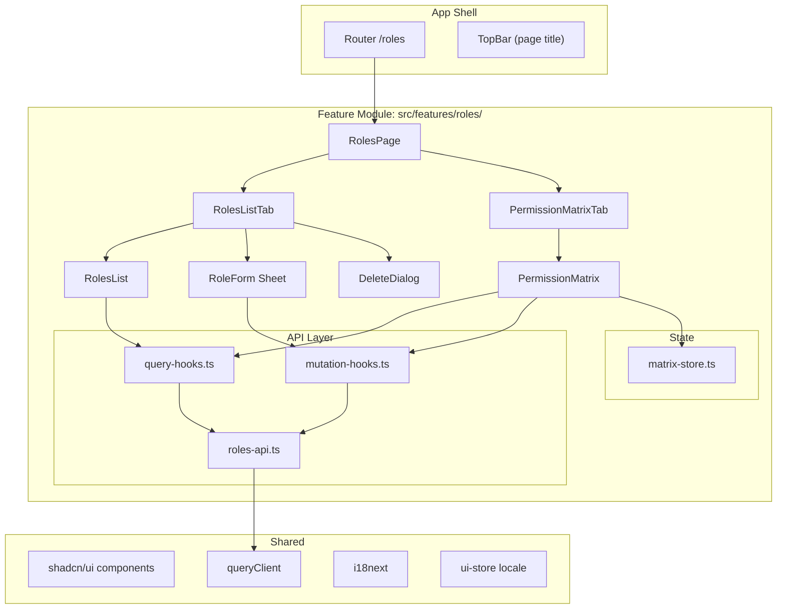
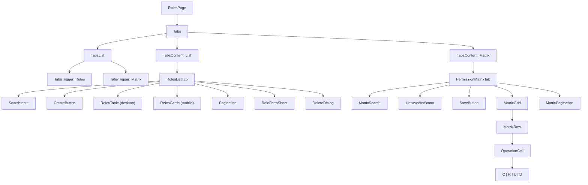
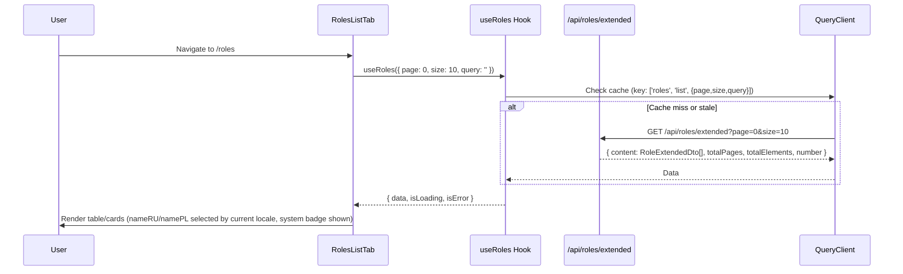
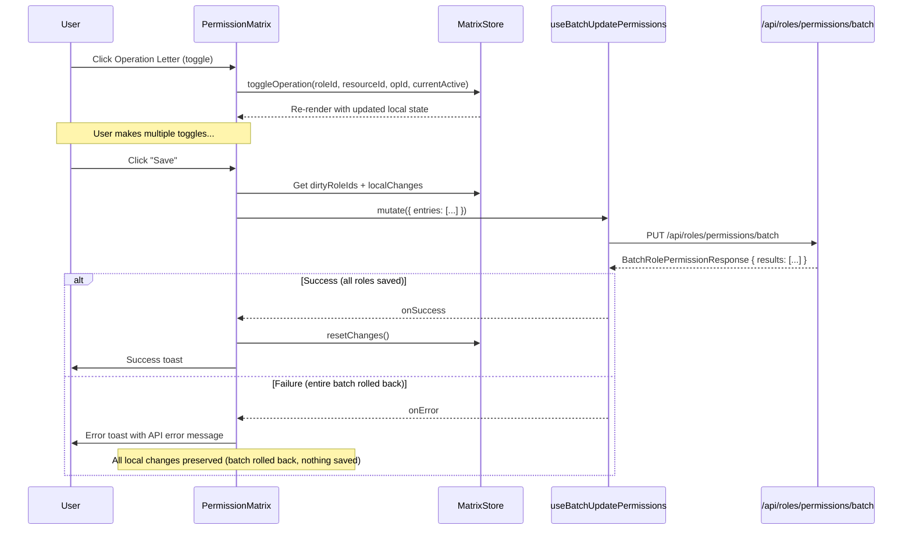
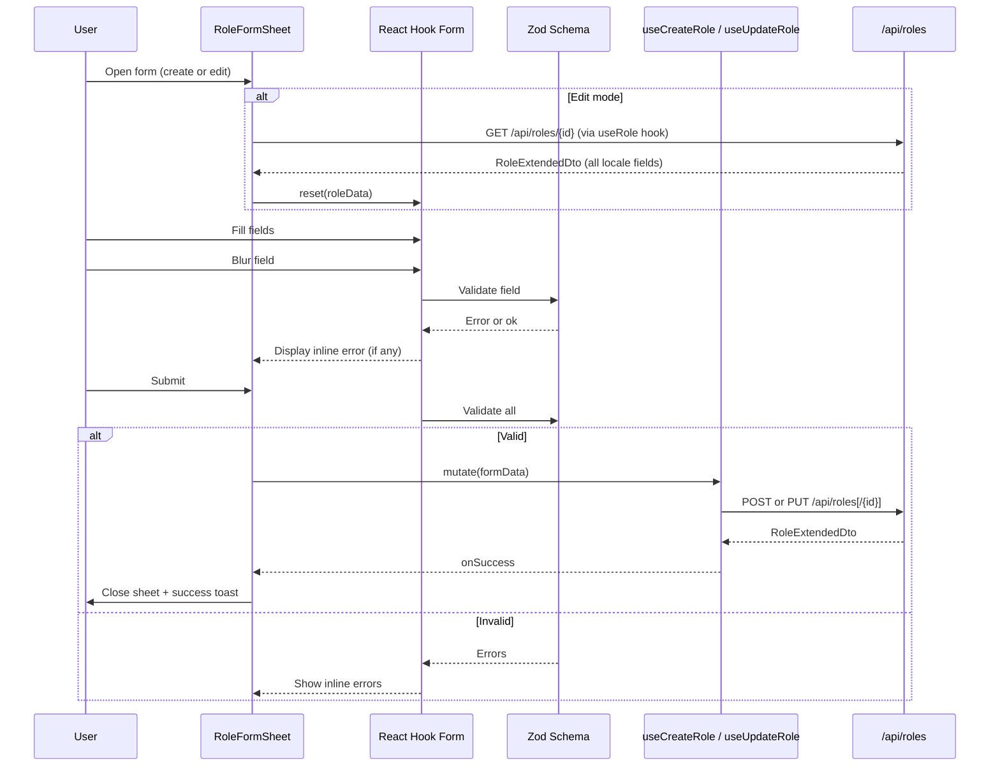

# Design Document: Roles UI (FOR-02-06-roles-ui)

## Overview

This design defines the frontend implementation of the Roles management page for the Foremen admin panel. The page lives at route `/roles` and provides two tabs:

1. **Roles List Tab** — paginated CRUD table for roles (list, create, edit, delete)
2. **Permission Matrix Tab** — summary grid of ALL roles × ALL resources with togglable CRUD operation letters and batch save

The feature follows established project patterns: feature module in `src/features/roles/`, TanStack Query for server state, Zustand for ephemeral UI state (matrix dirty tracking), React Hook Form + Zod for form validation, shadcn/ui components, and full PL/RU i18n.

### Key Design Decisions

| Decision | Rationale |
|----------|-----------|
| Feature module at `src/features/roles/` | Follows project convention. Encapsulates components, hooks, types, and API layer. |
| Separate `api/` layer within the feature | Isolates fetch logic and TanStack Query hooks from UI components. Enables easy mocking in tests. |
| Local Zustand store for matrix dirty state | Permission matrix changes are accumulated locally before batch save. A feature-scoped store is cleaner than lifting state through props. Global `ui-store` is not appropriate for this domain state. |
| Tab state via shadcn Tabs `value` + local state | Tab selection preserved in component state. When navigating back from Role_Form, the last active tab is restored. |
| Role_Form as a modal/sheet instead of sub-route | Simpler navigation model. No need for `/roles/new` or `/roles/:id/edit` sub-routes. The form opens as a sheet overlay, preserving the list context. If tab state must persist across navigation (requirement 5.5), a sheet avoids route changes entirely. |
| Single transactional batch endpoint for matrix save | `PUT /api/roles/permissions/batch` processes all modified roles in one `@Transactional` method. All-or-nothing semantics — simpler frontend, stronger consistency. |
| Roles list uses `/api/roles/extended` endpoint | Requirement 12 requires a `system` badge in the list. `RoleDtoModel` only has `(id, code, name)`. The `/extended` endpoint returns `RoleDtoExtendedModel` with all fields including `system`. |
| Backend resolves locale for list DTOs | `RoleDtoModel.name` is already resolved to the correct locale by the backend based on `Accept-Language` header. No frontend locale resolution needed for list endpoints. The extended DTO exposes all locale fields for edit forms. |
| 30s staleTime for list, 60s for detail | Roles change infrequently. Shorter than global 5min default because admin users expect near-real-time data when actively managing permissions. |
| Sticky first column in matrix | On narrow viewports, horizontal scroll is inevitable with many resources. Pinning role names ensures context is never lost. |
| Operation letters always visible (no collapse) | Requirement 7.6 forbids collapsing. Letters use compact `w-6 h-6` buttons — fits in ~120px per cell. |

### Research Findings

| Topic | Finding |
|-------|---------|
| shadcn/ui Tabs | Uses Radix `@radix-ui/react-tabs`. Controlled via `value`/`onValueChange`. TabsContent lazy-mounts by default (preserves state when switching). |
| shadcn/ui Table | Basic HTML table with styling classes. No built-in pagination — we add our own pagination controls. |
| shadcn/ui AlertDialog | Controlled dialog with `AlertDialogTrigger`/`AlertDialogContent`. Supports async action handlers. |
| TanStack Query `useQueries` | For fetching permissions of multiple roles in parallel. Returns array of query results. Ideal for matrix data loading. |
| React Hook Form `mode: 'onBlur'` | Validates individual fields on blur, full form on submit. Matches requirement 10.4. |
| Zod regex validation | `z.string().regex(/^[A-Z][A-Z0-9_]{1,49}$/)` — validates role code pattern. |
| Spring `@Transactional` batch endpoint | Single service method iterates over all entries. If any validation fails, entire batch rolls back. Frontend only handles success or full failure. |
| CSS `position: sticky` for table columns | `sticky left-0` on first column with `z-10` ensures it stays visible during horizontal scroll. Requires explicit background color to avoid transparency overlap. |
| Backend locale resolution | `AdminController.find()` returns `DtoModel` with pre-resolved locale name (based on `Accept-Language`). `findExtended()` returns all locale fields. No frontend resolution needed for list views. |

## Architecture



### Component Hierarchy



## Components and Interfaces

### 1. Feature Module Structure

```
src/features/roles/
├── index.ts                      # Public barrel export
├── RolesPage.tsx                 # Top-level page with Tabs
├── components/
│   ├── RolesListTab.tsx          # Tab 1 container
│   ├── RolesTable.tsx            # Desktop table view
│   ├── RolesCards.tsx            # Mobile card view
│   ├── RoleFormSheet.tsx         # Create/Edit sheet overlay
│   ├── DeleteRoleDialog.tsx      # Confirmation dialog
│   ├── PermissionMatrixTab.tsx   # Tab 2 container
│   ├── PermissionMatrix.tsx      # Matrix grid component
│   ├── OperationCell.tsx         # Single cell with C/R/U/D letters
│   ├── RolesListSkeleton.tsx     # Table/card skeleton
│   ├── RoleFormSkeleton.tsx      # Form skeleton
│   └── MatrixSkeleton.tsx        # Matrix grid skeleton
├── api/
│   ├── roles-api.ts              # Raw fetch functions
│   ├── query-hooks.ts            # TanStack Query hooks
│   └── mutation-hooks.ts         # TanStack Mutation hooks
├── stores/
│   └── matrix-store.ts           # Zustand store for matrix dirty state
├── schemas/
│   └── role-schema.ts            # Zod validation schemas
├── types/
│   └── index.ts                  # TypeScript interfaces
└── __tests__/
    ├── RolesPage.test.tsx
    ├── RolesListTab.test.tsx
    ├── RoleFormSheet.test.tsx
    ├── DeleteRoleDialog.test.tsx
    ├── PermissionMatrix.test.tsx
    ├── OperationCell.test.tsx
    └── matrix-store.test.ts
```

### 2. TypeScript Interfaces (`types/index.ts`)

```typescript
// --- API Response Types ---

export interface PaginatedResponse<T> {
  content: T[]
  totalPages: number
  totalElements: number
  number: number  // current page (0-indexed)
  size: number
}

/**
 * Returned by GET /api/roles/extended (paginated).
 * Contains all locale fields + system flag.
 * Used for the roles list (because we need `system` for the badge).
 */
export interface RoleExtendedDto {
  id: number
  code: string
  nameRU: string
  namePL: string
  descriptionRU: string | null
  descriptionPL: string | null
  system: boolean
}

/**
 * Returned by GET /api/resources/extended (paginated).
 * Contains all locale fields for the detail/edit view.
 */
export interface ResourceExtendedDto {
  id: number
  code: string
  nameRU: string
  namePL: string
  descriptionRU: string | null
  descriptionPL: string | null
}

/**
 * Returned by GET /api/resources (paginated).
 * The `name` and `description` fields are pre-resolved by the backend
 * based on Accept-Language header. Used in the permission matrix.
 */
export interface ResourceDto {
  id: number
  code: string
  name: string
  description: string | null
}

/**
 * Returned by GET /api/operations (paginated).
 * The `name` field is pre-resolved by the backend.
 * Used in the permission matrix.
 */
export interface OperationDto {
  id: number
  code: string
  name: string
}

export interface PermissionEntry {
  resourceId: number
  resourceCode: string
  resourceName: string
  operations: OperationInfo[]
}

export interface OperationInfo {
  operationId: number
  operationCode: string
  operationName: string
}

export interface RolePermissionResponse {
  roleId: number
  permissions: PermissionEntry[]
}

// --- Batch Permission Types ---

export interface BatchRolePermissionEntry {
  roleId: number
  permissions: PermissionEntryRequest[]
}

export interface BatchRolePermissionRequest {
  entries: BatchRolePermissionEntry[]
}

export interface BatchRolePermissionResponse {
  results: RolePermissionResponse[]
}

// --- API Request Types ---

export interface RoleCreateRequest {
  code: string
  nameRU: string
  namePL: string
  descriptionRU?: string
  descriptionPL?: string
  system?: boolean
}

export interface RoleUpdateRequest {
  nameRU: string
  namePL: string
  descriptionRU?: string
  descriptionPL?: string
  system?: boolean
}

export interface PermissionEntryRequest {
  resourceId: number
  operationIds: number[]
}

export interface RolePermissionRequest {
  permissions: PermissionEntryRequest[]
}

// --- UI State Types ---

export type RoleFormMode = 'create' | 'edit'

export interface MatrixCellState {
  /** Map of operationId → active (true/false) */
  [operationId: number]: boolean
}

/** roleId → resourceId → MatrixCellState */
export type MatrixLocalState = Map<number, Map<number, MatrixCellState>>

/** Set of roleIds that have been modified */
export type DirtyRoleIds = Set<number>
```

### 3. API Layer (`api/roles-api.ts`)

```typescript
import type {
  PaginatedResponse,
  RoleExtendedDto,
  ResourceDto,
  OperationDto,
  RoleCreateRequest,
  RoleUpdateRequest,
  RolePermissionRequest,
  RolePermissionResponse,
  BatchRolePermissionRequest,
  BatchRolePermissionResponse,
} from '../types'

const BASE_URL = '/api'

async function handleResponse<T>(response: Response): Promise<T> {
  if (!response.ok) {
    const body = await response.json().catch(() => ({}))
    const message = body.message || body.error || `HTTP ${response.status}`
    throw new ApiError(response.status, message)
  }
  return response.json()
}

export class ApiError extends Error {
  constructor(
    public status: number,
    message: string,
  ) {
    super(message)
    this.name = 'ApiError'
  }
}

// --- Roles ---

/**
 * Fetches roles using the /extended endpoint.
 * Returns RoleDtoExtendedModel with all locale fields + system flag.
 * We use /extended because the list needs `system` for the badge (Req 12).
 */
export function fetchRoles(params: {
  page?: number
  size?: number
  query?: string
}): Promise<PaginatedResponse<RoleExtendedDto>> {
  const searchParams = new URLSearchParams()
  if (params.page != null) searchParams.set('page', String(params.page))
  if (params.size != null) searchParams.set('size', String(params.size))
  if (params.query) searchParams.set('query', params.query)
  return fetch(`${BASE_URL}/roles/extended?${searchParams}`).then((r) =>
    handleResponse<PaginatedResponse<RoleExtendedDto>>(r),
  )
}

/**
 * Fetches a single role by ID.
 * Returns RoleDtoExtendedModel (all locale fields) for the edit form.
 */
export function fetchRole(id: number): Promise<RoleExtendedDto> {
  return fetch(`${BASE_URL}/roles/${id}`).then((r) => handleResponse<RoleExtendedDto>(r))
}

export function createRole(data: RoleCreateRequest): Promise<RoleExtendedDto> {
  return fetch(`${BASE_URL}/roles`, {
    method: 'POST',
    headers: { 'Content-Type': 'application/json' },
    body: JSON.stringify(data),
  }).then((r) => handleResponse<RoleExtendedDto>(r))
}

export function updateRole(id: number, data: RoleUpdateRequest): Promise<RoleExtendedDto> {
  return fetch(`${BASE_URL}/roles/${id}`, {
    method: 'PUT',
    headers: { 'Content-Type': 'application/json' },
    body: JSON.stringify(data),
  }).then((r) => handleResponse<RoleExtendedDto>(r))
}

export function deleteRole(id: number): Promise<void> {
  return fetch(`${BASE_URL}/roles/${id}`, { method: 'DELETE' }).then((r) => {
    if (!r.ok) return handleResponse<void>(r)
  })
}

// --- Resources ---

/**
 * Fetches resources using the base endpoint.
 * Returns ResourceDtoModel with pre-resolved locale `name` and `description`.
 * Used in the permission matrix where we just display names.
 */
export function fetchResources(params: {
  page?: number
  size?: number
}): Promise<PaginatedResponse<ResourceDto>> {
  const searchParams = new URLSearchParams()
  if (params.page != null) searchParams.set('page', String(params.page))
  if (params.size != null) searchParams.set('size', String(params.size))
  return fetch(`${BASE_URL}/resources?${searchParams}`).then((r) =>
    handleResponse<PaginatedResponse<ResourceDto>>(r),
  )
}

// --- Operations ---

/**
 * Fetches operations using the base endpoint.
 * Returns OperationDtoModel with pre-resolved locale `name`.
 * Used in the permission matrix.
 */
export function fetchOperations(params: {
  page?: number
  size?: number
}): Promise<PaginatedResponse<OperationDto>> {
  const searchParams = new URLSearchParams()
  if (params.page != null) searchParams.set('page', String(params.page))
  if (params.size != null) searchParams.set('size', String(params.size))
  return fetch(`${BASE_URL}/operations?${searchParams}`).then((r) =>
    handleResponse<PaginatedResponse<OperationDto>>(r),
  )
}

// --- Permissions ---

export function fetchRolePermissions(roleId: number): Promise<RolePermissionResponse> {
  return fetch(`${BASE_URL}/roles/${roleId}/permissions`).then((r) =>
    handleResponse<RolePermissionResponse>(r),
  )
}

/**
 * Batch update permissions for multiple roles in a single transactional request.
 * All-or-nothing: if any role/resource/operation is invalid, entire batch rolls back.
 */
export function batchUpdatePermissions(
  data: BatchRolePermissionRequest,
): Promise<BatchRolePermissionResponse> {
  return fetch(`${BASE_URL}/roles/permissions/batch`, {
    method: 'PUT',
    headers: { 'Content-Type': 'application/json' },
    body: JSON.stringify(data),
  }).then((r) => handleResponse<BatchRolePermissionResponse>(r))
}
```

### 4. TanStack Query Hooks (`api/query-hooks.ts`)

```typescript
import { useQuery, useQueries } from '@tanstack/react-query'
import {
  fetchRoles,
  fetchRole,
  fetchResources,
  fetchOperations,
  fetchRolePermissions,
} from './roles-api'

export const roleKeys = {
  all: ['roles'] as const,
  lists: () => [...roleKeys.all, 'list'] as const,
  list: (params: { page: number; size: number; query: string }) =>
    [...roleKeys.lists(), params] as const,
  details: () => [...roleKeys.all, 'detail'] as const,
  detail: (id: number) => [...roleKeys.details(), id] as const,
  permissions: (id: number) => [...roleKeys.all, 'permissions', id] as const,
  resources: ['resources'] as const,
  operations: ['operations'] as const,
}

/**
 * Fetches paginated roles from /api/roles/extended.
 * Returns RoleExtendedDto with all locale fields + system flag.
 */
export function useRoles(params: { page: number; size: number; query: string }) {
  return useQuery({
    queryKey: roleKeys.list(params),
    queryFn: () => fetchRoles(params),
    staleTime: 30_000,
  })
}

/**
 * Fetches a single role by ID from /api/roles/{id}.
 * Returns RoleExtendedDto (all locale fields) for the edit form.
 */
export function useRole(id: number | null) {
  return useQuery({
    queryKey: roleKeys.detail(id!),
    queryFn: () => fetchRole(id!),
    enabled: id != null,
    staleTime: 60_000,
  })
}

export function useResources() {
  return useQuery({
    queryKey: roleKeys.resources,
    queryFn: () => fetchResources({ page: 0, size: 1000 }),
    staleTime: 60_000,
  })
}

export function useOperations() {
  return useQuery({
    queryKey: roleKeys.operations,
    queryFn: () => fetchOperations({ page: 0, size: 100 }),
    staleTime: 60_000,
  })
}

export function useRolePermissions(roleId: number | null) {
  return useQuery({
    queryKey: roleKeys.permissions(roleId!),
    queryFn: () => fetchRolePermissions(roleId!),
    enabled: roleId != null,
    staleTime: 30_000,
  })
}

export function useMultipleRolePermissions(roleIds: number[]) {
  return useQueries({
    queries: roleIds.map((id) => ({
      queryKey: roleKeys.permissions(id),
      queryFn: () => fetchRolePermissions(id),
      staleTime: 30_000,
    })),
  })
}
```

### 5. TanStack Mutation Hooks (`api/mutation-hooks.ts`)

```typescript
import { useMutation, useQueryClient } from '@tanstack/react-query'
import { createRole, updateRole, deleteRole, batchUpdatePermissions } from './roles-api'
import { roleKeys } from './query-hooks'
import type { RoleCreateRequest, RoleUpdateRequest, BatchRolePermissionRequest } from '../types'

export function useCreateRole() {
  const queryClient = useQueryClient()
  return useMutation({
    mutationFn: (data: RoleCreateRequest) => createRole(data),
    onSuccess: () => {
      queryClient.invalidateQueries({ queryKey: roleKeys.lists() })
    },
  })
}

export function useUpdateRole() {
  const queryClient = useQueryClient()
  return useMutation({
    mutationFn: ({ id, data }: { id: number; data: RoleUpdateRequest }) => updateRole(id, data),
    onSuccess: (_data, variables) => {
      queryClient.invalidateQueries({ queryKey: roleKeys.lists() })
      queryClient.invalidateQueries({ queryKey: roleKeys.detail(variables.id) })
    },
  })
}

export function useDeleteRole() {
  const queryClient = useQueryClient()
  return useMutation({
    mutationFn: (id: number) => deleteRole(id),
    onSuccess: () => {
      queryClient.invalidateQueries({ queryKey: roleKeys.lists() })
    },
  })
}

/**
 * Batch update permissions for all modified roles in a single transactional request.
 * On success: invalidates permission caches for all roles in the batch + list cache.
 * On failure: entire batch rolled back, no partial state to manage.
 */
export function useBatchUpdatePermissions() {
  const queryClient = useQueryClient()
  return useMutation({
    mutationFn: (data: BatchRolePermissionRequest) => batchUpdatePermissions(data),
    onSuccess: (result) => {
      result.results.forEach((r) => {
        queryClient.invalidateQueries({ queryKey: roleKeys.permissions(r.roleId) })
      })
      queryClient.invalidateQueries({ queryKey: roleKeys.lists() })
    },
  })
}
```

### 6. Zod Validation Schema (`schemas/role-schema.ts`)

```typescript
import { z } from 'zod'

export const roleCreateSchema = z.object({
  code: z
    .string()
    .min(1, 'roles.validation.codeRequired')
    .regex(/^[A-Z][A-Z0-9_]{1,49}$/, 'roles.validation.codePattern'),
  nameRU: z
    .string()
    .min(2, 'roles.validation.nameMin')
    .max(100, 'roles.validation.nameMax'),
  namePL: z
    .string()
    .min(2, 'roles.validation.nameMin')
    .max(100, 'roles.validation.nameMax'),
  descriptionRU: z.string().max(500, 'roles.validation.descriptionMax').optional().or(z.literal('')),
  descriptionPL: z.string().max(500, 'roles.validation.descriptionMax').optional().or(z.literal('')),
  system: z.boolean().default(false),
})

export const roleUpdateSchema = roleCreateSchema.omit({ code: true })

export type RoleCreateFormValues = z.infer<typeof roleCreateSchema>
export type RoleUpdateFormValues = z.infer<typeof roleUpdateSchema>
```

### 7. Matrix Store (`stores/matrix-store.ts`)

```typescript
import { create } from 'zustand'
import type { MatrixCellState } from '../types'

interface MatrixState {
  /** Local overrides: roleId → resourceId → { operationId: boolean } */
  localChanges: Map<number, Map<number, MatrixCellState>>
  /** Set of role IDs that have pending changes */
  dirtyRoleIds: Set<number>
  /** Toggle a single operation for a role+resource cell */
  toggleOperation: (roleId: number, resourceId: number, operationId: number, currentActive: boolean) => void
  /** Reset all local changes (after successful batch save) */
  resetChanges: () => void
  /** Check if a specific operation has been locally toggled */
  getLocalState: (roleId: number, resourceId: number, operationId: number) => boolean | undefined
  /** Whether there are any unsaved changes */
  hasChanges: () => boolean
}

export const useMatrixStore = create<MatrixState>((set, get) => ({
  localChanges: new Map(),
  dirtyRoleIds: new Set(),

  toggleOperation: (roleId, resourceId, operationId, currentActive) => {
    set((state) => {
      const newChanges = new Map(state.localChanges)
      if (!newChanges.has(roleId)) {
        newChanges.set(roleId, new Map())
      }
      const roleMap = newChanges.get(roleId)!
      if (!roleMap.has(resourceId)) {
        roleMap.set(resourceId, {})
      }
      const cellState = { ...roleMap.get(resourceId)! }
      
      // Toggle: if already overridden, check if toggling back to original
      if (cellState[operationId] === undefined) {
        // First toggle: flip from server state
        cellState[operationId] = !currentActive
      } else {
        // Already toggled: if toggling back to original, remove override
        if (cellState[operationId] === currentActive) {
          // Toggling back to original — this means we want to flip again
          cellState[operationId] = !currentActive
        } else {
          // Toggling back to server state — remove the override
          delete cellState[operationId]
        }
      }

      roleMap.set(resourceId, cellState)

      // Update dirty set
      const newDirty = new Set(state.dirtyRoleIds)
      // Check if this role still has any changes
      const hasRoleChanges = Array.from(roleMap.values()).some(
        (cell) => Object.keys(cell).length > 0,
      )
      if (hasRoleChanges) {
        newDirty.add(roleId)
      } else {
        newDirty.delete(roleId)
        newChanges.delete(roleId)
      }

      return { localChanges: newChanges, dirtyRoleIds: newDirty }
    })
  },

  resetChanges: () => {
    set({ localChanges: new Map(), dirtyRoleIds: new Set() })
  },

  getLocalState: (roleId, resourceId, operationId) => {
    const roleMap = get().localChanges.get(roleId)
    if (!roleMap) return undefined
    const cellState = roleMap.get(resourceId)
    if (!cellState) return undefined
    return cellState[operationId]
  },

  hasChanges: () => get().dirtyRoleIds.size > 0,
}))
```

### 8. Key Component Interfaces

#### RolesPage

```typescript
// RolesPage.tsx — Top-level page component
// Manages tab state, renders Tabs with RolesListTab and PermissionMatrixTab

interface RolesPageProps {} // No props — route-level component

// Internal state:
// - activeTab: 'list' | 'matrix' (default: 'list')
// - formState: { open: boolean; mode: RoleFormMode; roleId: number | null }
// - deleteState: { open: boolean; role: RoleExtendedDto | null }
```

#### RoleFormSheet

```typescript
interface RoleFormSheetProps {
  open: boolean
  mode: RoleFormMode
  roleId: number | null
  onClose: () => void
  onSuccess: () => void
}
```

#### DeleteRoleDialog

```typescript
interface DeleteRoleDialogProps {
  open: boolean
  role: RoleExtendedDto | null
  onClose: () => void
  onSuccess: () => void
}
```

#### OperationCell

```typescript
interface OperationCellProps {
  roleId: number
  resourceId: number
  operations: OperationDto[]
  /** Server-state active operation IDs for this cell */
  activeOperationIds: Set<number>
}
```

### 9. Backend: Batch Permission Endpoint

The backend needs a new batch endpoint on `RoleController` to support the transactional matrix save:

```java
// RoleController addition:
@PutMapping("/permissions/batch")
public ResponseEntity<BatchRolePermissionResponse> batchReplacePermissions(
        @Valid @RequestBody BatchRolePermissionRequest request) {
    BatchRolePermissionResponse response = roleService.batchReplacePermissions(request);
    return ResponseEntity.ok(response);
}
```

```java
// RoleService addition (already @Transactional on class level):
public BatchRolePermissionResponse batchReplacePermissions(BatchRolePermissionRequest request) {
    List<RolePermissionResponse> results = new ArrayList<>();
    for (BatchRolePermissionEntry entry : request.entries()) {
        RolePermissionRequest singleRequest = new RolePermissionRequest(entry.permissions());
        results.add(replacePermissions(entry.roleId(), singleRequest));
    }
    return new BatchRolePermissionResponse(results);
}
```

```java
// New request/response records:
public record BatchRolePermissionEntry(Long roleId, List<PermissionEntryRequest> permissions) {}
public record BatchRolePermissionRequest(List<BatchRolePermissionEntry> entries) {}
public record BatchRolePermissionResponse(List<RolePermissionResponse> results) {}
```

Since `RoleService` is annotated with `@Transactional` at the class level, the `batchReplacePermissions` method runs in a single transaction. If any `replacePermissions` call throws (e.g., invalid resource ID or operation ID), the entire batch rolls back — no partial state.

## Data Models

### Data Flow: Roles List



### Data Flow: Permission Matrix Save (Batch)



### Data Flow: Role Form (Create/Edit)



### Locale-Aware Display in the Roles List

The roles list uses `GET /api/roles/extended` which returns `RoleExtendedDto` with all locale fields (`nameRU`, `namePL`, `descriptionRU`, `descriptionPL`). The frontend selects the appropriate locale field based on the current UI locale:

```typescript
import { useUIStore } from '@/stores/ui-store'

// In the RolesListTab / RolesTable component:
const locale = useUIStore((s) => s.locale) // 'pl' | 'ru'

// Render role name based on locale
const displayName = locale === 'ru' ? role.nameRU : role.namePL
const displayDescription = locale === 'ru' ? role.descriptionRU : role.descriptionPL
```

For the **permission matrix**, resources and operations come from the list endpoints (`GET /api/resources`, `GET /api/operations`) which return pre-resolved locale names via `Accept-Language` header. No additional frontend resolution is needed for these — the `name` field is already in the correct locale.

## Error Handling

| Scenario | UI Treatment |
|----------|-------------|
| Network error (fetch fails) | Error toast with generic connectivity message (`roles.errors.network`) |
| HTTP 4xx/5xx on list load | Inline error state with "Retry" button replacing table content |
| HTTP 4xx/5xx on matrix load | Inline error state with "Retry" button replacing matrix content |
| HTTP 403 on role delete | Error toast: "System roles cannot be deleted" (`roles.errors.systemDelete`) |
| HTTP 4xx on create/update | Error toast with API error message |
| Validation error on form submit | Inline error messages below each invalid field |
| Matrix batch save failure | Error toast with API error message. All local changes preserved since batch rolled back. User can retry. |
| Mutation in progress | Submit/Save button shows loading spinner, is disabled to prevent double-submit |

### Error State Component Pattern

```typescript
interface InlineErrorProps {
  message: string
  onRetry: () => void
}

// Renders centered error icon + localized message + "Retry" button
// Used in both RolesListTab and PermissionMatrixTab when queries fail after retries
```

### Toast Integration

The project will use `sonner` (lightweight toast library compatible with shadcn/ui patterns) or shadcn/ui's built-in Toast. Toasts are triggered from mutation `onSuccess` and `onError` callbacks.

```typescript
import { toast } from 'sonner' // or shadcn toast

// Success example
toast.success(t('roles.toast.createSuccess'))

// Error example  
toast.error(t('roles.toast.deleteError', { message: error.message }))
```

## Testing Strategy

### Why Property-Based Testing Does NOT Apply

This feature is a **React frontend UI module**. It consists of:
- UI rendering (React components with shadcn/ui)
- Data fetching (TanStack Query hooks wrapping REST calls)
- Form state management (React Hook Form)
- Local state management (Zustand store for matrix dirty tracking)
- Schema validation (Zod — already thoroughly tested by Zod itself)

None of these involve pure algorithmic logic with a large input space where universal properties would be meaningful. The "Permission Matrix toggle" logic is the closest candidate, but it's simple state toggle logic best verified by example-based tests covering key scenarios (toggle on, toggle off, toggle back to original removes override, batch save collects correct payloads).

**Appropriate testing strategy:** Example-based unit tests with Vitest + Testing Library, plus component tests that verify user interactions.

---

### Unit Tests (Vitest)

#### Matrix Store Logic (`matrix-store.test.ts`)

1. `toggleOperation` — toggling an operation adds it to localChanges and dirtyRoleIds
2. `toggleOperation` — toggling the same operation back removes the override (returns to server state)
3. `toggleOperation` — toggling multiple operations on same cell accumulates correctly
4. `resetChanges` — clears all localChanges and dirtyRoleIds
5. `hasChanges` — returns false when no dirty roles, true otherwise
6. `getLocalState` — returns undefined when no override exists
7. `getLocalState` — returns the toggled boolean when override exists

#### Zod Schema (`role-schema.test.ts`)

8. Valid create payload passes validation
9. Empty code fails with `codeRequired` error
10. Code with lowercase letters fails with `codePattern` error
11. Code starting with a digit fails
12. nameRU shorter than 2 chars fails
13. namePL longer than 100 chars fails
14. Description longer than 500 chars fails
15. System defaults to false when omitted
16. Update schema does not include code field

#### API Error Handling (`roles-api.test.ts`)

17. `handleResponse` throws `ApiError` with status and message for non-ok responses
18. `handleResponse` parses JSON body for error message
19. `handleResponse` handles responses where JSON parsing fails (returns generic message)

### Component Tests (Vitest + Testing Library)

#### RolesPage

20. Renders two tabs with correct i18n labels
21. Defaults to "list" tab active
22. Switching to matrix tab renders PermissionMatrixTab
23. Switching back to list tab renders RolesListTab

#### RolesListTab

24. Shows skeleton while loading
25. Renders table rows with role data on desktop (displays locale-appropriate name)
26. Renders cards on mobile viewport
27. Search input triggers refetch with query param (debounced)
28. Pagination controls navigate between pages
29. "Create Role" button opens form sheet in create mode
30. Edit button opens form sheet in edit mode with role ID
31. Delete button is disabled for system roles with tooltip
32. Delete button opens confirmation dialog for non-system roles
33. Empty state message shown when no roles match filter
34. System badge displayed for system roles

#### RoleFormSheet

35. Create mode: all fields empty, code editable
36. Edit mode: fields pre-populated with all locale values, code disabled
37. Submit with invalid data shows inline errors
38. Successful create: closes sheet, shows success toast
39. Successful update: closes sheet, shows success toast
40. API error: shows error toast, sheet stays open
41. Cancel button closes sheet without saving
42. Submit button disabled while mutation in progress

#### DeleteRoleDialog

43. Shows role name in confirmation message
44. Confirm triggers DELETE request
45. Success: closes dialog, shows success toast
46. HTTP 403: shows system role error toast
47. Cancel closes dialog without action

#### PermissionMatrix

48. Shows skeleton while loading
49. Renders grid with role rows and resource columns
50. Operation letters show correct active/inactive state from server data
51. Clicking an operation letter toggles local state (visual change)
52. "Save" button disabled when no changes
53. "Save" button enabled when changes exist
54. Unsaved changes indicator visible when dirty
55. Save triggers batch update for all dirty roles in single request
56. Successful save resets all dirty state and shows toast
57. Failed save shows error toast, all local changes preserved
58. Search filters displayed roles
59. Pagination works for role rows

#### OperationCell

60. Renders all 4 operation letters (C, R, U, D)
61. Active operations styled with primary color
62. Inactive operations styled with muted-foreground
63. Click on a letter calls toggleOperation

### Integration Pattern

Tests use `msw` (Mock Service Worker) for API mocking with `@testing-library/react` for rendering within QueryClientProvider context. Each test file sets up its own MSW handlers for the endpoints it exercises.

### Test File Organization

```
src/features/roles/__tests__/
├── matrix-store.test.ts          # Unit: store logic
├── role-schema.test.ts           # Unit: Zod validation
├── roles-api.test.ts             # Unit: API layer error handling
├── RolesPage.test.tsx            # Component: tab switching
├── RolesListTab.test.tsx         # Component: list CRUD interactions
├── RoleFormSheet.test.tsx        # Component: form create/edit
├── DeleteRoleDialog.test.tsx     # Component: delete confirmation
├── PermissionMatrix.test.tsx     # Component: matrix interactions
└── OperationCell.test.tsx        # Component: letter toggle
```
