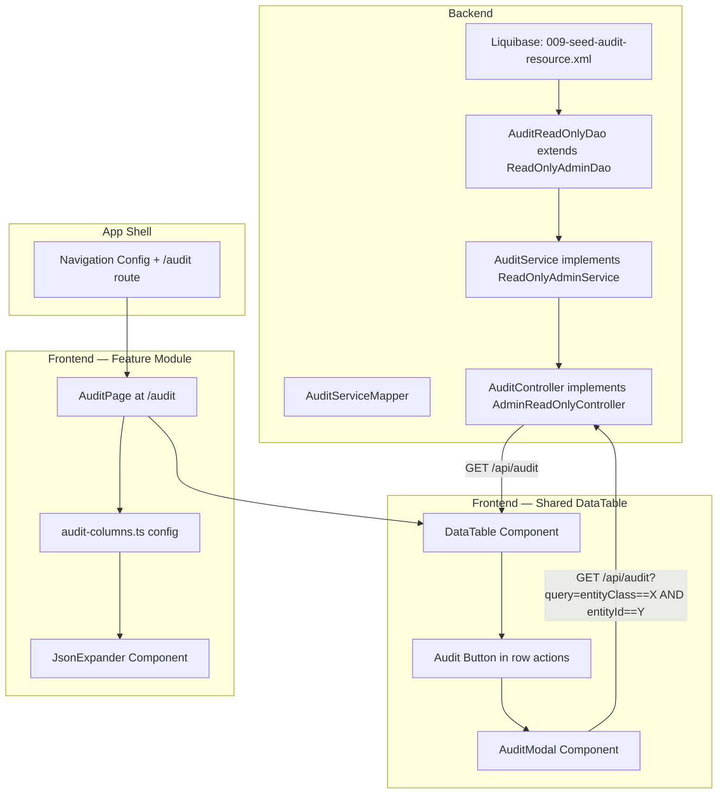
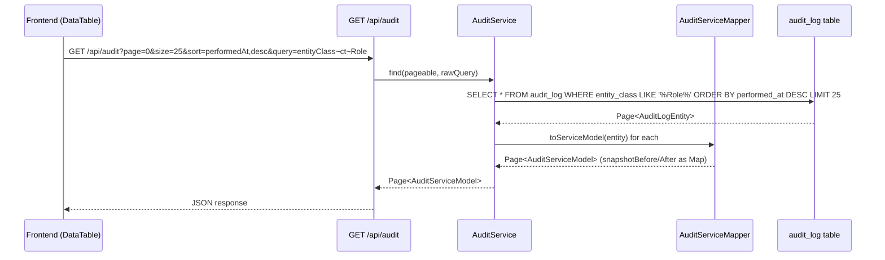
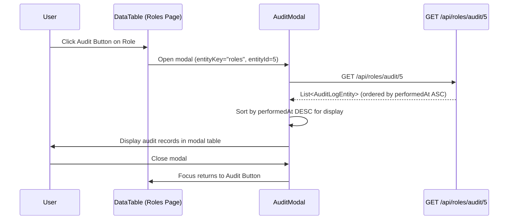

# Design Document: Audit Log UI (FOR-02-06a-audit)

## Overview

This design implements a full-page audit log viewer at route `/audit` and an "Audit" button in the generic DataTable template that opens a filtered modal for any entity row. The backend is extended with a read-only audit controller at `/api/audit` following the `AdminReadOnlyController` pattern. A new ABAC resource `AUDIT` (READ-only for ADMIN) is seeded via Liquibase.

The audit entity is **immutable** — no create, update, or delete operations are exposed. The frontend reuses the existing `DataTable` component from `src/components/data-table/`, adding a `showAuditButton` prop and a shared `AuditModal` component. A feature module at `src/features/audit/` encapsulates the audit page, column config, and JSON expander component.

### Key Design Decisions

| Decision | Rationale |
|----------|-----------|
| `AdminReadOnlyController` pattern for backend | Audit is read-only/immutable. Matches Resource/Operation controllers. Provides pagination, sort, Query DSL, and metadata out of the box. |
| No i18n fields on AuditServiceModel | Audit data is system-generated (entity names, operation codes). No nameRU/namePL needed. |
| `showAuditButton` prop on DataTable (default: true) | Minimal API change to existing shared component. Audit page itself sets it to false. |
| AuditModal in `src/components/data-table/` (shared) | The modal uses the existing `GET /api/{entity}/audit/{id}` endpoint on AdminController. Returns a simple list (not paginated) — simpler than constructing query DSL filters. Renders a shadcn Table directly, not a full DataTable. |
| JSON snapshots displayed via expandable cell | Snapshots can be large. Inline expansion avoids modal-in-modal complexity while keeping data accessible. |
| Separate Liquibase changeset file (009-seed-audit-resource.xml) | Follows existing numbering convention (001–008 exist). Keeps ABAC seed changes in a dedicated file for clarity. |
| Audit service uses `ReadOnlyAdminDao` extended interface | `AuditLogDao` already extends `JpaRepository`. We create a new `AuditReadOnlyDao` extending `ReadOnlyAdminDao` for compatibility with the framework pattern. |
| snapshotBefore/snapshotAfter mapped as Map<String, Object> | Jackson deserializes JSONB columns to maps. Enables frontend to pretty-print without parsing. |
| Extended model = same as service model | No locale-specific fields, so ServiceModel and ServiceExtendedModel are identical. |

### Research Findings

| Topic | Finding |
|-------|---------|
| Existing AuditLogDao | Has `findByEntityClassAndEntityIdOrderByPerformedAtAsc` which is used by the existing `AdminController.getAudit(id)` endpoint. The Audit_Modal reuses this endpoint directly. |
| AuditLogEntity JSONB mapping | Uses `@JdbcTypeCode(SqlTypes.JSON)` with `String` type. For the service model, we'll convert to `Map<String, Object>` via Jackson in the mapper. |
| AdminReadOnlyController default methods | Provides GET `/` (paginated + query), GET `/{id}`, and GET `/metadata` automatically. No code needed in concrete controller beyond wiring. |
| DataTable `rowActions` prop | Currently `(row: T) => React.ReactNode`. The audit button needs to be injected alongside existing actions. Adding `showAuditButton` as a separate boolean prop is cleaner than modifying the rowActions API. |
| shadcn/ui Dialog | Supports controlled open/close state, onClose callback, keyboard (Escape) and backdrop click dismissal. Radix-based, accessible. |

## Architecture



### Package Structure

**Backend:**
```
com.foremen
├── dao/
│   └── AuditReadOnlyDao.java          # ReadOnlyAdminDao<AuditLogEntity, Long>
├── service/
│   ├── model/
│   │   ├── AuditServiceModel.java      # record (id, entityClass, entityId, operation, performedBy, performedAt, snapshotBefore, snapshotAfter)
│   │   └── AuditServiceExtendedModel.java  # same as AuditServiceModel (no i18n)
│   ├── model/mapper/
│   │   └── AuditServiceMapper.java     # ServiceToDaoMapper, snapshotBefore/After String↔Map conversion
│   └── AuditService.java              # ReadOnlyAdminService implementation
├── controller/
│   └── AuditController.java           # AdminReadOnlyController at /api/audit
└── database_files/
    └── changesets/
        └── 009-seed-audit-resource.xml  # ABAC AUDIT resource + ADMIN READ permission
```

**Frontend:**
```
src/
├── components/data-table/
│   ├── DataTable.tsx                   # Modified: add showAuditButton prop + render logic
│   ├── AuditModal.tsx                  # NEW: Dialog with filtered DataTable
│   └── types.ts                        # Modified: add showAuditButton to DataTableProps
├── features/audit/
│   ├── index.ts                        # Barrel export
│   ├── AuditPage.tsx                   # Full page component
│   ├── components/
│   │   └── JsonExpander.tsx            # Expandable JSON cell component
│   ├── config/
│   │   ├── audit-columns.ts           # ColumnConfig for full page
│   │   └── audit-modal-columns.ts     # ColumnConfig for modal (no entityClass/entityId)
│   └── api/
│       └── audit-api.ts               # Fetch function for DataTable
└── locales/
    ├── pl.json                         # Add audit namespace keys
    └── ru.json                         # Add audit namespace keys
```

## Components and Interfaces

### 1. Backend — Liquibase Changeset (009-seed-audit-resource.xml)

```xml
<?xml version="1.0" encoding="UTF-8"?>
<databaseChangeLog
    xmlns="http://www.liquibase.org/xml/ns/dbchangelog"
    xmlns:xsi="http://www.w3.org/2001/XMLSchema-instance"
    xsi:schemaLocation="http://www.liquibase.org/xml/ns/dbchangelog
        http://www.liquibase.org/xml/ns/dbchangelog/dbchangelog-latest.xsd">

    <!-- Seed AUDIT resource into resources table -->
    <changeSet id="009-seed-audit-resource" author="foremen">
        <preConditions onFail="MARK_RAN">
            <sqlCheck expectedResult="0">
                SELECT COUNT(*) FROM resources WHERE code = 'AUDIT'
            </sqlCheck>
        </preConditions>

        <insert tableName="resources">
            <column name="code" value="AUDIT"/>
            <column name="name_ru" value="Аудит"/>
            <column name="name_pl" value="Audyt"/>
            <column name="description_ru" value="Журнал аудита"/>
            <column name="description_pl" value="Dziennik audytu"/>
        </insert>
    </changeSet>

    <!-- Grant ADMIN role READ on AUDIT resource -->
    <changeSet id="009-seed-audit-permissions" author="foremen">
        <preConditions onFail="MARK_RAN">
            <sqlCheck expectedResult="0">
                SELECT COUNT(*) FROM role_resources rr
                JOIN roles r ON rr.role_id = r.id
                JOIN resources res ON rr.resource_id = res.id
                WHERE r.code = 'ADMIN' AND res.code = 'AUDIT'
            </sqlCheck>
        </preConditions>

        <!-- Create role_resources entry for ADMIN + AUDIT -->
        <sql>
            INSERT INTO role_resources (role_id, resource_id, created_date, created_by)
            SELECT r.id, res.id, NOW(), 'system'
            FROM roles r, resources res
            WHERE r.code = 'ADMIN' AND res.code = 'AUDIT';
        </sql>

        <!-- Grant READ operation only -->
        <sql>
            INSERT INTO role_resource_operations (role_resource_id, operation_id)
            SELECT rr.id, o.id
            FROM role_resources rr
            JOIN roles r ON rr.role_id = r.id
            JOIN resources res ON rr.resource_id = res.id
            JOIN operations o ON o.code = 'READ'
            WHERE r.code = 'ADMIN' AND res.code = 'AUDIT';
        </sql>
    </changeSet>

</databaseChangeLog>
```

### 2. Backend — DAO

```java
package com.foremen.dao;

import com.foremen.service.audit.AuditLogEntity;
import org.springframework.stereotype.Repository;

@Repository
public interface AuditReadOnlyDao extends ReadOnlyAdminDao<AuditLogEntity, Long> {
}
```

### 3. Backend — Service Models

```java
package com.foremen.service.model;

import java.time.LocalDateTime;
import java.util.Map;

public record AuditServiceModel(
    Long id,
    String entityClass,
    Long entityId,
    String operation,
    String performedBy,
    LocalDateTime performedAt,
    Map<String, Object> snapshotBefore,
    Map<String, Object> snapshotAfter
) {}

// Extended model is identical — no i18n fields
public record AuditServiceExtendedModel(
    Long id,
    String entityClass,
    Long entityId,
    String operation,
    String performedBy,
    LocalDateTime performedAt,
    Map<String, Object> snapshotBefore,
    Map<String, Object> snapshotAfter
) {}
```

### 4. Backend — Service Mapper

```java
package com.foremen.service.model.mapper;

import com.foremen.config.mapper.ForemenMapperConfig;
import com.foremen.mapper.ServiceToDaoMapper;
import com.foremen.service.audit.AuditLogEntity;
import com.foremen.service.model.AuditServiceExtendedModel;
import com.foremen.service.model.AuditServiceModel;
import com.fasterxml.jackson.core.type.TypeReference;
import com.fasterxml.jackson.databind.ObjectMapper;
import org.mapstruct.Mapper;
import org.mapstruct.Mapping;
import org.mapstruct.Named;

import java.util.Map;
import java.util.Set;

@Mapper(config = ForemenMapperConfig.class)
public interface AuditServiceMapper
        extends ServiceToDaoMapper<AuditLogEntity, AuditServiceModel, AuditServiceExtendedModel> {

    ObjectMapper OBJECT_MAPPER = new ObjectMapper();

    @Override
    default Set<String> getI18nSupportedProperties() {
        return Set.of(); // No i18n fields for audit
    }

    @Override
    @Mapping(source = "snapshotBefore", target = "snapshotBefore", qualifiedByName = "jsonStringToMap")
    @Mapping(source = "snapshotAfter", target = "snapshotAfter", qualifiedByName = "jsonStringToMap")
    AuditServiceModel toServiceModel(AuditLogEntity entity);

    @Override
    @Mapping(source = "snapshotBefore", target = "snapshotBefore", qualifiedByName = "jsonStringToMap")
    @Mapping(source = "snapshotAfter", target = "snapshotAfter", qualifiedByName = "jsonStringToMap")
    AuditServiceExtendedModel toExtendedServiceModel(AuditLogEntity entity);

    @Named("jsonStringToMap")
    default Map<String, Object> jsonStringToMap(String json) {
        if (json == null || json.isBlank()) return null;
        try {
            return OBJECT_MAPPER.readValue(json, new TypeReference<>() {});
        } catch (Exception e) {
            return Map.of("_raw", json);
        }
    }
}
```

### 5. Backend — Service Implementation

```java
package com.foremen.service;

import com.foremen.dao.AuditReadOnlyDao;
import com.foremen.service.audit.AuditLogEntity;
import com.foremen.service.model.AuditServiceExtendedModel;
import com.foremen.service.model.AuditServiceModel;
import com.foremen.service.model.mapper.AuditServiceMapper;
import jakarta.persistence.EntityManager;
import lombok.Getter;
import lombok.RequiredArgsConstructor;
import org.springframework.stereotype.Service;

@Service
@RequiredArgsConstructor
@Getter
public class AuditService implements ReadOnlyAdminService<
        AuditServiceModel, AuditServiceExtendedModel, AuditLogEntity, Long> {

    private final AuditReadOnlyDao readDao;
    private final AuditServiceMapper mapper;
    private final EntityManager entityManager;
    private final Class<AuditLogEntity> daoModelClass = AuditLogEntity.class;
}
```

### 6. Backend — Controller

```java
package com.foremen.controller;

import com.foremen.service.AuditService;
import com.foremen.service.ReadOnlyAdminService;
import com.foremen.service.audit.AuditLogEntity;
import com.foremen.service.model.AuditServiceExtendedModel;
import com.foremen.service.model.AuditServiceModel;
import lombok.RequiredArgsConstructor;
import org.springframework.web.bind.annotation.RequestMapping;
import org.springframework.web.bind.annotation.RestController;

@RestController
@RequestMapping("/api/audit")
@RequiredArgsConstructor
public class AuditController implements AdminReadOnlyController<
        AuditServiceModel, AuditServiceExtendedModel, AuditLogEntity, Long> {

    private final AuditService auditService;

    @Override
    public ReadOnlyAdminService<AuditServiceModel, AuditServiceExtendedModel, AuditLogEntity, Long> getService() {
        return auditService;
    }
}
```

### 7. Frontend — DataTable Props Extension

```typescript
// Additions to src/components/data-table/types.ts

export interface DataTableProps<T> {
  // ... existing props ...
  
  /** Show audit button in row actions (default: true) */
  showAuditButton?: boolean
  /** Default sort configuration applied when no persisted state exists */
  defaultSort?: SortState[]
}
```

### 8. Frontend — AuditModal Component

```typescript
// src/components/data-table/AuditModal.tsx

import { Dialog, DialogContent, DialogHeader, DialogTitle } from '@/components/ui/dialog'
import { Table, TableBody, TableCell, TableHead, TableHeader, TableRow } from '@/components/ui/table'
import { useTranslation } from 'react-i18next'
import { useQuery } from '@tanstack/react-query'
import { Skeleton } from '@/components/ui/skeleton'
import { auditModalColumns } from '@/features/audit/config/audit-columns'
import type { AuditRecord } from '@/features/audit/types'

interface AuditModalProps {
  open: boolean
  onClose: () => void
  entityKey: string   // API path segment (e.g., "roles")
  entityId: number
}

/**
 * Audit modal that reuses the existing AdminController endpoint:
 * GET /api/{entityKey}/audit/{entityId}
 * Returns List<AuditLogEntity> ordered by performedAt ASC.
 * We reverse to DESC for display (most recent first).
 */
export function AuditModal({ open, onClose, entityKey, entityId }: AuditModalProps) {
  const { t } = useTranslation()
  
  const { data, isLoading } = useQuery({
    queryKey: ['audit', entityKey, entityId],
    queryFn: async () => {
      const response = await fetch(`/api/${entityKey}/audit/${entityId}`)
      if (!response.ok) throw new Error(`HTTP ${response.status}`)
      return response.json() as Promise<AuditRecord[]>
    },
    enabled: open,
  })

  // Sort by performedAt descending (endpoint returns ASC, we reverse for display)
  const sortedData = data ? [...data].sort(
    (a, b) => new Date(b.performedAt).getTime() - new Date(a.performedAt).getTime()
  ) : []

  return (
    <Dialog open={open} onOpenChange={(v) => !v && onClose()}>
      <DialogContent className="max-w-[90vw] max-h-[80vh] overflow-hidden flex flex-col">
        <DialogHeader>
          <DialogTitle>
            {t('audit.modal.title')} — {entityKey} #{entityId}
          </DialogTitle>
        </DialogHeader>
        <div className="flex-1 overflow-auto">
          {isLoading ? (
            <div className="space-y-2">
              {Array.from({ length: 5 }).map((_, i) => (
                <Skeleton key={i} className="h-10 w-full" />
              ))}
            </div>
          ) : (
            <Table>
              <TableHeader>
                <TableRow>
                  {auditModalColumns.map((col) => (
                    <TableHead key={col.field}>{t(col.headerKey)}</TableHead>
                  ))}
                </TableRow>
              </TableHeader>
              <TableBody>
                {sortedData.map((record) => (
                  <TableRow key={record.id}>
                    {auditModalColumns.map((col) => (
                      <TableCell key={col.field}>
                        {col.render
                          ? col.render(record[col.field as keyof AuditRecord], record)
                          : String(record[col.field as keyof AuditRecord] ?? '')}
                      </TableCell>
                    ))}
                  </TableRow>
                ))}
              </TableBody>
            </Table>
          )}
        </div>
      </DialogContent>
    </Dialog>
  )
}
```

### 9. Frontend — JsonExpander Component

```typescript
// src/features/audit/components/JsonExpander.tsx

import { useState } from 'react'
import { Button } from '@/components/ui/button'
import { useTranslation } from 'react-i18next'

interface JsonExpanderProps {
  data: Record<string, unknown> | null
}

export function JsonExpander({ data }: JsonExpanderProps) {
  const [expanded, setExpanded] = useState(false)
  const { t } = useTranslation()

  if (data === null || data === undefined) {
    return <span className="text-muted-foreground">—</span>
  }

  if (!expanded) {
    return (
      <Button
        variant="ghost"
        size="sm"
        onClick={() => setExpanded(true)}
        className="text-xs"
      >
        {t('audit.snapshot.show', 'Show')}
      </Button>
    )
  }

  return (
    <div className="relative">
      <Button
        variant="ghost"
        size="sm"
        onClick={() => setExpanded(false)}
        className="text-xs mb-1"
      >
        {t('audit.snapshot.hide', 'Hide')}
      </Button>
      <pre className="bg-muted border border-border rounded-md p-2 text-xs text-foreground font-mono overflow-x-auto max-w-[300px]">
        {JSON.stringify(data, null, 2)}
      </pre>
    </div>
  )
}
```

### 10. Frontend — Audit Column Configurations

```typescript
// src/features/audit/config/audit-columns.ts

import type { ColumnConfig } from '@/components/data-table/types'
import { JsonExpander } from '../components/JsonExpander'
import type { AuditRecord } from '@/components/data-table/AuditModal'

export const auditFullColumns: ColumnConfig<AuditRecord>[] = [
  {
    field: 'id',
    headerKey: 'audit.column.id',
    dataType: 'number',
    sortable: true,
    filterable: true,
  },
  {
    field: 'entityClass',
    headerKey: 'audit.column.entityClass',
    dataType: 'string',
    sortable: true,
    filterable: true,
  },
  {
    field: 'entityId',
    headerKey: 'audit.column.entityId',
    dataType: 'number',
    sortable: true,
    filterable: true,
  },
  {
    field: 'operation',
    headerKey: 'audit.column.operation',
    dataType: 'string',
    sortable: true,
    filterable: true,
    render: (value) => {
      // Operation translation handled in component via useTranslation
      return value as string
    },
  },
  {
    field: 'performedBy',
    headerKey: 'audit.column.performedBy',
    dataType: 'string',
    sortable: true,
    filterable: true,
  },
  {
    field: 'performedAt',
    headerKey: 'audit.column.performedAt',
    dataType: 'date',
    sortable: true,
    filterable: true,
  },
  {
    field: 'snapshotBefore',
    headerKey: 'audit.column.snapshotBefore',
    dataType: 'string',
    sortable: false,
    filterable: false,
    searchable: false,
    render: (value) => <JsonExpander data={value as Record<string, unknown> | null} />,
  },
  {
    field: 'snapshotAfter',
    headerKey: 'audit.column.snapshotAfter',
    dataType: 'string',
    sortable: false,
    filterable: false,
    searchable: false,
    render: (value) => <JsonExpander data={value as Record<string, unknown> | null} />,
  },
]

// Modal columns omit entityClass and entityId (constant in modal context)
export const auditModalColumns: ColumnConfig<AuditRecord>[] = auditFullColumns.filter(
  (col) => col.field !== 'entityClass' && col.field !== 'entityId'
)
```

### 11. Frontend — AuditPage Component

```typescript
// src/features/audit/AuditPage.tsx

import { DataTable } from '@/components/data-table'
import { auditFullColumns } from './config/audit-columns'
import { fetchAuditRecords } from './api/audit-api'

export function AuditPage() {
  return (
    <DataTable
      entityKey="audit"
      columns={auditFullColumns}
      fetchFn={fetchAuditRecords}
      showAuditButton={false}
      defaultSort={[{ field: 'performedAt', direction: 'desc', priority: 1 }]}
    />
  )
}
```

### 12. Frontend — Audit API Layer

```typescript
// src/features/audit/api/audit-api.ts

import type { FetchParams, PaginatedResponse } from '@/components/data-table/types'
import type { AuditRecord } from '@/components/data-table/AuditModal'

const BASE_URL = '/api'

export async function fetchAuditRecords(params: FetchParams): Promise<PaginatedResponse<AuditRecord>> {
  const searchParams = new URLSearchParams()
  if (params.page != null) searchParams.set('page', String(params.page))
  if (params.size != null) searchParams.set('size', String(params.size))
  if (params.query) searchParams.set('query', params.query)
  for (const sortEntry of params.sort) {
    searchParams.append('sort', sortEntry)
  }

  const response = await fetch(`${BASE_URL}/audit?${searchParams}`)
  if (!response.ok) {
    const body = await response.json().catch(() => ({}))
    throw new Error(body.message || `HTTP ${response.status}`)
  }
  return response.json()
}
```

### 13. Frontend — Navigation and Routing Integration

Add to navigation config (System section):
```typescript
{
  path: '/audit',
  labelKey: 'nav.audit',
  icon: 'ScrollText',
  bottomNav: false,
}
```

Add lazy route:
```typescript
const AuditPage = React.lazy(() => import('@/features/audit').then(m => ({ default: m.AuditPage })))

// In router config:
{ path: '/audit', element: <AuditPage /> }
```

## Data Models

### Entity-to-API Flow



### Audit Modal Flow



### Metadata Response for AuditLogEntity

The `/api/audit/metadata` endpoint returns:
```json
{
  "fields": [
    { "name": "id", "dataType": "NUMBER", "i18n": false, "nested": null },
    { "name": "entityClass", "dataType": "STRING", "i18n": false, "nested": null },
    { "name": "entityId", "dataType": "NUMBER", "i18n": false, "nested": null },
    { "name": "operation", "dataType": "STRING", "i18n": false, "nested": null },
    { "name": "performedBy", "dataType": "STRING", "i18n": false, "nested": null },
    { "name": "performedAt", "dataType": "DATE", "i18n": false, "nested": null },
    { "name": "snapshotBefore", "dataType": "STRING", "i18n": false, "nested": null },
    { "name": "snapshotAfter", "dataType": "STRING", "i18n": false, "nested": null }
  ]
}
```

## Error Handling

| Scenario | Layer | Behavior |
|----------|-------|----------|
| GET /api/audit returns 4xx/5xx | Frontend (DataTable) | Inline error with "Retry" button — standard DataTable error handling |
| Invalid query DSL syntax | Backend (QueryParser) | 400 Bad Request with `error.invalid.query.syntax` |
| Audit entity not found by ID | Backend (ReadOnlyAdminService) | 404 with `error.entity.not.found` |
| JSON snapshot parse failure | Backend (AuditServiceMapper) | Returns `{"_raw": "<original string>"}` as fallback — never throws |
| Network error loading audit modal | Frontend (AuditModal) | DataTable within modal shows inline error + retry |
| Null snapshot in JSON expander | Frontend (JsonExpander) | Displays dash `—` instead of button |

## Testing Strategy

### Why Property-Based Testing Does NOT Apply

This feature consists of:
- **Infrastructure seed** (Liquibase changeset) — one-time configuration, not a function
- **Read-only controller** using existing `AdminReadOnlyController` pattern — no custom logic to test beyond wiring
- **UI components** (React page, modal, JSON expander) — rendering behavior best tested with example-based component tests
- **Mapper with JSON conversion** — trivial conversion function (Jackson deserialize) with a single edge case (null/blank → null)

There is no pure algorithmic logic with a large input space where universal properties would be meaningful. The Correctness Properties section is omitted.

---

### Unit Tests (Backend — JUnit 5)

**Mapper tests:**
1. `AuditServiceMapper.jsonStringToMap` — valid JSON string → Map<String, Object>
2. `AuditServiceMapper.jsonStringToMap` — null input → null output
3. `AuditServiceMapper.jsonStringToMap` — blank string → null output
4. `AuditServiceMapper.jsonStringToMap` — invalid JSON → Map with `_raw` key
5. `AuditServiceMapper.getI18nSupportedProperties` — returns empty Set

**Service structure tests:**
6. `AuditService` implements `ReadOnlyAdminService`
7. `AuditReadOnlyDao` extends `ReadOnlyAdminDao`

### Integration Tests (Backend — Testcontainers + MockMvc)

8. GET `/api/audit` → 200 with paginated response
9. GET `/api/audit?query=entityClass==RoleEntity` → returns filtered results
10. GET `/api/audit?sort=performedAt,desc` → returns sorted results
11. GET `/api/audit/metadata` → 200 with correct field list + Cache-Control header
12. POST `/api/audit` → 405 Method Not Allowed (read-only)
13. PUT `/api/audit/1` → 405 Method Not Allowed (read-only)
14. DELETE `/api/audit/1` → 405 Method Not Allowed (read-only)

### Liquibase Seed Verification (Integration)

15. After migration: resources table contains AUDIT entry with correct fields
16. After migration: role_resources has ADMIN+AUDIT entry
17. After migration: role_resource_operations has only READ for ADMIN+AUDIT
18. Idempotency: running changesets on already-seeded DB produces no errors or duplicates

### Unit Tests (Frontend — Vitest)

**JsonExpander:**
19. Renders dash when data is null
20. Renders "Show" button when data is non-null
21. Click "Show" expands to formatted JSON
22. Click "Hide" collapses back to button
23. Expanded content uses `<pre>` with monospace styling

**AuditModal:**
24. Renders Dialog when open=true
25. Does not render when open=false
26. Title includes entityClass and entityId
27. Contains DataTable with showAuditButton=false
28. Calls onClose when Dialog is dismissed

**AuditPage:**
29. Renders DataTable with auditFullColumns config
30. DataTable has showAuditButton=false
31. DataTable uses fetchAuditRecords as fetchFn

**DataTable showAuditButton prop:**
32. Audit button rendered by default (showAuditButton undefined)
33. Audit button rendered when showAuditButton=true
34. Audit button NOT rendered when showAuditButton=false
35. Click on audit button opens AuditModal with correct entityClass and entityId

**i18n keys:**
36. All audit namespace keys exist in pl.json
37. All audit namespace keys exist in ru.json

### Test File Organization

```
Backend:
src/test/java/com/foremen/
├── service/model/mapper/
│   └── AuditServiceMapperTest.java         # Tests 1-5
├── service/
│   └── AuditServiceStructureTest.java      # Tests 6-7
└── controller/integration/
    └── AuditControllerIntegrationTest.java # Tests 8-14, 15-18

Frontend:
src/features/audit/__tests__/
├── JsonExpander.test.tsx                   # Tests 19-23
├── AuditPage.test.tsx                      # Tests 29-31
└── audit-i18n.test.ts                      # Tests 36-37

src/components/data-table/__tests__/
├── AuditModal.test.tsx                     # Tests 24-28
└── DataTable-audit-button.test.tsx         # Tests 32-35
```
