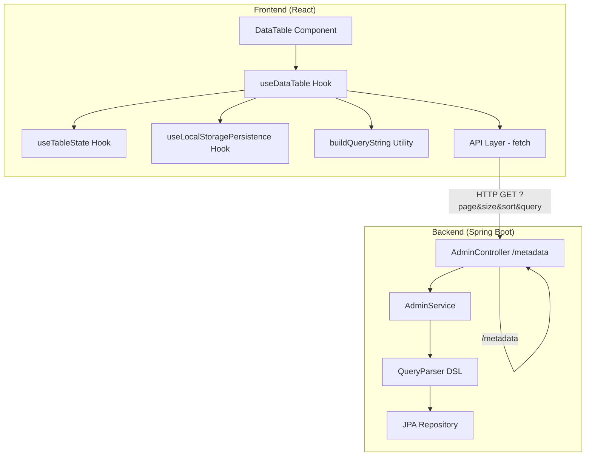
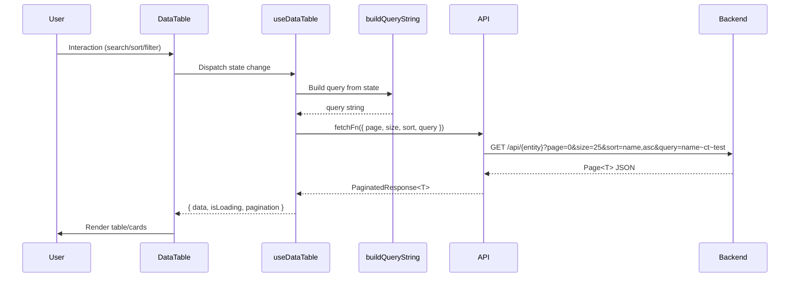
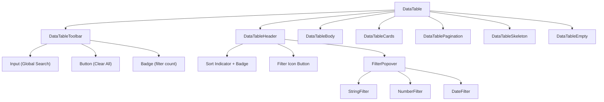

# Design Document — FOR-02-06t Table Template Enhancements

## Overview

DataTable — a reusable table component for all Foremen admin panel pages. Provides: server-side pagination, global search, multi-sort with priority, contextual filters by data type (string/number/date), state persistence in localStorage, responsive layout (card-based on mobile).

The backend is extended with a `/metadata` endpoint on `AdminController`, which uses reflection to return entity field metadata (types, i18n, nesting).

### Key Decisions

| Decision | Rationale |
|----------|-----------|
| DataTable in `src/components/data-table/` (shared) | Used by all admin pages — not feature-specific |
| Table state in custom hook `useDataTable` | Encapsulates logic, testability, composition |
| Query DSL built in `buildQueryString` utility | Pure function — easy to test property-based |
| Metadata endpoint via reflection on AdminController | Does not require implementation in specific controllers |
| localStorage persistence via debounced hook | Avoids excessive writes during rapid interaction |
| Mobile card layout via `useBreakpoint` | Already exists in the project, consistent pattern |

---

## Architecture

### High-Level Diagram



### Data Flow



---

## Components and Interfaces

### File Structure

```
src/components/data-table/
├── index.ts                       # Public exports
├── DataTable.tsx                   # Main orchestrator component
├── DataTableToolbar.tsx            # Search + active filter count + clear all
├── DataTableHeader.tsx             # Column headers with sort/filter controls
├── DataTableBody.tsx               # Table body rows (desktop)
├── DataTableCards.tsx              # Card layout (mobile)
├── DataTablePagination.tsx         # Pagination controls
├── DataTableSkeleton.tsx           # Loading skeleton
├── DataTableEmpty.tsx              # Empty/error states
├── filters/
│   ├── FilterPopover.tsx           # Generic popover wrapper
│   ├── StringFilter.tsx            # Text contains filter
│   ├── NumberFilter.tsx            # Range filter (from/to)
│   └── DateFilter.tsx              # Date range filter
├── hooks/
│   ├── useDataTable.ts            # Main orchestrator hook
│   ├── useTableState.ts           # State reducer (sort, filter, search, page)
│   └── useLocalStoragePersistence.ts  # Debounced localStorage sync
├── utils/
│   ├── buildQueryString.ts        # Pure: state → query DSL string
│   ├── buildSortParams.ts         # Pure: sort state → URLSearchParams entries
│   └── resolveFieldValue.ts       # Pure: dot-notation field accessor
└── types.ts                       # All TypeScript interfaces
```

### Component Hierarchy



---

## Data Models

### Frontend TypeScript Interfaces

```typescript
// === src/components/data-table/types.ts ===

/** Column data type — determines filter type */
export type ColumnDataType = 'string' | 'number' | 'date'

/** Sort direction */
export type SortDirection = 'asc' | 'desc'

/** Single column configuration */
export interface ColumnConfig<T = unknown> {
  /** Field identifier (dot-notation for nested, e.g. "role.name") */
  field: string
  /** i18n key for column header */
  headerKey: string
  /** Data type for filter */
  dataType: ColumnDataType
  /** Column is sortable (default: true) */
  sortable?: boolean
  /** Column is filterable (default: true for string/number/date) */
  filterable?: boolean
  /** Column participates in global search (default: true for string) */
  searchable?: boolean
  /** Custom render function */
  render?: (value: unknown, row: T) => React.ReactNode
  /** Minimum column width (CSS) */
  minWidth?: string
}

/** Active sort state */
export interface SortState {
  field: string
  direction: SortDirection
  priority: number
}

/** Active filter (string) */
export interface StringFilterState {
  type: 'string'
  field: string
  value: string
}

/** Active filter (number) */
export interface NumberFilterState {
  type: 'number'
  field: string
  from?: number
  to?: number
}

/** Active filter (date) */
export interface DateFilterState {
  type: 'date'
  field: string
  from?: string  // ISO date string
  to?: string    // ISO date string
}

/** Union type for all filters */
export type ColumnFilterState = StringFilterState | NumberFilterState | DateFilterState

/** Full table state */
export interface TableState {
  page: number
  size: number
  sorts: SortState[]
  filters: ColumnFilterState[]
  search: string
}

/** Props for DataTable */
export interface DataTableProps<T> {
  /** Unique entity key (for localStorage and metadata) */
  entityKey: string
  /** Column configuration */
  columns: ColumnConfig<T>[]
  /** Data fetch function */
  fetchFn: (params: FetchParams) => Promise<PaginatedResponse<T>>
  /** Default page size (default: 25) */
  defaultPageSize?: number
  /** Configurable page size options (default: [10, 25, 50]) */
  pageSizeOptions?: number[]
  /** Callback on row click */
  onRowClick?: (row: T) => void
  /** Additional action buttons per row */
  rowActions?: (row: T) => React.ReactNode
}

/** API request parameters */
export interface FetchParams {
  page: number
  size: number
  sort: string[]      // ["field,direction", ...]
  query?: string      // Query DSL string
}

/** Backend response (Spring Data Page<T>) */
export interface PaginatedResponse<T> {
  content: T[]
  totalElements: number
  totalPages: number
  number: number     // current page (0-based)
  size: number
  first: boolean
  last: boolean
}

/** Metadata endpoint response */
export interface EntityMetadata {
  fields: FieldMetadata[]
}

export interface FieldMetadata {
  name: string
  dataType: 'STRING' | 'NUMBER' | 'DATE' | 'BOOLEAN' | 'ENUM'
  i18n: boolean
  nested?: FieldMetadata[]
}
```

### Backend — Metadata DTO

```java
// === MetadataResponse.java ===
public record MetadataResponse(List<FieldInfo> fields) {
    public record FieldInfo(
        String name,
        DataType dataType,
        boolean i18n,
        List<FieldInfo> nested
    ) {}

    public enum DataType {
        STRING, NUMBER, DATE, BOOLEAN, ENUM
    }
}
```

### Table State → Query DSL Mapping

| State | Query DSL Output |
|-------|-----------------|
| search = "admin" (string fields: name, code) | `name~ct~admin OR code~ct~admin` |
| filter: name contains "test" | `name~ct~test` |
| filter: id >= 5 AND id <= 10 | `id=gte=5 AND id=lte=10` |
| filter: createdDate >= 2024-01-01 | `createdDate=gte=2024-01-01` |
| combined: search + 2 filters | `(name~ct~admin OR code~ct~admin) AND name~ct~test AND (id=gte=5 AND id=lte=10)` |

### Sort State → URL Params Mapping

| Sorts | URL Params |
|-------|-----------|
| [{field:"name", direction:"asc", priority:1}] | `sort=name,asc` |
| [{field:"name", direction:"asc", priority:1}, {field:"id", direction:"desc", priority:2}] | `sort=name,asc&sort=id,desc` |

---

## Correctness Properties

*A property is a characteristic or behavior that should hold true across all valid executions of a system — essentially, a formal statement about what the system should do. Properties serve as the bridge between human-readable specifications and machine-verifiable correctness guarantees.*

### Property 1: Query string round-trip consistency

*For any* valid TableState (with arbitrary sorts, filters, and search text), building a query string via `buildQueryString` and then parsing it back into structured conditions SHALL produce an equivalent set of filter conditions and search terms.

**Validates: Requirements 2.3, 4.3, 5.3–5.5, 6.3–6.5, 7.1–7.2**

### Property 2: Filter combination produces AND-joined conditions

*For any* set of active column filters (1 to N columns, each with a valid filter state), the query string produced by `buildQueryString` SHALL contain exactly one condition group per active filter, all joined by AND.

**Validates: Requirements 7.1, 7.2, 7.3**

### Property 3: Global search produces OR-joined conditions over searchable fields

*For any* non-empty search string and any set of searchable string columns (≥1), the query string produced by `buildQueryString` SHALL contain one `field~ct~value` condition per searchable field, all joined by OR and wrapped in parentheses.

**Validates: Requirements 2.3, 2.4**

### Property 4: Sort priority is a valid permutation

*For any* sequence of column sort interactions (clicks on sortable columns), the resulting sort state SHALL be a valid permutation where: priorities are contiguous (1..N), no duplicates exist, and each field appears at most once.

**Validates: Requirements 3.4, 3.5, 3.7**

### Property 5: Sort cycle is idempotent after three clicks

*For any* sortable column, clicking it three times in sequence (unsorted → asc → desc → unsorted) SHALL return the sort state for that column to its initial state (removed from sort list).

**Validates: Requirements 3.2, 3.7**

### Property 6: Number filter range validation

*For any* number filter where both `from` and `to` are provided, IF `to` > `from` THEN the filter SHALL produce a valid query string with `gte` and `lte` operators; IF `to` ≤ `from` THEN the filter SHALL be rejected (validation error).

**Validates: Requirements 5.5, 5.6**

### Property 7: Date filter range validation

*For any* date filter where both `from` and `to` are provided, IF `to` is after `from` THEN the filter SHALL produce a valid query string with `gte` and `lte` operators on ISO dates; IF `to` is before or equal to `from` THEN the filter SHALL be rejected (validation error).

**Validates: Requirements 6.5, 6.6**

### Property 8: Dot-notation field resolution

*For any* nested object and any valid dot-notation path, `resolveFieldValue` SHALL return the value at the terminal key, or `undefined` if any intermediate key is missing.

**Validates: Requirements 1.3**

### Property 9: Clear all resets to default state

*For any* TableState with active filters, sorts, and search, applying the "clear all" action SHALL produce a state equivalent to the default state (page 1, default size, empty sorts, empty filters, empty search).

**Validates: Requirements 8.4, 9.6**

### Property 10: localStorage persistence round-trip

*For any* valid TableState, serializing it to JSON (for localStorage) and deserializing it back SHALL produce an equivalent TableState.

**Validates: Requirements 9.1, 9.2, 9.3**

### Property 11: Pagination reset on state change

*For any* TableState with page > 0, applying a search change, filter change, or sort change SHALL reset the page to 0 (first page).

**Validates: Requirements 2.7, 3.8, 7.4, 11.4**

---

## Error Handling

### Frontend Error Handling

| Scenario | Behavior |
|----------|----------|
| API fetch fails (network error) | TanStack Query retry (2 attempts), then inline error + Retry button |
| API returns 4xx/5xx | Display error message from response body, Retry button |
| localStorage unavailable | Graceful degradation — state not persisted, no error shown |
| Invalid filter values (range validation) | Inline validation message in Filter_Popup, prevent submission |
| Metadata endpoint fails | DataTable works without auto-config — relies on explicit `columns` prop |

### Backend Error Handling

| Scenario | Behavior |
|----------|----------|
| Invalid `query` param (parse error) | 400 Bad Request with message key `error.invalid.query.syntax` |
| Reflection failure on metadata | 500 Internal Server Error (should not happen — entity classes are stable) |
| Invalid sort field name | Spring Data ignores unknown sort properties (no error) |

### Error State UI

```
┌─────────────────────────────────────────────┐
│  ⚠ Failed to load data.          [Retry]    │
└─────────────────────────────────────────────┘
```

---

## Testing Strategy

### Approach

Dual testing: property-based tests for pure utilities (query building, state transitions, field resolution) + unit tests for components (React Testing Library) + integration tests for hook/API interaction.

### Property-Based Tests (Vitest + fast-check)

Library: **fast-check** — standard PBT library for TypeScript/JavaScript.

Configuration: minimum 100 iterations per property test.

Target: pure functions in `utils/` and state transitions in `useTableState`.

| Property | Target Function | Description |
|----------|----------------|-------------|
| 1. Query round-trip | `buildQueryString` | Parse/rebuild consistency |
| 2. AND combination | `buildQueryString` | Filters joined by AND |
| 3. OR search | `buildQueryString` | Search fields joined by OR |
| 4. Sort priority invariant | `useTableState` reducer | Priorities 1..N contiguous |
| 5. Sort cycle idempotence | `useTableState` reducer | 3 clicks = identity |
| 6. Number range validation | `NumberFilter` validation | to > from = valid |
| 7. Date range validation | `DateFilter` validation | to after from = valid |
| 8. Dot-notation resolution | `resolveFieldValue` | Correct nested access |
| 9. Clear all = default | `useTableState` reducer | Reset action |
| 10. localStorage round-trip | serialize/deserialize | JSON identity |
| 11. Page reset | `useTableState` reducer | Any change resets page |

Tag format: `// Feature: table-template, Property {N}: {description}`

### Unit Tests (Vitest + React Testing Library)

- DataTable renders correct number of columns from config
- Filter popover opens/closes on icon click
- Sort indicator changes on header click
- Skeleton renders during loading
- Empty state shown when content is empty
- Pagination buttons disabled at boundaries
- Mobile card layout renders when breakpoint = 'mobile'
- Clear all button hidden when no filters active

### Backend Tests (JUnit + jqwik)

- Metadata endpoint returns correct field types for RoleEntity
- i18n fields correctly identified (nameRU/namePL → name as i18n)
- Nested fields traversed for @ManyToOne relationships
- Cache headers present in metadata response
- Metadata result cached on second call (no re-reflection)

---

## Backend: Metadata Endpoint Implementation

### Adding default method to AdminController

```java
// In AdminController.java — new default method

@GetMapping("/metadata")
default ResponseEntity<MetadataResponse> getMetadata() {
    Class<?> daoClass = getService().getDaoModelClass();
    MetadataResponse metadata = EntityMetadataResolver.resolve(daoClass);
    return ResponseEntity.ok()
            .cacheControl(CacheControl.maxAge(Duration.ofDays(1)))
            .body(metadata);
}
```

### EntityMetadataResolver — utility class

```java
@Component
public class EntityMetadataResolver {

    private static final Map<Class<?>, MetadataResponse> CACHE = new ConcurrentHashMap<>();
    
    private static final Set<String> LOCALE_SUFFIXES = Set.of("RU", "PL");

    public static MetadataResponse resolve(Class<?> entityClass) {
        return CACHE.computeIfAbsent(entityClass, EntityMetadataResolver::buildMetadata);
    }

    private static MetadataResponse buildMetadata(Class<?> clazz) {
        List<MetadataResponse.FieldInfo> fields = new ArrayList<>();
        Set<String> i18nBaseFields = new HashSet<>();
        
        // First pass: identify i18n base fields
        for (Field field : getAllFields(clazz)) {
            String name = field.getName();
            for (String suffix : LOCALE_SUFFIXES) {
                if (name.endsWith(suffix)) {
                    String baseName = name.substring(0, name.length() - suffix.length());
                    i18nBaseFields.add(baseName);
                }
            }
        }
        
        // Second pass: build metadata (skip suffixed i18n fields)
        for (Field field : getAllFields(clazz)) {
            String name = field.getName();
            // Skip locale-suffixed fields
            boolean isSuffixed = LOCALE_SUFFIXES.stream()
                    .anyMatch(s -> name.endsWith(s) && i18nBaseFields.contains(
                            name.substring(0, name.length() - s.length())));
            if (isSuffixed) continue;
            
            // Skip JPA internal fields
            if (name.startsWith("$$") || name.equals("serialVersionUID")) continue;
            
            MetadataResponse.DataType dataType = mapJavaType(field.getType());
            boolean isI18n = i18nBaseFields.contains(name);
            List<MetadataResponse.FieldInfo> nested = null;
            
            if (isNestedEntity(field)) {
                MetadataResponse nestedMeta = resolve(field.getType());
                nested = nestedMeta.fields();
            }
            
            fields.add(new MetadataResponse.FieldInfo(name, dataType, isI18n, nested));
        }
        
        return new MetadataResponse(fields);
    }

    private static MetadataResponse.DataType mapJavaType(Class<?> type) {
        if (type == String.class) return MetadataResponse.DataType.STRING;
        if (type == Integer.class || type == int.class ||
            type == Long.class || type == long.class ||
            type == Double.class || type == double.class ||
            type == java.math.BigDecimal.class) return MetadataResponse.DataType.NUMBER;
        if (type == java.time.LocalDate.class || 
            type == java.time.LocalDateTime.class) return MetadataResponse.DataType.DATE;
        if (type == Boolean.class || type == boolean.class) return MetadataResponse.DataType.BOOLEAN;
        if (type.isEnum()) return MetadataResponse.DataType.ENUM;
        return MetadataResponse.DataType.STRING; // fallback
    }

    private static boolean isNestedEntity(Field field) {
        return field.isAnnotationPresent(jakarta.persistence.Embedded.class) ||
               field.isAnnotationPresent(jakarta.persistence.ManyToOne.class) ||
               field.isAnnotationPresent(jakarta.persistence.OneToOne.class);
    }

    private static List<Field> getAllFields(Class<?> clazz) {
        List<Field> fields = new ArrayList<>();
        Class<?> current = clazz;
        while (current != null && current != Object.class) {
            fields.addAll(Arrays.asList(current.getDeclaredFields()));
            current = current.getSuperclass();
        }
        return fields;
    }
}
```

### Caching

- **In-memory**: `ConcurrentHashMap` in `EntityMetadataResolver` — reflection is performed once per entity class
- **HTTP Cache**: `Cache-Control: max-age=86400` — client caches the response for 24h
- Invalidation is not needed — metadata does not change without application restart

---

## Frontend: Hook Architecture

### useDataTable (orchestrator)

```typescript
export function useDataTable<T>(props: DataTableProps<T>) {
  const { entityKey, columns, fetchFn, defaultPageSize = 25 } = props

  // State management
  const { state, dispatch } = useTableState({ defaultPageSize })
  
  // localStorage persistence (debounced 500ms)
  useLocalStoragePersistence(entityKey, state, dispatch)
  
  // Build query string from state
  const queryString = useMemo(
    () => buildQueryString(state, columns),
    [state.search, state.filters, columns]
  )
  
  // Build sort params
  const sortParams = useMemo(
    () => buildSortParams(state.sorts),
    [state.sorts]
  )
  
  // TanStack Query for data fetching
  const query = useQuery({
    queryKey: [entityKey, 'list', state.page, state.size, sortParams, queryString],
    queryFn: () => fetchFn({
      page: state.page,
      size: state.size,
      sort: sortParams,
      query: queryString || undefined,
    }),
    staleTime: 30_000,
  })

  return { state, dispatch, query, queryString }
}
```

### useTableState (reducer)

Actions:
- `SET_SEARCH` — update search text, reset page
- `TOGGLE_SORT` — cycle sort for field, recalculate priorities
- `SET_FILTER` — add/update filter for field, reset page
- `CLEAR_FILTER` — remove filter for field, reset page
- `CLEAR_ALL` — reset to defaults
- `SET_PAGE` — change page
- `SET_PAGE_SIZE` — change page size, reset page
- `RESTORE_STATE` — restore from localStorage

### useLocalStoragePersistence

- On mount: reads `foremen:table:{entityKey}` from localStorage, dispatches `RESTORE_STATE`
- On state change: debounced (500ms) write to localStorage
- On clear all: removes localStorage key

---

## Frontend: Query String Builder

### buildQueryString (pure function)

```typescript
export function buildQueryString(
  state: TableState,
  columns: ColumnConfig[]
): string {
  const parts: string[] = []

  // 1. Global search → OR group
  if (state.search.trim()) {
    const searchableFields = columns
      .filter(c => c.dataType === 'string' && (c.searchable !== false))
      .map(c => c.field)
    
    if (searchableFields.length > 0) {
      const searchConditions = searchableFields
        .map(f => `${f}~ct~${state.search.trim()}`)
        .join(' OR ')
      parts.push(`(${searchConditions})`)
    }
  }

  // 2. Column filters → AND joined
  for (const filter of state.filters) {
    const condition = buildFilterCondition(filter)
    if (condition) parts.push(condition)
  }

  return parts.join(' AND ')
}

function buildFilterCondition(filter: ColumnFilterState): string | null {
  switch (filter.type) {
    case 'string':
      return filter.value ? `${filter.field}~ct~${filter.value}` : null
    case 'number': {
      const conditions: string[] = []
      if (filter.from != null) conditions.push(`${filter.field}=gte=${filter.from}`)
      if (filter.to != null) conditions.push(`${filter.field}=lte=${filter.to}`)
      return conditions.length > 0 ? conditions.join(' AND ') : null
    }
    case 'date': {
      const conditions: string[] = []
      if (filter.from) conditions.push(`${filter.field}=gte=${filter.from}`)
      if (filter.to) conditions.push(`${filter.field}=lte=${filter.to}`)
      return conditions.length > 0 ? conditions.join(' AND ') : null
    }
  }
}
```

### buildSortParams (pure function)

```typescript
export function buildSortParams(sorts: SortState[]): string[] {
  return sorts
    .sort((a, b) => a.priority - b.priority)
    .map(s => `${s.field},${s.direction}`)
}
```

### resolveFieldValue (pure function)

```typescript
export function resolveFieldValue(obj: unknown, path: string): unknown {
  const keys = path.split('.')
  let current: unknown = obj
  for (const key of keys) {
    if (current == null || typeof current !== 'object') return undefined
    current = (current as Record<string, unknown>)[key]
  }
  return current
}
```

---

## Responsive Design Strategy

| Breakpoint | Layout | Controls |
|-----------|--------|----------|
| mobile (<768px) | Card-based (stacked) | Collapsible toolbar with "Filters" button → bottom sheet |
| tablet (768–1024px) | Table with horizontal scroll, sticky first column | Inline headers + filters |
| desktop (>1024px) | Full table, all controls inline | Sort indicators, filter icons in headers |

### Mobile Card Layout

Each record is displayed as a card with key fields. Fields are taken from the `columns` config.

```
┌─────────────────────┐
│ Name: Administrator  │
│ Code: ADMIN          │
│ Created: 2024-01-15  │
│ System: ✓            │
└─────────────────────┘
```

### Pagination Adaptation

- Mobile: `< Prev | Page 1 of 5 | Next >`
- Desktop: `< 1 2 3 ... 5 > | Showing 1-25 of 120 | [25 ▼]`

---

## shadcn/ui Components to Install

Components not yet in the project that need to be added:

| Component | Usage |
|-----------|-------|
| Button | Pagination, Clear All, Apply filter |
| Input | Global Search, String filter, Number filter inputs |
| Popover | Filter_Popup positioning |
| Calendar | Date filter picker |
| Select | Page size selector |
| Tooltip | Icon-only button tooltips |
| Skeleton | Loading state rows |

All installed via shadcn CLI: `npx shadcn@latest add button input popover calendar select tooltip skeleton`
