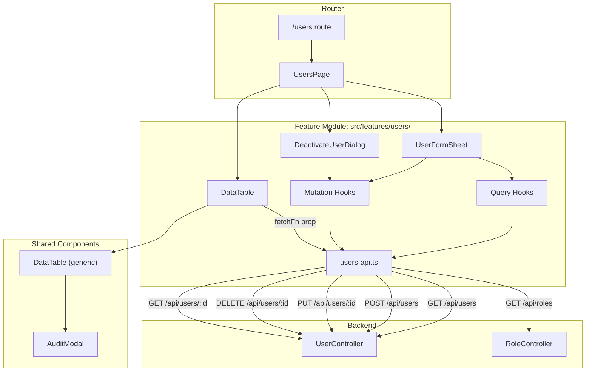
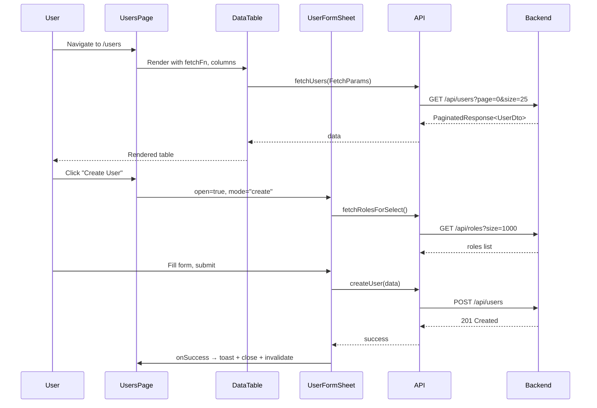
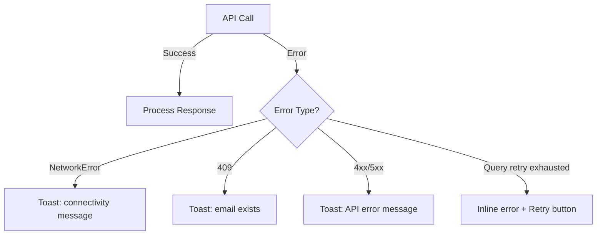

# Design Document: FOR-02-07 Users UI

## Overview

The Users UI feature provides a complete CRUD interface for managing users in the Foremen admin panel. It lives at route `/users` and follows the same architectural patterns established by the Roles UI (FOR-02-06): a reusable `DataTable` for listing, a sheet-based form overlay for create/edit, and an `AlertDialog` for deactivation confirmation.

The feature module resides at `src/features/users/` and integrates with the existing backend `UserController` REST API. Unlike the Roles page, the Users page has no tabs — it's a single list view with form overlays.

**Key design decisions:**
- Reuse `DataTable` component with `entityKey="users"` — no custom table implementation
- `fetchFn` adapter bridges DataTable's `FetchParams` to the Users API directly (no separate `useUsers` hook)
- Phone input uses `react-phone-number-input` + `libphonenumber-js` for international E.164 validation
- Role select fetches from `/api/roles` with searchable dropdown (Combobox pattern)
- Soft-delete only — the "Deactivate" action sets `active=false`, no hard delete

---

## Architecture



### Data Flow



---

## Components and Interfaces

### File Structure

```
src/features/users/
├── UsersPage.tsx              # Main page component (default export)
├── api/
│   ├── users-api.ts           # Raw fetch functions
│   ├── query-hooks.ts         # TanStack Query hooks (useUser, useRolesForSelect)
│   └── mutation-hooks.ts      # TanStack Mutation hooks (create, update, deactivate)
├── components/
│   ├── UserFormSheet.tsx       # Sheet overlay for create/edit
│   ├── UserFormSkeleton.tsx    # Skeleton placeholder for form loading state
│   ├── DeactivateUserDialog.tsx # AlertDialog for deactivation confirmation
│   └── PhoneInput.tsx          # Styled react-phone-number-input wrapper
├── schemas/
│   └── user-schema.ts         # Zod validation schemas
├── types/
│   └── index.ts               # TypeScript interfaces
└── i18n/
    ├── pl.json                # Polish translations
    └── ru.json                # Russian translations
```

### Component Hierarchy

```
UsersPage (state: formSheet, deleteDialog)
├── <h1> Page title (i18n)
├── <Button> "Create User" → opens form sheet
├── <DataTable entityKey="users" ...>
│   ├── DataTableToolbar (search)
│   ├── DataTableHeader (sort + filter controls)
│   ├── DataTableBody / DataTableCards
│   │   └── Row actions: [Edit] [Deactivate] [Audit]
│   └── DataTablePagination
├── <UserFormSheet open mode roleId onClose onSuccess>
│   ├── Form fields: name, email, phone, roleId, locale, active
│   └── PhoneInput (react-phone-number-input)
└── <DeactivateUserDialog open user onClose onSuccess>
```

### Key Component Props

```typescript
// UsersPage internal state
interface FormSheetState {
  open: boolean
  mode: 'create' | 'edit'
  userId: number | null
}

interface DeactivateDialogState {
  open: boolean
  user: UserDto | null
}

// UserFormSheet
interface UserFormSheetProps {
  open: boolean
  mode: 'create' | 'edit'
  userId: number | null
  onClose: () => void
  onSuccess: () => void
}

// DeactivateUserDialog
interface DeactivateUserDialogProps {
  open: boolean
  user: UserDto | null
  onClose: () => void
  onSuccess: () => void
}

// PhoneInput (wrapper around react-phone-number-input)
interface PhoneInputProps {
  value: string | undefined
  onChange: (value: string | undefined) => void
  defaultCountry?: string // default: "PL"
  error?: string
  disabled?: boolean
}
```

---

## Data Models

### TypeScript Interfaces

```typescript
// src/features/users/types/index.ts

/** Returned by GET /api/users (paginated list view) */
export interface UserDto {
  id: number
  name: string
  email: string
  active: boolean
  roleName: string // locale-resolved by backend
}

/** Returned by GET /api/users/{id} and GET /api/users/extended */
export interface UserExtendedDto {
  id: number
  name: string
  email: string
  phone: string | null
  roleId: number
  roleName: string
  active: boolean
  locale: string
  displayPreferences: Record<string, unknown> | null
}

/** POST /api/users request body */
export interface UserCreateRequest {
  name: string
  email: string
  phone?: string | null
  roleId: number
  locale: string
  displayPreferences?: Record<string, unknown>
}

/** PUT /api/users/{id} request body */
export interface UserUpdateRequest {
  name: string
  email: string
  phone?: string | null
  roleId: number
  active: boolean
  locale: string
  displayPreferences?: Record<string, unknown>
}

/** Role item for the select dropdown (from GET /api/roles) */
export interface RoleSelectItem {
  id: number
  name: string // locale-resolved
}

/** Re-export PaginatedResponse from data-table types */
export type { PaginatedResponse, FetchParams } from '@/components/data-table'

/** Form mode type */
export type UserFormMode = 'create' | 'edit'
```

### Zod Validation Schema

```typescript
// src/features/users/schemas/user-schema.ts

import { z } from 'zod'
import { isValidPhoneNumber } from 'libphonenumber-js'

const phoneSchema = z
  .string()
  .optional()
  .or(z.literal(''))
  .refine(
    (val) => !val || val === '' || isValidPhoneNumber(val),
    'users.validation.phoneInvalid'
  )

export const userCreateSchema = z.object({
  name: z
    .string()
    .min(2, 'users.validation.nameMin')
    .max(100, 'users.validation.nameMax'),
  email: z
    .string()
    .min(1, 'users.validation.emailRequired')
    .email('users.validation.emailInvalid'),
  phone: phoneSchema,
  roleId: z
    .number({ required_error: 'users.validation.roleRequired' })
    .min(1, 'users.validation.roleRequired'),
  locale: z.enum(['ru', 'pl', 'en'], {
    required_error: 'users.validation.localeRequired',
  }),
  active: z.boolean().default(true),
})

export const userUpdateSchema = userCreateSchema

export type UserCreateFormValues = z.infer<typeof userCreateSchema>
export type UserUpdateFormValues = z.infer<typeof userUpdateSchema>
```

### API Layer

```typescript
// src/features/users/api/users-api.ts

import type {
  UserExtendedDto,
  UserCreateRequest,
  UserUpdateRequest,
  RoleSelectItem,
} from '../types'
import type { PaginatedResponse, FetchParams } from '@/components/data-table'
import type { UserDto } from '../types'

const BASE_URL = '/api'

function getAcceptLanguage(): string {
  try {
    const locale = localStorage.getItem('foremen-locale')
    if (locale === 'ru') return 'ru'
  } catch {}
  return 'pl'
}

function getHeaders(extra?: Record<string, string>): Record<string, string> {
  return {
    'Accept-Language': getAcceptLanguage(),
    ...extra,
  }
}

export class ApiError extends Error {
  constructor(public status: number, message: string) {
    super(message)
    this.name = 'ApiError'
  }
}

async function handleResponse<T>(response: Response): Promise<T> {
  if (!response.ok) {
    const body = await response.json().catch(() => ({}))
    const message = body.message || body.error || `HTTP ${response.status}`
    throw new ApiError(response.status, message)
  }
  return response.json()
}

/** DataTable fetchFn adapter — used as the fetchFn prop */
export async function fetchUsers(params: FetchParams): Promise<PaginatedResponse<UserDto>> {
  const searchParams = new URLSearchParams()
  searchParams.set('page', String(params.page))
  searchParams.set('size', String(params.size))
  if (params.query) searchParams.set('query', params.query)
  for (const sortEntry of params.sort) {
    searchParams.append('sort', sortEntry)
  }

  const response = await fetch(`${BASE_URL}/users?${searchParams}`, {
    headers: getHeaders(),
  })
  const data = await handleResponse<PaginatedResponse<UserDto>>(response)
  return {
    ...data,
    first: data.number === 0,
    last: data.number >= data.totalPages - 1,
  }
}

/** Fetch single user for edit form */
export function fetchUser(id: number): Promise<UserExtendedDto> {
  return fetch(`${BASE_URL}/users/${id}`, { headers: getHeaders() })
    .then((r) => handleResponse<UserExtendedDto>(r))
}

/** Fetch roles for dropdown */
export function fetchRolesForSelect(): Promise<PaginatedResponse<RoleSelectItem>> {
  const searchParams = new URLSearchParams()
  searchParams.set('page', '0')
  searchParams.set('size', '1000') // fetch all roles for dropdown
  return fetch(`${BASE_URL}/roles?${searchParams}`, { headers: getHeaders() })
    .then((r) => handleResponse<PaginatedResponse<RoleSelectItem>>(r))
}

/** Create user */
export function createUser(data: UserCreateRequest): Promise<UserExtendedDto> {
  return fetch(`${BASE_URL}/users`, {
    method: 'POST',
    headers: getHeaders({ 'Content-Type': 'application/json' }),
    body: JSON.stringify(data),
  }).then((r) => handleResponse<UserExtendedDto>(r))
}

/** Update user */
export function updateUser(id: number, data: UserUpdateRequest): Promise<UserExtendedDto> {
  return fetch(`${BASE_URL}/users/${id}`, {
    method: 'PUT',
    headers: getHeaders({ 'Content-Type': 'application/json' }),
    body: JSON.stringify(data),
  }).then((r) => handleResponse<UserExtendedDto>(r))
}

/** Deactivate user (soft-delete) */
export function deactivateUser(id: number): Promise<void> {
  return fetch(`${BASE_URL}/users/${id}`, {
    method: 'DELETE',
    headers: getHeaders(),
  }).then((r) => { if (!r.ok) return handleResponse<void>(r) })
}
```

### TanStack Query Hooks

```typescript
// src/features/users/api/query-hooks.ts

import { useQuery } from '@tanstack/react-query'
import { fetchUser, fetchRolesForSelect } from './users-api'

export const userKeys = {
  all: ['users'] as const,
  lists: () => [...userKeys.all, 'list'] as const,
  details: () => [...userKeys.all, 'detail'] as const,
  detail: (id: number) => [...userKeys.details(), id] as const,
  rolesForSelect: ['roles', 'select'] as const,
}

/** Fetch single user by ID (for edit form) */
export function useUser(id: number | null) {
  return useQuery({
    queryKey: userKeys.detail(id!),
    queryFn: () => fetchUser(id!),
    enabled: id != null,
    staleTime: 30_000,
    retry: 2,
  })
}

/** Fetch roles for the select dropdown */
export function useRolesForSelect() {
  return useQuery({
    queryKey: userKeys.rolesForSelect,
    queryFn: fetchRolesForSelect,
    staleTime: 60_000,
    retry: 2,
    select: (data) => data.content, // unwrap paginated response to flat array
  })
}
```

### TanStack Mutation Hooks

```typescript
// src/features/users/api/mutation-hooks.ts

import { useMutation, useQueryClient } from '@tanstack/react-query'
import { createUser, updateUser, deactivateUser } from './users-api'
import { userKeys } from './query-hooks'
import type { UserCreateRequest, UserUpdateRequest } from '../types'

export function useCreateUser() {
  const queryClient = useQueryClient()
  return useMutation({
    mutationFn: (data: UserCreateRequest) => createUser(data),
    onSuccess: () => {
      queryClient.invalidateQueries({ queryKey: userKeys.lists() })
    },
  })
}

export function useUpdateUser() {
  const queryClient = useQueryClient()
  return useMutation({
    mutationFn: ({ id, data }: { id: number; data: UserUpdateRequest }) => updateUser(id, data),
    onSuccess: (_data, variables) => {
      queryClient.invalidateQueries({ queryKey: userKeys.lists() })
      queryClient.invalidateQueries({ queryKey: userKeys.detail(variables.id) })
    },
  })
}

export function useDeactivateUser() {
  const queryClient = useQueryClient()
  return useMutation({
    mutationFn: (id: number) => deactivateUser(id),
    onSuccess: () => {
      queryClient.invalidateQueries({ queryKey: userKeys.lists() })
    },
  })
}
```

### Phone Input Integration

The `PhoneInput` component wraps `react-phone-number-input` with dark-theme styling consistent with the design system:

```typescript
// src/features/users/components/PhoneInput.tsx

import PhoneInputBase from 'react-phone-number-input'
import 'react-phone-number-input/style.css'
import { forwardRef } from 'react'
import { cn } from '@/lib/utils'

interface PhoneInputProps {
  value: string | undefined
  onChange: (value: string | undefined) => void
  defaultCountry?: string
  error?: string
  disabled?: boolean
}

export const PhoneInput = forwardRef<HTMLInputElement, PhoneInputProps>(
  ({ value, onChange, defaultCountry = 'PL', error, disabled }, ref) => {
    return (
      <div className="space-y-1">
        <PhoneInputBase
          ref={ref}
          international
          defaultCountry={defaultCountry}
          value={value ?? ''}
          onChange={onChange}
          disabled={disabled}
          className={cn(
            'flex h-10 w-full rounded-md border bg-background px-3 py-2 text-sm',
            'text-foreground placeholder:text-muted-foreground',
            'focus-within:ring-2 focus-within:ring-ring',
            error ? 'border-destructive' : 'border-border',
            disabled && 'cursor-not-allowed opacity-50'
          )}
        />
      </div>
    )
  }
)
PhoneInput.displayName = 'PhoneInput'
```

### Role Select with Search

The Role select uses shadcn/ui Combobox pattern (Popover + Command) for searchable selection:

```typescript
// Inside UserFormSheet — Role select field uses Combobox pattern:
// - Popover wraps a Command component
// - Command includes CommandInput for search filtering
// - CommandList renders matching roles
// - Selected role shown in trigger button
// - Loading state shows spinner
// - Error state shows retry button
```

### DataTable Column Configuration

```typescript
const columns: ColumnConfig<UserDto>[] = [
  {
    field: 'name',
    headerKey: 'users.table.name',
    dataType: 'string',
    sortable: true,
    filterable: true,
    searchable: true,
    minWidth: '150px',
  },
  {
    field: 'email',
    headerKey: 'users.table.email',
    dataType: 'string',
    sortable: true,
    filterable: true,
    searchable: true,
    minWidth: '200px',
  },
  {
    field: 'roleName',
    headerKey: 'users.table.role',
    dataType: 'string',
    sortable: true,
    filterable: true,
    searchable: true,
    minWidth: '120px',
  },
  {
    field: 'active',
    headerKey: 'users.table.active',
    dataType: 'boolean',
    sortable: true,
    filterable: true,
    searchable: false,
    minWidth: '100px',
    render: (value) => (
      <Badge variant={value ? 'success' : 'muted'}>
        {value ? t('users.badge.active') : t('users.badge.inactive')}
      </Badge>
    ),
  },
]
```

---

## Error Handling

### Strategy

| Error Type | Source | UI Response |
|---|---|---|
| Network error | Any API call | Error toast with generic connectivity message |
| HTTP 409 | POST/PUT (email duplicate) | Error toast: "Email already exists" |
| HTTP 4xx/5xx | Any API call | Error toast with API error message |
| Query load failure (after retries) | DataTable fetchFn | Inline error state with "Retry" button |
| Roles load failure | useRolesForSelect | Error state in select with retry button |
| Validation error | Form submit | Inline field-level error messages |

### Error Handling Flow



### Toast Configuration

- Success toasts: auto-dismiss after 3 seconds
- Error toasts: persist until dismissed (user needs to read the message)
- All toast messages use i18n keys from the "users" namespace

### Mutation Error Handling Pattern

```typescript
// In UserFormSheet onSubmit:
createMutation.mutate(data, {
  onSuccess: () => {
    onSuccess() // toast + close + invalidate
  },
  onError: (error) => {
    if (error instanceof ApiError && error.status === 409) {
      toast.error(t('users.toast.emailExists'))
    } else {
      toast.error(error.message || t('users.toast.genericError'))
    }
  },
})
```

---

## Testing Strategy

### Why Property-Based Testing Does NOT Apply

This feature is a UI module consisting of React components, form interactions, API integration, and visual rendering. There is no complex algorithmic logic, no parsers, no serializers, and no data transformations with universal properties. The behavior is tied to specific user interactions and concrete API responses, making example-based testing the appropriate strategy.

### Testing Approach

**Framework:** Vitest + React Testing Library + MSW (Mock Service Worker)

#### Unit Tests (Vitest + Testing Library)

| Test Area | What to Test | Examples |
|---|---|---|
| `user-schema.ts` | Zod validation rules | Valid/invalid emails, phone numbers, name length boundaries |
| `PhoneInput` | Rendering, country selector, value formatting | Default country PL, E.164 output, invalid number feedback |
| `UserFormSheet` | Form rendering, field population, submit behavior | Create mode empty fields, edit mode pre-populated, validation errors shown |
| `DeactivateUserDialog` | Confirmation flow | Dialog text includes user name, confirm triggers mutation |
| `UsersPage` | Integration of all components | Table renders, create button opens sheet, row actions work |

#### Integration Tests (MSW mocked API)

| Test Area | What to Test |
|---|---|
| Create user flow | Fill form → submit → API called with correct payload → toast shown → table refreshed |
| Edit user flow | Click edit → form pre-populated → modify → submit → API called with PUT |
| Deactivate user flow | Click deactivate → dialog shown → confirm → DELETE called → toast shown |
| Error handling | API returns 409 → specific error toast; API returns 500 → generic error toast |
| Loading states | Skeleton shown while data loading; form skeleton shown while user data loading |

#### Validation Schema Tests

```typescript
// Example test structure for user-schema.ts
describe('userCreateSchema', () => {
  it('accepts valid data', () => { /* ... */ })
  it('rejects name shorter than 2 characters', () => { /* ... */ })
  it('rejects name longer than 100 characters', () => { /* ... */ })
  it('rejects invalid email format', () => { /* ... */ })
  it('accepts empty phone (optional)', () => { /* ... */ })
  it('rejects invalid phone number', () => { /* ... */ })
  it('accepts valid E.164 phone number', () => { /* ... */ })
  it('requires roleId', () => { /* ... */ })
  it('requires locale from allowed values', () => { /* ... */ })
  it('rejects locale not in [ru, pl, en]', () => { /* ... */ })
})
```

#### Component Tests

```typescript
// Example test structure for UserFormSheet
describe('UserFormSheet', () => {
  it('renders empty fields in create mode', () => { /* ... */ })
  it('pre-populates fields in edit mode', () => { /* ... */ })
  it('shows skeleton while loading user data', () => { /* ... */ })
  it('displays validation errors on submit with invalid data', () => { /* ... */ })
  it('disables submit button while mutation is pending', () => { /* ... */ })
  it('calls onSuccess after successful creation', () => { /* ... */ })
  it('shows error toast on 409 response', () => { /* ... */ })
  it('renders phone input with PL default country', () => { /* ... */ })
  it('renders role select with fetched roles', () => { /* ... */ })
})
```

### Test File Location

```
src/features/users/
├── __tests__/
│   ├── user-schema.test.ts
│   ├── UserFormSheet.test.tsx
│   ├── DeactivateUserDialog.test.tsx
│   ├── PhoneInput.test.tsx
│   └── UsersPage.test.tsx
```
