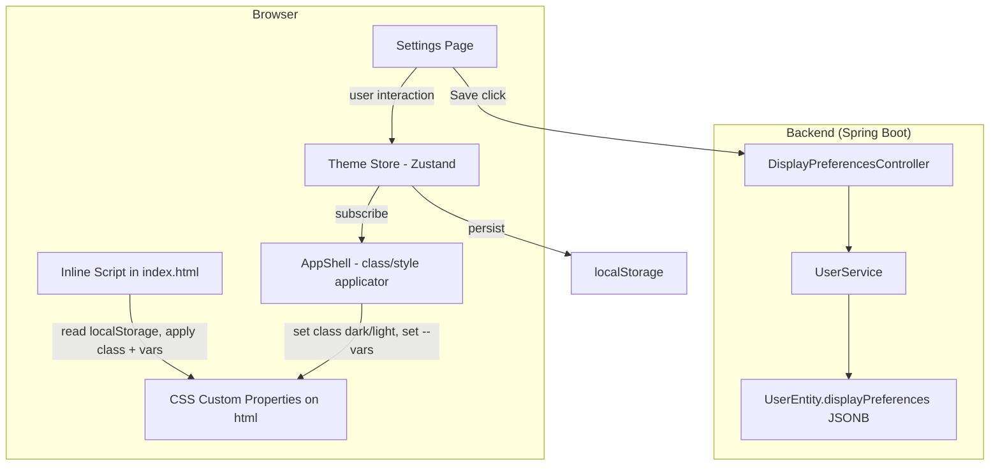
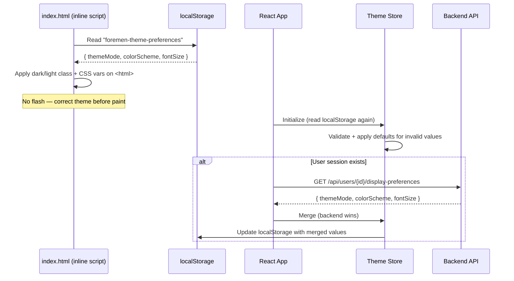
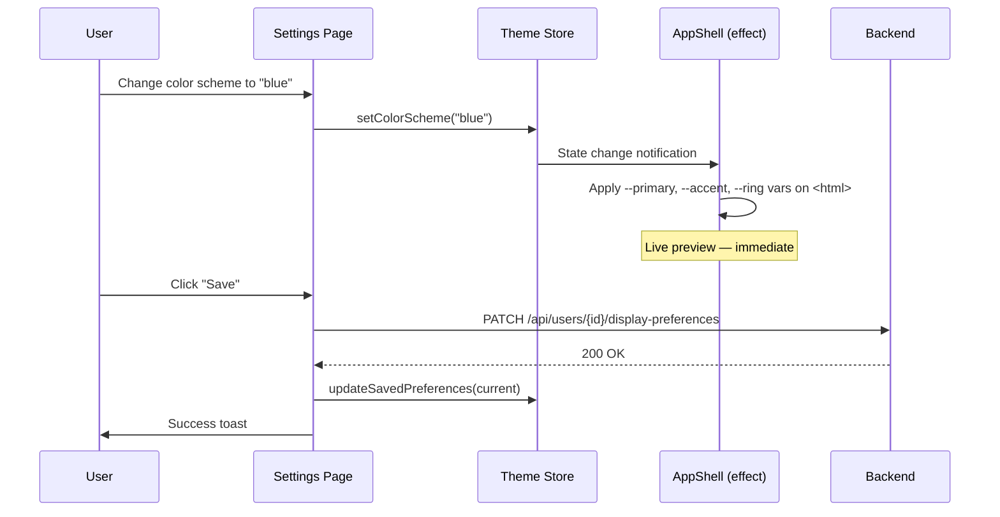
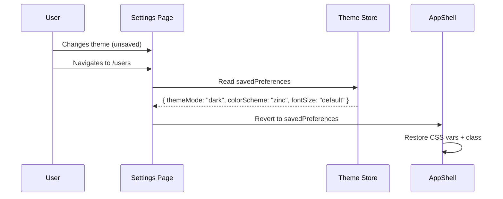
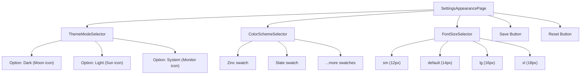
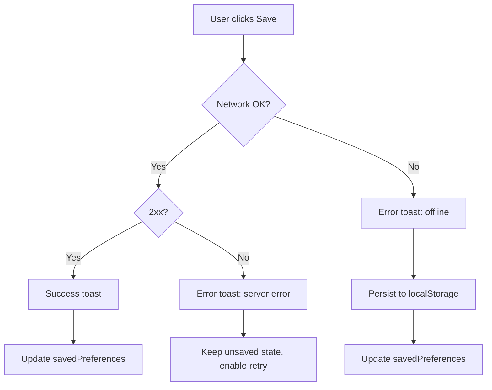

# Design Document — FOR-02-08 Theme Settings

## Overview

Theme Settings provides a settings page and supporting infrastructure for user-customizable appearance in the Foremen admin panel. The feature introduces:

1. **Theme mode switching** (dark/light/system) using Tailwind v4 `@custom-variant dark` class strategy
2. **Color scheme presets** — named palettes that override accent/primary CSS custom properties
3. **Font size selection** — global base font-size adjustment (12–18px)
4. **Backend persistence** via the existing `displayPreferences` JSONB field on `UserEntity`
5. **Flash-free startup** via an inline blocking script in `index.html` that reads localStorage before React hydration

### Key Design Decisions

| Decision | Rationale |
|----------|-----------|
| Tailwind v4 `@custom-variant dark (&:where(.dark,.dark *))` | Enables class-based toggling while keeping full Tailwind `dark:` variant support |
| CSS custom properties on `<html>` for color scheme | All components inherit changes instantly without React re-renders |
| Separate `theme-store.ts` (not merged into `ui-store.ts`) | Theme concerns are independent; store can be initialized earlier via inline script |
| Inline `<script>` in `index.html` for FOUC prevention | Runs synchronously before CSS/React — no flash of wrong theme |
| `PATCH /api/users/{id}/display-preferences` | Minimal endpoint; reuses existing JSONB field; separated from the main user CRUD |
| Explicit Save button (not auto-save) | User can preview changes live, then commit or discard |
| localStorage fallback with backend-takes-precedence merge | Works pre-login; backend is source of truth post-login |
| Color values stored as hex (not HSL) | Consistent with existing `index.css` approach |

---

## Architecture

### High-Level Diagram



### Data Flow — Startup



### Data Flow — Live Preview + Save



### Data Flow — Navigation Away (Unsaved)



---

## Components and Interfaces

### File Structure

```
src/features/settings/
├── SettingsAppearancePage.tsx      # Main page component
├── api/
│   ├── preferences-api.ts         # fetch/patch display preferences
│   ├── query-hooks.ts             # useDisplayPreferences query
│   └── mutation-hooks.ts          # useSavePreferences mutation
├── components/
│   ├── ThemeModeSelector.tsx      # Dark/Light/System toggle group
│   ├── ColorSchemeSelector.tsx    # Color preset grid
│   └── FontSizeSelector.tsx       # Font size option group
├── types/
│   └── index.ts                   # ThemePreferences, ColorScheme, FontSize types
└── index.ts                       # Public exports

src/stores/
├── theme-store.ts                 # Zustand store for theme preferences

src/lib/
├── theme-presets.ts               # Color scheme preset definitions (hex values)
├── theme-applicator.ts            # Pure functions: applyThemeMode, applyColorScheme, applyFontSize
```

### Component Hierarchy



### AppShell Integration

AppShell gains a `useEffect` that subscribes to the theme store and applies changes to `document.documentElement`:

```typescript
// Inside AppShell or a dedicated useThemeApplicator hook
useEffect(() => {
  const unsub = useThemeStore.subscribe((state) => {
    applyThemeMode(state.themeMode, state.resolvedMode)
    applyColorScheme(state.colorScheme, state.resolvedMode)
    applyFontSize(state.fontSize)
  })
  return unsub
}, [])
```

### Navigation Config Addition

```typescript
// New section appended to NAV_CONFIG
{
  titleKey: 'nav.sections.settings',
  items: [
    {
      path: '/settings/appearance',
      labelKey: 'nav.settings.appearance',
      icon: 'palette',
      bottomNav: false,
    },
  ],
}
```

### Router Addition

```typescript
const SettingsAppearancePage = React.lazy(
  () => import('@/features/settings/SettingsAppearancePage')
)

// Inside children array:
{
  path: 'settings/appearance',
  element: <SuspenseWrapper><SettingsAppearancePage /></SuspenseWrapper>,
}
```

---

## Data Models

### Frontend TypeScript Types

```typescript
// === src/features/settings/types/index.ts ===

export type ThemeMode = 'dark' | 'light' | 'system'
export type ResolvedMode = 'dark' | 'light'  // After system preference resolution
export type ColorScheme = 'zinc' | 'slate' | 'stone' | 'gray' | 'neutral' | 'blue' | 'green' | 'orange' | 'red'
export type FontSize = 'sm' | 'default' | 'lg' | 'xl'

export interface ThemePreferences {
  themeMode: ThemeMode
  colorScheme: ColorScheme
  fontSize: FontSize
}

export interface DisplayPreferencesResponse {
  themeMode: string | null
  colorScheme: string | null
  fontSize: string | null
}

export interface DisplayPreferencesRequest {
  themeMode: ThemeMode
  colorScheme: ColorScheme
  fontSize: FontSize
}
```

### Theme Store Interface

```typescript
// === src/stores/theme-store.ts ===

interface ThemeState {
  // Current preferences (may differ from saved during live preview)
  themeMode: ThemeMode
  colorScheme: ColorScheme
  fontSize: FontSize

  // Resolved dark/light (accounts for "system" preference)
  resolvedMode: ResolvedMode

  // Last successfully saved state (for reset/revert)
  savedPreferences: ThemePreferences

  // Actions
  setThemeMode: (mode: ThemeMode) => void
  setColorScheme: (scheme: ColorScheme) => void
  setFontSize: (size: FontSize) => void
  updateSavedPreferences: (prefs: ThemePreferences) => void
  revertToSaved: () => void
  hasUnsavedChanges: () => boolean
}
```

### Color Scheme Preset Structure

```typescript
// === src/lib/theme-presets.ts ===

export interface ColorPreset {
  name: ColorScheme
  label: string  // i18n key
  swatchColor: string  // preview color for the selector
  dark: {
    primary: string
    primaryForeground: string
    accent: string
    accentForeground: string
    ring: string
  }
  light: {
    primary: string
    primaryForeground: string
    accent: string
    accentForeground: string
    ring: string
  }
}

export const COLOR_PRESETS: ColorPreset[] = [
  {
    name: 'zinc',
    label: 'settings.appearance.colorScheme.zinc',
    swatchColor: '#a1a1aa',
    dark: {
      primary: '#fafafa',
      primaryForeground: '#18181b',
      accent: '#27272a',
      accentForeground: '#fafafa',
      ring: '#d4d4d8',
    },
    light: {
      primary: '#18181b',
      primaryForeground: '#fafafa',
      accent: '#f4f4f5',
      accentForeground: '#18181b',
      ring: '#a1a1aa',
    },
  },
  // ... slate, stone, gray, neutral, blue, green, orange, red
]
```

### Font Size Map

```typescript
export const FONT_SIZE_MAP: Record<FontSize, string> = {
  sm: '12px',
  default: '14px',
  lg: '16px',
  xl: '18px',
}
```

### Backend — DisplayPreferencesController

```java
@RestController
@RequestMapping("/api/users")
@RequiredArgsConstructor
public class DisplayPreferencesController {

    private final UserService userService;

    @GetMapping("/{id}/display-preferences")
    public ResponseEntity<Map<String, Object>> getPreferences(@PathVariable Long id) {
        UserEntity user = userService.findById(id);
        Map<String, Object> prefs = user.getDisplayPreferences();
        return ResponseEntity.ok(prefs != null ? prefs : Map.of());
    }

    @PatchMapping("/{id}/display-preferences")
    public ResponseEntity<Map<String, Object>> updatePreferences(
            @PathVariable Long id,
            @RequestBody @Valid DisplayPreferencesRequest request) {
        // Authorization check: requesting user must match {id}
        Map<String, Object> prefs = Map.of(
            "themeMode", request.themeMode(),
            "colorScheme", request.colorScheme(),
            "fontSize", request.fontSize()
        );
        UserEntity user = userService.findById(id);
        user.setDisplayPreferences(prefs);
        userService.save(user);
        return ResponseEntity.ok(prefs);
    }
}
```

### Backend — Validation DTO

```java
public record DisplayPreferencesRequest(
    @NotNull @Pattern(regexp = "dark|light|system")
    String themeMode,
    
    @NotNull @Pattern(regexp = "zinc|slate|stone|gray|neutral|blue|green|orange|red")
    String colorScheme,
    
    @NotNull @Pattern(regexp = "sm|default|lg|xl")
    String fontSize
) {}
```

### CSS Architecture — Updated index.css

```css
@import "tailwindcss";
@import url('https://fonts.googleapis.com/css2?family=Inter:wght@300;400;500;600;700&display=swap');

/* Enable class-based dark mode toggling for Tailwind v4 */
@custom-variant dark (&:where(.dark, .dark *));

@theme {
  --color-background: var(--background);
  --color-foreground: var(--foreground);
  --color-card: var(--card);
  --color-card-foreground: var(--card-foreground);
  --color-border: var(--border);
  --color-secondary: var(--secondary);
  --color-secondary-foreground: var(--secondary-foreground);
  --color-muted: var(--muted);
  --color-muted-foreground: var(--muted-foreground);
  --color-accent: var(--accent);
  --color-accent-foreground: var(--accent-foreground);
  --color-destructive: var(--destructive);
  --color-success: var(--success);
  --color-warning: var(--warning);
  --color-info: var(--info);
  --color-primary: var(--primary);
  --color-primary-foreground: var(--primary-foreground);
  --color-input: var(--input);
  --color-ring: var(--ring);
  --radius: 8px;
}

/* Light theme (default) */
:root {
  --background: #ffffff;
  --foreground: #09090b;
  --card: #ffffff;
  --card-foreground: #09090b;
  --border: #e4e4e7;
  --secondary: #f4f4f5;
  --secondary-foreground: #18181b;
  --muted: #f4f4f5;
  --muted-foreground: #71717a;
  --accent: #f4f4f5;
  --accent-foreground: #18181b;
  --destructive: #dc2626;
  --success: #16a34a;
  --warning: #ca8a04;
  --info: #2563eb;
  --primary: #18181b;
  --primary-foreground: #fafafa;
  --input: #e4e4e7;
  --ring: #a1a1aa;
  --radius: 8px;
  --font-size-base: 14px;
}

/* Dark theme */
.dark {
  --background: #09090b;
  --foreground: #fafafa;
  --card: #09090b;
  --card-foreground: #fafafa;
  --border: #27272a;
  --secondary: #27272a;
  --secondary-foreground: #fafafa;
  --muted: #27272a;
  --muted-foreground: #a1a1aa;
  --accent: #27272a;
  --accent-foreground: #fafafa;
  --destructive: #7f1d1d;
  --success: #22c55e;
  --warning: #eab308;
  --info: #3b82f6;
  --primary: #fafafa;
  --primary-foreground: #18181b;
  --input: #27272a;
  --ring: #d4d4d8;
}

body {
  font-family: 'Inter', -apple-system, BlinkMacSystemFont, sans-serif;
  font-size: var(--font-size-base);
  line-height: 1.5;
  -webkit-font-smoothing: antialiased;
  -moz-osx-font-smoothing: grayscale;
  background: var(--background);
  color: var(--foreground);
}
```

### Inline Script in index.html (FOUC Prevention)

```html
<script>
  (function() {
    try {
      var p = JSON.parse(localStorage.getItem('foremen-theme-preferences') || '{}');
      var mode = p.themeMode;
      var resolved = mode;
      if (mode === 'system' || !mode) {
        resolved = window.matchMedia('(prefers-color-scheme: dark)').matches ? 'dark' : 'light';
      }
      if (resolved === 'dark') {
        document.documentElement.classList.add('dark');
      }
      var fs = p.fontSize;
      var sizes = { sm: '12px', default: '14px', lg: '16px', xl: '18px' };
      if (fs && sizes[fs]) {
        document.documentElement.style.setProperty('--font-size-base', sizes[fs]);
      }
    } catch(e) {}
  })();
</script>
```

### localStorage Schema

Key: `foremen-theme-preferences`

```json
{
  "themeMode": "dark",
  "colorScheme": "zinc",
  "fontSize": "default"
}
```

---

## Correctness Properties

*A property is a characteristic or behavior that should hold true across all valid executions of a system — essentially, a formal statement about what the system should do. Properties serve as the bridge between human-readable specifications and machine-verifiable correctness guarantees.*

### Property 1: Theme mode resolves to correct HTML class

*For any* theme mode value ("dark", "light", or "system") and any OS preference (dark or light), the `applyThemeMode` function SHALL add exactly the correct class to `<html>`: "dark" class when resolved mode is dark, no "dark" class when resolved mode is light; where resolved mode equals the mode itself for "dark"/"light", or equals the OS preference for "system".

**Validates: Requirements 1.2, 1.3, 1.4, 2.3, 2.4**

### Property 2: Preferences validation and fallback

*For any* arbitrary string values for themeMode, colorScheme, and fontSize (including null, undefined, empty strings, and garbage), the validation function SHALL return a valid `ThemePreferences` object where themeMode is one of "dark"|"light"|"system", colorScheme is one of the defined preset names, and fontSize is one of "sm"|"default"|"lg"|"xl" — falling back to "system"/"zinc"/"default" respectively for invalid inputs.

**Validates: Requirements 1.7, 4.6, 7.3**

### Property 3: localStorage preferences round-trip

*For any* valid `ThemePreferences` object, serializing it to the localStorage key `foremen-theme-preferences` and then reading + parsing it back SHALL produce an equivalent `ThemePreferences` object with identical themeMode, colorScheme, and fontSize values.

**Validates: Requirements 1.8, 7.1, 7.2, 7.6**

### Property 4: Color preset structural completeness

*For any* color preset in `COLOR_PRESETS`, the preset SHALL have a `dark` variant and a `light` variant, and each variant SHALL contain non-empty hex string values for all required properties: primary, primaryForeground, accent, accentForeground, and ring.

**Validates: Requirements 3.2, 3.4**

### Property 5: Color scheme application sets correct CSS properties

*For any* color scheme name from the defined presets and any resolved mode (dark or light), applying the color scheme SHALL set `--primary`, `--primary-foreground`, `--accent`, `--accent-foreground`, and `--ring` on the document element to exactly the values defined in the preset's corresponding mode variant, and SHALL NOT modify structural properties (--background, --foreground, --card, --border, --secondary, --muted, --input).

**Validates: Requirements 3.3, 3.5, 9.1, 9.5**

### Property 6: Mode toggle preserves color scheme properties

*For any* currently applied color scheme, toggling the theme mode (dark↔light) SHALL update the structural CSS properties (--background, --foreground, --card, --card-foreground, --border, --secondary, --muted, --muted-foreground, --input) to the new mode's values while preserving --primary, --primary-foreground, --accent, --accent-foreground, and --ring unchanged.

**Validates: Requirements 2.6, 9.3**

### Property 7: Font size maps to correct pixel value

*For any* valid font size value ("sm", "default", "lg", "xl"), applying it via `applyFontSize` SHALL set `--font-size-base` on the document element to exactly "12px", "14px", "16px", or "18px" respectively, matching the FONT_SIZE_MAP definition.

**Validates: Requirements 4.2, 9.2**

### Property 8: Revert restores saved preferences

*For any* current preferences state (with arbitrary valid themeMode, colorScheme, fontSize) and any saved preferences state, calling `revertToSaved` SHALL set the current preferences to exactly match the saved preferences, field by field.

**Validates: Requirements 5.3**

### Property 9: Unsaved changes detection

*For any* two `ThemePreferences` objects (current and saved), `hasUnsavedChanges` SHALL return `true` if and only if at least one field (themeMode, colorScheme, or fontSize) differs between current and saved.

**Validates: Requirements 5.4**

### Property 10: Backend merge with backend-takes-precedence

*For any* local `ThemePreferences` and any backend response (where each field may be null or a valid value), the merge function SHALL use the backend value for each field where the backend value is non-null and valid, and the local value otherwise.

**Validates: Requirements 7.4, 8.7**

### Property 11: Backend validation rejects invalid preference values

*For any* string value of themeMode not in {"dark", "light", "system"}, or colorScheme not in the defined preset names, or fontSize not in {"sm", "default", "lg", "xl"}, the backend validation SHALL reject the request with HTTP 400 and indicate which fields failed.

**Validates: Requirements 6.3, 6.4**


---

## Error Handling

### Frontend Error Handling

| Scenario | Behavior |
|----------|----------|
| localStorage unavailable (private browsing, quota exceeded) | Silent fallback to defaults; memory-only mode; no error UI |
| localStorage contains malformed JSON | Discard, apply defaults, overwrite with valid defaults |
| localStorage contains invalid field values | Replace invalid fields with defaults, keep valid ones |
| PATCH save request fails (network error) | Error toast; retain unsaved changes; Save button stays enabled for retry |
| PATCH save request fails (HTTP 5xx) | Error toast with server error message; retain unsaved changes |
| PATCH save request fails (HTTP 400) | Error toast indicating validation failure; should not happen from valid UI but handled defensively |
| GET preferences fetch fails on startup | Silent — continue using localStorage values; no user-visible error |
| GET preferences fetch timeout (>3s) | Abort fetch; continue using localStorage values |
| OS `prefers-color-scheme` MediaQueryList unavailable | Default to dark mode as resolved mode |
| Color scheme preset name not found in presets map | Fall back to "zinc" preset |

### Backend Error Handling

| Scenario | Behavior |
|----------|----------|
| Invalid themeMode/colorScheme/fontSize in PATCH body | 400 Bad Request with field-level validation errors |
| Requesting user ID ≠ path parameter `{id}` | 403 Forbidden |
| User entity not found for `{id}` | 404 Not Found |
| JSON parse error (malformed request body) | 400 Bad Request with "Malformed JSON" message |
| Database write failure | 500 Internal Server Error; transaction rollback |

### Error Recovery Strategy



---

## Testing Strategy

### Approach

Dual testing: **property-based tests** for pure utility functions (theme applicators, validation, merge, preset structure) + **unit tests** for React components and integration behavior.

### Property-Based Testing Library

**Library**: `fast-check` (already in devDependencies)
**Runner**: `vitest` (already configured)
**Configuration**: minimum 100 iterations per property test

### Property-Based Tests (Vitest + fast-check)

| Property | Target Function/Module | Description |
|----------|----------------------|-------------|
| 1. Mode → class | `applyThemeMode` | Correct dark/light class for any mode + OS pref |
| 2. Validation fallback | `validatePreferences` | Any garbage → valid defaults |
| 3. localStorage round-trip | serialize/parse `ThemePreferences` | JSON identity |
| 4. Preset completeness | `COLOR_PRESETS` data | All presets have required fields |
| 5. Color scheme application | `applyColorScheme` | Correct vars set, structural untouched |
| 6. Mode toggle preserves scheme | `applyThemeMode` + check vars | Structural changes, scheme preserved |
| 7. Font size mapping | `applyFontSize` | Correct pixel value for each size |
| 8. Revert to saved | `revertToSaved` store action | Current matches saved after revert |
| 9. Unsaved detection | `hasUnsavedChanges` | True iff any field differs |
| 10. Backend merge | `mergePreferences` | Backend non-null wins over local |
| 11. Backend validation | `DisplayPreferencesRequest` (JUnit/jqwik) | Invalid strings rejected with 400 |

Tag format: `// Feature: FOR-02-08-theme-settings, Property {N}: {description}`

Each property test MUST:
- Run minimum 100 iterations
- Reference its design document property number
- Use fast-check arbitraries to generate random valid/invalid inputs

### Unit Tests (Vitest + React Testing Library)

- SettingsAppearancePage renders three sections (Theme Mode, Color Scheme, Font Size)
- ThemeModeSelector renders 3 options, highlights active
- ColorSchemeSelector renders all presets as swatches, shows check on active
- FontSizeSelector renders 4 options, highlights active
- Save button disabled when no unsaved changes
- Save button shows loading indicator during PATCH
- Reset button reverts all values to saved state
- Success toast appears on successful save
- Error toast appears on failed save
- Navigation away reverts live preview to saved state
- Inline script in index.html applies theme before React mount (integration)

### Backend Tests (JUnit 5 + jqwik)

- PATCH /api/users/{id}/display-preferences with valid body → 200, body saved to entity
- PATCH with invalid themeMode → 400 with error details
- PATCH with mismatched user ID → 403
- GET /api/users/{id}/display-preferences → returns stored map
- GET for user with null displayPreferences → returns empty object
- Property test (jqwik): for any random invalid string combinations, validation rejects

### Test File Locations

```
src/features/settings/__tests__/
├── SettingsAppearancePage.test.tsx
├── ThemeModeSelector.test.tsx
├── ColorSchemeSelector.test.tsx
└── FontSizeSelector.test.tsx

src/lib/__tests__/
├── theme-applicator.test.ts         # Unit tests
├── theme-applicator.property.test.ts # PBT: Properties 1, 5, 6, 7
├── theme-presets.property.test.ts    # PBT: Property 4
└── theme-validation.property.test.ts # PBT: Properties 2, 3, 9, 10

src/stores/__tests__/
├── theme-store.test.ts              # Unit tests
└── theme-store.property.test.ts     # PBT: Properties 8, 9
```

---
