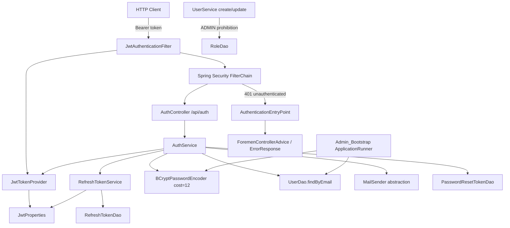
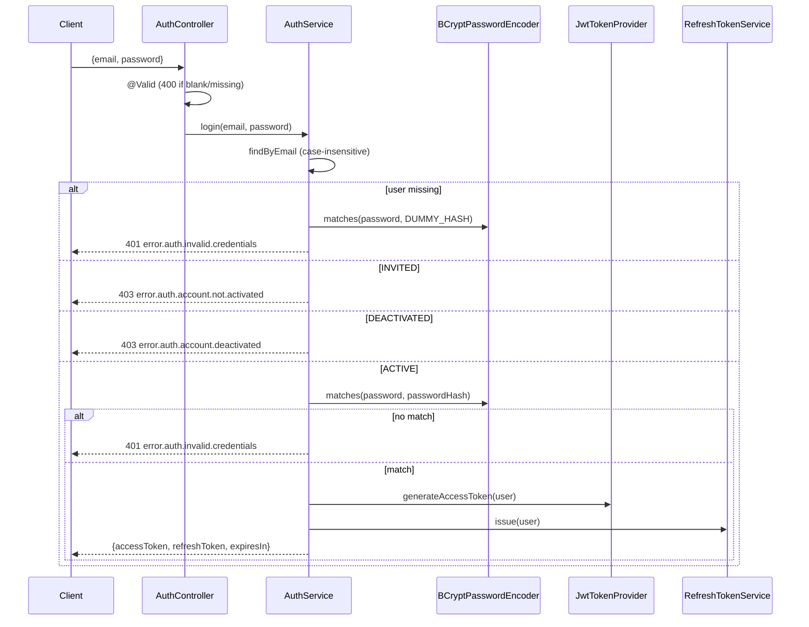
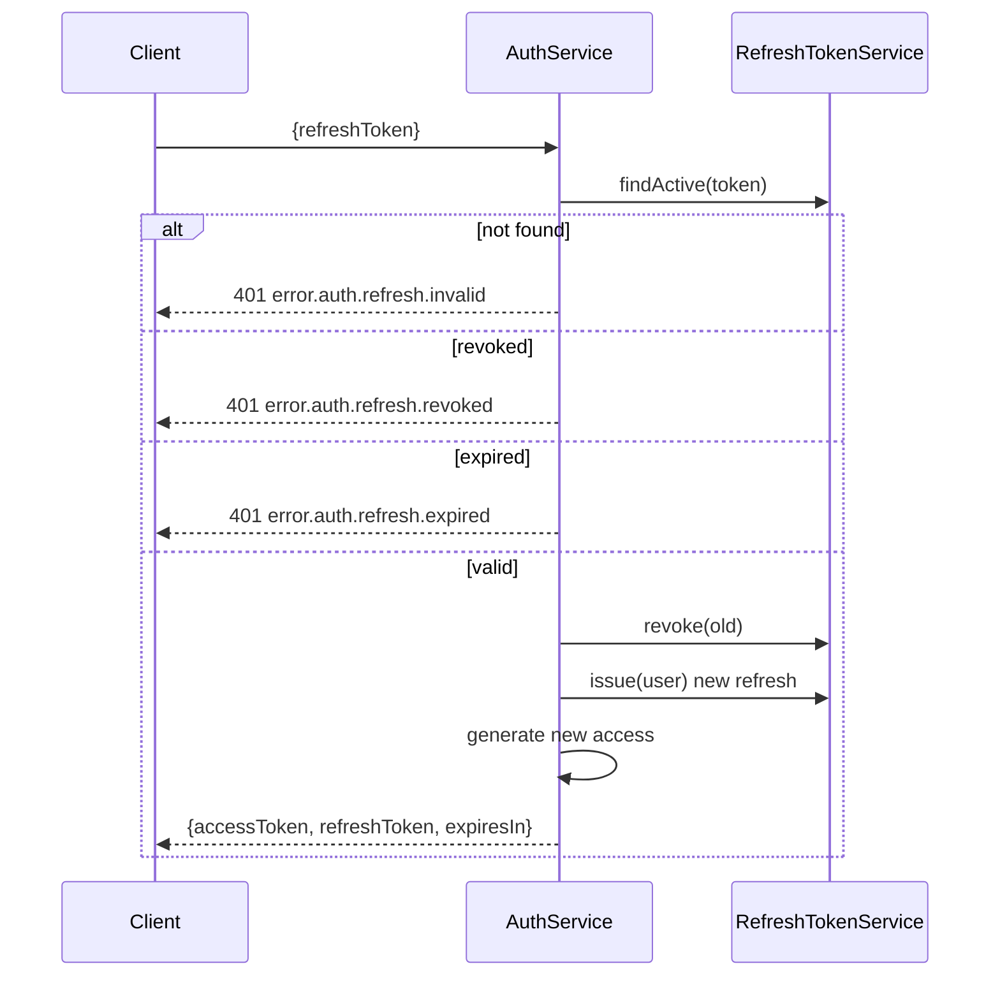

# Design Document — FOR-03-01 JWT Authentication

## Overview

This design introduces stateless JWT authentication to the Foremen Spring Boot backend. It is the first child spec of the FOR-03 auth system and delivers the authentication primitives that later specs (invite flow, permission evaluator, OTP, frontend) build upon.

The core model is:

- **Access token** — a signed, short-lived JSON Web Token (HS256) carrying `sub` (userId), `role` (role code), and `email`. Never persisted server-side; validated purely by signature and expiry.
- **Refresh token** — an opaque, random, database-backed token used to mint new access tokens. Persisted in `refresh_tokens` so it can be rotated and revoked.
- **Spring Security filter chain** — a `JwtAuthenticationFilter` reads the `Authorization: Bearer` header, validates the access token, and populates the `SecurityContext`. An `AuthenticationEntryPoint` produces HTTP 401 for unauthenticated access to protected endpoints.

The feature reuses the existing FOR-01/FOR-02 infrastructure without inventing new patterns:

- `UserEntity` / `RoleEntity` (extended, not replaced) and `UserDao.findByEmail`
- `ForemenApiException` + `ForemenControllerAdvice` for error translation, `MessageResolver` + `messages.properties` (PL base) / `messages_ru.properties` (RU) for i18n
- Liquibase changesets with `preConditions onFail="MARK_RAN"` for idempotency, registered in `changelog.xml`
- Spring `@Value`-bound config properties under the `foremen:` namespace in `application.yml`
- jqwik property tests (`*PropertyTest.java`), JUnit 5, Testcontainers (postgresql), Spring Security Test

### Scope boundaries

In scope: login, refresh, logout, `/me`, JWT provider + filter, `SecurityConfig` update (permit `/api/auth/**`, require auth on `/api/auth/me`, keep other paths `permitAll` for now), refresh-token rotation/revocation, bcrypt hashing, admin bootstrap bean, ADMIN-role assignment prohibition, password reset, configurable lifetimes with fail-fast validation, PL+RU error codes.

Explicitly out of scope (other FOR-03 specs): invite flow (02), permission evaluator (03), project ownership (04), OTP (05), frontend (06/07), and the wholesale `permitAll()` migration (08). The single deviation from the current `anyRequest().permitAll()` stub is that `/api/auth/me` must require authentication so Requirement 9.3 can be satisfied; all other existing paths remain `permitAll` until FOR-03-08.

### New dependencies

| Dependency | Gradle coordinate | Scope | Reason |
|---|---|---|---|
| JJWT API | `io.jsonwebtoken:jjwt-api` | `implementation` | JWT generation/validation (no JWT lib present) |
| JJWT impl | `io.jsonwebtoken:jjwt-impl` | `runtimeOnly` | JJWT runtime implementation |
| JJWT Jackson | `io.jsonwebtoken:jjwt-jackson` | `runtimeOnly` | JSON (de)serialization for JWT claims |
| Spring Mail | `org.springframework.boot:spring-boot-starter-mail` | `implementation` | Password-reset email (Requirement 13) |

`BCryptPasswordEncoder` (cost factor 12) comes from `spring-boot-starter-security`, already present — no new dependency.

## Architecture

### Component map



### Request flows

**Login** (`POST /api/auth/login`)



**Refresh with rotation** (`POST /api/auth/refresh`)



### Package layout

All code lives under package root `com.foremen` inside module `foremen-backend`.

| Package | Classes |
|---|---|
| `com.foremen.dao.model` | `UserEntity` (extended), `RefreshTokenEntity` (new), `PasswordResetTokenEntity` (new), `UserStatus` enum (new) |
| `com.foremen.dao` | `RefreshTokenDao`, `PasswordResetTokenDao` (new) |
| `com.foremen.config.security` | `SecurityConfig` (updated), `JwtTokenProvider`, `JwtAuthenticationFilter`, `JwtAuthenticationEntryPoint`, `JwtProperties`, `PasswordEncoderConfig` (new) |
| `com.foremen.controller` | `AuthController` (new) |
| `com.foremen.controller.dto.auth` | request/response records (new): `LoginRequest`, `RefreshRequest`, `PasswordResetRequest`, `PasswordResetConfirm`, `TokenResponse`, `CurrentUserResponse`, `PermissionView` |
| `com.foremen.service` | `AuthService`, `RefreshTokenService`, `AdminBootstrap` (new); `UserService` (updated) |
| `com.foremen.service.mail` | `MailSender` interface + `SmtpMailSender` impl (new) |

## Components and Interfaces

### JwtProperties (Requirements 4, 14)

`@ConfigurationProperties`-bound record (or `@Value`-bound class, consistent with `CacheConfig`) under `foremen.jwt`. Values validated at startup.

```java
@Validated
@ConfigurationProperties(prefix = "foremen.jwt")
public record JwtProperties(
        @Positive Integer accessTtlMinutes,   // default 30
        @Positive Integer refreshTtlDays,     // default 7
        @NotBlank String secret) {
    public JwtProperties {
        if (accessTtlMinutes == null) accessTtlMinutes = 30;
        if (refreshTtlDays == null) refreshTtlDays = 7;
    }
}
```

Startup fail-fast (Requirement 14.5): `@Validated` + `@Positive` rejects non-positive values; Spring's relaxed binding rejects non-numeric values for an `Integer` field with a `BindException`/`ConfigurationPropertiesBindException`, which aborts context startup. `@EnableConfigurationProperties(JwtProperties.class)` is declared on `SecurityConfig`.

Config in `application.yml`:

```yaml
foremen:
  jwt:
    access-ttl-minutes: ${FOREMEN_JWT_ACCESS_TTL_MINUTES:30}
    refresh-ttl-days: ${FOREMEN_JWT_REFRESH_TTL_DAYS:7}
    secret: ${FOREMEN_JWT_SECRET:}
  admin:
    create: ${FOREMEN_ADMIN_CREATE:false}
    email: ${FOREMEN_ADMIN_EMAIL:}
    password: ${FOREMEN_ADMIN_PASSWORD:}
```

The secret must be at least 32 bytes for HS256; startup validation enforces non-blank, and `JwtTokenProvider` fails fast if the decoded key is too short.

### JwtTokenProvider (Requirement 4)

Wraps JJWT. Signs with HS256 using a `SecretKey` derived from the configured secret.

```java
public class JwtTokenProvider {
    String generateAccessToken(Long userId, String roleCode, String email);
    Optional<JwtClaims> validate(String token); // empty => invalid
}

public record JwtClaims(Long sub, String role, String email, Instant expiresAt) {}
```

- `generateAccessToken`: sets `sub`, `role`, `email` claims; `iat = now`; `exp = now + accessTtlMinutes` (±2s tolerance via clock). Signs HS256.
- `validate`: parses and verifies signature+expiry with JJWT's parser (which throws `ExpiredJwtException`, `SignatureException`, `MalformedJwtException`, etc.). All exceptions are caught and mapped to `Optional.empty()` so no unhandled exception escapes (Requirement 4.7). After successful parse, it checks that `sub`, `role`, `email` are all present and non-null; if any is missing it returns `Optional.empty()` (Requirement 4.8).

### JwtAuthenticationFilter (Requirement 5)

Extends `OncePerRequestFilter`. Registered once (guarded against double registration by not annotating it as a `@Component`; it is instantiated as a bean in `SecurityConfig` and added via `addFilterBefore`).

```java
protected void doFilterInternal(req, res, chain) {
    String header = req.getHeader("Authorization");
    if (header != null && header.startsWith("Bearer ")) {
        String token = header.substring(7);
        provider.validate(token).ifPresent(claims -> {
            var authority = new SimpleGrantedAuthority("ROLE_" + claims.role());
            var auth = new UsernamePasswordAuthenticationToken(
                    claims.sub(), null, List.of(authority));
            SecurityContextHolder.getContext().setAuthentication(auth);
        });
    }
    chain.doFilter(req, res);
}
```

- No header → chain continues, context untouched (5.2).
- Header not starting with `Bearer ` → chain continues, context untouched (5.4).
- Invalid token → `validate` returns empty → context stays unauthenticated, chain continues (5.3).
- Valid token → principal = `sub` (userId), authority = `ROLE_<roleCode>` (5.1).

### SecurityConfig (Requirement 6)

Updated from the current stub. Keeps the STATELESS session, CSRF disabled, frame options disabled. Changes:

```java
http
  .authorizeHttpRequests(auth -> auth
      .requestMatchers("/api/auth/me").authenticated()
      .requestMatchers("/api/auth/**").permitAll()
      .anyRequest().permitAll())                       // FOR-03-08 will tighten this
  .csrf(csrf -> csrf.disable())
  .sessionManagement(s -> s.sessionCreationPolicy(STATELESS))
  .headers(h -> h.frameOptions(f -> f.disable()))
  .exceptionHandling(e -> e.authenticationEntryPoint(jwtAuthenticationEntryPoint))
  .addFilterBefore(jwtAuthenticationFilter, UsernamePasswordAuthenticationFilter.class);
```

Matcher ordering places `/api/auth/me` before `/api/auth/**` so `/me` requires authentication while login/refresh/logout/password-reset remain public (6.1). `JwtAuthenticationFilter` is registered before `UsernamePasswordAuthenticationFilter` (6.2). Session is stateless (6.3), CSRF stays disabled (6.5).

### JwtAuthenticationEntryPoint (Requirements 6.4, 9.3)

Implements `AuthenticationEntryPoint`. When a protected endpoint is hit without valid authentication, it writes an HTTP 401 with a body shaped like `ErrorResponse` (message resolved via `MessageResolver` using a new code `error.auth.unauthorized`, in the request locale) so responses stay consistent with `ForemenControllerAdvice`.

### PasswordEncoderConfig (Requirement 10)

```java
@Bean BCryptPasswordEncoder passwordEncoder() { return new BCryptPasswordEncoder(12); }
```

`AuthService` also holds a precomputed `DUMMY_HASH = passwordEncoder.encode("<random-at-startup>")` for the no-user login path (timing-attack resistance, Requirement 3.6 / 10).

### AuthController (Requirements 3, 7, 8, 9, 13)

`@RestController @RequestMapping("/api/auth")`. Uses jakarta validation on request records so blank/missing fields yield HTTP 400 via the existing `MethodArgumentNotValidException` handler.

| Method | Path | Request | Response | Notes |
|---|---|---|---|---|
| `login` | `POST /login` | `LoginRequest` | `200 TokenResponse` | 3.1–3.9 |
| `refresh` | `POST /refresh` | `RefreshRequest` | `200 TokenResponse` | 7.2–7.6 |
| `logout` | `POST /logout` | `RefreshRequest` | `204` | 8.1–8.3 |
| `me` | `GET /me` | (auth) | `200 CurrentUserResponse` | 9.1–9.4 |
| `requestReset` | `POST /password-reset/request` | `PasswordResetRequest` | `200` | 13.1–13.3 |
| `confirmReset` | `POST /password-reset/confirm` | `PasswordResetConfirm` | `200` | 13.4–13.8 |

### AuthService (Requirements 3, 7, 8, 9, 10, 13)

```java
TokenResponse login(String email, String rawPassword);
TokenResponse refresh(String refreshToken);
void logout(String refreshToken);
CurrentUserResponse currentUser(Long userId);
void requestPasswordReset(String email);
void confirmPasswordReset(String token, String newPassword);
```

- `login`: findByEmail (lower-cased comparison); branch per status; verify with `passwordEncoder.matches`; on any credential failure the no-user branch still runs `matches(raw, DUMMY_HASH)` to equalize timing. Emits access + refresh tokens; `expiresIn = accessTtlMinutes * 60`.
- `refresh`: delegates lookup/rotation to `RefreshTokenService`, generates a fresh access token from the token owner.
- `logout`: idempotent revoke (no error if token unknown).
- `currentUser`: loads user, derives permissions from `role.roleResources` → resource code + operation codes (read-only projection). Reuses existing associations; no permission caching added here (that is FOR-03-03).
- `requestPasswordReset`: only ACTIVE users get a token + email; all other cases return 200 silently (no enumeration).
- `confirmPasswordReset`: validate token (exists, unused, not expired) else 400; set bcrypt hash, mark token used, revoke all of the user's refresh tokens.

### RefreshTokenService (Requirements 7, 8, 13)

```java
String issue(UserEntity user);            // random opaque token, persists entity
RefreshTokenEntity rotate(String token);  // validates + revokes old, returns owner context
void revoke(String token);                // idempotent
void revokeAllForUser(Long userId);       // used by password reset
```

Token value: 256-bit random, base64url-encoded (`SecureRandom`). Rotation: on valid use, set `revoked=true` on the old row and issue a new row; the old value can never authenticate again (7.7, 8.4). Distinct 401 message codes for not-found / revoked / expired (7.4–7.6).

### MailSender abstraction (Requirement 13.2)

```java
public interface MailSender {
    void sendPasswordReset(String toEmail, String token);
}
```

`SmtpMailSender` implements it over Spring's `JavaMailSender` (from `spring-boot-starter-mail`), configured for **Gmail SMTP** (`smtp.gmail.com:587`, STARTTLS). The interface lets tests inject a mock/no-op sender, keeping `AuthService` tests off the SMTP layer.

SMTP credentials are supplied via environment variables (never committed): a Gmail account address and a Gmail **App Password** (Gmail requires an app password, not the account password, when 2FA is on). Spring Mail config in `application.yml`:

```yaml
spring:
  mail:
    host: ${MAIL_HOST:smtp.gmail.com}
    port: ${MAIL_PORT:587}
    username: ${MAIL_USERNAME:}
    password: ${MAIL_PASSWORD:}
    properties:
      mail:
        smtp:
          auth: true
          starttls:
            enable: true

foremen:
  mail:
    from: ${MAIL_FROM:${MAIL_USERNAME:}}
    reset-base-url: ${MAIL_RESET_BASE_URL:http://localhost:3000/auth/set-password}
```

The corresponding secrets are added to `.env.example` as placeholders: `MAIL_HOST`, `MAIL_PORT`, `MAIL_USERNAME`, `MAIL_PASSWORD` (Gmail App Password), `MAIL_FROM`, `MAIL_RESET_BASE_URL`. Real values are provided only via the local untracked `.env`.

### AdminBootstrap (Requirement 11)

An `ApplicationRunner` (or `@Bean` `SmartInitializingSingleton`) guarded by `@ConditionalOnProperty(name = "foremen.admin.create", havingValue = "true")`. When absent/false/other value, the bean is not created (11.1).

Startup logic (transactional, runs once):

1. Read `foremen.admin.email` / `foremen.admin.password`. If email blank → fail startup with clear error (11.8). If password blank → fail startup with clear error (11.7). Neither branch touches the DB.
2. Count users whose `role.code == "ADMIN"` (exact, case-sensitive). If > 1 → fail startup (11.3).
3. If 0 ADMIN users → create one: ADMIN role, email = configured email, `passwordHash = encode(password)`, status ACTIVE, persist directly (11.4).
4. If exactly 1 ADMIN and its email differs (case-insensitive) from configured email → fail startup, no DB change (11.5).
5. If exactly 1 ADMIN with matching email and password non-empty → update its `passwordHash = encode(password)` (11.6).

No plaintext or default admin password appears in repo, Liquibase seed, or DB — only a runtime bcrypt hash (11.9). Failing startup is done by throwing an exception from the runner, which aborts the context.

### UserService ADMIN prohibition (Requirement 12)

The ADMIN-role prohibition is enforced through the CRUD framework's validation hooks rather than by overriding `create()`/`update()` wholesale. This requires a small framework addition, then a refactor of `UserService` onto the hooks.

**Framework change — add a `validateCreate` hook to `AdminService`:**

`AdminService` already exposes a no-op `validateUpdate(DaoModel existing, ServiceExtendedModel update)` invoked from the default `update()`. It has no create-side counterpart and the default `create()` performs no validation. Add a symmetric hook and call it from the default single-entity `create()`:

```java
default void validateCreate(ServiceExtendedModel model) {
    // No-op default — subclasses override for custom validation
}

@Transactional
default ServiceExtendedModel create(ServiceExtendedModel model) {
    validateCreate(model);                       // NEW: first line
    DaoModel entity = getMapper().toCreateDaoModel(model);
    entity = getWriteDao().save(entity);
    getEntityManager().flush();
    saveAudit(null, entity, "CREATE");
    return getMapper().toServiceExtendedModel(entity);
}
```

(The batch `create(List<...>)` remains as-is for this spec; per-item validation for batch create is out of scope here.)

**UserService refactor — move existing validation into the hooks, ADMIN check first:**

`UserService` currently overrides `create()` and `update()` in full. Refactor it to instead override `validateCreate(model)` and `validateUpdate(existing, model)`, so the framework's `create()`/`update()` (with their audit/snapshot handling) are reused. In each hook, the ADMIN-role check is the **first statement**, before email/locale/role-resolution validation:

- `validateCreate(model)`: **first line** — resolve the target role and if `role.getCode().equals("ADMIN")` throw `ForemenApiException(FORBIDDEN, "error.user.admin.role.forbidden")` (12.1); then run the existing email-uniqueness and locale checks.
- `validateUpdate(existing, model)`: **first line** — if the existing user's role code is not `ADMIN` and the resolved target role code equals `ADMIN`, throw the same exception (12.2); an unchanged role, including an existing ADMIN staying ADMIN, is allowed (12.6); then run the existing email-uniqueness and locale checks.

Because the checks live in `validateCreate`/`validateUpdate` invoked by the framework for every create/update, the prohibition holds regardless of caller role and independent of any frontend (12.3, 12.4). Enforcement is purely server-side.

## Data Models

### UserStatus enum (Requirement 1.3)

```java
public enum UserStatus { INVITED, ACTIVE, DEACTIVATED }
```

### UserEntity extension (Requirement 1)

Adds two fields to the existing entity (the existing `active` boolean is untouched — `status` is independent):

```java
@Column(name = "password_hash", length = 255)
private String passwordHash;                 // nullable (1.1)

@Enumerated(EnumType.STRING)
@Column(name = "status", length = 20, nullable = false)
private UserStatus status = UserStatus.INVITED;  // default INVITED (1.2, 1.3)
```

Package remains `com.foremen.dao.model` (1.4).

### RefreshTokenEntity (Requirement 2.3, 7.1)

```java
@Entity @Table(name = "refresh_tokens")
class RefreshTokenEntity extends BaseEntity {
    @Column(nullable = false, unique = true) String token;
    @ManyToOne(fetch = LAZY) @JoinColumn(name = "user_id", nullable = false) UserEntity user;
    @Column(name = "expires_at", nullable = false) Instant expiresAt;
    @Column(nullable = false) boolean revoked = false;
}
```

`created_date` is provided by `BaseEntity`.

### PasswordResetTokenEntity (Requirement 2.4, 13)

```java
@Entity @Table(name = "password_reset_tokens")
class PasswordResetTokenEntity extends BaseEntity {
    @Column(nullable = false, unique = true) String token;
    @ManyToOne(fetch = LAZY) @JoinColumn(name = "user_id", nullable = false) UserEntity user;
    @Column(name = "expires_at", nullable = false) Instant expiresAt;
    @Column(nullable = false) boolean used = false;
}
```

### DAOs

```java
interface RefreshTokenDao extends AdminDao<RefreshTokenEntity, Long> {
    Optional<RefreshTokenEntity> findByToken(String token);
    List<RefreshTokenEntity> findByUserIdAndRevokedFalse(Long userId);
}
interface PasswordResetTokenDao extends AdminDao<PasswordResetTokenEntity, Long> {
    Optional<PasswordResetTokenEntity> findByToken(String token);
}
```

### DTOs

```java
record LoginRequest(@NotBlank String email, @NotBlank String password) {}
record RefreshRequest(@NotBlank String refreshToken) {}
record PasswordResetRequest(@NotBlank @Email String email) {}
record PasswordResetConfirm(@NotBlank String token, @NotBlank @Size(min = 8) String newPassword) {}
record TokenResponse(String accessToken, String refreshToken, long expiresIn) {}
record CurrentUserResponse(Long id, String name, String email, String roleCode, Set<PermissionView> permissions) {}
record PermissionView(String resource, Set<String> operations) {}
```

All request/response records live in package `com.foremen.controller.dto.auth`.

`@NotBlank` rejects empty and whitespace-only values, satisfying the "blank" requirement in 3.2 and 13.7 through the existing validation handler (HTTP 400).

### Liquibase changesets (Requirement 2)

New files under `database_files/changesets/`, each with `preConditions onFail="MARK_RAN"` for idempotency (2.6), registered in `changelog.xml` (2.5):

| Changeset | Content |
|---|---|
| `010-add-user-auth-columns.xml` | `addColumn password_hash VARCHAR(255)` (nullable) and `status VARCHAR(20) DEFAULT 'INVITED' NOT NULL` to `users`; precondition `columnExists` negations (2.1, 2.2) |
| `011-create-refresh-tokens.xml` | `refresh_tokens` table: `id BIGSERIAL PK`, `token VARCHAR NOT NULL UNIQUE`, `user_id BIGINT NOT NULL FK→users(id)`, `expires_at TIMESTAMP NOT NULL`, `revoked BOOLEAN NOT NULL DEFAULT false`, `created_date TIMESTAMP NOT NULL DEFAULT NOW()`; precondition `not tableExists` (2.3) |
| `012-create-password-reset-tokens.xml` | `password_reset_tokens` table: same shape with `used BOOLEAN NOT NULL DEFAULT false` instead of `revoked` (2.4) |

No admin seed row is added by Liquibase (Requirement 11.9 — bootstrap is runtime-only).

## Correctness Properties

*A property is a characteristic or behavior that should hold true across all valid executions of a system — essentially, a formal statement about what the system should do. Properties serve as the bridge between human-readable specifications and machine-verifiable correctness guarantees.*

The properties below were derived from the acceptance-criteria prework and de-duplicated: round-trip criteria were merged (e.g. 4.1/4.4 fold into the JWT round-trip), the filter's negative cases were combined, refresh rotation/one-time-use/logout-reuse were unified, and the ADMIN-prohibition criteria were merged into a single caller-independent invariant. Purely structural, configuration, migration, and infrastructure criteria (1.1, 1.4, 2.x, 6.1–6.5, 9.1, 9.3, 11.x, 14.1/14.5, 15.2) are handled by example, smoke, and integration tests described in the Testing Strategy, not by property tests.

### Property 1: JWT generation/validation round-trip

*For all* users (any userId, any role code, any email), generating an Access_Token and then validating it SHALL yield claims whose `sub`, `role`, and `email` equal the values used at generation, and SHALL report the token as valid.

**Validates: Requirements 4.1, 4.4, 4.9**

### Property 2: Wrong-signature tokens are invalid

*For all* Access_Tokens signed with a key other than the configured secret, `JwtTokenProvider.validate` SHALL report the token as invalid (empty result).

**Validates: Requirements 4.5**

### Property 3: Expired tokens are invalid

*For all* Access_Tokens whose expiry timestamp is equal to or earlier than the current time, `JwtTokenProvider.validate` SHALL report the token as invalid.

**Validates: Requirements 4.6**

### Property 4: Malformed tokens are invalid without throwing

*For all* strings that are not well-formed JWTs (wrong segment count, unparseable header or payload), `JwtTokenProvider.validate` SHALL return an invalid result and SHALL NOT throw an unhandled exception.

**Validates: Requirements 4.7**

### Property 5: Missing required claims make a token invalid

*For all* Access_Tokens with a valid signature and future expiry that are missing any of the `sub`, `role`, or `email` claims, `JwtTokenProvider.validate` SHALL report the token as invalid.

**Validates: Requirements 4.8**

### Property 6: Access-token expiry bound

*For all* positive access-token lifetimes (minutes), a freshly generated Access_Token SHALL have an expiry within ±2 seconds of the issuance time plus that lifetime.

**Validates: Requirements 4.2, 14.3**

### Property 7: Login rejects blank credential fields before verification

*For all* login requests where `email` or `password` is missing, empty, or whitespace-only, the endpoint SHALL respond with HTTP 400 and perform no credential verification.

**Validates: Requirements 3.2**

### Property 8: Login rejects non-matching credentials with 401

*For all* login attempts where the email matches no user (case-insensitively) or the password does not match the stored bcrypt hash of an ACTIVE user, the AuthService SHALL raise a ForemenApiException with HTTP 401 and message code `error.auth.invalid.credentials`.

**Validates: Requirements 3.4, 3.5**

### Property 9: Login failure timing is bounded (timing-attack resistance)

*For all* pairs of a no-user login and a wrong-password login, the measured response-time difference SHALL be at most 100 milliseconds (median over iterations), achieved by comparing against a fixed dummy bcrypt hash in the no-user case.

**Validates: Requirements 3.6**

### Property 10: INVITED users cannot log in

*For all* users whose status is INVITED and any password, login SHALL raise a ForemenApiException with HTTP 403 and message code `error.auth.account.not.activated`.

**Validates: Requirements 3.7**

### Property 11: DEACTIVATED users cannot log in

*For all* users whose status is DEACTIVATED and any password, login SHALL raise a ForemenApiException with HTTP 403 and message code `error.auth.account.deactivated`.

**Validates: Requirements 3.8**

### Property 12: Login expiry duration matches configured lifetime

*For all* positive access-token lifetimes (minutes), a successful login response's `expiresIn` SHALL equal that lifetime multiplied by 60.

**Validates: Requirements 3.9**

### Property 13: Filter authenticates on a valid Bearer token

*For all* valid Access_Tokens, when presented as `Authorization: Bearer <token>`, the JwtAuthenticationFilter SHALL populate the SecurityContext with a principal equal to the `sub` claim and an authority derived from the `role` claim.

**Validates: Requirements 5.1**

### Property 14: Filter leaves context unauthenticated without a valid Bearer token

*For all* requests carrying no Authorization header, a header not beginning with `Bearer `, or a Bearer value the provider reports invalid, the JwtAuthenticationFilter SHALL leave the SecurityContext unauthenticated and continue the filter chain.

**Validates: Requirements 5.2, 5.3, 5.4**

### Property 15: Refresh-token issuance invariant

*For all* users and positive refresh lifetimes (days), issuing a Refresh_Token SHALL persist an entity owned by that user with `revoked` false and an expiry within a small tolerance of issuance plus the lifetime.

**Validates: Requirements 7.1, 14.4**

### Property 16: Refresh rotation is one-time-use

*For all* active Refresh_Tokens, a successful refresh SHALL issue a new Access_Token and a new Refresh_Token, mark the supplied token as revoked, and cause any subsequent refresh using that same token (whether re-presented or previously revoked via logout) to fail.

**Validates: Requirements 7.3, 7.7, 8.4**

### Property 17: Unknown refresh token is rejected

*For all* refresh-token values matching no persisted RefreshTokenEntity, refresh SHALL raise a ForemenApiException with HTTP 401 and message code `error.auth.refresh.invalid`.

**Validates: Requirements 7.4**

### Property 18: Revoked refresh token is rejected

*For all* persisted Refresh_Tokens whose `revoked` value is true, refresh SHALL raise a ForemenApiException with HTTP 401 and message code `error.auth.refresh.revoked`.

**Validates: Requirements 7.5**

### Property 19: Expired refresh token is rejected

*For all* persisted Refresh_Tokens whose expiry is in the past, refresh SHALL raise a ForemenApiException with HTTP 401 and message code `error.auth.refresh.expired`.

**Validates: Requirements 7.6**

### Property 20: Logout revokes a known refresh token

*For all* persisted Refresh_Tokens, a logout request supplying that token SHALL set its `revoked` value to true and respond with HTTP 204.

**Validates: Requirements 8.2**

### Property 21: Logout is idempotent for unknown tokens

*For all* refresh-token values matching no persisted RefreshTokenEntity, a logout request SHALL respond with HTTP 204 and raise no error.

**Validates: Requirements 8.3**

### Property 22: Current-user response reflects identity and derived permissions

*For all* authenticated users, `GET /api/auth/me` SHALL return the user's id, name, email, and role code, and a permission set derived exactly from the role's resource-operation associations.

**Validates: Requirements 9.2, 9.4**

### Property 23: Bcrypt hash/verify round-trip

*For all* passwords `p` and any password `q` distinct from `p`, verifying `p` against `bcrypt(p, cost=12)` SHALL report a match, and verifying `q` against `bcrypt(p)` SHALL report no match.

**Validates: Requirements 10.3, 10.4**

### Property 24: Stored password is never plaintext

*For all* passwords, the value persisted to `passwordHash` SHALL differ from the plaintext password and SHALL be a valid bcrypt hash string.

**Validates: Requirements 10.2**

### Property 25: ADMIN-role assignment prohibition invariant

*For all* user-management create requests resolving to a role whose code equals `ADMIN`, and *for all* update requests transitioning a user's role from non-ADMIN to `ADMIN`, the UserService SHALL raise a ForemenApiException with HTTP 403 and message code `error.user.admin.role.forbidden`, persist no change, and do so regardless of caller role; *for all* other requests (including updates that leave the role unchanged), it SHALL NOT raise this exception.

**Validates: Requirements 12.1, 12.2, 12.4, 12.6**

### Property 26: Password-reset request issues a token only for ACTIVE users

*For all* ACTIVE users, a password-reset request SHALL create a single-use, unused Password_Reset_Token expiring within tolerance of issuance plus 60 minutes and trigger a reset email to that user.

**Validates: Requirements 13.2**

### Property 27: Password-reset request does not enumerate users

*For all* emails matching no user or matching a non-ACTIVE user, a password-reset request SHALL respond with HTTP 200, persist no token, and send no email.

**Validates: Requirements 13.3**

### Property 28: Password-reset confirm sets the hash and revokes refresh tokens

*For all* valid Password_Reset_Tokens (existing, unused, unexpired) with a policy-compliant new password, confirming SHALL update the user's `passwordHash` to a bcrypt hash matching the new password, mark the token used, and revoke all of that user's Refresh_Tokens so none can be used for subsequent refresh.

**Validates: Requirements 13.5, 13.8**

### Property 29: Password-reset confirm rejects invalid tokens

*For all* password-reset confirm requests whose token does not exist, is already used, or has expired, the AuthService SHALL raise a ForemenApiException with HTTP 400 and message code `error.auth.reset.token.invalid`.

**Validates: Requirements 13.6**

### Property 30: Password-reset confirm enforces minimum password length

*For all* new-password values shorter than 8 characters, the password-reset confirm endpoint SHALL respond with HTTP 400 (validation error).

**Validates: Requirements 13.7**

### Property 31: All authentication message codes are localized in PL and RU

*For all* authentication message codes in the required set (`error.auth.invalid.credentials`, `error.auth.account.not.activated`, `error.auth.account.deactivated`, `error.auth.refresh.invalid`, `error.auth.refresh.revoked`, `error.auth.refresh.expired`, `error.auth.reset.token.invalid`, `error.user.admin.role.forbidden`), both the PL (`messages.properties`) and RU (`messages_ru.properties`) resources SHALL contain a non-blank entry.

**Validates: Requirements 15.1**

## Error Handling

All authentication errors flow through the existing `ForemenApiException` → `ForemenControllerAdvice` → `ErrorResponse` pipeline. No new advice class is needed for exceptions; the only new response producer is the `JwtAuthenticationEntryPoint` for the pre-controller 401 case.

| Scenario | Status | Message code | Producer |
|---|---|---|---|
| Blank/missing login field | 400 | `error.validation` | `@Valid` → existing `MethodArgumentNotValidException` handler |
| Unknown email / wrong password | 401 | `error.auth.invalid.credentials` | AuthService → advice |
| INVITED account login | 403 | `error.auth.account.not.activated` | AuthService → advice |
| DEACTIVATED account login | 403 | `error.auth.account.deactivated` | AuthService → advice |
| Refresh token not found | 401 | `error.auth.refresh.invalid` | AuthService → advice |
| Refresh token revoked | 401 | `error.auth.refresh.revoked` | AuthService → advice |
| Refresh token expired | 401 | `error.auth.refresh.expired` | AuthService → advice |
| Reset token invalid/used/expired | 400 | `error.auth.reset.token.invalid` | AuthService → advice |
| Short new password | 400 | `error.validation` | `@Valid` → existing handler |
| Create/promote to ADMIN via API | 403 | `error.user.admin.role.forbidden` | UserService → advice |
| Protected endpoint without valid token | 401 | `error.auth.unauthorized` | `JwtAuthenticationEntryPoint` |

New message codes to add to **both** `messages.properties` (PL) and `messages_ru.properties` (RU):

```
error.auth.invalid.credentials
error.auth.account.not.activated
error.auth.account.deactivated
error.auth.refresh.invalid
error.auth.refresh.revoked
error.auth.refresh.expired
error.auth.reset.token.invalid
error.auth.unauthorized
error.user.admin.role.forbidden
```

Design decisions and rationale:

- **Uniform `invalid.credentials` for unknown-email and wrong-password** avoids user enumeration on the login endpoint, and the dummy-hash comparison equalizes timing (Requirement 3.6). The dummy hash is computed once at startup from a random value so it is a real bcrypt verification, not a short-circuit.
- **Distinct refresh error codes** (`invalid` / `revoked` / `expired`) are acceptable here because a caller must already possess a persisted refresh token; the granularity aids debugging without leaking account existence.
- **Fail-fast configuration** (Requirement 14.5): invalid lifetimes abort context startup via bean validation on `JwtProperties`, surfacing a clear configuration error rather than failing at first token issuance.
- **Bootstrap failures abort startup** (Requirement 11): the runner throws, which stops the application, ensuring an inconsistent admin state is never silently accepted.

## Testing Strategy

This feature is a strong fit for property-based testing: the token provider, bcrypt hashing, refresh rotation, and login/authorization branching are pure or near-pure logic with large input spaces and clear universal invariants. Property tests use **jqwik** (already a dependency), configured to at least **100 iterations** per property. Structural, migration, and Spring-wiring criteria use example/integration tests instead.

### Property tests (jqwik, `*PropertyTest.java`, ≥100 iterations)

Each property test carries a tag comment referencing its design property, e.g.:

```java
// Feature: FOR-03-01-jwt-auth, Property 1: JWT generation/validation round-trip
@Property(tries = 100)
void jwtRoundTrip(@ForAll("userIds") long sub,
                  @ForAll("roleCodes") String role,
                  @ForAll("emails") String email) { ... }
```

- `JwtTokenProviderPropertyTest` — Properties 1–6 (round-trip, wrong-signature, expired, malformed, missing-claim, expiry bound). Uses jqwik `@Provide` generators for user ids, role codes, emails; malformed-token generator produces bad segment counts and non-base64 payloads.
- `AuthServiceLoginPropertyTest` — Properties 7–12 (blank-field rejection, 401 non-matching, timing bound, INVITED/DEACTIVATED 403, expiresIn arithmetic). Uses a mock `UserDao` and real `BCryptPasswordEncoder`; timing property measures median difference across iterations.
- `JwtAuthenticationFilterPropertyTest` — Properties 13–14 (positive and negative filter paths) using `MockHttpServletRequest`/`MockFilterChain` and asserting `SecurityContextHolder` state.
- `RefreshTokenServicePropertyTest` — Properties 15–21 (issuance invariant, rotation one-time-use, unknown/revoked/expired rejection, logout revoke, logout idempotence) against an in-memory/mock `RefreshTokenDao`.
- `CurrentUserPropertyTest` — Property 22 (current-user content + derived permissions) over generated role/resource/operation graphs.
- `PasswordEncoderPropertyTest` — Properties 23–24 (bcrypt round-trip and no-plaintext) with a real `BCryptPasswordEncoder(12)`.
- `AdminRoleProhibitionPropertyTest` — Property 25 (ADMIN-prohibition invariant) exercising `UserService.create/update` with generated role transitions and mock DAOs.
- `PasswordResetPropertyTest` — Properties 26–30 (issuance for ACTIVE, anti-enumeration, confirm success + refresh revocation, invalid-token 400, short-password 400) with a mock `MailSender`.
- `AuthMessagesPropertyTest` — Property 31 (all auth codes present and non-blank in PL and RU), reading both `messages.properties` and `messages_ru.properties` from the classpath.

### Unit / example tests (JUnit 5)

- Entity defaults: new `UserEntity` has `status == INVITED`; `UserStatus.values()` equals the three constants (1.2, 1.3).
- Encoder produces a `$2a$12$` bcrypt hash (10.1).
- Login success path returns both tokens for a seeded ACTIVE user (3.3); endpoint wiring for `/login`, `/refresh`, `/logout`, `/password-reset/request`, `/password-reset/confirm` (3.1, 7.2, 8.1, 13.1, 13.4).
- AdminBootstrap scenarios (11.3–11.9): no-admin create, matching-email update, mismatched-email failure, duplicate-admin failure, empty password/email failure, and assertion that no admin password appears in the Liquibase seed. Use `ApplicationContextRunner` with `foremen.admin.*` properties.
- Configuration defaults (14.1, 14.2) and fail-fast on non-positive/non-numeric lifetimes (14.5) via `ApplicationContextRunner` expecting startup failure.
- `ForemenControllerAdvice` resolves an auth message code per locale (15.2), following the existing `MessageResolverPropertyTest`/advice test patterns.

### Integration tests (Spring Boot + Testcontainers postgresql, Spring Security Test)

- Liquibase migrations (2.1–2.6): apply the changelog against a Testcontainers Postgres, assert the new columns and tables exist with the specified constraints, then apply again to confirm idempotency (preConditions).
- SecurityConfig wiring (6.1–6.5, 9.1, 9.3, 6.4): `MockMvc` with the real filter chain — `/api/auth/login` reachable unauthenticated; `/api/auth/me` returns 401 without a token and 200 with a valid token; assert STATELESS session and CSRF disabled; assert `JwtAuthenticationFilter` precedes `UsernamePasswordAuthenticationFilter`.
- End-to-end login → refresh → logout → refresh-again against a real database, asserting rotation and post-logout rejection.

### Testing balance rationale

Property tests carry the correctness load for the logic layer (token math, hashing, rotation, authorization branching), covering the large input space that example tests cannot. Example tests pin down specific wiring, defaults, and the finite bootstrap scenarios. Integration tests verify the pieces that depend on the real database schema and Spring Security filter chain — behavior that does not vary meaningfully with randomized input and is therefore unsuitable for property testing. `MailSender` is mocked everywhere except where an explicit SMTP integration is exercised, keeping the reset-flow property tests fast and deterministic.
