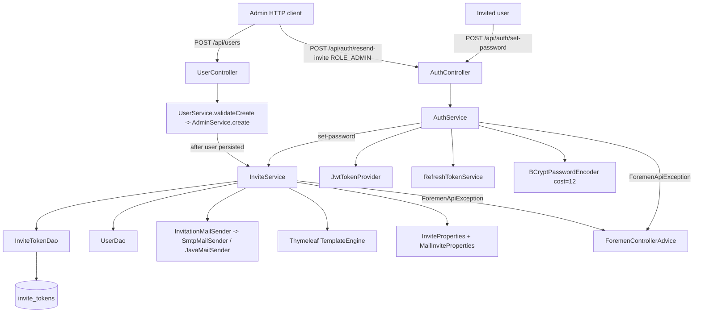
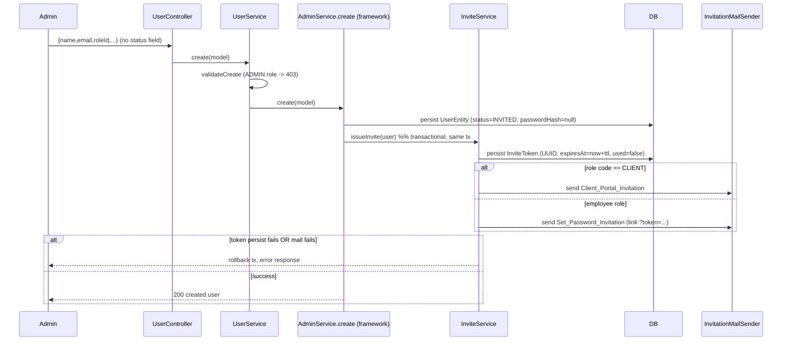
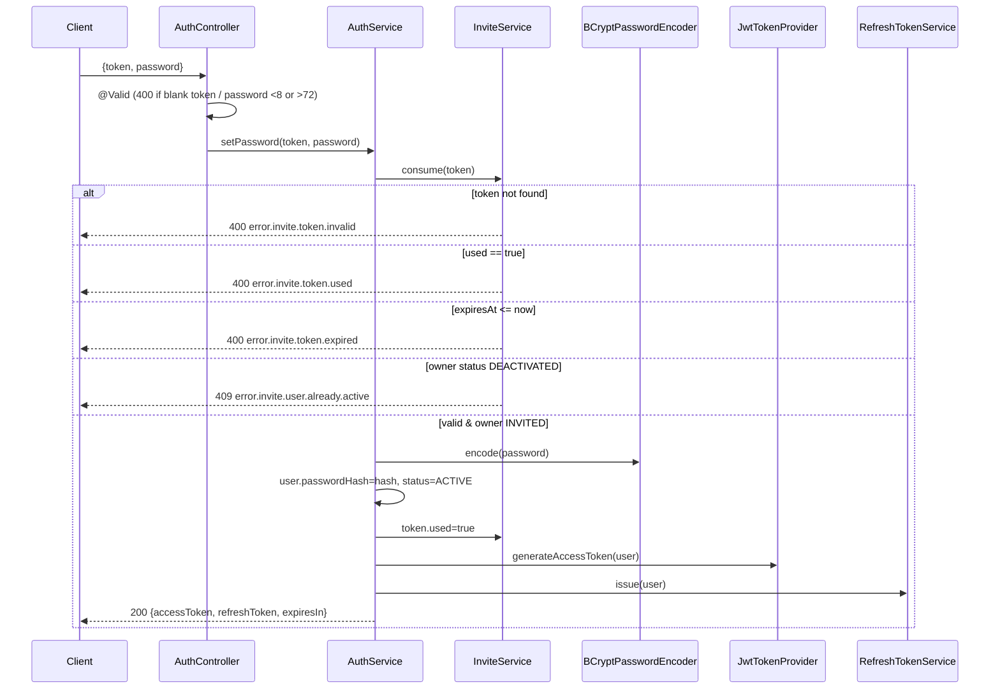

# Design Document — FOR-03-02 User Invitation

## Overview

This design adds invite-based registration to the Foremen Spring Boot backend. It is the second child spec of the FOR-03 auth system and builds directly on FOR-03-01 (JWT authentication), reusing that spec's token, mail, password-encoding, and error infrastructure rather than reinventing it.

The flow is:

1. An administrator creates a user through the existing user-management API (`POST /api/users`). Because `UserServiceMapper` hard-codes `status = INVITED` on create and neither create/update request DTO exposes a `status` field, every user created this way is persisted with `UserStatus.INVITED` and a null `passwordHash`.
2. On successful persistence, `InviteService` generates exactly one single-use **invite token** (a random UUID, TTL 72 h by default), persists it in a new `invite_tokens` table, and sends a **role-dependent invitation email**:
   - **Employee** (role code neither `CLIENT` nor `ADMIN`) → a *Set_Password_Invitation* with a link `{invite-base-url}?token={token}`.
   - **Client** (role code `CLIENT`) → a *Client_Portal_Invitation* directing the recipient to log in via an emailed OTP code (the OTP mechanism itself is FOR-03-05 and is out of scope here).
3. The invited employee visits the (FOR-03-06) frontend page and submits `POST /api/auth/set-password` with `{ token, password }`. `AuthService` validates the token, hashes the password (bcrypt cost 12), flips the user to `ACTIVE`, marks the token `used`, and returns a JWT access/refresh pair so the user is immediately authenticated.
4. An administrator may call `POST /api/auth/resend-invite` with `{ userId }` to invalidate any outstanding token and issue a fresh one with a new email.

### Reuse of FOR-03-01 infrastructure

Confirmed present in `foremen-backend/` and reused as-is:

| Concern | Reused component |
|---|---|
| Token entity/DAO pattern | `RefreshTokenEntity`/`RefreshTokenDao`, `PasswordResetTokenEntity`/`PasswordResetTokenDao` (mirror shape) |
| User lifecycle | `UserEntity.status` (`UserStatus` INVITED/ACTIVE/DEACTIVATED), `UserEntity.passwordHash`, `UserEntity.locale`, `UserDao.findByEmail`/`findById` |
| Always-INVITED create path | `UserServiceMapper` (hard-codes INVITED), `UserService.validateCreate`, `AdminService.create()` |
| Access token | `JwtTokenProvider.generateAccessToken` |
| Refresh token | `RefreshTokenService.issue` |
| Response DTO | `TokenResponse {accessToken, refreshToken, expiresIn}` |
| Password hashing | `BCryptPasswordEncoder` (cost 12) bean from `PasswordEncoderConfig` |
| Mail transport | `MailSender` interface + `SmtpMailSender` (Spring `JavaMailSender`, Gmail SMTP) |
| Error pipeline | `ForemenApiException` + `ForemenControllerAdvice` → `ErrorResponse`, `MessageResolver` |
| i18n | `messages.properties` (PL base) / `messages_ru.properties` (RU) |
| Migrations | numbered Liquibase changesets, `changelog.xml`, `preConditions onFail="MARK_RAN"` (latest existing is `012`) |
| Endpoint controller | `AuthController` (`/api/auth`, `@Valid` request records) |
| Config binding | `foremen.*` namespace, `@ConfigurationProperties` fail-fast pattern (`JwtProperties`) |
| ADMIN protection | `UserService.validateCreate`/`validateUpdate` already reject ADMIN assignment (403) before invite logic runs |

Because assigning/promoting to ADMIN through the user-management API is already blocked by FOR-03-01 (HTTP 403 before any create/invite logic), the invite flow only ever observes CLIENT or employee users; an ADMIN user is never invited.

### Scope boundaries

In scope (backend only): `invite_tokens` table + entity/DAO, invite-token generation hooked into user create, role-dependent Thymeleaf invitation emails, `POST /api/auth/set-password` (public), `POST /api/auth/resend-invite` (ADMIN-only), configurable invite base URL and TTL with fail-fast validation, PL+RU message codes.

Out of scope (other FOR-03 specs): permission evaluator (03), project ownership (04), the OTP generation/verification mechanism (05), the wholesale `permitAll()` migration and `@RequiresPermission` annotations (08), and ALL frontend work including the `/auth/set-password` page and the client OTP-login page (06). This spec defines only the backend API contract the frontend consumes. For a CLIENT invite, only the OTP-portal invitation *email* is sent; no OTP is generated here.

### New dependencies

| Dependency | Gradle coordinate | Scope | Reason |
|---|---|---|---|
| Thymeleaf | `org.springframework.boot:spring-boot-starter-thymeleaf` | `implementation` | Render HTML invitation email bodies (Requirement 4.5). Not currently present in `build.gradle`. |

No other new dependency: `spring-boot-starter-mail`, JJWT, `spring-boot-starter-validation`, jqwik, Testcontainers are already present.

## Architecture

### Component map



### Request flows

**User creation → invite issuance** (`POST /api/users`)



**Set password (auto-login)** (`POST /api/auth/set-password`)



**Resend invite** (`POST /api/auth/resend-invite`, ROLE_ADMIN)

```mermaid
sequenceDiagram
    participant A as Admin
    participant SEC as Spring Security
    participant AC as AuthController
    participant IS as InviteService
    A->>SEC: Bearer access token
    alt no token
        SEC-->>A: 401
    else not ROLE_ADMIN
        SEC-->>A: 403
    else ROLE_ADMIN
        SEC->>AC: {userId}
        AC->>AC: @Valid (400 if blank userId)
        AC->>IS: resend(userId)
        alt user not found
            IS-->>A: 404 error.invite.user.not.found
        else status ACTIVE or DEACTIVATED
            IS-->>A: 409 error.invite.user.already.active
        else status INVITED
            IS->>IS: mark existing unused token used; issue new token; send email
            IS-->>A: 200
        end
    end
```

### Package layout

All code lives under `com.foremen` in module `foremen-backend`, matching FOR-03-01 conventions.

| Package | Classes |
|---|---|
| `com.foremen.dao.model` | `InviteTokenEntity` (new) |
| `com.foremen.dao` | `InviteTokenDao` (new) |
| `com.foremen.service` | `InviteService` (new); `AuthService` (extended); `UserService` (extended — invoke invite issuance after create) |
| `com.foremen.service.mail` | `InvitationMailSender` interface + implementation (new), or extension of `MailSender`; `InvitationEmailRenderer` (Thymeleaf) |
| `com.foremen.config.security` | `SecurityConfig` (updated: permit `set-password`, require `ROLE_ADMIN` for `resend-invite`) |
| `com.foremen.config.mail` | `InviteProperties`, `MailInviteProperties` (new `@ConfigurationProperties`) |
| `com.foremen.controller` | `AuthController` (extended) |
| `com.foremen.controller.dto.auth` | `SetPasswordRequest`, `ResendInviteRequest` (new records) |
| `database_files/changesets` | `013-create-invite-tokens.xml` (new), registered in `changelog.xml` |
| `src/main/resources/templates/mail` | `invite-set-password.html`, `invite-client-portal.html` (new Thymeleaf templates) |

## Components and Interfaces

### InviteProperties / MailInviteProperties (Requirement 7)

Two `@ConfigurationProperties` records under the `foremen` namespace, validated at startup for fail-fast behavior (mirroring `JwtProperties`).

```java
@Validated
@ConfigurationProperties(prefix = "foremen.invite")
public record InviteProperties(Integer ttlHours) {
    public InviteProperties {
        if (ttlHours == null) ttlHours = 72;
    }
    // custom validation in a @PostConstruct-style validator or @AssertTrue:
    @AssertTrue(message = "foremen.invite.ttl-hours must be an integer in [1, 8760]")
    public boolean isTtlHoursInRange() {
        return ttlHours != null && ttlHours >= 1 && ttlHours <= 8760;
    }
}

@Validated
@ConfigurationProperties(prefix = "foremen.mail")
public record MailInviteProperties(@NotBlank String inviteBaseUrl /* + existing from/reset-base-url may stay @Value */) {
    @AssertTrue(message = "foremen.mail.invite-base-url must be an absolute http/https URL")
    public boolean isInviteBaseUrlValid() {
        if (inviteBaseUrl == null || inviteBaseUrl.isBlank()) return false;
        try {
            URI uri = new URI(inviteBaseUrl);
            String scheme = uri.getScheme();
            return uri.isAbsolute()
                    && ("http".equalsIgnoreCase(scheme) || "https".equalsIgnoreCase(scheme));
        } catch (URISyntaxException e) {
            return false;
        }
    }
}
```

- **TTL (7.5, 7.6):** non-numeric/non-integer values fail relaxed binding for the `Integer` field; an in-band out-of-range value (e.g. `0`, `9000`) is rejected by `@AssertTrue`. Either way the context fails to start. Default 72 when unset (7.5).
- **Base URL (7.1, 7.2):** default `http://localhost:3000/auth/set-password`; empty/blank/non-absolute/non-http(s) fails startup via `@AssertTrue` (7.2).

`@EnableConfigurationProperties({InviteProperties.class, MailInviteProperties.class})` is declared on a config class (e.g. a new `MailConfig`, or `SecurityConfig` alongside `JwtProperties`).

Config in `application.yml`:

```yaml
foremen:
  invite:
    ttl-hours: ${FOREMEN_INVITE_TTL_HOURS:72}
  mail:
    from: ${MAIL_FROM:${MAIL_USERNAME:}}
    reset-base-url: ${MAIL_RESET_BASE_URL:http://localhost:3000/auth/set-password}
    invite-base-url: ${MAIL_INVITE_BASE_URL:http://localhost:3000/auth/set-password}
```

### Invite_Link construction (Requirement 7.3, 7.4)

A small pure helper (unit-testable, property-testable) builds the link from the configured base URL and a token:

```java
static String buildInviteLink(String baseUrl, String token) {
    String encoded = URLEncoder.encode(token, StandardCharsets.UTF_8); // 7.4
    String separator = baseUrl.indexOf('?') >= 0 ? "&" : "?";          // 7.3
    return baseUrl + separator + "token=" + encoded;
}
```

Note the existing `SmtpMailSender.sendPasswordReset` concatenates `resetBaseUrl + token` directly; the invite link uses the query-parameter form above and does **not** reuse that concatenation.

### InviteTokenDao (Requirement 1, 3, 5, 6)

Mirrors `RefreshTokenDao`/`PasswordResetTokenDao`.

```java
@Repository
public interface InviteTokenDao extends AdminDao<InviteTokenEntity, Long> {
    Optional<InviteTokenEntity> findByToken(String token);
    List<InviteTokenEntity> findByUserIdAndUsedFalse(Long userId);
}
```

`findByToken` backs set-password lookup (5); `findByUserIdAndUsedFalse` backs resend invalidation of outstanding tokens (6.6).

### InviteService (Requirements 3, 4, 6)

The core new service. Transactional, constructor-injected collaborators.

```java
@Service
@RequiredArgsConstructor
@Transactional
public class InviteService {
    private final InviteTokenDao inviteTokenDao;
    private final UserDao userDao;
    private final InvitationMailSender invitationMailSender;
    private final InviteProperties inviteProperties;

    /** Called from UserService immediately after a user is persisted (3.1-3.3, 3.6, 4). */
    public void issueInvite(UserEntity user);

    /** Validates+consumes a token for set-password; returns the owning user (5.4, 5.6-5.10). */
    public InviteTokenEntity consume(String token);

    /** Admin resend: invalidate outstanding token, issue new, resend email (6). */
    public void resend(Long userId);

    /** Shared: create+persist token and dispatch the role-dependent email (3, 4). */
    private InviteTokenEntity generateAndSend(UserEntity user);
}
```

**`issueInvite(user)` (Requirement 3, 4):**
- Generate `token = UUID.randomUUID().toString()` — a 36-char canonical UUID (3.1).
- `expiresAt = Instant.now().plus(ttlHours, HOURS)` (3.2); `used = false` (3.3); associate with `user` (3.3).
- Persist via `inviteTokenDao.save`. If persistence throws, the surrounding transaction rolls back so neither user nor token is retained (3.6) — because invite issuance runs in the same transaction as `AdminService.create` (see UserService integration).
- Select and send the role-dependent email (4.1, 4.2). If mail dispatch throws, the transaction rolls back and the caller receives an error indicating email delivery failed (4.8, 3.6). *(See "Design decision: mail failure" below — the atomic rollback of 3.6/4.8 for the create path means "retain the token so it can be resent" applies to the resend path where the token already existed; for create both are rolled back together. The requirement 4.8 retention is satisfied on resend and by the always-available admin resend endpoint.)*

**`consume(token)` (Requirement 5.6-5.10):**
- Lookup by token: absent → `ForemenApiException(400, "error.invite.token.invalid")` (5.6).
- `used == true` → `ForemenApiException(400, "error.invite.token.used")` (5.8).
- `expiresAt <= now` → `ForemenApiException(400, "error.invite.token.expired")` (5.7).
- owning user status `DEACTIVATED` → `ForemenApiException(409, "error.invite.user.already.active")`, token unchanged (5.10).
- Otherwise (owner INVITED) return the entity for `AuthService` to complete activation. Evaluation order: invalid → used → expired → status, so each negative branch makes no state change (5.6-5.8, 5.10).

**`resend(userId)` (Requirement 6):**
- `userDao.findById(userId)` absent → `ForemenApiException(404, "error.invite.user.not.found")` (6.7).
- status `ACTIVE` or `DEACTIVATED` → `ForemenApiException(409, "error.invite.user.already.active")`, no change, no email (6.8, 6.9).
- status `INVITED`: mark every `findByUserIdAndUsedFalse(userId)` token `used = true` (6.6), then `generateAndSend(user)` — a new UUID token, `expiresAt = now + ttlHours`, `used=false`, and the role-dependent email (6.6, 4).

**Role selection (Requirement 4.1, 4.2):** `CLIENT` → Client_Portal_Invitation; any other role code (employee; ADMIN never reaches here) → Set_Password_Invitation.

### InvitationMailSender + Thymeleaf rendering (Requirement 4.3-4.7, 8.2, 8.4)

The invitation email is HTML (Thymeleaf), unlike the plain-text `sendPasswordReset`. A dedicated abstraction keeps `InviteService` off the SMTP layer and lets tests inject a mock:

```java
public interface InvitationMailSender {
    void sendSetPasswordInvitation(UserEntity user, String inviteLink);
    void sendClientPortalInvitation(UserEntity user);
}
```

Implementation (`ThymeleafInvitationMailSender`) uses Spring's `JavaMailSender` + `MimeMessageHelper` (HTML) and a Thymeleaf `TemplateEngine`:

- Resolves the recipient locale from `user.getLocale()` — normalized case-insensitively to `PL` or `RU`; anything else (including empty) falls back to `PL` (4.7, 8.4). Note the stored default is `"ru"`; comparison is case-insensitive so `"ru"`/`"RU"` both resolve to RU, `"pl"`/`"PL"` to PL, `"en"`/others to PL.
- Subject and body text come from the message bundle via `MessageResolver` using the resolved locale (8.2, 8.4, 8.5 — PL is the `messages.properties` base so missing RU keys fall back to PL automatically through `ResourceBundleMessageSource`).
- Templates: `templates/mail/invite-set-password.html` (contains the `inviteLink`, 4.3) and `templates/mail/invite-client-portal.html` (OTP-portal instruction, no set-password link, 4.4).
- Dispatch goes through Spring `JavaMailSender` (the existing mail transport, 4.6).

Design decision: rather than overloading the existing `MailSender` (whose single method is plain-text password reset), a separate `InvitationMailSender` is introduced so HTML/Thymeleaf concerns stay isolated and the FOR-03-01 reset path is untouched. Both are backed by the same `JavaMailSender` bean.

### AuthController extension (Requirement 5, 6)

Two new endpoints on the existing `/api/auth` controller.

| Method | Path | Request | Response | Notes |
|---|---|---|---|---|
| `setPassword` | `POST /set-password` | `SetPasswordRequest` | `200 TokenResponse` | public (5.1, 5.2); `@Valid` → 400 on blank token / password length (5.3) |
| `resendInvite` | `POST /resend-invite` | `ResendInviteRequest` | `200` | ROLE_ADMIN (6.1, 6.2); `@Valid` → 400 on blank userId (6.3) |

```java
@PostMapping("/set-password")
public ResponseEntity<TokenResponse> setPassword(@RequestBody @Valid SetPasswordRequest request) {
    return ResponseEntity.ok(authService.setPassword(request.token(), request.password()));
}

@PostMapping("/resend-invite")
@ResponseStatus(HttpStatus.OK)
public void resendInvite(@RequestBody @Valid ResendInviteRequest request) {
    inviteService.resend(request.userId());
}
```

### AuthService extension (Requirement 5)

One new method, reusing FOR-03-01 token issuance (`issueTokens` private helper already builds `TokenResponse` via `JwtTokenProvider` + `RefreshTokenService`).

```java
@Transactional
public TokenResponse setPassword(String token, String rawPassword) {
    InviteTokenEntity invite = inviteService.consume(token); // 5.6-5.10 validation
    UserEntity user = invite.getUser();
    user.setPasswordHash(passwordEncoder.encode(rawPassword)); // bcrypt cost 12 (5.4)
    user.setStatus(UserStatus.ACTIVE);                          // 5.4
    userDao.save(user);
    invite.setUsed(true);                                       // 5.4, consumed
    inviteTokenDao.save(invite);
    return issueTokens(user);                                   // 5.5 auto-login
}
```

All four writes (`passwordHash`, `status`, token `used`, plus token issuance) occur in one `@Transactional` method, so activation is atomic (5.4). A consumed token is `used=true`, so any later set-password with the same value hits the `error.invite.token.used` branch (5.9). `AuthService` gains `InviteService`, `InviteTokenDao`, and `UserDao` (already injected) as collaborators.

### SecurityConfig update (Requirement 5.2, 6.2, 6.4, 6.5)

`/api/auth/set-password` is public and already covered by the existing `/api/auth/**` `permitAll` rule (5.2). `/api/auth/resend-invite` must require `ROLE_ADMIN`, enforced by Spring Security (not the FOR-03-03 evaluator). The authorization matchers are ordered so the specific rules precede the broad `permitAll`:

```java
.authorizeHttpRequests(auth -> auth
    .requestMatchers(HttpMethod.POST, "/api/auth/resend-invite").hasRole("ADMIN") // 6.2, 6.5
    .requestMatchers("/api/auth/me").authenticated()
    .requestMatchers("/api/auth/**").permitAll()   // includes set-password (5.2)
    .anyRequest().permitAll())
```

`JwtAuthenticationFilter` sets the authority to `ROLE_<roleCode>` from the token's role claim, so `hasRole("ADMIN")` matches `ROLE_ADMIN`. An unauthenticated caller hits `JwtAuthenticationEntryPoint` → 401 (6.4); an authenticated non-ADMIN caller is denied by Spring Security → 403 via `AccessDeniedException` handled in `ForemenControllerAdvice` (6.5).

### UserService integration (Requirement 3)

`InviteService.issueInvite(user)` must run after the user is persisted, within the same transaction, so a failure rolls back both (3.6). `AdminService.create()` is a framework `default` method; rather than override it, `UserService` triggers invite issuance from a create hook that runs post-persist. Two viable approaches:

- **Preferred:** override `AdminService.create(model)` in `UserService` to call `super`/framework create then `inviteService.issueInvite(resolvedUser)` — but `create` is a `default` interface method, so `UserService` provides its own `create` that delegates to the framework logic and appends invite issuance. To avoid duplicating framework audit logic, the framework `create()` can be lightly extended with a post-create hook:

```java
// AdminService (framework) — symmetric to validateCreate
default void afterCreate(DaoModel entity) { /* no-op */ }

default ServiceExtendedModel create(ServiceExtendedModel model) {
    validateCreate(model);
    DaoModel entity = getMapper().toCreateDaoModel(model);
    entity = getWriteDao().save(entity);
    getEntityManager().flush();
    afterCreate(entity);          // NEW: runs in the same @Transactional create
    saveAudit(null, entity, "CREATE");
    return getMapper().toServiceExtendedModel(entity);
}
```

`UserService` overrides `afterCreate(UserEntity user)` to call `inviteService.issueInvite(user)`. Because `create` is `@Transactional`, an exception from `issueInvite` (token persist or mail) rolls back the user insert (3.6). This mirrors the existing `validateCreate` hook style and keeps audit/snapshot handling in the framework.

Since `UserServiceMapper` hard-codes `status = INVITED` and the request DTOs expose no `status` field, every created user is INVITED (3.7) and thus always gets exactly one invite token (3.8), subject to the role rules in Requirement 4. The created user's `passwordHash` stays null (3.4) because neither the mapper nor the create path sets it.

## Data Models

### InviteTokenEntity (Requirement 1)

Mirrors `RefreshTokenEntity`/`PasswordResetTokenEntity` (extends `BaseEntity`, which supplies `id`, `created_date`, `created_by`, `updated_date`, `updated_by`).

```java
@Entity
@Table(name = "invite_tokens")
@Getter
@Setter
@NoArgsConstructor
public class InviteTokenEntity extends BaseEntity {

    @Column(nullable = false, unique = true)
    private String token;                 // 36-char canonical UUID (1.1, 1.2)

    @ManyToOne(fetch = FetchType.LAZY)
    @JoinColumn(name = "user_id", nullable = false)
    private UserEntity user;              // 1.3

    @Column(name = "expires_at", nullable = false)
    private Instant expiresAt;            // 1.4

    @Column(nullable = false)
    private boolean used = false;         // 1.5 (defaults false)
}
```

- `token` is not-null/unique; the DB column is VARCHAR(255) (mirroring siblings), and the persisted value is a 36-char UUID string (1.1). Assigning null violates the not-null constraint → persist rejected (1.2). (A value >36 chars is not a valid UUID; the service only ever assigns `UUID.randomUUID().toString()`; the column width provides headroom and the not-null/unique constraints are the enforced DB guarantees.)
- `user` is LAZY `@ManyToOne` with not-null `user_id` FK (1.3).
- `used` defaults to `false` at instance creation and before explicit set (1.5).
- `created_date` inherited from `BaseEntity`, populated on first persist (1.6).
- Package `com.foremen.dao.model` (1.7).

### DTOs (Requirement 5.1, 5.3, 6.1, 6.3)

New records in `com.foremen.controller.dto.auth`:

```java
public record SetPasswordRequest(
        @NotBlank String token,                        // 5.3 blank -> 400
        @NotBlank @Size(min = 8, max = 72) String password) {}  // 5.3 length -> 400

public record ResendInviteRequest(
        @NotNull Long userId) {}                       // 6.1, 6.3 missing -> 400
```

- `SetPasswordRequest`: `@NotBlank` rejects missing/blank token; `@Size(min=8, max=72)` rejects passwords outside 8..72 (bcrypt's effective input limit is 72 bytes) — both surface as HTTP 400 through the existing `MethodArgumentNotValidException` handler before any token lookup (5.3).
- `ResendInviteRequest`: the requirement phrases `userId` as "non-blank". Modeled as `@NotNull Long userId` (a JSON body `{"userId": 5}`); a missing/null id → 400. If the frontend sends `userId` as a string, an equivalent `@NotBlank String userId` parsed to Long is acceptable; the design uses `Long` for type safety and treats null as the blank case (6.1, 6.3).

### Liquibase changeset `013-create-invite-tokens.xml` (Requirement 2)

New file under `database_files/changesets/`, structurally identical to `012` with `used` (like the reset-token table) and registered in `changelog.xml` after `012`.

```xml
<?xml version="1.0" encoding="UTF-8"?>
<databaseChangeLog
    xmlns="http://www.liquibase.org/xml/ns/dbchangelog"
    xmlns:xsi="http://www.w3.org/2001/XMLSchema-instance"
    xsi:schemaLocation="http://www.liquibase.org/xml/ns/dbchangelog
        http://www.liquibase.org/xml/ns/dbchangelog/dbchangelog-latest.xsd">

    <changeSet id="013-create-invite-tokens" author="foremen">
        <preConditions onFail="MARK_RAN">
            <not><tableExists tableName="invite_tokens"/></not>
        </preConditions>

        <createTable tableName="invite_tokens">
            <column name="id" type="BIGSERIAL" autoIncrement="true">
                <constraints primaryKey="true" nullable="false"/>
            </column>
            <column name="token" type="VARCHAR(255)">
                <constraints nullable="false" unique="true" uniqueConstraintName="uk_invite_tokens_token"/>
            </column>
            <column name="user_id" type="BIGINT">
                <constraints nullable="false"
                    foreignKeyName="fk_invite_tokens_user"
                    references="users(id)"/>
            </column>
            <column name="expires_at" type="TIMESTAMP">
                <constraints nullable="false"/>
            </column>
            <column name="used" type="BOOLEAN" defaultValueBoolean="false">
                <constraints nullable="false"/>
            </column>
            <column name="created_date" type="TIMESTAMP" defaultValueComputed="NOW()">
                <constraints nullable="false"/>
            </column>
            <column name="created_by" type="VARCHAR(255)"/>
            <column name="updated_date" type="TIMESTAMP"/>
            <column name="updated_by" type="VARCHAR(255)"/>
        </createTable>
    </changeSet>

</databaseChangeLog>
```

Registration line added to `changelog.xml` after `012` (2.3):

```xml
<include file="database_files/changesets/013-create-invite-tokens.xml"/>
```

The `preConditions onFail="MARK_RAN"` makes the changeset idempotent: on a database where `invite_tokens` already exists, it is marked ran without re-running `createTable` (2.4).

## Correctness Properties

*A property is a characteristic or behavior that should hold true across all valid executions of a system — essentially, a formal statement about what the system should do. Properties serve as the bridge between human-readable specifications and machine-verifiable correctness guarantees.*

The properties below were derived from the acceptance-criteria prework and de-duplicated. Merges applied: issuance criteria (3.1/3.3/3.8) fold into one issuance invariant; expiry math (3.2) and resend expiry (6.6) share one expiry property; link construction (4.3/7.3/7.4) is one property; set-password activation, auto-login, and one-time-use (5.4/5.5/5.9) fold into one activation invariant; resend on ACTIVE/DEACTIVATED (6.8/6.9) fold into one non-INVITED property; email-locale resolution (4.7/8.4) is one pure-function property; localization completeness (8.1/8.2) is one property. Purely structural, migration, security-wiring, and configuration-default criteria (1.2–1.4, 1.6, 1.7, 2.x, 4.5, 4.6, 5.1, 5.2, 6.1, 6.2, 6.4, 6.5, 7.1, 7.5, 8.3, 8.5) are covered by example, smoke, and integration tests in the Testing Strategy, not by property tests.

### Property 1: Invite issuance invariant

*For all* users created through the user-management API (any name, email, and non-ADMIN role), issuing an invite SHALL persist exactly one InviteTokenEntity whose `token` is a canonical 36-character UUID string, whose `used` is false, and whose `user` is the created user.

**Validates: Requirements 3.1, 3.3, 3.8, 1.1**

### Property 2: Invite-token expiry equals issuance plus configured TTL

*For all* configured TTL values in the range 1 to 8760 hours, an invite token generated at issuance time `t` (whether on user create or on resend) SHALL have `expiresAt` within ±5 seconds of `t` plus that TTL.

**Validates: Requirements 3.2, 6.6**

### Property 3: Created users are INVITED with no password

*For all* user-creation inputs to the user-management API, the created UserEntity SHALL have status INVITED and a null `passwordHash`.

**Validates: Requirements 3.4, 3.7**

### Property 4: Generated invite tokens are distinct

*For all* sequences of invite tokens generated within a run, the generated `token` values SHALL be pairwise distinct.

**Validates: Requirements 3.5**

### Property 5: Employee invitations send exactly one set-password email

*For all* users whose role code is neither `CLIENT` nor `ADMIN`, issuing an invite SHALL dispatch exactly one Set_Password_Invitation email to the user's address and SHALL NOT dispatch a Client_Portal_Invitation.

**Validates: Requirements 4.1**

### Property 6: Client invitations send exactly one client-portal email

*For all* users whose role code equals `CLIENT`, issuing an invite SHALL dispatch exactly one Client_Portal_Invitation email to the user's address, SHALL NOT dispatch a Set_Password_Invitation, and the rendered body SHALL contain no set-password invite link.

**Validates: Requirements 4.2, 4.4**

### Property 7: Invite-link construction round-trips the token

*For all* configured base URLs and all token values, the constructed Invite_Link SHALL equal the base URL followed by `?token={encoded}` when the base URL contains no `?`, or `&token={encoded}` when it contains a `?`, where `{encoded}` is the URL-encoded token; and URL-decoding the appended `token` parameter SHALL yield the original token value.

**Validates: Requirements 4.3, 7.3, 7.4**

### Property 8: Email locale resolution falls back to Polish

*For all* stored user locale strings, the resolved email locale SHALL be RU when the string equals `RU` (case-insensitively), PL when it equals `PL` (case-insensitively), and PL for every other value including empty.

**Validates: Requirements 4.7, 8.4**

### Property 9: Set-password activation and one-time-use invariant

*For all* invite tokens that exist, are unused, and are unexpired, whose owning user is INVITED, together with a password of 8 to 72 characters, calling set-password SHALL set the owner's `passwordHash` to a bcrypt hash the supplied password verifies against, set the owner's status to ACTIVE, set the token `used` to true, and return a TokenResponse with a non-blank access token and refresh token; and any subsequent set-password using the same token value SHALL be rejected with HTTP 400 and message code `error.invite.token.used`.

**Validates: Requirements 5.4, 5.5, 5.9**

### Property 10: Set-password rejects invalid request fields before lookup

*For all* set-password requests whose token is blank or whose password length is less than 8 or greater than 72, the endpoint SHALL respond with HTTP 400, perform no token lookup, and make no change to any user or token.

**Validates: Requirements 5.3**

### Property 11: Set-password rejects unknown tokens

*For all* token values that match no persisted InviteTokenEntity, set-password SHALL raise a ForemenApiException with HTTP 400 and message code `error.invite.token.invalid` and make no change to any user or token.

**Validates: Requirements 5.6**

### Property 12: Set-password rejects expired tokens

*For all* invite tokens whose `expiresAt` is equal to or earlier than the current time (and that are unused), set-password SHALL raise a ForemenApiException with HTTP 400 and message code `error.invite.token.expired` and make no change to the owning user or the token.

**Validates: Requirements 5.7**

### Property 13: Set-password rejects already-used tokens

*For all* invite tokens whose `used` value is true, set-password SHALL raise a ForemenApiException with HTTP 400 and message code `error.invite.token.used` and make no change to the owning user or the token.

**Validates: Requirements 5.8**

### Property 14: Set-password rejects invites for deactivated owners

*For all* invite tokens that exist, are unused, and are unexpired whose owning user's status is DEACTIVATED, set-password SHALL raise a ForemenApiException with HTTP 409 and message code `error.invite.user.already.active`, make no change to the owning user, and leave the token `used` value false.

**Validates: Requirements 5.10**

### Property 15: Resend for INVITED users rotates the token

*For all* INVITED users holding any set of existing unused invite tokens, a resend SHALL mark every previously-unused token as used, persist exactly one new unused token (a 36-character UUID with an expiry within ±5 seconds of issuance plus the configured TTL), and dispatch the role-dependent invitation email.

**Validates: Requirements 6.6**

### Property 16: Resend rejects unknown users

*For all* `userId` values that match no user, a resend SHALL raise a ForemenApiException with HTTP 404 and message code `error.invite.user.not.found`, make no change, and send no email.

**Validates: Requirements 6.7**

### Property 17: Resend rejects non-INVITED users

*For all* users whose status is ACTIVE or DEACTIVATED, a resend SHALL raise a ForemenApiException with HTTP 409 and message code `error.invite.user.already.active`, make no change, and send no email.

**Validates: Requirements 6.8, 6.9**

### Property 18: Invite base URL validation predicate

*For all* strings that are empty, blank, or not a syntactically valid absolute HTTP or HTTPS URL, the base-URL validation predicate SHALL return false; *for all* syntactically valid absolute http/https URLs it SHALL return true.

**Validates: Requirements 7.2**

### Property 19: Invite TTL validation predicate

*For all* integers outside the range 1 to 8760 inclusive, the TTL validation predicate SHALL return false; *for all* integers within that range it SHALL return true.

**Validates: Requirements 7.6**

### Property 20: Invitation message codes are localized in PL and RU

*For all* invitation message codes in the required set (the five error codes `error.invite.token.invalid`, `error.invite.token.expired`, `error.invite.token.used`, `error.invite.user.not.found`, `error.invite.user.already.active`, plus the subject and body codes of both email templates), both the PL (`messages.properties`) and RU (`messages_ru.properties`) resources SHALL contain a non-blank entry.

**Validates: Requirements 8.1, 8.2**

## Error Handling

All invitation errors flow through the existing `ForemenApiException` → `ForemenControllerAdvice` → `ErrorResponse` pipeline (reused from FOR-03-01). Bean-validation failures on the new request records surface as HTTP 400 through the existing `MethodArgumentNotValidException` handler. The `resend-invite` authorization failures are produced by Spring Security: 401 via `JwtAuthenticationEntryPoint`, 403 via the `AccessDeniedException` handler already present in `ForemenControllerAdvice`.

| Scenario | Status | Message code | Producer |
|---|---|---|---|
| Blank token / password length out of 8..72 (set-password) | 400 | `error.validation` | `@Valid` → existing handler |
| Missing/null userId (resend-invite) | 400 | `error.validation` | `@Valid` → existing handler |
| Unknown invite token (set-password) | 400 | `error.invite.token.invalid` | InviteService → advice |
| Expired invite token (set-password) | 400 | `error.invite.token.expired` | InviteService → advice |
| Used invite token (set-password) | 400 | `error.invite.token.used` | InviteService → advice |
| Set-password / resend for non-invitable owner (DEACTIVATED / ACTIVE) | 409 | `error.invite.user.already.active` | InviteService → advice |
| Resend for unknown userId | 404 | `error.invite.user.not.found` | InviteService → advice |
| Invite-token persistence fails on create | 500 (tx rollback) | `error.internal` | tx rollback → generic handler |
| Invitation email dispatch fails on create | 500 (tx rollback) | `error.internal` | tx rollback → generic handler |
| resend-invite unauthenticated | 401 | `error.auth.unauthorized` | `JwtAuthenticationEntryPoint` |
| resend-invite authenticated non-ADMIN | 403 | `error.access.denied` | `AccessDeniedException` handler |
| Invalid `foremen.mail.invite-base-url` / `foremen.invite.ttl-hours` | startup failure | configuration error | `@Validated` `@ConfigurationProperties` |

New message codes to add to **both** `messages.properties` (PL base) and `messages_ru.properties` (RU):

```
error.invite.token.invalid
error.invite.token.expired
error.invite.token.used
error.invite.user.not.found
error.invite.user.already.active
mail.invite.set-password.subject
mail.invite.set-password.body            # or template-embedded text keys
mail.invite.client-portal.subject
mail.invite.client-portal.body
```

(The exact email body message-code names are finalized during implementation; the requirement only mandates that each subject and body code resolves to a non-empty value in both bundles.)

Design decisions and rationale:

- **Fixed evaluation order for set-password** (invalid → used → expired → owner-status) gives deterministic error codes and guarantees each negative branch makes no state change (5.6–5.8, 5.10).
- **409 for both DEACTIVATED-owner set-password and ACTIVE/DEACTIVATED resend** reuses a single `error.invite.user.already.active` code: the account is already past the invite stage, so the invite is not applicable.
- **Atomic activation** (5.4): password hash, status flip, and token consumption happen in one `@Transactional` `AuthService.setPassword`, so a failure leaves the user INVITED and the token unused.
- **Create-time atomicity** (3.6): invite issuance runs inside the framework `create()` transaction via the new `afterCreate` hook, so a token-persist or mail failure rolls back the user insert.
- **Fail-fast configuration** (7.2, 7.6): invalid base URL or TTL aborts context startup via bean validation on `MailInviteProperties`/`InviteProperties`, surfacing a clear configuration error rather than failing at first invite.
- **Mail-failure retention (4.8):** on the create path, mail failure rolls the whole create back (3.6), so no orphan token remains; the always-available admin `resend-invite` endpoint provides the retry path. On the resend path a mail failure surfaces as an error and the operation's tx behavior leaves the newly issued token available for a further resend.

## Testing Strategy

This feature is a good fit for property-based testing: token generation (UUID shape, expiry math), invite-link construction, locale resolution, config validation predicates, and the set-password / resend state machines are pure or near-pure logic with large input spaces and clear universal invariants. Property tests use **jqwik** (already a dependency), configured to at least **100 iterations** per property. Structural, migration, security-wiring, and configuration-default criteria use example/integration tests instead. `InvitationMailSender` and DAOs are mocked in property tests to keep them fast and deterministic; a small number of integration tests exercise the real schema and Spring Security chain.

### Property tests (jqwik, `*PropertyTest.java`, ≥100 iterations)

Each property test carries a tag comment referencing its design property, e.g.:

```java
// Feature: FOR-03-02-user-invitation, Property 2: Invite-token expiry equals issuance plus configured TTL
@Property(tries = 100)
void inviteExpiryMatchesTtl(@ForAll @IntRange(min = 1, max = 8760) int ttlHours) { ... }
```

- `InviteServiceIssuancePropertyTest` — Properties 1, 2, 4, 5, 6 (issuance invariant, expiry math, distinctness, employee vs client email dispatch) with a mock `InviteTokenDao` capturing saved entities and a mock `InvitationMailSender` recording dispatches; jqwik `@Provide` generators for names, emails, and role codes (partitioned into CLIENT / employee sets).
- `UserCreateInvitePropertyTest` — Property 3 (created users are INVITED with null passwordHash) exercising the create path with mock DAOs, over generated create inputs.
- `InviteLinkPropertyTest` — Property 7 (link construction + token round-trip) over generated base URLs (with and without a `?`) and arbitrary token strings, asserting separator choice, URL-encoding, and decode round-trip.
- `EmailLocalePropertyTest` — Property 8 (locale resolution) over arbitrary locale strings including `pl`/`PL`/`ru`/`RU`/`en`/empty/random.
- `SetPasswordPropertyTest` — Properties 9–14 (activation + one-time-use, blank/length validation, unknown/expired/used token rejection, deactivated-owner 409) against mock `InviteTokenDao`/`UserDao`, a real `BCryptPasswordEncoder(12)`, and a stub `JwtTokenProvider`/`RefreshTokenService`; generators for token states, owner statuses, and password lengths.
- `ResendInvitePropertyTest` — Properties 15–17 (INVITED rotation, unknown-user 404, non-INVITED 409) over generated users, statuses, and prior token sets.
- `InviteConfigValidationPropertyTest` — Properties 18–19 (base-URL and TTL validation predicates) over generated valid/invalid URL strings and integers, testing the pure `@AssertTrue` predicate methods directly.
- `InviteMessagesPropertyTest` — Property 20 (all invite error and email codes present and non-blank in PL and RU), reading both bundles from the classpath.

### Unit / example tests (JUnit 5)

- Entity default: `new InviteTokenEntity().isUsed() == false` (1.5); entity resides in `com.foremen.dao.model` (1.7).
- Endpoint wiring for `/api/auth/set-password` and `/api/auth/resend-invite` (5.1, 6.1); resend rejects null userId with 400 (6.3).
- Thymeleaf templates render for both variants and locales (4.5), and set-password body contains the invite link while client-portal body does not (spot-checks complementing Properties 6 and 7).
- Mail dispatch goes through the injected `JavaMailSender`/`InvitationMailSender` (4.6).
- Config defaults: `foremen.invite.ttl-hours` defaults to 72 and `foremen.mail.invite-base-url` defaults to the localhost set-password URL when unset (7.1, 7.5), via `ApplicationContextRunner`; fail-fast on invalid base URL / out-of-range TTL expecting startup failure (7.2, 7.6).
- `ForemenControllerAdvice` resolves an invite message code per request locale (8.3) and RU falls back to the PL base for a base-only code (8.5), following the existing `MessageResolver` test patterns.
- Mail-failure behavior on create rolls back and on resend surfaces an error (4.8), with a mock `InvitationMailSender` that throws.

### Integration tests (Spring Boot + Testcontainers postgresql, Spring Security Test)

- Liquibase migration `013` (2.1–2.4): apply the changelog against a Testcontainers Postgres, assert the `invite_tokens` table exists with the specified columns/constraints (PK, unique `uk_invite_tokens_token`, FK `fk_invite_tokens_user`, not-null `expires_at`, `used` default false, `created_date` default NOW()), then re-apply to confirm the `MARK_RAN` precondition leaves data unchanged.
- Entity mapping and constraints (1.2, 1.3, 1.6): persist an `InviteTokenEntity` and assert `created_date` is populated; persisting with a null token raises a constraint violation; LAZY `user` association maps to a not-null `user_id`.
- Transactional atomicity (3.6): force invite-token persistence to fail after the user insert and assert no user row remains.
- Security wiring (5.2, 6.2, 6.4, 6.5): `MockMvc` with the real filter chain — `POST /api/auth/set-password` reachable unauthenticated; `POST /api/auth/resend-invite` returns 401 without a token, 403 with a non-ADMIN token, and reaches the controller with a `ROLE_ADMIN` token.
- End-to-end: create a user via `POST /api/users` → assert one invite token persisted and an email dispatched (mock sender) → `POST /api/auth/set-password` with the token → assert 200 with tokens, user ACTIVE, token used → re-submit the same token → assert 400 `error.invite.token.used`.

### Testing balance rationale

Property tests carry the correctness load for the logic layer (token shape and expiry, link construction, locale resolution, config predicates, and the set-password/resend branching) over the large input space that example tests cannot cover. Example tests pin down specific wiring, entity defaults, template rendering, and configuration fail-fast. Integration tests verify the real database schema, transactional rollback, and the Spring Security filter chain — behavior that does not vary meaningfully with randomized input and is therefore unsuitable for property testing. The mail sender and DAOs are mocked everywhere except the explicit schema/end-to-end integration tests, keeping the property suite fast and deterministic.
