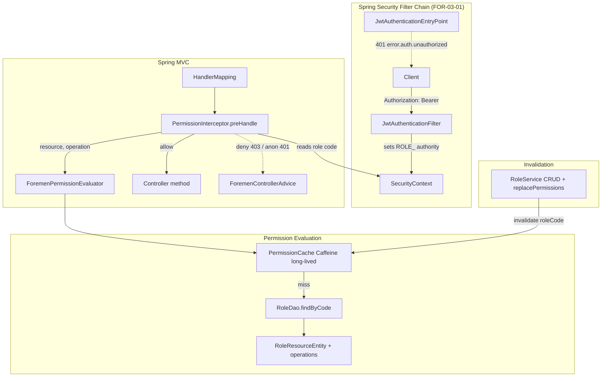
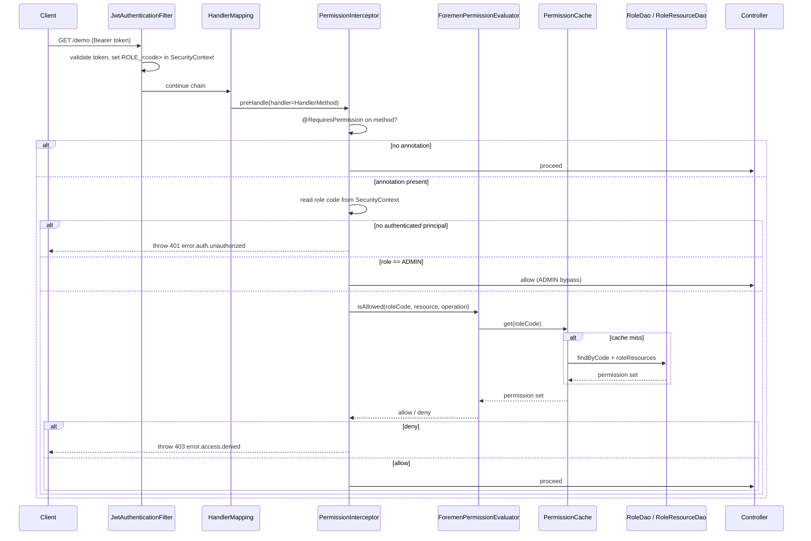
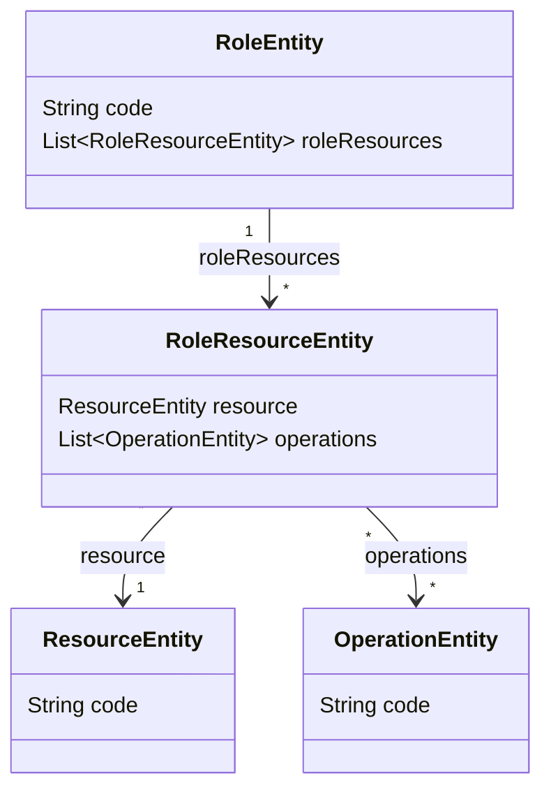

# Design Document: Permission Evaluator (FOR-03-03-permission-evaluator)

## Overview

This design defines the runtime permission-enforcement mechanism for the Foremen RBAC model. It answers the question "does the current user's role hold operation Y on resource Z?" and enforces the answer before a protected controller method runs.

The mechanism has four parts:
1. **`@RequiresPermission(resource, operation)`** — a runtime annotation declaring what a protected endpoint needs.
2. **`ForemenPermissionEvaluator`** — a service that loads a role's permission set from the database (via the FOR-02-03 ABAC entities) and decides allow/deny, applying the ADMIN bypass.
3. **`PermissionInterceptor`** — a Spring `HandlerInterceptor` (registered by a `WebMvcConfigurer`) that reads the current authentication from the `SecurityContext`, reads the method-level `@RequiresPermission` on the matched handler, and enforces it before the controller method executes.
4. **`PermissionCache`** — a dedicated, long-lived Caffeine cache mapping role code → permission set, sized to hold every role with a 24-hour idle (`expireAfterAccess`) safety net, kept fresh by explicit invalidation when a role's matrix changes.

This spec DELIVERS the mechanism plus its tests and a single demonstrative annotated endpoint. It does NOT migrate the existing controllers off `permitAll()` (FOR-03-08) and does NOT implement project-ownership filtering (FOR-03-04).

### Key Design Decisions

| Decision | Rationale |
|----------|-----------|
| **HandlerInterceptor** (not AOP `@Aspect`) | The OVERVIEW suggests a `HandlerInterceptor`. It is the natural Spring MVC hook that runs after handler mapping and before the controller method, has direct access to the matched `HandlerMethod` (so it can read the method-level `@RequiresPermission` on the matched handler method), and needs no extra AOP dependency. An AOP aspect would work too but couples enforcement to Spring bean proxying and cannot see MVC routing metadata as cleanly. We pick the interceptor and register it via `WebMvcConfigurer`. |
| **Lookup by role CODE, not roleId** | The JWT `role` claim (and the resulting `ROLE_<code>` authority) carries the role CODE, not the id. `RoleDao.findByCode(String)` already exists (added in a prior spec), so the evaluator resolves the role by code and reads its `roleResources`. No new DAO query is required. |
| **Cache key = role code** | The evaluator only ever has the role code at request time (from the authority). Keying the cache by code avoids an extra id lookup and matches the invalidation touch point, which also knows the role's code. |
| **Dedicated, long-lived Caffeine cache** | A role's permission matrix changes rarely and every change explicitly invalidates the affected entry (Requirement 9), so a short write-based TTL only adds needless DB reloads. The permission cache is a dedicated `Caffeine<String, PermissionSet>` (separate from the global `CacheManager`'s 10-minute spec) sized to hold every role (`maximumSize` well above the role count) with `expireAfterAccess(24h)` as a safety net for a missed invalidation. Explicit `invalidate(roleCode)` is the authoritative freshness mechanism; there is no `expireAfterWrite`. |
| **Deny-by-default** | Any role that does not resolve, has no entry for the resource, or has the resource but not the operation, is denied. Only an exact (resource, operation) membership or the ADMIN bypass grants access. |
| **ADMIN bypass by exact code match** | A role code equal to the literal `ADMIN` short-circuits to allow before any matrix lookup, matching the OVERVIEW and FOR-03-04's `isCallerAdmin()` convention. |
| **401 vs 403 ordering** | The Spring Security filter chain runs before MVC interceptors. Because FOR-03-08 has not yet tightened `SecurityConfig` rules, an anonymous request to a protected path is not guaranteed to be stopped by `authenticated()`. Therefore the interceptor itself rejects an unauthenticated request to a `@RequiresPermission` endpoint with 401 (`error.auth.unauthorized`) as a defensive fallback, while the existing `JwtAuthenticationEntryPoint` remains the primary 401 producer once FOR-03-08 protects the paths. This guarantees a protected annotated endpoint is never reachable anonymously regardless of the filter-chain rule state. |
| **Invalidation hook, not full wiring** | This spec documents and wires the eviction into `RoleService`'s mutation points — `replacePermissions`, `deleteById`, `update`/`updateAll`, and `create` — all keyed by role code (delete captures the code before removal). It does not perform the broader FOR-03-08 controller migration. |

### Research Findings

| Topic | Finding |
|-------|---------|
| `HandlerInterceptor.preHandle` timing | Runs after `HandlerMapping` resolves the handler and before the controller method; returning `false` (or throwing) stops the controller from executing. The `handler` argument is a `HandlerMethod` for controller endpoints, exposing `getMethodAnnotation` and `getBeanType` for reading annotations. |
| Reading effective annotation | `HandlerMethod.getMethodAnnotation(RequiresPermission.class)` returns the method-level annotation and is proxy-safe (resolves through bridged methods). The annotation targets methods only, so there is no type-level lookup; a handler without the method-level annotation is treated as unannotated. |
| Registering an interceptor | Implement `WebMvcConfigurer.addInterceptors(InterceptorRegistry)` and call `registry.addInterceptor(...)`. Non-`HandlerMethod` handlers (static resources) are skipped naturally because they carry no annotation. |
| Reading role from SecurityContext | `SecurityContextHolder.getContext().getAuthentication()` yields the token set by `JwtAuthenticationFilter`; its single authority is `ROLE_<code>`. Strip the `ROLE_` prefix to recover the role code. An unauthenticated context is either `null` authentication or an unauthenticated/anonymous token. |
| Caffeine standalone cache | `Caffeine.newBuilder().expireAfterAccess(Duration.ofMinutes(idleTtlMinutes)).maximumSize(n).build()` gives a per-instance idle expiry independent of the shared `CacheManager` spec, plus `invalidate(key)` for eviction. Using `expireAfterAccess` (not `expireAfterWrite`) keeps hot roles cached indefinitely while letting truly idle entries drop; explicit invalidation handles all correctness-relevant changes. |
| Exception translation | Throwing `ForemenApiException(HttpStatus.FORBIDDEN, "error.access.denied")` from `preHandle` is handled by the existing `ForemenControllerAdvice`, producing the standard `ErrorResponse` body with the localized message. |

## Architecture



### Request-Flow Sequence



### Package Structure

```
com.foremen
├── config/
│   └── security/
│       ├── RequiresPermission.java          (annotation)
│       ├── PermissionInterceptor.java        (HandlerInterceptor)
│       ├── PermissionInterceptorConfig.java  (WebMvcConfigurer registration)
│       └── PermissionProperties.java         (foremen.permission.cache-ttl-minutes)
├── service/
│   └── permission/
│       ├── ForemenPermissionEvaluator.java   (evaluation service)
│       ├── PermissionCache.java              (dedicated Caffeine, 24h idle)
│       └── PermissionSet.java                (immutable role permission set)
└── controller/
    └── (demonstrative test-only controller lives under src/test, see Testing Strategy)
```

## Components and Interfaces

### 1. `@RequiresPermission` annotation (`com.foremen.config.security.RequiresPermission`)

```java
package com.foremen.config.security;

import java.lang.annotation.ElementType;
import java.lang.annotation.Retention;
import java.lang.annotation.RetentionPolicy;
import java.lang.annotation.Target;

@Retention(RetentionPolicy.RUNTIME)
@Target(ElementType.METHOD)
public @interface RequiresPermission {
    String resource();
    String operation();
}
```

### 2. `PermissionSet` (`com.foremen.service.permission.PermissionSet`)

An immutable value holding one role's granted (resource, operation) pairs. Membership is an exact string match.

```java
package com.foremen.service.permission;

import java.util.Set;

public record PermissionSet(Set<String> grants) {   // grants hold "RESOURCE:OPERATION" keys

    public static String key(String resource, String operation) {
        return resource + ":" + operation;
    }

    public boolean allows(String resource, String operation) {
        return grants.contains(key(resource, operation));
    }

    public static PermissionSet empty() {
        return new PermissionSet(Set.of());
    }
}
```

### 3. `PermissionCache` (`com.foremen.service.permission.PermissionCache`)

Dedicated, long-lived Caffeine cache independent of the global `CacheManager`: sized to hold every role, with a 24-hour idle (`expireAfterAccess`) safety net and no write-based expiry. Provides `get(roleCode, loader)` and `invalidate(roleCode)`; explicit invalidation is the primary freshness mechanism.

```java
package com.foremen.service.permission;

import com.github.benmanes.caffeine.cache.Cache;
import com.github.benmanes.caffeine.cache.Caffeine;
import com.foremen.config.security.PermissionProperties;
import org.springframework.stereotype.Component;

import java.time.Duration;
import java.util.function.Function;

@Component
public class PermissionCache {

    private final Cache<String, PermissionSet> cache;

    public PermissionCache(PermissionProperties properties) {
        this.cache = Caffeine.newBuilder()
                .expireAfterAccess(Duration.ofMinutes(properties.cacheTtlMinutes()))
                .maximumSize(1_000)
                .build();
    }

    public PermissionSet get(String roleCode, Function<String, PermissionSet> loader) {
        return cache.get(roleCode, loader);
    }

    public void invalidate(String roleCode) {
        cache.invalidate(roleCode);
    }
}
```

### 4. `PermissionProperties` (`com.foremen.config.security.PermissionProperties`)

`@ConfigurationProperties(prefix = "foremen.permission")` record binding `cache-ttl-minutes` (the idle expiry / `expireAfterAccess`) with a default of 1440 (24 hours). Fail-fast validation with `@Positive`. Because the `integration-test` and `integration` Spring profiles are used for full-context tests, the property is given a code-level default so those profiles start without explicit config; if an explicit value is added, it must also be provided in `application-integration-test.yml` and `application-integration.yml`.

```java
package com.foremen.config.security;

import jakarta.validation.constraints.Positive;
import org.springframework.boot.context.properties.ConfigurationProperties;
import org.springframework.validation.annotation.Validated;

@Validated
@ConfigurationProperties(prefix = "foremen.permission")
public record PermissionProperties(@Positive Integer cacheTtlMinutes) {
    public PermissionProperties {
        if (cacheTtlMinutes == null) {
            cacheTtlMinutes = 1440; // 24h idle safety net
        }
    }
}
```

### 5. `ForemenPermissionEvaluator` (`com.foremen.service.permission.ForemenPermissionEvaluator`)

Loads a role's `PermissionSet` (via cache) and decides allow/deny, applying the ADMIN bypass.

```java
package com.foremen.service.permission;

import com.foremen.dao.RoleDao;
import com.foremen.dao.model.RoleEntity;
import com.foremen.dao.model.RoleResourceEntity;
import lombok.RequiredArgsConstructor;
import org.springframework.stereotype.Service;
import org.springframework.transaction.annotation.Transactional;

import java.util.HashSet;
import java.util.Set;

@Service
@RequiredArgsConstructor
public class ForemenPermissionEvaluator {

    public static final String ADMIN_ROLE_CODE = "ADMIN";

    private final RoleDao roleDao;
    private final PermissionCache cache;

    public boolean isAllowed(String roleCode, String resource, String operation) {
        if (ADMIN_ROLE_CODE.equals(roleCode)) {
            return true; // ADMIN bypass
        }
        PermissionSet set = cache.get(roleCode, this::loadPermissionSet);
        return set.allows(resource, operation);
    }

    @Transactional(readOnly = true)
    protected PermissionSet loadPermissionSet(String roleCode) {
        RoleEntity role = roleDao.findByCode(roleCode).orElse(null);
        if (role == null) {
            return PermissionSet.empty(); // unknown role -> deny
        }
        Set<String> grants = new HashSet<>();
        for (RoleResourceEntity rr : role.getRoleResources()) {
            String resourceCode = rr.getResource().getCode();
            rr.getOperations().forEach(op ->
                    grants.add(PermissionSet.key(resourceCode, op.getCode())));
        }
        return new PermissionSet(grants);
    }
}
```

### 6. `PermissionInterceptor` (`com.foremen.config.security.PermissionInterceptor`)

Reads the effective `@RequiresPermission`, reads the role code from the `SecurityContext`, and enforces.

```java
package com.foremen.config.security;

import com.foremen.exception.ForemenApiException;
import com.foremen.service.permission.ForemenPermissionEvaluator;
import lombok.RequiredArgsConstructor;
import org.springframework.http.HttpStatus;
import org.springframework.security.core.Authentication;
import org.springframework.security.core.GrantedAuthority;
import org.springframework.security.core.context.SecurityContextHolder;
import org.springframework.stereotype.Component;
import org.springframework.web.method.HandlerMethod;
import org.springframework.web.servlet.HandlerInterceptor;

import jakarta.servlet.http.HttpServletRequest;
import jakarta.servlet.http.HttpServletResponse;

@Component
@RequiredArgsConstructor
public class PermissionInterceptor implements HandlerInterceptor {

    private static final String ROLE_PREFIX = "ROLE_";

    private final ForemenPermissionEvaluator evaluator;

    @Override
    public boolean preHandle(HttpServletRequest request, HttpServletResponse response, Object handler) {
        if (!(handler instanceof HandlerMethod handlerMethod)) {
            return true; // static resources etc.
        }
        RequiresPermission required = methodAnnotation(handlerMethod);
        if (required == null) {
            return true; // unannotated endpoint -> no check
        }
        String roleCode = currentRoleCode();
        if (roleCode == null) {
            // Defensive 401: annotated endpoint reached without authentication
            throw new ForemenApiException(HttpStatus.UNAUTHORIZED, "error.auth.unauthorized");
        }
        if (!evaluator.isAllowed(roleCode, required.resource(), required.operation())) {
            throw new ForemenApiException(HttpStatus.FORBIDDEN, "error.access.denied");
        }
        return true;
    }

    private RequiresPermission methodAnnotation(HandlerMethod handlerMethod) {
        return handlerMethod.getMethodAnnotation(RequiresPermission.class);
    }

    private String currentRoleCode() {
        Authentication auth = SecurityContextHolder.getContext().getAuthentication();
        if (auth == null || !auth.isAuthenticated() || auth.getPrincipal() == null
                || "anonymousUser".equals(auth.getPrincipal())) {
            return null;
        }
        for (GrantedAuthority ga : auth.getAuthorities()) {
            String a = ga.getAuthority();
            if (a != null && a.startsWith(ROLE_PREFIX)) {
                return a.substring(ROLE_PREFIX.length());
            }
        }
        return null;
    }
}
```

### 7. `PermissionInterceptorConfig` (`com.foremen.config.security.PermissionInterceptorConfig`)

```java
package com.foremen.config.security;

import lombok.RequiredArgsConstructor;
import org.springframework.boot.context.properties.EnableConfigurationProperties;
import org.springframework.context.annotation.Configuration;
import org.springframework.web.servlet.config.annotation.InterceptorRegistry;
import org.springframework.web.servlet.config.annotation.WebMvcConfigurer;

@Configuration
@EnableConfigurationProperties(PermissionProperties.class)
@RequiredArgsConstructor
public class PermissionInterceptorConfig implements WebMvcConfigurer {

    private final PermissionInterceptor permissionInterceptor;

    @Override
    public void addInterceptors(InterceptorRegistry registry) {
        registry.addInterceptor(permissionInterceptor);
    }
}
```

### 8. Cache invalidation touch points in `RoleService`

The Permission_Cache is keyed by role code, so the cache MUST be evicted at every `RoleService` mutation point that changes what a role code resolves to. `RoleService` currently uses the default `AdminService` implementations for `create`, `update`, and `updateAll`, and overrides `deleteById` and `replacePermissions` (plus `validateUpdate`). It already uses `@RequiredArgsConstructor` + `@Getter` and implements `AdminService`. The clean approach is to add the eviction into the existing overridden `deleteById`, and to override `update`/`updateAll` (and `afterCreate`/`create`) so each adds the eviction. `RoleService` gains a `PermissionCache` dependency. Scope is limited to `RoleService`; no FOR-03-08 controller migration is performed.

The touch points:

- **`replacePermissions(...)`** — after `roleResourceDao.saveAll` + flush, call `permissionCache.invalidate(role.getCode())`. `batchReplacePermissions` inherits this because it delegates to `replacePermissions`.
- **`deleteById(id)`** — capture `String code = role.getCode()` after loading the role and BEFORE `dao.deleteById(id)`, then call `permissionCache.invalidate(code)` after the delete + flush. Capturing the code before deletion is required because the entity is no longer readable afterward.
- **`update` / `updateAll`** — `RoleService` currently uses the default `AdminService` implementations. Because `updateAll` delegates to `update`, overriding `update` alone covers both. Override `update` to call `permissionCache.invalidate(...)` after the update, using the affected code from the returned `RoleServiceExtendedModel.code()`. Because `RoleUpdateRequest` exposes no `code` field, the DTO cannot change a role's `code`, so the affected code equals the existing role's code.
- **`create`** — a newly created role starts with an empty matrix, but a previously-cached empty/deny entry for a reused code could linger, so evict defensively. If `AdminService` exposes an `afterCreate(DaoModel)` hook (added in FOR-03-02 task 11.1), override it to invalidate the created role's code.

```java
// inside RoleService.replacePermissions(...), after roleResourceDao.saveAll + flush:
permissionCache.invalidate(role.getCode());

// overridden deleteById: capture the code BEFORE deletion
@Override
public void deleteById(Long id) {
    RoleEntity role = dao.findById(id).orElseThrow(/* existing not-found handling */);
    String code = role.getCode();
    dao.deleteById(id);
    dao.flush();
    permissionCache.invalidate(code);
}

// defensive eviction after creation via the AdminService afterCreate hook
@Override
public void afterCreate(RoleEntity role) {
    permissionCache.invalidate(role.getCode());
}

// Override update to evict the affected role's code; updateAll delegates to update, so it is covered too.
@Override
public RoleServiceExtendedModel update(Long id, RoleServiceExtendedModel model) {
    RoleServiceExtendedModel updated = AdminService.super.update(id, model);
    permissionCache.invalidate(updated.code());
    return updated;
}
```

## Data Models

This spec introduces no new persistent tables or entities. It reads the existing FOR-02-03 ABAC schema.

### Entities read (existing)



### In-memory model

- **`PermissionSet`** — `record PermissionSet(Set<String> grants)` where each grant is the string `"<RESOURCE_CODE>:<OPERATION_CODE>"`. Immutable; `allows(resource, operation)` is an exact-membership test.
- **`PermissionCache` entries** — key: `roleCode` (String); value: `PermissionSet`; retention: until explicit invalidation, with a 24-hour idle (`expireAfterAccess`) safety net; sized to hold every role.

### Permission derivation (read path)

| Source column | Mapped to |
|---------------|-----------|
| `roles.code` (via `RoleDao.findByCode`) | cache key / ADMIN comparison |
| `role_resources` → `resources.code` | resource part of a grant key |
| `role_resource_operations` → `operations.code` | operation part of a grant key |

## Correctness Properties

*A property is a characteristic or behavior that should hold true across all valid executions of a system — essentially, a formal statement about what the system should do. Properties serve as the bridge between human-readable specifications and machine-verifiable correctness guarantees.*

The prework classified each acceptance criterion. Criteria 1.1, 2.1, and 2.2 collapse into a single membership-equivalence property; 2.3 is kept as an explicit deny-by-default guarantee; the ADMIN criteria (3.1, 3.2) combine into one property while the exact-match rule (3.3) is separate; annotation-structure (4.1, 4.2), resolution (4.3, 4.4), before-controller behavior (5.1–5.3), error mapping (6.1, 6.2, 7.1, 7.2), the demonstrative endpoint (11.x), retention/eviction behavior (8.3, 8.4) are covered by example, integration, edge-case, or smoke tests in the Testing Strategy rather than by properties.

### Property 1: Decision equals matrix membership (deny by default)

*For any* non-ADMIN role code and *any* generated permission matrix, and *for any* (resource code, operation code) pair, `ForemenPermissionEvaluator.isAllowed` returns an allow decision if and only if the derived permission set contains that exact (resource, operation) pair; when the resource is absent, or present without the operation, the decision is deny.

**Validates: Requirements 1.1, 2.1, 2.2**

### Property 2: Permission set derivation from the role graph

*For any* generated RoleEntity whose `roleResources` reference resource codes and operation codes, the permission set produced by the load path contains exactly the set of (resourceCode, operationCode) pairs obtained by flattening each RoleResourceEntity's resource code against each of its operation codes — no more, no fewer.

**Validates: Requirements 1.2**

### Property 3: An empty permission set denies everything

*For any* non-ADMIN role code whose permission set is empty and *for any* (resource code, operation code) pair, `ForemenPermissionEvaluator.isAllowed` returns a deny decision.

**Validates: Requirements 2.3**

### Property 4: ADMIN is always allowed

*For any* (resource code, operation code) pair and *for any* permission matrix (including one that would otherwise deny), when the role code equals `ADMIN`, `ForemenPermissionEvaluator.isAllowed` returns an allow decision.

**Validates: Requirements 3.1, 3.2**

### Property 5: ADMIN bypass requires an exact code match

*For any* string that is a near-miss of `ADMIN` (differing by case, surrounding whitespace, or extra characters) and *for any* (resource, operation) pair evaluated against an empty matrix, `ForemenPermissionEvaluator.isAllowed` returns a deny decision; only the exact literal `ADMIN` is bypassed.

**Validates: Requirements 3.3**

### Property 6: Grants match resource and operation codes exactly

*For any* single granted (resource code R, operation code O), `PermissionSet.allows(R2, O2)` returns true if and only if R2 equals R and O2 equals O exactly; any case-differing or otherwise distinct pair returns false.

**Validates: Requirements 1.4**

### Property 7: Role code is extracted from the ROLE_ authority

*For any* role code, when the SecurityContext holds an authenticated token whose single authority is `ROLE_<roleCode>`, the PermissionInterceptor evaluates the request using exactly that role code.

**Validates: Requirements 5.4**

### Property 8: A cache hit serves without reloading

*For any* role code and *for any* number of repeated evaluations `N ≥ 1` performed without an intervening invalidation and while the entry remains cached, the permission set is loaded from the database exactly once and every subsequent evaluation is served from the Permission_Cache.

**Validates: Requirements 8.2**

### Property 9: Invalidation forces a reload (invalidation round-trip)

*For any* role code, after an initial evaluation caches the set, invalidating the entry for that role code (via any RoleService touch point) causes the next evaluation to reload from the database.

**Validates: Requirements 9.1, 9.2, 9.3, 9.4, 9.5**

### Property 10: Authorization message codes are localized in PL and RU

*For any* code in the set { `error.access.denied`, `error.auth.unauthorized` }, both the Polish base bundle (`messages.properties`) and the Russian bundle (`messages_ru.properties`) contain a non-blank entry for that code.

**Validates: Requirements 10.1, 10.2**

## Error Handling

| Condition | HTTP status | Message code | Producer |
|-----------|-------------|--------------|----------|
| Authenticated caller lacks the required permission | 403 | `error.access.denied` | `PermissionInterceptor` throws `ForemenApiException`, translated by `ForemenControllerAdvice` |
| Annotated endpoint reached with no authenticated principal (defensive fallback) | 401 | `error.auth.unauthorized` | `PermissionInterceptor` throws `ForemenApiException` |
| Unauthenticated request stopped by the security filter chain (once FOR-03-08 protects paths) | 401 | `error.auth.unauthorized` | `JwtAuthenticationEntryPoint` (existing) |
| Role code does not resolve to a role | 403 | `error.access.denied` | Evaluator returns deny (empty set); interceptor throws 403 |
| Missing/invalid `foremen.permission.cache-ttl-minutes` (non-positive) | startup failure | — | `@Validated @ConfigurationProperties` fail-fast |

Notes:
- `error.access.denied` and `error.auth.unauthorized` already exist in both `messages.properties` and `messages_ru.properties` (added in FOR-01-03 / FOR-03-01). This spec asserts their presence via Property 10 and does not need to add new codes, but the localization test guards against regressions.
- The interceptor throws exceptions rather than writing responses directly, so denied and unauthenticated outcomes flow through the same `ErrorResponse` pipeline as the rest of the application.

## Testing Strategy

Property-based testing IS appropriate for this feature's core: the evaluator and the permission-set derivation are pure, input-varying logic with clear universal properties (membership equivalence, deny-by-default, ADMIN bypass, exact matching, caching idempotence/round-trip). MVC enforcement, error mapping, ordering, and message wiring are covered by example, integration, edge-case, and smoke tests.

### Dual Testing Approach

- **Property tests (jqwik)** validate the universal properties above. Files named `*PropertyTest.java`, `@Property(tries = 100)` minimum, each tagged `// Feature: FOR-03-03-permission-evaluator, Property N: ...` and referencing the design property it implements. A named library (jqwik, already used in FOR-03-01/FOR-02-03) is used; property tests are not implemented from scratch.
- **Unit / example tests (JUnit 5)** cover the annotation's reflective structure (4.1, 4.2), method-over-type resolution (4.3, 4.4), the interceptor's 401/403 throwing (6.1, 7.2), cache miss loading (8.1), and the no-annotation pass-through (5.3).
- **Integration tests (@SpringBootTest + Testcontainers postgres + Spring Security Test, `@ActiveProfiles("integration-test")`)** exercise the demonstrative annotated endpoint end to end (11.1–11.3), the before-controller guarantee (5.1, 5.2), the localized 403 body (6.2, 10.3), and the 401 ordering (7.1). The invalidation round-trip is exercised for both a permission change (`replacePermissions`) and a role deletion (`deleteById`) at minimum, confirming the next evaluation reloads from the database.
- **Edge-case tests** cover unknown-role deny (1.3) and retention/eviction behavior (8.3, 8.4) using a Caffeine test ticker to assert idle expiry occurs only after the idle TTL and that capacity holds every role.
- **Smoke tests** assert the cache is a dedicated instance sized to hold every role with a 24-hour idle safety net (no short write-based expiry), that the default idle TTL is 1440 minutes, and the demonstrative controller is annotated (11.1).

### Property → Requirement Coverage

| Property | Requirements |
|----------|--------------|
| 1 Decision equals matrix membership | 1.1, 2.1, 2.2 |
| 2 Permission set derivation | 1.2 |
| 3 Empty set denies everything | 2.3 |
| 4 ADMIN always allowed | 3.1, 3.2 |
| 5 ADMIN exact match | 3.3 |
| 6 Grants match exactly | 1.4 |
| 7 Role code from ROLE_ authority | 5.4 |
| 8 Cache hit serves without reload | 8.2 |
| 9 Invalidation round-trip | 9.1, 9.2, 9.3, 9.4, 9.5 |
| 10 PL/RU localization | 10.1, 10.2 |

### Configuration and profile note

`PermissionProperties` carries a code-level default (1440 minutes / 24 hours idle), so the `integration-test` and `integration` profiles start without new config. If a project chooses to set `foremen.permission.cache-ttl-minutes` explicitly, that key MUST also be added to `application-integration-test.yml` and `application-integration.yml` to keep full-context tests booting, per the FOR-03-01 profile convention.

### Property Test Configuration

- Minimum 100 iterations per property test (jqwik `@Property(tries = 100)`).
- Each property test references its design property number in a tag comment.
- Tag format: `// Feature: FOR-03-03-permission-evaluator, Property N: <property text>`.
- Each correctness property is implemented by a single property-based test.
