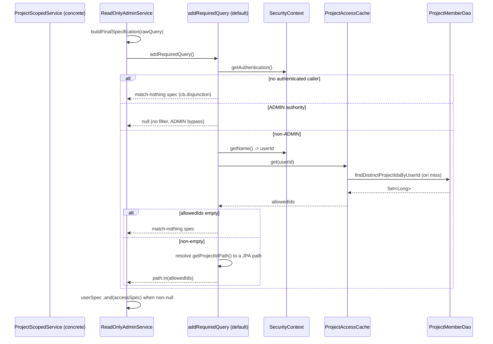
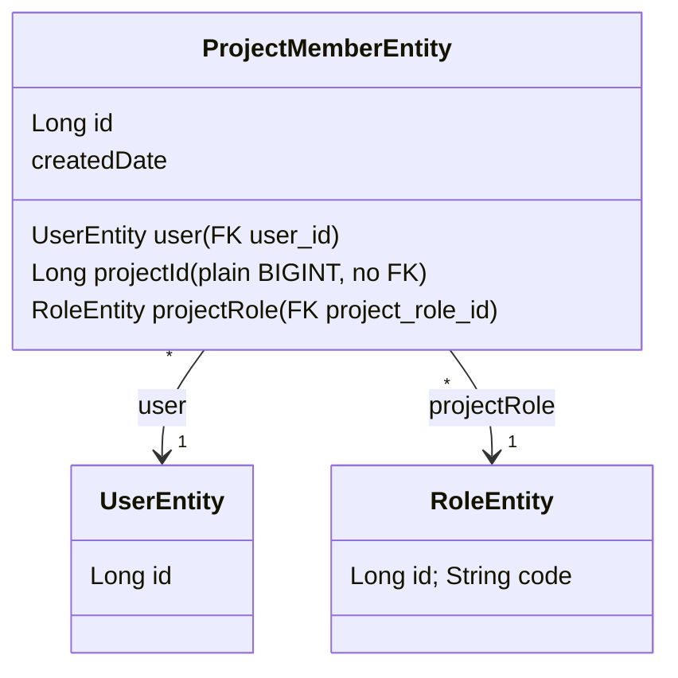

# Design Document: Project Ownership (FOR-03-04-project-ownership)

## Overview

This design defines the project-scoping infrastructure for the Foremen backend. It answers, for the currently authenticated user, "which projects may this user see?" and applies that answer automatically as a SQL-level filter to every read that flows through the CRUD framework's `addRequiredQuery()` extension point, with an ADMIN bypass that sees everything.

The feature has seven moving parts:

1. **`project_members` schema** (`014-create-project-members.xml`) — a table linking a user to a project (a plain `BIGINT`, no FK, since `projects` arrives in FOR-06) under a project role (FK to `roles`), unique on `(user_id, project_id)`.
2. **`ProjectMemberEntity` + `ProjectMemberDao`** — the JPA mapping plus a query that loads the distinct set of project ids for a user id.
3. **`ProjectMemberService`** — assign / remove / list-members / list-projects, raising `ForemenApiException` for duplicates (409), unknown roles (404), and missing memberships (404), and invalidating the project-access cache on every mutation.
4. **`ProjectMemberController`** (`/api/project-members`) — the four operations over REST, each protected by `@RequiresPermission(PROJECT_MEMBERS, ...)` from FOR-03-03.
5. **`PROJECT_MEMBERS` ABAC seed** (`015-seed-project-members-resource.xml`) — the resource row plus per-system-role grants (ADMIN/MANAGER full CRUD, FOREMAN/FINANCIER READ, WORKER/CLIENT none).
6. **`ProjectAccessCache` + `ProjectAccessProperties`** — a long-lived Caffeine cache `userId → Set<Long>` mirroring the FOR-03-03 `PermissionCache` / `PermissionProperties` design exactly, kept fresh by explicit per-user invalidation.
7. **`ProjectScopedService`** — the interface mixin that houses ALL the filtering decision logic in one default `addRequiredQuery()`, leaving `getProjectIdPath()` as the single per-entity override point, plus the cache-invalidation wiring on membership change (`ProjectMemberService`) and role change (`UserService`).

This spec DELIVERS the mechanism plus its tests. It does NOT create the `projects` table or any real project entity/service (FOR-06), and does NOT migrate the other existing controllers off `permitAll()` (FOR-03-08). The project-scoping filter is proven end to end against a **test-only `@Entity` fixture** that implements `ProjectScopedService`, since no real project entity exists yet.

### Key Design Decisions

| Decision | Rationale |
|----------|-----------|
| **`project_id` is a plain `BIGINT`, no FK** | The `projects` table does not exist in this spec; it arrives in FOR-06. Modeling the column without a foreign key lets membership be stored now and lets FOR-06 add the FK later. `project_role_id` DOES get an FK to `roles(id)`, because `roles` already exists. |
| **Unique `(user_id, project_id)`** | A user holds at most one membership per project, so the natural key is the pair. This is enforced at the DB level (Requirement 1.5) so duplicate assignment fails deterministically, and the service also pre-checks to raise a friendly 409 rather than a raw constraint violation. |
| **Project role is a `RoleEntity` reference, not a new enum** | The role model (`ADMIN`, `MANAGER`, `FOREMAN`, `WORKER`, `FINANCIER`, `CLIENT`) already exists as seeded `roles` rows. A `@ManyToOne RoleEntity` (join `project_role_id`) reuses it, mirroring `UserEntity.role`. |
| **All decision logic in ONE default `addRequiredQuery()`** | Requirement 6.8 mandates the ADMIN-bypass / no-auth / empty-set / non-empty-IN decision be written once on the interface. Concrete services get correct filtering for free; the only thing they override is `getProjectIdPath()` (Requirement 6.9, 6.10). This keeps the security-critical logic in a single audited place. |
| **`getProjectIdPath()` has NO default** | Making it abstract (no default body) forces every concrete project-scoped service to declare its path explicitly. A silent wrong default would be a security hole (filtering the wrong column), so the compiler is used to demand the decision. |
| **Own ADMIN check, not `ReadOnlyAdminService.isCallerAdmin()`** | `ReadOnlyAdminService.isCallerAdmin()` is `private`, so it cannot be reused from the mixin. `ProjectScopedService` performs its OWN exact-authority match against `ROLE_ADMIN` or `ADMIN` (Requirement 6.7), identical in behavior to the private method. The literal `ADMIN` is taken from the existing `ForemenPermissionEvaluator.ADMIN_ROLE_CODE` constant to avoid a second magic string. |
| **Empty allowed set → match-nothing spec (not `null`)** | Returning `null` means "no filter" (ADMIN semantics). A non-ADMIN caller with no memberships must see NO rows, so the mixin returns a Specification that is always false (`cb.disjunction()`), which `buildFinalSpecification` `.and()`s in (Requirement 6.3, 6.6). |
| **No-auth → match-nothing (defensive)** | If the SecurityContext holds no authenticated caller, the safe default is to reveal nothing rather than everything (Requirement 6.6). This mirrors the FOR-03-03 defensive posture. |
| **Cache value is `Set<Long>`, self-loading** | Unlike `PermissionCache.get(key, loader)`, `ProjectAccessCache.get(userId)` self-loads via an injected `ProjectMemberDao` so callers just call `get(userId)`. The build (`expireAfterAccess`, `maximumSize(1_000)`) mirrors `PermissionCache` exactly (Requirement 4). |
| **Long-lived cache kept fresh by invalidation** | Membership/role changes are rare and each explicitly evicts the affected user (Requirement 8). A short write TTL would only add needless DB reloads; the TTL is an idle safety net only, defaulting to 1440 minutes, mirroring the FOR-03-03 `PermissionCache` decision (Requirement 4.4, 4.5). |
| **Invalidate on role change in `UserService`** | A user's system role changing can change what ADMIN-bypass / access they get; the documented touch point is `UserService`'s update path, which evicts the affected userId (Requirement 8.4). |
| **`projectId` in body/query, never in path** | No `projects` table exists, so there is no canonical `/projects/{id}/...` hierarchy yet. Endpoints carry `projectId` in the request body (assign) or as a query param (remove, list-members), keeping the URL stable when FOR-06 introduces real projects (Requirement 10.1). |
| **Test-only `@Entity` fixture** | No real project-scoped entity exists yet, so end-to-end filtering is proven against a throwaway `@Entity` under `src/test` that implements `ProjectScopedService`. This isolates the mechanism from FOR-06 and keeps the fixture out of production. |

### Research Findings

| Topic | Finding |
|-------|---------|
| `addRequiredQuery()` combination | `ReadOnlyAdminService.buildFinalSpecification(rawQuery)` calls `parseSpecification(rawQuery)` for the user query and `addRequiredQuery()` for the access spec; when the access spec is non-`null` it returns `Specification.where(userSpec).and(accessSpec)`, otherwise just `userSpec`. This same final spec feeds `find`, `findExtended`, and `getCount` (verified in source), so overriding `addRequiredQuery()` filters all three (Requirement 6.4). |
| `null` vs match-nothing | Because `buildFinalSpecification` only `.and()`s the access spec when it is non-`null`, returning `null` is exactly the ADMIN "no filter" semantics. A caller-sees-nothing outcome must be an actual false predicate, so the mixin uses `(root, query, cb) -> cb.disjunction()` (an OR of zero predicates, always false). |
| Reading the caller | `SecurityContextHolder.getContext().getAuthentication().getName()` returns the principal name, which the JWT layer sets to the `sub` claim = the userId as a String (Requirement 6.5). It is parsed with `Long.parseLong`; a non-numeric/absent value is treated as no-auth (match-nothing). |
| ADMIN detection | The private `ReadOnlyAdminService.isCallerAdmin()` matches any authority equal to `ROLE_ADMIN` or `ADMIN`. Since it is private, the mixin reproduces the same exact-match check over `auth.getAuthorities()` (Requirement 6.7), using `ForemenPermissionEvaluator.ADMIN_ROLE_CODE` for the bare `ADMIN` literal. |
| Nested path as JPA join | The Criteria API resolves a single segment via `root.get("projectId")`. A dotted path is resolved by `root.join(seg0).join(seg1)...` for every non-final segment and `.get(finalSeg)` for the last, then `path.in(allowedIds)`. This mirrors how `ReadOnlyAdminService.resolveI18nFilterField` already splits nested dotted paths on the last dot (verified in source). |
| Caffeine self-loading cache | `Caffeine.newBuilder().expireAfterAccess(Duration.ofMinutes(ttl)).maximumSize(1_000).build()` with `cache.get(key, loader)` gives a per-instance idle expiry and a load-on-miss; `invalidate(key)` evicts one entry. `ProjectAccessCache` wraps this so `get(userId)` supplies its own loader (a `ProjectMemberDao` query), matching `PermissionCache` (verified in source). |
| `@ConfigurationProperties` default | `PermissionProperties` is a `@Validated @ConfigurationProperties(prefix="foremen.permission") record(@Positive Integer cacheTtlMinutes)` whose compact constructor defaults `null → 1440`. `ProjectAccessProperties` mirrors this at prefix `foremen.project-access`, so `@Positive` aborts startup on a non-positive value and the code-level default keeps config-less profiles booting (Requirement 5). |
| Seed convention | `009-seed-audit-resource.xml` inserts the resource guarded by a `MARK_RAN` + `sqlCheck expectedResult="0"` precondition, then inserts `role_resources` via `SELECT r.id, res.id, NOW(), 'system' FROM roles r, resources res WHERE ...` and `role_resource_operations` via a join on `operations o ON o.code IN (...)`, each in its own `sqlCheck`-guarded changeSet. `007-seed-permissions.xml` shows multi-role/multi-operation seeding. `015` follows both (Requirement 11). |
| `RoleEntity` shape | `RoleEntity` (table `roles`) carries `code`, `nameRU`, `namePL`, `descriptionRU`, `descriptionPL`, `system`. `RoleDao.findByCode(String)` already exists and is reused for role resolution and code lookup in `ProjectMemberResponse.projectRoleCode`. |

## Architecture

```mermaid
flowchart TD
    subgraph Security["Spring Security (FOR-03-01/03)"]
        SC[SecurityContext: name=userId, authority ROLE_&lt;code&gt;]
    end

    subgraph CRUD["CRUD framework (FOR-01)"]
        ROS["ReadOnlyAdminService.buildFinalSpecification()"]
        ROS -->|and accessSpec when non-null| FIND["find / findExtended / getCount"]
    end

    subgraph Scoping["Project scoping (this spec)"]
        PSS["ProjectScopedService.addRequiredQuery() (default, all logic)"]
        PSS -->|reads userId + ADMIN authority| SC
        PSS -->|get(userId)| PAC[ProjectAccessCache Caffeine]
        PSS -->|getProjectIdPath()| PATH["concrete override e.g. project.id"]
        PAC -->|miss/self-load| PMD["ProjectMemberDao.findDistinctProjectIdsByUserId"]
    end

    subgraph Membership["Membership management (this spec)"]
        PMC["ProjectMemberController /api/project-members"] --> PMS[ProjectMemberService]
        PMS -->|assign/remove| PME[ProjectMemberEntity / project_members]
        PMS -->|invalidate(userId)| PAC
    end

    subgraph Invalidation
        US["UserService role-change path"] -->|invalidate(userId)| PAC
    end

    ROS -->|override on a ProjectScopedService| PSS
```

### Read-Filtering Sequence



### Package Structure

```
com.foremen
├── config/
│   └── security/
│       └── ProjectAccessProperties.java     (foremen.project-access.cache-ttl-minutes)
├── dao/
│   ├── ProjectMemberDao.java                (distinct project ids by user id)
│   └── model/
│       └── ProjectMemberEntity.java         (extends BaseEntity, maps project_members)
├── service/
│   ├── ProjectAccessCache.java              (Caffeine userId -> Set<Long>, self-loading)
│   ├── ProjectMemberService.java            (assign/remove/list + invalidate)
│   └── ProjectScopedService.java            (mixin: default addRequiredQuery + getProjectIdPath)
└── controller/
    ├── ProjectMemberController.java          (/api/project-members, @RequiresPermission)
    └── model/
        ├── AssignProjectMemberRequest.java   (userId, projectId, projectRoleId)
        └── ProjectMemberResponse.java        (id, userId, projectId, projectRoleId, projectRoleCode)

database_files/changesets/
├── 014-create-project-members.xml
└── 015-seed-project-members-resource.xml

src/test (fixture)
└── com.foremen.scoping.ScopedFixtureEntity + ScopedFixtureService (implements ProjectScopedService)
```

## Components and Interfaces

### 1. `ProjectMemberEntity` (`com.foremen.dao.model.ProjectMemberEntity`)

Extends `BaseEntity`, maps `project_members`. `UserEntity` and `RoleEntity` are `@ManyToOne(fetch = LAZY)` (consistent with `UserEntity.role`); `projectId` is a plain `BIGINT` with no association.

```java
package com.foremen.dao.model;

import jakarta.persistence.*;
import lombok.Getter;
import lombok.NoArgsConstructor;
import lombok.Setter;

@Entity
@Table(name = "project_members",
        uniqueConstraints = @UniqueConstraint(
                name = "uk_project_members_user_project",
                columnNames = {"user_id", "project_id"}))
@Getter
@Setter
@NoArgsConstructor
public class ProjectMemberEntity extends BaseEntity {

    @ManyToOne(fetch = FetchType.LAZY)
    @JoinColumn(name = "user_id", nullable = false)
    private UserEntity user;

    // Plain BIGINT: the projects table does not exist in this spec (arrives in FOR-06), so no FK/association.
    @Column(name = "project_id", nullable = false)
    private Long projectId;

    @ManyToOne(fetch = FetchType.LAZY)
    @JoinColumn(name = "project_role_id", nullable = false)
    private RoleEntity projectRole;
}
```

### 2. `ProjectMemberDao` (`com.foremen.dao.ProjectMemberDao`)

Extends `AdminDao` for standard persistence; adds the distinct-project-ids query used by the cache loader, plus lookups the service needs for duplicate detection, removal, and listing.

```java
package com.foremen.dao;

import com.foremen.dao.model.ProjectMemberEntity;
import org.springframework.data.jpa.repository.Query;
import org.springframework.data.repository.query.Param;
import org.springframework.stereotype.Repository;

import java.util.List;
import java.util.Optional;
import java.util.Set;

@Repository
public interface ProjectMemberDao extends AdminDao<ProjectMemberEntity, Long> {

    // Requirement 2.6 / 4.1: distinct project ids for a user, used by ProjectAccessCache loader.
    @Query("SELECT DISTINCT pm.projectId FROM ProjectMemberEntity pm WHERE pm.user.id = :userId")
    Set<Long> findDistinctProjectIdsByUserId(@Param("userId") Long userId);

    Optional<ProjectMemberEntity> findByUserIdAndProjectId(Long userId, Long projectId);

    boolean existsByUserIdAndProjectId(Long userId, Long projectId);

    List<ProjectMemberEntity> findByProjectId(Long projectId);
}
```

### 3. `ProjectAccessProperties` (`com.foremen.config.security.ProjectAccessProperties`)

Mirrors `PermissionProperties` exactly, at prefix `foremen.project-access`. `@Positive` fail-fast; compact constructor defaults `null → 1440` so config-less profiles boot.

```java
package com.foremen.config.security;

import jakarta.validation.constraints.Positive;
import org.springframework.boot.context.properties.ConfigurationProperties;
import org.springframework.validation.annotation.Validated;

@Validated
@ConfigurationProperties(prefix = "foremen.project-access")
public record ProjectAccessProperties(@Positive Integer cacheTtlMinutes) {
    public ProjectAccessProperties {
        if (cacheTtlMinutes == null) {
            cacheTtlMinutes = 1440; // 24h idle safety net; freshness comes from explicit invalidation
        }
    }
}
```

### 4. `ProjectAccessCache` (`com.foremen.service.ProjectAccessCache`)

Mirrors `PermissionCache`'s Caffeine build, but the value is `Set<Long>` and `get(userId)` self-loads from `ProjectMemberDao` so callers do not pass a loader.

```java
package com.foremen.service;

import com.foremen.config.security.ProjectAccessProperties;
import com.foremen.dao.ProjectMemberDao;
import com.github.benmanes.caffeine.cache.Cache;
import com.github.benmanes.caffeine.cache.Caffeine;
import org.springframework.stereotype.Component;

import java.time.Duration;
import java.util.Set;

@Component
public class ProjectAccessCache {

    private final Cache<Long, Set<Long>> cache;
    private final ProjectMemberDao projectMemberDao;

    public ProjectAccessCache(ProjectAccessProperties properties, ProjectMemberDao projectMemberDao) {
        this.projectMemberDao = projectMemberDao;
        this.cache = Caffeine.newBuilder()
                .expireAfterAccess(Duration.ofMinutes(properties.cacheTtlMinutes()))
                .maximumSize(1_000)
                .build();
    }

    /** Returns the user's allowed project ids, self-loading from the DB on a miss (Req 4.1-4.3). */
    public Set<Long> get(Long userId) {
        return cache.get(userId, projectMemberDao::findDistinctProjectIdsByUserId);
    }

    /** Evicts one user's entry so the next get reloads from the DB (Req 8.1, 8.2, 8.5). */
    public void invalidate(Long userId) {
        cache.invalidate(userId);
    }
}
```

### 5. `ProjectScopedService` (`com.foremen.service.ProjectScopedService`)

The mixin. It carries the ENTIRE decision logic in the default `addRequiredQuery()` (Requirement 6.8) and declares `getProjectIdPath()` with no default as the single override point (Requirement 6.9). A concrete service implements both `ReadOnlyAdminService` (for the CRUD reads) and `ProjectScopedService` (for the filter). Because `addRequiredQuery()` here overrides the `ReadOnlyAdminService` default, `buildFinalSpecification` picks it up automatically.

```java
package com.foremen.service;

import com.foremen.service.permission.ForemenPermissionEvaluator;
import jakarta.persistence.criteria.Path;
import org.springframework.data.jpa.domain.Specification;
import org.springframework.security.core.Authentication;
import org.springframework.security.core.GrantedAuthority;
import org.springframework.security.core.context.SecurityContextHolder;

import java.util.Set;

/**
 * Mixin giving a project-scoped service automatic project filtering. A concrete service
 * implements {@code ReadOnlyAdminService} (for reads) and this interface, and overrides ONLY
 * {@link #getProjectIdPath()}. All decision logic lives in the single default
 * {@link #addRequiredQuery()} (Requirements 6.1-6.10, 7.1-7.3) and is not meant to be overridden.
 */
public interface ProjectScopedService<DaoModel> {

    /** The sole per-entity override point: JPA dot-path from the root to the project id (Req 6.9). */
    String getProjectIdPath();

    /** Supplies the caller's allowed project ids for a resolved user id (wired to ProjectAccessCache). */
    Set<Long> allowedProjectIds(Long userId);

    /** All shared decision logic; NOT intended to be overridden by concrete services (Req 6.8). */
    default Specification<DaoModel> addRequiredQuery() {
        Authentication auth = SecurityContextHolder.getContext().getAuthentication();

        // Req 6.6: no authenticated caller -> reveal nothing.
        if (auth == null || !auth.isAuthenticated()) {
            return matchNothing();
        }

        // Req 6.1, 6.7: exact-authority ADMIN check (own check; ReadOnlyAdminService.isCallerAdmin is private).
        if (isAdmin(auth)) {
            return null; // ADMIN bypass: no filter combined into the read.
        }

        Long userId = parseUserId(auth.getName()); // Req 6.5: principal name is the numeric userId.
        if (userId == null) {
            return matchNothing();
        }

        Set<Long> allowed = allowedProjectIds(userId);
        if (allowed == null || allowed.isEmpty()) {
            return matchNothing(); // Req 6.3: empty allowed set sees no rows.
        }

        // Req 6.2 + 7.1-7.3: restrict the resolved project-id path to the allowed set.
        return (root, query, cb) -> resolvePath(root, getProjectIdPath()).in(allowed);
    }

    // --- helpers (default, private) ---

    private static boolean isAdmin(Authentication auth) {
        for (GrantedAuthority ga : auth.getAuthorities()) {
            String a = ga.getAuthority();
            if (("ROLE_" + ForemenPermissionEvaluator.ADMIN_ROLE_CODE).equals(a)
                    || ForemenPermissionEvaluator.ADMIN_ROLE_CODE.equals(a)) {
                return true;
            }
        }
        return false;
    }

    private static Long parseUserId(String name) {
        if (name == null || name.isBlank()) return null;
        try {
            return Long.parseLong(name.trim());
        } catch (NumberFormatException e) {
            return null;
        }
    }

    /** Req 7.1/7.2: single segment restricts root property; dotted segments traverse joins. */
    private static <T> Path<Object> resolvePath(jakarta.persistence.criteria.Root<T> root, String dotPath) {
        String[] segments = dotPath.split("\\.");
        if (segments.length == 1) {
            return root.get(segments[0]);
        }
        jakarta.persistence.criteria.From<?, ?> from = root;
        for (int i = 0; i < segments.length - 1; i++) {
            from = from.join(segments[i]);
        }
        return from.get(segments[segments.length - 1]);
    }

    private static <T> Specification<T> matchNothing() {
        return (root, query, cb) -> cb.disjunction(); // always false: OR of zero predicates.
    }
}
```

> Note: a concrete project-scoped service wires `allowedProjectIds(userId)` to `projectAccessCache.get(userId)`. This split keeps `ProjectScopedService` free of a hard dependency on the cache bean (the mixin is an interface), while still funneling every lookup through the cache. The test fixture wires it the same way.

### 6. `ProjectMemberService` (`com.foremen.service.ProjectMemberService`)

Assign / remove / list. Invalidates the cache on every mutation (Requirement 8.1, 8.2). Duplicate → 409, unknown role → 404, missing membership → 404.

```java
package com.foremen.service;

import com.foremen.dao.ProjectMemberDao;
import com.foremen.dao.RoleDao;
import com.foremen.dao.UserDao;
import com.foremen.dao.model.ProjectMemberEntity;
import com.foremen.dao.model.RoleEntity;
import com.foremen.dao.model.UserEntity;
import com.foremen.exception.ForemenApiException;
import lombok.RequiredArgsConstructor;
import org.springframework.http.HttpStatus;
import org.springframework.stereotype.Service;
import org.springframework.transaction.annotation.Transactional;

import java.util.List;
import java.util.Set;

@Service
@RequiredArgsConstructor
@Transactional
public class ProjectMemberService {

    private final ProjectMemberDao projectMemberDao;
    private final UserDao userDao;
    private final RoleDao roleDao;
    private final ProjectAccessCache projectAccessCache;

    public ProjectMemberEntity assign(Long userId, Long projectId, Long projectRoleId) {
        if (projectMemberDao.existsByUserIdAndProjectId(userId, projectId)) {          // Req 3.2 -> 409
            throw new ForemenApiException(HttpStatus.CONFLICT, "error.project.member.duplicate", userId, projectId);
        }
        UserEntity user = userDao.findById(userId)
                .orElseThrow(() -> new ForemenApiException(HttpStatus.NOT_FOUND, "error.entity.not.found", userId));
        RoleEntity role = roleDao.findById(projectRoleId)                               // Req 3.3 -> 404
                .orElseThrow(() -> new ForemenApiException(HttpStatus.NOT_FOUND, "error.project.role.not.found", projectRoleId));

        ProjectMemberEntity member = new ProjectMemberEntity();
        member.setUser(user);
        member.setProjectId(projectId);
        member.setProjectRole(role);
        ProjectMemberEntity saved = projectMemberDao.save(member);                     // Req 3.1

        projectAccessCache.invalidate(userId);                                         // Req 8.1
        return saved;
    }

    public void remove(Long userId, Long projectId) {
        ProjectMemberEntity member = projectMemberDao.findByUserIdAndProjectId(userId, projectId)
                .orElseThrow(() -> new ForemenApiException(HttpStatus.NOT_FOUND, "error.project.member.not.found", userId, projectId)); // Req 3.4 / 10.10 -> 404
        projectMemberDao.delete(member);
        projectAccessCache.invalidate(userId);                                         // Req 8.2
    }

    @Transactional(readOnly = true)
    public List<ProjectMemberEntity> listMembers(Long projectId) {                     // Req 3.5
        return projectMemberDao.findByProjectId(projectId);
    }

    @Transactional(readOnly = true)
    public Set<Long> listProjects(Long userId) {                                       // Req 3.6
        return projectMemberDao.findDistinctProjectIdsByUserId(userId);
    }
}
```

### 7. `ProjectMemberController` (`com.foremen.controller.ProjectMemberController`) + DTOs

Base path `/api/project-members`; `projectId` in body/query, never in path (Requirement 10.1). Each endpoint carries the matching `@RequiresPermission` (Requirement 10.2). The controller maps entities to `ProjectMemberResponse` (including `projectRoleCode` from the associated role).

```java
package com.foremen.controller;

import com.foremen.config.security.RequiresPermission;
import com.foremen.controller.model.AssignProjectMemberRequest;
import com.foremen.controller.model.ProjectMemberResponse;
import com.foremen.dao.model.ProjectMemberEntity;
import com.foremen.service.ProjectMemberService;
import jakarta.validation.Valid;
import lombok.RequiredArgsConstructor;
import org.springframework.http.HttpStatus;
import org.springframework.http.ResponseEntity;
import org.springframework.web.bind.annotation.*;

import java.util.List;
import java.util.Set;

@RestController
@RequestMapping("/api/project-members")
@RequiredArgsConstructor
public class ProjectMemberController {

    private final ProjectMemberService service;

    @PostMapping
    @RequiresPermission(resource = "PROJECT_MEMBERS", operation = "CREATE")            // Req 10.2, 10.6 -> 201
    public ResponseEntity<ProjectMemberResponse> assign(@Valid @RequestBody AssignProjectMemberRequest request) {
        ProjectMemberEntity saved = service.assign(request.userId(), request.projectId(), request.projectRoleId());
        return ResponseEntity.status(HttpStatus.CREATED).body(toResponse(saved));
    }

    @DeleteMapping
    @RequiresPermission(resource = "PROJECT_MEMBERS", operation = "DELETE")            // Req 10.2, 10.9 -> 204
    public ResponseEntity<Void> remove(@RequestParam Long userId, @RequestParam Long projectId) {
        service.remove(userId, projectId);
        return ResponseEntity.noContent().build();
    }

    @GetMapping
    @RequiresPermission(resource = "PROJECT_MEMBERS", operation = "READ")              // Req 10.2, 10.11
    public ResponseEntity<List<ProjectMemberResponse>> listMembers(@RequestParam Long projectId) {
        List<ProjectMemberResponse> members = service.listMembers(projectId).stream().map(this::toResponse).toList();
        return ResponseEntity.ok(members);
    }

    @GetMapping("/projects")
    @RequiresPermission(resource = "PROJECT_MEMBERS", operation = "READ")              // Req 10.2, 10.12
    public ResponseEntity<Set<Long>> listProjects(@RequestParam Long userId) {
        return ResponseEntity.ok(service.listProjects(userId));
    }

    private ProjectMemberResponse toResponse(ProjectMemberEntity m) {
        return new ProjectMemberResponse(
                m.getId(), m.getUser().getId(), m.getProjectId(),
                m.getProjectRole().getId(), m.getProjectRole().getCode());
    }
}
```

```java
// com.foremen.controller.model.AssignProjectMemberRequest (Req 10.13)
public record AssignProjectMemberRequest(
        @jakarta.validation.constraints.NotNull Long userId,
        @jakarta.validation.constraints.NotNull Long projectId,
        @jakarta.validation.constraints.NotNull Long projectRoleId) {}

// com.foremen.controller.model.ProjectMemberResponse (Req 10.14)
public record ProjectMemberResponse(
        Long id, Long userId, Long projectId, Long projectRoleId, String projectRoleCode) {}
```

### 8. Cache invalidation on user role change (`UserService`)

`UserService` already validates role changes in `validateUpdate`. The documented touch point adds a `ProjectAccessCache` dependency and evicts the affected user after the role-changing update completes (Requirement 8.4). Because `UserService` reuses the default `AdminService.update`, the eviction is added by overriding `update` (or the post-update hook) to call `projectAccessCache.invalidate(id)` for the updated user id. Scope is limited to this one touch point; no FOR-03-08 controller migration is performed.

```java
// inside UserService, after the role-changing update completes:
projectAccessCache.invalidate(userId); // Req 8.4: user's accessible-projects view may change with the role
```

### 9. Liquibase changeset `014-create-project-members.xml`

Creates `project_members` with the `BaseEntity` audit columns, FKs on `user_id` and `project_role_id`, a plain `project_id`, and the `(user_id, project_id)` unique constraint. Registered in `changelog.xml` after `013-create-invite-tokens.xml`.

```xml
<changeSet id="014-create-project-members" author="foremen">
    <preConditions onFail="MARK_RAN">
        <not><tableExists tableName="project_members"/></not>
    </preConditions>

    <createTable tableName="project_members">
        <column name="id" type="BIGSERIAL" autoIncrement="true">
            <constraints primaryKey="true" nullable="false"/>
        </column>
        <column name="user_id" type="BIGINT">
            <constraints nullable="false"
                foreignKeyName="fk_project_members_user" references="users(id)"/>
        </column>
        <!-- Req 1.4: plain BIGINT, no FK; projects table arrives in FOR-06 -->
        <column name="project_id" type="BIGINT">
            <constraints nullable="false"/>
        </column>
        <column name="project_role_id" type="BIGINT">
            <constraints nullable="false"
                foreignKeyName="fk_project_members_role" references="roles(id)"/>
        </column>
        <column name="created_date" type="TIMESTAMP" defaultValueComputed="NOW()">
            <constraints nullable="false"/>
        </column>
        <column name="created_by" type="VARCHAR(255)"/>
        <column name="updated_date" type="TIMESTAMP"/>
        <column name="updated_by" type="VARCHAR(255)"/>
    </createTable>

    <!-- Req 1.5: a user has at most one membership per project -->
    <addUniqueConstraint tableName="project_members"
        columnNames="user_id, project_id"
        constraintName="uk_project_members_user_project"/>
</changeSet>
```

### 10. Liquibase changeset `015-seed-project-members-resource.xml`

Registers the `PROJECT_MEMBERS` resource and seeds per-system-role grants following `009`/`007`. Registered in `changelog.xml` after `014`.

- **Resource insert** — guarded by `MARK_RAN` + `sqlCheck expectedResult="0"` on `code = 'PROJECT_MEMBERS'`, with `name_ru`/`name_pl`/`description_ru`/`description_pl`.
- **Grants** — for ADMIN and MANAGER: `role_resources` row + `role_resource_operations` for `CREATE, READ, UPDATE, DELETE`; for FOREMAN and FINANCIER: `role_resources` row + `READ` only. WORKER and CLIENT get NO `role_resources` row (deny-by-default, Requirement 11.7). Every INSERT is guarded by its own `sqlCheck expectedResult="0"`; operation codes are drawn from the existing catalog (no new codes, Requirement 11.6).

```xml
<changeSet id="015-seed-project-members-resource" author="foremen">
    <preConditions onFail="MARK_RAN">
        <sqlCheck expectedResult="0">SELECT COUNT(*) FROM resources WHERE code = 'PROJECT_MEMBERS'</sqlCheck>
    </preConditions>
    <insert tableName="resources">
        <column name="code" value="PROJECT_MEMBERS"/>
        <column name="name_ru" value="Участники проекта"/>
        <column name="name_pl" value="Uczestnicy projektu"/>
        <column name="description_ru" value="Управление участниками проектов"/>
        <column name="description_pl" value="Zarządzanie uczestnikami projektów"/>
    </insert>
</changeSet>

<!-- One changeSet per (role, grant) pair, each guarded by its own sqlCheck expectedResult=0.
     ADMIN + MANAGER: role_resources row then CRUD ops; FOREMAN + FINANCIER: row then READ only.
     WORKER + CLIENT: no changeSet at all (deny-by-default). Follows 009/007 SELECT ... FROM roles r,
     resources res WHERE r.code = ... AND res.code = 'PROJECT_MEMBERS'. -->
```

## Data Models



### Persistent schema (`project_members`)

| Column | Type | Constraint |
|--------|------|------------|
| `id` | `BIGSERIAL` | PK |
| `user_id` | `BIGINT` | NOT NULL, FK → `users(id)` |
| `project_id` | `BIGINT` | NOT NULL, **no FK** (FOR-06) |
| `project_role_id` | `BIGINT` | NOT NULL, FK → `roles(id)` |
| `created_date` / `created_by` / `updated_date` / `updated_by` | audit | from `BaseEntity` |
| — | — | UNIQUE `(user_id, project_id)` |

### In-memory model

- **`ProjectAccessCache` entries** — key: `userId` (`Long`); value: `Set<Long>` allowed project ids; retention: until explicit `invalidate(userId)`, with a 1440-minute idle (`expireAfterAccess`) safety net; sized `maximumSize(1_000)`, mirroring `PermissionCache`.
- **Allowed_Project_Ids** — the distinct `project_id` values of a user's `ProjectMemberEntity` rows, produced by `findDistinctProjectIdsByUserId`.

### DTOs

- **`AssignProjectMemberRequest`** — `record(userId, projectId, projectRoleId)`, all `@NotNull`.
- **`ProjectMemberResponse`** — `record(id, userId, projectId, projectRoleId, projectRoleCode)`.

## Correctness Properties

*A property is a characteristic or behavior that should hold true across all valid executions of a system — essentially, a formal statement about what the system should do. Properties serve as the bridge between human-readable specifications and machine-verifiable correctness guarantees.*

**Prework analysis.** The pure, input-varying core amenable to property-based testing is: (a) the `addRequiredQuery()` decision (ADMIN → `null`, no-auth → match-nothing, empty set → match-nothing, non-empty → `IN` over the path); (b) nested path resolution (single segment vs dotted joins); (c) the cache load/hit/invalidation round-trip; and (d) PL/RU localization presence. The schema/migration (Req 1), entity mapping (Req 2.1–2.5), DTO shapes (Req 10.13–10.14), REST status codes and `@RequiresPermission` enforcement (Req 10.2–10.12), the ABAC seed (Req 11), and the config fail-fast (Req 5.3) are covered by integration/example/smoke tests in the Testing Strategy — behavior there does not vary meaningfully with generated input. The four decision branches (6.1/6.2/6.3/6.6) combine into one comprehensive decision property (Property 1) since they are cases of the same function; the `IN`-membership guarantee of 6.2/7.3 is folded into Property 1's non-empty branch and expanded for nested paths in Property 2.

### Property 1: addRequiredQuery decision matches the caller's access state

*For any* generated caller state — (i) no authenticated principal, (ii) an ADMIN authority, (iii) a non-ADMIN principal with an empty allowed set, or (iv) a non-ADMIN principal with a non-empty allowed set — and *for any* project-id path, `addRequiredQuery()` returns: `null` iff the caller is ADMIN; a match-nothing specification iff the caller is unauthenticated OR non-ADMIN with an empty allowed set; and a specification equivalent to `path IN allowedIds` iff the caller is non-ADMIN with a non-empty allowed set.

**Validates: Requirements 6.1, 6.2, 6.3, 6.5, 6.6, 6.7**

### Property 2: Nested path resolution filters by the resolved project id

*For any* generated set of fixture rows reachable through a project-id path that is either a single segment (`projectId`) or a dotted path (`project.id`, `room.project.id`), and *for any* non-empty allowed set, the filtered query returns exactly those rows whose resolved project id is a member of the allowed set — no row with an out-of-set project id survives, and every in-set row is retained.

**Validates: Requirements 6.2, 7.1, 7.2, 7.3**

### Property 3: Cache load-then-hit serves without reloading

*For any* user id, *for any* number of repeated `get(userId)` calls `N ≥ 1` with no intervening invalidation and while the entry remains cached, the allowed set is loaded from `ProjectMemberDao` exactly once and every subsequent call is served from `ProjectAccessCache`, returning the same set (an empty set for a user with no memberships).

**Validates: Requirements 4.1, 4.2, 4.3**

### Property 4: Invalidation forces a reload (invalidation round-trip)

*For any* user id, after an initial `get(userId)` caches the allowed set, calling `invalidate(userId)` (as `ProjectMemberService.assign`/`remove` and the `UserService` role-change path do) causes the next `get(userId)` to reload from `ProjectMemberDao` and reflect the current membership rows.

**Validates: Requirements 8.1, 8.2, 8.3, 8.4, 8.5**

### Property 5: New error codes are localized in PL and RU

*For any* code in the set { `error.project.member.duplicate`, `error.project.role.not.found`, `error.project.member.not.found` }, both the Polish base bundle (`messages.properties`) and the Russian bundle (`messages_ru.properties`) contain a non-blank entry for that code.

**Validates: Requirements 9.1, 9.2, 9.3**

## Error Handling

| Condition | HTTP status | Message code | Producer |
|-----------|-------------|--------------|----------|
| Assign for an existing `(userId, projectId)` pair | 409 | `error.project.member.duplicate` | `ProjectMemberService` throws `ForemenApiException`, translated by `ForemenControllerAdvice` (Req 3.2, 10.7) |
| Assign with a `projectRoleId` that resolves to no role | 404 | `error.project.role.not.found` | `ProjectMemberService` (Req 3.3, 10.8) |
| Assign with a `userId` that resolves to no user | 404 | `error.entity.not.found` | `ProjectMemberService` (existing code) |
| Remove a `(userId, projectId)` with no membership row | 404 | `error.project.member.not.found` | `ProjectMemberService` (Req 3.4, 10.10) |
| Caller lacks the required `(PROJECT_MEMBERS, op)` permission | 403 | `error.access.denied` | `PermissionInterceptor` (FOR-03-03), existing code (Req 10.3) |
| Unauthenticated caller hits a `ProjectMemberController` endpoint | 401 | `error.auth.unauthorized` | `PermissionInterceptor` defensive fallback (FOR-03-03), existing code (Req 10.4) |
| Non-positive `foremen.project-access.cache-ttl-minutes` | startup failure | — | `@Validated @ConfigurationProperties` fail-fast (Req 5.3) |

Notes:
- `error.access.denied` and `error.auth.unauthorized` already exist in both bundles (FOR-01-03 / FOR-03-01) and are enforced by the FOR-03-03 interceptor unchanged. The ADMIN bypass at the interceptor (Req 10.5) and the read-filter ADMIN bypass (Req 6.1) are independent: the former governs reaching the endpoint, the latter governs what a project-scoped read returns.
- The three NEW codes (`error.project.member.duplicate`, `error.project.role.not.found`, `error.project.member.not.found`) are added to both bundles (Requirement 9); `ForemenControllerAdvice` resolves them in the request locale (Requirement 9.4).
- The service pre-checks duplicates for a friendly 409, but the DB unique constraint remains the last line of defense; a concurrent duplicate insert surfaces as a data-integrity error mapped to the existing `error.data.integrity`.

## Testing Strategy

Property-based testing IS appropriate for this feature's pure core: the `addRequiredQuery()` decision and nested path resolution are input-varying pure logic, and the cache exhibits universal load/hit/invalidation properties. The schema/migration, entity mapping, DTO shapes, REST wiring, ABAC seed, and config fail-fast are covered by integration, example, edge-case, and smoke tests, where behavior does not vary meaningfully with generated input.

### Test-only fixture (no real project entity yet)

Because no real project-scoped entity exists until FOR-06, end-to-end filtering is proven against a throwaway `@Entity` under `src/test` — for example `ScopedFixtureEntity` (with a plain `projectId`, and a nested variant reaching a project id through an association to exercise dotted paths) and a `ScopedFixtureService` that implements both `ReadOnlyAdminService` and `ProjectScopedService`, overriding `getProjectIdPath()` and wiring `allowedProjectIds` to `ProjectAccessCache`. The fixture lives only in test sources so it never ships to production, and it is the vehicle for Property 2 and the integration filtering tests. Its schema is created for the test profile (Testcontainers postgres) via a test-only Liquibase changeset or JPA DDL scoped to the fixture.

### Dual Testing Approach

- **Property tests (jqwik)** validate Properties 1–5. Files named `*PropertyTest.java`, `@Property(tries = 100)` minimum, each tagged `// Feature: FOR-03-04-project-ownership, Property N: ...` and referencing the design property it implements. jqwik (already used in FOR-03-03 / FOR-02-03) is used; property tests are not implemented from scratch. The decision logic (Property 1) is tested by driving `addRequiredQuery()` with generated `SecurityContext` states and asserting `null` / match-nothing / `IN` outcomes; path resolution (Property 2) runs generated fixture rows through a Testcontainers-backed query; the cache (Properties 3–4) uses a spy/counting `ProjectMemberDao` to assert single-load and post-invalidation reload.
- **Unit / example tests (JUnit 5)** cover the service branches (duplicate 409, unknown role 404, missing membership 404 — Req 3.2–3.4), the entity mapping to `ProjectMemberResponse` including `projectRoleCode`, and the DTO field sets (Req 10.13, 10.14).
- **Integration tests (@SpringBootTest + Testcontainers postgres, `@ActiveProfiles("integration-test")`)** exercise: the `014` migration and unique constraint (Req 1); `ProjectMemberDao.findDistinctProjectIdsByUserId` (Req 2.6); the four `ProjectMemberController` endpoints with their status codes and `@RequiresPermission` enforcement including the ADMIN bypass and 401/403 outcomes (Req 10.2–10.12); the end-to-end filtering through the fixture service for ADMIN (unfiltered), non-ADMIN with memberships, and non-ADMIN with none (Req 6.4, 6.10); and the `015` ABAC seed producing exactly the expected per-role grants with WORKER/CLIENT empty (Req 11).
- **Edge-case tests** cover the empty-allowed-set match-nothing and no-auth match-nothing branches (Req 6.3, 6.6), a non-numeric principal name (treated as no-auth), and cache idle expiry using a Caffeine test ticker asserting expiry only after the idle TTL.
- **Smoke tests** assert the `ProjectAccessProperties` default is 1440 minutes, that a non-positive value aborts startup (Req 5.2, 5.3), and that `ProjectAccessCache` is built with `expireAfterAccess` and `maximumSize(1_000)` mirroring `PermissionCache`.

### Property → Requirement Coverage

| Property | Requirements |
|----------|--------------|
| 1 addRequiredQuery decision | 6.1, 6.2, 6.3, 6.5, 6.6, 6.7 |
| 2 Nested path resolution | 6.2, 7.1, 7.2, 7.3 |
| 3 Cache load-then-hit | 4.1, 4.2, 4.3 |
| 4 Invalidation round-trip | 8.1, 8.2, 8.3, 8.4, 8.5 |
| 5 PL/RU localization | 9.1, 9.2, 9.3 |

### Configuration and profile note

`ProjectAccessProperties` carries a code-level default (1440 minutes idle), so the `integration-test` and `integration` profiles start without new config. If a project sets `foremen.project-access.cache-ttl-minutes` explicitly, that key MUST also be added to `application-integration-test.yml` and `application-integration.yml` to keep full-context tests booting, per the FOR-03-01 / FOR-03-03 profile convention.

### Property Test Configuration

- Minimum 100 iterations per property test (jqwik `@Property(tries = 100)`).
- Each property test references its design property number in a tag comment.
- Tag format: `// Feature: FOR-03-04-project-ownership, Property N: <property text>`.
- Each correctness property is implemented by a single property-based test.
