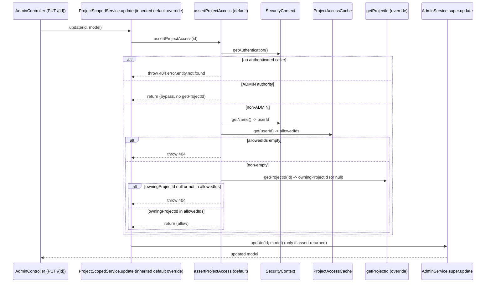

# Design Document: Project Actions Validation (FOR-03-04a-project-actions-validation)

## Overview

FOR-03-04 gave project-scoped services a **list-level** read filter: `ProjectScopedService.addRequiredQuery()` returns a `WHERE <projectIdPath> IN (:allowedIds)` predicate that `ReadOnlyAdminService.buildFinalSpecification()` combines into `find`, `findExtended`, and `getCount`. That predicate never touches the single-entity CRUD paths. `ReadOnlyAdminService.findById(id)` and every write path in `AdminService` (`update`, `deleteById`, `updateAll`, `updateSingleField`, `deleteAll`, `softDelete`, `setPropertiesToNull`) resolve their target by a raw id-based DAO lookup and never call `addRequiredQuery()`. So a non-ADMIN caller who passes the level-2 resource+operation check (`@RequiresPermission` + `PermissionInterceptor`) can read, update, or delete a single entity that belongs to a project they are not a member of.

This spec adds the missing **action-level** authorization by making `ProjectScopedService` the single CRUD contract for project-scoped services. Concretely, `ProjectScopedService` is re-declared to **extend `AdminService`** (parameterized by the full CRUD type set `<S, SE, D, ID>`) and it:

1. adds `default Long getProjectId(ID entityId)` — a resolver derived from the already-declared `getProjectIdPath()`. The default builds a Criteria query that projects the value at that JPA path (reusing the same `resolvePath` join traversal the list filter uses) for the row whose id equals `entityId`, runs it through the inherited `EntityManager`, and returns the single value or `null` when no such row exists. So the single mandatory per-entity override stays `getProjectIdPath()`; a concrete service overrides `getProjectId` only for a bespoke resolution.
2. adds `default void assertProjectAccess(ID entityId)` — the shared decision logic in one place: no-auth → deny, ADMIN → allow (bypass, never calls `getProjectId`), non-ADMIN empty allowed set → deny, non-ADMIN non-empty set → resolve `getProjectId(entityId)` and allow iff it is in the set, otherwise deny; a `null` owning id for a non-ADMIN is also a deny. The decision reuses the exact caller-resolution and ADMIN-detection logic already used by `addRequiredQuery()`.
3. **overrides, once and for all project-scoped services, every by-id CRUD method it inherits from `AdminService`** — `findById`, `update`, `updateAll`, `updateSingleField`, `deleteById`, `deleteAll`, `softDelete`, `setPropertiesToNull` — with `default` bodies that call `assertProjectAccess(id)` (per targeted id for the batch variants, aborting on the first deny) and then delegate to the inherited behavior via `AdminService.super.<method>(...)`. `create` is deliberately left inheriting the unchanged behavior (it resolves no existing id).

Because these overrides live on `ProjectScopedService` itself, a concrete project-scoped service gets ordinary out-of-the-box CRUD behavior **plus** level-3 protection for free. The only per-entity code it writes, beyond the standard CRUD plumbing every service supplies (`getDao`, `getMapper`, `getEntityManager`, `getDaoModelClass`, `getAuditLogDao`), is `getProjectIdPath()` — which drives both the list filter and, via the default, the action resolver. It declares `implements ProjectScopedService` and overrides no CRUD method, `addRequiredQuery()`, `assertProjectAccess()`, or `getProjectId()` (unless it wants a bespoke resolution).

Two rules make this safe. **Project-scoped exclusivity**: a project-scoped service implements exactly one CRUD contract — `ProjectScopedService` — and is never a plain `AdminService` and never lists both interfaces, so the overrides cannot be bypassed by a sibling contract. **`ProjectScopedService` stays a pure interface** (only `default`/abstract members, no class inheritance), so it remains lightweight and the pure decision logic is still testable with a stub. Non-scoped services (users, roles, resources) keep implementing `AdminService` and are untouched.

This spec DELIVERS the contract change (`extends AdminService`, the resolver, the shared decision, and the inherited by-id overrides) and its tests — including a guard test that every mutating CRUD method is overridden — proven against the same test-only `@Entity` fixture family FOR-03-04 introduced. It does NOT create the `projects` table or any real project entity/service (FOR-06), does NOT change any production controller's `@RequiresPermission` (FOR-03-08), and does NOT change the existing read-filter behavior.

### Key Design Decisions

| Decision | Rationale |
|----------|-----------|
| **`getProjectId(ID)` is a DEFAULT derived from `getProjectIdPath()`, not a second abstract method** | The list filter and the action check both need the same fact — the entity's owning project id — and both are anchored to the same JPA path. Deriving `getProjectId` from `getProjectIdPath()` keeps `getProjectIdPath()` the SINGLE mandatory per-entity declaration (no risk of the path and a separate resolver drifting apart), and a concrete service adds zero action-specific code (Requirement 1.1, 1.2). |
| **Default resolution = Criteria query via the inherited `EntityManager`, reusing `resolvePath`** | The DAO layer exposes no scalar/single-column projection (`getReadDao()` returns `ReadOnlyAdminDao`, which is not even a `JpaSpecificationExecutor`), so the default builds a `CriteriaQuery<Long>` selecting `resolvePath(root, getProjectIdPath())` where `root.get("id")` equals `entityId`, and runs it through `getEntityManager()` — the exact idiom already used by `AdminService.softDelete`/`setPropertiesToNull` (verified in source). `resolvePath` handles single-segment (`projectId`) and dotted (`project.id`, `room.project.id`) paths via join traversal, so the default covers all path shapes the list filter supports (Requirement 1.2, 7.1). `BaseEntity` guarantees the `id` property name. |
| **Absent row → `null`, not an exception** | The default executes with `getResultList()` (not `getSingleResult()`, which throws on no rows) and returns `null` when empty, so `assertProjectAccess` treats a missing entity and an out-of-scope entity uniformly as a non-ADMIN deny (Requirement 1.3, 2.8). |
| **`getProjectId` stays overridable** | An entity that reaches its project through a shape `getProjectIdPath()` cannot express, or that already has a purpose-built DAO query, may override `getProjectId(ID)` to return the owning id or `null` — the default is a convenience, not a lock-in (Requirement 1.4). |
| **All action-decision logic in ONE default `assertProjectAccess(ID)`** | The ADMIN-bypass / no-auth / empty-set / membership decision is security-critical and must be written once and audited once, matching how `addRequiredQuery()` centralizes the read decision (Requirement 2.1). Concrete services supply only `getProjectIdPath()`; the CRUD overrides, the decision, and `getProjectId` are all inherited. |
| **Reuse the read filter's caller + ADMIN logic** | The existing `parseUserId`, `isAdmin`, and `allowedProjectIds(userId)` in `ProjectScopedService` are lifted so the read filter and the action check make the SAME auth/ADMIN/allowed-set decisions from the SAME source (`ProjectAccessCache`). This keeps invalidation semantics identical (Requirement 2.9, 2.10). The private helpers are promoted to package-visible static utilities (or a small shared helper) so both `addRequiredQuery()` and `assertProjectAccess()` call them. |
| **ADMIN bypass does NOT call `getProjectId`** | An ADMIN sees everything; resolving the owning id would be a pointless DB hit and could mask an ADMIN read of a legitimately non-existent id behind ownership logic. ADMIN short-circuits to allow before any resolution (Requirement 2.2). The framework's own `findById` still raises `error.entity.not.found` for a truly missing id, so ADMIN behavior is unchanged. |
| **Deny = 404 `error.entity.not.found`, not 403** | The list filter already makes out-of-scope rows invisible (they simply do not appear). To stay consistent and avoid leaking the existence of records outside the caller's projects, an out-of-scope single-entity action returns the SAME 404 `error.entity.not.found` the framework already returns for a missing id. A non-existent entity and an out-of-scope entity are therefore indistinguishable to a non-ADMIN caller (Requirement 2.7, 2.8, Access_Denied_Outcome). No new error code is introduced. |
| **`null` owning id → deny for non-ADMIN** | `getProjectId` returns `null` when the entity does not exist. For a non-ADMIN, both "missing" and "out-of-scope" collapse to the same 404, so returning `null` is treated as a deny rather than special-casing it — one uniform outcome, one message code (Requirement 2.8). |
| **`ProjectScopedService extends AdminService` — a single CRUD contract, overrides live on the interface (Variant A)** | Instead of a standalone mixin whose overrides are copied into each concrete service, `ProjectScopedService` extends `AdminService` and carries the by-id CRUD overrides itself. A concrete project-scoped service then writes only `implements ProjectScopedService` + `getProjectIdPath()`/`getProjectId()` + the standard plumbing, and gets the checks for free — the chief ergonomic win the user asked for (Requirement 1.6, 7.3). It also removes the FOR-03-04 `addRequiredQuery()` diamond: with a single super-interface there is no competing default, so no per-service `super`-disambiguation is needed. The trade-offs of this choice are recorded in the "Variant A trade-offs" note after this table. |
| **Overrides delegate via `AdminService.super.<method>(...)`** | Each override calls `assertProjectAccess(id)` (per targeted id for batch variants, aborting on the first deny) and then the inherited body through `AdminService.super`. `Interface.super` is valid because `AdminService` is the DIRECT super-interface; the hierarchy is kept flat (no layer inserted between `ProjectScopedService` and `AdminService`) so the `super` chain cannot break (Requirement 3.1–3.3, 4.1–4.3, 5.1–5.3). |
| **Project-scoped exclusivity** | A project-scoped service implements exactly one CRUD contract — `ProjectScopedService` — and is never a plain `AdminService` and never lists both `AdminService` and `ProjectScopedService`. This guarantees the ownership overrides cannot be bypassed by a sibling contract and makes "project entity ⇒ `ProjectScopedService`, ordinary entity ⇒ `AdminService`" a single, teachable rule for FOR-06 (Requirement 7.4). |
| **`ProjectScopedService` stays a pure interface** | Even while extending `AdminService`, it is composed only of `default`/abstract members (no class inheritance). This keeps it lightweight and preserves testability: the pure `assertProjectAccess` decision is still driven by a small stub in the property test (Requirement 1.7). |
| **Every mutating by-id method is overridden; `create` is not** | All of `findById`, `update`, `updateAll`, `updateSingleField`, `deleteById`, `deleteAll`, `softDelete`, `setPropertiesToNull` resolve rows by id and are overridden to run the check; batch variants validate every id and abort on the first deny so a batch cannot partially escape (Requirement 4.5, 5.5). `create` resolves no existing id and is left inheriting the unchanged behavior (CREATE-path project validation is out of scope). A guard test (below) enforces that this override set stays complete as `AdminService` evolves (Requirement 7.5, 8.5). |
| **No change to `addRequiredQuery()` / `getProjectIdPath()` semantics** | The enhancement is purely additive: existing read-filter members are retained unchanged so FOR-03-04's verified list-filtering guarantees are not regressed (Requirement 7.1, 7.2). |
| **Interface parameterized by the full CRUD type set** | To extend `AdminService`, `ProjectScopedService<DaoModel>` becomes `ProjectScopedService<S, SE, D, ID>` — the same `ServiceModel`/`ServiceExtendedModel`/`DaoModel`/`ID` set `AdminService` uses — which also types `getProjectId(ID)` and `assertProjectAccess(ID)` correctly. The sole existing implementors are FOR-03-04's test fixtures, updated to the new signature; no production implementors exist yet (Requirement 1.5, 1.6). |

> **Variant A trade-offs (recorded).** The chosen `extends AdminService` structure was weighed against a standalone mixin. Pros: strongest security-by-default (a project entity physically cannot be an unchecked `AdminService`), maximal ergonomics (one `implements` + `getProjectIdPath`/`getProjectId`), and elimination of the `addRequiredQuery()` diamond. Cons and their mitigations: (a) the `super` chain works only through the direct super-interface — mitigated by keeping the hierarchy flat; (b) a new mutating method added to `AdminService` would be inherited unchecked until overridden — mitigated by the guard test (Requirement 8.5) that fails if any `Mutating_Crud_Method` is not overridden; (c) the pure decision is slightly heavier to unit-test because a stub must satisfy the `AdminService` signatures — mitigated by driving the property test through a minimal stub that supplies no-op plumbing and focuses on `assertProjectAccess`; (d) reduced call-site visibility of the check (it lives in the parent, not the concrete service) — accepted deliberately as the whole point of the pattern, and documented as the single project-scoped contract.

### Research Findings

| Topic | Finding |
|-------|---------|
| Single-entity paths skip the filter | `ReadOnlyAdminService.findById(id)` does `getReadDao().findById(id).orElseThrow(NOT_FOUND "error.entity.not.found")` — a raw DAO lookup, no `addRequiredQuery()`. `AdminService.update(id, model)`, `deleteById(id)`, `updateAll`, `updateSingleField`, `deleteAll`, `softDelete`, `setPropertiesToNull` all resolve/mutate by id via DAO or `CriteriaUpdate` without the access spec (verified in source). Only `find`/`findExtended`/`getCount` run through `buildFinalSpecification`. This is the exact gap Requirements 3–5 close. |
| Existing write hooks | `AdminService` already exposes `validateCreate`, `afterCreate(entity)`, and `validateUpdate(existing, model)` as no-op defaults. `validateUpdate` receives the loaded `existing` entity, but there is no `beforeDelete` / `beforeFindById` hook and no shared current-user utility. Rather than depend on the presence/absence of specific hooks, the design overrides the CRUD methods themselves, which is uniform across read/update/delete and their batch variants (verified in source). |
| Reusable caller/ADMIN logic | `ProjectScopedService` already has private static `parseUserId(name)` (`Long.parseLong`, null on blank/non-numeric) and `isAdmin(auth)` (exact match of an authority against `ROLE_ADMIN` or `ADMIN` using `ForemenPermissionEvaluator.ADMIN_ROLE_CODE`), plus `allowedProjectIds(userId)` wired to `ProjectAccessCache.get(userId)`. `assertProjectAccess` reuses these unchanged, keeping the two decisions consistent (verified in source). |
| Denial status mapping | `ForemenControllerAdvice` responds with `ResponseEntity.status(ex.getStatus())` and resolves `ex.getMessageCode()` in the request locale; the HTTP status is exactly the `HttpStatusCode` passed to `ForemenApiException`. `error.entity.not.found` (→ 404) already exists in both `messages.properties` (PL) and `messages_ru.properties` (RU) and is the code the framework already raises for a missing id — so reusing it for the denial needs no new bundle entry (verified in source). |
| Allowed-set source & invalidation | `ProjectAccessCache.get(userId)` self-loads `Set<Long>` via `ProjectMemberDao.findDistinctProjectIdsByUserId`, and `invalidate(userId)` evicts on membership/role change (FOR-03-04). `assertProjectAccess` reading through `allowedProjectIds(userId)` → `ProjectAccessCache.get(userId)` means a revoked membership stops authorizing actions as soon as the cache entry is invalidated, with no extra wiring (verified in source). Alternatively `ProjectMemberDao.existsByUserIdAndProjectId(userId, projectId)` is available for a direct membership test, but reading the cached set keeps action and read decisions on one path. |
| `Interface.super` delegation | A `default` method that overrides an inherited `default` method can call the parent body via `SuperInterface.super.method(...)`, valid only for a DIRECT super-interface. Since `ProjectScopedService extends AdminService` directly, the overrides delegate with `AdminService.super.findById(id)` / `AdminService.super.update(...)`, etc. (This also retires the FOR-03-04 `addRequiredQuery()` diamond, which existed only because the fixture implemented `ReadOnlyAdminService` and a separate `ProjectScopedService`; with a single super-interface there is no competing default to disambiguate.) Verified against the FOR-03-04 fixture's existing `ProjectScopedService.super.addRequiredQuery()` usage. |

## Architecture

```mermaid
flowchart TD
    subgraph Security["Spring Security (FOR-03-01/03)"]
        SC["SecurityContext: name=userId, authority ROLE_&lt;code&gt;"]
    end

    subgraph L12["Level 1 + 2 (FOR-03-03)"]
        PI["PermissionInterceptor: @RequiresPermission resource+operation, ADMIN bypass"]
    end

    subgraph CRUD["CRUD single-entity paths (FOR-01)"]
        FBI["ReadOnlyAdminService.findById(id)"]
        UPD["AdminService.update/deleteById/updateAll/... (id-based)"]
    end

    subgraph L3["Level 3 - project ownership on the entity (this spec)"]
        APA["ProjectScopedService.assertProjectAccess(id) (default, all logic)"]
        APA -->|reads userId + ADMIN authority| SC
        APA -->|allowedProjectIds(userId) -> get(userId)| PAC["ProjectAccessCache"]
        APA -->|non-ADMIN, non-empty set| GPI["getProjectId(id) (per-entity override)"]
    end

    PI --> FBI
    PI --> UPD
    FBI -->|inherited override on ProjectScopedService calls first| APA
    UPD -->|inherited override on ProjectScopedService calls first| APA
    APA -->|allow -> AdminService.super| FBI
    APA -->|allow -> AdminService.super| UPD
    APA -->|deny -> 404 error.entity.not.found| ADVICE["ForemenControllerAdvice"]
```

> `ProjectScopedService extends AdminService`, so `findById`/`update`/`deleteById`/… are the interface's own `default` overrides; the concrete project-scoped service inherits them and never writes the wiring itself.

### Action-Validation Sequence (update-by-id, non-ADMIN)



### Package Structure

```
com.foremen
└── service/
    └── ProjectScopedService.java   (MODIFIED: now `extends AdminService<S, SE, D, ID>`;
                                      + getProjectId(ID),
                                      + default assertProjectAccess(ID),
                                      + default overrides of findById/update/updateAll/updateSingleField/
                                        deleteById/deleteAll/softDelete/setPropertiesToNull
                                        (assertProjectAccess -> AdminService.super.<method>);
                                      existing getProjectIdPath / allowedProjectIds / addRequiredQuery unchanged)

src/test (fixture, MODIFIED to prove the action check)
└── com.foremen.scoping.ScopedFixtureService   (now `implements ProjectScopedService<...>` only —
                                                 no separate ReadOnlyAdminService/AdminService;
                                                 implements getProjectId(id) + plumbing + getProjectIdPath;
                                                 does NOT override any CRUD method)
    com.foremen.scoping.ScopedFixtureEntity     (unchanged; provides projectId / nested project path)
    com.foremen.scoping.ProjectScopedServiceGuardTest  (asserts every Mutating_Crud_Method is overridden)
```

No production controllers, DAOs, migrations, or ABAC seeds change. The only production source touched is `ProjectScopedService`; everything else is test code.

## Components and Interfaces

### 1. `ProjectScopedService` (`com.foremen.service.ProjectScopedService`) — now `extends AdminService`

The interface is re-declared to `extend AdminService<S, SE, D, ID>` (the full CRUD type set) and gains the action-validation surface plus `default` overrides of every by-id CRUD method. The existing read-filter members are unchanged; the private helpers `isAdmin`, `parseUserId`, `resolvePath`, and `matchNothing` are retained and now also serve `assertProjectAccess`. `error.entity.not.found` is reused for the denial (no new code). A concrete project-scoped service supplies only the CRUD plumbing + `getProjectIdPath()` + `getProjectId(ID)` and inherits all of the below.

```java
package com.foremen.service;

import com.foremen.exception.ForemenApiException;
import com.foremen.service.permission.ForemenPermissionEvaluator;
import jakarta.persistence.criteria.From;
import jakarta.persistence.criteria.Path;
import jakarta.persistence.criteria.Root;
import org.springframework.data.jpa.domain.Specification;
import org.springframework.http.HttpStatus;
import org.springframework.security.core.Authentication;
import org.springframework.security.core.GrantedAuthority;
import org.springframework.security.core.context.SecurityContextHolder;

import java.util.List;
import java.util.Set;

/**
 * The single CRUD contract for project-scoped services. It {@code extends AdminService}, so it
 * inherits the full CRUD surface, and layers on:
 * <ul>
 *   <li>automatic project filtering on LIST reads (the inherited {@link #addRequiredQuery()}, FOR-03-04);</li>
 *   <li>mandatory project-ownership validation on single-entity ACTIONS ({@link #assertProjectAccess(Object)});</li>
 *   <li>{@code default} overrides of every by-id CRUD method that run {@code assertProjectAccess} and then
 *       delegate to {@code AdminService.super.<method>(...)}.</li>
 * </ul>
 *
 * <p>A concrete project-scoped service declares {@code implements ProjectScopedService<...>} (never a
 * plain {@code AdminService}, never both) and supplies only:
 * <ul>
 *   <li>the standard CRUD plumbing ({@code getDao}, {@code getMapper}, {@code getEntityManager},
 *       {@code getDaoModelClass}, {@code getAuditLogDao});</li>
 *   <li>{@link #getProjectIdPath()} — the per-entity JPA path used by the list filter AND, by
 *       default, by the action resolver (the single mandatory per-entity declaration);</li>
 *   <li>{@link #allowedProjectIds(Object)} wired to {@code ProjectAccessCache.get(userId)}.</li>
 * </ul>
 * It overrides NO CRUD method, {@code addRequiredQuery()}, {@code assertProjectAccess()}, or
 * {@code getProjectId()} — those live once here and are not meant to be reimplemented (a service MAY
 * override {@code getProjectId} only for a bespoke resolution). This interface introduces no class
 * inheritance (only {@code default}/abstract members), so it stays lightweight and testable.
 *
 * @param <S>  the service (list) model
 * @param <SE> the service extended model
 * @param <D>  the DAO/entity model
 * @param <ID> the entity id type
 */
public interface ProjectScopedService<S, SE, D, ID> extends AdminService<S, SE, D, ID> {

    // ---- FOR-03-04 read-filter surface (unchanged) ----

    /** Per-entity JPA dot-path from the query root to the project id (list filter). */
    String getProjectIdPath();

    /** Supplies the caller's allowed project ids for a resolved user id (wired to ProjectAccessCache). */
    Set<Long> allowedProjectIds(Long userId);

    /** List-level filter (FOR-03-04): WHERE getProjectIdPath() IN allowed; null for ADMIN; match-nothing otherwise. */
    @Override
    default Specification<D> addRequiredQuery() {
        Authentication auth = SecurityContextHolder.getContext().getAuthentication();
        if (auth == null || !auth.isAuthenticated()) {
            return matchNothing();
        }
        if (isAdmin(auth)) {
            return null;
        }
        Long userId = parseUserId(auth.getName());
        if (userId == null) {
            return matchNothing();
        }
        Set<Long> allowed = allowedProjectIds(userId);
        if (allowed == null || allowed.isEmpty()) {
            return matchNothing();
        }
        return (root, query, cb) -> resolvePath(root, getProjectIdPath()).in(allowed);
    }

    // ---- FOR-03-04a action-validation surface (new) ----

    /**
     * Resolves the owning project id of the entity identified by {@code entityId}, or {@code null}
     * if no such entity exists. DEFAULT (Requirement 1.1-1.3): derives the value from the declared
     * {@link #getProjectIdPath()} by building a Criteria query that selects that path for the row
     * whose {@code id} equals {@code entityId}, reusing {@link #resolvePath} for join traversal and
     * the inherited {@link #getEntityManager()} / {@link #getDaoModelClass()} (available because this
     * interface extends {@code AdminService}). Returns {@code null} on no row (uses
     * {@code getResultList()}, never {@code getSingleResult()}). A concrete service MAY override this
     * for a bespoke resolution (Requirement 1.4).
     */
    default Long getProjectId(ID entityId) {
        jakarta.persistence.criteria.CriteriaBuilder cb = getEntityManager().getCriteriaBuilder();
        jakarta.persistence.criteria.CriteriaQuery<Long> cq = cb.createQuery(Long.class);
        Root<D> root = cq.from(getDaoModelClass());
        // resolvePath handles "projectId" (single) and "project.id" / "room.project.id" (joins).
        cq.select(resolvePath(root, getProjectIdPath()).as(Long.class));
        cq.where(cb.equal(root.get("id"), entityId));
        var rows = getEntityManager().createQuery(cq).setMaxResults(1).getResultList();
        return rows.isEmpty() ? null : rows.get(0);
    }

    /**
     * All action-decision logic (Requirement 2); NOT meant to be overridden. Returns normally when the
     * action is allowed, or throws {@link ForemenApiException} 404 {@code error.entity.not.found} when
     * denied — deliberately indistinguishable from a missing entity so out-of-scope records are not
     * revealed. A concrete service calls this at the top of each single-entity CRUD method it exposes.
     *
     * <ul>
     *   <li>Req 2.3/2.4: no/blank/non-numeric principal &rarr; deny.</li>
     *   <li>Req 2.2: ADMIN authority &rarr; allow (bypass; {@code getProjectId} is NOT called).</li>
     *   <li>Req 2.5: non-ADMIN with empty allowed set &rarr; deny.</li>
     *   <li>Req 2.6: non-ADMIN, owning id resolved and IN the allowed set &rarr; allow.</li>
     *   <li>Req 2.7/2.8: owning id not in the set, or {@code null} &rarr; deny.</li>
     * </ul>
     */
    default void assertProjectAccess(ID entityId) {
        Authentication auth = SecurityContextHolder.getContext().getAuthentication();
        if (auth == null || !auth.isAuthenticated()) {
            throw denied(entityId);                 // Req 2.3
        }
        if (isAdmin(auth)) {
            return;                                 // Req 2.2: ADMIN bypass, no getProjectId call
        }
        Long userId = parseUserId(auth.getName());
        if (userId == null) {
            throw denied(entityId);                 // Req 2.4
        }
        Set<Long> allowed = allowedProjectIds(userId);
        if (allowed == null || allowed.isEmpty()) {
            throw denied(entityId);                 // Req 2.5: empty access denies
        }
        Long owningProjectId = getProjectId(entityId);
        if (owningProjectId == null || !allowed.contains(owningProjectId)) {
            throw denied(entityId);                 // Req 2.7, 2.8
        }
        // Req 2.6: owning project id is in the allowed set -> allow (return)
    }

    // ---- inherited by-id CRUD overrides (this spec): assertProjectAccess -> AdminService.super ----
    // Every by-id read/mutation is overridden here ONCE. `create` is intentionally NOT overridden
    // (it resolves no existing id). The guard test asserts this set stays complete (Req 7.5, 8.5).

    @Override                                                        // Req 3.1-3.3
    default SE findById(ID id) {
        assertProjectAccess(id);
        return AdminService.super.findById(id);
    }

    @Override                                                        // Req 4.1-4.3
    default SE update(ID id, SE model) {
        assertProjectAccess(id);
        return AdminService.super.update(id, model);
    }

    @Override                                                        // Req 4.5 (batch: validate every id, abort on first deny)
    default List<SE> updateAll(List<ID> ids, SE model) {
        ids.forEach(this::assertProjectAccess);
        return AdminService.super.updateAll(ids, model);
    }

    @Override                                                        // Req 4.5
    default <V> void updateSingleField(ID id, V value, java.util.function.BiConsumer<D, V> setter) {
        assertProjectAccess(id);
        AdminService.super.updateSingleField(id, value, setter);
    }

    @Override                                                        // Req 5.1-5.3
    default void deleteById(ID id) {
        assertProjectAccess(id);
        AdminService.super.deleteById(id);
    }

    @Override                                                        // Req 5.5
    default void deleteAll(List<ID> ids) {
        ids.forEach(this::assertProjectAccess);
        AdminService.super.deleteAll(ids);
    }

    @Override                                                        // Req 5.5
    default void softDelete(String fieldName, Set<ID> ids) {
        ids.forEach(this::assertProjectAccess);
        AdminService.super.softDelete(fieldName, ids);
    }

    @Override                                                        // Req 5.5
    default void setPropertiesToNull(ID id, Set<String> propertyNames) {
        assertProjectAccess(id);
        AdminService.super.setPropertiesToNull(id, propertyNames);
    }

    // Note: the exact signatures above mirror AdminService/ReadOnlyAdminService as verified in source
    // (e.g. updateSingleField's BiConsumer, softDelete's (String, Set<ID>)). Match them 1:1 at
    // implementation time so each override compiles as a genuine override, not an overload.

    // ---- shared helpers (retained from FOR-03-04; now serve both decisions) ----

    private static ForemenApiException denied(Object entityId) {
        // Reuse the existing NOT_FOUND code so out-of-scope == not-found to a non-ADMIN caller (Req 6.1).
        return new ForemenApiException(HttpStatus.NOT_FOUND, "error.entity.not.found", entityId);
    }

    private static boolean isAdmin(Authentication auth) {
        for (GrantedAuthority ga : auth.getAuthorities()) {
            String a = ga.getAuthority();
            if (("ROLE_" + ForemenPermissionEvaluator.ADMIN_ROLE_CODE).equals(a)
                    || ForemenPermissionEvaluator.ADMIN_ROLE_CODE.equals(a)) {
                return true;
            }
        }
        return false;
    }

    private static Long parseUserId(String name) {
        if (name == null || name.isBlank()) {
            return null;
        }
        try {
            return Long.parseLong(name.trim());
        } catch (NumberFormatException e) {
            return null;
        }
    }

    private static <T> Path<Object> resolvePath(Root<T> root, String dotPath) {
        String[] segments = dotPath.split("\\.");
        if (segments.length == 1) {
            return root.get(segments[0]);
        }
        From<?, ?> from = root;
        for (int i = 0; i < segments.length - 1; i++) {
            from = from.join(segments[i]);
        }
        return from.get(segments[segments.length - 1]);
    }

    private static <T> Specification<T> matchNothing() {
        return (root, query, cb) -> cb.disjunction();
    }
}
```

> Notes:
> - `getProjectId` returns `Long` (the project id column is a plain `BIGINT`, per FOR-03-04). `entityId` is the generic `ID`, matching the CRUD framework's id type for the entity. `resolvePath` returns `Path<Object>`; `.as(Long.class)` narrows it for `cq.select(...)`. Imports `jakarta.persistence.criteria.CriteriaBuilder` / `CriteriaQuery` are added at implementation time (shown fully qualified above only for brevity). `getEntityManager()` and `getDaoModelClass()` are inherited from `AdminService`/`ReadOnlyAdminService`, so the default needs no new accessor.
> - Because `assertProjectAccess` throws before any `AdminService.super` delegation, an out-of-scope write never reaches `getWriteDao().save(...)` / `deleteById(...)`, so no partial mutation occurs (Requirements 4.2, 5.2); ADMIN callers short-circuit inside `assertProjectAccess` and reach the delegate unconditionally (Requirements 3.4, 4.4, 5.4), never invoking `getProjectId` (so no query is issued on the ADMIN path).

### 2. A concrete project-scoped service (illustrative)

With the overrides on `ProjectScopedService`, a real project-scoped service (arriving in FOR-06) writes only the plumbing plus the two per-entity resolvers. It declares `implements ProjectScopedService` — never a plain `AdminService`, never both (Project_Scoped_Exclusivity) — and overrides no CRUD method:

```java
@Service
public class RoomService
        implements ProjectScopedService<RoomModel, RoomExtendedModel, RoomEntity, Long> {

    private final RoomDao roomDao;
    private final RoomMapper roomMapper;
    private final AuditLogDao auditLogDao;
    private final EntityManager entityManager;
    private final ProjectAccessCache projectAccessCache;

    // ...constructor...

    // --- standard CRUD plumbing (same as any AdminService) ---
    @Override public AdminDao<RoomEntity, Long> getDao() { return roomDao; }
    @Override public ServiceToDaoMapper<RoomEntity, RoomModel, RoomExtendedModel> getMapper() { return roomMapper; }
    @Override public EntityManager getEntityManager() { return entityManager; }
    @Override public Class<RoomEntity> getDaoModelClass() { return RoomEntity.class; }
    @Override public AuditLogDao getAuditLogDao() { return auditLogDao; }

    // --- the ONLY project-scoping code per entity ---
    @Override public String getProjectIdPath() { return "project.id"; }          // drives list filter AND default action resolver
    @Override public Set<Long> allowedProjectIds(Long userId) { return projectAccessCache.get(userId); }

    // NO getProjectId override — the default derives it from getProjectIdPath().
    // NO findById/update/deleteById overrides — inherited from ProjectScopedService,
    // which already runs assertProjectAccess before AdminService.super.
    // (Override getProjectId ONLY if this entity needs a bespoke resolution, e.g.:
    //   @Override public Long getProjectId(Long id) { return roomDao.findProjectId(id); }
}
```

The list filter (`addRequiredQuery`), the owning-project resolver (`getProjectId`), and every by-id check are inherited; the service behaves exactly like a normal `AdminService` out of the box, plus level-3 protection, with `getProjectIdPath()` as the sole per-entity declaration (Requirement 7.3). Non-scoped services (users, roles, resources) keep `implements AdminService` and are unaffected (Requirement 7.4).

### 3. Test-only fixture updates (`src/test`)

`ScopedFixtureService` (FOR-03-04) implemented `ReadOnlyAdminService` + `ProjectScopedService` separately (that split forced the `addRequiredQuery()` diamond). This spec collapses it to the new single-contract shape:

- declare `implements ProjectScopedService<ScopedFixtureServiceModel, ScopedFixtureServiceExtendedModel, ScopedFixtureEntity, Long>` only — drop the separate `ReadOnlyAdminService`/`AdminService` in the `implements` clause and the manual `addRequiredQuery()` diamond-resolver;
- keep the CRUD plumbing and `allowedProjectIds` → `ProjectAccessCache.get(userId)`;
- override NO `getProjectId` and NO CRUD method — the fixture relies on the DEFAULT `getProjectId` derived from `getProjectIdPath()`, so the default resolver is what the integration tests exercise (Requirement 1.1-1.3, 8.6). A test control switches the fixture's `getProjectIdPath()` between `"projectId"` (single-segment) and `"project.id"` (dotted/join) so the default is proven for both path shapes;
- a separate tiny fixture (or a flag) MAY override `getProjectId` once to prove the override path is honored (Requirement 1.4).

`ScopedFixtureEntity` is reused unchanged (it already carries a plain `projectId` and a nested-path variant from FOR-03-04). The fixture stays in test sources only.

### 4. Guard test (`src/test`)

`ProjectScopedServiceGuardTest` enumerates, by reflection, every by-id CRUD method declared on `AdminService`/`ReadOnlyAdminService` (the `Mutating_Crud_Method` set) and asserts that `ProjectScopedService` declares a `default` override for each one, excluding `create`. This fails fast if a future mutating method is added to the CRUD framework and left unprotected — the mitigation for the `extends AdminService` "silent-inherit" risk noted in the trade-offs (Requirement 7.5, 8.5).

## Data Models

No schema changes. No new tables, columns, entities, or DTOs. `project_members`, `ProjectMemberEntity`, `ProjectAccessCache`, and `ProjectMemberDao` from FOR-03-04 are reused unchanged. The only production artifact modified is the `ProjectScopedService` interface: it now `extends AdminService<S, SE, D, ID>`, adds a `default getProjectId(ID)` (Criteria resolver derived from `getProjectIdPath()`, overridable) and the `default assertProjectAccess(ID)` decision, adds `default` overrides of the eight by-id CRUD methods, and keeps the FOR-03-04 read-filter members and helpers.

## Correctness Properties

*A property is a characteristic or behavior that should hold true across all valid executions of a system — a formal statement about what the system should do, bridging human-readable specifications and machine-verifiable correctness.*

**Prework analysis.** The pure, input-varying core amenable to property-based testing is the `assertProjectAccess(id)` decision: for any caller state (no principal / non-numeric principal / ADMIN / non-ADMIN-empty / non-ADMIN-non-empty) and any owning-project-id outcome (in-set / out-of-set / null), the method either returns or throws the 404. This is one comprehensive decision property (Property 1). The enforcement wiring on each CRUD path (Requirements 3–5), the no-partial-mutation guarantee, and the read-filter non-regression are covered by integration tests, since their behavior depends on the running persistence/transaction stack rather than on generated pure inputs.

### Property 1: assertProjectAccess decision matches the caller's access state and the entity's owning project

*For any* generated caller state — (i) no authenticated principal, (ii) a non-numeric principal name, (iii) an ADMIN authority, (iv) a non-ADMIN principal with an empty allowed set, or (v) a non-ADMIN principal with a non-empty allowed set — and *for any* generated owning-project-id outcome from `getProjectId` (a value in the allowed set, a value not in the allowed set, or `null`), `assertProjectAccess(id)` returns normally iff the caller is ADMIN, OR the caller is non-ADMIN with a non-empty allowed set and `getProjectId(id)` returns a non-null value contained in that set; in every other case it throws a `ForemenApiException` with status 404 and message code `error.entity.not.found`. Additionally, when the caller is ADMIN, `getProjectId` is never invoked.

**Validates: Requirements 2.2, 2.3, 2.4, 2.5, 2.6, 2.7, 2.8, 2.9**

## Error Handling

| Condition | HTTP status | Message code | Producer |
|-----------|-------------|--------------|----------|
| Non-ADMIN acts on an entity whose owning project is not in their allowed set | 404 | `error.entity.not.found` | `assertProjectAccess` throws `ForemenApiException`, translated by `ForemenControllerAdvice` (Req 2.7, 3.3, 4.2, 5.2) |
| Non-ADMIN acts and `getProjectId(id)` returns `null` (entity missing or unresolved) | 404 | `error.entity.not.found` | `assertProjectAccess` (Req 2.8) |
| Non-ADMIN with an empty allowed set performs any Project_Scoped_Action | 404 | `error.entity.not.found` | `assertProjectAccess` (Req 2.5) |
| Unauthenticated or non-numeric principal reaches `assertProjectAccess` | 404 | `error.entity.not.found` | `assertProjectAccess` defensive deny (Req 2.3, 2.4) |
| ADMIN acts on a genuinely non-existent id | 404 | `error.entity.not.found` | framework `findById` orElseThrow (unchanged; ADMIN bypasses ownership) |
| Caller lacks `(resource, operation)` permission | 403 | `error.access.denied` | `PermissionInterceptor` (FOR-03-03, unchanged) |
| Unauthenticated caller hits an annotated endpoint | 401 | `error.auth.unauthorized` | `PermissionInterceptor` (FOR-03-03, unchanged) |

Notes:
- The action denial deliberately reuses `error.entity.not.found` (404), already present in both bundles, so an out-of-scope entity is indistinguishable from a missing one and no record existence is leaked (Requirement 6.1). No new message code is introduced by this spec; Requirement 6.2 is a conditional guard that applies only if a future refinement adds one.
- Level-1/2 outcomes (401/403 from `PermissionInterceptor`) are unchanged. Level 3 runs only after level 2 passes, inside the service, and its denial is a distinct 404.
- `ForemenControllerAdvice` resolves the code in the request locale via the existing mechanism (Requirement 6.3).

## Testing Strategy

Property-based testing IS appropriate for the pure decision core (`assertProjectAccess`): it is input-varying pure logic with a universal allow/deny characterization. The CRUD enforcement, no-partial-mutation, ADMIN bypass, and read-filter non-regression are covered by integration tests against the running stack.

### Test-only fixture (no real project entity yet)

Because no real project-scoped entity exists until FOR-06, enforcement is proven against the same throwaway `@Entity` fixture FOR-03-04 uses — `ScopedFixtureEntity` (plain `projectId` and a nested-path variant) with `ScopedFixtureService` now declared `implements ProjectScopedService<...>` only (single contract), supplying the CRUD plumbing, `getProjectIdPath()`, and `allowedProjectIds` → `ProjectAccessCache`, and overriding NO `getProjectId` and NO CRUD method (the resolver is the default; the by-id checks are inherited). The fixture lives only in test sources. Its schema is created for the test profile (Testcontainers postgres) via the existing FOR-03-04 test-only Liquibase changeset or JPA DDL scoped to the fixture.

### Dual Testing Approach

- **Property test (jqwik)** validates Property 1. File named `*PropertyTest.java`, `@Property(tries = 100)` minimum, tagged `// Feature: FOR-03-04a-project-actions-validation, Property 1: ...`. It drives `assertProjectAccess(id)` through a minimal stub implementor of `ProjectScopedService` (supplying no-op CRUD plumbing so the interface can be instantiated, since it now extends `AdminService`) with generated `SecurityContext` states and a stubbed/spy `getProjectId` returning generated in-set / out-of-set / null values, asserting the allow/deny (404) characterization and that `getProjectId` is never called on the ADMIN path (via the spy).
- **Unit / example tests (JUnit 5)** cover each decision branch explicitly (no-auth deny, non-numeric-principal deny, ADMIN allow without `getProjectId`, empty-set deny, in-set allow, out-of-set deny, null-owning-id deny) with the same stub, and assert the thrown exception's status (404) and code (`error.entity.not.found`).
- **Guard test (JUnit 5, reflection)** enumerates every by-id `Mutating_Crud_Method` on `AdminService`/`ReadOnlyAdminService` and asserts `ProjectScopedService` declares a `default` override for each (excluding `create`), failing fast if the CRUD framework grows a new mutating method left unprotected (Requirement 7.5, 8.5).
- **Integration tests (@SpringBootTest + Testcontainers postgres, `@ActiveProfiles("integration-test")`)** exercise, through the fixture service, `findById`/`update`/`deleteById` for: ADMIN (allowed regardless of ownership), non-ADMIN acting on an in-scope entity (allowed), non-ADMIN acting on an out-of-scope entity (404 `error.entity.not.found`), non-ADMIN with no memberships (404), and unauthenticated (404). They assert a denied `update` leaves the row's fields unchanged and a denied `deleteById` leaves the row present (no partial mutation, Requirement 8.3), and that the multi-id variant aborts wholesale when one id is out of scope (Requirements 4.5, 5.5). They also re-assert the FOR-03-04 list filter (`find`/`findExtended`/`getCount`) is unchanged for ADMIN, non-ADMIN-with-memberships, and non-ADMIN-with-none (Requirement 8.4).
- **Default-resolution tests (integration, Testcontainers)** prove the default `getProjectId` derived from `getProjectIdPath()` returns the correct owning id for a single-segment path (`projectId`) and a dotted/join path (`project.id`), and returns `null` for a non-existent id — driven through the fixture with no custom `getProjectId` override (Requirement 8.6). A small override case confirms a bespoke `getProjectId` is honored (Requirement 1.4).
- **Edge-case tests** cover the ADMIN-acting-on-a-nonexistent-id path (still 404 via the framework, ownership bypassed, and the default `getProjectId` is never invoked on the ADMIN path).

### Property → Requirement Coverage

| Property | Requirements |
|----------|--------------|
| 1 assertProjectAccess decision | 2.2, 2.3, 2.4, 2.5, 2.6, 2.7, 2.8, 2.9 |

Enforcement wiring (Requirements 3, 4, 5), the complete-override guarantee (7.5, 8.5, via the guard test), no-partial-mutation (8.3), read-filter non-regression (7.1, 7.2, 8.4), and the reuse of `error.entity.not.found` (6.1) are covered by the guard, integration, and example tests above.

### Property Test Configuration

- Minimum 100 iterations per property test (jqwik `@Property(tries = 100)`).
- The property test references its design property number in a tag comment.
- Tag format: `// Feature: FOR-03-04a-project-actions-validation, Property N: <property text>`.
- The single correctness property is implemented by a single property-based test.

### Configuration and profile note

No new configuration properties are introduced. `ProjectAccessProperties` (FOR-03-04) already carries its code-level default, so the `integration-test` profile starts unchanged.
