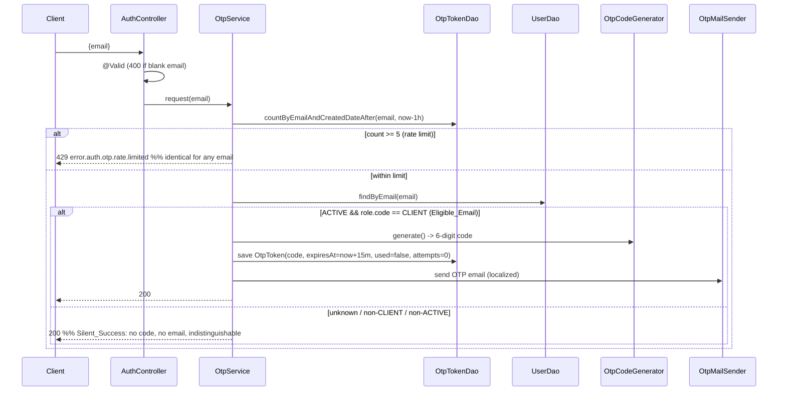
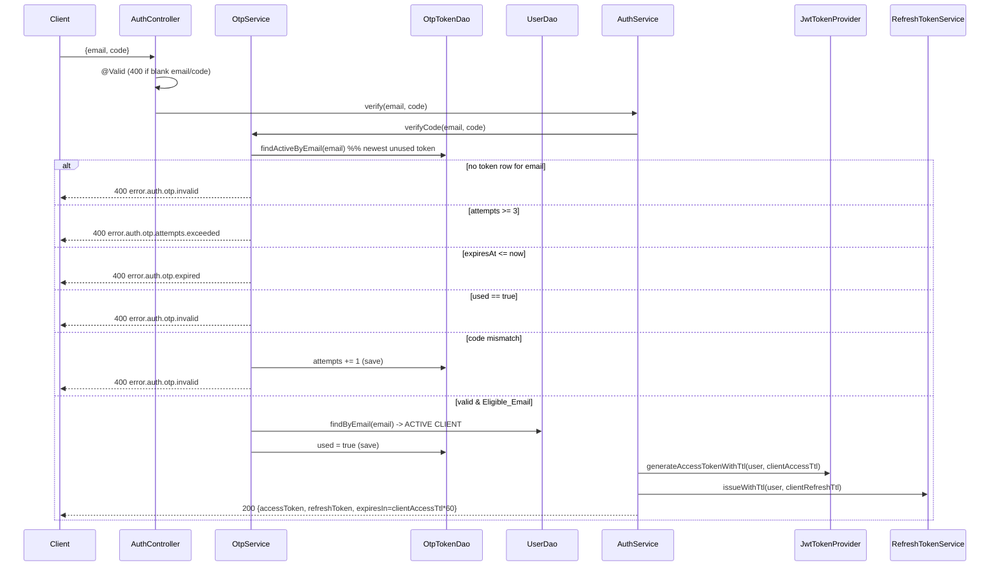

# Design Document — FOR-03-05 OTP Client Authentication

## Overview

This design adds passwordless OTP login for CLIENT users to the Foremen Spring Boot backend. It is the fifth child spec of the FOR-03 auth system and builds directly on FOR-03-01 (JWT authentication), reusing that spec's token issuance, refresh persistence, response DTO, error pipeline, security chain, and configuration-properties pattern rather than reinventing them. It also reuses the `JavaMailSender` + Thymeleaf mail stack established by FOR-03-02.

The flow is:

1. A client calls `POST /api/auth/otp/request` with an `email`. `OtpService` first enforces a per-email rate limit (5 requests/hour) by counting `otp_tokens` rows created in the trailing hour — **before** any user lookup, so the rate-limit outcome never depends on whether the email is an eligible client. If the limit is exceeded, the endpoint returns a generic HTTP 429 identical for every email.
2. Within the limit, `OtpService` resolves the email against the user store. If it maps (case-insensitively) to exactly one ACTIVE user whose role code is `CLIENT` (an Eligible_Email), it generates a cryptographically-secure 6-digit code (leading zeros preserved), persists an `OtpTokenEntity` (TTL 15 min, `used=false`, `attempts=0`), and emails the code. For any other email it does none of this. Either way it returns HTTP 200 (Silent_Success — no user enumeration).
3. The client calls `POST /api/auth/otp/verify` with `{ email, code }`. `OtpService` looks up the active token for the email and walks a fixed verification state machine (attempts-exceeded → expired → used → code-match). On a valid, unexpired, unused code with attempts remaining belonging to an Eligible_Email, it marks the code `used` and `AuthService` issues a **client-TTL** access token (2 h) plus a **client-TTL** refresh token (30 d), returning a `TokenResponse`. A wrong code increments `attempts` and returns 400; after 3 failed attempts the code is locked.

### Reuse of FOR-03-01 / FOR-03-02 infrastructure

Confirmed present in `foremen-backend/` and reused as-is:

| Concern | Reused component | Origin |
|---|---|---|
| Access token generation | `JwtTokenProvider.generateAccessToken(userId, roleCode, email)` | FOR-03-01 |
| Refresh token issuance/rotation/revocation | `RefreshTokenService.issue/rotate/revoke` | FOR-03-01 |
| Response DTO | `TokenResponse {accessToken, refreshToken, expiresIn}` | FOR-03-01 |
| Token/DAO entity pattern | `RefreshTokenEntity`/`RefreshTokenDao`, `PasswordResetTokenEntity` (mirror shape) | FOR-03-01 |
| Base entity + audit columns | `BaseEntity` (`id`, `createdDate`, `createdBy`, `updatedDate`, `updatedBy`) | FOR-01 |
| User lookup + lifecycle | `UserEntity.status` (`UserStatus`), `UserEntity.locale`, `UserEntity.role.code`, `UserDao.findByEmail` | FOR-03-01/02 |
| Config binding + fail-fast | `JwtProperties` (`@Validated @ConfigurationProperties`, `@Positive`, defaults in canonical constructor) | FOR-03-01 |
| Non-enumeration precedent | password-reset `request` returns 200 without disclosing existence | FOR-03-01 |
| Error pipeline | `ForemenApiException` + `ForemenControllerAdvice` → `ErrorResponse`, `MessageResolver` | FOR-01/03-01 |
| i18n | `messages.properties` (PL base) / `messages_ru.properties` (RU) | FOR-01 |
| Mail transport | `JavaMailSender` + `MimeMessageHelper`, Thymeleaf `TemplateEngine`, `templates/mail/` | FOR-03-02 |
| Mail sender abstraction | `InvitationMailSender` shape (locale resolution, subject/body from bundle) | FOR-03-02 |
| Migrations | numbered Liquibase changesets, `changelog.xml`, `preConditions onFail="MARK_RAN"` (latest existing is `015`) | FOR-01 |
| Endpoint controller | `AuthController` (`/api/auth`, `@Valid` request records) | FOR-03-01 |
| Security permit rule | `/api/auth/**` `permitAll` in `SecurityConfig` | FOR-03-01 |
| Testing conventions | jqwik + JUnit 5 + Testcontainers postgresql | FOR-02-03 |

### Scope boundaries

In scope (backend only): `otp_tokens` table + entity/DAO, `POST /api/auth/otp/request` (code generation, TTL, persistence, rate limiting, silent success, email), `POST /api/auth/otp/verify` (validation branches, attempts, client-TTL token issuance), client access/refresh TTL config properties with fail-fast validation, the OTP Thymeleaf email + PL/RU localization, and new PL/RU OTP message codes.

Out of scope (other FOR-03 specs): permission evaluator (03), project ownership (04), the wholesale `permitAll()` migration (08), and ALL frontend work including the client OTP-login page (06). This spec defines only the backend API contract the frontend consumes. Client users are created by an administrator through the FOR-03-02 invite flow (`POST /api/users` with a CLIENT role); creation of clients is not part of this spec.

### New dependencies

None. `spring-boot-starter-mail`, `spring-boot-starter-thymeleaf` (added in FOR-03-02), JJWT, `spring-boot-starter-validation`, jqwik, and Testcontainers are already present.

## Architecture

### Component map

```mermaid
graph TD
    Client[Client HTTP caller] -->|POST /api/auth/otp/request| AuthCtrl[AuthController]
    Client -->|POST /api/auth/otp/verify| AuthCtrl
    AuthCtrl --> AuthSvc[AuthService]
    AuthSvc --> OtpSvc[OtpService]

    OtpSvc --> OtpDao[OtpTokenDao]
    OtpSvc --> UserDao[UserDao]
    OtpSvc --> Mail[OtpMailSender -> JavaMailSender + Thymeleaf]
    OtpSvc --> Gen[OtpCodeGenerator SecureRandom]
    OtpSvc --> OtpProps[OtpProperties]

    AuthSvc --> Provider[JwtTokenProvider]
    AuthSvc --> RefreshSvc[RefreshTokenService]
    AuthSvc --> ClientTtl[Client TTL selector - JwtProperties client-* fields]

    OtpDao --> DB[(otp_tokens)]
    OtpSvc -->|ForemenApiException| Advice[ForemenControllerAdvice]
    AuthSvc -->|ForemenApiException| Advice

    Caller[Authenticated caller: PROJECTS/EDIT] -->|POST /api/users/client| UserCtrl[UserController]
    UserCtrl -->|@RequiresPermission PROJECTS EDIT| CRSvc[ClientRegistrationService]
    CRSvc --> UserSvc[UserService.create -> afterCreate invite]
    CRSvc --> RoleDao[RoleDao.findByCode CLIENT]
    CRSvc --> PMSvc[ProjectMemberService.assign]
    UserSvc --> Invite[InviteService client-portal email]
    PMSvc --> PMDb[(project_members)]
```

### Request flow — `POST /api/auth/otp/request`

Rate limiting is applied first, before the user lookup, so it cannot be used to distinguish eligible from non-eligible emails.



### Request flow — `POST /api/auth/otp/verify`



### Package layout

All code lives under `com.foremen` in module `foremen-backend`, matching FOR-03-01/02 conventions.

| Package | Classes |
|---|---|
| `com.foremen.dao.model` | `OtpTokenEntity` (new) |
| `com.foremen.dao` | `OtpTokenDao` (new) |
| `com.foremen.service` | `OtpService` (new); `AuthService` (extended — OTP verify + client-TTL issuance); `RefreshTokenService` (extended — client-TTL issue overload); `ClientRegistrationService` (new — CLIENT create + project-member assign); reuses `ProjectMemberService` (FOR-03-04) and `UserService` invite-create (FOR-03-02) |
| `com.foremen.service.mail` | `OtpMailSender` interface + `ThymeleafOtpMailSender` impl (new), or extension of the FOR-03-02 mail package |
| `com.foremen.config.security` | `JwtProperties` (extended: `clientAccessTtlMinutes`, `clientRefreshTtlDays`); `JwtTokenProvider` (extended: TTL-aware access-token overload); `SecurityConfig` (no change — verified) |
| `com.foremen.config` | `OtpProperties` (new `@ConfigurationProperties` for `foremen.otp`, optional) |
| `com.foremen.controller` | `AuthController` (extended); `UserController` (extended — `POST /api/users/client`) |
| `com.foremen.controller.dto.auth` | `OtpRequestRequest`, `OtpVerifyRequest` (new records) |
| `com.foremen.controller.model` | `ClientRegistrationRequest`, `ClientRegistrationResponse` (new records) |
| `foremen-frontend/src/features/users` | `RoleSelect` (extended — exclude ADMIN/CLIENT by code); roles read path exposes role `code` |
| `database_files/changesets` | `016-create-otp-tokens.xml` (new), registered in `changelog.xml` |
| `src/main/resources/templates/mail` | `otp-code.html` (new Thymeleaf template) |

## Components and Interfaces

### Client TTL configuration — JwtProperties extension (Requirement 7)

Rather than a separate properties class, the two client TTLs are added to the existing `JwtProperties` record under the `foremen.jwt` namespace, mirroring the existing `@Positive`-validated employee TTLs and default-in-constructor pattern.

```java
@Validated
@ConfigurationProperties(prefix = "foremen.jwt")
public record JwtProperties(
        @Positive Integer accessTtlMinutes,
        @Positive Integer refreshTtlDays,
        @Positive Integer clientAccessTtlMinutes,   // NEW (7.1)
        @Positive Integer clientRefreshTtlDays,     // NEW (7.2)
        @NotBlank String secret) {

    public JwtProperties {
        if (accessTtlMinutes == null) accessTtlMinutes = 30;
        if (refreshTtlDays == null) refreshTtlDays = 7;
        if (clientAccessTtlMinutes == null) clientAccessTtlMinutes = 120;  // 7.1 default
        if (clientRefreshTtlDays == null) clientRefreshTtlDays = 30;       // 7.2 default
    }
}
```

- `@Positive` rejects non-positive values and relaxed binding rejects non-numeric values for the `Integer` fields, aborting context startup with a clear configuration error (7.5), exactly as for the employee TTLs.
- Config in `application.yml`:

```yaml
foremen:
  jwt:
    access-ttl-minutes: ${FOREMEN_JWT_ACCESS_TTL_MINUTES:30}
    refresh-ttl-days: ${FOREMEN_JWT_REFRESH_TTL_DAYS:7}
    client-access-ttl-minutes: ${FOREMEN_JWT_CLIENT_ACCESS_TTL_MINUTES:120}
    client-refresh-ttl-days: ${FOREMEN_JWT_CLIENT_REFRESH_TTL_DAYS:30}
```

### Client-TTL token selection (Requirement 7.3, 7.4)

The existing `JwtTokenProvider.generateAccessToken` captures `accessTtlMinutes` at construction and always uses the employee TTL, and `RefreshTokenService.issue` always uses `refreshTtlDays`. To issue client tokens without breaking those employee paths, each provider gains an explicit-TTL overload; the existing zero-arg-TTL methods delegate to it with the employee TTL, so employee behavior is unchanged (7.4).

```java
// JwtTokenProvider (extended)
public String generateAccessToken(Long userId, String roleCode, String email) {
    return generateAccessToken(userId, roleCode, email, accessTtlMinutes); // employee TTL (7.4)
}

/** TTL-aware overload used by the OTP verify path (7.3). */
public String generateAccessToken(Long userId, String roleCode, String email, int ttlMinutes) {
    Instant now = Instant.now();
    Instant expiry = now.plus(ttlMinutes, ChronoUnit.MINUTES);
    return Jwts.builder()
            .subject(String.valueOf(userId))
            .claim("role", roleCode).claim("email", email)
            .issuedAt(Date.from(now)).expiration(Date.from(expiry))
            .signWith(signingKey).compact();
}
```

```java
// RefreshTokenService (extended)
public String issue(UserEntity user) {
    return issue(user, jwtProperties.refreshTtlDays()); // employee TTL (7.4)
}

/** TTL-aware overload used by the OTP verify path (7.3). */
public String issue(UserEntity user, int ttlDays) {
    RefreshTokenEntity entity = new RefreshTokenEntity();
    entity.setToken(generateTokenValue());
    entity.setUser(user);
    entity.setExpiresAt(Instant.now().plus(Duration.ofDays(ttlDays)));
    entity.setRevoked(false);
    return dao.save(entity).getToken();
}
```

`AuthService.verifyOtp` selects the client TTLs from `JwtProperties`:

```java
@Transactional
public TokenResponse verifyOtp(String email, String code) {
    UserEntity user = otpService.verifyCode(email, code);          // 6.3-6.10 state machine
    int accessTtl = jwtProperties.clientAccessTtlMinutes();        // 7.3
    int refreshTtl = jwtProperties.clientRefreshTtlDays();         // 7.3
    String access = jwtTokenProvider.generateAccessToken(
            user.getId(), user.getRole().getCode(), user.getEmail(), accessTtl);
    String refresh = refreshTokenService.issue(user, refreshTtl);
    return new TokenResponse(access, refresh, accessTtl * 60L);    // 6.9 expiresIn seconds
}
```

Design decision: the role-aware TTL is chosen by the **caller path** (OTP verify → client TTL; employee login/refresh → employee TTL) rather than inferred from the user's role inside `JwtTokenProvider`. This keeps the provider a pure function of its arguments, avoids coupling token generation to role lookup, and guarantees the employee flows are untouched (7.4). Since the OTP flow only ever authenticates Eligible_Emails (ACTIVE CLIENT users), the caller-selected client TTL always corresponds to a CLIENT.

### OtpCodeGenerator (Requirement 4.5)

A small pure, property-testable helper produces the 6-digit code with a cryptographically-secure source and preserved leading zeros.

```java
@Component
public class OtpCodeGenerator {
    private static final int DIGITS = 6;
    private static final int BOUND = 1_000_000;      // 000000..999999
    private final SecureRandom secureRandom = new SecureRandom();

    /** Returns exactly 6 decimal digits, leading zeros preserved (4.5). */
    public String generate() {
        int value = secureRandom.nextInt(BOUND);      // uniform in [0, 999999]
        return String.format("%06d", value);          // zero-padded to width 6
    }
}
```

`nextInt(1_000_000)` draws uniformly in `[0, 999999]`; `%06d` guarantees width 6 with leading zeros. The output always matches `^[0-9]{6}$`.

### OtpProperties (optional, Requirement 4.6, 5.1)

The fixed OTP constants (TTL 15 min, max 3 attempts, rate-limit 5/hour) are non-functional requirements. They are modeled as constants in `OtpService` by default; optionally exposed as an `@ConfigurationProperties("foremen.otp")` record (`codeTtlMinutes=15`, `maxAttempts=3`, `rateLimitPerHour=5`) with `@Positive` validation for operator tuning. The design treats them as service constants unless configurability is desired; the properties record follows the same fail-fast pattern if introduced.

### OtpTokenDao (Requirements 3, 5)

Mirrors `RefreshTokenDao`.

```java
@Repository
public interface OtpTokenDao extends AdminDao<OtpTokenEntity, Long> {

    /** Newest unused, unexpired token for the email; drives verify lookup (3.1). */
    Optional<OtpTokenEntity> findFirstByEmailIgnoreCaseAndUsedFalseAndExpiresAtAfterOrderByCreatedDateDesc(
            String email, Instant now);

    /** Rate-limit count of requests in the trailing window (3.2, 5.1). */
    long countByEmailIgnoreCaseAndCreatedDateAfter(String email, Instant cutoff);
}
```

The verify path uses the "newest unused unexpired" lookup so that a fresh request supersedes stale rows; the used/expired/attempts branches are then evaluated on the returned entity. `countByEmailIgnoreCaseAndCreatedDateAfter` backs rate limiting and is a pure DB count (no in-memory state, so it survives restart — 5.4).

### OtpService (Requirements 4, 5, 6)

The core new service. Transactional, constructor-injected collaborators.

```java
@Service
@RequiredArgsConstructor
@Transactional
public class OtpService {
    static final int CODE_TTL_MINUTES = 15;      // 4.6
    static final int MAX_ATTEMPTS = 3;           // 6.6
    static final int RATE_LIMIT_PER_HOUR = 5;    // 5.1

    private final OtpTokenDao otpTokenDao;
    private final UserDao userDao;
    private final OtpMailSender otpMailSender;
    private final OtpCodeGenerator codeGenerator;

    /** otp/request: rate-limit BEFORE lookup, then silent-success issuance (4, 5). */
    public void request(String email);

    /** otp/verify: state machine returning the authenticated user on success (6). */
    public UserEntity verifyCode(String email, String code);
}
```

**`request(email)` (Requirements 4, 5):**
1. `long count = otpTokenDao.countByEmailIgnoreCaseAndCreatedDateAfter(email, now.minus(1, HOURS));` (5.1).
2. IF `count >= RATE_LIMIT_PER_HOUR` → `throw new ForemenApiException(HttpStatus.TOO_MANY_REQUESTS, "error.auth.otp.rate.limited")` — evaluated before any user lookup (5.2, 5.3). The 429 is identical regardless of eligibility.
3. `Optional<UserEntity> user = userDao.findByEmail(email);` — Eligible_Email iff present, `status == ACTIVE`, and `role.code.equals("CLIENT")`.
4. IF not Eligible_Email → return (no code, no persist, no email) — Silent_Success (4.4).
5. Else generate code, persist `OtpTokenEntity(email, code, expiresAt=now+15m, used=false, attempts=0)` (4.3, 4.6), dispatch email via `otpMailSender.send(user, code)` (4.7).

The controller returns HTTP 200 for both the eligible and non-eligible in-limit branches (4.3, 4.4). Because the rate-limit branch throws before the lookup and the two in-limit branches are indistinguishable at the HTTP layer, neither the 429 nor the 200 leaks whether the email is a client.

**`verifyCode(email, code)` (Requirement 6):** fixed evaluation order so every negative branch is deterministic and, except the wrong-code branch, makes no state change.
- Lookup newest unused unexpired token by email. IF absent → `ForemenApiException(400, "error.auth.otp.invalid")` (6.4). *(An expired or used-only row is not returned by this query, so a request with only such rows also yields 400 invalid unless the specific expired branch is reached via the entity — see note below.)*
- To surface the distinct `expired` and `attempts.exceeded` and `used` codes, the service first fetches the newest token for the email regardless of used/expired (a companion `findFirstByEmailIgnoreCaseOrderByCreatedDateDesc`), then branches:
  - `attempts >= MAX_ATTEMPTS` → `ForemenApiException(400, "error.auth.otp.attempts.exceeded")`, no increment (6.6).
  - `expiresAt <= now` → `ForemenApiException(400, "error.auth.otp.expired")`, `used` unchanged (6.7).
  - `used == true` → `ForemenApiException(400, "error.auth.otp.invalid")` (6.8, 6.10).
  - `!code.equals(entity.code)` → `entity.attempts += 1`, save, `ForemenApiException(400, "error.auth.otp.invalid")` (6.5).
  - else valid: confirm Eligible_Email via `userDao.findByEmail`; set `used = true`, save, return the user (6.3).
- If no token row exists for the email at all → `ForemenApiException(400, "error.auth.otp.invalid")` (6.4).

Evaluation order rationale: `attempts.exceeded` precedes `expired`/`used`/`code-match` so a locked code reports the lock rather than an ambiguous "invalid"; `expired` precedes `used` so a client sees the actionable "expired" message; `used` and unknown/wrong codes share `error.auth.otp.invalid` to avoid disclosing which specific code value was consumed.

### OtpMailSender + Thymeleaf rendering (Requirement 4.7, 9.2, 9.3)

Mirrors the FOR-03-02 `InvitationMailSender` abstraction, backed by the same `JavaMailSender` bean and Thymeleaf `TemplateEngine`.

```java
public interface OtpMailSender {
    void send(UserEntity user, String code);
}
```

`ThymeleafOtpMailSender`:
- Resolves the recipient locale from `user.getLocale()`, normalized case-insensitively to RU (`"RU"`/`"ru"`), PL (`"PL"`/`"pl"`), else PL fallback (9.3) — identical to the FOR-03-02 resolver.
- Subject and body come from the message bundle via `MessageResolver` for the resolved locale (9.2); PL is the base so any missing RU key falls back to PL automatically.
- Template `templates/mail/otp-code.html` renders the 6-digit `code` and its 15-minute validity notice; dispatch is a `MimeMessageHelper` HTML message through `JavaMailSender` (4.7).

### AuthController extension (Requirements 4, 6)

Two new public endpoints on `/api/auth`.

| Method | Path | Request | Response | Notes |
|---|---|---|---|---|
| `otpRequest` | `POST /otp/request` | `OtpRequestRequest` | `200` | public (8.1); `@Valid` → 400 on blank email (4.2) |
| `otpVerify` | `POST /otp/verify` | `OtpVerifyRequest` | `200 TokenResponse` | public (8.1); `@Valid` → 400 on blank email/code (6.2) |

```java
@PostMapping("/otp/request")
@ResponseStatus(HttpStatus.OK)
public void otpRequest(@RequestBody @Valid OtpRequestRequest request) {
    otpService.request(request.email());
}

@PostMapping("/otp/verify")
public ResponseEntity<TokenResponse> otpVerify(@RequestBody @Valid OtpVerifyRequest request) {
    return ResponseEntity.ok(authService.verifyOtp(request.email(), request.code()));
}
```

### SecurityConfig (Requirement 8)

No change is required for the OTP endpoints. FOR-03-01's `SecurityConfig` already declares `.requestMatchers("/api/auth/**").permitAll()`, which matches both `/api/auth/otp/request` and `/api/auth/otp/verify`. There is no `authenticated()` matcher for OTP paths and no new matcher is added; this spec verifies the existing rule covers the endpoints (8.1, 8.2). The session policy remains stateless and CSRF remains disabled, consistent with the Bearer model.

The client-registration endpoint (below) is **not** public: it lives under `/api/users` (or another authenticated path) and is protected by `@RequiresPermission(resource = "PROJECTS", operation = "EDIT")`, enforced by the FOR-03-03 permission interceptor. It therefore requires an authenticated caller and does not fall under the `/api/auth/**` permit rule.

### Client registration endpoint (Requirement 10)

Employees are created through the generic `AdminController.create` on `UserController` (`POST /api/users`), which binds `UserCreateRequest {name, email, phone, roleId, locale, displayPreferences}`. CLIENT accounts must instead go through a dedicated method that never accepts a role and always fixes it to `CLIENT`, and that also attaches the client to a project. This endpoint is added to `UserController` as `POST /api/users/client`.

**Request DTO** — a new record in `com.foremen.controller.model` (no `roleId`, `projectId` required):

```java
public record ClientRegistrationRequest(
        @NotBlank String name,
        @NotBlank @Email String email,
        String phone,
        String locale,
        @NotNull Long projectId) {}          // 10.1, 10.3 — role is never accepted
```

**Response DTO** — a small record exposing the created client and its project link (10.10):

```java
public record ClientRegistrationResponse(
        Long id,
        String email,
        Long projectId) {}
```

**Controller method** on `UserController`:

```java
@PostMapping("/client")
@ResponseStatus(HttpStatus.CREATED)
@RequiresPermission(resource = "PROJECTS", operation = "EDIT")   // 10.2
public ClientRegistrationResponse registerClient(
        @Valid @RequestBody ClientRegistrationRequest request) {  // 10.3 @Valid -> 400
    return clientRegistrationService.register(request);
}
```

`@RequiresPermission(PROJECTS, EDIT)` (10.2) means a caller without that grant gets 403 `error.access.denied` from the interceptor, and ADMIN passes via the existing bypass. `@Valid` rejects blank `name`/`email` and a missing `projectId` with 400 before any work (10.3).

**Service** — a new `ClientRegistrationService`, transactional so user creation and membership assignment are atomic (10.7). It reuses the exact FOR-03-02 create path: the generic `UserService.create(...)` (CRUD framework) already persists the user with `status = INVITED`, `password_hash = null`, and runs the `afterCreate` hook that calls `InviteService.issueInvite`, which dispatches the client-portal invitation for CLIENT users (`InviteService.sendClientPortalInvitation`). The client-registration service therefore builds the same service-model the generic create consumes, but with the server-resolved CLIENT role, then assigns the membership:

```java
@Service
@RequiredArgsConstructor
@Transactional
public class ClientRegistrationService {

    private final UserService userService;                   // reuses create(...) + afterCreate invite (FOR-03-02)
    private final RoleDao roleDao;
    private final ProjectMemberService projectMemberService; // FOR-03-04

    public ClientRegistrationResponse register(ClientRegistrationRequest req) {
        RoleEntity clientRole = roleDao.findByCode("CLIENT")             // 10.4 — server-resolved
                .orElseThrow(() -> new ForemenApiException(
                        HttpStatus.INTERNAL_SERVER_ERROR, "error.role.client.missing"));

        // 10.4, 10.5, 10.8 — create the INVITED CLIENT user through the same UserService.create
        // path the admin create uses; its afterCreate hook issues the invite token and sends the
        // client-portal invitation. Duplicate email surfaces the established 409 there.
        UserEntity client = userService.createClient(
                req.name(), req.email(), req.phone(), req.locale(), clientRole);

        // 10.6, 10.9 — attach to the project under the CLIENT project role;
        // duplicate (userId, projectId) -> 409 error.project.member.duplicate.
        projectMemberService.assign(client.getId(), req.projectId(), clientRole.getId());

        return new ClientRegistrationResponse(client.getId(), client.getEmail(), req.projectId());
    }
}
```

`userService.createClient(...)` is a thin wrapper that constructs the user service-model with the fixed CLIENT role and delegates to the framework `create(...)` (so the `afterCreate` invite hook and the INVITED status / null password are reused unchanged). It is added to `UserService` rather than reimplementing user construction.

Design decisions:

- **Role fixed server-side (10.4, 10.11):** the request carries no `roleId`; the service resolves `CLIENT` via `RoleDao.findByCode("CLIENT")`. This is the sole path that creates CLIENT users. On the generic `POST /api/users` path, the service SHOULD additionally reject a `roleId` that resolves to `CLIENT` (defense in depth for 10.11); the frontend dropdown exclusion (Requirement 11) is the primary UX enforcement.
- **Reuse of the invite create path (10.4, 10.5, 10.8):** the service goes through `UserService.create(...)`, so `status = INVITED`, `password_hash = null`, the invite token, and the client-portal email are produced by the existing `afterCreate` → `InviteService.issueInvite` hook (already client-aware). Duplicate email therefore surfaces the established 409 duplicate-email error automatically (10.8).
- **Atomicity (10.7):** the method is `@Transactional`, and `InviteService` already runs its token-persist + mail dispatch inside the enclosing create transaction. If `ProjectMemberService.assign` throws (for example a duplicate membership, 10.9), the whole transaction — user insert, invite token, and any mail bound to commit — rolls back, leaving no orphaned CLIENT user or invitation. The mail dispatch follows the same commit-binding the existing invite flow uses so a rolled-back registration never emails an invitation.
- **Project role = CLIENT (10.6):** the project role id passed to `assign` is the same seeded CLIENT role, consistent with the OVERVIEW model where project roles reference the shared `roles` table.

### Frontend RoleSelect exclusion (Requirement 11)

The FOR-02-07 `RoleSelect` component renders assignable roles from the paginated `/api/roles` fetch (`useRolesInfinite`). To exclude `ADMIN` and `CLIENT` (Requirement 11), the filtering is done by role **code**, not display name (11.3):

- **Preferred (server-side):** extend the `RoleSelect` fetch to pass an exclusion/filter parameter to `/api/roles` (using the existing filter grammar, e.g. `code!in!ADMIN,CLIENT` or the equivalent supported operator) so `ADMIN`/`CLIENT` never enter the list. This keeps pagination counts correct and search consistent. This requires the role option payload / query to expose `code`.
- **Fallback (client-side):** if the role option payload does not carry `code` and cannot cheaply be extended, filter the flattened `roles` array in `RoleSelect` by a known set of excluded codes fetched once. Because the component paginates, a pure client-side name filter is brittle; the design prefers the server-side exclusion so the excluded roles are removed at the source.

Whichever mechanism is used, the exclusion applies to **both** the create and edit forms (11.1, 11.2) and only to the user-form `RoleSelect` — the Roles management page and any other `/api/roles` consumer are untouched (11.5). When editing a user whose current role is `ADMIN` or `CLIENT`, the form still shows that role as the current value for context, but the dropdown list offers only Assignable_Roles (11.4); selecting a new role is therefore restricted to non-ADMIN/non-CLIENT roles.

Because `RoleOption` currently exposes only `{id, name}`, implementing code-based filtering requires surfacing the role `code` to the frontend (either in the `/api/roles` response consumed by `RoleSelect` or via the exclusion query parameter). This is the one small contract touch-point on the roles read path; it does not change the Roles page behavior.

## Data Models

### OtpTokenEntity (Requirement 1)

Mirrors `RefreshTokenEntity` (extends `BaseEntity`, which supplies `id`, `created_date`, `created_by`, `updated_date`, `updated_by`).

```java
@Entity
@Table(name = "otp_tokens", indexes = @Index(name = "idx_otp_tokens_email", columnList = "email"))
@Getter
@Setter
@NoArgsConstructor
public class OtpTokenEntity extends BaseEntity {

    @Column(nullable = false)
    private String email;                 // 1.1

    @Column(nullable = false, length = 6)
    private String code;                  // 1.2 exactly 6 digits, leading zeros preserved

    @Column(name = "expires_at", nullable = false)
    private Instant expiresAt;            // 1.3

    @Column(nullable = false)
    private boolean used = false;         // 1.4 (defaults false)

    @Column(nullable = false)
    private int attempts = 0;             // 1.5 (defaults 0)
}
```

- `email` not-null (1.1); indexed for lookup and rate-limit counting (2.2).
- `code` not-null, `length = 6` holding the zero-padded digits (1.2).
- `expiresAt` not-null (1.3).
- `used` defaults to `false` at instance creation and before explicit set (1.4).
- `attempts` defaults to `0` (1.5).
- `created_date`, `created_by`, `updated_date`, `updated_by` inherited from `BaseEntity`; `created_date` populated on first persist (1.6).
- Package `com.foremen.dao.model` (1.7).

### DTOs (Requirements 4.1, 4.2, 6.1, 6.2)

New records in `com.foremen.controller.dto.auth`:

```java
public record OtpRequestRequest(
        @NotBlank @Email String email) {}                 // 4.2 blank/invalid -> 400

public record OtpVerifyRequest(
        @NotBlank @Email String email,                    // 6.2 blank -> 400
        @NotBlank String code) {}                         // 6.2 blank -> 400
```

Blank or missing fields surface as HTTP 400 through the existing `MethodArgumentNotValidException` handler before any rate-limit check, user lookup, or code lookup (4.2, 6.2). `@Email` also rejects malformed emails at the 400 layer.

Client-registration records in `com.foremen.controller.model` (Requirement 10.1, 10.3, 10.10):

```java
public record ClientRegistrationRequest(
        @NotBlank String name,
        @NotBlank @Email String email,
        String phone,
        String locale,
        @NotNull Long projectId) {}      // no roleId — role fixed to CLIENT server-side

public record ClientRegistrationResponse(
        Long id,
        String email,
        Long projectId) {}
```

### Liquibase changeset `016-create-otp-tokens.xml` (Requirement 2)

New file under `database_files/changesets/`, the next free number after the existing `015` (verified against the changesets directory and `changelog.xml`), structurally consistent with `011`/`012`.

```xml
<?xml version="1.0" encoding="UTF-8"?>
<databaseChangeLog
    xmlns="http://www.liquibase.org/xml/ns/dbchangelog"
    xmlns:xsi="http://www.w3.org/2001/XMLSchema-instance"
    xsi:schemaLocation="http://www.liquibase.org/xml/ns/dbchangelog
        http://www.liquibase.org/xml/ns/dbchangelog/dbchangelog-latest.xsd">

    <changeSet id="016-create-otp-tokens" author="foremen">
        <preConditions onFail="MARK_RAN">
            <not><tableExists tableName="otp_tokens"/></not>
        </preConditions>

        <createTable tableName="otp_tokens">
            <column name="id" type="BIGSERIAL" autoIncrement="true">
                <constraints primaryKey="true" nullable="false"/>
            </column>
            <column name="email" type="VARCHAR(255)">
                <constraints nullable="false"/>
            </column>
            <column name="code" type="VARCHAR(6)">
                <constraints nullable="false"/>
            </column>
            <column name="expires_at" type="TIMESTAMP">
                <constraints nullable="false"/>
            </column>
            <column name="used" type="BOOLEAN" defaultValueBoolean="false">
                <constraints nullable="false"/>
            </column>
            <column name="attempts" type="INTEGER" defaultValueNumeric="0">
                <constraints nullable="false"/>
            </column>
            <column name="created_date" type="TIMESTAMP" defaultValueComputed="NOW()">
                <constraints nullable="false"/>
            </column>
            <column name="created_by" type="VARCHAR(255)"/>
            <column name="updated_date" type="TIMESTAMP"/>
            <column name="updated_by" type="VARCHAR(255)"/>
        </createTable>

        <createIndex tableName="otp_tokens" indexName="idx_otp_tokens_email">
            <column name="email"/>
        </createIndex>
    </changeSet>

</databaseChangeLog>
```

Registration line added to `changelog.xml` after `015` (2.4):

```xml
<include file="database_files/changesets/016-create-otp-tokens.xml"/>
```

The `preConditions onFail="MARK_RAN"` makes the changeset idempotent: on a database where `otp_tokens` already exists, it is marked ran without re-running `createTable` (2.5).

## Correctness Properties

*A property is a characteristic or behavior that should hold true across all valid executions of a system — essentially, a formal statement about what the system should do. Properties serve as the bridge between human-readable specifications and machine-verifiable correctness guarantees.*

The properties below were derived from the acceptance-criteria prework and de-duplicated. Merges applied: rate-limit threshold + pre-lookup ordering + non-enumeration + below-limit passthrough (5.1/5.2/5.3/5.5) fold into one comprehensive rate-limit property; verify success + client access-TTL seconds (6.3/6.9) fold into one verify-success property; used-code rejection and one-time-use (6.8/6.10) fold into one property; blank-field rejection for both endpoints (4.2/6.2) fold into one input-validation property; localization completeness (9.1/9.2) folds into one property. Structural, migration, security-wiring, and configuration-default criteria (1.1–1.7, 2.x, 3.1, 3.3, 4.1, 4.7, 5.4, 6.1, 7.1, 7.2, 8.1, 8.2, 9.4) are covered by example, smoke, and integration tests in the Testing Strategy, not by property tests.

### Property 1: OTP code shape

*For all* invocations of the code generator, the produced OTP_Code SHALL be a string of exactly 6 characters in which every character is a decimal digit (`0`-`9`), with leading zeros preserved (matching `^[0-9]{6}$`).

**Validates: Requirements 4.5**

### Property 2: OTP issuance shape for eligible emails

*For all* Eligible_Emails (any ACTIVE user whose role code is `CLIENT`) requested within the rate limit, `request` SHALL persist exactly one OtpTokenEntity for that email with `used` false, `attempts` 0, a 6-digit code, and SHALL dispatch exactly one OTP email to that address.

**Validates: Requirements 4.3**

### Property 3: OTP code expiry equals issuance plus 15 minutes

*For all* OTP codes generated at issuance time `t`, the persisted `expiresAt` SHALL be within ±5 seconds of `t` plus 15 minutes.

**Validates: Requirements 4.6**

### Property 4: Silent success for non-eligible emails

*For all* emails that are not an Eligible_Email (unknown, non-CLIENT, or non-ACTIVE) requested within the rate limit, `request` SHALL persist no OtpTokenEntity, dispatch no email, and complete without raising an error, so its HTTP outcome is indistinguishable (both 200) from the eligible case.

**Validates: Requirements 4.4**

### Property 5: Rate limit is threshold-based, pre-lookup, and non-enumerating

*For all* emails and all prior in-window request counts `n`, and for both eligible and non-eligible emails, `request` SHALL be rejected with HTTP 429 and message code `error.auth.otp.rate.limited` if and only if `n >= 5`, evaluating the count before any user lookup, performing no user lookup, no code generation, no persistence, and no email dispatch when rejected, and producing an outcome identical for eligible and non-eligible emails; when `n < 5` it SHALL proceed to the eligibility branch.

**Validates: Requirements 5.1, 5.2, 5.3, 5.5**

### Property 6: Blank request fields are rejected before any side effect

*For all* otp/request bodies with a blank or missing email, and *for all* otp/verify bodies with a blank or missing email or code, the endpoint SHALL respond with HTTP 400, perform no rate-limit count, no user lookup, no code lookup, no persistence, and no email dispatch.

**Validates: Requirements 4.2, 6.2**

### Property 7: Verify success marks the code used and issues client-TTL tokens

*For all* persisted OtpTokenEntity rows that are unused, unexpired, with `attempts` less than 3, whose email is an Eligible_Email, submitting the matching code SHALL set the entity `used` to true and return a TokenResponse whose access token and refresh token are non-blank and whose `expiresIn` equals the configured client access TTL in minutes multiplied by 60.

**Validates: Requirements 6.3, 6.9**

### Property 8: Verify rejects a code that matches no active row

*For all* (email, code) pairs for which no persisted OtpTokenEntity for that email exists, verification SHALL raise a ForemenApiException with HTTP 400 and message code `error.auth.otp.invalid` and issue no tokens.

**Validates: Requirements 6.4**

### Property 9: Wrong code increments attempts by exactly one

*For all* OtpTokenEntity rows that are unused, unexpired, with `attempts` less than 3, submitting a code that does not equal the stored code SHALL increment `attempts` by exactly 1, raise a ForemenApiException with HTTP 400 and message code `error.auth.otp.invalid`, and issue no tokens.

**Validates: Requirements 6.5**

### Property 10: Locked code after max attempts

*For all* OtpTokenEntity rows whose `attempts` is greater than or equal to 3, verification SHALL raise a ForemenApiException with HTTP 400 and message code `error.auth.otp.attempts.exceeded`, issue no tokens, and make no further increment to `attempts`.

**Validates: Requirements 6.6**

### Property 11: Expired code rejection

*For all* OtpTokenEntity rows whose `expiresAt` is equal to or earlier than the current time, verification SHALL raise a ForemenApiException with HTTP 400 and message code `error.auth.otp.expired`, issue no tokens, and leave the entity `used` value unchanged.

**Validates: Requirements 6.7**

### Property 12: Used code is single-use

*For all* OtpTokenEntity rows whose `used` value is true, verification SHALL raise a ForemenApiException with HTTP 400 and message code `error.auth.otp.invalid` and issue no tokens; consequently a code that verified successfully once SHALL be rejected on every subsequent verification.

**Validates: Requirements 6.8, 6.10**

### Property 13: Client TTL selection does not affect employee flows

*For all* configured employee TTLs and client TTLs, a token pair issued through the OTP verify flow SHALL have an access-token expiry equal to issuance plus the client access TTL and a refresh-token expiry equal to issuance plus the client refresh TTL, while a token pair issued through the employee login flow SHALL have an access-token expiry equal to issuance plus the employee access TTL and a refresh-token expiry equal to issuance plus the employee refresh TTL, each within a ±2 second tolerance.

**Validates: Requirements 7.3, 7.4**

### Property 14: Client TTL validation predicate

*For all* integers that are zero or negative, the client access and client refresh TTL validation predicates SHALL reject the value (context startup fails); *for all* positive integers they SHALL accept the value.

**Validates: Requirements 7.5**

### Property 15: Email locale resolution falls back to Polish

*For all* stored user locale strings, the resolved email locale SHALL be RU when the string equals `RU` (case-insensitively), PL when it equals `PL` (case-insensitively), and PL for every other value including empty.

**Validates: Requirements 9.3**

### Property 16: OTP message codes are localized in PL and RU

*For all* OTP message codes in the required set (the four error codes `error.auth.otp.invalid`, `error.auth.otp.expired`, `error.auth.otp.attempts.exceeded`, `error.auth.otp.rate.limited`, plus the OTP email subject and body codes), both the PL (`messages.properties`) and RU (`messages_ru.properties`) resources SHALL contain a non-blank entry.

**Validates: Requirements 9.1, 9.2**

### Property 17: Client registration fixes the CLIENT role regardless of request

*For all* valid client-registration requests, the created user's role SHALL be the role whose `code` is `CLIENT` (resolved by the server), independent of any field in the request, and the request DTO SHALL carry no role identifier.

**Validates: Requirements 10.1, 10.4, 10.11**

### Property 18: Client registration creates exactly one membership on the supplied project

*For all* valid client-registration requests that succeed, exactly one `project_members` row SHALL be created linking the new client's id to the supplied `projectId` under the CLIENT project role, and the created user SHALL have status `INVITED`.

**Validates: Requirements 10.6**

### Property 19: Client registration is atomic

*For all* client-registration requests in which the membership assignment fails (for example a duplicate `(userId, projectId)`), no CLIENT user SHALL remain persisted after the request completes — the user creation is rolled back together with the failed assignment.

**Validates: Requirements 10.7, 10.9**

## Error Handling

All OTP errors flow through the existing `ForemenApiException` → `ForemenControllerAdvice` → `ErrorResponse` pipeline (reused from FOR-03-01). Bean-validation failures on the new request records surface as HTTP 400 through the existing `MethodArgumentNotValidException` handler.

| Scenario | Status | Message code | Producer |
|---|---|---|---|
| Blank/invalid email (otp/request) | 400 | `error.validation` | `@Valid` → existing handler |
| Blank email or code (otp/verify) | 400 | `error.validation` | `@Valid` → existing handler |
| Rate limit exceeded (≥5 in trailing hour) | 429 | `error.auth.otp.rate.limited` | OtpService → advice |
| Non-eligible email within limit (otp/request) | 200 | — (Silent_Success) | OtpService (no exception) |
| Verify: no matching token / used code / wrong code | 400 | `error.auth.otp.invalid` | OtpService → advice |
| Verify: expired code | 400 | `error.auth.otp.expired` | OtpService → advice |
| Verify: attempts ≥ 3 (locked) | 400 | `error.auth.otp.attempts.exceeded` | OtpService → advice |
| Invalid `foremen.jwt.client-*` TTL (non-positive/non-numeric) | startup failure | configuration error | `@Validated` `@ConfigurationProperties` |
| Client registration: blank name/email or missing projectId | 400 | `error.validation` | `@Valid` → existing handler |
| Client registration: caller lacks PROJECTS/EDIT | 403 | `error.access.denied` | `@RequiresPermission` interceptor |
| Client registration: duplicate email | 409 | existing duplicate-email code | reused user-create path |
| Client registration: user already a member of project | 409 | `error.project.member.duplicate` | `ProjectMemberService.assign` |
| Client registration: CLIENT role not seeded (should not happen) | 500 | `error.role.client.missing` | ClientRegistrationService |

New message codes to add to **both** `messages.properties` (PL base) and `messages_ru.properties` (RU):

```
error.auth.otp.invalid
error.auth.otp.expired
error.auth.otp.attempts.exceeded
error.auth.otp.rate.limited
mail.otp.code.subject
mail.otp.code.body            # or template-embedded text keys
```

(The exact email body message-code names are finalized during implementation; the requirement only mandates that each subject and body code resolves to a non-empty value in both bundles.)

Design decisions and rationale:

- **Rate limit before lookup (5.2, 5.3):** the count query and its 429 outcome depend only on the request count, never on eligibility. The 429 is byte-for-byte identical for eligible and non-eligible emails, and the two in-limit paths both return 200, so neither path leaks whether the email is a client. This is the deliberate resolution of the enumeration-vs-rate-limit tension: rate limiting is applied uniformly and first.
- **Silent success (4.4):** mirrors the FOR-03-01 password-reset `request` behavior — no code, no email, HTTP 200 — so a caller cannot distinguish an eligible client from any other email.
- **Fixed verify evaluation order (6.4–6.8):** attempts-exceeded → expired → used → code-match gives deterministic codes; `used` and unknown/wrong codes share `error.auth.otp.invalid` so a caller cannot tell which specific code value was consumed, while `expired` and `attempts.exceeded` are distinct because they are actionable to the legitimate client.
- **Caller-selected client TTL (7.3, 7.4):** the OTP verify path passes the client TTLs explicitly to the reused provider/service overloads; the employee login/refresh paths keep calling the employee-TTL methods, so employee session durations are provably unaffected.
- **DB-backed rate limit (5.4):** counting `otp_tokens` rows means the limit survives restarts and multi-instance deployments with no shared in-memory counter; Caffeine is intentionally not used here.
- **Fail-fast configuration (7.5):** invalid client TTLs abort context startup via `@Positive` on `JwtProperties`, surfacing a clear configuration error rather than failing at first login.
- **CLIENT created only via the dedicated endpoint (10.11):** fixing the role server-side and hiding CLIENT from the generic role dropdown ensures CLIENT users always arrive with a project membership, so a CLIENT is never left unattached to any project.
- **Atomic client registration (10.7, 10.9):** wrapping create + assign in one transaction and binding the invite email to commit means a duplicate-membership rejection never leaves an orphaned CLIENT user or sends a stray invitation.
- **Code-based dropdown filter (11.3):** excluding by role `code` rather than name keeps the filter correct if role display names are localized or renamed.

## Testing Strategy

This feature is a good fit for property-based testing: code generation (digit shape), expiry math, the rate-limit threshold, the verify state machine (attempts, expiry, used, wrong code), silent-success non-enumeration, client-TTL selection, the TTL validation predicate, and locale resolution are pure or near-pure logic with large input spaces and clear universal invariants. Property tests use **jqwik** (already a dependency), configured to at least **100 iterations** per property. Structural, migration, security-wiring, and configuration-default criteria use example/integration tests instead. `OtpMailSender`, `OtpTokenDao`, and `UserDao` are mocked in property tests to keep them fast and deterministic; a small number of integration tests exercise the real schema and Spring Security chain.

Testing libraries: **jqwik** for properties, **JUnit 5** for examples, **Spring Boot Test + Testcontainers postgresql + Spring Security Test** for integration. Property-based testing is not implemented from scratch.

### Property tests (jqwik, `*PropertyTest.java`, ≥100 iterations)

Each property test carries a tag comment referencing its design property, e.g.:

```java
// Feature: FOR-03-05-otp-client-auth, Property 1: OTP code shape
@Property(tries = 100)
void codeIsSixDigits() { assertThat(generator.generate()).matches("^[0-9]{6}$"); }
```

- `OtpCodeGeneratorPropertyTest` — Property 1 (6-digit shape, leading zeros) over many generated codes.
- `OtpIssuancePropertyTest` — Properties 2, 3 (issuance shape, expiry math) with a mock `OtpTokenDao` capturing saved entities and a mock `OtpMailSender` recording dispatches, over generated ACTIVE CLIENT users.
- `OtpSilentSuccessPropertyTest` — Property 4 (non-enumeration) over generated non-eligible emails (unknown, non-CLIENT, non-ACTIVE); asserts no persist and no mail.
- `OtpRateLimitPropertyTest` — Property 5 (threshold at 5, pre-lookup ordering, identical outcome for eligible/non-eligible, no side effects) over generated in-window counts `n` in `[0..10]` and both eligibility partitions; verifies the `UserDao` collaborator is never invoked when rejected.
- `OtpValidationPropertyTest` — Property 6 (blank fields rejected before side effects) over generated blank/whitespace/missing combinations for both endpoints, asserting no collaborator invocation.
- `OtpVerifyPropertyTest` — Properties 7–12 (success + client access-TTL seconds, no-row invalid, wrong-code increment, locked, expired, single-use) against mock `OtpTokenDao`/`UserDao` and a stub `JwtTokenProvider`/`RefreshTokenService`; generators for token states (used/expired/attempts), owner statuses, and code (matching vs mismatching).
- `ClientTtlSelectionPropertyTest` — Property 13 (OTP path uses client TTL for access and refresh; employee path uses employee TTL) over generated employee and client TTL configurations, asserting issued expiry instants.
- `JwtClientTtlValidationPropertyTest` — Property 14 (client TTL `@Positive` predicate) over generated integers, testing the validation predicate directly.
- `OtpEmailLocalePropertyTest` — Property 15 (locale resolution) over arbitrary locale strings including `pl`/`PL`/`ru`/`RU`/`en`/empty/random.
- `OtpMessagesPropertyTest` — Property 16 (all OTP error and email codes present and non-blank in PL and RU), reading both bundles from the classpath.

### Unit / example tests (JUnit 5)

- Entity defaults: `new OtpTokenEntity().isUsed() == false` (1.4) and `getAttempts() == 0` (1.5); entity resides in `com.foremen.dao.model` (1.7).
- Endpoint wiring for `POST /api/auth/otp/request` and `POST /api/auth/otp/verify` (4.1, 6.1).
- Thymeleaf template `otp-code.html` renders the code and 15-minute notice for both locales (4.7).
- Config defaults: `foremen.jwt.client-access-ttl-minutes` defaults to 120 and `foremen.jwt.client-refresh-ttl-days` defaults to 30 when unset (7.1, 7.2), via `ApplicationContextRunner`; fail-fast on a non-positive client TTL expecting startup failure (7.5).
- `ForemenControllerAdvice` resolves an OTP message code per request locale (9.4), following the existing `MessageResolver` test patterns.
- `OtpTokenDao.findFirst...` returns the newest unused unexpired row (3.1) and `countBy...` counts in-window rows (3.2) — thin DAO example against Testcontainers.

### Integration tests (Spring Boot + Testcontainers postgresql, Spring Security Test)

- Liquibase migration `016` (2.1–2.5): apply the changelog against a Testcontainers Postgres, assert the `otp_tokens` table exists with the specified columns, defaults (`used` false, `attempts` 0, `created_date` NOW()), and the `idx_otp_tokens_email` index, then re-apply to confirm the `MARK_RAN` precondition leaves data unchanged.
- Entity mapping and constraints (1.1–1.6): persist an `OtpTokenEntity` and assert `created_date` is populated; persisting with a null email/code/expiresAt raises a constraint violation.
- Rate-limit durability (5.4): insert ≥5 rows for an email, count via the DAO across a fresh application context (no in-memory state) and assert the limit still applies.
- Security wiring (8.1, 8.2): `MockMvc` with the real filter chain — `POST /api/auth/otp/request` and `POST /api/auth/otp/verify` are reachable unauthenticated; confirm no OTP-specific matcher is required beyond `/api/auth/**`.
- End-to-end: seed an ACTIVE CLIENT user → `POST /api/auth/otp/request` → assert one code persisted and one email dispatched (mock sender captures the code) → `POST /api/auth/otp/verify` with that code → assert 200 with tokens, entity `used`, and `expiresIn == clientAccessTtlMinutes * 60` → re-submit the same code → assert 400 `error.auth.otp.invalid`.
- Client registration (Requirement 10): `MockMvc` with the real security chain — `POST /api/users/client` as a caller with PROJECTS/EDIT → 201; assert the created user has the CLIENT role and status `INVITED`, exactly one `project_members` row exists for `(userId, projectId)`, and the invite email was dispatched (mock sender). As a caller without PROJECTS/EDIT → 403 `error.access.denied`. Missing `projectId` or blank `name`/`email` → 400. Duplicate email → 409. Registering the same `(email, projectId)` twice → 409 `error.project.member.duplicate`, and after the failure no additional CLIENT user is persisted (atomicity, Properties 18–19).
- `ClientRegistrationServicePropertyTest` / example tests — Properties 17–19 with a mock `ProjectMemberService` and `UserService`: the CLIENT role is always used regardless of request content; a failing `assign` rolls back the user creation (verified against the real transaction in an integration test).

### Frontend tests (Vitest, FOR-02-07 users feature)

- `RoleSelect` excludes `ADMIN` and `CLIENT` by code from the options list in both the create and edit forms (Requirement 11.1–11.3), extending the existing `UsersPage`/`RoleSelect` test suites. Editing a user whose current role is `CLIENT`/`ADMIN` still shows the current role but does not offer it as a selectable option (11.4). Other `/api/roles` consumers are asserted unaffected (11.5) at the query-layer test.

### Testing balance rationale

Property tests carry the correctness load for the logic layer (code shape, expiry math, rate-limit threshold, verify branching, client-TTL selection, TTL predicate, and locale resolution) over the large input space example tests cannot cover. Example tests pin down entity defaults, endpoint wiring, template rendering, and configuration fail-fast. Integration tests verify the real database schema and idempotent migration, rate-limit durability across restart, and the Spring Security filter chain — behavior that does not vary meaningfully with randomized input and is therefore unsuitable for property testing. The mail sender and DAOs are mocked everywhere except the explicit schema, durability, and end-to-end integration tests, keeping the property suite fast and deterministic.
