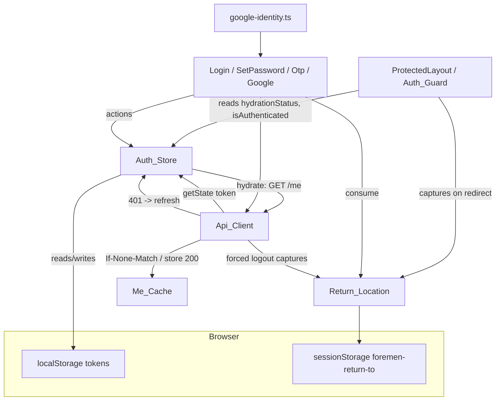
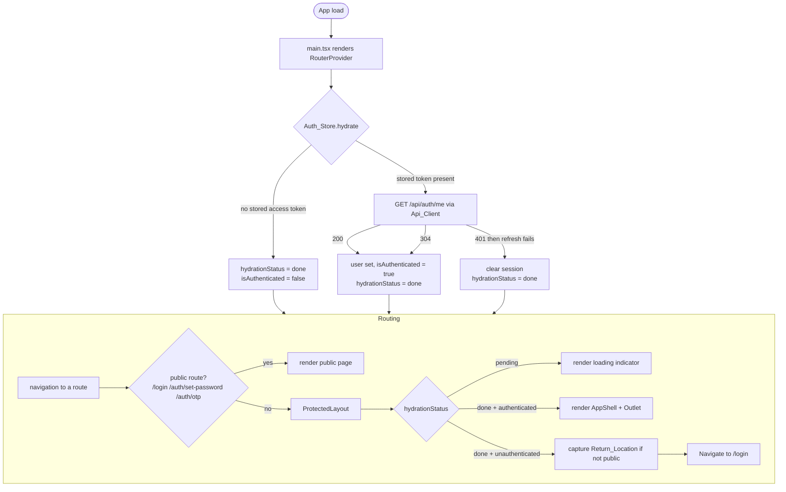
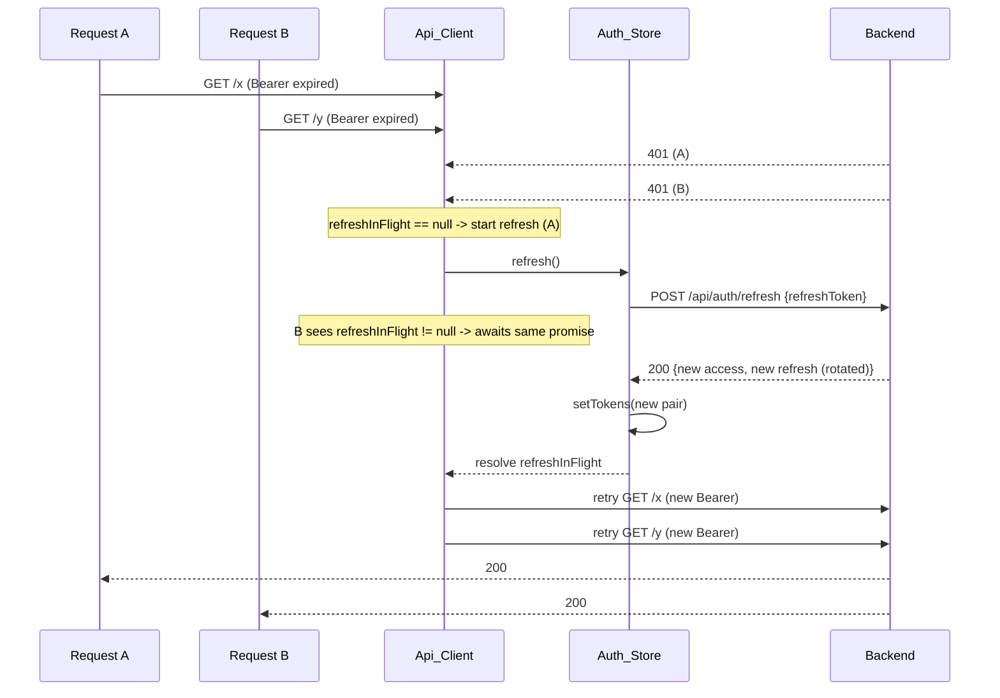
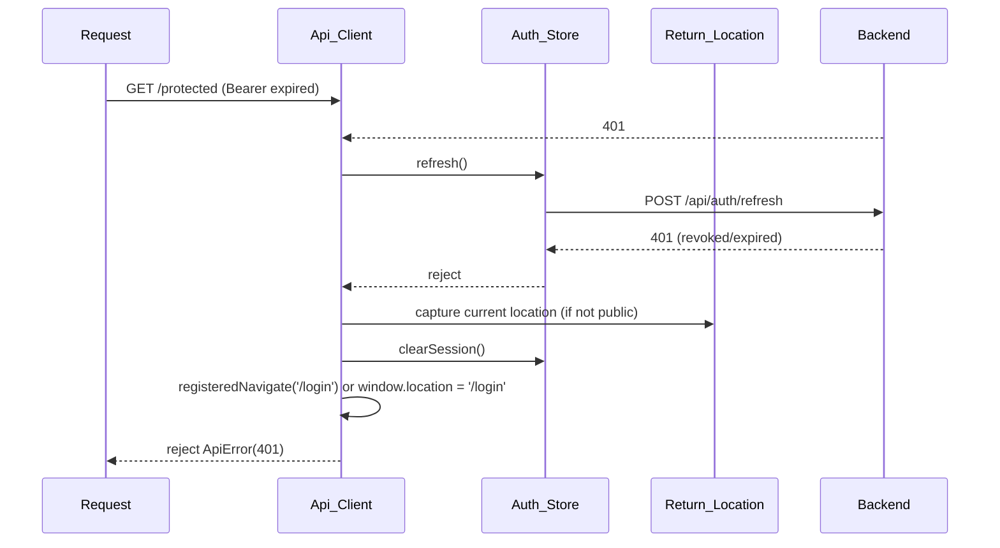
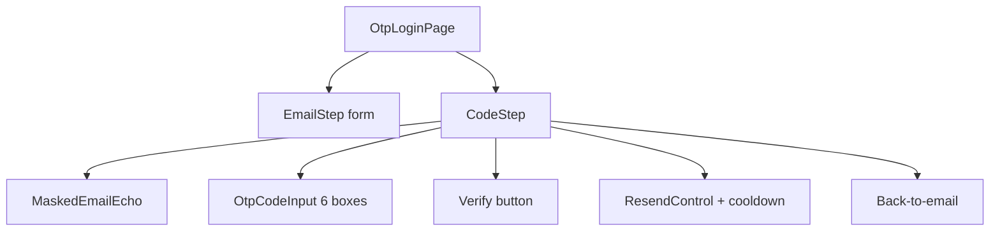
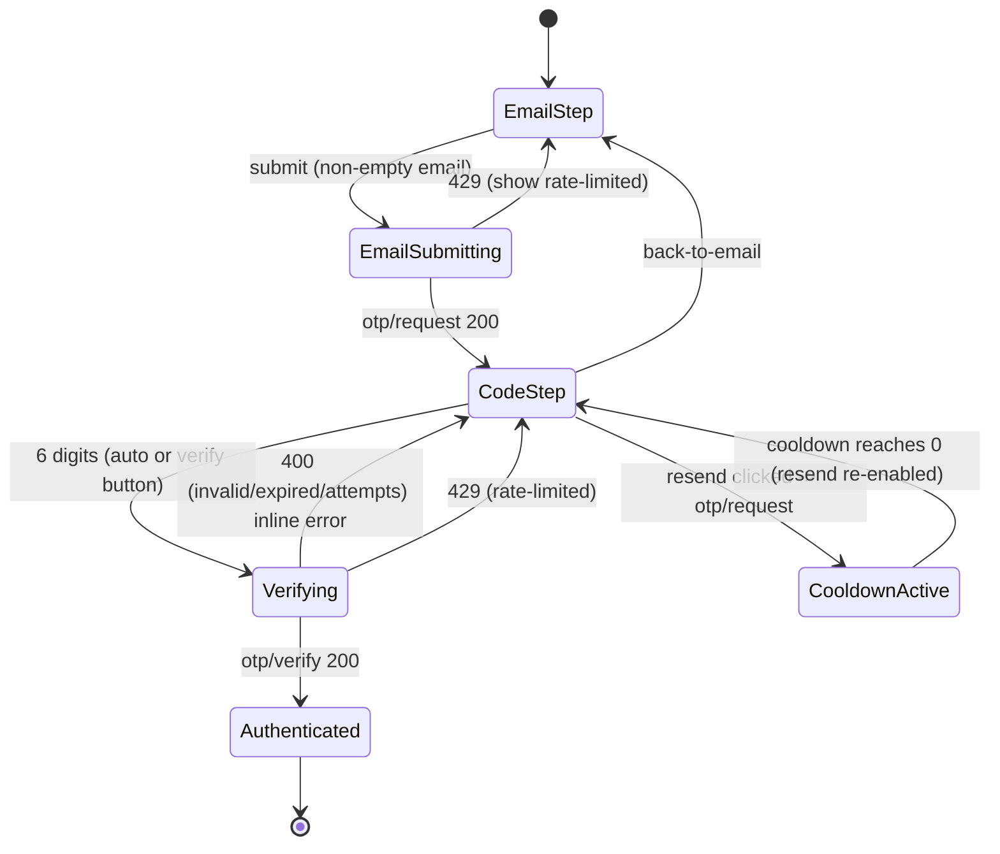

# Design Document

## Overview

FOR-03-06 delivers the frontend authentication layer for the Foremen web client plus the two backend capabilities it depends on (`/me` conditional requests and Google ID-token exchange). It turns the existing "everything is public under one `AppShell`" React app into an app with public auth routes, an authenticated-only guard, session hydration on load, automatic silent token refresh, deep-link preservation, and three sign-in flows (password, invite set-password, client OTP) plus Sign in with Google.

The design is organized around a small set of collaborating units:

- **Auth_Store** (`src/stores/auth-store.ts`) — the single source of truth for the session (user, tokens, hydration status) and the owner of `localStorage` token persistence.
- **Api_Client** (`src/lib/api-client.ts`) — a `fetch` wrapper that attaches `Authorization`/`Accept-Language`/`Content-Type`, throws a typed `ApiError`, and performs single, deduplicated refresh-and-retry on `401`.
- **Me_Cache** — the `{ currentUser, etag }` pair used for cheap conditional revalidation of `/me`.
- **Return_Location** — a `sessionStorage`-backed capture of the protected location a user could not reach, consumed after a successful login.
- **Auth_Guard / route restructure** — public routes outside `AppShell`; a `ProtectedLayout` that renders `AppShell` only when authenticated, shows a hydration loading state, and otherwise redirects to `/login`.
- **Pages** — `LoginPage`, `SetPasswordPage`, `OtpLoginPage`, plus the `OtpCodeInput` and `GoogleSignInButton` components.

Backend additions (in scope this spec):

- **`GET /api/auth/me` ETag support** — a strong ETag computed from a stable representation of the `CurrentUserResponse`, honoring `If-None-Match` and returning `304 Not Modified` when unchanged.
- **`POST /api/auth/google`** — verifies a Google ID token, looks up the user by verified email, and returns one of: the JWT pair for a linked ACTIVE account (`AUTHENTICATED`); a distinct `ACTIVATION_REQUIRED` payload carrying a freshly-minted set-password token for a linked INVITED account (no session); the deactivated error for a DEACTIVATED account; or `error.auth.google.no.account` when unlinked.

The design consumes the existing FOR-03-01/02/05 auth contract as-is and does not redesign it.

### Key design decisions

| Decision | Choice | Rationale |
|---|---|---|
| Token access outside React | Module-level `useAuthStore.getState()` | Api_Client is a plain module, not a component; Zustand stores are readable synchronously outside React, so the client always reads the live access token (Req 1.7). |
| `/me` fetch mechanism | Store-driven fetch via Api_Client (not a TanStack Query) | Hydration must run before any route renders and must gate the guard; a store action that Api_Client and the guard both observe is simpler than threading a query through a not-yet-mounted tree. TanStack Query stays for feature data. |
| Me_Cache persistence | In-memory (module/store) | The ETag is a cheap revalidation optimization, not durable state; a stale persisted ETag across reloads risks a `304` against an empty cache. Hydration always does a forced (no `If-None-Match`) fetch, so persistence buys nothing. |
| Return_Location storage | `sessionStorage` under `foremen-return-to` | Must survive the `/login` redirect **and** a full-page reload during hydration; a module variable would be lost on reload. `sessionStorage` is per-tab and cleared on tab close, matching a "return to where I was" scope. |
| Backend ETag computation | Explicit hash over the DTO's semantic fields | Content depends on server-side role/permission state, not just serialized bytes; `ShallowEtagHeaderFilter` would hash the rendered body and not reliably change on permission changes. Explicit computation lets us define exactly what "changed" means. |
| Google no-account status | `403 Forbidden` | The token is valid (authentication succeeded) but the subject is not authorized to have a session — a `403` semantic. `404` would leak "no such account" and conflate identity lookup with a REST resource. |
| Google account linking | Match verified Google email to `users.email` (username == email already) | No schema change needed; identity is already keyed by email. An optional `google_sub` column is noted but deferred. |
| Google login for an INVITED account | Do **not** issue a session; mint a fresh FOR-03-02 invite/set-password token and return a distinct `ACTIVATION_REQUIRED` payload (HTTP 200) carrying that token | Google has cryptographically verified email ownership, but set-password remains the single activation gate: the account must set a password to become ACTIVE. Reusing the FOR-03-02 invite token (same TTL/semantics) means the minted token is consumable by the existing `POST /api/auth/set-password` with no new token type. HTTP 200 because Google auth itself succeeded; the response carries **no** access/refresh token. |
| `POST /api/auth/google` response contract | Dedicated wrapper DTO `GoogleLoginResponse { status, tokens, setPasswordToken }` over overloading `TokenResponse` | The endpoint can now return either a session (`AUTHENTICATED`) or an activation bridge (`ACTIVATION_REQUIRED`). Overloading `TokenResponse` with nullable extra fields would blur the security invariant "no tokens unless ACTIVE"; a discriminated wrapper makes the two outcomes explicit and lets the client branch on `status` without guessing from null fields. Both stay HTTP 200 because Google verification succeeded in both cases. |

## Architecture

### Frontend module map

```
src/
  stores/
    auth-store.ts          # Auth_Store: session state + token persistence + actions
  lib/
    api-client.ts          # Api_Client: fetch wrapper, ApiError, 401 refresh/retry/queue
    me-cache.ts            # Me_Cache: { currentUser, etag } + invalidate()
    return-location.ts     # Return_Location: capture/consume/clear (sessionStorage)
    google-identity.ts     # thin wrapper around Google Identity Services (GIS)
  app/
    router.tsx             # restructured route tree (public vs ProtectedLayout)
    guards/
      ProtectedLayout.tsx  # Auth_Guard: hydration gate + redirect
    auth/
      LoginPage.tsx
      SetPasswordPage.tsx
      OtpLoginPage.tsx
      components/
        OtpCodeInput.tsx
        GoogleSignInButton.tsx
        AuthCard.tsx        # shared layout/label/error scaffolding
      api/
        auth-api.ts        # login/refresh/logout/me/set-password/otp/google via Api_Client
      hooks/
        useAuthRedirect.ts  # resolve Return_Location -> navigate target
```

### High-level component relationships



### Route, guard, and hydration flow



## Components and Interfaces

### Auth_Store (`src/stores/auth-store.ts`)

Zustand store; the single source of truth for the session and the only writer of Token_Storage.

```ts
type HydrationStatus = 'pending' | 'done'

interface CurrentUser {
  id: number
  name: string
  email: string
  roleCode: string
  permissions: { resource: string; operations: string[] }[]
}

interface TokenResponse {
  accessToken: string
  refreshToken: string
  expiresIn: number
}

interface AuthState {
  user: CurrentUser | null
  accessToken: string | null
  refreshToken: string | null
  isAuthenticated: boolean          // derived: user != null && accessToken != null
  hydrationStatus: HydrationStatus

  // public actions
  login(email: string, password: string): Promise<void>
  logout(): Promise<void>
  refresh(): Promise<void>          // used by Api_Client refresh path
  hydrate(): Promise<void>

  // internal setters (used by auth flows / Api_Client)
  setTokens(tokens: TokenResponse): void   // writes Token_Storage + state
  setUser(user: CurrentUser): void
  clearSession(): void                     // removes Token_Storage + resets state
}
```

Token_Storage keys (fixed, `foremen-*` convention):

- `foremen-access-token`
- `foremen-refresh-token`

Persistence helpers mirror `theme-store.ts`: every `localStorage` read/write is wrapped in `try/catch`; on error the store keeps operating from in-memory state and never throws to the caller (Req 1.6). `isAuthenticated` is recomputed on every state transition as `user != null && accessToken != null` (Req 1.5). `setTokens` writes both tokens to `localStorage`; `clearSession` removes both keys and resets `user/accessToken/refreshToken/isAuthenticated` (Req 1.3, 1.4).

`hydrate()`:
1. Read `foremen-access-token`. If absent → set `hydrationStatus = 'done'`, `isAuthenticated = false`, return (Req 4.4).
2. If present → set `accessToken`/`refreshToken` from storage, call `authApi.getMe()` through Api_Client (which sends the bearer token and any cached `If-None-Match`).
3. On `200` → `setUser`, `isAuthenticated = true`. On `304` → reuse `Me_Cache.currentUser` as user. On failure that Api_Client could not recover (refresh failed) → `clearSession()`.
4. Always finish with `hydrationStatus = 'done'` (Req 4.1–4.3, 4.5).

After every successful auth transition (login, set-password, otp-verify, google), the flow calls `setTokens(tokens)` then a **forced** `authApi.getMe()` (no `If-None-Match`, because Me_Cache was invalidated) and `setUser` (Req 4.6).

`logout()` reads the stored refresh token, calls `authApi.logout(refreshToken)` (best-effort; ignores result/network error), then `clearSession()` and invalidates Me_Cache, and the caller redirects to `/login` (Req 8.1–8.4).

`refresh()` is the store-level operation Api_Client invokes: it POSTs the current refresh token to `/api/auth/refresh`, and on success calls `setTokens` with the rotated pair (Req 3.2, 3.7).

### Api_Client (`src/lib/api-client.ts`)

A typed `fetch` wrapper. Public surface:

```ts
export class ApiError extends Error {
  constructor(
    public status: number,
    public message: string,
    public code?: string,          // ForemenApiException message code when derivable
  ) { super(message) }
}

interface RequestOptions {
  method?: string
  body?: unknown                    // serialized as JSON when present
  headers?: Record<string, string>
  skipAuthRefresh?: boolean         // set true for the refresh call itself
  ifNoneMatch?: string              // for GET /me conditional requests
  parse304AsSuccess?: boolean       // /me path: 304 -> resolve, not throw
}

export async function apiRequest<T>(path: string, options?: RequestOptions): Promise<T>
export function registerNavigate(fn: (to: string) => void): void  // app registers a navigation callback
```

Header assembly per request:

- `Authorization: Bearer <token>` when `useAuthStore.getState().accessToken` is non-null (else omitted) — module-level store access, no React hook (Req 2.1, 2.2, 1.7).
- `Accept-Language: ru` when the active Locale is `ru`, else `pl` (read from `localStorage['foremen-locale']`, PL fallback for unset/other) — matches the existing `users-api.ts` convention (Req 2.3, 10.4).
- `Content-Type: application/json` when a JSON body is present (Req 2.4).
- `If-None-Match` when `ifNoneMatch` is supplied (Req 13.2).

Response handling:

- OK (`2xx`) → parse JSON (or return `undefined` for `204`).
- `304` with `parse304AsSuccess` → resolve with a sentinel indicating "not modified" so the `/me` caller reuses Me_Cache; never thrown (Req 13.3, 13.7).
- Non-OK → build `ApiError(status, message, code?)`. The body is parsed as the `ForemenApiException`/`ErrorResponse` shape `{ status, error, message, path, fieldErrors? }`; `message` is taken verbatim (server-localized). If the body is not JSON, use a generic fallback message keyed by an i18n string and never throw a parse exception (Req 2.5, 2.6, 10.3).

#### 401 refresh-and-retry with a shared in-flight promise

The client holds a module-level `let refreshInFlight: Promise<void> | null`. Algorithm for a `401`:

1. If the request is the refresh call itself (`skipAuthRefresh`) → do **not** refresh; propagate the `401` as an `ApiError` (Req 3.1 exclusion). Then the caller of refresh treats it as refresh failure.
2. Read `refreshToken` from the store. If absent → capture Return_Location (if current location is not a Public_Route), `clearSession()`, redirect to `/login`, and reject with the `401` `ApiError` (Req 3.6, 3.8).
3. If `refreshInFlight` is null → set `refreshInFlight = doRefresh()` where `doRefresh` calls `useAuthStore.getState().refresh()` and clears `refreshInFlight` in a `finally`. If `refreshInFlight` is non-null → reuse it (dedupe). This guarantees at most one `POST /api/auth/refresh` across all concurrent `401`s (Req 3.4).
4. `await refreshInFlight`:
   - On success → retry the original request **once** with the new access token attached (read fresh from the store). The retried request never triggers another refresh (a `401` on retry becomes a forced logout) (Req 3.2, 3.3).
   - On failure → capture Return_Location (if not public), `clearSession()`, redirect to `/login`, and reject the original caller with an `ApiError` (Req 3.5).



Failure branch:



Redirect from a non-React module: the app calls `registerNavigate(navigate)` once (from a small component inside the router that has access to `useNavigate`), and Api_Client prefers that callback; if none is registered yet (e.g. during early hydration), it falls back to `window.location.assign('/login')`.

### auth-api.ts

Thin typed functions over `apiRequest`, one per endpoint:

```ts
login(email, password): Promise<TokenResponse>       // POST /api/auth/login
refreshTokens(refreshToken): Promise<TokenResponse>  // POST /api/auth/refresh (skipAuthRefresh)
logout(refreshToken): Promise<void>                  // POST /api/auth/logout
getMe(): Promise<CurrentUser | NotModified>          // GET /api/auth/me (If-None-Match, parse304AsSuccess)
setPassword(token, password): Promise<TokenResponse> // POST /api/auth/set-password
otpRequest(email): Promise<void>                     // POST /api/auth/otp/request
otpVerify(email, code): Promise<TokenResponse>       // POST /api/auth/otp/verify
googleExchange(idToken): Promise<GoogleLoginResponse>// POST /api/auth/google (AUTHENTICATED | ACTIVATION_REQUIRED)
```

`getMe()` reads `Me_Cache.etag` and passes it as `ifNoneMatch`; on `200` it writes `{ currentUser, etag }` to Me_Cache and returns the user; on `304` it returns a `NotModified` marker and the caller reuses `Me_Cache.currentUser` (Req 13.1–13.4).

### Me_Cache (`src/lib/me-cache.ts`)

In-memory module state (justified above):

```ts
interface MeCache { currentUser: CurrentUser | null; etag: string | null }
export function getMeCache(): MeCache
export function setMeCache(user: CurrentUser, etag: string | null): void
export function invalidateMeCache(): void   // clears etag so next /me is forced (no If-None-Match)
```

Invalidated on login, set-password, otp-verify, google, and logout so the next `/me` is a forced refetch (Req 13.5).

Interaction with TanStack Query: `/me` is intentionally **not** a TanStack query — it is fetched by the store during hydration and after auth transitions, and revalidated opportunistically. Feature data continues to use TanStack Query. This keeps `/me` outside the query cache lifecycle and lets the store gate the guard directly.

### Return_Location (`src/lib/return-location.ts`)

```ts
const KEY = 'foremen-return-to'
const PUBLIC = ['/login', '/auth/set-password', '/auth/otp']
export function captureReturnLocation(pathPlusQuery: string): void  // no-op if public route
export function consumeReturnLocation(): string | null              // read + clear
export function clearReturnLocation(): void
```

`captureReturnLocation` refuses to store any Public_Route (Req 3.8, 9.6, 12.5). It is called by the Auth_Guard on redirect (Req 12.1) and by Api_Client on forced logout (Req 12.2). All login success paths call `consumeReturnLocation()`; if it returns a value they navigate there and it is cleared, otherwise they navigate to `/` (Req 12.3, 12.4, 12.6). Stored under `sessionStorage` so it survives the redirect and a full-page reload during hydration.

### Auth_Guard / route restructure (`src/app/router.tsx`, `ProtectedLayout.tsx`)

The route tree is restructured so public auth routes live **outside** `AppShell`:

```tsx
createBrowserRouter([
  { path: '/login', element: <LoginPage /> },
  { path: '/auth/set-password', element: <SetPasswordPage /> },
  { path: '/auth/otp', element: <OtpLoginPage /> },
  {
    path: '/',
    element: <ProtectedLayout />,   // guard; renders <AppShell/> (with <Outlet/>) when authed
    children: [ /* all existing protected routes unchanged */ ],
  },
])
```

`ProtectedLayout`:

```tsx
function ProtectedLayout() {
  const { hydrationStatus, isAuthenticated } = useAuthStore()
  const location = useLocation()
  if (hydrationStatus === 'pending') return <AuthLoading />           // Req 9.4, 4.5
  if (!isAuthenticated) {
    captureReturnLocation(location.pathname + location.search)        // Req 9.2, 12.1 (no-op if public)
    return <Navigate to="/login" replace />
  }
  return <AppShell />                                                  // renders its own <Outlet/>
}
```

The guard decides on authentication only — no permission checks (Req 9.5, 12.7). Public routes are exactly the three listed (Req 9.1).

### Pages and components

**LoginPage** — `react-hook-form` + `zod` (email required + format, password required). Submits `login()`; on `401`/`403` surfaces `ApiError.message` (server-localized) in a form-level alert (Req 5.5, 5.6, 10.3). Submit disabled + spinner while in flight (Req 5.7). If already authenticated, redirect away using Return_Location or `/` (Req 5.8). Renders `GoogleSignInButton`.

**SetPasswordPage** — reads `token` from `?token=`; if missing/empty shows an invalid-link message and does not submit (Req 6.1, 6.2). Fields: password + confirm; zod enforces 8..72 and confirm-match (Req 6.4, 6.5). Submits `setPassword()`; `400` → `ApiError.message` (Req 6.8); success → auto-login + navigate to Return_Location/`/` (Req 6.7). **No page change** is required to support the Google activation bridge: the `token` may now originate either from an invitation email or from the `ACTIVATION_REQUIRED` Google response — the page treats them identically because the minted token is the same FOR-03-02 invite/set-password token. Its existing success path consumes Return_Location (via `consumeReturnLocation()` in `useAuthRedirect`), so a user who started at a protected deep link, went through Google → set-password, still lands on that Return_Location (fallback `/`) (Req 12.8, 14.6).

**OtpLoginPage** — two-step state machine (below). Email step → `otpRequest`, always advance on `200` (anti-enumeration) (Req 7.2). Code step → `OtpCodeInput` (6 boxes) + explicit verify + masked email echo + resend-with-cooldown (Req 7.4–7.20).

**OtpCodeInput** — controlled 6-box segmented input:
- 6 controlled single-char boxes; one decimal digit each; `inputMode="numeric"`, `autoComplete="one-time-code"`, `pattern="[0-9]*"`.
- Typing a digit advances focus to the next box; Backspace in an empty box moves focus to the previous box (Req 7.5).
- Pasting distributes up to 6 digits across boxes (Req 7.6).
- When all 6 filled → auto-submit; an explicit verify button remains for keyboard/AT users; auto-submit must not trap focus (Req 7.7, 7.8, 11.7).
- Each box has an `aria-label` ("Digit N of 6"); the group has a programmatically-linked label (Req 11.7).

**GoogleSignInButton** — see Google Sign-In section.

Component tree:



OTP state machine:



Resend cooldown default **60 seconds**, exposed as a configurable constant (`OTP_RESEND_COOLDOWN_SECONDS`). While counting down the resend control is disabled and shows the remaining seconds; at zero it re-enables (Req 7.17–7.19).

### Google Sign-In (frontend)

- **`google-identity.ts`** — a thin wrapper that lazily injects the Google Identity Services (GIS) script (`https://accounts.google.com/gsi/client`) and initializes with `VITE_GOOGLE_CLIENT_ID` (read from `import.meta.env.VITE_GOOGLE_CLIENT_ID`). Recommended approach: render the GIS button (`google.accounts.id.renderButton`) or trigger `google.accounts.id.prompt()`, receiving a credential (the Google ID token) in the callback. This adds one runtime dependency: the GIS script (no npm package strictly required; optionally `@types/google.accounts` for typing).
- **`GoogleSignInButton`** — on credential callback, obtains the `Google_ID_Token`, disables the control + shows a spinner (Req 14.9), and calls `authApi.googleExchange(idToken)`, which now resolves to a `GoogleLoginResponse` (Req 14.2, 14.3).
  - `200` with `status === 'AUTHENTICATED'` → `setTokens(response.tokens)` + hydrate + navigate to Return_Location/`/` (Req 14.4).
  - `200` with `status === 'ACTIVATION_REQUIRED'` → the account is INVITED and Google verified email ownership, but no session was issued. **Store no tokens** (there are none in the response) and navigate to `/auth/set-password?token=<response.setPasswordToken>` (Req 14.5, 14.7, 14.14). The captured Return_Location is left untouched in `sessionStorage` (`foremen-return-to`), so it survives this second redirect and is consumed by SetPasswordPage on its auto-login success (Req 14.6, 12.8).
  - `403` with code `error.auth.google.no.account` → show the distinct contact-admin message (i18n key `auth.google.noAccount`), **not** a generic invalid-credentials message (Req 14.9). Because the backend already localizes the message body, `ApiError.message` can be shown directly; the client additionally keys off `ApiError.code`/status to guarantee the distinct message even if wording changes.
  - `403` deactivated (`error.auth.account.deactivated`) → show `ApiError.message`, store no token (Req 14.8).
  - User cancels/dismisses the prompt → return to idle, no stuck error/loading (Req 14.10).
  - Client-side Google failure before a token is obtained → generic auth-failure message `auth.google.failed` (Req 14.11).
  - Any other non-`200` → show `ApiError.message` (Req 14.12).
  - While the exchange is in flight → the control is disabled + spinner (Req 14.13).

Note the security invariant on the client side (Req 14.14): the `ACTIVATION_REQUIRED` branch never calls `setTokens` and never writes Token_Storage — it only forwards the raw `setPasswordToken` into the set-password URL, and the user is not treated as authenticated. The single activation gate remains `POST /api/auth/set-password`.

**Google flow branch table:**

| `googleExchange` outcome | Client behavior | Req |
|---|---|---|
| 200 `AUTHENTICATED` (tokens present) | `setTokens` + hydrate + navigate Return_Location/`/` | 14.4 |
| 200 `ACTIVATION_REQUIRED` (setPasswordToken present, no tokens) | Navigate `/auth/set-password?token=<setPasswordToken>`, store no tokens, not authenticated, preserve Return_Location, not treated as an error | 14.5, 14.6, 14.7, 14.14, 12.8 |
| 403 `error.auth.account.deactivated` | `ApiError.message`, store no token | 14.8 |
| 403 `error.auth.google.no.account` | Distinct contact-admin message | 14.9 |
| Prompt cancel/dismiss | Return to idle | 14.10 |
| Client failure pre-token | Generic `auth.google.failed` | 14.11 |
| Other non-200 | `ApiError.message` | 14.12 |
| In flight | Disable control + spinner | 14.13 |

**Google flow sequence (with ACTIVATION_REQUIRED branch):**

```mermaid
sequenceDiagram
  participant U as User
  participant BTN as GoogleSignInButton
  participant API as authApi.googleExchange
  participant BE as POST /api/auth/google
  participant SPP as SetPasswordPage

  U->>BTN: click Sign in with Google
  BTN->>BTN: GIS -> Google_ID_Token
  BTN->>API: googleExchange(idToken)
  API->>BE: { idToken }
  alt ACTIVE account
    BE-->>API: 200 { status: AUTHENTICATED, tokens }
    API-->>BTN: GoogleLoginResponse(AUTHENTICATED)
    BTN->>BTN: setTokens + hydrate
    BTN->>U: navigate Return_Location / '/'
  else INVITED account
    BE-->>API: 200 { status: ACTIVATION_REQUIRED, setPasswordToken }
    API-->>BTN: GoogleLoginResponse(ACTIVATION_REQUIRED)
    Note over BTN: store NO tokens; Return_Location left in sessionStorage
    BTN->>SPP: navigate /auth/set-password?token=<setPasswordToken>
    SPP->>SPP: submit set-password -> 200 TokenResponse (auto-login)
    SPP->>U: navigate Return_Location / '/'
  else no linked account
    BE-->>API: 403 error.auth.google.no.account
    API-->>BTN: ApiError
    BTN->>U: distinct contact-admin message
  end
```

### i18n keys (new)

Added to both `src/locales/pl.json` and `src/locales/ru.json` under an `auth` namespace, every key non-blank in both (Req 10.1, 10.2, 10.5):

```
auth.login.title / .email / .password / .submit / .submitting
auth.login.validation.emailRequired / .emailInvalid / .passwordRequired
auth.setPassword.title / .newPassword / .confirmPassword / .submit / .submitting
auth.setPassword.invalidLink
auth.setPassword.validation.length (8..72) / .mismatch
auth.otp.emailStep.title / .email / .requestCode
auth.otp.codeStep.title / .sentTo / .verify / .verifying / .back
auth.otp.codeInput.groupLabel / .digitLabel  (with {{index}})
auth.otp.resend / .resendIn  (with {{seconds}})
auth.otp.validation.emailRequired / .codeLength
auth.google.button / .noAccount / .failed
auth.guard.loading
auth.logout
auth.error.generic   (Api_Client non-JSON fallback)
```

Confirmed contact-admin wording:
- RU `auth.google.noAccount`: "Обратитесь к администратору для получения учётной записи"
- PL `auth.google.noAccount`: "Skontaktuj się z administratorem, aby uzyskać konto"

Backend auth error messages are surfaced verbatim from `ApiError.message` (server-localized via `Accept-Language`) rather than re-mapped client-side (Req 10.3).

### Accessibility & interaction states

Applies to all auth forms (Req 11.1–11.7): visible `<label htmlFor>` for every input; password/confirm use `type="password"`; validation and backend errors rendered with `role="alert"` and `aria-describedby` linkage to the field or form; submit controls `disabled` + `aria-busy` while in flight; full keyboard operation including Enter-to-submit; logical tab order and accessible names; OTP group labeled and auto-submit does not trap focus.

## Backend design (in scope)

### A. `GET /api/auth/me` ETag / conditional requests

`AuthController.me` changes from returning `ResponseEntity.ok(dto)` to computing an explicit strong ETag and honoring `If-None-Match`:

```java
@GetMapping("/me")
public ResponseEntity<CurrentUserResponse> me(
        @AuthenticationPrincipal Long userId,
        @RequestHeader(value = HttpHeaders.IF_NONE_MATCH, required = false) String ifNoneMatch) {
    CurrentUserResponse dto = authService.currentUser(userId);
    String etag = MeETag.compute(dto);                 // strong quoted ETag
    if (etag.equals(ifNoneMatch)) {
        return ResponseEntity.status(HttpStatus.NOT_MODIFIED)
                .eTag(etag)
                .cacheControl(CacheControl.noCache().cachePrivate())
                .build();                               // empty body
    }
    return ResponseEntity.ok()
            .eTag(etag)
            .cacheControl(CacheControl.noCache().cachePrivate())
            .body(dto);
}
```

**ETag computation (`MeETag.compute`)**: a stable, canonical string built from the semantic fields, then SHA-256 hashed and hex-encoded (wrapped in quotes for a strong validator):

```
canonical = userId + "|" + name + "|" + email + "|" + roleCode + "|" +
            sortedPermissions   // resources sorted; operations within each resource sorted
etag = "\"" + hexSha256(canonical) + "\""
```

Because the canonical string is built from `{ userId, name, email, roleCode, sorted permissions }`, the ETag changes exactly when identity/profile, role, role's permissions, or role membership change, and is stable otherwise (Req 13 backend dependency). `Cache-Control: no-cache, private` forces the client to always revalidate via `If-None-Match` rather than serve from a local cache without contacting the server.

**Why explicit computation over `ShallowEtagHeaderFilter`**: the shallow filter hashes the rendered response bytes. That is byte-sensitive (JSON key ordering, whitespace) and, more importantly, could not express the "change when role/permission/membership changes" contract independently of serialization. Explicit computation over sorted semantic fields makes the contract precise and order-independent.

**Permission-cache staleness**: FOR-03-03 caches permission evaluation in Caffeine (5-min TTL). To ensure the ETag never outlives a real role/permission change, `authService.currentUser` reads permissions from the live, DB-backed role→resource→operation graph (as it already does in the current `currentUser` implementation via `user.getRole().getRoleResources()`), so the ETag is computed from authoritative state, not the evaluator cache. The Caffeine permission-evaluation cache (used for authorization decisions) is orthogonal and does not feed the ETag. This avoids a stale ETag surviving a permission change.

**CORS / header exposure**: the browser can only read `ETag` on a cross-origin response if it is in `Access-Control-Expose-Headers`. In dev the app is same-origin via the Vite proxy (`/api` → `:8080`), so no exposure is strictly required, but to be correct in any deployment `CorsConfig` must add `ETag` to exposed headers (`.exposedHeaders("ETag")`). Note for prod: whatever reverse proxy/CDN fronts the API must not strip `ETag`/`If-None-Match` and should honor `Cache-Control: private, no-cache`.

`SecurityConfig` already requires `authenticated()` for `/api/auth/me`; the ETag change is transparent to security. A `304` is still a response from an authenticated request, so no rule change is needed.

### B. `POST /api/auth/google`

New DTOs and endpoint. Because the endpoint can now return either a session or an activation bridge, the response is a dedicated wrapper `GoogleLoginResponse` (justification in Key design decisions), and both outcomes return HTTP 200 (Google verification succeeded):

```java
public record GoogleLoginRequest(@NotBlank String idToken) {}

/**
 * Discriminated response for POST /api/auth/google.
 *  - AUTHENTICATED:      tokens populated, setPasswordToken null (linked ACTIVE account)
 *  - ACTIVATION_REQUIRED: tokens null, setPasswordToken populated (linked INVITED account)
 * Security invariant: no access/refresh token is ever present when status != AUTHENTICATED.
 */
public record GoogleLoginResponse(
        String status,               // "AUTHENTICATED" | "ACTIVATION_REQUIRED"
        TokenResponse tokens,        // non-null iff AUTHENTICATED
        String setPasswordToken) {   // non-null iff ACTIVATION_REQUIRED

    static GoogleLoginResponse authenticated(TokenResponse tokens) {
        return new GoogleLoginResponse("AUTHENTICATED", tokens, null);
    }
    static GoogleLoginResponse activationRequired(String setPasswordToken) {
        return new GoogleLoginResponse("ACTIVATION_REQUIRED", null, setPasswordToken);
    }
}

// AuthController
@PostMapping("/google")
public ResponseEntity<GoogleLoginResponse> google(@RequestBody @Valid GoogleLoginRequest request) {
    return ResponseEntity.ok(authService.loginWithGoogle(request.idToken()));
}
```

`AuthService.loginWithGoogle(String idToken)` returns `GoogleLoginResponse`:
1. Verify the token with a `GoogleIdTokenVerifier` (from `com.google.api-client:google-api-client` — new backend dependency) configured with the audience = `foremen.google.client-id`. On any verification failure (bad signature, wrong audience, expired) → `ForemenApiException(UNAUTHORIZED, "error.auth.google.token.invalid")` (Req 14.7 client counterpart).
2. Extract the verified email from the token payload.
3. `userDao.findByEmail(email.toLowerCase())`:
   - **Not found** → `ForemenApiException(FORBIDDEN, "error.auth.google.no.account")` (Req 14.5). `403` chosen over `404`: the token is valid, the subject simply has no session-eligible account; `404` would frame identity as a missing REST resource and leak account existence semantics inconsistently with the anti-enumeration posture elsewhere.
   - **ACTIVE** → `GoogleLoginResponse.authenticated(issueTokens(user))` (reuse the existing employee TTL path). HTTP 200.
   - **INVITED** → **do not issue a session.** Mint a fresh set-password token by reusing the FOR-03-02 invite mechanism (the same path `resend` uses to generate an `invite_token` with its standard TTL), then return `GoogleLoginResponse.activationRequired(rawToken)`. HTTP 200. The response carries **no** access/refresh token (Req 14.5, 14.14). This token is consumable by the existing `POST /api/auth/set-password`, so activation still flows through the single set-password gate.
   - **DEACTIVATED** → reuse `error.auth.account.deactivated` (403).

**Minting the set-password token (reuse FOR-03-02, minimal addition).** FOR-03-02's `InviteService` produces the invite/set-password token via its private `generateAndSend(UserEntity)` (returns an `InviteTokenEntity` whose `token` is a UUID with the configured TTL), consumed later by `POST /api/auth/set-password` through `InviteService.consume(token)`. The public API today is `issueInvite(user)` (returns `void`, only emails the token) and `resend(userId)` (returns `void`). Neither exposes the **raw** token value that `loginWithGoogle` must place into the `ACTIVATION_REQUIRED` response. The minimal addition is a small public method on `InviteService` that mints (or re-mints) an invite token for an INVITED user and **returns the raw token string** without requiring an email round-trip, e.g.:

```java
// InviteService (FOR-03-02) — minimal addition for the Google activation bridge
/** Invalidate outstanding tokens for an INVITED user, issue a fresh one, and return the raw token value.
 *  Reuses the exact generation + TTL of resend/issueInvite; does not introduce a new token type. */
public String mintSetPasswordToken(UserEntity user);   // returns the UUID token string
```

This reuses the existing generation and TTL (invalidate `findByUserIdAndUsedFalse`, then `generateAndSend`-style creation), only surfacing the raw value. `loginWithGoogle` calls `inviteService.mintSetPasswordToken(user)` for the INVITED branch and returns it in the response. Whether it also sends the invitation email is a design detail: since the token is delivered directly in the response, emailing is optional and MAY be skipped for this path to avoid a redundant email. Keep the addition scoped to returning the token; do not otherwise change FOR-03-02's contract.

**Security notes (bridge):** the set-password token is minted only after Google cryptographically verified email ownership; the Google path never returns tokens for a non-ACTIVE account (the `ACTIVATION_REQUIRED` response has `tokens == null`); and `POST /api/auth/set-password` remains the single activation gate that flips the account to ACTIVE and issues the first session.

**Account linking model**: because `username == email` already, linking is by matching the verified Google email to `users.email`. No schema change is required for basic linking. An optional `google_sub` column (to pin a Google subject id to a user and detect email reuse) is desirable long-term but is deliberately out of scope here to keep the change minimal; email matching is sufficient for this spec.

**Config**: a `foremen.google` properties record bound from `application.yml`:

```yaml
foremen:
  google:
    client-id: ${FOREMEN_GOOGLE_CLIENT_ID:}
```

```java
@Validated
@ConfigurationProperties(prefix = "foremen.google")
public record GoogleProperties(String clientId) {}
```

Also add the same block to `application-docker.yml` (so the Dockerized stack binds `FOREMEN_GOOGLE_CLIENT_ID`). Frontend reads `VITE_GOOGLE_CLIENT_ID`.

**Security reachability**: `POST /api/auth/google` is publicly reachable via the existing `/api/auth/**` `permitAll` rule (the `/api/auth/me` and `/api/auth/resend-invite` matchers are more specific and do not capture `/google`). Verified against `SecurityConfig`; a documenting note/test asserts `/api/auth/google` is not caught by the `authenticated()` or `hasRole("ADMIN")` matchers. No new matcher is required.

**New message codes** (added to both `messages.properties` (PL base) and `messages_ru.properties` (RU)):

```
# messages.properties (PL)
error.auth.google.no.account=Skontaktuj się z administratorem, aby uzyskać konto.
error.auth.google.token.invalid=Nie udało się zweryfikować logowania Google. Spróbuj ponownie.

# messages_ru.properties (RU)
error.auth.google.no.account=Обратитесь к администратору для получения учётной записи.
error.auth.google.token.invalid=Не удалось проверить вход через Google. Попробуйте ещё раз.
```

## Data Models

### Frontend types

```ts
type HydrationStatus = 'pending' | 'done'
interface CurrentUser { id: number; name: string; email: string; roleCode: string; permissions: PermissionView[] }
interface PermissionView { resource: string; operations: string[] }
interface TokenResponse { accessToken: string; refreshToken: string; expiresIn: number }
interface MeCache { currentUser: CurrentUser | null; etag: string | null }
class ApiError extends Error { status: number; message: string; code?: string }

// POST /api/auth/google response (discriminated on status)
type GoogleLoginStatus = 'AUTHENTICATED' | 'ACTIVATION_REQUIRED'
interface GoogleLoginResponse {
  status: GoogleLoginStatus
  tokens: TokenResponse | null        // non-null iff AUTHENTICATED
  setPasswordToken: string | null     // non-null iff ACTIVATION_REQUIRED
}
```

### Storage keys

| Store | Key | Location | Owner |
|---|---|---|---|
| Access_Token | `foremen-access-token` | localStorage | Auth_Store |
| Refresh_Token | `foremen-refresh-token` | localStorage | Auth_Store |
| Return_Location | `foremen-return-to` | sessionStorage | return-location.ts |
| Locale | `foremen-locale` | localStorage | existing i18n |

### Backend

No schema change. New DTOs `GoogleLoginRequest { idToken }` and `GoogleLoginResponse { status, tokens, setPasswordToken }` (discriminated on `status`; `tokens` non-null iff `AUTHENTICATED`, `setPasswordToken` non-null iff `ACTIVATION_REQUIRED`); new properties record `GoogleProperties { clientId }`; `CurrentUserResponse` unchanged (ETag derived from it). `permissions` continues to be derived from the live role graph. The Google activation bridge reuses FOR-03-02's `invite_tokens` (no new token type); the only FOR-03-02 addition is a public `InviteService.mintSetPasswordToken(UserEntity): String` that returns the raw invite/set-password token so `loginWithGoogle` can return it in the `ACTIVATION_REQUIRED` response.

## Correctness Properties

*A property is a characteristic or behavior that should hold true across all valid executions of a system — essentially, a formal statement about what the system should do. Properties serve as the bridge between human-readable specifications and machine-verifiable correctness guarantees.*

Much of this spec is UI rendering (pages, guard states, loading indicators) and integration wiring (Google verification, MockMvc flows) that is best covered by example-based, integration, and snapshot tests (see Testing Strategy). The properties below capture the parts with genuine input-driven logic: the Api_Client refresh queue, the OTP input, the Return_Location and Me_Cache state, the `isAuthenticated` derivation, and the backend ETag function.

### Property 1: isAuthenticated equals presence of both user and access token

*For any* combination of `user` (present or null) and `accessToken` (present or null) in the Auth_Store, `isAuthenticated` SHALL be true if and only if both `user` and `accessToken` are non-null.

**Validates: Requirements 1.5**

### Property 2: A single refresh serves all concurrent 401s

*For any* number N of concurrent requests (N ≥ 1) that each receive a `401` while no refresh is yet in flight, the Api_Client SHALL invoke `POST /api/auth/refresh` exactly once, and every one of the N requests SHALL be retried exactly once with the resulting new access token.

**Validates: Requirements 3.1, 3.2, 3.3, 3.4, 3.7**

### Property 3: A repeated 401 does not loop and forces logout

*For any* request whose original and retried attempts both return `401`, the Api_Client SHALL attempt the refresh path at most once and then force a logout (clear session, capture Return_Location if the current location is not a Public_Route, redirect to `/login`) rather than refreshing again.

**Validates: Requirements 3.3, 3.5, 3.6**

### Property 4: Return_Location round-trips for protected paths and is never a public route

*For any* location string (path plus query): if it is not a Public_Route, capturing it and then consuming it SHALL return exactly that string and clear the store; if it is a Public_Route, capturing it SHALL be a no-op so that a subsequent consume returns null (falling back to `/`).

**Validates: Requirements 3.8, 9.6, 12.1, 12.3, 12.4, 12.5, 12.6**

### Property 5: OTP input focus advances on entry and retreats on backspace

*For any* sequence of digit entries and backspaces into the 6-box OTP input, focus SHALL move to box `i+1` after a digit is entered in box `i` (for `i < 5`), and SHALL move to box `i-1` when Backspace is pressed in an empty box `i` (for `i > 0`).

**Validates: Requirements 7.5**

### Property 6: Pasting six digits fills all boxes in order

*For any* 6-digit string pasted into any box of the OTP input, the six boxes SHALL end up holding those six digits in their original order.

**Validates: Requirements 7.6**

### Property 7: Me_Cache always reflects the last 200 and 304 is neutral

*For any* sequence of `/me` outcomes composed of `200 (user, etag)` and `304` responses, the cached Current_User and Me_ETag SHALL equal those of the most recent `200`, and a `304` SHALL never alter the cached Current_User or Me_ETag.

**Validates: Requirements 13.1, 13.3, 13.4**

### Property 8: The /me ETag is stable under content and changes on change (backend)

*For any* `CurrentUserResponse`, the computed ETag SHALL be identical when only the ordering of permissions or of operations within a permission differs (semantic equality), and SHALL differ when any of `userId`, `name`, `email`, `roleCode`, or the set of permissions changes.

**Validates: Requirements 13 (backend ETag dependency), 13.1, 13.2**

### Property 9: The Google login response carries tokens only for ACTIVE accounts (backend)

*For any* verified Google email resolving to a user whose status is not `ACTIVE` — specifically an INVITED account taking the activation bridge — the `GoogleLoginResponse` returned by `loginWithGoogle` SHALL have `status == "ACTIVATION_REQUIRED"`, a null `tokens`, and a non-empty `setPasswordToken`; and *for any* ACTIVE account it SHALL have `status == "AUTHENTICATED"`, a non-null `tokens`, and a null `setPasswordToken`. Equivalently: `tokens != null` if and only if `status == "AUTHENTICATED"`, so no access/refresh token is ever present in a non-AUTHENTICATED response.

**Validates: Requirements 14.4, 14.5, 14.14**

## Error Handling

**Api_Client error surface.** Every non-OK response becomes an `ApiError(status, message, code?)`. The message is taken verbatim from the `ForemenApiException`/`ErrorResponse` body (`message` field, already localized by the backend via `Accept-Language`), so the UI shows server-localized text (Req 10.3). A non-JSON body falls back to the i18n key `auth.error.generic` and never throws a parse exception (Req 2.6). `304` on `/me` is a success outcome, never an error (Req 13.7).

**Per-flow handling.**

| Flow | Status | UI behavior |
|---|---|---|
| Login | 401 | Show `ApiError.message` (invalid credentials) at form level (Req 5.5) |
| Login | 403 | Show `ApiError.message` (not-activated / deactivated) (Req 5.6) |
| Set-password | 400 | Show `ApiError.message`; stay on page (Req 6.8) |
| Set-password | missing token | Invalid-link message, no submit (Req 6.2) |
| OTP verify | 400 | Inline error under code input; stay on code step (Req 7.12) |
| OTP request/verify | 429 | Show rate-limited `ApiError.message` (Req 7.13) |
| Google | 200 `ACTIVATION_REQUIRED` | **Not an error** — success redirect: navigate to `/auth/set-password?token=<setPasswordToken>`, store no tokens, preserve Return_Location (Req 14.5, 14.6, 14.7, 14.14, 12.8) |
| Google | 403 `error.auth.account.deactivated` | Show `ApiError.message`, store no token (Req 14.8) |
| Google | 403 `error.auth.google.no.account` | Distinct contact-admin message, not generic (Req 14.9) |
| Google | cancel/dismiss | Return to idle, no stuck state (Req 14.10) |
| Google | client failure pre-token | Generic `auth.google.failed` (Req 14.11) |
| Google | other non-200 | Show `ApiError.message` (Req 14.12) |
| Any protected call | 401 unrecoverable | Forced logout + redirect + Return_Location capture (Req 3.5, 3.6) |
| Logout | network/any | Still clear local session + redirect (Req 8.4) |

**localStorage failures.** Token_Storage reads/writes are wrapped in `try/catch`; on failure the store operates from memory and never throws (Req 1.6), mirroring `theme-store.ts`.

**Backend.** New `ForemenApiException` codes (`error.auth.google.no.account` → 403, `error.auth.google.token.invalid` → 401) flow through the existing `ForemenControllerAdvice`, localized via `MessageResolver`; both codes are added to `messages.properties` and `messages_ru.properties` (Req 14 backend dependency).

## Testing Strategy

A property-based library is already present on both sides: **fast-check** (frontend, `^4.9.0`) and **jqwik** (backend). Property tests run a **minimum of 100 iterations** and are tagged with a comment referencing the design property, format: **Feature: FOR-03-06-frontend-auth, Property {n}: {text}**. Each correctness property is implemented by a single property-based test.

### Unit tests (example-based)
- **Auth_Store**: `setTokens`/`clearSession` write/remove the fixed `localStorage` keys; `hydrate` branches (no token → done/unauth; token → `/me` 200 → authed; `/me` unrecoverable → cleared); logout clears regardless of response (Req 1.3, 1.4, 4.2–4.4, 8.2–8.4). Throwing-storage edge case (Req 1.6).
- **Api_Client**: header assembly (Authorization present/absent, Accept-Language ru/pl fallback, Content-Type on JSON body) (Req 2.1–2.4); non-JSON error fallback (Req 2.6); `304` → success marker (Req 13.7); refresh call itself does not re-refresh on its own 401 (Req 3.1 exclusion).
- **OtpCodeInput**: auto-submit fires once when all 6 filled (Req 7.7); numeric inputmode + one-time-code autofill attributes present (Req 7.20); group/box aria labels (Req 11.7).
- **Auth_Guard**: renders loading when `pending`, redirects when unauth (capturing Return_Location), renders shell when authed (Req 9.2–9.4).
- **Pages**: zod validation blocks (empty login fields; 8..72 + confirm-match for set-password; 6-digit code) and backend-error surfacing (Req 5.2, 6.4, 6.5, 7.9, 10.3).

### Property-based tests (fast-check / jqwik)
- **Property 1** — `isAuthenticated` derivation (store).
- **Property 2** — single refresh under N concurrent 401s (Api_Client harness with a mock fetch).
- **Property 3** — repeated-401 no-loop + forced logout.
- **Property 4** — Return_Location round-trip + public-route exclusion.
- **Property 5** — OTP focus advance/backspace over random sequences.
- **Property 6** — OTP paste distribution over random 6-digit strings.
- **Property 7** — Me_Cache reflects last 200; 304 neutral.
- **Property 8** — backend `MeETag.compute` stability + change-on-change (jqwik).
- **Property 9** — backend `loginWithGoogle` token/status invariant: `tokens != null` iff `AUTHENTICATED`; INVITED → `ACTIVATION_REQUIRED` + non-empty `setPasswordToken` + null `tokens` (jqwik, with a stubbed verifier and generated account statuses).

### Integration tests (backend, MockMvc + Testcontainers)
- `GET /api/auth/me`: first call returns a strong `ETag`; a follow-up with `If-None-Match: <etag>` returns `304` with an empty body; after a role/permission change the ETag differs and returns `200`.
- `POST /api/auth/google` with a stubbed `GoogleIdTokenVerifier`:
  - ACTIVE user → `200 { status: "AUTHENTICATED", tokens: {...}, setPasswordToken: null }`.
  - **INVITED user → `200 { status: "ACTIVATION_REQUIRED", tokens: null, setPasswordToken: <non-empty> }`**; assert the response contains **no** access/refresh token, and that the returned `setPasswordToken` is accepted by a follow-up `POST /api/auth/set-password` (activates the account and returns a `TokenResponse`), proving the minted token is a valid FOR-03-02 set-password token.
  - unknown email → `403 error.auth.google.no.account`.
  - DEACTIVATED user → `403 error.auth.account.deactivated`.
  - invalid token (verifier rejects) → `401 error.auth.google.token.invalid`.
- **Smoke**: unauthenticated `POST /api/auth/google` reaches the controller (public via `/api/auth/**`), not a security 401.

### End-to-end (Playwright)
- Password login → land on `/` (or Return_Location); deep-link to a protected route while unauthenticated → redirected to `/login` → after login → returned to the deep link (Req 12).
- OTP flow: email step → code step → segmented input auto-submit → authenticated.
- Guard: reload on a protected route with a valid stored session stays authenticated (hydration); with no token redirects to `/login`.

### test-cases.md (workspace standard)
This is an API-and-UI spec. Per the workspace `test-cases.md` standard, a `test-cases.md` artifact (feature-grouped step-by-step scenarios, repeatability via a per-run generator/teardown, a regression group, and an MD report template) will be authored in the **tasks** phase — it is not created now. UI flows are executed by the browser engine; the `/me` ETag and `/google` scenarios are API tests against the Dockerized stack (`docker compose up`, base URL `http://localhost:8080`).

## Security and Performance Considerations

**Security.**
- **localStorage / XSS**: tokens live in `localStorage` (confirmed decision), which is readable by injected script. Accepted for this phase; mitigations remain standard XSS hygiene (React escaping, no `dangerouslySetInnerHTML` on untrusted data).
- **Refresh rotation**: the backend rotates refresh tokens on every `/refresh` (existing behavior); the Api_Client always discards the old refresh token and uses the rotated one, so a stolen-and-used refresh token is invalidated by the legitimate client's next refresh (Req 3.7).
- **Google verification is server-side**: the client only obtains a Google ID token; the backend verifies signature and audience against `foremen.google.client-id`. The client never trusts the Google token by itself.
- **Anti-enumeration preserved**: OTP request always advances (silent success); Google no-account uses a distinct code but the flow does not reveal password/OTP state.

**Performance.**
- **304 revalidation**: `/me` uses `If-None-Match`; a `304` returns an empty body, making frequent identity revalidation cheap (Req 13.6). `Cache-Control: private, no-cache` keeps the client revalidating rather than serving stale identity.
- **Refresh dedupe**: concurrent `401`s collapse to a single `/refresh` (Property 2), avoiding a refresh storm and refresh-token rotation races.
- **Lazy Google script**: GIS is injected on demand so the login bundle is not burdened when Google sign-in is unused.

## Requirements Traceability Matrix

| Requirement | Design section(s) / component(s) |
|---|---|
| 1 — Auth Store & Token Storage | Auth_Store; Storage keys; Property 1 |
| 2 — Api_Client headers & errors | Api_Client (header assembly, response handling); Error Handling |
| 3 — Api_Client 401 refresh/retry/queue | Api_Client (401 refresh section, both sequence diagrams); Return_Location; Properties 2, 3, 4 |
| 4 — Session hydration | Auth_Store.hydrate; route/guard/hydration flow diagram; ProtectedLayout |
| 5 — Employee login | LoginPage; auth-api.login; useAuthRedirect; Error Handling |
| 6 — Set-password | SetPasswordPage; auth-api.setPassword. Also serves tokens minted by the Google activation bridge (Req 14) with no page change. |
| 7 — Client OTP | OtpLoginPage; OtpCodeInput; OTP state machine + component tree; resend cooldown; Properties 5, 6 |
| 8 — Logout | Auth_Store.logout; Error Handling |
| 9 — Auth guard & public routes | Route restructure; ProtectedLayout; Return_Location |
| 10 — i18n | i18n keys section; Api_Client Accept-Language; Error Handling (verbatim messages) |
| 11 — Accessibility & states | Accessibility & interaction states; OtpCodeInput; page specs |
| 12 — Return-to-last-page | Return_Location; ProtectedLayout capture; Api_Client capture; useAuthRedirect; Property 4. Survives the Google `ACTIVATION_REQUIRED` → set-password second redirect (kept in `foremen-return-to`) and is consumed on set-password success (Req 14 bridge). |
| 13 — Cached Current_User via conditional /me | Me_Cache; auth-api.getMe; Backend A (ETag support); Properties 7, 8 |
| 14 — Sign in with Google (incl. INVITED → set-password activation bridge) | Google Sign-In (frontend) incl. Google flow branch table + sequence; GoogleSignInButton (`AUTHENTICATED` / `ACTIVATION_REQUIRED` branches); google-identity.ts; Backend B (`/api/auth/google`, `GoogleLoginResponse`, `loginWithGoogle`, `InviteService.mintSetPasswordToken` reuse of FOR-03-02); Data Models (`GoogleLoginResponse`); Error Handling (ACTIVATION_REQUIRED success redirect); Property 9; new message codes; config. **Cross-references: Requirement 6** (SetPasswordPage consumes the minted token unchanged) and **Requirement 12** (Return_Location survives the Google → set-password second redirect and is consumed on set-password success). |
