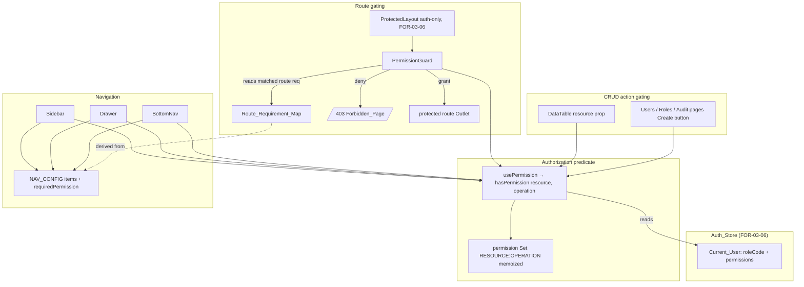
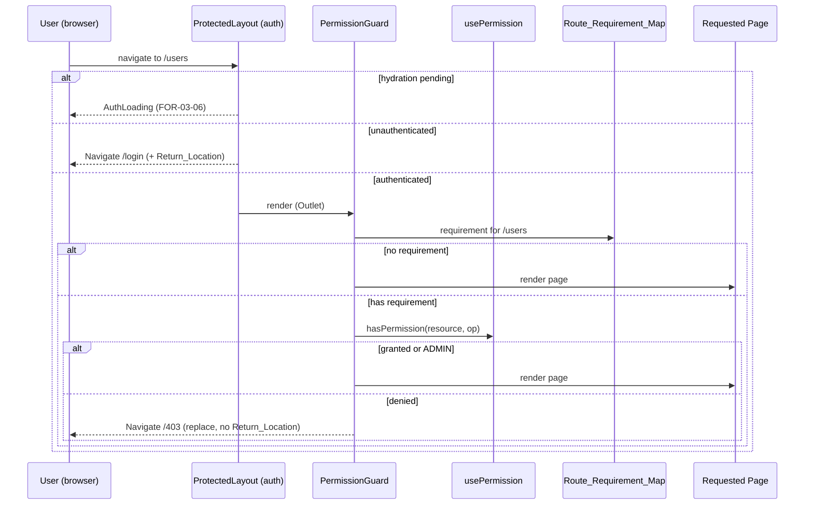

# Design Document: Menu Visibility (FOR-03-07-menu-visibility)

## Overview

This design defines the frontend authorization (visibility) layer for the Foremen web client. It sits directly on top of FOR-03-06: FOR-03-06 populated the Auth_Store with a `Current_User` that already carries `roleCode` and a `permissions` array (`{ resource, operations[] }[]`) from `GET /api/auth/me`, and it stored those permissions *without consuming them*. This spec consumes them.

The mechanism has four parts, all in `foremen-frontend`:

1. **`usePermission` hook** — the single client-side authorization predicate `hasPermission(resource, operation)`, derived from the current `Current_User`, mirroring the backend `ForemenPermissionEvaluator` ADMIN bypass and deny-by-default semantics.
2. **Permission-driven navigation** — `NAV_CONFIG` items gain an optional `requiredPermission`; `Sidebar`, `Drawer`, and `BottomNav` filter items (and empty sections) through the hook.
3. **`PermissionGuard`** — a route guard composed inside the existing `ProtectedLayout` chain that gates deep-linked routes against a `Route_Requirement_Map` and redirects to `/403` on denial. It runs strictly after FOR-03-06 authentication, so anonymous users still go to `/login`.
4. **CRUD action gating** — the `DataTable` takes a `resource` and hides Create/Edit/Delete/Audit controls the user cannot perform, collapsing the row-actions column when no row-level action is permitted. Applied to the shipped Users, Roles, and Audit pages.

This spec DELIVERS these four parts plus a Forbidden (`/403`) page and its RU/PL strings. It DELIVERS no backend change: server-side enforcement (`@RequiresPermission` + `PermissionInterceptor`, FOR-03-03 / FOR-03-08) remains the authoritative gate, and the `/api/auth/me` contract (including ETag/`304`, FOR-03-06) is consumed unchanged.

### Key Design Decisions

| Decision | Rationale |
|----------|-----------|
| **Single `usePermission` hook as the only authorization predicate** | Every visibility decision (nav, route guard, table actions) routes through one function so the ADMIN-bypass and deny-by-default rules cannot drift between call sites. Mirrors the backend having one `ForemenPermissionEvaluator`. |
| **ADMIN bypass by exact literal `ADMIN`** | The backend grants role code `ADMIN` everything without matrix lookup and matches the code exactly (FOR-03-03). The client mirrors this precisely — no case-folding, no trimming — so the UI shows exactly what the server allows. |
| **Deny-by-default, including "no Current_User"** | When there is no authenticated user (unauthenticated or mid-hydration), `hasPermission` returns `false`. Nav/actions therefore render nothing sensitive during the undetermined window; the FOR-03-06 auth guard handles the redirect. |
| **Permission set precomputed into a `Set<string>` of `RESOURCE:OPERATION` keys** | The `permissions` array is flattened once (memoized on the `Current_User` identity) into a membership set so `hasPermission` is an O(1) lookup, matching the backend `PermissionSet` "RESOURCE:OPERATION" key convention (FOR-03-03). |
| **`requiredPermission` on `NAV_CONFIG` + a parallel `Route_Requirement_Map`** | Menu visibility and route gating must agree, but not every protected route is a menu item (e.g. a future detail route, or `/403` itself). Deriving the route map from the nav config plus explicit extra entries keeps the single source while still gating deep links with no menu item. |
| **`PermissionGuard` composed *after* the FOR-03-06 auth guard, not merged into it** | FOR-03-06 Req 9.5 explicitly keeps `ProtectedLayout` authentication-only. Composing a separate guard that runs only once authenticated preserves the "anonymous → `/login`, forbidden → `/403`" split and the FOR-03-06 loading/return-location behavior untouched. |
| **`/403` rendered inside the AppShell** | A forbidden user is still authenticated, so they keep their navigation and can move to an allowed section. `/403` carries no requirement so it is always renderable. |
| **`redirect to /403` uses `replace` and never sets a Return_Location** | A forbidden route must not become a post-login return target (FOR-03-06 `Return_Location` is only for auth redirects). Using `<Navigate replace>` also keeps the forbidden URL out of history so Back does not re-trigger the denial loop. |
| **`/403` "go back" returns to the tracked Last_Allowed_Location, not a `history.back()`** | The user asked for a "return like after login" affordance (Variant A): a button that goes to the last page the user could actually view. Because the `/403` redirect uses `replace`, the browser history entry for the denied route is gone, so `history.back()` is unreliable; instead a small module tracks the last *granted* route the guard rendered. The button reads that tracked value, not the history stack. |
| **Go_Back falls back to `/` when the Last_Allowed_Location is absent or equals the Denied_Location** | On a cold deep-link to a forbidden route there is no prior allowed page, so `/` is the only sane target. And when the last allowed page *is* the route that was just denied (e.g. permissions changed while the user sat on a page they previously could open), returning there would immediately re-trigger the `/403` redirect — a loop — so we fall back to `/`. Comparison is by full path+query string. |
| **Last_Allowed_Location and Denied_Location tracked in a dedicated module (not the Auth_Store, not FOR-03-06 Return_Location)** | This is UI-navigation state specific to the `/403` affordance, orthogonal to auth/session. Keeping it in its own `src/lib/last-allowed-location.ts` module (mirroring the FOR-03-06 `return-location.ts` shape) avoids overloading `Return_Location` semantics and keeps the guard's write and the page's read on one small surface. It is in-memory (module-level) since it only needs to survive within a single SPA session; a full reload naturally resets it and the guard repopulates it on the next granted navigation. |
| **`DataTable` gains a `resource` prop; gating lives in the table + page, not per-call `hasPermission` scattered in cells** | Centralizing the Create/Edit/Delete/Audit checks against one `resource` keeps every table consistent and lets the row-actions column collapse as a unit. |
| **Hidden controls are omitted from the DOM, not disabled** | Requirement 8: a control the user lacks permission for is removed from the accessibility tree entirely rather than rendered disabled, so assistive tech users are not offered dead controls. |

### Research Findings

| Topic | Finding |
|-------|---------|
| Current permission source | FOR-03-06 already stores `Current_User.permissions: { resource, operations[] }[]` and `roleCode` in `src/stores/auth-store.ts`; the JSDoc there states the array is stored but "not consumed for visibility (that is deferred to FOR-03-07)". This spec is the consumer. |
| Navigation structure | `src/config/navigation.ts` exports `NAV_CONFIG: NavSectionConfig[]`, each section `{ titleKey, items }`, each item `{ path, labelKey, titleKey?, icon, bottomNav }`. `Sidebar`, `Drawer` map over sections; `BottomNav` flat-maps items and filters `bottomNav === true`. All three are the filter points. |
| Existing guard | `src/app/guards/ProtectedLayout.tsx` renders `AuthLoading` while `hydrationStatus === 'pending'`, redirects to `/login` (capturing Return_Location) when unauthenticated, and otherwise renders `<AppShell/>` (which owns the protected `<Outlet/>`). The permission guard composes below this. |
| Router shape | `src/app/router.tsx`: public routes and a `/` route whose element is `<ProtectedLayout/>` with all protected pages as children. The `PermissionGuard` inserts as a layout element wrapping the protected children (a nested guard route) so it sees the matched child route. |
| DataTable actions | `src/components/data-table/DataTable.tsx` accepts `entityKey`, `rowActions(row)`, `showAuditButton`. It composes the audit button (labeled `audit.button.viewAudit`, resource `AUDIT`) with the page's `rowActions`, and renders the actions column only when `hasRowActions` (audit enabled or `rowActions` present). This is where row-level gating and column collapse plug in. |
| Users page actions | `src/features/users/UsersPage.tsx` renders a "Create" `Button` above the table and a `rowActions` callback with Edit (`Pencil`) and Deactivate (`UserX`). This is the reference page for CREATE / UPDATE / DELETE gating. |
| i18n | Locale JSON at `src/locales/pl.json` / `ru.json`; `nav.*`, `users.*`, `roles.*`, `audit.*`, `common.edit` keys already exist. Only the `/403` page needs new keys. No `forbidden`/`403` keys exist yet. |
| Resource codes | The FOR-03 access matrix (OVERVIEW) and backend seeds use uppercase resource codes (`USERS`, `ROLES`, `AUDIT`, `RESOURCES`, `OPERATIONS`, and the project modules) with operations `CREATE`/`READ`/`UPDATE`/`DELETE`. The client matches these exactly. |

## Architecture



### Route-gating sequence



### Package / File Structure

```
foremen-frontend/src
├── hooks/
│   └── usePermission.ts                 (Permission_Hook)
├── config/
│   ├── navigation.ts                    (NAV_CONFIG + requiredPermission — edited)
│   └── route-permissions.ts             (Route_Requirement_Map — new)
├── lib/
│   └── last-allowed-location.ts         (Last_Allowed_Location + Denied_Location tracking — new)
├── app/
│   ├── guards/
│   │   ├── ProtectedLayout.tsx          (FOR-03-06 — unchanged)
│   │   └── PermissionGuard.tsx          (new)
│   ├── layout/
│   │   ├── Sidebar.tsx                  (filter items — edited)
│   │   ├── Drawer.tsx                   (filter items — edited)
│   │   └── BottomNav.tsx                (filter items — edited)
│   ├── pages/
│   │   └── ForbiddenPage.tsx            (/403 — new)
│   └── router.tsx                       (mount PermissionGuard + /403 — edited)
├── components/data-table/
│   ├── types.ts                         (DataTableProps.resource — edited)
│   └── DataTable.tsx                    (gate audit + row actions column — edited)
├── features/
│   ├── users/UsersPage.tsx              (gate Create/Edit/Delete — edited)
│   ├── roles/RolesPage.tsx              (gate actions — edited)
│   └── audit/AuditPage.tsx              (gate actions — edited)
└── locales/
    ├── pl.json                          (forbidden.* — edited)
    └── ru.json                          (forbidden.* — edited)
```

## Components and Interfaces

### 1. `Permission_Requirement` type

```typescript
export interface PermissionRequirement {
  resource: string
  operation: string
}
```

Placed in `src/config/navigation.ts` (co-located with `NAV_CONFIG`) and re-exported where the guard and route map need it.

### 2. `usePermission` hook (`src/hooks/usePermission.ts`)

Reads the `Current_User` from the Auth_Store, flattens `permissions` into a membership `Set` of `RESOURCE:OPERATION` keys (memoized on the user object so it is recomputed only when the user changes, satisfying Req 1.7), and returns the predicate.

```typescript
import { useMemo } from 'react'
import { useAuthStore } from '@/stores/auth-store'
import type { CurrentUser } from '@/stores/auth-store'

const ADMIN_ROLE_CODE = 'ADMIN'

function permissionKey(resource: string, operation: string): string {
  return `${resource}:${operation}`
}

function buildGrantSet(user: CurrentUser | null): Set<string> {
  const grants = new Set<string>()
  if (user == null) return grants
  for (const entry of user.permissions) {
    for (const op of entry.operations) {
      grants.add(permissionKey(entry.resource, op))
    }
  }
  return grants
}

export interface UsePermissionResult {
  hasPermission: (resource: string, operation: string) => boolean
}

export function usePermission(): UsePermissionResult {
  const user = useAuthStore((s) => s.user)

  // ADMIN bypass by EXACT literal match (no case-fold / trim), mirroring
  // ForemenPermissionEvaluator (FOR-03-03).
  const isAdmin = user?.roleCode === ADMIN_ROLE_CODE

  const grants = useMemo(() => buildGrantSet(user), [user])

  const hasPermission = useMemo(() => {
    return (resource: string, operation: string): boolean => {
      if (user == null) return false            // deny-by-default (Req 1.4)
      if (isAdmin) return true                  // ADMIN bypass (Req 1.2)
      return grants.has(permissionKey(resource, operation)) // exact match (Req 1.3, 1.5)
    }
  }, [user, isAdmin, grants])

  return { hasPermission }
}
```

Notes:
- Subscribing to `s.user` (not the whole store) means the hook re-renders exactly when the identity/permissions change (Req 1.7).
- The predicate is stable per `user` so consumers can call it many times per render without rebuilding the set.

### 3. Navigation config extension (`src/config/navigation.ts`)

`NavItemConfig` gains `requiredPermission?: PermissionRequirement`. The permission-guarded items are annotated; items without a requirement stay visible to any authenticated user (Req 2.3).

```typescript
export interface NavItemConfig {
  path: string
  labelKey: string
  titleKey?: string
  icon: string
  bottomNav: boolean
  requiredPermission?: PermissionRequirement   // NEW
}
```

Requirement assignment (Req 2.2), aligned with the OVERVIEW access matrix:

| Path | requiredPermission |
|------|--------------------|
| `/` (dashboard) | none (any authenticated user) |
| `/projects` | `{ PROJECTS, READ }` |
| `/rooms` | `{ ROOMS, READ }` |
| `/estimate` | `{ ESTIMATE, READ }` |
| `/materials` | `{ MATERIALS, READ }` |
| `/finances` | `{ FINANCES, READ }` |
| `/deliveries` | `{ DELIVERIES, READ }` |
| `/users` | `{ USERS, READ }` |
| `/roles` | `{ ROLES, READ }` |
| `/audit` | `{ AUDIT, READ }` |
| `/settings/appearance` | none (self-service, per FOR-02-08) |

> Only `USERS`, `ROLES`, `AUDIT` resources are seeded and enforced today; the project-module resources (`PROJECTS`, `ROOMS`, …) are declared here for forward consistency with the matrix and become active when those modules and their seeds land (FOR-06). Until a resource is granted to any non-ADMIN role, its item is visible only to ADMIN — which is the correct conservative default.

### 4. `Route_Requirement_Map` (`src/config/route-permissions.ts`)

Derived from `NAV_CONFIG` (path → `requiredPermission`) plus explicit entries for guarded routes that are not menu items. `/403` and any unlisted route resolve to "no requirement" (authenticated access sufficient, Req 4.4, 5.4).

```typescript
import { NAV_CONFIG, type PermissionRequirement } from '@/config/navigation'

const fromNav: Record<string, PermissionRequirement> = Object.fromEntries(
  NAV_CONFIG.flatMap((s) => s.items)
    .filter((i) => i.requiredPermission != null)
    .map((i) => [i.path, i.requiredPermission as PermissionRequirement]),
)

// Extra non-menu guarded routes can be added here later (e.g. detail routes).
const extra: Record<string, PermissionRequirement> = {}

const ROUTE_REQUIREMENTS: Record<string, PermissionRequirement> = { ...fromNav, ...extra }

export function requirementForPath(pathname: string): PermissionRequirement | undefined {
  return ROUTE_REQUIREMENTS[pathname]
}
```

Deriving from the nav config guarantees a menu item and its route share one requirement (Req 2.4, 4.1). If a future route needs prefix matching (e.g. `/users/:id`), `requirementForPath` is the single place to extend.

### 5a. Last_Allowed_Location tracking (`src/lib/last-allowed-location.ts`)

A tiny in-memory module (mirroring FOR-03-06's `return-location.ts` shape, but module-scoped rather than `sessionStorage`) that records the last granted route and the last denied route. It is written by the `PermissionGuard` and read by the `ForbiddenPage`.

```typescript
const FORBIDDEN_PATH = '/403'

let lastAllowed: string | null = null   // last granted route (path + query)
let denied: string | null = null        // route that triggered the last /403

// Record a route the guard just granted. Never records the /403 page itself
// (Req 4.4) so "go back" never targets the Forbidden_Page.
export function recordAllowedLocation(pathPlusQuery: string): void {
  if (pathPlusQuery.split('?')[0] === FORBIDDEN_PATH) return
  lastAllowed = pathPlusQuery
}

// Record the route whose requirement was denied (Req 4.8).
export function recordDeniedLocation(pathPlusQuery: string): void {
  denied = pathPlusQuery
}

export function getLastAllowedLocation(): string | null {
  return lastAllowed
}

export function getDeniedLocation(): string | null {
  return denied
}

// The target the Go_Back control should navigate to (Req 5.4, 5.5, 5.6, 5.8):
//   - no last-allowed → '/'
//   - last-allowed equals denied (full path+query) → '/'  (avoid the loop)
//   - otherwise → the last-allowed location
export function resolveGoBackTarget(): string {
  if (lastAllowed == null) return '/'
  if (lastAllowed === denied) return '/'
  return lastAllowed
}
```

Notes:
- Comparison is exact string equality on the full `path + query` (Req 5.8), so `/estimate?tab=a` and `/estimate?tab=b` are distinct.
- Module-level state resets on a full reload; that is acceptable because the guard repopulates `lastAllowed` on the next granted navigation, and a cold deep-link into a forbidden route correctly resolves the fallback to `/`.

### 5. `PermissionGuard` (`src/app/guards/PermissionGuard.tsx`)

A layout route element rendered *inside* the authenticated branch. It looks up the matched route's requirement and either renders the `Outlet` (recording the granted location) or redirects to `/403` (recording the denied location). It assumes authentication is already established (it is only ever mounted under `ProtectedLayout`'s authenticated render), so it performs no auth check itself (Req 4.5).

```typescript
import { useEffect } from 'react'
import { Navigate, Outlet, useLocation } from 'react-router-dom'
import { requirementForPath } from '@/config/route-permissions'
import { usePermission } from '@/hooks/usePermission'
import {
  recordAllowedLocation,
  recordDeniedLocation,
} from '@/lib/last-allowed-location'

export function PermissionGuard() {
  const { pathname, search } = useLocation()
  const { hasPermission } = usePermission()

  const requirement = requirementForPath(pathname)
  const granted =
    requirement == null ||
    hasPermission(requirement.resource, requirement.operation)

  // Record the outcome as a side effect (not during render) so the tracking
  // module reflects the resolved location. recordAllowedLocation ignores /403
  // (Req 4.4); on denial we record the denied route (Req 4.8).
  useEffect(() => {
    const loc = pathname + search
    if (granted) {
      recordAllowedLocation(loc)      // Req 4.3, 4.4, 4.6
    } else {
      recordDeniedLocation(loc)       // Req 4.8
    }
  }, [granted, pathname, search])

  if (!granted) {
    return <Navigate to="/403" replace />   // deny → 403, replace, no Return_Location (Req 4.2, 4.7)
  }
  return <Outlet />                          // grant / ADMIN / no-requirement → render
}
```

### 6. Router wiring (`src/app/router.tsx`)

`AppShell` owns the protected `<Outlet/>`. To let `PermissionGuard` wrap the protected children, the `AppShell`'s outlet content becomes the `PermissionGuard`'s outlet. The clean composition keeps `ProtectedLayout` → `AppShell` unchanged and inserts `PermissionGuard` as an intermediate layout route so it sees the matched child path:

- Protected children are nested under a pathless layout route whose element is `<PermissionGuard/>`, itself nested under `ProtectedLayout`/`AppShell`.
- `/403` is added as a protected child WITHOUT a requirement, so it renders inside the shell for any authenticated user (Req 5.1, 5.4). Because `ROUTE_REQUIREMENTS` has no `/403` entry, `PermissionGuard` lets it through.

The `NotFound` catch-all (`*`) stays requirement-free.

### 7. Navigation filtering (`Sidebar`, `Drawer`, `BottomNav`)

Each component calls `usePermission()` and filters items before rendering. A helper keeps the rule identical across all three:

```typescript
// visible when no requirement, or the requirement is granted
const isNavItemVisible = (item: NavItemConfig, has: (r: string, o: string) => boolean) =>
  item.requiredPermission == null ||
  has(item.requiredPermission.resource, item.requiredPermission.operation)
```

- **Sidebar / Drawer**: for each section, compute the visible items; render the section (and its `titleKey` header) only when at least one item is visible (Req 3.4).
- **BottomNav**: filter the flat `bottomNav: true` list by the same predicate (Req 3.3). (The current fixed "exactly 5" assumption relaxes to "up to 5, by permission"; the existing count test is updated in tasks.)

### 8. `DataTable` action gating (`components/data-table`)

`DataTableProps<T>` gains `resource?: string`. When present, the table gates its composed controls:

- **Audit button** currently renders when `showAuditButton !== false`. It additionally requires `hasPermission('AUDIT', 'READ')` (Req 6.5). (Audit uses the fixed `AUDIT` resource regardless of the table's own resource, matching the OVERVIEW note that audit access is a separate global resource.)
- **Row actions column** renders only when there is at least one visible row-level control: the page-provided `rowActions` output is itself gated by the page (see §9), and the audit button is gated as above. The `hasRowActions` computation becomes "audit visible OR page has any visible row action". When neither is visible, no actions column/header renders (Req 6.6, 8.3).
- The table does not itself gate Edit/Delete (those live in the page's `rowActions`); it gates the audit column it owns and collapses the combined column. The page decides Edit/Delete visibility because only the page knows which buttons map to `UPDATE` vs `DELETE`.

To keep the collapse correct, the page passes a `rowActions` that already returns `null` when the user has no per-row page actions; `DataTable` treats a `null`/empty page result plus a hidden audit button as "no actions column".

### 9. Page-level gating (Users / Roles / Audit)

Reference migration (Req 6.8). Example for `UsersPage` (resource `USERS`):

```typescript
const { hasPermission } = usePermission()
const canCreate = hasPermission('USERS', 'CREATE')
const canUpdate = hasPermission('USERS', 'UPDATE')
const canDelete = hasPermission('USERS', 'DELETE')

// Create button: render only when canCreate (Req 6.2)
{canCreate && <Button onClick={openCreateForm}>…</Button>}

// rowActions: build the edit/deactivate buttons conditionally; return null when
// neither is permitted so DataTable can collapse the column (Req 6.3, 6.4, 6.6)
const rowActions = useCallback((user: UserDto) => {
  if (!canUpdate && !canDelete) return null
  return (
    <div className="flex items-center gap-1">
      {canUpdate && <EditButton … />}
      {canDelete && <DeactivateButton … />}
    </div>
  )
}, [canUpdate, canDelete, t])

// pass resource so DataTable can gate the audit button
<DataTable<UserDto> entityKey="users" resource="USERS" rowActions={rowActions} … />
```

`RolesPage` (resource `ROLES`) and `AuditPage` (resource `AUDIT`, typically read-only — Create/Edit/Delete simply never render) follow the same pattern.

### 10. `ForbiddenPage` (`src/app/pages/ForbiddenPage.tsx`)

A simple authenticated-shell page: an `<h1>` heading, an explanatory paragraph, and a Go_Back button. The button target is resolved from the tracking module (`resolveGoBackTarget`) at click time so it reflects the location captured by the guard before the redirect. All strings via i18n (`forbidden.*`).

```typescript
import { useNavigate } from 'react-router-dom'
import { useTranslation } from 'react-i18next'
import { Button } from '@/components/ui/button'
import { resolveGoBackTarget } from '@/lib/last-allowed-location'

export default function ForbiddenPage() {
  const { t } = useTranslation()
  const navigate = useNavigate()

  const handleGoBack = () => {
    // Req 5.4/5.5/5.6: last allowed location, or '/' when absent or equal to
    // the denied location (avoids bouncing back into the same forbidden route).
    navigate(resolveGoBackTarget())
  }

  return (
    <div className="space-y-4">
      <h1 className="text-2xl font-semibold">{t('forbidden.title')}</h1>
      <p className="text-muted-foreground">{t('forbidden.message')}</p>
      <Button onClick={handleGoBack}>{t('forbidden.goBack')}</Button>
    </div>
  )
}
```

Notes:
- The Go_Back target is resolved on click (not render) so any navigation the guard recorded up to that moment is reflected.
- The button is a keyboard-operable control with an accessible name from `forbidden.goBack` (Req 8.2).
- i18n key: `forbidden.goBack` replaces the earlier `forbidden.backHome` (the control is now "go back", with `/` only as a fallback).

## Data Models

This spec introduces no persistent data and no backend DTOs. The only new client types are:

- **`PermissionRequirement`** — `{ resource: string; operation: string }`.
- **grant set** — an in-memory `Set<string>` of `"<RESOURCE>:<OPERATION>"` keys, memoized per `Current_User`, mirroring the backend `PermissionSet` key convention (FOR-03-03).
- **Last_Allowed_Location / Denied_Location** — two module-level `string | null` values (full `path + query`) tracked by `last-allowed-location.ts`; not persisted, reset on full reload.

It reads the existing `Current_User` (`roleCode`, `permissions`) from the Auth_Store.

## Correctness Properties

*A property is a characteristic that should hold across all valid executions — a formal statement of what the system should do, bridging the human-readable spec and machine-verifiable checks.*

Property-based testing is appropriate for the `hasPermission` predicate and the derived visibility rules: they are pure, input-varying functions with clear universal invariants. Guard redirect behavior, the `/403` page, i18n presence, and the reference page wiring are covered by example / unit / integration tests in the Testing Strategy.

### Property 1: hasPermission equals matrix membership for non-ADMIN (deny by default)

*For any* non-ADMIN `Current_User` with *any* generated `permissions` array, and *for any* `(resource, operation)` pair, `hasPermission` returns `true` if and only if some `permissions` entry has that exact resource and its `operations` includes that exact operation; a missing resource, or a present resource without the operation, yields `false`.

**Validates: Requirements 1.3, 1.5**

### Property 2: ADMIN is always granted

*For any* `(resource, operation)` pair and *any* `permissions` array (including empty or one that would otherwise deny), when `roleCode` equals the exact literal `ADMIN`, `hasPermission` returns `true`.

**Validates: Requirements 1.2**

### Property 3: ADMIN bypass requires an exact code match

*For any* `roleCode` that is a near-miss of `ADMIN` (case-differing, whitespace-padded, or with extra characters) evaluated against an empty `permissions` array, `hasPermission` returns `false` for every pair; only the exact literal `ADMIN` is bypassed.

**Validates: Requirements 1.6**

### Property 4: No current user denies everything

*For any* `(resource, operation)` pair, when there is no `Current_User`, `hasPermission` returns `false`.

**Validates: Requirements 1.4**

### Property 5: A nav item is visible iff unrestricted or granted

*For any* `NAV_CONFIG` item and *any* `Current_User`, the navigation filter includes the item if and only if the item has no `requiredPermission` OR `hasPermission` grants the item's requirement; and a section renders its header if and only if at least one of its items is visible.

**Validates: Requirements 3.1, 3.2, 3.3, 3.4, 3.5**

### Property 6: The route guard renders iff the requirement is absent or granted

*For any* protected route path and *any* authenticated `Current_User`, the `PermissionGuard` renders the route if and only if the path has no requirement OR `hasPermission` grants it; otherwise it redirects to `/403`.

**Validates: Requirements 4.2, 4.3, 4.4, 4.6**

### Property 7: Row-actions column collapses iff no row-level action is permitted

*For any* `Current_User` and a table with resource R, the row-actions column is rendered if and only if at least one of `hasPermission(R, UPDATE)`, `hasPermission(R, DELETE)`, or `hasPermission(AUDIT, READ)` is true; when all three are false, no actions column or header is rendered.

**Validates: Requirements 6.3, 6.4, 6.5, 6.6, 8.3**

### Property 8: Go_Back target avoids the denied route and the empty case

*For any* pair of tracked values (Last_Allowed_Location, Denied_Location), `resolveGoBackTarget()` returns `/` when the Last_Allowed_Location is null or is string-equal (full path+query) to the Denied_Location, and otherwise returns exactly the Last_Allowed_Location.

**Validates: Requirements 5.4, 5.5, 5.6, 5.8**

## Error Handling

| Condition | Outcome | Producer |
|-----------|---------|----------|
| Authenticated user deep-links to a route they lack permission for | Client `Navigate` to `/403` (replace, no Return_Location); the page never mounts; the denied route is recorded as the Denied_Location | `PermissionGuard` |
| Go_Back activated with no prior allowed page (cold deep-link) or when the last allowed page equals the denied route | Navigate to `/` (fallback avoids an empty target and the `/403`→same-route loop) | `ForbiddenPage` + `resolveGoBackTarget` |
| Unauthenticated user reaches any protected route | `/login` redirect with Return_Location (unchanged) | `ProtectedLayout` (FOR-03-06) |
| Session hydration in progress | FOR-03-06 loading indication (no `/403`) | `ProtectedLayout` (FOR-03-06) |
| Client shows a control the backend still rejects (stale permissions between `/me` refreshes) | Backend returns `403 error.access.denied`; the feature's existing API error surfacing (FOR-03-06 Api_Error / toast) shows the localized message | Backend `PermissionInterceptor` + existing client error handling |
| Unknown / unmapped route | No requirement → renders (auth-only); `*` catch-all → NotFound | `PermissionGuard` + router |

The client visibility layer is advisory: it hides controls to improve UX but never replaces server enforcement. A race where the UI is momentarily more permissive than the server resolves safely because the backend rejects the call and the existing error pipeline reports it.

## Testing Strategy

### Dual Testing Approach

- **Property tests (fast-check)** validate Properties 1–7. Files `*.property.test.ts(x)`, `fc.assert` with a minimum of 100 runs, each tagged `// Feature: FOR-03-07-menu-visibility, Property N: …` and referencing the design property it implements. fast-check is already the frontend property-testing library (FOR-03-06).
- **Unit / example tests (Vitest + Testing Library)** cover:
  - `usePermission` example cases (ADMIN, empty permissions, exact-match negatives, null user).
  - `Sidebar` / `Drawer` / `BottomNav` rendering under representative permission sets (item shown/hidden, empty-section header suppression, ADMIN shows all).
  - `PermissionGuard` states: no requirement renders, granted renders, denied redirects to `/403`, ADMIN renders. Verify no Return_Location is written on the `/403` redirect, that a granted route is recorded as the Last_Allowed_Location (and `/403` is never recorded), and that a denial records the Denied_Location.
  - `last-allowed-location` module: `resolveGoBackTarget()` returns the last-allowed location normally, `/` when it is null, and `/` when it equals the denied location (Property 8 plus example cases including query-string-only differences).
  - `ForbiddenPage`: heading + Go_Back control present; clicking Go_Back navigates to the resolved target (last-allowed, or `/` in the absent / equal-to-denied cases); strings localized (PL/RU).
  - `DataTable` / page gating: Create hidden without CREATE; Edit hidden without UPDATE; Delete hidden without DELETE; audit hidden without `AUDIT READ`; column collapses when none permitted; ADMIN sees all.
  - i18n presence: `forbidden.title`, `forbidden.message`, `forbidden.goBack` non-blank in both `pl.json` and `ru.json`.
- **Existing test updates**: the `NAV_CONFIG` "exactly 5 bottomNav items" and `BottomNav` "renders exactly 5" tests are updated to reflect permission filtering (ADMIN still sees all bottomNav items; a limited role sees a subset), so they assert the filtered behavior rather than a fixed count.

### What is NOT tested by properties

Router composition, Suspense/lazy wiring, the exact DOM/markup of the shell, and backend enforcement (owned by FOR-03-03 / FOR-03-08) are validated by example/integration tests or belong to other specs.

## Migration / Compatibility Notes

- `NAV_CONFIG` items without a `requiredPermission` remain visible to all authenticated users — no behavior change for the dashboard and appearance settings.
- Until the project-module resources are seeded (FOR-06), their nav items are visible only to ADMIN. This is the correct conservative default and requires no follow-up here.
- `DataTable.resource` is optional; tables that do not pass it keep today's behavior (audit button gated only by `showAuditButton`). Only the three reference pages are migrated in this spec.
- No backend changes; `/api/auth/me` is consumed exactly as delivered by FOR-03-06.
