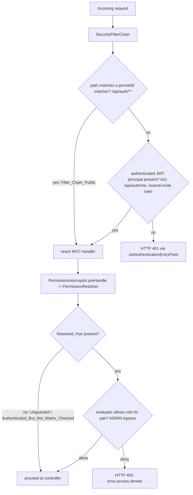
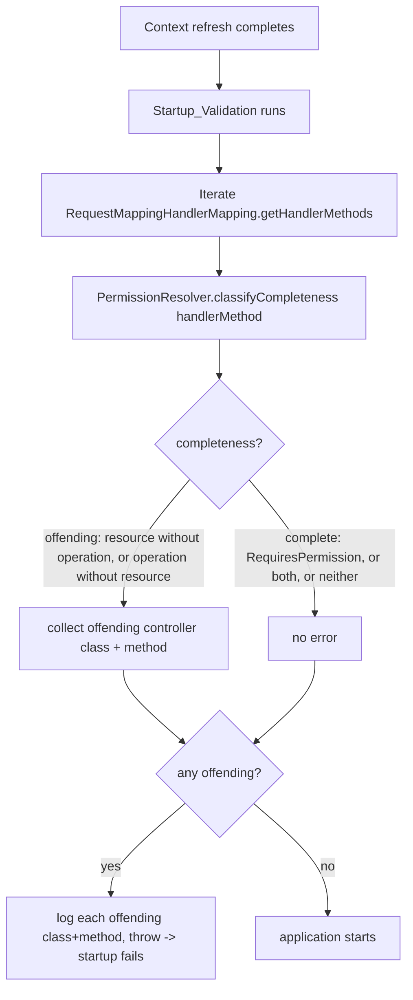
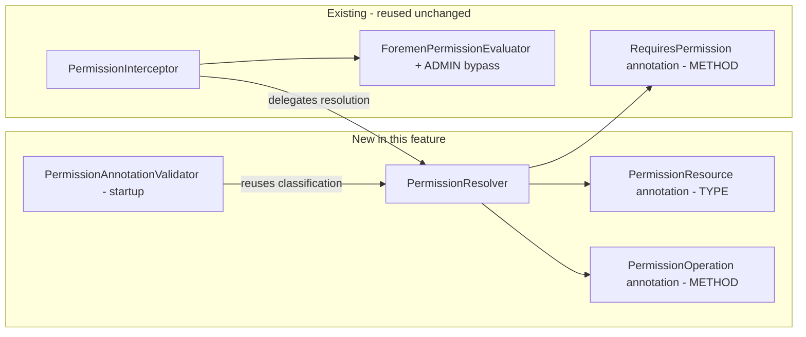
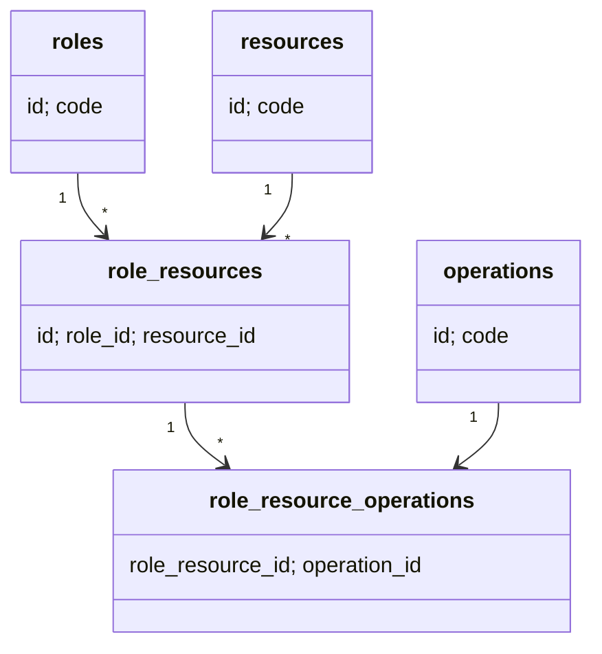

# Design Document: API Protection (FOR-03-08-api-protection)

## Overview

FOR-03-08 (API protection) is the final stage of the FOR-03 auth system. It has **two composing
enforcement layers**:

1. **Authorization layer (Spring MVC `PermissionInterceptor`)** — a declarative, inheritance-aware
   ABAC guarding scheme that guards controllers without overriding CRUD methods, plus the
   application of those annotations across the admin controllers and the matrix seed. This is the
   bulk of the design below.
2. **Authentication layer (Spring Security `SecurityFilterChain`)** — the migration of the filter
   chain's catch-all `anyRequest()` rule from `permitAll()` to `authenticated()`, so every request
   outside the public auth matchers now requires a valid JWT principal.

The two layers compose predictably: the filter chain decides whether a request needs an
authenticated principal (401 if missing), and the interceptor decides whether that principal's role
holds the required ABAC grant (403 if denied). An authenticated-and-permitted request proceeds.

The Foremen backend guards controller endpoints at the Spring MVC boundary. Today the only
guarding mechanism is the method-level `@RequiresPermission(resource, operation)` annotation,
resolved by the `PermissionInterceptor` via `HandlerMethod.getMethodAnnotation(...)` — a **method-only**
lookup with no type-level fallback. Most concrete controllers (`UserController`, `RoleController`,
`AuditController`, `ResourceController`, `OperationController`) implement generic CRUD interfaces
(`AdminController`, `AdminReadOnlyController`) whose REST endpoints are `default` methods. Because
the interceptor only sees the method-level annotation on the final handler, the only way to guard an
inherited `default` CRUD endpoint today is to override the whole `default` method in every concrete
controller just to attach `@RequiresPermission`. This is verbose, error-prone, and defeats the point
of the shared interface.

This feature introduces a declarative, inheritance-aware guarding scheme that guards a controller
**without overriding CRUD methods**. It adds:

1. **`@PermissionResource(String value)`** — a `@Target(TYPE)` annotation on the concrete controller
   class, naming the resource that controller manages.
2. **`@PermissionOperation(String value)`** — a `@Target(METHOD)` annotation on the CRUD interface
   `default` methods, naming the operation each performs.
3. **A `PermissionResolver`** — the component that, for a matched handler, produces the
   `(resource, operation)` `Resolved_Pair` the interceptor evaluates. It applies a precedence rule:
   `@RequiresPermission` wins; otherwise the class `@PermissionResource` combines with the method
   `@PermissionOperation`; otherwise the handler is `Unguarded` and proceeds without a matrix check.
4. **Startup validation** (`Annotation_Completeness_Validation`) — a startup-time component that
   scans every MVC handler method and **fails application startup** when a controller is
   half-annotated (a resource without a matching operation, or an operation without a resource),
   so a misconfigured declaration can never silently degrade into an unguarded endpoint.
5. **Applied annotations** across the admin controllers, plus a **matrix seed changeset** for any
   resource a controller now references that is missing from the matrix, and an
   **`Entity_Creation_Rules` steering document** codifying the "new entity" checklist.

The `ForemenPermissionEvaluator` (allow/deny with the exact-code ADMIN bypass) and the interceptor's
error mapping (401/403) are **unchanged in behavior**; the only interceptor change is that it now
delegates `(resource, operation)` derivation to the `PermissionResolver` instead of reading
`@RequiresPermission` directly.

Alongside the authorization refactor, this feature migrates the `SecurityFilterChain`
(`SecurityConfig.securityFilterChain`) so its catch-all `anyRequest()` rule changes from
`permitAll()` to `authenticated()` — a **single-line** change that preserves every other filter-chain
setting and the existing matcher order. After the migration, an unauthenticated request to a
protected `/api/**` endpoint is rejected with HTTP 401 by the existing `JwtAuthenticationEntryPoint`,
while the public auth matchers (`/api/auth/**`, the authenticated `/api/auth/me`, and the ADMIN-only
`POST /api/auth/resend-invite`) keep their existing behavior and ordering. This tightening composes
with the interceptor: interceptor-level "Unguarded" (no matrix check) is distinct from filter-chain
"public" — an Unguarded handler on a non-public path (e.g. `DisplayPreferencesController`) still needs
an authenticated principal once `anyRequest()` is `authenticated()`.

This spec produces only planning artifacts (requirements, design, tasks, test-cases) and a steering
file authored during the tasks phase. **No production code is written in this workflow.**

### Scope

| In scope | Out of scope |
|----------|--------------|
| `@PermissionResource`, `@PermissionOperation`, `PermissionResolver`, `Startup_Validation` design | Changing the `ForemenPermissionEvaluator` decision logic or ADMIN bypass |
| Applying annotations to `AdminController`, `AdminReadOnlyController`, and the five annotated concrete controllers | Changing `ProjectMemberController`'s existing `@RequiresPermission` usages (retained as-is) |
| Seed changeset for missing matrix resources/grants (`USERS` in particular) | Migrating `AuthController` / `DisplayPreferencesController` off their current Unguarded / self-check behavior |
| `Entity_Creation_Rules` steering document | Adding new `SecurityFilterChain` matchers or changing the existing matcher rules/order |
| **`SecurityFilterChain` migration: `anyRequest()` `permitAll()` → `authenticated()`** (Req 14, 15, 16) | Changing the `JwtAuthenticationFilter`, `JwtAuthenticationEntryPoint`, STATELESS/CSRF/frame-options config |

### Key Design Decisions

| Decision | Rationale |
|----------|-----------|
| **Introduce a dedicated `PermissionResolver`** (helper the interceptor delegates to) rather than inlining the logic in `preHandle` | Keeps the resolution algorithm (precedence, bridge-method lookup, bean-type lookup, Unguarded classification) in one unit-testable place, reused by both the interceptor and `Startup_Validation`. The interceptor keeps only its role-code extraction and 401/403 mapping. |
| **Precedence: `@RequiresPermission` strictly wins** | Requirement 3 mandates zero regression for existing usages. When `@RequiresPermission` is present the resolver ignores `@PermissionResource`/`@PermissionOperation` entirely, so `UserController.registerClient` (PROJECTS/EDIT) and every `ProjectMemberController` endpoint resolve exactly as before. |
| **`@PermissionResource` read from `HandlerMethod.getBeanType()`; `@PermissionOperation` read from the interface's declared method** | The Bean_Type is the concrete controller class (Req 4.3). For inherited `default` CRUD methods Spring may present a synthetic/bridge method; the governing annotation lives on the interface's declared method, so the resolver must resolve the annotation on the declared method, not the bridge (Req 4.2). `AnnotatedElementUtils` / `HandlerMethod.getMethodAnnotation` resolve through bridged methods safely. |
| **Unguarded = no declaration at all** | A handler with none of the three annotations proceeds without a matrix check, matching today's behavior for intentionally-open endpoints (`AuthController`, `DisplayPreferencesController`). A *partial* annotation is NOT Unguarded — it is a misconfiguration. |
| **Half-annotated controller fails startup (fail-fast), not at request time** | A silent degradation to Unguarded is a security hole. Validating once at startup (over `RequestMappingHandlerMapping`) turns a misconfiguration into an immediate, actionable boot failure naming the offending class and method. |
| **Startup mechanism: a bean that runs after context refresh over `RequestMappingHandlerMapping`** | The requirement fixes the behavior, not the mechanism. A `SmartInitializingSingleton` (or an `ApplicationListener<ContextRefreshedEvent>`) that reads the already-built `RequestMappingHandlerMapping` sees the final set of registered handler methods and can throw to abort startup. This avoids ordering fragility with an `ApplicationRunner` (which runs after the context is already "started"). |
| **Seed adds only what is missing, idempotently** | The matrix already has `ROLES`, `OPERATIONS`, `RESOURCES`, `AUDIT`, `PROJECT_MEMBERS`. Only `USERS` is missing. The changeset inserts the `USERS` resource row and the ADMIN grants for the guarded pairs, guarded by `preConditions onFail="MARK_RAN"` (the existing idempotency pattern) so re-runs insert nothing. |
| **ADMIN bypass makes the seed a consistency measure, not an access gate for ADMIN** | `ForemenPermissionEvaluator` allows ADMIN before any matrix lookup, so the admin panel keeps working even without grants. The seed still adds the rows so the matrix is complete and self-describing, and so non-ADMIN grants can later be layered on a real resource row. |
| **Filter-chain migration is exactly one line: `anyRequest().permitAll()` → `anyRequest().authenticated()`** | Requirement 14 targets only the catch-all rule. The three preceding matchers (`/api/auth/me` → `authenticated`, `POST /api/auth/resend-invite` → `hasRole('ADMIN')`, `/api/auth/**` → `permitAll`) and their declaration order are unchanged (14.3–14.6), as are the `JwtAuthenticationFilter` registration, `JwtAuthenticationEntryPoint`, STATELESS session, CSRF-disabled, and frame-options-disabled settings. A minimal diff keeps the blast radius small and the review trivial. |
| **Two layers compose but stay independent** | The filter chain authenticates (401 on missing principal via `JwtAuthenticationEntryPoint`); the interceptor authorizes (403 on denied grant). Neither layer's decision logic changes. "Unguarded" (interceptor skips the matrix check) is NOT "public" (filter chain skips authentication): once `anyRequest()` is `authenticated()`, an Unguarded handler on a non-public path becomes `Authenticated_But_Not_Matrix_Checked` (Req 16). |

### Research Findings

| Topic | Finding |
|-------|---------|
| Method-only annotation lookup today | `PermissionInterceptor.preHandle` uses `handlerMethod.getMethodAnnotation(RequiresPermission.class)`; a `null` result means "unannotated → proceed". There is no type-level fallback, which is exactly why inherited CRUD `default` methods cannot be guarded by the class today. |
| Reading annotations on inherited `default` methods | `HandlerMethod.getMethodAnnotation(...)` and `AnnotatedElementUtils.findMergedAnnotation(...)` resolve through bridge/synthetic methods to the interface's declared method, so a `@PermissionOperation` placed on an `AdminController` `default` method is visible on a concrete controller's matched handler (Req 4.2). |
| Reading the controller class | `HandlerMethod.getBeanType()` returns the concrete controller class (e.g. `UserController`), the correct target for reading the class-level `@PermissionResource` (Req 4.3). |
| Enumerating handler methods at startup | `RequestMappingHandlerMapping.getHandlerMethods()` returns `Map<RequestMappingInfo, HandlerMethod>` after the context is built. Iterating it gives every REST-mapped handler and its `HandlerMethod` (bean type + method), which is exactly the `In_Scope_Handler_Method` set (Req 6.1). |
| Aborting startup | Throwing a `RuntimeException` (e.g. `IllegalStateException`) from a `SmartInitializingSingleton.afterSingletonsInstantiated()` or a `ContextRefreshedEvent` listener propagates out of `refresh()` and fails application startup — the standard fail-fast idiom used by Spring Boot config validation. |
| Existing interceptor error pipeline | `PermissionInterceptor` throws `ForemenApiException(status, messageKey)`, translated by `ForemenControllerAdvice` into the standard `ErrorResponse`. `error.auth.unauthorized` (401) and `error.access.denied` (403) already exist in both `messages.properties` and `messages_ru.properties`. |
| Seed idempotency pattern | Existing changesets (007, 009, 015) use `<preConditions onFail="MARK_RAN"><sqlCheck expectedResult="0">…</sqlCheck></preConditions>` so an already-seeded database marks the changeset ran without inserting. Liquibase also records each changeset in `DATABASECHANGELOG`, so a normal re-run does not re-execute it; the preconditions defend against a fresh-run-against-existing-data scenario. |
| Current resource rows | `002-seed-resources` seeds `ROLES`, `OPERATIONS`, `RESOURCES`; `009` adds `AUDIT`; `015` adds `PROJECT_MEMBERS`. There is **no `USERS` row** — the one gap this feature's seed must fill. |
| Property-test convention | The repo already uses **jqwik** for property tests (`*PropertyTest.java`, `@Property(tries = 100)`, tagged `// Feature: …, Property N: …`). This design follows that convention. |
| Current `SecurityConfig` filter chain | `SecurityConfig.securityFilterChain` declares, in order: `/api/auth/me` → `authenticated()`, `POST /api/auth/resend-invite` → `hasRole("ADMIN")`, `/api/auth/**` → `permitAll()`, then `anyRequest().permitAll()`. It also registers `JwtAuthenticationFilter` before `UsernamePasswordAuthenticationFilter`, disables CSRF, sets `SessionCreationPolicy.STATELESS`, disables frame options, and wires `JwtAuthenticationEntryPoint`. The **only** change this feature makes is the final `anyRequest()` line. |
| 401 producer on the filter-chain layer | `JwtAuthenticationEntryPoint` is already wired via `exceptionHandling(...authenticationEntryPoint...)`. Once `anyRequest()` is `authenticated()`, a request to a protected path with no valid principal is short-circuited by the filter chain and this entry point emits the 401 body — the controller and the `PermissionInterceptor` are never reached. |
| Layer independence | The filter chain runs first (authentication); only authenticated requests (or `permitAll` paths) reach the MVC handler and thus the `PermissionInterceptor` (authorization). The two layers are wired independently, so the migration adds an authentication precondition without touching the interceptor's resolution or 401/403 mapping. |

## Architecture

### Resolution flow

```mermaid
flowchart TD
    HM[HandlerMapping resolves handler] --> PI[PermissionInterceptor.preHandle]
    PI -->|not a HandlerMethod| PROCEED1[proceed - no resolution]
    PI -->|HandlerMethod| RES[PermissionResolver.resolve handlerMethod]

    RES --> Q1{@RequiresPermission on method?}
    Q1 -->|yes| RP[Resolved_Pair = RequiresPermission resource, operation]
    Q1 -->|no| Q2{@PermissionResource on BeanType AND @PermissionOperation on declaring method?}
    Q2 -->|yes| CO[Resolved_Pair = PermissionResource value, PermissionOperation value]
    Q2 -->|no| UG[Unguarded - no Resolved_Pair]

    RP --> EVAL[evaluate Resolved_Pair]
    CO --> EVAL
    UG --> PROCEED2[proceed - no matrix check]

    EVAL --> Q3{authenticated principal?}
    Q3 -->|no| E401[401 error.auth.unauthorized]
    Q3 -->|yes| Q4{evaluator allows role for pair? ADMIN bypass}
    Q4 -->|deny| E403[403 error.access.denied]
    Q4 -->|allow| PROCEED3[proceed to controller]
```

### Composed enforcement flow (filter chain → interceptor)

After the migration a request traverses the authentication layer (filter chain) before the
authorization layer (interceptor). Only requests that clear authentication (or are `permitAll`) reach
the `PermissionInterceptor`.



Key composition points (Req 15, 16):
- **Unauthenticated protected `/api/**`** → the filter chain short-circuits with **401** via
  `JwtAuthenticationEntryPoint`; the interceptor never runs (15.1).
- **Authenticated + evaluator denies** → the interceptor returns **403** `error.access.denied` (15.2).
- **Authenticated + evaluator allows** → the request proceeds (15.3).
- **`Filter_Chain_Public` (`/api/auth/**`)** → the filter chain lets the request through without a
  principal (15.4, 16.3).
- **Unguarded on a non-public path** (e.g. `DisplayPreferencesController`) → the filter chain still
  requires an authenticated principal, then the interceptor skips the matrix check, making the
  handler `Authenticated_But_Not_Matrix_Checked` (16.1, 16.2).

### Startup validation flow



### Component responsibilities



### Package structure (planned)

```
com.foremen
├── config/
│   └── security/
│       ├── RequiresPermission.java              (existing, unchanged)
│       ├── PermissionResource.java              (NEW annotation, @Target(TYPE))
│       ├── PermissionOperation.java             (NEW annotation, @Target(METHOD))
│       ├── PermissionResolver.java              (NEW resolution + completeness component)
│       ├── PermissionAnnotationValidator.java   (NEW startup validation component)
│       ├── PermissionInterceptor.java           (edited: delegate to PermissionResolver)
│       ├── PermissionInterceptorConfig.java     (existing; may register the validator)
│       └── SecurityConfig.java                  (edited: anyRequest().permitAll() -> authenticated())
├── service/permission/
│   └── ForemenPermissionEvaluator.java          (existing, unchanged)
└── controller/
    ├── AdminController.java                      (edited: @PermissionOperation on default methods)
    ├── AdminReadOnlyController.java              (edited: @PermissionOperation on default methods)
    ├── UserController.java                       (edited: @PermissionResource("USERS"))
    ├── RoleController.java                       (edited: @PermissionResource("ROLES"))
    ├── AuditController.java                       (edited: @PermissionResource("AUDIT"))
    ├── ResourceController.java                    (edited: @PermissionResource("RESOURCES"))
    ├── OperationController.java                   (edited: @PermissionResource("OPERATIONS"))
    ├── ProjectMemberController.java               (unchanged: keeps @RequiresPermission)
    ├── DisplayPreferencesController.java           (unchanged: Unguarded + self-check)
    └── AuthController.java                          (unchanged: Unguarded)

foremen-backend/database_files/
├── changelog.xml                                 (edited: register new changeset last)
└── changesets/017-seed-users-resource.xml         (NEW seed changeset)

.kiro/steering/
└── entity-creation-rules.md                       (NEW steering doc, authored in tasks phase)
```

## Components and Interfaces

### 1. `@PermissionResource` (`com.foremen.config.security.PermissionResource`)

Class-level annotation naming the resource a concrete controller manages (Requirement 1).

```java
package com.foremen.config.security;

import java.lang.annotation.ElementType;
import java.lang.annotation.Retention;
import java.lang.annotation.RetentionPolicy;
import java.lang.annotation.Target;

@Retention(RetentionPolicy.RUNTIME)
@Target(ElementType.TYPE)
public @interface PermissionResource {
    String value();
}
```

### 2. `@PermissionOperation` (`com.foremen.config.security.PermissionOperation`)

Method-level annotation naming the operation a CRUD method performs (Requirement 2). Placed on the
CRUD interface `default` methods so every implementor inherits the classification.

```java
package com.foremen.config.security;

import java.lang.annotation.ElementType;
import java.lang.annotation.Retention;
import java.lang.annotation.RetentionPolicy;
import java.lang.annotation.Target;

@Retention(RetentionPolicy.RUNTIME)
@Target(ElementType.METHOD)
public @interface PermissionOperation {
    String value();
}
```

### 3. `PermissionResolver` (`com.foremen.config.security.PermissionResolver`)

The single place that determines the `Resolved_Pair` for a handler and classifies a handler's
annotation completeness. Consumed by the interceptor (per-request) and the startup validator
(per-handler, once).

```java
package com.foremen.config.security;

import org.springframework.core.annotation.AnnotatedElementUtils;
import org.springframework.stereotype.Component;
import org.springframework.web.method.HandlerMethod;

import java.lang.reflect.Method;

@Component
public class PermissionResolver {

    /** The (resource, operation) required for a handler, or {@code null} when the handler is Unguarded. */
    public record ResolvedPair(String resource, String operation) {}

    /** Completeness classification of a handler's permission annotations for Startup_Validation. */
    public enum Completeness {
        /** Carries @RequiresPermission, or both @PermissionResource+@PermissionOperation, or none of the three. */
        COMPLETE,
        /** Bean type has @PermissionResource but this in-scope method lacks @PermissionOperation (and @RequiresPermission). */
        RESOURCE_WITHOUT_OPERATION,
        /** Method has @PermissionOperation but the declaring bean type lacks @PermissionResource (and @RequiresPermission). */
        OPERATION_WITHOUT_RESOURCE
    }

    /**
     * Produces the Resolved_Pair for a matched handler (Requirements 3.1, 4.1, 4.2, 4.3, 5.1).
     * Precedence: @RequiresPermission wins; else @PermissionResource (bean type) + @PermissionOperation
     * (declaring method); else null (Unguarded).
     */
    public ResolvedPair resolve(HandlerMethod handlerMethod) {
        RequiresPermission rp = handlerMethod.getMethodAnnotation(RequiresPermission.class);
        if (rp != null) {
            return new ResolvedPair(rp.resource(), rp.operation()); // Req 3.1 — precedence
        }
        String resource = resourceOf(handlerMethod);
        String operation = operationOf(handlerMethod);
        if (resource != null && operation != null) {
            return new ResolvedPair(resource, operation); // Req 4.1 — combination
        }
        return null; // Req 5.1 — Unguarded (or partial: caught by Startup_Validation, never reached here)
    }

    /** Classifies annotation completeness for one in-scope handler method (Requirement 6.2–6.6). */
    public Completeness classifyCompleteness(HandlerMethod handlerMethod) {
        if (handlerMethod.getMethodAnnotation(RequiresPermission.class) != null) {
            return Completeness.COMPLETE; // Req 6.4 — RequiresPermission is always complete
        }
        boolean hasResource = resourceOf(handlerMethod) != null;
        boolean hasOperation = operationOf(handlerMethod) != null;
        if (hasResource && !hasOperation) {
            return Completeness.RESOURCE_WITHOUT_OPERATION; // Req 6.2
        }
        if (!hasResource && hasOperation) {
            return Completeness.OPERATION_WITHOUT_RESOURCE; // Req 6.3
        }
        return Completeness.COMPLETE; // both present (guarded) or neither present (Unguarded) — Req 6.6
    }

    /** Reads @PermissionResource from the Bean_Type (Requirement 4.3). */
    private String resourceOf(HandlerMethod handlerMethod) {
        PermissionResource pr = AnnotatedElementUtils.findMergedAnnotation(
                handlerMethod.getBeanType(), PermissionResource.class);
        return pr != null ? pr.value() : null;
    }

    /**
     * Reads @PermissionOperation from the declaring (interface) method, resolving through any
     * Bridge_Method (Requirement 4.2). {@code HandlerMethod#getMethod()} plus
     * {@code AnnotatedElementUtils.findMergedAnnotation} follows the bridge to the declared method.
     */
    private String operationOf(HandlerMethod handlerMethod) {
        Method method = handlerMethod.getMethod();
        PermissionOperation po = AnnotatedElementUtils.findMergedAnnotation(method, PermissionOperation.class);
        return po != null ? po.value() : null;
    }
}
```

Notes:
- The interceptor never sees a partial handler: `Startup_Validation` fails the boot before any
  request, so at request time a handler is either `@RequiresPermission`, both-annotated, or neither.
  `resolve` still returns `null` for a partial handler defensively (treated as Unguarded), but that
  path is unreachable in a successfully started application.
- `classifyCompleteness` is the shared predicate that makes the completeness property (P4) directly
  testable in isolation from Spring context startup.

### 4. `PermissionInterceptor` (edited — behavior preserved)

The only change is delegating pair derivation to the `PermissionResolver`. The role-code extraction
and the 401/403 mapping are unchanged (Requirement 7).

```java
@Component
@RequiredArgsConstructor
public class PermissionInterceptor implements HandlerInterceptor {

    private static final String ROLE_PREFIX = "ROLE_";

    private final ForemenPermissionEvaluator evaluator;
    private final PermissionResolver resolver; // NEW dependency

    @Override
    public boolean preHandle(HttpServletRequest request, HttpServletResponse response, Object handler) {
        if (!(handler instanceof HandlerMethod handlerMethod)) {
            return true; // Req 5.2 — non-HandlerMethod proceeds without resolution
        }
        PermissionResolver.ResolvedPair pair = resolver.resolve(handlerMethod);
        if (pair == null) {
            return true; // Req 5.1 — Unguarded: no matrix check
        }
        String roleCode = currentRoleCode();
        if (roleCode == null) {
            throw new ForemenApiException(HttpStatus.UNAUTHORIZED, "error.auth.unauthorized"); // Req 7.1
        }
        if (!evaluator.isAllowed(roleCode, pair.resource(), pair.operation())) {
            throw new ForemenApiException(HttpStatus.FORBIDDEN, "error.access.denied"); // Req 7.2
        }
        return true; // Req 7.3
    }

    // currentRoleCode() unchanged from the existing implementation
}
```

### 5. `PermissionAnnotationValidator` (`com.foremen.config.security.PermissionAnnotationValidator`)

Startup component (a `SmartInitializingSingleton`) that scans every registered handler method,
classifies completeness via `PermissionResolver`, and fails startup with an actionable message
listing every offending controller class and method (Requirement 6).

```java
package com.foremen.config.security;

import lombok.RequiredArgsConstructor;
import lombok.extern.slf4j.Slf4j;
import org.springframework.beans.factory.SmartInitializingSingleton;
import org.springframework.stereotype.Component;
import org.springframework.web.method.HandlerMethod;
import org.springframework.web.servlet.mvc.method.annotation.RequestMappingHandlerMapping;

import java.util.ArrayList;
import java.util.List;

@Slf4j
@Component
@RequiredArgsConstructor
public class PermissionAnnotationValidator implements SmartInitializingSingleton {

    private final RequestMappingHandlerMapping handlerMapping;
    private final PermissionResolver resolver;

    @Override
    public void afterSingletonsInstantiated() {
        List<String> problems = new ArrayList<>();
        handlerMapping.getHandlerMethods().forEach((info, handlerMethod) -> {
            PermissionResolver.Completeness c = resolver.classifyCompleteness(handlerMethod); // In_Scope_Handler_Method
            String controller = handlerMethod.getBeanType().getName();
            String method = handlerMethod.getMethod().getName();
            switch (c) {
                case RESOURCE_WITHOUT_OPERATION -> problems.add(
                        "Controller " + controller + " declares @PermissionResource but method '"
                                + method + "' has no @PermissionOperation (and no @RequiresPermission)"); // Req 6.2, 6.5
                case OPERATION_WITHOUT_RESOURCE -> problems.add(
                        "Method '" + method + "' on controller " + controller
                                + " declares @PermissionOperation but the controller has no @PermissionResource"
                                + " (and the method no @RequiresPermission)"); // Req 6.3, 6.5
                case COMPLETE -> { /* Req 6.4, 6.6 — no error */ }
            }
        });
        if (!problems.isEmpty()) {
            problems.forEach(log::error);
            throw new IllegalStateException(
                    "Incomplete permission annotations detected on " + problems.size()
                            + " controller handler method(s); see the errors above."); // Req 6.2, 6.3 — fail startup
        }
    }
}
```

Notes:
- `getHandlerMethods()` returns only REST-mapped handlers, which is exactly the
  `In_Scope_Handler_Method` set (CRUD `default` methods + declared `@RequestMapping`/composed
  handlers). Non-mapped helper methods never appear, so they are naturally out of scope (Req 6.1).
- Injecting the framework's own `RequestMappingHandlerMapping` bean ensures the mapping is fully
  built by the time `afterSingletonsInstantiated()` runs.

### 5b. `SecurityConfig` filter-chain migration (edited — one line)

The authentication layer. Requirement 14 changes exactly one line in
`SecurityConfig.securityFilterChain`: the catch-all `anyRequest()` rule from `permitAll()` to
`authenticated()`. Everything else — the three preceding matchers and their order, the
`JwtAuthenticationFilter` registration, `JwtAuthenticationEntryPoint`, STATELESS session, disabled
CSRF, and disabled frame options — is preserved unchanged (Req 14.3–14.6).

**Before** (current `authorizeHttpRequests` block):

```java
.authorizeHttpRequests(auth -> auth
        .requestMatchers("/api/auth/me").authenticated()
        .requestMatchers(HttpMethod.POST, "/api/auth/resend-invite").hasRole("ADMIN")
        .requestMatchers("/api/auth/**").permitAll()
        .anyRequest().permitAll()          // <-- historical default
)
```

**After** (only the final line changes):

```java
.authorizeHttpRequests(auth -> auth
        .requestMatchers("/api/auth/me").authenticated()
        .requestMatchers(HttpMethod.POST, "/api/auth/resend-invite").hasRole("ADMIN")
        .requestMatchers("/api/auth/**").permitAll()
        .anyRequest().authenticated()      // <-- migrated: require a JWT principal
)
```

The unified diff is a single logical line:

```diff
-        .anyRequest().permitAll()
+        .anyRequest().authenticated()
```

**Matcher semantics after the migration** (Req 14, 16):

| Matcher (in declaration order) | Rule | Effect |
|--------------------------------|------|--------|
| `/api/auth/me` | `authenticated()` | requires a JWT principal (unchanged; 14.4) |
| `POST /api/auth/resend-invite` | `hasRole("ADMIN")` | ADMIN only (unchanged; 14.5) |
| `/api/auth/**` | `permitAll()` | `Filter_Chain_Public`: login, refresh, logout, set-password, OTP request/verify (unchanged; 14.3, 16.3) |
| `anyRequest()` | `authenticated()` | **migrated**: every other path (all `/api/**` not above) requires a JWT principal (14.1, 14.2) |

Because the specific matchers are declared before the catch-all, ordering is preserved (14.6): the
public/authenticated/ADMIN auth rules still take precedence, and only the previously-open remainder
becomes `authenticated()`. `DisplayPreferencesController` and every non-`/api/auth/**` admin endpoint
now fall under `anyRequest().authenticated()`, so an unauthenticated call yields 401 at the filter
chain; the interceptor still applies its own resolution afterwards (matrix check for guarded
handlers, skip for `DisplayPreferencesController`'s Unguarded self-check).

### 6. Interface annotations applied (`AdminController`, `AdminReadOnlyController`)

Per Requirement 8, each CRUD `default` method carries a `@PermissionOperation`:

| Interface | Method | `@PermissionOperation` value | Requirement |
|-----------|--------|------------------------------|-------------|
| `AdminController` | `create` | `CREATE` | 8.1 |
| `AdminController` | `createBulk` | `CREATE` | 8.1 |
| `AdminController` | `update` | `UPDATE` | 8.2 |
| `AdminController` | `find` | `READ` | 8.3 |
| `AdminController` | `findExtended` | `READ` | 8.3 |
| `AdminController` | `findById` | `READ` | 8.3 |
| `AdminController` | `getCount` | `READ` | 8.3 |
| `AdminController` | `getAudit` | `READ` | 8.3 |
| `AdminController` | `getI18nProperties` | `READ` | 8.3 |
| `AdminController` | `getMetadata` | `READ` | 8.3 |
| `AdminController` | `deleteById` | `DELETE` | 8.4 |
| `AdminController` | `setPropertiesToNull` | `DELETE` | 8.4 |
| `AdminReadOnlyController` | `find` | `READ` | 8.5 |
| `AdminReadOnlyController` | `findById` | `READ` | 8.5 |
| `AdminReadOnlyController` | `getMetadata` | `READ` | 8.5 |

`addCustomQueryCondition` on `AdminController` is a non-mapped helper (no `@…Mapping`), so it is not
an `In_Scope_Handler_Method` and carries no annotation.

### 7. Controller annotations applied

Per Requirements 9 and 10:

| Controller | Class annotation | Resulting guarding of inherited CRUD | Requirement |
|------------|------------------|--------------------------------------|-------------|
| `UserController` | `@PermissionResource("USERS")` | `USERS` + CRUD operation from the interface; `registerClient` keeps `@RequiresPermission(PROJECTS, EDIT)` (precedence) | 9.1, 10.1, 10.2 |
| `RoleController` | `@PermissionResource("ROLES")` | `ROLES` + operation; `getPermissions`/`replacePermissions`/`batchReplacePermissions` are declared handlers — see note below | 9.2, 10.1 |
| `AuditController` | `@PermissionResource("AUDIT")` | `AUDIT` + `READ` (read-only interface) | 9.3, 10.1 |
| `ResourceController` | `@PermissionResource("RESOURCES")` | `RESOURCES` + `READ` | 9.4, 10.1 |
| `OperationController` | `@PermissionResource("OPERATIONS")` | `OPERATIONS` + `READ` | 9.5, 10.1 |
| `ProjectMemberController` | none (keeps per-method `@RequiresPermission`) | `PROJECT_MEMBERS` pairs unchanged | 9.6, 10.3 |
| `DisplayPreferencesController` | none | Unguarded (self-vs-requested-id check preserved) | 9.7, 10.4 |
| `AuthController` | none | Unguarded (public/self-service) | 9.8, 10.4 |

**`RoleController` declared handlers under a `@PermissionResource` class — a completeness
consideration.** `RoleController` declares `getPermissions` (`GET /{id}/permissions`),
`replacePermissions` (`PUT /{id}/permissions`), and `batchReplacePermissions`
(`PUT /permissions/batch`). Once `RoleController` carries `@PermissionResource("ROLES")`, these
declared handlers become in-scope methods on a resource-annotated controller. Under Requirement 6.2
they would each need a `@PermissionOperation` (or a `@RequiresPermission`) or startup fails. The
design resolves this by annotating each declared `RoleController` handler with the appropriate
`@PermissionOperation`: `getPermissions` → `READ`, `replacePermissions` → `UPDATE`,
`batchReplacePermissions` → `UPDATE`, so they resolve to `ROLES`/`READ` and `ROLES`/`UPDATE`
respectively and pass `Startup_Validation`. The same rule applies to any other declared handler on a
`@PermissionResource` controller (e.g. it is why `UserController.registerClient` is fine: it carries
`@RequiresPermission`, which `classifyCompleteness` treats as complete). This is captured explicitly
so the applied-annotation task does not accidentally trip the very startup guard this feature adds.

## Data Models

This feature introduces **no new persistent tables or entities**. It reads the existing FOR-02-03
ABAC schema and adds one seed changeset.

### Existing matrix schema (read/seeded)



### Resource inventory vs. controller references

| Resource code referenced by a controller annotation | Already in matrix? | Source | Action |
|------------------------------------------------------|--------------------|--------|--------|
| `ROLES` | Yes | `002-seed-resources` | none |
| `OPERATIONS` | Yes | `002-seed-resources` | none |
| `RESOURCES` | Yes | `002-seed-resources` | none |
| `AUDIT` | Yes | `009-seed-audit-resource` | none |
| `PROJECT_MEMBERS` | Yes | `015-seed-project-members-resource` | none |
| `USERS` | **No** | — | **seed new resource + ADMIN grants** |
| `PROJECTS` (via `registerClient` `@RequiresPermission`) | (owned by project specs; not managed here) | — | none in this spec |

### ADMIN grant inventory vs. resolved pairs

The pairs each guarded controller resolves to, and whether ADMIN already holds the grant:

| Controller | Resolved resource | Operations resolved | ADMIN grant today | Action |
|------------|-------------------|---------------------|-------------------|--------|
| `UserController` | `USERS` | CREATE, READ, UPDATE, DELETE | none (no `USERS` row) | seed `USERS` row + ADMIN CRUD |
| `RoleController` | `ROLES` | CREATE, READ, UPDATE, DELETE | CRUD (`007`) | none |
| `AuditController` | `AUDIT` | READ | READ (`009`) | none |
| `ResourceController` | `RESOURCES` | READ | READ (`007`) | none |
| `OperationController` | `OPERATIONS` | READ | READ (`007`) | none |
| `ProjectMemberController` | `PROJECT_MEMBERS` | CREATE, READ, DELETE | CRUD (`015`) | none |

> Because the `ForemenPermissionEvaluator` short-circuits to allow for the exact `ADMIN` code before
> any matrix lookup, the missing `USERS` grant does not actually block ADMIN today; the seed makes
> the matrix complete and self-consistent (Req 11) so the admin panel's matrix views and any future
> non-ADMIN grant sit on a real resource row.

### New seed changeset — `017-seed-users-resource.xml`

Follows the `009`/`015` pattern exactly: a resource-insert changeset guarded by an
existence `sqlCheck`, then an ADMIN-grant changeset guarded by an existence `sqlCheck`, both
`onFail="MARK_RAN"` for idempotency (Req 11.2, 11.3, 11.4). Registered **last** in `changelog.xml`
after `016` (Req 11.5).

```xml
<!-- database_files/changesets/017-seed-users-resource.xml -->
<databaseChangeLog ...>

    <changeSet id="017-seed-users-resource" author="foremen">
        <preConditions onFail="MARK_RAN">
            <sqlCheck expectedResult="0">SELECT COUNT(*) FROM resources WHERE code = 'USERS'</sqlCheck>
        </preConditions>
        <insert tableName="resources">
            <column name="code" value="USERS"/>
            <column name="name_ru" value="Пользователи"/>
            <column name="name_pl" value="Użytkownicy"/>
            <column name="description_ru" value="Управление пользователями"/>
            <column name="description_pl" value="Zarządzanie użytkownikami"/>
        </insert>
    </changeSet>

    <changeSet id="017-seed-users-permissions-admin" author="foremen">
        <preConditions onFail="MARK_RAN">
            <sqlCheck expectedResult="0">
                SELECT COUNT(*) FROM role_resources rr
                JOIN roles r ON rr.role_id = r.id
                JOIN resources res ON rr.resource_id = res.id
                WHERE r.code = 'ADMIN' AND res.code = 'USERS'
            </sqlCheck>
        </preConditions>
        <sql>
            INSERT INTO role_resources (role_id, resource_id, created_date, created_by)
            SELECT r.id, res.id, NOW(), 'system'
            FROM roles r, resources res
            WHERE r.code = 'ADMIN' AND res.code = 'USERS';
        </sql>
        <sql>
            INSERT INTO role_resource_operations (role_resource_id, operation_id)
            SELECT rr.id, o.id
            FROM role_resources rr
            JOIN roles r ON rr.role_id = r.id
            JOIN resources res ON rr.resource_id = res.id
            JOIN operations o ON o.code IN ('CREATE', 'READ', 'UPDATE', 'DELETE')
            WHERE r.code = 'ADMIN' AND res.code = 'USERS';
        </sql>
    </changeSet>

</databaseChangeLog>
```

`changelog.xml` gains one line after the `016` include:

```xml
<include file="database_files/changesets/017-seed-users-resource.xml"/>
```

### `Entity_Creation_Rules` steering document (authored in tasks phase)

A steering markdown (planned at `.kiro/steering/entity-creation-rules.md`) codifying the "new
managed entity" checklist (Requirement 12). It must instruct the developer to:

1. Add the resource via a seed changeset registered in `changelog.xml` (Req 12.1).
2. Add the ADMIN role-matrix grant for the new resource (Req 12.2).
3. Annotate the concrete controller with `@PermissionResource` (Req 12.3).
4. Implement `getProjectIdPath()` for project-scoped entities (Req 12.4).

## Correctness Properties

*A property is a characteristic or behavior that should hold true across all valid executions of a
system — essentially, a formal statement about what the system should do. Properties serve as the
bridge between human-readable specifications and machine-verifiable correctness guarantees.*

This feature's core is well suited to property-based testing: the `PermissionResolver` is a pure
function of a handler's annotations (resource on bean type, operation on method, `@RequiresPermission`
presence) — clear input/output behavior with universal precedence, combination, fallback, and
completeness rules. MVC enforcement, the 401/403 mapping, the bridge-vs-declared lookup mechanics,
the applied per-method/per-class annotation values, the seed content/idempotency, the startup-failure
wiring, and the steering document are covered by example, edge-case, integration, and smoke tests in
the Testing Strategy rather than by properties.

**The `SecurityFilterChain` migration is NOT a new correctness property.** It is a single-line
declarative configuration change (`anyRequest().permitAll()` → `authenticated()`) with no pure
input/output logic to quantify over — there is no "for all inputs X, property P(X) holds" statement
to make about a static matcher rule. Its correctness (unauthenticated protected `/api/**` → 401,
wrong-role → 403, right-role → 200, `/api/auth/**` reachable, `DisplayPreferencesController` now
requires authentication but skips the matrix check) is verified by **integration tests over the real
MVC + Spring Security context**, described in the Testing Strategy (Req 13.5, 13.6, 15, 16). The four
properties below therefore remain unchanged; they cover only the pure `PermissionResolver` logic.

The prework consolidated the resolution criteria (1.3, 2.3, 4.1, 4.3, 10.1) into one resolution
property, the precedence criteria (3.1, and the pure part of 3.2) into one precedence property, the
fallback criteria (5.1, and the pure part of 10.4) into one Unguarded property, and the completeness
criteria (6.2, 6.3, 6.4, 6.6) into one completeness-classification property.

### Property 1: Combined resolution derives resource from the class and operation from the method

*For any* non-blank resource code `R` and *any* non-blank operation code `O`, a matched handler
whose Bean_Type carries `@PermissionResource(R)` and whose declaring method carries
`@PermissionOperation(O)` and carries **no** `@RequiresPermission`, the `PermissionResolver` produces
the `Resolved_Pair` `(R, O)` — exactly the class annotation's value as the resource and the method
annotation's value as the operation.

**Validates: Requirements 1.3, 2.3, 4.1, 4.3, 10.1**

### Property 2: `@RequiresPermission` always wins

*For any* resource `R` and operation `O` on a method-level `@RequiresPermission`, and *for any*
combination of `@PermissionResource` (present or absent, any value) on the Bean_Type and
`@PermissionOperation` (present or absent, any value) on the method, the `PermissionResolver`
produces the `Resolved_Pair` `(R, O)` from the `@RequiresPermission` and ignores the other
annotations.

**Validates: Requirements 3.1, 3.2**

### Property 3: No declaration at all resolves to Unguarded

*For any* matched handler whose Bean_Type carries **no** `@PermissionResource`, whose method carries
**no** `@PermissionOperation`, and whose method carries **no** `@RequiresPermission`, the
`PermissionResolver` produces **no** `Resolved_Pair` (classifies the handler as Unguarded), so the
`PermissionInterceptor` proceeds without a matrix check.

**Validates: Requirements 5.1, 10.4**

### Property 4: Completeness classification of a handler's annotations

*For any* combination of `@PermissionResource` present/absent on the Bean_Type,
`@PermissionOperation` present/absent on the method, and `@RequiresPermission` present/absent on the
method, `PermissionResolver.classifyCompleteness` returns `COMPLETE` if and only if the method
carries `@RequiresPermission`, or carries both `@PermissionResource` and `@PermissionOperation`, or
carries none of the three; it returns an offending classification exactly in the two half-annotated
cases — resource-without-operation and operation-without-resource — where `@RequiresPermission` is
absent.

**Validates: Requirements 6.2, 6.3, 6.4, 6.6**

## Error Handling

| Condition | Outcome | Message code | Producer |
|-----------|---------|--------------|----------|
| Unauthenticated request to a protected (non-`Filter_Chain_Public`) `/api/**` path | HTTP 401 (filter chain short-circuits; interceptor never runs) | (JwtAuthenticationEntryPoint body) | `SecurityFilterChain` → `JwtAuthenticationEntryPoint` (Req 14.2, 15.1) |
| Unauthenticated request to a `Filter_Chain_Public` path (`/api/auth/**`) | reach handler without a principal | — | `SecurityFilterChain` `permitAll` (Req 14.3, 15.4, 16.3) |
| Authenticated request to an Unguarded non-public handler (e.g. `DisplayPreferencesController`) | pass filter chain (auth required), then proceed with no matrix check | — | `SecurityFilterChain` + `PermissionInterceptor` (Req 16.1, 16.2) |
| Matched handler is not a `HandlerMethod` (static resource, etc.) | proceed, no resolution | — | `PermissionInterceptor` (Req 5.2) |
| Handler resolves to Unguarded (no declaration) | proceed, no matrix check | — | `PermissionInterceptor` / `PermissionResolver` (Req 5.1) |
| Resolved_Pair present, no authenticated principal | HTTP 401 | `error.auth.unauthorized` | `PermissionInterceptor` throws `ForemenApiException` → `ForemenControllerAdvice` (Req 7.1) |
| Resolved_Pair present, evaluator denies the role | HTTP 403 | `error.access.denied` | `PermissionInterceptor` throws `ForemenApiException` (Req 7.2) |
| Resolved_Pair present, evaluator allows (incl. ADMIN bypass) | proceed to controller | — | `PermissionInterceptor` / `ForemenPermissionEvaluator` (Req 7.3, 7.4) |
| Half-annotated controller at startup (resource without operation, or operation without resource) | **application fails to start** | — (error log names each offending class+method) | `PermissionAnnotationValidator` throws `IllegalStateException` (Req 6.2, 6.3, 6.5) |
| Seed changeset re-run against already-seeded DB | no duplicate insert (changeset MARK_RAN) | — | Liquibase `preConditions onFail="MARK_RAN"` (Req 11.4) |

Notes:
- `error.auth.unauthorized` and `error.access.denied` already exist in both `messages.properties` and
  `messages_ru.properties`; this feature adds no new message codes.
- The startup failure is intentional and loud: the goal is that a misconfiguration is caught at boot,
  not silently turned into an open endpoint at request time.

## Testing Strategy

Property-based testing applies to the pure `PermissionResolver` logic; everything else is example,
edge-case, integration, or smoke tested. All property tests use **jqwik** (already used across the
repo) — not a hand-rolled generator — at a minimum of 100 iterations, each tagged with the design
property it implements.

### Property tests (jqwik) — `PermissionResolverPropertyTest.java`

Each property is realized by a **single** jqwik `@Property(tries = 100)` method. Handlers are built
as real `HandlerMethod` instances over small generated controller/interface fixtures whose
annotations vary per try (or by dynamically selecting among a fixed set of pre-annotated fixture
methods, since annotation values themselves cannot be generated at runtime — the generators pick the
*shape* and the fixtures carry representative values, with the value-mapping shapes covered
comprehensively).

| Design property | jqwik test | Tag |
|-----------------|-----------|-----|
| Property 1 — combined resolution | resolve returns `(R, O)` from class/method annotations across generated fixtures | `// Feature: FOR-03-08-api-protection, Property 1: …` |
| Property 2 — `@RequiresPermission` precedence | resolve returns the `@RequiresPermission` pair for all present/absent combinations of the secondary annotations | `// Feature: …, Property 2: …` |
| Property 3 — Unguarded fallback | resolve returns `null` (Unguarded) whenever none of the three annotations is present | `// Feature: …, Property 3: …` |
| Property 4 — completeness classification | `classifyCompleteness` returns `COMPLETE`/offending exactly per the truth table over all eight present/absent combinations | `// Feature: …, Property 4: …` |

### Example / unit tests (JUnit 5)

- **Annotation structure (Req 1.1, 1.2, 2.1, 2.2)** — reflection asserts `@PermissionResource` is
  `RUNTIME`/`TYPE` with a single `String value`, and `@PermissionOperation` is `RUNTIME`/`METHOD`
  with a single `String value`.
- **Bridge-vs-declared lookup (Req 4.2 — edge case)** — build a `HandlerMethod` over a concrete
  controller's inherited CRUD `default` method whose `@PermissionOperation` lives on the interface;
  assert `resolve` finds the operation despite bridging.
- **Interceptor branches (Req 7.1, 7.2, 7.3, 5.2)** — with a stubbed evaluator/resolver: non-`HandlerMethod`
  proceeds; Unguarded proceeds; resolved + no principal → 401 `error.auth.unauthorized`; resolved +
  deny → 403 `error.access.denied`; resolved + allow → proceed.
- **Interface operation mapping (Req 8.1–8.5)** — reflection asserts each named `AdminController` /
  `AdminReadOnlyController` `default` method carries `@PermissionOperation` with the expected
  CREATE/READ/UPDATE/DELETE value.
- **Controller resource mapping (Req 9.1–9.8)** — reflection asserts each of `UserController`,
  `RoleController`, `AuditController`, `ResourceController`, `OperationController` carries the
  expected `@PermissionResource`, and that `ProjectMemberController`, `DisplayPreferencesController`,
  and `AuthController` carry **no** `@PermissionResource`.
- **Changelog registration (Req 11.5)** — assert `changelog.xml` includes
  `017-seed-users-resource.xml` last in sequence.

### Integration tests (full MVC context)

- **End-to-end resolution (Req 10.1, 10.2, 10.3, 10.4)** — through the real MVC chain: `GET /api/users`
  resolves `USERS`/`READ`, `POST /api/users` resolves `USERS`/`CREATE`, `POST /api/users/client`
  resolves `PROJECTS`/`EDIT`; `ProjectMemberController` endpoints resolve `PROJECT_MEMBERS` pairs;
  `AuthController` / `DisplayPreferencesController` endpoints proceed without a matrix check.
- **Allow/deny/401/ADMIN preserved (Req 7.1–7.4, 3.2, 13.1)** — existing `PermissionInterceptor` and
  `ForemenPermissionEvaluator` suites pass unmodified; ADMIN reaches guarded endpoints.
- **Startup validation success (Req 6.1)** — the real application context starts with the applied
  annotations (no half-annotated controller).
- **Startup validation failure (Req 6.2, 6.3, 6.5, 13.3)** — a test context containing a deliberately
  half-annotated controller (resource-without-operation and, separately, operation-without-resource)
  fails to start; assert the failure/log names the offending controller class and method.
- **Seed completeness and idempotency (Req 11.1, 11.2, 11.3, 11.4)** — after Liquibase runs, the six
  resource rows exist and ADMIN holds the `USERS` CRUD grants; running the changelog again against an
  already-seeded database inserts no duplicates.

### Filter-chain integration tests (real MVC + Spring Security context)

These cover the `SecurityFilterChain` migration and the composed enforcement outcomes over the full
security + MVC stack (`@SpringBootTest` + `MockMvc`, or API tests against the Dockerized app per the
test-cases standard). They verify configuration behavior, not a pure property.

- **Composed 401 / 403 / 200 (Req 13.5, 14.1, 14.2, 15.1, 15.2, 15.3)** —
  - a request to a protected `/api/**` endpoint (e.g. `GET /api/users`) with **no token** yields
    **401** via `JwtAuthenticationEntryPoint` (filter chain short-circuits);
  - a request with a **valid token whose role lacks** the required matrix grant yields **403**
    `error.access.denied` (interceptor);
  - a request with a **valid token whose role holds** the grant (or ADMIN) yields **200**.
- **Public auth matchers preserved (Req 13.6, 14.3, 14.4, 14.5, 15.4, 16.3)** —
  - an unauthenticated request to a `/api/auth/**` endpoint is **not** rejected with 401 by the
    filter chain (reaches its handler);
  - an unauthenticated `GET /api/auth/me` yields **401**;
  - an unauthenticated `POST /api/auth/resend-invite` yields **401**.
- **Matcher order preserved (Req 14.6)** — assert the declared order in `SecurityConfig`
  (`/api/auth/me`, then `POST /api/auth/resend-invite`, then `/api/auth/**`, then `anyRequest()`) so
  the specific auth rules still take precedence over the migrated catch-all.
- **Unguarded handler now requires authentication (Req 16.1, 16.2)** — an unauthenticated request to
  a `DisplayPreferencesController` endpoint (a non-`Filter_Chain_Public` path) yields **401** at the
  filter chain; an authenticated request reaches the controller and is **not** subjected to a matrix
  check (its own self-versus-requested-id logic runs), confirming
  `Authenticated_But_Not_Matrix_Checked`.
- **Other filter-chain settings unchanged (Req 14, regression)** — the migrated chain remains
  STATELESS with CSRF and frame options disabled and the `JwtAuthenticationFilter` still populating
  the `SecurityContext` before authorization; existing JWT-auth integration tests pass unmodified.

### Smoke / manual

- **Steering document (Req 12.1–12.4)** — reviewer check that `entity-creation-rules.md` contains the
  four instructions (seed+changelog, ADMIN grant, `@PermissionResource`, `getProjectIdPath()` for
  project-scoped entities).
- **Build gate (Req 13.4)** — `./gradlew build` compiles and all tests pass.
