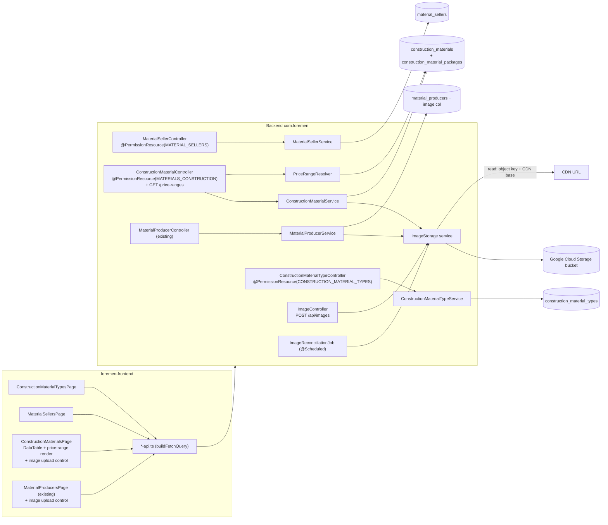

# Design — FOR-04-17: Construction Materials

## Overview

FOR-04-17 delivers the construction-material branch of the FOR-04 material model,
built IN ONE SPEC with parallel tracks (mirroring FOR-04-16). It ships two NEW
plain dictionaries and one NEW operational entity, reuses the existing
`MATERIAL_PRODUCERS` dictionary, adds one shared reusable image-storage service,
and exposes a computed price range derived from the entity rows. Every resource
here is a GLOBAL admin resource — none is project-scoped, so no service implements
`ProjectScopedService`.

| # | Thing | Resource | Table | Path | Kind |
|---|-------|----------|-------|------|------|
| 1 | ConstructionMaterialType | `CONSTRUCTION_MATERIAL_TYPES` | `construction_material_types` | `/api/construction-material-types` | NEW dictionary |
| 2 | MaterialSeller | `MATERIAL_SELLERS` | `material_sellers` | `/api/material-sellers` | NEW dictionary (+ `website`) |
| 3 | ConstructionMaterial | `MATERIALS_CONSTRUCTION` | `construction_materials` | `/api/construction-materials` | NEW entity |
| — | MaterialProducer | `MATERIAL_PRODUCERS` | `material_producers` | `/api/material-producers` | REUSE (+ additive `image` column) |
| — | Price range (вилка цен) | — (served on `MATERIALS_CONSTRUCTION`) | — (computed) | `/api/construction-materials/price-ranges` | COMPUTED, never persisted |

The two new dictionaries follow FOR-04-16's `MaterialType` shape EXACTLY (`code`,
`nameRU`, `namePL`, `active`; i18n only on `name` with PL fallback; `code`
immutable on update; create validates `code`/`nameRU`/`namePL` non-blank).
`MaterialSeller` adds one nullable `website` (≤ 255). The entity
`ConstructionMaterial` models one concrete "this material, at this seller, at this
price" offer: a localized `name` (no `code`), a required `type`, optional
`producer`/`seller`, a required many-to-many `packages` set (≥ 1), a required
`unit` and `currency`, three nullable prices, an optional `website`, and an
optional `image` (a GCS object key resolved to a CDN URL on the DTO).

Two cross-cutting mechanisms are new to this spec and are the parts that go beyond
a straight dictionary mirror:

1. **The computed price range** — a MIN..MAX of `retailNet` keyed by the PAIR
   (`OfferPackage`, `ConstructionMaterialType`), derived at read time and never
   stored. It is a deterministic pure function over the active priced rows, and is
   the primary property-based-testing target (Requirement 12.5).
2. **The shared `ImageStorage` service** — backend-mediated upload to Google Cloud
   Storage (model B), object-key persistence with CDN URL resolved at read time
   (model C), and two-trigger orphan cleanup plus a reconciliation job (model D).
   It is reused by `ConstructionMaterial`, `MaterialProducer` (this spec), and later
   FOR-04-18.

Changesets are numbered `053+` (the current highest registered in
`changelog.xml` is `052`), each registered last, idempotent per
`.kiro/steering/entity-creation-rules.md`. The full data rows for types, sellers,
and construction materials come from the separate research spec
`FOR-04-RESEARCH-construction-materials`; THIS spec seeds only a minimal
placeholder so the schema and tests are exercised.

### Placeholder-now, research-CSV-later

Per Requirement 11, the data seed here is a minimal placeholder (a handful of
example rows). Every placeholder insert is guarded by `sqlCheck` on `code` +
`MARK_RAN`, so the later research seed adds rows without conflict and never
duplicates a placeholder. Additional construction-brand producer rows MAY be added
to the existing `MATERIAL_PRODUCERS` dictionary, but this spec does not recreate
the producer resource, entity, or page.

## Architecture

The two new dictionaries are straight FOR-04-16 mirrors. `ConstructionMaterial` is
a richer vertical (references + many-to-many + image + a computed sibling
endpoint). Producer gains only an additive column and reuses its existing vertical.



The `PermissionInterceptor` enforces the `(resource, operation)` pair from each
controller's class-level `@PermissionResource` + the `@PermissionOperation` on the
inherited `AdminController` CRUD default methods; the custom `/price-ranges` and
image-upload handlers carry a method-level `@RequiresPermission` (see ABAC below).
`PermissionAnnotationValidator` fails startup on any half-annotated controller.

### Two-repository split

Per `.kiro/steering/git-repo-structure.md`, the backend (entities, services,
controllers, Liquibase, `ImageStorage`, tests) lives in the **root repo**
(`foremen-backend/`, `.kiro/`, `docker-compose.yml`); the frontend (three pages,
producer page edit, i18n, tests) lives in the **nested `foremen-frontend/` repo**.
A commit that spans both needs one commit per repo.

## Components and Interfaces

### Track 1 & 2 — the two new dictionaries (FOR-04-16 mirror)

Each new dictionary is an identical vertical. Replace `ConstructionMaterialType` /
`construction_material_types` / `CONSTRUCTION_MATERIAL_TYPES` /
`/api/construction-material-types` with the `MaterialSeller` names for the second
(which additionally carries `website`).

Backend (under `com.foremen`), per new dictionary:

- `dao/model/<Xxx>Entity` `@Table("<table>")` extends `BaseEntity`: `code` (unique NOT NULL), `nameRU` (`name_ru`), `namePL` (`name_pl`), `boolean active = true`. `MaterialSellerEntity` adds `@Column(name = "website", length = 255) String website` (nullable).
- `dao/<Xxx>Dao extends AdminDao<<Xxx>Entity, Long>`.
- `service/model/<Xxx>ServiceModel` (@Data) `{id, code, name, active[, website]}`; `<Xxx>ServiceExtendedModel` (record) `{id, code, nameRU, namePL, active[, website]}`.
- `service/model/mapper/<Xxx>ServiceMapper`: `getI18nSupportedProperties() = Set.of("name")`; `updateFields` ignore `id` + `code`.
- `service/<Xxx>Service implements AdminService<...>` — NOT `ProjectScopedService`.
- controller model records: `<Xxx>DtoModel {id, code, name, active[, website]}`; `<Xxx>DtoExtendedModel {id, code, nameRU, namePL, active[, website]}`; `<Xxx>CreateRequest {@NotBlank code, @NotBlank nameRU, @NotBlank namePL, Boolean active[, @Size(max=255) String website]}`; `<Xxx>UpdateRequest {@NotBlank nameRU, @NotBlank namePL, Boolean active[, @Size(max=255) String website]}` (no `code`); `<Xxx>CreateResponse`/`<Xxx>UpdateResponse`.
- `controller/model/mapper/<Xxx>ControllerMapper`: ignore `id`/create, `id`+`code`/update, default `active` → `true`.
- `controller/<Xxx>Controller` `@RequestMapping("/api/<kebab>")` `@PermissionResource("<RESOURCE>")` implements `AdminController<...>`.

Concrete names:
- `ConstructionMaterialTypeEntity` / `…Dao` / `…Service` / `…Controller` / `…ServiceMapper` / `…ControllerMapper` / model records `ConstructionMaterialType*`.
- `MaterialSellerEntity` / `…Dao` / `…Service` / `…Controller` / `…ServiceMapper` / `…ControllerMapper` / model records `MaterialSeller*` — the only structural difference from a plain dictionary is the extra `website` field carried end-to-end (entity → service models → DTOs → create/update requests, validated `@Size(max = 255)`, updatable on update). `MaterialSeller` gets NO image.

### Track 3 — `ConstructionMaterialEntity` (`dao/model`) `@Table("construction_materials")` extends `BaseEntity`

Modeled on the reference-and-collection patterns of `RoomEntity` (mandatory
`@ManyToOne` references) and `WorkPriceEntity` (owned/join collection). No `code`.

```java
@Column(name = "name_ru", nullable = false)
private String nameRU;

@Column(name = "name_pl", nullable = false)
private String namePL;

@ManyToOne(fetch = FetchType.LAZY, optional = false)
@JoinColumn(name = "type_id", nullable = false)
private ConstructionMaterialTypeEntity type;

@ManyToOne(fetch = FetchType.LAZY)
@JoinColumn(name = "producer_id")
private MaterialProducerEntity producer;

@ManyToOne(fetch = FetchType.LAZY)
@JoinColumn(name = "seller_id")
private MaterialSellerEntity seller;

@ManyToMany(fetch = FetchType.LAZY)
@JoinTable(
    name = "construction_material_packages",
    joinColumns = @JoinColumn(name = "construction_material_id"),
    inverseJoinColumns = @JoinColumn(name = "offer_package_id"))
private Set<OfferPackageEntity> packages = new HashSet<>();

@ManyToOne(fetch = FetchType.LAZY, optional = false)
@JoinColumn(name = "unit_id", nullable = false)
private MeasurementUnitEntity unit;

@ManyToOne(fetch = FetchType.LAZY, optional = false)
@JoinColumn(name = "currency_id", nullable = false)
private CurrencyEntity currency;

@Column(name = "purchase_price", precision = 12, scale = 2)
private BigDecimal purchasePrice;

@Column(name = "retail_gross", precision = 12, scale = 2)
private BigDecimal retailGross;

@Column(name = "retail_net", precision = 12, scale = 2)
private BigDecimal retailNet;

@Column(name = "website", length = 255)
private String website;

/** GCS object key (NOT the CDN URL); resolved to a CDN URL only on the DTO. */
@Column(name = "image", length = 512)
private String image;

@Column(nullable = false)
private boolean active = true;
```

- `dao/ConstructionMaterialDao extends AdminDao<ConstructionMaterialEntity, Long>`.
- `service/ConstructionMaterialService implements AdminService<...>` — NOT `ProjectScopedService` (Requirement 4.10). It overrides the write path (`create`/`update`) to `normalize(...)` the model: resolve-and-validate every reference (`typeId`, `producerId`, `sellerId`, `unitId`, `currencyId`, each `offerPackageId`) with a real load, reject an empty `packages` set, and range-check the three prices — mirroring `RoomService.resolveReferences` (a missing/null reference → a field-identifying client error; nothing is persisted). It resolves the `image` DTO field from the stored object key via `ImageStorage.toCdnUrl(objectKey)` and, on image replace/detach/delete, calls `ImageStorage.deleteIfOrphan(previousKey)` (see ImageStorage below).

#### `ConstructionMaterialController` (`controller`)

`@RestController @RequestMapping("/api/construction-materials")
@PermissionResource("MATERIALS_CONSTRUCTION")` implementing
`AdminController<ConstructionMaterialServiceModel, …ServiceExtendedModel,
ConstructionMaterialDtoModel, …DtoExtendedModel, ConstructionMaterialEntity, Long,
…CreateRequest, …CreateResponse, …UpdateRequest, …UpdateResponse>`. It adds one
custom read handler for the computed price range (see below), guarded by a
method-level `@RequiresPermission("MATERIALS_CONSTRUCTION", "READ")` so the
controller stays fully annotated for `PermissionAnnotationValidator`.

Controller/service model records:

- `ConstructionMaterialCreateRequest` / `…UpdateRequest`:
  ```java
  @NotBlank String nameRU;
  @NotBlank String namePL;
  @NotNull  Long typeId;
  Long producerId;                 // optional
  Long sellerId;                   // optional
  @NotEmpty Set<Long> offerPackageIds;   // ≥ 1
  @NotNull  Long unitId;
  @NotNull  Long currencyId;
  @DecimalMin("0.00") @DecimalMax("9999999999.99") BigDecimal purchasePrice; // nullable
  @DecimalMin("0.00") @DecimalMax("9999999999.99") BigDecimal retailGross;   // nullable
  @DecimalMin("0.00") @DecimalMax("9999999999.99") BigDecimal retailNet;     // nullable
  @Size(max = 255) String website;       // optional
  @Size(max = 512) String image;         // optional GCS object key
  Boolean active;                        // defaults to true
  ```
  (The update request omits nothing structurally; there is no `code` to protect.)
- `ConstructionMaterialDtoModel` (list row): `{id, name, type: RefDto, producer: RefDto, seller: RefDto, packages: List<RefDto>, unit: RefDto, currency: RefDto, purchasePrice, retailGross, retailNet, website, imageUrl, active}` where `RefDto = {id, name}` (localized) and `imageUrl` is the **resolved CDN URL** (null when `image` is null). The persisted object key is never returned on the read/list DTO — only `imageUrl`.
- `ConstructionMaterialDtoExtendedModel`: the same reference objects plus raw id fields the edit form needs (`typeId`, `producerId`, `sellerId`, `offerPackageIds`, `unitId`, `currencyId`) and `imageUrl`.
- create/update response records mirror the extended DTO.

Reference filters (Requirement 4.9) ride the existing FOR-04-01 query grammar:
`type.id`, `producer.id`, `seller.id`, `unit.id`, `currency.id`, and `packages.id`
resolve through the generic `SpecificationBuilder` (a collection path
`packages.id` becomes a JOIN + `distinct`), so no custom resolver is needed for
filtering — unlike FOR-04-12b, these are ordinary reference paths.

#### Computed price range — `PriceRangeResolver` + `GET /api/construction-materials/price-ranges`

A stateless Spring `@Component` implementing the MIN..MAX-by-(package,type) rule.
It is a pure, deterministic, total function over already-loaded rows (no
per-element I/O), which makes it the property-test target (Requirement 12.5).

```java
public record PriceRangeKey(Long offerPackageId, Long constructionMaterialTypeId) {}
public record PriceRange(BigDecimal min, BigDecimal max) {}  // both null ⇒ empty range

/**
 * For every (package, type) pair present among the inputs, the MIN and MAX retailNet
 * across all ACTIVE materials of that type whose packages contain that package and
 * whose retailNet is non-null. A material in several packages contributes to each.
 * Pairs with no priced active material are omitted (or return an empty range when
 * asked for explicitly).
 */
Map<PriceRangeKey, PriceRange> compute(Collection<ConstructionMaterialEntity> materials);

/** Convenience single-pair lookup used by the endpoint; empty range when none. */
PriceRange rangeFor(Collection<ConstructionMaterialEntity> materials, Long packageId, Long typeId);
```

Rule (Requirement 6.1–6.7):
1. Consider only materials with `active == true` and `retailNet != null` (6.2, 6.5).
2. For each such material `m`, for each `p` in `m.packages`, add `m.retailNet` to the bucket keyed by `(p.id, m.type.id)` (6.2, 6.3 — the same material fans out to each of its packages).
3. `min`/`max` of each bucket are its `PriceRange` (6.1). An empty bucket ⇒ `PriceRange(null, null)` (6.6).
4. The computation reads only the loaded set and uses `BigDecimal.min`/`max`, so it is deterministic (6.7) and never persists anything (6.4).

The endpoint `GET /api/construction-materials/price-ranges` (optionally filtered by
`?packageId=&typeId=`) loads the active priced materials via the DAO and returns
either the full `Map<PriceRangeKey, PriceRange>` (as a list of
`{offerPackageId, typeId, min, max}` rows) or a single `PriceRange`. The service
computes the range at read time from a targeted query (materials of the requested
type/package with non-null `retailNet`), never from a stored column. The list DTO
also carries the per-(package, type) range for each row's own packages so the UI
column can render it without a second round-trip.

### Reused — `MaterialProducer` additive `image` (no new vertical)

FOR-04-16 already provides `MaterialProducerEntity` / `…Dao` / `…Service` /
`…Controller` (`@PermissionResource("MATERIAL_PRODUCERS")` at
`/api/material-producers`) and the `material_producers` table + resource/grants
(changesets `048`/`049`). This spec adds only:

- an `@Column(name = "image", length = 512) String image;` field to
  `MaterialProducerEntity` (nullable GCS object key);
- carries it through the existing service models and controller DTOs — the create/
  update requests accept the object key (`@Size(max = 512)`), and the read/list DTO
  exposes `imageUrl` resolved via `ImageStorage.toCdnUrl(...)`;
- the producer service's write path calls `ImageStorage.deleteIfOrphan(previousKey)`
  on image replace/detach/delete, exactly as the construction-material service does.

No producer resource, grant, or page is recreated (Requirement 8.1, 11.4).

### Shared — `ImageStorage` service + `ImageController` + reconciliation job

A new package `com.foremen.service.image` (backend, root repo). It is the single
reusable seam for entity images (Requirement 7.1), consumed by
`ConstructionMaterialService`, `MaterialProducerService`, and later FOR-04-18.

```java
public interface ImageStorage {
    /** Validate + store the upload under keyPrefix (e.g. "construction-materials/",
     *  "producers/"), returning the bucket-relative OBJECT KEY. */
    String store(MultipartFile file, String keyNamespace);

    /** Build the public CDN URL from a stored object key (cdnBase + "/" + key);
     *  null-safe: null key ⇒ null URL. Pure read-time resolution, no I/O. */
    String toCdnUrl(String objectKey);

    /** Delete an object if no DB row references it (called on replace/detach/delete). */
    void deleteIfOrphan(String objectKey);

    /** Whether image storage is configured (bucket + CDN base + credentials present). */
    boolean isConfigured();
}
```

**Upload model B (backend-mediated).** `ImageController`
(`POST /api/images` `multipart/form-data`, param `entityKind`) validates and
delegates to `ImageStorage.store(...)`, returning `{ objectKey, imageUrl }`. There
is NO direct-from-frontend signed-URL upload (Requirement 7.2). The frontend
upload control posts the file here, then saves the returned object key on the
entity via the normal create/update. The endpoint carries a method-level
`@RequiresPermission` bound to the caller's target resource operation
(`MATERIALS_CONSTRUCTION`/`MATERIAL_PRODUCERS` `CREATE`/`UPDATE`) so uploads are
ABAC-gated and the controller is fully annotated; the required resource is passed
as a request param and validated against the seeded resources.

**Storage model C (object-key based).** The entity persists the nullable object
key only; the public CDN URL is constructed at read time as `cdnBase + "/" + key`
and exposed as `imageUrl` on the read/list DTO (Requirement 7.3, 7.4). Object keys
are namespaced per entity kind: `producers/{uuid}.{ext}`,
`construction-materials/{uuid}.{ext}` (Requirement 7.5).

**Validation (Requirement 7.6, 7.7).** `store(...)` rejects any content type not in
`{image/png, image/jpeg, image/webp}` and any file larger than the configured
maximum with a client-error (`400`), storing nothing.

**Orphan cleanup, two triggers (model D).**
- *Eager, on write* (Requirement 7.8, 7.9): the owning service calls
  `deleteIfOrphan(previousKey)` after an image is replaced with a different key,
  set to null, or the entity is deleted — removing the now-unreferenced bucket
  object. `deleteIfOrphan` re-checks the DB for any remaining reference before
  deleting, so a key still used elsewhere is kept.
- *Periodic reconciliation* (Requirement 7.10): `ImageReconciliationJob`
  (`@Scheduled`, cron/interval from config) lists bucket objects, subtracts the set
  of object keys referenced by any DB row (union across all image columns —
  `construction_materials.image`, `material_producers.image`, future FOR-04-18),
  and deletes every bucket object no row references.

**Configuration (Requirement 7.11, 7.12).** Bucket name, CDN base URL, credentials,
max upload size, and the reconciliation schedule come from
`application.yml`/environment (`foremen.image-storage.*`), never hardcoded. A GCS
`ImageStorage` bean is active only when configured; otherwise a
`DisabledImageStorage` is wired whose `store(...)` rejects uploads with a graceful
client-error and whose `toCdnUrl(...)` returns null — so existing entities keep
working without images and `isConfigured()` is `false`.

### Frontend — three pages + producer edit + nav (foremen-frontend repo)

Two new dictionary features mirror the FOR-04-16 Material-Types page exactly
(`foremen-frontend/src/features/construction-material-types/`,
`.../material-sellers/`); the sellers page adds a `website` column and form field.
A third feature `.../construction-materials/` is a richer page:

- `ConstructionMaterialsPage` + `ConstructionMaterialsList` (DataTable
  `entityKey="construction-materials" resource="MATERIALS_CONSTRUCTION"`) with
  columns `name`, `type`, `producer`, `seller`, `packages`, `unit`, `currency`,
  `retailNet`, and the computed price range per `(package, type)` (rendered from the
  row DTO's range payload); an optional image thumbnail column.
- `ConstructionMaterialFormSheet`: `name`, required `type` selector, optional
  `producer`/`seller` selectors, required multi-select `packages` (≥ 1), required
  `unit`/`currency` selectors, `purchasePrice`/`retailGross`/`retailNet` inputs,
  optional `website`, optional image upload control (posts to `POST /api/images`,
  renders the resolved CDN image when present), `active` toggle; no `code` field.
- `DeleteConstructionMaterialDialog`; api adapters via shared `buildFetchQuery`;
  query/mutation hooks that invalidate the list and toast; zod schemas.
- The existing `MaterialProducerFormSheet` gains the same optional image upload
  control + resolved-image render (Requirement 10.7); nothing else on that page
  changes.
- Routing: lazy pages + interim route guards (`/construction-material-types` →
  `CONSTRUCTION_MATERIAL_TYPES`/`READ`, `/material-sellers` →
  `MATERIAL_SELLERS`/`READ`, `/materials/construction` →
  `MATERIALS_CONSTRUCTION`/`READ`).
- Nav: one item added to the existing `nav.sections.warehouse` section in
  `foremen-frontend/src/config/navigation.ts`, `{ path: '/materials/construction',
  labelKey: 'nav.constructionMaterials', requiredPermission: { resource:
  'MATERIALS_CONSTRUCTION', operation: 'READ' } }`. The two dictionary pages get no
  menu item yet (interim guards only), pending FOR-04-15.
- i18n namespaces `constructionMaterialTypes.*`, `materialSellers.*`,
  `constructionMaterials.*` + `nav.constructionMaterials`, defined at PL+RU parity
  in both `pl.json` and `ru.json`; no raw key rendered.
- Permission-gated create/edit/delete controls via `usePermission(resource, …)`.

## Data Models

### `construction_material_types` (new)

| Column | Type | Constraints |
|--------|------|-------------|
| id | BIGSERIAL | PK |
| code | VARCHAR(100) | NOT NULL, UNIQUE (`uk_construction_material_types_code`) |
| name_ru | VARCHAR(255) | NOT NULL |
| name_pl | VARCHAR(255) | NOT NULL |
| active | BOOLEAN | NOT NULL default `true` |
| created_date / created_by / updated_date / updated_by | audit | per `BaseEntity` |

### `material_sellers` (new)

Same as above plus:

| Column | Type | Constraints |
|--------|------|-------------|
| website | VARCHAR(255) | NULLABLE |

Unique constraint `uk_material_sellers_code`.

### `construction_materials` (new)

| Column | Type | Constraints |
|--------|------|-------------|
| id | BIGSERIAL | PK |
| name_ru | VARCHAR(255) | NOT NULL |
| name_pl | VARCHAR(255) | NOT NULL |
| type_id | BIGINT | NOT NULL, FK → `construction_material_types(id)` (`fk_construction_materials_type`) |
| producer_id | BIGINT | NULLABLE, FK → `material_producers(id)` (`fk_construction_materials_producer`) |
| seller_id | BIGINT | NULLABLE, FK → `material_sellers(id)` (`fk_construction_materials_seller`) |
| unit_id | BIGINT | NOT NULL, FK → `measurement_units(id)` (`fk_construction_materials_unit`) |
| currency_id | BIGINT | NOT NULL, FK → `currencies(id)` (`fk_construction_materials_currency`) |
| purchase_price | NUMERIC(12,2) | NULLABLE |
| retail_gross | NUMERIC(12,2) | NULLABLE |
| retail_net | NUMERIC(12,2) | NULLABLE |
| website | VARCHAR(255) | NULLABLE |
| image | VARCHAR(512) | NULLABLE (GCS object key) |
| active | BOOLEAN | NOT NULL default `true` |
| created_date / created_by / updated_date / updated_by | audit | per `BaseEntity` |

### `construction_material_packages` (new join table)

| Column | Type | Constraints |
|--------|------|-------------|
| construction_material_id | BIGINT | NOT NULL, FK → `construction_materials(id)` **ON DELETE CASCADE** (`fk_cmp_construction_material`) |
| offer_package_id | BIGINT | NOT NULL, FK → `offer_packages(id)` **ON DELETE CASCADE** (`fk_cmp_offer_package`) |

Composite PK `(construction_material_id, offer_package_id)`. Both FKs are declared
`ON DELETE CASCADE` at the DB level (per the FOR-04-12b pattern) so deleting an
`OfferPackage` removes its join rows (Requirement 5.2) and deleting a construction
material removes its own memberships.

### `material_producers` (existing — additive)

| Column | Type | Constraints |
|--------|------|-------------|
| image | VARCHAR(512) | NULLABLE (GCS object key) — ADDED |

The `MaterialProducer` table is otherwise unchanged.

### Package-membership cascade — where each rule lives (Requirement 5)

- **5.2** (delete `OfferPackage` → drop its join rows): handled by the DB
  `ON DELETE CASCADE` on `construction_material_packages.offer_package_id`.
- **5.3** (a material left with zero packages after such a delete must itself be
  deleted): the DB cascade removes only join rows, so a now-package-less material
  would survive. The `OfferPackageService.deleteById` override (project reuse of the
  existing offer-package vertical) runs, after the package delete, a cleanup that
  deletes every `construction_materials` row whose `packages` set is now empty
  (`DELETE FROM construction_materials WHERE id NOT IN (SELECT construction_material_id
  FROM construction_material_packages)` scoped to rows that had referenced the
  deleted package). This is done in the same transaction as the package delete.
- **5.4** (materials still holding ≥ 1 package are untouched): the cleanup targets
  only zero-package rows, so multi-package materials are left unchanged.
- **5.1** (`packages` mandatory, ≥ 1, several allowed): enforced on the write path —
  the service rejects an empty `offerPackageIds`, and the join table allows many.

### Localized `name`

`name` is derived, not stored: `ru` → `name_ru`, otherwise `name_pl` (PL fallback),
including for sort/filter by `name` — the same i18n mechanism the FOR-04-16
dictionaries use (`getI18nSupportedProperties() = Set.of("name")`).

## Liquibase (registered LAST after `052`)

All files registered last, in this order, in
`foremen-backend/database_files/changelog.xml`. Current highest is `052`.

| # | File | Purpose |
|---|------|---------|
| 053 | `053-create-construction-material-types.xml` | table `construction_material_types` (idempotent `tableExists`+`MARK_RAN`) |
| 054 | `054-seed-construction-material-types-resource.xml` | resource `CONSTRUCTION_MATERIAL_TYPES` + grants + placeholder type rows |
| 055 | `055-create-material-sellers.xml` | table `material_sellers` (with nullable `website`) |
| 056 | `056-seed-material-sellers-resource.xml` | resource `MATERIAL_SELLERS` + grants + placeholder seller rows |
| 057 | `057-create-construction-materials.xml` | table `construction_materials` + join table `construction_material_packages` (cascade FKs) |
| 058 | `058-seed-construction-materials-resource.xml` | resource `MATERIALS_CONSTRUCTION` + grants (incl. MANAGER no-DELETE) + placeholder material rows |
| 059 | `059-add-material-producers-image.xml` | additive nullable `material_producers.image` column (idempotent `columnExists`+`MARK_RAN`) |

Idempotency rules (per `entity-creation-rules.md`):

- **Table changesets** (`053`, `055`, `057`): `tableExists` precondition + `MARK_RAN`. `057` creates both `construction_materials` and `construction_material_packages`, and declares the six entity FKs plus the two join-table `ON DELETE CASCADE` FKs (`<addForeignKeyConstraint … onDelete="CASCADE"/>`, the FOR-04-12b pattern).
- **Resource + grant changesets** (`054`, `056`, `058`): resource row (non-null `code`, `name_ru`, `name_pl`, `description_ru`, `description_pl`) + grants (matrix below); each insert guarded by `sqlCheck expectedResult="0"` + `MARK_RAN`; CLIENT omitted (deny-by-default comment).
- **Placeholder seed rows**: each guarded by `SELECT COUNT(*) FROM <table> WHERE code = '<code>'` (`expectedResult="0"` + `MARK_RAN`), so the later research seed adds rows without conflict. `construction_materials` rows resolve their `type_id`/`unit_id`/`currency_id`/package memberships by sub-select at apply time and insert nothing when a reference is absent.
- **Additive column changeset** (`059`): `addColumn` guarded by a `columnExists` precondition + `onFail="MARK_RAN"` so a re-run against an already-migrated DB makes no schema change (Requirement 8.2, 8.3).

### Placeholder seed contents (minimal — Requirement 11)

- `construction_material_types`: a few example rows (e.g. `farba` / Farba / Краска, `klej_plytki` / Klej do płytek / Клей для плитки), each `sqlCheck`-guarded.
- `material_sellers`: a few example rows (e.g. `leroy_merlin` with `website = https://www.leroymerlin.pl`, `castorama`), each `sqlCheck`-guarded.
- `construction_materials`: 1–2 example offers wiring a placeholder type + unit + currency (`PLN`) + at least one existing offer package, `sqlCheck`-guarded by `name_pl`, resolving references by sub-select.

The full Polish-market data seed is delivered later by
`FOR-04-RESEARCH-construction-materials` (Requirement 11.2).

## ABAC matrix (three new resources)

| Resource | ADMIN | MANAGER | FOREMAN | WORKER | FINANCIER | CLIENT |
|----------|:-----:|:-------:|:-------:|:------:|:---------:|:------:|
| CONSTRUCTION_MATERIAL_TYPES | CRUD | R | R | R | R | — |
| MATERIAL_SELLERS | CRUD | R | R | R | R | — |
| MATERIALS_CONSTRUCTION | CRUD | C R U | R | R | R | — |

- The two dictionaries follow the FOR-04-16 dictionary matrix (ADMIN CRUD;
  MANAGER/FOREMAN/WORKER/FINANCIER READ; CLIENT none) — Requirement 9.2.
- `MATERIALS_CONSTRUCTION`: ADMIN CRUD; MANAGER CREATE/READ/UPDATE (no DELETE);
  FOREMAN/WORKER/FINANCIER READ; CLIENT none — Requirement 9.3. DELETE is granted to
  ADMIN only (Requirement 9.4).
- Each controller carries `@PermissionResource` matching the seeded `code`; every
  inherited CRUD handler carries its `@PermissionOperation`; the custom
  `/price-ranges` and `/api/images` handlers carry `@RequiresPermission`. A
  half-annotated controller fails startup via `PermissionAnnotationValidator`
  (Requirement 9.5, 9.6).

## Correctness Properties

*A property is a characteristic or behavior that should hold true across all valid
executions of a system — essentially, a formal statement about what the system
should do. Properties serve as the bridge between human-readable specifications and
machine-verifiable correctness guarantees.*

PBT applies to this spec for a focused set of behaviors: the computed price range
is a pure, deterministic function over the row set with strong universal
properties (the primary target, explicitly mandated by Requirement 12.5); the
package-deletion cascade preserves a set invariant; the CDN-URL resolution is a
round-trip/format function; and the write-path validation partitions inputs into
accepted/rejected. The plain dictionary CRUD, i18n locale resolution, seed
migrations, image side-effects against the bucket, and all UI rendering are NOT
property-based (they are covered by example, edge-case, integration, smoke, and
parity tests — see Testing Strategy).

### Property 1: Price range is the MIN..MAX of qualifying retail-net (primary)

*For any* set of construction materials with arbitrary `type`, `active`,
`retailNet` (possibly null), and `packages` memberships, and for every pair
(offer package P, construction-material type T), the computed price range equals
the minimum and maximum of `retailNet` taken over exactly those materials that are
`active`, have `type == T`, contain P in their `packages`, and have a non-null
`retailNet`; a material belonging to several packages contributes to the range of
each of its packages; a pair with no such qualifying material yields an empty range
(no min and no max); and computing the range twice over the same set yields the
same result.

**Validates: Requirements 6.1, 6.2, 6.3, 6.5, 6.6, 6.7**

### Property 2: Deleting an offer package preserves the "≥ 1 package" invariant

*For any* set of construction materials with arbitrary package memberships, after
deleting any one offer package, no `construction_material_packages` join row
references the deleted package, every construction material that still has at least
one remaining package survives unchanged with exactly its remaining packages, and
every construction material left with zero packages by the delete no longer exists
— so no surviving construction material has an empty `packages` set.

**Validates: Requirements 5.2, 5.3, 5.4**

### Property 3: Image CDN URL is a null-safe round-trip of the stored object key

*For any* stored image object key and configured CDN base URL, the image URL
resolved on the read/list DTO equals the CDN base joined to that object key
(`cdnBase + "/" + objectKey`), a null object key resolves to a null URL, and any
object key produced by an upload begins with the requested per-entity-kind
namespace prefix (e.g. `producers/`, `construction-materials/`).

**Validates: Requirements 4.7, 7.3, 7.4, 7.5, 8.4**

### Property 4: Write validation rejects dangling references and out-of-range prices

*For any* create or update request, if any supplied reference id
(`typeId`, `producerId`, `sellerId`, `unitId`, `currencyId`, or any
`offerPackageId`) does not reference an existing row, or any of
`purchasePrice`/`retailGross`/`retailNet` is supplied outside the inclusive range
0.00 to 9,999,999,999.99, then the request is rejected with a client-error
identifying the offending field and no construction-material row is created or
modified; conversely a request whose references all exist and whose supplied prices
are all in range (and whose required `type`/`unit`/`currency`/non-empty `packages`
are present) is accepted.

**Validates: Requirements 4.3, 4.4, 4.5**

## Error Handling

- Create with blank `code`/`nameRU`/`namePL` (dictionaries) or blank `nameRU`/`namePL` (construction material) → `400` (bean validation); UI shows inline localized `validation.*` errors and blocks submit.
- Update attempting to change a dictionary `code` → ignored (mapper ignores `id`+`code`); response keeps the original `code`. (`ConstructionMaterial` has no `code`.)
- Missing required construction-material field (`typeId`, `unitId`, `currencyId`, or empty `offerPackageIds`) → `400` identifying the field; nothing persisted (Requirement 4.3).
- Dangling reference id on create/update → `404`/`400` `error.entity.not.found`-style client error naming the field (via the service `resolveReferences`, `RoomService` pattern); nothing persisted (Requirement 4.4).
- Price outside `[0.00, 9,999,999,999.99]` → `400` naming the field (Requirement 4.5); `website` > 255 → `400` naming `website` (Requirement 4.6).
- Duplicate dictionary `code` on create → DB unique violation surfaces as a `4xx`; UI toasts from `errors.*`.
- Image upload of a non-allowed content type or over the max size → `400`, nothing stored (Requirement 7.6, 7.7); when image storage is not configured, upload → graceful `400` and entities with null images still read/list (Requirement 7.12).
- Deleting an `OfferPackage` → its join rows cascade away (DB) and any now-package-less construction material is deleted in the same transaction (Requirement 5.2–5.4); materials keeping ≥ 1 package are untouched.
- Unauthenticated request → `401`; authenticated-but-unauthorized (e.g. CLIENT, or MANAGER attempting DELETE on `MATERIALS_CONSTRUCTION`) → `403`.
- List load failure / network error → localized `errors.loadFailed` / `errors.network` with a retry action.
- Placeholder seed re-run: `sqlCheck`/`columnExists` + `MARK_RAN` guards make every changeset a no-op on re-run; the later research seed inserts additional rows without duplicating placeholders.

## Testing Strategy

**Dual approach.** Property tests cover the four universal properties above; unit,
integration, smoke, and parity tests cover concrete examples, edge cases, seed
migrations, image side-effects, and UI.

**Property-based tests** (per the workspace standard, run only the affected
classes). Use the project's existing PBT library (jqwik, already on the backend
classpath). Each property test runs a minimum of 100 iterations and is tagged
`Feature: FOR-04-17-construction-materials, Property {n}: {property text}`.

- **Property 1 — `PriceRangeResolverPropertyTest`** (primary, Requirement 12.5):
  generate sets of construction materials with random `type`, `active`, `retailNet`
  (including nulls) and random package memberships; assert `min`/`max` per
  `(package, type)` equal the min/max over the qualifying subset, fan-out across
  packages holds, null `retailNet` is excluded, empty pairs give an empty range,
  `min ≤ max`, and a second computation is identical. Operates on in-memory rows
  (pure resolver), no I/O — cheap at 100+ iterations.
- **Property 2 — `ConstructionMaterialPackageCascadePropertyTest`**: generate
  materials with random memberships, delete a random package, assert no join row
  references it, surviving materials keep exactly their remaining packages, and no
  surviving material has zero packages. Exercised against Testcontainers to include
  the DB cascade + zero-package cleanup.
- **Property 3 — `ImageUrlResolutionPropertyTest`**: generate object keys and CDN
  bases; assert `toCdnUrl` round-trip, null-safety, and namespace-prefix invariant
  on `store` output (with a mocked bucket) — pure/mocked, cheap.
- **Property 4 — `ConstructionMaterialWriteValidationPropertyTest`**: generate
  dangling reference ids across the reference fields and out-of-range prices; assert
  rejection naming the field and no persistence; assert an all-valid request is
  accepted.

**Backend example / edge / integration / smoke tests:**

- `ConstructionMaterialTypeControllerIntegrationTest`, `MaterialSellerControllerIntegrationTest` (Testcontainers CRUD; i18n `name` ru/pl/fallback; `code` immutable on update; create validation `400`; sellers additionally: `website` null / 255 / 256 boundary) — Requirement 12.1.
- `ConstructionMaterialControllerIntegrationTest` (CRUD with required `type`, optional `producer`/`seller`, required `packages` ≥ 1 incl. empty-set rejection; reference filters by `type.id`/`packages.id`; i18n `name`) — Requirement 12.2, 4.9.
- `ConstructionMaterialPackageCascadeIntegrationTest` (example alongside Property 2: deleting a package removes join rows, deletes a zero-package material, leaves a multi-package material) — Requirement 12.3.
- `ConstructionMaterialPriceRangeIntegrationTest` (example alongside Property 1: MIN/MAX for a pair, multi-package contribution, null `retailNet` excluded, empty range for an unpriced pair) — Requirement 12.4.
- `ImageStorageUploadIntegrationTest` (happy path stores under the correct namespace, DTO resolves the CDN URL) — Requirement 12.7.
- `ImageStorageRejectionTest` (non-image type and over-size each → `400`, nothing stored) — Requirement 12.8.
- `ImageStorageOrphanCleanupTest` (replace deletes previous object; detach/delete deletes object; reconciliation job deletes an unreferenced bucket object) — Requirement 12.9.
- `MaterialProducerImageColumnIntegrationTest` (additive `image` column present; changeset idempotent; producer round-trips an object key → resolved CDN URL) — Requirement 12.10.
- `ConstructionMaterialTypesResourceSeedIntegrationTest`, `MaterialSellersResourceSeedIntegrationTest`, `MaterialsConstructionResourceSeedIntegrationTest` (resource present; exact grant matrix incl. CLIENT none, MANAGER no-DELETE, DELETE ADMIN-only on `MATERIALS_CONSTRUCTION`; re-run idempotency) — Requirement 12.6.
- `ConstructionMaterialsAnnotationCoverageSmokeIT` (the fully annotated controllers — incl. the custom `/price-ranges` and `/api/images` handlers — start cleanly under `PermissionAnnotationValidator`) — Requirement 12.11.

**Frontend tests** (`foremen-frontend` repo):

- `ConstructionMaterialTypesList.test.tsx`, `MaterialSellersList.test.tsx` (columns render — sellers incl. `website`; permission-gated controls; localized empty state) — Requirement 13.1.
- `ConstructionMaterialsList.test.tsx` (columns `name`/`type`/`producer`/`seller`/`packages`/`unit`/`currency`/`retailNet` + per-(package, type) price range render; permission gating; empty state) — Requirement 13.1.
- Image-control UI test (upload control appears on the construction-material and producer forms; a row/entity with an image renders its resolved image) — Requirement 13.2.
- i18n key-parity tests for `constructionMaterialTypes.*`, `materialSellers.*`, `constructionMaterials.*` across `pl.json`/`ru.json`, all non-empty, no raw key — Requirement 13.3.
- `nav.constructionMaterials` parity test across both locales — Requirement 13.4.

Per the workspace test standard, run ONLY the affected classes/files with `--tests`
filters (backend) or the specific test files (frontend); never the full suite
unless the user explicitly asks for full verification (~20 min).
