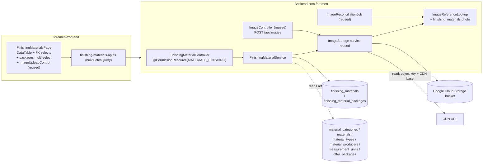

# Design — FOR-04-18: Finishing Materials

## Overview

FOR-04-18 delivers the finishing-material branch of the FOR-04 material model as a
SINGLE new operational entity vertical. It is the sibling of FOR-04-17
(ConstructionMaterial): same "one concrete offer at a price" shape, same GLOBAL
admin-resource treatment (no `ProjectScopedService`), same reuse of the shared
FOR-04-17 `ImageStorage` seam — but with the RICH finishing fields FOR-04-17
omitted, and backed by a REAL, LARGE CSV data seed.

| # | Thing | Resource | Table | Path | Kind |
|---|-------|----------|-------|------|------|
| 1 | FinishingMaterial | `MATERIALS_FINISHING` | `finishing_materials` (+ join `finishing_material_packages`) | `/api/finishing-materials` | NEW entity |
| — | MaterialCategory / Material / MaterialType / MaterialProducer | `MATERIAL_CATEGORIES` / `MATERIALS` / `MATERIAL_TYPES` / `MATERIAL_PRODUCERS` | existing | existing | REUSE (FOR-04-16 references) |
| — | OfferPackage / MeasurementUnit | `OFFER_PACKAGES` / `MEASUREMENT_UNITS` | existing | existing | REUSE (FOR-04-10 / FOR-04-02) |
| — | ImageStorage / ImageController | — | — | `POST /api/images` | REUSE (FOR-04-17 shared seam) |

The entity `FinishingMaterial` models one concrete finishing offer as read from the
packages CSV: a required `category`, a required `material`, an optional `type`, an
optional `producer`, a required many-to-many `packages` set (≥ 1), a required
`unit`, free-text `model`/`sku`/`features`, three nullable prices
(`purchasePrice`, `retailGross`, `retailNet` — all STORED), a
`link`, and an optional `photo` (a GCS object key resolved to a CDN URL on the
DTO). It has NO `code` and NO localized `name`.

Three things distinguish this spec from the FOR-04-17 mirror:

1. **No per-unit price field and no computed price.** FOR-04-17's headline feature
   was a MIN..MAX `retailNet` range keyed by (package, type). FOR-04-18 has NO such
   computation, and this branch has NO per-m²/per-unit price field at all — neither
   stored nor computed. `FinishingMaterial` keeps exactly the three stored prices
   `purchasePrice`, `retailGross`, and `retailNet`. There is no `PriceRangeResolver`
   and no `/price-ranges` endpoint. The CSV's populated `Cena detal / m2` column is
   used ONLY as a seed fallback source for `retailNet` (see CSV seed model), not
   stored in a column of its own.
2. **No new dictionary and no new image service.** Every reference points at an
   existing FOR-04-16/10/02 dictionary; the photo reuses FOR-04-17's `ImageStorage`
   verbatim. The ONLY additive touch to shared code is registering
   `finishing_materials.photo` in `ImageReferenceLookup.IMAGE_COLUMNS` (whose source
   already anticipates FOR-04-18) so orphan cleanup + reconciliation cover it.
3. **A real, large CSV seed.** 581 data rows from
   `docs/Materiały pakiety - Lista.csv` are parsed into `finishing_materials`,
   resolving references against the FOR-04-16 dictionaries and parsing the
   multi-value, dirty `Pakiet` cell into the `packages` set.

Changesets are numbered `060+` (the current highest registered in `changelog.xml`
is `059`), each registered LAST, idempotent per
`.kiro/steering/entity-creation-rules.md`.

### Clarifying questions resolved

- **Display name.** The OVERVIEW confirms `FinishingMaterial` has NO
  `nameRU`/`namePL` and NO `code`. Lists need a human label, so the DTO exposes a
  DERIVED `label` computed at read time as `material.name (localized) + " — " +
  model` (falling back to just the material name when `model` is blank). It is not
  a stored column and not filterable/sortable as a `name` — sort/filter use the
  real reference fields. Raised and resolved in favor of derivation, not adding
  `nameRU`/`namePL`.
- **CSV seed scope.** The full 581-row CSV seed IS in scope now (this is the branch
  that HAS a CSV). Because 581 rows are impractical to hand-write, the changeset is
  GENERATED from the CSV by a repeatable seed-generation step (Requirement 6.8) and
  committed as a normal Liquibase changeset; it is not a runtime CSV import. The
  generated SQL still satisfies mapping, `Pakiet` normalization, comma-decimal price
  parsing, reference resolution by sub-select, blank-category skipping, and
  idempotency.

## Architecture

`FinishingMaterial` is a single richer vertical
(entity + DAO + service models + mappers + service + controller) reusing the shared
framework, the FOR-04-01 reference-filter grammar, and the FOR-04-17 `ImageStorage`.



The `PermissionInterceptor` enforces the `(resource, operation)` pair from the
controller's class-level `@PermissionResource("MATERIALS_FINISHING")` +
`@PermissionOperation` on the inherited `AdminController` CRUD default methods; the
reused `POST /api/images` handler already carries its own method-level
`@RequiresPermission`. `PermissionAnnotationValidator` fails startup on a
half-annotated controller.

### Two-repository split

Per `.kiro/steering/git-repo-structure.md`, the backend (entity, service,
controller, Liquibase, the `ImageReferenceLookup` edit, backend tests) lives in the
**root repo** (`foremen-backend/`, `.kiro/`, `docker-compose.yml`); the frontend
(the finishing-materials page, nav item, i18n, UI tests) lives in the **nested
`foremen-frontend/` repo**. A commit spanning both needs one commit per repo.

## Components and Interfaces

### `FinishingMaterialEntity` (`dao/model`) `@Table("finishing_materials")` extends `BaseEntity`

Modeled on `ConstructionMaterialEntity` (references + many-to-many + image), but
with finishing references and free-text fields, no `code`/`name`, and three stored
prices (no per-unit price field).

```java
@ManyToOne(fetch = FetchType.LAZY, optional = false)
@JoinColumn(name = "category_id", nullable = false)
private MaterialCategoryEntity category;

@ManyToOne(fetch = FetchType.LAZY, optional = false)
@JoinColumn(name = "material_id", nullable = false)
private MaterialEntity material;

@ManyToOne(fetch = FetchType.LAZY)
@JoinColumn(name = "type_id")
private MaterialTypeEntity type;                 // optional

@ManyToOne(fetch = FetchType.LAZY)
@JoinColumn(name = "producer_id")
private MaterialProducerEntity producer;         // optional

@ManyToMany(fetch = FetchType.LAZY)
@JoinTable(
    name = "finishing_material_packages",
    joinColumns = @JoinColumn(name = "finishing_material_id"),
    inverseJoinColumns = @JoinColumn(name = "offer_package_id"))
private Set<OfferPackageEntity> packages = new HashSet<>();

@ManyToOne(fetch = FetchType.LAZY, optional = false)
@JoinColumn(name = "unit_id", nullable = false)
private MeasurementUnitEntity unit;

@Column(name = "model", length = 255)
private String model;

@Column(name = "sku", length = 255)
private String sku;

@Column(name = "features", columnDefinition = "text")
private String features;

@Column(name = "purchase_price", precision = 12, scale = 2)
private BigDecimal purchasePrice;

@Column(name = "retail_gross", precision = 12, scale = 2)
private BigDecimal retailGross;

@Column(name = "retail_net", precision = 12, scale = 2)
private BigDecimal retailNet;

@Column(name = "link", length = 1024)
private String link;

/** GCS object key (NOT the CDN URL); resolved to a CDN URL only on the DTO. */
@Column(name = "photo", length = 512)
private String photo;

@Column(nullable = false)
private boolean active = true;
```

- `dao/FinishingMaterialDao extends AdminDao<FinishingMaterialEntity, Long>`.
- `service/FinishingMaterialService implements AdminService<...>` — NOT
  `ProjectScopedService` (Requirement 2.11). It overrides the write path
  (`create`/`update`) to `normalize(...)` the model: resolve-and-load every
  reference (`categoryId`, `materialId`, `typeId`, `producerId`, `unitId`, each
  `offerPackageId`) with a real load, reject an empty `packages` set, and
  range-check the three prices — mirroring `ConstructionMaterialService`/`RoomService`
  (a missing/null required reference or a dangling id → a field-identifying
  client error; nothing persisted). It resolves the `photoUrl` DTO field from the
  stored object key via `ImageStorage.toCdnUrl(objectKey)` and, on photo
  replace/detach/delete, calls `ImageStorage.deleteIfOrphan(previousKey)`. It builds
  the derived `label` from `material.name (localized) + " — " + model`. Audit
  snapshots serialize nested references as a simple name (flat custom snapshot, like
  `ConstructionMaterialService.serializeEntity` / `WorkPriceService`), not full JSON.

#### `FinishingMaterialController` (`controller`)

`@RestController @RequestMapping("/api/finishing-materials")
@PermissionResource("MATERIALS_FINISHING")` implementing
`AdminController<FinishingMaterialServiceModel, …ServiceExtendedModel,
FinishingMaterialDtoModel, …DtoExtendedModel, FinishingMaterialEntity, Long,
…CreateRequest, …CreateResponse, …UpdateRequest, …UpdateResponse>`. It adds no
custom endpoints (no price-range analog), so the inherited CRUD `@PermissionOperation`
annotations fully satisfy `PermissionAnnotationValidator`.

Controller/service model records:

- `FinishingMaterialCreateRequest` / `…UpdateRequest`:
  ```java
  @NotNull  Long categoryId;
  @NotNull  Long materialId;
  Long typeId;                            // optional
  Long producerId;                        // optional
  @NotEmpty Set<Long> offerPackageIds;    // ≥ 1
  @NotNull  Long unitId;
  @Size(max = 255) String model;          // optional
  @Size(max = 255) String sku;            // optional
  String features;                        // optional (text)
  @DecimalMin("0.00") @DecimalMax("9999999999.99") BigDecimal purchasePrice;    // nullable
  @DecimalMin("0.00") @DecimalMax("9999999999.99") BigDecimal retailGross;      // nullable
  @DecimalMin("0.00") @DecimalMax("9999999999.99") BigDecimal retailNet;        // nullable
  @Size(max = 1024) String link;          // optional
  @Size(max = 512)  String photo;         // optional GCS object key
  Boolean active;                         // defaults to true
  ```
  (There is no `code` and no `name` to protect on update; the update request is
  structurally identical to create.)
- `FinishingMaterialDtoModel` (list row): `{id, label, category: RefDto, material:
  RefDto, type: RefDto, producer: RefDto, packages: List<RefDto>, unit: RefDto,
  model, sku, features, purchasePrice, retailGross, retailNet,
  link, photoUrl, active}` where `RefDto = {id, name}` (localized) and `photoUrl` is
  the **resolved CDN URL** (null when `photo` is null). The persisted object key is
  never returned; only `photoUrl`. `label` is the derived `material + model` label.
- `FinishingMaterialDtoExtendedModel`: the same reference objects plus the raw id
  fields the edit form needs (`categoryId`, `materialId`, `typeId`, `producerId`,
  `offerPackageIds`, `unitId`) and `photoUrl`.
- create/update response records mirror the extended DTO.

Reference filters (Requirement 2.10) ride the existing FOR-04-01 query grammar:
`category.id`, `material.id`, `type.id`, `producer.id`, `unit.id`, and `packages.id`
resolve through the generic `SpecificationBuilder` (a collection path `packages.id`
becomes a JOIN + `distinct`), so no custom filter resolver is needed.

### Reused — `ImageStorage`, `ImageController`, `ImageReferenceLookup` (FOR-04-17)

Nothing in `com.foremen.service.image` is reimplemented. The finishing-material
vertical consumes the existing seam exactly as `ConstructionMaterialService` and
`MaterialProducerService` do:

- **Upload**: the frontend posts the photo to the existing
  `POST /api/images` (`multipart/form-data`, `entityKind=finishing-materials`,
  target `resource=MATERIALS_FINISHING`), which validates content type/size and
  stores the object under the `finishing-materials/{uuid}.{ext}` key namespace,
  returning `{ objectKey, imageUrl }`. The returned object key is saved on the
  finishing material via the normal create/update.
- **Resolve**: `FinishingMaterialControllerMapper` sets `photoUrl =
  ImageStorage.toCdnUrl(photo)` on the read/list DTO (null-safe).
- **Cleanup**: `FinishingMaterialService` calls `ImageStorage.deleteIfOrphan(previousKey)`
  on photo replace/detach/delete.
- **Reference coverage (the one additive change)**: add
  `new ImageColumn("finishing_materials", "photo")` to
  `ImageReferenceLookup.IMAGE_COLUMNS` (whose Javadoc already names FOR-04-18 as the
  next column to add). The lookup already guards each column with an
  `information_schema.columns` existence check, so it degrades gracefully before the
  `060` table changeset runs, and once the table exists, `isReferenced(...)` /
  `referencedKeys()` union in `finishing_materials.photo`. This makes both the eager
  `deleteIfOrphan` trigger and the periodic `ImageReconciliationJob` count
  finishing-material photos, so a referenced photo is never reclaimed and a
  detached one is (Requirement 4.5, 4.6).

No new `ImageController` method, upload model, config key, or reconciliation job is
introduced; the `finishing-materials/` namespace is just a new `entityKind` value
passed to the existing endpoint.

### Frontend — one page + nav (foremen-frontend repo)

A single new feature `foremen-frontend/src/features/finishing-materials/`, richer
than a dictionary page and modeled on the FOR-04-17 construction-materials feature:

- `FinishingMaterialsPage` + `FinishingMaterialsList` (DataTable
  `entityKey="finishing-materials" resource="MATERIALS_FINISHING"`) with columns
  `category`, `material`, `type`, `producer`, `model`, `sku`, `retailNet`,
  and `link`; an optional `photo` thumbnail column.
- `FinishingMaterialFormSheet`: required `category` selector, required `material`
  selector, optional `type`/`producer` selectors, required multi-select `packages`
  (≥ 1), required `unit` selector, `model`/`sku`/`features` inputs,
  `purchasePrice`/`retailGross`/`retailNet` inputs, `link` input,
  optional `photo` upload via the SHARED `ImageUploadControl`
  (`entityKind="finishing-materials"`, `resource="MATERIALS_FINISHING"`, posts to
  `POST /api/images`, renders the resolved CDN image when present), `active` toggle;
  no `code`/`name` field.
- `DeleteFinishingMaterialDialog`; `finishing-materials-api.ts` adapter via the
  shared `buildFetchQuery` with FOR-04-01 reference filters; query/mutation hooks
  `finishingMaterialKeys` that invalidate the list and toast; a zod schema
  (`model`/`sku` ≤ 255, `link` ≤ 1024, ≥ 1 package, required category/material/unit,
  prices in range).
- Routing: lazy `FinishingMaterialsPage` + interim route guard
  (`/materials/finishing` → `MATERIALS_FINISHING`/`READ`).
- Nav: one item added to the existing `nav.sections.warehouse` section in
  `foremen-frontend/src/config/navigation.ts`:
  `{ path: '/materials/finishing', labelKey: 'nav.finishingMaterials',
  requiredPermission: { resource: 'MATERIALS_FINISHING', operation: 'READ' } }`.
- i18n namespace `finishingMaterials.*` + `nav.finishingMaterials` at PL+RU parity
  in both `pl.json` and `ru.json`; no raw key rendered.
- Permission-gated create/edit/delete controls via `usePermission('MATERIALS_FINISHING', …)`.
- The shared `ImageUploadControl` already exists (FOR-04-17); this spec reuses it,
  passing the finishing entity kind/resource — no new upload component.

## Data Models

### `finishing_materials` (new)

| Column | Type | Constraints |
|--------|------|-------------|
| id | BIGSERIAL | PK |
| category_id | BIGINT | NOT NULL, FK → `material_categories(id)` (`fk_finishing_materials_category`) |
| material_id | BIGINT | NOT NULL, FK → `materials(id)` (`fk_finishing_materials_material`) |
| type_id | BIGINT | NULLABLE, FK → `material_types(id)` (`fk_finishing_materials_type`) |
| producer_id | BIGINT | NULLABLE, FK → `material_producers(id)` (`fk_finishing_materials_producer`) |
| unit_id | BIGINT | NOT NULL, FK → `measurement_units(id)` (`fk_finishing_materials_unit`) |
| model | VARCHAR(255) | NULLABLE |
| sku | VARCHAR(255) | NULLABLE |
| features | TEXT | NULLABLE |
| purchase_price | NUMERIC(12,2) | NULLABLE |
| retail_gross | NUMERIC(12,2) | NULLABLE |
| retail_net | NUMERIC(12,2) | NULLABLE |
| link | VARCHAR(1024) | NULLABLE |
| photo | VARCHAR(512) | NULLABLE (GCS object key) |
| active | BOOLEAN | NOT NULL default `true` |
| created_date / created_by / updated_date / updated_by | audit | per `BaseEntity` |

### `finishing_material_packages` (new join table)

| Column | Type | Constraints |
|--------|------|-------------|
| finishing_material_id | BIGINT | NOT NULL, FK → `finishing_materials(id)` **ON DELETE CASCADE** (`fk_fmp_finishing_material`) |
| offer_package_id | BIGINT | NOT NULL, FK → `offer_packages(id)` **ON DELETE CASCADE** (`fk_fmp_offer_package`) |

Composite PK `(finishing_material_id, offer_package_id)`. Both FKs are declared
`ON DELETE CASCADE` at the DB level (the FOR-04-12b/FOR-04-17 pattern) so deleting
an `OfferPackage` removes its join rows (Requirement 3.2) and deleting a finishing
material removes its own memberships.

### Package-membership cascade — where each rule lives (Requirement 3)

- **3.2** (delete `OfferPackage` → drop its join rows): handled by the DB
  `ON DELETE CASCADE` on `finishing_material_packages.offer_package_id`.
- **3.3** (a material left with zero packages after such a delete must itself be
  deleted): the existing `OfferPackageService.deleteById` override — extended by
  this spec — runs, in the same transaction as the package delete, a cleanup that
  deletes every `finishing_materials` row whose `packages` set is now empty
  (`DELETE FROM finishing_materials WHERE id NOT IN (SELECT finishing_material_id
  FROM finishing_material_packages)`, scoped to rows that had referenced the deleted
  package). FOR-04-17 already added the analogous `construction_materials` cleanup
  to this override; this spec appends the `finishing_materials` cleanup alongside it.
- **3.4** (materials still holding ≥ 1 package are untouched): the cleanup targets
  only zero-package rows.
- **3.1** (`packages` mandatory, ≥ 1, several allowed): enforced on the write path —
  the service rejects an empty `offerPackageIds`, and the join table allows many.

### Derived label

`label` is derived, not stored: `material.name` (localized `ru`→`name_ru`, else
`name_pl`) joined with `model` (`"{material} — {model}"`, or just `{material}`
when `model` is blank). It is exposed only on the DTO and is never persisted,
sorted, or filtered as a column; sort/filter uses the real reference fields.

## CSV seed model (Requirement 6)

The 581-row seed is GENERATED from `docs/Materiały pakiety - Lista.csv` by a
repeatable seed-generation step and committed as a Liquibase changeset
(`062-seed-finishing-materials.xml`). Generation rules:

- **Column mapping**: `Kategoria`→`category`, `Materiał`→`material`, `Typ`→`type`,
  `Producent`→`producer`, `Model`→`model`, `SKU`→`sku`, `Cechy`→`features`,
  `Cena zakup`→`purchase_price`, `Cena detal brutto`→`retail_gross`,
  `Cena detal netto`→`retail_net`, `Link`→`link`, `Pakiet`→`packages`. The
  `Cena detal / m2` column has NO stored field of its own — it is used only as the
  `retail_net` fallback source below.
- **`retail_net` fallback** (Requirement 6.2): the only consistently-populated price
  column in the CSV is `Cena detal / m2`; `Cena zakup`/`Cena detal brutto`/`Cena
  detal netto` are frequently empty. So when a row's `Cena detal netto` is empty, the
  generator uses that row's `Cena detal / m2` value for `retail_net` (comma-decimal
  parsed); when both are empty, `retail_net` is `NULL`. This is a SEED-ONLY rule —
  there is no per-unit column on the entity or table.
- **Prices**: comma is the decimal separator (`53,61` → `53.61`); an empty cell → SQL
  `NULL` (Requirement 6.3). `purchase_price` and `retail_gross` map as-is (null when
  empty).
- **`Pakiet` normalization** (Requirement 6.4): split on comma; per token, strip
  surrounding whitespace, strip a leading `+ ` marker, strip stray double-quote
  characters, and map `Standart` → `Standard`; collapse duplicates. The distinct
  normalized tokens observed are `Budget`, `Standard`, `Lux` (mapping to the
  `OFFER_PACKAGES` rows seeded by FOR-04-10; the CSV token is matched to the package
  by its localized name / code).
- **Reference resolution** (Requirement 6.5, 6.6): each `category_id`/`material_id`/
  `type_id`/`producer_id`/`unit_id` is resolved by a `SELECT id FROM <dict> WHERE
  <name/code column> = '<value>'` sub-select at apply time. A row whose required
  `category`/`material`/`unit` value has no matching dictionary row inserts nothing
  (the guarded insert's sub-select yields no id → the insert is skipped). Optional
  `type`/`producer` resolve to `NULL` when absent/blank. `unit` for the CSV is a
  fixed unit (the CSV's header carries `m2`); the generator resolves the `m2`
  measurement unit, and a row is skipped if that unit is absent.
- **Blank-category rows** (Requirement 6.9): the ~6 rows with an empty `Kategoria`
  are skipped by the generator.
- **Idempotency** (Requirement 6.7): the seed changeset carries a
  `preConditions onFail="MARK_RAN"` `sqlCheck` on `SELECT COUNT(*) FROM
  finishing_materials` so the whole seed applies once; individual inserts use
  reference sub-selects so a re-run (or an absent dictionary value) never duplicates
  or half-inserts. The generation approach is noted explicitly per Requirement 6.8.

## Liquibase (registered LAST after `059`)

All files registered last, in this order, in
`foremen-backend/database_files/changelog.xml`. Current highest is `059`.

| # | File | Purpose |
|---|------|---------|
| 060 | `060-create-finishing-materials.xml` | table `finishing_materials` + join table `finishing_material_packages` (cascade FKs); idempotent `tableExists`+`MARK_RAN` |
| 061 | `061-seed-finishing-materials-resource.xml` | resource `MATERIALS_FINISHING` + grants (ADMIN CRUD, MANAGER CRU no-DELETE, FOREMAN/WORKER/FINANCIER READ, CLIENT none, DELETE ADMIN-only); each insert `sqlCheck`+`MARK_RAN` |
| 062 | `062-seed-finishing-materials.xml` | the generated large CSV data seed (581 rows → resolved references + parsed packages); idempotent `sqlCheck`+`MARK_RAN` |

Idempotency rules (per `entity-creation-rules.md`):

- **Table changeset** (`060`): `tableExists` precondition + `MARK_RAN`. Creates both
  `finishing_materials` and `finishing_material_packages`, declaring the five entity
  FKs plus the two join-table `ON DELETE CASCADE` FKs.
- **Resource + grant changeset** (`061`): resource row (non-null `code`, `name_ru`,
  `name_pl`, `description_ru`, `description_pl`) + grants (matrix below); each insert
  guarded by `sqlCheck expectedResult="0"` + `MARK_RAN`; CLIENT omitted
  (deny-by-default comment). This is the "new managed entity" ABAC seed per
  `entity-creation-rules.md` (resource row + `role_resources` + `role_resource_operations`).
- **Data seed changeset** (`062`): generated inserts, each resolving references by
  sub-select and skipping when a required reference is absent; guarded so a re-run is
  a no-op (`MATERIALS_FINISHING` is a GLOBAL resource, so no project scoping).

## ABAC matrix (one new resource)

| Resource | ADMIN | MANAGER | FOREMAN | WORKER | FINANCIER | CLIENT |
|----------|:-----:|:-------:|:-------:|:------:|:---------:|:------:|
| MATERIALS_FINISHING | CRUD | C R U | R | R | R | — |

- `MATERIALS_FINISHING`: ADMIN CRUD; MANAGER CREATE/READ/UPDATE (no DELETE);
  FOREMAN/WORKER/FINANCIER READ; CLIENT none (Requirement 5.2). DELETE is granted to
  ADMIN only (Requirement 5.3) — the same shape as `MATERIALS_CONSTRUCTION`.
- The controller carries `@PermissionResource("MATERIALS_FINISHING")` matching the
  seeded `code`; every inherited CRUD handler carries its `@PermissionOperation`. A
  half-annotated controller fails startup via `PermissionAnnotationValidator`
  (Requirement 5.4, 5.5).
- `MATERIALS_FINISHING` is a GLOBAL admin resource — `FinishingMaterialService` does
  NOT implement `ProjectScopedService` / `getProjectIdPath()` (per
  `entity-creation-rules.md`, this entity is not project-scoped).

## Correctness Properties

*A property is a characteristic or behavior that should hold true across all valid
executions of a system — essentially, a formal statement about what the system
should do. Properties serve as the bridge between human-readable specifications and
machine-verifiable correctness guarantees.*

PBT applies to a focused set of behaviors in this spec: the write-path validation
partitions inputs into accepted/rejected; the package-deletion cascade preserves a
set invariant; the photo CDN-URL resolution is a null-safe format/round-trip
function reused from FOR-04-17; and the `Pakiet` normalization is a pure string
transformation with strong universal properties. The entity mapping and schema, the
reference-filter wiring, the ABAC seed/grant matrix, the CSV seed RESULT, the
photo-storage side effects against the bucket, and all UI rendering are NOT
property-based (they are covered by integration, smoke, example, and parity tests —
see Testing Strategy).

### Property 1: Write validation rejects missing required fields, dangling references, and out-of-range prices

*For any* create or update request, if the request omits a required reference
(`categoryId`, `materialId`, or `unitId`) or supplies an empty `packages` set, or if
any supplied reference id (`categoryId`, `materialId`, `typeId`, `producerId`,
`unitId`, or any `offerPackageId`) does not reference an existing row, or if any of
`purchasePrice`/`retailGross`/`retailNet` is supplied outside the
inclusive range 0.00 to 9,999,999,999.99, then the request is rejected with a
client-error identifying the offending field and no finishing-material row is
created or modified; conversely a request whose required references are present,
whose supplied reference ids all exist, whose `packages` set is non-empty, and whose
supplied prices are all in range is accepted.

**Validates: Requirements 2.2, 2.3, 2.4, 2.5**

### Property 2: Deleting an offer package preserves the "≥ 1 package" invariant

*For any* set of finishing materials with arbitrary package memberships, after
deleting any one offer package, no `finishing_material_packages` join row references
the deleted package, every finishing material that still has at least one remaining
package survives unchanged with exactly its remaining packages, and every finishing
material left with zero packages by the delete no longer exists — so no surviving
finishing material has an empty `packages` set.

**Validates: Requirements 3.2, 3.3, 3.4**

### Property 3: Photo CDN URL is a null-safe round-trip of the stored object key

*For any* stored photo object key and configured CDN base URL, the photo URL
resolved on the read/list DTO equals the CDN base joined to that object key
(`cdnBase + "/" + objectKey`), a null object key resolves to a null URL, and any
object key produced by a finishing-material upload begins with the
`finishing-materials/` namespace prefix.

**Validates: Requirements 2.8, 4.2, 4.3, 4.4**

### Property 4: Pakiet cell normalization yields the correct package-token set

*For any* comma-separated `Pakiet` cell built from the tokens `Budget`, `Standard`,
`Lux`, and `Standart` with arbitrary surrounding whitespace, stray double-quote
characters, a leading `+ ` marker, and repetition, parsing the cell yields exactly
the set of normalized package tokens in which each token is trimmed of whitespace
and quotes, the leading `+ ` marker is removed, `Standart` is mapped to `Standard`,
and duplicates are collapsed — so the result contains `Standard` whenever the input
contained `Standard` or `Standart`, contains no empty token, and is order- and
duplicate-independent.

**Validates: Requirements 6.4**

## Error Handling

- Missing required finishing-material reference (`categoryId`, `materialId`, `unitId`) or an empty `offerPackageIds` → `400` identifying the field; nothing persisted (Requirement 2.3).
- Dangling reference id on create/update (`categoryId`/`materialId`/`typeId`/`producerId`/`unitId`/`offerPackageId`) → `404`/`400` `error.entity.not.found`-style client error naming the field (service `normalize`/`resolveReferences`, the `ConstructionMaterialService`/`RoomService` pattern); nothing persisted (Requirement 2.4).
- Price outside `[0.00, 9,999,999,999.99]` in any of the three price fields → `400` naming the field (Requirement 2.5); `model`/`sku` > 255 → `400` naming the field (Requirement 2.6); `link` > 1024 → `400` naming `link` (Requirement 2.7).
- Photo upload of a non-allowed content type or over the max size → `400`, nothing stored, via the shared service's existing validation (Requirement 4.7); when image storage is not configured, upload → graceful `400` and finishing materials with a null photo still read/list.
- Deleting an `OfferPackage` → its join rows cascade away (DB) and any now-package-less finishing material is deleted in the same transaction (Requirement 3.2–3.4); materials keeping ≥ 1 package are untouched.
- Unauthenticated request → `401`; authenticated-but-unauthorized (e.g. CLIENT, or MANAGER attempting DELETE on `MATERIALS_FINISHING`) → `403`.
- List load failure / network error → localized `errors.loadFailed` / `errors.network` with a retry action.
- CSV seed re-run / absent dictionary value: the `sqlCheck`/`MARK_RAN` guards make the seed a no-op on re-run, and a row whose required reference sub-select yields no id inserts nothing (Requirement 6.6, 6.7); blank-category rows are skipped (Requirement 6.9).

## Testing Strategy

**Dual approach.** Property tests cover the four universal properties above; unit,
integration, smoke, and parity tests cover concrete examples, edge cases, the schema,
the CSV seed result, image side-effects, the grant matrix, and UI.

**Property-based tests** (per the workspace standard, run only the affected classes).
Use the project's existing PBT library (jqwik, already on the backend classpath).
Each property test runs a minimum of 100 iterations and is tagged
`Feature: FOR-04-18-finishing-materials, Property {n}: {property text}`.

- **Property 1 — `FinishingMaterialWriteValidationPropertyTest`**: generate requests
  omitting a required reference, with an empty `packages` set, with exactly one
  dangling reference id (across all six reference fields), or with an out-of-range
  value in each of the three price fields; assert rejection naming the offending field
  with no persistence, and that an all-valid request is accepted.
- **Property 2 — `FinishingMaterialPackageCascadePropertyTest`** (Testcontainers):
  generate materials with random memberships, delete a random package, assert no join
  row references it, surviving materials keep exactly their remaining packages, and no
  surviving material has zero packages — exercising the DB cascade + zero-package
  cleanup.
- **Property 3 — `FinishingMaterialPhotoUrlResolutionPropertyTest`**: generate object
  keys and CDN bases; assert `toCdnUrl` round-trip, null-safety, and the
  `finishing-materials/` namespace-prefix invariant on `store` output (mocked bucket) —
  pure/mocked, cheap.
- **Property 4 — `PakietParserPropertyTest`**: generate `Pakiet` cells from the token
  alphabet with random whitespace/quotes/`+ ` markers/repetition; assert the parsed
  set equals the normalized expected set (`Standart`→`Standard`, no empties,
  duplicate/order independent) — pure, in-memory, cheap.

**Backend example / edge / integration / smoke tests:**

- `FinishingMaterialControllerIntegrationTest` (Testcontainers CRUD with required `category`/`material`/`unit`, optional `type`/`producer`, required `packages` ≥ 1 incl. empty-set rejection; `model`/`sku` 255/256 and `link` 1024/1025 boundaries; derived label on read; reference filters by `category.id`/`material.id`/`type.id`/`producer.id`/`unit.id`/`packages.id`) — Requirements 8.1, 8.2, 2.6, 2.7, 2.9, 2.10.
- `FinishingMaterialPackageCascadeIntegrationTest` (example alongside Property 2: deleting a package removes join rows, deletes a zero-package material, leaves a multi-package material) — Requirement 8.3.
- `FinishingMaterialPhotoIntegrationTest` (photo object-key round-trip → resolved CDN `photoUrl`; upload rejection reuse for non-image/over-size) — Requirements 8.6 (example arm), 4.4, 4.7.
- `FinishingMaterialImageReferenceLookupIntegrationTest` (a `finishing_materials.photo` reference is counted by `ImageReferenceLookup` — a still-referenced photo is not reclaimed; a detached one is) — Requirement 8.9, 4.5.
- `MaterialsFinishingResourceSeedIntegrationTest` (resource present; exact grant matrix incl. CLIENT none, MANAGER no-DELETE, DELETE ADMIN-only; re-run idempotency) — Requirement 8.7, 5.2, 5.3.
- `FinishingMaterialsCsvSeedIntegrationTest` (the generated seed populated `finishing_materials` with resolved references and parsed multi-value packages for representative rows; comma-decimal prices parsed; blank-category rows skipped; re-run inserts no duplicates) — Requirement 8.8, 6.1, 6.3, 6.5, 6.6, 6.7, 6.9.
- `FinishingMaterialsAnnotationCoverageSmokeIT` (the fully annotated `FinishingMaterialController` starts cleanly under `PermissionAnnotationValidator`) — Requirement 8.10, 5.5.

**Frontend tests** (`foremen-frontend` repo):

- `FinishingMaterialsList.test.tsx` (columns `category`/`material`/`type`/`producer`/`model`/`sku`/`retailNet`/`link` render; permission-gated controls appear only with the permission; localized empty state) — Requirement 9.1.
- Photo-control UI test (the shared `ImageUploadControl` appears on the finishing-material form; a finishing material with a photo renders its resolved image) — Requirement 9.2.
- `finishingMaterials.*` key-parity test across `pl.json`/`ru.json`, all non-empty, no raw key — Requirement 9.3.
- `nav.finishingMaterials` parity test across both locales — Requirement 9.4.

Per the workspace test standard, run ONLY the affected classes/files with `--tests`
filters (backend) or the specific test files (frontend); never the full suite
unless the user explicitly asks for full verification (~20 min).
