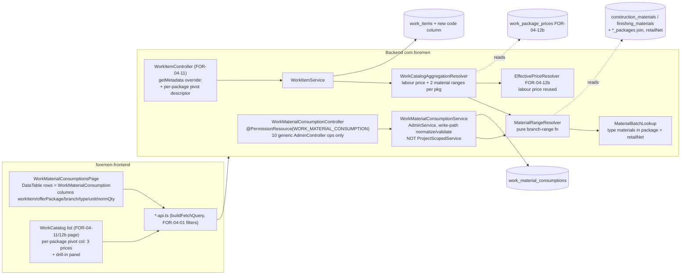

# Design — FOR-04-19: Work-catalog Material Consumption (norms + computed money вилка)

## Overview

FOR-04-19 delivers the material-consumption layer of the FOR-04 model. It ships
**exactly one** new operational entity — **`WorkMaterialConsumption`** (resource
`WORK_MATERIAL_CONSUMPTION`, table `work_material_consumptions`, path
`/api/work-material-consumptions`) — that binds each `WorkItem` (FOR-04-11) to its
per-offer-package material-consumption norms, plus a **computed money price-range
(вилка)** surfaced onto the work-catalog list and a click-through drill-in. It is a
GLOBAL admin resource (NOT project-scoped), managed on its own admin catalog page,
and — exactly like the sibling `WorkPackagePrice` aggregator (FOR-04-12b) — it
surfaces on the work-catalog list only through **aggregation**, never by splitting
work rows.

Each `WorkMaterialConsumption` row is one **(work item, offer package, material
TYPE)** norm. It references:

- a mandatory `WorkItem`, a mandatory `OfferPackage`, and a mandatory `MeasurementUnit`
  (the *numerator* unit — kg / l / m² / m³ / szt — distinct from the work item's own
  denominator unit);
- a mandatory `branch` enum (`construction` | `finishing`);
- **exactly one** material TYPE (the analog GROUP, never a concrete material): a
  nullable `ConstructionMaterialType` (FOR-04-17) XOR a nullable finishing
  `MaterialType` (FOR-04-16), the non-null one matching `branch`;
- a mandatory non-negative `normQty` (material-unit per one work-unit), an optional
  `wastePct`, a bilingual `justificationRU`/`justificationPL` (the ONLY i18n text the
  entity owns), and a normative citation (`sourceType`/`sourceDoc`/`sourceUrl`/`sourceRef`).

The **price range is never stored**. It is formed at read time from the analog
**batch** — ALL active materials of the row's TYPE whose `packages` set contains the
row's `offerPackage` — as `normQty × [MIN..MAX retailNet]`. A type with several
package materials yields a real band; a single material collapses `min == max`; a
type with NO priced material in the package contributes an explicit `0` (so a missing
catalog item stays visible rather than blank).

Two headline computed behaviors distinguish this spec from a plain CRUD vertical, and
they are the property-based-testing targets:

1. **The branch money range (`MaterialRangeResolver`).** For each `(work item, offer
   package)` the system computes TWO money ranges per work-unit — a **construction**
   range and a **finishing** range — each a `{min, max}` in PLN. A branch range is the
   SUM, over that branch's distinct material types in the package, of the type-level
   batch `min`/`max`. Physical quantities are NEVER summed across units (kg + szt + m²
   do not add); only money sums. A branch with no rows for a `(work, package)` yields
   an explicit `0`. This is a deterministic, total pure function over already-loaded
   rows + material prices.
2. **The work-catalog pivot aggregation + drill-in.** The work-catalog list (rows =
   `WorkItem`) gains a synthetic computed pivot field per seeded package (mirroring the
   FOR-04-12b price pivot), each carrying **THREE** prices for that `(work, package)`:
   (a) the **work labour price** (the existing FOR-04-12b `WorkPackagePrice` net price,
   surfaced not recomputed), (b) the **construction material range** `{min,max}`, and
   (c) the **finishing material range** `{min,max}`. Clicking a package cell drills in
   and loads the exhaustive material list for that `(work, package)`, grouped by branch
   then by type (analog batch), reusing the standard list endpoint via the FOR-04-01
   query DSL (no bespoke endpoint).

The data seed is **generated from the completed research artifact**
`FOR-04-RESEARCH-material-norms` (`work-material-norms.csv`: 615 norm rows over 205
works, `construction-materials.csv`, `new-measurement-units.csv`), mirroring
FOR-04-18's CSV-to-SQL generated seed. Because the range pulls from the analog batch,
the **real construction materials are seeded FIRST** (superseding the FOR-04-17
placeholder seed) so every norm's batch resolves to actual materials; the consumption
norms are seeded second. A NEW stable `work_items.code` (populated from the Excel
positional `LP`) is the durable key the consumption seed resolves `work_code` against.

Changesets are numbered **`063+`** (the current highest registered in `changelog.xml`
is `062`), each registered LAST, idempotent per
`.kiro/steering/entity-creation-rules.md`. `WORK_MATERIAL_CONSUMPTION` is a GLOBAL
admin resource, so `WorkMaterialConsumptionService` does NOT implement
`ProjectScopedService` (Requirement 2.8, per `entity-creation-rules.md` step 4 — this
entity is not project-scoped).

### Type (analog group) vs. concrete material — the deliberate split

A consumption row references a material **TYPE**, never a concrete material. This is
what makes the вилка a *range*: one norm (`5 kg glue per m²`) applies to the whole
analog group, and the price band comes from *all* the concrete glues offered in that
package. The two type dictionaries already exist:

- **construction branch** → `ConstructionMaterialType` (FOR-04-17,
  `construction_material_types`); the batch = `construction_materials` of that type
  whose `packages` contains the row's `offerPackage`.
- **finishing branch** → the FOR-04-16 finishing `MaterialType` (`material_types`); the
  batch = `finishing_materials` of that type whose `packages` contains the row's
  `offerPackage`.

`retailNet` is the price used for the band; it is a stored column on both
`construction_materials` and `finishing_materials` (FOR-04-17/18). A material with a
null `retailNet` is excluded from the type's MIN/MAX.

### Reference is a snapshot copy (forward to FOR-05)

Like the FOR-04-12b price catalog, the computed ranges are a **reference** — a
downstream FOR-05 project estimate COPIES the computed range as a snapshot at add-time
and never binds by FK to a consumption row or a material. FOR-04-19 only guarantees
the read-and-copy contract on the catalog side; it creates no FK from any consumer
into `work_material_consumptions`. The snapshot columns belong to FOR-05.

### id vs. code — consistent with FOR-04-12b

Two identifiers serve two concerns, exactly as FOR-04-12b:

- The **work-catalog pivot descriptor is keyed by the numeric `offerPackage.id`** (the
  `/metadata` descriptor embeds the id, the frontend renders one column per id), because
  the id survives a `code` rename.
- The new **`work_items.code`** (from the Excel `LP`, e.g. `1.01`, `2.10`) is the stable
  natural key the *consumption seed* resolves `work_code` against — a build-time seed
  concern, unrelated to the pivot id.

## Architecture



The `PermissionInterceptor` enforces the `(resource, operation)` pair from the
controller's class-level `@PermissionResource("WORK_MATERIAL_CONSUMPTION")` +
`@PermissionOperation` on the inherited `AdminController` CRUD default methods; there
are NO custom endpoints (the drill-in rides the generic list handler), so the inherited
CRUD annotations fully satisfy `PermissionAnnotationValidator`.
`PermissionAnnotationValidator` fails startup on any half-annotated controller.

### Two-repository split

Per `.kiro/steering/git-repo-structure.md`, the backend (entity, service, controller,
`MaterialRangeResolver`, the work-catalog aggregation, Liquibase, the seed generator,
backend tests) lives in the **root repo** (`foremen-backend/`, `.kiro/`,
`docker-compose.yml`); the frontend (the consumption admin page, the work-catalog
pivot columns + drill-in, nav item, i18n, UI tests) lives in the **nested
`foremen-frontend/` repo**. A commit spanning both needs one commit per repo.

## Components and Interfaces

### Requirement 1 — `WorkItem` stable `code` (additive)

`WorkItemEntity` (FOR-04-11, `work_items`) gains one field; nothing else on it changes:

```java
@Column(name = "code")   // nullable, unique among non-null values
private String code;
```

- `code` is a `String` populated from the Excel positional `LP` normalized to `N.MM`
  (e.g. `1.01`, `2.10`) (R1.1).
- The column is added by an **idempotent additive** Liquibase changeset (`addColumn`
  guarded by `columnExists` + `MARK_RAN`), and a **data changeset** backfills `code` for
  the existing seeded work items by matching the Excel row order/name; guarded so a
  re-run changes nothing (R1.2).
- A **partial unique index** enforces uniqueness of non-null `code` values while allowing
  many nulls (`CREATE UNIQUE INDEX ux_work_items_code ON work_items(code) WHERE code IS NOT
  NULL`) (R1.3, R1.4).
- `code` is exposed on the work-catalog DTO (R1.3). A work item with no derivable `LP`
  keeps `code = null` and the migration does not fail (R1.4).

### Requirement 2 — `WorkMaterialConsumptionEntity` (`dao/model`) `@Table("work_material_consumptions")` extends `BaseEntity`

No `code`, no localized `name`; the only i18n fields are the `justification` pair.
Modeled on the reference-heavy shape of `RoomEntity`/`ConstructionMaterialEntity` and
the branch/enum handling below.

```java
@ManyToOne(fetch = FetchType.LAZY, optional = false)
@JoinColumn(name = "work_item_id", nullable = false)
private WorkItemEntity workItem;                       // R2.2

@ManyToOne(fetch = FetchType.LAZY, optional = false)
@JoinColumn(name = "offer_package_id", nullable = false)
private OfferPackageEntity offerPackage;               // R2.2

@ManyToOne(fetch = FetchType.LAZY, optional = false)
@JoinColumn(name = "material_unit_id", nullable = false)
private MeasurementUnitEntity materialUnit;            // R2.2 (numerator unit)

@Enumerated(EnumType.STRING)
@Column(name = "branch", nullable = false, length = 32)
private ConsumptionBranch branch;                      // R2.3  construction | finishing

/** Analog GROUP for construction; non-null iff branch == construction (R2.4). */
@ManyToOne(fetch = FetchType.LAZY)
@JoinColumn(name = "construction_material_type_id")
private ConstructionMaterialTypeEntity constructionMaterialType;

/** Analog GROUP for finishing; non-null iff branch == finishing (R2.4). */
@ManyToOne(fetch = FetchType.LAZY)
@JoinColumn(name = "finishing_material_type_id")
private MaterialTypeEntity finishingMaterialType;

@Column(name = "norm_qty", nullable = false, precision = 12, scale = 4)
private BigDecimal normQty;                             // R2.5  >= 0

@Column(name = "waste_pct", precision = 5, scale = 2)
private BigDecimal wastePct;                            // R2.6 optional

@Column(name = "justification_ru", columnDefinition = "text")
private String justificationRU;                        // R2.1 nullable i18n

@Column(name = "justification_pl", columnDefinition = "text")
private String justificationPL;                        // R2.1 nullable i18n

@Column(name = "source_type", nullable = false, length = 32)
private String sourceType;                              // R2.6  producer_tds|knr|retail|excel|expert

@Column(name = "source_doc", nullable = false)
private String sourceDoc;                               // R2.6

@Column(name = "source_url", length = 1024)
private String sourceUrl;                               // R2.6 nullable

@Column(name = "source_ref", nullable = false)
private String sourceRef;                               // R2.6
```

`ConsumptionBranch` is a Java enum `{ construction, finishing }` stored as a string
(R2.3). Rendering uses localized labels, never the raw enum value (R9.2).

- `dao/WorkMaterialConsumptionDao extends AdminDao<WorkMaterialConsumptionEntity, Long>`.
- `service/WorkMaterialConsumptionService implements AdminService<...>` — **NOT
  `ProjectScopedService`** (R2.8; global admin resource, so no `getProjectIdPath()` per
  `entity-creation-rules.md` step 4).
- The table-creation changeset creates `work_material_consumptions` with the columns
  above, the four `BaseEntity` audit columns, and the FKs when the table is absent;
  guarded `tableExists` + `MARK_RAN` so a re-run makes no schema change (R2.7).

### Requirement 3 — CRUD, validation & references

`WorkMaterialConsumptionController` (`controller`):
`@RestController @RequestMapping("/api/work-material-consumptions")
@PermissionResource("WORK_MATERIAL_CONSUMPTION")` implementing the full 10-op
`AdminController<WorkMaterialConsumptionServiceModel, …ServiceExtendedModel,
…DtoModel, …DtoExtendedModel, WorkMaterialConsumptionEntity, Long,
…CreateRequest, …CreateResponse, …UpdateRequest, …UpdateResponse>` — create, list, read,
update, delete, count, metadata, i18n (R3.1). **No custom endpoints**; the drill-in
rides the generic list handler (R5.5), so the inherited CRUD `@PermissionOperation`
annotations fully satisfy `PermissionAnnotationValidator` (R6.4, R6.5).

Controller/service model records:

- `WorkMaterialConsumptionCreateRequest` / `…UpdateRequest`:
  ```java
  @NotNull Long workItemId;                    // R3.2
  @NotNull Long offerPackageId;                // R3.2
  @NotNull ConsumptionBranch branch;           // R3.2
  @NotNull Long materialUnitId;                // R3.2
  Long constructionMaterialTypeId;             // exactly one of the two (R3.2, R3.6)
  Long finishingMaterialTypeId;
  @NotNull @DecimalMin("0.0000") @DecimalMax("99999999.9999") BigDecimal normQty; // R3.2, R3.5
  @DecimalMin("0.00") @DecimalMax("999.99") BigDecimal wastePct;   // optional
  String justificationRU;                      // optional (text)
  String justificationPL;                      // optional (text)
  @NotBlank String sourceType;
  @NotBlank String sourceDoc;
  @Size(max = 1024) String sourceUrl;          // optional
  @NotBlank String sourceRef;
  ```
  (Update is structurally identical — there is no `code`/`name` to protect.)
- `WorkMaterialConsumptionDtoModel` (list row): `{id, workItem: RefDto, offerPackage:
  RefDto, branch, branchLabel, materialType: RefDto, materialUnit: RefDto, normQty,
  wastePct, typeBatchRange: {min,max}, materials: List<AnalogMaterialDto>, justification,
  sourceType, sourceDoc, sourceUrl, sourceRef}` where `RefDto = {id, name}` (localized)
  and `materialType` is whichever of the two type references is set. `justification` is
  the localized single value (PL fallback). `typeBatchRange` + `materials` power the
  drill-in (see R5.4).
- `WorkMaterialConsumptionDtoExtendedModel` (single/detail + create/update): the reference
  objects PLUS the raw id fields the edit form needs (`workItemId`, `offerPackageId`,
  `materialUnitId`, `constructionMaterialTypeId`, `finishingMaterialTypeId`) and BOTH raw
  `justificationRU`/`justificationPL` for editing (R3.8).
- `AnalogMaterialDto = {id, name, producer, seller, unit: RefDto, retailNet, moneyCost}`
  where `moneyCost = normQty × retailNet` for that material (R5.4).

**Write-path validation.** `WorkMaterialConsumptionService` overrides `create`/`update`
to `normalize(...)` the model before persisting, mirroring
`ConstructionMaterialService`/`RoomService.resolveReferences` (a missing/dangling
reference → a field-identifying client error; nothing persisted):

1. Require `workItemId`, `offerPackageId`, `branch`, `materialUnitId`, `normQty`, and
   **exactly one** material-type id (R3.2). Missing any → client error naming the field,
   nothing persisted (R3.3).
2. Real-load each supplied reference (`workItemId`, `offerPackageId`, `materialUnitId`, the
   set `constructionMaterialTypeId`/`finishingMaterialTypeId`); a dangling id → client
   error naming the offending field, nothing persisted (R3.4).
3. `normQty` outside `[0, 99999999.9999]` (incl. negative) → client error naming `normQty`,
   nothing persisted (R3.5).
4. The **XOR + branch-match** rule: NEITHER or BOTH type ids set → reject; the set type not
   matching `branch` (`construction` requires `constructionMaterialTypeId`, `finishing`
   requires `finishingMaterialTypeId`) → reject; nothing persisted (R3.6).

**Reference filters (R3.7)** ride the FOR-04-01 query grammar through the generic
`SpecificationBuilder`: `workItem.id`, `offerPackage.id`, `materialUnit.id`,
`constructionMaterialType.id`, `finishingMaterialType.id` are ordinary reference paths,
and `branch` is a scalar enum path — no custom resolver is needed (unlike the
FOR-04-12b pivot).

**`justification` i18n (R3.8).** `WorkMaterialConsumptionServiceMapper.getI18nSupportedProperties()
= Set.of("justification")` so a single-value `justification` read resolves via PL fallback
(`ru` → `justificationRU`, else `justificationPL`); both raw variants are exposed on the
extended DTO for editing.

#### Custom audit snapshot — flat, cycle-free `serializeEntity` override (Requirement 2/3 refinement)

`WorkMaterialConsumptionEntity` is reference-heavy (`@ManyToOne` `workItem`, `offerPackage`,
`materialUnit`, plus the two nullable material-type references
`constructionMaterialType`/`finishingMaterialType`). The generic `AdminService` audit path
serializes the WHOLE JPA entity with the shared audit `ObjectMapper`, which dumps every nested
`@ManyToOne` reference as full nested JSON and risks lazy-init/cycles. To avoid that,
`WorkMaterialConsumptionService` overrides ONLY the single-entity serialization seam —
`serializeEntity(WorkMaterialConsumptionEntity)` — exactly mirroring the established precedent of
`FinishingMaterialService.serializeEntity(...)` and `WorkPriceService.serializeEntity(...)` (which
solve the identical reference-heavy audit problem for their entities). No other seam is touched:
the inherited create/update/delete transactional bodies run unchanged.

The override builds a FLAT, cycle-free `LinkedHashMap<String,Object>` snapshot:

- **Scalars emitted verbatim**: `id`, `branch` (the enum `name()`), `normQty`, `wastePct`,
  `sourceType`, `sourceDoc`, `sourceUrl`, `sourceRef`, `justificationRU`, `justificationPL`.
- **Each nested reference flattened to a readable NAME string (never nested JSON)**, reusing the
  `firstNonBlank(namePL, nameRU, code)` convention from the sibling services: `workItem` (its
  localized name, falling back to `code`), `offerPackage`, `materialUnit`, and — for the material
  TYPE — whichever of `constructionMaterialType`/`finishingMaterialType` is set, emitted under a
  single `materialType` key (matching the XOR rule: exactly one is non-null).
- **Serialized with the shared `AUDIT_OBJECT_MAPPER`**, wrapped in a try/catch that returns the
  fallback `{"error":"serialization_failed","class":"WorkMaterialConsumptionEntity"}` on a
  `JsonProcessingException` — identical to the two precedents.
- **`serializeUpdateAfterSnapshot` is LEFT at the `AdminService` default** (`serializeEntity(after)`),
  so the before AND after of an UPDATE share the same flat shape and the audit UI's generic
  key-by-key diff (`compute-diff.ts`) yields one changed row per changed field. The same flat map is
  used for the CREATE-after, the DELETE-before, and both sides of an UPDATE.

The computed money range (вилка) and the analog `materials` list are NOT part of the audit snapshot:
they are read-time computed by `MaterialRangeResolver`/`WorkCatalogAggregationResolver` and never
persisted, so there is nothing to audit.

### Requirement 4 — `MaterialRangeResolver` (computed money вилка)

A stateless Spring `@Component` (and equivalently a pure static helper for the property
test) computing the branch money ranges. It operates on already-loaded consumption rows
and the analog materials of their types (no per-element I/O), so it is a pure,
deterministic, total function and is the primary property-based-testing target (R4.7).

```java
public record MoneyRange(BigDecimal min, BigDecimal max) {}   // ZERO = new MoneyRange(0,0)

public record BranchRanges(MoneyRange construction, MoneyRange finishing) {}

/**
 * The analog batch for one (offer package, material type): the set of that type's active
 * materials in the package, each carrying a non-null retailNet (nulls excluded, R4.6).
 * Supplied by MaterialBatchLookup so the resolver stays pure over loaded data.
 */
public record TypeBatch(Long offerPackageId, Long materialTypeId, ConsumptionBranch branch,
                        List<BigDecimal> retailNets) {}

/** Type-level batch range: normQty × [MIN..MAX retailNet]; empty batch ⇒ 0..0 (R4.2, R4.6). */
MoneyRange typeBatchRange(BigDecimal normQty, TypeBatch batch);

/**
 * Branch money range for one (work item, offer package, branch): the SUM over that
 * branch's DISTINCT material types of their type-level batch min/max. No rows for the
 * branch ⇒ explicit MoneyRange(0,0) (R4.3, R4.4). Physical quantities are never summed
 * across units — only money (R4.5).
 */
MoneyRange branchRange(Collection<ConsumptionRow> rowsOfBranch, BatchProvider batches);

/** Both branch ranges for a (work item, offer package); each explicit 0 when its branch is empty. */
BranchRanges compute(Collection<ConsumptionRow> rowsForWorkPackage, BatchProvider batches);
```

Rule (R4.1–R4.7):

1. **Type-level batch range** for a row `(normQty, batch)`: `min = normQty × MIN(retailNet)`,
   `max = normQty × MAX(retailNet)` over the batch's non-null `retailNet`s. Several
   materials → real `min..max`; single material → `min == max`; **empty batch → `0..0`**
   (the norm still appears in the drill-in with a `0`/`—` cost) (R4.2, R4.6).
2. **Distinct-type batching**: when two rows in the same `(work, package, branch)` reference
   the same type, the batch is computed once per distinct type (R4.2).
3. **Branch range**: SUM over the branch's distinct types of the type-level batch `min`
   (range min) and `max` (range max) (R4.3).
4. **Empty branch → explicit `0`**: a `(work, package)` with NO rows for a branch returns
   `MoneyRange(0,0)`, distinguishable from an absent computation (R4.4).
5. **No cross-unit physical sum**: physical quantities in different material units are never
   added; only money ranges sum (R4.5).
6. **Null price exclusion**: a material of the type in the package with null `retailNet` is
   excluded from the type's MIN/MAX; a type with no priced material in the package
   contributes `0` (R4.6).
7. **Determinism**: the same set of consumption rows and material prices always produces the
   same min and max — `BigDecimal.min`/`max` over an order-independent aggregate (R4.7).

`MaterialBatchLookup` is a thin DAO-backed provider that, for a set of `(offerPackageId,
materialTypeId, branch)` keys, loads the analog batch's `retailNet`s in ONE query per branch
(construction: `construction_materials` joined to `construction_material_packages`; finishing:
`finishing_materials` joined to `finishing_material_packages`), filtered to `active = true`
and non-null `retailNet`. Keeping the DB read in the lookup lets `MaterialRangeResolver`
stay a pure function of `(rows, loaded batches)` for the property test.

### Requirement 5 — work-catalog aggregation (pivot columns) & drill-in

The work-catalog list row stays the `WorkItem` (FOR-04-11), so its server-side
pagination/sort/search is preserved and the synthetic pivot fields do NOT multiply or split
rows (R5.3). `WorkItemService`/`WorkItemController` gain a per-package synthetic pivot,
mirroring the FOR-04-12b price pivot but carrying THREE prices per package.

- **`WorkCatalogAggregationResolver`** assembles, per work item, a
  `Map<Long /*offerPackageId*/, PackageCell>` where
  `PackageCell = {Long offerPackageId, BigDecimal labourPrice, MoneyRange construction,
  MoneyRange finishing}` (R5.1):
  - **(a) labour price** — reuses the FOR-04-12b `EffectivePriceResolver` over the work item's
    `WorkPrice.packagePrices` for that package (surfaced, not recomputed);
  - **(b) construction range** and **(c) finishing range** — the branch money ranges from
    `MaterialRangeResolver.compute(...)` for that `(work, package)`, each rendering an explicit
    `0` (min and max both `0`) when its branch has no consumption for the `(work, package)`
    (R5.1, R5.2).
- The aggregation loads, for the page's work items, their consumption rows (one `IN` query by
  `workItem.id`) and the analog batches (via `MaterialBatchLookup`), so the pivot map is built
  without N+1.
- The list read remains paginated over distinct `WorkItem` rows; the pivot map is attached in
  an `@AfterMapping` on the work-catalog service mapper (R5.3), exactly as FOR-04-12b attaches
  its `prices` map.

**`/metadata` pivot descriptor (R5.6).** `WorkItemController.getMetadata()` (thin override)
calls `EntityMetadataResolver.resolve(WorkItemEntity.class)` then appends **one synthetic
pivot descriptor per seeded offer package** from the cached `SeededOfferPackages` provider
(reused from FOR-04-12b, keyed by `offerPackage.id`): field name embedding the
`offerPackage.id`, a `dataType` carrying the THREE prices (labour price, construction range,
finishing range), and the package's localized label — so the frontend renders one column per
package.

**Drill-in (R5.4, R5.5).** The drill-in is NOT a bespoke endpoint. Clicking a `(work,
package)` cell issues `GET /api/work-material-consumptions` via the FOR-04-01 query DSL —
`workItem.id==<id>` AND `offerPackage.id==<id>` with a deliberately large `size` (render all
rows without pagination) — permission-gated by the same `WORK_MATERIAL_CONSUMPTION`/`READ` as
the list (R5.5). Each returned `WorkMaterialConsumptionDtoModel` carries its `branch`, its
material `type` (analog group), `normQty` in the material unit per work-unit, the type-level
money band `typeBatchRange` (`normQty × [MIN..MAX retailNet]` over the type's materials in the
package), the LIST of analog `materials` of that type in the package (each with name,
producer, seller, unit, `retailNet`, and per-material money cost `normQty × retailNet`), and
the `justification` + citation (R5.4). The frontend groups the rows by branch then by type
(analog batch) and renders the band plus the expandable analog list.

### Requirement 6 — ABAC resource & grants

Per `.kiro/steering/entity-creation-rules.md` (New Managed Entity Checklist):

- **Step 1 — resource seed**: insert the `WORK_MATERIAL_CONSUMPTION` resource row with non-null
  `code`, `name_ru`, `name_pl`, `description_ru`, `description_pl` (R6.1), guarded by
  `<preConditions onFail="MARK_RAN"><sqlCheck expectedResult="0">SELECT COUNT(*) FROM resources
  WHERE code = 'WORK_MATERIAL_CONSUMPTION'</sqlCheck></preConditions>` (R6.6).
- **Step 2 — role-matrix grants** (R6.2, R6.3): in the same seed changeset,
  insert `role_resources` + `role_resource_operations` for the matrix below; DELETE granted to
  ADMIN only; CLIENT gets no grant (deny-by-default); each insert guarded with an `onFail="MARK_RAN"`
  `sqlCheck` so a re-run inserts zero rows (R6.6).
- **Step 3 — annotation**: `WorkMaterialConsumptionController` is annotated
  `@PermissionResource("WORK_MATERIAL_CONSUMPTION")` whose value matches the seeded `code`
  (R6.4); each inherited CRUD handler carries its `@PermissionOperation` (from
  `AdminController`), so a half-annotated controller fails startup via
  `PermissionAnnotationValidator` (R6.5). No custom endpoints, so nothing extra to annotate.
- **Step 4 — NOT project-scoped**: `WorkMaterialConsumptionService` does not implement
  `ProjectScopedService`/`getProjectIdPath()` (R2.8).
- The new changeset files are registered **last** in `changelog.xml`, after the current highest
  `062` (R6.7).

ABAC matrix (one new resource):

| Resource | ADMIN | MANAGER | FOREMAN | WORKER | FINANCIER | CLIENT |
|----------|:-----:|:-------:|:-------:|:------:|:---------:|:------:|
| WORK_MATERIAL_CONSUMPTION | C R U D | C R U | R | R | R | — |

(ADMIN full CRUD; MANAGER CREATE/READ/UPDATE, no DELETE; FOREMAN/WORKER/FINANCIER READ;
DELETE ADMIN-only; CLIENT none — the same shape as `MATERIALS_CONSTRUCTION`/`MATERIALS_FINISHING`.)

> Note: `ForemenPermissionEvaluator` bypasses the matrix for the exact `ADMIN` role, so the
> ADMIN grant is a consistency/self-describing measure, but it MUST still be seeded so the
> matrix is complete (per `entity-creation-rules.md` step 2).

### Requirement 7 — data seed (materials FIRST, then consumption)

The seed is GENERATED from the research artifact by a repeatable seed-generation step
(mirroring FOR-04-18's CSV-to-SQL generator) and committed as Liquibase changesets; it is not
a runtime import. Ordering matters because the range pulls from the analog batch, so materials
must exist before the norms reference their types.

1. **Units first (R7.5)** — a CSV introducing a material unit absent from `MEASUREMENT_UNITS`
   (e.g. `kg`, `l`) is added via an idempotent seed of `new-measurement-units.csv` before the
   material seed.
2. **Real construction materials (R7.1)** — seed the real construction materials from
   `FOR-04-RESEARCH-material-norms/construction-materials.csv`, **REPLACING** the FOR-04-17
   placeholder construction-materials seed. Resolve each material's `type` →
   `CONSTRUCTION_MATERIAL_TYPES` (seeding any missing type first, R7.8), `producer`/`seller` →
   `MATERIAL_PRODUCERS`/`MATERIAL_SELLERS` (seeding any missing), `unit` → `MEASUREMENT_UNITS`,
   `packages` → `OFFER_PACKAGES`, `currency` → `CURRENCIES`; idempotent (`sqlCheck` + `MARK_RAN`).
   This runs BEFORE the consumption seed so each type's analog batch (all materials of a type in
   a package) exists for the range to pull.
3. **Consumption norms (R7.2, R7.3, R7.7)** — seed `work_material_consumptions` from
   `work-material-norms.csv`. Per row: resolve `work_code` → `WorkItem` by its new `code`,
   `packages` → `OfferPackage`(s) (a CSV row with multiple packages **fans out into one
   consumption row per package**, R7.3), and the CSV `material_type` → the analog-group TYPE
   dictionary matching `branch` (construction → `CONSTRUCTION_MATERIAL_TYPES`, finishing → the
   FOR-04-16 `material_types`), first seeding any `material_type` absent from its dictionary
   (R7.8). Copy `material_unit`, `norm_qty`, `waste_pct`, `branch` (preserved, R7.7),
   `justification_pl`/`justification_ru`, and the citation columns. It references a TYPE, never a
   concrete material (R7.3).
4. **Unresolved references (R7.4)** — a row whose `work_code`, offer package, or `material_type`
   does not resolve inserts NO row for that `(row, package)`, and the generation step records it
   in the generator output for review (never fabricate a type).
5. **Idempotency & order (R7.6)** — all seeds are idempotent (`sqlCheck` + `MARK_RAN`) and
   registered last in `changelog.xml` in dependency order: **units → construction material types →
   construction materials → consumption**.

**Seed generation.** A throwaway Python script parses the research CSVs, resolves references by
sub-select at apply time, emits guarded `<insert>`/`<sql>` blocks, and is deleted after
generating the changeset; parsed/skipped/unresolved counts are documented in each changeset
header (mirroring FOR-04-18). Comma-decimal prices are parsed (`53,61` → `53.61`); an empty cell
→ SQL `NULL`.

### Requirement 8 & 9 — Admin CRUD UI + work-catalog integration + i18n (foremen-frontend repo)

- **`WorkMaterialConsumptionsPage`** at `/catalog/material-consumption` (lazy-loaded) using the
  shared `DataTable` (`entityKey="work-material-consumptions"
  resource="WORK_MATERIAL_CONSUMPTION"`) with server search/sort/filter/pagination, rows =
  `WorkMaterialConsumption`, columns `workItem`, `offerPackage`, `branch`, `materialType`,
  `material`, `materialUnit`, `normQty` (R8.1). The `branch` column renders via localized labels
  (R9.2).
- **`WorkMaterialConsumptionFormSheet`** (create/edit): required `workItem` selector, required
  `offerPackage` selector, required `branch` toggle, required `materialType` selector, optional
  concrete `material` selector filtered by branch, required `materialUnit` selector, required
  `normQty` input, optional `wastePct`, `justificationRU`/`justificationPL` inputs, and citation
  inputs (`sourceType`, `sourceDoc`, `sourceUrl`, `sourceRef`); NO `code`/`name` field (R8.2). A
  zod schema mirrors the backend validation; on invalid submit it blocks, retains values, and
  shows a localized per-field message (R8.3).
- **Work-catalog list integration (R8.4, R8.5)** — the FOR-04-11/12b work-catalog list renders,
  per seeded package, a computed column showing the THREE prices (labour price, construction
  range, finishing range), rendering `0` where a branch has no norm. Clicking a package material
  cell opens a **drill-in panel** loading the exhaustive material list grouped by branch → type
  (analog batch), each material showing `normQty` in the material unit per work-unit AND the
  money cost per work-unit, plus the batch min/max, the material characteristics, and the
  justification + citation.
- **Data plumbing (R8.6)** — the list fetch uses the shared `buildFetchQuery`; reference filters
  follow FOR-04-01; mutations invalidate the consumption list query AND the work-catalog
  aggregation query and show a toast.
- **Permission gating (R8.7)** — create/update/delete controls are hidden when the user lacks the
  corresponding `WORK_MATERIAL_CONSUMPTION` operation (`usePermission`). A delete confirmation
  dialog is provided (R8.8).
- **Nav + route guard (R8.9)** — a `"Расход материалов / Material Consumption"` item is added
  under the `"Каталог / Catalog"` section pointing to `/catalog/material-consumption`, ABAC-gated
  on `WORK_MATERIAL_CONSUMPTION` READ, with an interim route guard until FOR-04-15 menu wiring.
- **i18n (R8.10, R9)** — all UI text renders from keys under `workMaterialConsumption.*` plus
  `nav.materialConsumption`, defined at parity in BOTH `pl.json` and `ru.json`, non-empty in both,
  and no raw i18n key is rendered. The per-package pivot column renders the package's localized
  name as its header and localized sub-labels for the three prices —
  `workMaterialConsumption.price.labour` / `.construction` / `.finishing` (R9.3). The drill-in
  `justification` uses the localized variant (PL fallback); the citation `sourceType` renders via
  `workMaterialConsumption.sourceType.*` labels (R9.4). i18n key table below.

#### i18n key table (`workMaterialConsumption.*` + `nav.materialConsumption`, PL + RU parity)

| Key | PL | RU |
|-----|----|----|
| `nav.materialConsumption` | Zużycie materiałów | Расход материалов |
| `workMaterialConsumption.page.title` | Zużycie materiałów | Расход материалов |
| `workMaterialConsumption.table.workItem` | Praca | Работа |
| `workMaterialConsumption.table.offerPackage` | Pakiet | Пакет |
| `workMaterialConsumption.table.branch` | Gałąź | Ветвь |
| `workMaterialConsumption.table.materialType` | Typ materiału | Тип материала |
| `workMaterialConsumption.table.material` | Materiał | Материал |
| `workMaterialConsumption.table.materialUnit` | Jednostka materiału | Ед. изм. материала |
| `workMaterialConsumption.table.normQty` | Norma zużycia | Норма расхода |
| `workMaterialConsumption.branch.construction` | Budowlana | Строительная |
| `workMaterialConsumption.branch.finishing` | Wykończeniowa | Отделочная |
| `workMaterialConsumption.form.workItem` | Praca | Работа |
| `workMaterialConsumption.form.offerPackage` | Pakiet | Пакет |
| `workMaterialConsumption.form.branch` | Gałąź | Ветвь |
| `workMaterialConsumption.form.materialType` | Typ materiału (grupa analogów) | Тип материала (группа аналогов) |
| `workMaterialConsumption.form.material` | Materiał konkretny (opcjonalnie) | Конкретный материал (опционально) |
| `workMaterialConsumption.form.materialUnit` | Jednostka materiału | Ед. изм. материала |
| `workMaterialConsumption.form.normQty` | Norma zużycia na jednostkę pracy | Норма расхода на единицу работы |
| `workMaterialConsumption.form.wastePct` | Procent odpadów | Процент отходов |
| `workMaterialConsumption.form.justificationRU` | Uzasadnienie (RU) | Обоснование (RU) |
| `workMaterialConsumption.form.justificationPL` | Uzasadnienie (PL) | Обоснование (PL) |
| `workMaterialConsumption.form.sourceType` | Typ źródła | Тип источника |
| `workMaterialConsumption.form.sourceDoc` | Dokument źródłowy | Документ-источник |
| `workMaterialConsumption.form.sourceUrl` | Adres źródła | Ссылка на источник |
| `workMaterialConsumption.form.sourceRef` | Odniesienie źródłowe | Ссылка/пункт источника |
| `workMaterialConsumption.price.labour` | Robocizna | Работа |
| `workMaterialConsumption.price.construction` | Materiały budowlane | Строительные материалы |
| `workMaterialConsumption.price.finishing` | Materiały wykończeniowe | Отделочные материалы |
| `workMaterialConsumption.drillIn.title` | Zużycie materiałów dla pozycji | Расход материалов для позиции |
| `workMaterialConsumption.drillIn.consumptionPerUnit` | Zużycie na jednostkę pracy | Расход на единицу работы |
| `workMaterialConsumption.drillIn.costPerUnit` | Koszt na jednostkę pracy | Стоимость на единицу работы |
| `workMaterialConsumption.drillIn.analogBatch` | Analogi w pakiecie | Аналоги в пакете |
| `workMaterialConsumption.drillIn.min` | Min | Мин |
| `workMaterialConsumption.drillIn.max` | Maks | Макс |
| `workMaterialConsumption.drillIn.source` | Źródło | Источник |
| `workMaterialConsumption.drillIn.justification` | Uzasadnienie | Обоснование |
| `workMaterialConsumption.sourceType.producer_tds` | Karta techniczna producenta | Техпаспорт производителя |
| `workMaterialConsumption.sourceType.knr` | KNR | КНР (нормы) |
| `workMaterialConsumption.sourceType.retail` | Cennik detaliczny | Розничный прайс |
| `workMaterialConsumption.sourceType.excel` | Arkusz Excel | Таблица Excel |
| `workMaterialConsumption.sourceType.expert` | Ocena ekspercka | Экспертная оценка |
| `workMaterialConsumption.empty` | Brak norm zużycia | Нормы расхода отсутствуют |
| `workMaterialConsumption.toast.created` | Norma zużycia utworzona | Норма расхода создана |
| `workMaterialConsumption.toast.updated` | Norma zużycia zaktualizowana | Норма расхода обновлена |
| `workMaterialConsumption.toast.deleted` | Norma zużycia usunięta | Норма расхода удалена |
| `workMaterialConsumption.validation.required` | Pole wymagane | Обязательное поле |
| `workMaterialConsumption.validation.normQtyRange` | Norma poza zakresem | Норма вне диапазона |
| `workMaterialConsumption.validation.typeBranchMismatch` | Typ nie pasuje do gałęzi | Тип не соответствует ветви |
| `workMaterialConsumption.validation.exactlyOneType` | Wybierz dokładnie jeden typ | Выберите ровно один тип |

## Data Models

### `work_items` after migration (Requirement 1)

| Column | Type | Constraints |
|--------|------|-------------|
| `code` | VARCHAR(64) | NULLABLE, ADDED; partial unique index `ux_work_items_code` on `(code) WHERE code IS NOT NULL` |

All other `work_items` columns are unchanged.

### `work_material_consumptions` (new table, R2.7)

| Column | Type | Constraints |
|--------|------|-------------|
| `id` | BIGSERIAL | PK |
| `work_item_id` | BIGINT | NOT NULL, FK `fk_wmc_work_item` → `work_items(id)` **ON DELETE CASCADE** |
| `offer_package_id` | BIGINT | NOT NULL, FK `fk_wmc_offer_package` → `offer_packages(id)` **ON DELETE CASCADE** |
| `material_unit_id` | BIGINT | NOT NULL, FK `fk_wmc_material_unit` → `measurement_units(id)` (RESTRICT) |
| `branch` | VARCHAR(32) | NOT NULL (`construction`\|`finishing`) |
| `construction_material_type_id` | BIGINT | NULLABLE, FK `fk_wmc_construction_type` → `construction_material_types(id)` (RESTRICT) |
| `finishing_material_type_id` | BIGINT | NULLABLE, FK `fk_wmc_finishing_type` → `material_types(id)` (RESTRICT) |
| `norm_qty` | NUMERIC(12,4) | NOT NULL, `>= 0` |
| `waste_pct` | NUMERIC(5,2) | NULLABLE |
| `justification_ru` | TEXT | NULLABLE |
| `justification_pl` | TEXT | NULLABLE |
| `source_type` | VARCHAR(32) | NOT NULL |
| `source_doc` | VARCHAR(255) | NOT NULL |
| `source_url` | VARCHAR(1024) | NULLABLE |
| `source_ref` | VARCHAR(255) | NOT NULL |
| `created_date` / `created_by` / `updated_date` / `updated_by` | audit | per `BaseEntity` |

FK cascade rationale: the two **owner** FKs (`work_item_id`, `offer_package_id`) are
`ON DELETE CASCADE` (the FOR-04-12b/17/18 pattern) so deleting a `WorkItem` or an
`OfferPackage` cleans its consumption rows automatically; because the ranges are
reference-only (snapshot-copied downstream), cascading is safe. The reference FKs to the two
type dictionaries and the material unit keep the default `RESTRICT` (dictionaries protected).
The XOR + branch-match rule is enforced at the **application** write path (R3.6), not by a DB
check constraint, so the seed and CRUD share one validation path.

### Enum `ConsumptionBranch`

`{ construction, finishing }`, stored `@Enumerated(EnumType.STRING)` in the `branch` column;
rendered via localized labels (R9.2).

### Localized `justification`

`justification` is derived, not a stored column: `ru` → `justification_ru`, else
`justification_pl` (PL fallback), via `getI18nSupportedProperties() = Set.of("justification")`.
Both raw variants are stored (`justification_ru`, `justification_pl`) and exposed on the
extended DTO for editing (R3.8).

### Computed (never persisted)

`MoneyRange {min,max}`, `BranchRanges {construction, finishing}`, the per-package `PackageCell`
(labour + two ranges), and the drill-in `AnalogMaterialDto` list are all derived at read time by
`MaterialRangeResolver` / `WorkCatalogAggregationResolver` and never stored (R4.1).

### Liquibase changesets (registered LAST in `changelog.xml`, after `062`)

All files registered last, in this dependency order (R6.7, R7.6). Current highest is `062`.

| # | File | Purpose |
|---|------|---------|
| 063 | `063-add-work-items-code.xml` | additive nullable `work_items.code` (`addColumn` + `columnExists`/`MARK_RAN`), partial unique index, and a guarded data changeset backfilling `code` from the Excel `LP` order/name (R1) |
| 064 | `064-seed-new-measurement-units.xml` | idempotent seed of `new-measurement-units.csv` (kg, l, …) into `MEASUREMENT_UNITS`, `sqlCheck`+`MARK_RAN` (R7.5) |
| 065 | `065-seed-construction-material-types-research.xml` | seed any `CONSTRUCTION_MATERIAL_TYPES` referenced by the research CSVs but absent, `sqlCheck`+`MARK_RAN` (R7.8) |
| 066 | `066-reseed-construction-materials-research.xml` | GENERATED real construction-materials seed from `construction-materials.csv`, superseding the FOR-04-17 placeholder; resolves type/producer/seller/unit/packages/currency by sub-select; `sqlCheck`+`MARK_RAN` (R7.1) |
| 067 | `067-create-work-material-consumptions.xml` | table `work_material_consumptions` + FKs (two owner FKs `ON DELETE CASCADE`); `tableExists`+`MARK_RAN` (R2.7) |
| 068 | `068-seed-work-material-consumptions-resource.xml` | resource `WORK_MATERIAL_CONSUMPTION` + grant matrix (ADMIN CRUD, MANAGER CRU no-DELETE, FOREMAN/WORKER/FINANCIER READ, DELETE ADMIN-only, CLIENT none); each insert `sqlCheck`+`MARK_RAN` (R6) |
| 069 | `069-seed-work-material-consumptions.xml` | GENERATED consumption seed from `work-material-norms.csv`; resolves `work_code`→`WorkItem.code`, packages→`OFFER_PACKAGES` (fan-out one row/package), `material_type`→analog-group type by branch; copies norm/waste/branch/justification/citation; `sqlCheck`+`MARK_RAN` (R7.2–R7.4, R7.7) |

Idempotency rules (per `entity-creation-rules.md`):

- **Additive column** (`063`): `addColumn` guarded by `columnExists` + `MARK_RAN`; the backfill
  data changeset guarded so a re-run changes nothing (R1.2); the partial unique index guarded on
  index absence + `MARK_RAN`.
- **Table changeset** (`067`): `tableExists` + `MARK_RAN`; declares the FKs, the two owner FKs
  `ON DELETE CASCADE`, the rest `RESTRICT`.
- **Resource + grant changeset** (`068`): resource row (non-null `code`/`name_ru`/`name_pl`/
  `description_ru`/`description_pl`) + `role_resources`/`role_resource_operations`; each insert
  guarded `sqlCheck expectedResult="0"` + `MARK_RAN`; CLIENT omitted; DELETE ADMIN-only.
- **Seed changesets** (`064`, `065`, `066`, `069`): generated inserts resolving references by
  sub-select, inserting nothing for an unresolved required reference, guarded so a re-run is a
  no-op; generation approach + parsed/skipped/unresolved counts documented in each header (R7.2,
  R7.6).

## Correctness Properties

*A property is a characteristic or behavior that should hold true across all valid
executions of a system — essentially, a formal statement about what the system should do.
Properties serve as the bridge between human-readable specifications and machine-verifiable
correctness guarantees.*

PBT applies to a focused set of behaviors in this spec: the write-path validation partitions
create/update requests into accepted/rejected; and the `MaterialRangeResolver` is a pure,
total, deterministic function over already-loaded consumption rows and material prices — the
primary property target. Everything else (the schema/migration, the `work_items.code` backfill,
the reference-filter wiring, the work-catalog pivot aggregation and drill-in DTO assembly, the
`/metadata` descriptors, the ABAC seed/grant matrix, the CSV seed RESULT, and all UI rendering)
exercises DB/Spring/JPA/one-time-migration/rendering behavior rather than input-varying pure
logic, and is covered by the integration, smoke, example, and parity tests in the Testing
Strategy — not by properties.

### Property 1: Write validation accepts iff all required fields present, references exist, `normQty` in range, and exactly one type matches branch

*For any* create or update request: the request is rejected with a client error identifying the
offending field (and no `work_material_consumptions` row is created or modified) if it omits any
of `workItemId`, `offerPackageId`, `branch`, `materialUnitId`, or `normQty`; or if it sets
NEITHER or BOTH of `constructionMaterialTypeId`/`finishingMaterialTypeId`, or the set type does
not match `branch` (`construction` requires `constructionMaterialTypeId`, `finishing` requires
`finishingMaterialTypeId`); or if any supplied reference id (`workItemId`, `offerPackageId`,
`materialUnitId`, `constructionMaterialTypeId`, `finishingMaterialTypeId`) does not reference an
existing row; or if `normQty` is negative or outside the inclusive range `[0, 99999999.9999]`.
Conversely, a request whose required fields are all present, whose supplied references all exist,
whose `normQty` is in range, and which sets exactly one material-type id matching `branch` is
accepted and persisted.

**Validates: Requirements 3.2, 3.3, 3.4, 3.5, 3.6**

### Property 2: Branch money range equals the sum of type-level batch ranges (explicit-0, null-exclusion, no cross-unit physical sum)

*For any* set of consumption rows for a `(work item, offer package)` and *any* assignment of
`retailNet` prices to the analog materials of their types in that package: for each branch, the
computed branch money range `{min, max}` equals the SUM, over that branch's DISTINCT material
types, of the type-level batch range `normQty × [MIN(retailNet)..MAX(retailNet)]` taken over that
type's active materials in the package with non-null `retailNet` — where a type with several
priced materials yields `min < max` is possible and a single priced material yields `min == max`;
a type with NO priced material in the package contributes `0..0`; a material with null `retailNet`
is excluded from that type's MIN/MAX; a branch with NO consumption rows yields an explicit
`{0, 0}`; and money is the only thing summed — physical quantities in differing material units are
never added.

**Validates: Requirements 4.1, 4.2, 4.3, 4.4, 4.5, 4.6**

### Property 3: Range computation is deterministic

*For any* set of consumption rows and material prices, computing the branch money ranges twice
yields identical `{min, max}` values for both the construction and the finishing branch.

**Validates: Requirements 4.7**

## Error Handling

- **Missing required field** on create/update (`workItemId`, `offerPackageId`, `branch`,
  `materialUnitId`, `normQty`, or a material-type id) → `400` identifying the field; nothing
  persisted (R3.2, R3.3). Bean-validation (`@NotNull`/`@NotBlank`) plus the service `normalize`
  check.
- **Dangling reference id** (`workItemId`/`offerPackageId`/`materialUnitId`/`constructionMaterialTypeId`/
  `finishingMaterialTypeId`) → a field-identifying `error.entity.not.found`-style client error from
  the service `normalize`/`resolveReferences` (the `ConstructionMaterialService`/`RoomService`
  pattern); nothing persisted (R3.4).
- **`normQty` out of range** (negative or `> 99999999.9999`) → `400` naming `normQty`; nothing
  persisted (R3.5).
- **XOR / branch-mismatch** — neither or both material-type ids set, or the set type not matching
  `branch` → `400` (`workMaterialConsumption.validation.exactlyOneType` /
  `.typeBranchMismatch`); nothing persisted (R3.6). Enforced at the application write path (shared
  by CRUD and the seed's resolver), not by a DB check constraint.
- **Invalid query grammar / field path** on a reference filter → the existing
  `error.query.invalid.field.path` from `QueryParser`/`SpecificationBuilder` (R3.7).
- **Deleting a `WorkItem` or `OfferPackage`** → its `work_material_consumptions` rows cascade away
  via the two owner `ON DELETE CASCADE` FKs; no application-level pre-deletion path is needed, and
  because the ranges are reference-only (snapshot-copied downstream) no consumer is invalidated.
- **Deleting a material TYPE or `MeasurementUnit`** still in use by a consumption row → protected by
  the default `RESTRICT` FK; the resulting `DataIntegrityViolationException` maps to a
  `CONFLICT`/`BAD_REQUEST` `ErrorResponse` via the existing handler.
- **Unauthenticated** request → `401`; **authenticated-but-unauthorized** (e.g. CLIENT, or MANAGER
  attempting DELETE on `WORK_MATERIAL_CONSUMPTION`) → `403` from the `PermissionInterceptor`.
- **Seed idempotency**: every `063`–`069` changeset carries a `preConditions … onFail="MARK_RAN"`
  guard (`columnExists`/`tableExists`/`sqlCheck`), so re-runs against an already-migrated/seeded
  database make no changes (R1.2, R2.7, R6.6, R7.6); an unresolved required reference in a seed row
  inserts nothing for that `(row, package)` (R7.4).
- **Startup annotation validation**: a half-annotated `WorkMaterialConsumptionController` (an
  in-scope guarded handler lacking a matching permission annotation, or the reverse) fails
  application startup via `PermissionAnnotationValidator` (R6.5).
- **Audit snapshot serialization failure**: the custom flat `serializeEntity(WorkMaterialConsumptionEntity)`
  override wraps `AUDIT_OBJECT_MAPPER.writeValueAsString(...)` in a try/catch; a `JsonProcessingException`
  yields the fallback `{"error":"serialization_failed","class":"WorkMaterialConsumptionEntity"}` rather
  than propagating, so an audit-serialization problem never aborts the create/update/delete transaction
  (the `FinishingMaterialService`/`WorkPriceService` pattern). Because references are flattened to plain
  name strings, no lazy-init/cycle can arise from the nested `@ManyToOne` references.

## Testing Strategy

Follows the workspace test-execution standard (`.kiro/steering/test-execution-rules.md`): run only
the affected classes with `--tests`, redirect to a temp log, and read the JUnit result XML for
pass/fail. Do NOT run the full suite while implementing this spec.

**Dual approach**: property tests for the pure write-validation partition and the pure
`MaterialRangeResolver`; integration/example/smoke/parity tests for schema, the `work_items.code`
backfill, reference filters, the work-catalog pivot aggregation, the drill-in read, `/metadata`,
ABAC, the CSV seed, and the frontend.

### Property-based tests (backend, jqwik 1.9.2, `@Property(tries = 100)`)

- `WorkMaterialConsumptionValidationPropertyTest` — **Property 1**. Over a jqwik generator of
  create/update models varying: presence/absence of each required field; the type-id combo
  (neither / construction only / finishing only / both) crossed with `branch`; supplied reference
  ids drawn from a seeded set plus dangling ids; and `normQty` across in-range, negative, and
  over-max boundary values. Asserts accept iff all required present AND references exist AND
  `normQty` in range AND exactly one type set matching branch; otherwise rejected naming the
  offending field with nothing persisted. Tagged
  `@Tag("Feature: FOR-04-19-work-catalog-material-consumption, Property 1: Write validation accepts iff all required fields present, references exist, normQty in range, and exactly one type matches branch")`.
- `MaterialRangeResolverPropertyTest` — **Property 2** and **Property 3**, one property test each,
  over a jqwik generator of consumption rows (varying `branch`, distinct/repeated types, `normQty`)
  and per-type analog batches (varying size incl. empty and singleton, `retailNet` incl. null).
  Property 2 asserts the branch range equals the sum over distinct types of the type-level batch
  `min`/`max`, explicit `0` for an empty branch, null-`retailNet` exclusion, empty-batch `0`, and
  that no physical quantity is summed across differing units (mixed-unit rows still sum only money).
  Property 3 asserts computing twice yields identical ranges. Tagged, e.g.
  `@Tag("Feature: FOR-04-19-work-catalog-material-consumption, Property 2: Branch money range equals the sum of type-level batch ranges (explicit-0, null-exclusion, no cross-unit physical sum)")`
  and `… Property 3: Range computation is deterministic`. The resolver is exercised as a pure
  function (no persistence), so 100+ iterations are cheap.

### Backend integration / example / smoke tests

- `WorkMaterialConsumptionControllerIntegrationTest` (R10.1) — Testcontainers CRUD covering
  create/read/update/delete with required references, empty-set/missing-field rejection,
  branch/material-mismatch rejection, and `normQty` range boundaries; plus the `justification` PL
  fallback on read and both raw variants on the extended DTO (R3.8, example).
- `WorkMaterialConsumptionFilterIntegrationTest` (R10.2) — reference filters (`workItem.id`,
  `offerPackage.id`, `materialType.id` via both `constructionMaterialType.id`/
  `finishingMaterialType.id`, `materialUnit.id`, `branch`) return only matching rows.
- `WorkCatalogAggregationIntegrationTest` (R10.4) — the pivot field per package carries the three
  prices (labour, construction range, finishing range), renders explicit `0` where a material branch
  is absent, and the list stays paginated over distinct work items (more rows than page size → no
  work item split or duplicated); `/metadata` advertises one pivot descriptor per seeded package
  (R5.6).
- `WorkMaterialConsumptionDrillInIntegrationTest` (R10.5) — the standard list endpoint filtered by
  `workItem.id==` AND `offerPackage.id==` returns the exhaustive list; assert grouping data by
  branch → type, per-material consumption + money cost (`normQty × retailNet`), batch min/max, and
  justification/citation presence.
- `WorkMaterialConsumptionResourceSeedIntegrationTest` (R10.6) — the `WORK_MATERIAL_CONSUMPTION`
  resource and the exact grant matrix (CLIENT none, MANAGER no-DELETE, DELETE ADMIN-only) and re-run
  idempotency.
- `WorkMaterialConsumptionSeedIntegrationTest` (R10.7) — the CSV seed populated
  `work_material_consumptions` with resolved references and preserved branch/justification/citation
  for representative rows, that multi-package CSV rows fanned into one row per package, and that a
  re-run inserts no duplicates.
- `WorkItemCodeBackfillIntegrationTest` (R10.9) — `work_items.code` populated and unique for
  representative rows, nulls allowed, and re-run idempotent.
- `WorkMaterialConsumptionStartupSmokeTest` (R10.8) — the fully annotated
  `WorkMaterialConsumptionController` starts under `PermissionAnnotationValidator`; a guard assertion
  confirms `WorkMaterialConsumptionService` does NOT implement `ProjectScopedService` (R2.8).

### Frontend tests (Vitest + RTL)

- `WorkMaterialConsumptionsList.test.tsx` (R11.1) — listed columns render, permission-gated controls
  appear only with the permission, and a localized empty state renders.
- `WorkCatalogPackageColumn.test.tsx` (R11.2) — the work-catalog per-package column renders all three
  prices (labour, construction range, finishing range), including explicit `0` for a branch with no
  norm.
- `WorkMaterialConsumptionDrillIn.test.tsx` (R11.3) — the drill-in panel loads and renders the
  material list grouped by branch → type with per-material consumption + money cost and the
  justification/citation.
- i18n parity (R11.4) — `workMaterialConsumption.*` and `nav.materialConsumption` are at parity in
  `pl.json`/`ru.json`, all non-empty, and no raw key renders.

PBT is intentionally NOT applied to the schema, migration, `work_items.code` backfill, reference
filters, work-catalog pivot aggregation, drill-in/`metadata` serialization, ABAC seed/grant matrix,
CSV seed RESULT, or UI rendering — those are one-time or framework/IO-bound behaviors best covered
by the integration, smoke, example, and parity tests above.
