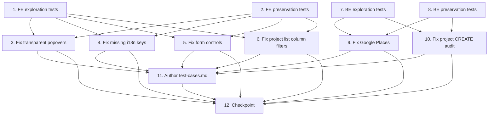

# Implementation Plan — FOR-04-bugs

## Overview

Tasks are grouped into a Frontend group and a Backend / cross-cutting group. Exploration and
preservation tests are STANDALONE tasks placed BEFORE their fixes. Follow the workspace
test-execution rules: frontend uses `vitest --run` and `tsc`; backend runs only affected test
classes with `--tests` filters redirected to a temp log (never the full suite).

> Reminder: write exploration tests BEFORE implementing any fix, and run them on the UNFIXED code to
> confirm the bug exists. Follow the observation-first methodology for preservation tests.

## Task Dependency Graph

The exploration-before-fix rule drives the ordering: within each group the exploration and
preservation test tasks are written and run on UNFIXED code first, and every fix depends on them.
Fixes within a group are otherwise independent of each other and may run in parallel (waves).

- **Frontend wave 0** — tasks 1 (exploration tests) and 2 (preservation tests): no dependencies.
- **Frontend wave 1** — tasks 3, 4, 5, 6 (fixes + their verify subtasks): each depends on tasks 1
  and 2; independent of each other (parallelizable).
- **Backend wave 0** — tasks 7 (exploration tests) and 8 (preservation tests): no dependencies.
- **Backend wave 1** — tasks 9 and 10 (fixes): each depends on tasks 7 and 8; independent of each
  other (parallelizable).
- **Documentation** — task 11 (Author test-cases.md): depends on all fixes being defined
  (3, 4, 5, 6, 9, 10).
- **Final** — task 12 (checkpoint): depends on everything.

```json
{
  "waves": [
    {
      "wave": 0,
      "tasks": ["1", "2", "7", "8"],
      "dependsOn": []
    },
    {
      "wave": 1,
      "tasks": ["3", "4", "5", "6"],
      "dependsOn": ["1", "2"]
    },
    {
      "wave": 1,
      "tasks": ["9", "10"],
      "dependsOn": ["7", "8"]
    },
    {
      "wave": 2,
      "tasks": ["11"],
      "dependsOn": ["3", "4", "5", "6", "9", "10"]
    },
    {
      "wave": 3,
      "tasks": ["12"],
      "dependsOn": ["3", "4", "5", "6", "9", "10", "11"]
    }
  ]
}
```



## Tasks

### Frontend group

- [x] 1. Write bug condition exploration tests (frontend) — BEFORE any fix
  - **Property 1: Bug Condition** — Transparent popovers + missing i18n keys + native controls
  - **CRITICAL**: These tests MUST FAIL on unfixed code — failure confirms the bugs exist. Do NOT fix
    yet.
  - Popover opacity: render `SelectContent`/`PopoverContent` and assert computed background is not
    transparent (Bugs 1, 2).
  - i18n existence guard: scan `src` for static `t('literal')` usages and assert each key exists in
    `pl.json` and `ru.json`; expect failures for the confirmed-missing keys (Bug 3).
  - Control presence: assert project form uses a Calendar-based date picker (Bug 5); room/work-item
    forms use an async combobox not native `<select>` (Bug 7); decimal input accepts `,` (Bug 8);
    wall-delete + manual area produces a payload with manual areas (Bug 9); work-category options are
    ordered by `orderNo` (Bug 10); project list members/client are column filters (Bug 11).
  - Run with `vitest --run`; document counterexamples.
  - _Requirements: 1.1, 1 (defect).1, 1.3, 1.5, 1.7, 1.8, 1.9, 1.10, 1.11_

- [x] 2. Write preservation property tests (frontend) — BEFORE any fix
  - **Property 2: Preservation** — Unchanged frontend surfaces
  - Observe on UNFIXED code and assert they still pass: `DataTableHeader`/`FilterPopover` are opaque
    (hardcoded `bg-background`); existing i18n keys resolve and `pl`/`ru` key sets are identical with
    non-empty values; geometry-only room (walls, no manual override) submits derived metrics with
    manual null; `WorkCatalogList` reference filter query unchanged.
  - Run with `vitest --run`; confirm PASS on unfixed code.
  - _Requirements: 3.1, 3.2, 3.3, 3.4, 3.5_

- [x] 3. Fix transparent popovers (Bugs 1, 2)

  - [x] 3.1 Define popover theme variables in `src/index.css`
    - Add `--popover` / `--popover-foreground` to `:root` and `.dark` (mirror `--card`), and
      `--color-popover` / `--color-popover-foreground` in `@theme`. Give `DateFilter` popover an
      explicit background if residual transparency remains.
    - _Bug_Condition: isBugCondition (bg-popover with undefined --popover)_
    - _Expected_Behavior: opaque panel in light + dark_
    - _Preservation: opaque-by-default popovers unchanged_
    - _Requirements: 2.1, 2 (correct).1, 3.1_

  - [x] 3.2 Verify popover opacity exploration test now passes
    - **Property 1: Expected Behavior** — Opaque popovers
    - Re-run the SAME test from task 1; expect PASS.
    - _Requirements: 2.1, 2 (correct).1_

- [x] 4. Fix missing i18n keys + add guard test (Bug 3)

  - [x] 4.1 Add missing keys to both catalogs and add the used-key existence guard
    - Add all confirmed-missing keys (and any others surfaced by the scan) to `pl.json` and
      `ru.json`. Add `src/lib/i18n.keys.test.ts` asserting pl≡ru key sets with non-empty values and
      scanning `src` for static `t('literal')` existence. Optionally make
      `parseMissingKeyHandler` throw/warn in dev.
    - _Bug_Condition: tKey used in code but absent from catalog_
    - _Expected_Behavior: every used key resolves; no raw key rendered_
    - _Preservation: existing keys + pl/ru parity unchanged_
    - _Requirements: 2.3, 3.2_

  - [x] 4.2 Verify i18n exploration + preservation tests pass
    - **Property 3: Bug Condition** — No raw i18n key
    - Re-run tasks 1 (i18n guard) and 2 (parity); expect PASS.
    - _Requirements: 2.3, 3.2_

- [x] 5. Fix form controls: DatePicker, AsyncEntitySelect, NumberInput, manual-override, category order (Bugs 5, 7, 8, 9, 10)

  - [x] 5.1 Create shared `DatePicker` (Popover + `Calendar`) and use in project form
    - New `src/components/ui/date-picker.tsx`; wire `ProjectFormSheet.tsx` start/end dates. Note in
      code/comments that room/work-catalog forms have no dates.
    - _Bug_Condition: project start/end use <input type="date">_
    - _Expected_Behavior: Calendar-based picker_
    - _Requirements: 2.5_

  - [x] 5.2 Extract shared `AsyncEntitySelect` from `ReferenceFilter` and use in forms
    - New `src/components/ui/async-entity-select.tsx` reusing the `useInfiniteQuery` + search +
      IntersectionObserver logic. Use for `RoomFormSheet` (`projectId`, `roomTypeId`) and
      `WorkItemFormSheet` (`workCategoryId`, `unitId`).
    - _Bug_Condition: entity fields are native <select> from one-shot fetch_
    - _Expected_Behavior: async search + infinite-scroll combobox_
    - _Requirements: 2.7_

  - [x] 5.3 Create shared decimal `NumberInput` and apply
    - New `src/components/ui/number-input.tsx` (`type="text" inputMode="decimal"`, accepts `.`/`,`,
      normalizes `,`→`.`). Use in `RoomFormSheet.tsx`, `RoomOpeningsEditor.tsx`; normalize before
      `Number()`/zod in `room-schema.ts`.
    - _Bug_Condition: numeric input with ',' separator dropped_
    - _Expected_Behavior: ',' normalized to '.'; intended number persisted_
    - _Preservation: '.'-separated values unchanged_
    - _Requirements: 2.8_

  - [x] 5.4 Manual-override mode decoupled from wall count + category order
    - In `RoomFormSheet.tsx`, add an explicit manual-override flag; submit manual areas when entered
      instead of forcing null while a wall remains. In `WorkItemFormSheet.tsx`, fetch/sort work
      categories by `orderNo,asc` (confirm backend `Pageable` accepts `orderNo`).
    - _Bug_Condition: walls remain AND manual areas entered / category sorted by name_
    - _Expected_Behavior: manual areas persisted / options ordered by orderNo asc_
    - _Preservation: geometry-only room metrics unchanged_
    - _Requirements: 2.9, 2.10, 3.4_

  - [x] 5.5 Verify control exploration + preservation tests pass
    - **Property 8: Bug Condition** — Form control replacements (+ Property 6, 7)
    - Re-run tasks 1 and 2 for controls; expect PASS. Run `tsc` for type check.
    - _Requirements: 2.5, 2.7, 2.8, 2.9, 2.10, 3.4_

- [x] 6. Fix project list team/client column filters (Bug 11)

  - [x] 6.1 Convert members/client to `ColumnConfig.reference` column filters
    - In `ProjectsList.tsx` set members/client columns `filterable: true` with reference descriptors
      (members → `members.user.id`; client → the CLIENT-scoped compound path used by
      `ProjectClientFilter`). Remove the toolbar `ProjectMembersFilter`/`ProjectClientFilter` panels
      and the manual `composeQuery` fragment + `invalidateQueries` plumbing, preserving identical
      query semantics.
    - _Bug_Condition: members/client filters are toolbar panels; columns filterable:false_
    - _Expected_Behavior: nested-entity column filters opened from the filter icon_
    - _Preservation: other list filters (WorkCatalogList) unchanged_
    - _Requirements: 2.11, 3.5_

  - [x] 6.2 Verify project-list filter exploration + preservation tests pass
    - **Property 8: Bug Condition** — Column-filter descriptors present
    - Re-run tasks 1 and 2 for list filters; expect PASS.
    - _Requirements: 2.11, 3.5_

---

### Backend / cross-cutting group

- [x] 7. Write bug condition exploration tests (backend) — BEFORE any fix
  - **Property 4/5: Bug Condition** — Legacy Places client + missing project CREATE audit
  - **CRITICAL**: MUST FAIL on unfixed code. Do NOT fix yet.
  - Places client: assert the client targets `places.googleapis.com/v1` with `X-Goog-Api-Key` +
    `X-Goog-FieldMask`, and that disabled → no Google call (Bug 4) — FAILS (legacy path, always
    calls).
  - Project CREATE audit: after a create, assert one `AuditLogEntity`
    (`entityClass=ProjectEntity`, `operation=CREATE`) (Bug 6) — FAILS (no row).
  - Run only affected classes with `--tests` filters, redirect to `/tmp/for-04-bugs-test.log`, read
    the JUnit XML for status. Document counterexamples.
  - _Requirements: 1.4, 1.6_

- [x] 8. Write preservation property tests (backend) — BEFORE any fix
  - **Property 2: Preservation** — Existing audit + server-side place resolution
  - Observe on UNFIXED code and assert PASS: generic-entity and room create/update/delete audit rows
    written; project UPDATE routed through audited `AdminService.update`; server-side place
    resolution in `createProject` (enabled + placeId) populates address/lat/lng.
  - Run affected classes only via `--tests`; verify PASS on unfixed code.
  - _Requirements: 3.6, 3.7_

- [x] 9. Fix Google Places: migrate to Places API (New) + enabled guard + local override (Bug 4)

  - [x] 9.1 Migrate client to Places API (New) and add enabled guard
    - Update `RestClientGooglePlacesClient` (or new impl) to call
      `POST places.googleapis.com/v1/places:autocomplete` and `GET .../v1/places/{id}` with
      `X-Goog-Api-Key` + `X-Goog-FieldMask`; rebind response records. Add an `enabled` guard in the
      service/controller so disabled → handled empty result with no Google call.
    - _Bug_Condition: enabled requests hit legacy endpoints / disabled still calls Google_
    - _Expected_Behavior: v1 endpoints + header/field-mask; disabled degrades gracefully_
    - _Preservation: server-side place resolution on create unchanged_
    - _Requirements: 2.4, 3.6_

  - [x] 9.2 Add gitignored local compose override and update `.gitignore`
    - Add `docker-compose.override.yml` (gitignored) documenting `GOOGLE_PLACES_ENABLED=true` and
      `GOOGLE_PLACES_API_KEY=<key>` on the `backend` service. Add the override filename to
      `.gitignore` (it is not currently covered). Never commit a real key.
    - _Requirements: 2.4_

  - [x] 9.3 Verify Places exploration test passes and end-to-end works
    - **Property 4: Expected Behavior** — Places API (New)
    - Re-run the SAME test from task 7 (Places); expect PASS. Run affected classes only.
    - _Requirements: 2.4_

- [x] 10. Fix project CREATE audit (Bug 6)

  - [x] 10.1 Call `saveAudit(null, saved, "CREATE")` in `createProject`
    - In `ProjectService.createProject`, after `projectDao.save(project)` and within the existing
      `@Transactional`, write the CREATE audit row using the `AdminService` contract.
    - _Bug_Condition: POST /api/projects succeeds but no CREATE audit row_
    - _Expected_Behavior: exactly one ProjectEntity CREATE audit row within the transaction_
    - _Preservation: generic/room audit + project UPDATE audit unchanged_
    - _Requirements: 2.6, 3.7_

  - [x] 10.2 Verify audit exploration + preservation tests pass
    - **Property 5: Bug Condition** — Project CREATE audited
    - Re-run tasks 7 (audit) and 8 (preservation); expect PASS. Run affected classes only via
      `--tests`, read the JUnit XML.
    - _Requirements: 2.6, 3.7_

---

### Documentation & verification

- [x] 11. Author test-cases.md
  - Create `test-cases.md` in the spec folder following the `.kiro/steering/test-cases.md` standard
    (feature grouping, step-by-step scenarios, repeatability via generator/clean-up, regression
    group, MD report template). Written in Russian. Frontend bugs are browser-engine scenarios
    against `http://localhost:3000`; backend/Places/audit bugs are API tests against the Dockerized
    app at `http://localhost:8080`. Result artifacts are MD reports with tables.
  - _Requirements: 2.1, 2 (correct).1, 2.3, 2.4, 2.5, 2.6, 2.7, 2.8, 2.9, 2.10, 2.11_

- [x] 12. Checkpoint — Ensure all tests pass
  - Run frontend `vitest --run` + `tsc`, and only the affected backend classes via `--tests`
    (redirect to `/tmp/for-04-bugs-test.log`, read JUnit XML). Confirm all exploration tests now pass
    and all preservation tests still pass. Do NOT run the full backend suite. Ask the user if
    questions arise.
---

## Notes

- **Exploration before fix**: tasks 1 and 7 (exploration) and tasks 2 and 8 (preservation) MUST be
  written and run on the UNFIXED code before any fix task. Exploration tests are expected to FAIL
  (confirming the bug); preservation tests are expected to PASS (capturing baseline behavior).
- **Parallelism**: within each group the fix tasks are independent (Frontend 3/4/5/6; Backend 9/10)
  and may be executed in parallel once their group's test tasks are in place.
- **Test execution rules**: never run the full backend gradle suite. Frontend uses `vitest --run`
  and `tsc`; backend runs only affected test classes with `--tests` filters redirected to
  `/tmp/for-04-bugs-test.log`, using the JUnit XML as the source of truth for pass/fail.
- **Secrets**: the Google Places API key is env-driven (`GOOGLE_PLACES_API_KEY`) and MUST never be
  committed; the local compose override is gitignored (task 9.2).
- **Property/requirement traceability**: each fix task carries `_Bug_Condition_`,
  `_Expected_Behavior_`, `_Preservation_`, and `_Requirements:_` annotations tying it back to the
  design's Correctness Properties and the requirements clauses.
