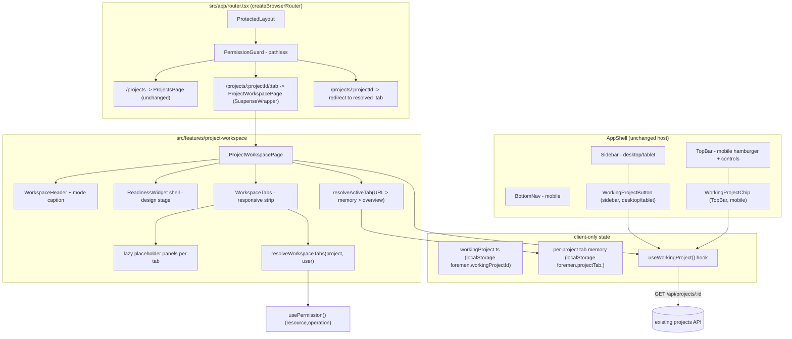

# Design Document: FOR-05-01 — Project Workspace Shell

## Overview

FOR-05-01 is the **frontend-only** shell of the FOR-05 single project workspace. It adds one
nested route — `/projects/:projectId/:tab` — rendered by a new `ProjectWorkspacePage` inside
the existing `AppShell`, plus the machinery around it: a **client-only working-project state**
module, an **always-visible working-project surface** (desktop sidebar button + mobile top-bar
chip), a **stage-dependent, ABAC-filtered tab host** with lazy placeholder panels, a
**readiness widget shell**, and the **projects-list row-click override**. It introduces **no
backend entity, table, migration, or ABAC resource** (Requirements 2.1, 12.10).

The shell is deliberately thin. The *contents* of every non-Overview tab (Estimate, Pricing,
Rooms, Procurement, …) are delivered by later FOR-05 child specs; FOR-05-01 ships only the
route, the `WORKSPACE_TABS` contract, the two resolver functions (`resolveWorkspaceTabs`,
`resolveActiveTab`), and stable placeholder panels those later specs plug into without touching
the shell (Requirements 7.3, 7.4, 11.2).

Three decisions frame everything below and are grounded in the real code investigated for this
design:

1. **The URL is the source of truth for the active tab.** The active tab is a path segment
   (`/projects/:projectId/:tab`), chosen over a query param for clean shareable links and to fit
   the existing nested react-router tree in `src/app/router.tsx`. `localStorage`
   (`foremen.projectTab.<projectId>`) is only *last-tab memory*; a shared link with an explicit
   tab always wins (Requirements 1.3, 12.1, 12.2, 12.5).

2. **The working project is pure client UI state.** It lives only in `localStorage` under
   `foremen.workingProjectId` and is hydrated from the *existing* projects API
   (`GET /api/projects/{id}`) — no new endpoint, no backend entity (parent design §4.3b,
   Requirement 2).

3. **Everything visible is gated by the existing ABAC predicate.** The workspace route reuses
   the same `PROJECTS`/`READ` requirement as the `/projects` list, and each tab is filtered
   through the very `usePermission()` predicate `(resource, operation) => boolean` that
   `NAV_CONFIG` already uses. There are no per-role workspaces (parent design guiding
   principles, Requirements 1.4, 6.4).

### Critical finding: the real `ProjectStatus` enum is narrower than the parent design's

The parent design (§4.3, §6.10) writes `stageOf` over the status space
`{DRAFT, READY_TO_OFFER, OFFERED, APPROVED, ACTIVE, COMPLETED}`. The **shipped** backend enum
(`com.foremen.dao.model.ProjectStatus`) and its mirrored frontend type
(`src/features/projects/types`) are today only:

```
DRAFT · ACTIVE · ON_HOLD · COMPLETED · CANCELLED
```

`READY_TO_OFFER`, `OFFERED`, and `APPROVED` do **not exist yet**, and the real enum adds two the
parent design never classified: `ON_HOLD` and `CANCELLED`. Requirement 6.1 mandates that
`stageOf` map *every* status to exactly one stage. To satisfy that against reality **and** stay
forward-compatible with the parent design, FOR-05-01 defines `stageOf` as a **total function
over a superset** of both status spaces, classifying the not-yet-existing design statuses as
`design` and the extra lifecycle statuses (`ON_HOLD` → design, `CANCELLED` → design) so that a
project that never reached execution never surfaces execution tabs. This is the graceful
degradation Requirement 11 asks for, made concrete. §"Data Models" pins the mapping.

## Architecture

The shell slots into the existing app-shell / router / permission stack without reshaping it.



### Where each concern lives (module map)

Mirrors the existing feature-module layout (`api/ components/ pages/ state/ types/ __tests__/`).

```
src/features/project-workspace/
  types.ts                          # WorkspaceStage, WorkspaceTabKey, WorkspaceTab, ProjectTabProps
  workspaceTabs.ts                  # WORKSPACE_TABS: the single ordered source of truth
  state/
    workingProject.ts               # shared store (useSyncExternalStore) over foremen.workingProjectId + useWorkingProject()
    projectTabMemory.ts             # get/set over foremen.projectTab.<projectId>
    stageOf.ts                      # total stageOf(status): 'design' | 'execution'
    resolveWorkspaceTabs.ts         # WORKSPACE_TABS filtered by stage + ABAC
    resolveDesignSelectorTabs.ts    # execution-stage design-tabs selector: design tabs minus overview, ABAC-filtered ([] for design stage)
    resolveActiveTab.ts             # URL > per-project memory > overview priority (validity set = workspace tabs ∪ design-selector tabs)
  pages/
    ProjectWorkspacePage.tsx        # /projects/:projectId/:tab host
  components/
    WorkspaceHeader.tsx             # name + status pill + mode caption + Edit affordance
    ReadinessWidget.tsx             # donut + gate checklist shell (design stage)
    WorkspaceTabs.tsx               # responsive tab strip (desktop strip / mobile segmented + overflow)
    ProjectUnavailable.tsx          # workspace.notFound graceful state
    tabs/
      OverviewTab.tsx               # real minimal panel (name, status pill, Edit)
      PlaceholderTab.tsx            # generic stable placeholder for every other tab key
  __tests__/

src/components/shell/               # app-shell surfaces (NOT inside a project route)
  WorkingProjectButton.tsx          # desktop/tablet sidebar button under Dashboard
  WorkingProjectChip.tsx            # mobile TopBar chip
```

Two shell surfaces (`WorkingProjectButton`, `WorkingProjectChip`) live under
`src/components/shell` and are wired into the existing `Sidebar` and `TopBar` so they are
visible from **every** route (Requirements 3.1, 4.1). They both read the same
`useWorkingProject()` state — backed by a single shared store, so a set/clear from any consumer
(including the projects-list row click) updates both surfaces synchronously in the same tab with
no reload (Requirements 4.5, 4.6, 2.8).

### Reused, unchanged building blocks

| Concern | Reused as-is | Source |
|---------|--------------|--------|
| Route wrapping (error boundary + Suspense + skeleton) | `SuspenseWrapper` | `src/app/router.tsx` |
| Auth gate / 403 redirect | `ProtectedLayout` + pathless `PermissionGuard` | `src/app/guards/*` |
| ABAC predicate | `usePermission().hasPermission(resource, operation)` | `src/hooks/usePermission.ts` |
| Nav visibility rule shape | `requiredPermission` + `isNavItemVisible` pattern | `src/config/navigation.ts` |
| Breakpoint switch | `useBreakpoint(): 'mobile' \| 'tablet' \| 'desktop'` | `src/hooks/useBreakpoint.ts` |
| Project list + row-click hook point | `DataTable.onRowClick?: (row) => void`, `ProjectsList` | `src/features/projects/*`, `src/components/data-table` |
| Project summary + status pill | `ProjectReadDto` (= `ProjectListDto`), `ProjectStatusBadge` | `src/features/projects/*` |
| i18n | react-i18next, `pl.json` + `ru.json`, single active language | `src/lib/i18n.ts` |

## Components and Interfaces

### 1. Routing (`src/app/router.tsx`)

Add a nested route alongside the existing `projects` entry, inside the same pathless
`PermissionGuard` child array, following the exact `SuspenseWrapper` pattern already used:

```tsx
const ProjectWorkspacePage = React.lazy(
  () => import('@/features/project-workspace/pages/ProjectWorkspacePage')
)

// … inside the PermissionGuard children, next to { path: 'projects', … }:
{ path: 'projects', element: <SuspenseWrapper><ProjectsPage /></SuspenseWrapper> },
{ path: 'projects/:projectId', element: <SuspenseWrapper><ProjectWorkspacePage /></SuspenseWrapper> },
{ path: 'projects/:projectId/:tab', element: <SuspenseWrapper><ProjectWorkspacePage /></SuspenseWrapper> },
```

- `/projects` stays exactly as-is (Requirement 1.2).
- The bare `/projects/:projectId` renders the same page; the page itself resolves the active
  tab and `navigate(..., { replace: true })`s to `/projects/:projectId/:tab` (Requirements 1.3,
  12.4). Using the same component for both keeps a single mount and avoids a redirect-only route.
- **ABAC parity with the list.** The workspace route must be gated by `PROJECTS`/`READ` exactly
  like `/projects` (Requirement 1.4). `PermissionGuard` reads its requirement from the
  route→requirement map keyed by matched path; FOR-05-01 adds `projects/:projectId` and
  `projects/:projectId/:tab` to that map with `{ resource: 'PROJECTS', operation: 'READ' }` so a
  user lacking it is redirected to `/403` upstream, identically to the list.

### 2. Working-project state (`state/workingProject.ts`)

Pure client state over one `localStorage` key. No backend entity (Requirement 2.1).

```typescript
// state/workingProject.ts
export const WORKING_PROJECT_KEY = 'foremen.workingProjectId'

export function getWorkingProjectId(): string | null      // reads localStorage, null-safe
export function setWorkingProjectId(projectId: string): void
export function clearWorkingProject(): void                // removes the key

// React hook (Requirement 2.3)
export function useWorkingProject(): {
  workingProjectId: string | null
  project: ProjectReadDto | null       // hydrated via GET /api/projects/{id}
  isLoading: boolean
  setWorkingProject: (projectId: string) => void
  clearWorkingProject: () => void      // also invoked on failed hydration
}
```

**Shared-store model (Requirements 2.8, 4.6).** The working-project id is NOT per-hook `useState`
seeded from `localStorage`; it is a single **module-level shared store** that every
`useWorkingProject()` consumer subscribes to via React `useSyncExternalStore`:

```typescript
// state/workingProject.ts — module scope (one store per tab)
let currentId: string | null = readFromLocalStorage()      // seeded once from foremen.workingProjectId
const listeners = new Set<() => void>()
function emit() { listeners.forEach((l) => l()) }
function subscribe(l: () => void) { listeners.add(l); return () => { listeners.delete(l) } }
function getSnapshot() { return currentId }

export function setWorkingProjectId(projectId: string): void {
  writeToLocalStorage(projectId)   // persist
  currentId = projectId            // update in-memory shared value
  emit()                           // notify all subscribed consumers (same-tab, synchronous)
}
export function clearWorkingProject(): void {
  removeFromLocalStorage()
  currentId = null
  emit()
}
// one module-scope `storage` listener updates currentId + emit() for cross-tab sync
window.addEventListener('storage', (e) => { if (e.key === WORKING_PROJECT_KEY) { currentId = e.newValue; emit() } })

export function useWorkingProject() {
  const workingProjectId = React.useSyncExternalStore(subscribe, getSnapshot)
  // …hydrate summary from GET /api/projects/{id} for the current id…
}
```

**Rationale.** Two working-project surfaces are always visible (the sidebar
`WorkingProjectButton` and the top-bar `WorkingProjectChip`) while the value is changed from a
**third** place (a projects-list row click, `ProjectsList` → `setWorkingProject`). With per-hook
`useState`, each hook instance kept its own copy seeded from `localStorage` and only the cross-tab
`storage` event resynced them, so selecting a project from the list did not update the menu until
a reload. The shared store fixes this: `setWorkingProjectId` / `clearWorkingProject` update the
single in-memory `currentId` and `emit()` to all listeners, so every consumer in the tab
re-renders **synchronously with no reload**. `localStorage` (write on set, read once to seed
`currentId`, one module-scope `storage` listener) still provides reload persistence and cross-tab
sync as before.

Behavior:

- All `localStorage` access is wrapped in try/catch (mirroring `getInitialLocale` in
  `src/lib/i18n.ts`) so a disabled/full store degrades to "no working project" rather than
  crashing (Requirement 11.3).
- On mount and whenever the id changes, the hook hydrates the summary via the existing
  `GET /api/projects/{id}` (reusing the projects feature's API client / query hook)
  (Requirement 2.4).
- **Graceful invalidation.** If hydration returns 403/404 (deleted or access lost) or the
  projects API is unavailable, the hook calls `clearWorkingProject()` and resolves to
  `project: null` without throwing (Requirements 2.6, 11.4).
- Persistence survives reload because the id is read back from `localStorage` on the next mount
  (Requirement 2.5).
- `setWorkingProject(id)` is called by the projects-list row-click (Requirement 2.7).

Cross-tab note: a **single module-scope** `storage` listener (not one per hook) updates the
shared `currentId` and `emit()`s so the two shell surfaces stay in sync if the id changes in
another browser tab — keeping Requirement 4.5's "same state" invariant true across tabs, while
the shared store keeps it true **within** a tab synchronously (Requirements 2.8, 4.6).

### 3. Always-visible working-project surface

One state, two responsive renderings selected by `useBreakpoint` (Requirement 4.2). The two are
mutually exclusive per breakpoint — desktop/tablet render the sidebar button, mobile renders the
chip, never both at once.

**`WorkingProjectButton.tsx`** (desktop/tablet) — rendered by `Sidebar`, directly under the
Dashboard nav entry so it sits in the app shell, not a project route (Requirement 3.1). When a
working project is set it shows the project **name** + a **status pill** reusing
`ProjectStatusBadge` (Requirement 3.2); clicking navigates to `/projects/:projectId`
(Requirement 3.3). It also exposes a "change project" affordance labeled `workspace.changeProject`
routing to `/projects` (Requirement 3.6). When none is set it renders the `workspace.chooseProject`
affordance routing to `/projects` (Requirements 3.4, 3.5).

**`WorkingProjectChip.tsx`** (mobile) — rendered by `TopBar` to the left of the language control
(the prototype's `.wp-chip`). Compact: a status dot + truncated name; activating it navigates to
`/projects/:projectId` (Requirement 4.3). When none is set it shows `workspace.chooseProject`
routing to `/projects` (Requirement 4.4).

Graceful degradation: if the projects API is unavailable so the summary never hydrates, both
surfaces fall back to the `workspace.chooseProject` affordance (or hide) rather than showing a
half-rendered badge (Requirement 11.3).

### 4. Projects-list row-click override (`src/features/projects` only)

`DataTable` already accepts `onRowClick?: (row: T) => void`, and `ProjectsList` currently wires
it to open the edit form (`onRowClick={canUpdate ? (p) => onEditProject(p.id) : undefined}`).
FOR-05-01 **changes that single wiring** so a row-click opens the workspace and sets the working
project:

```tsx
// ProjectsList.tsx — the only change to the projects feature
const navigate = useNavigate()
const { setWorkingProject } = useWorkingProject()

<DataTable<ProjectDto>
  /* … unchanged … */
  onRowClick={(project) => {
    setWorkingProject(String(project.id))     // Requirement 5.1 / 2.7
    navigate(`/projects/${project.id}`)        // resolves to :tab on the page
  }}
  rowActions={rowActions}                        // edit/delete stay as explicit row actions
/>
```

- The row-click no longer opens the edit form (Requirement 5.2). Editing project fields becomes a
  **secondary action inside the workspace Overview**, labeled `workspace.edit` (Requirements 5.3,
  7.5). The existing per-row `Pencil`/`Trash2` actions in `rowActions` remain (they already call
  `e.stopPropagation()`), so edit/delete are still reachable from the list.
- This override touches only `ProjectsList`; the generic `DataTable` `onRowClick` contract and
  every other feature's row-click behavior are unchanged (Requirement 5.4).

### 5. Workspace tab contract (`types.ts` + `workspaceTabs.ts`)

```typescript
// types.ts
export type WorkspaceStage = 'design' | 'execution' | 'common'

export type WorkspaceTabKey =
  | 'overview'                                                   // common
  | 'readiness' | 'pricing' | 'rooms' | 'estimate'
  | 'scheduleDesign' | 'contract'                                // design
  | 'procurement' | 'documents' | 'planActual'
  | 'payroll' | 'amendments' | 'priceHistory'                    // execution

export interface WorkspaceTab {
  key: WorkspaceTabKey
  stage: WorkspaceStage
  owner: 'FOR-05' | 'FOR-06' | 'FOR-07' | 'FOR-10' | 'FOR-11'
  requiredPermission: { resource: string; operation: string }  // MANDATORY: every tab is permission-gated
  labelKey: string                                              // workspace.tab.<key>
  lazy: React.LazyExoticComponent<React.FC<ProjectTabProps>>
}

export interface ProjectTabProps { projectId: string; project: ProjectReadDto }
```

`WORKSPACE_TABS` is the single ordered source of truth (Requirement 7.3). The tab keys and order
match Requirements 6.2 / 6.3 exactly (note the requirements use the short keys `scheduleDesign`,
`contract`, `planActual`, `amendments`, `priceHistory` — these are authoritative for this spec
and for the `:tab` slug):

```typescript
// workspaceTabs.ts — declaration order IS the render order (Requirements 6.7, 7.3)
export const WORKSPACE_TABS: WorkspaceTab[] = [
  // common / always
  { key: 'overview',       stage: 'common',    owner: 'FOR-05', labelKey: 'workspace.tab.overview',
    requiredPermission: { resource: 'PROJECTS', operation: 'READ' } },
  // design stage
  { key: 'readiness',      stage: 'design',    owner: 'FOR-05', labelKey: 'workspace.tab.readiness',
    requiredPermission: { resource: 'PROJECTS', operation: 'READ' } },
  { key: 'pricing',        stage: 'design',    owner: 'FOR-05', labelKey: 'workspace.tab.pricing',
    requiredPermission: { resource: 'PROJECT_PRICING', operation: 'READ' } },
  { key: 'rooms',          stage: 'design',    owner: 'FOR-05', labelKey: 'workspace.tab.rooms',
    requiredPermission: { resource: 'ROOMS', operation: 'READ' } },
  { key: 'estimate',       stage: 'design',    owner: 'FOR-05', labelKey: 'workspace.tab.estimate',
    requiredPermission: { resource: 'ESTIMATE', operation: 'READ' } },
  { key: 'scheduleDesign', stage: 'design',    owner: 'FOR-06', labelKey: 'workspace.tab.scheduleDesign',
    requiredPermission: { resource: 'WORK_SCHEDULE', operation: 'READ' } },
  { key: 'contract',       stage: 'design',    owner: 'FOR-05', labelKey: 'workspace.tab.contract',
    requiredPermission: { resource: 'CONTRACTS', operation: 'READ' } },
  // execution stage
  { key: 'procurement',    stage: 'execution', owner: 'FOR-07', labelKey: 'workspace.tab.procurement',
    requiredPermission: { resource: 'DELIVERIES', operation: 'READ' } },
  { key: 'documents',      stage: 'execution', owner: 'FOR-10', labelKey: 'workspace.tab.documents',
    requiredPermission: { resource: 'DOCUMENTS', operation: 'READ' } },
  { key: 'planActual',     stage: 'execution', owner: 'FOR-06', labelKey: 'workspace.tab.planActual',
    requiredPermission: { resource: 'WORK_REPORTS', operation: 'READ' } },
  { key: 'payroll',        stage: 'execution', owner: 'FOR-11', labelKey: 'workspace.tab.payroll',
    requiredPermission: { resource: 'PAYROLL', operation: 'READ' } },
  { key: 'amendments',     stage: 'execution', owner: 'FOR-05', labelKey: 'workspace.tab.amendments',
    requiredPermission: { resource: 'AMENDMENTS', operation: 'READ' } },
  { key: 'priceHistory',   stage: 'execution', owner: 'FOR-05', labelKey: 'workspace.tab.priceHistory',
    requiredPermission: { resource: 'PRICE_HISTORY', operation: 'READ' } },
].map((t) => ({ ...t, lazy: React.lazy(() => import(`./components/tabs/PlaceholderTab`)) }))
```

**Every** tab declares a mandatory `requiredPermission` and is permission-gated exactly like a
main-menu entry — there is no "always visible for its stage" mode (Requirements 6.6, 7.3, 7.4).
`overview` and `readiness` reuse the already-seeded `PROJECTS`/`READ` requirement (the same one
that gates the `/projects` list and the workspace route), so the workspace entry is never hidden
from a user who can read the project. Each remaining tab declares its primary child entity's
`READ`: `pricing` → `PROJECT_PRICING`, `rooms` → `ROOMS`, `estimate` → `ESTIMATE`,
`scheduleDesign` → `WORK_SCHEDULE`, `contract` → `CONTRACTS`, `procurement` → `DELIVERIES`,
`documents` → `DOCUMENTS`, `planActual` → `WORK_REPORTS`, `payroll` → `PAYROLL`,
`amendments` → `AMENDMENTS`, `priceHistory` → `PRICE_HISTORY`.

Only `PROJECTS`, `ROOMS`, `ESTIMATE`, and `DELIVERIES` are seeded in the backend today.
`PROJECT_PRICING`, `WORK_SCHEDULE`, `CONTRACTS`, `DOCUMENTS`, `WORK_REPORTS`, `PAYROLL`,
`AMENDMENTS`, and `PRICE_HISTORY` are **not yet seeded** — until the owning sibling spec
(FOR-05 / FOR-06 / FOR-07 / FOR-10 / FOR-11) seeds each one (resource row + role grants per the
entity-creation-rules checklist), `usePermission` cannot grant the requirement and the tab stays
hidden. That is the graceful-degradation behavior of Requirements 11.5 / 11.6 — an ungranted tab
simply does not appear, never an error. FOR-05-01 does **not** seed these resources; the
follow-up seeding is tracked as a `tasks.md` TODO.

> **`lazy` in FOR-05-01.** Every tab's `lazy` points at the generic `PlaceholderTab` except
> `overview`, whose entry points at the real `OverviewTab`. Later child specs replace a tab's
> `lazy` with their real panel without changing the contract or the resolvers (Requirement 7.4).

### 6. Tab host (`components/WorkspaceTabs.tsx` + `pages/ProjectWorkspacePage.tsx`)

`WorkspaceTabs` renders the resolved tab set responsively (Requirement 7.1):

- **desktop/tablet:** a horizontal strip (prototype tab strip).
- **mobile:** a scrollable/segmented control with an overflow "•••" menu for the rest, selected
  via `useBreakpoint`.

**Execution-stage design-tabs selector (Requirements 6.10–6.13).** `WorkspaceTabs` gains a
`designSelectorTabs: WorkspaceTab[]` prop (fed by `resolveDesignSelectorTabs(project, hasPermission)`).
When non-empty, it renders a **separate grouped selector** — a Popover/menu labeled
`workspace.designTabs` — as the **LAST element** of the tab strip (after the main resolved tabs),
listing each design tab by its `labelKey`. It is rendered **only when the prop is non-empty**
(≥ 1 permitted design tab); an empty array renders nothing. Selecting an item behaves exactly like
a normal tab click: `navigate(`/projects/:projectId/:tab`)` for that tab's `key` and write the key
to per-project memory (Requirements 6.11, 6.8, 12.3). For a design-stage project the prop is `[]`,
so no selector shows (Requirement 6.12).

Clicking a tab does not merely set internal state — it `navigate`s to `/projects/:projectId/:tab`
(Requirements 6.8, 7.7, 12.3) and writes the key to per-project memory (below). The active tab is
derived from the `:tab` URL segment; for the bare route the host uses `resolveActiveTab`
(Requirement 7.6).

Each panel is the tab's `lazy` component rendered inside a `SuspenseWrapper`-style boundary
(error boundary + `Suspense`), so a panel that fails to load shows the route error boundary
instead of crashing the shell (Requirement 7.2). `ProjectTabProps` passes `projectId` and the
hydrated `project` down to the panel (Requirement 7.4 keys placeholders by tab `key`).

`ProjectWorkspacePage` orchestration:

1. Read `:projectId` / `:tab` from the route. Set the working project to `:projectId` on open
   (Requirement 2.7 also fires via row-click; this covers deep links).
2. Hydrate the project summary via `useWorkingProject()` / `GET /api/projects/{id}`.
   - While loading → non-blocking loading state, never a raw i18n key (Requirement 1.7).
   - On 403/404/unresolved → render `ProjectUnavailable` using `workspace.notFound`
     (Requirement 1.6).
3. Compute `tabs = resolveWorkspaceTabs(project, user)`,
   `designSelectorTabs = resolveDesignSelectorTabs(project, user)` (passed to `WorkspaceTabs`;
   non-empty only for execution projects with ≥ 1 permitted design tab), and
   `active = resolveActiveTab(project, user, urlTab)` (whose validity set is `tabs ∪
   designSelectorTabs`).
4. If `urlTab` is absent or differs from `active`, `navigate(..., { replace: true })` to
   `/projects/:projectId/:active` (Requirements 1.3, 12.4, 12.6).
5. Render `WorkspaceHeader` (+ `ReadinessWidget` in design stage) and `WorkspaceTabs` with the
   active panel.

### 7. Resolvers (`state/stageOf.ts`, `resolveWorkspaceTabs.ts`, `resolveActiveTab.ts`)

```typescript
// stageOf.ts — total over the real enum AND the parent-design superset (Requirement 6.1)
export type WorkspaceProjectStage = 'design' | 'execution'
const EXECUTION_STATUSES = new Set(['ACTIVE', 'COMPLETED'])
export function stageOf(status: string): WorkspaceProjectStage {
  // execution iff ACTIVE|COMPLETED; every other status (DRAFT, READY_TO_OFFER,
  // OFFERED, APPROVED, ON_HOLD, CANCELLED, and any unknown value) -> design.
  return EXECUTION_STATUSES.has(status) ? 'execution' : 'design'
}
```

Defining `stageOf` by a small execution set with a `design` default makes it **total** over any
string — satisfying Requirement 6.1 for the shipped enum, the parent design's richer enum, and
any future/unknown status — which is the graceful behavior Requirement 11 requires. The design
set `{DRAFT, READY_TO_OFFER, OFFERED, APPROVED}` from the parent design falls out of the default.

```typescript
// resolveWorkspaceTabs.ts (§6.10; Requirements 6.4–6.7)
export function resolveWorkspaceTabs(
  project: ProjectReadDto,
  hasPermission: (resource: string, operation: string) => boolean,
): WorkspaceTab[] {
  const stage = stageOf(project.status)
  return WORKSPACE_TABS.filter((t) => t.stage === 'common' || t.stage === stage)   // (a) stage
    .filter((t) => hasPermission(t.requiredPermission.resource,                    // (b) ABAC
      t.requiredPermission.operation))
  // .filter preserves WORKSPACE_TABS declaration order (Requirement 6.7)
}
```

```typescript
// resolveDesignSelectorTabs.ts (Requirements 6.10, 6.12, 6.13) — the execution-stage
// "design tabs" grouped selector contents.
export function resolveDesignSelectorTabs(
  project: ProjectReadDto,
  hasPermission: (resource: string, operation: string) => boolean,
): WorkspaceTab[] {
  if (stageOf(project.status) !== 'execution') return []                 // design-stage: no separate selector
  return WORKSPACE_TABS
    .filter((t) => t.stage === 'design')                                 // design tabs only…
    .filter((t) => t.key !== 'overview')                                 // …excluding the common overview
    .filter((t) => hasPermission(t.requiredPermission.resource,          // same mandatory ABAC predicate
      t.requiredPermission.operation))
  // subsequence of WORKSPACE_TABS → declaration order preserved (Requirement 6.10)
}
```

For an **execution**-stage project the strip additionally renders this design-stage set
(`readiness`, `pricing`, `rooms`, `estimate`, `scheduleDesign`, `contract` minus `overview`), each
gated by the same mandatory per-tab permission as the main strip. For a **design**-stage project
it returns `[]`, so no separate selector appears (the design tabs are already the main strip,
Requirement 6.12). The selector is shown **iff** this result is non-empty (≥ 1 permitted design
tab, Requirement 6.10). Because it filters `WORKSPACE_TABS` in place, the items keep declaration
order.

The ABAC filter is **unconditional**: every tab carries a mandatory `requiredPermission`, so
there is no `t.requiredPermission == null` branch — each tab is filtered by
`hasPermission(t.requiredPermission.resource, t.requiredPermission.operation)`, exactly as
`isNavItemVisible(item, hasPermission)` gates a main-menu entry (Requirement 6.6). The result is
exactly `inStageTabs(stage) ∩ permittedTabs(user)` in declaration order — Requirement 6.5 /
parent Property 15. Because it reuses the same `hasPermission` predicate `NAV_CONFIG` uses via
`isNavItemVisible`, tab and nav filtering cannot drift.

```typescript
// resolveActiveTab.ts (Requirement 12.2 priority: URL > per-project memory > first stage tab)
export function resolveActiveTab(
  project: ProjectReadDto,
  hasPermission: HasPermission,
  urlTab: string | undefined,
): { key: WorkspaceTabKey; normalizedFromUrl: boolean } {
  // validity set = resolved stage tabs ∪ execution-stage design-selector tabs (Requirements 12.2, 12.6, 6.13)
  const visible = [
    ...resolveWorkspaceTabs(project, hasPermission),
    ...resolveDesignSelectorTabs(project, hasPermission),
  ]
  const isValid = (k: string | null | undefined) => visible.some((t) => t.key === k)

  if (isValid(urlTab)) return { key: urlTab as WorkspaceTabKey, normalizedFromUrl: false } // (1) URL wins
  const stored = getProjectTab(project.id)                                                 // (2) memory
  if (isValid(stored)) return { key: stored as WorkspaceTabKey, normalizedFromUrl: true }
  return { key: 'overview', normalizedFromUrl: true }                                      // (3) overview
}
```

- `overview` is `common`, so it is always in `visible`; step (3) always yields a valid tab
  (Requirement 12.2, 12.6).
- For an execution project the `visible` validity set is the union of `resolveWorkspaceTabs` and
  `resolveDesignSelectorTabs`, so a permitted design tab reached via the design-tabs selector is a
  valid, permitted `:tab` and is **not** normalized away (Requirements 6.13, 12.2, 12.6).
- A shared link with a valid, permitted `:tab` returns it and does **not** consult memory — the
  URL wins (Requirement 12.5).
- An unknown, cross-stage, or unpermitted `:tab` falls through to memory, else `overview`, and
  the caller normalizes the URL via `replace` (`normalizedFromUrl: true`) without crashing
  (Requirements 12.6, 12.9).

### 8. Per-project tab memory (`state/projectTabMemory.ts`)

```typescript
export const projectTabKey = (projectId: string | number) => `foremen.projectTab.${projectId}`
export function getProjectTab(projectId: string | number): string | null   // null-safe read
export function setProjectTab(projectId: string | number, tab: WorkspaceTabKey): void
```

Keyed per `projectId`, so each project restores its own last tab independently (Requirement
12.8). Written on every tab switch (Requirement 12.3); read only as priority (2) in
`resolveActiveTab`. Stale/invalid values are ignored by the `isValid` guard (Requirement 12.9).
No i18n and no backend — the slug is a technical identifier (Requirement 12.10).

### 9. Workspace header, mode caption, readiness widget shell

**`WorkspaceHeader.tsx`** shows the project name, the status pill (`ProjectStatusBadge`), an
explicit `workspace.edit` affordance (opens the existing project edit form; Requirements 5.3,
7.5), and the **mode caption** derived from `stageOf(project.status)` (Requirement 9.1):
`workspace.mode.design` in design stage, `workspace.mode.execution` in execution stage
(Requirements 9.2, 9.3).

**`ReadinessWidget.tsx`** renders only in the **design** stage (Requirements 8.1, 8.5): a
readiness donut + a gate checklist where each gate shows done/partial/blocked via
`workspace.gate.done` / `.partial` / `.blocked` and a headline percentage (Requirement 8.2). It
consumes a `ReadinessDto` that **may be stubbed** in FOR-05-01 until the FOR-05 readiness
endpoint lands (Requirement 8.3); while stubbed or unavailable it renders its shell (labeled
`workspace.readiness`) without crashing and without a raw i18n key (Requirement 8.4). The
`OverviewTab` is the only real panel besides this shell.

### 10. i18n (`workspace.*` namespace)

All new strings live under `workspace.*` at parity in `pl.json` and `ru.json`, one active
language at a time (react-i18next, `src/lib/i18n.ts`); never dual labels (Requirement 10.1).
Because `parseMissingKeyHandler` echoes the key, a missing key would render as raw text — so the
parity test (below) guards against it (Requirements 10.2, 10.5).

Keys and values are exactly as enumerated in Requirements 10.3 and 10.4:

| Key | PL | RU |
|-----|----|----|
| `workspace.workingProject` | Projekt roboczy | Рабочий проект |
| `workspace.chooseProject` | Wybierz projekt | Выбрать проект |
| `workspace.changeProject` | Zmień projekt | Сменить проект |
| `workspace.designTabs` | Projektowanie | Проектирование |
| `workspace.readiness` | Gotowość do podpisania | Готовность к подписанию |
| `workspace.mode.design` | Projektowanie | Проектирование |
| `workspace.mode.execution` | W realizacji | В работе |
| `workspace.edit` | Edytuj projekt | Редактировать проект |
| `workspace.notFound` | Projekt niedostępny | Проект недоступен |
| `workspace.gate.done` | Gotowe | Готово |
| `workspace.gate.partial` | Częściowo | Частично |
| `workspace.gate.blocked` | Zablokowane | Блок |
| `workspace.tab.overview` | Przegląd | Обзор |
| `workspace.tab.readiness` | Gotowość | Готовность |
| `workspace.tab.pricing` | Cennik | Расценки |
| `workspace.tab.rooms` | Pomieszczenia | Помещения |
| `workspace.tab.estimate` | Kosztorys | Смета |
| `workspace.tab.scheduleDesign` | Harmonogram | График |
| `workspace.tab.contract` | Umowa | Договор |
| `workspace.tab.procurement` | Zakupy | Закупки |
| `workspace.tab.documents` | Dokumenty | Документы |
| `workspace.tab.planActual` | Plan/wykonanie | План-факт |
| `workspace.tab.payroll` | Wynagrodzenia | Расчёт ЗП |
| `workspace.tab.amendments` | Aneksy | Амендменты |
| `workspace.tab.priceHistory` | Historia cen | История цен |

A parity test asserts identical `workspace.*` (and `workspace.tab.*`) key sets in both locales,
all values non-empty (Requirement 10.5), following the existing `rooms.i18n.test.ts` flatten
pattern.

### Visual target

The static prototype `../prototype/project-workspace-full.html` is the visual reference: the
sidebar working-project card (`.wp-card`) under the brand + a design/execution switcher, the
mobile top-bar chip (`.wp-chip`) with status dot, the workspace header with status pill + mode
caption, the readiness donut + gate checklist, and the horizontal tab strip. FOR-05-01 reuses the
real design tokens already present in `src/index.css` (the prototype copies them) and the real
`ProjectStatusBadge`, so the shell matches the prototype without new tokens.

## Data Models

FOR-05-01 introduces **no persistent data model** — no entity, table, migration, or ABAC
resource (Requirements 2.1, 11.2, 12.10). Its "models" are client-side TypeScript shapes and two
`localStorage` keys.

### ABAC resources referenced by tabs (seeding status)

Every workspace tab is permission-gated by an ABAC resource `(code, READ)`. FOR-05-01 **seeds
none** of them — it only *references* existing/planned resource codes; the resource rows and role
grants are owned by other specs per the entity-creation-rules checklist.

| Resource code | Referenced by tab(s) | Seeded today? | Owner spec that seeds it |
|---------------|----------------------|:-------------:|--------------------------|
| `PROJECTS` | `overview`, `readiness` | **yes** (already seeded) | FOR-04-13 |
| `ROOMS` | `rooms` | **yes** | FOR-04-14 |
| `ESTIMATE` | `estimate` | **yes** | FOR-05 |
| `DELIVERIES` | `procurement` | **yes** | FOR-07 |
| `PROJECT_PRICING` | `pricing` | **no** | FOR-05 |
| `WORK_SCHEDULE` | `scheduleDesign` | **no** | FOR-06 |
| `CONTRACTS` | `contract` | **no** | FOR-05 |
| `DOCUMENTS` | `documents` | **no** | FOR-10 |
| `WORK_REPORTS` | `planActual` | **no** | FOR-06 |
| `PAYROLL` | `payroll` | **no** | FOR-11 |
| `AMENDMENTS` | `amendments` | **no** | FOR-05 |
| `PRICE_HISTORY` | `priceHistory` | **no** | FOR-05 |

Until each not-yet-seeded resource is added (resource row + role grants) by its owning sibling
spec, `usePermission` cannot grant its requirement, so `resolveWorkspaceTabs` hides the
corresponding tab — the graceful-degradation behavior of Requirements 11.5 / 11.6. FOR-05-01 does
**not** seed any of them; that follow-up seeding is tracked as a `tasks.md` TODO so the tabs
appear correctly once the resources exist.

### Client state (localStorage)

| Key | Value | Owner | Lifecycle |
|-----|-------|-------|-----------|
| `foremen.workingProjectId` | project id (string) | `workingProject.ts` | set on project open; cleared on failed hydration |
| `foremen.projectTab.<projectId>` | tab key (`WorkspaceTabKey`) | `projectTabMemory.ts` | written on tab switch; read as priority (2) |

### In-memory shapes

- `WorkspaceStage = 'design' | 'execution' | 'common'`
- `WorkspaceTabKey` — the 13 keys enumerated in §5.
- `WorkspaceTab` — `{ key, stage, owner, requiredPermission, labelKey, lazy }` (§5); `requiredPermission` is mandatory on every tab.
- `ProjectTabProps = { projectId: string; project: ProjectReadDto }`.
- `ProjectReadDto` (reused, `src/features/projects/types`) — `{ id, name, status, members, client, … }`.
- `ReadinessDto` (shell shape, may be stubbed): `{ headlinePct: number; gates: { key: string; state: 'done'|'partial'|'blocked' }[] }`.

### Project status → stage mapping (authoritative for this spec)

`stageOf` is **total**: `execution` iff status ∈ `{ACTIVE, COMPLETED}`, else `design`.

| Status | Exists in shipped enum? | Stage |
|--------|:-----------------------:|:-----:|
| `DRAFT` | yes | design |
| `READY_TO_OFFER` | no (parent design only) | design |
| `OFFERED` | no (parent design only) | design |
| `APPROVED` | no (parent design only) | design |
| `ON_HOLD` | yes | design |
| `CANCELLED` | yes | design |
| `ACTIVE` | yes | execution |
| `COMPLETED` | yes | execution |
| any unknown string | — | design |

## Correctness Properties

*A property is a characteristic or behavior that should hold true across all valid executions of
a system — a formal statement about what the system should do, serving as the bridge between
human-readable specifications and machine-verifiable correctness guarantees.*

The three pure resolver functions (`stageOf`, `resolveWorkspaceTabs`, `resolveActiveTab`) are
exactly the kind of input-varying, pure logic property-based testing targets: their inputs
(project status, permission predicate, URL/stored tab) span a large space, and universal
invariants must hold across all of it. The remaining behaviors (routing, hydration, the two
shell surfaces, i18n parity) are UI/integration/example concerns and are covered under Testing
Strategy, not as properties.

### Property 1: `stageOf` is total and single-valued

*For any* string status (the shipped enum, the parent-design enum, or an arbitrary/unknown
value), `stageOf(status)` returns exactly one of `{'design', 'execution'}` and never throws.
Execution is returned iff the status is `ACTIVE` or `COMPLETED`; every other status yields
`design`.

**Validates: Requirements 6.1** (parent design Property 14)

### Property 2: Resolved tabs = stage tabs ∩ permitted tabs, in declaration order

*For any* project and *any* permission predicate, `resolveWorkspaceTabs(project, hasPermission)`
returns exactly those `WORKSPACE_TABS` whose `stage` is `common` or equals
`stageOf(project.status)` **and** whose mandatory `requiredPermission` is granted by
`hasPermission` (every tab is permission-checked; there is no exempt tab), and the result is a
subsequence of `WORKSPACE_TABS` (declaration order preserved). No tab of the other stage ever
appears, and no in-stage permitted tab is ever omitted.

**Validates: Requirements 6.4, 6.5, 6.6, 6.7** (parent design Property 15)

### Property 3: URL-tab resolution priority

*For any* project, permission predicate, URL tab, and stored per-project tab,
`resolveActiveTab` returns: the URL tab when it is valid for the stage and permitted; otherwise
the stored tab when it is valid and permitted; otherwise `overview`. The returned key is always
a member of `resolveWorkspaceTabs(project, hasPermission)`, and whenever the returned key differs
from a present URL tab (or the URL tab is absent) the result is flagged for URL normalization.

**Validates: Requirements 12.2, 12.5, 12.6, 12.9**

### Property 4: A valid, permitted URL tab always wins over stored memory

*For any* project and predicate, if the URL `:tab` is valid for the stage and permitted, then
`resolveActiveTab` returns that URL tab regardless of the value stored under
`foremen.projectTab.<projectId>`.

**Validates: Requirements 12.5, 12.1**

### Property 5: Per-project tab memory is independent per project

*For any* two distinct project ids, writing a tab for one via `setProjectTab` never changes the
value returned by `getProjectTab` for the other; each project's memory is keyed solely by its own
`foremen.projectTab.<projectId>`.

**Validates: Requirements 12.8**

### Property 6: All working-project consumers observe the same value; a set/clear propagates same-tab without reload

*For any* sequence of `setWorkingProject` / `clearWorkingProject` calls from any consumer, every
`useWorkingProject()` consumer in the same tab observes the same working-project id at all times
(a single shared store, not per-hook copies), and a set/clear from one consumer is observed by all
consumers in the same tab without a reload (they re-render synchronously via the shared store's
listeners). This is in addition to the cross-tab and reload persistence.

**Validates: Requirements 2.8, 4.6**

### Property 7: Design-selector tabs = design-stage tabs ∩ permitted, for execution projects only

*For any* project and *any* permission predicate, `resolveDesignSelectorTabs(project,
hasPermission)` returns `[]` when the project is NOT in the execution stage, and otherwise returns
exactly the design-stage tabs excluding `overview`, filtered by the mandatory
`requiredPermission` via `hasPermission`, as a subsequence of `WORKSPACE_TABS` (declaration order).
The execution-stage design-tabs selector is rendered iff this result is non-empty, and the active-tab
validity set is `resolveWorkspaceTabs(project, hasPermission) ∪ resolveDesignSelectorTabs(project, hasPermission)`.

**Validates: Requirements 6.10, 6.12, 6.13, 12.2, 12.6**

## Error Handling

| Condition | Handling | Requirement |
|-----------|----------|-------------|
| `localStorage` unavailable/throws (read or write) | try/catch → treat as "no working project" / "no stored tab"; never crash | 2.1, 11.3, 12.9 |
| Project hydration 403/404/unresolved | render `ProjectUnavailable` (`workspace.notFound`); no raw error | 1.6 |
| Stored working-project id no longer resolves | `clearWorkingProject()` silently; shell keeps rendering | 2.6, 11.4 |
| Projects API unavailable | working-project surfaces fall back to `workspace.chooseProject` or hide; shell renders | 11.3, 11.4 |
| Summary still loading | non-blocking loading state; never a raw i18n key | 1.7 |
| Lazy tab panel fails to load | `SuspenseWrapper`-style error boundary catches it; shell survives | 7.2 |
| Unknown / cross-stage / unpermitted `:tab` | `resolveActiveTab` falls back (memory → `overview`); URL normalized via `replace` | 12.6, 6.9 |
| Missing `workspace.*` key | guarded by the i18n parity test so it never ships (would otherwise echo the key) | 10.2, 10.5 |

## Testing Strategy

**Property-based tests** (a TS PBT library — `fast-check` — with **≥ 100 iterations** per
property; each test tagged `Feature: FOR-05-01-workspace-shell, Property N: <text>`):

- **Property 1** — generate arbitrary strings incl. all shipped/parent statuses and random text;
  assert `stageOf` ∈ `{design, execution}`, execution ⟺ `ACTIVE|COMPLETED`, never throws.
- **Property 2** — generate a project (random status) and a random `hasPermission` predicate
  (random grant subset); assert the result equals the hand-computed stage∩permitted set and is a
  subsequence of `WORKSPACE_TABS`.
- **Property 3 & 4** — generate project, predicate, and arbitrary `urlTab` / stored tab drawn
  from valid keys + junk; assert the priority order and that the result is always a visible tab;
  assert a valid+permitted URL tab always wins over any stored value.
- **Property 5** — generate pairs of distinct ids and tab values; assert independence of
  `get/setProjectTab`.
- **Property 7** — generate a project (random status) and a random `hasPermission` predicate;
  assert `resolveDesignSelectorTabs` is `[]` for non-execution stages, else equals the design
  tabs minus `overview` intersected with permitted, is a subsequence of `WORKSPACE_TABS`, and that
  the `resolveActiveTab` validity set equals `resolveWorkspaceTabs ∪ resolveDesignSelectorTabs`.

Property 6 (shared working-project store) is exercised as an example/integration test
(`useSyncExternalStore` propagation across two consumers), not a PBT.

Do **not** property-test the components/routing — those are example/integration concerns.

**Unit / example tests** (vitest + Testing Library):

- `workingProject.ts`: set/get/clear round-trips; hydration success; 403/404 → `clearWorkingProject`; `storage`-unavailable path; **shared store** — two `useWorkingProject()` consumers observe the same value and a `setWorkingProject`/`clearWorkingProject` from one re-renders the other synchronously in the same tab with no reload (Property 6, Requirements 2.8, 4.6).
- `WorkingProjectButton` / `WorkingProjectChip`: render name + status pill when set, `chooseProject` when not; breakpoint mutual exclusivity (only one renders per breakpoint); click navigation targets.
- `ProjectsList`: row-click sets working project + navigates to `/projects/:id` (not edit form); edit/delete row actions still fire and `stopPropagation`; other features' `DataTable` row-click unchanged (regression).
- `ProjectWorkspacePage`: bare `/projects/:projectId` redirects (replace) to resolved `:tab`; unresolved id → `workspace.notFound`; loading state renders (no raw key); design stage shows readiness widget, execution stage does not.
- `WorkspaceTabs`: desktop strip vs mobile segmented+overflow; tab click updates URL and writes memory; **design-tabs selector** — rendered as the last strip element only when `designSelectorTabs` is non-empty (execution project with ≥ 1 permitted design tab), hidden for design-stage projects and when empty; selecting an item navigates to `/projects/:id/:tab` and writes per-project memory (Requirements 6.10–6.13).
- `ReadinessWidget`: renders shell with stubbed DTO without crash; hidden in execution stage.

**i18n parity test** (following `rooms.i18n.test.ts`): identical `workspace.*` / `workspace.tab.*`
key sets in `pl.json` and `ru.json`, all non-empty (Requirement 10.5).

**Route/ABAC integration**: a user lacking `PROJECTS`/`READ` hitting
`/projects/:projectId/:tab` is redirected to `/403` by `PermissionGuard`, identically to
`/projects` (Requirement 1.4).

Per the workspace `test-cases.md` standard, a Russian `test-cases.md` (browser-engine UI
scenarios producing MD-report tables, with a repeatability strategy) is authored during the tasks
phase of this spec.
