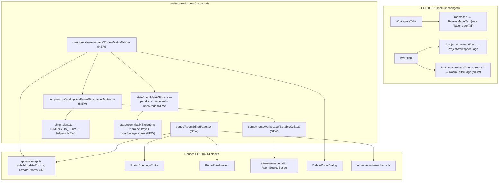
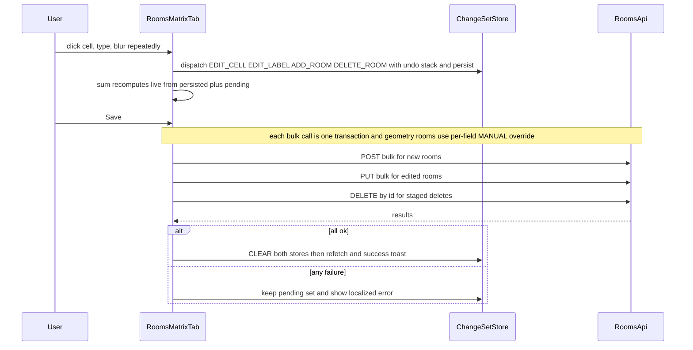

# Design Document: FOR-05-02 — Interactive Rooms matrix + full-page room editor

## Overview

FOR-05-02 replaces the placeholder `rooms` workspace tab (a `PlaceholderTab` shipped by
FOR-05-01) with a real, **interactive, Excel-like matrix**: room **dimensions in rows**, the
project's **rooms in columns**, a leading unit column, and a trailing per-row **Σ** column. Cells
and room labels are **inline-editable**; edits accumulate as a **client-tracked pending change
set** persisted in `localStorage` per project; a single **Save** commits everything in bulk (edits
in one transaction, new rooms in another). It adds **undo/redo**, **discard all**, **quick room
creation** ("+"), **room deletion** with confirmation, and a **full-page room editor** reusing the
FOR-04-14 geometry mini-editor. Editing is allowed **only while the project is `DRAFT`** and is
locked from `ACTIVE` onward.

The spec is **mostly frontend** but requires two small **generic backend additions**, both reusing
the existing `ROOMS` ABAC resource (no new resource, table, field, or entity):

1. **Generic bulk-update endpoint** `PUT /api/{resource}/bulk` — a new default method on
   `AdminController` (mirroring the existing `createBulk` `POST /bulk`), backed by a `@Transactional`
   heterogeneous batch update in `AdminService`, inherited by **every** controller including rooms.
   This is what makes "save all edits in one transaction" possible (the current framework only has
   `PUT /{id}` per row and an `updateAll(List<ID>, oneModel)` that applies the *same* model to many
   ids — not per-row values).
2. **Per-field manual override in `RoomService`** — today `normalize()` treats geometry as
   all-or-nothing: when geometry is present it overwrites all five metrics as `CALCULATED`. The
   change lets an update that carries an explicit metric value + `MANUAL` source override **only
   that field** to `MANUAL`, while the other geometry-derived metrics stay `CALCULATED`.

Facts verified against the code that frame the design:

- **`AdminController.createBulk` exists** (`POST /bulk`, `@PermissionOperation("CREATE")`, calls the
  `@Transactional AdminService.create(List<...>)`); **no bulk-update endpoint exists**.
- **`AdminService`** has `create(single)`, `create(List)` (`@Transactional`, `saveAll`),
  `update(id, model)` (`@Transactional`), `updateAll(List<ID>, model)` (same model to many ids),
  and `deleteAll(List<ID>)`. There is **no** heterogeneous per-row batch update.
- **`RoomService.normalize()`** → `applyCalculatedMetrics()` stamps all five metrics `CALCULATED`
  when geometry is present; `applyManualMetrics()` stamps supplied metrics `MANUAL` when geometry is
  absent.
- **The `Room` model already covers all 14 `Wymiary` dimensions** plus `windowCount`; no model
  change is needed.
- **The `rooms` tab** currently renders `PlaceholderTab` behind `{ ROOMS, READ }` — the swap point.

## Backend design (generic + rooms)

### B1. Generic bulk-update on the CRUD framework

Add a default method to `AdminController` next to `createBulk`, and a matching transactional method
to `AdminService`. Every controller (rooms included) inherits it; no per-controller code.

```java
// AdminController — NEW default method (mirrors createBulk)
@PutMapping("/bulk")
@PermissionOperation("UPDATE")
default ResponseEntity<List<UpdateResponseModel>> updateBulk(
        @Valid @RequestBody List<BulkUpdateItem<ID, UpdateRequestModel>> items) {
    List<AdminService.IdModel<ID, ServiceExtendedModel>> models = items.stream()
        .map(i -> new AdminService.IdModel<>(i.id(),
                getMapper().toUpdateServiceExtendedModel(i.data())))
        .toList();
    List<ServiceExtendedModel> updated = getService().update(models);   // one transaction
    return ResponseEntity.ok(updated.stream().map(getMapper()::toUpdateResponse).toList());
}
```

```java
// AdminService — NEW transactional heterogeneous batch update
record IdModel<ID, M>(ID id, M model) {}

@Transactional
default List<ServiceExtendedModel> update(List<IdModel<ID, ServiceExtendedModel>> items) {
    // Reuse the SAME per-row update logic (validate + before-snapshot + updateFields + audit)
    // as update(id, model), so project-scoping, validation hooks (RoomService.validateUpdate ->
    // normalize), and per-row audit all run identically; the shared @Transactional makes it atomic.
    return items.stream().map(it -> update(it.id(), it.model())).toList();
}
```

- `BulkUpdateItem<ID, UpdateRequestModel>` is a tiny generic request record `{ ID id; T data; }`.
- **Atomicity:** the single `@Transactional` on the batch method means any per-row failure rolls
  back the whole batch (Requirement 6.2). Each row still runs the existing `validateUpdate` →
  `normalize` hook and per-row audit.
- **ABAC & scoping (reuses the EXISTING project-scoped guard — no change to `ProjectScopedService`).**
  The endpoint is `@PermissionOperation("UPDATE")` (reuses `ROOMS/UPDATE`). Because the batch method
  funnels each row through the same single-row `update(id, model)`, and `ProjectScopedService`
  **already overrides** `update(id, model)` to call `assertProjectAccess(id)` **before** any write,
  every row of a bulk update is automatically project-scoped: a caller can only update rooms in
  projects they may access, and a targeted id outside the caller's allowed projects is denied
  (as the existing `404 error.entity.not.found`, deliberately indistinguishable from missing) —
  aborting the whole `@Transactional` batch (Requirement 6.7). This is the shipped
  `ProjectScopedService.assertProjectAccess(ID)` behavior (it resolves the owning project id via
  `getProjectId` over `getProjectIdPath()` and checks membership, with ADMIN bypass); **FOR-05-02
  does NOT modify `ProjectScopedService`** — it relies on the existing per-row guard reached through
  `update(id, model)`. No new ABAC operation is introduced (Requirement 12.2).

  > The batch method MUST delegate to the per-row `update(id, model)` (not bypass it with a raw
  > `saveAll`) precisely so the existing `assertProjectAccess` guard fires per row; a raw batch save
  > would skip project scoping and is explicitly not used.
- **Reuse for new rooms:** the existing `createBulk` (`POST /bulk`) handles pending new rooms; no
  change needed there (Requirement 6.3, 9.5).

> This addition is generic and benefits every managed entity, but FOR-05-02 only exercises it for
> rooms. Existing single-row endpoints are untouched.

### B2. RoomService per-field manual override

Extend `applyCalculatedMetrics()` so that, for each of the five metrics, an **explicitly supplied
value carrying `MANUAL` source** on the incoming model is preserved instead of being overwritten by
the geometry-derived value. Fields with no explicit override keep deriving from geometry as
`CALCULATED` (Requirements 5.2, 5.3, 5.4).

```java
// applyCalculatedMetrics(model, geometry) — per-metric guard (illustrative for floorArea):
RoomMetrics m = roomCalculationService.calculate(geometry, model.getCeilingHeight());
// floorArea: keep a manual override if the caller sent one, else use the calculated value
if (model.getFloorAreaSource() == MeasureSource.MANUAL && model.getFloorArea() != null) {
    // leave model.floorArea as supplied; source stays MANUAL  (per-field override, Req 5.2)
} else {
    model.setFloorArea(m.floorArea());
    model.setFloorAreaSource(MeasureSource.CALCULATED);
}
// ...same guard for wallArea, perimeter, doorArea, windowArea...
```

- The frontend signals an override by sending, for that room, the geometry unchanged **plus** the
  edited metric value with `source = MANUAL`. Only the overridden field flips to `MANUAL`; the rest
  remain `CALCULATED` from geometry (Requirement 5.2).
- Non-metric fields the matrix edits (`doorCount`, `doorHeight`, `doorWidth`, `windowCount`,
  `windowHeight`, `windowWidth`, `wallGap`, `finishGap`, `internalCorners`, `ceilingHeight`,
  `label`) are plain columns with no source flag and are simply set from the request.
- **Tests (Requirement 5.5):** a jqwik property — overriding any subset of the five metrics leaves
  exactly those `MANUAL` and the rest `CALCULATED` — plus an integration test through
  `PUT /api/rooms/bulk`.

> **Numeric range note.** `normalize()` validates metrics within `[0, 9999999999.99]` and counts
> non-negative; the matrix's zod schema enforces the same client-side so an invalid pending value is
> caught before Save (Requirement 4.5).

## Frontend architecture



### Module map

```
src/features/rooms/
  dimensions.ts                             # NEW: DIMENSION_ROWS + getDimensionValue/sumDimension/applyEdit
  api/rooms-api.ts                          # + createRoomsBulk (POST /bulk), bulkUpdateRooms (PUT /bulk)
  api/query-hooks.ts                        # + useProjectRooms(projectId)
  api/mutation-hooks.ts                     # + useBulkSaveRooms (createBulk + updateBulk orchestration)
  state/
    roomMatrixStorage.ts                    # NEW: edits store + new-rooms store, keyed per project (localStorage)
    roomMatrixStore.ts                      # NEW: pending change set + undo/redo stacks (reducer/useReducer or zustand)
  components/
    RoomOpeningsEditor.tsx                  # reused
    RoomPlanPreview.tsx                     # reused
    MeasureValueCell.tsx / RoomSourceBadge  # reused
    DeleteRoomDialog.tsx                    # reused
    workspace/
      RoomsMatrixTab.tsx                    # NEW: the rooms workspace tab panel (ProjectTabProps)
      RoomDimensionsMatrix.tsx              # NEW: the dimensions × rooms grid + Σ + toolbar
      EditableCell.tsx                      # NEW: click-to-edit cell
      NewRoomColumnHeader.tsx               # NEW: quick-create column header w/ required room-type selector
  pages/
    RoomEditorPage.tsx                      # NEW: full-page editor
  schemas/room-schema.ts                    # reused

src/features/project-workspace/workspaceTabs.ts   # CHANGED: rooms lazy → RoomsMatrixTab
src/app/router.tsx                                # CHANGED: + /projects/:projectId/rooms/:roomId
src/config/route-permissions.ts                    # CHANGED: register editor route → { ROOMS, READ }
src/locales/{pl,ru}.json                           # CHANGED: roomsSummary.* at parity
```

### F1. Dimension registry (`dimensions.ts`)

Ordered source of truth for the 15 rows (14 `Wymiary` + `windowCount`), each mapping a `RoomDto`
field to unit, label, and whether it carries a `MeasureSource`.

```typescript
export type RoomUnit = 'm2' | 'mb' | 'szt'
export interface DimensionRow {
  field: 'floorArea'|'wallArea'|'perimeter'|'doorCount'|'doorHeight'|'doorWidth'|'doorArea'
       | 'wallGap'|'finishGap'|'windowCount'|'windowHeight'|'windowWidth'|'windowArea'
       | 'internalCorners'|'ceilingHeight'
  unit: RoomUnit
  labelKey: string
  hasSource: boolean        // true ONLY for floorArea, wallArea, perimeter, doorArea, windowArea
}
export const DIMENSION_ROWS: DimensionRow[] = [ /* order per Wymiary; see requirements 2.2/2.3 */ ]
```

Pure helpers (unit-tested / property-tested):

- `getDimensionValue(room, row): number | null` — `room[field].value` for a source-carrying field,
  `room[field]` otherwise; never throws for `null`.
- `getEffectiveValue(room, row, edits): number | null` — the value **including** any pending edit
  for that (roomKey, field), so the grid and Σ reflect unsaved changes.
- `sumDimension(rooms, row, edits): number` — `Σ (getEffectiveValue(...) ?? 0)`, finite.

> `ceilingHeight` is a plain `number` on `RoomDto` (not a `MeasureValue`), so `hasSource = false`
> even though geometry can drive it; only the five `MeasureValueDto` metrics show a source badge.

### F2. Pending change set + localStorage (`roomMatrixStorage.ts`, `roomMatrixStore.ts`)

**Two project-keyed stores** (Requirements 4.6, 9.3):

```
localStorage:
  foremen.roomMatrix.edits.<projectId>     → { [roomId]: { [field]: number|string } }   // edits to existing rooms
  foremen.roomMatrix.newRooms.<projectId>  → NewRoomDraft[]                               // pending new rooms
```

- `NewRoomDraft = { tempId: string; roomTypeId: number|null; label: string|null; values: Record<field, number> }`
  (initialized to all-`0`, `roomTypeId` null until picked).
- All `localStorage` access is try/catch-guarded (mirroring `getInitialLocale`), degrading to
  "no pending state" if the store is unavailable (Requirement 12.5).
- Stores are independent per `projectId` (Requirement 4.7); a `storage`-event listener keeps
  surfaces in sync across tabs.

**Change-set store with undo/redo** (`roomMatrixStore.ts`) — a `useReducer` (or small store) whose
state is `{ edits, newRooms, deletedRoomIds, past: Action[], future: Action[] }`. Actions:
`EDIT_CELL`, `EDIT_LABEL` (existing rooms → edits store), `SET_NEW_ROOM_CELL`, `SET_NEW_ROOM_LABEL`
(pending new rooms → new-rooms draft store), `ADD_ROOM`, `SET_NEW_ROOM_TYPE`, `DELETE_ROOM`, `UNDO`,
`REDO`, `DISCARD_ALL`, `HYDRATE(fromLocalStorage)`, `CLEAR(afterSave)`.

> **Draft vs. edits separation.** `EDIT_CELL` / `EDIT_LABEL` mutate the **edits** store (existing
> rooms) only; `SET_NEW_ROOM_CELL` / `SET_NEW_ROOM_LABEL` mutate the matching `NewRoomDraft` in the
> **new-rooms** store only. `EditableCell` / `NewRoomColumnHeader` for a **new** column dispatch the
> draft-targeted actions, so a pending new room's label and cell edits are never written to the
> existing-room edits store (Requirement 9.3).

- Each mutating action pushes its inverse onto `past` and clears `future`; `UNDO` pops `past` →
  applies inverse → pushes onto `future`; `REDO` reverses (Requirements 7.1, 7.2). Single-step
  granularity per edit.
- Every state change writes through to the two `localStorage` stores (Requirement 4.6).
- `DISCARD_ALL` clears `edits`, `newRooms`, `deletedRoomIds`, and both stores after confirmation
  (Requirement 7.3).
- `CLEAR` runs after a successful Save, emptying pending state and both stores (Requirement 6.5).
- When pending state is hydrated from `localStorage` without a history, undo/redo simply start
  empty — no crash (Requirement 7.5).

> **History persistence scope.** The pending *values* persist across reloads (both stores); the
> undo/redo *history stacks* are session-scoped and are not required to survive a reload
> (Requirement 7.5).

### F3. Matrix panel (`RoomsMatrixTab.tsx`) + grid (`RoomDimensionsMatrix.tsx`)

`RoomsMatrixTab` is the `rooms` tab's real `lazy` target — `FC<ProjectTabProps>`:

1. `useProjectRooms(projectId)` fetches persisted rooms (`GET /api/rooms?filter=project.id~in~<id>`);
   loading/empty/error states with no raw key (Requirements 1.4–1.6).
2. `isDraft = project.status === 'DRAFT'`; `canEdit = isDraft && hasPermission('ROOMS','UPDATE')`
   (Requirement 8). When not draft → read-only + `roomsSummary.readOnlyDraftHint` (Requirement 8.2).
3. Initialize the change-set store, hydrating from `localStorage` for this project.
4. Render `RoomDimensionsMatrix` + a **toolbar** (Save, Discard all, Undo, Redo, unsaved-changes
   indicator) — all disabled when no pending changes or when `!canEdit` (Requirement 7.4). The
   quick-create "+" is **not** in the toolbar; it lives in the matrix header row (see F4).

`RoomDimensionsMatrix` renders the `Wymiary` grid (Requirement 2):

- Header: dimension-label col, unit col, one column per **persisted room** and per **pending new
  room** (`NewRoomColumnHeader`), then the quick-create **"+" header cell** (between the last room
  column and the Σ column, `AddRoomButton`), then the `Σ` col.
- Body: one row per `DIMENSION_ROWS` entry in order. Each room cell is an `EditableCell`; a
  source-carrying dimension shows the source badge via `MeasureValueCell` (Requirement 3.1); plain
  dimensions show the number (Requirement 3.2); `null → '—'` counted as `0` in Σ (Requirement 2.6).
- A cell with a pending edit is visually flagged and displayed as `MANUAL` (Requirement 3.3).
- Σ per row = `sumDimension(rooms, row, edits)`, recomputed live from current values incl. pending
  edits and pending new rooms (Requirements 2.5, 2.7, 9.6).
- Room column header: display name — when a `label` exists it shows `label` plus the localized
  `roomTypeName` in parentheses in a smaller/muted font (`Label (roomTypeName)`); with no label it
  shows `roomTypeName` alone — an **open-editor** control → `/projects/:projectId/rooms/:roomId`, and
  a **delete** control (Requirements 2.4, 10.1). The parenthesized type reuses the existing
  `roomTypeName` (no new i18n key needed).
- `overflow-x-auto` with a sticky first (dimension-label) column that is content-sized
  (`width: max-content` / `whitespace-nowrap`) to fit the longest dimension label rather than a
  fixed min-width, staying sticky within the scrollable grid (Requirement 2.8).

`EditableCell` (`components/workspace/EditableCell.tsx`): when `canEdit`, click → controlled input
seeded with the effective value; commit on blur/Enter (dispatch `EDIT_CELL`, or `SET_NEW_ROOM_CELL`
for a new column), cancel on Escape; validate against the rooms zod schema, flag invalid inline and
block Save (Requirements 4.1, 4.5). The room label header cell is editable the same way (`EDIT_LABEL`,
or `SET_NEW_ROOM_LABEL` for a new column; Requirement 4.2).

`EditableCell` keyboard model (grid-level navigation coordinated by `RoomDimensionsMatrix`,
Requirement 4.8): besides commit-on-blur/Enter and cancel-on-Escape, arrow keys (Up/Down/Left/Right)
and Tab/Shift+Tab move the active cell between **editable value cells**; the target cell opens for
input immediately (arrow/Tab focus makes it active/editable). Tab from the right-most room column
wraps to the first editable cell of the next row when available; Enter commits the current value in
place without moving. Navigation is confined to editable value cells — the unit column, the Σ column,
and any non-editable/locked cells are skipped — and is active only while `canEdit`. This is kept at
the design level; the matrix owns the active-cell coordinate and resolves the next/previous editable
target, delegating open/commit to `EditableCell`.

### F4. Quick create (`NewRoomColumnHeader.tsx`)

- The quick-create "+" is a dedicated **header cell** (`AddRoomButton`) placed between the last room
  column header and the Σ column header — **not** in the toolbar (Requirement 9.1). It is visible
  only when `canEdit` and dispatches `ADD_ROOM`, appending a `NewRoomDraft` (all-`0` values,
  `roomTypeId: null`) → new column appears immediately.
- The new column's header renders a **required room-type selector** (reusing the existing reference
  select); until a type is chosen the column is flagged invalid and Save is blocked (decision (a),
  Requirements 9.2, 9.4).
- New-room cells and label are editable like any column, but their edits target the **new-rooms**
  draft, not the edits store: `NewRoomColumnHeader` (label) and each `EditableCell` in a new column
  dispatch the draft-targeted actions `SET_NEW_ROOM_LABEL` / `SET_NEW_ROOM_CELL` (see F2), so a
  pending new room's label and cell values are never written to the existing-room edits store
  (Requirement 9.3).
- Included in live Σ before saving (Requirement 9.6).

### F5. Delete (`DeleteRoomDialog` reuse)

- Per-room delete control in the column header (only when `canEdit`, Requirement 10.1).
- Confirmation via the existing `DeleteRoomDialog` naming the room (Requirement 10.2).
- **Persisted room:** dispatch `DELETE_ROOM(roomId)` → staged into `deletedRoomIds` (so it
  participates in undo, Requirement 7.2) and committed on Save via `DELETE /api/rooms/{id}`; the
  design commits deletes on Save alongside edits/creates (Requirement 10.3).
- **Pending new room:** just drop the draft from the new-rooms store, no API call (Requirement 10.4).
- Server-rejected delete → localized error, column stays (Requirement 10.5).

### F6. Bulk save orchestration (`useBulkSaveRooms`)

Single Save commits the whole change set (Requirement 6):

1. **Validate** the entire pending set (all edited values + every new room has a room type); if
   invalid, block and flag (Requirements 4.5, 9.4) — nothing sent.
2. **New rooms** → `POST /api/rooms/bulk` (`createRoomsBulk`) — one transaction (Requirements 6.3,
   9.5). Each draft becomes a `RoomCreateRequest` (`projectId`, `roomTypeId`, `label`, and the
   edited metrics; geometry absent → all supplied metrics `MANUAL`).
3. **Edits** → `PUT /api/rooms/bulk` (`bulkUpdateRooms`) — one transaction (Requirement 6.2). Each
   item is `{ id, data }` where `data` carries the room's edited fields; for a geometry room, an
   edited metric is sent with `source = MANUAL` so the backend per-field override (B2) flips only
   that field.
4. **Deletes** → the staged `deletedRoomIds` are removed (per-row `DELETE` or the existing
   `deleteAll`); ordering: create → update → delete (or delete first for removed persisted rooms) is
   fixed in the implementation and surfaced as a single logical Save.
5. **On success:** `CLEAR` the change set + both stores, refetch rooms, success toast; Σ reflects
   persisted values (Requirement 6.5).
6. **On failure:** retain the entire pending set (nothing cleared), localized error; because each
   bulk call is atomic, a failed call leaves that group unpersisted (Requirement 6.6). Partial
   success across the create/update/delete groups is surfaced with a clear message and the still-
   pending groups are kept (Requirement 6.4).

> **Transaction scope.** Each bulk endpoint is individually atomic. The three groups
> (create/update/delete) are three calls, not one cross-group DB transaction; the design documents
> this and keeps the client change set intact on any failure so the user can retry (Requirements
> 6.4, 6.6). If the client wishes, updates+creates can be issued and only cleared once both
> resolve.

### F7. Full-page room editor (`RoomEditorPage.tsx`)

Route `/projects/:projectId/rooms/:roomId` (4 segments — no collision with the 3-segment
`/projects/:projectId/:tab` under the `requirementForPath` equal-segment matcher). Reuses
`RoomOpeningsEditor` + `RoomPlanPreview` + manual-metrics override + `roomUpdateSchema`; hydrates via
`useRoom` and the working project; saves via `PUT /api/rooms/{id}`; read-only when locked or lacking
`ROOMS/UPDATE`; graceful not-found/cross-project state; **no description field** (Requirement 11).
Honors the extended backend contract (per-field `MANUAL` override, Requirement 11.4).

### F8. Wiring

- `workspaceTabs.ts`: rooms `lazy` → `React.lazy(() => import('@/features/rooms/components/workspace/RoomsMatrixTab'))`; contract unchanged (Requirement 1.1).
- `router.tsx`: add the editor route in the same pathless `PermissionGuard` child array, wrapped in `SuspenseWrapper`.
- `route-permissions.ts`: `'/projects/:projectId/rooms/:roomId': { resource: 'ROOMS', operation: 'READ' }`.

## Data flow (save)



## Correctness properties

- **Property 1 — Σ equals per-dimension sum incl. pending.** For any rooms, any pending edit map,
  and any `DimensionRow`, `sumDimension` equals `Σ getEffectiveValue(room,row,edits) ?? 0`; `null →
  0`; finite. *Validates 2.5, 2.6, 2.7, 4.4, 9.6.*
- **Property 2 — value extraction total & source-correct.** `getDimensionValue` reads `.value` iff
  `row.hasSource`, never throws; `hasSource` true exactly for the five metrics. *Validates 2.6, 3.1,
  3.2.*
- **Property 3 — undo/redo inverts.** For any sequence of actions, `UNDO` after an action restores
  the exact prior change-set state, and `REDO` re-applies it; `DISCARD_ALL` yields the empty set.
  *Validates 7.1, 7.2, 7.3.*
- **Property 4 (backend) — per-field override.** For a room with geometry, an update overriding any
  subset K of the five metrics (value + `MANUAL`) persists exactly K as `MANUAL` and the rest as
  `CALCULATED` from geometry. *Validates 5.2, 5.3, 5.4, 5.5.*

## Testing strategy

- **Backend:** jqwik property for the per-field override (Property 4); integration test through
  `PUT /api/rooms/bulk` (atomic batch, project-scoping, one row invalid → whole batch rolled back);
  a generic `AdminService.update(List)` unit/IT proving atomicity and per-row audit. Run only the
  affected classes with `--tests` per the workspace test-execution standard; read the JUnit XML.
- **Frontend:** property tests for Σ/value-extraction (Properties 1–2) and the undo/redo reducer
  (Property 3); component tests for inline edit, live Σ, unsaved indicator, quick-create with
  required room type, delete confirmation, draft-lock read-only, save success/clear and
  save-error/retain; i18n parity test for `roomsSummary.*`.

## i18n

New `roomsSummary.*` keys at PL/RU parity (single active language). Beyond the summary keys
(title, dimensionHeader, unitHeader, sumHeader, empty, loading, error, readOnlyDraftHint,
openEditor, editorTitle, notFound, `unit.*`, `dimension.*` for doorCount/doorHeight/doorWidth/
windowCount/windowHeight/windowWidth), add edit-mode keys:

| Key | PL | RU |
|-----|----|----|
| `roomsSummary.save` | Zapisz | Сохранить |
| `roomsSummary.discardAll` | Odrzuć zmiany | Отменить все изменения |
| `roomsSummary.undo` | Cofnij | Отменить |
| `roomsSummary.redo` | Ponów | Повторить |
| `roomsSummary.unsavedChanges` | Niezapisane zmiany | Несохранённые изменения |
| `roomsSummary.addRoom` | Dodaj pomieszczenie | Добавить помещение |
| `roomsSummary.newRoomLabel` | Nowe pomieszczenie | Новое помещение |
| `roomsSummary.selectRoomType` | Wybierz typ pomieszczenia | Выберите тип помещения |
| `roomsSummary.roomTypeRequired` | Typ pomieszczenia jest wymagany | Тип помещения обязателен |
| `roomsSummary.deleteRoom` | Usuń pomieszczenie | Удалить помещение |
| `roomsSummary.discardConfirm` | Odrzucić wszystkie niezapisane zmiany? | Отменить все несохранённые изменения? |
| `roomsSummary.saveSuccess` | Zapisano zmiany | Изменения сохранены |
| `roomsSummary.saveError` | Nie udało się zapisać zmian | Не удалось сохранить изменения |

Dimension labels reuse `rooms.form.*` where present; source badges reuse `rooms.source.*`. Delete
confirmation reuses the existing `rooms.delete.*` keys via `DeleteRoomDialog`.

## Dependencies & scope boundary

- **Hard deps:** FOR-04-14 (`Room`, `/api/rooms`, geometry mini-editor, metric cells, zod schema,
  `rooms.*` i18n) and FOR-05-01 (workspace shell, tab contract, working-project state, router +
  route-permissions matcher).
- **Backend footprint:** only the generic `AdminController.updateBulk` + `AdminService.update(List)`
  and the `RoomService` per-field override; both reuse the existing `ROOMS` `CREATE`/`UPDATE`
  operations — no new entity/table/field/ABAC resource/operation, so the `entity-creation-rules`
  checklist does not apply (nothing new is a managed entity or resource).
- **Project-scoped access control is already implemented and is NOT changed.**
  `ProjectScopedService.assertProjectAccess(ID)` and its per-row invocation from the overridden
  `update(id, model)` / `updateAll` / `deleteById` / `deleteAll` / etc. already enforce that a caller
  may only mutate entities in their allowed projects (resolving the owning project id from
  `getProjectIdPath()`, ADMIN bypass, deny as `404 error.entity.not.found`). The generic bulk-update
  inherits this for free by delegating to `update(id, model)` per row. FOR-05-02 adds **no** new
  access-control method and does **not** modify `ProjectScopedService`.
- **Not in scope:** per-room work quantities (`EstimateLineRoomQty`, FOR-05-03 — not implemented),
  estimate computation, room media, and rich-text description.
```