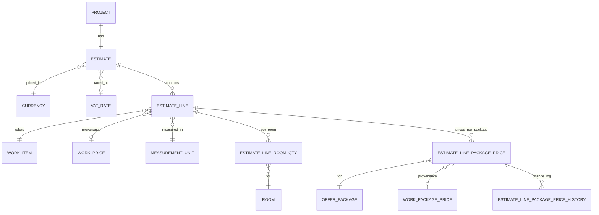

# Design Document: FOR-05-03 — Estimate core

## Overview

FOR-05-03 delivers the **substrate of the estimate domain** for a project: a single
`Estimate` per `Project` (1:1), its `EstimateLine`s (one per catalog work added to the
project), the per-room quantity split `EstimateLineRoomQty` from which each line's total
quantity and net value are **derived**, and the **denormalized per-package project price**
(`EstimateLinePackagePrice`) — a snapshot **copied** from the FOR-04-12b catalog at
add-time that then "lives its own life," carries a discount placeholder, and keeps its own
price-history skeleton (`EstimateLinePackagePriceHistory`).

The design honours the FOR-04-12b **"catalog is a reference / snapshot copy"** contract:
the catalog per-package price (`WorkPackagePrice.netPrice`) is read through the catalog's
`EffectivePriceResolver` (the MAX-fallback rule) and **copied by value** at add-time. Every
project-owned price keeps a **provenance FK** to the catalog row for lineage only; the
copied numeric value is the source of truth and is never mutated by later catalog edits or
deletes. Line values and estimate totals are always **recomputed** from current prices and
quantities, never hand-entered where derivable.

Free editing of lines, room quantities, and per-package project prices is gated to the
**`DRAFT`** stage; at `ACTIVE` and beyond the write-path is closed and callers are told that
subsequent changes go through the amendment procedure (owned by FOR-05-08 — not implemented
here). Every new managed entity is a generic CRUD resource on the existing
`AdminController`/`AdminService` framework, MapStruct DTO mapping and i18n, guarded by a new
project-scoped ABAC resource **`ESTIMATE`** seeded per `.kiro/steering/entity-creation-rules.md`.

This spec owns **only** the substrate. Temporal price resolution + offer freeze (FOR-05-14),
discount negotiation/approval (FOR-05-07), the amendment write-path (FOR-05-08), package
VALUE/margin (FOR-05-06), material aggregation (FOR-05-05), and the rich cross-entity price
history UI (FOR-05-15) are **out of scope** and are called out explicitly in §12.

**Notation.** This is a backend, API-only spec. Interfaces, entities, and DTOs are shown in
Java (matching the repository, Spring Boot / JPA / MapStruct); algorithms are shown in
structured pseudocode (```pascal```), consistent with the FOR-05 parent design §6.

---

## Architecture

FOR-05-03 adds one ABAC resource (`ESTIMATE`) that guards a small family of project-scoped
CRUD controllers, all riding the generic framework. The per-package project price is formed
by **reading** the FOR-04-12b catalog (never bound by FK for value) and **copying** the
resolved effective price at add-time.

```mermaid
graph TD
    subgraph API["API layer (@PermissionResource(\"ESTIMATE\"))"]
      EC[EstimateController]
      ELC[EstimateLineController]
      RQC[EstimateLineRoomQtyController]
      PPC[EstimateLinePackagePriceController]
    end

    subgraph SVC["Service layer (ProjectScopedService)"]
      ES[EstimateService<br/>getProjectIdPath = project.id]
      ELS[EstimateLineService<br/>getProjectIdPath = estimate.project.id]
      RQS[EstimateLineRoomQtyService<br/>getProjectIdPath = line.estimate.project.id]
      PPS[EstimateLinePackagePriceService<br/>getProjectIdPath = line.estimate.project.id]
      REC[EstimateRecomputeService<br/>derive line + totals]
      SNAP[PackagePriceSnapshotService<br/>copy-at-add-time]
      GATE[DraftGateGuard<br/>DRAFT-only write gate]
    end

    subgraph CAT["FOR-04 catalog (read + copy only)"]
      EPR[EffectivePriceResolver<br/>MAX-fallback, pure fn]
      WPP[(work_package_prices)]
      OP[(offer_packages)]
    end

    subgraph DB["PostgreSQL + Liquibase"]
      T1[(estimates)]
      T2[(estimate_lines)]
      T3[(estimate_line_room_qty)]
      T4[(estimate_line_package_prices)]
      T5[(estimate_line_package_price_history)]
      SEED[[NNN-seed-estimate-resource.xml<br/>idempotent, registered last]]
    end

    EC --> ES --> T1
    ELC --> ELS --> T2
    RQC --> RQS --> T3
    PPC --> PPS --> T4
    ELS --> SNAP
    SNAP --> EPR
    EPR -.reads.-> WPP
    EPR -.reads.-> OP
    SNAP --> T4
    PPS --> T5
    ELS --> REC
    RQS --> REC
    PPS --> REC
    REC --> T1
    ES & ELS & RQS & PPS --> GATE
```

**Key architectural rules**

- **Row/paging units** are the four project-scoped entities; each controller is a thin
  generic `AdminController` subtype annotated `@PermissionResource("ESTIMATE")`.
- **Copy, never bind.** `EstimateLine.unitPrice` and `EstimateLinePackagePrice.*UnitPrice`
  are stored numeric snapshots. `EstimateLine.workPrice` and
  `EstimateLinePackagePrice.workPackagePrice` are **provenance FKs** used for lineage only;
  a `NULL` provenance FK is legal after the catalog row is deleted (the snapshot survives).
- **Derive, never hand-enter.** `EstimateLine.quantity`, `EstimateLine.valueNet`, and
  `Estimate.total*` are computed by `EstimateRecomputeService`; those columns are never
  accepted from a client payload (the mapper ignores inbound values).
- **DRAFT gate** is enforced in the service create/update/delete hooks
  (`validateCreate`/`validateUpdate`/pre-delete) via `DraftGateGuard`, which reads the owning
  estimate status; it is orthogonal to ABAC (ABAC = who; the gate = when).

---

## Components and Interfaces

### Component 1: `EstimateService` (1:1 with Project)

**Purpose**: CRUD + create-or-resolve of the single `Estimate` per project; owns totals
recompute orchestration.

**Interface** (project-scoped, mirrors `RoomService`/`ProjectService`):

```java
@Service
@PermissionResource("ESTIMATE") // (on the controller; service is unannotated)
public class EstimateService
        implements ProjectScopedService<EstimateServiceModel, EstimateServiceExtendedModel, EstimateEntity, Long> {

    @Override public String getProjectIdPath() { return "project.id"; }

    /** R1.5/R1.6: return the project's estimate, creating exactly one if absent. */
    EstimateServiceExtendedModel getOrCreateForProject(Long projectId);
}
```

**Responsibilities**
- Enforce the single-estimate-per-project invariant (R1.1, R1.6) via a DB unique constraint
  on `estimates.project_id` plus a `getOrCreateForProject` upsert path (R1.5).
- Default `currency` to PLN and `status` to `DRAFT` on creation (R1.2, R1.3).
- Expose derived `totalNet`/`totalVat`/`totalGross` (never inbound — R1.4, R8).

### Component 2: `EstimateLineService`

**Purpose**: CRUD of lines; on create, triggers the per-package price snapshot copy and
recompute.

```java
@Override public String getProjectIdPath() { return "estimate.project.id"; }

/** R4.1: on line create, snapshot a per-package project price for every OfferPackage. */
void afterLineCreated(EstimateLineEntity line); // delegates to PackagePriceSnapshotService
```

**Responsibilities**
- Persist `workItem` (FK), `lineNo`, optional `comment`, `unit` (FK), and the denormalized
  `unitPrice` snapshot (R2.1–R2.3).
- Keep `workPrice` as provenance only; never derive value from it (R2.4, R2.5).
- Trigger `PackagePriceSnapshotService.snapshotForLine(line)` at add-time (R4.1).
- Trigger recompute of the line and estimate totals (R2.6, R2.7, R8).

### Component 3: `EstimateLineRoomQtyService`

```java
@Override public String getProjectIdPath() { return "line.estimate.project.id"; }
```

**Responsibilities**
- Persist `(line FK, room FK, quantity)` with `quantity >= 0` (R3.1, R3.2).
- Reject a `room` whose owning project differs from the line's estimate project (R3.6) —
  a cross-project guard in `validateCreate`/`validateUpdate`.
- Trigger recompute so `line.quantity = Σ roomQty.quantity` on every add/change/remove
  (R3.3, R3.4).

### Component 4: `EstimateLinePackagePriceService` + `PackagePriceSnapshotService`

**Purpose**: own the denormalized per-package project price and its history skeleton; copy
from the catalog at add-time.

```java
@Override public String getProjectIdPath() { return "line.estimate.project.id"; }

public class PackagePriceSnapshotService {
    /** R4.1–R4.3, R4.7: one row per (line, package existing at add-time), copied via MAX-fallback. */
    List<EstimateLinePackagePriceEntity> snapshotForLine(EstimateLineEntity line);
}
```

**Responsibilities**
- For every `OfferPackage` existing at add-time, create one
  `EstimateLinePackagePrice(line, offerPackage)` row (R4.1, R4.2).
- Resolve the copied value through the FOR-04-12b `EffectivePriceResolver` MAX-fallback rule
  and set `originalUnitPrice`; leave the row **unpriced** (null price, `unpriced=true`) when
  the resolver returns empty — never fabricate (R4.3, R4.7).
- Keep `workPackagePrice` as a **provenance FK** only; the copied number is source of truth
  and is untouched by later catalog edits/deletes (R4.4, R4.5).
- Own the discount placeholder fields and derive the effective `unitPrice` (R5).
- Write a `EstimateLinePackagePriceHistory` row on every change to `originalUnitPrice`,
  discount, or effective `unitPrice` (R6).
- Do **not** retro-populate rows for packages created after the line already exists (R4.6,
  R12.7).

### Component 5: `EstimateRecomputeService`

Pure derivation service (see §6.1) invoked after any line/room-qty/price change.

### Component 6: `DraftGateGuard`

**Purpose**: block free edits once the owning estimate is past `DRAFT` (R7).

```java
public class DraftGateGuard {
    /** R7.2, R7.3: throw 409 error.estimate.locked (amendment via FOR-05-08) if status != DRAFT. */
    void assertDraft(EstimateEntity estimate);
}
```

Invoked from the create/update/delete hooks of the four services on any *free-edit* write.

---

## Data Models

All monetary fields are net (netto), `BigDecimal`. Currency is a FK to `Currency`
(default PLN). All i18n text uses `nameRU`/`namePL` with PL fallback. All entities extend
the repo `BaseEntity` (id + audit columns).

### 4.1 Entity-relationship diagram



### 4.2 Entity table

| Entity | Key fields | Scope / `getProjectIdPath()` | Notes |
|--------|-----------|------------------------------|-------|
| `EstimateEntity` (`estimates`) | `project` (FK, **unique** → 1:1), `currency` (FK, default PLN), `vatRate` (FK, nullable), `status` (`DRAFT`/`PRICED`/`APPROVED`/`SIGNED`, default `DRAFT`), `totalNet`, `totalVat`, `totalGross` (derived) | `project.id` | R1. `project_id` UNIQUE enforces 1:1 (R1.1, R1.6) |
| `EstimateLineEntity` (`estimate_lines`) | `estimate` (FK), `workItem` (FK), `workPrice` (FK, **nullable, provenance only**), `unit` (FK), `lineNo`, `comment` (nullable), `unitPrice` (snapshot), `quantity` (derived), `valueNet` (derived) | `estimate.project.id` | R2. `unitPrice` is frozen source of truth (R2.3–R2.5) |
| `EstimateLineRoomQtyEntity` (`estimate_line_room_qty`) | `line` (FK), `room` (FK), `quantity` (`>= 0`) | `line.estimate.project.id` | R3. cross-project room rejected (R3.6) |
| `EstimateLinePackagePriceEntity` (`estimate_line_package_prices`) | `line` (FK), `offerPackage` (FK), `workPackagePrice` (FK, **nullable, provenance only**), `originalUnitPrice` (nullable when unpriced), `discountKind` (`PERCENT`/`ABSOLUTE`, nullable), `discountValue` (nullable), `unitPrice` (effective, derived), `unpriced` (boolean) | `line.estimate.project.id` | R4, R5. UNIQUE `(line_id, offer_package_id)` (R4.2) |
| `EstimateLinePackagePriceHistoryEntity` (`estimate_line_package_price_history`) | `packagePrice` (FK), `originalUnitPrice`, `discountKind`, `discountValue`, `unitPrice`, `changedBy`, `changedAt` | `packagePrice.line.estimate.project.id` (read-only) | R6. append-only change capture |

**Enums (i18n, R11)**

```java
public enum EstimateStatus { DRAFT, PRICED, APPROVED, SIGNED }
public enum DiscountKind   { PERCENT, ABSOLUTE }
```

Each enum value has `nameRU`/`namePL` labels (PL fallback) so no raw key or untranslated
identifier is ever surfaced (R11.1–R11.3).

### 4.3 Derivations (never hand-entered)

- `EstimateLine.quantity` = Σ `EstimateLineRoomQty.quantity` for the line (R2.6, R3.3).
- `EstimateLine.valueNet` = `round2(unitPrice × quantity)` (R2.7, R8.1).
- `EstimateLinePackagePrice.unitPrice` (effective) = `applyDiscount(originalUnitPrice,
  discountKind, discountValue)` (R5.2, R5.3).
- `Estimate.totalNet` = Σ line `valueNet` (R8.2); `Estimate.totalVat` = `round2(totalNet ×
  vatRate)`; `Estimate.totalGross` = `round2(totalNet + totalVat)` (R8.3). Zero-line estimate
  ⇒ all totals `0` (R8.5).

### 4.4 Snapshot / provenance contract (FOR-04-12b alignment)

Both `EstimateLine.unitPrice` and `EstimateLinePackagePrice.originalUnitPrice` are formed by
**copying** the catalog value at add-time. The two provenance FKs (`workPrice`,
`workPackagePrice`) are declared **`ON DELETE SET NULL`** so a catalog delete nulls the
lineage pointer without touching the stored value and without deleting the project row —
mirroring the FOR-04-12b "cascading a catalog delete cannot orphan a project's captured
price" guarantee. FOR-05-03 never declares an FK that *drives* a value from the catalog.

---

## 6. Low-Level Design — Algorithms & Formal Specifications

### 6.1 Recompute line values and estimate totals (R8)

```pascal
ALGORITHM recomputeEstimate(estimate)
INPUT: estimate with lines, each line with roomQtys; estimate.vatRate (nullable)
OUTPUT: estimate with derived line + total values persisted

PRECONDITION:
  - estimate.currency <> null
  - every line.unitPrice >= 0
  - every roomQty.quantity >= 0

BEGIN
  totalNet <- 0
  FOR each line IN estimate.lines DO
    INVARIANT: totalNet = Σ valueNet of lines processed so far
    line.quantity <- SUM(rq.quantity FOR rq IN line.roomQtys)   // R2.6, R3.3; 0 if none (R3.4)
    line.valueNet <- round2(line.unitPrice * line.quantity)     // R2.7, R8.1
    totalNet <- totalNet + line.valueNet
  END FOR

  vat <- coalesce(estimate.vatRate.rate, 0)
  estimate.totalNet   <- round2(totalNet)                       // R8.2
  estimate.totalVat   <- round2(totalNet * vat)                 // R8.3
  estimate.totalGross <- round2(estimate.totalNet + estimate.totalVat)
  RETURN estimate
END

POSTCONDITION:
  - estimate.totalNet   = Σ line.valueNet
  - estimate.totalGross = estimate.totalNet + estimate.totalVat  (2 dp)
  - lines empty ⇒ totalNet = totalVat = totalGross = 0           // R8.5
```

### 6.2 Snapshot per-package project price at add-time (R4)

```pascal
ALGORITHM snapshotForLine(line)
INPUT: line (just-created EstimateLine referencing workItem)
OUTPUT: one EstimateLinePackagePrice per OfferPackage existing at add-time

PRECONDITION: line.workItem <> null; line.estimate.status = DRAFT

BEGIN
  packages       <- allOfferPackages()                    // packages existing NOW (R4.1, R4.6)
  workPackages   <- catalog.packagePricesOf(line.workItem) // WorkPackagePrice collection
  results <- []
  FOR each pkg IN packages DO
    effective <- EffectivePriceResolver.resolve(workPackages, pkg.code)  // MAX-fallback (R4.3)
    row <- new EstimateLinePackagePrice(line, pkg)
    IF effective IS PRESENT THEN
      row.originalUnitPrice <- effective.value
      row.unpriced          <- false
      row.workPackagePrice  <- provenanceOf(workPackages, pkg)  // FK for lineage only (R4.4)
      row.unitPrice         <- applyDiscount(row.originalUnitPrice, null, null) // = original (R5.2)
    ELSE
      row.originalUnitPrice <- null                        // R4.7: unpriced, not fabricated
      row.unpriced          <- true
      row.unitPrice         <- null
    END IF
    append(results, row)
    captureHistory(row)                                    // R6.2 initial capture
  END FOR
  RETURN results
END

POSTCONDITION:
  - exactly one row per package existing at add-time (R4.1, R4.2)
  - later catalog edits/deletes do NOT change row.originalUnitPrice/unitPrice (R4.5)
  - no row is created for packages created after this call (R4.6, R12.7)
```

### 6.3 Apply discount to derive effective unit price (R5)

```pascal
ALGORITHM applyDiscount(originalUnitPrice, discountKind, discountValue)
OUTPUT: effective unit price

BEGIN
  IF originalUnitPrice IS NULL THEN RETURN NULL END IF        // unpriced stays unpriced
  IF discountKind IS NULL OR discountValue IS NULL OR discountValue = 0 THEN
    RETURN originalUnitPrice                                  // R5.2: neutral state
  END IF
  IF discountKind = PERCENT THEN
    effective <- originalUnitPrice * (1 - discountValue / 100)
  ELSE // ABSOLUTE
    effective <- originalUnitPrice - discountValue
  END IF
  RETURN round2(max(effective, 0))                            // never negative
END

POSTCONDITION:
  - no/zero discount ⇒ effective = originalUnitPrice          // R5.2
  - effective is derived from (original, discount), never hand-entered independently (R5.3)
```

### 6.4 DRAFT gate on free edits (R7)

```pascal
ALGORITHM assertDraft(estimate)
BEGIN
  IF estimate.status <> DRAFT THEN
    THROW ForemenApiException(409, "error.estimate.locked")   // R7.2, R7.3: amendment via FOR-05-08
  END IF
END
```

Invoked from every free-edit create/update/delete on `EstimateLine`, `EstimateLineRoomQty`,
and `EstimateLinePackagePrice`. `DRAFT` ⇒ allowed (R7.1); `ACTIVE`/later ⇒ blocked (R7.2).

### 6.5 Cross-project room rejection (R3.6)

```pascal
ALGORITHM validateRoomQty(roomQty)
BEGIN
  lineProjectId <- roomQty.line.estimate.project.id
  roomProjectId <- roomQty.room.project.id
  IF roomProjectId <> lineProjectId THEN
    THROW ForemenApiException(400, "error.estimate.room.cross.project")   // R3.6
  END IF
  IF roomQty.quantity < 0 THEN
    THROW ForemenApiException(400, "error.estimate.qty.negative")          // R3.2
  END IF
END
```

---

## 5. ABAC — `ESTIMATE` resource & entity-creation checklist (R9)

Per `.kiro/steering/entity-creation-rules.md`, FOR-05-03 wires the `ESTIMATE` resource into
the permission matrix and guards its controllers:

1. **Seed changeset** `NNN-seed-estimate-resource.xml` (next free number after `075`,
   e.g. `076`), **registered last** in `changelog.xml`. It inserts the `ESTIMATE` resource
   row guarded by `<preConditions onFail="MARK_RAN"><sqlCheck expectedResult="0">SELECT
   COUNT(*) FROM resources WHERE code = 'ESTIMATE'</sqlCheck></preConditions>` (idempotent —
   R9.1). If `ESTIMATE` is already reserved (parent design §5 lists it under codes reused
   from `NAV_CONFIG`), the precondition makes the insert a no-op and the code is reused
   rather than duplicated (R9.6).
2. **ADMIN grant** (second `<changeSet>` in the same file): `role_resources` + CRUD
   `role_resource_operations` for `ADMIN`, guarded by the same `onFail="MARK_RAN"` precondition
   (R9.2). ADMIN bypasses the matrix at runtime, so this is a completeness/self-describing
   seed. Non-ADMIN grants below are seeded on the same real resource row.
3. **`@PermissionResource("ESTIMATE")`** on each concrete controller
   (`EstimateController`, `EstimateLineController`, `EstimateLineRoomQtyController`,
   `EstimateLinePackagePriceController`). Inherited CRUD `default` methods already carry
   `@PermissionOperation`, so the class annotation completes the `(resource, operation)` pair
   and the app starts (no half-annotated controller — R9.3). The read-only history endpoint
   resolves to `READ`.
4. **`ProjectScopedService.getProjectIdPath()`** on every backing service (R9.4):
   - `EstimateService` → `"project.id"`
   - `EstimateLineService` → `"estimate.project.id"`
   - `EstimateLineRoomQtyService` → `"line.estimate.project.id"`
   - `EstimateLinePackagePriceService` → `"line.estimate.project.id"`

**Proposed matrix** (finalized here per R9.5; consistent with parent design §5):

| Resource | ADMIN | MANAGER | FOREMAN | WORKER | FINANCIER | CLIENT |
|----------|:-----:|:-------:|:-------:|:------:|:---------:|:------:|
| ESTIMATE | CRUD | C R U (own) | R (own) | R (own) | R (own) | none |

Non-ADMIN grants are seeded on the `ESTIMATE` role-matrix rows for `MANAGER`, `FOREMAN`,
`WORKER`, `FINANCIER` with the `(own)` project-membership filter applied automatically by
`ProjectScopedService`. `CLIENT` receives no grant here (client-facing estimate reads arrive
with FOR-09).

---

## 7. Reuse of framework & catalog (R10)

- All four entities are generic CRUD resources on `AdminController`/`AdminService`, with
  MapStruct service/DAO mappers and the standard i18n mapping — no bespoke controller stack
  (R10.1). Derived columns (`quantity`, `valueNet`, `total*`, effective `unitPrice`) are
  marked read-only in the mapper so inbound payload values are ignored (R8.4).
- The per-package project price is sourced **read + copy** through the FOR-04-12b
  `EffectivePriceResolver`; no FK binds a `WorkPackagePrice` for value (provenance FK only —
  R10.2, R4.2, R4.4).
- `OfferPackage`, `MeasurementUnit`, `Currency`, `VatRate`, and `WorkItem` are reused from
  FOR-04, never redefined (R10.3).
- **Hard dependencies** (R10.4): `Project` (FOR-04-13), `Room` (FOR-04-14), FOR-05-01
  workspace shell, FOR-04-11/12b (work catalog + per-package prices).
- FOR-05-03 adds **no** material aggregation, package VALUE/margin, temporal resolution,
  offer freeze, discount negotiation, amendment write-path, or price-history UI (R10.5, §12).

---

## Error Handling

| Scenario | Condition | Response | Recovery |
|----------|-----------|----------|----------|
| Second estimate for a project | UNIQUE `estimates.project_id` violation / explicit create | `409 error.estimate.already.exists`; `getOrCreateForProject` returns the existing one | Caller uses create-or-resolve (R1.5, R1.6) |
| Free edit past DRAFT | owning `estimate.status <> DRAFT` on a free-edit write | `409 error.estimate.locked` (indicates changes go via amendment) | Use FOR-05-08 amendment path (R7.2–R7.4) |
| Negative room quantity | `quantity < 0` | `400 error.estimate.qty.negative` | Supply non-negative qty (R3.2) |
| Cross-project room | `room.project.id <> line.estimate.project.id` | `400 error.estimate.room.cross.project` | Use a room of the same project (R3.6) |
| Unpriced package | `EffectivePriceResolver` returns empty | row persisted with `unpriced=true`, null prices — **not** an error | Price the work in the catalog later; add-time is not blocked (R4.7) |
| Out-of-scope / missing entity | `assertProjectAccess` deny | `404 error.entity.not.found` (indistinguishable from missing — inherited) | — |

All user-facing messages resolve through the i18n message bundle at PL/RU parity; no raw key
is surfaced (R11.3).

---

## Testing Strategy

### Unit testing
- `applyDiscount`: PERCENT/ABSOLUTE/zero/absent/floor-at-zero; unpriced passthrough.
- `recomputeEstimate`: qty sum, value rounding, VAT, empty-estimate zero totals.
- `snapshotForLine`: one row per package, MAX-fallback branches, unpriced branch, provenance
  FK set/absent.
- `DraftGateGuard.assertDraft`: DRAFT allowed vs. every non-DRAFT status blocked.
- Cross-project room validation.

### Property-based testing
**Library**: jqwik (repo standard for Java property tests). Targets: the pure derivations
(`recomputeEstimate`, `applyDiscount`) and the snapshot/gate invariants (§ Correctness
Properties).

### Integration testing (Testcontainers + Dockerized API for test-cases.md)
- Liquibase seed applies idempotently (re-run inserts nothing); `ESTIMATE` resource + ADMIN
  grant present.
- Application startup with the four annotated controllers (no half-annotation failure).
- End-to-end: create project → get-or-resolve estimate → add line (snapshot copies package
  prices) → add room qty (totals recompute) → catalog price edit does not move the snapshot →
  DRAFT gate blocks edits after status advance.

Per `.kiro/steering/test-cases.md`, this API-only spec's `test-cases.md` will contain API
tests against the Dockerized app (`http://localhost:8080`, auth under `/api/auth`) with a
run-id generator strategy for repeatability; results are MD report tables.

---

## Correctness Properties

Universally-quantified invariants for property-based testing, aligned to the requirements'
derived/recompute, snapshot-copy, single-estimate, non-negativity, cross-project, and DRAFT
gate rules.

### Property 1: Single estimate per project (R1.1, R1.6)

**Validates: Requirements 1.1, 1.6**

`∀ project p: count(estimates WHERE project_id = p.id) ≤ 1`, and
`getOrCreateForProject(p)` called `N ≥ 1` times yields the same estimate id and leaves the
count at exactly 1.

### Property 2: Line value derivation (R2.6, R2.7, R8.1)

**Validates: Requirements 2.6, 2.7, 8.1**

`∀ line L: L.quantity = Σ rq.quantity (rq ∈ L.roomQtys)` and
`L.valueNet = round2(L.unitPrice × L.quantity)`. No line-value or line-quantity write from a
client payload changes these beyond re-derivation.

### Property 3: Total derivation (R8.2, R8.3, R8.5)

**Validates: Requirements 8.2, 8.3, 8.5**

`∀ estimate E: E.totalNet = round2(Σ L.valueNet)`, `E.totalVat = round2(E.totalNet × vat)`,
`E.totalGross = round2(E.totalNet + E.totalVat)`; and `E.lines = ∅ ⇒ totalNet = totalVat =
totalGross = 0`.

### Property 4: Snapshot immutability under catalog change (R2.5, R4.5)

**Validates: Requirements 2.5, 4.5**

`∀ line L, package P` with a captured price: after **any** later edit or delete of the
originating `WorkPrice`/`WorkPackagePrice`, `L.unitPrice` and `L.packagePrice(P).originalUnitPrice`
are **unchanged** (only the provenance FK may become NULL).

### Property 5: Snapshot completeness at add-time (R4.1, R4.2, R4.6)

**Validates: Requirements 4.1, 4.2, 4.6**

`∀ line L` created at time `t`: `{P : ∃ EstimateLinePackagePrice(L, P)}` equals exactly the
set of `OfferPackage`s existing at `t` — one row per package, no duplicates
(UNIQUE `(line, package)`), and no rows for packages created after `t`.

### Property 6: MAX-fallback copy correctness (R4.3, R4.7)

**Validates: Requirements 4.3, 4.7**

`∀ line L, package P`: `L.packagePrice(P).originalUnitPrice = EffectivePriceResolver.resolve(
catalogPackagePrices(L.workItem), P.code)` when present; when the resolver returns empty the
row is `unpriced = true` with null prices (never a fabricated value), and the line is still
created.

### Property 7: Provenance FK never drives value (R2.4, R4.4)

**Validates: Requirements 2.4, 4.4**

`∀ snapshot row`: setting/clearing the provenance FK (`workPrice`/`workPackagePrice`) leaves
the stored numeric snapshot unchanged; the snapshot is readable and correct even when the FK
is NULL.

### Property 8: Discount neutrality & derivation (R5.2, R5.3)

**Validates: Requirements 5.2, 5.3**

`∀ per-package price with originalUnitPrice = o`: if discount is absent/zero then
`unitPrice = o`; otherwise `unitPrice = applyDiscount(o, kind, value)` and is never negative;
`unitPrice` is a pure function of `(o, kind, value)`.

### Property 9: Non-negative quantities (R3.2, R3.4)

**Validates: Requirements 3.2, 3.4**

`∀ roomQty rq: rq.quantity ≥ 0`; a line with no room quantities has `quantity = 0` and
`valueNet = 0` without error.

### Property 10: Cross-project rejection (R3.6)

**Validates: Requirements 3.6**

`∀ roomQty rq: rq.room.project.id = rq.line.estimate.project.id` for every persisted row;
an attempt to associate a room from a different project is rejected.

### Property 11: DRAFT gate (R7.1–R7.3)

**Validates: Requirements 7.1, 7.2, 7.3**

`∀ free-edit write w on a line/roomQty/package-price whose owning estimate has status s`:
the write succeeds iff `s = DRAFT`; for every `s ≠ DRAFT` the write is rejected with
`error.estimate.locked`.

### Property 12: Price-history capture (R6.1, R6.2)

**Validates: Requirements 6.1, 6.2**

`∀ change to (originalUnitPrice, discount, effective unitPrice) of a per-package price`:
a corresponding `EstimateLinePackagePriceHistory` row exists; the history is append-only
(no update/delete of prior rows) and queryable per price.

### Property 13: i18n parity (R11.1–R11.3)

**Validates: Requirements 11.1, 11.2, 11.3**

`∀ user-facing enum label / error surfaced by FOR-05-03`: both `nameRU` and `namePL` (or the
RU/PL message) are non-empty; no raw i18n key is returned to the user.

---

## Dependencies

- **FOR-04-13** `Project` (anchor), **FOR-04-14** `Room` — hard dependencies (R10.4).
- **FOR-04-11 / FOR-04-12b** work catalog + per-package prices + `EffectivePriceResolver`
  (read + copy source) — hard dependency.
- **FOR-04-10** `OfferPackage` (START/COMFORT/PRESTIGE = `budget`/`norm`/`lux`).
- **FOR-04** `MeasurementUnit`, `Currency`, `VatRate`, `WorkItem`.
- **FOR-05-01** workspace shell.
- **FOR-01/02/03** CRUD framework, ABAC, `ProjectScopedService`, `@PermissionResource`/
  `@PermissionOperation` + startup validator, MapStruct + i18n.

---

## §12 — Reuse, scope & boundaries (sibling ownership)

FOR-05-03 owns **only** the substrate. Deferred to siblings (must be respected here):

1. **Temporal price resolution + offer freeze** (`resolveClientPrice`,
   `[effectiveFrom, effectiveTo)`, `OfferPriceSnapshot`) → **FOR-05-14**. FOR-05-03 provides
   the denormalized per-package price + history skeleton as its substrate; no temporal
   resolution or freeze here (R12.1).
2. **Discount negotiation/approval + `Offer`/`OfferDiscount`** → **FOR-05-07**. FOR-05-03 owns
   only the denormalized discount fields on the per-package price (R12.2, R5.4).
3. **Amendment write-path** → **FOR-05-08**. FOR-05-03 enforces the DRAFT gate and exposes
   "changes only via amendment" as a boundary, without implementing the procedure (R12.3, R7.4).
4. **Package VALUE views + margins** (`EstimateLinePackage` value, `EstimateLineMargin`) →
   **FOR-05-06**. FOR-05-03 owns the per-package **PRICE** snapshot (what the client pays per
   package); VALUE/margin is FOR-05-06's — no overlap (R12.4).
5. **Material aggregation / BoM** → **FOR-05-05**. FOR-05-03 computes no materials (R12.5).
6. **Rich cross-entity price-history read-model/UI** → **FOR-05-15**. FOR-05-03 owns only the
   per-package price's own change-capture skeleton (R12.6, R6.3).
7. **Retro-population** of per-package prices for `OfferPackage`s created *after* a line exists
   → out of scope; prices are pulled for all packages existing at add-time (R12.7, R4.6).
