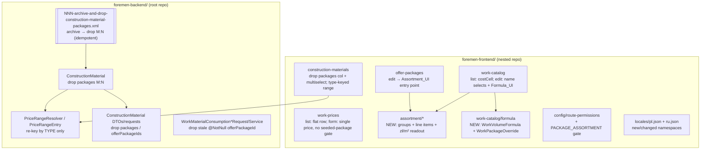

# Design Document: FOR-05-04-UI — Estimate packages UI alignment & material-side collapse
# Design Document: FOR-05-04-UI — Estimate packages UI alignment & material-side collapse

## Overview

FOR-05-04-UI is the **UI/alignment follow-up** to the backend-only spec
`FOR-05-04-estimate-packages-changes`. That backend spec already shipped (verified against the
live code: `WorkPriceDtoModel`, `WorkItemDtoModel.costCell`, the `AssortmentGroup` /
`AssortmentLineItem` / `WorkVolumeFormula` / `WorkPackageOverride` entities, their controllers,
and the `PACKAGE_ASSORTMENT` seed changeset `089` are all present). It changed the API contracts
but left four frontend screens stale or broken and left **one** genuine backend package binding
un-collapsed on the material side.

This spec has two jobs:

1. **Frontend alignment (R1–R4, R6, R7, R8).** Re-align four existing screens to the collapsed
   contracts and add three new UIs:
   - **Works catalog list** — render the single `costCell` (labour price + construction/finishing
     money ranges), drop the per-package pivot columns (R1).
   - **Work-item edit** — show the work-category / unit selection by name, not `#<id>` (R2).
   - **Prices list + form** — render the flat single-price `WorkPriceDtoModel`; fix the form that
     hangs on `useSeededPackages` and submit the flat `{workItemId, currencyId, netPrice}` (R3, R4).
   - **Construction materials** — drop the packages column + multi-select; key the price-range
     column by material **type** only (R5, frontend half).
   - **Assortment UI** — new CRUD for `AssortmentGroup` / `AssortmentLineItem` grouped by group,
     plus the computed zł/m² readout, reachable from the offer-package edit context (R6).
   - **Formula UI** — new work-item-edit surface for the default volume formula and per-package
     membership + override formula, translating the five backend formula error keys (R7).

2. **Deferred backend material-side collapse (R5, backend half).** Genuinely remove the package
   dimension from the material side, mirroring FOR-05-04's archive-before-drop + MAX-collapse
   pattern. **A precise reading of the current code narrows this to exactly two edits** (see the
   note below):
   - **`ConstructionMaterial`** still carries the `construction_material_packages` M:N binding and
     its `PriceRangeResolver` / `PriceRangeEntry` are keyed by `(offerPackageId, typeId)`. This is
     the real remaining collapse (R5.1–R5.4, R5.7).
   - **`WorkMaterialConsumption`** was *already* collapsed at the schema level by changeset
     `084-collapse-work-material-consumptions-package.xml` (the entity has **no** `offerPackage`
     field, and `offer_package_id` is dropped). What remains is the **stale `@NotNull
     offerPackageId`** still sitting on `WorkMaterialConsumptionCreateRequest` and its
     service/model validation — a dead required field that must be removed to honour R5.6's
     "no longer bound to packages" intent on the write path (R5.5, R5.6).

> **Grounding note (deviation from the requirements' stated context).** R5's "Context (backend)"
> says `WorkMaterialConsumption` "still carries an `offer_package_id` FK". The current code shows
> that FK was **already** dropped by changeset `084`; only the create-DTO/validation still names
> `offerPackageId`. This design implements the *actual* remaining delta rather than re-dropping a
> column that is gone, so the migration for the consumption side is a no-op DDL guard and the real
> change is removing the dead DTO field. The construction-material M:N is the one true schema drop.

**Notation.** Frontend in TypeScript/React (Vite, react-hook-form + zod, TanStack Query, the
shared `DataTable` and `AsyncEntitySelect`), matching the repo. Backend in Java (Spring Boot / JPA
/ MapStruct / Liquibase). This is predominantly a UI spec; the backend delta is a small migration
+ resolver re-key.

---

## Architecture

Two repositories are touched (per `.kiro/steering/git-repo-structure.md`): the **frontend** delta
lives entirely in the nested `foremen-frontend/` repo, the **backend + spec** delta in the root
repo. A single logical change here (the material collapse) needs a commit in **each** repo.



**Key architectural rules**

- **Contract-follows-backend.** Every frontend type in this spec is a mirror of an *already
  shipped* backend DTO (`WorkPriceDtoModel`, `WorkItemDtoModel`/`WorkCostCellDto`,
  `AssortmentGroupDtoModel`, `AssortmentLineItemDtoModel`, `WorkVolumeFormulaDtoModel`,
  `WorkPackageOverrideDtoModel`, `PackageZlM2Response`). The frontend does not invent shapes; it
  deletes the stale pivot/`packages` machinery and mirrors the flat ones.
- **No metadata-pivot dependency.** The stale screens derive per-package columns from a
  `/metadata` pivot descriptor via `useSeededPackages`. Because the collapsed backend emits no
  pivots, all `useSeededPackages` usage, `SeededPackage`/`PivotInfo` types, and the pivot-column
  builders are **removed** (R1.2, R3.4, R4.3). This is what unblocks the prices form's infinite
  skeleton (R4.2): `isLoadingForm` no longer waits on a package list that never arrives.
- **Reuse `AsyncEntitySelect` + `selectedLabel`.** The name-not-id fix (R2) and every new FK field
  (assortment group, offer package, currency, work item, typical product) use the existing
  `AsyncEntitySelect`, seeding `selectedLabel` from the loaded row so edit mode shows a real name
  before the option page loads.
- **Archive before drop, idempotent, once.** The construction-material M:N drop mirrors
  FOR-05-04's changesets `083`/`084`: create a `*_archive` snapshot table, `INSERT … SELECT` the
  binding rows, then drop the M:N — all guarded by `preConditions onFail="MARK_RAN"` so a re-run
  against an already-collapsed database changes nothing (R5.4, R5.9, R8.8, R8.9).
- **Pure resolver re-key.** `PriceRangeResolver` stays a pure, total, deterministic function; only
  its key drops the package axis (`PriceRangeKey(typeId)`). The money-range MIN/MAX math is
  unchanged. This is the one piece of genuinely pure logic worth a property test (see Testing
  Strategy / Correctness Properties).
- **ABAC unchanged for existing screens; `PACKAGE_ASSORTMENT` already seeded.** `WORK_CATALOG`,
  `WORK_PRICES`, `MATERIALS_CONSTRUCTION`, `OFFER_PACKAGES` are pre-existing resources whose routes
  are already gated. `PACKAGE_ASSORTMENT` was seeded by backend changeset `089`; the only ABAC work
  here is a **frontend route/permission gate** for the new Assortment routes (R8.5). No new backend
  managed entity is introduced by this spec, so the entity-creation checklist's seed/annotation
  steps were already satisfied by FOR-05-04.

---

## Components and Interfaces

### Component 1 — Works catalog list: single cost cell (R1)

**Files:** `work-catalog/types/index.ts`, `work-catalog/components/WorkCatalogList.tsx`,
`work-catalog/api/query-hooks.ts` (remove `useSeededPackages`), delete
`__tests__/WorkCatalogPackageColumn.test.tsx`.

The row DTO is re-typed to mirror `WorkItemDtoModel`:

```typescript
export interface MoneyRangeDto { min: number; max: number }            // never null; 0..0 when empty
export interface WorkCostCellDto {
  labourPrice: number | null                                            // null ⇒ unpriced (R1.3)
  construction: MoneyRangeDto
  finishing: MoneyRangeDto
}
export interface WorkItemDto {
  id: number
  workCategoryId: number; workCategoryName: string
  unitId: number; unitName: string
  name: string; code?: string | null; active: boolean
  costCell: WorkCostCellDto                                             // replaces packagePivot (R1.1)
}
```

**Responsibilities**
- Replace the dynamic per-package pivot columns with **three static columns** in the same list row:
  `labourPrice`, `construction` range, `finishing` range, all read from `row.costCell` (R1.1, R1.5).
- `labourPrice == null` → the localized empty placeholder (R1.3). A `0..0` range renders literally
  as `0..0` (R1.4) — the range formatter used here must **not** collapse `0..0` to a single `0`;
  it renders `min` and `max` joined even when equal-and-zero, so the requirement's `0..0` is
  explicit. (Contrast the current `formatRange`, which collapses `min===max` to a single value; the
  new formatter special-cases the requirement's `0..0` display.)
- Remove `packagePivot`, `WorkCatalogPackageCellDto`, `SeededPackage`, `PivotInfo`,
  `useSeededPackages`, and `buildColumns`'s pivot loop (R1.2). The `WorkMaterialConsumptionDrillIn`
  wiring keyed by `offerPackageId` is removed with the pivot cells; drill-in is out of scope for
  this alignment.

### Component 2 — Work-item edit: name-not-id selects (R2)

**Files:** `work-catalog/components/WorkItemFormSheet.tsx`, `work-catalog/types/index.ts`.

`WorkItemExtendedDto` is flat FK ids with no names, and the current form passes no `selectedLabel`
to `AsyncEntitySelect`, so a closed select shows `#<id>`. The **design decision** (the requirement
leaves the mechanism open) is to **seed `selectedLabel` from the list row** rather than widen the
backend extended DTO:

- The list already carries the server-resolved `workCategoryName` and `unitName` on `WorkItemDto`.
- The page passes the clicked row's `workCategoryName` / `unitName` into `WorkItemFormSheet` as
  `initialWorkCategoryLabel` / `initialUnitLabel`, which are forwarded to the two
  `AsyncEntitySelect`s as `selectedLabel`.
- `AsyncEntitySelect` already caches `selectedLabel` for the current value and renders it while the
  popover is closed (R2.1, R2.2, R2.3), falling back to the loaded option name once the popover
  opens.

This keeps the backend DTO untouched (no new `workCategoryName`/`unitName` fields on the extended
model) and reuses the exact `selectedLabel` contract the component already exposes. When the form is
opened for a work item not launched from a visible row (edge case), the label is momentarily `#<id>`
until the option loads — acceptable and self-healing.

### Component 3 — Prices list: flat row (R3)

**Files:** `work-prices/types/index.ts`, `work-prices/components/WorkPricesList.tsx`,
`work-prices/api/query-hooks.ts` (remove `useSeededPackages`).

Re-typed to mirror `WorkPriceDtoModel`:

```typescript
export interface WorkPriceDto {
  id: number
  workItemId: number; workItemName: string
  currencyId: number; currencyCode: string
  netPrice: number
}
```

**Responsibilities**
- Three columns: `workItemName`, `currencyCode`, `netPrice` (R3.1, R3.2, R3.3).
- Remove the pivot-column builder, `PackagePriceDto`, `SeededPackage`, `PivotInfo`, and
  `useSeededPackages` (R3.4).

### Component 4 — Prices form: single-price, no hang (R4)

**Files:** `work-prices/components/WorkPriceFormSheet.tsx`, `work-prices/types/index.ts`,
`work-prices/schemas/work-price-schema.ts`, `work-prices/api/*`.

Re-typed to mirror the flat contract:

```typescript
export interface WorkPriceExtendedDto {                                // GET /api/work-prices/{id}
  id: number; workItemId: number; workItemName?: string
  currencyId: number; currencyCode?: string; netPrice: number
}
export interface WorkPriceCreateRequest { workItemId: number; currencyId: number; netPrice: number }
export type WorkPriceUpdateRequest = WorkPriceCreateRequest
```

**Responsibilities**
- Present **three fields**: a work-item `AsyncEntitySelect` (`/api/work-items`), a currency
  `AsyncEntitySelect` (`/api/currencies`, `sort=code,asc`), and a `netPrice` numeric input (R4.1).
- **Remove the `useFieldArray` package rows, `useSeededPackages`, and the
  `|| packages.length === 0` clause from `isLoadingForm`** — the form no longer waits on
  package-derived data, so it resolves and never sticks in the skeleton (R4.2, R4.3).
- Edit mode prefills `workItemId` / `currencyId` / `netPrice` from `WorkPriceExtendedDto` and seeds
  the two selects' `selectedLabel` from `workItemName` / `currencyCode` (R4.2).
- Submit sends the flat `{ workItemId, currencyId, netPrice }`; no `packagePrices` (R4.4, R4.5).
- The zod schema validates `workItemId >= 1`, `currencyId >= 1`, `netPrice` within
  `[0, 9_999_999_999.99]`.

### Component 5 — Construction materials: drop the package dimension (R5, frontend)

**Files:** `construction-materials/types/index.ts`,
`construction-materials/components/ConstructionMaterialsList.tsx`,
`construction-materials/components/ConstructionMaterialFormSheet.tsx`,
`construction-materials/schemas/construction-material-schema.ts`, delete
`components/PackagesMultiSelect.tsx`.

**Responsibilities**
- Remove the `packages` column from the list and the `PackagesMultiSelect` from the form (R5.1,
  R5.2). Drop `packages`/`offerPackageIds` from the DTOs, the create/update requests, and the zod
  schema's `offerPackageIds` field (which currently requires `min(1)`).
- Re-type `PriceRangeEntry` to the type-only key and render the computed range keyed by the row's
  **own `type`** only — one range per row, no per-package fan-out (R5.3):

```typescript
export interface PriceRangeEntry { constructionMaterialTypeId: number; min: number | null; max: number | null }
```

- `ConstructionMaterialDto.priceRanges` becomes a single entry (or the row picks the entry whose
  `constructionMaterialTypeId === row.type.id`); `renderPriceRanges` drops the `row.packages.map`
  loop.

### Component 6 — Construction-material backend collapse (R5, backend)

**Files:** new Liquibase changeset `NNN-archive-and-drop-construction-material-packages.xml`
(registered **last** in `changelog.xml`), `ConstructionMaterialEntity`, `PriceRangeResolver`,
`PriceRangeEntry`, `ConstructionMaterialDtoModel` / `…DtoExtendedModel`,
`ConstructionMaterialCreateRequest` / `…UpdateRequest`, `ConstructionMaterialControllerMapper` /
service mapper, `WorkMaterialConsumptionCreateRequest` / `…UpdateRequest` /
`WorkMaterialConsumptionService` (+ service model).

**Responsibilities**
- **Migration (archive-before-drop, idempotent).** One changeset with two `<changeSet>`s:
  1. Create `construction_material_packages_archive` (columns `construction_material_id`,
     `offer_package_id`, `archived_at`); `INSERT … SELECT * , now()` from
     `construction_material_packages`. Guard with `preConditions onFail="MARK_RAN"` /
     `sqlCheck expectedResult="0"` on the archive table's existence so a re-run inserts nothing
     (R5.4, R5.9, R8.8, R8.9).
  2. Drop the `construction_material_packages` join table (and its FKs). Guard with a precondition
     on the table's existence so a re-run drops nothing.
  There is **no** `offer_package_id` drop for `work_material_consumptions` here — changeset `084`
  already did it; a re-run of that changeset is already a no-op (R5.5, R5.6 are satisfied at the
  schema level, so this migration only touches the CM M:N).
- **Entity.** Remove the `packages` `@ManyToMany` from `ConstructionMaterialEntity`.
- **Resolver re-key.** `PriceRangeResolver.PriceRangeKey` becomes `record PriceRangeKey(Long
  constructionMaterialTypeId)`; `compute` folds MIN/MAX per **type** across all active,
  `retailNet`-non-null materials of that type — no package fan-out (R5.7). `rangeFor(materials,
  typeId)` drops the `packageId` param. No fabricated fallback: an empty bucket stays
  `PriceRange(null, null)` (R5.7).
- **DTO/request cleanup.** Drop `packages`/`offerPackageIds` from `ConstructionMaterialDtoModel`,
  `…DtoExtendedModel`, `ConstructionMaterialCreateRequest`/`…UpdateRequest` (remove `@NotEmpty
  Set<Long> offerPackageIds`), and re-key `PriceRangeEntry` to `(constructionMaterialTypeId, min,
  max)` (R5.3, R5.7). The work-item `costCell` construction/finishing ranges are already computed
  per work item by `WorkCatalogAggregationResolver` (R5.8) — no change needed there beyond
  confirming it no longer reads the CM package set.
- **Consumption write-path cleanup.** Remove the `@NotNull offerPackageId` from
  `WorkMaterialConsumptionCreateRequest`/`…UpdateRequest`, its `requirePresent`/`requireExisting`
  checks and the `OfferPackageDao` dependency in `WorkMaterialConsumptionService`, and the
  `offerPackageId` field on the service/extended model (R5.6). The entity already has no such field.

### Component 7 — Assortment UI (R6)

**New feature folder** `foremen-frontend/src/features/assortment/` mirroring the existing
feature layout (`types/`, `api/{assortment-api,query-hooks,mutation-hooks}.ts`, `schemas/`,
`components/`, a page). Two managed entities plus one computed readout, all under ABAC resource
`PACKAGE_ASSORTMENT`.

Types mirror the shipped backend DTOs exactly:

```typescript
export interface AssortmentGroupDto { id: number; name: string; sortOrder: number | null }
export interface AssortmentGroupExtendedDto { id: number; nameRU: string; namePL: string; sortOrder: number | null }
export interface AssortmentLineItemDto {
  id: number
  assortmentGroupId: number; assortmentGroupName: string
  offerPackageId: number; offerPackageName: string
  name: string
  minPrice: number | null; avgPrice: number | null; maxPrice: number | null
  // reference quantity is now a per-GROUP value (referenceQty/referenceUnit on
  // AssortmentGroup); the line item no longer carries a per-line quantity (R6.2)
  typicalProductId: number | null; typicalProductName: string | null   // provenance only (R6.4)
}
export interface AssortmentLineItemCreateRequest {
  assortmentGroupId: number; offerPackageId: number
  nameRU: string; namePL: string
  minPrice?: number | null; avgPrice?: number | null; maxPrice?: number | null
  typicalProductId?: number | null
}
export interface PackageZlM2Response { value: number }
```

**Endpoints (all shipped):** `/api/assortment-groups` (CRUD), `/api/assortment-line-items` (CRUD),
`GET /api/assortment-line-items/package-zl-m2?packageCode={code}` (readout).

**Responsibilities**
- Full CRUD for groups (`nameRU`, `namePL`, `sortOrder`) and line items (the fields above), using
  the shared `DataTable` + Sheet form pattern (R6.1, R6.2). The line-item form uses
  `AsyncEntitySelect` for `assortmentGroupId`, `offerPackageId`, and the optional
  `typicalProductId`, seeding `selectedLabel` from the row's resolved names.
- Present line items **grouped by their `AssortmentGroup`** — the list view groups rows under a
  group header (sorted by `sortOrder`, then name), reading `assortmentGroupName` off each row
  (R6.3).
- Render `typicalProductName` as a **provenance label only** — never an input that changes
  min/avg/max, and never sent as anything but the optional `typicalProductId` FK (R6.4).
- **zł/m² readout.** A component that calls `package-zl-m2?packageCode={code}` via TanStack Query
  and renders `value`. It is **not** multiplied by floor area (R6.8). To satisfy R6.6 (recompute,
  never cached), the query uses a query key that includes the package code and is **invalidated on
  every assortment mutation** (`onSuccess` of any line-item/group create/update/delete invalidates
  `['package-zl-m2']`), and `staleTime: 0`, so a re-view after data change refetches the recomputed
  value rather than a cached one.
- **Entry point (R6.7).** The Assortment_UI is reachable from the offer-package edit context: the
  `OfferPackageFormSheet` (edit mode) gains a "Manage assortment / view zł/m²" action that navigates
  to the assortment route pre-filtered/scoped to that package's `code`, and the zł/m² readout for
  that package is shown inline in the edit sheet.

### Component 8 — Formula UI (R7)

**New surface embedded in the work-item edit flow** (`work-catalog/components/`), backed by two
shipped controllers under resource `WORK_CATALOG`.

Types mirror the shipped DTOs:

```typescript
export interface WorkVolumeFormulaDto { id: number; workItemId: number; workItemName: string; sourceText: string }
export interface WorkVolumeFormulaCreateRequest { workItemId: number; sourceText: string }
export interface WorkPackageOverrideDto {
  id: number; workItemId: number; workItemName: string
  offerPackageId: number; offerPackageName: string
  member: boolean; overrideSourceText: string | null                   // no price (R7.4)
}
export interface WorkPackageOverrideCreateRequest {
  workItemId: number; offerPackageId: number; member: boolean; overrideSourceText?: string | null
}
```

**Endpoints (shipped):** `/api/work-volume-formulas` (CRUD, one default per work item),
`/api/work-package-overrides` (CRUD, unique `(workItem, offerPackage)`).

**Responsibilities**
- In the work-item edit flow, let the user view/create/edit the work's **default volume formula**
  as free `sourceText` over the 14 room dimensions and cross-work references (R7.1). The AST is
  derived and validated server-side; the UI only sends `sourceText`.
- Let the user view/edit the **per-package membership + override formula**: one row per offer
  package with a `member` toggle and an `overrideSourceText` field, no price field anywhere (R7.2,
  R7.4).
- **Present-override-implies-member (R7.3).** When the user enters an `overrideSourceText`, the UI
  forces `member = true` (and disables un-checking it while text is present) so the submitted pair
  is always a member — matching the backend's "present override implies member" rule.
- **Formula error translation (R7.5–R7.10).** On a rejected submit, map the backend error key to
  its localized message and show it inline. The five keys are already in the backend bundles
  (`error.formula.unknown.variable`, `error.formula.unknown.work.reference`,
  `error.formula.illegal.operator`, `error.formula.cycle`, `error.formula.division.by.zero`). The
  backend already returns a **localized message** for these; the UI displays the server message and
  **never surfaces the raw key** (R7.10). The frontend locale files add matching entries under a
  `formulaErrors` namespace as a fallback for any key surfaced without a server message, so a raw
  key is never shown.

### Component 9 — Route gating & entry points (R8)

**Files:** `config/route-permissions.ts`, `config/navigation.ts`, `app/router.tsx`.

- Add the new assortment route(s) (e.g. `/assortment` and/or a package-scoped variant) to `extra`
  in `route-permissions.ts` with `{ resource: 'PACKAGE_ASSORTMENT', operation: 'READ' }` so a user
  lacking that grant is redirected to `/403` (R8.5). The existing gates for `WORK_CATALOG`,
  `WORK_PRICES`, `MATERIALS_CONSTRUCTION`, `OFFER_PACKAGES` are unchanged and continue to satisfy
  R8.1–R8.4.
- The Formula_UI adds no new route (it lives inside the already-gated `/catalog/works` edit flow,
  resource `WORK_CATALOG`).

---

## Data Models

All frontend types above are structural mirrors of shipped backend records. The backend deltas:

### Backend entity / DTO changes (R5)

| Artifact | Before | After |
|----------|--------|-------|
| `ConstructionMaterialEntity` | `@ManyToMany Set<OfferPackageEntity> packages` via `construction_material_packages` | field removed |
| `construction_material_packages` (table) | M:N join table | archived → dropped (idempotent) |
| `PriceRangeResolver.PriceRangeKey` | `(offerPackageId, constructionMaterialTypeId)` | `(constructionMaterialTypeId)` |
| `PriceRangeEntry` (DTO) | `(offerPackageId, constructionMaterialTypeId, min, max)` | `(constructionMaterialTypeId, min, max)` |
| `ConstructionMaterialDtoModel` / `…Extended` | includes `List<RefDto> packages` (+ `offerPackageIds`) | `packages`/`offerPackageIds` removed |
| `ConstructionMaterialCreateRequest` / `…Update` | `@NotEmpty Set<Long> offerPackageIds` | field removed |
| `WorkMaterialConsumptionCreateRequest` / `…Update` | `@NotNull Long offerPackageId` (dead) | field removed |
| `WorkMaterialConsumptionService` | validates + resolves `offerPackageId`, injects `OfferPackageDao` | those removed |

### Archive table (R5.4, R8.8)

| Archive table | Snapshots | Extra columns |
|---------------|-----------|---------------|
| `construction_material_packages_archive` | every `construction_material_packages` row pre-drop | `archived_at` |

Append-only, no controller, no ABAC guard — dispute audit only, mirroring FOR-05-04's archive
tables.

### Frontend locale namespaces (R8.6, R8.7)

Flat `pl.json` / `ru.json`, per-feature camelCase namespaces. New/changed keys live under existing
`workCatalog.*`, `workPrices.*`, `constructionMaterials.*`, `offerPackages.*` and new `assortment.*`
and `formulaErrors.*` namespaces. Every new/changed key is added to **both** files (R8.6); the UI
never renders a raw key (R8.7).

### Repo layout (R8.10)

- Frontend source (all of `features/assortment`, the four re-aligned features, `config/*`,
  `locales/*`) commits from **inside `foremen-frontend/`**.
- Backend (migration, entity, resolver, DTOs, service) and the spec commit from the **root repo**.
- The material collapse spans both repos → **two commits, one per repo**.

---

## Correctness Properties

*A property is a characteristic or behavior that should hold true across all valid executions of a
system — a formal statement about what the system should do, the bridge between human-readable
specifications and machine-verifiable correctness guarantees.*

This spec is predominantly UI re-alignment (render/absence assertions), a Liquibase migration
(DDL/data-move), and DTO cleanup — none of which are property-based-testing targets (they are
covered by component/example tests, migration integration tests, and locale-parity checks; see
Testing Strategy). The **one** piece of genuinely pure, input-varying logic that this spec changes
is the `PriceRangeResolver` re-key (R5.7). After the prework reflection, R5.8 (the work-item
cost-cell range depending only on the work item) is verified at the aggregation layer by an
integration test rather than a second property, because it is a consequence of the same "keyed by
type/work, never by package" invariant that the resolver property already asserts. That leaves a
single correctness property.

### Property 1: Construction-material price range is type-keyed, package-independent, unfabricated

**Validates: Requirements 5.3, 5.7**

*For any* set of construction materials, and any construction-material type `T`, the computed price
range for `T` equals `MIN..MAX` of `retailNet` over exactly the materials that are active, have a
non-null `retailNet`, and have `type == T`; it is `null..null` when no such material exists (no
fabricated fallback); and the result is unchanged by any offer-package assignment on those
materials (the range does not depend on, and is not keyed by, any package).

---

## Error Handling

| Scenario | Condition | Handling |
|----------|-----------|----------|
| Prices form edit load | previously hung on `useSeededPackages` | gate removed; form resolves from `WorkPriceExtendedDto` alone (R4.2) |
| Formula rejected — unknown variable | backend 400 `error.formula.unknown.variable` | show server-localized message inline; never the raw key (R7.5, R7.10) |
| Formula rejected — unknown work reference | backend 400 `error.formula.unknown.work.reference` | show localized message (R7.6, R7.10) |
| Formula rejected — illegal operator | backend 400 `error.formula.illegal.operator` | show localized message (R7.7, R7.10) |
| Formula rejected — cycle | backend 409 `error.formula.cycle` | show localized message (R7.8, R7.10) |
| Formula rejected — division by zero | backend 400 `error.formula.division.by.zero` | show localized message (R7.9, R7.10) |
| zł/m² for a package with no line items | endpoint returns `value = 0` | render `0`; never an error (R6.5) |
| Assortment / catalog / prices / CM / offer-package route without READ grant | `PermissionGuard` denies | redirect to `/403` (R8.1–R8.5) |
| Missing/absent locale key | any new/changed string | both `pl.json` and `ru.json` carry the key; a `formulaErrors.*` fallback prevents a raw key ever showing (R8.6, R8.7) |
| CM collapse migration re-run | already-collapsed DB | `onFail="MARK_RAN"` preconditions ⇒ no schema/data change (R5.9, R8.9) |

All backend user-facing messages resolve through the i18n bundle at PL/RU parity; the frontend
mirrors new keys in both locale files.

---

## Testing Strategy

### Property-based testing

**Library: jqwik** (repo standard; e.g. `PriceRangeResolverPropertyTest`,
`PackageZlM2ResolverPropertyTest`). PBT applies to the **one** changed pure function
(`PriceRangeResolver` re-keyed by type). The property test runs **≥ 100 iterations** and is tagged:

```
// Feature: FOR-05-04-UI-estimate-packages-changes,
// Property 1: Construction-material price range is type-keyed, package-independent, unfabricated
```

A single property-based test implements Property 1: generate random collections of construction
materials varying `type`, `retailNet` (including `null`), `active`, and (irrelevant-by-design)
package assignments; assert the type-keyed range equals `MIN..MAX` of qualifying `retailNet`,
`null..null` when none qualify, and is invariant under any change to package assignment.

PBT does **not** apply to the rest of the spec:
- **UI rendering/forms (R1–R4, R6, R7):** component/example tests (React Testing Library),
  including the prices-form "loads without hanging" regression and the flat-payload submit check.
- **Migration mechanics (R5.4, R5.9, R8.8, R8.9):** Liquibase integration tests.
- **Locale parity (R8.6, R8.7):** an automated key-set equality check over `pl.json` / `ru.json`.
- **Route gating (R8.1–R8.5):** guard tests with/without the grant.

### Unit / component testing (frontend)
- **Work-catalog list:** renders `costCell.labourPrice`, construction and finishing ranges as three
  columns; `null` labour → placeholder; a `0..0` range renders literally `0..0`; no pivot columns.
- **Work-item edit selects:** with `selectedLabel` seeded from the row, the closed select shows the
  localized name, not `#<id>`.
- **Prices list:** three columns (work item, currency, net price), no pivot columns.
- **Prices form:** create shows work-item/currency/net-price fields; **edit prefills and leaves the
  skeleton** (regression for R4.2); submit body is exactly `{workItemId, currencyId, netPrice}`.
- **Construction materials:** no packages column, no multi-select; one type-keyed range per row.
- **Assortment:** group + line-item CRUD forms; line items render grouped by group; typical product
  shown as provenance label and never sent as a value field; zł/m² readout shows the endpoint
  `value` and is **not** multiplied by area; a mutation invalidates the readout query so a re-view
  refetches (R6.6).
- **Formula UI:** default-formula and per-package override editors; entering `overrideSourceText`
  forces `member = true`; no price field present; each of the five error keys renders its localized
  message and never the raw key.

### Unit / component testing (backend)
- `PriceRangeResolver`: single type, multiple types, `null` `retailNet` excluded, inactive
  excluded, empty bucket → `null..null` (examples complementing Property 1).
- DTO/request mappers: `ConstructionMaterial*` no longer carry `packages`/`offerPackageIds`;
  `WorkMaterialConsumption*Request` no longer carry `offerPackageId`.

### Integration testing (Testcontainers + Dockerized API for test-cases.md)
- **CM collapse migration:** `construction_material_packages_archive` row count equals the source
  count; the join table is gone; a re-run changes nothing (idempotent — R5.9). The `084` consumption
  changeset re-run is a no-op.
- **Aggregation layer (R5.8):** a work item's `costCell` construction/finishing ranges depend only
  on the work item's consumption norms and type price ranges — unaffected by any offer-package
  assignment (the integration counterpart of Property 1 at the aggregation layer, kept separate to
  avoid a redundant property).
- **Route gating:** each of `WORK_CATALOG`, `WORK_PRICES`, `MATERIALS_CONSTRUCTION`,
  `OFFER_PACKAGES`, `PACKAGE_ASSORTMENT` denies a caller without READ.
- **Assortment end-to-end:** group + line-item CRUD → `package-zl-m2` recomputes from current data
  after a line-item change (R6.6) and is not floor-area-scaled (R6.8).
- **Formula end-to-end:** submit formulas that trigger each of the five error keys; assert the
  localized message is returned (backend side of R7.5–R7.10).

Per `.kiro/steering/test-cases.md`, the spec's `test-cases.md` combines **UI browser-engine
scenarios** (the re-aligned screens, assortment, formula UI) with **API tests against the
Dockerized app** (`http://localhost:8080`, auth under `/api/auth`) for the backend collapse and the
assortment/formula endpoints, with a run-id generator for repeatability; results are MD report
tables.

---

## Dependencies

- **FOR-05-04 (backend)** — the shipped contracts this spec aligns to: `WorkPriceDtoModel`,
  `WorkItemDtoModel`/`WorkCostCellDto`, `AssortmentGroup`/`AssortmentLineItem` +
  `PackageZlM2Response`, `WorkVolumeFormula`/`WorkPackageOverride`, the `PACKAGE_ASSORTMENT` seed
  (changeset `089`), the formula error message keys, and the `084` consumption collapse.
- **Frontend shared infra** — `DataTable`, `AsyncEntitySelect` (`selectedLabel`), `apiRequest`,
  `usePermission`, `PermissionGuard` / `requirementForPath`, the flat `pl.json` / `ru.json` locale
  files.
- **FOR-03-07** — the route→requirement ABAC gate the new assortment route plugs into.
- **`.kiro/steering/git-repo-structure.md`** — the two-repo commit rule (frontend inside
  `foremen-frontend/`, backend + spec in the root repo).

## Out of Scope

- **FOR-05-06** (packages-margins consumer of the zł/m² value) — this spec only exposes the CRUD +
  the compute readout.
- Re-implementing or re-property-testing the backend formula engine or the zł/m² resolver — those
  shipped and were property-tested in FOR-05-04. This spec builds UI over them and performs the
  material-side collapse only.
- The work-catalog consumption **drill-in** (previously reached via a pivot cell) — removed with the
  pivot columns; not reintroduced here.

---

## Addendum — Applied Design (as built, iterative)

> Reflects the design as implemented, layered on the original above. Where it differs, the addendum
> is authoritative; the original is retained for traceability.

### Data model (backend)

- `assortment_groups` — `+ reference_qty NUMERIC(12,4)`, `+ reference_unit VARCHAR(8)` (changeset
  094). The legacy per-line `qty_ref50` was dropped (096).
- `assortment_positions` (changeset 097) — `assortment_group_id` FK (ON DELETE CASCADE),
  `material_type_id` FK NOT NULL (ON DELETE RESTRICT), `sort_order`, `UNIQUE (group, material_type)`.
- `assortment_position_prices` (097) — `assortment_position_id` FK (CASCADE), `offer_package_id` FK
  (RESTRICT), `min_price` / `avg_price` / `max_price` NUMERIC(12,2), `UNIQUE (position, package)`;
  `+ min_qty / avg_qty / max_qty NUMERIC(12,4)` per-band overrides (changeset 101).
- `offer_packages` — `+ zl_m2 NUMERIC(12,2)` denormalized headline cache (changeset 095).
- Migration 098 moved matching line items → positions/prices; 099 archived + dropped
  `assortment_line_items`; 100 seeded groups/positions/prices from the `Materiały pakiety`
  `Zestawienie` sheet. All changesets are idempotent (NOT columnExists / NOT tableExists / sqlCheck +
  MARK_RAN) and registered last in sequence.

### Backend API (`/api/assortment-positions`, `PermissionResource("PACKAGE_ASSORTMENT")`)

- Generic CRUD for `AssortmentPosition` (create/read/update/delete) — create/update carry
  `assortmentGroupId`, `materialTypeId`, `sortOrder`.
- `GET /package-editor?packageCode=` → `PackageAssortmentEditorResponse`: package (code, name,
  persisted `zlM2`), the live min/avg/max TOTAL band, and every group (incl. empty groups) with its
  `referenceQty`/`referenceUnit` and its positions carrying THIS package's prices + per-band qty
  overrides.
- `POST /package-save?packageCode=` → upserts each group's `referenceQty`/`referenceUnit` and each
  position's prices + qty overrides (`≥ 0`; `null` = no override), recomputes and persists the MAX
  headline into `offer_packages.zl_m2`.
- `POST /package-clear-qty?packageCode=` (`{ positionId, band }`) → nulls one band's qty override in
  place (no-op when no price row exists), recomputes the MAX headline.
- `GET /package-zl-m2?packageCode=` → the recomputed MAX headline value (never cached).
- `AssortmentGroup` CRUD lives at `/api/assortment-groups` (update carries name/sortOrder/qty/unit).

### zł/m² resolver

`PackageZlM2Resolver` is a pure, band-agnostic function: `packageZlM2(Collection<Contribution>)` where
`Contribution(price, quantity)` and the result is `round2( Σ(price × quantity) ÷ 50 )`. The service
resolves each position's effective quantity (override ?? group `referenceQty`) per band before
building contributions; the headline uses the MAX band.

### Frontend (`foremen-frontend`, feature `features/assortment`)

- `AssortmentPage.tsx` — the all-packages editor: fetches every package's editor model
  (`usePackageEditors` via `useQueries`), a multi-package pending store
  (`state/multiPackageEditorStore.ts` over the reused pure `assortmentEditorReducer`), one Save-all,
  Discard, global Undo/Redo, group/position add/edit/delete dialogs, per-package price columns with a
  per-band price input, a dashed qty-override input with a clear (✕) control, and a magnifier opening
  the picker.
- `components/FinishingMaterialPickerDialog.tsx` — embeds the shared `DataTable` (per-target
  `entityKey` `finishing-materials-picker:<typeId>:<pkgId>` + matching React `key` to avoid stale
  cache/closures across cells), pinned by `type.id`/`packages.id`, default sort `retailNet,desc`; row
  select → price-field choice → populate cell.
- `state/zlM2.ts` — client mirror of the resolver: per-position `Σ(price × qty)/50`; `EffectiveGroup`
  carries positions with per-band effective qty; headline = MAX. `state/assortmentEditorStorage.ts`
  widened the position-edit shape to price bands + `<band>Qty`; `assortmentEditorStore.ts` added the
  untracked `DROP_POSITION_FIELD` action used by the clear flow.
- `components/ui/number-input.tsx` — locale-tolerant decimal buffer (comma/dot, preserves mid-typed
  decimals) so numeric parents that store numbers don't clobber entry.
- Locales: new/changed keys under `assortment.editor.*`, `assortment.picker.*`, `common.close`, and
  `finishingMaterials.table.purchasePrice`/`retailGross`, in both `pl.json` and `ru.json`.
- The legacy assortment CRUD components/schema were removed.

### Verification performed

Backend affected test classes run green via `--tests` (resolver property test + service compute/clear
test). Frontend `tsc` clean and the assortment + number-input tests pass. The flows were exercised
end-to-end in the browser and against the Dockerized API (seed, edit, save-all, MAX headline, qty
override incl. 0, clear-in-place, picker filter/sort/select).
