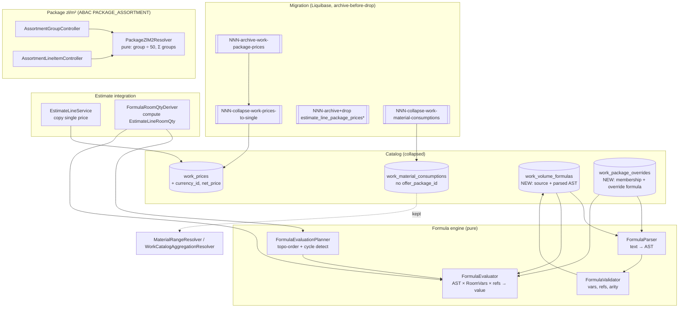

# Design Document: FOR-05-04 — Estimate packages & pricing model change

## Overview

FOR-05-04 is a **migration/deprecation** backend spec. It rewrites the pricing substrate that
FOR-04-12b/12c, FOR-05-03, and FOR-04-19 already shipped (real Liquibase tables, JPA entities,
DAOs, services, CRUD controllers, passing property tests) into a different model, driven by
gaps found once the client's live Excel workbook (`EBRD copy Matrix Foremen v3.0.xlsx`, sheet
`Oferta`; `docs/Materiały pakiety.xlsx`, sheet `Zestawienie`) was analysed in full.

The spec has five coupled but separable deliverables:

1. **Single work price** (R1). A work's catalog price collapses from one price *per package*
   (`WorkPrice` aggregator + `WorkPackagePrice` children + `EffectivePriceResolver` MAX-fallback)
   to exactly one `(workItem, currency, netPrice)` row. No `validFrom`/`validTo` (temporal
   resolution stays with `ProjectServicePrice`, FOR-05-14). The read path returns the single
   price directly — no effective-price resolution step.
2. **Formula engine** (R2, R3). A `WorkItem` may carry a **default volume formula**: a
   human-readable expression over the 14 FOR-05-02 room dimensions as named variables, with
   arithmetic, parentheses, simple conditionals, constants, and **cross-work references** to
   another work's computed volume/presence in the *same room*. Formulas are parsed to a
   validated AST, evaluated in a **deterministic topological order**, with **cycle detection at
   save time**.
3. **Package membership & override formulas** (R4). A `(WorkItem, OfferPackage)` pair may carry
   a membership flag + an optional **package override formula** (sourced from `Oferta!AL:AN`),
   replacing the retired per-package *price* row as the "this work behaves differently in
   package X" mechanism. It carries no price.
4. **Estimate line integration** (R5). `EstimateLine.unitPrice` is copied from the single work
   price; where a formula applies, per-room quantity is **computed** rather than hand-entered,
   with the derivation traceable.
5. **Package zł/m² pricing model** (R6). A curated, twice-yearly-reviewed assortment of
   finishing/fixture line items (min/avg/max price × quantity against a 50 m² reference
   apartment) computes an average zł/m² per `OfferPackage`, mirroring `Zestawienie`, with an
   assistive "typical product" link that never drives the computed value.

Alongside those, R7 collapses `WorkMaterialConsumption`'s `offer_package_id` dimension using the
**same MAX rule** while **keeping** the norm-based computation (`MaterialRangeResolver`,
`WorkCatalogAggregationResolver`), and R8 defines the **migration/retirement mechanics** —
archive-before-drop, MAX-collapse, entity/table/controller removals, and a hard **block** on
FOR-05-06 until the open reconciliation question (R8.7) is resolved.

This design honours the FOR-05-03 **"copy, never bind / provenance FK never drives value"**
contract and the `.kiro/steering/entity-creation-rules.md` ABAC checklist for every new managed
entity.

**Notation.** Backend, API-only. Interfaces/entities/DTOs shown in Java (Spring Boot / JPA /
MapStruct, matching the repo); algorithms in structured pseudocode (```pascal```), consistent
with FOR-05-03's design.

---

## Architecture

FOR-05-04 touches four verticals: it **collapses** two existing catalog tables (`work_prices`
family, `work_material_consumptions`), **retires** one project-side vertical
(`estimate_line_package_prices` family), **adds** the formula engine and the package override
table, and **adds** the package zł/m² assortment vertical (a new ABAC resource
`PACKAGE_ASSORTMENT`).



**Key architectural rules**

- **Collapse vs. retire vs. keep** (R8.2) is explicit:
  - `work_prices`/`work_package_prices` — **collapse** to a single price on `work_prices`
    (`currency_id`, `net_price` move up; `work_package_prices` dropped).
  - `estimate_line_package_prices` + `estimate_line_package_price_history` — **retire** (drop
    tables + entities + services + DAOs + the `/api/estimate-line-package-prices` controller).
  - `work_material_consumptions` — **keep** the table/entity/resolvers; only **drop
    `offer_package_id`** and MAX-collapse rows.
- **Archive before drop** (R8.4). Every destructive migration first copies the retired rows into
  an `*_archive` table (with the resolution rule recorded) so a dispute can be checked against
  the original per-package figures. No rows are deleted without a trace.
- **MAX-collapse is one documented rule** (R1.5, R7.3, R8.3), reused from the *value* of
  `EffectivePriceResolver` (a pure function) but **not** kept on the read path (R1.3, R8.5).
- **Formula engine is pure.** Parse/validate/evaluate/plan are stateless, deterministic, side-effect
  free — the property-test targets. Persistence stores **both** the source text (edit/audit) and a
  validated parsed form (repeated evaluation without re-parsing, R2.6).
- **Cycle detection at save time** (R3.3): a circular reference is rejected on the write that
  would introduce it — never persisted, never surfaced only at evaluation time.
- **New managed entities** (`WorkPackageOverride`, `AssortmentGroup`, `AssortmentLineItem`) ride
  the generic `AdminController`/`AdminService` framework and are wired into ABAC per the
  entity-creation checklist (§ABAC). `WorkVolumeFormula` is modelled as an owned extension of the
  `WORK_ITEMS` catalog resource, not a standalone resource (see §ABAC for the rationale).

---

## Components and Interfaces

### Component 1: Single work price (`WorkPriceEntity` collapsed)

**Purpose**: reinstate the FOR-04-12-shaped single price on the existing `WorkPriceEntity`,
retiring `WorkPackagePriceEntity` and `EffectivePriceResolver` as the read source.

The existing `WorkPriceEntity` is a per-work aggregator (`workItem` UNIQUE) holding a list of
`WorkPackagePriceEntity` children (`offerPackage`, `currency`, `netPrice`). After collapse it
carries the price directly:

```java
@Entity @Table(name = "work_prices")
public class WorkPriceEntity extends BaseEntity {
    @ManyToOne(optional = false) @JoinColumn(name = "work_item_id", unique = true)
    private WorkItemEntity workItem;                 // one price per work (R1.1)

    @ManyToOne(optional = false) @JoinColumn(name = "currency_id")
    private CurrencyEntity currency;                 // moved up from WorkPackagePrice

    @Column(name = "net_price", nullable = false)
    private BigDecimal netPrice;                      // moved up; single price (R1.1)
    // packagePrices list REMOVED (R1.4)
    // NO validFrom/validTo (R1.2)
}
```

**Responsibilities**
- Expose one `(workItem, currency, netPrice)` per work; the read path returns it directly with
  no MAX-fallback (R1.3). `WorkPriceService`/`WorkPriceController` (resource `WORK_PRICES`) stay
  but drop the per-package sub-resource.
- `WorkPackagePriceEntity`, its DAO, and any per-package price sub-controller are **removed**
  (R1.4, R8.2).

### Component 2: Volume formula on a work item (`WorkVolumeFormulaEntity`)

**Purpose**: carry a work's optional default volume formula as **source text + parsed AST** (R2.1,
R2.6), owned by the work catalog.

```java
@Entity @Table(name = "work_volume_formulas")
public class WorkVolumeFormulaEntity extends BaseEntity {
    @ManyToOne(optional = false) @JoinColumn(name = "work_item_id", unique = true)
    private WorkItemEntity workItem;                 // 0..1 per work (R2.1, R2.5)

    @Column(name = "source_text", nullable = false, columnDefinition = "text")
    private String sourceText;                        // human-readable, for edit/audit (R2.6)

    @JdbcTypeCode(SqlTypes.JSON)
    @Column(name = "parsed_ast", columnDefinition = "jsonb", nullable = false)
    private FormulaAst parsedAst;                      // validated form, no re-parse (R2.6)
}
```

**Responsibilities**
- Validate `sourceText` through `FormulaParser` + `FormulaValidator` on write; persist the AST.
- Absence of a formula ⇒ the estimate falls back to hand-entered `EstimateLineRoomQty` (R2.5,
  R5.4).

### Component 3: Package membership & override formula (`WorkPackageOverrideEntity`)

**Purpose**: mark a `(WorkItem, OfferPackage)` pair as a package member and optionally override
its volume formula, sourced from `Oferta!AL:AN` (R4).

```java
@Entity @Table(name = "work_package_overrides",
    uniqueConstraints = @UniqueConstraint(name = "uk_wpo_work_package",
        columnNames = {"work_item_id", "offer_package_id"}))
public class WorkPackageOverrideEntity extends BaseEntity {
    @ManyToOne(optional = false) @JoinColumn(name = "work_item_id")
    private WorkItemEntity workItem;
    @ManyToOne(optional = false) @JoinColumn(name = "offer_package_id")
    private OfferPackageEntity offerPackage;

    @Column(name = "member", nullable = false)
    private boolean member = true;                    // membership flag (R4.1, R4.2)

    @Column(name = "override_source_text", columnDefinition = "text")
    private String overrideSourceText;                // nullable — flag-only membership allowed

    @JdbcTypeCode(SqlTypes.JSON)
    @Column(name = "override_parsed_ast", columnDefinition = "jsonb")
    private FormulaAst overrideParsedAst;             // nullable; present iff source present
    // NO price (R4.5)
}
```

**Responsibilities**
- A present override formula ⇒ the pair is a **member** and the override (not the default) drives
  volume for that package context (R4.2). Absence of an override ⇒ membership *by this mechanism*
  is not established (R4.3).
- Same operand set as the default formula, including cross-references into another package
  override's resolved value (R4.4). Carries no price (R4.5).

### Component 4: Formula engine (parser / validator / planner / evaluator — pure)

```java
public interface FormulaParser  { FormulaAst parse(String source); }          // R2.3, R2.4, R3.1

public interface FormulaValidator {
    /** vars ⊆ 14 room dims; cross-work refs resolvable; arities/operators legal. */
    void validate(FormulaAst ast, Set<String> knownWorkRefs);                 // R2.2, R2.3, R2.4
}

public interface FormulaEvaluationPlanner {
    /** Deterministic topo order over a room's formula set; throws CycleException. */
    List<WorkRef> planOrder(Map<WorkRef, FormulaAst> roomFormulas);           // R3.2, R3.3, R3.5
}

public interface FormulaEvaluator {
    /** Evaluate one AST against room-dimension vars and already-resolved work volumes. */
    BigDecimal evaluate(FormulaAst ast, RoomVariables vars,
                        Function<WorkRef, BigDecimal> resolvedVolumeOf);      // R3.1, R3.4, R3.5
}
```

**AST node kinds** (persisted as tagged JSON):

| Node | Shape | Source example |
|------|-------|----------------|
| `Const` | `{ "k": "const", "v": 2 }` | `2`, `1.5` |
| `Var` | `{ "k": "var", "name": "wallArea" }` | a room dimension (see §Data Models table) |
| `WorkRef` | `{ "k": "workRef", "ref": "X28", "mode": "volume\|present" }` | `X28`, `AL48` |
| `BinOp` | `{ "k": "op", "op": "+\|-\|*\|/", "l": …, "r": … }` | `X26*2`, `perimeter*ceilingHeight` |
| `Cond` | `{ "k": "ifs", "cases": [{ "when": <cmp>, "then": <expr> }…], "else": <expr>? }` | `IFS(AL33=1,3,AL33=2,6,…)` |
| `Count` | `{ "k": "countif", "subject": <expr>, "cmp": <op>, "value": <expr> }` | `COUNTIF(...)` |

**Responsibilities**
- `parse` accepts the `Oferta` arithmetic subset (`+ - * /`, parentheses), `IFS`, and `COUNTIF`
  (R2.3, R2.4); rejects anything outside the grammar.
- `validate` checks every `Var` is one of the 14 dimensions, every `WorkRef` resolves to a known
  work, and operators/arities are legal (R2.2).
- `planOrder` produces a stable topological order so a referencing formula always observes the
  referenced work's already-computed value for the room (R3.2); detects direct/transitive cycles
  and throws (R3.3).
- `evaluate` is a pure function of `(ast, roomVars, resolvedVolumeOf)` — same inputs ⇒ same
  output (R3.5). An unresolved/absent referenced work resolves to **0** (R3.4).

### Component 5: `FormulaRoomQtyDeriver` (estimate integration)

**Purpose**: when a formula applies, compute a line's per-room `EstimateLineRoomQty` instead of
requiring hand entry; keep the derivation traceable (R5.3, R5.5).

```java
@Service
public class FormulaRoomQtyDeriver {
    /**
     * R5.3/R5.5: for a room, resolve every formula-driven work's volume in planned order and
     * return derived quantities + a per-line derivation trace (formula + resolved inputs).
     */
    RoomDerivationResult deriveForRoom(RoomEntity room,
                                       Map<WorkRef, FormulaAst> applicableFormulas);
}
```

**Responsibilities**
- Resolve the estimate's active package context: if a `WorkPackageOverride` with an override
  formula exists for the pair, use it; else use the work's default formula; else no derivation
  (R5.2, R5.3, R4.2).
- Populate `RoomVariables` from the `RoomEntity`'s 14 dimension columns.
- Never create `EstimateLinePackagePrice` rows (retired — R5.2, R8.2).
- Emit a `DerivationTrace(formulaSourceText, resolvedInputs, resolvedValue)` per derived line so a
  reviewer can see why a quantity has its value (R5.5).

### Component 6: Package zł/m² assortment (`AssortmentGroup`, `AssortmentLineItem`, resolver)

```java
@Entity @Table(name = "assortment_groups")
public class AssortmentGroupEntity extends BaseEntity {
    @Column(name = "name_ru") private String nameRU;
    @Column(name = "name_pl") private String namePL;                 // i18n, PL fallback
    @Column(name = "sort_order") private Integer sortOrder;
}

@Entity @Table(name = "assortment_line_items")
public class AssortmentLineItemEntity extends BaseEntity {
    @ManyToOne(optional = false) @JoinColumn(name = "assortment_group_id")
    private AssortmentGroupEntity group;                             // R6.1
    @ManyToOne(optional = false) @JoinColumn(name = "offer_package_id")
    private OfferPackageEntity offerPackage;                         // per-package (R6.2)
    @Column(name = "name_ru") private String nameRU;
    @Column(name = "name_pl") private String namePL;
    @Column(name = "min_price") private BigDecimal minPrice;         // R6.2
    @Column(name = "avg_price") private BigDecimal avgPrice;
    @Column(name = "max_price") private BigDecimal maxPrice;
    @Column(name = "qty_ref50", nullable = false) private BigDecimal qtyRef50; // vs 50 m² (R6.2)

    /** Provenance/assistive FK ONLY — never drives min/avg/max (R6.6, R6.7). */
    @ManyToOne @JoinColumn(name = "typical_material_id")
    private MaterialEntity typicalProduct;                           // nullable, ON DELETE SET NULL
}
```

```java
public interface PackageZlM2Resolver {                               // pure
    /** group contribution = Σ(line total for pkg) ÷ 50 (R6.3). */
    BigDecimal groupContribution(Collection<AssortmentLineItemEntity> groupLines, String pkgCode);
    /** package zł/m² = Σ group contributions for pkg (R6.4). */
    BigDecimal packageZlM2(Collection<AssortmentGroupEntity> groups,
                           Map<Long, List<AssortmentLineItemEntity>> linesByGroup, String pkgCode);
}
```

**Responsibilities**
- Compute per-group `zł/m²` = (Σ line totals for the package) ÷ 50, and per-package zł/m² = Σ
  group contributions (R6.3, R6.4), **recomputed from current data** (never cached stale — R6.5).
- The typical-product FK is assistive only and never gates or drives the computation (R6.6, R6.7).
  Which of `min`/`avg`/`max` × qty forms the "line total" is fixed to **avg** per the `Zestawienie`
  sample (Budget/Standard/Lux ≈ 332/543/1087 zł/m²); min/max are exposed for the review band.
- Expose the computed package zł/m² for the downstream FOR-05-06 consumer, without applying
  `× project_total_floor_area` here (R6.8).

### Component 7: `WorkMaterialConsumption` package-collapse (kept)

`WorkMaterialConsumptionEntity` **keeps** its table, entity, and resolvers; only `offerPackage`
is removed:

```java
// removed: @JoinColumn(name = "offer_package_id") private OfferPackageEntity offerPackage;
// row shape becomes (workItem, materialType, branch, normQty) (R7.2)
```

`WorkCatalogAggregationResolver` and `MaterialRangeResolver` are adjusted to the package-less
shape (drop the `offerPackageId` axis from `BatchKey`/pivot; the money-range math is unchanged).
The 20%-of-work-cost fallback is **not** introduced; a branch is either norm-covered or
explicitly unpriced (R7.5), mirroring FOR-05-03's `unpriced` pattern.

---

## Data Models

All monetary fields are net, `BigDecimal`. i18n text uses `nameRU`/`namePL` with PL fallback.
Entities extend `BaseEntity`.

### Room-dimension variable binding (the 14 formula variables, R2.2)

The formula variables map 1:1 to `RoomEntity` columns (FOR-05-02):

| Variable | RoomEntity field | Oferta / Wymiary label |
|----------|------------------|------------------------|
| `floorArea` | `floorArea` | Pow podloga |
| `wallArea` | `wallArea` | Pow sciany |
| `perimeter` | `perimeter` | Obwód/obrys |
| `doorCount` | `doorCount` | Drzwi ilość |
| `doorHeight` | `doorHeight` | Drzwi wysokość |
| `doorWidth` | `doorWidth` | Drzwi szerokość |
| `doorArea` | `doorArea` | Drzwi powerzchnia |
| `wallGap` | `wallGap` | Brak ściany |
| `finishGap` | `finishGap` | Brak wykończenia |
| `windowHeight` | `windowHeight` | Okno wysokość |
| `windowWidth` | `windowWidth` | Okno szerokość |
| `windowArea` | `windowArea` | Okno powerzchnia |
| `internalCorners` | `internalCorners` | Kąty wewnętrzne |
| `ceilingHeight` | `ceilingHeight` | Wysokość |

A `null` room dimension is treated as `0` at evaluation (matching an empty spreadsheet cell).

### Entity summary

| Entity | Key fields | Scope / `getProjectIdPath()` | Notes |
|--------|-----------|------------------------------|-------|
| `WorkPriceEntity` (`work_prices`) | `workItem` (FK, UNIQUE), `currency` (FK), `netPrice` | not project-scoped (catalog) | **collapsed** (R1). `packagePrices` removed |
| `WorkVolumeFormulaEntity` (`work_volume_formulas`) | `workItem` (FK, UNIQUE), `sourceText`, `parsedAst` (jsonb) | catalog | **new** (R2). 0..1 per work |
| `WorkPackageOverrideEntity` (`work_package_overrides`) | `workItem`, `offerPackage`, `member`, `overrideSourceText?`, `overrideParsedAst?` | catalog | **new** (R4). UNIQUE `(work_item, offer_package)`. No price (R4.5) |
| `AssortmentGroupEntity` (`assortment_groups`) | `nameRU`/`namePL`, `sortOrder` | not project-scoped | **new** (R6.1) |
| `AssortmentLineItemEntity` (`assortment_line_items`) | `group`, `offerPackage`, min/avg/max, `qtyRef50`, `typicalProduct?` | not project-scoped | **new** (R6.2, R6.7). Typical-product FK assistive only |
| `WorkMaterialConsumptionEntity` (`work_material_consumptions`) | `workItem`, `materialType`, `branch`, `normQty` | catalog | **kept**, `offerPackage` dropped (R7.2) |
| `WorkPackagePriceEntity` | — | — | **removed** (R1.4, R8.2) |
| `EstimateLinePackagePriceEntity` / `…HistoryEntity` | — | — | **removed** (R8.2) |

### Archive tables (R8.4)

Each destructive migration writes a plain snapshot table before dropping, carrying the original
row plus the applied resolution rule:

| Archive table | Snapshots | Extra columns |
|---------------|-----------|---------------|
| `work_package_prices_archive` | every `work_package_prices` row | `archived_at`, `resolution_rule='MAX_NETPRICE'` |
| `estimate_line_package_prices_archive` (+ `…_history_archive`) | every retired ELPP / ELPP-history row | `archived_at` |
| `work_material_consumptions_pkg_archive` | every `(work,pkg,type,branch,normQty)` row pre-collapse | `archived_at`, `resolution_rule='MAX_NORMQTY'` |

Archive tables are append-only, not ABAC-guarded (no controller), and exist purely for dispute
audit.

### `EstimateLine` alignment (R5.1)

`EstimateLine.unitPrice` stays the single denormalized snapshot; on create it is copied from the
work's **single** `WorkPrice.netPrice` (R5.1). `EstimateLine.workPrice` stays a provenance FK
(`ON DELETE SET NULL`). No `EstimateLinePackagePrice` rows are created (R5.2).

---

## 6. Low-Level Design — Algorithms & Formal Specifications

### 6.1 MAX-collapse of per-package rows (R1.5, R7.3, R8.3)

```pascal
ALGORITHM collapseToSingle(perPackageRows, valueOf)
INPUT:  perPackageRows — a work item's rows across packages; valueOf — netPrice | normQty
OUTPUT: one surviving value + archived originals
PRECONDITION: perPackageRows non-empty
BEGIN
  archive(perPackageRows, ruleTag)              // R8.4: never drop without a trace
  survivor <- MAX(valueOf(r) FOR r IN perPackageRows)   // R1.5 / R7.3: documented MAX rule
  RETURN survivor
END
POSTCONDITION:
  - survivor = max package value  (equals EffectivePriceResolver's fallback value)
  - every original row is present in the archive with resolution_rule recorded
```

The rule reuses the *value* computed by `EffectivePriceResolver` (a pure, tested fallback) but is
executed as a one-time migration; the resolver is **not** retained on the read path (R8.5).

### 6.2 Parse + validate a formula (R2.2–R2.4, R3.1)

```pascal
ALGORITHM parseAndValidate(sourceText, knownWorkRefs)
BEGIN
  ast <- FormulaParser.parse(sourceText)         // grammar: const, var, workRef, +-*/, (), IFS, COUNTIF
  FOR each node IN ast DO
    IF node is Var  AND node.name NOT IN ROOM_DIMENSION_VARS THEN
      THROW 400 error.formula.unknown.variable
    IF node is WorkRef AND node.ref NOT IN knownWorkRefs THEN
      THROW 400 error.formula.unknown.work.reference
    IF node is BinOp  AND node.op NOT IN {+,-,*,/} THEN
      THROW 400 error.formula.illegal.operator
  END FOR
  RETURN ast
END
```

### 6.3 Plan deterministic evaluation order + cycle detection (R3.2, R3.3, R3.5)

```pascal
ALGORITHM planOrder(roomFormulas)   // roomFormulas: WorkRef -> AST for works present in the room
BEGIN
  graph <- edges { w -> r : r is a WorkRef operand inside roomFormulas[w] AND r IN roomFormulas }
  order <- topologicalSort(graph, tieBreak = ascending WorkRef)   // deterministic (R3.5)
  IF topologicalSort detected a back-edge THEN
    THROW 409 error.formula.cycle(worksInvolved)                  // R3.3: reject the save
  RETURN order
END
POSTCONDITION:
  - for every edge w -> r, r precedes w in order (referenced value already computed, R3.2)
  - order is a pure function of roomFormulas (same set ⇒ same order, R3.5)
```

Cycle detection runs on the **write** that would introduce a reference (a formula edit or a work
addition), so a cycle is never persisted (R3.3). A reference to a work **not present** in the
room is not an edge and resolves to 0 at evaluation (R3.4).

### 6.4 Evaluate a room's formulas (R3.1, R3.4, R3.5)

```pascal
ALGORITHM evaluateRoom(room, roomFormulas)
BEGIN
  vars     <- RoomVariables from room's 14 dimension columns (null -> 0)
  order    <- planOrder(roomFormulas)                      // 6.3
  resolved <- empty map WorkRef -> BigDecimal
  FOR each w IN order DO
    value <- FormulaEvaluator.evaluate(
               roomFormulas[w], vars,
               ref -> resolved.getOrDefault(ref, 0) )       // absent work -> 0 (R3.4)
    resolved[w] <- value
  END FOR
  RETURN resolved
END
POSTCONDITION:
  - evaluating twice with identical inputs yields identical results (R3.5)
```

`evaluate` semantics: `Const`→literal; `Var`→`vars[name]`; `WorkRef(volume)`→`resolvedVolumeOf(ref)`;
`WorkRef(present)`→`resolvedVolumeOf(ref) > 0 ? 1 : 0`; `BinOp`→arithmetic (`/0` → error
`error.formula.division.by.zero`); `Cond(IFS)`→first matching case's `then`, else the `else`
branch or 0; `Count(COUNTIF)`→1 if the comparison holds else 0 (the `Oferta` usage is a boolean
presence test).

### 6.5 Package-context formula selection at line/room derivation (R4.2, R5.2, R5.3)

```pascal
ALGORITHM applicableFormula(workItem, activePackage)
BEGIN
  override <- WorkPackageOverride(workItem, activePackage)
  IF override EXISTS AND override.overrideParsedAst <> null THEN
    RETURN override.overrideParsedAst                        // member override wins (R4.2)
  IF WorkVolumeFormula(workItem) EXISTS THEN
    RETURN WorkVolumeFormula(workItem).parsedAst             // default formula (R5.3)
  RETURN NONE                                                 // fall back to hand entry (R5.4)
END
```

### 6.6 Package zł/m² computation (R6.3, R6.4)

```pascal
ALGORITHM packageZlM2(groups, linesByGroup, pkgCode)
CONSTANT REF_AREA = 50
BEGIN
  total <- 0
  FOR each g IN groups DO
    groupSum <- Σ ( line.avgPrice * line.qtyRef50
                    FOR line IN linesByGroup[g] WHERE line.offerPackage.code = pkgCode )
    total <- total + round2(groupSum / REF_AREA)             // per-group contribution (R6.3)
  END FOR
  RETURN round2(total)                                       // package zł/m² (R6.4)
END
POSTCONDITION:
  - recomputed from current line items every call (no cached total — R6.5)
  - independent of typicalProduct presence (R6.6, R6.7)
```

---

## ABAC — resources & entity-creation checklist (R8, entity-creation-rules)

Per `.kiro/steering/entity-creation-rules.md`, every new **managed** entity is wired into the
permission matrix.

**New managed resources**

- **`PACKAGE_ASSORTMENT`** — guards `AssortmentGroupController` and `AssortmentLineItemController`.
  A new seed changeset (next free number, registered **last** in `changelog.xml`) inserts the
  resource row (idempotent `onFail="MARK_RAN"` / `sqlCheck expectedResult="0"`), then a second
  `<changeSet>` grants ADMIN the CRUD operations on the same guarded resource row. Both controllers
  are annotated `@PermissionResource("PACKAGE_ASSORTMENT")`; inherited CRUD `default` methods carry
  `@PermissionOperation`, completing the `(resource, operation)` pair so startup validation passes.
  These are catalog (global) resources — **not** project-scoped — so their services do **not**
  implement `ProjectScopedService`/`getProjectIdPath()`.

**Owned extensions of existing resources (no new resource code)**

- **`WorkVolumeFormula`** and **`WorkPackageOverride`** are catalog extensions of a work item.
  They are exposed under the existing **`WORK_ITEMS`** resource (annotate their controllers
  `@PermissionResource("WORK_ITEMS")`) rather than minting new resource codes, because they are
  per-work catalog attributes with the same access policy as the work itself. This keeps the
  matrix from fragmenting one logical catalog concern across three resources; it still satisfies
  the checklist (every guarded handler resolves a `(resource, operation)` pair). If a reviewer
  prefers dedicated codes, the alternative is two more `*_resource` seed changesets on the same
  pattern — called out here as the one open ABAC decision.

**Retirement of an existing endpoint (R8.6)**

- The `ESTIMATE`-scoped `EstimateLinePackagePriceController`
  (`/api/estimate-line-package-prices`, incl. `/{id}/history`) is **removed** with its entity, so
  no endpoint points at a dropped table. The `ESTIMATE` resource row itself stays (still used by
  `Estimate`/`EstimateLine`/`EstimateLineRoomQty`).

**Proposed matrix additions**

| Resource | ADMIN | MANAGER | FOREMAN | WORKER | FINANCIER | CLIENT |
|----------|:-----:|:-------:|:-------:|:------:|:---------:|:------:|
| PACKAGE_ASSORTMENT | CRUD | R | R | none | R | none |
| WORK_ITEMS (formula/override handlers) | CRUD | R | R | R | R | none |

`WORK_ITEMS` grants are pre-existing; the formula/override handlers inherit them.

---

## Migration & retirement plan (R8)

Ordered, archive-before-drop Liquibase changesets (next free numbers after `081`, registered in
`changelog.xml`; the resource seed registered **last**). Each is idempotent (`preConditions
onFail="MARK_RAN"`).

1. **Archive + collapse work prices** (R1, R8.1–R8.4)
   - create `work_package_prices_archive`; `INSERT … SELECT` all rows (rule `MAX_NETPRICE`).
   - add `currency_id`, `net_price` to `work_prices`; backfill `net_price =
     (SELECT MAX(net_price) FROM work_package_prices WHERE work_price_id = work_prices.id)` and
     `currency_id` from the winning row's currency.
   - drop `work_package_prices` (and its FK/constraints).
2. **Retire estimate-line per-package price vertical** (R8.2, R8.6)
   - create `estimate_line_package_prices_archive` + `estimate_line_package_price_history_archive`;
     `INSERT … SELECT` all rows.
   - drop `estimate_line_package_prices` and `estimate_line_package_price_history`.
3. **Collapse material consumption package dimension** (R7.2, R7.3, R8.2)
   - create `work_material_consumptions_pkg_archive`; `INSERT … SELECT` all rows (rule
     `MAX_NORMQTY`).
   - dedupe: keep one row per `(work_item, material_type, branch)` with `norm_qty =
     MAX(norm_qty)` across packages; delete the rest.
   - drop `offer_package_id` FK + column.
4. **New tables**: `work_volume_formulas`, `work_package_overrides`, `assortment_groups`,
   `assortment_line_items` (+ FKs; `typical_material_id` FK `ON DELETE SET NULL`).
5. **Seed resource**: `PACKAGE_ASSORTMENT` + ADMIN grant (registered last, idempotent).

**Code removals**: `WorkPackagePriceEntity`/DAO/mapper; `EstimateLinePackagePrice*`
entity/service/DAO/controller/mapper/history; drop the `packagePrices` list on `WorkPriceEntity`.
`EffectivePriceResolver` is removed from the read path; if reused for the migration's MAX rule it
is invoked only from a migration helper, not from `WorkCatalogAggregationResolver` (which switches
to the direct single price). `MaterialRangeResolver`/`WorkCatalogAggregationResolver` keep their
money math, dropping the `offerPackageId` axis.

**FOR-05-06 block (R8.7)** — This spec **does not** decide FOR-05-06's fate. Because FOR-05-06's
data source (`EstimateLinePackagePrice` per-package project price) is retired here, any FOR-05-06
work is **blocked** (not merely warned) until the open question is resolved. Mechanically this is
enforced by leaving FOR-05-06 without an updated design and recording the block in the FOR-05-06
requirements/OVERVIEW; this design assumes option (a) (FOR-05-06 reads the new single price +
package zł/m²) for planning only.

---

## Error Handling

| Scenario | Condition | Response |
|----------|-----------|----------|
| Unknown formula variable | `Var` not in the 14 dimensions | `400 error.formula.unknown.variable` |
| Unknown work reference | `WorkRef` to an unknown work | `400 error.formula.unknown.work.reference` |
| Illegal operator/arity | outside the grammar | `400 error.formula.illegal.operator` |
| Circular reference | cycle detected at save | `409 error.formula.cycle` (lists works) |
| Division by zero | `/0` at evaluation | `400 error.formula.division.by.zero` |
| Migration collapse with no rows | work has no package price/norm | no survivor written; work stays unpriced (no fabrication, R7.5) |
| Assortment computation with no lines | group/package empty | contribution `0`; never an error (R6.3) |
| Orphaned retired endpoint hit | `/api/estimate-line-package-prices` after removal | `404` (route gone) |

All user-facing messages resolve through the i18n bundle at PL/RU parity; no raw key is surfaced.

---

## Testing Strategy

### Property-based testing

PBT **applies** to the formula engine (parser/planner/evaluator — pure functions over a large
input space), the MAX-collapse rule, and the zł/m² resolver. **Library: jqwik** (repo standard;
see FOR-05-03's `EffectivePriceResolverPropertyTest`/`MaterialRangeResolverPropertyTest`). Each
property test runs **≥ 100 iterations** and is tagged `Feature: FOR-05-04-estimate-packages-changes,
Property N: …`, implemented as a single property-based test per property.

PBT does **not** apply to: the Liquibase migration mechanics (integration/DDL — use idempotent
re-run integration tests + archive-count assertions), the CRUD controllers (framework), or the
ABAC seed (startup/seed integration tests).

### Unit testing
- Parser: each grammar node; rejects out-of-grammar input.
- Evaluator: `IFS`/`COUNTIF` branches, absent-work→0, division-by-zero, null-dimension→0.
- `packageZlM2`: single group, multiple groups, empty package, typical-product present vs absent.
- MAX-collapse: single-package, multi-package, tie, empty.

### Integration testing (Testcontainers + Dockerized API for test-cases.md)
- Migrations apply idempotently (re-run inserts/drops nothing); archive tables hold the original
  counts; `work_package_prices`/`estimate_line_package_prices*` gone; `work_material_consumptions`
  has no `offer_package_id` and one row per `(work,type,branch)`.
- Application startup with the retired controller removed and the two new
  `PACKAGE_ASSORTMENT` controllers annotated (no half-annotation failure).
- End-to-end: seed a work + formula + cross-ref → add line (single price copied) → derive room
  quantity from formula → cycle rejected at save → assortment CRUD → package zł/m² recomputed.

Per `.kiro/steering/test-cases.md`, this API-only spec's `test-cases.md` contains API tests
against the Dockerized app (`http://localhost:8080`, auth under `/api/auth`) with a run-id
generator for repeatability; results are MD report tables.

---

## Correctness Properties

*A property is a characteristic or behavior that should hold true across all valid executions of
a system — a formal statement about what the system should do, the bridge between human-readable
specifications and machine-verifiable correctness guarantees.*

### Property 1: MAX-collapse correctness

**Validates: Requirements 1.5, 7.3, 8.3**

*For any* non-empty set of a work item's per-package rows, the surviving collapsed value equals
the MAX of the per-package values, and every original row is present in the archive with its
resolution rule recorded.

### Property 2: Single price read has no fallback

**Validates: Requirements 1.1, 1.3**

*For any* work item with a single work price, reading its price returns exactly that
`(currency, netPrice)` — the result is a pure projection of the one row, independent of any other
work's or package's prices.

### Property 3: Formula parse/validate round-trip

**Validates: Requirements 2.3, 2.4, 2.6**

*For any* formula in the supported grammar, `parse` then serialising the AST and re-loading it
yields an AST that evaluates identically to the original; every accepted AST uses only the 14
dimension variables and known work references.

### Property 4: Deterministic evaluation order respects references

**Validates: Requirements 3.2, 3.5**

*For any* acyclic set of a room's work formulas, `planOrder` places every referenced work before
its referrer, and evaluating the room twice with identical inputs produces identical results.

### Property 5: Cycle rejection at save

**Validates: Requirements 3.3**

*For any* set of room formulas containing a direct or transitive cycle, the planning/save
operation is rejected (cycle error naming the involved works) and no such formula set is persisted.

### Property 6: Absent reference resolves to zero

**Validates: Requirements 3.4**

*For any* formula referencing a work not present in the room (and not part of a cycle), that
reference evaluates to 0 rather than raising an error.

### Property 7: Package override precedence

**Validates: Requirements 4.2, 5.3**

*For any* `(workItem, activePackage)` where a package override formula exists, the applicable
formula is the override (not the default); where only a default exists, it is the default; where
neither exists, no formula-derived quantity is produced (hand entry preserved).

### Property 8: Override carries no price

**Validates: Requirements 4.5**

*For any* `WorkPackageOverride`, the line's `unitPrice` is copied from the single `WorkPrice` and
is independent of the override's presence or content.

### Property 9: Package zł/m² is Σ of group contributions ÷ 50

**Validates: Requirements 6.3, 6.4**

*For any* assortment and package, the package zł/m² equals the sum over groups of
(Σ line avg×qty for the package) ÷ 50, and is recomputed from current data on every call.

### Property 10: Typical product never drives the value

**Validates: Requirements 6.6, 6.7**

*For any* assortment line item, setting or clearing its typical-product FK leaves its min/avg/max
and the resulting zł/m² contribution unchanged; the contribution is computable whether or not the
link exists.

### Property 11: Three-part work cost, no fabricated fallback

**Validates: Requirements 7.4, 7.5**

*For any* work item, its total estimate cost equals single work price + norm-based construction
cost + norm-based finishing cost; a material branch with no norm coverage contributes an explicit
unpriced marker, never a fabricated (e.g. 20%) placeholder.

---

## Dependencies

- **FOR-05-03** `Estimate`/`EstimateLine`/`EstimateLineRoomQty` + the `ESTIMATE` resource
  (retires `EstimateLinePackagePrice*` from it).
- **FOR-04-11** `WorkItem`, **FOR-04-12/12b** `WorkPrice`/`WorkPackagePrice`/`EffectivePriceResolver`
  (collapse source), **FOR-04-19** `WorkMaterialConsumption` + resolvers (package-collapse).
- **FOR-04-10** `OfferPackage` (`budget`/`norm`/`lux` = START/COMFORT/PRESTIGE).
- **FOR-05-02** `Room` (14 dimension columns → formula variables).
- **FOR-04** `Material`/`MaterialType` (typical-product FK; consumption material types),
  `Currency`, `MeasurementUnit`.
- **FOR-01/02/03** CRUD framework, ABAC, `@PermissionResource`/`@PermissionOperation` + startup
  validator, MapStruct + i18n.

---

## §Scope & boundaries (R9)

FOR-05-04 owns the single price, formula engine, package overrides, estimate-line integration, the
package zł/m² assortment, and the migration. Explicitly **out of scope** (owned by siblings):

1. **Margin & package VALUE presentation** (`EstimateLinePackage`, `EstimateLineMargin`) →
   **FOR-05-06**, subject to the R8.7 reconciliation block. No margin/package-value display here
   (R9.1).
2. **Offer/approval** (`Offer`, `OfferDiscount`) → **FOR-05-07** (R9.2).
3. **Contract & e-signature** → **FOR-05-09** (R9.3).
4. **Real cost-of-goods** (actual purchase cost tracking) → deferred to a future spec (R9.4).
5. **Temporal client-price resolution** (`resolveClientPrice`, `ProjectServicePrice` intervals,
   offer price freeze) → **FOR-05-14**; FOR-05-04 changes only the catalog `OFFER_BASE` starting
   point FOR-05-14 reads (R1.2, R9.5).

## Open Questions (carried from requirements, for the review gate)

1. **FOR-05-06 reconciliation (R8.7)** — assumed option (a) for planning; confirm before
   FOR-05-06's requirements phase. Work on FOR-05-06 is blocked until resolved.
2. **MAX migration rule (R1.5/8.3)** — surviving price = MAX across packages; confirm with the
   pricing owner (a work priced differently per package surfaces at its highest price).
3. **Formula authoring surface** — this spec defines the engine; whether admins edit formulas via
   a dedicated UI here or later is left to a UI spec.
4. **Typical-product gating (R6.6/6.7)** — design follows the brief (assistive-only, never gates);
   confirm this over the analysis-pass reading (mandatory placeholder).
5. **New ABAC codes vs. `WORK_ITEMS` reuse** — formula/override handlers are proposed under
   `WORK_ITEMS`; confirm or split into dedicated resource codes.
