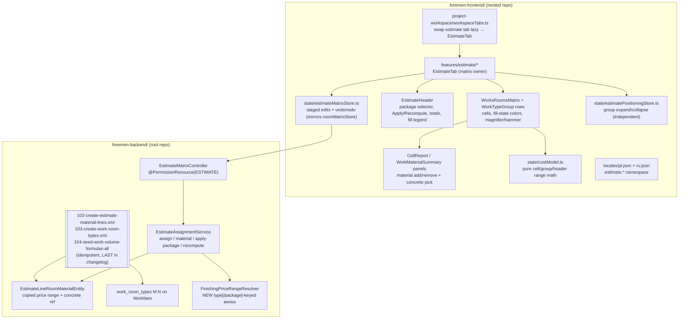
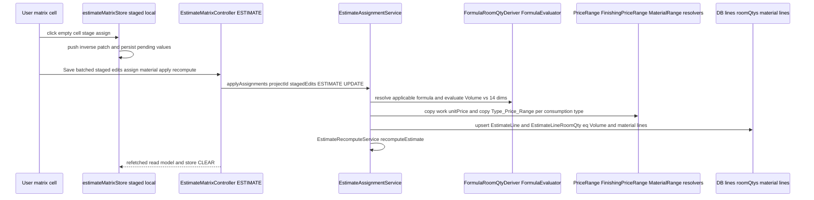
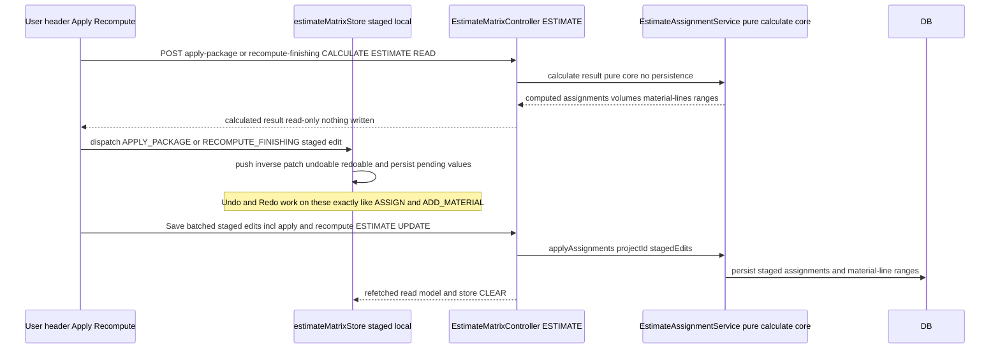

# Design Document: FOR-05-05 — Bill of materials (the Estimate tab)
# Design Document: FOR-05-05 — Bill of materials (the Estimate tab)

## Overview

FOR-05-05 delivers the **Estimate tab** of the project workspace (`/projects/:projectId`, tab
"Смета / Kosztorys") as one full-stack feature: an interactive **works × rooms matrix** that assigns
catalog works to project rooms, derives each cell's **Volume** from the work's volume formula (or a
unit→dimension fallback), computes a **cost range** (labour + all materials) per cell, and lets the
user drill into any cell or work-row to inspect the full price calculation and choose concrete
materials. It absorbs the interactive matrix (was FOR-05-18) and in-tab works assignment (was
FOR-05-19) so the tab is one cohesive deliverable.

The feature is grounded on already-shipped foundations, all verified against the live code:

- The **estimate model** — `EstimateEntity` (1:1 per project, PLN/DRAFT defaults, derived totals),
  `EstimateLineEntity` (a work per estimate with a frozen `unitPrice` snapshot + `workPrice`
  provenance FK + derived `quantity`/`valueNet`), and `EstimateLineRoomQtyEntity` (the per-(line,
  room) volume). `EstimateRecomputeService` derives line `quantity`/`valueNet` and estimate totals in
  place (FOR-05-03).
- The **formula engine** — `FormulaEvaluator` (pure; missing dimension → 0; division-by-zero →
  `400 error.formula.division.by.zero`), `FormulaRoomQtyDeriver` (`resolveApplicableFormula`
  precedence: override AST → default AST → `null`; `deriveForRoom` pure core emitting a
  `DerivationTrace` with source text + resolved inputs + value), `FormulaEvaluationPlanner`
  (topological order; cycle → `409 error.formula.cycle`), and `FormulaValidator` (FOR-05-04).
- The **room 14-dimension model** — `RoomEntity` (`floorArea`, `wallArea`, `perimeter`, `doorCount`,
  `doorHeight`, `doorWidth`, `doorArea`, `wallGap`, `finishGap`, `windowHeight`, `windowWidth`,
  `windowArea`, `internalCorners`, `ceilingHeight`) and `RoomTypeEntity` (FOR-04-14).
- The **material catalogs, norms and resolvers** — `WorkMaterialConsumptionEntity` (one row per
  `(work, material TYPE, branch)`, package-less, carrying `normQty`), `PriceRangeResolver`
  (construction range keyed by type only, pure), `MaterialRangeResolver` (per-work branch money
  ranges, pure static helpers), `MaterialBatchLookup` (loads a type's active/priced `retailNet`s per
  branch), and `PackageZlM2Resolver` (FOR-04-19/20/21, FOR-05-04, FOR-05-04-UI).
- The **assortment model** — `AssortmentPositionEntity` (per group, material-type-backed) and
  `AssortmentPositionPriceEntity` (per position × package, min/avg/max + optional qty overrides), and
  `WorkPackageOverrideEntity` (`member` + optional `overrideParsedAst`) / `OfferPackageEntity`
  (`budget`/`norm`/`lux`, cached `zlM2`) (FOR-05-04, FOR-05-04-UI).

The **one genuinely new pricing primitive** is a **finishing type[/package]-keyed price-range
resolver**: the construction branch already has `PriceRangeResolver`, but finishing has none.
`FinishingMaterialEntity` still carries the `finishing_material_packages` M:N (offer package) and a
`type` (`MaterialType`) + `retailNet` + `active`, which is exactly the data this resolver folds into a
`MIN..MAX retailNet` per finishing type, optionally scoped to a package's membership (R12.5).

The **two genuinely new schema additions** are (1) the estimate's **copied-price material
collection** (a `Material_Line` keyed by `(line, room, branch, material type)`, carrying a frozen
price range + optional concrete-product reference) and (2) an optional **room-type attachment** on a
work (`work_room_types` M:N). Everything else consumes existing tables.

**Notation.** Backend in Java (Spring Boot / JPA / MapStruct / Liquibase / jqwik); frontend in
TypeScript/React (Vite, react-hook-form + zod, TanStack Query, zustand, the shared `DataTable` /
`AsyncEntitySelect`, `lucide-react`, i18next). The staging/undo-redo half is modelled directly on the
shipped FOR-05-02 `roomMatrixStore` pattern.

---

## Architecture

Two repositories are touched (per `.kiro/steering/git-repo-structure.md`): the **backend + migrations
+ spec** live in the root repo; the **frontend** lives in the nested `foremen-frontend/` repo. This
feature spans both, so it needs a commit in **each** repo.



### Key architectural rules

- **Snapshot / frozen prices (R13).** The estimate owns frozen copies. Labour is copied to
  `EstimateLine.unitPrice` with the `workPrice` provenance FK (already shipped). Materials are copied
  as a **collection keyed by `(line, room, branch, material type)`** — a new
  `EstimateLineRoomMaterialEntity` carrying `rangeMin`/`rangeMax` (the copied `Type_Price_Range`), a
  provenance FK to the source catalog material that contributed the range, and an optional
  `Concrete_Material` FK. Catalog price edits never retro-mutate these copies (R13.3); the range is
  re-copied only on re-assign or `Recompute_Finishing_Prices`.
- **One Volume per cell (R4).** The cell's Volume is computed **once** by the formula engine
  (`FormulaRoomQtyDeriver.resolveApplicableFormula` → `FormulaEvaluator.evaluate` against the room's
  14 dimensions) and drives BOTH labour (`unitPrice × Volume`) AND every material
  (`normQty × Volume × Type_Price_Range`). There is never a per-material volume. The
  `EstimateLineRoomQty.quantity` IS that Volume.
- **Pure cost math, both server and client.** The cell/group/header range arithmetic is a pure,
  total function. On the backend it composes existing pure resolvers; on the frontend it is a pure
  `costModel.ts` module so the matrix recomputes live from the staged edits + the copied ranges
  without a round-trip. Both sides apply the same "collapse to a point when every material has a
  concrete product" rule.
- **Finishing resolver mirrors the construction one.** `FinishingPriceRangeResolver` is a new pure
  `@Component` shaped exactly like `PriceRangeResolver` (`compute(materials)` →
  `Map<Key, PriceRange>`, `EMPTY = (null, null)`, active + non-null `retailNet` only), except its key
  is `(finishingMaterialTypeId, offerPackageId?)`: the package-scoped variant restricts to materials
  whose `finishing_material_packages` contains the package (R12.5), and the package-less variant folds
  across all packages (the assignment default when no package context).
- **Staging + undo/redo mirrors `roomMatrixStore` (R15).** The client stages every matrix edit in a
  per-project zustand store with a pure self-inverting reducer (`past`/`future` inverse-patch stacks,
  session-scoped), write-through to a project-keyed `localStorage` store for the pending *values*
  (history is not persisted). `Save` commits the whole staged set to the server in one batched write
  and clears the store; `Discard` empties it. **`Apply_Package` and `Recompute_Finishing_Prices` are
  staged, undoable operations, not immediate server writes.** The user's click first obtains the
  *calculated* result — either from a pure, read-only backend **calculate/preview** endpoint that
  returns the resulting assignments / volumes / material-lines / ranges **without persisting
  anything**, or from the client's pure cost model — and then applies that result onto the matrix as
  **staged edits** pushed onto the same `past`/`future` inverse-patch stacks as `ASSIGN` /
  `ADD_MATERIAL` / etc. They are fully **undoable and redoable** within the session and are persisted
  to the server only on the explicit batched `Save`; `Discard` clears them. Nothing is written
  server-side at the moment the user clicks Apply/Recompute (R15.3, R15.6).
- **ABAC unchanged; ESTIMATE already seeded (R19.1).** The `ESTIMATE` resource, its ADMIN CRUD /
  MANAGER CRU / FOREMAN·WORKER·FINANCIER READ grants (changeset `081`), and `@PermissionResource
  ("ESTIMATE")` on the estimate controllers are shipped. New matrix read/write endpoints live on a
  new `@PermissionResource("ESTIMATE")` controller (`@RequiresPermission READ` for reads — including
  the non-persisting `Apply_Package` / `Recompute_Finishing_Prices` **calculate/preview** endpoints —
  and `UPDATE` for the batched `Save` write). The estimate services stay `ProjectScopedService` with
  `getProjectIdPath()` resolving
  to the owning project (e.g. `line.estimate.project.id`), so the per-membership filter applies
  automatically. No **new** managed ABAC resource is introduced (the entity-creation checklist's
  seed/annotation steps were satisfied by FOR-05-03) — the new material-line and room-type tables are
  guarded transitively through `ESTIMATE` (writes) and `WORK_CATALOG` (room-type attachment edits).
- **Idempotent migrations registered last (R19.2).** New Liquibase changesets (`102`+) follow the
  archive/`NOT tableExists`/`onFail="MARK_RAN"` conventions and are appended **last** in
  `changelog.xml` after `101`.

### Request → recompute flow (assign a cell, then Save)

A cell edit (assign / material add-remove / choose concrete) stages locally; **nothing is persisted
until the explicit `Save`**, which commits the whole staged set (including any staged `Apply_Package`
/ `Recompute` results — see the next diagram) in one batched write.



### Apply_Package / Recompute flow (calculate → stage → undoable → Save)

`Apply_Package` and `Recompute_Finishing_Prices` **do not persist** when the user clicks them. They
obtain the calculated result (from a read-only calculate/preview endpoint, or the client's pure cost
model), then apply it as staged, self-inverting edits — so they are undoable/redoable and are written
only through the same batched `Save` as every other staged edit.



---

## Components and Interfaces

### Backend

#### Component B1 — `EstimateLineRoomMaterialEntity` (the copied-price material collection, R13, R6, R4)

A new JPA entity mapping `estimate_line_room_materials` (changeset `102`). One row per
`(estimate line, room, branch, material type)` — the estimate's **frozen** material copy for a cell.

```java
@Entity @Table(name = "estimate_line_room_materials")
public class EstimateLineRoomMaterialEntity extends BaseEntity {
    @ManyToOne(optional = false) EstimateLineRoomQtyEntity roomQty;      // owner (ON DELETE CASCADE) — R19.3
    @Enumerated(EnumType.STRING)  ConsumptionBranch branch;              // construction | finishing
    // exactly one of the two type FKs is non-null, matching `branch`:
    @ManyToOne ConstructionMaterialTypeEntity constructionType;         // ON DELETE RESTRICT
    @ManyToOne MaterialTypeEntity finishingType;                        // ON DELETE RESTRICT
    BigDecimal normQty;                                                  // copied consumption norm per one work-unit (R4.2)
    BigDecimal rangeMin;                                                 // copied Type_Price_Range min (per one work-unit money band edge — R13.2)
    BigDecimal rangeMax;                                                 // copied Type_Price_Range max
    // provenance (never drives value): the catalog material that contributed the range, and the chosen product:
    @ManyToOne ConstructionMaterialEntity sourceConstructionMaterial;   // ON DELETE SET NULL (R13.2)
    @ManyToOne FinishingMaterialEntity sourceFinishingMaterial;         // ON DELETE SET NULL
    @ManyToOne ConstructionMaterialEntity concreteConstructionMaterial; // ON DELETE SET NULL — Placeholder when null (R6.6)
    @ManyToOne FinishingMaterialEntity concreteFinishingMaterial;       // ON DELETE SET NULL
    BigDecimal concreteNet;                                             // copied chosen product retailNet — collapses the line (R6.4)
}
```

- Keyed by `(roomQty, branch, type)` — DB `UNIQUE (room_qty_id, branch, construction_type_id,
  finishing_type_id)` (R13.4). Owned by `EstimateLineRoomQtyEntity` and cascade-deleted with it and
  with its owning line (R19.3).
- **Placeholder vs concrete (R6.6, R7).** A row with no `concrete*Material` is a **Placeholder**
  (contributes its `rangeMin..rangeMax`). A row with a concrete product contributes its `concreteNet`
  as a point (`min == max`), collapsing the cell (R6.4). `Fill_State` of a cell = fully filled (all
  rows concrete) / partial (some) / placeholder-only (none) (R8.1).

#### Component B2 — `work_room_types` attachment (R10)

An optional M:N `work_room_types(work_item_id, room_type_id)` (changeset `103`) exposed as
`Set<RoomTypeEntity> roomTypes` on `WorkItemEntity`. Empty ⇒ the work attaches to **all** rooms on
apply (R10.3); non-empty ⇒ only rooms whose type is in the set (R10.2). It governs *which rooms a
work attaches to on apply*, never *how* Volume is computed (R10.4) — the formula stays independent.
Editing the attachment is a `WORK_CATALOG` catalog-admin concern (a small write on the work-item edit
surface), not an estimate write.

**Work Catalog Room_Type_Attachment editor (R10.5).** The attachment is viewed and edited from the
Work Catalog edit form (`/catalog/works`, edit mode) via two custom handlers on the shipped
`WorkItemController` (class `@PermissionResource("WORK_CATALOG")`; no new ABAC resource / seed
changeset — `work_room_types` and `WORK_CATALOG` are already shipped):

- `GET /api/work-items/{id}/room-types` — method-level `@PermissionOperation("READ")`; returns the
  work item's attached room-type ids as `WorkItemRoomTypesResponse(List<Long> roomTypeIds)`; `404`
  when the work item does not exist.
- `PUT /api/work-items/{id}/room-types` — method-level `@PermissionOperation("UPDATE")`; body
  `WorkItemRoomTypesRequest(List<Long> roomTypeIds)` is a full REPLACE of the attached set: it
  resolves each id via `RoomTypeDao` (`404` on a bad id), sets the `WorkItemEntity.roomTypes`
  collection, saves + flushes, and audits an `UPDATE`; a `null`/empty list clears the attachment
  (attaches to all rooms on apply, R10.3). Returns the resulting id list.

Both method-level `@PermissionOperation`s combine with the class `@PermissionResource("WORK_CATALOG")`
so `PermissionAnnotationValidator` classifies the controller COMPLETE at startup. The service half is
`WorkItemService#getRoomTypeIds`/`setRoomTypeIds` (the write is `@Transactional`).

On the frontend, an edit-mode-only `WorkRoomTypeAttachmentEditor` sub-editor (in
`features/work-catalog/components/`) mirrors the `WorkPackageOverridesEditor` pattern: it loads
`/api/room-types` options via `useReferenceOptions` (sorted `name,asc`, with inline
forbidden/loading/empty states), renders one checkbox row per room type reconciled against the
persisted attached ids (`useWorkItemRoomTypes`), and a single Save button PUTs the checked ids
(`useUpdateWorkItemRoomTypes`, invalidating the room-types query). It is embedded in
`WorkItemFormSheet` alongside `WorkVolumeFormulaEditor` + `WorkPackageOverridesEditor` in the
`mode === 'edit' && itemId != null` block and persists independently (its own Save); a clear hint
states that when no room type is selected the work attaches to all rooms on apply (R10.3). New i18n
lives under `workCatalog.roomTypes.*` in both `pl.json` and `ru.json` (strict parity), reusing
`referenceFilter.noAccess` for the forbidden state.

**Initial Room_Type_Attachment seed (changeset `105`, R10.6).** Changeset `103` creates the empty
`work_room_types` join; changeset `105` **seeds** it meaningfully by WORK CATEGORY → ROOM TYPES
(mapping B), so every work starts attached to the rooms where it is appropriate:

- **Wet works** — every work item whose `work_categories.code ∈ {TILING, PLUMBING_ROUGH,
  PLUMBING_FINISH}` → the wet rooms `{kuchnia, lazienka}`.
- **FLOORS** (parquet/laminate) → the 6 dry rooms `{przedpokoj, hol, salon, biuro, master, pokoj}`
  (excludes kitchen/bathroom).
- **CARPENTRY** (wardrobes/doors) → the same 6 dry living/circulation rooms.
- **All other categories** (`PRELIMINARY, CONSTRUCTIONS_GK, ELECTRICAL_ROUGH, ELECTRICAL_FINISH,
  PLASTERING, PAINTING_DECOR, EXTRAS, OTHER`) → **seeded nothing**: an empty attachment means the
  work attaches to all rooms on apply (R10.3), consistent with the empty-set semantics above.

The changeset is a single set-based seed resolving categories and room types by `code` (never by
hard-coded id), grouped by mapping bucket (wet / floors / carpentry), inserting only the two
join columns (`work_item_id, room_type_id` — `work_room_types` is a pure join table). It is
**non-overwriting + idempotent** (R10.6, R19.2): guarded by `onFail="MARK_RAN"` +
`tableExists(work_room_types)`, and each INSERT seeds a work **only** when it currently has no
attachment rows (`AND NOT EXISTS (SELECT 1 FROM work_room_types wrt WHERE wrt.work_item_id =
wi.id)`), so a work whose attachment was already edited via the B2 editor — or a plain changelog
re-run — is left untouched. Registered **last** in `changelog.xml`, after `104`.

#### Component B3 — `FinishingPriceRangeResolver` (NEW, R12, R3.4, R6.1)

The one new pricing primitive. A pure, total, deterministic `@Component` mirroring
`PriceRangeResolver`, keyed by finishing material type with an optional package scope.

```java
@Component
public class FinishingPriceRangeResolver {
    public record Key(Long finishingMaterialTypeId, Long offerPackageId) {}   // offerPackageId null ⇒ package-less
    public record PriceRange(BigDecimal min, BigDecimal max) {
        public static final PriceRange EMPTY = new PriceRange(null, null);
    }
    // MIN..MAX retailNet over active, non-null-retailNet finishing materials of the type;
    // when offerPackageId != null, restricted to materials whose finishing_material_packages
    // contains that package (R12.5). Empty bucket ⇒ EMPTY (no fabricated fallback).
    public Map<Key, PriceRange> compute(Collection<FinishingMaterialEntity> materials, Long offerPackageId);
    public PriceRange rangeFor(Collection<FinishingMaterialEntity> materials, Long typeId, Long offerPackageId);
}
```

- **Assignment default (R3.4).** When a finishing consumption line is first created (no package
  context), the copied range is the **package-less** MIN..MAX (fold across all packages) — the widest
  honest band.
- **Recompute under a package (R12.2, R12.5).** `Recompute_Finishing_Prices` recomputes the range for
  **already-assigned finishing** material lines using the **package-scoped** variant; it changes only
  `rangeMin`/`rangeMax` and touches neither construction, labour, volumes, nor a chosen concrete
  product (R12.3, R12.4).
- The construction branch keeps `PriceRangeResolver` unchanged (package-less type key). Both feed the
  copied `rangeMin`/`rangeMax` on assign.

#### Component B4 — `EstimateAssignmentService` (the write orchestrator, R3, R6, R9, R11, R12)

A `ProjectScopedService`-backed service (`getProjectIdPath()` → the estimate's project) that owns both
the matrix **write** path (the single batched `Save`) and the read-only **calculate/preview** cores
for `Apply_Package` / `Recompute_Finishing_Prices`. Each persisting method mutates the entity graph
and finishes by calling the shipped `EstimateRecomputeService.recomputeEstimate(estimate)` so
line/estimate totals stay derived. The `calculate*` methods share the same pure computation cores but
return the result **without** persisting anything — the client stages that result and it is written
only through the batched `Save`.

| Operation | Behaviour | Requirements |
|-----------|-----------|--------------|
| `assign(projectId, workItemId, roomId, packageCode?)` | Create/extend the `EstimateLine`, add an `EstimateLineRoomQty` whose `quantity` = the Volume from the applicable formula (fallback per B5) evaluated vs the room's 14 dims; copy `unitPrice` + `workPrice` provenance; create a `Material_Line` per consumption type with the copied `Type_Price_Range`. | 3.1–3.5, 4.1–4.3, 13.1, 13.2 |
| `unassign(...)` | Remove the `(line, room)` room-qty (cascade removes its material lines); drop the line when it has no rooms left. | 15.3 |
| `addMaterialLine` / `removeMaterialLine(roomQtyId, branch, typeId)` | Add/remove a `Material_Line` of a branch by type, copying the resolver range on add. | 6.2 |
| `chooseConcrete(materialLineId, materialId)` | Set the concrete product + copy its `retailNet` into `concreteNet` (collapses the line). | 6.3, 6.4 |
| `bulkChooseConcreteForWork(workItemId, branch, typeId, materialId)` | Apply a concrete product to that type across ALL of the work's assigned cells (Work_Material_Summary bulk fill). | 9.3 |
| `calculateApplyPackage(projectId, packageCode)` | **Read-only (no persistence).** For every `WorkPackageOverride.member` work, computes the attachment to applicable rooms (Room_Type_Attachment or all), Volume from `overrideParsedAst` else default formula, **without** overriding existing volumes (layering), and the finishing `Assortment_Placeholder`s (matching each work's finishing consumption type to the package's assortment position material type). Returns the computed assignments / volumes / material-lines / ranges for the client to stage. | 11.2–11.7, 10.2, 10.3, 15.3, 15.6 |
| `calculateApplyWorkToRooms(projectId, workItemId, packageCode?)` | **Read-only (no persistence).** The work-row hammer: same layering computation as `calculateApplyPackage` scoped to one work over its Room_Type_Attachment; returns the computed result for the client to stage. | 9.5, 9.6, 15.3 |
| `calculateRecomputeFinishingPrices(projectId, packageCode)` | **Read-only (no persistence).** Computes the recomputed finishing range for already-assigned finishing material lines via the package-scoped `FinishingPriceRangeResolver` only; returns the new ranges for the client to stage (never touches construction, labour, volumes, or a chosen concrete product). | 12.1–12.5, 15.3 |
| `applyAssignments(projectId, stagedEdits)` | **The single batched `Save` write path (ESTIMATE UPDATE).** Persists the whole staged set — cell edits AND any `APPLY_PACKAGE` / `RECOMPUTE_FINISHING`-originated staged edits — upserting lines / room-qtys / material lines and re-copying the finishing ranges for recompute-originated edits, then `recomputeEstimate`. | 15.2, 15.3 |

The `calculate*` methods reuse `FormulaRoomQtyDeriver.resolveApplicableFormula(override,
defaultFormula)` for the override-vs-default precedence and `FormulaEvaluator.evaluate` for the
per-room Volume, exactly as the shipped deriver documents, and keep the **pure calculation cores** —
they simply return the computed result instead of writing it. The actual persistence for
package-apply / recompute-originated staged edits flows through `applyAssignments` on `Save`, so the
same batched commit path serves cell edits and apply/recompute alike.

**Estimate resolution is get-or-create, never a 404 (R1.7).** The read path — `getMatrix`, the
`isDraft` lifecycle check, and the read-only `calculate*`/preview cores (`apply-package`,
`apply-work`, `recompute-finishing`) — resolves the project's estimate through the shipped
`EstimateService.getOrCreateEntityForProject(projectId)` (the entity twin of
`EstimateController#getOrCreateForProject`): when the project has no estimate yet (e.g. an existing
project created before the estimate feature) it **creates** a single defaulted PLN/DRAFT estimate and
returns an empty, assignable matrix rather than `404 error.entity.not.found`. Repeated reads resolve
the same row (no duplicate; the `estimates.project_id` UNIQUE is the backstop). The write path
(`resolveDraftEstimate`, used by assign / material edits / `applyAssignments`) get-or-creates the same
way — so a first Save on a brand-new project works — and then still applies the DRAFT gate. Because a
first read may INSERT the estimate row, `getMatrix` / `isDraft` / the `calculate*` methods run in a
read-write transaction (`@Transactional`, not `readOnly = true`); the preview mutations of
`previewApply*`/`previewRecomputeFinishing` are still rolled back after assembly so those endpoints
persist nothing beyond the lazily-created estimate.

#### Component B5 — Volume computation and the unit→dimension fallback (R5)

Volume resolution, per cell:

1. `applicable = resolveApplicableFormula(override?, defaultFormula?)` (override AST → default AST →
   `null`).
2. If `applicable != null`: `Volume = FormulaEvaluator.evaluate(applicable, roomVars14, workRefs)` —
   missing dimension → 0 (R1.4).
3. If `applicable == null` (no formula, no override): **unit→dimension fallback** — map the work's
   `unit` to a room dimension: `m2` → `floorArea`, `m` → `perimeter`, `szt` → `1` per room (R5.1,
   R5.2). Ambiguous `m2` uses the documented default `floorArea` and the `Cell_Report` discloses the
   fallback (R5.3). No matching dimension ⇒ `Volume = 0` and the cell shows needs-attention (R5.4).

R17 seeds a formula for **every** work item (changeset `104`, idempotent, not overwriting existing
formulas — extending the shipped `092` seed to full coverage), so the fallback is a safety net.

#### Component B6 — `EstimateMatrixController` (read model + write endpoints, R19.1)

A new `@RestController @RequestMapping("/api/estimates") @PermissionResource("ESTIMATE")` controller
(or added handlers on the existing estimate controller) exposing:

- `GET /api/estimates/project/{projectId}/matrix` — the full read model (works grouped by type, room
  columns, per-cell assignment + cost range + fill-state, header totals, fill indicator).
  `@RequiresPermission(resource="ESTIMATE", operation="READ")`. When the project has no estimate yet,
  the read **get-or-creates** a defaulted PLN/DRAFT estimate (via the shipped
  `EstimateService.getOrCreateEntityForProject`, mirroring `EstimateController#getOrCreateForProject`)
  and returns an empty matrix instead of a 404 (R1.7).
- `POST /api/estimates/project/{projectId}/apply-package`, `.../apply-work`, `.../recompute-finishing`
  — the **calculate/preview** endpoints. They compute and return the resulting assignments / volumes /
  material-lines / ranges **without persisting anything**, so they are `@RequiresPermission
  (resource="ESTIMATE", operation="READ")` (non-persisting reads, R19.1, R15.6). The client stages the
  returned result into `estimateMatrixStore` (undoable), and it is written only on `Save`. (These are
  `POST` because they carry a request body — the package/work scope — but are read-only in effect.)
- `POST /api/estimates/project/{projectId}/assignments` — the single batched `Save` write. It persists
  the whole staged set including apply/recompute-originated edits. `@RequiresPermission
  (resource="ESTIMATE", operation="UPDATE")` (R19.1).

The `@RequiresPermission` method annotations take precedence over the class default, mirroring
`EstimateController#getOrCreateForProject` and `ConstructionMaterialController#priceRanges`. Because
the apply/recompute calculate endpoints no longer persist, their ABAC operation is `READ` — consistent
with them being pure, non-persisting previews — while only the batched `Save` requires `UPDATE`.

### Frontend

Feature folder `foremen-frontend/src/features/estimate/` following the repo layout
(`types/`, `api/{estimate-matrix-api,query-hooks,mutation-hooks}.ts`, `state/`, `components/`,
`schemas/`). The `estimate` workspace tab's `lazy` in `workspaceTabs.ts` is swapped from
`PlaceholderTab` to the new `EstimateTab` (the tab already carries `ESTIMATE`/`READ`, so R1.6 is
satisfied by the shipped tab gate; no `route-permissions.ts` change is needed).

#### Component F1 — `EstimateTab` (matrix owner)

The `lazy` target, modelled on `RoomsMatrixTab`. It owns the per-project staged-edits store (F4) via
`useRef` (re-created on `projectId` change), computes `canEdit = isDraft && hasPermission('ESTIMATE',
'UPDATE')` (R15.5), fetches the matrix read model, renders loading/empty/error with localized copy
(no raw key, R18.2), and renders `EstimateHeader` + `WorksRoomsMatrix`. `Save` maps the staged set to
the batched assignment payload and clears the store on success; `Discard`/`Undo`/`Redo` dispatch to
the store. `Apply_Package` and `Recompute` (invoked from `EstimateHeader`) call the read-only
calculate endpoint (or compute via the pure `costModel.ts`) and then dispatch the calculated result
into the store as **staged** `APPLY_PACKAGE` / `RECOMPUTE_FINISHING` edits (undoable/redoable) — no
immediate server write, no refetch; they are persisted only on `Save` (R15.3, R15.6).

#### Component F2 — `WorksRoomsMatrix`, `WorkTypeGroup`, and cells (R1, R2, R7, R8, R9)

- Works in rows grouped into `Work_Type_Group`s (by work category), rooms in columns (R1.1). Groups
  **collapsed by default**, expand/collapse on header click (R2.3), each header showing the group's
  works / construction / finishing subtotals as collapsing ranges (R2.2, R2.4) computed by F6.
- Each assigned cell shows its `Cell_Cost_Range` (R1.2); unassigned cells render empty/assignable
  (R1.3). A click on an empty cell stages an assign; a click on an assigned cell opens `Cell_Report`.
- Each cell carries the `Fill_State` color + a non-color cue (icon/`aria-label`) (R7, R8.4). Colors
  are **derived from the theme** (`theme-store`'s `colorScheme` + `resolvedMode`) as three
  tints/shades of the primary (fully-filled / partial / placeholder-only), respecting light/dark
  (R8.1, R8.3); a header **legend** maps each color to its state (R8.2).
- Each work row carries a **magnifier** (opens `Work_Material_Summary`) and a **hammer**
  (`applyWorkToRooms`); in read-only mode the magnifier stays enabled (read-only summary) and the
  hammer + fill/add/remove are disabled (R9.1, R9.7).

#### Component F3 — `CellReport` and `WorkMaterialSummary` panels (R4.4, R6, R9.2, R9.3)

- `CellReport` (assigned cell): shows the formula used + resolved Volume + work sum, and per material
  type its `norm`, `norm × Volume`, and money range `norm × Volume × Type_Price_Range`; allows
  add/remove of a material line (either branch) and picking a `Concrete_Material` from the catalog via
  `AsyncEntitySelect` (R6.1–R6.4). Discloses fallback use when Volume came from B5's fallback (R5.3).
- `WorkMaterialSummary` (work-row magnifier): the work-level analog — aggregates the work's material
  lines across ALL assigned rooms (per type: norm, aggregated qty and money range, concrete/placeholder
  state), and supports **bulk** concrete selection + add/remove applied to every affected cell (R9.2,
  R9.3). Every change is undoable via the store (R9.4).

#### Component F4 — `estimateMatrixStore` (staged edits + undo/redo, R15)

A per-project zustand store built with a pure self-inverting reducer, **directly mirroring
`roomMatrixStore`**: `past`/`future` inverse-patch stacks (session-scoped, not persisted), write-through
of the pending *values* to a project-keyed `localStorage` store (`foremen.estimateMatrix.<projectId>`),
and `HYDRATE`/`CLEAR`/`DISCARD_ALL`. Staged action kinds: `ASSIGN`, `UNASSIGN`, `ADD_MATERIAL`,
`REMOVE_MATERIAL`, `CHOOSE_CONCRETE`, `BULK_CHOOSE_CONCRETE`, and — new — `APPLY_PACKAGE` and
`RECOMPUTE_FINISHING`. `APPLY_PACKAGE` and `RECOMPUTE_FINISHING` are ordinary **staged, self-inverting
patches** carrying the *calculated* result (from the read-only calculate endpoint or the pure
`costModel.ts`): applying them stages the resulting assignments / material-lines / ranges, and their
recorded inverse patch restores the prior state, so they push onto the same `past`/`future` stacks and
are fully **undoable/redoable** exactly like the cell edits. They are persisted to the server only on
the batched `Save` and cleared by `Discard` — there is no immediate server write and no non-undoable
boundary. `localStorage` helpers are null-safe/`try`-`catch` guarded exactly like `roomMatrixStorage`.

#### Component F5 — `estimatePositioningStore` (R16)

A separate per-project `localStorage` store (`foremen.estimatePositioning.<projectId>`) holding view
state — each `Work_Type_Group`'s expand/collapse and any scroll/layout position — **independent** of
F4 (clearing/committing staged edits never resets positioning, R16.3). Groups default to all-collapsed
on first visit (R2.3, R16.2).

#### Component F6 — `costModel.ts` (pure client cost math, R2, R4, R7, R8, R14)

A pure module computing, from the read model + staged edits:

- `cellCostRange(cell)` = `labour + Σ material ranges` where `labour = unitPrice × Volume` (a point)
  and each material contributes `normQty × Volume × [rangeMin..rangeMax]` (Placeholder) or
  `normQty × Volume × concreteNet` (concrete, a point). Collapses to a point when every material line
  is concrete (R4.3, R6.4).
- `fillState(cell)` = fully/partial/placeholder-only (R8.1); `groupSubtotals(group)` = works /
  construction / finishing collapsing ranges (R2.2); `headerTotals(matrix)` = the three totals (each
  a range unless all its material lines are concrete → collapses, R14.1, R14.2); `fillIndicator` =
  concrete material lines ÷ all assigned material lines (R14.3). All recompute live from the store
  (R2.4, R3.5, R14.4).

#### Component F7 — i18n (R18)

Every new string (tab title, package selector, apply/recompute, cell-report + work-summary labels,
add/remove material, concrete-product picker, not-all-selected indicator + fill-state legend, totals
labels, group headers, errors) lands under an `estimate.*` namespace in **both** `pl.json` and
`ru.json`; no raw key is ever surfaced (R18.1, R18.2). No new backend i18n entity field is introduced
(R18.3).

---

## Data Models

### New backend entities / tables

| Table (changeset) | Purpose | Key columns |
|-------------------|---------|-------------|
| `estimate_line_room_materials` (`102`) | Copied-price material collection per cell (R13, R6) | `room_qty_id` (owner, CASCADE), `branch`, `construction_type_id` XOR `finishing_type_id`, `norm_qty`, `range_min`, `range_max`, `source_construction_material_id`/`source_finishing_material_id` (SET NULL), `concrete_construction_material_id`/`concrete_finishing_material_id` (SET NULL), `concrete_net`; `UNIQUE (room_qty_id, branch, construction_type_id, finishing_type_id)` |
| `work_room_types` (`103`) | Optional Room_Type_Attachment on a work (R10) | `work_item_id`, `room_type_id`; M:N, `UNIQUE (work_item_id, room_type_id)` |

### Reused (unchanged) entities

`EstimateEntity`, `EstimateLineEntity` (`unitPrice` snapshot + `workPrice` provenance + derived
`quantity`/`valueNet`), `EstimateLineRoomQtyEntity` (`quantity` **is** the cell Volume),
`WorkItemEntity`, `WorkMaterialConsumptionEntity` (`normQty` per `(work, type, branch)`),
`ConstructionMaterialEntity`/`FinishingMaterialEntity` (`type`, `retailNet`, `active`;
`finishing_material_packages` M:N drives the package-scoped finishing range), `WorkPackageOverrideEntity`
(`member`, `overrideParsedAst`), `OfferPackageEntity`, `AssortmentPositionEntity`/
`AssortmentPositionPriceEntity` (for `Assortment_Placeholder` seeding), `RoomEntity` (14 dims),
`RoomTypeEntity`.

### Seed changeset (R17)

`104-seed-work-volume-formulas-all.xml` — extends the shipped `092` seed so **every** work item has a
default `work_volume_formula`. Each seeded `parsedAst` is valid under `FormulaValidator` (only the 14
known dimension variables + known cross-work refs, R17.2); a per-row `NOT EXISTS` guard makes it
idempotent and non-overwriting (R17.3); guarded by `onFail="MARK_RAN"` and registered **last** in
`changelog.xml` (R17.4, R19.2).

### Frontend read model (mirrors backend DTOs)

```typescript
export interface MoneyRange { min: number; max: number }
export interface MaterialLineDto {
  id: number; branch: 'construction' | 'finishing'
  typeId: number; typeName: string
  norm: number; rangeMin: number; rangeMax: number
  concreteMaterialId: number | null; concreteMaterialName: string | null; concreteNet: number | null
}
export interface CellDto {
  workItemId: number; roomId: number
  assigned: boolean
  volume: number; formulaUsed: string | null; fallbackUsed: boolean   // R5.3, R4.4
  labour: number
  materials: MaterialLineDto[]
  costRange: MoneyRange          // collapsed (min===max) when every material is concrete
  fillState: 'filled' | 'partial' | 'placeholder'                     // R8.1
}
export interface WorkRowDto { workItemId: number; workItemName: string; roomTypeIds: number[]; cells: CellDto[] }
export interface WorkTypeGroupDto {
  workCategoryId: number; workCategoryName: string
  rows: WorkRowDto[]
  subtotals: { works: MoneyRange; construction: MoneyRange; finishing: MoneyRange }   // R2.2
}
export interface EstimateMatrixDto {
  projectId: number; editable: boolean
  rooms: { id: number; label: string | null; roomTypeName: string }[]
  groups: WorkTypeGroupDto[]
  totals: { works: MoneyRange; construction: MoneyRange; finishing: MoneyRange }      // R14.1, R14.2
  fillIndicatorPct: number                                                            // R14.3
}
```

### Repo layout (R19.4)

Backend (entities, resolver, service, controller, migrations `102`–`104`) and the spec commit from
the **root repo**. All frontend source (`features/estimate/*`, the `workspaceTabs.ts` swap,
`locales/*`) commits from **inside `foremen-frontend/`**. This feature spans both → **two commits, one
per repo**.

---

## Correctness Properties

*A property is a characteristic or behavior that should hold true across all valid executions of a
system — essentially, a formal statement about what the system should do. Properties serve as the
bridge between human-readable specifications and machine-verifiable correctness guarantees.*

This feature is rich in pure, input-varying logic — the cost/range math, Volume resolution, the new
finishing price-range resolver, the apply-layering rules, the frozen-snapshot invariant, and the
undo/redo reducer — so property-based testing applies to that core. UI rendering (matrix layout, the
legend, color derivation, the panels), ABAC gating, migrations, cascade deletes, and locale parity are
NOT property targets and are covered by component/integration/parity tests (see Testing Strategy).

After the prework reflection, the many acceptance criteria that restate the same underlying function
were consolidated: the "single Volume shared by labour and every material" criteria (4.1–4.3) collapse
into the cell-cost-range property; the Volume-formula/fallback criteria (3.2, 3.3, 5.1, 5.2, 11.3) into
one Volume-resolution property; the apply/attachment/layering criteria (9.5, 9.6, 10.2, 10.3, 11.2,
11.4, 11.5) into one apply property; the snapshot criteria (3.4, 13.1–13.3) into one; and the header
total criteria (14.1, 14.2) into one.

### Property 1: Cell cost range uses one Volume and collapses when fully concrete

*For any* assigned cell with Volume `V`, labour unit price `p`, and any set of material lines (each
with consumption norm `n`, a copied range `[lo..hi]`, and optionally a chosen concrete net `c`), the
cell cost range equals `labour + Σ material contributions` where `labour = p × V` and each material
contributes `n × V × [lo..hi]` when a Placeholder and the point `n × V × c` when concrete; every
material's physical quantity equals `n × V` for that single `V`; and the cell range collapses to a
single value (`min == max`) if and only if every material line is concrete.

**Validates: Requirements 1.2, 4.1, 4.2, 4.3, 6.4, 7.2**

### Property 2: Fill-state classification is exhaustive and matches concreteness

*For any* assigned cell, its `Fill_State` is exactly one of `filled`, `partial`, or `placeholder`, and
it is `filled` iff every material line has a chosen `Concrete_Material`, `placeholder` iff no material
line does, and `partial` otherwise.

**Validates: Requirements 7.1, 8.1**

### Property 3: Volume resolution follows override → default → unit fallback

*For any* work item (with an optional package override formula and an optional default formula) and any
room, the resolved Volume equals: the evaluation of the override formula against the room's 14
dimensions when the override AST is present; else the evaluation of the default formula; else the
unit→dimension fallback (`m2`→floor area, `m`→perimeter, `szt`→1, unmapped→0); and a dimension missing
from the room contributes zero rather than failing.

**Validates: Requirements 1.4, 3.2, 3.3, 5.1, 5.2, 11.3**

### Property 4: Work rows partition into type groups

*For any* set of work rows, the union of all `Work_Type_Group` row-sets equals the whole set of rows,
the groups are pairwise disjoint, and every row appears in the group whose work category equals that
row's work category.

**Validates: Requirements 2.1**

### Property 5: Group subtotals sum the group's cell contributions and collapse per branch

*For any* `Work_Type_Group`, each of its works / construction / finishing subtotals equals the sum,
over the group's assigned cells, of that branch's contribution, and each subtotal collapses to a single
value iff every contributing material line in the group is concrete; a group with no assigned cells has
zero (empty) subtotals.

**Validates: Requirements 2.2, 2.5**

### Property 6: Apply attaches by room type and layers without overriding existing volumes

*For any* set of pre-existing assignments, any work with an (optionally empty) `Room_Type_Attachment`,
and any set of rooms, the **calculated** apply result (from the pure calculate core, via package apply
or the work-row hammer) attaches the work exactly to the rooms whose type is in the attachment (or to
all rooms when the attachment is empty), computes each newly attached room's Volume individually by the
work's applicable formula, and leaves every already-assigned `(work, room)` Volume unchanged. The
calculate core is pure — it produces this result without persisting it (the result is staged on the
client and written only on Save).

**Validates: Requirements 9.5, 9.6, 10.2, 10.3, 11.2, 11.4, 11.5**

### Property 7: Apply seeds finishing placeholders by material-type match

*For any* work's finishing consumption material types and any package's assortment positions, applying
the package seeds a finishing `Assortment_Placeholder` for exactly those finishing consumption types
whose material type equals an assortment position's material type, and each seeded placeholder carries
that position's per-package price band.

**Validates: Requirements 11.6**

### Property 8: Finishing type[/package] price range is MIN..MAX over qualifying materials

*For any* set of finishing materials (each with a material type, a `retailNet` that may be null, an
active flag, and a package membership) and any target type `T` and optional package `P`, the computed
finishing range for `(T, P)` equals `MIN..MAX` of `retailNet` over exactly the materials that are
active, have a non-null `retailNet`, have type `T`, and (when `P` is given) are members of `P`; it is
the empty range `(null, null)` when no such material exists; and it is unaffected by inactive,
null-priced, other-type, or (when `P` is given) non-member materials.

**Validates: Requirements 12.5**

### Property 9: Recompute changes finishing ranges only and preserves selections

*For any* estimate cell mix, the **calculated** `Recompute_Finishing_Prices` result for a package
differs from the input only in the copied price ranges of already-assigned finishing material lines and
leaves unchanged every construction range, every labour value, every Volume, and every chosen
`Concrete_Material`. The recompute calculate core is pure and non-persisting; its result is staged on
the client (undoable) and written only on Save.

**Validates: Requirements 12.2, 12.3, 12.4**

### Property 10: Copied prices are a stable snapshot

*For any* assignment, after the estimate copies the work's labour price (as `unitPrice`) and each
material type's `Type_Price_Range`, subsequently changing the source catalog price leaves the
estimate's copied `unitPrice` and copied material ranges unchanged until an explicit re-assign or
recompute re-copies them.

**Validates: Requirements 3.4, 13.1, 13.2, 13.3**

### Property 11: Material lines are keyed uniquely per assignment by branch and type

*For any* sequence of assignment and material add operations, no two material lines of the same
`(estimate line, room, branch)` share the same material type — the copied material collection holds at
most one line per `(assignment, branch, material type)`.

**Validates: Requirements 13.4**

### Property 12: Header totals sum all cell contributions per branch and collapse when fully concrete

*For any* estimate matrix, each of the works / construction / finishing header totals equals the sum,
over all assigned cells, of that branch's contribution, and each total collapses to a single value iff
every material line contributing to that total is concrete (and labour is a point).

**Validates: Requirements 14.1, 14.2**

### Property 13: Fill indicator is the concrete-line ratio

*For any* set of assigned material lines, the `Materials_Fill_Indicator` equals the count of material
lines with a chosen `Concrete_Material` divided by the total count of assigned material lines (and is
well-defined — zero — when there are no assigned material lines).

**Validates: Requirements 14.3**

### Property 14: Work-material summary aggregates a work's lines across its rooms

*For any* work assigned to a set of rooms, the `Work_Material_Summary`'s per-material-type aggregated
physical quantity equals the sum of `norm × Volume` over that work's assigned rooms for the type, and
its aggregated money range equals the sum of the per-cell money ranges over those rooms for the type.

**Validates: Requirements 9.2**

### Property 15: Undo inverts, redo re-applies, and discard/clear empties the staged set

*For any* sequence of staged matrix actions applied to the `Staged_Edits_Store` reducer — including
`APPLY_PACKAGE` and `RECOMPUTE_FINISHING` alongside `ASSIGN` / `UNASSIGN` / `ADD_MATERIAL` /
`REMOVE_MATERIAL` / `CHOOSE_CONCRETE` / `BULK_CHOOSE_CONCRETE` — undoing the most recent action returns
the change set to its exact prior state, redoing then re-applies it, any balanced sequence of undos
followed by redos returns to the same state, and `DISCARD_ALL`/`CLEAR` yields the empty change set with
empty history. `APPLY_PACKAGE` and `RECOMPUTE_FINISHING` are therefore undoable/redoable exactly like
every other staged edit and are never a non-undoable boundary.

**Validates: Requirements 15.3**

### Property 16: Positioning store round-trips and defaults when absent

*For any* positioning state (per-group expand/collapse and layout position), restoring what was
persisted yields an equal state; a missing, malformed, or unavailable store yields the default
(all groups collapsed) without throwing.

**Validates: Requirements 16.1, 16.2**

### Property 17: Positioning is independent of staged edits

*For any* positioning state and any staged-edits state for the same project, clearing or committing the
staged edits leaves the positioning state unchanged.

**Validates: Requirements 16.3**

---

## Error Handling

| Scenario | Condition | Handling |
|----------|-----------|----------|
| Missing room dimension | a formula variable absent from the room | `FormulaEvaluator` treats it as `0`; the cell still renders a Volume (R1.4) |
| No formula and no mapped unit | fallback finds no matching dimension | Volume = `0`; cell shows the placeholder / needs-attention state (R5.4) |
| Ambiguous unit→dimension | `m2` maps to more than one dimension | use the documented default (floor area); `Cell_Report` discloses the fallback (R5.3) |
| Division by zero in a formula | a formula divides by a zero-valued expression | backend `400 error.formula.division.by.zero` (shipped `FormulaEvaluator`); surfaced as a localized cell error, never a raw key (R18.2) |
| Cyclic cross-work references | seeded/override formulas form a cycle | backend `409 error.formula.cycle` (shipped `FormulaEvaluationPlanner`); localized message |
| Finishing type with no priced material | no active, non-null-`retailNet`, package-member finishing material | range is `EMPTY (null..null)`; the line renders a `0` band (never fabricated), consistent with `PriceRangeResolver` (R12.5) |
| Empty group / empty matrix | no assigned works | subtotals/totals are zero/empty ranges; groups still render collapsible (R2.5, R14) |
| Project has no estimate yet | first open of an existing project created before the estimate feature | the matrix read (and the `isDraft` lifecycle check) **get-or-create** the project's single estimate (defaulted PLN/DRAFT, via the shipped `EstimateService` get-or-create path, mirroring `EstimateController#getOrCreateForProject`) and return an empty, assignable matrix instead of `404 error.entity.not.found`; repeated reads resolve the same estimate (the `estimates.project_id` UNIQUE is the backstop) (R1.7) |
| Assign/edit while not editable | project not `DRAFT` or caller lacks `ESTIMATE` UPDATE | matrix read-only; assign/edit/apply/commit/undo/redo disabled; magnifier stays as read-only summary (R9.7, R15.5) |
| Caller lacks `ESTIMATE` READ | route/tab gate | the estimate tab is hidden from that user (shipped tab gate) (R1.6) |
| `localStorage` unavailable/malformed | private browsing, quota, bad JSON | staged-edits and positioning stores degrade to no-pending-state / defaults, never throw (mirrors `roomMatrixStorage`) (R15, R16) |
| Apply-package / recompute calculate failure | the read-only calculate/preview call fails | show a localized error; **nothing was staged or persisted**, so the matrix stays in its current staged state (no refetch needed) and the user can retry (R15.3, R15.6) |
| Save (batched commit) failure | the batched `Save` write fails | show a localized error; the staged set (including any staged apply/recompute edits) is preserved so the user can retry or Discard; on success the read model is refetched and the store cleared (R15.2) |
| Catalog source deleted | a provenance/concrete/source FK target removed | FK is `ON DELETE SET NULL`; the copied numeric values (`unitPrice`, `rangeMin/Max`, `concreteNet`) are untouched (R13.3) |
| Cascade delete | a line or room-qty removed | its material-line collection cascade-deletes with it (R19.3) |
| Missing/absent locale key | any new/changed string | both `pl.json` and `ru.json` carry every `estimate.*` key; a raw key is never surfaced (R18.1, R18.2) |
| Migration re-run | already-migrated database | `onFail="MARK_RAN"` / `NOT tableExists` / per-row `NOT EXISTS` guards ⇒ no schema/data change (R17.3, R17.4, R19.2) |

All backend user-facing messages resolve through the i18n bundle at PL/RU parity; the frontend mirrors
every new key in both locale files.

---

## Testing Strategy

### Dual approach

- **Property-based tests** verify the universal properties above across generated inputs — the pure
  cost/range math, Volume resolution, the finishing resolver, apply-layering, the snapshot invariant,
  and the undo/redo reducer.
- **Unit / component / integration tests** verify specific examples, edge cases, UI rendering, ABAC
  gating, migrations, and cascade behaviour. They are complementary: property tests catch general
  correctness, example tests pin down concrete behaviour and integration points.

Unit tests stay focused (specific examples, edge cases, integration points) — the property tests carry
the broad input coverage; we avoid piling up example tests where a property already generalizes.

### Property-based testing

**Backend library: jqwik** (repo standard — e.g. the shipped `PriceRangeResolver*PropertyTest`,
`MaterialRangeResolver*PropertyTest`, `PackageZlM2Resolver*PropertyTest`,
`ProjectScopedServiceDecisionPropertyTest`). **Frontend library: fast-check** with Vitest (repo
standard — e.g. the shipped `roomMatrixReducer` / `resolveWorkspaceTabs` property tests).

Each correctness property is implemented by a **single** property-based test running **≥ 100
iterations**, tagged with a comment referencing the design property, e.g.:

```
// Feature: for-05-05-bill-of-materials,
// Property 8: Finishing type[/package] price range is MIN..MAX over qualifying materials
```

Property → test placement:

| Property | Where | Library |
|----------|-------|---------|
| P1 cell cost range, P2 fill-state, P5 group subtotals, P12 header totals, P13 fill indicator, P14 work summary | `features/estimate/state/costModel.property.test.ts` (pure `costModel.ts`) | fast-check |
| P3 Volume resolution | backend `FormulaRoomQtyDeriver`/fallback property test (reuses the shipped pure deriver + a new `VolumeFallbackResolver`) | jqwik |
| P4 work-type grouping partition | `features/estimate/state/grouping.property.test.ts` | fast-check |
| P6 apply layering + attachment, P7 assortment placeholder match | backend `EstimateAssignmentService` pure-core property tests (planner over rooms/attachment/existing assignments) | jqwik |
| P8 finishing price range | `FinishingPriceRangeResolverPropertyTest` | jqwik |
| P9 recompute preservation, P10 snapshot stability, P11 material-line keying | backend `EstimateAssignmentService` property tests over an in-memory graph | jqwik |
| P15 undo/redo reducer | `features/estimate/state/estimateMatrixStore.property.test.ts` (pure reducer) | fast-check |
| P16 positioning round-trip, P17 positioning independence | `features/estimate/state/estimatePositioning.property.test.ts` | fast-check |

To keep the pure math property-testable without Spring or a DB, the backend cost/apply logic follows
the shipped resolver convention: pure `static` helpers (or a stateless pure core) that the
`@Component`/service methods delegate to, so the properties exercise the aggregation directly on
generated inputs (mirroring `MaterialRangeResolver`'s `compute`/`branchRange` split).

### Unit / component / integration tests (non-PBT)

- **Matrix & panels (component, Vitest + Testing Library):** row/column rendering (1.1), unassigned
  cell (1.3), group collapse default + toggle (2.3), `Cell_Report` / `Work_Material_Summary` content
  and disclosure (4.4, 6.1, 6.6), fill-state legend + non-color cue (7.3, 8.2, 8.4, 8.5), magnifier +
  hammer presence and read-only disabling (9.1, 9.7), package selector + Recompute affordance (11.1,
  12.1), live recompute on a staged change (2.4, 3.5, 6.5, 14.4).
- **Store (unit):** staged persistence + unsaved indicator (15.1), Save/Discard transitions (15.2),
  session-scoped history vs persisted values (15.4), staged `APPLY_PACKAGE` / `RECOMPUTE_FINISHING`
  edits are undoable/redoable and persist only on Save (15.3, 15.6).
- **Backend service (integration):** assign creates line + room-qty (3.1), material add/remove (6.2),
  choose concrete (6.3), bulk choose across a work's cells (9.3), cascade delete of the material
  collection (19.3).
- **ABAC (integration + startup):** new endpoints require `ESTIMATE` READ/UPDATE (19.1);
  `PermissionAnnotationValidator` asserts the controller is fully annotated at startup.
- **Migrations (integration):** every work has a formula post-seed and every seeded AST passes
  `FormulaValidator` (17.1, 17.2); re-run is a no-op and preserves existing formulas (17.3, 17.4);
  material-line + room-type changesets re-run cleanly (19.2).
- **i18n (parity):** every `estimate.*` key present in both `pl.json` and `ru.json`, no raw key
  surfaced (18.1, 18.2).

### Excluded from PBT (with rationale)

Responsive layout (1.5), theme color derivation and the legend (8.2, 8.3), ABAC gating (1.6, 19.1),
migrations and cascade deletes (17.x, 19.2, 19.3), locale parity (18.x), and the git/process rule
(19.4) are deterministic, external-machinery, or visual concerns where 100 generated iterations add no
value over targeted example/integration checks.

---

## Amendment A1 — Package finishing-materials propagation (apply-package merge)

### Motivation

When an offer package is applied, the package's assortment finishing materials — each a finishing
material **type** carrying a project-wide reference quantity and a per-package price — must be
**merged** into the estimate alongside the works' consumption-derived lines. Package materials carry a
fixed, package-allocated quantity per room; consumption beyond that allocation is added as **extra**
lines. Apply-cheapest and every other per-line rule operate unchanged on the resulting lines.

### Schema additions

Three schema changes. Use the **next available** changeset numbers — the latest existing changeset is
`109`, so the proposal is `110`, `111`, `112`, but the implementer MUST verify the actual next free
numbers at build time and register any new seed changesets **last** in `changelog.xml`.

| Table | Purpose | Key columns |
|-------|---------|-------------|
| `assortment_positions.work_item_id` | New nullable FK (`ON DELETE SET NULL`): the 1-to-1 link from an assortment position (a finishing material type in a group) to the WORK ITEM whose consumption it fulfils (point A). **Seeded.** | `work_item_id` FK → `work_items(id)`, nullable |
| `assortment_group_room_types` | New M:N join table: which room TYPES a group's materials apply to (point B). **Seeded.** | `assortment_group_id` FK (ON DELETE CASCADE), `room_type_id` FK (ON DELETE CASCADE), `UNIQUE(assortment_group_id, room_type_id)` |
| `estimate_line_room_materials.applied_from_package` | New `BOOLEAN NOT NULL DEFAULT false`: flags a material line placed by an applied package (point 2). Package-flagged lines are otherwise ordinary material lines (point 4). | `applied_from_package BOOLEAN NOT NULL DEFAULT false` |

The seeds for the work-item link and the group→room-type association are **new idempotent seed
changesets** (guarded with `onFail="MARK_RAN"` preconditions, registered last). The implementer must
confirm the real column/table/entity names against the actual entities before writing the changesets.

### Distribution algorithm (the apply-package merge core)

Per applied package:

1. For each assortment **GROUP** in the package, resolve the group's applicable **ROOMS** = the
   project's rooms whose room-type is in the group's room-type association (the new
   `assortment_group_room_types` join).
2. For each **POSITION** in the group (a finishing material **type**), the position carries a
   **project-wide total quantity** = the group's `referenceQty` (or the position's per-band override
   where applicable — the implementer resolves this consistently with the existing
   `assortmentPricesByType`). Distribute this total across the applicable rooms that **consume** that
   finishing type (a room has a work whose finishing consumption is of this type) using
   **water-fill, smallest-need-first, capped at each room's need, discarding leftover**:
   - Compute each applicable room's **NEED** = the room's total consumption volume for the finishing
     type (Σ over the room's assigned/attached works of `norm × roomVolume` for that finishing type,
     honouring the `PER_UNIT` / `PER_ROOM` basis).
   - Sort rooms by need **ascending**. Walk them, allocating to each room
     `min(remainingPackageQty, roomNeed)`; subtract from the running package remainder; stop when the
     remainder reaches 0.
   - Never allocate a room more than its need. If the package total exceeds total need, the leftover
     is **discarded** (not placed anywhere).
3. For each room that received a package allocation **> 0**: emit a **package-flagged** finishing
   material line (`applied_from_package = true`) with quantity = the allocated volume (a fixed
   per-room quantity, like a manual override) and the position's package price band.
4. For each room where the room's NEED for the type **exceeds** its package allocation: emit an
   **extra** (NOT package-flagged) finishing line carrying **only** the uncovered remainder
   `need − allocation` (point 3/D). Extras are added **only** in rooms where the package's allocated
   volume does not cover the full consumption of that same finishing type (point D). A room fully
   covered by the package gets no extra line.

**Worked example.** Package total = 20 m² tiles; kitchen need = 10, bathroom need = 15 (total 25).
Water-fill smallest-first: kitchen filled to 10 (package), remaining 10 → bathroom filled to 10
(package), extra bathroom line = 15 − 10 = 5. Result: **kitchen 10 (package)**, **bathroom 10
(package) + 5 (extra)**.

### Re-apply semantics (point 5)

Applying a package (or a different package) **replaces** all existing package-flagged lines with the
new package's package-flagged lines, then **recomputes** the extras from the new allocations.
Non-package lines that are not "extras of a package type" are untouched. A re-apply is **idempotent**
for the same package.

### Read model / DTO additions

- `MaterialLineDto` gains `appliedFromPackage: boolean` (mirrored in the frontend type).
- `EstimateMatrixDto` (and the per-row / group aggregation) gains a **package summary column**: a new
  per-work-row value `packageVolume` = the total package-allocated finishing volume across all rooms
  for that row (sum of the row's package-flagged material line quantities), plus group subtotals and a
  header total `packageMaterialsTotal`.
- `EstimateMatrixDto.totals` (or a sibling field) gains a **materials-from-package** money sum
  (point F) — the summed money contribution of all package-flagged lines.
- The UI renders the package column at the **end** (after all room columns). Package-flagged lines get
  a visible badge/icon in the cell report and the work-material summary (point E/2). Clicking a cell
  shows the usual summary; package lines are visually distinguished.

### Out of scope / unchanged

Apply-cheapest, per-line quantity override (#1), the `PER_ROOM` basis (#4), and
undo/redo/discard reconciliation all operate on the resulting lines **unchanged**. Construction
materials are **not** affected by the package merge (finishing only).
