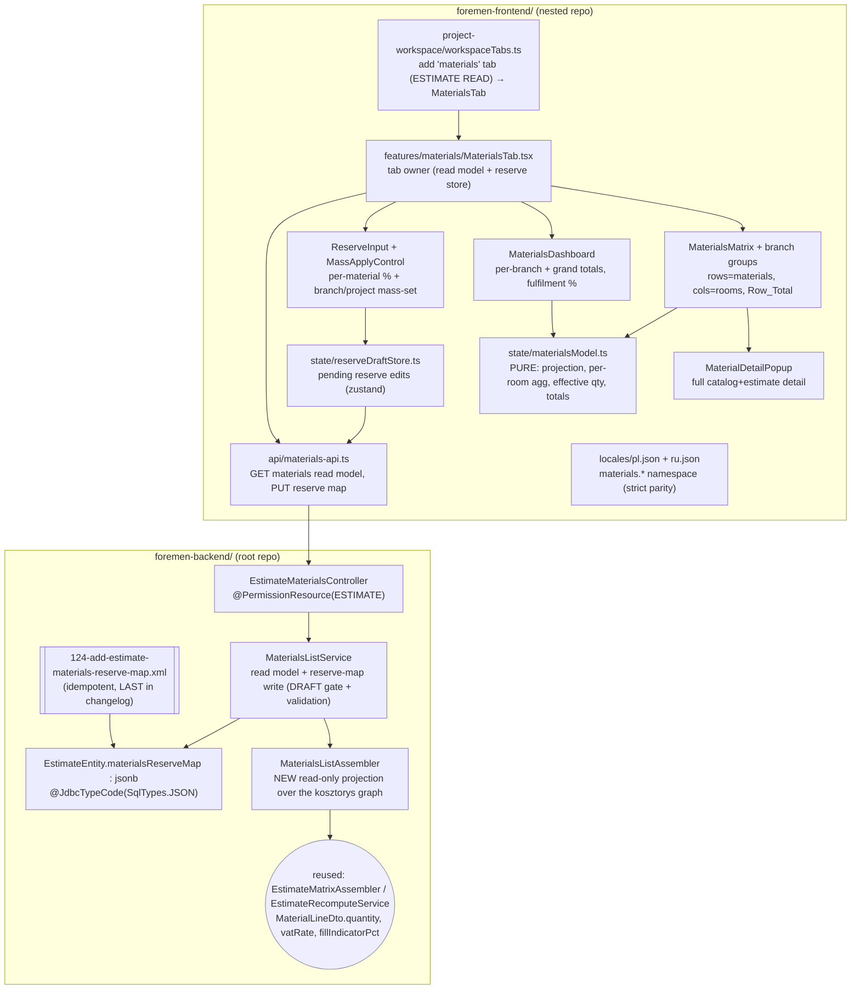
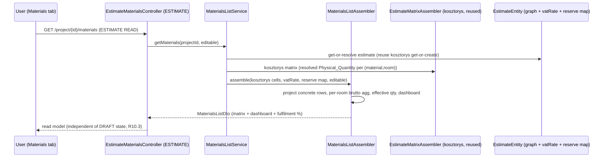
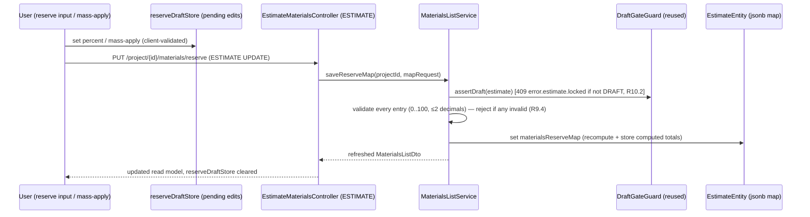

# Design Document: FOR-05-05b — List of materials (the Materials tab)

## Overview

FOR-05-05b adds a new **Materials** tab to the project workspace (`/projects/:projectId`, tab
"Материалы / Materiały"). It is a **read-and-annotate projection over the kosztorys** produced by
the sibling spec FOR-05-05 (the Estimate tab): it lists the project's **concrete materials** — the
products actually chosen on estimate material lines — as a **materials × rooms matrix** (one row per
`Concrete_Material`, one column per project room, a trailing `Row_Total` column) with a per-branch
**dashboard** above the grid. Each `Room_Cell` shows the material's aggregated quantity (with unit)
and its **brutto** price for that room; the `Row_Total` shows the across-rooms **as-is** sum and an
**effective** (reserve-then-ceiling) whole-unit figure, with the row brutto price recomputed from the
effective quantity.

The only user input is a **per-material reserve percentage**, persisted at project level. Both the
reserve and the whole-unit roundup **increase** a material's quantity and its price is recomputed from
the increased quantity. Materials consumed as an absolute per-room count (the FOR-05-05 `PER_ROOM`
consumption basis — e.g. 1 WC per bathroom) are **excluded** from both reserve and roundup: their
quantity stays the exact integer count.

The feature is grounded on FOR-05-05, all verified against the live code:

- The **estimate model** — `EstimateEntity` (1:1 per project, `currency`/`vatRate`/`status`,
  derived `totalNet`/`totalVat`/`totalGross`), `EstimateLineEntity` (a work per estimate with a
  frozen `unitPrice` + derived `quantity`/`valueNet`), `EstimateLineRoomQtyEntity` (the per-`(line,
  room)` Volume `quantity`), and `EstimateLineRoomMaterialEntity` (the copied-price material line per
  `(roomQty, branch, type)`, carrying `normQty`, `rangeMin`/`rangeMax`, the concrete-product FKs +
  `concreteNet`, `consumptionBasis`, and `manualQty`/`qtyOverridden`). `EstimateRecomputeService`
  derives line/estimate totals in place (FOR-05-03/04/05).
- The **kosztorys read model** — the shipped `EstimateMatrixAssembler` builds an `EstimateMatrixDto`
  (works grouped by category, room columns, per-cell `MaterialLineDto`s). The critical primitive it
  already exposes on every `MaterialLineDto` is the **resolved physical quantity** `quantity`
  (override- and basis-aware): `manualQty` when overridden, else `norm` for `PER_ROOM`, else
  `norm × Volume` for `PER_UNIT` — this IS the `Physical_Quantity` this spec aggregates. It also
  exposes `consumptionBasis` (`PER_UNIT`/`PER_ROOM`), `normUnit`, the net range/`concreteNet`, and the
  `fillIndicatorPct` (the FOR-05-05 `Materials_Fill_Indicator`).
- The **VAT / net→brutto derivation** — `EstimateEntity.vatRate.rate` is a percentage (e.g. `23.00`);
  `EstimateRecomputeService` derives brutto as `net × (1 + rate/100)` with `coalesce(rate, 0)`. This
  spec reuses that identical net→brutto rule verbatim and never rescales a net value.
- The **DRAFT free-edit gate** — `DraftGateGuard.assertDraft(estimate)` throws
  `409 error.estimate.locked` when the estimate is past `DRAFT` (FOR-05-03). The reserve write reuses
  it, exactly like the kosztorys write path.
- The **ABAC `ESTIMATE` resource** — seeded by FOR-05-03 (changeset `081`, ADMIN CRUD / MANAGER CRU /
  FOREMAN·WORKER·FINANCIER READ). The shipped `EstimateMatrixController`
  (`@RequestMapping("/api/estimates") @PermissionResource("ESTIMATE")`) hosts the matrix read/write
  endpoints; this spec adds handlers there under the SAME resource.

**The single genuinely new schema addition** is a project-level **JSONB reserve map**: a
`materials_reserve_map jsonb` column on the `estimates` table (the estimate is 1:1 with the project,
so "on the estimate" IS "at project level"), holding each material's reserve percent and its computed
totals. Everything else — quantities, prices, the fulfilment percentage — is **derived** from the
existing kosztorys graph via a new read-only assembler; there is no second quantity or price formula.

> **Why `estimates` and not `projects`.** R4.2 requires the reserve map "at project level". The
> estimate is 1:1 with the project (`estimates.project_id` UNIQUE) and is the natural owner of all
> estimate-derived data, carries the VAT rate needed for the brutto derivation, and carries the DRAFT
> lifecycle that gates the reserve edits (R10). Persisting the map on `estimates` therefore satisfies
> "project level" (one map per project) while keeping the single-source-of-truth and DRAFT-gate
> guarantees local. This is a deliberate design decision recorded here.

**Notation.** Backend in Java (Spring Boot / JPA / MapStruct / Liquibase / jqwik); frontend in
TypeScript/React (Vite, react-hook-form + zod, TanStack Query, zustand, the shared `DataTable` /
`AsyncEntitySelect`, `lucide-react`, i18next); frontend property tests in fast-check + Vitest.

---

## Architecture

Two repositories are touched (per `.kiro/steering/git-repo-structure.md`): the **backend + migrations
+ spec** live in the root repo; the **frontend** lives in the nested `foremen-frontend/` repo. This
feature spans both, so it needs a commit in **each** repo.



### Key architectural rules

- **Derived, single source of truth (R7).** The materials read model is **assembled from the same
  estimate graph the kosztorys reads**. The per-`(material, room)` quantity is the sum of the
  kosztorys **resolved** `Physical_Quantity` (`MaterialLineDto.quantity` — override/basis-aware); the
  net price is the estimate line's `concreteNet` used verbatim; the brutto is `net × (1 + vat/100)`
  with the estimate's `vatRate`. There is **no second quantity or price formula** (R7.1, R7.2). The
  fulfilment percentage is the kosztorys `fillIndicatorPct` passed through unchanged (R6.5).
- **Concrete-only rows, branch-partitioned (R1).** Only material lines with a chosen
  `Concrete_Material` become rows; a `Placeholder` (null concrete) is excluded. One row per **distinct
  concrete material id**; the same product used across many cells/rooms folds into a single row. Rows
  partition by `Branch` (construction / finishing), matching the kosztorys split.
- **Reserve-then-ceiling, basis-aware (R3, R4, R5, R7.4).** For a normal (`PER_UNIT`) material the
  `Effective_Quantity = ceil(asIs × (1 + pct/100))` computed strictly in that order — aggregate the
  as-is quantity across rooms, apply the reserve, then ceiling to the next whole unit — and the row
  brutto price is `Effective_Quantity × bruttoUnitPrice`. For an `Absolute_Per_Room_Material`
  (`PER_ROOM` basis) the reserve and ceiling are **skipped**: `Effective_Quantity == asIs`. Reserve
  and roundup apply **per material** (across the whole project), never per `Room_Cell` — cells always
  show the reserve-free as-is aggregate (R2.4, R4.7).
- **Reserve map on the estimate, DRAFT-gated (R4, R8, R10).** The `Materials_Reserve_Map` is a JSONB
  column on `estimates`, keyed by `materialId`, each entry `{ percent, asIsQty, effectiveQty,
  bruttoTotal }` (the computed totals are stored so the tab can show/reuse them without recomputing on
  a bare load — but the read assembler ALWAYS recomputes from the live kosztorys, so a stale stored
  total never drives display). Writing the map requires `ESTIMATE` UPDATE (server-enforced, R8.3) and
  a DRAFT estimate via `DraftGateGuard` (R10.2); reads are `ESTIMATE` READ (R8.1) and are independent
  of lifecycle (R10.3).
- **Read-and-annotate only (R1.6).** The tab exposes exactly one write — the reserve-map PUT. It
  never touches assignments, volumes, chosen products, or catalog/estimate prices.
- **No new ABAC resource (R8.4, entity-creation checklist).** The tab reuses the shipped `ESTIMATE`
  resource; **no new resource, operation, or role grant** is introduced. The new controller MUST be
  fully annotated (`@PermissionResource("ESTIMATE")` + method-level `@RequiresPermission`) or
  `PermissionAnnotationValidator` fails startup. Because the reserve map lives on the existing
  `estimates` table (guarded transitively through `ESTIMATE`), the entity-creation checklist's
  seed-a-resource / annotate-a-controller steps are already satisfied by FOR-05-03 — this spec adds a
  column, not a managed entity.
- **Idempotent migration registered last (R migrations).** The single new changeset `124` follows the
  `NOT columnExists` / `onFail="MARK_RAN"` conventions (mirroring `119-add-estimate-applied-package-
  code.xml`) and is appended **last** in `changelog.xml` after `123`. (The implementer MUST confirm
  `124` is the next free number at build time.)

### Read flow (open the Materials tab)



### Reserve write flow (set a reserve, then Save)



---

## Components and Interfaces

### Backend

#### Component B1 — `EstimateEntity.materialsReserveMap` (the project-level reserve map, R4.2)

A new JSONB column on the shipped `estimates` table (changeset `124`), mapped exactly like the
existing JSONB columns in the codebase (`RoomEntity.geometry`, `WorkVolumeFormulaEntity.parsedAst`,
`UserEntity.displayPreferences`):

```java
// added to EstimateEntity
@JdbcTypeCode(SqlTypes.JSON)
@Column(name = "materials_reserve_map", columnDefinition = "jsonb")
private MaterialsReserveMap materialsReserveMap;   // nullable ⇒ "no reserves set"
```

The bound Java model is a small immutable structure serialized by Jackson (mirroring `RoomGeometry`):

```java
/** Project-level reserve map keyed by material id (R4.2). Null column ⇒ empty map. */
public record MaterialsReserveMap(Map<Long, ReserveEntry> byMaterialId) {
    /** One material's reserve percent + its last computed totals (R4.2). */
    public record ReserveEntry(
        BigDecimal percent,        // 0..100, ≤2 decimals; null/absent ⇒ identity (R4.5, R9.3)
        BigDecimal asIsQty,        // last computed as-is aggregate (cache/display, R4.2)
        BigDecimal effectiveQty,   // last computed Effective_Quantity (R4.2)
        BigDecimal bruttoTotal) {} // last computed effective brutto price total (R4.2)
}
```

- Only `percent` is authoritative input; `asIsQty`/`effectiveQty`/`bruttoTotal` are **computed** on
  each write for display/reuse but are **never trusted on read** — the assembler always recomputes
  from the live kosztorys, so a stale cached total cannot drive display (defends R12.5).
- A `null` column, an absent key, or a `null`/`0` percent all mean **identity** (no reserve) for that
  material (R4.5). Stale keys (a `materialId` no longer chosen anywhere in the kosztorys) are ignored
  on read (R12.5); they are pruned on the next write.

#### Component B2 — `MaterialsListAssembler` (the read-only projection, R1, R2, R3, R5, R6, R7)

A pure, stateless `@Component` that builds the `MaterialsListDto` from the **kosztorys read model**
(the shipped `EstimateMatrixDto` from `EstimateMatrixAssembler`) plus the estimate's `vatRate` and
`materialsReserveMap`. It performs no I/O beyond reading the passed-in graph and mirrors the
`EstimateMatrixAssembler` convention (localized RU/PL names from the request locale, fold helpers).

The projection walks every kosztorys cell's `MaterialLineDto`s and keeps only lines with a
`concreteMaterialId` (R1.2, R1.3). It groups by **branch**, then by **distinct concrete material id**,
and folds:

| Step | Rule | Requirements |
|------|------|--------------|
| Row identity | one row per distinct `(branch, concreteMaterialId)`; a `Placeholder` line is skipped | 1.2, 1.3, 1.5 |
| `Room_Cell` as-is qty | `Σ MaterialLineDto.quantity` over that room's cells using the material (the resolved, override/basis-aware `Physical_Quantity`) | 2.2, 2.4, 7.1, 7.3 |
| `Room_Cell` brutto | `asIsCellQty × bruttoUnitPrice`, where `bruttoUnitPrice = concreteNet × (1 + vat/100)` (net verbatim, VAT applied — never rescaled) | 2.2, 2.5, 7.2 |
| `Row_Total` as-is | `Σ` cell as-is quantities across all rooms | 3.2 |
| `Row_Total` effective | `PER_UNIT`: `ceil(asIs × (1 + pct/100))`; `PER_ROOM`: `asIs` unchanged | 3.2, 3.3, 3.4, 4.3, 5.2, 7.4 |
| `Row_Total` brutto | `effectiveQty × bruttoUnitPrice` (from the effective quantity, R3.3) | 3.3, 7.4 |
| Basis | a row is an `Absolute_Per_Room_Material` iff its `MaterialLineDto.consumptionBasis == PER_ROOM`; reserve + ceiling suppressed | 5.1, 5.2, 4.6 |
| Null net | `concreteNet == null` ⇒ show quantities, brutto rendered `—`, **excluded** from money totals | 12.4 |
| Dashboard | per-branch and grand totals of consumption and price, for **as-is** and **effective**, in **net** and **brutto** | 6.2, 6.3, 6.4 |
| Fulfilment | pass through the kosztorys `fillIndicatorPct` verbatim | 6.5 |

The **canonical `Effective_Quantity` helper** is the single place the reserve/ceiling/basis rules live
(shared by the row total, the row brutto, and the dashboard effective figures so they never drift):

```java
/** Effective_Quantity for a material row (R7.4): as-is → reserve → ceiling; PER_ROOM = identity. */
static BigDecimal effectiveQuantity(BigDecimal asIs, ConsumptionBasis basis, BigDecimal percent) {
    if (asIs == null || asIs.signum() == 0) return BigDecimal.ZERO;   // ceil(0)=0, never a spurious unit (R12.3)
    if (basis == ConsumptionBasis.PER_ROOM) return asIs;             // no reserve, no ceiling (R5.2, R4.6)
    BigDecimal pct = percent == null ? BigDecimal.ZERO : percent;    // null/unset ⇒ identity (R4.5)
    BigDecimal inflated = asIs.multiply(BigDecimal.ONE.add(pct.movePointLeft(2))); // × (1 + pct/100)
    return inflated.setScale(0, RoundingMode.CEILING);               // ceiling to next whole unit
}
```

> A material chosen on lines of **both** bases across the project is degenerate; the assembler treats a
> row as `PER_ROOM` only when **all** of its contributing lines are `PER_ROOM` (otherwise `PER_UNIT`),
> and the reserve/ceiling then applies to the `PER_UNIT` aggregate. The overwhelmingly common case is a
> single basis per concrete product.

#### Component B3 — `MaterialsListService` (read model + reserve write, R4, R8, R9, R10)

A `ProjectScopedService`-backed service (`getProjectIdPath()` → the estimate's project, exactly like
`EstimateAssignmentService`) owning the tab's read and the single reserve write:

| Operation | Behaviour | Requirements |
|-----------|-----------|--------------|
| `getMaterials(projectId, editable)` | Resolve the project's estimate (reusing the kosztorys get-or-create so a brand-new project returns an empty structure, not 404), obtain the kosztorys matrix, and delegate to `MaterialsListAssembler`. Read-only; independent of DRAFT (R10.3). | 1.x, 2.x, 3.x, 5.x, 6.x, 7.x, 10.3, 12.x |
| `isDraft(projectId)` | Reuse `EstimateAssignmentService.isDraft` (or the same lifecycle check) to compute the `editable` flag. | 10.1, 10.2 |
| `saveReserveMap(projectId, request)` | Resolve the **DRAFT** estimate; `DraftGateGuard.assertDraft` (409 `error.estimate.locked` otherwise, R10.2); **server-validate every entry** (0..100, ≤2 decimals; reject the whole write on any invalid/malformed entry with a localized message, R9.4); prune stale keys (materialIds absent from the kosztorys, R12.5); recompute and store each entry's `asIsQty`/`effectiveQty`/`bruttoTotal`; persist the JSONB column; return the refreshed read model. | 4.2, 4.3, 4.4, 8.3, 9.4, 10.1, 10.2, 12.5 |

Mass-apply (R4.4) is a **client** convenience that expands into per-material entries in the request
body (see F-frontend); the server stores only the per-material map (there is **no** branch-level
stored value). The service applies the same computation core the assembler uses, so a saved effective
total always equals what the tab would compute live.

#### Component B4 — `EstimateMaterialsController` (endpoints on the ESTIMATE resource, R8)

Handlers under the shipped estimate vertical. To keep the FOR-05-05 matrix controller focused, this
spec adds a **new** `@RestController @RequestMapping("/api/estimates") @PermissionResource("ESTIMATE")`
`EstimateMaterialsController` (a second controller on the same resource is fine — `PermissionResource`
is per-class), fully annotated so `PermissionAnnotationValidator` classifies it COMPLETE at startup:

- `GET /project/{projectId}/materials` — `@RequiresPermission(resource="ESTIMATE", operation="READ")`;
  returns the `MaterialsListDto`. The `editable` flag = project DRAFT ∧ caller has `ESTIMATE` UPDATE
  (resolved exactly like `EstimateMatrixController#resolveEditable`, reusing `ForemenPermissionEvaluator`
  + `isDraft`). (R8.1, R8.2, R10.3)
- `PUT /project/{projectId}/materials/reserve` —
  `@RequiresPermission(resource="ESTIMATE", operation="UPDATE")`; body `MaterialsReserveRequest`
  (`List<ReserveEntryRequest>` = `{ materialId, percent }`, already expanded by the client's
  mass-apply); persists the map via `MaterialsListService.saveReserveMap` and returns the refreshed
  read model. `UPDATE` is server-enforced (R8.3) and the DRAFT gate is applied in the service (R10.2).

Method-level `@RequiresPermission` takes precedence over the class default, mirroring
`EstimateMatrixController`. No new ABAC resource / operation / role grant is introduced (R8.4).

#### Read model DTOs (backend, mirrored by the frontend)

```java
public record MoneyBrutto(BigDecimal net, BigDecimal brutto) {}   // net verbatim + net×(1+vat/100)

public record MaterialRoomCellDto(
    Long roomId,
    BigDecimal quantity,        // aggregated as-is Physical_Quantity for (material, room); null ⇒ empty (R2.3)
    String unit,                // the material norm's unit (from MaterialLineDto.normUnit)
    MoneyBrutto price) {}       // per-room brutto (null price when net is null, R12.4)

public record MaterialRowDto(
    Long materialId, String materialName,
    ConsumptionBranch branch,
    ConsumptionBasis basis,     // PER_ROOM ⇒ Absolute_Per_Room_Material (reserve/roundup suppressed)
    String unit,
    BigDecimal netUnitPrice, BigDecimal bruttoUnitPrice,  // null when the product has no net price (R12.4)
    List<MaterialRoomCellDto> cells,
    BigDecimal asIsTotalQty,        // Σ across rooms (R3.2)
    BigDecimal reservePercent,      // from the reserve map (0 when unset)
    BigDecimal effectiveTotalQty,   // reserve-then-ceiling, basis-aware (R3.2..R3.4, R7.4)
    MoneyBrutto rowTotalPrice) {}   // effectiveTotalQty × unit price (R3.3); net excluded when null (R12.4)

public record BranchDashboardDto(
    ConsumptionBranch branch,
    MoneyBrutto asIsTotal, MoneyBrutto effectiveTotal) {}   // consumption money, as-is vs effective, net+brutto (R6.2)

public record MaterialsListDto(
    Long projectId, boolean editable,
    List<MaterialsRoomColumnDto> rooms,        // stable order, mirrors the kosztorys room order (R2.1)
    List<MaterialBranchGroupDto> branches,     // construction, finishing — each with its rows (R1.5)
    List<BranchDashboardDto> branchDashboards, // per-branch (R6.2)
    BranchDashboardDto grandTotal,             // project-wide (R6.3)
    BigDecimal fulfilmentPct) {}               // = kosztorys fillIndicatorPct, verbatim (R6.5)
```

(`MaterialsRoomColumnDto` / `MaterialBranchGroupDto` are thin wrappers — the room id/label and the
branch + its `MaterialRowDto`s.) Money is carried as net+brutto pairs; a `null` net/brutto renders as
`—` and is excluded from totals (R12.4).

### Frontend

Feature folder `foremen-frontend/src/features/materials/` following the repo layout (`types/`,
`api/`, `state/`, `components/`, `schemas/`). The `materials` workspace tab is **added** to
`WORKSPACE_TABS` in `project-workspace/workspaceTabs.ts` (design-stage, `owner: 'FOR-05'`,
`requiredPermission: { resource: 'ESTIMATE', operation: 'READ' }`, `labelKey:
'workspace.tab.materials'`, `lazy: MaterialsTab`) — the tab gate satisfies R8.1 with no
`route-permissions.ts` change.

#### Component F1 — `MaterialsTab` (tab owner)

The `lazy` target, modelled on `EstimateTab`. It computes `canEdit = editable &&
hasPermission('ESTIMATE','UPDATE')` (the read model's `editable` already folds DRAFT + UPDATE, R8.2,
R10.1), fetches the read model (TanStack Query), renders loading/empty/error with localized copy (no
raw key, R11.3), owns the per-project `reserveDraftStore` (F5), and renders `MaterialsDashboard` +
`MaterialsMatrix`. When `canEdit` is false, the reserve inputs and the mass-apply control are disabled
(R8.2, R10.2); the matrix/dashboard/popup and persisted reserve values stay fully visible (R10.3).

#### Component F2 — `MaterialsMatrix` and branch groups (R1, R2, R3, R5)

- Rows = materials grouped by **branch** (construction, finishing) (R1.5); columns = rooms in the
  read model's stable order (R2.1); a trailing `Row_Total` column (R3.1). Each `Room_Cell` shows the
  aggregated quantity + unit and the brutto price (R2.2); a room the material is not consumed in
  renders an empty placeholder (R2.3). The `Row_Total` shows the two figures — as-is and effective —
  plus the effective row brutto (R3.2). An `Absolute_Per_Room_Material` row renders per-room / total
  like any other; only its reserve input is disabled and its effective == as-is (R5.3, R4.6).
- The empty state (no concrete materials) renders the localized message and no rows (R1.4, R12.2);
  no rooms renders the dashboard + header with no columns and the empty state, no error (R12.1).

#### Component F3 — `MaterialDetailPopup` (R2.6)

Opened from a row; shows the material's full catalog + estimate detail (name/label, branch, type,
unit, net and brutto price, per-room breakdown, as-is total, reserve %, effective total, totals
price). The inline table row stays the compact quantity+unit / brutto view.

#### Component F4 — `ReserveInput` + `MassApplyControl` (R4)

- `ReserveInput` — a per-row percentage input, zod-validated on the client (0..100, ≤2 decimals;
  empty ⇒ unset/identity) with a localized validation message; disabled for
  `Absolute_Per_Room_Material` rows (R4.6) and in read-only mode (R8.2, R10.2). Staged into
  `reserveDraftStore`.
- `MassApplyControl` — sets the same percent across a whole **Branch** or the **whole project**; it
  **expands** into per-material entries in the draft store (there is no separate branch-level value,
  R4.4). Disabled in read-only mode.
- `Save` maps the draft store to the `MaterialsReserveRequest` (the expanded per-material list) and
  PUTs it; on success the read model is refetched and the store cleared.

#### Component F5 — `materialsModel.ts` (pure client model, R1, R2, R3, R5, R6)

A pure module mirroring the backend assembler so the tab can reflect a **staged** reserve change live
without a round-trip: `projectRows(readModel)` (distinct concrete rows, branch-partitioned),
`roomCellAgg`, `effectiveQuantity(asIs, basis, percent)` (identical reserve→ceiling→basis rule, R7.4),
`rowTotals`, and `dashboardTotals` (per-branch + grand, as-is vs effective, net vs brutto, null-net
excluded). It consumes the read model + the draft reserve edits; the authoritative persisted
computation is the backend's, but the two share the identical rule so they agree.

#### Component F6 — i18n (R11)

Every new string (tab title, column headers incl. rooms + total, the two `Row_Total` figures, dashboard
labels, detail-popup labels, reserve controls, validation messages, empty state) lands under a
`materials.*` namespace and `workspace.tab.materials` in **both** `pl.json` and `ru.json` at strict key
parity with non-empty values (R11.1, R11.2). No raw key is ever surfaced (R11.3).

---

## Data Models

### New backend schema

| Table (changeset) | Change | Notes |
|-------------------|--------|-------|
| `estimates` (`124`) | add `materials_reserve_map jsonb` (nullable) | Project-level reserve map (1 estimate per project). Idempotent via `NOT columnExists` + `onFail="MARK_RAN"`, registered **last** in `changelog.xml` after `123`. Mirrors `119-add-estimate-applied-package-code.xml`. |

### Reused (unchanged) entities and read models

`EstimateEntity` (`vatRate`, `status`, the 1:1 project FK), `EstimateLineEntity`,
`EstimateLineRoomQtyEntity`, `EstimateLineRoomMaterialEntity` (`concreteNet`, `consumptionBasis`,
`normQty`, `manualQty`/`qtyOverridden`), the shipped `EstimateMatrixAssembler` /
`EstimateMatrixDto` / `MaterialLineDto` (source of the resolved `Physical_Quantity`, `consumptionBasis`,
`normUnit`, net range/`concreteNet`, and `fillIndicatorPct`), `EstimateRecomputeService`'s net→brutto
rule, `DraftGateGuard`, `ForemenPermissionEvaluator`.

### Frontend read model (mirrors backend DTOs)

```typescript
export interface MoneyBrutto { net: number | null; brutto: number | null }   // null ⇒ '—', excluded from totals (R12.4)
export interface MaterialRoomCell { roomId: number; quantity: number | null; unit: string | null; price: MoneyBrutto }
export interface MaterialRow {
  materialId: number; materialName: string
  branch: 'construction' | 'finishing'
  basis: 'PER_UNIT' | 'PER_ROOM'          // PER_ROOM ⇒ Absolute_Per_Room_Material
  unit: string | null
  netUnitPrice: number | null; bruttoUnitPrice: number | null
  cells: MaterialRoomCell[]
  asIsTotalQty: number
  reservePercent: number
  effectiveTotalQty: number
  rowTotalPrice: MoneyBrutto
}
export interface BranchDashboard { branch: 'construction' | 'finishing'; asIsTotal: MoneyBrutto; effectiveTotal: MoneyBrutto }
export interface MaterialsListDto {
  projectId: number; editable: boolean
  rooms: { id: number; label: string | null }[]
  branches: { branch: 'construction' | 'finishing'; rows: MaterialRow[] }[]
  branchDashboards: BranchDashboard[]
  grandTotal: BranchDashboard
  fulfilmentPct: number                    // = kosztorys fillIndicatorPct (R6.5)
}
export interface ReserveEntryRequest { materialId: number; percent: number | null }
export interface MaterialsReserveRequest { entries: ReserveEntryRequest[] }   // mass-apply expanded client-side (R4.4)
```

### Repo layout (git-repo-structure)

Backend (the entity column, the assembler/service/controller, the DTOs, migration `124`) and the spec
commit from the **root repo**. All frontend source (`features/materials/*`, the `workspaceTabs.ts`
addition, `locales/*`) commits from **inside `foremen-frontend/`**. This feature spans both → **two
commits, one per repo**.

---

## Correctness Properties

*A property is a characteristic or behavior that should hold true across all valid executions of a
system — essentially, a formal statement about what the system should do. Properties serve as the
bridge between human-readable specifications and machine-verifiable correctness guarantees.*

This feature is rich in pure, input-varying logic — the concrete-material projection, the per-room
quantity aggregation, the net→brutto derivation, the reserve-then-ceiling (basis-aware)
`Effective_Quantity`, the reserve-map round-trip, the mass-apply map transform, the bounded-percentage
validation, and the dashboard folds — so property-based testing applies to that core. UI rendering
(matrix/dashboard/popup layout), ABAC gating, the DRAFT gate, the migration, and locale parity are NOT
property targets and are covered by component/integration/parity tests (see Testing Strategy).

After the prework reflection, criteria that restate the same underlying function were consolidated: the
projection/branch criteria (1.2, 1.3, 1.5) into one projection property; the per-room-aggregation and
net→brutto criteria (2.2, 2.3, 2.4, 2.5, 7.1, 7.2, 7.3) into one aggregation property; the reserve /
ceiling / basis criteria (3.2, 3.3, 3.4, 4.3, 4.5, 4.6, 4.7, 5.1, 5.2, 5.3, 7.4, and the 12.3 edge)
into one `Effective_Quantity` property; the reserve-persistence and stale-key criteria (4.2, 12.5) into
one round-trip property; and the dashboard criteria (6.2, 6.3, 6.4, 12.4) into one totals property.

### Property 1: Materials rows are exactly the distinct concrete materials, partitioned by branch

*For any* kosztorys read model (any set of cells, each with any mix of concrete and placeholder
material lines, and materials repeated across cells/rooms), the materials read model contains exactly
one row per **distinct** `(branch, concreteMaterialId)` for which at least one line has a chosen
`Concrete_Material`; no `Placeholder`-only material yields a row; every row falls in the group of its
own branch; and the branch groups partition the rows (their union is all rows and they are pairwise
disjoint).

**Validates: Requirements 1.2, 1.3, 1.5**

### Property 2: Per-room quantity is the summed resolved Physical_Quantity and price is net×VAT

*For any* material and room, the `Room_Cell` as-is quantity equals the sum of the kosztorys **resolved**
`Physical_Quantity` (`MaterialLineDto.quantity`, override- and basis-aware) over every cell in that
room that uses the material (and is empty when the material is not consumed there); no reserve or
roundup is applied at the cell level; and the `Room_Cell` brutto equals `asIsCellQty × concreteNet ×
(1 + vat/100)` with the stored net used verbatim (never rescaled).

**Validates: Requirements 2.2, 2.3, 2.4, 2.5, 7.1, 7.2, 7.3**

### Property 3: Effective_Quantity is reserve-then-ceiling for PER_UNIT and identity for PER_ROOM

*For any* material row with an aggregated as-is quantity `q`, a consumption basis `b`, and a reserve
percent `p`, the `Effective_Quantity` equals `ceil(q × (1 + p/100))` when `b = PER_UNIT` and equals `q`
unchanged when `b = PER_ROOM` (no reserve, no ceiling); the computation order is aggregate → reserve →
ceiling (never ceiling-before-reserve); `p` of `0`/unset yields `ceil(q)` (identity reserve); `q = 0`
yields `0` (never a spurious ceiling to a whole unit); and the row brutto total equals
`Effective_Quantity × concreteNet × (1 + vat/100)`.

**Validates: Requirements 3.2, 3.3, 3.4, 4.3, 4.5, 4.6, 4.7, 5.1, 5.2, 5.3, 7.4, 12.3**

### Property 4: Reserve map round-trips and tolerates stale keys

*For any* valid `Materials_Reserve_Map` (materialId → percent), persisting it and reading it back
yields an equal per-material percent set; an entry whose `materialId` is absent from the current
kosztorys is ignored for display and totals without error; and a missing/`null` column or an absent
key is read as the identity (no reserve) for that material.

**Validates: Requirements 4.2, 12.5**

### Property 5: Mass-apply writes the same percent to exactly the in-scope materials

*For any* set of materials and any mass-apply scope (a branch or the whole project) with percent `p`,
the resulting reserve map assigns `p` to every material in scope, leaves every out-of-scope material's
entry unchanged, and creates no branch-level or non-material key (the map remains per-material only).

**Validates: Requirements 4.4**

### Property 6: Reserve validation accepts a value iff it is in [0..100] with at most two decimals

*For any* candidate reserve value, validation (client and server, identical bounds) accepts it iff it
is a number in the closed range `[0, 100]` with at most two decimal places; a value below 0, above the
maximum, or non-numeric is rejected and not persisted; an empty/cleared value is accepted as unset
(identity); and a map write is accepted iff **every** entry is valid (any invalid entry rejects the
whole write).

**Validates: Requirements 9.1, 9.2, 9.3, 9.4**

### Property 7: Dashboard totals sum per-material contributions per branch and project-wide, as-is vs effective, net vs brutto, excluding null-priced

*For any* set of material rows, each per-branch dashboard total (and the project-wide grand total)
equals the sum, over that branch's rows (resp. all rows), of the row's money contribution — computed
from the **as-is** quantity for the as-is total and from the **effective** quantity for the effective
total, in both **net** (`qty × concreteNet`) and **brutto** (`qty × concreteNet × (1 + vat/100)`) — and
a row whose `concreteNet` is null contributes nothing to any money total (it is excluded, not treated
as zero-priced); the grand total equals the sum of the per-branch totals.

**Validates: Requirements 6.2, 6.3, 6.4, 12.4**

---

## Error Handling

| Scenario | Condition | Handling |
|----------|-----------|----------|
| No concrete materials | project has rooms but no chosen products | localized empty-state message, no matrix rows (R1.4, R12.2) |
| No rooms | project has no rooms | render dashboard + header, no room columns, empty state; no error (R12.1) |
| Zero as-is quantity | a material's aggregated as-is is 0 | as-is and effective both 0; **no** spurious ceiling to a whole unit (R12.3) |
| Null net price | a chosen product has `concreteNet == null` | show quantity, render brutto/net as `—`, exclude from money totals (R12.4) |
| Stale reserve entry | a `materialId` in the map is absent from the kosztorys | ignore for display/totals, no error; pruned on next save (R12.5) |
| Reserve out of range / non-numeric | client or server sees an invalid percent | reject with a localized validation message; not persisted (client), whole write rejected (server, R9.2, R9.4) |
| Reserve cleared/empty | percent input emptied | treated as unset (identity), not an error (R9.3) |
| Reserve write without UPDATE | caller lacks `ESTIMATE` UPDATE | `403` (server-enforced, R8.3); UI already disables the inputs (R8.2) |
| Reserve write on a locked estimate | estimate not `DRAFT` (APPROVED/SIGNED) | `409 error.estimate.locked` via `DraftGateGuard`; UI renders reserve inputs read-only; the read path stays fully viewable (R10.2, R10.3) |
| Caller lacks `ESTIMATE` READ | route/tab gate | the Materials tab is hidden from that user (shipped tab gate) (R8.1) |
| Project has no estimate yet | first open of a pre-estimate project | the read resolves via the shipped kosztorys get-or-create and returns an empty structure, not `404` |
| Missing/absent locale key | any new string | both `pl.json` and `ru.json` carry every `materials.*` / `workspace.tab.materials` key; a raw key is never surfaced (R11.1, R11.3) |
| Migration re-run | already-migrated database | `NOT columnExists` + `onFail="MARK_RAN"` ⇒ no schema change |

All backend user-facing messages resolve through the i18n bundle at PL/RU parity; the frontend mirrors
every new key in both locale files.

---

## Testing Strategy

### Dual approach

- **Property-based tests** verify the universal properties above across generated inputs — the concrete
  projection, per-room aggregation, net→brutto, the reserve-then-ceiling `Effective_Quantity`, the
  reserve-map round-trip, the mass-apply transform, the bounded validation, and the dashboard folds.
- **Unit / component / integration tests** verify specific examples, edge cases, UI rendering, ABAC
  gating, the DRAFT gate, the migration, and locale parity. They are complementary: property tests
  catch general correctness, example/integration tests pin down concrete behaviour and wiring.

Unit tests stay focused (specific examples, edge cases, integration points); the property tests carry
the broad input coverage.

### Property-based testing

**Backend library: jqwik** (repo standard — e.g. the shipped `PriceRangeResolver*PropertyTest`,
`FinishingPriceRangeResolverPropertyTest`, `ProjectScopedServiceDecisionPropertyTest`). **Frontend
library: fast-check** with Vitest (repo standard — e.g. the shipped `costModel.property.test.ts`,
`estimateMatrixStore.property.test.ts`).

Each correctness property is implemented by a **single** property-based test running **≥ 100
iterations**, tagged with a comment referencing the design property, e.g.:

```
// Feature: for-05-05b-list-of-materials,
// Property 3: Effective_Quantity is reserve-then-ceiling for PER_UNIT and identity for PER_ROOM
```

Property → test placement:

| Property | Where | Library |
|----------|-------|---------|
| P1 concrete projection + branch partition | `features/materials/state/materialsModel.property.test.ts` (pure) AND backend `MaterialsListAssemblerPropertyTest` (pure fold) | fast-check + jqwik |
| P2 per-room aggregation + net→brutto | `materialsModel.property.test.ts` and/or `MaterialsListAssemblerPropertyTest` | fast-check / jqwik |
| P3 Effective_Quantity (reserve→ceiling, basis) | the pure `effectiveQuantity` core — `materialsModel.property.test.ts` (fast-check) and `MaterialsListAssemblerPropertyTest` (jqwik) share the identical rule | fast-check + jqwik |
| P4 reserve-map round-trip + stale keys | backend `MaterialsReserveMapPropertyTest` (JSONB serialize/deserialize + stale-key tolerance) | jqwik |
| P5 mass-apply transform | `features/materials/state/reserveMassApply.property.test.ts` (pure map transform) | fast-check |
| P6 reserve validation bounds | `features/materials/schemas/reserve.property.test.ts` (client zod) and backend `ReserveValidationPropertyTest` (server bounds — identical) | fast-check + jqwik |
| P7 dashboard totals (branch + grand, as-is/effective, net/brutto, null-net excluded) | `materialsModel.property.test.ts` and `MaterialsListAssemblerPropertyTest` | fast-check + jqwik |

To keep the fold math property-testable without Spring or a DB, the backend assembler/validation logic
follows the shipped resolver convention: pure `static` helpers (or a stateless pure core) that the
`@Component`/service methods delegate to, so the properties exercise the aggregation directly on
generated inputs (mirroring `EstimateMatrixAssembler`'s fold helpers).

### Unit / component / integration tests (non-PBT)

- **Matrix & panels (component, Vitest + Testing Library):** tab presence + permission gate (1.1),
  row/column rendering and stable order (2.1), `Room_Cell` qty+unit / brutto and empty placeholder
  (2.2, 2.3), the two `Row_Total` figures + effective brutto (3.1, 3.2), `Absolute_Per_Room_Material`
  row renders normally with reserve disabled (5.3, 4.6), detail popup content (2.6), fulfilment %
  passthrough equals the kosztorys value (6.5), empty state (1.4, 12.1, 12.2), null-net `—` render
  (12.4), read-only mode disables reserve + mass-apply (8.2, 10.2), live recompute on a staged reserve
  change.
- **Reserve store / schema (unit):** staged reserve edits, mass-apply expansion into per-material
  entries (4.4), empty ⇒ unset (9.3), client validation messages (9.2).
- **Backend service (integration, Spring):** `getMaterials` returns the projection over a seeded
  estimate (1.x, 2.x, 6.x); `saveReserveMap` persists the JSONB and recomputes totals (4.2, 4.3);
  reserve save requires `ESTIMATE` UPDATE (8.3); reserve save on a non-DRAFT estimate → `409
  error.estimate.locked` (10.2); read works regardless of lifecycle (10.3).
- **ABAC (integration + startup):** the read requires `ESTIMATE` READ and the reserve PUT requires
  `ESTIMATE` UPDATE (8.1, 8.3); no new resource/operation/role grant is seeded (8.4);
  `PermissionAnnotationValidator` asserts the new controller is fully annotated at startup.
- **Migration (integration):** the `materials_reserve_map` column exists post-apply; a re-run is a
  no-op (idempotent).
- **i18n (parity):** every `materials.*` and `workspace.tab.materials` key present in both `pl.json`
  and `ru.json` with non-empty values, no raw key surfaced (11.1, 11.2, 11.3).

### Excluded from PBT (with rationale)

Tab wiring and rendering (1.1, 2.1, 2.6, 3.1, 6.1), ABAC gating (8.1, 8.2, 8.3, 8.4), the DRAFT gate
(10.1, 10.2, 10.3), the migration, the fulfilment passthrough (6.5), and locale parity (11.x) are
deterministic, external-machinery, or visual concerns where 100 generated iterations add no value over
targeted example/integration checks.
