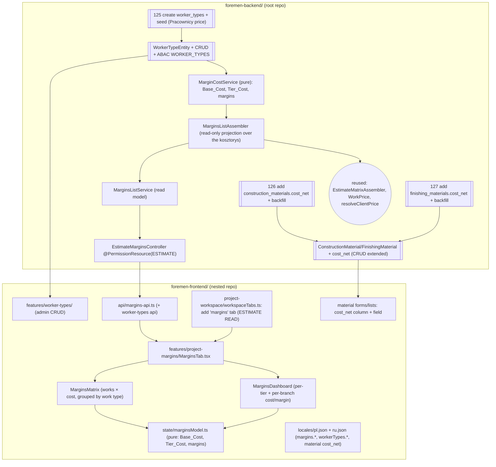
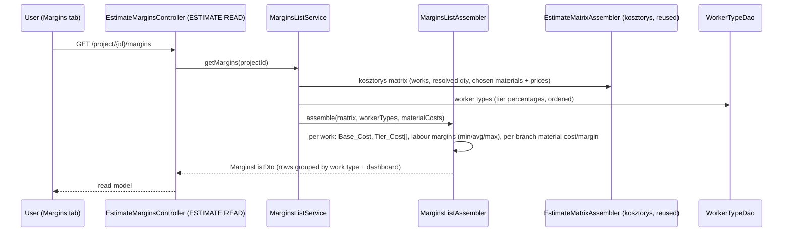

# Design Document: FOR-05-06 — Packages & margins (cost model)

## Overview

FOR-05-06 introduces **self-cost (себестоимость)** into the project-design (DRAFT) stage and a new
**Margins** tab that compares the offer price against every cost tier per work type and derives
**profitability** for labour and — separately, per branch — for materials.

Three deliverables:

1. **WorkerType dictionary** — a new fully CRUD + ABAC managed reference dictionary of hiring types,
   each with an i18n name and a **tier percentage**. The base tier is `0.40` (a share of the offer
   price); the other tiers are **uplifts on the base** (`+10%`, `+26.5%`, `+65%`), seeded from the
   client's Excel `Pracownicy price` sheet. New ABAC resource `WORKER_TYPES`.
2. **Material self-cost** — a materialized `cost_net` column on `construction_materials` and
   `finishing_materials`, back-filled once at migration as `retailNet − 10%`, then editable in each
   material's admin CRUD (list column + form field).
3. **Margins tab + dashboard** — a read-only project-workspace tab (DRAFT stage) rendering a works ×
   cost matrix grouped by work type, plus a cost dashboard showing every hiring-tier variant.

**Cost model (the core rule).** Service cost is **computed on the fly** from the offer price:

```
Base_Cost      = round(0.40 × Offer_Service_Price  to 0.5 zł)     // half-up
Tier_Cost(t)   = Base_Cost × (1 + t.upliftOnBasePct/100)          // base tier uplift = 0
```

Verified against the sheet's 203 rows: base = `0.40 × offer` exactly; hired-no-tools = `base × 1.10`;
sole-trader = `base × 1.2625`; firm = `base × 1.65` (the sheet's `firm = 0.66 × offer` identity holds
before the base is rounded to 0.5 zł; because the user's rule is "base is 0.40, others on top of base",
the authoritative computation is **uplift-on-base**, and firm is `+65%` on the rounded base — a ≤0.5 zł
divergence from `0.66×offer` that is intentional and documented here).

**Margins are separate for labour and each material branch (decision #4).** The Labour_Margin
(`offer − Tier_Cost`) is computed per tier and summarized as min/avg/max across tiers. The
Material_Margin (`retailNet − cost_net`) is computed and displayed **independently, per branch**
(construction, finishing) — never merged into the labour margin.

Notation: backend Java (Spring Boot / JPA / MapStruct / Liquibase / jqwik); frontend TypeScript/React
(Vite, react-hook-form + zod, TanStack Query, zustand, shared `DataTable`, i18next); frontend property
tests in fast-check + Vitest.

---

## Architecture

Two repositories are touched (per `.kiro/steering/git-repo-structure.md`): backend + migrations + spec
in the root repo; frontend in the nested `foremen-frontend/` repo.



### Key architectural rules

- **Costs computed, not stored (services).** `Base_Cost`/`Tier_Cost` are derived live from the offer
  price and the WorkerType tier percentages. Nothing per-project is persisted for service cost. Only
  the material `cost_net` (a catalog attribute) and the WorkerType dictionary rows are stored.
- **Single computation core (`MarginCostService` / `marginsModel.ts`).** The rounding + tier + margin
  formulas live in one pure place on each side (backend + frontend) so the live client recompute and
  the server read model agree exactly (same pattern as FOR-05-05b's `effectiveQuantity`).
- **Read-and-annotate tab, no new estimate write.** The Margins tab reads the kosztorys projection; it
  writes nothing. The only writes in this spec are the WorkerType CRUD and the per-material `cost_net`
  edit, both in existing/parallel admin surfaces.
- **Reuse the ESTIMATE resource for the tab; new WORKER_TYPES resource for the dictionary.** The
  Margins read endpoints sit under the shipped `ESTIMATE` resource (like FOR-05-05b), so no new tab
  resource is seeded. The WorkerType dictionary is a managed entity and follows the entity-creation
  checklist: seed the `WORKER_TYPES` resource + ADMIN grants and annotate its controller.
- **Idempotent migrations, registered last.** Changesets `125` (worker_types + seed), `126`
  (construction cost_net + back-fill), `127` (finishing cost_net + back-fill) follow the
  `NOT tableExists` / `NOT columnExists` + `onFail="MARK_RAN"` conventions and register last in the
  changelog after `124`.

### Read flow (open the Margins tab)



---

## Components and Interfaces

### Backend

#### B1 — `WorkerTypeEntity` (new managed dictionary, ABAC `WORKER_TYPES`)

```java
@Entity @Table(name = "worker_types")
public class WorkerTypeEntity extends BaseEntity {
    @Column(name = "code", nullable = false, unique = true) private String code;
    @Column(name = "name_ru", nullable = false) private String nameRU;
    @Column(name = "name_pl", nullable = false) private String namePL;

    /** Tier percentage. For the base tier this is the SHARE of the offer price (0.40).
     *  For non-base tiers this is the UPLIFT ON BASE (e.g. 0.10, 0.265, 0.65). */
    @Column(name = "tier_pct", nullable = false, precision = 6, scale = 4) private BigDecimal tierPct;

    /** Exactly one row is the base tier (its tier_pct is the offer share, others are on top of it). */
    @Column(name = "is_base", nullable = false) private boolean base;

    @Column(name = "order_no", nullable = false) private Integer orderNo;
    @Column(nullable = false) private boolean active = true;
}
```

- Managed via the generic CRUD framework (extends the admin service/controller pattern used by other
  dictionaries), guarded by a new ABAC resource `WORKER_TYPES` (ADMIN CRUD; READ for the roles that
  can view margins). Follows the entity-creation checklist (seed resource + grant + annotate).
- Validation: `code` unique/non-blank; `tierPct ≥ 0`; the base tier's `tierPct` in a sane share range
  (e.g. `(0, 1]`), non-base `tierPct ≥ 0`; exactly one `base = true` row.
- i18n: `nameRU` / `namePL` only (numeric fields need no i18n).

#### B2 — Material `cost_net` (extend existing catalogs)

Add to both `ConstructionMaterialEntity` and `FinishingMaterialEntity`:

```java
@Column(name = "cost_net", precision = 12, scale = 2) private BigDecimal costNet;
```

- **Nullability decision.** `retailNet` is nullable on both entities today. To honour the user's
  "materialized price, calculated once in seed" without breaking existing null-retail rows: the column
  is added **nullable**, back-filled `cost_net = round(retailNet × 0.90, 2)` where `retailNet` is
  non-null and `0.00` where `retailNet` is null, then — because the requirement asks for a stored,
  always-present cost — the column MAY be tightened to `NOT NULL DEFAULT 0` after back-fill. The design
  ships it **`NOT NULL` with a `0.00` default** (back-fill computes the real value first, so no real
  row is left at 0 unless its retail was null). The exact DDL is in "Data Models".
- Editable in the material admin CRUD: a new `cost_net` DTO field + a list column + a form field.
  `cost_net` is independent of `retailNet` after seed (editing retail does not overwrite cost). A
  convenience "recompute from retail (−10%)" action MAY be offered but never auto-overwrites.

#### B3 — `MarginCostService` (pure cost core)

The single place the cost rules live (mirrored by the frontend `marginsModel.ts`):

```java
/** Base_Cost = round(0.40 × offer to 0.5 zł), half-up. Null/zero offer ⇒ null (unavailable). */
static BigDecimal baseCost(BigDecimal offerPrice) { ... }

/** Tier_Cost = baseCost × (1 + upliftOnBasePct/100); base tier uplift = 0. */
static BigDecimal tierCost(BigDecimal baseCost, WorkerTypeTier tier) { ... }

/** Labour margin for a tier = offer − tierCost (absolute); pct = margin / offer. */
static Margin labourMargin(BigDecimal offer, BigDecimal tierCost) { ... }

/** Material margin per branch = retailNet − costNet (aggregated); kept separate from labour. */
static Margin materialMargin(BigDecimal retailNet, BigDecimal costNet) { ... }
```

- `baseCost` rounds to the nearest 0.5 zł (multiply by 2, `RoundingMode.HALF_UP`, divide by 2).
- The base tier's `tierPct` is the offer share used by `baseCost` (0.40 by seed); non-base tiers'
  `tierPct` is the uplift. The service resolves the base tier from the dictionary (`is_base`).

#### B4 — `MarginsListAssembler` (read-only projection)

A pure `@Component` building `MarginsListDto` from the kosztorys `EstimateMatrixDto` + the WorkerType
list + material `cost_net`s. Grouped **by work type** (same category ordering as the kosztorys). Per
work row it folds: the offer service price, the tier costs (one per WorkerType), the per-branch
material cost (Σ chosen materials' `cost_net × quantity` split construction/finishing), the per-branch
material retail, the labour margins per tier, and the min/avg/max labour profitability. Pure static
helpers so it is property-testable without Spring (mirrors `MaterialsListAssembler`).

#### B5 — `MarginsListService` + `EstimateMarginsController`

- `MarginsListService.getMargins(projectId)` — resolve the estimate (reuse the kosztorys
  get-or-create), obtain the matrix, load worker types + material costs, delegate to the assembler.
  Read-only; independent of DRAFT lifecycle (the tab always renders; it's a DRAFT-stage tab by tab
  gating, not by a write gate).
- `EstimateMarginsController` — `@RestController @RequestMapping("/api/estimates")
  @PermissionResource("ESTIMATE")`, `GET /project/{projectId}/margins` →
  `@RequiresPermission(ESTIMATE, READ)`. Fully annotated (startup validator COMPLETE). No new tab
  resource.

#### Read-model DTOs (backend, mirrored by the frontend)

```java
public record MoneyMargin(BigDecimal amount, BigDecimal pct) {}   // absolute + fraction of offer

public record TierCostDto(Long workerTypeId, String workerTypeName, boolean base,
                          BigDecimal cost, MoneyMargin labourMargin) {}

public record MarginRowDto(
    Long workItemId, String workName, Long categoryId, String categoryName,
    BigDecimal offerPrice,                     // null ⇒ unavailable
    BigDecimal baseCost,                       // computed, null when offer null
    List<TierCostDto> tierCosts,               // one per WorkerType, in order
    MoneyMargin minProfit, MoneyMargin avgProfit, MoneyMargin maxProfit,  // labour, across tiers
    BranchMaterialDto construction,            // per-branch material retail/cost/margin
    BranchMaterialDto finishing) {}

public record BranchMaterialDto(BigDecimal retailTotal, BigDecimal costTotal, MoneyMargin margin) {}

public record MarginWorkGroupDto(Long categoryId, String categoryName, List<MarginRowDto> rows) {}

public record MarginsDashboardDto(
    List<TierTotalDto> labourByTier,           // per tier: total offer, total cost, total margin
    BranchMaterialDto constructionTotal,       // project-wide material retail/cost/margin per branch
    BranchMaterialDto finishingTotal) {}

public record TierTotalDto(Long workerTypeId, String workerTypeName, boolean base,
                           BigDecimal offerTotal, BigDecimal costTotal, MoneyMargin margin) {}

public record MarginsListDto(
    Long projectId,
    List<WorkerTypeRefDto> workerTypes,        // ordered tiers (id, name, base, pct) for column headers
    List<MarginWorkGroupDto> groups,           // rows grouped by work type
    MarginsDashboardDto dashboard) {}
```

`MoneyMargin.amount == null` (unavailable) renders `—` and is excluded from totals. Labour and material
margins are distinct fields; nothing merges them.

### Frontend

#### F1 — WorkerType admin CRUD (`features/worker-types/`)

A standard reference-dictionary admin screen (mirrors an existing dictionary feature, e.g.
measurement-units / room-types): list (code, localized name, tier %, base flag, active) + create/edit
form with a zod-validated tier percentage and a single-base-tier guard. Wired to the generic admin
API against `WORKER_TYPES`. Nav entry + `workerTypes.*` locale keys.

#### F2 — Margins tab (`features/project-margins/MarginsTab.tsx`)

The `lazy` target for a new `margins` workspace tab (DRAFT stage), modelled on the Materials tab. It
fetches the read model (TanStack Query), renders loading/empty/error with localized copy, and renders
`MarginsDashboard` + `MarginsMatrix`. Read-only (no writes).

#### F3 — `MarginsMatrix` (works × cost, grouped by work type)

Rows grouped by work type (like `MaterialsMatrix` but grouped by works). Columns: Offer_Service_Price
→ one Tier_Cost column per WorkerType (headers localized from the dictionary) → construction-material
cost → finishing-material cost → final **min/avg/max labour profitability**. Material margin per branch
shown in its branch column (retail/cost/margin), kept visually distinct from the labour tier columns.
Null-price rows render `—`. Reuses the shared money formatter.

#### F4 — `MarginsDashboard`

Per-tier labour totals (offer / cost / margin abs+% ), and per-branch material totals (retail / cost /
margin). Because the project is DRAFT, all tiers are shown side by side. Live-derived; owns no state.

#### F5 — `marginsModel.ts` (pure client core)

Mirrors `MarginCostService`: `baseCost(offer)` (round to 0.5), `tierCost(base, tier)`,
`labourMargin(offer, cost)`, `materialMargin(retail, cost)`, and the group/dashboard folds. Same
rounding (0.5 half-up) as the backend so the live view matches the server read model.

#### F6 — Material cost UI

Add a `cost_net` column to the construction/finishing material **list** and a `cost_net` field to their
**forms** (react-hook-form + zod, ≥0, 2 decimals). Optional "recompute from retail (−10%)" convenience
button that fills the field without auto-overwriting on retail edits.

#### F7 — i18n (PL/RU parity)

New keys under `margins.*` (tab title `workspace.tab.margins`, column headers, tier column label
fallback, `minProfit`/`avgProfit`/`maxProfit`, branch labels, dashboard metric labels, empty/error),
`workerTypes.*` (admin CRUD), and material `cost_net` list/form labels — added to BOTH `pl.json` and
`ru.json` at strict parity. No raw key surfaced.

---

## Data Models

### New / changed backend schema

| Table (changeset) | Change | Notes |
|-------------------|--------|-------|
| `worker_types` (`125`) | **new** table `{ id, code UNIQUE, name_ru, name_pl, tier_pct NUMERIC(6,4), is_base BOOL, order_no INT, active BOOL, audit cols }` + **seed** 4 tiers | Seeded from `Pracownicy price`: base 0.4000; hired-no-tools 0.1000; sole-trader 0.2650; firm 0.6500. Also seeds ABAC `WORKER_TYPES` resource + ADMIN grants. Idempotent (`NOT tableExists` / `onFail=MARK_RAN`). |
| `construction_materials` (`126`) | add `cost_net NUMERIC(12,2) NOT NULL DEFAULT 0`; back-fill `= round(retail_net×0.9,2)` where retail_net not null | Idempotent `NOT columnExists`. Back-fill runs in the same changeset before the NOT NULL/default settle. |
| `finishing_materials` (`127`) | add `cost_net NUMERIC(12,2) NOT NULL DEFAULT 0`; back-fill `= round(retail_net×0.9,2)` where retail_net not null | Idempotent `NOT columnExists`. |

Seed tier values (uplift-on-base model):

| code | name_ru | name_pl | tier_pct | is_base |
|------|---------|---------|----------|---------|
| `BASE` | База | Baza | 0.4000 (share of offer) | true |
| `HIRED_NO_TOOLS` | Наёмный работник без инструмента | Pracownik najemny bez narzędzi | 0.1000 (uplift) | false |
| `HIRED_SOLE_TRADER` | Наёмный работник (ИП) со всем инструментом | Pracownik (JDG) z pełnym narzędziem | 0.2650 (uplift) | false |
| `FIRM` | Фирма | Firma | 0.6500 (uplift) | false |

(Names above are placeholders to be finalized with the client during implementation; both RU and PL
are mandatory and set in the seed.)

### Reused (unchanged) entities

`WorkItem`, `WorkPrice` (offer service price), `EstimateMatrixAssembler` / `EstimateMatrixDto` (works,
resolved quantities, chosen materials), `ConstructionMaterial` / `FinishingMaterial` (retail net),
`resolveClientPrice` (FOR-05-14, if present, for project-level offer price; otherwise `WorkPrice`).

### Frontend read model (mirrors backend DTOs)

```typescript
export interface MoneyMargin { amount: number | null; pct: number | null }
export interface TierCost { workerTypeId: number; workerTypeName: string; base: boolean; cost: number | null; labourMargin: MoneyMargin }
export interface BranchMaterial { retailTotal: number; costTotal: number; margin: MoneyMargin }
export interface MarginRow {
  workItemId: number; workName: string; categoryId: number | null; categoryName: string | null
  offerPrice: number | null; baseCost: number | null
  tierCosts: TierCost[]
  minProfit: MoneyMargin; avgProfit: MoneyMargin; maxProfit: MoneyMargin   // labour
  construction: BranchMaterial; finishing: BranchMaterial
}
export interface WorkerTypeRef { id: number; name: string; base: boolean; tierPct: number }
export interface MarginsListDto {
  projectId: number
  workerTypes: WorkerTypeRef[]
  groups: { categoryId: number | null; categoryName: string | null; rows: MarginRow[] }[]
  dashboard: {
    labourByTier: { workerTypeId: number; workerTypeName: string; base: boolean; offerTotal: number; costTotal: number; margin: MoneyMargin }[]
    constructionTotal: BranchMaterial; finishingTotal: BranchMaterial
  }
}
```

### Repo layout (git-repo-structure)

Backend (WorkerType entity/CRUD, migrations 125–127, material cost_net, assembler/service/controller,
DTOs) + spec commit from the **root repo**. All frontend (worker-types admin, project-margins tab,
material cost UI, locales) commits from **inside `foremen-frontend/`**. This feature spans both → two
commits, one per repo.

---

## Correctness Properties

*A property is a characteristic that should hold across all valid executions.*

1. **Base cost rounding.** `baseCost(offer) = round(0.40 × offer to 0.5 zł)`; `baseCost` is always a
   multiple of 0.5; `offer null/0 ⇒ null`. (Validates R2.1, R2.4, R2.5)
2. **Tier cost = base × (1 + uplift).** For the base tier `tierCost = baseCost`; for others
   `tierCost = baseCost × (1 + uplift)`; monotonic in uplift. (R2.2)
3. **Cost tracks price live.** Changing the offer price changes base and tier costs on the next read;
   no persisted service cost. (R2.3)
4. **Labour min/avg/max.** Across tiers, `minProfit` = margin at the max-cost tier, `maxProfit` =
   margin at the base tier, `avgProfit` = mean; each margin = `offer − tierCost`. (R4.6)
5. **Material margin per branch, separate.** Construction and finishing material margins are computed
   independently (`retail − cost` per branch) and never folded into labour margin. (R4.4)
6. **Material cost seed.** After migration, `cost_net = round(retailNet × 0.9, 2)` for non-null retail;
   `0.00` for null retail; column NOT NULL. Editing retail does not overwrite an edited cost. (R3.2–R3.5)
7. **WorkerType dictionary invariants.** Exactly one base tier; `tierPct ≥ 0`; base share in `(0,1]`;
   idempotent seed. (R1.3, R1.4, R6.3)
8. **Unavailable propagation.** A null offer ⇒ `—` for cost/margin cells and exclusion from totals; a
   null material retail/cost ⇒ excluded from material totals (no fabricated value). (R2.4, R4.5, R5.4)
9. **Dashboard = Σ rows.** Each per-tier dashboard total equals the Σ of the per-row tier figures;
   per-branch material totals equal the Σ of per-row branch figures. (R5.3)
10. **i18n parity.** Every `margins.*` / `workerTypes.*` / material-cost key exists in both locales,
    non-empty; no raw key surfaced. (R7)

---

## Error Handling

- Invalid WorkerType write (bad tier pct, blank code, second base tier) → 400 with a localized message;
  the whole write rejected.
- Margins read on a pre-estimate project → empty structure (no rows), not 404 (reuse kosztorys
  get-or-create), consistent with FOR-05-05b.
- Null offer / null material price → `—` and exclusion from totals, never a fabricated 0-derived margin.

## Testing Strategy

- **Backend:** jqwik property tests for `MarginCostService` (properties 1–4, 8) and
  `MarginsListAssembler` (properties 4, 5, 9); a migration integration test (Testcontainers) for the
  three changesets (worker_types seeded 4 tiers; `cost_net` present, NOT NULL, back-filled correctly,
  idempotent re-run); WorkerType CRUD + ABAC + startup-annotation tests; a `MarginsListService` Spring
  integration test over a seeded estimate.
- **Frontend:** fast-check property tests for `marginsModel.ts` (mirror of the backend core);
  component tests for `MarginsMatrix` / `MarginsDashboard` / WorkerType CRUD / material cost field;
  a locale-parity test for `margins.*` / `workerTypes.*` / material cost keys.
- **Test execution:** per `.kiro/steering/test-execution-rules.md` — run only the affected classes with
  `--tests`, redirect to a temp log, verify via the JUnit XML; never the full suite unless asked.
