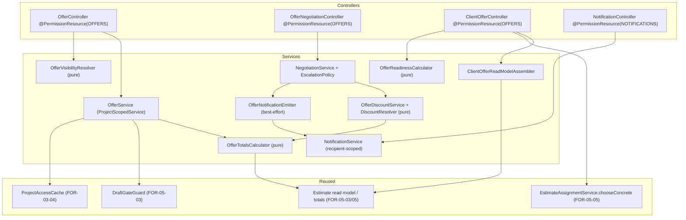

# Design Document

## Overview

FOR-05-07-offer-approval is the **offer preparation and client-negotiation** slice of a project
in the `DRAFT` design stage. It introduces the `Offer` (built from the project estimate in any
status; the former `PRICED` precondition has been removed per Requirements 1.1/1.2), scoped
`OfferDiscount`s, a two-sided threaded negotiation, a manager-gated client-visibility projection,
a confidential client read model, a client finishing-material selection surface that reuses the
FOR-05-05 `chooseConcrete` write path, and a **generic, offer-decoupled** notification service with
an in-app bell. It ends at a stable, immutable **APPROVED** offer version that FOR-05-14 (price
freeze) and FOR-05-09 (contract) consume; it does not itself freeze prices, generate contracts, or
perform the `APPROVED → ACTIVE` project transition.

The design is built on top of the existing platform primitives rather than new frameworks:

- **CRUD + ABAC**: `AdminService`/`AdminController`, `@PermissionResource`/`@PermissionOperation`
  + `PermissionInterceptor`, and the FOR-03-04 `ProjectScopedService` auto project filtering
  (`getProjectIdPath()`). New resources (`OFFERS`, `NOTIFICATIONS`) and the tightened role grants
  are seeded through idempotent Liquibase changesets exactly as `entity-creation-rules` requires.
- **Live-referenced pricing**: the offer stores **no** per-line price copy. It references the
  estimate by id (`Offer.estimate`) and maps only the estimate's client-facing FINAL price into a
  server-side `Client_Offer_Read_Model`, applying only its own discounts on top. Estimate changes
  flow into the offer automatically; costs/margins/estimate unit prices never reach a client.
- **Estimate service-lock**: the offer's price stability post-activation is delegated to the
  existing `DraftGateGuard` (`409 error.estimate.locked`) plus the FOR-05-14 signing snapshot — the
  offer never freezes its own numbers.
- **Reuse of FOR-05-05**: the concrete-material catalog, the `EstimateAssignmentService.chooseConcrete`
  write path, the package finishing-material propagation ("applied_from_package"), and
  `Materials_Fulfilment` are all FOR-05-05's. This spec adds only a **CLIENT-scoped, offer-stage,
  finishing-Placeholder-only** invocation of that write path plus its gating.
- **Reuse of the pricing tab**: the existing `pricing` workspace tab is repurposed as the Offer
  surface; its ABAC gate flips from `PROJECT_PRICING` to `OFFERS`, and a manager-controlled
  `Offer_Visibility_Status` gates client access.

### Scope boundaries (what this spec owns vs. delegates)

| Concern | Owner |
|---------|-------|
| `Offer` + `OfferDiscount` + `NegotiationRound` entities, status machine, totals, escalation | **this spec** |
| Live-referenced pricing model + `Client_Offer_Read_Model` confidentiality | **this spec** |
| Generic `Notification` service + in-app Bell + the two offer triggers | **this spec** |
| ABAC `OFFERS` (tightened) + `NOTIFICATIONS` resources; role-model deviation from parent §5 | **this spec** |
| Pricing-tab reuse, `Offer_Visibility_Status`, `Offer_Readiness` | **this spec** |
| CLIENT finishing-Placeholder invocation of `chooseConcrete` + `Client_Staging` UI | **this spec** (write path itself: FOR-05-05) |
| Concrete-material catalog, kosztorys `chooseConcrete`, package propagation, `Materials_Fulfilment` | FOR-05-05 |
| Price freeze (`OfferPriceSnapshot`), `OFFER_BASE` seeding | FOR-05-14 |
| Contract generation + e-signing, `APPROVED → ACTIVE` transition | FOR-05-09 |
| Client-facing portal rendering (reuses this spec's server actions) | FOR-09 |
| Amendments (post-`ACTIVE` price/material/volume changes) | FOR-06 |
| Additional notification channels (email/SMS/Telegram) + async fan-out | future work |

### Key design decisions

1. **`NegotiationRound` (a.k.a. `OfferRequest`) is a first-class entity**, not a status side-table.
   The full ordered thread is retained (never deleted), each round bound to the `Offer_Revision`
   in effect when created. A client `DISCOUNT_REQUEST` carries **no figure**; the manager owns the
   value via `MANAGER_PROPOSAL`, or refuses via `MANAGER_REJECT` (mandatory reasoned explanation).

2. **The figure lives only on `MANAGER_PROPOSAL`.** The entity model enforces this: `valueKind` and
   `value` are nullable and validated to be present **only** on `MANAGER_PROPOSAL` and absent on
   every other round kind. This makes Requirement 10.18 a data-shape invariant, not just a check.

3. **Scope override-and-cancel is a pure, deterministic resolver.** Applied discounts and accepted
   propositions collapse to a single surviving discount per line: `GLOBAL` supersedes `CATEGORY`
   supersedes `LINE`. The resolver is a pure function of the discount set (order-independent),
   making Requirements 2.5 / 4.9 / 10.16 property-testable without persistence.

4. **`ProjectStatus` is extended.** The live enum has only `DRAFT, ACTIVE, ON_HOLD, COMPLETED,
   CANCELLED`. Parent §4.3 requires `READY_TO_OFFER`, `OFFERED`, `APPROVED` between `DRAFT` and
   `ACTIVE`. This spec adds `READY_TO_OFFER`, `OFFERED`, `APPROVED` to the enum and drives the
   `READY_TO_OFFER → OFFERED` (send) and `OFFERED → APPROVED` (client approves) transitions only.

5. **`Offer_Visibility_Status` is a derived projection, not a second machine.** It is computed from
   `Offer_Status` (`DRAFT`→`DRAFT`; `SENT`/`CHANGES_REQUESTED`/`COUNTERED`→`ON_APPROVAL`;
   `APPROVED`→`APPROVED`) and used as the client-visibility gate. It never contradicts the
   `Offer_Status` machine.

6. **Confidentiality is a property of the read model, enforced server-side.** A CLIENT is served
   ONLY the `Client_Offer_Read_Model`; the offer DTO never embeds the Estimate DTO and never maps a
   cost/margin/worker-rate/estimate-unit-price field. This is verified by a structural test over the
   DTO type plus a property test over generated offers.

7. **The notification service is offer-decoupled and recipient-owned.** `Notification` is scoped to
   its `recipient` user (NOT project-scoped); ownership is enforced at the service layer using
   `actingUserId`. Emission from the offer flow is best-effort (log-only on failure, never rolls
   back the negotiation transition).

---

## Architecture

### Component map (backend)



The controllers are thin. All decision logic lives in services, and the arithmetic/ordering rules
live in **pure collaborators** (`OfferTotalsCalculator`, `DiscountResolver`, `OfferVisibilityResolver`,
`OfferReadinessCalculator`, `EscalationPolicy`) so they are directly property-testable with no
persistence.

### Request lifecycle (executor → client → agreed version)

```mermaid
sequenceDiagram
    participant M as MANAGER
    participant O as OfferService
    participant C as CLIENT
    participant N as NegotiationService
    participant NT as NotificationService

    M->>O: prepareOffer(project)  [estimate in any status]
    O-->>M: Offer{status=DRAFT, rev=1, selectedPackage from appliedPackageCode}
    M->>O: send()  → SENT, project OFFERED, visibility ON_APPROVAL
    C->>N: openDiscountRequest(scope,target,justification)  [no figure]
    N->>O: offer → CHANGES_REQUESTED
    N->>NT: emit(MANAGER, OFFER_NEGOTIATION_REQUESTED, deepLink)  [best-effort]
    M->>N: managerPropose(kind,value)  [escalation check]  → COUNTERED
    N->>NT: emit(CLIENT, OFFER_PROPOSAL, deepLink)
    C->>N: clientAccept()
    N->>O: materialize discounts (scope override) + rev++
    C->>O: approve()  → APPROVED, project APPROVED, visibility APPROVED
    O-->>O: mark Agreed_Offer_Version; emit state-change event (FOR-05-14/09 consume)
```

### Frontend surface

- The existing `pricing` workspace tab (`features/project-workspace/workspaceTabs.ts`) is
  repurposed: `requiredPermission` flips from `{ PROJECT_PRICING, READ }` to `{ OFFERS, READ }`,
  `labelKey` becomes `workspace.tab.offer` ("Оферта / согласование" / "Oferta / uzgodnienie"), and
  its lazy target swaps from `PlaceholderTab` to the real `OfferTab` panel in a new
  `features/project-offer/` module.
- The **Bell** is a new `features/notifications/` module rendering a `NotificationBell` into
  `TopBar` immediately before the language toggle button (and before the mobile `WorkingProjectChip`
  ordering is preserved), following the existing right-aligned control pattern.
- `Client_Staging` is a zustand store + pure reducer in `features/project-offer/state/`, modeled
  directly on `reserveDraftStore.ts`: pure, property-testable transforms with an undo/redo history
  stack, committed only on explicit save via the Requirement 11 write path.
- **Second prepare entry point (Requirement 21).** In addition to the OfferTab prepare action, the
  project **Estimate screen** gets a "Prepare offer" button, shown only to OFFERS/CREATE callers
  (MANAGER/ADMIN/ESTIMATOR) and **always enabled** (no `PRICED` gate, matching the removed
  precondition). On click it calls `POST /api/offers/project/{projectId}/prepare` (reusing the same
  `usePrepareOffer`/`prepareOffer` client as the OfferTab); on success it navigates to the
  Offer/approval tab, and on failure (e.g. an active offer already exists) it shows a localized toast
  and stays on the Estimate screen. The existing OfferTab prepare entry point is unchanged; both call
  the same endpoint. New `pl.json`/`ru.json` keys are added at strict parity.

### Technology choices

- Backend: Spring Boot + JPA (existing), Liquibase for schema/seeds, MapStruct DTO mapping, jqwik
  for property tests (already used, e.g. `DraftGateGuardPropertyTest`).
- Frontend: React + zustand + react-i18next (existing), fast-check for property tests of the pure
  staging/resolver logic where present.

---

## Components and Interfaces

### Backend services

#### `OfferService` (project-scoped)

Implements `ProjectScopedService<OfferServiceModel, OfferServiceExtendedModel, OfferEntity, Long>`
with `getProjectIdPath() = "project.id"` and `allowedProjectIds` wired to `ProjectAccessCache`.
Owns the offer lifecycle:

- `prepareOffer(projectId)` — preparation works from an estimate in **any** status (the former
  `PRICED` gate and its `error.offer.estimate.not.priced` message are removed per R1.1/R1.2; the
  `ESTIMATE_NOT_PRICED_MESSAGE` constant/throw no longer exists). The only prepare guards are the
  single-active-offer rule (rejects a second non-terminal offer, `409 error.offer.active.exists`)
  and entity existence; readiness remains visible. Creates `Offer{status=DRAFT, revision=1}`,
  resolves `estimate.appliedPackageCode → OfferPackage` for `selectedPackage` (null-safe per R1.7),
  computes totals.
- `selectPackage(offerId, packageCode)` — persists selection, re-derives the finishing selection
  (delegates to FOR-05-05 propagation), recomputes totals, bumps revision when the priced proposal
  changes.
- `send(offerId)` — `DRAFT → SENT`; project `READY_TO_OFFER → OFFERED`; visibility → `ON_APPROVAL`.
- `withdraw(offerId)` — non-terminal → `WITHDRAWN`.
- Transition enforcement delegated to `OfferStatusMachine` (pure). All writes assert the offer is
  non-terminal and the estimate is not service-locked (via `DraftGateGuard` when the write touches
  package/finishing selection).

#### `OfferStatusMachine` (pure)

`transition(current, action, actorRole) → next | IllegalTransition`. Encodes Requirement 3's legal
transitions and terminal states. Any undefined transition (including any exit from a terminal state)
throws `409 error.offer.illegal.transition`. This is the single source of truth for R3 / R10.5.

#### `OfferDiscountService` + `DiscountResolver` (pure)

- `DiscountResolver.resolveEffective(discounts, estimateLines) → Map<lineId, EffectiveDiscount>`:
  for each line, pick the single surviving discount — `GLOBAL` if present, else the `CATEGORY`
  covering the line's work-type group, else the line's own `LINE` discount — and clamp its effective
  amount to the line's net base. Pure and order-independent (R2.5 / R4.9 / R10.16).
- `OfferDiscountService.write(...)` validates `value >= 0` (R2.2), `PERCENT <= 100` (R2.3),
  `ABSOLUTE <= scope base` (R2.4); admits only executor writers — MANAGER/ADMIN/ESTIMATOR
  (ESTIMATOR holds OFFERS READ+CREATE+UPDATE) — and rejects every other caller server-side
  (R2.8 / R5.3); rejects writes on a terminal offer (R3.9). Recomputes totals on every change
  (R2.6). Note `(OFFERS, APPROVE)` is **not** granted to ESTIMATOR — approve stays MANAGER/ADMIN
  plus the CLIENT approve sub-action.

#### `OfferTotalsCalculator` (pure)

`compute(estimateClientPrices, effectiveDiscounts, vatRate) → {totalNet, totalVat, totalGross}`
where `totalNet = estimateTotalNet − Σ EffectiveDiscount(net)`, clamped so `totalNet >= 0` and no
single effective discount exceeds its base (R1.3 / R2.7 / R10.1 / R10.2 / R10.3). Operates over the
**live-referenced** estimate client-facing final prices; never over a stored offer copy (R19).

#### `NegotiationService` + `EscalationPolicy`

- `openDiscountRequest(offerId, scope, targetId, justification, clientComment?)` — CLIENT only;
  creates a `DISCOUNT_REQUEST` round with **no** value/kind (R4.1); `SENT`/`COUNTERED` →
  `CHANGES_REQUESTED`; emits notification to MANAGER (best-effort).
- `managerPropose(roundId, kind, value)` — MANAGER only; `EscalationPolicy.check(value)` gates on
  `Escalation_Threshold` (requires ADMIN approval when exceeded, R6.3/R6.5); records a
  `MANAGER_PROPOSAL`; `CHANGES_REQUESTED → COUNTERED`; emits notification to CLIENT.
- `managerReject(roundId, explanation)` — MANAGER only; **non-blank explanation required** (R4.8 /
  R6.6 → `400 error.offer.reject.explanation.required`); records `MANAGER_REJECT`; emits
  notification to CLIENT.
- `clientAccept(roundId)` — CLIENT only; materializes the proposal into applied `OfferDiscount`(s)
  respecting scope override-and-cancel, bumps `revision` (R4.5).
- `clientDecline(roundId)` — CLIENT only; opens the manager's next-response window (R4.4).
- Every mutator guards round state (R4.7 → `409 error.offer.round.resolved`) and binds the round to
  the current `Offer_Revision` (R4.6). A broader-scope proposition supersedes narrower ones (R4.9).

#### `EscalationPolicy`

Resolves the effective `Escalation_Threshold` = per-project override if present, else the GLOBAL
config value (percent and/or absolute cap, R6.4). `requiresAdminApproval(kind, value, scopeBase)`
returns true when the proposed value exceeds the cap. Config is a new `OfferSettings` (global
`application` config property + optional per-project row).

#### `ClientOfferReadModelAssembler`

Builds `ClientOfferReadModel` from an `OfferEntity` + the live estimate client-facing prices. It is
the **only** path that serves offer data to a CLIENT. By construction it maps ONLY offer-level
fields; it never reads or maps `cost_net`, margins, worker rates, or estimate unit prices (R15).
A dedicated structural test asserts the DTO type graph contains no cost/margin field name.

#### `OfferVisibilityResolver` (pure)

`visibilityOf(offerStatus) → Offer_Visibility_Status` per the R17.4 mapping; `assertClientVisible`
throws `404 error.entity.not.found` (indistinguishable from missing, matching `ProjectScopedService`
convention) when a CLIENT reaches an offer whose visibility is `DRAFT` (R5.9 / R17.5).

#### `OfferReadinessCalculator` (pure)

`readiness(openRounds, totalRounds, unfilledPlaceholders, totalPlaceholders) → percentage` combining
(a) unresolved negotiation proposals and (b) unfilled finishing Placeholders (R17.7). Exposed while
visibility is `ON_APPROVAL`; MAY surface through the FOR-05-01 ReadinessWidget.

#### Client finishing-material selection

`ClientOfferController` exposes:
- `POST /api/offers/{offerId}/finishing/{materialLineId}/choose-concrete` — CLIENT (own project) or
  MANAGER/ADMIN/ESTIMATOR. Delegates to the **existing** `EstimateAssignmentService.chooseConcrete(projectId,
  materialLineId, materialId)` after asserting: the line is `branch = finishing` AND a Placeholder
  (`concrete*Material == null`) AND the offer is non-terminal negotiable AND the estimate is `DRAFT`
  (R11.3/R11.5/R11.7). Any other client material write is rejected server-side (R5.8 / R11.4).
- Package change re-derives `Package_Derived_Finishing_Selection` via FOR-05-05 propagation and bumps
  revision (R11.1/R11.2).

The server re-validates every committed staged change (R18.5); staging/undo/redo is UI-only.

#### `NotificationService` (recipient-scoped, offer-decoupled)

- `create(recipientUserId, type, body, deepLink?)` — the generic extension point any flow calls
  (R13.2). No end-user `CREATE` grant.
- `listForActingUser(actingUserId)` — own notifications, `createdAt` DESC (R13.4/R13.8).
- `toggleRead(actingUserId, notificationId)` / `delete(actingUserId, notificationId)` — reject or
  omit any notification whose `recipient != actingUserId` (R13.9/R13.13 → `403
  error.notification.forbidden`).
- `unreadCount(actingUserId)` — badge count = number of the acting user's unread notifications
  (R10.10). Ownership is enforced via `actingUserId`, never via project-scoping (R10.9/R10.19).

#### `OfferNotificationEmitter` (best-effort)

Wraps `NotificationService.create` for the two offer triggers (R14). Each emission is a best-effort
side effect executed after the negotiation transition commits (or in a way that a failure cannot
roll it back): failures are logged and swallowed (R14.5 / R10.11). Deep-links target the Offer_Tab
of the project.

### Frontend components

| Component | Location | Responsibility |
|-----------|----------|----------------|
| `OfferTab` | `features/project-offer/components/OfferTab.tsx` | Panel for the reused `pricing` tab; renders offer, discounts, thread, material surface; role-aware actions |
| `NegotiationThread` | `features/project-offer/components/` | Ordered rounds (initiator, kind, value, justification/explanation, status) |
| `ClientMaterialSelection` | `features/project-offer/components/` | Finishing Placeholder selection (CLIENT-selectable) + per-material discount affordance; read-only elsewhere |
| `offerStagingStore` | `features/project-offer/state/` | zustand + pure reducer, undo/redo/discard, commit via R11 write path (mirrors `reserveDraftStore`) |
| `NotificationBell` | `features/notifications/components/NotificationBell.tsx` | TopBar bell + unread badge + popup list + toggle/delete/deep-link |
| `useOffer`, `useNotifications` | `features/*/hooks` | Data hooks over the REST endpoints |

---

## Data Models

### New entities

#### `OfferEntity` → `offers`

| Field | Type | Notes |
|-------|------|-------|
| `id` | BIGSERIAL PK | |
| `project` | FK `projects` (NOT NULL, UNIQUE where non-terminal) | scope root; `getProjectIdPath = "project.id"` |
| `estimate` | FK `estimates` (NOT NULL) | **live reference**; no price copy stored |
| `selectedPackage` | FK `offer_packages` (nullable) | seeded from `estimate.appliedPackageCode` (R1.6/R1.7) |
| `revision` | INT NOT NULL DEFAULT 1 | monotonically increasing (R1.5) |
| `status` | VARCHAR(32) NOT NULL | `Offer_Status` enum (R3.1) |
| `approvedRevision` | INT nullable | the `Agreed_Offer_Version` recorded at APPROVED (R7.1) |
| `totalNet` / `totalVat` / `totalGross` | NUMERIC(14,2) | **derived** from live estimate − discounts (R1.3); recomputed, not authoritative copies |
| audit cols | | `BaseEntity` |

A partial unique index enforces **at most one non-terminal offer per project** (R1.4): `UNIQUE
(project_id) WHERE status NOT IN ('APPROVED','REJECTED','WITHDRAWN')`.

> The totals columns are a computed convenience cache recomputed on every discount/package/estimate
> change; the authoritative price is always derived live from the referenced estimate + discounts
> (R19.4). They are never treated as a frozen per-line copy.

`Offer_Status` enum: `DRAFT, SENT, CHANGES_REQUESTED, COUNTERED, APPROVED, REJECTED, WITHDRAWN`
(`APPROVED`/`REJECTED`/`WITHDRAWN` terminal).

`Offer_Visibility_Status` is **derived** (not stored): `DRAFT → DRAFT`;
`SENT/CHANGES_REQUESTED/COUNTERED → ON_APPROVAL`; `APPROVED → APPROVED`.

#### `OfferDiscountEntity` → `offer_discounts`

| Field | Type | Notes |
|-------|------|-------|
| `offer` | FK `offers` (NOT NULL, ON DELETE CASCADE) | |
| `scope` | VARCHAR(16) NOT NULL | `GLOBAL` / `CATEGORY` / `LINE` |
| `targetId` | BIGINT nullable | null for GLOBAL; category id for CATEGORY; estimate line id for LINE |
| `kind` | VARCHAR(16) NOT NULL | `PERCENT` / `ABSOLUTE` |
| `value` | NUMERIC(14,4) NOT NULL, CHECK `value >= 0` | |
| `sourceRound` | FK `offer_negotiation_rounds` (nullable) | the accepted round that materialized it (R4.5) |
| audit cols | | scope `offer.project.id` |

#### `OfferNegotiationRoundEntity` → `offer_negotiation_rounds`

| Field | Type | Notes |
|-------|------|-------|
| `offer` | FK `offers` (NOT NULL) | |
| `offerRevision` | INT NOT NULL | revision in effect when created (R4.6) |
| `roundNo` | INT NOT NULL | ordered within offer |
| `initiatorRole` | VARCHAR(16) NOT NULL | `CLIENT` / `MANAGER` |
| `kind` | VARCHAR(24) NOT NULL | `DISCOUNT_REQUEST` / `MANAGER_PROPOSAL` / `MANAGER_REJECT` / `CLIENT_ACCEPT` / `CLIENT_DECLINE` |
| `scope` | VARCHAR(16) nullable | on `DISCOUNT_REQUEST` / `MANAGER_PROPOSAL` |
| `targetId` | BIGINT nullable | as per scope |
| `valueKind` | VARCHAR(16) nullable | **only** on `MANAGER_PROPOSAL` (R4.3/R10.18) |
| `value` | NUMERIC(14,4) nullable | **only** on `MANAGER_PROPOSAL` |
| `justification` | TEXT nullable | on client `DISCOUNT_REQUEST` |
| `explanation` | TEXT nullable | **NOT NULL/blank** on `MANAGER_REJECT` (R4.8) |
| `clientComment` | TEXT nullable | optional, LINE scope (R4.2) |
| `status` | VARCHAR(16) NOT NULL | `OPEN` / `ACCEPTED` / `DECLINED` / `REJECTED` / `SUPERSEDED` |
| `adminApproved` | BOOLEAN NOT NULL DEFAULT false | escalation gate (R6.3) |
| audit cols (`createdBy`, `createdAt`) | | scope `offer.project.id`; rounds are never deleted (R4.6) |

A DB CHECK constraint enforces the figure-ownership invariant: `value` and `value_kind` are non-null
**iff** `kind = 'MANAGER_PROPOSAL'`, and `explanation` is non-blank when `kind = 'MANAGER_REJECT'`.

#### `NotificationEntity` → `notifications`

| Field | Type | Notes |
|-------|------|-------|
| `recipient` | FK `users` (NOT NULL) | ownership root — **not** project-scoped (R13.1) |
| `type` | VARCHAR(128) NOT NULL | `Notification_Type` i18n key |
| `body` | TEXT | |
| `deepLink` | VARCHAR(512) nullable | UI target; null ⇒ non-interactive (R13.10) |
| `read` | BOOLEAN NOT NULL DEFAULT false | |
| audit cols (`createdAt`) | | |

Index `(recipient_id, read)` for the unread-count query and `(recipient_id, created_at DESC)` for
the list.

#### `OfferProjectSettingsEntity` → `offer_project_settings` (escalation override)

| Field | Type | Notes |
|-------|------|-------|
| `project` | FK `projects` (NOT NULL, UNIQUE) | |
| `escalationPercentCap` | NUMERIC(6,4) nullable | per-project override (R6.4) |
| `escalationAbsoluteCap` | NUMERIC(14,2) nullable | per-project override |

The GLOBAL default lives in application config (`foremen.offer.escalation.percent-cap`,
`...absolute-cap`).

### DTOs

- **`ClientOfferReadModel`** (served to CLIENT): `status`, `visibilityStatus`, `revision`,
  `selectedPackageCode`, `totalNet`/`totalVat`/`totalGross`, `perLineOfferPrice[]` (offer price
  only), `perCategoryOfferPrice[]`, `packagePrices[]`, `appliedDiscounts[]`, `finishing[]`
  (`Type_Price_Range` or chosen product price), `negotiationThread[]`, `readiness`. **Contains no**
  cost/margin/worker-rate/estimate-unit-price field; references the estimate only by id (R15/R19.3).
- **`ExecutorOfferReadModel`** (MANAGER/ADMIN/ESTIMATOR): the client fields plus manager controls
  state; still the offer domain. The kosztorys cost/margin read models remain separate: ESTIMATE is
  MANAGER/ADMIN/ESTIMATOR (ESTIMATOR READ+CREATE+UPDATE), while the FOR-05-06 cost/margin views stay
  **ADMIN/MANAGER only** (ESTIMATOR is excluded from cost/margin) per R16.
- **`AgreedOfferView`** (downstream FOR-05-14/09): the approved revision's totals, selected package,
  and applied discounts (R7.4).

### Enums / status extensions

- Extend `ProjectStatus` with `READY_TO_OFFER`, `OFFERED`, `APPROVED` (this spec drives
  `READY_TO_OFFER → OFFERED` and `OFFERED → APPROVED` only; `APPROVED → ACTIVE` is FOR-05-09).
- New enums: `OfferStatus`, `OfferVisibilityStatus`, `DiscountScope`, `DiscountKind`,
  `NegotiationRoundKind`, `NegotiationRoundStatus`.

### Liquibase changesets (idempotent, registered LAST in sequence)

Numbered from the next available sequence (current head is `127`; if FOR-05-06 tasks land further
changesets first, use the next free NNN). Each guarded with `onFail="MARK_RAN"` / `NOT
tableExists` / `NOT columnExists`.

| # | Changeset | Purpose |
|---|-----------|---------|
| NNN | `create-offers` | `offers` table + partial unique index (one non-terminal offer/project) |
| NNN+1 | `create-offer-discounts` | `offer_discounts` + FKs + CHECK `value >= 0` |
| NNN+2 | `create-offer-negotiation-rounds` | thread table + figure-ownership + reject-explanation CHECKs |
| NNN+3 | `create-notifications` | `notifications` + recipient FK + indexes |
| NNN+4 | `create-offer-project-settings` | per-project escalation override |
| NNN+5 | `add-project-status-values` | (no-op DDL; enum is app-level `VARCHAR`) documentation changeset if needed |
| NNN+6 | `seed-offers-resource` | `OFFERS` resource + ADMIN grant + role matrix (CLIENT/MANAGER only) + `APPROVE` operation seed |
| NNN+7 | `seed-notifications-resource` | `NOTIFICATIONS` resource + ADMIN grant + READ/UPDATE/DELETE for **every** role |
| NNN+8 | `retighten-estimate-and-offers-grants` | remove FOREMAN/WORKER/FINANCIER ESTIMATE + OFFERS grants (R16 deviation), archive-before-delete |
| 136 | `seed-estimator-role` | new system role `ESTIMATOR` + its grants (FOREMAN-equivalent + OFFERS R/C/U + ESTIMATE R/C/U), registered **last** after `135` |

The `OFFERS` seed adds a custom `APPROVE` operation row (idempotent) alongside CRUD so the CLIENT
"approve" sub-action is a first-class `(OFFERS, APPROVE)` grant. The `OFFERS` role matrix grants
MANAGER/ADMIN the executor operations and CLIENT the `(READ(own), APPROVE)` pair; the separately
seeded `ESTIMATOR` role (changeset `136`, below) adds OFFERS `READ+CREATE+UPDATE` (no APPROVE/DELETE)
as a third executor. `NOTIFICATIONS` grants READ/UPDATE/DELETE to every role and **no** `CREATE` to
end users (R13.13).

#### ESTIMATOR role seed (changeset `136`)

A new system role `ESTIMATOR` (code `ESTIMATOR`, `name_ru` "Сметчик", `name_pl` "Kosztorysant") is
seeded by changeset `136-seed-estimator-role.xml`, registered **last** in `changelog.xml` after the
existing head changeset `135`. Its grants are the **full FOREMAN grant set** (seeded by an
`INSERT ... SELECT` that joins the FOREMAN grants so ESTIMATOR mirrors FOREMAN exactly) **plus**
OFFERS `READ+CREATE+UPDATE` (no `APPROVE`, no `DELETE`) and ESTIMATE `READ+CREATE+UPDATE`. ESTIMATOR
is therefore an offer/estimate executor but is excluded from `(OFFERS, APPROVE)` and from the
FOR-05-06 cost/margin views (which stay ADMIN/MANAGER only, R16). The changeset is idempotent (role
insert guarded `onFail="MARK_RAN"` by `SELECT COUNT(*) FROM roles WHERE code = 'ESTIMATOR'` = 0; each
grant block self-guarded `NOT EXISTS`). Because `ESTIMATOR` is a **new** role added *after* the
grant-retighten changeset `135`, its grants are **not** caught by that retighten (which only strips
FOREMAN/WORKER/FINANCIER rows), so a re-apply retains the ESTIMATOR grants (R16.7, R16.8).

---

## Correctness Properties

*A property is a characteristic or behavior that should hold true across all valid executions of a
system — essentially, a formal statement about what the system should do. Properties serve as the
bridge between human-readable specifications and machine-verifiable correctness guarantees.*

The following properties are derived from the acceptance-criteria prework. Redundant criteria have
been consolidated: each property below provides unique validation value, and many acceptance
criteria map onto the same underlying invariant (noted in each `Validates` line). Access-control
wiring, ABAC seeding, UI rendering, i18n parity, and event/notification emission counts are covered
by example / integration / structural tests in the Testing Strategy, not as universally-quantified
properties.

### Property 1: Offer totals equal live-referenced estimate net minus effective discounts

*For all* priced estimates and *for all* discount sets, the offer's `totalNet` equals the referenced
estimate's client-facing final `totalNet` minus the sum of the effective discounts
(`totalNet = estimateTotalNet − Σ EffectiveDiscount(net)`), with `totalVat`/`totalGross` recomputed
from the discounted net at the project VAT rate — computed over the live-referenced estimate prices,
never over a stored per-line offer copy.

**Validates: Requirements 1.3, 2.6, 10.3, 10.15, 19.4**

### Property 2: Discount application never violates its bounds

*For all* discount configurations, the resulting offer `totalNet` is `>= 0` and each discount's
effective amount does not exceed its scope base.

**Validates: Requirements 2.7, 10.1, 10.2**

### Property 3: Scope override-and-cancel is deterministic and order-independent

*For all* sets of negotiation propositions and applied discounts on an offer, resolving the effective
discount per line selects the single surviving discount at the highest scope covering that line — a
`GLOBAL` discount supersedes the `CATEGORY` and `LINE` discounts it covers, and a `CATEGORY` discount
supersedes the `LINE` discounts within its work-type group — and the resulting per-line discounts and
totals are identical for every permutation of the same discount set (independent of insertion order).

**Validates: Requirements 1.4, 2.5, 4.9, 10.16**

### Property 4: The status machine performs no illegal transition

*For all* `(offer status, action, actor role)` triples, the transition is applied if and only if it
is defined by the Requirement 3 status machine; any undefined transition (including any exit from a
terminal state) is rejected and leaves the offer unchanged.

**Validates: Requirements 3.8, 10.5**

### Property 5: Terminal and approved offers are immutable

*For all* offers in a terminal state (`APPROVED` / `REJECTED` / `WITHDRAWN`), every mutating
operation — a discount write, a new negotiation round, a package change, or a client
finishing-material choice — is rejected; and *for all* `APPROVED` offers the agreed offer version's
totals, applied discounts, selected package, and package-derived finishing selection do not change.

**Validates: Requirements 3.9, 7.2, 10.4, 10.8, 12.5**

### Property 6: A client may write only a finishing Placeholder of its own project's offer

*For all* client material writes, the write is permitted if and only if the target is a **finishing**
Placeholder line (no concrete product chosen) of the caller's **own** project's offer; every other
client material write (construction, works, volumes, prices, or an already-chosen finishing line) is
rejected server-side.

**Validates: Requirements 5.8, 10.6, 11.4, 11.5**

### Property 7: A client concrete-finishing choice changes only the affected finishing line

*For all* client concrete-finishing choices, the choice alters only the affected finishing line's
chosen concrete material (and its derived price) and never alters any work, volume, or construction
material.

**Validates: Requirements 10.7**

### Property 8: Client material selection is permitted only while negotiable and estimate is DRAFT

*For all* `(offer status, estimate status)` combinations, a client finishing-material write succeeds
if and only if the offer is in a non-terminal negotiable state (`SENT` / `CHANGES_REQUESTED` /
`COUNTERED`) **and** the estimate is `DRAFT`; otherwise it is rejected server-side.

**Validates: Requirements 11.7**

### Property 9: A DRAFT-visibility offer denies all client access

*For all* offers whose derived `Offer_Visibility_Status` is `DRAFT`, every `CLIENT` member read or
action on the offer is denied server-side.

**Validates: Requirements 5.9, 10.13**

### Property 10: Offer visibility is a consistent projection of the offer status

*For all* offer statuses, the derived `Offer_Visibility_Status` follows the fixed mapping
(`DRAFT → DRAFT`; `SENT`/`CHANGES_REQUESTED`/`COUNTERED → ON_APPROVAL`; `APPROVED → APPROVED`) and no
visibility value ever contradicts a legal `Offer_Status`.

**Validates: Requirements 17.4, 17.9**

### Property 11: Escalation gates proposals above the threshold

*For all* proposed discount values, a `MANAGER_PROPOSAL` may be issued and a `CLIENT_ACCEPT` may
materialize it into an applied discount if and only if the proposed value does not exceed the
effective `Escalation_Threshold` (per-project override, else GLOBAL default) **or** an ADMIN approval
is present.

**Validates: Requirements 6.2, 6.3, 6.5, 12.3**

### Property 12: A manager rejection requires a non-blank explanation

*For all* manager rejections, a `MANAGER_REJECT` whose `explanation` is missing or blank (including
all-whitespace) is rejected server-side and never recorded.

**Validates: Requirements 4.8, 6.6, 10.17**

### Property 13: Only a manager proposal carries a discount figure

*For all* negotiation rounds, a client `DISCOUNT_REQUEST` carries no `value` and no value `kind`, and
only a `MANAGER_PROPOSAL` carries a discount `value` and `kind`.

**Validates: Requirements 4.1, 4.3, 10.18, 12.1**

### Property 14: Accepting a proposal materializes discounts respecting scope override and bumps the revision

*For all* accepted `MANAGER_PROPOSAL`s, the resulting applied `OfferDiscount` set respects the scope
override-and-cancel hierarchy (Property 3) and the offer `revision` increments by exactly one.

**Validates: Requirements 4.5, 12.4**

### Property 15: Acting on a resolved round is rejected

*For all* rounds already in a resolved state (`ACCEPTED` / `DECLINED` / `REJECTED` / `SUPERSEDED`),
any further action on that round is rejected.

**Validates: Requirements 4.7**

### Property 16: Preparing an offer succeeds from an estimate in any status

*For all* estimate statuses, preparing an offer succeeds (the former `PRICED` precondition and its
`error.offer.estimate.not.priced` message are removed per R1.1/R1.2); the only prepare guards are the
single-active-offer rule and entity existence.

**Validates: Requirements 1.1, 1.2**

### Property 17: The initial package is seeded from the estimate's applied package

*For all* estimates, the prepared offer's initial `selectedPackage` equals the `OfferPackage`
resolved from `estimate.appliedPackageCode`, or is `null` when the code is null or does not resolve
to a known package (offer creation never fails on an unresolvable code).

**Validates: Requirements 1.6, 1.7**

### Property 18: Notification access is limited to the acting user's own notifications

*For all* notifications and *for all* users, a read, read/unread toggle, or delete is permitted if
and only if the notification's `recipient` equals the acting user's id (`actingUserId`); any
notification whose `recipient` differs is rejected or omitted, enforced at the service layer and not
via project-scoping.

**Validates: Requirements 10.9, 10.19, 13.8, 13.9, 13.13**

### Property 19: The bell unread badge count equals the user's unread notifications

*For all* users at any time, the bell unread badge count equals the number of that user's
notifications whose `read` state is unread.

**Validates: Requirements 10.10**

### Property 20: A failed notification emission never blocks the triggering transition

*For all* negotiation transitions whose notification emission fails, the triggering domain transition
still commits and persists (emission is a best-effort, log-only-on-failure side effect).

**Validates: Requirements 10.11, 14.5**

### Property 21: A client is never served a cost, margin, worker-rate, or estimate-internal price field

*For all* offer responses served to a `CLIENT`, the payload contains no self-cost, cost, margin,
worker-rate, worker-type-tier, material `cost_net`, per-branch/per-tier margin, or estimate-internal
unit-price field — only offer-level fields (offer totals, per-line/per-category offer prices, package
prices, applied discounts, finishing `Type_Price_Range` / chosen product price).

**Validates: Requirements 5.11, 8.10, 10.12, 15.1, 15.2, 15.4, 15.5, 15.6, 19.3**

### Property 22: An active project rejects every estimate/offer price, material, or volume write

*For all* projects in `ProjectStatus` `ACTIVE`, every estimate/offer price, material, or volume write
is rejected at the service layer via the estimate service-lock (`409 error.estimate.locked`).

**Validates: Requirements 10.14, 20.2, 20.3, 20.4, 20.5**

### Property 23: Offer readiness is a correct function of open rounds and unfilled placeholders

*For all* combinations of open/unaccepted negotiation rounds and unfilled finishing Placeholder
slots, the `Offer_Readiness` percentage is the correct pure function of (a) the unresolved
negotiation proposals and (b) the unselected finishing materials, and equals 100% exactly when there
are no open rounds and no unfilled placeholders.

**Validates: Requirements 17.7**

### Property 24: Client staging undo/redo/discard round-trips

*For all* sequences of staged client selection operations (choose a finishing product, change the
package), an `undo` immediately followed by a `redo` returns the staging state to the same value, and
a `discard` restores the last committed selection; nothing is persisted until an explicit commit,
which maps exactly to the Requirement 11 write path.

**Validates: Requirements 18.1, 18.2, 18.3, 18.4**
