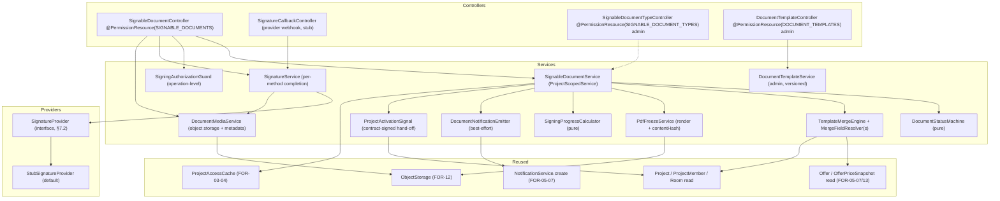
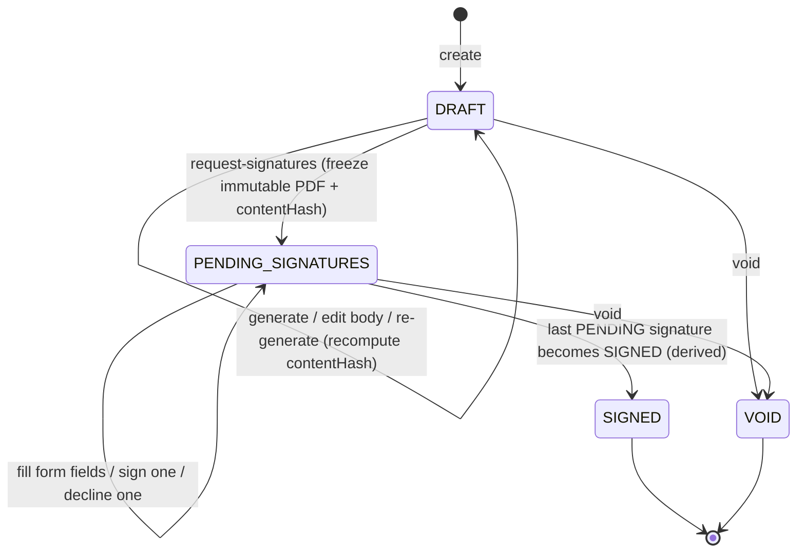
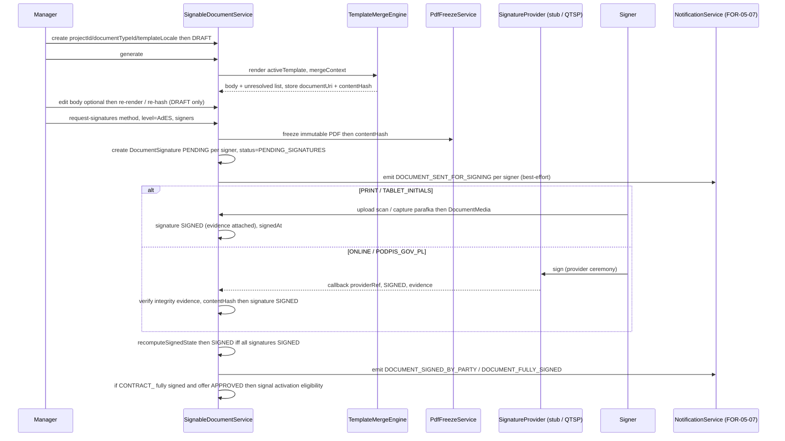

# Design Document

## Overview

FOR-05-08-document-signing delivers a **generic, reusable signable-document module** for the
Foremen platform. It turns the parent design's §4.8 entities (`SignableDocument`,
`SignableDocumentType`, `DocumentSignature`, `DocumentMedia`) and §11 legal grounding into a
concrete, testable domain that **any** feature can reuse to generate, send, sign, and store
legally meaningful documents. The contract is simply a `SignableDocument` whose type is
`CONTRACT_*`; this spec unifies the previously-planned `FOR-05-09-contracts-esign` and
`FOR-05-17-signable-documents` into one engine (OVERVIEW child row 08).

The module adds, on top of the parent model:

1. **Server-side generation by template merge** — a `DocumentTemplate` per type/locale stores a
   source body with `{Token}` placeholders; a named, unit-testable merge component
   (`TemplateMergeEngine` + `MergeFieldResolver`) renders a concrete DRAFT body from
   project/offer/room/company data (Requirement 3).
2. **An expanded, seeded `SignableDocumentType` catalog** matching the business templates in
   `docs/templates/` (Requirement 2).
3. **A signing lifecycle state machine** `DRAFT → PENDING_SIGNATURES → SIGNED` (+ `VOID`) with
   multiple designated signers and the invariant that a document is `SIGNED` **iff** all its
   signatures are `SIGNED` (parent Property 16; Requirements 1, 4, 6).
4. **Four signing methods** — `PRINT` and `TABLET_INITIALS` fully implemented (evidence upload);
   `ONLINE` and `PODPIS_GOV_PL` modeled behind a **provider abstraction** with a stub that drives
   the full status flow but makes no live QTSP / podpis.gov.pl call (Requirements 5, 6).
5. **Three eIDAS signature levels** `SES / AdES / QES`, default `AdES` (Requirement 5; parent §11).
6. **ABAC `SIGNABLE_DOCUMENTS`** project-scoped resource wired per `entity-creation-rules`, using
   only standard CRUD — signing is an `UPDATE` (Requirement 8).
7. **Notifications** emitted through the **existing generic notification service** (FOR-05-07
   Requirement 13); the module persists/delivers nothing itself (Requirement 11).
8. **An in-workspace "Document signing" tab** and an **in-app template editor** (Requirements 9,
   3a), both designed for reuse by FOR-06 and FOR-09 (Requirement 14).
9. **The `CONTRACT`-signed → `ProjectStatus.ACTIVE` eligibility hand-off** (Requirement 10).

The design is built on existing platform primitives rather than new frameworks:

- **CRUD + ABAC**: `AdminService`/`AdminController`, `@PermissionResource`/`@PermissionOperation`
  + `PermissionInterceptor`, and the FOR-03-04 `ProjectScopedService` auto project filtering
  (`getProjectIdPath()`). The new `SIGNABLE_DOCUMENTS` resource, the global reference resources,
  and the type catalog are seeded through idempotent Liquibase changesets per
  `entity-creation-rules`.
- **Notifications**: this module is a **consumer** of the FOR-05-07 `NotificationService.create`
  generic extension point. It never persists or delivers notifications; emission is best-effort.
- **Object storage (FOR-12)**: `DocumentMedia` and the frozen PDF/rendered bodies live in object
  storage; the DB keeps only metadata + `contentHash`, exactly like `RoomMedia`/`ProjectMedia`.
- **Pricing/activation ownership**: this spec consumes the FOR-05-07 `APPROVED` offer and the
  FOR-05-13 `OfferPriceSnapshot`/`DraftGate`; it only **signals** project activation eligibility.

### Scope boundaries (what this spec owns vs. delegates)

| Concern | Owner |
|---------|-------|
| `SignableDocument` + `SignableDocumentType` + `DocumentSignature` + `DocumentMedia` + `DocumentFormField`/`DocumentFormFieldValue` entities, status machine, totals of signing progress | **this spec** |
| `DocumentTemplate` storage + `.docx` import + merge-based body generation + `TemplateMergeEngine`/`MergeFieldResolver` | **this spec** |
| `PRINT` + `TABLET_INITIALS` end-to-end; `ONLINE` + `PODPIS_GOV_PL` provider abstraction + stub | **this spec** |
| ABAC `SIGNABLE_DOCUMENTS` (project-scoped) + `SIGNABLE_DOCUMENT_TYPES` / `DOCUMENT_TEMPLATES` (global admin-only); role matrix; CLIENT own-signature operation guard | **this spec** |
| In-workspace "Document signing" tab + the Requirement 3a template editor | **this spec** |
| i18n (entity `namePL`/`nameRU` + all UI keys at PL/RU parity) | **this spec** |
| `CONTRACT_*`-signed → project `DRAFT → ACTIVE` eligibility signal | **this spec** (signal only) |
| Generic `NotificationService` + in-app Bell | FOR-05-07 (reused, not re-implemented) |
| `APPROVED` offer, `OfferPriceSnapshot`, `DraftGate`/`EstimateStatus` lock | FOR-05-07 / FOR-05-13 (consumed) |
| Live QTSP / podpis.gov.pl integration | FOR-12 / config (only the abstraction + stub here) |
| FOR-06 amendment business flow; FOR-09 client-portal rendering | FOR-06 / FOR-09 (reuse this engine) |
| Object storage backend + e-signature provider plumbing | FOR-12 |
| email / SMS / Telegram delivery + async fan-out | future work |

### Key design decisions

1. **The DRAFT body is editable; the signing artifact is a frozen immutable PDF.** While `DRAFT`,
   the body is a rich document editable in the template editor and re-generable; on
   `request-signatures` the system **freezes an immutable PDF** of the current body, computes its
   `contentHash`, and from that point only **form-field values** and **signatures/evidence** may
   be added (Requirements 1.5, 1.6, 3.6, 3.7). This makes the immutable-PDF invariant a lifecycle
   gate, not a convention.

2. **Signing is an `UPDATE`, not a bespoke action.** The module introduces **no new ABAC
   operation**. A signer completing/declining their own `DocumentSignature` is an `UPDATE` of the
   document. The CLIENT's `UPDATE(own)` grant is further **narrowed server-side** by an
   operation-level guard (`SigningAuthorizationGuard`) so a CLIENT may only touch their own
   signature / their own form fields, never create, generate, request-signatures, void, or delete
   (Requirement 8.2, 8.4). This keeps the coarse CRUD matrix honest while enforcing the real
   policy at the service layer — mirroring how FOR-05-07 enforces CLIENT confidentiality.

3. **The state machine is a pure collaborator.** `DocumentStatusMachine.transition(current,
   action) → next | IllegalTransition` is the single source of truth for Requirement 1.3's legal
   transitions; it is pure and property-testable with no persistence.

4. **`document.status = SIGNED` is derived, never set directly.** The service never assigns
   `SIGNED` imperatively; it recomputes it from the signature set after every signature mutation
   (`recomputeSignedState`), so Property 16 is a data-shape consequence rather than a hand-managed
   flag (Requirements 1.4, 6.6).

5. **The merge layer is decoupled from the signing lifecycle.** `TemplateMergeEngine` consumes a
   `MergeContext` assembled by pluggable `MergeFieldResolver`s (project/client, offer, company,
   room, representative). Adding a new type/placeholder is a resolver + seed change, with no
   change to the signing code (Requirements 3.8, 14.4).

6. **The provider is config-selected and absence-tolerant.** `SignatureProvider` (parent §7.2) is
   resolved by configuration. The default `StubSignatureProvider` drives initiate → pending →
   callback → signed/declined without a live call. A missing live provider never breaks
   `PRINT`/`TABLET_INITIALS`, which do not use it (Requirements 5.4, 5.5).

7. **Executor requisites come from a small `CompanyProfile` reference entity** (Open Question 1).
   Several templates need full requisites (name, address, NIP, REGON, representative). A single
   admin-managed `CompanyProfile` row is cleaner than scattering requisites across app config and
   lets the merge resolver read them like any other domain source.

8. **CLIENT identity for multi-client projects is sign-any by default** (Open Question 3): a
   `signerRole = CLIENT` signature is satisfiable by **any** CLIENT member of the project unless a
   specific `signerUser` is set, consistent with parent Property 17 (multi-client allowed).

---

## Architecture

### Component map (backend)



Controllers are thin. All lifecycle decisions live in `SignableDocumentService`; the invariant
arithmetic/ordering rules live in **pure collaborators** (`DocumentStatusMachine`,
`SigningProgressCalculator`, `MergeFieldResolver` resolution, `SigningAuthorizationGuard`) so they
are property-testable with no persistence.

### Signing lifecycle (state machine)



Legal transitions are **exactly** those edges (Requirement 1.3). `SIGNED` is never a direct
target of a command: it is produced only by `recomputeSignedState` when the last signature
completes (Requirements 1.4, 6.6). Any body-text / template-binding / type mutation is rejected
once the document leaves `DRAFT` (Requirements 1.5, 1.6, 3.7); a `SIGNED` artifact is fully
immutable (Requirement 1.6).

### Generation + signing sequence



### Frontend surface

- A new project-workspace tab keyed **`documentSigning`** (label "Podpisanie dokumentów /
  Подписание документов"), registered in `features/project-workspace/workspaceTabs.ts` with
  `stage: 'design'`, `owner: 'FOR-05'`, `requiredPermission: { resource: 'SIGNABLE_DOCUMENTS',
  operation: 'READ' }`, pointing at a real `DocumentSigningTab` in a new
  `features/document-signing/` module. (The pre-existing placeholder `contract` tab keyed on the
  legacy `CONTRACTS` resource is **superseded** by this generalized tab; the design-first tasks
  phase decides whether to retire the `contract` row or leave it hidden until `CONTRACTS` is
  removed — no behavior depends on it today since `CONTRACTS` is never seeded.)
- The **template editor** lives in the admin area (not the project workspace), reached from an
  admin "Document templates" screen, since templates are a global reference (Requirements 3a.6,
  8.7). It reuses the same `features/document-signing/` client/types.
- The signing surface (server actions + components) is factored so **FOR-09** (client portal) and
  **FOR-06** (amendments/acceptances) reuse it without a server rewrite (Requirements 9.5, 14.3).

### Technology choices

- Backend: Spring Boot + JPA (existing), Liquibase for schema/seeds, MapStruct DTO mapping, jqwik
  for property tests (per repo convention, e.g. `DraftGateGuardPropertyTest`).
- `.docx` import / merge: a server-side document library (e.g. a DOCX/OOXML toolkit) renders the
  template body and performs the `{Token}` substitution; the **PDF freeze** uses a server-side
  HTML/DOCX→PDF renderer. The exact library is an implementation decision for the tasks phase
  (Open Question 4) and is isolated behind `TemplateMergeEngine` / `PdfFreezeService` so it can be
  swapped without touching the lifecycle.
- Frontend: React + react-i18next (existing). The Requirement 3a rich editor uses an embedded
  document-WYSIWYG editor library producing a paginated, Word-like surface with placeholder/
  form-field chips; the concrete library is chosen in the tasks phase (Open Question 4). fast-check
  for the pure client reducers where present.

---

## Components and Interfaces

### Backend services

#### `SignableDocumentService` (project-scoped)

Implements `ProjectScopedService<SignableDocumentServiceModel, SignableDocumentExtendedModel,
SignableDocumentEntity, Long>` with `getProjectIdPath() = "project.id"` and `allowedProjectIds`
wired to `ProjectAccessCache` (Requirement 1.8). It owns the lifecycle:

```java
public interface SignableDocumentService
        extends ProjectScopedService<SignableDocumentServiceModel,
                                      SignableDocumentExtendedModel,
                                      SignableDocumentEntity, Long> {

    @Override default String getProjectIdPath() { return "project.id"; }

    // create is NOT overridden by ProjectScopedService; CREATE is guarded by the controller
    // grant (MANAGER/ADMIN/FOREMAN) and the operation guard rejects CLIENT create (R8.4, R8.5).
    SignableDocumentDto create(CreateDocumentRequest req);              // -> DRAFT (R1.1, R13.1)
    SignableDocumentDto generate(Long id);                             // merge render, DRAFT only (R3.5, R13.1)
    SignableDocumentDto saveBody(Long id, DocumentBodyInput body);     // template-editor save, DRAFT only (R3.5, R13.1)
    SignableDocumentDto requestSignatures(Long id, RequestSignaturesInput in); // freeze PDF + PENDING_SIGNATURES (R1.5, R4.2, R13.1)
    SignableDocumentDto fillFormFields(Long id, FormFieldValuesInput in);      // PENDING only; CLIENT limited to own (R1.5, R3.6, R13.1)
    SignableDocumentDto voidDocument(Long id);                         // DRAFT/PENDING -> VOID (R1.3, R13.1)
    SigningProgressDto progress(Long id);                              // count signed/total + outstanding (R4.5)
}
```

- `requestSignatures` asserts the document is `DRAFT`, resolves the signer set (≥ 1), freezes the
  immutable PDF via `PdfFreezeService`, sets `contentHash`, creates one `DocumentSignature`
  (status `PENDING`) per signer with the chosen `method` and `level` (default `AdES`), transitions
  to `PENDING_SIGNATURES` via `DocumentStatusMachine`, and emits `DOCUMENT_SENT_FOR_SIGNING`
  (Requirements 1.5, 4.2, 5.2, 6.1).
- `generate`/`saveBody` reject any call once the document is not `DRAFT` (Requirements 3.7, 1.5).
- `voidDocument` rejects `SIGNED` and emits `DOCUMENT_VOIDED` to still-`PENDING` signers
  (Requirement 11.2).
- Every by-id read/mutation already runs `assertProjectAccess` through `ProjectScopedService`;
  the extra CLIENT policy is layered by `SigningAuthorizationGuard` (below).

#### `DocumentStatusMachine` (pure)

```java
public final class DocumentStatusMachine {
    public DocumentStatus transition(DocumentStatus current, DocumentAction action); // throws 409 error.document.illegal.transition
}
```

Encodes Requirement 1.3's legal edges and terminal states (`SIGNED`, `VOID`). Any undefined
transition (including any exit from a terminal state) throws `409
error.document.illegal.transition`. `SIGNED` is **not** reachable through this method — it is
derived (see `recomputeSignedState`).

#### `SignatureService` (per-method completion)

```java
public interface SignatureService {
    SignableDocumentDto completeViaProvider(Long documentId, SignRequest req);   // ONLINE / PODPIS_GOV_PL (R6.4) — an UPDATE
    SignableDocumentDto completeViaScan(Long documentId, MultipartFile scan);    // PRINT (R6.2) — an UPDATE
    SignableDocumentDto completeViaTablet(Long documentId, MultipartFile image); // TABLET_INITIALS (R6.3) — an UPDATE
    SignableDocumentDto decline(Long documentId, DeclineRequest req);            // -> DECLINED (R4.4) — an UPDATE
    SignableDocumentDto onProviderCallback(ProviderCallback cb);                 // webhook (stub) (R6.4, R13.1)
}
```

- `completeViaScan` / `completeViaTablet`: store the uploaded artifact as a `DocumentMedia` (kind
  `SCAN` / `TABLET_INITIAL`), then mark the caller's `DocumentSignature` `SIGNED` with `signedAt`
  and `evidenceUri`. The signature **cannot** reach `SIGNED` without the attached evidence
  (Requirements 6.2, 6.3, 7, Property 16).
- `completeViaProvider` / `onProviderCallback`: drive the `SignatureProvider` abstraction; before
  marking `SIGNED`, verify the sealed evidence integrity against the stored `contentHash`
  (Requirements 6.4, 5.3; parent §6.5). A mismatch rejects with `409 error.document.hash.mismatch`.
- After any signature becomes `SIGNED`, `SignableDocumentService.recomputeSignedState` runs:
  `document.status = SIGNED` **iff** every `DocumentSignature` is `SIGNED`; the transition is a
  single consistent operation (Requirements 1.4, 6.6, Property 16). On full-sign it emits
  `DOCUMENT_FULLY_SIGNED` and invokes `ProjectActivationSignal` for `CONTRACT_*` types.
- `decline` sets the caller's signature `DECLINED` with reason; it does **not** by itself void the
  document (Requirement 4.4) and emits `DOCUMENT_SIGNING_DECLINED` to the owner.

#### `SigningAuthorizationGuard` (operation-level)

The guard that makes CLIENT `UPDATE(own)` safe (Requirement 8.4). Given the acting user's project
role and the attempted action, it:

- allows a CLIENT **only** `sign` / `decline` / `fillFormFields` **on their own**
  `DocumentSignature` / own form fields;
- rejects a CLIENT attempt to `create`, `generate`, `saveBody`, `requestSignatures`, `void`, or
  `delete` with `403 error.document.operation.forbidden`, even though those map to `UPDATE`/`CREATE`
  nominally;
- restricts `create` / `generate` / `saveBody` / `requestSignatures` / `void` to MANAGER/ADMIN,
  plus FOREMAN for the protocol/acceptance/defect/statement/key-handover types it owns
  (Requirement 8.5). FOREMAN-owned types are a configured set keyed by `SignableDocumentType.code`.

This is an authorization check **beyond** the coarse CRUD bit, exactly the pattern FOR-05-07 uses
for CLIENT confidentiality — the ABAC matrix stays standard-CRUD-only (Requirement 8.2).

#### `SigningProgressCalculator` (pure)

```java
public SigningProgressDto progress(List<DocumentSignature> signatures);
// -> { signedCount, totalCount, outstanding: [signerRef...], allSigned }
```

Pure function of the signature set; `allSigned == (signedCount == totalCount && totalCount > 0)`
drives the derived `SIGNED` state and the UI progress (Requirements 4.5, 9.4).

#### `TemplateMergeEngine` + `MergeFieldResolver` (merge layer)

```java
public interface TemplateMergeEngine {
    MergeResult render(DocumentTemplate template, MergeContext ctx);  // body + unresolvedPlaceholders[]
}

public interface MergeFieldResolver {
    boolean supports(String token);
    String resolve(String token, MergeContext ctx);                  // null -> unresolved (R3.4)
}
```

`MergeContext` carries the resolved domain objects (project, CLIENT member(s), approved `Offer`
net total, rooms/area, MANAGER/FOREMAN representative, `CompanyProfile` requisites). Concrete
resolvers implement the placeholder groups of Requirement 3.3:

| Resolver | Tokens (examples) | Domain source |
|----------|-------------------|---------------|
| `DocumentMetaResolver` | `{Id}`, `{DocumentCreateTime}` | document id/number, `createdAt` |
| `ClientResolver` | `{ContactName}`, `{ContactLastName}`, `{ContactEmail}`, `{ContactAddress}`, `{RequisitePrimaryAddressText}` | project CLIENT member |
| `ScheduleResolver` | `{Begindate}`, `{Closedate}` | project/offer planned dates |
| `OfferTotalsResolver` | `{TotalBeforeTax}` | approved offer net total |
| `CompanyRequisitesResolver` | `{UfCrm1663076108Requisite…}` (name, address, NIP, REGON, representative) | `CompanyProfile` |
| `PropertyResolver` | `{UfCrm1662541716442}` (works address), `{UfCrm1691765118573}` (usable area) | project / room |
| `RepresentativeResolver` | `{AssignedName}`, `{AssignedLastName}`, `{UfCrm1692271880…}` | project MANAGER/FOREMAN |

Unresolved behavior is **deterministic and reported** (Requirement 3.4): the engine returns the
set of unresolved tokens; the service either leaves a clearly marked blank (`«___»` placeholder) or
fails with `422 error.document.unresolved.placeholders` carrying the list, selectable per request —
never silent empty substitution. The engine and resolvers are named, unit-testable components so a
new type/placeholder is added without touching the signing lifecycle (Requirements 3.8, 14.4).

#### `PdfFreezeService`

```java
public FrozenArtifact freeze(SignableDocumentEntity doc); // render current body -> immutable PDF + sha-256 contentHash
```

Renders the current DRAFT body (including declared form fields as fillable regions) to a canonical
PDF, stores it in object storage, and returns `{ storageUri, contentHash }`. Called exactly once,
on `request-signatures`; the body text is byte-immutable thereafter (Requirements 1.5, 3.6; NFR 5).

#### `DocumentMediaService`

Project-scoped media service (via `document.project.id`) mirroring `RoomMedia`/`ProjectMedia`:
validates content type + size (rejecting disallowed types, Requirement 7.3), stores the file in
object storage (FOR-12) with only metadata + `kind` in the DB (Requirement 7.2), and refuses to
delete a `DocumentMedia` that is the completion evidence of a `SIGNED` signature (Requirement 7.4).

#### `DocumentTemplateService` (admin, versioned)

Admin-only CRUD over `DocumentTemplate` (Requirement 3a): list/create/read/update, `.docx` import
(seed from `docs/templates/`), activate/deactivate per (`documentType`, `locale`), versioned saves
(bump `version`, keep prior versions retrievable), and a **test-merge preview** against sample or a
selected project's data returning the rendered body + unresolved placeholders (Requirement 3a.4).
Templates are **deactivated, never deleted** (Requirements 2.5, 3a.1). Exactly one active template
per (`documentType`, `locale`) (Requirement 3.2).

#### `SignatureProvider` abstraction + `StubSignatureProvider`

Reuses the parent §7.2 interface:

```java
public interface SignatureProvider {
    SignatureSession createSession(URI doc, String contentHash, Signer s, SignatureLevel level);
    SignatureOutcome verify(String providerRef, byte[] evidence);
}
```

- `StubSignatureProvider` (default, config `foremen.signing.provider=stub`) returns a synthetic
  `providerRef`, drives the status flow (initiate → pending → callback → signed/declined), and in
  `verify` recomputes/compares the hash of the (synthetic) evidence against the stored
  `contentHash` so the integrity path is exercised end-to-end **without** a live QTSP /
  podpis.gov.pl call (Requirements 5.3, 5.4).
- The provider is chosen by configuration; its absence never affects `PRINT`/`TABLET_INITIALS`,
  which do not use it (Requirement 5.5). A concrete QTSP / Profil Zaufany implementation is
  pluggable later via FOR-12/config without redesign.

#### `DocumentNotificationEmitter` (best-effort)

Wraps `NotificationService.create(recipientUserId, type, body, deepLink)` for the five triggers of
Requirement 11.2. Emission is a best-effort side effect executed after the lifecycle transition
commits (an `AFTER_COMMIT` `@TransactionalEventListener`, so a failure cannot roll back the
signing transition); failures are logged and swallowed (Requirement 11.1; FOR-05-07 §Key decision
7). Each notification carries a **deep-link** to the document in the signing tab (Requirement
11.3). No notification is emitted for pure DRAFT edits (Requirement 11.5).

| Type (i18n key) | Recipient | Trigger |
|-----------------|-----------|---------|
| `DOCUMENT_SENT_FOR_SIGNING` | each designated signer | `request-signatures` |
| `DOCUMENT_SIGNED_BY_PARTY` | document owner | a signer completes |
| `DOCUMENT_FULLY_SIGNED` | owner + all signers | document → `SIGNED` |
| `DOCUMENT_SIGNING_DECLINED` | document owner | a signer declines |
| `DOCUMENT_VOIDED` | all still-`PENDING` signers | void of a `PENDING_SIGNATURES` document |

#### `ProjectActivationSignal` (contract-signed hand-off)

```java
public void onContractSigned(SignableDocumentEntity doc); // idempotent (R10.4)
```

When a `CONTRACT_*` document reaches `SIGNED` on a project whose offer is `APPROVED`, it signals
the project eligible for `DRAFT → ACTIVE` (Requirement 10.1). It does **not** re-implement the
`DraftGate`/`EstimateStatus` lock or the `OfferPriceSnapshot` freeze (owned by FOR-05-07/13,
Requirement 10.2); a non-contract type triggers nothing (Requirement 10.3); re-signaling an
already-active project is a no-op (Requirement 10.4).

### Backend controllers (ABAC-wired per `entity-creation-rules`)

| Controller | `@PermissionResource` | Project-scoped | Notes |
|------------|-----------------------|:--------------:|-------|
| `SignableDocumentController` | `SIGNABLE_DOCUMENTS` | yes | all project document + signing endpoints; every handler carries a method-level `@RequiresPermission` mapping to standard CRUD (R8.1, R8.6, R13.1) |
| `SignatureCallbackController` | — (public webhook, stub) | n/a | `POST /api/signatures/callback`; not ABAC-guarded (unauthenticated provider webhook), verified by provider ref + `contentHash` (R13.1); intentionally unguarded like `AuthController` per `entity-creation-rules` |
| `SignableDocumentTypeController` | `SIGNABLE_DOCUMENT_TYPES` | no (global) | ADMIN-only type CRUD + activate/deactivate (R2.4, R2.5, R8.7) |
| `DocumentTemplateController` | `DOCUMENT_TEMPLATES` | no (global) | ADMIN-only template CRUD, `.docx` import, body edit (editor), version/activate, test-merge (R3a, R8.7) |

Each guarded controller is **fully annotated** — the class `@PermissionResource` combines with
each handler's `@PermissionOperation` (or a method-level `@RequiresPermission` for the custom
action endpoints), so `PermissionAnnotationValidator` classifies it COMPLETE at startup
(Requirement 8.6). The signing action endpoints (`/sign`, `/sign-tablet`, `/media`, `/decline`,
`/form-fields`) all carry `@RequiresPermission(resource = "SIGNABLE_DOCUMENTS", operation =
"UPDATE")` — signing is an `UPDATE`, no new operation (Requirement 8.2).

### Frontend components

| Component | Location | Responsibility |
|-----------|----------|----------------|
| `DocumentSigningTab` | `features/document-signing/components/DocumentSigningTab.tsx` | the project-workspace tab: lists documents (type, status, progress, created); role-aware actions (R9.1–9.4) |
| `DocumentDetail` | `features/document-signing/components/` | one document: body/artifact preview, signer list + per-signer progress, action bar (R9.2, R9.4) |
| `RequestSignaturesDialog` | `features/document-signing/components/` | pick signers + method + level; triggers the PDF freeze (R9.2) |
| `TabletParafkaCapture` | `features/document-signing/components/` | on-tablet handwritten initial capture → `sign-tablet` (R6.3, R9.2) |
| `ScanUpload` | `features/document-signing/components/` | upload wet-ink scan → `media` (R6.2, R9.2) |
| `FormFieldsPanel` | `features/document-signing/components/` | fill-in blanks (PENDING only; CLIENT limited to own) (R1.5, R3.6, R9.2) |
| `TemplateEditor` | `features/document-signing/components/TemplateEditor.tsx` | admin WYSIWYG document editor: paginated Word-like surface, placeholder/form-field chip insertion, test-merge preview, version/activate controls (R3a) |
| `useSignableDocuments`, `useDocumentTemplates` | `features/document-signing/hooks` | data hooks over the REST endpoints |

The CLIENT-facing view in the tab exposes **only** read + the CLIENT's own-signature `UPDATE`
(sign / decline / fill own form fields) and never costs/estimate/margins (Requirements 9.6, 13.3,
FOR-05-07 confidentiality). Action visibility is driven by `usePermission` exactly like main-menu
entries (Requirement 9.3). The signing components and server actions are exported so FOR-09 and
FOR-06 reuse them without a server rewrite (Requirements 9.5, 14.3).

---

## Data Models

### New entities

#### `SignableDocumentEntity` → `signable_documents`

| Field | Type | Notes |
|-------|------|-------|
| `id` | BIGSERIAL PK | |
| `project` | FK `projects` (NOT NULL) | scope root; `getProjectIdPath = "project.id"` (R1.8) |
| `documentType` | FK `signable_document_types` (NOT NULL) | (R1.1) |
| `status` | VARCHAR(24) NOT NULL DEFAULT `'DRAFT'` | `DRAFT`/`PENDING_SIGNATURES`/`SIGNED`/`VOID` (R1.2) |
| `title` | VARCHAR(255) nullable | (R1.1) |
| `sourceRef` | VARCHAR(255) nullable | optional originating-object ref, e.g. an offer id (R1.1, R14.1) |
| `signatureLevel` | VARCHAR(8) nullable | document-level default level, `AdES` default (R5.2) |
| `templateLocale` | VARCHAR(16) nullable | locale used at generation (R3.2) |
| `documentUri` | VARCHAR(512) nullable | DRAFT body (object storage) / frozen PDF uri (R1.1, R3.5) |
| `contentHash` | VARCHAR(128) nullable | sha-256 of the body/frozen PDF (R1.1, R3.5, R6.4) |
| `createdBy` | FK `users` (NOT NULL) | the owner (R1.1, R11.2) |
| audit cols | | `BaseEntity` (`createdAt` etc.) |

#### `SignableDocumentTypeEntity` → `signable_document_types` (global reference, i18n)

| Field | Type | Notes |
|-------|------|-------|
| `code` | VARCHAR(64) UNIQUE NOT NULL | (R2.1) |
| `namePL` | VARCHAR(255) NOT NULL | the only backend i18n field (PL) (R2.1, R2.2, R12.1) |
| `nameRU` | VARCHAR(255) nullable | i18n (RU); display uses `namePL` with PL fallback (R2.2, R2.3, R12.3) |
| `active` | BOOLEAN NOT NULL DEFAULT `true` | deactivated, never deleted (R2.5) |
| `defaultSignatureLevel` | VARCHAR(8) nullable | optional per-type default level (R2.1) |

Seeded (idempotent, `onFail="MARK_RAN"`) with the 14 types of Requirement 2.3 (`CONTRACT_WORKS`,
`CONTRACT_WORKS_PL_RU`, `CONTRACT_DESIGN`, `CONTRACT_COMPLEX`, `CONTRACT_PACKAGES`,
`CONTRACT_RESERVATION`, `CONTRACT_SUBCONTRACTOR`, `AMENDMENT`, `HANDOVER_TO_RENOVATION`,
`WORKS_ACCEPTANCE`, `DEFECT_FORM`, `WORKS_MANAGER_STATEMENT`, `ROOM_ACCEPTANCE`, `KEY_HANDOVER`).
Contract types are matched by the `CONTRACT_*` code prefix for the activation hand-off
(Requirement 10.1).

#### `DocumentTemplateEntity` → `document_templates` (global reference, versioned)

| Field | Type | Notes |
|-------|------|-------|
| `documentType` | FK `signable_document_types` (NOT NULL) | (R3.1) |
| `name` | VARCHAR(255) NOT NULL | |
| `locale` | VARCHAR(16) NOT NULL | `PL`/`RU`/`BILINGUAL` (R3.1) |
| `storageUri` | VARCHAR(512) NOT NULL | stored source file (object storage) (R3.1) |
| `version` | INT NOT NULL DEFAULT 1 | bumped on edit; prior versions retained (R3a.5) |
| `active` | BOOLEAN NOT NULL DEFAULT `true` | exactly one active per (`documentType`, `locale`) (R3.2) |
| `uploadedBy` | FK `users` (NOT NULL) | (R3.1) |
| audit cols | | `BaseEntity` (`uploadedAt` = `createdAt`) |

A partial unique index enforces **at most one active template per (type, locale)**: `UNIQUE
(document_type_id, locale) WHERE active = true` (R3.2).

#### `DocumentFormFieldEntity` → `document_form_fields`

Declared fill-in blanks on a document (or template-declared, copied onto the document at
generation). Part of the frozen artifact; the only textual content a signer may add after the
freeze (Requirements 3.6, 1.5).

| Field | Type | Notes |
|-------|------|-------|
| `document` | FK `signable_documents` (NOT NULL) | scope `document.project.id` |
| `key` | VARCHAR(128) NOT NULL | field key (e.g. `pesel`, `idDocNumber`) |
| `label` | VARCHAR(255) | display label (localized on FE) |
| `ownerRole` | VARCHAR(16) nullable | which signer role may fill it (CLIENT own-fields constraint, R8.4) |
| `value` | TEXT nullable | filled value; editable only while `PENDING_SIGNATURES` (R1.5) |

> Form-field values are stored on the row (`value`) rather than a separate value table to keep the
> model small; the frozen PDF regions reference the field `key`. The tasks phase MAY split a
> `DocumentFormFieldValue` table if multi-signer per-field values are needed.

#### `DocumentSignatureEntity` → `document_signatures`

| Field | Type | Notes |
|-------|------|-------|
| `document` | FK `signable_documents` (NOT NULL) | scope `document.project.id` (R4.1) |
| `signerUser` | FK `users` (nullable) | explicit signer; null ⇒ resolved by role (R4.1, R4.3) |
| `signerRole` | VARCHAR(16) nullable | e.g. `CLIENT`; CLIENT resolves to project CLIENT member(s), sign-any (R4.3, decision 8) |
| `method` | VARCHAR(24) NOT NULL | `SignatureMethod` (R4.1, R6.1) |
| `level` | VARCHAR(8) NOT NULL DEFAULT `'AdES'` | `SignatureLevel` (R4.1, R5.1, R5.2) |
| `providerRef` | VARCHAR(255) nullable | provider session ref for `ONLINE`/`PODPIS_GOV_PL` (R4.1) |
| `signedAt` | TIMESTAMP nullable | set on completion, every method (R4.1, R6.5) |
| `evidenceUri` | VARCHAR(512) nullable | scan / tablet image / sealed PDF uri (R4.1) |
| `status` | VARCHAR(16) NOT NULL DEFAULT `'PENDING'` | `PENDING`/`SIGNED`/`DECLINED` (R4.1, R4.4) |
| `declineReason` | TEXT nullable | on `DECLINED` (R4.4) |
| audit cols | | `BaseEntity` |

#### `DocumentMediaEntity` → `document_media`

| Field | Type | Notes |
|-------|------|-------|
| `document` | FK `signable_documents` (NOT NULL) | scope `document.project.id` (R7.1) |
| `fileName` | VARCHAR(255) NOT NULL | (R7.1) |
| `contentType` | VARCHAR(128) NOT NULL | validated on upload (R7.3) |
| `sizeBytes` | BIGINT NOT NULL | validated on upload (R7.3) |
| `storageUri` | VARCHAR(512) NOT NULL | object storage (FOR-12) (R7.2) |
| `kind` | VARCHAR(24) NOT NULL | `SCAN`/`TABLET_INITIAL`/`RENDERED_BODY`/`ATTACHMENT` (R7.1) |
| `uploadedBy` | FK `users` (NOT NULL) | (R7.1) |
| audit cols | | `BaseEntity` (`uploadedAt` = `createdAt`) |

Deleting a `DocumentMedia` that is the evidence of a `SIGNED` signature is rejected (R7.4).

#### `CompanyProfileEntity` → `company_profile` (global reference, admin-only)

The executor (`Wykonawca`) requisites source (decision 7 / Open Question 1): a single
admin-managed row — `fullName`, `registeredAddress`, `nip`, `regon`, `representativeName`,
`representativeRole`, `email` — read by `CompanyRequisitesResolver`. Governed by an admin-only
grant; standard CRUD only.

### Enums

- `DocumentStatus = { DRAFT, PENDING_SIGNATURES, SIGNED, VOID }` (R1.2) — app-level `VARCHAR`.
- `SignatureMethod = { PRINT, ONLINE, PODPIS_GOV_PL, TABLET_INITIALS }` (R6.1).
- `SignatureLevel = { SES, AdES, QES }`, default `AdES` (R5.1, R5.2; parent §11.2).
- `SignatureStatus = { PENDING, SIGNED, DECLINED }` (R4.1).
- `DocumentMediaKind = { SCAN, TABLET_INITIAL, RENDERED_BODY, ATTACHMENT }` (R7.1).

All classifiers except `SignableDocumentType.namePL`/`nameRU` are enums localized **on the
frontend** — no DB i18n columns (Requirement 12.1).

### DTOs

- `SignableDocumentDto` — `{ id, projectId, documentTypeCode, status, signatureLevel, title,
  createdAt, signatures: DocumentSignatureDto[], media: DocumentMediaSummaryDto[], formFields:
  FormFieldDto[], progress: SigningProgressDto }`. Client-reachable responses never carry
  cost/estimate/margin fields (Requirement 13.3, 9.6).
- `SigningProgressDto` — `{ signedCount, totalCount, allSigned, outstanding: SignerRefDto[] }`.
- `DocumentTemplateDto`, `TestMergeResultDto` (`{ renderedBodyUri/html, unresolvedPlaceholders[] }`),
  `CreateDocumentRequest`, `RequestSignaturesInput`, `SignRequest`, `DeclineRequest`,
  `FormFieldValuesInput`, `ProviderCallback`.

### Liquibase changesets (idempotent, registered LAST in sequence)

Current changelog head is **136** (FOR-05-07 `136-seed-estimator-role.xml`). FOR-05-08 changesets
start at **137**; if sibling specs land further changesets first, use the next free NNN. Each is
guarded with `onFail="MARK_RAN"` / `NOT tableExists` / `NOT columnExists` / `sqlCheck`, registered
**last** in `changelog.xml`, following the `017-seed-users-resource.xml` two-changeSet
resource+grant pattern.

| # | Changeset | Purpose |
|---|-----------|---------|
| 137 | `create-signable-document-types` | `signable_document_types` table + unique `code` |
| 138 | `seed-signable-document-types` | the 14 types (R2.3), idempotent per-row `NOT EXISTS` |
| 139 | `create-document-templates` | `document_templates` + partial unique index (one active per type/locale) |
| 140 | `create-company-profile` | `company_profile` single-row reference |
| 141 | `create-signable-documents` | `signable_documents` + FKs + status default `DRAFT` |
| 142 | `create-document-form-fields` | `document_form_fields` |
| 143 | `create-document-signatures` | `document_signatures` + FKs + status default `PENDING` |
| 144 | `create-document-media` | `document_media` + FKs |
| 145 | `seed-signable-documents-resource` | **`SIGNABLE_DOCUMENTS`** resource row + ADMIN CRUD grant + the full role matrix (R8.1, R8.3) |
| 146 | `seed-signable-document-types-resource` | **`SIGNABLE_DOCUMENT_TYPES`** global resource + ADMIN CRUD grant (R8.7) |
| 147 | `seed-document-templates-resource` | **`DOCUMENT_TEMPLATES`** global resource + ADMIN CRUD grant (R8.7, R3a.6) |
| 148 | `seed-company-profile-resource` | **`COMPANY_PROFILE`** global resource + ADMIN CRUD grant |

The `145-seed-signable-documents-resource` changeset seeds the project-scoped `SIGNABLE_DOCUMENTS`
role matrix of Requirement 8.3 (standard CRUD only — **no** new operation):

| Resource | ADMIN | MANAGER | FOREMAN | WORKER | FINANCIER | CLIENT |
|----------|-------|---------|---------|--------|-----------|--------|
| `SIGNABLE_DOCUMENTS` | CRUD | CRUD | CRU | R | R | RU |

`(own)` scoping is enforced by `ProjectScopedService` project filtering; the CLIENT `U` is further
narrowed to own-signature by `SigningAuthorizationGuard` (Requirement 8.4). ADMIN is still seeded
for completeness though `ForemenPermissionEvaluator` bypasses the matrix for the exact `ADMIN`
code (`entity-creation-rules` step 2).

---

## Correctness Properties

The following are the executable correctness properties for property-based testing of this module.
Each is stated as a checkable invariant over generated inputs (signature sets, action sequences,
merge contexts) and is independent of persistence where a pure collaborator exists
(`DocumentStatusMachine`, `SigningProgressCalculator`, `MergeFieldResolver`/`TemplateMergeEngine`).
They refine the parent design's §12 properties for this spec.

### Property 1: SignableDocument is SIGNED iff all signatures are SIGNED

**Validates: Requirements 1.4, 6.6**

For any `SignableDocument` `d` with signature set `S`:

```
d.status == SIGNED  ⟺  (S is non-empty  ∧  ∀ s ∈ S : s.status == SIGNED)
```

The `SIGNED` state is **derived** by `recomputeSignedState`, never assigned imperatively; so for
every reachable state, `d.status == SIGNED` holds **iff** every `DocumentSignature` of `d` is
`SIGNED` and at least one signature exists. (Requirements 1.4, 6.6; parent Property 16.)

### Property 2: Status machine permits only the legal transitions

**Validates: Requirements 1.3, 1.4, 6.6**

For any `(current, action)`, `DocumentStatusMachine.transition` returns a next state **iff** the
edge is one of the legal command edges, otherwise it throws `error.document.illegal.transition`:

```
legalCommandEdges = {
  (DRAFT, request-signatures) → PENDING_SIGNATURES,
  (DRAFT, void)               → VOID,
  (PENDING_SIGNATURES, void)  → VOID
}
transition(c, a) defined  ⟺  (c, a) ∈ legalCommandEdges
```

`SIGNED` is **never** a direct target of `transition`: `PENDING_SIGNATURES → SIGNED` happens only
as the derived consequence of the last signature completing (Property 16), and no action can exit a
terminal state (`SIGNED`, `VOID`). Totality: for every input, `transition` either returns a legal
next state or throws — no input yields an undefined/illegal state. (Requirements 1.3, 1.4, 6.6.)

### Property 3: Body, binding, and type are immutable after freeze; SIGNED is fully immutable

**Validates: Requirements 1.5, 1.6, 3.7**

For any document `d` with `d.status ≠ DRAFT`, any mutation of the body text, template binding, or
document type is rejected (`error.document.frozen` / `error.document.illegal.transition`); the only
permitted additive mutations are form-field **values** and signatures/evidence while
`PENDING_SIGNATURES`:

```
d.status ≠ DRAFT  ⟹  bodyText, templateBinding, documentType are immutable
d.status == SIGNED ∨ d.status == VOID  ⟹  d is fully immutable (no mutation accepted)
```

Equivalently, across any action sequence, the frozen PDF `contentHash` is stable from the moment
`d` enters `PENDING_SIGNATURES`: no sequence of form-field fills or signature completions changes
it, and any body-text edit after the freeze is rejected. (Requirements 1.5, 1.6, 3.7; NFR 5.)

### Property 4: Evidence and integrity preconditions for reaching SIGNED

**Validates: Requirements 5.3, 6.2, 6.3, 6.4**

A signature cannot become `SIGNED` without its method-specific evidence/integrity precondition:

```
s.method ∈ {PRINT, TABLET_INITIALS} ∧ s.status == SIGNED
    ⟹ ∃ DocumentMedia m attached to s  (evidence present)

s.method ∈ {ONLINE, PODPIS_GOV_PL} ∧ s.status == SIGNED
    ⟹ hash(s.sealedEvidence) == d.contentHash  (integrity matches frozen artifact)
```

Attempting to mark a `PRINT`/`TABLET_INITIALS` signature `SIGNED` with no attached
`DocumentMedia` is rejected (`error.document.evidence.required`); an `ONLINE`/`PODPIS_GOV_PL`
completion whose sealed-evidence hash differs from the stored `contentHash` is rejected
(`error.document.hash.mismatch`). Combined with Property 16, a document reaches `SIGNED` only when
every signature satisfied its evidence/integrity precondition. (Requirements 6.2, 6.3, 6.4, 5.3;
NFR 4.)

### Property 5: Signing progress is a pure function of the signature set

**Validates: Requirements 4.5, 9.4**

For any signature set `S`, `SigningProgressCalculator` satisfies:

```
signedCount == |{ s ∈ S : s.status == SIGNED }|
totalCount  == |S|
allSigned   == (signedCount == totalCount ∧ totalCount > 0)
```

`allSigned` is exactly the condition that drives the derived `SIGNED` state (so it agrees with the
all-signatures-signed invariant for the same `S`), and `allSigned == false` for an empty set or
whenever any signature is `PENDING`/`DECLINED`. (Requirements 4.5, 9.4.)

### Property 6: Merge resolution is deterministic with reported unresolved placeholders

**Validates: Requirements 3.3, 3.4, 3.8**

For a fixed `(template, MergeContext)`, `TemplateMergeEngine.render` is deterministic (same inputs
→ same body and same `unresolvedPlaceholders` set) and never silently substitutes empty text for an
unresolved token:

```
render(t, ctx) = (body, unresolved)
unresolved == { token ∈ tokens(t) : no resolver resolves token in ctx }
every token ∈ unresolved is either marked «___» in body OR triggers
    error.document.unresolved.placeholders (caller-selected mode) — never silent ""
every token ∉ unresolved is substituted with its resolved value
```

Determinism and the explicit unresolved set hold for any generated context, including partial
contexts (missing domain sources). (Requirements 3.3, 3.4, 3.8.)

### Property 7: Contract-signed activation signal is idempotent and contract/offer-gated

**Validates: Requirements 10.1, 10.3, 10.4**

`ProjectActivationSignal.onContractSigned(d)` signals project activation eligibility **iff** the
document is a contract on an APPROVED-offer project, and re-invocation is a no-op:

```
fires(d)  ⟺  d.documentType.code startsWith "CONTRACT_"
             ∧ d.status == SIGNED
             ∧ d.project.offer.status == APPROVED
onContractSigned called ≥ 1 time on an already-eligible/ACTIVE project
    ⟹ same end state as calling it exactly once  (idempotent)
```

A non-`CONTRACT_*` type signals nothing; a `CONTRACT_*` document on a non-`APPROVED`-offer project
signals nothing; re-signaling an already-active project changes nothing. (Requirements 10.1, 10.3,
10.4.)

---

## Error Handling

| Scenario | Condition | Response |
|----------|-----------|----------|
| Illegal lifecycle transition | any edge not in the state machine (e.g. `SIGNED → DRAFT`, edit a `PENDING` body) | `409 error.document.illegal.transition` (R1.3, R1.5, R1.6, R3.7) |
| Body/type/template mutation after freeze | `saveBody`/`generate`/type change on non-`DRAFT` | `409 error.document.frozen` (R1.5, R1.6, R3.7) |
| Unresolved placeholders (fail mode) | merge has unresolved tokens and caller chose fail | `422 error.document.unresolved.placeholders` + list (R3.4) |
| Hash mismatch | provider evidence hash ≠ stored `contentHash` | `409 error.document.hash.mismatch` (R6.4, R5.3) |
| Missing evidence | `PRINT`/`TABLET_INITIALS` signature marked `SIGNED` without media | `409 error.document.evidence.required` (R6.2, R6.3, Property 16) |
| CLIENT forbidden write | CLIENT attempts create/generate/request/void/delete | `403 error.document.operation.forbidden` (R8.4) |
| Out-of-scope entity | project access denied by `ProjectScopedService` | `404 error.entity.not.found` (indistinguishable from missing) |
| Disallowed media type/size | upload fails content-type/size validation | `400 error.document.media.invalid` (R7.3) |
| Delete signed evidence | delete a `DocumentMedia` backing a `SIGNED` signature | `409 error.document.media.locked` (R7.4) |
| Two active templates | activate a second template for a (type, locale) | rejected by the partial unique index (R3.2) |

All write endpoints validate the lifecycle preconditions of Requirements 1–7 and map to standard
CRUD ABAC operations (Requirements 13.2, 8.2). Notification-emission failures never surface as
errors — they are swallowed (Requirement 11.1).

---

## Testing Strategy

Per the workspace `test-execution-rules`: run only the affected test classes with `--tests`
filters, redirect to a temp log, and read the JUnit XML for pass/fail — never the full ~20-min
suite unless explicitly asked.

### Unit tests

- `DocumentStatusMachine` — every legal edge and a representative set of illegal edges (R1.3).
- `MergeFieldResolver`s + `TemplateMergeEngine` — token resolution per group, unresolved reporting,
  both unresolved modes (blank vs. fail) (R3.3, R3.4).
- `SigningProgressCalculator` — signed/total/outstanding, `allSigned` edge cases (empty set, one
  `DECLINED`) (R4.5).
- `SigningAuthorizationGuard` — CLIENT allow/deny matrix; FOREMAN-owned type set (R8.4, R8.5).
- `ProjectActivationSignal` — contract vs. non-contract, offer not `APPROVED`, idempotent re-signal
  (R10.1–R10.4).

### Property-based tests (jqwik)

- **Property 16** (the core integrity invariant): for any generated signature set, `document.status
  == SIGNED` **iff** every `DocumentSignature.status == SIGNED` — with method-specific evidence
  requirements: a `PRINT`/`TABLET_INITIALS` signature counts `SIGNED` only when a `DocumentMedia`
  evidence row exists, and an `ONLINE`/`PODPIS_GOV_PL` signature only when the sealed evidence hash
  matches `contentHash` (R1.4, R6, NFR 4).
- **Immutable-PDF invariant** (NFR 5): once `PENDING_SIGNATURES`, the frozen PDF `contentHash` is
  stable across any sequence of form-field fills and signature completions; any body-text edit is
  rejected (R1.5, R1.6).
- **State-machine totality**: `transition` either returns a legal next state or throws; no input
  yields an illegal state (R1.3).

### Integration tests

- The signing state machine end-to-end for each method against the Dockerized app, scoped to the
  affected classes only (parent §12; `test-execution-rules`).
- The `StubSignatureProvider` initiate → callback → `SIGNED` path including the hash-verify branch.

### ABAC / startup tests

- Each new resource (`SIGNABLE_DOCUMENTS`, `SIGNABLE_DOCUMENT_TYPES`, `DOCUMENT_TEMPLATES`,
  `COMPANY_PROFILE`) is reachable only with the right `(resource, operation)` grant + project
  membership; `PermissionAnnotationValidator` passes at startup (every guarded controller fully
  annotated) (R8.1, R8.6).
- A structural test asserts no client-reachable DTO carries a cost/margin/estimate-unit-price
  field name (R13.3, R9.6).

### i18n completeness

- A locale-completeness check asserts every key introduced by this module has a **non-empty** value
  in **both** `pl.json` and `ru.json`; a key missing from either, or empty, is a defect
  (Requirement 12.4, NFR 7).

### API `test-cases.md`

Authored in the tasks phase (in Russian, per the `test-cases` steering standard): API tests against
the Dockerized app (`docker compose up`, base URL `http://localhost:8080`, `/api/...`), MD-report
tables, with a repeatability strategy (run-id generator or teardown).

---

## Security Considerations

- **Project scope + ABAC** on every project document endpoint via `ProjectScopedService` +
  `SIGNABLE_DOCUMENTS`, standard CRUD only (no new action) (NFR 1, R8).
- **CLIENT confinement**: `SigningAuthorizationGuard` limits CLIENT to read + own-signature
  `UPDATE`; the client read model never exposes cost/estimate/margin (NFR 1, R9.6, R13.3).
- **Integrity**: `contentHash` verified for provider-sealed methods before `SIGNED`; evidence
  required for `PRINT`/`TABLET_INITIALS` (NFR 1, Property 16).
- **Webhook**: `POST /api/signatures/callback` is unauthenticated (provider-reachable) but
  validated by `providerRef` + `contentHash`; it can mark `SIGNED` only when the hash matches.
- **Secrets**: object-storage and provider credentials come from config (FOR-12); never logged.
- **Auditability** (NFR 2): creation, generation, signature requests, each signature/decline, and
  void are audit-logged via the platform audit pattern.

---

## Dependencies

- **FOR-05-07** — the generic `NotificationService.create` extension point + in-app bell
  (Requirement 11); the `APPROVED` `Offer` + net total consumed by `OfferTotalsResolver` and the
  activation hand-off.
- **FOR-05-13** — `OfferPriceSnapshot` / `DraftGate` / `EstimateStatus` lock (consumed, not
  re-implemented; Requirement 10.2).
- **FOR-03-04 / FOR-03-08** — `ProjectMember`, `ProjectScopedService`, `@PermissionResource`,
  `PermissionInterceptor`, `PermissionAnnotationValidator`, the `entity-creation-rules` checklist.
- **FOR-04-13/14** — `Project`, `Room` (merge sources for property/area).
- **FOR-12** — object storage for `DocumentMedia` + rendered/frozen artifacts; the pluggable
  e-signature provider / QTSP (only the abstraction + stub here).
- **FOR-06 / FOR-09** — downstream consumers of this engine (amendments/acceptances; client
  portal) — reuse the server actions + components without modifying the core (Requirement 14.3).
- Template library source: `docs/templates/` (12 business `.docx` templates seeded/imported).

---

## Open Questions resolved in this design

1. **Executor requisites source** → a small admin-managed `CompanyProfile` reference entity
   (decision 7), not scattered app config.
2. **Template storage/upload** → **both**: seeded by `.docx` import from `docs/templates/` and
   editable at runtime through the admin template editor (Requirement 3a); versioned,
   deactivate-not-delete.
3. **CLIENT signer identity for multi-client projects** → **sign-any** by default (any CLIENT
   member satisfies a `signerRole = CLIENT` signature unless a specific `signerUser` is set),
   consistent with parent Property 17 (decision 8).
4. **Embedded editor + PDF-freeze library choice** → deferred to the tasks phase; isolated behind
   `TemplateEditor` (FE) and `TemplateMergeEngine` / `PdfFreezeService` (BE) so the concrete
   library can be swapped without touching the lifecycle.
