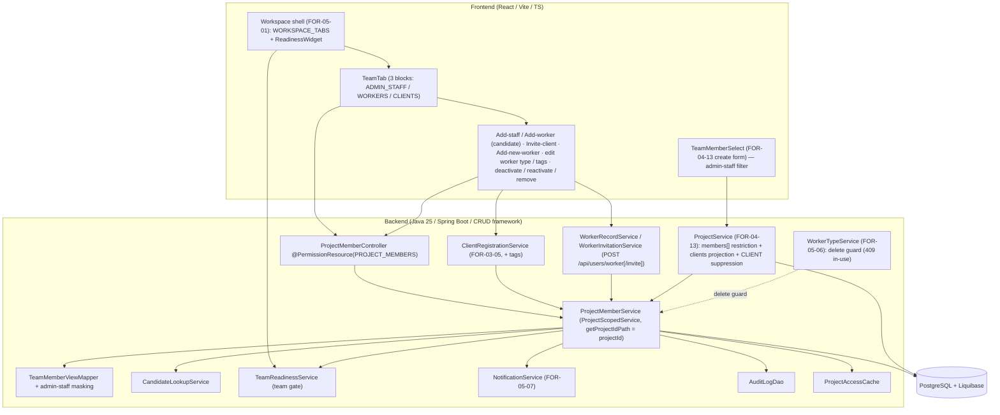
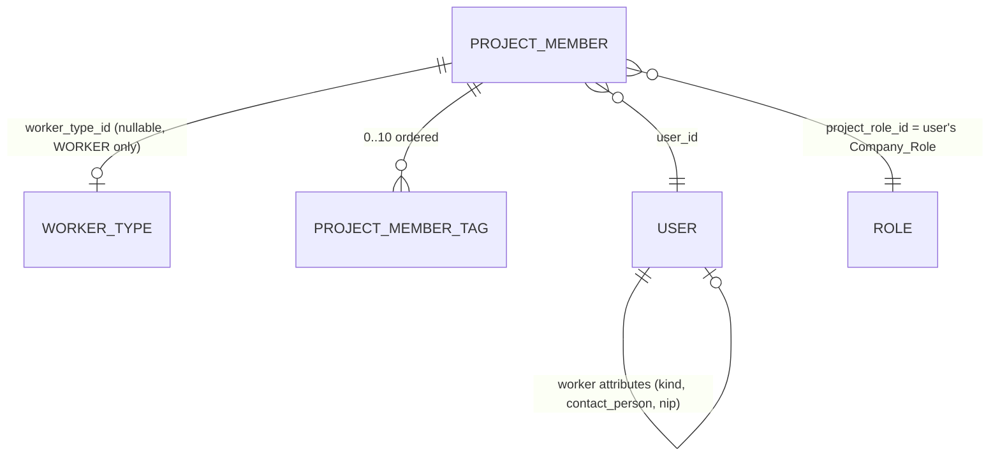

# Design Document: FOR-05-09-team-selection

## Overview

FOR-05-09-team-selection delivers **team selection and assignment** for a project in the design
stage: the people who run, execute, finance, and receive the renovation are attached to the
project as `ProjectMember` rows. The spec turns the parent design's Team surface (parent `design.md`
§1 item 7, §2 "Team selection", §4.2 `ProjectMember`, §5 `PROJECT_MEMBERS` row, §6.3 `team`
readiness gate, Property 17) into a concrete, testable backend + frontend feature, **reusing the
already-seeded project-scoped ABAC resource `PROJECT_MEMBERS`** (changeset `015`) rather than
introducing a new resource (D1).

The design is built on existing platform primitives rather than new frameworks:

- **CRUD + ABAC.** `@PermissionResource`/`@PermissionOperation` + `PermissionInterceptor` +
  `PermissionAnnotationValidator` (FOR-03-08), and the FOR-03-04 project-scoping contract
  `ProjectScopedService.getProjectIdPath()`. This spec keeps the existing
  `ProjectMemberController` and annotates it with `@PermissionResource("PROJECT_MEMBERS")`, and
  makes `ProjectMemberService` a `ProjectScopedService` with `getProjectIdPath()` returning
  `"projectId"`.
- **Internal-attribute masking.** The existing `ReadOnlyAdminService` masking mechanism
  (`getAdminOnlyFields()` + `maskAdminOnlyFields(model)`), with its gate predicate widened from
  "is ADMIN" to "is admin-staff" (not WORKER and not CLIENT), hides worker type, tags, NIP, and the
  `workerTypeMissing` flag from WORKER and CLIENT readers (D12).
- **Client registration.** The FOR-03-05 `ClientRegistrationService.register` flow
  (`POST /api/users/client`), extended with an optional `tags` field, is reused unchanged for
  Team-tab client invitation (multi-client, parent Property 17).
- **Worker type dictionary.** The FOR-05-06 `worker_types` dictionary + `GET /api/worker-types`
  (resource `WORKER_TYPES`, already READ-granted to MANAGER/FOREMAN/FINANCIER by changeset `125`)
  is the read source for the worker-type selector; this spec adds a nullable
  `project_members.worker_type_id` FK and a guard on the FOR-05-06 delete path (409
  `error.worker.type.in.use`).
- **Workspace shell.** The FOR-05-01 `WORKSPACE_TABS` contract, `resolveWorkspaceTabs`,
  `resolveDesignSelectorTabs`, `stageOf`, and `ReadinessWidget` host the new `team` tab and the
  team readiness chip.
- **Notifications.** The FOR-05-07 generic in-app `NotificationService` is a consumer-only
  dependency for the five team notification types.

### What this spec adds on top of the baseline

The baseline (verified in code while drafting) is a thin `ProjectMemberController`
(`POST`/`DELETE`/`GET`/`GET /projects`) over a `ProjectMemberService` with `assign` / `remove` /
`listMembers` / `listProjects`, each mutation invalidating `ProjectAccessCache`, and a
`ProjectMemberResponse{id, userId, projectId, projectRoleId, projectRoleCode}`. There is **no**
project-membership access check, **no** UPDATE / deactivate / reactivate operation, **no** enriched
read model, **no** team-composition validation, and **no** audit or notification. This spec adds:

1. **Team membership API** — enriched list (`Team_Member_View`), assign (role = user's Company_Role),
   Attribute_Update (worker type / tags / Assignment_Status), deactivate / reactivate, remove,
   candidate lookup, and the `team` readiness gate — all guarded by `PROJECT_MEMBERS`, all
   project-scoped, all validated (role assignability, inactive user, last ACTIVE MANAGER / last
   ACTIVE CLIENT, lifecycle lock), all audited and notified.
2. **Candidate lookup + client invitation + worker add/invite** — a `PROJECT_MEMBERS`-gated
   candidate search; reuse of the client-registration flow from the Team tab; a sibling
   `Worker_Record_Flow` (`POST /api/users/worker`, no invitation) and `Worker_Invitation_Flow`
   (`POST /api/users/worker/{id}/invite`, staff password-set email).
3. **Workspace Team tab** — a `team` design-stage tab rendering three blocks (admin staff, workers,
   clients) with per-block add/invite and per-member edit actions, pl + ru localized.
4. **Readiness contribution** — the server-computed `team` gate (DONE iff ≥1 ACTIVE FOREMAN) shown
   as a `ReadinessWidget` chip.
5. **Assignment attributes** — nullable worker type (WORKER only), 0–10 free-text tags, and a
   non-null Assignment_Status (`ACTIVE`/`INACTIVE`), with internal-attribute masking.
6. **Project-creation restriction** — `POST /api/projects` `members[]` restricted to admin-staff
   roles (client role kept for compatibility), the FOR-04-13 `TeamMemberSelect` filtered to
   admin-staff users, and the multi-client `clients` projection on the project DTOs with CLIENT
   suppression.

### Non-goals (from requirements)

Execution-stage concerns (FOR-06), global role changes, payroll/worker rates (FOR-10/FOR-11),
the aggregate readiness endpoint (readiness spec), notification channels beyond in-app, the client
portal (FOR-09), and company legal fields beyond name/contact person/NIP (Q8). This spec owns the
Assignment_Status field and lifecycle; its consumption by execution-stage job assignment is FOR-06.

### Key decisions carried from requirements

The design implements decisions D1–D14 and D-new verbatim. The most structural:

- **D2 — one global role.** A member's `projectRole` is always set server-side to the user's
  current Company_Role and is immutable per membership; there is no role-change operation.
- **D3/D6 — three disjoint blocks.** A member's `block` (`ADMIN_STAFF` / `WORKERS` / `CLIENTS`) is
  derived purely from the user's Company_Role, so the blocks are disjoint by construction.
- **D1 — reuse `PROJECT_MEMBERS`.** No new resource, no grant migration; FINANCIER keeps READ,
  WORKER has no grant (accepted divergence from the parent §5 sketch).
- **D12 — admin-staff masking.** Internal_Attributes are visible to ADMIN + admin-staff only.
- **D14 — soft deactivation.** Deactivate (soft, keeps history) vs. remove (hard, discards history);
  the FOREMAN readiness count and last-MANAGER / last-CLIENT invariants count only ACTIVE members.

---

## Architecture

### Request flow

### Layering and ownership

- **`ProjectMemberController`** keeps its path `/api/project-members`, keeps `projectId` out of the
  URL (body or query only), and gains `@PermissionResource("PROJECT_MEMBERS")` plus one
  `@PermissionOperation` per handler. New handlers: `PATCH` (Attribute_Update: worker type / tags /
  status), `GET /candidates`, `GET /readiness`. The existing `POST` / `DELETE` / `GET` /
  `GET /projects` keep their response fields (names and meanings unchanged, Requirement 4 criterion 5).
- **`ProjectMemberService`** becomes a `ProjectScopedService` so every by-id / by-pair operation runs
  through the FOR-03-04 project-scope check and the inherited `assertProjectAccess`-style gate (ADMIN
  bypass). It owns the team-composition rules, the canonical rejection order (Requirement 3 criterion
  7), the audit writes, the notification emission, and `ProjectAccessCache` invalidation.
- **`ClientRegistrationService`** (FOR-03-05) is extended only additively: an optional `tags` field on
  its request, passed through to the membership assign. Its contract and OTP email are otherwise
  unchanged.
- **`WorkerRecordService` / `WorkerInvitationService`** are new, mirroring (not generalizing) the
  client-registration flow: `POST /api/users/worker` creates an uninvited WORKER user + membership in
  one transaction; `POST /api/users/worker/{id}/invite` sends the FOR-03-02 staff password-set email.
  Both gated by `PROJECT_MEMBERS` CREATE **and** `PROJECTS` EDIT.
- **`ProjectService`** (FOR-04-13) restricts `members[]` to admin-staff (+ client role for
  compatibility), rejects `workerTypeId` and role mismatches at creation, and gains the `clients`
  projection with CLIENT-caller suppression.

### Canonical rejection order (central to the whole API)

Every mutating Team_API path funnels through one ordered gate (Requirement 3 criterion 7). The design
implements this as a single ordered checklist in `ProjectMemberService` so every endpoint and every
registration flow returns the first failing check's error and nothing later:

1. **401** — missing/expired/invalid token (handled by the security filter, before the controller).
2. **403 `error.access.denied`** — missing `PROJECT_MEMBERS` operation (`PermissionInterceptor`).
3. **400** — missing/invalid mandatory fields (bean validation + `role.mismatch` + `tag.invalid`).
4. **404 `error.entity.not.found`** — project missing or not an Accessible_Project (ADMIN bypass).
5. **409 `error.project.team.locked`** — project in a Locked_Status.
6. **404 `error.project.member.not.found`** (update/deactivate/remove) **or 409
   `error.project.member.duplicate`** (assign).
7. **404 `error.entity.not.found`** — non-existent user (assign).
8. **400** — team-composition rules, in sub-order: `role.not.allowed.at.creation` (creation only) →
   `role.not.assignable` → `user.inactive` → `worker.type.not.allowed` → `worker.type.invalid`.
9. **409** — `error.project.member.last.manager` / `error.project.member.last.client`.

This order is the backbone of the Error Handling section and is enforced as a deterministic sequence
(not short-circuit-by-exception-type), so a locked project hides a would-be duplicate, etc.

---

## Components and Interfaces

### Backend REST surface (`/api/project-members`)

All handlers carry class-level `@PermissionResource("PROJECT_MEMBERS")`; the per-handler
`@PermissionOperation` is noted.

| Method / path | Operation | Purpose | Success |
|---|---|---|---|
| `GET /api/project-members?projectId` | READ | List all members of a project as `Team_Member_View`s (ordered, masked per caller) | 200 + list |
| `POST /api/project-members` | CREATE | Assign a member (role = user's Company_Role) | 201 + `Team_Member_View` |
| `PATCH /api/project-members` | UPDATE | Attribute_Update: `{userId, projectId, workerTypeId?, tags?, assignmentStatus?}` (exactly one attribute group per call, see below) | 200 + `Team_Member_View` |
| `DELETE /api/project-members?userId&projectId` | DELETE | Hard-remove a member | 204 |
| `GET /api/project-members/candidates?projectId&...` | CREATE | Candidate lookup (paginated) | 200 + page |
| `GET /api/project-members/readiness?projectId` | READ | Team readiness gate + per-role ACTIVE counts | 200 |
| `GET /api/project-members/projects?userId` | READ | Project ids a user belongs to (scoped) | 200 + list |

**Attribute_Update dispatch.** The single `PATCH` endpoint handles the three UPDATE operations the
requirements describe (worker-type change — Requirement 14; tag change — Requirement 15;
Assignment_Status change — Requirement 27). The request body carries at most one of the mutually
exclusive attribute groups; the service dispatches on which field is present:

- `assignmentStatus` present → deactivate/reactivate (Requirement 27).
- `workerTypeId` present (and no `assignmentStatus`) → worker-type set/replace (Requirement 14).
- `tags` present (and neither of the above) → tag replace (Requirement 15).

All three resolve to the same `(PROJECT_MEMBERS, UPDATE)` pair (Requirement 2 criterion 1), keep the
immutable `projectRole` (any submitted `projectRoleId` is ignored, Requirement 7 criterion 2), and
are idempotent when the submitted value equals the current one (no audit, no notification; 200 with
the current view).

### Registration / worker flows

| Method / path | Guard | Purpose |
|---|---|---|
| `POST /api/users/client` | `PROJECTS` EDIT (existing) | FOR-03-05 client registration, now accepting optional `tags`; creates INVITED CLIENT + OTP email + CLIENT membership |
| `POST /api/users/worker` | `PROJECT_MEMBERS` CREATE **+** `PROJECTS` EDIT | `Worker_Record_Flow`: create uninvited WORKER (no password, no email sent) + WORKER membership, atomic |
| `POST /api/users/worker/{id}/invite` | `PROJECT_MEMBERS` CREATE **+** `PROJECTS` EDIT | `Worker_Invitation_Flow`: send/re-send FOR-03-02 staff password-set email; worker sets own password |

Both worker flows mirror `ClientRegistrationService` (one `@Transactional` method, role fixed
server-side to WORKER, membership assigned via `ProjectMemberService.assign`). The dual-permission
guard (`PROJECT_MEMBERS` CREATE + `PROJECTS` EDIT) is expressed with a method-level
`@RequiresPermission` combined with a service-side `PROJECTS/EDIT` assertion, matching the FOR-03-05
pattern where `registerClient` is `@RequiresPermission(resource = "PROJECTS", operation = "EDIT")`.

### `Team_Member_View` (enriched read model)

Returned by list, assign, and Attribute_Update. Fields marked **(internal)** are present only for an
Internal_Attribute_Viewer (ADMIN + admin-staff) and omitted entirely for WORKER/CLIENT readers (D12).

| Field | Notes |
|---|---|
| `id`, `userId`, `projectId` | membership id + pair (existing names kept) |
| `projectRoleId`, `projectRoleCode` | existing names kept; code == Company_Role code (D2) |
| `projectRoleName` | localized (ru for ru requests, pl otherwise, with fallback — Requirement 24 criterion 4) |
| `companyRoleCode` | == `projectRoleCode` by D2 |
| `block` | `ADMIN_STAFF` / `WORKERS` / `CLIENTS`, derived from Company_Role |
| `assignmentStatus` | `ACTIVE` / `INACTIVE` — **not** internal; returned to every reader |
| `userName`, `userEmail`, `userStatus`, `userActive` | from the user record |
| `workerKind`, `contactPerson` | WORKERS block only; `PERSON` default |
| `workerTypeId`, `workerTypeCode`, `workerTypeName`, `workerTypeActive` **(internal)** | WORKERS only; null for an Uncategorized_Worker |
| `nip` **(internal)** | WORKERS/COMPANY only; empty when none |
| `workerTypeMissing` **(internal)** | true iff block == WORKERS and no worker type |
| `tags` **(internal)** | ordered, normalized; empty list when none |

Never contains: rate, tariff, tier percentage, cost, password, token, OTP (Requirement 4 criterion 7).

**Ordering** (Requirement 4 criterion 6): by `block` (ADMIN_STAFF, WORKERS, CLIENTS); inside
ADMIN_STAFF by role code (MANAGER, FOREMAN, ESTIMATOR, FINANCIER, then any other after FINANCIER);
then by `userName` ascending case-insensitive; then by `id` ascending. Assignment_Status does not
affect ordering.

**Masking implementation.** `ProjectMemberService.getAdminOnlyFields()` returns the internal field
set `{workerTypeId, workerTypeCode, workerTypeName, workerTypeActive, nip, workerTypeMissing, tags}`;
`maskAdminOnlyFields` nulls them for non-admin-staff callers. The existing `isCallerAdmin()` gate is
widened to an `isCallerAdminStaff()` predicate (true for ADMIN + any of MANAGER/FOREMAN/ESTIMATOR/
FINANCIER; false for WORKER/CLIENT), implemented alongside the existing authority inspection in
`ReadOnlyAdminService` so the same mechanism also covers the `ProjectReadDto`/`ProjectListDto`
members projection (D12, Requirement 19 criterion 8). For WORKER/CLIENT readers the view fields are
omitted from serialization (null → excluded), not merely blanked.

### Candidate lookup

`GET /api/project-members/candidates?projectId&term?&role?&block?&page?&size?` →
paginated `Candidate{userId, name, email, status, companyRoleCode, companyRoleName, block,
workerKind?, contactPerson?}` with a total count. Excludes current members (any status) and
Inactive_Users; includes `INVITED`+`active` users and uninvited WORKER records. Filters: `term`
substring (trimmed, case-insensitive, name or email), `role` (== candidate Company_Role), `block`
(== candidate's compatible block). Page default 20, max 50; order by name then id. Never returns a
password, token, rate, cost, worker type, NIP, or tag (Requirement 11 criterion 5).

### Readiness

`GET /api/project-members/readiness?projectId` → `{key: "team", state: "DONE"|"BLOCKED",
counts: {MANAGER, FOREMAN, ESTIMATOR, WORKER, FINANCIER, CLIENT}}` where each count is the number of
**ACTIVE** members of that role (0 when none). `state == DONE` iff `counts.FOREMAN >= 1`.

### Frontend — the Team tab

- **Tab registration.** A new `WORKSPACE_TABS` entry `{ key: 'team', stage: 'design', owner:
  'FOR-05', requiredPermission: { resource: 'PROJECT_MEMBERS', operation: 'READ' }, labelKey:
  'workspace.tab.team' }`, declared immediately after `documentSigning` and before the first
  execution-stage tab (`procurement`), making `team` the last design-stage entry (Requirement 21
  criterion 1). `resolveWorkspaceTabs` / `resolveDesignSelectorTabs` / `resolveActiveTab` /
  `stageOf` already consume the contract; no resolver change is needed — a design-stage project
  shows `team` in the main strip, an execution-stage project in the design selector.
- **Three blocks.** `TeamTab` renders ADMIN_STAFF, WORKERS, CLIENTS in that order, each a desktop
  table (≥768px) or mobile card stack (<768px), each with its own header (title + count), empty
  state, and add/invite actions. Members are placed by their `block` field in the server order.
- **Dialogs.** Add-staff / add-worker / add-client open a candidate-search dialog scoped to the
  block; invite-client opens the FOR-03-05 invitation form (+ optional tags); add-new-worker opens
  the `Worker_Record_Flow` form (Worker_Kind toggle; person vs. company fields; optional email;
  optional worker type from `GET /api/worker-types`); per-member controls: change worker type (if
  `WORKER_TYPES` READ), edit tags, deactivate/reactivate (confirm), remove (confirm, warns history
  loss). No role-change control exists (D2).
- **Internal attributes.** Worker type, missing-type warning + "Assign worker type" action, NIP, tag
  chips, and the tag filter render only for Internal_Attribute_Viewers (the API already omits them
  for WORKER/CLIENT). The Assignment_Status badge renders for everyone.
- **Readiness chip.** `ReadinessWidget` gains a `team` gate chip (localized name + DONE/BLOCKED
  label with two distinct visual styles) for viewers with `PROJECT_MEMBERS` READ in design stage;
  it refreshes within 2s of a successful team change.
- **Create form.** `TeamMemberSelect` filters its options to admin-staff Company_Roles; the create
  form shows a static hint that workers are added from the Team tab after creation (Requirement 26
  criterion 7).

### i18n

- Frontend: `workspace.tab.team` ("Zespół" / "Команда") plus all Team-tab labels, block titles,
  empty states, actions, add-worker form labels, status indications, Assignment_Status labels, tag
  input/filter, worker-type marks, missing-type badge + block warning (with count placeholder),
  "Assign worker type", create-form hint, confirmations, readiness gate name/state, success/error
  messages — present in both `pl.json` and `ru.json` with identical key sets and matching
  placeholders.
- Backend: message bundles for every code this spec introduces/uses
  (`error.project.member.role.not.assignable`, `.role.mismatch`, `.user.inactive`, `.last.manager`,
  `.last.client`, `.role.not.allowed.at.creation`, `.worker.type.invalid`, `.worker.type.not.allowed`,
  `.tag.invalid`, `error.worker.nip.invalid`, `error.worker.email.required`,
  `error.worker.invite.not.allowed`, `error.worker.already.active`, `error.project.team.locked`,
  `error.worker.type.in.use`) in pl + ru.

---

## Data Models

### Entity changes

The spec extends two existing tables (`project_members`, `users`); it creates no new table and no new
ABAC resource (D1). All schema changes land as new idempotent Liquibase changesets registered **last**
in `database_files/changelog.xml` (current tail is `148`; this spec adds `149`–`151`), each guarded by
`onFail="MARK_RAN"` preconditions so a re-run changes no schema and no data.

#### `project_members` (extended)

| Column | Type | Null | Notes |
|---|---|---|---|
| `worker_type_id` | BIGINT FK → `worker_types(id)` | yes | WORKER members only; null = Uncategorized_Worker. No backfill (Requirement 14 criterion 12). |
| `assignment_status` | VARCHAR | no | `ACTIVE` / `INACTIVE`; default `ACTIVE`; existing rows backfilled to `ACTIVE` (Requirement 27 criterion 1). |
| `assignment_tags` | child table `project_member_tags` | — | ordered 0–10 tags per membership (see below). |

The existing unique constraint `uk_project_members_user_project` on `(user_id, project_id)` is kept
(D2). The `projectRole` FK and `(user_id, project_id)` pair are unchanged.

**Tag storage.** Tags are an ordered 0–10 list per membership, belonging to the membership only (D11),
discarded on remove. Modeled as a child table `project_member_tags{ id, project_member_id FK NOT NULL
ON DELETE CASCADE, tag VARCHAR(50) NOT NULL, order_no INT NOT NULL }` with a `@OrderColumn`-mapped
`List<String>` on `ProjectMemberEntity`, so order is preserved and `ON DELETE CASCADE` discards tags
with the membership.

#### `users` (extended — worker attributes, D8)

| Column | Type | Null | Notes |
|---|---|---|---|
| `worker_kind` | VARCHAR | yes | `PERSON` / `COMPANY`; null for every non-worker-record user and treated as `PERSON` for a WORKER view. |
| `contact_person` | VARCHAR(255) | yes | COMPANY only. |
| `nip` | VARCHAR(10) | yes | COMPANY only; normalized 10-digit, checksum-validated. |

Every user existing before changeset `149` and every user created by a path other than the
`Worker_Record_Flow` keeps these three attributes empty (Requirement 13 criterion 16).

### Liquibase changesets (new, registered last)

| File | Changeset(s) | Content |
|---|---|---|
| `149-add-user-worker-attributes.xml` | `149-add-user-worker-attributes` | Add `worker_kind`, `contact_person`, `nip` to `users` (nullable; `columnExists` precondition). No backfill. |
| `150-add-project-member-attributes.xml` | `150-add-pm-worker-type`, `150-add-pm-assignment-status`, `150-create-pm-tags` | Add nullable `worker_type_id` FK → `worker_types`; add non-null `assignment_status` with existing rows backfilled to `ACTIVE`; create `project_member_tags` child table. Each guarded by `columnExists`/`tableExists` + `MARK_RAN`. |

No resource/grant changeset is added: `PROJECT_MEMBERS` already has ADMIN CRUD, MANAGER CRUD, FOREMAN
READ, ESTIMATOR READ (changeset `136`), FINANCIER READ (changeset `015`), and no WORKER/CLIENT grant,
which is exactly the Requirement 1 matrix (D1, Requirement 1 criteria 2–7). The spec also seeds **no**
new changeset that alters any `PROJECT_MEMBERS` grant (Requirement 1 criterion 6).

> **Entity-creation checklist note.** The workspace `entity-creation-rules` checklist applies to a
> **new** managed entity. This spec introduces none — it reuses the existing `PROJECT_MEMBERS`
> resource, keeps `ProjectMemberService` project-scoped via `getProjectIdPath()` returning
> `"projectId"` (checklist step 4), and annotates the existing controller with
> `@PermissionResource("PROJECT_MEMBERS")` (checklist step 3). Steps 1–2 (seed a resource row + ADMIN
> grant) are intentionally **not** repeated, because the resource and its grants already exist
> (changeset `015` / `136`); re-seeding would duplicate rows.

### DTO changes on the project projections (Requirement 19)

`ProjectReadDto` and `ProjectListDto` gain a `clients` list (one entry per CLIENT member, ordered by
membership id, same shape as the existing `client`), keep the derived `client` (lowest-membership-id
CLIENT, == `clients[0]`, null when none), and keep `members` carrying every member for non-CLIENT
callers. For a **CLIENT caller** the DTO omits `members`, `client`, and `clients` entirely (Q6,
Requirement 19 criterion 9). The internal-attribute masking (D12) also strips worker type, tier
percentage, NIP, internal status note, and tags from `members`/`clients`/`client` for every caller;
`assignmentStatus` is not internal and may be included. The `ProjectMemberSummaryDto` is extended with
`assignmentStatus` and the masked internal fields accordingly.

### Audit snapshot (`Member_Snapshot`)

Each team change writes exactly one Audit_Log row through the existing `AuditLogDao` with action
`CREATE` (assign), `UPDATE` (worker-type / tag / status change), or `DELETE` (remove). The snapshot
carries: user id, project id, Project_Role code, Worker_Type code (empty when none), Assignment_Status,
and Assignment_Tags — and never a password, token, rate, tariff, tier percentage, or cost
(Requirement 17 criterion 7). An idempotent (no-op) Attribute_Update writes no row (Requirement 17
criterion 4). An audit-write failure rolls back the whole operation (Requirement 17 criterion 6).

---

## Correctness Properties

*A property is a characteristic or behavior that should hold true across all valid executions of a
system — essentially, a formal statement about what the system should do. Properties serve as the
bridge between human-readable specifications and machine-verifiable correctness guarantees.*

Applying property-based testing to this feature is appropriate because its core is pure,
input-varying business logic: the role-derivation and immutability rules, the Worker_Type invariant, tag normalization, the
Team_Block ordering, the stateful last-ACTIVE-MANAGER/CLIENT invariant over operation sequences, the
readiness equivalence, candidate-filter soundness, the canonical rejection-order precedence, and the
NIP checksum. UI rendering, ABAC wiring, HTTP-status mapping, i18n parity, Liquibase idempotence, and
notification side effects are covered by unit, example, integration, and smoke tests (see Testing
Strategy) rather than properties. The set below matches the targets Requirement 25 criterion 9
enumerates and adds the directly universal rules the prework identified.

### Property 1: Assigned role equals the user's Company_Role, with derived block and immutability

*For any* user whose Company_Role is an Assignable_Project_Role and *any* project in an
Editable_Status, assigning that user (without a `projectRoleId`, or with one equal to the user's
Company_Role) produces exactly one Project_Member whose `projectRole` code equals the user's current
Company_Role, whose `block` equals `blockOf(Company_Role)` (`CLIENT`→`CLIENTS`, `WORKER`→`WORKERS`,
any Admin_Staff_Role→`ADMIN_STAFF`), and whose Assignment_Status is `ACTIVE`; and *for any* following
sequence of Attribute_Updates (worker-type, tag, or status changes, each possibly carrying an
arbitrary `projectRoleId`), that member's `projectRole` code and `block` remain unchanged.

**Validates: Requirements 5.1, 5.10, 6.2, 7.1, 7.2**

### Property 2: A mismatching supplied role is rejected

*For any* assign request whose non-null `projectRoleId` resolves to a role code different from the
assigned user's current Company_Role code, the Team_API rejects it with HTTP 400
`error.project.member.role.mismatch` and persists no Project_Member.

**Validates: Requirements 5.11, 7.2**

### Property 3: Worker_Type present implies the Project_Role is WORKER (invariant)

*For any* sequence of accepted or rejected assign, Attribute_Update, deactivate, reactivate, remove,
worker-record, project-creation, and Worker_Type-deactivation operations (including concurrent ones),
every resulting Project_Member satisfies: if it has a Worker_Type then its Project_Role code is
`WORKER`.

**Validates: Requirements 14.1**

### Property 4: `workerTypeMissing` consistency

*For any* Project_Member rendered as a Team_Member_View to an Internal_Attribute_Viewer, the
`workerTypeMissing` flag is `true` if and only if the member's Project_Role code is `WORKER` and the
member has no Worker_Type (`workerTypeId` is null).

**Validates: Requirements 14.16**

### Property 5: Tag normalization is idempotent and round-trips through persistence

*For any* submitted list of strings that is valid under Requirement 15 criterion 3, applying
Tag_Normalization is idempotent (`normalize(normalize(x)) == normalize(x)`), the normalized list has
no leading/trailing whitespace on any tag, no two tags equal under case-insensitive comparison
(keeping the first spelling and original order), and at most ten tags; and the Assignment_Tags
returned in the Team_Member_View after a save equal the Tag_Normalization of the submitted list.

**Validates: Requirements 15.4, 15.3**

### Property 6: Tag acceptance and rejection

*For any* single tag string, the Team_Service accepts it as a tag if and only if it has 1 to 50
Unicode code points after trimming and contains no Unicode control character, storing its inner
whitespace and letter case verbatim; and *for any* submitted tag list that contains a non-string, a
null element, a tag that is empty or longer than 50 code points after trimming, a tag with a control
character, or more than ten tags after Tag_Normalization, the system rejects the whole list with HTTP
400 `error.project.member.tag.invalid` and stores no part of it.

**Validates: Requirements 15.3, 15.10**

### Property 7: Team_Block ordering is deterministic

*For any* set of Project_Members of a project, the list returned by the Team_API is ordered first by
Team_Block in the sequence ADMIN_STAFF, WORKERS, CLIENTS; within ADMIN_STAFF by Project_Role code in
the sequence MANAGER, FOREMAN, ESTIMATOR, FINANCIER (any other code after FINANCIER); then by user
display name ascending under case-insensitive comparison; then by membership id ascending — and the
Assignment_Status does not affect the order, so two reads over unchanged data return identical order.

**Validates: Requirements 4.6**

### Property 8: The last ACTIVE MANAGER and last ACTIVE CLIENT always survive

*For any* initial team and *any* sequence of assign, remove, deactivate, and reactivate operations
(each either accepted or rejected by the service), for each of the Project_Role codes MANAGER and
CLIENT: if the project had at least one ACTIVE Project_Member of that code immediately before an
operation, it still has at least one ACTIVE member of that code immediately after it; and every
rejected operation leaves the count of ACTIVE Project_Members of every Project_Role code unchanged.

**Validates: Requirements 9.5, 8.1, 27.2, 27.7**

### Property 9: Readiness is DONE exactly when an ACTIVE FOREMAN exists

*For any* team reached by any sequence of assign, deactivate, reactivate, and remove operations, the
Team_Readiness_Gate state equals `DONE` if and only if the returned count of ACTIVE FOREMAN
Project_Members is at least one (and `BLOCKED` otherwise), and each returned per-role count equals the
number of ACTIVE Project_Members of that Assignable_Project_Role (INACTIVE members excluded).

**Validates: Requirements 20.1, 20.2, 20.3, 27.8**

### Property 10: Candidate lookup is sound against its filters

*For any* backing set of users and *any* combination of `term`, `role`, and `block` filters, every
Candidate returned for a project is not a current Project_Member of that project (of any Assignment_
Status), is not an Inactive_User, has a display name or email containing the trimmed `term` as a
case-insensitive substring when a `term` is supplied, has a Company_Role code equal to the `role`
filter when one is supplied, and has a compatible Team_Block equal to the `block` filter when one is
supplied.

**Validates: Requirements 11.1, 11.2, 11.3, 11.11**

### Property 11: The first failing check in the canonical order determines the response

*For any* mutating Team_API request that trips an arbitrary subset of the canonical checks
(authentication, `PROJECT_MEMBERS` operation, mandatory-field validation, project existence/access,
lifecycle lock, member existence/duplicate, user existence, team-composition rules, last-ACTIVE
guards), the Team_API returns the HTTP status and message code of the first tripped check in the fixed
canonical order of Requirement 3 criterion 7 and of no later check, and the `project_members` rows are
left unchanged whenever any check fails.

**Validates: Requirements 3.7, 10.4**

### Property 12: NIP checksum validation

*For any* submitted NIP string, after removing all spaces and hyphens the Worker_Record_Flow accepts
it if and only if the result is exactly ten decimal digits whose weighted checksum is valid — the sum
of the first nine digits multiplied by the weights 6, 5, 7, 2, 3, 4, 5, 6, 7, taken modulo 11, is not
10 and equals the tenth digit — otherwise it rejects the NIP with HTTP 400 `error.worker.nip.invalid`
and creates no user, no Project_Member, and no invitation email.

**Validates: Requirements 13.5**

---

## Error Handling

### Message codes and HTTP statuses

The canonical rejection order (Requirement 3 criterion 7) is the single ordering authority. The table
lists each code, its status, and the originating criterion.

| HTTP | Message code | Raised when |
|---|---|---|
| 401 | (auth) | missing/expired/invalid token (security filter, before controller) — Req 2.4 |
| 403 | `error.access.denied` | caller lacks the required `PROJECT_MEMBERS` operation — Req 2.3, 2.7, 2.8 |
| 400 | (bean validation) | missing/invalid mandatory field (null/non-positive id, bad status enum) — Req 4.8, 5.4, 8.5, 27.5 |
| 400 | `error.project.member.role.mismatch` | supplied `projectRoleId` code ≠ user's Company_Role — Req 5.11, 26.4 |
| 400 | `error.project.member.tag.invalid` | tag list violates Req 15.3 (shape/length/control/count); or missing/null on tag update |
| 404 | `error.entity.not.found` | project missing or not an Accessible_Project (indistinguishable); non-existent user on assign — Req 3.3, 3.4, 5.3 |
| 409 | `error.project.team.locked` | mutating op on a Locked_Status project — Req 10.2 |
| 404 | `error.project.member.not.found` | update/deactivate/reactivate/remove with no member for the pair — Req 8.2, 14.6, 15.5, 27.4 |
| 409 | `error.project.member.duplicate` | assign where a member for the pair already exists (any status) — Req 5.2 |
| 400 | `error.project.member.role.not.allowed.at.creation` | `members[]` entry under the Worker_Role at creation — Req 26.2 |
| 400 | `error.project.member.role.not.assignable` | resolved role is ADMIN or a non-system role — Req 6.1, 26.10 |
| 400 | `error.project.member.user.inactive` | assigned user has `active = false` — Req 6.3 |
| 400 | `error.project.member.worker.type.not.allowed` | `workerTypeId` on a non-WORKER assignment / at creation — Req 14.4, 26.3 |
| 400 | `error.project.member.worker.type.invalid` | `workerTypeId` references no / inactive worker type (not the current one); or missing/null on a worker-type change — Req 14.3, 14.8 |
| 409 | `error.project.member.last.manager` | remove/deactivate would drop the last ACTIVE MANAGER — Req 9.1, 27.7 |
| 409 | `error.project.member.last.client` | remove/deactivate would drop the last ACTIVE CLIENT — Req 9.2, 27.7 |
| 409 | (duplicate email) | worker/client flow email equals an existing user's email (ci) — Req 13.7 |
| 400 | `error.worker.nip.invalid` | COMPANY NIP fails normalization/checksum — Req 13.5 |
| 400 | `error.worker.email.required` | invite a worker with no stored email — Req 13.18 |
| 400 | `error.worker.invite.not.allowed` | invite a non-WORKER user — Req 13.18 |
| 409 | `error.worker.already.active` | invite a worker who already set a password — Req 13.18 |
| 409 | `error.worker.type.in.use` | FOR-05-06 delete of a worker type referenced by a member — Req 14.11 |

### Transactional and side-effect guarantees

- Every mutating operation runs in one `@Transactional` unit. Any failing step (validation,
  constraint violation, audit-write failure, membership assign failure in a registration flow) rolls
  the whole unit back: no `project_members` row, no new user, no Audit_Log row, no notification, no
  invitation email, and the affected user's `ProjectAccessCache` entry unchanged (Req 5.8, 13.12,
  16.3, 17.5, 17.6).
- A rejected operation never writes an Audit_Log row or emits a notification (Req 9.1, 9.2, 10.2,
  17.5, 18.6).
- An idempotent (no-op) Attribute_Update returns 200 with the current view and writes no audit row and
  no notification (Req 14.7, 15.6, 27.6, 17.4, 18.8).
- Notifications are best-effort: a `NotificationService` failure is logged, the committed membership
  change is kept, and the normal success response is returned (Req 18.7).
- `ProjectAccessCache` is invalidated after commit and before the success response for assign, remove,
  deactivate, and reactivate (Req 16.1).
- 404 for an inaccessible project is byte-identical to 404 for a non-existent project, so out-of-scope
  projects are not revealed (Req 3.3, 3.8).

### Frontend error handling

The Team tab keeps the issuing dialog open with entered values on any 4xx, maps each known message
code to a localized pl/ru message, shows a generic localized message for an unknown/absent code or a
network failure, and leaves the member list unchanged (Req 23.12, 24.7). The duplicate-email 409 on
client/worker invite additionally offers an action opening the candidate lookup for the relevant block
with the submitted email pre-filled (Req 12.3, 13.7). A failed readiness request hides the `team` chip
and shows a localized "could not load" indication without blocking other tabs (Req 20.11).

---

## Testing Strategy

### Dual approach

- **Property tests** verify the twelve universal properties above across many generated inputs.
- **Unit / example tests** verify specific scenarios, status mappings, idempotent no-ops, field
  preservation, secret-field exclusion, and the audit/notification side effects (with a mocked
  `NotificationService`).
- **Integration tests** (against the Dockerized stack, base URL `http://localhost:8080`) verify the
  end-to-end flows that cross the HTTP, DB, and email boundaries: client invitation (one user + one
  membership + one OTP email), the `Worker_Record_Flow` and `Worker_Invitation_Flow`, concurrency
  (duplicate assign, concurrent deactivate/remove, concurrent worker-type change), `ProjectAccessCache`
  propagation, and project-creation restrictions.
- **UI component tests** verify the three-block rendering, responsive table/card layouts, action
  gating, dialog focus/keyboard behavior, the missing-worker-type warning and its "Assign worker type"
  action, the tag filter, and the readiness chip.
- **Smoke / configuration tests** verify startup: the `PermissionAnnotationValidator` accepts the
  annotated controller, and the `PROJECT_MEMBERS` matrix row has exactly the Requirement 1 grants with
  no `PROJECT_TEAM` row (REG-05).

### Property-based testing requirements

- Pick the JVM property-based testing library already used by the backend test suite (jqwik, used by
  the existing `*PropertyTest` classes referenced in the workspace test standard); do not implement
  property testing from scratch.
- Configure each property test to run **at least 100 iterations**.
- Implement each of the twelve Correctness Properties with a **single** property-based test.
- Tag each property test with a comment of the form:
  `// Feature: FOR-05-09-team-selection, Property {number}: {property_text}`.
- Properties 3, 8, and 9 are **stateful / model-based**: generate a random initial team and a random
  sequence of operations, drive the service (or a fast in-memory model of it where the full stack is
  too slow), and assert the invariant after every step. Property 11 generates requests that trip random
  subsets of the canonical checks and asserts the first-tripped check wins. Properties 5, 6, and 12 are
  pure-function properties over generated strings/lists and run against the normalization/validation
  helpers directly.

### Unit-testing balance

Keep unit tests focused on concrete examples, edge cases, and integration points; let the property
tests cover broad input ranges. Specifically: per-role × per-endpoint ABAC examples (401/403/pass),
the 404-indistinguishability of inaccessible vs. non-existent projects, idempotent-update no-ops, the
multi-client `clients`/`client` projection and CLIENT suppression, the FOR-05-06 worker-type delete
guard (409), and the audit snapshot shape per action.

### Test artifacts (per workspace `test-cases` standard)

`tasks.md` (authored in a later phase) will include a dedicated "Author test-cases.md" task. The
`test-cases.md` for this spec is written in Russian, grouped by feature, with API scenarios against the
Dockerized app for the Team_API and the registration/worker flows, browser scenarios for the Team tab
and the readiness chip, a stated per-group repeatability strategy (a run-id embedded in generated
emails such as `worker+{run-id}@example.com`, plus teardown of created memberships/users), a regression
group covering Requirement 25 criteria 1–4 and 8, and an MD report template table (test case · step ·
request/action · expected · actual · status) with a pass/fail/skip summary and the run-id.
