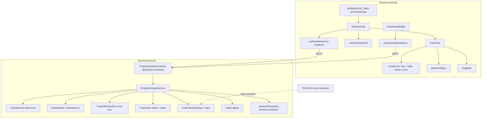

# Design Document — FOR-05-10 Planning Gantt (Harmonogram)

## Overview

FOR-05-10 turns the hidden `scheduleDesign` placeholder tab into a working planning Gantt for
design-stage projects. One row per work category of the estimate, ordered by
`WorkCategory.orderNo`. Each row shows its volume of work (line count, planned duration, net
value for money viewers; never man-days or the rate) and at most one bar
`(startDay, durationDays)` counted in calendar days from the project start date, or from an abstract "Day 1" when the project has no start date. Every
calendar day is a working day for the Gantt.

Two ways to build the plan:

- **Auto-create**: `durationDays = max(1, ceil(categoryValue / (rate × crewSize)))`, rows laid out
  back to back from day 1 with no gaps for weekends or holidays. `rate` is the global config value
  (default 2000 per worker per day); it is internal, never exposed, and has no per-project
  override. `crewSize` is the number of ACTIVE WORKER members of the project team.
- **Manual**: drag / resize any bar to any day, overlaps allowed, keyboard and dialog alternatives.
  Edits accumulate in a client-side draft and are saved in one request.

The backend owns persistence, derivation, validation, auto-create, readiness, ABAC, and audit. The
frontend owns rendering, the Polish calendar marks, zoom, and drag interaction. No third-party
Gantt library is added.

Requirement references are `R<n>.<criterion>` into `requirements.md`.

## Architecture



Request flow for a write: `PermissionInterceptor` (401/403) → bean validation (400) → service:
load project (404 not found / not accessible) → status lock (409 `error.schedule.locked`) →
version check (409 `error.schedule.conflict`) → business validation (400/409) → mutate bars, purge
orphans, bump version → audit row → return a freshly built `ScheduleView`. This is the R3.5 order.

## Components and Interfaces

### Backend

Package layout (matching existing conventions):

| Artifact | Location |
|----------|----------|
| Entities `ProjectScheduleEntity`, `ProjectScheduleBarEntity` | `com.foremen.dao.model` |
| DAOs `ProjectScheduleDao`, `ProjectScheduleBarDao` | `com.foremen.dao` |
| Service `ProjectScheduleService` | `com.foremen.service` |
| Pure helpers `ScheduleCalculator`, `ScheduleReadinessState`, `ScheduleRowDerivation` | `com.foremen.service.schedule` |
| Config `ScheduleProperties` (`@ConfigurationProperties("foremen.schedule")`, `@Validated`) | `com.foremen.config` |
| Controller `ProjectScheduleController` | `com.foremen.controller` |
| Request/response records | `com.foremen.controller.model.schedule` (or the package used by `ProjectMemberController` models) |

#### Liquibase changesets

- `152-create-project-schedules.xml`: tables `project_schedules` and `project_schedule_bars`
  (Data Models). Each `createTable` guarded by `tableExists` precondition `onFail="MARK_RAN"`.
- `153-seed-work-schedule-resource.xml`: following `017-seed-users-resource.xml` /
  `133-seed-offers-resource.xml`:
  - changeSet 1: insert `resources` row `WORK_SCHEDULE` (`name_ru` "График работ", `name_pl`
    "Harmonogram prac", `description_ru` "Планировочный график работ проекта на стадии
    проектирования", `description_pl` "Planistyczny harmonogram prac projektu na etapie
    projektowania"), guarded by `COUNT(*) ... code = 'WORK_SCHEDULE'` = 0.
  - changeSet 2: ADMIN + MANAGER → CREATE, READ, UPDATE, DELETE.
  - changeSet 3: FOREMAN + ESTIMATOR → READ, UPDATE.
  - changeSet 4: WORKER, FINANCIER, CLIENT → READ.
  - Each grant block is an `INSERT ... SELECT ... WHERE NOT EXISTS` (the 136 pattern), so re-runs
    insert nothing (R1.5).
- Both registered last in `changelog.xml` in order 152, 153.

#### Configuration

```yaml
foremen:
  schedule:
    # FOR-05-10 (R9.1): net estimate value one worker produces per calendar day. Used ONLY inside
    # auto-create and Suggested_Duration; never returned by the API or shown in the UI (R9.3).
    daily-output-per-worker: ${FOREMEN_SCHEDULE_DAILY_OUTPUT_PER_WORKER:2000}
```

`ScheduleProperties.dailyOutputPerWorker` is a `BigDecimal` with `@NotNull @DecimalMin(value="0",
inclusive=false)`, so a non-positive value fails startup (R9.1). There is no per-project override
and no endpoint that changes it (R9.2).

#### `ProjectScheduleService`

Implements `ProjectScopedService` (`getProjectIdPath()` → `"project.id"`,
`allowedProjectIds(userId)` → `ProjectAccessCache.get(userId)`), exactly as `ProjectMemberService`
wires it (R3.1). Public operations:

```java
ScheduleView getView(Long projectId);                                  // READ   (R5)
ScheduleView saveBars(Long projectId, SaveBarsRequest request);        // UPDATE (R7)
ScheduleView autoCreate(Long projectId, AutoCreateRequest request);    // UPDATE (R8)
ScheduleReadiness readiness(Long projectId);                           // READ   (R12)
```

Internals:

- `loadAccessibleProject(projectId)`: `projectDao.findById` → 404 when absent; for non-ADMIN, 404
  (same body) when `projectId ∉ allowedProjectIds(caller)` (R3.2–3.3).
- `assertEditable(project)`: 409 `error.schedule.locked` unless status ∈
  {DRAFT, READY_TO_OFFER, OFFERED, APPROVED, ON_HOLD} (R10.2). `READY_TO_OFFER` / `OFFERED` /
  `APPROVED` are listed for forward compatibility with the parent status space; only the values
  present in `ProjectStatus` can occur.
- `loadOrCreateSchedule(project)` for writes: `findByProjectId` or a new entity with version 0
  flushed inside the write transaction. The unique constraint on `project_id` makes a concurrent
  first write fail; the loser is mapped to 409 `error.schedule.conflict` (R6.4, R11.3).
- `assertVersion(schedule, requested)`: 409 `error.schedule.conflict` when they differ (R11.2).
  The JPA `@Version` on `ProjectScheduleEntity` covers the concurrent case
  (`ObjectOptimisticLockingFailureException` → 409 `error.schedule.conflict`).
- Every committed write calls `touch(schedule)` so the version increments exactly once even when
  only child bar rows change (bars are a separate table; the parent is explicitly marked dirty by
  setting `updatedDate`, or by `entityManager.lock(schedule, OPTIMISTIC_FORCE_INCREMENT)`).
- `purgeOrphans(schedule, currentRowCategoryIds)` in every write transaction (R4.6).
- `writeAudit(schedule, kind, before, after)` via `AuditLogDao`, same shape as FOR-05-09
  `writeAudit` (R13). Snapshots contain only the bars as
  `[{workCategoryCode, startDay, durationDays}]` sorted by row order — no money, no man-days, no
  rate (R13.4).
- `isMoneyViewer()`: ADMIN, or the caller's role holds `ESTIMATE` READ via the existing
  `ForemenPermissionEvaluator` / permission resolver (R5.3).
- Localized names via `LocaleContextHolder` with the FOR-05-09 `isRussianLocale()` rule and the
  ru → pl → code fallback (R5.7).

#### `ScheduleRowDerivation` (pure)

```text
deriveRows(estimateLines) -> List<RowSource>
  group lines by line.workItem.workCategory
  for each category: lineCount, categoryValue = Σ line.valueNet (null treated as 0),
                     lines sorted by lineNo then id
  sort rows by (category.orderNo ASC NULLS LAST, category.id ASC)        // R4.2
```

No estimate or no lines → empty list (R4.3). Inactive categories are kept (R4.7).

#### `ScheduleCalculator` (pure)

```text
duration(value, rate, crew)   = max(1, ceilDiv(value, rate × crew))               // R8.2 Computed_Duration
   where ceilDiv(a, b) = a.divide(b, 0, RoundingMode.CEILING) for exact BigDecimal
suggested(value, rate, crew)  = crew ≥ 1 ? duration(value, rate, crew) : null      // R5.4
autoLayout(rows, rate, crew):
   day = 1
   for row in rows (R4 order):
       d = duration(row.value, rate, crew)
       bar(row) = (startDay = day, durationDays = d)
       day = day + d                      // calendar days: weekends/holidays are working days (R8.3)
   if any finish > 3650 -> error.schedule.too.long                                 // R8.7
finishDay(bar)                = startDay + durationDays − 1
scheduleFinish(bars)          = max(finishDay) or null
finishDate(anchor, finish)    = anchor.plusDays(finish − 1) when both present
exceedsProjectEnd             = start, end, finish present AND finishDate > endDate  // R5.5
validateBar(start, dur):      both null (clear) OR both in [1, 3650] AND start + dur − 1 ≤ 3650
```

Overflow is impossible because all quantities are bounded integers and `BigDecimal`s.

#### `ScheduleReadinessState` (pure)

```text
state(rowCount, scheduledCount) =
   rowCount > 0 AND scheduledCount == rowCount -> DONE
   scheduledCount == 0                          -> BLOCKED     // includes rowCount == 0
   otherwise                                    -> PARTIAL
```

`scheduledCount` counts only bars of current rows (orphans excluded).

#### `ProjectScheduleController`

`@RestController @RequestMapping("/api/project-schedules") @PermissionResource("WORK_SCHEDULE")`.

| Method | Path | Operation | Body | Response |
|--------|------|-----------|------|----------|
| GET | `/api/project-schedules?projectId={id}` | READ | — | `ScheduleView` |
| PUT | `/api/project-schedules/bars?projectId={id}` | UPDATE | `SaveBarsRequest` | `ScheduleView` |
| POST | `/api/project-schedules/auto-create?projectId={id}` | UPDATE | `AutoCreateRequest` | `ScheduleView` |
| GET | `/api/project-schedules/readiness?projectId={id}` | READ | — | `ScheduleReadiness` |

`projectId` is a required `@RequestParam Long` (missing / non-numeric → 400, R3.4), matching
`ProjectMemberController`. No CREATE or DELETE handler exists; the CREATE/DELETE grants of ADMIN
and MANAGER are matrix completeness only (D13).

Request records:

```java
record SaveBarsRequest(@NotNull Long version, @NotNull List<@Valid BarEntry> bars) {}
record BarEntry(@NotNull Long workCategoryId, Integer startDay, Integer durationDays) {}
record AutoCreateRequest(@NotNull Long version) {}
```

`AutoCreateRequest` carries only the version; the rate always comes from `ScheduleProperties`
(R9.2). One version increment and one `AUTO_CREATE` audit row per successful call.

Bar entry validation is done in the service (not bean validation) so the error carries the
offending `workCategoryId` (R7.3) and duplicates / unknown categories map to
`error.schedule.category.invalid` (R7.4).

### Frontend

New feature module `foremen-frontend/src/features/project-schedule/`:

```
project-schedule/
  api/
    scheduleApi.ts            // getSchedule, saveBars, autoCreate, getScheduleReadiness
    queryKeys.ts              // ['project-schedule', projectId], ['project-schedule-readiness', projectId]
  types.ts                    // ScheduleView, ScheduleRow, ScheduleLine, BarEntry, ScheduleReadiness
  lib/
    polishHolidays.ts         // easterSunday(year), polishHolidays(year): Map<isoDate, holidayKey>
    timeline.ts               // dayToDate, dateToDay, weekColumns, dayColumns, timelineRange
    dragMath.ts               // pxToDays, applyMove, applyResizeStart, applyResizeEnd (clamp + snap)
    errorKeys.ts              // backend code -> projectSchedule.error.* key
  hooks/
    useSchedule.ts            // TanStack Query read + mutations, invalidates readiness on success
    useScheduleDraft.ts       // Map<categoryId, {startDay, durationDays} | null>, dirty flags
    useUnsavedGuard.ts        // beforeunload + router blocker while draft non-empty
  components/
    ScheduleTab.tsx           // lazy panel for scheduleDesign; loading / error / empty states
    ScheduleToolbar.tsx       // zoom segmented control, Auto-create, Save, Discard, unsaved badge
    ScheduleSummary.tsx       // finish, total days, crew size, exceeds-end warning, no-start hint
    GanttGrid.tsx             // sticky label column + horizontally scrolling timeline
    TimelineHeader.tsx        // week or day columns, weekend/holiday marks, project-end marker
    GanttRow.tsx              // label cell (name, volume, expand) + track
    GanttBar.tsx              // pointer drag (move / resize), keyboard, aria-label
    RowLinesPanel.tsx         // expanded estimate lines (work item, qty, unit)
    BarEditDialog.tsx         // start (date picker or day number) + duration, validation
    AutoCreateDialog.tsx      // explanation in words, crew size, replace/unsaved warnings (no rate)
    CalendarLegend.tsx
  __tests__/ ...
```

Workspace wiring (`project-workspace/workspaceTabs.ts`): replace the `scheduleDesign` entry's
`owner: 'FOR-06'` with `'FOR-05'` and `lazy: PlaceholderTab` with
`lazy(() => import('@/features/project-schedule/components/ScheduleTab'))`. Key, stage, gate,
label key, and position stay (R14.1, R18.2). Update the header comment that lists unseeded
resources (drop `WORK_SCHEDULE`).

Readiness (`project-workspace/components/ReadinessWidget.tsx`): add a `schedule` chip with the
same pattern as the FOR-05-09 `team` chip: gated on `usePermission('WORK_SCHEDULE', 'READ')`,
fetched with `useScheduleReadiness(projectId)`, omitted on failure with a load-error note,
included in the recomputed headline percentage (R12.4–12.8). `PARTIAL` uses the existing
`workspace.gate.partial` style.

#### Timeline model

- Day `n` (1-based) ↔ date `anchor + (n − 1)` days (`date-fns addDays`, `differenceInCalendarDays`).
- **Week_View** (default): the column unit is one ISO week when the anchor is a date (grid starts
  on the Monday on or before the anchor, so day 1 may sit mid-week) and 7-day blocks from day 1
  otherwise. Day cells inside a week are drawn as thin sub-columns (`dayWidth = 14px`) so weekend
  and holiday shading and day snapping still work.
- **Day_View**: `dayWidth = 40px`, one labelled column per day.
- Range: day 1 … `max(finishDay, projectEndDay, 28) + 7`; with an ISO-week grid, padded to whole
  weeks (R15.8).
- Bars are absolutely positioned: `left = (startDay − firstGridDay) × dayWidth`,
  `width = durationDays × dayWidth`.

#### Drag math

```text
deltaDays = round(pointerDeltaPx / dayWidth)                // snap to whole days (R16.1)
move:        start' = max(1, start + deltaDays)
resizeEnd:   dur'   = max(1, dur + deltaDays)
resizeStart: start' = clamp(start + deltaDays, 1, start + dur − 1); dur' = dur − (start' − start)
all results additionally clamped so start' + dur' − 1 ≤ 3650
```

Pointer events (`pointerdown/move/up` + `setPointerCapture`) work for mouse and touch. Edge
handles are 8px (12px on touch). No overlap or calendar checks (R16.2).

#### Polish holidays

`easterSunday(year)` uses the anonymous Gregorian (Meeus/Jones/Butcher) algorithm. Fixed days:
01-01, 01-06, 05-01, 05-03, 08-15, 11-01, 11-11, 12-25, 12-26, plus 12-24 when `year ≥ 2025`.
Movable: Easter Sunday, Easter Monday (+1), Pentecost (+49), Corpus Christi (+60) (R15.12). Each
maps to a `projectSchedule.holiday.*` key.

#### Draft and save

- `useScheduleDraft` keeps only changed rows. A row whose draft equals the server value is
  dropped from the draft, so "Save" stays disabled after an edit is undone.
- Save sends `{ version, bars: [changed rows] }`; a cleared row is `{ workCategoryId, startDay:
  null, durationDays: null }`.
- On success: replace query data with the response, clear draft, invalidate readiness, toast.
- On `error.schedule.conflict`: keep the draft, show the conflict message with a "Reload" action
  that refetches and drops the draft after confirmation.
- Auto-create sends `{ version }` only and drops the draft on success (R16.9).
- "Schedule" on an unscheduled row prefills duration with `suggestedDurationDays ?? 1` (R16.3).

## Data Models

### `project_schedules`

| Column | Type | Null | Notes |
|--------|------|------|-------|
| `id` | bigserial | no | PK |
| `project_id` | bigint | no | FK `projects(id)` ON DELETE CASCADE, UNIQUE |
| `version` | bigint | no | default 0, JPA `@Version` |
| `created_date`, `created_by`, `updated_date`, `updated_by` | BaseEntity | | |

### `project_schedule_bars`

| Column | Type | Null | Notes |
|--------|------|------|-------|
| `id` | bigserial | no | PK |
| `schedule_id` | bigint | no | FK `project_schedules(id)` ON DELETE CASCADE |
| `work_category_id` | bigint | no | FK `work_categories(id)` |
| `start_day` | integer | no | CHECK `start_day >= 1` |
| `duration_days` | integer | no | CHECK `duration_days >= 1` |
| BaseEntity columns | | | |

Unique (`schedule_id`, `work_category_id`); index on `schedule_id`.

A work category referenced by a bar cannot be hard-deleted while the bar exists (FK). Categories
are normally deactivated, not deleted; if a delete path exists it now also fails while bars
reference the category, which is acceptable (categories in use by estimate lines are already
protected the same way).

### `ScheduleView` (JSON)

```json
{
  "projectId": 42,
  "anchorDate": "2026-11-02",
  "projectEndDate": "2027-01-29",
  "editable": true,
  "version": 3,
  "crewSize": 2,
  "currency": "PLN",
  "finishDay": 41,
  "finishDate": "2026-12-12",
  "exceedsProjectEnd": false,
  "rows": [
    {
      "workCategoryId": 1,
      "code": "01",
      "orderNo": 1,
      "name": "Prace wstępne, demontaże",
      "lineCount": 3,
      "suggestedDurationDays": 2,
      "categoryValue": 6773.80,
      "startDay": 1,
      "durationDays": 2,
      "finishDay": 2,
      "lines": [
        { "estimateLineId": 901, "workItemId": 11, "name": "Rozbiórki ściany murowanej",
          "quantity": 12.0, "unit": "m2" }
      ]
    }
  ]
}
```

`currency` and every `categoryValue` are omitted (not null) for non-Money_Viewers (R5.3). No
field ever carries man-days or the Daily_Output_Rate (R5.4, R9.3). `suggestedDurationDays` is null
when `crewSize = 0`.

### `ScheduleReadiness` (JSON)

```json
{ "key": "schedule", "state": "PARTIAL", "rowCount": 7, "scheduledCount": 5 }
```

### Baseline contract for FOR-06

FOR-06-04 reads, for a project that became `ACTIVE`: `project_schedules` + `project_schedule_bars`
(category, `start_day`, `duration_days`) and `projects.start_date` as the anchor. Bars are frozen
from `ACTIVE` onward (R10.4); FOR-06 copies them into its own execution model rather than editing
them in place.

## Localization

### Backend message codes (`messages.properties` = pl, `messages_ru.properties` = ru)

| Code | pl | ru |
|------|----|----|
| `error.schedule.bar.invalid` | Nieprawidłowy okres dla kategorii {0}: początek i czas trwania muszą być liczbami całkowitymi od 1 do 3650. | Недопустимый период для категории {0}: начало и длительность должны быть целыми числами от 1 до 3650. |
| `error.schedule.category.invalid` | Kategoria prac {0} nie jest wierszem harmonogramu tego projektu lub została podana wielokrotnie. | Категория работ {0} не является строкой графика этого проекта или указана несколько раз. |
| `error.schedule.crew.empty` | Nie można utworzyć harmonogramu automatycznie: w zespole projektu nie ma aktywnych pracowników. | Невозможно создать график автоматически: в команде проекта нет активных работников. |
| `error.schedule.rows.empty` | Nie można utworzyć harmonogramu: kosztorys projektu nie zawiera prac. | Невозможно создать график: в смете проекта нет работ. |
| `error.schedule.too.long` | Harmonogram przekroczyłby maksymalną długość 3650 dni. | График превысил бы максимальную длительность 3650 дней. |
| `error.schedule.locked` | Harmonogram jest zablokowany w bieżącym statusie projektu i nie można go modyfikować. | График заблокирован в текущем статусе проекта и не может быть изменён. |
| `error.schedule.conflict` | Harmonogram został zmieniony przez innego użytkownika. Odśwież dane i spróbuj ponownie. | График был изменён другим пользователем. Обновите данные и повторите попытку. |

### Frontend keys (`pl.json` / `ru.json`, root namespace `projectSchedule`)

Unchanged existing key: `workspace.tab.scheduleDesign` = "Harmonogram" / "График".

| Key | pl | ru |
|-----|----|----|
| `projectSchedule.title` | Harmonogram prac | График работ |
| `projectSchedule.loading` | Ładowanie harmonogramu… | Загрузка графика… |
| `projectSchedule.loadError` | Nie udało się załadować harmonogramu | Не удалось загрузить график |
| `projectSchedule.retry` | Spróbuj ponownie | Повторить |
| `projectSchedule.empty.title` | Brak prac w kosztorysie | В смете нет работ |
| `projectSchedule.empty.hint` | Dodaj prace w zakładce Kosztorys, aby zaplanować harmonogram | Добавьте работы во вкладке «Смета», чтобы спланировать график |
| `projectSchedule.toolbar.zoomLabel` | Skala | Масштаб |
| `projectSchedule.toolbar.zoomWeek` | Tygodnie | Недели |
| `projectSchedule.toolbar.zoomDay` | Dni | Дни |
| `projectSchedule.toolbar.autoCreate` | Utwórz automatycznie | Создать автоматически |
| `projectSchedule.toolbar.autoCreateNoCrew` | Dodaj co najmniej jednego aktywnego pracownika w zakładce Zespół | Добавьте хотя бы одного активного работника во вкладке «Команда» |
| `projectSchedule.toolbar.save` | Zapisz | Сохранить |
| `projectSchedule.toolbar.discard` | Odrzuć zmiany | Отменить изменения |
| `projectSchedule.toolbar.unsaved` | Niezapisane zmiany | Есть несохранённые изменения |
| `projectSchedule.toolbar.more` | Więcej akcji | Другие действия |
| `projectSchedule.column.category` | Kategoria prac | Категория работ |
| `projectSchedule.column.volume` | Zakres prac | Объём работ |
| `projectSchedule.column.start` | Początek | Начало |
| `projectSchedule.column.end` | Koniec | Окончание |
| `projectSchedule.column.duration` | Czas trwania (dni) | Длительность (дни) |
| `projectSchedule.volume.lines` | Pozycji: {{count}} | Позиций: {{count}} |
| `projectSchedule.volume.duration` | Dni: {{count}} | Дней: {{count}} |
| `projectSchedule.volume.value` | {{value}} netto | {{value}} нетто |
| `projectSchedule.line.quantity` | {{quantity}} {{unit}} | {{quantity}} {{unit}} |
| `projectSchedule.row.expand` | Pokaż pozycje | Показать позиции |
| `projectSchedule.row.collapse` | Ukryj pozycje | Скрыть позиции |
| `projectSchedule.row.unscheduled` | Nie zaplanowano | Не запланировано |
| `projectSchedule.row.schedule` | Zaplanuj | Запланировать |
| `projectSchedule.row.edit` | Edytuj okres | Изменить период |
| `projectSchedule.row.clear` | Usuń z harmonogramu | Убрать из графика |
| `projectSchedule.row.changed` | Zmieniono | Изменено |
| `projectSchedule.timeline.day` | Dzień {{n}} | День {{n}} |
| `projectSchedule.timeline.week` | Tydzień {{n}} | Неделя {{n}} |
| `projectSchedule.timeline.weekShort` | T{{n}} | Н{{n}} |
| `projectSchedule.timeline.isoWeek` | Tydz. {{n}}: {{from}}–{{to}} | Нед. {{n}}: {{from}}–{{to}} |
| `projectSchedule.timeline.projectEnd` | Termin zakończenia projektu | Срок окончания проекта |
| `projectSchedule.timeline.noStartHint` | Projekt nie ma daty rozpoczęcia — harmonogram liczony jest od dnia 1 | У проекта нет даты начала — график строится от дня 1 |
| `projectSchedule.legend.title` | Legenda | Легенда |
| `projectSchedule.legend.weekend` | Weekend | Выходные |
| `projectSchedule.legend.holiday` | Święto państwowe | Государственный праздник |
| `projectSchedule.legend.bar` | Planowany okres prac | Плановый период работ |
| `projectSchedule.legend.projectEnd` | Termin zakończenia projektu | Срок окончания проекта |
| `projectSchedule.holiday.label` | Święto: {{name}} | Праздник: {{name}} |
| `projectSchedule.holiday.newYear` | Nowy Rok | Новый год |
| `projectSchedule.holiday.epiphany` | Święto Trzech Króli | Праздник Трёх королей (Богоявление) |
| `projectSchedule.holiday.easterSunday` | Wielkanoc | Пасха |
| `projectSchedule.holiday.easterMonday` | Poniedziałek Wielkanocny | Пасхальный понедельник |
| `projectSchedule.holiday.labourDay` | Święto Pracy | Праздник труда |
| `projectSchedule.holiday.constitutionDay` | Święto Narodowe Trzeciego Maja | День Конституции 3 мая |
| `projectSchedule.holiday.pentecost` | Zielone Świątki | Троица (Пятидесятница) |
| `projectSchedule.holiday.corpusChristi` | Boże Ciało | Праздник Тела и Крови Христовых |
| `projectSchedule.holiday.assumption` | Wniebowzięcie Najświętszej Maryi Panny | Успение Пресвятой Девы Марии |
| `projectSchedule.holiday.allSaints` | Wszystkich Świętych | День всех святых |
| `projectSchedule.holiday.independenceDay` | Narodowe Święto Niepodległości | День независимости |
| `projectSchedule.holiday.christmasEve` | Wigilia Bożego Narodzenia | Сочельник |
| `projectSchedule.holiday.christmasDay` | Boże Narodzenie (pierwszy dzień) | Рождество (первый день) |
| `projectSchedule.holiday.christmasSecondDay` | Boże Narodzenie (drugi dzień) | Рождество (второй день) |
| `projectSchedule.summary.finishDate` | Planowane zakończenie: {{date}} | Плановое окончание: {{date}} |
| `projectSchedule.summary.finishDay` | Planowane zakończenie: dzień {{n}} | Плановое окончание: день {{n}} |
| `projectSchedule.summary.notPlanned` | Harmonogram nie jest jeszcze zaplanowany | График ещё не спланирован |
| `projectSchedule.summary.totalDays` | Łącznie dni: {{n}} | Всего дней: {{n}} |
| `projectSchedule.summary.crew` | Aktywni pracownicy w zespole: {{n}} | Активных работников в команде: {{n}} |
| `projectSchedule.warning.exceedsEnd` | Harmonogram kończy się po terminie zakończenia projektu ({{date}}) | График заканчивается позже срока окончания проекта ({{date}}) |
| `projectSchedule.readOnly` | Harmonogram jest tylko do odczytu w bieżącym statusie projektu | В текущем статусе проекта график доступен только для чтения |
| `projectSchedule.autoCreate.title` | Automatyczne tworzenie harmonogramu | Автоматическое создание графика |
| `projectSchedule.autoCreate.formula` | Czas trwania każdej kategorii zostanie wyliczony na podstawie kosztorysu i liczby aktywnych pracowników w zespole. Kategorie zostaną ułożone kolejno od dnia 1; każdy dzień kalendarzowy jest dniem pracy. | Длительность каждой категории рассчитывается по смете и числу активных работников в команде. Категории расставляются последовательно с дня 1; каждый календарный день считается рабочим. |
| `projectSchedule.autoCreate.crew` | Aktywni pracownicy w zespole: {{n}} | Активных работников в команде: {{n}} |
| `projectSchedule.autoCreate.replaceWarning` | Wszystkie obecne okresy w harmonogramie zostaną zastąpione. | Все текущие периоды в графике будут заменены. |
| `projectSchedule.autoCreate.unsavedWarning` | Niezapisane zmiany zostaną utracone. | Несохранённые изменения будут потеряны. |
| `projectSchedule.autoCreate.confirm` | Utwórz | Создать |
| `projectSchedule.dialog.cancel` | Anuluj | Отмена |
| `projectSchedule.edit.title` | Okres prac: {{category}} | Период работ: {{category}} |
| `projectSchedule.edit.startDay` | Dzień rozpoczęcia | День начала |
| `projectSchedule.edit.startDate` | Data rozpoczęcia | Дата начала |
| `projectSchedule.edit.duration` | Czas trwania (dni) | Длительность (дни) |
| `projectSchedule.edit.apply` | Zastosuj | Применить |
| `projectSchedule.edit.invalid` | Podaj liczbę całkowitą od 1 do 3650 | Введите целое число от 1 до 3650 |
| `projectSchedule.edit.tooLong` | Okres nie może kończyć się później niż w dniu 3650 | Период не может заканчиваться позже дня 3650 |
| `projectSchedule.bar.ariaDate` | {{category}}: od {{start}} do {{end}}, dni: {{duration}} | {{category}}: с {{start}} по {{end}}, дней: {{duration}} |
| `projectSchedule.bar.ariaDay` | {{category}}: od dnia {{start}} do dnia {{end}}, dni: {{duration}} | {{category}}: с дня {{start}} по день {{end}}, дней: {{duration}} |
| `projectSchedule.bar.hint` | Przeciągnij, aby przesunąć, lub przeciągnij krawędź, aby zmienić czas trwania. Strzałki przesuwają o dzień, Shift + strzałki zmieniają czas trwania, Enter otwiera edycję. | Перетащите, чтобы сдвинуть, или потяните за край, чтобы изменить длительность. Стрелки сдвигают на день, Shift + стрелки меняют длительность, Enter открывает редактирование. |
| `projectSchedule.bar.resizeStart` | Zmień początek | Изменить начало |
| `projectSchedule.bar.resizeEnd` | Zmień koniec | Изменить окончание |
| `projectSchedule.leave.title` | Niezapisane zmiany | Несохранённые изменения |
| `projectSchedule.leave.message` | Masz niezapisane zmiany w harmonogramie. Opuścić stronę i je utracić? | В графике есть несохранённые изменения. Уйти со страницы и потерять их? |
| `projectSchedule.leave.confirm` | Opuść stronę | Уйти |
| `projectSchedule.leave.stay` | Zostań | Остаться |
| `projectSchedule.success.saved` | Harmonogram zapisany | График сохранён |
| `projectSchedule.success.autoCreated` | Harmonogram utworzony automatycznie | График создан автоматически |
| `projectSchedule.error.generic` | Nie udało się wykonać operacji na harmonogramie | Не удалось выполнить операцию с графиком |
| `projectSchedule.error.barInvalid` | Nieprawidłowy okres prac | Недопустимый период работ |
| `projectSchedule.error.categoryInvalid` | Kategoria nie jest już w kosztorysie. Odśwież harmonogram. | Категории больше нет в смете. Обновите график. |
| `projectSchedule.error.crewEmpty` | W zespole projektu nie ma aktywnych pracowników | В команде проекта нет активных работников |
| `projectSchedule.error.rowsEmpty` | Kosztorys projektu nie zawiera prac | В смете проекта нет работ |
| `projectSchedule.error.tooLong` | Harmonogram przekroczyłby 3650 dni | График превысил бы 3650 дней |
| `projectSchedule.error.locked` | Harmonogram jest zablokowany w bieżącym statusie projektu | График заблокирован в текущем статусе проекта |
| `projectSchedule.error.conflict` | Harmonogram został zmieniony przez innego użytkownika | График был изменён другим пользователем |
| `projectSchedule.error.reload` | Odśwież | Обновить |
| `projectSchedule.readiness.gate` | Harmonogram | График |
| `projectSchedule.readiness.state.done` | Gotowe | Готово |
| `projectSchedule.readiness.state.partial` | Częściowo | Частично |
| `projectSchedule.readiness.state.blocked` | Zablokowane | Заблокировано |
| `projectSchedule.readiness.loadError` | Nie udało się wczytać gotowości harmonogramu | Не удалось загрузить готовность графика |

Dates use `date-fns` locales `pl` / `ru` (`d MMM`, `EEEEEE` weekday), numbers use
`Intl.NumberFormat` of the active language, money uses the existing estimate currency formatter.

## Correctness Properties

### Property 1: Row derivation

For every estimate, the rows are exactly the distinct categories of its lines, each once, ordered
by `(orderNo, id)`; `lineCount` sums to the number of lines; `Σ categoryValue = Σ line.valueNet`.
(R4.1, R4.2)

### Property 2: Auto-create capacity

For every row with value `v > 0`, rate `r > 0`, crew `c ≥ 1`:
`(d − 1)·r·c < v ≤ d·r·c` where `d = durationDays`; for `v = 0`, `d = 1`. (R8.2, R8.4)

### Property 3: Auto-create contiguity

After auto-create, row 1 starts at day 1 and `start(k+1) = finish(k) + 1` (no weekend or holiday
gaps, since every calendar day is a working day) for every consecutive
pair; the schedule finish equals `Σ d`. (R8.3)

### Property 4: Auto-create determinism

Same inputs ⇒ identical bars. (R8.8)

### Property 5: Bar validation bounds

A bar entry is accepted iff both fields are null, or both are integers in `[1, 3650]` with
`start + dur − 1 ≤ 3650`. Accepted entries round-trip unchanged through save and read. (R7.2, R7.3)

### Property 6: Readiness consistency

`DONE ⇔ rowCount > 0 ∧ scheduled = rowCount`; `BLOCKED ⇔ scheduled = 0`; otherwise `PARTIAL`.
(R12.1, R12.3)

### Property 7: Orphans never surface

No read returns a bar whose category is not a current row, and after any committed write no
orphan bar remains for an editable project. (R4.5, R4.6)

### Property 8: Version monotonicity

Every committed changing write increments the version by exactly one; rejected and no-op writes
leave it unchanged. (R7.1, R7.5, R11)

### Property 9: Holiday computation (frontend)

For every year in 1900–2200, `polishHolidays(year)` contains 13 dates before 2025 and 14 from 2025,
Easter Sunday is a Sunday between 22 March and 25 April, and Corpus Christi is a Thursday.
(R15.12)

### Property 10: Day/date mapping and snapping (frontend)

`dateToDay(dayToDate(n)) = n` for all `n ∈ [1, 3650]`; drag results are whole numbers with
`start ≥ 1`, `dur ≥ 1`, `start + dur − 1 ≤ 3650`; a resize-start never changes the finish day.
(R16.1)

## Error Handling

| Situation | HTTP | Code |
|-----------|------|------|
| Not authenticated | 401 | — |
| Missing `WORK_SCHEDULE` operation | 403 | `error.access.denied` |
| Missing / malformed `projectId`, body, or `version` | 400 | framework validation |
| Project missing or not accessible | 404 | `error.entity.not.found` |
| Write on Schedule_Locked_Status | 409 | `error.schedule.locked` |
| Stale or concurrent version | 409 | `error.schedule.conflict` |
| Bar values out of bounds / half-null | 400 | `error.schedule.bar.invalid` |
| Unknown or duplicated category in save | 400 | `error.schedule.category.invalid` |
| Auto-create with no active workers | 409 | `error.schedule.crew.empty` |
| Auto-create with no rows | 409 | `error.schedule.rows.empty` |
| Auto-create layout beyond day 3650 | 409 | `error.schedule.too.long` |

Frontend: `errorKeys.ts` maps each code to its `projectSchedule.error.*` key; unknown codes fall
back to the server message, then `projectSchedule.error.generic` (R17.3). A failed save keeps the
draft. A readiness failure only hides the chip.

## Testing Strategy

Follow `.kiro/steering/test-execution-rules.md`: run only the affected test classes with
`--tests`, redirect to `/tmp/for-05-10-test.log`, and read the JUnit XML.

Backend:

- `ScheduleCalculatorPropertyTest` (jqwik, as in existing property tests): Properties 2–5.
- `ScheduleReadinessStatePropertyTest`: Property 6.
- `ScheduleRowDerivationPropertyTest`: Property 1.
- `ProjectScheduleServiceTest` (unit, mocked DAOs): lock, version, orphan purge, no-op save,
  Suggested_Duration (null for crew 0), money masking, absence of man-days / rate in every payload
  and audit snapshot, locale fallback.
- `ProjectScheduleControllerAbacTest`: role × endpoint matrix (R2), 404 equivalence (R3).
- `ProjectScheduleIntegrationTest` (Testcontainers): migrations 152/153 idempotence, unique
  constraint on concurrent first write, FK cascade, end-to-end save / auto-create / readiness.
- Update the FOR-03-08 controller/resource enumeration tests (R18.3).

Frontend (Vitest + Testing Library, `--run`):

- `polishHolidays.test.ts` (fast-check): Property 9, plus fixed 2026 and 2027 calendars.
- `timeline.test.ts`, `dragMath.test.ts` (fast-check): Property 10, week grouping, range.
- `useScheduleDraft.test.ts`: draft add/undo/clear.
- `ScheduleTab.test.tsx`: loading/error/empty, Money_Viewer vs not, read-only, no-start hint,
  exceeds-end warning, save / discard, auto-create dialog (sends only `version`, shows no rate),
  "Schedule" prefill from `suggestedDurationDays`, no man-days or rate rendered anywhere,
  keyboard move/resize, i18n.
- `ReadinessWidget` test additions for the `schedule` chip.
- Locale key parity tests already cover the new keys.

Manual / E2E: `test-cases.md` (Russian) with API scenarios against Docker and browser scenarios.
