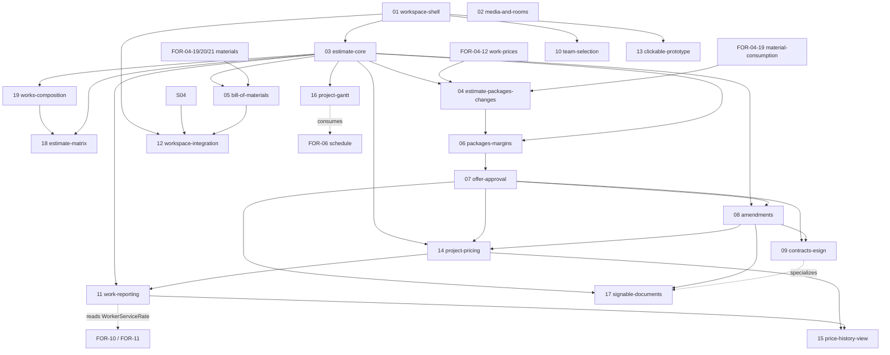

# FOR-05: Смета проекта и единое пространство проекта / Project estimate & unified workspace

## Обзор

FOR-05 — большая родительская спека. Она объединяет всю работу над ремонтным проектом
в **единое пространство проекта**: один пункт меню (**Проекты → открыть проект**) ведёт на
страницу проекта, где **все этапы проекта — это табы внутри одного контекста**. До начала
работ (режим проектирования) в шапке видна **готовность проекта к подписанию**; после
подписания те же табы переключаются в **режим исполнения** (прогресс, закупки, отчётность).

Источник правды для доменной модели — текущий Excel клиента
(`docs/Matrix Foremen v3.0 (1).xlsx`, лист `Oferta`): один лист содержит весь проект —
список работ по категориям, количества по комнатам, спецификацию материалов с нормами
расхода, три коммерческих пакета (START / COMFORT / PRESTIGE), маржу (план/факт),
изменения (амендменты) и понедельный прогресс работников.

Полный технический анализ (эргономика UI/UX, доменная модель, ABAC-матрица, алгоритмы,
управление ценами, e-подпись по польскому праву) находится в `design.md` этой же папки.
Настоящий OVERVIEW — навигационная карта: он фиксирует **список дочерних спек FOR-05-NN** и
их зависимости. Каждая дочерняя спека далее прорабатывается как отдельная спека (свои
`requirements.md` / `design.md` / `tasks.md` / `test-cases.md`).

## Кликабельный прототип

Готовый статичный HTML-прототип страницы проекта (для демонстрации клиенту) лежит рядом:

- **`prototype/project-workspace.html`** — открывается в браузере без сборки. Показывает
  все предложенные UI/UX-принципы: единое пространство с табами, сгруппированными в 4 фазы
  (Setup · Offer · Contract · Execution), виджет готовности в шапке, плотные таблицы на
  десктопе / карточки на мобиле, прогрессивное раскрытие деталей строки сметы, пакеты
  START/COMFORT/PRESTIGE и мок-флоу подписания. Данные захардкожены из Excel-оферты.

## Ключевые UI/UX-принципы (из design.md §1)

| Принцип | Решение |
|---------|---------|
| Один проект — один контекст | Единый роут `/projects/:projectId` + локальные табы, без ухода из проекта |
| Мобайл-ферст, мало верхнеуровневых выборов | 10 этапов сгруппированы в ~4 фазы; на мобиле — сегмент-контрол + overflow |
| Прогрессивное раскрытие | Матрица по комнатам, BoM, маржа — за раскрывашкой/в drawer, не в основной сетке |
| Отслеживание готовности | Постоянный виджет готовности в шапке (done/partial/blocked + общий %) |
| Плотные данные | Таблицы для сравнения на десктопе, карточки на мобиле, графики — как сводка |

## Рабочий проект и стадийные табы (из design.md §4.3b, §6.10, §8.1)

- **Рабочий проект (working project)** — id проекта, с которым юзер сейчас работает в UI. Хранится в **localStorage** (`foremen.workingProjectId`), это чисто клиентское состояние (не сущность БД, не ABAC-ресурс). Хук `useWorkingProject()` держит id и подтягивает сводку проекта.
- **Кнопка рабочего проекта видна всегда:** на десктопе — под пунктом «Дашборд» в сайдбаре (имя проекта + статус); на мобиле — компактный чип в топбаре / слот в нижней навигации. Если проект не выбран — «Выбрать проект / Wybierz projekt».
- **Выбор проекта = выбор из списка проектов** (отдельного пикера нет).
- **Клик по строке проекта → переход в панель проекта** (`/projects/:projectId`) и установка рабочего проекта, а НЕ стандартная форма редактирования. Редактирование полей — вторичное действие внутри панели (в «Обзоре»).
- **Набор табов зависит от стадии проекта** (из `Project.status`), граница — подписание договора:

| Стадия проектирования (до подписания) | Стадия исполнения (после подписания) |
|---------------------------------------|--------------------------------------|
| Обзор | Обзор |
| Трекер готовности | Закупки (Zakupy, FOR-07) |
| Расценки (Cennik) | Первичные документы (Dokumenty źródłowe, FOR-10) |
| Комнаты (Pomieszczenia) | План-факт Гант с % выполнения (Plan/wykonanie, FOR-06+WorkReport) |
| Смета — объёмы + виды работ (Kosztorys) | Расчёт ЗП по проекту (Rozliczenie wynagrodzeń, FOR-11) |
| Эстимация-Гант (Harmonogram) | Подписание амендментов (Aneksy) |
| Подписание договора (Podpisanie umowy) | История цен (Historia cen) |

Примечание: табы «Первичные документы» встраивают FOR-10, «Расчёт ЗП» — FOR-11, «Закупки» —
FOR-07, Ганты связаны с FOR-06; FOR-05 хостит их как табы, данные/расчёты — за соседними
спеками.

## Управление ценами (из design.md §4.3a–4.7, §6.6–6.9)

Ключевые правила ценообразования, продуманные заранее:

| Аспект | Модель |
|--------|--------|
| **Каталожная цена работы** (прейскурант) | `WorkPrice` теперь **пер-пакет**: `(workItem, offerPackage, currency, netPrice)`, **без** временны́х интервалов на уровне каталога (нет `validFrom`/`validTo` у самой каталожной цены). Если для нужного пакета цены нет — фолбэк = **MAX** цен этой работы по остальным пакетам. Владелец каталожной цены — **FOR-04-12** |
| **Фиксация цены оффера** (денормализация) | Цена из прейскуранта при попадании в строку сметы **замораживается** в `EstimateLine.unitPrice` (FK на `WorkPrice` — только provenance). При APPROVED/SIGNED строки снапшотятся в `OfferPriceSnapshot` — подписанный оффер не меняется от правок каталога. Заморозка оффера и проектная временна́я история остаются как есть — временны́е интервалы живут на **проекте** (`ProjectServicePrice`), а не в каталоге |
| **Временны́е цены на проекте** | `ProjectServicePrice` — интервалы `[effectiveFrom, effectiveTo)`; `OFFER_BASE` (с даты подписания) + `AMENDMENT`-оверрайды. Стартовая точка `OFFER_BASE` берётся из **пер-пакетной каталожной цены** (`WorkPrice` с MAX-фолбэком, FOR-04-12), а не из каталожного временно́го интервала. Трекинг работ считается по цене, действовавшей **на дату интервала выполнения** (пример: шпатлёвка 100 zł/m² в мае → 120 с июня; работа в мае считается по 100, даже если внесена в июне) |
| **Внутренняя расценка работнику** | `WorkerServiceRate` — временна́я И **пер-работник** (у разных работников разные расценки). Определена в дизайне FOR-05, но **владение и расчёт выплат — FOR-10/FOR-11**; FOR-05 только читает |
| **WorkReport** | Работник · проект · работа · комнаты (0..n, разбивка объёма) · интервал · аппрув прораба · цена клиенту (revenue, на дату интервала) · цена работнику (cost, на дату интервала) · маржа = revenue − cost |
| **Прозрачность изменений цен** | Отдельная read-only вью для ADMIN + FINANCIER (`PRICE_HISTORY`) поверх аудита + временны́х таблиц: каталог (`WorkPrice`), проект (`ProjectServicePrice`), работники (`WorkerServiceRate`). Переиспользует паттерн сравнения из FOR-02-06a |

## Решения со звонка с клиентом (15.09)

- **Подписываемые документы — отдельная дочерняя спека (17):** обобщённая сущность многих видов (договор, анекс, протокол приёмки помещения, передача ключей, приёмка работ); 3 способа подписи (распечатать и подписать со сканом, подписать онлайн, podpis.gov.pl) + парафка на планшете «на месте»; загрузка медиа (скан подписанного документа).
- **Несколько клиентов на проекте:** у проекта может быть несколько участников с ролью CLIENT, добавляемых в любой момент по ходу проекта.
- **Таблица проектов — вычисляемые поля (мини-дашборд прораба):** план/факт работ, затраты план/факт, выручка, опоздание/опережение, удовлетворённость клиента (последнее — плейсхолдер до бэклог-пункта). Отдельный дашборд не делаем — расширяем существующую таблицу проектов.
- **Смета — гибридная таблица + группировки:** сводная таблица «помещения × виды работ» и переключение группировки (по видам работ / по помещениям / по категориям). Развивается в **интерактивную матрицу** (дочерняя спека **18**): клик по ячейке добавляет работу в комнату, можно выбрать целую группу работ разом; состояние матрицы держится в **localStorage** с индикатором «не сохранено» до коммита (паттерн из workspace-shell).
- **Материальный расчёт сметы (требование клиента 4):** при назначении работ на комнату материалы подтягиваются из пер-пакетного расхода каталога работ (FOR-04-21) и каталогов `FinishingMaterial`/`ConstructionMaterial` (FOR-04-19/20). Смета показывает расчёт работ/материалов **раздельно и совместно, с разбивкой по пакетам** (START/COMFORT/PRESTIGE). Владеет расчётом дочерняя спека **05 bill-of-materials**.
- **План-факт — все отчёты по работе:** список отчётов (работник, вид работ, помещения, объём, дата) рядом с Гантом.
- **Виды по ролям:** работник видит свой объём и потенциальный заработок; прораб — метрики по всем проектам в таблице проектов.

## Бэклог (не в текущем приоритете)

- Выгрузка отчётов в Excel.
- Список стадий процесса подписания проекта (ожидается ввод от @kostenjar).
- Лайки/дизлайки от клиента — оценка процесса работ.

## Границы ответственности (FOR-05 и соседние спеки)

Единое пространство — точка интеграции, но не всё за его табами принадлежит FOR-05.

| Спека | Что владеет | Как показывается в пространстве FOR-05 |
|-------|-------------|----------------------------------------|
| **FOR-05** | Оболочка пространства + табы, медиа проекта и комнат, обогащение комнат, состав работ, смета + BoM, оффер/согласование (сервер), контракт + e-подпись, подбор команды, отчётность (revenue-сторона + аппрув), временны́е цены на проекте | Само пространство |
| **FOR-06** work-schedule | Гант, календари, данные графика | Таб «График» (встраивается) |
| **FOR-07** procurement-tracking | Закупки/поставки, статусы, приёмка | Таб «Закупки» (встраивается) |
| **FOR-08** ai-estimate | AI-оркестратор + tools + чат per project | Панель «AI-ассистент» в табах Работы/Смета |
| **FOR-09** client-portal | Read-only клиентские представления + клиентская коммуникация | Клиентский рендер таба Оффер/Согласование |
| **FOR-10** financial-accounting | Первичка, банковские проводки, разнесение затрат, **расценки работникам** (`WorkerServiceRate`) | «Финансы» из данных закупок/сметы; расценка читается WorkReport |
| **FOR-11** payroll | **Расчёт выплат работникам** на базе `WorkerServiceRate` + аппрувнутых `WorkReport` | Потребляет cost-сторону `WorkReport` из FOR-05 |

Правило: если соседняя спека ещё не готова, её таб показывает заглушку «скоро / не
настроено», а прототип для этих табов использует захардкоженные данные. `WorkerServiceRate`
определена в дизайне FOR-05 для целостности модели, но её владение и расчёт выплат — в
FOR-10/FOR-11; FOR-05 читает её read-only.

## Дочерние спеки FOR-05

| # | Дочерняя спека | Тип | Область | Зависит от |
|---|----------------|-----|---------|------------|
| 01 | `FOR-05-01-workspace-shell` | frontend | Роут `/projects/:projectId`, tab-host, фазы, `ReadinessWidget`, адаптивная лента табов; рабочий проект (localStorage + `useWorkingProject`), всегда видимая кнопка рабочего проекта (десктоп+мобайл), переход из списка проектов в панель (вместо формы эдита), стадийный резолвер табов (`resolveWorkspaceTabs`) | FOR-04-13 (Project) |
| 02 | `FOR-05-02-rooms-dimensions` | full-stack | Вкладка «Помещения» проектного пространства: **интерактивная матрица «размеры × помещения»** (ориентация листа Excel `Wymiary`: размеры в строках, помещения в столбцах, столбец единиц + столбец Σ) с инлайн-редактированием ячеек и лейбла, трекингом изменений на фронте в **двух project-keyed localStorage-сторах** (правки существующих комнат + новые комнаты), **балк-сохранением в транзакции** (existing → `PUT /api/rooms/bulk`, new → `POST /api/rooms/bulk`), undo/redo одиночного изменения + «отменить все», живой агрегацией Σ, быстрым созданием комнаты («+», с обязательным инлайн-выбором типа) и удалением с подтверждением; + полноэкранная страница-редактор помещения, переиспользующая мини-редактор геометрии (`RoomOpeningsEditor` + `RoomPlanPreview`). Редактируемость — **только в статусе `DRAFT`** (блокируется с `ACTIVE`). **Бэкенд-часть минимальна и generic**: новый `updateBulk` (`PUT /bulk`) на `AdminController` + `@Transactional` пакетное обновление в `AdminService` (наследуется всеми контроллерами) и пофайловый manual-override в `RoomService` — без новых сущностей/таблиц/полей/ABAC-ресурсов, поверх существующего `ROOMS`. Медиа проекта и комнат вынесены в отдельную дочернюю медиа-спеку. | FOR-04-14, 01 |
| 03 | `FOR-05-03-estimate-core` | backend | `Estimate`, `EstimateLine`, `EstimateLineRoomQty`, пересчёт итогов, ABAC `ESTIMATE` | FOR-04-11/12, 01 |
| 04 | `FOR-05-04-estimate-packages-changes` | backend (migration) | **Замена пер-пакетного прайсинга единой ценой работы + формульный движок объёмов + пересчёт пакетов в zł/m2.** Ретирит/мигрирует уже реализованные `WorkPackagePrice`/`EffectivePriceResolver` (FOR-04-12b/12c) и пер-пакетное потребление материалов `WorkMaterialConsumption` (FOR-04-19) в пользу: (1) одной цены работы на `WorkItem` (без пакетов), (2) формул объёма по 14 размерам комнаты + кросс-ссылки на объём других работ (сид из `Oferta!X` + оверрайды `AL/AM/AN`), (3) агрегированного расчёта zł/m2 по пакету (по модели листа `Zestawienie`) с материалами-подсказками (product-ссылка, не драйвер значения). См. открытые вопросы в `requirements.md` по поводу FOR-05-06 | 03, FOR-04-12, FOR-04-19 |
| 05 | `FOR-05-05-bill-of-materials` | full-stack | **Не определяет материалы с нуля** — агрегирует ведомость материалов (BoM) из **пер-пакетного расхода** каталога работ (FOR-04-21) и каталогов `FinishingMaterial`/`ConstructionMaterial` (FOR-04-19/20). При назначении работ на комнату подтягивает материалы и считает расчёт работ/материалов **раздельно и совместно, с разбивкой по пакетам** (START/COMFORT/PRESTIGE). Владеет только read-model агрегации BoM и материальным расчётом сметы (не самими справочниками) | 03, FOR-04-19/20/21 |
| 06 | `FOR-05-06-packages-margins` | full-stack | `EstimateLinePackage`, `EstimateLineMargin`, представления пакетов/маржи. **Требует пересмотра после 04**: пакетная ЦЕНА строки (`EstimateLinePackagePrice`, ранее FOR-05-03/FOR-04-12b) заменяется единой ценой работы + производным zł/m2-пакетом (04); 06 остаётся владельцем VALUE/маржи, но должен читать новую модель — см. открытый вопрос в `FOR-05-04-estimate-packages-changes/requirements.md` | 03, 04, FOR-04-10 |
| 07 | `FOR-05-07-offer-approval` | full-stack | `Offer`, `OfferDiscount`, отправка/согласование, ABAC `OFFERS` (клиентская часть — с FOR-09) | 06 |
| 08 | `FOR-05-08-amendments` | full-stack | `EstimateAmendment`, `AmendmentLine`, пересчёт дельт | 03, 07 |
| 09 | `FOR-05-09-contracts-esign` | full-stack | `Contract`, `ContractSignature`, `SignatureProvider`, машина состояний подписания (e-подпись, PL/eIDAS) | 07, 08 |
| 10 | `FOR-05-10-team-selection` | full-stack | Назначение `ProjectMember`, ABAC `PROJECT_TEAM`, таб «Команда» | 01 |
| 11 | `FOR-05-11-work-reporting` | full-stack | **Обогащённый `WorkReport`** (revenue-сторона + `WorkReportRoom` разбивка по комнатам + аппрув прораба), сводка прогресса, ABAC `WORK_REPORTS`. Использует `resolveClientPrice` (14); cost-сторона читает `WorkerServiceRate` (владелец — FOR-10/11) | 03, 14 |
| 12 | `FOR-05-12-workspace-integration` | frontend | Встраивание табов FOR-06 (график) и FOR-07 (закупки); подключение клиентского вида FOR-09; + встраивание табов FOR-10 (первичные документы) и FOR-11 (расчёт ЗП) | 01, FOR-06, FOR-07, FOR-09 |
| 13 | `FOR-05-13-clickable-prototype` | frontend | Fixture-прототип страницы проекта для демо (HTML уже готов; перенос в React — здесь) | 01 |
| 14 | `FOR-05-14-project-pricing` | backend | Временны́е цены на проекте: `ProjectServicePrice` + `resolveClientPrice`, заморозка цены оффера `OfferPriceSnapshot`, связка амендмент→интервал, ABAC `PROJECT_PRICING`. Сидит **поверх пер-пакетной каталожной цены** (FOR-04-12): `resolveClientPrice` берёт пер-пакетный `WorkPrice` с MAX-фолбэком как стартовый `OFFER_BASE`, а не временно́й каталожный интервал | 03, 07, 08, FOR-04-12 |
| 15 | `FOR-05-15-price-history-view` | full-stack | Read-model + UI «История цен» для админа/финансиста поверх аудита + временны́х таблиц (каталог/проект/работник), ABAC `PRICE_HISTORY`; переиспользует паттерн сравнения FOR-02-06a | 14, 11 |
| 16 | `FOR-05-16-project-gantt` | frontend | Ганты в панели проекта: планировочный Гант (стадия проектирования) и план-факт с наложением и % выполнения (стадия исполнения); потребляет график FOR-06 и прогресс WorkReport FOR-05 | 03, FOR-06 |
| 17 | `FOR-05-17-signable-documents` | full-stack | Обобщённые подписываемые документы: `SignableDocument` + типы (i18n: Договор/Umowa, Анекс/Aneks, Протокол приёмки помещения, Передача ключей, Приёмка работ) + `DocumentSignature` (4 способа: распечатать+скан / онлайн / podpis.gov.pl / парафка на планшете) + `DocumentMedia` (скан/парафка), ABAC `SIGNABLE_DOCUMENTS`. Обобщает FOR-05-09 (контракт становится частным случаем) | 07, 08 |
| 18 | `FOR-05-18-estimate-matrix` | frontend | Интерактивная матрица «комнаты × виды работ»: клик по ячейке добавляет работу в комнату, выбор целой группы работ разом, локальное состояние матрицы в **localStorage** с индикатором «не сохранено» до коммита на сервер. Развивает заметку «гибридная таблица + группировки». Коммит матрицы использует состав работ (19) и ядро сметы (03) | 03, 19 |
| 19 | `FOR-05-19-works-composition` | full-stack | Добавление работ вручную/группой/по шаблону с исключениями, `WorkTemplate`, UI таба «Работы». **Ранее была под номером 04** — переномерована, слот 04 отдан спеке `estimate-packages-changes` (см. выше) | 03 |

## Граф зависимостей дочерних спек

## Рекомендуемый порядок разработки

1. **01 workspace-shell** — каркас пространства и табов (без данных); теперь также поставляет кнопку рабочего проекта и стадийные табы (`resolveWorkspaceTabs`).
2. **13 clickable-prototype (React)** — можно рано, для демонстраций (HTML-версия уже есть).
3. **03 estimate-core** -> **19 works-composition** -> **05 bill-of-materials** — ядро сметы.
   - **18 estimate-matrix** — после 03/19 (интерактивная матрица «комнаты × виды работ» с localStorage и индикатором «не сохранено»).
   - **05 bill-of-materials** требует готовых материальных спек FOR-04 (FOR-04-19/20/21) — агрегирует BoM и считает материальный расчёт по пакетам поверх них.
   - **04 estimate-packages-changes** — миграционная спека, ретирит пер-пакетный `WorkPrice`/`WorkPackagePrice` (FOR-04-12b/12c) и пер-пакетное потребление материалов (FOR-04-19) в пользу единой цены работы + формульного движка объёмов + пакетного zł/m2. Может идти параллельно с 19/05, но **должна завершиться до 06 packages-margins**, т.к. 06 читает новую пакетную модель.
4. **06 packages-margins** (после 04) -> **07 offer-approval** -> **08 amendments** -> **09 contracts-esign** — коммерция и подписание.
   - **17 signable-documents** — после 08 amendments / 09 contracts-esign (обобщает подписание).
5. **14 project-pricing** — после 03/07/08 (заморозка оффера + временны́е цены).
6. **11 work-reporting** — после 03/14 (revenue-сторона считается по временны́м ценам).
7. **16 project-gantt** — после 11 (work-reporting) и ценообразования, до 12 (потребляет график FOR-06 и прогресс WorkReport).
8. **15 price-history-view** — после 14/11 (прозрачность изменений цен).
8. **10 team-selection** — параллельно после 01.
9. **02 media-and-rooms** — параллельно (зависит от Project/Room).
10. **12 workspace-integration** — в конце, когда FOR-06/07/09 готовы.

## Предпосылки (жёсткие зависимости)

- **FOR-04-13 Project** и **FOR-04-14 Room** — сущности проекта и комнат (расширяются здесь).
- **FOR-04** — каталог работ, цены, категории, пакеты, единицы измерения, категории материалов.
- **FOR-04-12/12b/12c (цены работ)** — каталожная цена работы СЕЙЧАС `(workItem, offerPackage, currency, netPrice)` (пер-пакетная, MAX-фолбэк). **Меняется дочерней спекой 04** (`FOR-05-04-estimate-packages-changes`) на единую цену `(workItem, currency, netPrice)` без пакетов; `resolveClientPrice` (FOR-05-14) и `EstimateLinePackagePrice`/`PackagePriceSnapshotService` (FOR-05-03) должны быть пересмотрены после 04 — см. открытые вопросы там.
- **FOR-04-16..21 (материалы + расход)** — справочники материалов (`MATERIAL_TYPES`/`MATERIAL_PRODUCERS`/`MATERIALS`), сущности `FinishingMaterial`/`ConstructionMaterial` и пер-пакетный расход материалов в каталоге работ (FOR-04-21). FOR-05-05 (BoM) агрегирует поверх них и **не** определяет материалы сам.
- **FOR-04-RESEARCH-material-norms** — артефакт польских норм расхода (KNR / polskie normy), становится сидом FOR-04-21; должен быть готов до материального расчёта сметы в FOR-05-05.
- **FOR-01/02/03** — CRUD-фреймворк, ABAC, `ProjectScopedService`, `@PermissionResource`.
- Объектное хранилище (медиа комнат и проекта, подписанные документы) — через FOR-12.
- Провайдер e-подписи / QTSP — конкретный выбор через FOR-12/конфиг.
- **FOR-10 (финансы) / FOR-11 (зарплаты)** — владеют `WorkerServiceRate` (cost-сторона),
  которую FOR-05 читает read-only; таблица определена в дизайне FOR-05 для целостности модели.
- **FOR-02-06a** — паттерн вью сравнения аудита, переиспользуется вью «История цен».

## Отложенные пункты (deferred from earlier specs)

### Медиа-материалы комнаты и проекта / Room & project media (from FOR-04-14)

- **Origin:** отложено из FOR-04-14 (Room). FOR-04-14 даёт сущность Room, её геометрию/метрики
  и CRUD; медиа-вложения намеренно вне её области и относятся сюда (дочерняя спека **02**).
- **Need:** комната **и проект в целом** должны поддерживать загрузку медиа (документы,
  изображения, видео) с управлением (upload, list, download, delete) со страницы комнаты и с
  обзорной страницы проекта.
- **Notes:** несколько вложений; хранение бинарей в объектном хранилище, в БД — только
  метаданные (имя, тип, размер, кто/когда загрузил); доступ по project-scoped ABAC
  (`ROOM_MEDIA` / `room.project.id` и `PROJECT_MEDIA` / `project.id`); плюс более богатая
  страница комнаты (интерактивный редактор плана и табы комнаты), также отложенная в FOR-05.

---

*Обновляется при добавлении/изменении/завершении дочерних спек FOR-05.*
