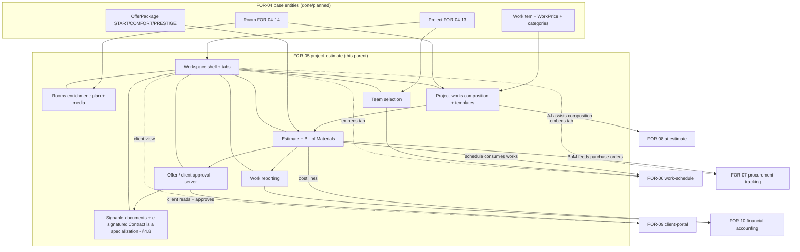
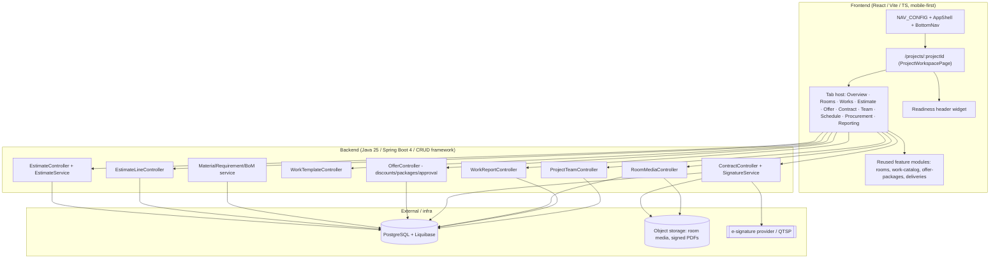
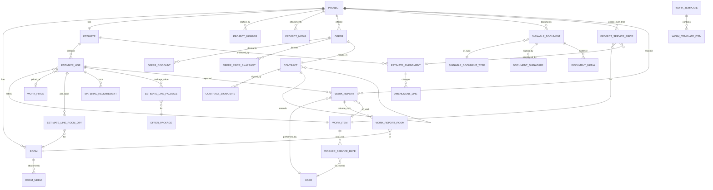
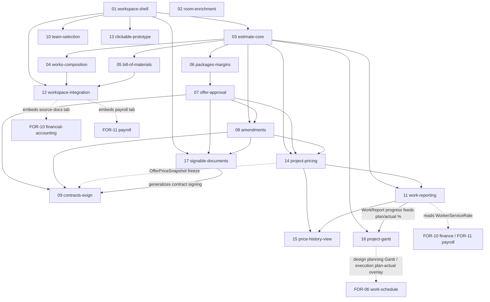

# Design Document: FOR-05 — Project Estimate & Unified Project Workspace

> **Scope note.** FOR-05 is a **large parent spec**. This document is the parent-level
> technical design: it establishes the domain model, the "single project workspace"
> UX, the child-spec breakdown, and the interdependencies with sibling specs
> (FOR-06…FOR-10). It is written so it can later be split into child sub-specs
> (`FOR-05-NN-…`), each of which will get its own `requirements.md` / `design.md` /
> `tasks.md` / `test-cases.md`.

## Overview

FOR-05 delivers the **estimate (kosztorys)** of a renovation project and the
**unified "single project workspace"** that hosts it. Today the client works in a
single Excel workbook (`docs/Matrix Foremen v3.0 (1).xlsx`) where one sheet holds the
entire project: the list of works grouped by category, per-room quantities, a bill of
materials with consumption norms, three commercial packages (START / COMFORT /
PRESTIGE), margins (plan vs. fact), amendments, and week-by-week worker progress. That
workbook is the source of truth for the domain model, and the workspace we build must
feel at least as coherent as "one sheet, everything in context."

The product goal is an **ergonomic single project workspace**: from one main menu item
(**Projects → open a project**) the user lands on a project page where **all lifecycle
stages are tabs/areas within one context**. Before work starts (design mode) the
workspace shows **readiness tracking** — how close each stage is to being ready to sign.
Once signed, the same tabs flip to **execution mode** (progress, procurement, reporting).

The ten lifecycle stages the workspace must surface as tabs/areas:

1. **Project creation** — the anchor entity (owned by FOR-04-13).
2. **Rooms & geometry** — rooms with dimensions; the richer room page (plan editor, room
   media) is folded into FOR-05.
3. **Required works** — add works manually one-by-one, in bulk/group, or from a template
   ("typical set") with the ability to exclude unwanted items.
4. **Estimate of works + materials (kosztorys)** — priced works × rooms, plus the derived
   bill of materials from consumption norms.
5. **Client price approval** — discounts, package selection, special project prices,
   approve/reject the offer.
6. **Contract & amendment signing** — online e-signatures, legally compatible with Polish
   law (see §11).
7. **Team selection** — assign foreman + workers to the project.
8. **Work schedule** — Gantt/calendar (primarily **FOR-06**, surfaced here as a tab).
9. **Procurement & delivery tracking** — (primarily **FOR-07**, surfaced here as a tab).
10. **Work reporting** — completed-work reporting from both foreman and worker sides.

FOR-05 **owns** stages 2 (room enrichment), 3, 4, 5, 6, 7, 10 and the workspace shell
itself. Stages 8 and 9 are **owned by sibling specs** (FOR-06, FOR-07) and stage 5's
client-facing surface is shared with **FOR-09**; the workspace **embeds** those surfaces
as tabs so the project stays "one context." §2 makes this ownership boundary explicit.

### Context: what already exists

| Component | Spec | Use in FOR-05 |
|-----------|------|---------------|
| CRUD framework (`AdminService`/`AdminController`, DAO, MapStruct, i18n mapping) | FOR-01 | Every new managed entity is a generic CRUD resource |
| Table metadata + server filters (RSQL / reference filters) | FOR-02, FOR-04-01 | Estimate/BoM/delivery tables reuse DataTable + filters |
| ABAC (`resources`, `operations`, `role_resources`, `role_resource_operations`) | FOR-02/03 | Every new resource is seeded into the matrix |
| `@PermissionResource` / `@PermissionOperation`, startup validator | FOR-03-08 | Every new controller is annotated |
| `ProjectScopedService.getProjectIdPath()` — auto project filtering | FOR-03-04 | All FOR-05 project-scoped services implement it |
| `WorkItem`, `WorkPrice` (209 seeded prices), `WorkCategory` (13), `MeasurementUnit`, `Currency`, `VatRate`, `RoomType`, `OfferPackage` (START/COMFORT/PRESTIGE), `MaterialCategory` | FOR-04 | The estimate is built from the catalog + price history + packages |
| `Project` (FOR-04-13), `Room` (FOR-04-14) | FOR-04 | **Hard dependency** — FOR-05 extends both; both must land first |
| React AppShell, `NAV_CONFIG`, DataTable, feature-module layout, guards | FOR-02/03/04 | The workspace reuses layout, nav, tables, and existing feature pages |

### Guiding principles

- **One project, one context.** The workspace is a single route (`/projects/:projectId`)
  with tabs; each tab is a lazy-loaded panel. No stage requires leaving the project.
- **Design mode vs. execution mode.** The same workspace serves both phases; a project
  `status` drives which affordances appear and which readiness/progress widgets show.
- **Estimate is derived, not duplicated.** Works reference the catalog and the price valid
  at a date; the bill of materials is derived from per-work consumption norms; totals,
  margins, and package values are computed, never hand-entered where they can be derived.
- **Role + ABAC is the single source of truth for what renders** (per `PROJECT.md`).
  There are no per-role workspaces; tabs and actions appear based on `(resource, operation)`
  grants and project membership.
- **PL/RU i18n everywhere**, PL fallback, matching existing `nameRU`/`namePL` convention.
- **Sibling specs plug in, they don't fork.** FOR-06/07/09 own their data and pages;
  the workspace embeds them behind a stable tab contract.

---

## 1. Ergonomics / UX Analysis — "single project workspace + tabs"

This section is a **first-class, up-front analysis** of whether the "one page + tabs"
solution is the right information architecture, grounded in established UX guidance. It
drives the layout decisions in §7 and §10.

### 1.1 Why one workspace (not ten menu items)

The current Excel is *one sheet* that a user scans top-to-bottom and left-to-right without
ever "navigating away." Splitting the ten stages into ten top-level menu items would break
that mental model: the user would lose the sense that all of it is *the same project*, and
would pay a re-orientation cost on every jump. Consolidating the stages under a single
project context with in-place tab switching preserves the "everything about this project is
here" model while keeping each stage's density manageable.

**Best-practice grounding.** Tabs organize and conceal content until it's requested, which
simplifies a dense interface, and they are well suited to letting users move between related
views of the *same* object without losing context ([NN/g, "Tabs, Used Right"](https://www.nngroup.com/articles/tabs-used-right/)).
That is exactly our situation: one project, many facets. *Content was rephrased for
compliance with licensing restrictions.*

### 1.2 Tab bar vs. nested navigation — and the mobile constraint

This is a **mobile-first** app (iOS-like, bottom nav). Two constraints matter:

- A horizontal top tab bar works well **only when there are relatively few options** and it
  consumes valuable above-the-fold space on small screens
  ([NN/g, "Basic Patterns for Mobile Navigation"](https://www.nngroup.com/articles/mobile-navigation-patterns/)).
  Ten stages will not fit as ten always-visible tabs on a phone.
- For mobile-first experiences, accordion/section patterns scale to small screens more
  naturally than tabs, and tabs shine for *comparison* while accordions shine for *scanning*
  ([onething.design, "Tabs vs. Accordions"](https://www.onething.design/post/tabs-vs-accordions)).
  *Content was rephrased for compliance with licensing restrictions.*

**Decision.** Use a **responsive segmented tab strip** with **progressive disclosure of the
tab set itself**:

- **Desktop / tablet:** a horizontal tab strip across the top of the project workspace,
  grouped into a small number of *phases* (Setup · Offer · Contract · Execution) so the eye
  parses ~4 groups, not 10 leaves.
- **Mobile:** a scrollable/segmented control showing the current phase, with an overflow
  menu ("•••") for the rest; each tab panel is itself a vertically scannable, collapsible
  set of sections (accordion within a panel). The app's existing bottom nav stays for
  *global* navigation; the tab strip is *local* to the project.

This keeps the top-level choice count low, respects mobile real estate, and uses tabs where
comparison matters (Estimate, Packages) and collapsible sections where scanning matters
(a room's works list).

### 1.3 Progressive disclosure — hide stage complexity until needed

Each stage is dense (the Estimate tab alone reproduces most of the Excel). Progressive
disclosure defers advanced or rarely used controls to a secondary layer so the primary task
stays in focus and the interface is easier to learn and less error-prone
([NN/g, "Progressive Disclosure"](https://www.nngroup.com/articles/progressive-disclosure/)).
*Content was rephrased for compliance with licensing restrictions.*

Applied here:

- The Estimate tab defaults to **works grouped by category** (collapsed groups), with the
  per-room quantity matrix and the bill-of-materials columns hidden behind an expander /
  "detail" toggle per line.
- Package math, margins (plan/fact), and amendment columns are **secondary layers** (a
  "Commercial" sub-view and a per-line detail drawer), not the default dense grid.
- Bulk/template add is a **secondary flow** (a dialog), keeping the primary "add a work"
  path simple.

### 1.4 Readiness / checklist pattern (design mode)

Before signing, the workspace's job is to answer "what still blocks us from signing?" A
**readiness checklist** is the natural pattern: a compact list of stage gates (rooms
defined, works added, estimate priced, client approved, team assigned) each showing
done / partial / blocked, with a single headline "readiness %". This is progressive
disclosure applied to *process*: the summary is always visible; the detail (which line
item is missing a price, which room has no dimensions) is one click away. The readiness
widget lives in the workspace header so it's visible from every tab.

### 1.5 Dense data tables + charts

The estimate, bill of materials, and delivery lists are exactly the "large multivariate
workplace dataset" that data tables are built for: tables scale in rows/columns and make
adjacent values easy to **compare** without forcing the user to hold values in working
memory, which card layouts do force ([NN/g, "Data Tables: Four Major User Tasks"](https://www.nngroup.com/articles/data-tables/)).
*Content was rephrased for compliance with licensing restrictions.*

Therefore:

- On **desktop/tablet**, use the existing DataTable (sortable, filterable, sticky header)
  for the estimate, BoM, and deliveries — comparison-first.
- On **mobile**, collapse each row to a **card** (the responsive-table fallback the same
  NN/g guidance recommends for small/variable viewports), keeping the one or two values that
  matter (name, value) prominent and deferring the rest to the row's detail drawer.
- Charts (readiness donut, cost/margin bars, progress-over-time line, procurement status)
  are **summaries on top of** the tables, never replacements — they answer "how are we
  doing overall," the tables answer "which line."

### 1.6 Summary of UX decisions

| Decision | Rationale (source) |
|----------|--------------------|
| One project route + local tab strip | One-context model; tabs conceal/organize related views ([NN/g Tabs](https://www.nngroup.com/articles/tabs-used-right/)) |
| Group 10 stages into ~4 phases | Keep top-level choices few; mobile tab-bar real estate ([NN/g Mobile Nav](https://www.nngroup.com/articles/mobile-navigation-patterns/)) |
| Mobile: segmented + overflow, accordions inside panels | Accordions scale to small screens ([onething.design](https://www.onething.design/post/tabs-vs-accordions)) |
| Secondary layers for packages/margins/BoM detail | Progressive disclosure ([NN/g Progressive Disclosure](https://www.nngroup.com/articles/progressive-disclosure/)) |
| Persistent readiness checklist in header | Process-level progressive disclosure |
| Tables on desktop, cards on mobile, charts as summaries | Tables for comparison; responsive fallback ([NN/g Data Tables](https://www.nngroup.com/articles/data-tables/)) |

---

## 2. Child-Spec Map & Interdependencies (FOR-05 series + siblings)

FOR-05 is one of several sibling parent specs. The unified workspace is the *integration
point*, but not everything behind its tabs is FOR-05's to build. This section clarifies the
ownership boundary and how the specs connect.

### 2.1 Sibling parent specs (what each owns)

| Spec | Owns | Surfaced in the FOR-05 workspace as |
|------|------|-------------------------------------|
| **FOR-05** project-estimate | Workspace shell + tabs, rooms enrichment (plan/media), works composition, estimate + BoM, client approval (server side), contract & e-signature, team selection, work reporting | The workspace itself |
| **FOR-06** work-schedule | Gantt, calendars, foreman/worker scheduling data | "Schedule" tab (embedded) |
| **FOR-07** procurement-tracking | Purchase/delivery orders, delivery statuses, receiving | "Procurement" tab (embedded) |
| **FOR-08** ai-estimate | AI orchestrator + tools + per-project chat to *assist* building the estimate | An "AI assist" panel inside the Works/Estimate tabs |
| **FOR-09** client-portal | Read-only client views + client-side communication (approval, discounts, package choice, delivery variant choice) | The **client-facing** rendering of the Offer/Approval tab |
| **FOR-10** financial-accounting | Primary docs, bank transactions, cost allocation, **worker cost rates** (`WorkerServiceRate`, §4.7) | "Finances" surfaced from procurement/estimate cost data; worker rate consumed by FOR-05 work reports |
| **FOR-11** payroll | **Worker payout computation** built on `WorkerServiceRate` + approved `WorkReport`s | consumes FOR-05 `WorkReport` cost side |

**Ownership rule of thumb:** FOR-05 owns *the offer/estimate domain and the workspace that
frames the project*; the schedule (FOR-06), procurement (FOR-07), AI (FOR-08), client portal
(FOR-09) and finance (FOR-10) own their data and their pages, and the workspace embeds a thin
"tab host" that lazy-loads their feature module. If a sibling spec is not yet built, its tab
renders a graceful "coming soon / not configured" placeholder (the prototype in §10 uses
hardcoded fixtures for exactly these tabs).

**Cost/payroll boundary (`WorkerServiceRate`).** FOR-05's enriched `WorkReport` (§4.4)
carries **both** the revenue side (client price) and the cost side (worker rate). FOR-05
owns the revenue side, the report, and the approval; the **`WorkerServiceRate` table (§4.7),
its write path, and payout computation are owned by FOR-10 (finance) / FOR-11 (payroll)**.
The table is *defined* in this FOR-05 design only so the model is complete now; FOR-05 reads
it read-only. This keeps a single source of truth for worker rates in the finance/payroll
domain while letting the work report compute `margin` today.

**Execution-stage tab embedding (who owns what behind the tab).** Several execution-stage
workspace tabs (§8, §6.10) are *hosted* by FOR-05 but *owned* by siblings — FOR-05 supplies
the tab slot, the sibling owns the data/computation:

- **Procurement** tab embeds **FOR-07** (purchase/delivery orders, receiving).
- **Source / primary documents** tab embeds **FOR-10** — FOR-05 hosts the tab, FOR-10 owns
  the primary-document data.
- **Worker payroll (this project)** tab embeds **FOR-11** — FOR-05 hosts the tab, FOR-11 owns
  the payout computation; it reads the **cost side** of FOR-05's `WorkReport` (§4.4/§4.7).
- **Both Gantts relate to FOR-06.** The **design-stage** project-estimation Gantt is
  **planning-only** (a schedule view of estimated works; the full scheduling engine is
  FOR-06). The **execution-stage** plan/actual Gantt **overlays the FOR-06 schedule with
  FOR-05 `WorkReport` progress** (per-work % completion). FOR-05 hosts both as tabs; FOR-06
  owns the scheduling engine and FOR-05 owns the report/progress side.

In every case FOR-05 renders a thin tab host that lazy-loads the sibling feature module (or a
graceful "not configured" placeholder while the sibling is unbuilt); the sibling owns the
data and computation.

### 2.2 Dependency graph (specs)



**Reading the graph.** FOR-05 hard-depends on `Project` and `Room` (FOR-04) and on the work
catalog/prices/packages. Within FOR-05, works composition feeds the estimate; the estimate
feeds client approval, which gates contract signing. The estimate is also the *upstream
source* for siblings: FOR-06 schedules the works, FOR-07 orders the BoM materials, FOR-09
shows and approves the offer, FOR-10 books the cost lines. The dotted edges are the
*embed* relationships (workspace hosts sibling tabs).

---

## Architecture

<!-- §3. High-Level Architecture -->



All backend services follow the existing CRUD-framework pattern (generic
`AdminController`/`AdminService`, MapStruct DTOs, i18n mapping), are annotated with
`@PermissionResource` (§9), and — where project-scoped — implement
`ProjectScopedService.getProjectIdPath()`.

---

## Data Models

<!-- §4. Domain Model -->

The Excel workbook is the source of truth for the domain. Its columns decompose into the
following entities. All monetary fields are net (netto) unless suffixed; currency is a FK
to `Currency` (default PLN). All i18n text uses `nameRU`/`namePL` (PL fallback).

### 4.1 Entity-relationship diagram



### 4.2 Core entities (FOR-05-owned)

| Entity | Key fields | Scope / `getProjectIdPath()` | Excel origin |
|--------|-----------|------------------------------|--------------|
| `Estimate` | project (FK, 1:1), currency (FK), status (`DRAFT`/`PRICED`/`APPROVED`/`SIGNED`), totalNet, totalVat, totalGross | `project.id` | The sheet as a whole |
| `EstimateLine` | estimate (FK), workItem (FK), workPrice (FK, price at date), unit (FK), lineNo, comment, unitPrice, quantity (derived = Σ room qty), valueNet | `estimate.project.id` | `LP`, `ZAKRES`/`ПЕРЕЧЕНЬ РАБОТ`, `CENA`, `ILOŚĆ`, `WARTOŚĆ`, `KOMENTARZ` |
| `EstimateLineRoomQty` | line (FK), room (FK), quantity | `line.estimate.project.id` | per-room columns (`przedp/hol/kuch/salon/…/laz3/sch1`) |
| `MaterialRequirement` | line (FK), materialName (i18n), materialCategory (FK), unit (FK), consumptionPerUnit (`NA JM`), quantity (derived = consumption × line qty), materialCatalogItem (FK, nullable) | `line.estimate.project.id` | `MATERIAŁ 1..5` + `NA JM` + `ILOŚĆ` |
| `EstimateLinePackage` | line (FK), offerPackage (FK), unitPrice, valueNet | `line.estimate.project.id` | `PAKIET START/COMFORT/PRESTIGE`, `WARTOŚĆ START/COMFORT/PRESTIGE` |
| `EstimateLineMargin` | line (FK), unitMarginPlan, costPlan, profitPlan, marginPctPlan, costFact, profitFact, marginPctFact | `line.estimate.project.id` | `Marż J`, `Koszt`, `Profit`, `Marż W` (plan + fact) |
| `EstimateAmendment` | estimate (FK), createdBy, createdAt, status, reason | `estimate.project.id` | `ZMIANA +/-` block |
| `AmendmentLine` | amendment (FK), line (FK), deltaQty, extraUnitPrice (`CENA DOP`), deltaValue | `amendment.estimate.project.id` | `ZMIANA +/-`, `CENA DOP` |
| `Offer` | project (FK), estimate (FK), selectedPackage (FK, nullable), status (`SENT`/`APPROVED`/`REJECTED`), totals | `project.id` | package selection + `SUMA OFERTY` |
| `OfferDiscount` | offer (FK), scope (`GLOBAL`/`CATEGORY`/`LINE`), targetId, kind (`PERCENT`/`ABSOLUTE`), value | `offer.project.id` | negotiated discount |
| `Contract` | project (FK), offer (FK), parentContract (FK, nullable for amendments), status (`DRAFT`/`PENDING_SIGNATURES`/`SIGNED`/`VOID`), documentUri, contentHash, signatureLevel | `project.id` | signing stage |
| `ContractSignature` | contract (FK), signerUser (FK, nullable), signerRole, level (`SES`/`AdES`/`QES`), providerRef, signedAt, evidenceUri, status | `contract.project.id` | signing stage |
| `ProjectMember` | project (FK), user (FK), projectRole (`MANAGER`/`FOREMAN`/`WORKER`/`CLIENT`/`FINANCIER`) | `project.id` (extends FOR-03-04) | `Pracownik` columns. **Multiple `CLIENT` members allowed** — a project may have `>= 1` member with `projectRole = CLIENT`, and CLIENT membership may be **added at any point during the project lifecycle** (not only at creation), see note below |
| `WorkReport` | worker (user FK), project (FK), workItem (FK), performedFrom (date), performedTo (date), approvedBy (user FK, nullable), status (`DRAFT`/`SUBMITTED`/`APPROVED`/`REJECTED`), clientUnitPrice, workerUnitPrice, totalQuantity (derived), revenueValue (derived), costValue (derived), margin (derived), note | `project.id` | `Progres`/`%`/`Wart Progres` + weekly `Pracownik`+dates (see §4.4) |
| `WorkReportRoom` | report (FK), room (FK), quantity | `report.project.id` | per-room progress split |
| `RoomMedia` | room (FK), fileName, contentType, sizeBytes, storageUri, uploadedBy, uploadedAt | `room.project.id` | deferred from FOR-04-14 |
| `ProjectMedia` | project (FK), fileName, contentType, sizeBytes, storageUri, uploadedBy, uploadedAt | `project.id` | project-level attachments (photos/docs) |
| `ProjectServicePrice` | project (FK), workItem (FK), currency (FK), clientUnitPrice, effectiveFrom (date), effectiveTo (date, nullable=open), source (`OFFER_BASE`/`AMENDMENT`), amendment (FK, nullable) | `project.id` | temporal client price schedule (see §4.5) |
| `OfferPriceSnapshot` | offer (FK), contract (FK, nullable), workItem (FK), unitPrice, quantity, valueNet, frozenAt | `offer.project.id` | frozen offer/contract prices (see §4.6) |
| `WorkerServiceRate` | worker (user FK), workItem (FK), currency (FK), unitRate, effectiveFrom (date), effectiveTo (date, nullable) | not project-scoped (global worker rate; owned by FOR-10/FOR-11 — see §4.7) | internal cost/payout rate |
| `WorkTemplate` | code, nameRU/PL, roomType (FK, nullable), active | global | "typical set" |
| `WorkTemplateItem` | template (FK), workItem (FK), defaultQtyExpr (nullable), includedByDefault | global | template contents |

**Derivations (never hand-entered):**
- `EstimateLine.quantity` = Σ `EstimateLineRoomQty.quantity` for the line.
- `EstimateLine.valueNet` = `unitPrice × quantity`.
- `MaterialRequirement.quantity` = `consumptionPerUnit × line.quantity`.
- `EstimateLinePackage.valueNet` = `package unitPrice × quantity`.
- `Estimate.totalNet` = Σ line `valueNet` (+ approved amendment deltas); `totalGross`
  applies the project VAT rate; `Offer` totals apply discounts on top.
- `WorkReport` derived fields (see §4.4): `totalQuantity` = Σ `WorkReportRoom.quantity`;
  `revenueValue` = `clientUnitPrice × totalQuantity`; `costValue` = `workerUnitPrice ×
  totalQuantity`; `margin` = `revenueValue − costValue`.

**Multi-client membership (client-call decision).** A project is not limited to a single
client: it may have **several `ProjectMember` rows with `projectRole = CLIENT`** (e.g. co-owners
or a spouse added later). Clients can be **added at any lifecycle stage** — during creation and
also mid-project (design or execution) — through the normal Team surface (§8, Team tab). No
uniqueness constraint restricts the project to one CLIENT; ABAC read/approve grants apply to
every CLIENT member equally.

### 4.3a Offer price snapshot / price freeze (denormalization)

When a catalog price enters an offer/estimate line, that price is **frozen (denormalized)**
onto the line and no longer tracks later catalog changes:

- `EstimateLine.unitPrice` is a **stored snapshot** copied from the `WorkPrice` valid at the
  moment the line is priced. The `workPrice` FK is retained purely for **provenance** (which
  catalog price the value came from); the numeric `unitPrice` on the line is the **frozen
  source of truth**. Later edits to `WorkPrice` do not retroactively change `unitPrice`.
- When an `Offer` is **APPROVED/SIGNED**, the priced lines are snapshotted into
  `OfferPriceSnapshot` rows tied to the `Offer` (and, once a `Contract` is generated, to the
  `Contract`). Subsequent catalog edits never alter a signed offer/contract. See §4.6.

### 4.4 Enriched WorkReport (revenue vs. cost, multi-room, temporal)

A `WorkReport` aggregates a worker's completed work over an interval and carries **both price
sides** evaluated at the interval date:

- **Association & interval:** `worker` (user FK), `project` (FK), `workItem` (FK), the work
  interval `[performedFrom, performedTo]` (dates), and a foreman approval (`approvedBy` FK
  nullable + `status`).
- **Multi-room volume split:** a report relates to `0..n` rooms via `WorkReportRoom`
  (`report` FK, `room` FK, `quantity`). `totalQuantity` = Σ `WorkReportRoom.quantity`.
- **Revenue side (incoming — what the CLIENT pays):** `clientUnitPrice` is resolved via
  `resolveClientPrice(project, workItem, intervalDate)` (§4.5, §6.6) — the temporally
  effective project client price at the interval date.
- **Cost side (outgoing — what the WORKER is paid):** `workerUnitPrice` is resolved from an
  **internal worker rate** that is **temporal AND per-worker** (different workers may have
  different rates for the same work), via `resolveWorkerRate(worker, workItem, intervalDate)`
  (§4.7, §6.7).
- **Derived value fields:** `revenueValue = clientUnitPrice × totalQuantity`;
  `costValue = workerUnitPrice × totalQuantity`; `margin = revenueValue − costValue`.
- **Approval:** an approve action sets `approvedBy` + moves `status` to `APPROVED`.

> **Ownership boundary.** The **revenue side + approval + tracking** of `WorkReport` stays in
> **FOR-05**. The **`WorkerServiceRate` table (cost/payroll side)** is *defined here* (§4.7)
> so `WorkReport` can carry both sides, but its authoritative ownership and payout computation
> live **downstream in FOR-10 (finance) and FOR-11 (payroll)**; FOR-05 consumes it read-only.

### 4.5 Temporal project pricing (client price effective by date)

Within a project, the client price for a service can change **from a given date** (on top of
the frozen offer base), and completed-work tracking must value work at the price effective on
the **work interval's date**. This is modelled by `ProjectServicePrice` (a per-project price
schedule):

- Fields: `project` (FK), `workItem` (FK), `currency` (FK), `clientUnitPrice`,
  `effectiveFrom` (date), `effectiveTo` (date, nullable = open interval), `source`
  (`OFFER_BASE` | `AMENDMENT`), `amendment` (FK, nullable).
- The `OFFER_BASE` row is the **frozen offer price** (§4.3a) with `effectiveFrom` = the
  **contract signing date**. `AMENDMENT` rows are **temporal overrides**, each with its own
  `effectiveFrom`, and each references the `EstimateAmendment` that introduced it.
- **Resolution rule:** the client price for `(workItem, date)` is the `ProjectServicePrice`
  row whose half-open interval `[effectiveFrom, effectiveTo)` contains `date`; for any overlap
  the **latest `effectiveFrom` wins**. See `resolveClientPrice` (§6.6).
- **Worked example:** шпатлёвка (plastering) = **100 PLN/m²** in May, changes to **120 PLN/m²
  from June 1**. Work performed **in May** — even if the report is *entered* in June — is
  valued at **100 PLN/m²**, because resolution uses the *interval date*, not the entry date.
- **Amendment linkage:** an **approved amendment** that changes a price
  (`EstimateAmendment`/`AmendmentLine`, §4.2) **creates a new `ProjectServicePrice` interval**
  (`source = AMENDMENT`) starting at the amendment's effective date; this closes the prior
  open interval (`effectiveTo` set to the new `effectiveFrom`).

### 4.6 Immutable offer price snapshot (`OfferPriceSnapshot`)

`OfferPriceSnapshot` captures the priced lines of an offer at freeze time so a signed
offer/contract is immutable against later catalog or estimate edits:

- Fields: `offer` (FK), `contract` (FK, nullable until a contract is generated), `workItem`
  (FK), `unitPrice`, `quantity`, `valueNet`, `frozenAt`.
- Created when the `Offer` transitions to `APPROVED`/`SIGNED`. Once frozen, the client unit
  price of a snapshot line is **immutable except via an amendment** (which adds a new
  `ProjectServicePrice` interval per §4.5 and, on signing, a new snapshot tied to the child
  `Contract`).
- The `OFFER_BASE` `ProjectServicePrice` row (§4.5) is seeded from this snapshot at signing.

### 4.7 Worker service rate (`WorkerServiceRate`) — cost side (FOR-10/FOR-11 owned)

The internal cost/payout rate is **temporal and per-worker**:

- Fields: `worker` (user FK), `workItem` (FK), `currency` (FK), `unitRate`, `effectiveFrom`
  (date), `effectiveTo` (date, nullable = open).
- Resolved via `resolveWorkerRate(worker, workItem, date)` (§6.7) using the same half-open
  interval / latest-`effectiveFrom`-wins rule as client prices.
- **Ownership:** the *table definition* lives in this FOR-05 design for model coherence (so
  `WorkReport` can compute `costValue`/`margin`), but the **payroll/finance usage and payout
  computation are owned by FOR-10 (finance) and FOR-11 (payroll)**. FOR-05 reads it; it does
  not own its write path.

### 4.8 Signable documents (generalized document + signature domain)

Client-call decision: the contract-signing surface generalizes into a reusable
**signable-document** domain. `Contract`/`ContractSignature` (§4.2, §6.5, §11) become a
**specialization/participant** of this generalized model — a `SignableDocument` whose type is
`Contract` (Umowa), signed through the same signature methods and legal grounding (§11). The
generalized domain is built as its own child spec **`FOR-05-17-signable-documents`** (§13);
the contract-specific behaviour (FOR-05-09) sits on top of it as the contract specialization.
This domain also covers other project documents a renovation project must sign: amendments,
room-acceptance protocols, key-handover records, and works-acceptance protocols.

**Entities:**

| Entity | Key fields | Scope / `getProjectIdPath()` | Notes |
|--------|-----------|------------------------------|-------|
| `SignableDocument` | project (FK), documentType (FK → `SignableDocumentType`), status (`DRAFT`/`PENDING_SIGNATURES`/`SIGNED`/`VOID`), documentUri, contentHash, createdBy (user FK), createdAt | `project.id` | Generalizes `Contract`; the contract is a `SignableDocument` of type `Contract` |
| `SignableDocumentType` | code, nameRU, namePL | global (i18n reference) | i18n `nameRU`/`namePL` (PL fallback); seeded types below |
| `DocumentSignature` | document (FK), signerUser (FK, nullable), signerRole, method (enum `SignatureMethod`), providerRef (nullable), signedAt, evidenceUri, status | `document.project.id` | Generalizes `ContractSignature`; `method` records how it was signed |
| `DocumentMedia` | document (FK), fileName, contentType, sizeBytes, storageUri, uploadedBy (user FK), uploadedAt | `document.project.id` | Object storage + DB metadata (like `RoomMedia`/`ProjectMedia`); e.g. the uploaded scan of a wet-ink signed document, or the captured tablet-initial image |

**Seeded `SignableDocumentType`s** (i18n `nameRU`/`namePL`):

| code | namePL | nameRU |
|------|--------|--------|
| `CONTRACT` | Umowa | Договор |
| `AMENDMENT` | Aneks | Анекс |
| `ROOM_ACCEPTANCE` | Protokół odbioru pomieszczenia | Протокол приёмки помещения |
| `KEY_HANDOVER` | Przekazanie kluczy | Передача ключей |
| `WORKS_ACCEPTANCE` | Odbiór robót | Приёмка работ |

**Signing methods (`SignatureMethod` enum).** Four ways to sign a `SignableDocument`:

1. `PRINT` — print the document, sign it with wet ink, then **upload a scan**. The scan is
   stored as a `DocumentMedia`; the document may only reach `SIGNED` once that evidence is
   attached.
2. `ONLINE` — sign on the site through the provider abstraction (AdES/QES QTSP, §11);
   integrity is verified against `contentHash`.
3. `PODPIS_GOV_PL` — the Polish **government e-signature service podpis.gov.pl** (Profil
   Zaufany / **podpis zaufany**, §11); integrity is verified against `contentHash`.
4. `TABLET_INITIALS` — **on-the-spot** signing: capture a handwritten initial / **parafka**
   directly on a tablet (touch / stylus). The captured image is stored as a `DocumentMedia`
   and required before `SIGNED`.

The existing `Contract`/`ContractSignature` (§4.2, §6.5) keep the eIDAS/Polish legal
grounding of §11; `ONLINE`, `PODPIS_GOV_PL`, `PRINT`, and `TABLET_INITIALS` are the concrete
signing options exposed there — `PODPIS_GOV_PL` maps to the podpis.gov.pl / Profil Zaufany
method already described in §11.1, and `TABLET_INITIALS`/`PRINT` produce a `DocumentMedia`
evidence artifact instead of a provider-sealed PDF. ABAC: a project-scoped
`SIGNABLE_DOCUMENTS` resource + role-matrix rows (§5); the document types are seeded.

### 4.3 Project status → workspace mode

```
DRAFT ──rooms+works+prices──> READY_TO_OFFER ──send──> OFFERED
OFFERED ──client approves──> APPROVED ──contract signed──> ACTIVE (execution)
ACTIVE ──amendment signed──> ACTIVE (new contract version)
ACTIVE ──all reported──> COMPLETED
```

`DRAFT…APPROVED` render **design mode** (readiness tracking); `ACTIVE…COMPLETED` render
**execution mode** (progress, procurement, reporting).

### 4.3b Working project (client-only UI state — NOT a backend entity)

The **working project** is the id of the project the user is currently working on in the UI.
It is **pure client-side UI state**, persisted in **`localStorage`** under the key
**`foremen.workingProjectId`**. It is **NOT a backend entity and NOT an ABAC resource** — no
table, no migration, no `@PermissionResource`. It exists only so the app can always surface
"the project you're in" (see the always-visible working-project button, §8) and re-open it
after a reload.

- **Persistence & hydration.** The stored id survives reloads; on load the app hydrates the
  project *summary* (name + status) via the **existing projects API** (`GET /api/projects/{id}`),
  not a new endpoint.
- **Graceful invalidation.** If the stored id no longer resolves (project deleted or the user
  lost access — a 403/404 on hydration), the working project is **cleared silently** and the
  button falls back to its "choose a project" affordance.
- **How it is set.** It is set when the user **opens a project** (clicks a project row →
  `/projects/:projectId`, §8, product decision #4). Selecting a project is just picking a row
  in the existing projects list — there is no separate picker.
- **Frontend state module.** Exposed by `src/features/project-workspace/state/workingProject.ts`
  (`get`/`set`/`clear`) and the React hook `useWorkingProject()` (§8), which holds the id and
  the hydrated summary.

---

## 5. ABAC Resources & Permission Matrix

Per `entity-creation-rules.md`, every new managed entity gets: a resource seed changeset
(idempotent, `onFail="MARK_RAN"`), an ADMIN role grant, a class-level `@PermissionResource`
on its controller, and — for project-scoped services — `getProjectIdPath()`.

New resources introduced by FOR-05 (existing `PROJECTS`, `ROOMS`, `MATERIALS`, `DELIVERIES`,
`FINANCES`, `ESTIMATE` reuse the codes already present in `NAV_CONFIG`):

| Resource (code) | Backing entity | Project-scoped |
|-----------------|----------------|:--------------:|
| `ESTIMATE` | Estimate + EstimateLine + room qty + margins | yes |
| `MATERIALS` | MaterialRequirement (BoM) | yes |
| `WORK_TEMPLATES` | WorkTemplate | no (global) |
| `OFFERS` | Offer + OfferDiscount | yes |
| `CONTRACTS` | Contract + ContractSignature | yes |
| `SIGNABLE_DOCUMENTS` | SignableDocument + DocumentSignature + DocumentMedia (SignableDocumentType is a seeded global reference) | yes (`project.id`) |
| `PROJECT_TEAM` | ProjectMember | yes |
| `WORK_REPORTS` | WorkReport + WorkReportRoom | yes |
| `ROOM_MEDIA` | RoomMedia | yes (`room.project.id`) |
| `PROJECT_MEDIA` | ProjectMedia | yes (`project.id`) |
| `PROJECT_PRICING` | ProjectServicePrice + OfferPriceSnapshot | yes |
| `PRICE_HISTORY` | read-only price-history projection (audit + temporal price tables) | no (cross-scope read) |

Base matrix (C=CREATE R=READ U=UPDATE D=DELETE; "(own)" = auto-filter by `project_members`;
ADMIN bypasses but is still seeded for completeness):

| Resource | ADMIN | MANAGER | FOREMAN | WORKER | FINANCIER | CLIENT |
|----------|:-----:|:-------:|:-------:|:------:|:---------:|:------:|
| ESTIMATE | CRUD | CRUD(own) | R(own) | R(own) | R(own) | R(own) |
| MATERIALS | CRUD | CRU(own) | R(own) | R(own) | R(own) | R(own) |
| WORK_TEMPLATES | CRUD | CRU | R | — | — | — |
| OFFERS | CRUD | CRUD(own) | R(own) | — | R(own) | R(own)+approve |
| CONTRACTS | CRUD | CRU(own) | R(own) | — | R(own) | R(own)+sign |
| SIGNABLE_DOCUMENTS | CRUD | CRUD(own) | CRU(own) | R(own) | R(own) | R(own)+sign |
| PROJECT_TEAM | CRUD | CRUD(own) | R(own) | R(own) | — | — |
| WORK_REPORTS | CRUD | CRU(own) | CRU(own)+approve | CU(own) | R(own) | R(own) |
| ROOM_MEDIA | CRUD | CRUD(own) | CRU(own) | R(own) | — | R(own) |
| PROJECT_MEDIA | CRUD | CRUD(own) | CRU(own) | R(own) | R(own) | R(own) |
| PROJECT_PRICING | CRUD | CRU(own) | R(own) | — | R(own) | R(own) |
| PRICE_HISTORY | R | — | — | — | R | — |

Notes: CLIENT gets read + a scoped "approve offer" / "sign contract" action (the write
surface CLIENT touches, delivered together with FOR-09). `SIGNABLE_DOCUMENTS` generalizes
`CONTRACTS`: the same CLIENT "sign" action applies (the four signing methods of §4.8,
including tablet parafka), FOREMAN/MANAGER create and manage documents (protocols, handovers,
acceptances), and WORKER/FINANCIER read within their project scope; the `SignableDocumentType`
rows and the `SIGNABLE_DOCUMENTS` resource + ADMIN grant are seeded per `entity-creation-rules`. WORKER reports own completed work
(`WORK_REPORTS` CU own); FOREMAN approves work reports (sets `approvedBy`/`status`, §4.4).
Discounts/prices remain MANAGER-controlled; `PROJECT_PRICING` writes (temporal client-price
intervals) are MANAGER-driven and normally arise from approved amendments (§4.5). Client
`OfferPriceSnapshot` rows are immutable once frozen (§4.6) — no UPDATE surface.
`PRICE_HISTORY` is a **read-only** cross-scope projection gated to **ADMIN + FINANCIER**
only (§5a); it exposes catalog/project/worker price changes but grants no write path. The
worker-rate table (`WorkerServiceRate`, §4.7) is not gated by a FOR-05 resource here — its
ABAC lives with its owning finance/payroll spec (FOR-10/FOR-11); FOR-05 only reads it.

### 5a. Price-history read model (ADMIN + FINANCIER)

`PRICE_HISTORY` backs a dedicated **read-only** "price history" view for **ADMIN** and
**FINANCIER**. It is a **specialized query/projection over the existing audit log + the
temporal price tables** (§4.5–§4.7), **not a new write path** — we already write to audit.
It surfaces price changes across three scopes:

- **CATALOG** — `WorkPrice` history (catalog price changes).
- **PROJECT** — project client prices (`ProjectServicePrice` intervals + the amendments that
  introduced them).
- **WORKER** — worker cost rates (`WorkerServiceRate` history).

Reads are gated to ADMIN + FINANCIER via the `PRICE_HISTORY` read resource (recommended over
reusing `AUDIT` because the scope is a curated price-only projection). See §6.8 and the
endpoint in §7.1.

---

## 6. Low-Level Design — Algorithms & Formal Specifications

Pseudocode uses structured notation (no explicit language mandated by the request for the
backend; the frontend contract in §7 uses TypeScript signatures since the repo is TS/React).

### 6.1 Recompute estimate totals

```pascal
ALGORITHM recomputeEstimate(estimate)
INPUT: estimate with lines, room quantities, approved amendments, project.vatRate
OUTPUT: estimate with derived totals persisted

PRECONDITION:
  - estimate.currency <> null
  - every line.unitPrice >= 0
  - every roomQty.quantity >= 0

BEGIN
  totalNet <- 0
  FOR each line IN estimate.lines DO
    line.quantity <- SUM(rq.quantity FOR rq IN line.roomQtys)      // derive qty
    line.valueNet <- round2(line.unitPrice * line.quantity)        // derive value
    FOR each mr IN line.materialRequirements DO
      mr.quantity <- round2(mr.consumptionPerUnit * line.quantity) // derive BoM qty
    END FOR
    totalNet <- totalNet + line.valueNet
  END FOR

  FOR each amd IN estimate.amendments WHERE amd.status = APPROVED DO
    FOR each al IN amd.lines DO
      al.deltaValue <- round2(al.extraUnitPrice * al.deltaQty)
      totalNet <- totalNet + al.deltaValue
    END FOR
  END FOR

  estimate.totalNet  <- round2(totalNet)
  estimate.totalVat  <- round2(totalNet * estimate.project.vatRate)
  estimate.totalGross<- round2(estimate.totalNet + estimate.totalVat)
  RETURN estimate
END

POSTCONDITION:
  - estimate.totalNet = Σ line.valueNet + Σ approved amendment deltaValue
  - estimate.totalGross = totalNet + totalVat  (rounding to 2 dp)
INVARIANT (loop): totalNet always equals the sum of value of processed lines so far
```

### 6.2 Add works from a template with exclusions

```pascal
ALGORITHM applyTemplate(estimate, template, excludedItemIds, roomAllocation)
INPUT: template (with items), set excludedItemIds, roomAllocation map(workItem -> [rooms])
OUTPUT: new EstimateLines appended (idempotent per workItem within the estimate)

PRECONDITION: template.active = true; every room in roomAllocation belongs to estimate.project

BEGIN
  FOR each ti IN template.items WHERE ti.includedByDefault
                                  AND ti.workItem.id NOT IN excludedItemIds DO
    IF estimate has line WITH workItem = ti.workItem THEN
      CONTINUE                          // do not duplicate; caller may merge instead
    END IF
    price <- currentWorkPrice(ti.workItem, estimate.currency, today)   // validTo IS NULL
    line  <- newEstimateLine(estimate, ti.workItem, price)
    FOR each room IN roomAllocation[ti.workItem] DO
      addRoomQty(line, room, evalQtyExpr(ti.defaultQtyExpr, room))     // 0 if no expr
    END FOR
    append(estimate.lines, line)
  END FOR
  recomputeEstimate(estimate)
END

POSTCONDITION: every included, non-excluded template item without a pre-existing line
               has exactly one new line; totals recomputed
```

Manual single add and bulk/group add are degenerate cases of the same path: single add =
one `workItem`; group add = a selected list of `workItem`s; template add = the algorithm
above. All three converge on `newEstimateLine` + `recomputeEstimate`.

### 6.3 Readiness computation (design mode)

```pascal
ALGORITHM computeReadiness(project)
OUTPUT: list of gates {key, state ∈ {DONE, PARTIAL, BLOCKED}, detail}, headlinePct

BEGIN
  gates <- []
  gates += gate("rooms",     DONE IF project.rooms nonEmpty ELSE BLOCKED)
  gates += gate("dimensions",DONE IF all rooms have area>0 ELSE PARTIAL/BLOCKED)
  gates += gate("works",     DONE IF estimate.lines nonEmpty ELSE BLOCKED)
  gates += gate("priced",    DONE IF all lines have unitPrice>0 ELSE PARTIAL)
  gates += gate("bom",       DONE IF all material lines have consumption ELSE PARTIAL)
  gates += gate("offer",     DONE IF offer.status = APPROVED ELSE
                             PARTIAL IF offer.status = SENT ELSE BLOCKED)
  gates += gate("team",      DONE IF project has FOREMAN member ELSE BLOCKED)
  headlinePct <- round(100 * count(gates WHERE state=DONE) / count(gates))
  RETURN {gates, headlinePct}
END
```

### 6.4 Bill-of-materials aggregation (procurement handoff to FOR-07)

```pascal
ALGORITHM aggregateBom(estimate)
OUTPUT: map keyed by (materialCatalogItem OR normalized name, unit) -> total quantity

BEGIN
  agg <- emptyMap()
  FOR each line IN estimate.lines DO
    FOR each mr IN line.materialRequirements DO
      key <- coalesce(mr.materialCatalogItem.id, normalize(mr.materialName)) + "|" + mr.unit.id
      agg[key] <- agg[key] + mr.quantity            // mr.quantity already = consumption * lineQty
    END FOR
  END FOR
  RETURN agg           // consumed by FOR-07 to draft purchase orders
END
```

### 6.5 Contract signing state machine

```pascal
ALGORITHM requestSignatures(contract, signers, level)
PRECONDITION: contract.status = DRAFT; contract.documentUri generated; contentHash set
BEGIN
  contract.signatureLevel <- level            // SES | AdES | QES (see §11)
  FOR each s IN signers DO
    sig <- newContractSignature(contract, s, level, status=PENDING)
    session <- SignatureProvider.createSession(contract.documentUri, contract.contentHash, s, level)
    sig.providerRef <- session.ref
  END FOR
  contract.status <- PENDING_SIGNATURES
END

ALGORITHM onSignatureCallback(providerRef, outcome, evidence)
BEGIN
  sig <- findByProviderRef(providerRef)
  IF outcome = SIGNED THEN
     ASSERT verifyIntegrity(evidence, sig.contract.contentHash)   // document unchanged
     sig.status <- SIGNED; sig.signedAt <- now(); sig.evidenceUri <- store(evidence)
  ELSE
     sig.status <- REJECTED
  END IF
  IF all signatures of contract SIGNED THEN
     contract.status <- SIGNED
     IF contract.parentContract = null THEN project.status <- ACTIVE
  END IF
END
POSTCONDITION: contract SIGNED ⟺ every ContractSignature SIGNED and integrity verified
```

### 6.6 Resolve effective client price (temporal project pricing)

```pascal
ALGORITHM resolveClientPrice(project, workItem, date)
INPUT: project, workItem, date (the work interval's date, NOT the entry date)
OUTPUT: the effective ProjectServicePrice for (project, workItem) at date

PRECONDITION:
  - a ProjectServicePrice with source=OFFER_BASE exists for (project, workItem),
    with effectiveFrom = contract signing date  (the base is seeded at signing, §4.6)
  - intervals for (project, workItem) are non-overlapping and contiguous from OFFER_BASE
    start (each interval [effectiveFrom, effectiveTo); effectiveTo NULL = open)
  - date >= OFFER_BASE.effectiveFrom

BEGIN
  candidates <- { p IN ProjectServicePrice
                    WHERE p.project = project AND p.workItem = workItem
                      AND p.effectiveFrom <= date
                      AND (p.effectiveTo IS NULL OR date < p.effectiveTo) }
  ASSERT count(candidates) = 1                 // exactly one active interval per (workItem,date)
  RETURN the single element of candidates      // == max effectiveFrom among candidates
END

POSTCONDITION:
  - result.effectiveFrom <= date < coalesce(result.effectiveTo, +infinity)
  - result is the row with the latest effectiveFrom whose interval contains date
INVARIANT: for a (project, workItem), no gaps after OFFER_BASE start and no overlaps
```

Example (§4.5): plastering base 100 PLN/m² `effectiveFrom = 2025-05-01`; an approved
amendment adds a row 120 PLN/m² `effectiveFrom = 2025-06-01` and closes the base interval
(`effectiveTo = 2025-06-01`). `resolveClientPrice(p, plastering, 2025-05-20) = 100`;
`resolveClientPrice(p, plastering, 2025-06-05) = 120` — independent of when the report is
entered.

### 6.7 Resolve effective worker rate (temporal, per-worker cost side)

```pascal
ALGORITHM resolveWorkerRate(worker, workItem, date)
INPUT: worker, workItem, date (the work interval's date)
OUTPUT: the effective WorkerServiceRate for (worker, workItem) at date

PRECONDITION: WorkerServiceRate intervals for (worker, workItem) are non-overlapping
BEGIN
  candidates <- { r IN WorkerServiceRate
                    WHERE r.worker = worker AND r.workItem = workItem
                      AND r.effectiveFrom <= date
                      AND (r.effectiveTo IS NULL OR date < r.effectiveTo) }
  ASSERT count(candidates) <= 1
  IF candidates empty THEN RETURN null   // no rate configured -> costValue treated as 0/unknown
  RETURN the single element of candidates
END

POSTCONDITION: result = null OR (result.effectiveFrom <= date < coalesce(result.effectiveTo, +inf))
```

> `WorkerServiceRate` write/ownership is FOR-10/FOR-11 (§4.7); FOR-05 only invokes this
> resolver read-only when computing `WorkReport.costValue`/`margin`.

### 6.8 Compute WorkReport values (revenue vs. cost, multi-room, temporal)

```pascal
ALGORITHM computeWorkReport(report)
INPUT: report with worker, project, workItem, [performedFrom, performedTo], rooms[]
OUTPUT: report with clientUnitPrice, workerUnitPrice, totals, revenue, cost, margin

PRECONDITION: report.rooms nonEmpty; every room belongs to report.project;
              every WorkReportRoom.quantity >= 0
BEGIN
  d <- report.performedFrom                       // the interval date used for resolution
  report.clientUnitPrice <- resolveClientPrice(report.project, report.workItem, d).clientUnitPrice   // §6.6
  wr <- resolveWorkerRate(report.worker, report.workItem, d)                                          // §6.7
  report.workerUnitPrice <- (wr = null) ? 0 : wr.unitRate
  report.totalQuantity <- SUM(rr.quantity FOR rr IN report.rooms)
  report.revenueValue  <- round2(report.clientUnitPrice * report.totalQuantity)
  report.costValue     <- round2(report.workerUnitPrice * report.totalQuantity)
  report.margin        <- round2(report.revenueValue - report.costValue)
  RETURN report
END

POSTCONDITION:
  - report.totalQuantity = Σ WorkReportRoom.quantity
  - report.revenueValue = clientUnitPrice × totalQuantity
  - report.costValue    = workerUnitPrice × totalQuantity
  - report.margin       = revenueValue − costValue
  - clientUnitPrice/workerUnitPrice equal the temporally-resolved values at the interval date
```

### 6.9 Price-history projection (read-only, ADMIN + FINANCIER)

```pascal
ALGORITHM queryPriceHistory(scope, filters)
INPUT: scope ∈ {CATALOG, PROJECT, WORKER}, filters {workItem?, project?, worker?, dateRange?}
OUTPUT: ordered list of {scope, entity, actor, at, field, oldValue, newValue}

PRECONDITION: caller has PRICE_HISTORY:READ (ADMIN or FINANCIER)   // §5a
BEGIN
  SWITCH scope
    CASE CATALOG:  rows <- auditEntries(entity=WorkPrice, priceFields, filters)
    CASE PROJECT:  rows <- projectServicePriceIntervals(filters)      // §4.5 temporal tables
                          ⊕ auditEntries(entity=ProjectServicePrice, filters)
                          ⊕ linkedAmendments(rows)
    CASE WORKER:   rows <- workerServiceRateIntervals(filters)        // §4.7
                          ⊕ auditEntries(entity=WorkerServiceRate, filters)
  END SWITCH
  RETURN sortByTimeAsc(rows)     // read-only projection; no writes
END

POSTCONDITION: result is a pure projection over the audit log + temporal price tables;
               no side effects / no new write path
```

### 6.10 Resolve workspace tab set (stage-dependent, ABAC-filtered)

The visible tab set is driven by the **project stage** (derived from `Project.status`, split
by the contract-signing boundary into **design mode** vs **execution mode**, §4.3) and then
filtered by the **existing ABAC per-tab permission predicate**. The concrete stage tab sets
are (§8 `WORKSPACE_TABS`):

- **Design stage** (statuses `DRAFT` / `READY_TO_OFFER` / `OFFERED` / `APPROVED`): Readiness
  tracker, Pricing/rates (Cennik / Расценки), Rooms (Pomieszczenia / Комнаты), Estimate
  (Kosztorys / Смета), Project-estimation Gantt (Harmonogram / Эстимация — planning-only,
  embeds FOR-06), Contract-signing form (Podpisanie umowy / Подписание договора).
- **Execution stage** (statuses `ACTIVE` / `COMPLETED`): Procurement (Zakupy / Закупки —
  embeds FOR-07), Source/primary documents (Dokumenty źródłowe / Первичные документы — embeds
  FOR-10), Plan/actual Gantt with overlay + % completion (Plan/wykonanie / План-факт),
  Worker-payroll-for-this-project (Rozliczenie wynagrodzeń / Расчёт ЗП — embeds FOR-11),
  Amendment-signing form (Aneksy / Подписание амендментов), Price history (Historia cen /
  История цен — the §5a ADMIN/FINANCIER view surfaced in-project).
- **Common / always:** Overview.

```pascal
ALGORITHM resolveWorkspaceTabs(project, user)
INPUT: project (with status), user (with ABAC grants + project membership)
OUTPUT: the ordered list of WorkspaceTab visible to this user for this project's stage

PRECONDITION:
  - project.status is a member of the known status space
    { DRAFT, READY_TO_OFFER, OFFERED, APPROVED, ACTIVE, COMPLETED }
  - WORKSPACE_TABS (§8) tags every tab with stage ∈ {design, execution, common}
    and an optional requiredPermission {resource, operation}

BEGIN
  stage <- stageOf(project.status)             // §4.3 boundary:
                                               //   DRAFT|READY_TO_OFFER|OFFERED|APPROVED -> design
                                               //   ACTIVE|COMPLETED                      -> execution
  inStage <- [ t IN WORKSPACE_TABS
                 WHERE t.stage = 'common' OR t.stage = stage ]     // (a) stage filter
  visible <- [ t IN inStage
                 WHERE t.requiredPermission = null
                    OR hasPermission(user, t.requiredPermission, project) ]  // (b) ABAC filter
  RETURN visible IN WORKSPACE_TABS declaration order              // stable ordering
END

POSTCONDITION:
  - every returned tab has stage = 'common' OR stage = stageOf(project.status)
  - no tab whose stage differs from the current stage is returned
  - a tab is returned  ⟺  (it is in the current stage OR common) AND the user is permitted
    (i.e. result == inStage ∩ permittedTabs(user, project))
  - ordering is the stable WORKSPACE_TABS declaration order
INVARIANT: stageOf(status) is total and single-valued over the status space (Property 14),
           so `stage` is always exactly one of {design, execution}
```

A companion `resolveActiveTab(project, user, urlTab)` applies the **URL > per-project memory
(`localStorage` `foremen.projectTab.<projectId>`) > first stage tab (`overview`)** priority
over this resolved set to pick the active `:tab` for `/projects/:projectId/:tab`.

---

## Correctness Properties

The following invariants make explicit the pre/post-conditions already implied by the LLD
algorithms (§6) and the testing strategy (§12). They are the properties the implementation
must uphold and that property-based/unit tests (§12) assert:

### Property 1: Estimate total additivity

`estimate.totalNet == Σ line.valueNet + Σ approved amendment deltaValue` (see §6.1). Only
`APPROVED` amendment deltas contribute.

### Property 2: Material requirement derivation

For every material requirement, `MaterialRequirement.quantity == consumptionPerUnit ×
line.quantity` (§6.1, §6.4).

### Property 3: Package value derivation

For every package line, `EstimateLinePackage.valueNet == package unitPrice × quantity`.

### Property 4: Readiness bounds

The readiness headline is always in range: `headlinePct ∈ [0, 100]` (§6.3).

### Property 5: Contract signing integrity

A contract is `SIGNED` **⟺** all of its `ContractSignature`s are `SIGNED` and document
integrity is verified (§6.5).

### Property 6: Line quantity is the sum of room quantities

`line.quantity == Σ EstimateLineRoomQty.quantity` for that line (§6.1); quantity is derived,
never hand-entered.

### Property 7: Frozen offer line price is immutable

Once an offer line is frozen (`OfferPriceSnapshot`, §4.6), its client unit price is
**immutable except via an amendment**: for any signed offer, `OfferPriceSnapshot.unitPrice`
does not change when the source `WorkPrice` is later edited, and can only be superseded by a
new `ProjectServicePrice` interval created from an approved `EstimateAmendment` (§4.5).

### Property 8: Project price intervals are contiguous and non-overlapping

For every `(project, workItem)`, the `ProjectServicePrice` intervals
`[effectiveFrom, effectiveTo)` are **non-overlapping** and **contiguous from the OFFER_BASE
start** (no gaps after `OFFER_BASE.effectiveFrom`) (§4.5, §6.6 invariant).

### Property 9: `resolveClientPrice` picks the interval containing the date

For any `date >= OFFER_BASE.effectiveFrom`, `resolveClientPrice(project, workItem, date)`
returns exactly one `ProjectServicePrice` row and it is the one whose interval contains the
date — `result.effectiveFrom <= date < coalesce(result.effectiveTo, +∞)`, latest
`effectiveFrom` on any overlap (§6.6). The worker-rate resolver satisfies the analogous
containment property (§6.7).

### Property 10: WorkReport revenue derivation

`WorkReport.revenueValue == clientUnitPrice × Σ WorkReportRoom.quantity`, where
`clientUnitPrice` equals `resolveClientPrice(project, workItem, intervalDate)` at the report's
interval date (§4.4, §6.8).

### Property 11: WorkReport cost derivation

`WorkReport.costValue == workerUnitPrice × Σ WorkReportRoom.quantity`, where `workerUnitPrice`
equals `resolveWorkerRate(worker, workItem, intervalDate)` at the report's interval date
(§4.4, §6.8).

### Property 12: WorkReport margin identity

`WorkReport.margin == revenueValue − costValue` (§4.4, §6.8).

### Property 13: Price-history is a pure read projection

`queryPriceHistory` (§6.9) produces a projection over the audit log and the temporal price
tables only; it introduces no write path and is reachable only with `PRICE_HISTORY:READ`
(ADMIN or FINANCIER) (§5a).

### Property 14: Stage partition is total and disjoint

The design-stage status set `{DRAFT, READY_TO_OFFER, OFFERED, APPROVED}` and the
execution-stage status set `{ACTIVE, COMPLETED}` **partition** the project status space
**totally** (every status maps to a stage — no status is unclassified) and **disjointly**
(the two sets share no status). Hence `stageOf(status)` (§6.10) is a total, single-valued
function returning exactly one of `{design, execution}` for every project status.

### Property 15: Visible tab set equals stage tabs intersected with permitted tabs

For any `(project, user)`, `resolveWorkspaceTabs(project, user)` (§6.10) returns exactly the
tabs of the current stage (plus `common`) that the user is permitted to see:
`visibleTabs == inStageTabs(stageOf(project.status)) ∩ permittedTabs(user, project)`. No tab
outside the current stage is ever shown, and no tab that is both in the current stage and
permitted is ever hidden.

### Property 16: SignableDocument signed-iff-all-signatures-signed (generalizes Property 5)

A `SignableDocument` is `SIGNED` **⟺** all of its `DocumentSignature`s are `SIGNED`
(generalizing Property 5 for contracts, §4.8). Document integrity is preserved via
`contentHash` for the `ONLINE` and `PODPIS_GOV_PL` methods (the returned evidence must match
the stored hash before a signature is marked `SIGNED`, as in §6.5), and the `PRINT` and
`TABLET_INITIALS` methods **require an attached `DocumentMedia` evidence** (the uploaded scan
or the captured tablet initial) before the document may reach `SIGNED`.

### Property 17: A project may have multiple CLIENT members, added at any lifecycle stage

For any project, the number of `ProjectMember` rows with `projectRole = CLIENT` may be
`>= 1` (multi-client, §4.2/§4.3 note), and a CLIENT membership may be created at **any** point
in the project lifecycle — at creation and at any later stage (design or execution). No
invariant restricts a project to a single CLIENT or to adding clients only at creation time.

---

## Components and Interfaces

<!-- §7. API & Function Signatures + §8. UI Component Breakdown -->

### 7. API & Function Signatures (Low-Level)

### 7.1 Backend REST endpoints

All under `/api`, gated by ABAC (§5). CRUD resources reuse the generic
`AdminController`/`AdminReadOnlyController` base (standard `GET /{resource}`,
`GET /{resource}/{id}`, `POST`, `PUT/{id}`, `DELETE/{id}`, `GET /{resource}/metadata`) plus
the custom endpoints below.

```
# Estimate (resource ESTIMATE)
GET    /api/estimates?projectId={id}                 -> EstimateDto (1:1 with project)
POST   /api/estimates/{id}/recompute                 -> EstimateDto           (§6.1)
GET    /api/estimates/{id}/summary                   -> EstimateSummaryDto (totals, per-category)

# Estimate lines
POST   /api/estimate-lines                           -> add one work        (manual single)
POST   /api/estimate-lines/bulk                       -> add many works      (group/bulk)
PUT    /api/estimate-lines/{id}
DELETE /api/estimate-lines/{id}
PUT    /api/estimate-lines/{id}/room-quantities      -> set per-room qty (recompute)

# Templates (resource WORK_TEMPLATES)
GET    /api/work-templates
POST   /api/estimates/{id}/apply-template            -> {templateId, excludedItemIds[], roomAllocation}  (§6.2)

# Bill of materials (resource MATERIALS)
GET    /api/estimates/{id}/bom                        -> aggregated BoM       (§6.4)
PUT    /api/material-requirements/{id}                -> edit consumption/qty

# Offer & approval (resource OFFERS)
POST   /api/offers/{id}/discounts                     -> apply discount (global/category/line)
POST   /api/offers/{id}/select-package                -> {packageId}
POST   /api/offers/{id}/send                          -> status SENT
POST   /api/offers/{id}/approve                        -> status APPROVED (CLIENT, FOR-09)
POST   /api/offers/{id}/reject

# Contracts & signing (resource CONTRACTS)
POST   /api/contracts                                 -> generate from approved offer
POST   /api/contracts/{id}/request-signatures         -> {signers[], level}   (§6.5)
POST   /api/contracts/{id}/amend                       -> child contract from amendment
GET    /api/contracts/{id}/document                    -> signed/unsigned PDF (range download)
POST   /api/signatures/callback                        -> provider webhook     (§6.5)

# Signable documents (resource SIGNABLE_DOCUMENTS) — generalizes contracts (§4.8)
GET    /api/signable-documents?projectId={id}          -> list SignableDocuments for a project
POST   /api/signable-documents                          -> create {projectId, documentTypeId, ...} (DRAFT)
POST   /api/signable-documents/{id}/request-signatures  -> {method, signers[]} (method ∈ SignatureMethod: PRINT|ONLINE|PODPIS_GOV_PL|TABLET_INITIALS) -> PENDING_SIGNATURES
POST   /api/signable-documents/{id}/sign-tablet         -> multipart: captured initial/parafka image -> DocumentMedia (TABLET_INITIALS)
POST   /api/signable-documents/{id}/media               -> multipart: upload scan of wet-ink signed doc -> DocumentMedia (PRINT)
GET    /api/signable-documents/{id}/document            -> the document (range download)

# Team (resource PROJECT_TEAM)
GET/POST/PUT/DELETE /api/project-members?projectId={id}

# Work reporting (resource WORK_REPORTS) — enriched (§4.4, §6.8)
POST   /api/work-reports                               -> {worker, workItem, performedFrom,
                                                            performedTo, rooms:[{roomId,quantity}]}
                                                          server resolves client+worker prices,
                                                          computes totals/revenue/cost/margin
PUT    /api/work-reports/{id}                          -> edit interval / rooms[] (recompute)
POST   /api/work-reports/{id}/approve                  -> FOREMAN: sets approvedBy + status=APPROVED
GET    /api/estimates/{id}/progress                    -> per-line + weekly rollup

# Room media (resource ROOM_MEDIA)
GET    /api/rooms/{id}/media
POST   /api/rooms/{id}/media                           -> multipart upload -> object storage
GET    /api/room-media/{id}/download                   -> streamed range download
DELETE /api/room-media/{id}

# Project media (resource PROJECT_MEDIA) — mirrors room media (§1 ProjectMedia)
GET    /api/projects/{id}/media
POST   /api/projects/{id}/media                        -> multipart upload -> object storage
GET    /api/project-media/{id}/download                -> streamed range download
DELETE /api/project-media/{id}

# Temporal project pricing (resource PROJECT_PRICING) — §4.5/§4.6
GET    /api/projects/{id}/service-prices?workItemId=&date=  -> resolved/effective client price (§6.6)
GET    /api/projects/{id}/service-prices/history?workItemId= -> all intervals for a work item
POST   /api/projects/{id}/service-prices               -> add temporal interval (from amendment) (§4.5)

# Price history read model (resource PRICE_HISTORY, ADMIN + FINANCIER only) — §5a/§6.9
GET    /api/price-history?scope=CATALOG|PROJECT|WORKER&workItemId=&projectId=&workerId=&from=&to=
                                                       -> who/when/old→new for price fields

# Readiness
GET    /api/projects/{id}/readiness                    -> ReadinessDto         (§6.3)

# Projects-list computed metrics (foreman multi-project overview) — §8.6
GET    /api/projects?...&withMetrics=true              -> projects list, each row carrying a
                                                          computed ProjectListMetricsDto (read-only):
                                                          worksPlannedVsActual, costPlanVsFact,
                                                          revenue, scheduleVariance (delay/ahead),
                                                          clientSatisfaction (nullable — backlog §14)
```

### 7.2 Key backend service signatures (Spring)

```java
public interface EstimateService extends ProjectScopedService<Estimate, Long> {
    EstimateDto recompute(Long estimateId);                       // §6.1
    EstimateSummaryDto summary(Long estimateId);
    EstimateDto applyTemplate(Long estimateId, ApplyTemplateRequest req); // §6.2
    @Override default String getProjectIdPath() { return "project.id"; }
}

public interface BomService {
    List<BomLineDto> aggregate(Long estimateId);                  // §6.4
}

public interface SignatureProvider {                              // §11 abstraction
    SignatureSession createSession(URI doc, String contentHash, Signer s, SignatureLevel level);
    SignatureOutcome verify(String providerRef, byte[] evidence);
}

public interface ReadinessService {
    ReadinessDto compute(Long projectId);                         // §6.3
}
```

### 7.3 Frontend contract (TypeScript)

New feature module `src/features/project-workspace/` plus per-tab feature modules that reuse
existing ones. The tab host contract keeps sibling specs pluggable:

```typescript
// src/features/project-workspace/types.ts

// A tab's stage decides in which project mode it is shown (§4.3, §6.10).
// 'common' tabs (Overview) are always visible; stage transition = contract-signed
// event (project.status -> ACTIVE).
export type WorkspaceStage = 'design' | 'execution' | 'common'

export type WorkspaceTabKey =
  // common / always
  | 'overview'
  // design stage (DRAFT | READY_TO_OFFER | OFFERED | APPROVED)
  | 'readiness'          // Readiness tracker (готовность к подписанию)
  | 'pricing'            // Pricing/rates — Cennik / Расценки (ProjectServicePrice OFFER_BASE + in-scope catalog prices)
  | 'rooms'              // Rooms — Pomieszczenia / Комнаты
  | 'estimate'           // Estimate — Kosztorys / Смета (per-room work volumes + work types)
  | 'estimationGantt'    // Project estimation Gantt — Harmonogram / Эстимация (planning-only; embeds FOR-06)
  | 'contractSigning'    // Contract signing form — Podpisanie umowy / Подписание договора
  // execution stage (ACTIVE | COMPLETED)
  | 'procurement'        // Procurement — Zakupy / Закупки (embeds FOR-07)
  | 'sourceDocuments'    // Source/primary documents — Dokumenty źródłowe / Первичные документы (embeds FOR-10)
  | 'planActualGantt'    // Plan/actual Gantt + overlay + % completion — Plan/wykonanie / План-факт
  | 'payroll'            // Worker payroll (this project) — Rozliczenie wynagrodzeń / Расчёт ЗП (embeds FOR-11)
  | 'amendmentSigning'   // Amendment signing form — Aneksy / Подписание амендментов
  | 'priceHistory'       // Price history — Historia cen / История цен (§5a view surfaced in-project)

export interface WorkspaceTab {
  key: WorkspaceTabKey
  stage: WorkspaceStage                  // 'design' | 'execution' | 'common' (§6.10)
  labelKey: string                       // i18n key (pl/ru)
  icon: string                           // lucide icon name
  requiredPermission?: { resource: string; operation: string }
  owner: 'FOR-05' | 'FOR-06' | 'FOR-07' | 'FOR-10' | 'FOR-11'
  Component: React.LazyExoticComponent<React.FC<ProjectTabProps>>
}

// WORKSPACE_TABS is the single declaration-ordered source of truth; resolveWorkspaceTabs
// (§6.10) filters it by stageOf(project.status) and the ABAC per-tab predicate.
export const WORKSPACE_TABS: WorkspaceTab[] = [ /* overview(common), design tabs…, execution tabs… */ ]

export interface ProjectTabProps { projectId: string }

// src/features/project-workspace/state/workingProject.ts (§4.3b — client-only UI state)
export const WORKING_PROJECT_KEY = 'foremen.workingProjectId'
export function getWorkingProjectId(): string | null      // reads localStorage
export function setWorkingProjectId(projectId: string): void
export function clearWorkingProject(): void

// React hook holding the working-project id + hydrated summary (§4.3b, §8)
export function useWorkingProject(): {
  workingProjectId: string | null
  project: ProjectSummaryDto | null      // hydrated via GET /api/projects/{id}
  isLoading: boolean
  setWorkingProject: (projectId: string) => void
  clearWorkingProject: () => void        // also called on failed hydration (deleted/no access)
}

// src/features/project-workspace/api/estimateApi.ts
export function getEstimate(projectId: string): Promise<EstimateDto>
export function recomputeEstimate(estimateId: string): Promise<EstimateDto>
export function addWork(input: AddWorkInput): Promise<EstimateLineDto>
export function addWorksBulk(input: AddWorkInput[]): Promise<EstimateLineDto[]>
export function applyTemplate(estimateId: string, req: ApplyTemplateReq): Promise<EstimateDto>
export function getReadiness(projectId: string): Promise<ReadinessDto>

// src/features/project-workspace/state/resolveWorkspaceTabs.ts (§6.10)
export function resolveWorkspaceTabs(
  project: ProjectSummaryDto,
  user: CurrentUser,
): WorkspaceTab[]                         // WORKSPACE_TABS filtered by stage + ABAC

// --- client-call additions ---

// Signable documents (§4.8) — generalizes contract signing
export type SignatureMethod = 'PRINT' | 'ONLINE' | 'PODPIS_GOV_PL' | 'TABLET_INITIALS'
export interface SignableDocumentDto {
  id: string; projectId: string; documentTypeCode: string
  status: 'DRAFT' | 'PENDING_SIGNATURES' | 'SIGNED' | 'VOID'
  documentUri?: string; contentHash?: string
  signatures: DocumentSignatureDto[]; media: DocumentMediaDto[]
}
export function requestSignatures(docId: string, method: SignatureMethod, signers: SignerInput[]): Promise<SignableDocumentDto>
export function signTablet(docId: string, initialImage: File): Promise<SignableDocumentDto>   // TABLET_INITIALS parafka
export function uploadSignedScan(docId: string, scan: File): Promise<SignableDocumentDto>       // PRINT

// Estimate hybrid table view option (§8.3) — view-only, no new entity
export type EstimateGroupBy = 'WORK_TYPE' | 'ROOM' | 'CATEGORY'

// Projects-list computed metrics (§8.6) — read-only, computed per project row
export interface ProjectListMetricsDto {
  worksPlannedVsActual: { plannedQty: number; actualQty: number; pct: number }  // from WorkReport vs estimate
  costPlanVsFact: { plan: number; fact: number }                                // estimate + WorkReport.costValue
  revenue: number                                                               // WorkReport.revenueValue roll-up
  scheduleVariance: { days: number; ahead: boolean } | null                     // FOR-06 plan vs actual (delay/ahead)
  clientSatisfaction: number | null                                            // backlog §14 -> nullable placeholder
}
```

**i18n frontend strings (PL / RU)** for the client-call surfaces:

| Context | PL | RU |
|---------|----|----|
| Document type: Contract | Umowa | Договор |
| Document type: Amendment | Aneks | Анекс |
| Document type: Room acceptance | Protokół odbioru pomieszczenia | Протокол приёмки помещения |
| Document type: Key handover | Przekazanie kluczy | Передача ключей |
| Document type: Works acceptance | Odbiór robót | Приёмка работ |
| Signing method: print & sign | Wydrukuj i podpisz | Распечатать и подписать |
| Signing method: online | Podpisz online | Подписать онлайн |
| Signing method: gov service | podpis.gov.pl | podpis.gov.pl |
| Signing method: tablet parafka | Podpisz na tablecie (parafka) | Подписать на планшете (парафка) |
| Signing action: upload scan | Wgraj skan | Загрузить скан |
| Estimate grouping (by work type) | Grupuj wg rodzaju prac | Группировать по видам работ |
| Estimate grouping (by rooms) | Grupuj wg pomieszczeń | Группировать по помещениям |
| Estimate hybrid table | Tabela hybrydowa | Гибридная таблица |
| Plan/actual column: worker | Pracownik | Работник |
| Plan/actual column: work type | Rodzaj prac | Вид работ |
| Plan/actual column: rooms | Pomieszczenia | Помещения |
| Plan/actual column: volume | Ilość | Объём |
| Plan/actual column: date | Data | Дата |
| Projects metric: planned vs actual works | Plan/wykonanie prac | План/выполнение работ |
| Projects metric: cost plan/fact | Koszty plan/fakt | Затраты план/факт |
| Projects metric: revenue | Przychód | Доход |
| Projects metric: delay/ahead | Opóźnienie/wyprzedzenie | Задержка/опережение |
| Projects metric: client satisfaction | Zadowolenie klienta | Удовлетворённость клиента |
| Worker view: scope & earnings | Twój zakres i zarobek | Твой объём и заработок |

**Stage-partitioned tab set.** Each tab is tagged `stage: 'design' | 'execution' | 'common'`
and an `owner`. The stage transition is the **contract-signed event** (`project.status →
ACTIVE`). The design/execution tab sets and their owners are:

| Tab (key) | Stage | Label PL / RU | Owner |
|-----------|-------|---------------|-------|
| Overview (`overview`) | common | Przegląd / Обзор | FOR-05 |
| Readiness (`readiness`) | design | Gotowość / Готовность | FOR-05 |
| Pricing/rates (`pricing`) | design | Cennik / Расценки | FOR-05 |
| Rooms (`rooms`) | design | Pomieszczenia / Комнаты | FOR-05 |
| Estimate (`estimate`) | design | Kosztorys / Смета | FOR-05 |
| Estimation Gantt (`estimationGantt`) | design | Harmonogram / Эстимация | FOR-06 (planning-only, embedded) |
| Contract signing (`contractSigning`) | design | Podpisanie umowy / Подписание договора | FOR-05 |
| Procurement (`procurement`) | execution | Zakupy / Закупки | FOR-07 (embedded) |
| Source documents (`sourceDocuments`) | execution | Dokumenty źródłowe / Первичные документы | FOR-10 (embedded) |
| Plan/actual Gantt (`planActualGantt`) | execution | Plan/wykonanie / План-факт | FOR-06 schedule + FOR-05 progress |
| Payroll (`payroll`) | execution | Rozliczenie wynagrodzeń / Расчёт ЗП | FOR-11 (embedded) |
| Amendment signing (`amendmentSigning`) | execution | Aneksy / Подписание амендментов | FOR-05 |
| Price history (`priceHistory`) | execution | Historia cen / История цен | FOR-05 (§5a view in-project) |

### 8. UI Component Breakdown (Low-Level, Frontend)

New module layout mirrors existing feature modules
(`api/ components/ pages/ schemas/ types/ __tests__/`).

```
src/features/project-workspace/
  state/
    workingProject.ts               // §4.3b client-only UI state: get/set/clear + useWorkingProject() hook; localStorage key foremen.workingProjectId; hydrates summary via GET /api/projects/{id}; clears on failed hydration
    resolveWorkspaceTabs.ts         // §6.10 stage + ABAC tab resolver over WORKSPACE_TABS
  pages/
    ProjectWorkspacePage.tsx        // route /projects/:projectId; sets working project on open (#4); renders header + tab host
  components/
    WorkspaceHeader.tsx             // project name, status pill, mode (design/execution); Overview hosts explicit "Edit" affordance for project fields (#4)
    ReadinessWidget.tsx             // donut + gate checklist (§1.4, §6.3); sticky header (Readiness tab in design stage)
    WorkspaceTabs.tsx               // responsive stage-filtered tab strip; desktop=strip, mobile=segmented+overflow (§1.2); tabs from resolveWorkspaceTabs (§6.10)
    tabs/
      OverviewTab.tsx               // common tab: KPIs + charts; project-level media area (ProjectMedia); explicit project-fields "Edit" affordance (#4)
      PricingTab.tsx                // design: Cennik/Расценки — ProjectServicePrice OFFER_BASE editing + in-scope catalog prices
      RoomsTab.tsx                  // design: reuses features/rooms; plan editor + room-level media area (RoomMedia)
      EstimateTab.tsx               // design: per-room work volumes + work types; hybrid (pivot) rooms×work-types matrix (Excel-like) + switchable groupBy view (WORK_TYPE|ROOM|CATEGORY); DataTable; BoM behind expander (§8.3)
      EstimationGanttTab.tsx        // design: planning-only Gantt of estimated works (embeds FOR-06 engine)
      ContractSigningTab.tsx        // design: contract doc, signer list, signature status (§11)
      ProcurementTab.tsx            // execution: embeds FOR-07 (placeholder if absent)
      SourceDocumentsTab.tsx        // execution: embeds FOR-10 primary documents (FOR-05 hosts, FOR-10 owns data)
      PlanActualGanttTab.tsx        // execution: plan vs actual overlay + per-work % complete (FOR-06 schedule + FOR-05 WorkReport progress)
      PayrollTab.tsx                // execution: embeds FOR-11 payroll (FOR-05 hosts, FOR-11 owns computation; reads WorkReport cost side §4.4/§4.7)
      AmendmentSigningTab.tsx       // execution: amendment (aneks) signing form (§11)
      PriceHistoryView.tsx          // execution: ADMIN/FINANCIER price-history timeline/diff (CATALOG·PROJECT·WORKER); reuses FOR-02-06a audit comparison pattern (§5a)
    MediaArea.tsx                   // shared upload/list/download/delete used by Overview (ProjectMedia) + Rooms (RoomMedia)
    WorkPickerDialog.tsx            // reuses work-catalog data; single + multi select (bulk)
    TemplatePickerDialog.tsx        // pick template + toggle exclusions
    EstimateLineDrawer.tsx          // progressive-disclosure detail: rooms, BoM, margins (§1.3)
    WorkReportDrawer.tsx            // per-room volume split, interval dates, resolved revenue/cost/margin, approve action
  api/  schemas/  types/  __tests__/

# app shell (not under project-workspace): always-visible working-project button (§8.1, product decision #2)
src/components/shell/
  WorkingProjectButton.tsx          // desktop: under Dashboard nav entry (name + status pill); mobile: top-bar chip / bottom-nav slot; "Wybierz projekt / Выбрать проект" when none set
```

### 8.1 Always-visible working-project button (desktop + mobile) — product decision #2

`WorkingProjectButton.tsx` lives in the **app shell** (not inside a project route) so the
current **working project** (§4.3b) is visible from everywhere. It reads `useWorkingProject()`
and, when set, shows the project **name + status pill**; clicking opens its workspace
(`/projects/:projectId`). When none is set, it shows a **"Wybierz projekt / Выбрать проект"**
affordance that routes to the existing **projects list page** (product decision #3 — no
separate picker).

**Responsive placement rule:**

- **Desktop (sidebar visible):** the button/badge sits **directly under the Dashboard nav
  entry** in the app-shell sidebar.
- **Mobile (sidebar not persistent):** use a **compact persistent surface** so the working
  project is **always visible** — a working-project **chip in the top bar** (to the left of
  the role/language controls) or a dedicated **bottom-nav slot**. The rule: below the
  sidebar breakpoint, render the top-bar chip (or bottom-nav slot) instead of the sidebar
  badge, so the affordance is never hidden behind a collapsed menu.

**i18n (PL / RU):** `Projekt roboczy` / `Рабочий проект`; `Wybierz projekt` / `Выбрать
проект`; `Zmień projekt` / `Сменить проект`.

### 8.2 Projects-list row-click → workspace (override) — product decisions #3 & #4

Clicking a project **row** in the existing projects list navigates to the **project
workspace** (`/projects/:projectId`) **and sets it as the working project** (§4.3b). It does
**not** open the standard edit form — editing project fields becomes a **secondary action**
(an explicit **"Edit"** affordance inside the workspace **Overview** tab). This **overrides
the default DataTable row-click behavior for the projects feature only** (other features keep
the default row-click). Project selection is therefore just picking a row in the existing
list — there is no separate picker (decision #3).

**Reuse map (existing modules, do not reinvent):**

| Need | Reuse |
|------|-------|
| Rooms list/CRUD | `src/features/rooms` |
| Work picker data | `src/features/work-catalog`, `src/features/work-prices` |
| Packages | `src/features/offer-packages` |
| Deliveries/procurement surface | `src/features/delivery-*`, existing `/deliveries` page |
| Team member picker | `src/features/users` |
| Tables, filters, cards, sticky header | DataTable + FOR-04-01 reference filters |
| Layout, nav, guards | `AppShell`, `NAV_CONFIG`, `PermissionGuard` |

**Routing change:** add a nested route `/projects/:projectId/:tab` → `ProjectWorkspacePage` in
`router.tsx`, with the bare `/projects/:projectId` redirecting to the resolved tab (the
existing `/projects` list stays; clicking a row opens the workspace **and
sets the working project**, overriding the default DataTable row-click for the projects
feature only — §8.2, product decision #4). The **active tab is URL-driven** (encoded as the
`:tab` segment, so links are shareable) and additionally **remembered per project** in
`localStorage` under `foremen.projectTab.<projectId>`; the resolution priority is **URL >
per-project memory > first stage tab**. The
existing standalone `/estimate`, `/materials`, `/deliveries` pages remain reachable as
global views; the workspace tabs are the *in-project* views of the same data. `NAV_CONFIG`
stays as-is for global entries; the tab set is defined by `WORKSPACE_TABS` (filtered by the
same `usePermission` predicate already used for nav).

The **PriceHistoryView** (§5a) is not a per-project workspace tab; it is an
admin/financier surface reached from a global nav entry (guarded by `PRICE_HISTORY:READ`).
It renders a timeline/diff of price changes per scope (CATALOG · PROJECT · WORKER) and
**reuses the existing audit comparison view pattern from FOR-02-06a** (old→new diff rows),
fed by `GET /api/price-history`.

### 8.3 Estimate hybrid table + switchable groupings (design stage) — client-call decision

In the **design stage**, the Estimate/works view must support a **hybrid (pivot-like) table**
of **all rooms × work types** — the same shape as the Excel matrix (works down the rows,
per-room quantities across the columns, values in the cells) — **and** switchable groupings so
the same data can be scanned differently. This is a **pure view concern over existing entities**
(`EstimateLine` + `EstimateLineRoomQty`, §4.2); **no new entity** is introduced.

- A client-side **`groupBy` view option** with values **`WORK_TYPE` | `ROOM` | `CATEGORY`**
  drives how lines are grouped/pivoted:
  - `WORK_TYPE` — group by work type (default flat list of works, per-room quantities as
    columns → the hybrid matrix).
  - `ROOM` — group by room (each room's works and volumes together).
  - `CATEGORY` — group by work category (the current category-collapsed default, §1.3).
- The **hybrid table** is the pivot rendering: rows = work types, columns = rooms (from
  `EstimateLineRoomQty`), cells = per-room quantity/value, with row and column totals. On
  mobile it degrades to the card/accordion fallback (§1.5). The `groupBy` control is a
  segmented toggle in the Estimate tab header; the selection is UI-only (no persistence
  contract required).

### 8.4 Plan/actual tab — full work-report list (execution stage) — client-call decision

The **execution-stage Plan/Actual tab** (`planActualGantt`, §6.10/§7.3) must, **alongside the
plan/actual Gantt overlay**, surface a **filterable list of ALL work reports** for the project.
It renders `WorkReport` + `WorkReportRoom` rows (§4.4) as a DataTable with columns:

| Column | Source | PL / RU |
|--------|--------|---------|
| Worker | `WorkReport.worker` | Pracownik / Работник |
| Work type | `WorkReport.workItem` | Rodzaj prac / Вид работ |
| Rooms | `WorkReportRoom.room[]` | Pomieszczenia / Помещения |
| Volume (quantity) | `WorkReport.totalQuantity` (= Σ `WorkReportRoom.quantity`) | Ilość / Объём |
| Date | `WorkReport.performedFrom`/`performedTo` | Data / Дата |

The list is filterable (by worker, work type, room, date range via the existing DataTable +
FOR-04-01 reference filters) and sits next to the Gantt so a foreman/manager can move between
the schedule view and the raw report rows without leaving the tab.

### 8.5 Role-specific views (worker earnings; foreman metrics) — client-call decision

- **Worker view.** A worker sees their **full assigned work scope** and **how much they can
  earn**: the reporting/payroll UI surfaces, for the signed-in worker, the sum of their
  `WorkReport` **cost side** — `costValue` resolved from their `WorkerServiceRate` payout
  (§4.4/§4.7, "how much I can earn" = Σ `costValue`/payout over their assigned/completed work).
  Label: **Twój zakres i zarobek / Твой объём и заработок**. (The revenue side and margin stay
  manager/finance-facing; the worker sees their own payout.)
- **Foreman view.** There is **no separate foreman dashboard**; a foreman's cross-project
  overview is delivered by the **projects-list computed metrics** (§8.6 / `ProjectListMetricsDto`).

### 8.6 Projects-list computed metrics (foreman multi-project overview) — client-call decision

Instead of a separate foreman dashboard, the **existing projects LIST** is extended with
**computed/derived, read-only columns per project** so a foreman sees key metrics across all
their projects at a glance. Backed by a read model / DTO **`ProjectListMetricsDto`** (computed,
never stored) attached per project row on the projects DataTable:

| Column | Derivation | PL / RU |
|--------|-----------|---------|
| Planned vs actual works | works % from `WorkReport` progress vs. estimate line quantities | Plan/wykonanie prac |
| Planned vs actual cost | cost side from estimate + `WorkReport.costValue` (§4.4) | Koszty plan/fakt |
| Revenue | `WorkReport.revenueValue` roll-up (client-price side, §4.4) | Przychód |
| Delay / ahead (schedule variance) | FOR-06 schedule plan vs. actual (overlay in §2.1) | Opóźnienie/wyprzedzenie |
| Client satisfaction | from a client rating source — **currently backlog** (Backlog §14), so this column is a **placeholder / nullable** until that backlog item lands | Zadowolenie klienta |

The metrics are computed server-side (works % from `WorkReport`; cost/revenue from the
estimate + `WorkReport` cost/revenue sides; delay/ahead from the FOR-06 schedule plan-vs-actual)
and returned as `ProjectListMetricsDto` per project; client-satisfaction is nullable until the
rating backlog item (§14) is delivered. The columns render on the existing projects DataTable
(desktop) / card fallback (mobile).

---

## Error Handling

<!-- §9 -->

| Scenario | Response | Recovery |
|----------|----------|----------|
| Add work with no current price for date/currency | 422 with `NO_ACTIVE_PRICE` | UI prompts to set a price in work-prices; line created as unpriced (readiness → PARTIAL) |
| Room qty set for a room not in the project | 400 `ROOM_NOT_IN_PROJECT` | UI hides non-project rooms; server rejects tampering |
| Recompute on estimate mid-edit (concurrent) | optimistic version conflict 409 | client refetches + replays |
| Send offer while unpriced lines exist | 409 `OFFER_NOT_READY` (readiness gate) | readiness widget lists blockers |
| Request signatures on non-DRAFT contract | 409 `INVALID_CONTRACT_STATE` | reload contract state |
| Signature integrity mismatch on callback | reject signature, keep contract PENDING | notify manager; regenerate document |
| Media upload exceeds size / bad type (room or project media) | 413 / 415 | client validates before upload |
| Sibling tab (FOR-06/07) not yet deployed | tab renders "not configured" placeholder | no error; graceful degrade |
| Work reported for a date with no effective client price | 422 `NO_EFFECTIVE_PRICE` (resolveClientPrice found 0/‑ intervals, §6.6) | ensure OFFER_BASE seeded at signing; UI blocks report until priced |
| Work reported for a date with no worker rate | report accepted; `workerUnitPrice=0`, `costValue=0` (rate owned downstream, §4.7) | FOR-10/FOR-11 backfill rate; margin recomputes |
| Attempt to edit a frozen `OfferPriceSnapshot` unit price | 409 `SNAPSHOT_IMMUTABLE` (Property 7) | change must go through an amendment (new interval) |
| New `ProjectServicePrice` interval overlaps an existing one | 409 `PRICE_INTERVAL_OVERLAP` (Property 8) | server closes prior open interval automatically on amendment approval |
| Non-ADMIN/FINANCIER requests `/api/price-history` | 403 (PRICE_HISTORY:READ required, §5a) | hide the view for other roles |

---

## 10. Clickable Prototype Plan (hardcoded, on the existing React frontend)

Goal: a **fully clickable demo** of the finished project page to show the client, built on
the *existing* frontend, reusing existing menu items and reference pages, with **hardcoded
fixtures** (no backend required). Actual code is written during task execution; this section
is the plan.

### 10.1 Route & entry

- New route `**/projects/:projectId/preview**` (or a feature flag `?preview=1` on
  `/projects/:projectId`) mounting `ProjectWorkspacePage` in **prototype mode**.
- Reachable from the existing **Projects** menu item → open a seeded demo project row
  (e.g. "Mieszkanie ul. Przykładowa 12"). No new top-level menu entry needed.

### 10.2 Tab layout (as shipped, but fixture-fed)

Grouped into the 4 phases from §1.2:

- **Setup:** Overview · Rooms · Works · Estimate
- **Offer:** Offer (packages START/COMFORT/PRESTIGE + discount demo)
- **Contract:** Contract (mock signer list, "sign with QES/Trusted Profile" mock flow)
- **Execution:** Team · Schedule · Procurement · Reporting

Header shows the **ReadinessWidget** with a hardcoded 60% and a gate checklist.

### 10.3 Hardcoded fixtures

A `src/features/project-workspace/fixtures/` module derived directly from the Excel CSV:

- One demo project + ~10 rooms (przedpokój, hol, kuchnia, salon, biuro, master, 2 pokoje,
  2 łazienki) with areas.
- ~20 estimate lines drawn from real categories 1–4 (PRACE WSTĘPNE, KONSTRUKCJE I GK,
  HYDRAULIKA…), each with per-room quantities, real unit prices from the CSV, a BoM (e.g.
  "Folia ochronna", "Tynk", consumption `NA JM`), and package values for START/COMFORT/
  PRESTIGE.
- Precomputed totals, margins (plan/fact), and a weekly progress series for the charts.
- Mock offer (SENT), mock contract (PENDING_SIGNATURES) with two signers.

Fixtures are plain TS objects typed with the real DTO types, so the same components render
them and later swap to live API calls with no structural change.

### 10.4 Reuse for the prototype

- **Tables/cards/charts:** DataTable (desktop) + card fallback (mobile) + a lightweight
  chart (readiness donut, cost bars, progress line).
- **Existing pages as tabs:** Rooms tab embeds the real `features/rooms` list against
  fixtures; Works picker reuses `features/work-catalog`; Offer reuses `features/offer-packages`;
  Procurement embeds the existing `/deliveries` view.
- **Layout/nav:** AppShell, TopBar, BottomNav unchanged.

### 10.5 Prototype scope guardrails

Read-only-ish: interactions that change data are simulated in local component state
(add/exclude a work, pick a package, apply a discount, advance a signature) so the demo
*feels* live without a backend. No new resources, no migrations. Clearly flagged "PREVIEW"
in the header to avoid confusion with real data.

---

## 11. E-Signature Design (Contract & Amendment Signing under Polish Law)

Stage 6 requires signing contracts and amendments online. This section reflects the legal
research so the design is **legally compatible** and **provider-agnostic**.

### 11.1 Legal grounding (Poland / eIDAS)

- The EU **eIDAS** regulation defines **three levels**: **simple/basic (SES)**, **advanced
  (AdES)**, and **qualified (QES)**
  ([Scrive](https://www.scrive.com/resources/trust-centre/eidas-electronic-signatures)).
- A **QES has the same legal value and effect as a handwritten ("blue-ink") signature across
  the EU**, and — importantly — an **advanced** signature is *not* treated as equivalent to a
  handwritten one ([European Commission, "Instructions for QES signature of documents"](https://commission.europa.eu/system/files/2023-03/Instructions%20for%20QES%20signature%20of%20documents.pdf)).
- In **Poland**, the legal model is **tiered**: a **QES is equal to a handwritten signature**
  and, where the law requires **written form**, the parties must use a **qualified** signature
  to conclude that agreement electronically
  ([Ally Law, Poland](https://ally-law.com/e-signature-regulations-poland/); [eIDEasy, Poland](https://www.eideasy.com/blog/qualified-electronic-signature-ecosystem-in-poland)).
- However, **a written signature is not required for most contracts to be valid** in Poland —
  under the Civil Code (Art. 60, 78) parties may generally agree verbally, electronically, or
  on paper ([DocuSign, Poland legality](https://www.docusign.com/products/electronic-signature/legality/poland/)).
  A renovation contract with a consumer is such a contract: it is generally valid and
  enforceable without formal written form, so **AdES (or even SES) is usually sufficient for
  enforceability**, and industry guidance treats **advanced signatures as the practical
  standard for the vast majority of B2B/B2C private contracts**
  ([eevidence](https://blog.eevidence.com/en/legal-procurement-guide-advanced-vs-qualified-signature/)).
- **Profil Zaufany / podpis zaufany** (the free, government-issued Trusted Profile signature)
  is primarily oriented to citizen-to-administration matters; it is available to Polish
  citizens but is not a general commercial-contract instrument the way a QTSP-issued QES/AdES
  is. It is offered as an *optional signer identity method* where applicable, not the default.

*Content in this section was rephrased for compliance with licensing restrictions; see the
cited sources for authoritative text.*

### 11.2 Design decision

- Model a **`SignatureLevel` enum: `SES | AdES | QES`** on `Contract`/`ContractSignature`.
- **Default level = AdES** for standard renovation contracts and amendments (uniquely links
  the signature to the signer and gives strong evidentiary value while staying practical).
- **Allow escalation to QES** per project/contract (config + a per-contract override) for
  cases that need handwritten-equivalent strength or where written form is required — the
  UI lets the manager pick the level before requesting signatures.
- **Provider-agnostic `SignatureProvider` abstraction** (§7.2): integrate a **Qualified Trust
  Service Provider (QTSP) / e-sign platform** rather than hard-coding one. The provider
  supplies identity, the signing ceremony, and the sealed evidence (signed PDF + audit
  trail). Concrete providers (a QTSP for QES, a commercial e-sign API for AdES/SES, and
  optionally Profil Zaufany as a signer identity method) are pluggable implementations chosen
  in FOR-12/config.
- **Signing methods (generalized in §4.8).** Beyond the eIDAS level, a signature also records
  **how** it was captured — `SignatureMethod`: `ONLINE` (QTSP ceremony on the site),
  `PODPIS_GOV_PL` (the Polish government service **podpis.gov.pl** / **Profil Zaufany /
  podpis zaufany**, §11.1), `PRINT` (print → wet-ink → upload scan), and `TABLET_INITIALS`
  (on-the-spot handwritten initial / **parafka** captured on a tablet). `PRINT` and
  `TABLET_INITIALS` produce a stored `DocumentMedia` evidence artifact rather than a
  provider-sealed PDF (§4.8, Property 16).
- **Integrity:** store `contentHash` of the exact document sent for signing; the callback
  (§6.5) verifies the returned evidence matches the hash before marking `SIGNED`. Store the
  sealed document + evidence in object storage; keep only metadata + hash in the DB.
- **Amendments** are new `Contract` rows referencing `parentContract`; they carry the changed
  terms (from `EstimateAmendment`) and are signed through the same flow, preserving a signed
  version chain.

### 11.3 Signing sequence

```mermaid
sequenceDiagram
    participant M as Manager
    participant BE as ContractService
    participant SP as SignatureProvider (QTSP)
    participant C as Client (signer)

    M->>BE: generate contract from approved offer
    BE->>BE: render PDF, compute contentHash, status=DRAFT
    M->>BE: request-signatures {signers, level=AdES|QES}
    BE->>SP: createSession(doc, hash, signer, level)
    SP-->>BE: providerRef  (status=PENDING_SIGNATURES)
    SP->>C: signing ceremony (identity + sign)
    C-->>SP: signed
    SP-->>BE: callback(providerRef, SIGNED, evidence)
    BE->>BE: verify integrity(evidence, hash); mark signature SIGNED
    BE->>BE: all signed? -> contract SIGNED -> project ACTIVE
```

---

## Testing Strategy

<!-- §12 -->

- **Unit tests** for derivation algorithms (§6.1–6.4): totals, BoM quantities, package
  values, readiness gate states — including rounding and empty/edge cases.
- **Property-based tests** (jqwik, per repo convention) for the invariants: e.g.
  `totalNet == Σ line.valueNet + Σ approved deltas` for any generated set of lines/quantities;
  `bom.quantity == consumption × lineQty`; readiness headline ∈ [0,100]. Also cover the new
  properties: frozen offer-line price immutability (Property 7); `ProjectServicePrice`
  intervals non-overlapping and contiguous from OFFER_BASE (Property 8) and
  `resolveClientPrice`/`resolveWorkerRate` containment (Property 9); WorkReport
  revenue/cost/margin derivations at the temporally-resolved interval prices (Properties
  10–12) — including the May/June plastering example (§4.5); and price-history being a pure
  read projection reachable only by ADMIN/FINANCIER (Property 13). Also cover the
  signable-document signed-iff-all-signatures-signed rule with method-specific evidence
  requirements (Property 16, §4.8) and multi-client membership at any lifecycle stage
  (Property 17, §4.2/§4.3).
- **Integration tests** for the signing state machine (§6.5), scoped to affected classes only
  per the workspace test-execution standard (`--tests` filters, results read from the JUnit
  XML), never the full ~20-min suite.
- **ABAC tests:** each new resource is reachable only with the right `(resource, operation)`
  grant and project membership; startup annotation validator passes.
- **API `test-cases.md`** (authored in the tasks phase, in Russian) exercising the endpoints
  against the Dockerized app (`docker compose up`, base URL `http://localhost:8080`,
  `/api/...`), with a repeatability strategy (run-id generator or teardown).

---

## 13. Proposed Child-Spec Breakdown (for later splitting)

This parent spec should be split into the following child sub-specs. Each child gets its own
`requirements.md` / `design.md` / `tasks.md` / `test-cases.md`, seeds its ABAC resource, and
(if project-scoped) implements `getProjectIdPath()`.

| # | Child spec | Type | Scope | Depends on |
|---|-----------|------|-------|-----------|
| 01 | `FOR-05-01-workspace-shell` | frontend | `/projects/:projectId` route, tab host, ReadinessWidget, responsive tab strip; **working-project `localStorage` state + `useWorkingProject()`** (§4.3b); **always-visible `WorkingProjectButton`** (desktop under Dashboard, mobile top-bar/bottom-nav, §8.1); **projects-list row-click → workspace override** (§8.2); **stage-dependent tab resolver `resolveWorkspaceTabs`** (§6.10) | FOR-04-13 (Project) |
| 02 | `FOR-05-02-room-enrichment` | full-stack | Room plan editor + **media (project + room)**: `RoomMedia` **and** `ProjectMedia` (object storage + metadata + ABAC `ROOM_MEDIA` + `PROJECT_MEDIA`); Overview surfaces project media, Rooms surfaces room media | FOR-04-13/14 (Project/Room) |
| 03 | `FOR-05-03-estimate-core` | backend | `Estimate`, `EstimateLine`, `EstimateLineRoomQty`, recompute (§6.1), ABAC `ESTIMATE` | FOR-04-11/12, 01 |
| 04 | `FOR-05-04-works-composition` | full-stack | Add manual/bulk/template + exclusions (§6.2), `WorkTemplate`, Works tab UI | 03 |
| 05 | `FOR-05-05-bill-of-materials` | full-stack | `MaterialRequirement` from consumption norms, BoM aggregation (§6.4), ABAC `MATERIALS` | 03 |
| 06 | `FOR-05-06-packages-margins` | full-stack | `EstimateLinePackage`, `EstimateLineMargin`, package/margin views | 03, FOR-04-10 |
| 07 | `FOR-05-07-offer-approval` | full-stack | `Offer`, `OfferDiscount`, send/approve, ABAC `OFFERS` (client side shared w/ FOR-09) | 06 |
| 08 | `FOR-05-08-amendments` | full-stack | `EstimateAmendment`, `AmendmentLine`, delta recompute | 03, 07 |
| 09 | `FOR-05-09-contracts-esign` | full-stack | `Contract`, `ContractSignature`, `SignatureProvider`, signing state machine (§6.5, §11) | 07, 08 |
| 10 | `FOR-05-10-team-selection` | full-stack | `ProjectMember` assignment, ABAC `PROJECT_TEAM`, Team tab | 01 |
| 11 | `FOR-05-11-work-reporting` | full-stack | **Enriched `WorkReport`** (revenue side + `WorkReportRoom` multi-room volume split + foreman approval, §4.4/§6.8), progress rollup, ABAC `WORK_REPORTS`. Consumes `resolveClientPrice` (14) for revenue; for the **cost side** reads `WorkerServiceRate` (defined in this design §4.7 but **owned by FOR-10/FOR-11**) | 03, 14 |
| 12 | `FOR-05-12-workspace-integration` | frontend | Embed FOR-06 schedule + FOR-07 procurement tabs; client (FOR-09) offer view wiring; **embed FOR-10 source/primary-documents tab** and **FOR-11 worker-payroll execution tab** (FOR-05 hosts, siblings own data/computation, §2.1) | 01, FOR-06, FOR-07, FOR-09, FOR-10, FOR-11 |
| 13 | `FOR-05-13-clickable-prototype` | frontend | Fixture-driven demo (§10) — may be built early for the client demo | 01 (+ fixtures) |
| 14 | `FOR-05-14-project-pricing` | backend | Temporal project pricing: `ProjectServicePrice` intervals + `resolveClientPrice` (§6.6), offer **price-freeze** `OfferPriceSnapshot` (§4.3a/§4.6), amendment→interval linkage (§4.5), ABAC `PROJECT_PRICING` | 03, 07 (offer-approval), 08 (amendments) |
| 15 | `FOR-05-15-price-history-view` | full-stack | Read model + admin/financier **Price history** UI over the audit log + temporal price tables (§5a/§6.9), reuses FOR-02-06a audit comparison pattern, ABAC `PRICE_HISTORY` (ADMIN + FINANCIER) | 14, 11 (work-reporting) |
| 16 | `FOR-05-16-project-gantt` | frontend | Workspace-hosted Gantt views: **design-stage planning Gantt** (planning-only view of estimated works) and **execution-stage plan/actual overlay** with per-work **% completion**, consuming the **FOR-06 schedule** and **FOR-05 `WorkReport` progress** (§2.1, §6.10) | 03 (estimate), relates to FOR-06 |
| 17 | `FOR-05-17-signable-documents` | full-stack | **Generalized signable-document domain** (§4.8): `SignableDocument` + `SignableDocumentType` (i18n `nameRU`/`namePL`, seeded Contract/Amendment/Room-acceptance/Key-handover/Works-acceptance) + `DocumentSignature` (four `SignatureMethod`s: `PRINT`/`ONLINE`/`PODPIS_GOV_PL`/`TABLET_INITIALS` incl. tablet parafka) + `DocumentMedia` (scan/initials upload, object storage + metadata), ABAC `SIGNABLE_DOCUMENTS`. **Generalizes FOR-05-09 contracts-esign**: 09 becomes the **contract-specific specialization built on 17** (the `Contract`/`ContractSignature` of §4.2/§6.5/§11 are a `SignableDocument` of type `Contract` and its `DocumentSignature`s). Keeps the §11 Polish/eIDAS legal grounding; `PODPIS_GOV_PL` = podpis.gov.pl / Profil Zaufany. | 01, 07/08 (offer/amendment context); generalizes 09 |

### Child-spec dependency graph



> **Ownership boundary — `WorkerServiceRate`.** The `WorkerServiceRate` table (§4.7) is
> *defined in this FOR-05 design* for model coherence (so the enriched `WorkReport` in
> FOR-05-11 can carry the cost side and compute `margin`), but its **authoritative ownership,
> write path, and payout computation live in FOR-10 (finance) / FOR-11 (payroll)**. FOR-05-11
> consumes it read-only via `resolveWorkerRate` (§6.7). This mirrors the sibling-ownership
> rule in §2: FOR-05 owns the revenue/estimate/offer domain and the enriched `WorkReport`;
> the worker-rate/payroll surface is downstream.

> **Note (test-cases standard):** every child spec above must author a `test-cases.md`
> (Russian) during its tasks phase — API child specs as API tests against the Dockerized app,
> UI child specs as browser-engine scenarios — with a repeatability strategy and an MD report
> template, and a matching "Author test-cases.md" task in its `tasks.md`.

---

## 14. Backlog (deferred, not in current scope)

The following items came out of the client call but are **deferred** — **backlog / low
priority**, not part of the current FOR-05 scope. They are recorded here so the design is
aware of them (some fields already leave a nullable placeholder, e.g. client satisfaction in
§8.6):

1. **Export reports to Excel** — exporting estimate/work-report/metrics views to `.xlsx`.
   _Backlog / low priority._
2. **Signing-process stage list** — an explicit ordered list of stages for the signing process
   (who signs in what order, intermediate states). **Pending input from Konstanty
   (@kostenjar)** before it can be specified. _Backlog / low priority._
3. **Client likes/dislikes rating of the work process** — a client-facing rating of the work
   process; this is the source for the **client-satisfaction** projects-list column (§8.6),
   which stays a nullable placeholder until this lands. _Backlog / low priority._

---

## Dependencies

- **FOR-04-13 Project** and **FOR-04-14 Room** entities (hard prerequisite; extended here).
- **FOR-04** work catalog / prices / categories / packages / measurement units / material
  categories (the estimate is built from these).
- **FOR-01/02/03** CRUD framework, ABAC, `ProjectScopedService`, `@PermissionResource`.
- Existing React frontend: AppShell, `NAV_CONFIG`, DataTable + FOR-04-01 filters, guards,
  and the reused feature modules (rooms, work-catalog, offer-packages, deliveries, users).
- Object storage (**room media, project media**, signed documents) — provisioned via FOR-12
  infrastructure.
- An e-signature provider / QTSP integration (§11) — concrete choice via FOR-12/config.
- Sibling specs **FOR-06** (schedule), **FOR-07** (procurement), **FOR-09** (client portal),
  **FOR-10** (finance) for the embedded tabs; FOR-05 degrades gracefully when they are absent.
- **FOR-10 (finance) / FOR-11 (payroll)** own the `WorkerServiceRate` cost/payout side (§4.7)
  that FOR-05's enriched `WorkReport` reads read-only; the table is defined here for model
  coherence but written/owned downstream.
- **FOR-02-06a** audit comparison view pattern — reused by the price-history view (§5a).

## Sources

- Nielsen Norman Group — [Tabs, Used Right](https://www.nngroup.com/articles/tabs-used-right/),
  [Progressive Disclosure](https://www.nngroup.com/articles/progressive-disclosure/),
  [Data Tables: Four Major User Tasks](https://www.nngroup.com/articles/data-tables/),
  [Basic Patterns for Mobile Navigation](https://www.nngroup.com/articles/mobile-navigation-patterns/).
- onething.design — [Tabs vs. Accordions](https://www.onething.design/post/tabs-vs-accordions).
- European Commission — [Instructions for QES signature of documents](https://commission.europa.eu/system/files/2023-03/Instructions%20for%20QES%20signature%20of%20documents.pdf).
- Scrive — [Three levels of electronic signature (eIDAS)](https://www.scrive.com/resources/trust-centre/eidas-electronic-signatures).
- Ally Law — [E-Signature Regulations Poland](https://ally-law.com/e-signature-regulations-poland/);
  eIDEasy — [QES ecosystem in Poland](https://www.eideasy.com/blog/qualified-electronic-signature-ecosystem-in-poland);
  DocuSign — [eSignature legality in Poland](https://www.docusign.com/products/electronic-signature/legality/poland/);
  eevidence — [Advanced vs Qualified signature](https://blog.eevidence.com/en/legal-procurement-guide-advanced-vs-qualified-signature/).

_Content from external sources was rephrased/summarized for compliance with licensing
restrictions; refer to the linked originals for authoritative wording._
