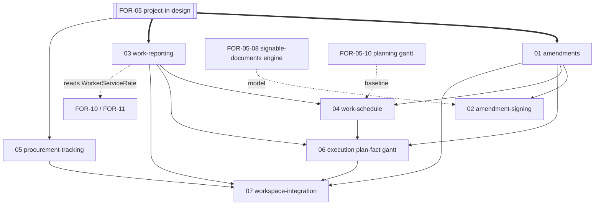

# FOR-06: Проект в работе / Project in progress

> **Целевое имя папки:** `FOR-06-project-in-progress` (переименование из
> `FOR-06-work-schedule`). Папка сейчас физически называется `FOR-06-work-schedule`;
> переименование — отдельный шаг (затрагивает `.config.kiro` `featureName` и все перекрёстные
> ссылки из FOR-05/07/10/11), выполняется по явному запросу. До переименования этот OVERVIEW
> живёт в существующей папке.

## Обзор

FOR-06 — родительская спека **стадии исполнения проекта** (проект переведён в работу после
подписания договора, `Project.status` = `ACTIVE`/исполнение). Она покрывает всё, что
происходит **после** того, как FOR-05 (стадия проектирования, `DRAFT`) завершилась
подписанием договора.

FOR-06 не заводит собственное пространство проекта — оно **переиспользует единое пространство
проекта FOR-05** (`/projects/:projectId`), добавляя табы стадии исполнения. Граница между
FOR-05 и FOR-06 — **факт подписания договора**; стадийный резолвер табов
(`resolveWorkspaceTabs`, FOR-05-01) переключает набор табов по `Project.status`.

Источник правды для доменной модели — тот же Excel клиента
(`docs/Matrix Foremen v3.0 (1).xlsx`, лист `Oferta`): в части амендментов (изменения) и
понедельного прогресса работников. Ценовая и сметная модель принадлежит FOR-05; FOR-06 её
**читает** и добавляет исполнительные дельты (амендменты) и факт (отчётность).

## Скоуп FOR-06 (стадия исполнения)

- **Подготовка амендментов** — изменения объёмов, дат, цен относительно подписанной сметы.
- **Подписание амендментов** — через обобщённый движок подписываемых документов (модель —
  FOR-05-08 `SignableDocument`/`DocumentSignature`; тип «Анекс/Aneks»).
- **Отчётность работников** — `WorkReport` (работник · проект · работа · комнаты 0..n ·
  интервал · аппрув прораба · revenue-цена клиенту · cost-цена работнику · маржа).
- **Обновление Гант-графика** — двумя путями:
  - **авто** — из подтверждённой отчётности работников (факт двигает план-факт);
  - **вручную** — из подготовки амендментов (изменение дат/объёмов → перепланирование).
- **Трекинг закупок** — закупки/поставки, статусы, приёмка (источник потребности — BoM/смета
  FOR-05-05).

## Табы стадии исполнения (в пространстве проекта FOR-05)

| Таб стадии исполнения | Назначение | Спека-владелец |
|-----------------------|------------|----------------|
| Закупки (Zakupy) | Трекинг закупок/поставок, статусы, приёмка | FOR-06 (procurement) |
| План/факт Гант (Plan/wykonanie) | Наложение план vs факт + % выполнения; авто/ручное обновление графика | FOR-06 (schedule) |
| Отчётность (Raporty pracy) | Список `WorkReport` + аппрув прораба; объём/заработок для работника | FOR-06 (work-reporting) |
| Подписание амендментов (Aneksy) | Подготовка + подписание амендментов | FOR-06 (amendments) + движок FOR-05-08 |
| Первичные документы (Dokumenty źródłowe) | Первичка/бухгалтерия | FOR-10 (встраивается) |
| Расчёт ЗП (Rozliczenie wynagrodzeń) | Выплаты работникам по аппрувнутым `WorkReport` | FOR-11 (встраивается) |

## Дочерние спеки FOR-06 (стадия исполнения)

> Часть из этого была ранее размечена в FOR-05 (амендменты, отчётность работников,
> встраивание исполнительных табов, исполнительная часть Ганта) и трекинг закупок (был
> отдельной верхнеуровневой FOR-07). Здесь они собраны под FOR-06 как единая стадия исполнения. Номера ниже — предварительные; уточняются при заведении
> конкретных дочерних спек.

| # | Дочерняя спека | Тип | Область | Читает из FOR-05 |
|---|----------------|-----|---------|------------------|
| 01 | `FOR-06-01-amendments` | full-stack | `EstimateAmendment`, `AmendmentLine`, пересчёт дельт объёмов/дат/цен относительно подписанной сметы; ценовые дельты хранятся в самих строках амендмента | Смета и цены строк (FOR-05-03/05), оффер (FOR-05-07) |
| 02 | `FOR-06-02-amendment-signing` | full-stack | Подписание амендментов через обобщённый движок подписываемых документов (тип «Анекс/Aneks») | Движок `SignableDocument`/`DocumentSignature` (FOR-05-08) |
| 03 | `FOR-06-03-work-reporting` | full-stack | Обогащённый `WorkReport` (revenue-сторона + `WorkReportRoom` разбивка по комнатам + аппрув прораба), сводка прогресса, ABAC `WORK_REPORTS`; cost-сторона читает `WorkerServiceRate` | Цены строк сметы (FOR-05-03/05) с учётом подписанных амендментов (01), состав работ/смета (FOR-05-03/05), команда (FOR-05-09) |
| 04 | `FOR-06-04-work-schedule` | full-stack | Гант-график исполнения: данные графика, календари; **обновление плана-факта авто из отчётности (03) и вручную из амендментов (01)** | Планировочный Гант-эстимация (FOR-05-10: `project_schedules` + `project_schedule_bars`, якорь `projects.start_date`) как база |
| 05 | `FOR-06-05-procurement-tracking` | full-stack | Закупки/поставки, статусы, приёмка (ранее верхнеуровневая FOR-07) | BoM/смета (FOR-05-05) как источник потребности |
| 06 | `FOR-06-06-execution-plan-fact-gantt` | frontend | Таб «План/факт Гант» с наложением план vs факт и % выполнения (исполнительная часть планировочного Ганта FOR-05-10) | Планировочный Гант (FOR-05-10), отчётность (03), амендменты (01) |
| 07 | `FOR-06-07-workspace-integration` | frontend | Встраивание исполнительных табов в пространство проекта FOR-05 (закупки, план-факт, первичка FOR-10, расчёт ЗП FOR-11) | Оболочка пространства (FOR-05-01) |

## Граф зависимостей (стадия исполнения)

## Рекомендуемый порядок разработки

1. **01 amendments** — модель дельт поверх подписанной сметы/цен (нужна как база подписания и графика).
2. **02 amendment-signing** — после 01 и после готового движка `SignableDocument` (FOR-05-08).
3. **03 work-reporting** — параллельно 01; revenue-сторона по ценам строк сметы (FOR-05-03/05) с учётом амендментов (01).
4. **04 work-schedule** — после 01/03 (авто из отчётности, ручное из амендментов).
5. **05 procurement-tracking** — параллельно (источник потребности — BoM FOR-05-05).
6. **06 execution plan-fact gantt** — после 03/04.
7. **07 workspace-integration** — в конце, встраивание всех исполнительных табов + FOR-10/11.

## Предпосылки (жёсткие зависимости)

- **FOR-05 (стадия проектирования)** — подписанный договор, смета и цены строк (03/05),
  оффер (07), движок подписываемых документов (08), подбор команды (09), планировочный Гант (10).
- **FOR-05-01 workspace-shell** — единое пространство проекта и стадийный резолвер табов.
- **FOR-10 (финансы) / FOR-11 (зарплаты)** — владеют `WorkerServiceRate` (cost-сторона) и
  расчётом выплат; FOR-06 отчётность поставляет им аппрувнутые `WorkReport`.
- **FOR-01/02/03** — CRUD-фреймворк, ABAC, `ProjectScopedService`, `@PermissionResource`.
- Объектное хранилище / e-подпись — через FOR-12 (для подписания амендментов и медиа).

## Заметка о миграции разметки

Эта разметка переносит из FOR-05 в FOR-06 следующие ранее числившиеся за FOR-05 пункты:

- амендменты (подготовка + подписание) → FOR-06-01 / FOR-06-02;
- отчётность работников → FOR-06-03;
- исполнительная часть Ганта → FOR-06-04 / FOR-06-06 (планировочная часть-эстимация остаётся
  в FOR-05 как **FOR-05-10-project-gantt**);
- встраивание исполнительных табов → FOR-06-07;
- бывш. верхнеуровневая **FOR-07-procurement-tracking** → FOR-06-05.

Перенос — на уровне планирования; физического перемещения кода нет. Номера прежней разметки
FOR-05 не используются: текущие дочерние спеки FOR-05 — 01…11 (см. `FOR-05-project-estimate/OVERVIEW.md`).

---

*Обновляется при добавлении/изменении/завершении дочерних спек FOR-06 (стадия исполнения).*
