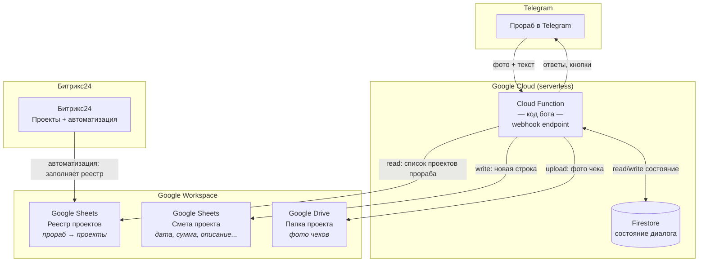
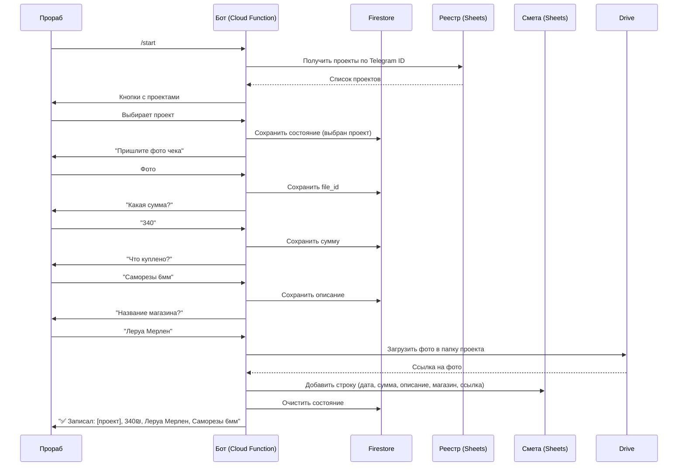

# Архитектура Telegram-бота для сбора счетов

## Минимальный стек

- **Код:** Python (aiogram/python-telegram-bot) или Node.js (grammY/Telegraf)
- **Хостинг:** Google Cloud Functions (webhook mode) — 0 инфраструктуры
- **Хранение состояния:** Firestore (free tier) или отдельный лист Google Sheets
- **Внешние API:** Google Drive API, Google Sheets API
- **Авторизация:** Google Service Account (JSON-ключ)

## Диаграмма

## Поток данных (сценарий)

## Что нужно сделать

| # | Задача | Сложность |
|---|--------|-----------|
| 1 | Создать Google Service Account + расшарить таблицы/папки | Настройка |
| 2 | Создать Telegram бота через @BotFather | 2 мин |
| 3 | Написать код бота (webhook handler) | ~200-300 строк |
| 4 | Задеплоить в Cloud Functions | 1 команда |
| 5 | Настроить webhook URL в Telegram | 1 API-вызов |

## Альтернатива: ещё проще (без Firestore)

Если хочется совсем без доп. сервисов — состояние диалога можно хранить
в отдельном листе того же Google Sheets (лист "bot_state").
Это чуть медленнее, но убирает зависимость от Firestore.

В этом случае весь бот зависит только от:
- ✅ Google Cloud Function (бесплатно)
- ✅ Google Sheets (бесплатно)
- ✅ Google Drive (бесплатно, 15GB)
- ✅ Telegram Bot API (бесплатно)

**Итого: $0/мес при нормальной нагрузке (до ~100 чеков/день).**
